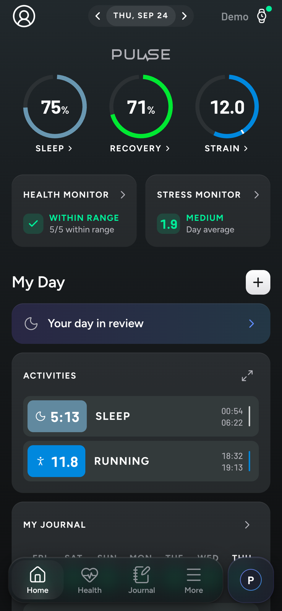
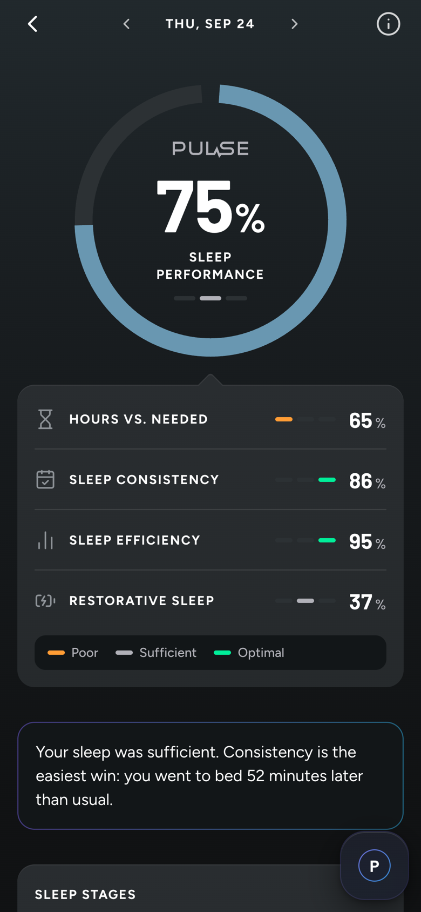
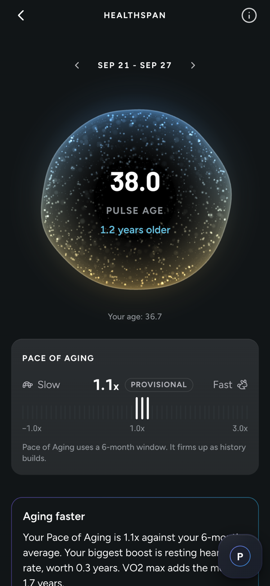
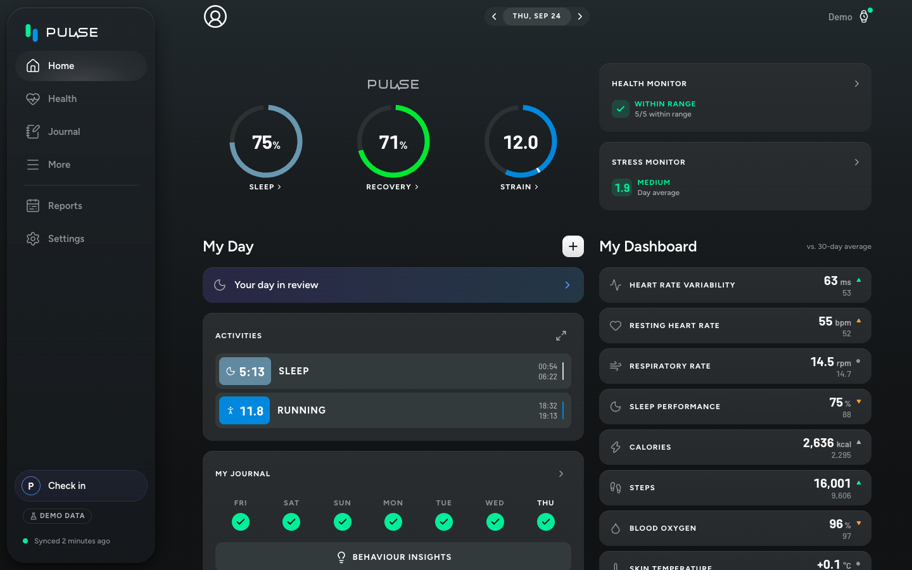
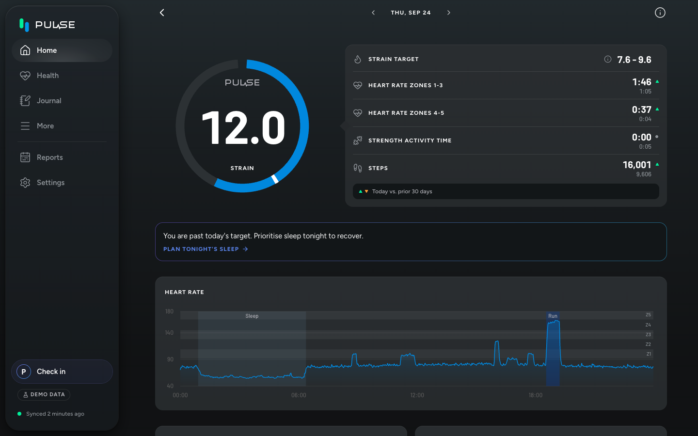
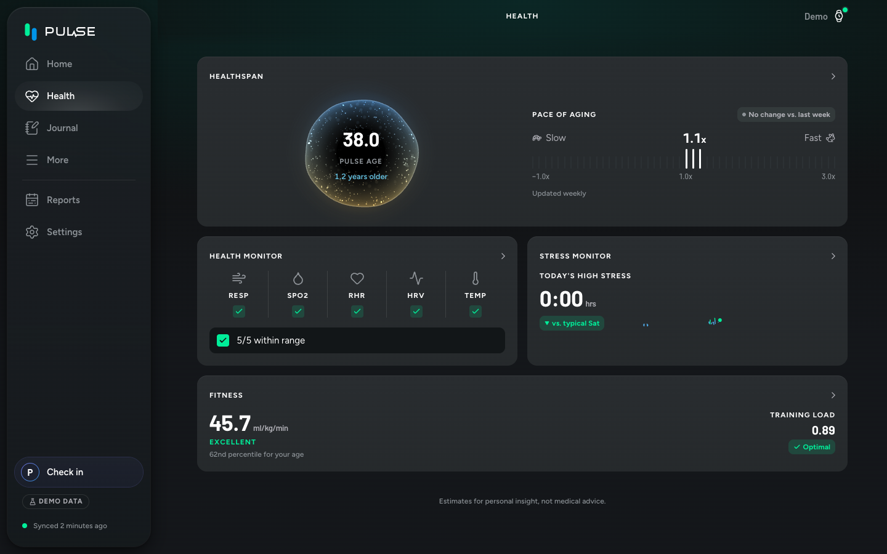

# Pulse

A WHOOP-style personal health app for the Fitbit Air: one Next.js app (frontend, sync worker and scoring) on SQLite.
See `docs/plans/` for the plan.

## Screenshots

Demo mode, seeded data.

<p>
  
  
  
</p>





## Run in demo mode

Demo mode generates deterministic data into `data/demo.db`, so no Google account is needed.

```sh
pnpm install
cp .env.example .env   # GOOGLE_OAUTH_ENABLED=false and DEV_ACCESS_BYPASS=1 are already set
pnpm dev               # http://localhost:3000, health check at /healthz
```

The database is created and migrated on boot, and the sync worker starts once (`[worker] started (source: seed)`).

## Environment

Every variable is listed and explained in [`.env.example`](.env.example). It is validated at startup, and the server exits on invalid config.

- `GOOGLE_OAUTH_ENABLED=true` switches to the Google Health API and `data/pulse.db`. It needs `GOOGLE_CLIENT_ID`, `GOOGLE_CLIENT_SECRET` and `APP_URL`.
- `CF_ACCESS_TEAM_DOMAIN` and `CF_ACCESS_AUD` are required unless `DEV_ACCESS_BYPASS=1`. The bypass is only accepted under `next dev`.

## Deploy

Production runs as one container on the server, behind Cloudflare Tunnel and Cloudflare Access, with no published ports. For Google Cloud setup, Cloudflare, `docker compose`, backups and troubleshooting, see [`docs/runbook.md`](docs/runbook.md).

## Commands

| Command | What it does |
|---|---|
| `pnpm dev` | Dev server |
| `pnpm build` / `pnpm start` | Production build (standalone output) and server |
| `pnpm lint` | ESLint |
| `pnpm typecheck` | Generates Next route types, then `tsc --noEmit` |
| `pnpm test` / `pnpm test:watch` | Vitest (Node for `*.test.ts`, happy-dom for `*.test.tsx`) |
| `pnpm e2e` | Playwright |
| `pnpm db:generate` | Generates a migration in `drizzle/` from `src/server/db/schema.ts` |

## License

[PolyForm Noncommercial 1.0.0](LICENSE). Use it, change it and share it for any noncommercial purpose. Selling it, or putting it inside a commercial product, is not allowed.

## Credits

- [noop](https://github.com/ryanbr/noop): the recovery, strain, sleep and readiness scoring is ported from its analytics engine.
- [Hælan](https://github.com/bardesss/haelan): its notes on how the Google Health API behaves saved a lot of trial and error.

