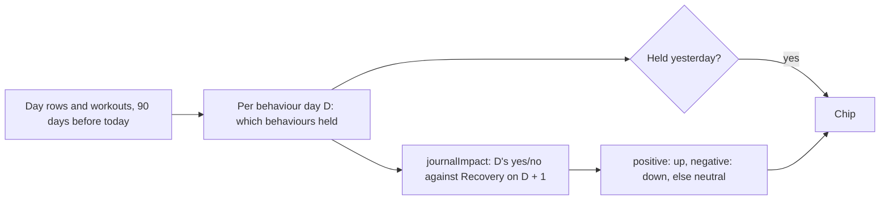

# Behavior chips

Code: `src/core/algorithms/behaviorChips.ts`. Tests: `behaviorChips.test.ts`. Built by `getRecovery` in `src/server/queries/recovery.ts`. UI: the Behavior Insights card on Recovery (spec §11 R34).

The reference app's Recovery screen lists "behaviors from yesterday" as chips, each marked as having helped, hurt or done nothing for today's Recovery. Pulse needs no journal answers for these: it reads four behaviours from data it already has. The tone of each chip comes from the user's own history through [journal impact](journal-impact.md). The behaviour is treated as a journal tag answered every day, and the comparison is the next day's Recovery after days with it against days without it.

## Flow

## Behaviours

A behaviour day D pairs with Recovery on D + 1, as journal answers do.

| Key | Chip | Holds on day D when |
|---|---|---|
| `sleep86` | 86%+ Sleep Performance | the night that ends on D + 1 scored 86% or more |
| `strain7` | 7+ Strain | D's Day Strain is 7.0 or more |
| `earlyWorkout` | Early Workout | a workout on D started before 08:00 local time |
| `consistentWake` | Consistent Wake Time | the wake time on D + 1 is within 30 minutes of the median of the 14 wakes before it |

A behaviour that cannot be known on a day is left out for that day (no night, no strain), the same as an unanswered journal tag.

## Tone

`journalImpact(entries, outcomes, asOf = today)` gives each behaviour a label on next-day Recovery: `positive` reads "up" (green), `negative` reads "down" (orange), and `no_clear_effect` or `not_enough_data` read "neutral" (grey dot). Its 90-day window, the minimum of 5 days on each side, and the bootstrap confidence interval all apply unchanged. Like journal impact, this is an association, not a cause.

## Order

Chips keep a fixed order: sleep, strain, workout, wake time. Only behaviours that held yesterday are shown. With none, the card is left off.
