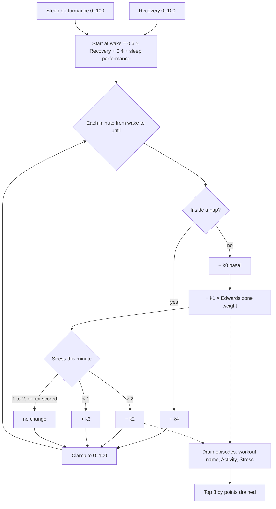

# Energy Bank

Code: `src/core/algorithms/energyBank.ts`. Tests: `energyBank.test.ts`.

The Energy Bank is a 0–100 reserve for the waking day. It starts at wake from how well you recovered and slept. Time awake, heart-rate load and high stress spend it. Calm, still minutes and naps put a little back. The output is the intraday curve, the current value and the three biggest drains.

It is a heuristic with no published model behind it: the shape follows Bevel's Energy Bank, and the constants are tuned against the seed so that a typical day ends between 15 and 40.

## Flow

## Formula

1. **Start.** E₀ = clamp(0.6 · Recovery + 0.4 · sleep performance, 0, 100) at the minute of wake, which is the main sleep's end.
2. **Each minute** *m* from wake until `until`:
   - **Inside a nap:** E += k₄. Nothing else applies.
   - **Otherwise:**
     - E −= k₀, the basal drain of being awake.
     - E −= k₁ × w(m), where w(m) is the Edwards zone weight, 0–5, of the minute's mean HR (`strain.zoneWeight`, by Karvonen %HRR).
     - If the minute's stress is ≥ 2, E −= k₂. If it is < 1 (calm and still), E += k₃. Medium stress and unscored minutes change nothing.
   - Clamp E to [0, 100].
3. **Curve.** `curve[m]` is E at the end of minute *m*, and is `null` before wake and from `until` on. `current` is the last computed level.
4. **Drains.** Every k₁ or k₂ deduction is attributed to an episode:
   - HR load inside a workout goes to that workout's label, for example "Tempo run";
   - other HR load goes to "Activity";
   - high stress goes to "Stress".

   Minutes with the same label join one episode when the gap between them is at most 5 minutes. `topDrains` is the three episodes with the most points drained, largest first. The basal drain is not an episode, since it would top the list every day.

**The basal drain k₀ is not in the plan's spec.** Without it, a weekend rest day has almost no HR load and no stress, and it recharges all day from calm minutes, so it ends *above* where it started. That is the opposite of what a reserve should do. One extra constant fixes it.

## Inputs

| Input | Unit | Notes |
|---|---|---|
| `start` | unix seconds | Local midnight; the same minute grid as `stress()`. |
| `wake` | unix seconds | The main sleep's end. |
| `until` | unix seconds | Tonight's main-sleep start once known, else now (for today), else the day's end. |
| `recovery` | 0–100 | Today's Recovery. Without one, U10 gives the Energy Bank a reason code. |
| `sleepPerformance` | 0–100 | Last night's sleep performance. |
| `load` | zone weight 0–5 per minute, or null | `minuteLoad(minuteMeanHr(hr, start, end), restingHR, maxHR)`, with the same resting HR and HRmax as Strain. |
| `stress` | 0–3 per minute, or null | `stress(...).minutes`. |
| `naps` | `{ start, end }[]` | Non-main sleep sessions after wake. |
| `workouts` | `{ start, end, label }[]` | Optional; only for drain labels. |

## Constants

All of these live in `energyBankConfig`.

| Constant | Value | Kind |
|---|---|---|
| `wRecovery`, `wSleep` | 0.6, 0.4 | spec |
| `k0` | 0.04 per awake minute | *tunable*: 16 h awake costs 38 points |
| `k1` | 0.08 per minute per zone weight | *tunable*: a 45 min tempo run at about zone 3 costs 11–13 |
| `k2` | 0.08 per high-stress minute | *tunable*: an hour of high stress costs 4.8 |
| `k3` | 0.01 per calm still minute | *tunable*: 400 calm minutes give back 4 |
| `k4` | 0.25 per nap minute | *tunable*: a 30 min nap gives back 7.5, plus the 1.2 basal it skips |
| `episodeGapMin` | 5 | *tunable* |
| Stress thresholds | 1, 2 | from `stressConfig` |

**Calibration.** The constants were swept on `data/demo.db` with Recovery fixed at 60, because the demo DB had no `daily_scores` yet. Sleep performance came from `restFromTotals` on each main sleep. Over 178 scored days, the end-of-day level was:

| p10 | p25 | median | p75 | p90 | in [15, 40] |
|---|---|---|---|---|---|
| 14.2 | 20.9 | 27.2 | 31.3 | 36.8 | 152 of 178 |

The days below 15 are the training block (two sessions or long rides), the short-sleep week and the hardest weekday sessions. The days above 40 are the illness week, with naps and no workouts, and quiet weekend days. With real Recovery, the training block and illness days start lower, so their ends drop further. Re-check this table once U10 writes real Recovery.

## Edge rules

- **Wake before `start`** starts the curve at minute 0. **`until` before wake** gives an empty curve, and `current` is the start level.
- **A nap overlapping a workout** counts as a nap.
- **Clamping** applies each minute, so a drained bank recharges from 0, not from a negative value. Drain amounts are nominal, before clamping.

## Worked examples

1. **The test day.** Recovery 70 and sleep performance 80 give E₀ = **74**. Awake 07:00–23:00 at medium stress with no load, it ends at 74 − 960 × 0.04 = **35.6**. A workout at zone weight 3 for 18:00–19:00 costs another 60 × 3 × 0.08 = 14.4, ending at **21.2**, and tops the drains as its own label.
2. **Seeded Wednesday, 2026-09-30, a rest day.** Sleep performance 87 gives E₀ = 70.8. It ends at **30.9**. Top drains: Stress 2.6, Stress 1.4, Activity 0.6.
3. **Seeded Saturday, 2026-09-26, with a ride.** E₀ = 71.9. It ends at **25.9**. Top drains: Ride 11.5, Activity 0.6, Stress 0.2.

## Sources

- Edwards S. *The Heart Rate Monitor Book*. 1993. Zone weights 1–5 by %HRR, ported in `src/core/scoring/strain.ts`.
- Bevel Energy Bank: the design target only; no coefficients are used.
