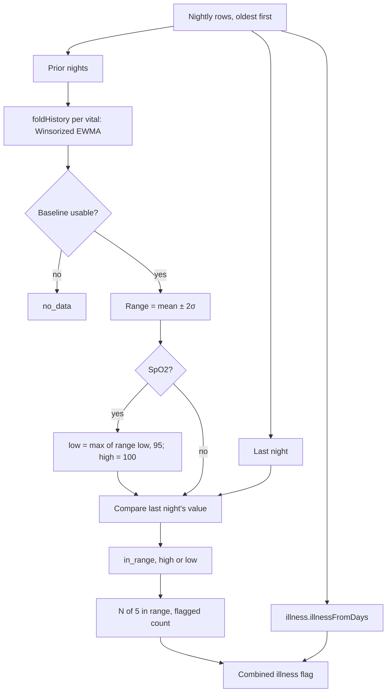

# Health Monitor

Code: `src/core/algorithms/healthMonitor.ts`. Tests: `healthMonitor.test.ts`.

The Health Monitor checks last night's five vitals against your own normal ranges and shows "N of 5 in range". The vitals are resting HR, HRV, respiratory rate, SpO2 and skin-temperature deviation. Each range is your baseline mean ± 2σ, and SpO2 also has a fixed floor of 95 %. noop's illness signal is shown alongside as a combined flag. This is a wellness view, not a diagnosis.

## Flow

## Formula

1. **Baselines.** For each vital, fold the prior nights' values, oldest first and excluding last night, through `baselines.foldHistory` with that vital's `MetricCfg`. This gives a Winsorized EWMA centre and spread, with hard outliers rejected once settled.
2. **Range** = centre ± 2 × `baselines.sigma(state)`, where σ = 1.253 × spread. The floor spreads keep σ from collapsing on smooth nightly values.
3. **SpO2** is one-sided. The low bound is max(centre − 2σ, 95), and the high bound is 100, so a high SpO2 is never flagged.
4. **Status.** The value is `low` below the range, `high` above it, and `in_range` otherwise. It is `no_data` when last night has no value or the baseline is not usable (fewer than 4 accepted nights, or stale).
5. **Counts.** `inRange` is the number of `in_range` vitals, shown as "N of 5". `flagged` is the number that are high or low.
6. **Illness.** `illness.illnessFromDays(days, journal)` runs over the same rows. It z-scores RHR, HRV, skin temperature and respiration against the 30 prior nights, and it is quiet until 14 of those nights have RHR or HRV. SpO2 is not one of its signals.

## Inputs

| Input | Unit | Notes |
|---|---|---|
| `days` | rows, oldest first | The last row is the night shown. Fields: `rhr` (bpm), `hrv` (ms), `resp` (breaths/min), `spo2` (%) and `skinTempDev` (°C). |
| `skinTempDev` | °C | `nightly_temp_c` minus our causal skin-temperature baseline: the same deviation Recovery and the illness signal use. |
| `journal` | confounders | `alcohol`, `sauna`, `travelPhaseJump` and so on, passed to the illness signal, which then reports "suppressed" instead of "raised". |

**Which RHR.** Use the same nightly resting HR as the illness signal, so the two views agree. U10 decides between `sessionRestingHR` and Google's daily value; the scale is the same either way.

## Constants

| Constant | Value | Kind |
|---|---|---|
| `healthMonitorConfig.rangeSigmas` | 2 | spec |
| `healthMonitorConfig.spo2FloorPct` | 95 | spec; a common cut-off for normal resting SpO2 |
| `healthMonitorConfig.spo2Cfg` | plausible 70–100, floor spread 0.5 | *tunable*; there is no noop config for SpO2 |
| `healthMonitorConfig.skinTempDevCfg` | plausible −5 to 5 °C, floor spread 0.3 | *tunable*; `skin_temp`'s floor, with bounds for a deviation |
| RHR, HRV, respiration configs | floor spreads 2 bpm, 5 ms, 0.5 | noop: `Baselines.kt` (`metricCfg`) |

**The floors set the narrowest range.** At each floor, ±2σ is about ±5.0 bpm for RHR, ±12.5 ms for HRV, ±1.25 for respiration, ±1.25 points for SpO2 and ±0.75 °C for skin temperature.

## Edge rules

- **Fewer than 4 prior nights** with a value make that vital `no_data`, with no range.
- **A stale baseline** (no value for more than 14 nights) is also `no_data`, until it has refreshed.
- **`inRange` never counts `no_data`**, so a sparse night can show "3 of 5" with nothing flagged. The UI should show the no-data vitals as such, not as out of range.

## Worked examples

1. **Ordinary night** (a test). Forty nights with RHR around 55, HRV 60, respiration 14.5, SpO2 97 and skin temperature ±0.1 °C. A night at those values is **5 of 5**, with the illness signal quiet.
2. **SpO2 94** (a test). Nights alternate 92 and 98, so the personal range is wide and includes 94. The floor still makes it **low**, with range [95, 100].
3. **The seeded illness peak, 2026-08-04 in `data/demo.db`:**

   | Vital | Value | Range | Status |
   |---|---|---|---|
   | Resting HR | 62 | 51.4–61.8 | high |
   | HRV | 40.8 | 36.2–66.6 | in range |
   | Respiration | 16.3 | 13.5–16.0 | high |
   | SpO2 | 93.5 | 95.0–100 | low |
   | Skin temp | +0.4 | −0.7 to +0.8 | in range |

   That is **2 of 5 in range, 3 flagged**, and the illness signal is **raised** (score 63). The day before, it is raised too, with SpO2 low only. The test builds the same peak from the seed's `EFFECTS.illness` on a flat history, and it flags at least 3 of 5.

## Sources

- noop (`ryanbr/noop`), `Baselines.kt` (Winsorized EWMA, floor spreads), `IllnessSignalEngine.kt` and `V5HealthSignals.kt`, ported in `src/core/scoring/baselines.ts` and `illness.ts`.
- SpO2 floor: 95 % is the plan's spec, a common clinical cut-off for normal resting saturation at sea level. It is not taken from one paper.
- WHOOP Health Monitor: the design target only.
