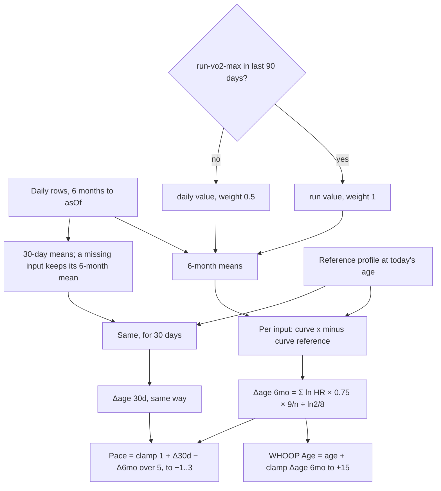

# Healthspan: WHOOP Age and Pace of Aging

Code: `src/core/algorithms/healthspan.ts`. Tests: `healthspan.test.ts`.

This is an estimate built from published population hazard ratios. It is not a clinical biological age, and the UI labels it as an estimate (KTD8). The method follows noop's `VitalityEngine.kt`. Each input maps to an all-cause-mortality log hazard ratio against a reference person. The terms are summed and shrunk for overlap, then turned into years with the Gompertz law. Ours differs from noop in the inputs, in the dose-response curves (pinned below from the papers), and in the gates.

## Flow

## Formula

For each input *i* that has data in the window:

- ln HRᵢ = wᵢ · (fᵢ(xᵢ) − fᵢ(refᵢ)), where fᵢ is the piecewise-linear curve below. It is linear between knots and flat beyond the end knots.
- wᵢ = 1, except VO2max from `daily-vo2-max`, where w = 0.5.
- For steps, xᵢ is first capped at the age plateau, so steps above it earn nothing.

Then, with *n* inputs present out of 9:

- Δage = (Σ ln HRᵢ) × 0.75 × (9 / n) ÷ (ln 2 / 8)
- each input's contribution in years = ln HRᵢ × 0.75 × (9 / n) ÷ (ln 2 / 8). The contributions sum to the unclamped Δage.
- WHOOP Age = age + clamp(Δage₆ₘₒ, −15, +15).
- Pace of Aging = clamp(1 + (Δage₃₀d − Δage₆ₘₒ) / 5, −1, 3).

Both Δage values use the reference at today's age, so flat inputs give exactly 1.0. Pace uses the unclamped Δage values, so a change still shows while WHOOP Age sits at the clamp. ln 2 / 8 = 0.0866 per year, so one unit of ln HR is about 8.66 years before the shrink, or 6.49 years after it.

## Inputs

`HealthspanDay` holds one row per local day. A null or absent field means there is no data that day. Each window takes the mean over the days that have the field.

| Input | Day field | Unit | Window value | U10 source |
|---|---|---|---|---|
| Sleep duration | `sleepHours` | h | mean | main sleep `asleep_min` / 60 |
| Sleep regularity | `sri` | SRI, −100..100 | mean | `sleepRegularityIndex` over the 7 days ending that day |
| Zones 1–3 | `zone13Min` | min/day | mean × 7 = min/week | `timeInZone` (%HRmax zones) on that day's `hr_samples` |
| Zones 4–5 | `zone45Min` | min/day | mean × 7 = min/week | same |
| Strength | `strengthMin` | min/day | mean × 7 = min/week | `exercises` with a strength type; 0 on a worn day without one |
| Steps | `steps` | steps/day | mean, capped at the plateau | `daily_metrics.steps` |
| VO2max | `vo2maxRun`, `vo2maxDaily` | mL/kg/min | mean of the chosen kind | `daily_metrics.vo2max_run`, `vo2max_daily` |
| Resting HR | `restingHr` | bpm | mean | `daily_metrics.rhr_bpm` (Google's daily value, not `sessionRestingHR`) |
| Lean mass | `weightKg`, `bodyFatPct` | kg, % | mean FFMI over days with both = weight × (1 − fat/100) / height² | `daily_metrics.weight_kg`, `body_fat_pct`; height from the profile |

The profile has `age` (years on `asOf`, and fractions are fine), `sex`, and `heightCm`. Without a height, the lean-mass term drops. The config has no height variable yet.

**VO2max source rule.** If any `vo2maxRun` exists in the 90 days to `asOf`, the term uses the window mean of `vo2maxRun` at weight 1. Otherwise it uses the mean of `vo2maxDaily` at weight 0.5 (*tunable*). Google's daily VO2max is probably estimated mainly from resting HR, which is already its own term, so full weight would count resting HR twice. The result reports which source was used.

## Dose-response curves

Each row is [x, HR]. The code stores ln HR. When a paper gives a continuous dose-response, the knots follow it. When it gives only category HRs, the knots sit at the category medians or midpoints. Approximations are marked.

| Input (unit) | Knots [x, HR] | Source | Exact or approximated |
|---|---|---|---|
| VO2max (mL/kg/min) | [10, 1], [80, 0.87²⁰] | Kodama 2009: RR 0.87 (0.84–0.90) per 1-MET higher, all-cause | Exact log-linear per MET (1 MET = 3.5 mL/kg/min), extended over 10–80 |
| Resting HR (bpm) | [45, 1], [105, 1.09⁶] | Zhang 2016: RR 1.09 (1.07–1.12) per 10 bpm; linear from 45 bpm | Exact log-linear, flat outside 45–105 |
| Steps (steps/day) | [3553, 1], [5801, 0.60], [7842, 0.55], [10901, 0.47] | Paluch 2022: quartile medians and HRs vs Q1 | Approximated from quartiles; the age plateau (8–10k under 60, 6–8k at 60+) is applied as a cap |
| Sleep duration (h) | [5, 1.12], [7, 1], [8, 1], [9, 1.30] | Cappuccio 2010: short RR 1.12 (1.06–1.18), long RR 1.30 (1.22–1.38) vs a 7–8 h reference | Approximated. Studies defined short as < 7 to ≤ 5 h and long as > 8 to ≥ 10 h, so the pooled RRs are placed at 5 h and 9 h |
| SRI | [65.10, 1], [75.62, 0.80], [80.99, 0.75], [85.22, 0.72], [89.80, 0.70] | Windred 2024, Table 1 (quintile median SRI) and Table 2 (full model, all-cause HR vs Q1) | Approximated from quintiles; flat below the Q1 median, so it is conservative for very irregular sleep |
| Zones 1–3 (min/week) | MVPA min/day × 7: [0, 1], [2, .89], [4, .79], [6, .70], [8, .62], [10, .56], [12, .50], [14, .46], [16, .43], [18, .41], [20, .40], [22, .40], [24, .39] | Ekelund 2019, Supplementary Table 5: MVPA spline, HR vs the least-active median (≈ 0 min/day) | Exact published spline points. Treating zones 1–3 as MVPA is an approximation, see below |
| Zones 4–5 (min/week) | [0, 1], [112, 0.81], [225, 0.81 × 0.97] | Lee 2022: vigorous LTPA, mutually adjusted for moderate. 75–149 min/week → 0.81 (0.76–0.87); 150–299 → "2–4 % lower" than meeting the guideline; ≥ 300 no further benefit | Approximated at category midpoints, with 3 % taken for "2–4 %" |
| Strength (min/week) | [0, 1], [40, 0.83], [140, 1] | Momma 2022: J-shaped dose-response, lowest RR 0.83 (0.79–0.86) at 40 min/week, RR < 1 up to about 140 min/week | Approximated from the reported nadir and crossing point; not extrapolated past 140 |
| Lean mass, FFMI (kg/m²) | [16.1, 1], [21.9, 0.70] | Sedlmeier 2021 (7 cohorts, BIA): FFMI 21.9 vs 16.1 → HR 0.70 (0.56–0.87), adjusted for fat mass | Approximated as log-linear between the two reported points |

Notes on the choices:

- **Zones 1–3 against Ekelund MVPA.** Ekelund's MVPA is accelerometer time at ≥ 3 METs. Zones 1–3 are 50–80 % HRmax. Zone 1 is lighter than moderate, so this term saturates easily: the spline is flat from about 24 min/day. Ekelund's cohorts were older (mean age 63) and its HRs are large, so this term is mostly a penalty for inactivity.
- **Zones 4–5 against Lee 2022.** Lee's vigorous HRs are adjusted for moderate activity, so this term is the extra benefit of vigorous time on top of the zones 1–3 term, rather than a second count of the same minutes. Ekelund reports vigorous time only in thirds, without minutes.
- **Strength J-shape.** Momma's authors call the high-volume upturn "unclear". The curve follows it up to 140 min/week, so beyond 40 min/week the term slowly gives back its benefit. To drop the upturn, replace the last knot with [140, 0.83].
- **Sleep duration.** Cappuccio's durations were self-reported, which usually reads longer than wearable asleep time. A wearable 6.8 h therefore falls slightly more often in "short" than the study would place it.
- **Lean mass needs height.** All lean-mass cohorts index lean mass by height² (FFMI) or adjust for body size. Absolute lean kilograms mostly measure body size. Lee 2018 (BMJ, men only) used absolute predicted lean mass and found a U-shape with HR 0.87 per SD up to 56 kg; we did not use it because it covers men only and lean mass was predicted rather than measured.

## Reference profile

The reference profile maps to WHOOP Age = chronological age. It is a fit person, not an average one, so most people score older than their age.

| Input | Reference | Basis |
|---|---|---|
| VO2max | FRIEND 75th percentile for age and sex, linear between decade midpoints | Kaminsky 2015 (see `fitness-level.md`); spec |
| Steps | 10,000 under 60, 8,000 at 60 and over | Paluch 2022 plateau, upper end for under 60, upper end for 60+ |
| Resting HR | 60 bpm (*tunable*) | Bottom of the conventional 60–100 normal range; Zhang's 60–80 bpm category is RR 1.12 vs the lowest |
| Sleep duration | 7.5 h (*tunable*) | Middle of Cappuccio's 7–8 h reference band; any value in 7–8 h scores the same |
| SRI | 86.3 (*tunable*) | 75th percentile of UK Biobank SRI (Windred 2024: median 81.0, IQR 73.8–86.3) |
| Zones 1–3 | 150 min/week (*tunable*) | WHO 2020: 150–300 min/week moderate activity |
| Zones 4–5 | 75 min/week (*tunable*) | WHO 2020: 75–150 min/week vigorous activity |
| Strength | 40 min/week (*tunable*) | Momma 2022 nadir; WHO 2020 asks for strength work on 2 or more days a week |
| Lean mass (FFMI) | men 18.9, women 15.4 kg/m² (*tunable*) | Schutz 2002, median FFMI at 18–34 y (BIA) |

## Constants

All of these live in `healthspanConfig`, except the curves, which live in `curves`.

| Constant | Value | Kind |
|---|---|---|
| `overlapShrink` | 0.75 | *tunable*; noop `VitalityEngine.kt` uses 0.75 for correlated inputs |
| `doublingYears` | 8 | cited: Finch 1990, a human mortality-rate doubling time of about 8 years (Gompertz) |
| `clampYears` | 15 | *tunable* (spec) |
| `paceScaleYears` (S) | 5 | *tunable* (spec) |
| `paceMin`, `paceMax` | −1, 3 | *tunable* (spec) |
| `dailyVo2maxWeight` | 0.5 | *tunable* (spec) |
| `runVo2maxLookbackDays` | 90 | spec |
| `ageWindowDays` | 180 | spec ("6 months") |
| `paceWindowDays` | 30 | spec |
| `minDays` | 20 | spec: provisional below this many days with any input |
| `minTerms` | 5 | *tunable*: no result below 5 of 9 inputs, since 9/n renormalization would multiply 1–4 terms by 2.25–9 |
| `stepsPlateau` | 10,000 / 8,000 | cited: Paluch 2022 |
| `reference.*` | see the table above | *tunable* targets |

## Gates and edge rules

- **Provisional.** The result is provisional when fewer than 20 days in the 6-month window have any input.
- **Pace provisional.** Pace of Aging is provisional until the first day with data is at least 180 days before `asOf`. Before 30 days of data, both windows hold the same days, so Pace is 1.0.
- **No result.** The function returns null when the 6-month window has fewer than `minTerms` inputs, or when `asOf` is not a valid date.
- **Missing inputs** drop, and the rest renormalize by 9 / n.
- **The 30-day window** starts from the 6-month means and overwrites each input that has data in the last 30 days. A sparse input such as a monthly weigh-in therefore keeps its 6-month value instead of dropping out. Both windows hold the same inputs, so their renormalization matches.
- **Window bounds.** Days after `asOf`, and days 180 or more days before it, are ignored.

## Worked examples

All examples are for a man aged 35, 1.80 m, so the VO2max reference is 49.2. Each one is also a test, or uses the numbers that a test checks.

**1. The reference profile.** Every input is at the reference: 7.5 h sleep, SRI 86.3, 150 / 75 / 40 min a week, 10,000 steps, VO2max 49.2 (run), resting HR 60, and 76.5 kg at 20 % fat (FFMI 18.9). Every contribution is 0, so WHOOP Age is 35.0 and Pace is 1.0.

**2. Resting HR 70.** This is +1 × ln 1.09 = 0.0862 of ln HR, giving +0.0862 × 0.75 ÷ 0.0866 = **+0.75 years**. Without a height, the lean-mass term drops and the same 70 bpm gives 0.75 × 9/8 = **+0.84 years**.

**3. VO2max 56.2 (2 METs above the reference).** This is 2 × ln 0.87 = −0.279, giving **−2.41 years** from `run-vo2-max`. The same value from `daily-vo2-max` gives **−1.21 years**.

**4. A typical week.** The inputs are VO2max 44 (run), resting HR 62, 8,500 steps, 6.8 h sleep, SRI 78, 120 min/week in zones 1–3, 30 min/week in zones 4–5, 60 min/week of strength, and 80 kg at 18 % fat (FFMI 20.25).

| Input | Value | Reference | Years |
|---|---|---|---|
| VO2max | 44 | 49.2 | +1.79 |
| Zones 4–5 | 30 | 75 | +0.73 |
| SRI | 78 | 86.3 | +0.72 |
| Steps | 8,500 | 10,000 | +0.67 |
| Zones 1–3 | 120 | 150 | +0.39 |
| Strength | 60 | 40 | +0.32 |
| Resting HR | 62 | 60 | +0.15 |
| Sleep | 6.8 | 7.5 | +0.10 |
| Lean mass | 20.25 | 18.9 | −0.72 |
| **Δage** | | | **+4.16**, so WHOOP Age is 39.2 |

Without a height, the eight remaining terms renormalize by 9/8 and give Δage +5.48.

**5. Pace.** Take example 4, but in the last 30 days resting HR is 58 and zones 4–5 reach 75 min/week. The 6-month Δage becomes +3.98, the 30-day value is lower, and Pace is **0.83**: aging more slowly than the 6-month baseline. A resting-HR drop from 60 to 50 bpm in the last 30 days, with all else at the reference, gives Pace 0.876.

## Sources

- Kodama S, et al. Cardiorespiratory fitness as a quantitative predictor of all-cause mortality and cardiovascular events in healthy men and women: a meta-analysis. *JAMA* 2009;301(19):2024–2035. doi:10.1001/jama.2009.681
- Zhang D, Shen X, Qi X. Resting heart rate and all-cause and cardiovascular mortality in the general population: a meta-analysis. *CMAJ* 2016;188(3):E53–E63. doi:10.1503/cmaj.150535
- Paluch AE, et al. Daily steps and all-cause mortality: a meta-analysis of 15 international cohorts. *Lancet Public Health* 2022;7(3):e219–e228. doi:10.1016/S2468-2667(21)00302-9
- Cappuccio FP, et al. Sleep duration and all-cause mortality: a systematic review and meta-analysis of prospective studies. *Sleep* 2010;33(5):585–592. doi:10.1093/sleep/33.5.585
- Windred DP, et al. Sleep regularity is a stronger predictor of mortality risk than sleep duration: a prospective cohort study. *Sleep* 2024;47(1):zsad253. doi:10.1093/sleep/zsad253 (Tables 1–2)
- Ekelund U, et al. Dose-response associations between accelerometry measured physical activity and sedentary time and all cause mortality: systematic review and harmonised meta-analysis. *BMJ* 2019;366:l4570. doi:10.1136/bmj.l4570 (Supplementary Tables 3 and 5)
- Lee DH, et al. Long-term leisure-time physical activity intensity and all-cause and cause-specific mortality: a prospective cohort of US adults. *Circulation* 2022;146(7):523–534. doi:10.1161/CIRCULATIONAHA.121.058162 (abstract figures)
- Momma H, et al. Muscle-strengthening activities are associated with lower risk and mortality in major non-communicable diseases: a systematic review and meta-analysis of cohort studies. *Br J Sports Med* 2022;56(13):755–763. doi:10.1136/bjsports-2021-105061
- Sedlmeier AM, et al. Relation of body fat mass and fat-free mass to total mortality: results from 7 prospective cohort studies. *Am J Clin Nutr* 2021;113(3):639–646. doi:10.1093/ajcn/nqaa339
- Schutz Y, Kyle UUG, Pichard C. Fat-free mass index and fat mass index percentiles in Caucasians aged 18–98 y. *Int J Obes* 2002;26(7):953–960. doi:10.1038/sj.ijo.0802037
- Lee DH, et al. Predicted lean body mass, fat mass, and all cause and cause specific mortality in men. *BMJ* 2018;362:k2575. doi:10.1136/bmj.k2575 (considered, not used)
- Finch CE, Pike MC, Witten M. Slow mortality rate accelerations during aging in some animals approximate that of humans. *Science* 1990;249(4971):902–905. doi:10.1126/science.2392680
- Bull FC, et al. World Health Organization 2020 guidelines on physical activity and sedentary behaviour. *Br J Sports Med* 2020;54(24):1451–1462. doi:10.1136/bjsports-2020-102955
- noop `android/app/src/main/java/com/noop/analytics/VitalityEngine.kt` (ryanbr/noop, PolyForm Noncommercial 1.0.0): the overlap shrink and the ln 2 / 8 conversion.
