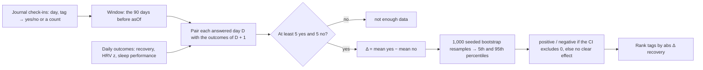

# Journal impact

Code: `src/core/algorithms/journalImpact.ts`. Tests: `journalImpact.test.ts`.

Journal impact shows how each logged behaviour (alcohol, late caffeine, meditation and so on) goes with the next day's scores. For each tag it compares days answered "yes" with days answered "no". It reports the difference in next-day recovery, HRV z-score and sleep performance, with a bootstrap confidence interval. This is a plain two-group comparison, not a causal model. It does not adjust for other tags or for training load, so the UI labels it an association ("on days after X, recovery was N lower").

## Flow

## Formula

1. **Window.** Behaviour days D with `asOf − 90 ≤ D ≤ asOf − 1`. The behaviour on day D is paired with the outcomes of day D + 1, so the newest pair ends on `asOf`. A check-in for today counts from tomorrow.
2. **Arms.** A tag present in a day's `tags` is an answer. `true` or a number above 0 is "yes"; `false` or 0 is "no". A tag missing from a day was not answered, and the day is left out for that tag.
3. **Minimum.** A tag needs at least 5 "yes" days and 5 "no" days, counted over answered days. Otherwise its status is `not_enough_data`. Each metric is then checked again on the days that have that metric the next day, for example nights without HRV, and falls back to `not_enough_data` on its own.
4. **Effect.** Δ = mean(next-day metric | yes) − mean(next-day metric | no).
5. **Confidence interval.** A percentile bootstrap: draw each arm with replacement at its own size, take the difference of means, repeat 1,000 times, and use the 5th and 95th percentiles (linear interpolation) as a 90% CI.
6. **Label.** `positive` when CI low > 0, `negative` when CI high < 0, otherwise `no_clear_effect`. All three metrics are higher-is-better, so positive means good.
7. **Ranking.** Analysed tags with a recovery effect come first, by |Δ recovery|, largest first. Then analysed tags without one, then `not_enough_data`. Ties go by tag name.

**Determinism.** The bootstrap uses mulberry32, seeded with the FNV-1a hash of `"<tag>:<metric>"`, the same generator as the seed source. Entries are sorted by day before resampling. The same data therefore always gives the same CI, whatever the input order and whichever other tags exist.

## Inputs

| Input | Shape | Notes |
|---|---|---|
| `entries` | `{ day, tags: Record<tag, boolean \| number> }[]` | One row per day with a check-in. U10 builds it from `journal_entries`, with values 0/1 or counts. |
| `outcomes` | `{ day, recovery, hrvZ, sleepPerf }[]` | One row per day, with nulls where a score is missing. Recovery and sleep performance are 0–100. `hrvZ` is the night's HRV z-score against its baseline. |
| `asOf` | `YYYY-MM-DD` | Usually today. For a report, the period's last day. |

## Outputs

`TagImpact[]`, one per tag answered in the window: `{ tag, status, nYes, nNo, effects }`. `effects` has an entry for `recovery`, `hrvZ` and `sleepPerf`, each `{ nYes, nNo, delta, ciLow, ciHigh, label }`. `delta` and the CI are null when the label is `not_enough_data`.

## Constants

| Constant | Value | Kind |
|---|---|---|
| `journalImpactConfig.windowDays` | 90 | *tunable*: the plan's 90 days, about one season |
| `journalImpactConfig.minDays` | 5 | *tunable*: per arm. Below this the bootstrap CI is unstable. |
| `journalImpactConfig.resamples` | 1,000 | choice: the plan's spec |
| `journalImpactConfig.ciLevel` | 0.9 | choice: a two-sided 90% CI, the plan's spec |

## Edge rules

- **Cost.** Each analysed tag runs 3 × 1,000 resamples over at most 90 values, about 0.3 M additions per tag. Computing it once per pipeline run is cheap. Computing it per report period multiplies that by the number of periods, so U10 can reuse the latest result instead.
- **Small arms.** With 5 days in an arm the CI is wide, so most rare behaviours honestly show "no clear effect".
- **Multiple comparisons.** About 9 tags × 3 metrics are tested. At 90% roughly 1 in 10 null effects is labelled by chance. That is acceptable for a personal journal, and ranking by |Δ| puts large effects first.

## Worked examples

From the tests:

1. **Alcohol.** 90 days with alcohol every 4th day. The next day loses 15 recovery points, 1 HRV z and 8 sleep-performance points on top of noise. All three effects are `negative`, with CI high < 0, and Δ recovery ≈ −15.
2. **An unrelated tag** on a pattern independent of the noise: `no_clear_effect`.
3. **A rare tag** with 2 "yes" days: `not_enough_data`, with n = 2 reported.

## Sources

- Efron B, Tibshirani RJ. *An Introduction to the Bootstrap.* Chapman & Hall, 1993. Chapter 13, the percentile interval.
