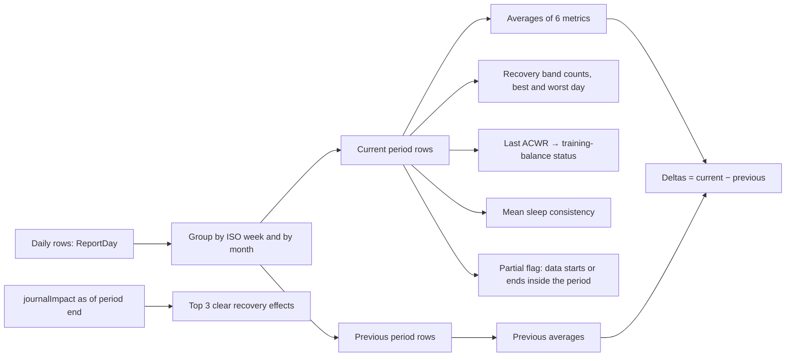

# Weekly and monthly reports

Code: `src/core/algorithms/reports.ts`. Tests: `reports.test.ts`.

A report summarises one ISO week (Monday to Sunday) or one calendar month of daily scores. It shows how each headline metric averaged and how that moved against the previous period of the same kind. It also gives the recovery band mix, the training balance at the period's end, sleep consistency, the behaviours that mattered most, and the best and worst day.

## Flow

## Formula

1. **Periods.** A week is ISO 8601: Monday to Sunday, named `YYYY-Www` after the year that holds its Thursday. So 2027-01-01 falls in `2026-W53`. A month is `YYYY-MM`, from the 1st to its last day. `reportPeriods(rows)` lists every week, then every month, that has a row, oldest first.
2. **Averages.** For each of recovery (0–100), strain (0–21), sleep performance (0–100), sleep hours, HRV (ms) and resting HR (bpm): the mean over the period's days where that value is not null. With no values it is null.
3. **Deltas.** Current average − previous period's average. The previous period is the week or month before. A delta is null when either side is null. The previous period may itself be partial.
4. **Bands.** Each day with a recovery score counts once, in red (< 34), yellow (< 67) or green, using noop's `band()`. The counts sum to the days with recovery.
5. **Training balance.** The ACWR of the period's last day that has one, classified as in noop's readiness engine (`acwrSignal`): < 0.8 ramping down, < 1.3 sweet spot, < 1.5 building fast, else spiking. Null when the period has no ACWR.
6. **Sleep consistency.** The mean of the daily Sleep Regularity display values (0–100).
7. **Top impacts.** From the `TagImpact[]` the caller passes: tags whose recovery effect is `positive` or `negative`, by |Δ| largest first, at most 3.
8. **Best and worst day.** The highest and lowest recovery in the period. Ties go to the earliest day.
9. **Partial.** True when the period starts before the first row of the data, or ends after the last row. The week in progress and the week the history starts in are partial. A missing day in the middle, such as a band-off day, is not.

## Inputs

`buildReport(period, rows, impacts = [])`.

| Input | Shape | Notes |
|---|---|---|
| `period` | `2026-W40` or `2026-10` | The `reports.period` key |
| `rows` | `ReportDay[]` | Any span of days; all history is fine. Each row is `{ day, recovery, strain, sleepPerf, sleepHours, hrv, rhr, acwr, sleepConsistency }`, with nulls for missing values. U10 maps `daily_scores` and `daily_metrics` into it. The partial flag uses the first and last rows, so pass the full history. |
| `impacts` | `TagImpact[]` | `journalImpact(entries, outcomes, periodBounds(period).end)`, or the latest result if per-period cost matters (see journal-impact.md) |

## Outputs

`Report`: `{ period, kind, start, end, partial, days, averages, deltas, bands, trainingBalance, sleepConsistency, topImpacts, best, worst }`. It is stored as JSON in `reports.data`.

## Edge rules

- **Time zone.** Days are already local `YYYY-MM-DD`, so period boundaries need no time-zone handling. Date maths runs in UTC on those labels.
- **Empty period.** Averages are null, counts are 0, best and worst are null, and the period is marked partial.

## Worked examples

From the tests:

1. **A full week.** Week 39 has recovery 50 every day. Week 40 runs 30, 40, … 90. Week 40 averages 60, its delta is +10, and its bands are 1 red, 3 yellow and 3 green. The best day is Sunday at 90 and the worst is Monday at 30. An ACWR of 1.4 on Sunday gives "building fast".
2. **Month boundary.** Week 40 (Sep 28 – Oct 4) splits between the September and October reports, 3 and 4 of its days.
3. **ISO year boundary.** `2026-W53` runs from 2026-12-28 to 2027-01-03.

## Sources

- ISO 8601-1:2019, week dates.
