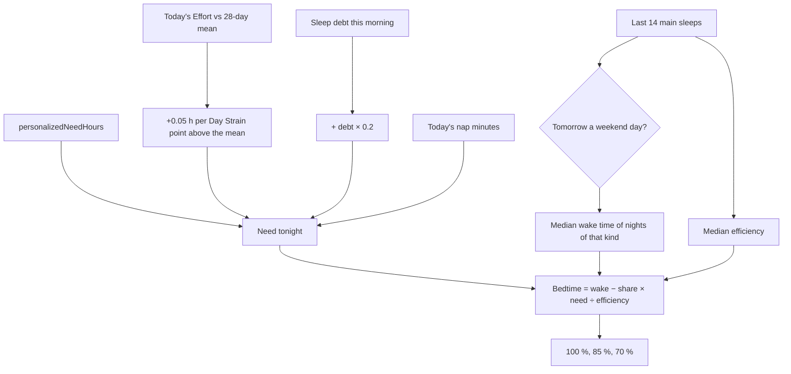

# Sleep Planner

Code: `src/core/algorithms/sleepPlanner.ts`. Tests: `sleepPlanner.test.ts`.

The Sleep Planner answers "when should I go to bed tonight?". It works out tonight's sleep need, then counts back from your typical wake time for tomorrow, allowing for your usual sleep efficiency, to give bedtimes that deliver 100 %, 85 % and 70 % of that need.

## Flow

## Formula

1. **Need tonight**, in minutes:

   need = baseline + strain + debt − nap, floored at 0, where:
   - **baseline** = noop's `personalizedNeedHours` × 60. That is the upper quartile of nightly sleep, floored at the population target and capped at 9.5 h.
   - **strain** = 0.05 h × 60 × max(0, today's Day Strain − the 28-day mean Day Strain). Both are on WHOOP's 0–21 scale, through `toWhoopStrain`. A light day never lowers the need.
   - **debt** = 0.2 × this morning's sleep debt in minutes (`ledger(...).magnitudeMin`), so a debt is repaid over about five nights.
   - **nap** = today's minutes asleep in naps.
2. **Typical wake time.** Over the last 14 main sleeps, take the median local wake time of the nights whose wake day is the same kind as tomorrow: weekday (Monday to Friday) or weekend (Saturday and Sunday). If none of the 14 is of that kind, use all 14.
3. **Efficiency** = the median of the same nights' efficiency (asleep ÷ in bed). With none, use 0.9.
4. **Bedtime** for share X ∈ {1, 0.85, 0.7}: time in bed = X · need ÷ efficiency, and bedtime = wake − time in bed.

`bedtimeMin` is minutes from the wake day's local midnight, so −90 is 22:30 the evening before. `(bedtimeMin + 1440) % 1440` gives the clock time. Keeping the sign means the three bedtimes always sort earliest first, even across midnight.

## Inputs

| Input | Unit | Notes |
|---|---|---|
| `baselineNeedHours` | hours | `personalizedNeedHours(nightlyHours, age)`, the same need the debt ledger used. |
| `effort` | Effort 0–100, or null | Today's strain so far. null skips the strain term. |
| `meanEffort28` | Effort 0–100, or null | The mean over the 28 days before today. |
| `debtMin` | minutes | This morning's debt magnitude. |
| `napMin` | minutes | Asleep minutes in today's non-main sessions. |
| `nights` | `{ day, wakeMin, efficiency }[]`, oldest first | Recent main sleeps. `day` is the wake day, `yyyy-MM-dd`. `wakeMin` is the **local** wake time in minutes after midnight; U10 converts from unix seconds in the user's time zone. The last 14 are used. |
| `wakeDay` | `yyyy-MM-dd` | Tomorrow, the morning being planned for. |

## Constants

All of these live in `sleepPlannerConfig`.

| Constant | Value | Kind |
|---|---|---|
| `hoursPerStrainPoint` | 0.05 h per Day Strain point | *tunable* (spec) |
| `debtRepayShare` | 0.2 | *tunable* (spec) |
| `windowNights` | 14 | spec |
| `defaultEfficiency` | 0.9 | *tunable*: a typical healthy-adult efficiency, used only before any night has one |
| `shares` | 1, 0.85, 0.7 | spec |

## Edge rules

- **No nights** give `wakeMin: null` and no plans. The need is still returned.
- **A big nap** can bring the need to 0, which gives every bedtime at the wake time.
- **The median of an even count** is the mean of the middle two, so a wake time can fall on a half minute.

## Worked examples

1. **The base case** (a test). Need 8 h, no debt, today's strain at the 28-day mean, no nap: need = **480 min**. Tomorrow is a weekday, with a typical wake of 07:00 and efficiency 0.9. The 100 % bedtime is 07:00 − 480 / 0.9 = 07:00 − 533.3 min = **22:07** the evening before.
2. **A heavier day.** Need 8 h, 60 min of debt (+12), Day Strain 16 against a mean of 10 (+6 × 0.05 h = +18 min), and a 20 min nap (−20): need = **490 min**. With a weekday wake of 07:00 and efficiency 0.9:

   | Share | Asleep | In bed | Bedtime |
   |---|---|---|---|
   | 100 % | 490 min | 544.4 min | **21:56** |
   | 85 % | 416.5 min | 462.8 min | **23:17** |
   | 70 % | 343 min | 381.1 min | **00:39** |

3. **A weekend morning** (a test). With weekend wakes at 09:00 and weekday wakes at 07:00, the same need gives bedtimes exactly 2 h later on a Friday night than on a Wednesday.

## Sources

- noop (`ryanbr/noop`), `AnalyticsEngine.kt` `RestScorer` (sleep need) and `SleepDebt.kt` (14-night ledger), ported in `src/core/scoring/sleep.ts`.
- WHOOP Sleep Planner: the design target (Peak, Perform and Get By, at 100 %, 85 % and 70 %); no WHOOP coefficients are used.
