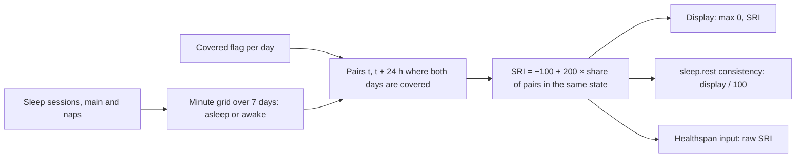

# Sleep Regularity Index

Code: `src/core/algorithms/sleepRegularity.ts`. Tests: `sleepRegularity.test.ts`.

The Sleep Regularity Index (SRI) measures how likely you are to be in the same state, asleep or awake, at the same clock time on consecutive days. It comes from Phillips et al. (2017). It replaces noop's 1 − CV-of-duration consistency, which only sees how long you slept and not when. Windred et al. (2024) found SRI a stronger predictor of mortality than sleep duration, and Healthspan uses it as an input.

## Flow

## Formula

1. Split the window into N days × 1,440 minutes, starting at `windowStart`, which is local midnight of the first day. Minute *m* starts at `windowStart + 60m` and is **asleep** when any session satisfies `start ≤ minute start < end`. Every other minute is **awake**.
2. For each day *d* from 0 to N − 2, and only when days *d* and *d* + 1 are both covered, compare each minute with the same minute 24 h later.
3. SRI = −100 + 200 × (pairs in the same state ÷ pairs compared).
4. When no pair of consecutive covered days exists, the result is null.

This is Phillips et al.'s definition, SRI = −100 + 200 / (M(N − 1)) · Σⱼ Σᵢ δ(sᵢ,ⱼ, sᵢ,ⱼ₊₁), with M = 1,440 epochs. The only change is that the denominator counts pairs actually compared, so days without data drop out.

- **Range.** SRI runs from −100 to 100. A person who keeps an identical schedule every day scores 100. A random schedule scores about 0. A schedule that alternates 12 h apart scores below 0.
- **Display.** The UI shows max(0, SRI) on a 0–100 scale.
- **Sleep performance.** `sriConsistency(sri)` returns max(0, SRI) / 100 on [0, 1], for `sleep.rest()`'s `consistency` parameter. U10 wires it in, with a `scoring_version` bump.
- **Healthspan** takes the raw SRI. Its curve is flat below 65, so the sign does not matter there.

## Inputs

| Input | Unit | Notes |
|---|---|---|
| `sessions` | `{ start, end }`, unix seconds | Every sleep session that touches the window: main sleeps **and naps**. Parts outside the window are clipped. |
| `windowStart` | unix seconds | Local midnight that starts the first day. For the score on day D, use midnight of D − 6. |
| `covered` | `boolean[]`, one per day | Defaults to 7 × `true`. Set a day to `false` when there is no data that day (band not worn), so its pairs are skipped rather than counted as awake. |

**Naps count as sleep.** SRI is defined over every epoch of the 24 h day, and a nap is sleep at an irregular time, which is what SRI measures. UK Biobank's accelerometer SRI cannot tell naps apart either, so including them keeps us comparable to the SRI that Healthspan's curve was fitted on. The cost is that one nap lowers SRI by about (2 × nap minutes) ÷ (6 × 1,440) × 200, which is 2.8 points for a 1 h nap in a 7-day window.

**What U10 should mark as covered.** A day is covered when it has worn-band data, for example any `hr_samples` that day. A worn day with no sleep at all is covered, and every one of its minutes counts as awake.

## Constants

| Constant | Value | Kind |
|---|---|---|
| `sleepRegularityConfig.windowDays` | 7 | *tunable*: the plan's "last 7 days". UK Biobank's SRI, the basis for Healthspan's curve, also uses 7 days. |
| Minute epoch | 60 s | choice: finer than wearable session boundaries need |
| −100, 200 | | cited: Phillips 2017 |

## Edge rules

- **DST.** A pair is t and t + 24 h of absolute time. On the night the clocks change, it therefore compares clock times 1 h apart. The effect is small over 7 days, and it is marked with a `ponytail:` comment in the code.
- **Granularity.** Wearable sessions are smoothed and contain no brief wakes. Our SRI therefore reads somewhat higher than an accelerometer SRI for the same person.

## Worked examples

All of these are tests, except example 4, which was computed with the code.

1. **Identical schedule.** Asleep 23:00–07:00 every night gives **SRI = 100**, shown as 100, and 1.0 for `rest()`.
2. **12 h apart on alternate days.** Even days are asleep 00:00–08:00 and odd days 12:00–20:00. Each consecutive pair agrees only when both are awake, 08:00–12:00 and 20:00–24:00, which is 8 h of 24. P = 1/3, so **SRI = −33.3**, shown as 0.
3. **A missing day.** The same schedule as example 1, with no data on day 4. With day 4 marked uncovered, its two pairs are skipped and **SRI = 100**. Marked covered, day 4 counts as awake all night, two of six pairs disagree for 8 h, and SRI = −100 + 200 × (1 − 960 / 8,640) = **77.8**.
4. **Weekend shift.** Weekdays 23:00–07:00, Friday and Saturday nights 01:00–09:00, Monday to Sunday: **SRI = 93.1**.
5. **A nap.** Example 1 plus a 1 h nap on day 4 gives SRI = −100 + 200 × (1 − 120 / 8,640) = **97.2**.

## Sources

- Phillips AJK, Clerx WM, O'Brien CS, et al. Irregular sleep/wake patterns are associated with poorer academic performance and delayed circadian and sleep/wake timing. *Sci Rep* 2017;7:3216. doi:10.1038/s41598-017-03171-4
- Windred DP, Burns AC, Lane JM, et al. Sleep regularity is a stronger predictor of mortality risk than sleep duration: a prospective cohort study. *Sleep* 2024;47(1):zsad253. doi:10.1093/sleep/zsad253 (UK Biobank, 7-day accelerometer SRI, median 81.0, IQR 73.8–86.3)
