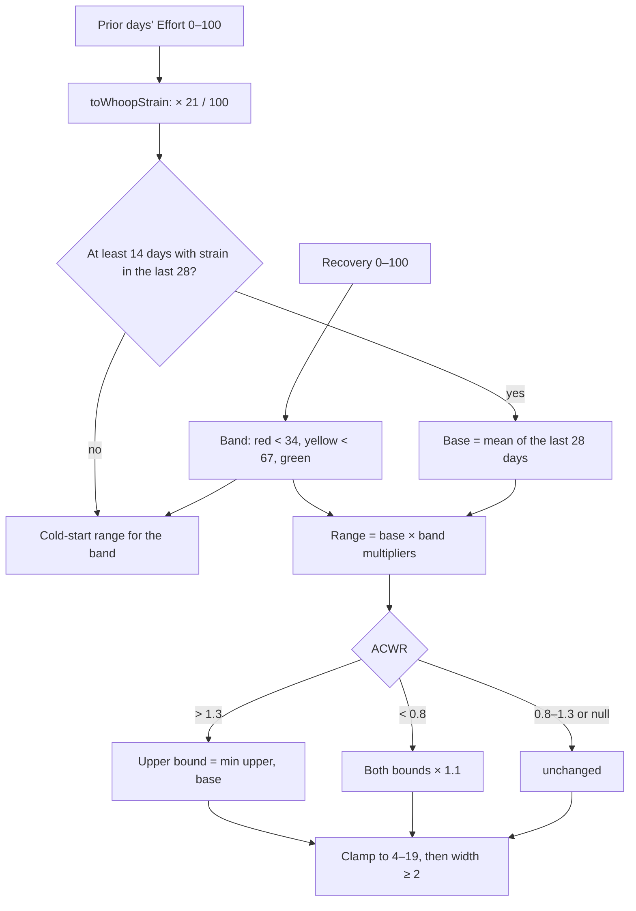

# Strain Target

Code: `src/core/algorithms/strainTarget.ts`. Tests: `strainTarget.test.ts`.

Strain Target is today's recommended Day Strain range, on WHOOP's 0–21 scale. It starts from what you usually do, your 28-day mean strain, scales it by today's Recovery band, and then lets the acute:chronic workload ratio (ACWR) cap a ramp-up or nudge a ramp-down.

## Flow

## Formula

1. **Scale.** Core keeps Effort on 0–100. The target is specified on WHOOP's 0–21 scale, so each prior day goes through `toWhoopStrain` (× 21 / 100) on the way in.
2. **Cold start.** With fewer than 14 days that have strain among the last 28, return the band's default range: green 14–18, yellow 10–14, red 6–10.
3. **Base** = the mean of those days' strain.
4. **Range by Recovery band** (from `recovery.band`):

   | Band | Recovery | Range |
   |---|---|---|
   | Green | ≥ 67 | base × [1.0, 1.25] |
   | Yellow | 34 to < 67 | base × [0.8, 1.0] |
   | Red | < 34 | base × [0.5, 0.75] |

5. **ACWR.**
   - ACWR > 1.3: the upper bound becomes min(upper, base). Load is already climbing fast, so today should not add to it.
   - ACWR < 0.8: both bounds × 1.1. Load is ramping down, so there is room for a little more.
   - These are readiness' own band edges: below 0.8 is "ramping down", and 1.3 is where the sweet spot ends.
6. **Bounds.** Clamp both bounds to [4, 19]. If the width is then under 2, widen **downwards**: low = max(4, high − 2), then high = low + 2. Widening down keeps an ACWR cap intact. Only when the low bound hits 4 does the high bound move up, to 6.

## Inputs

| Input | Unit | Notes |
|---|---|---|
| `priorEffort` | Effort 0–100 per day, oldest first, or null | The days **before** today. The last 28 are used. |
| `recovery` | 0–100 | Today's Recovery. Without one, U10 gives the target a reason code. |
| `acwr` | ratio, or null | `readiness.evaluate(...).acwr` over the same prior days, so today's own strain does not feed today's target. |

## Constants

All of these live in `strainTargetConfig`.

| Constant | Value | Kind |
|---|---|---|
| `windowDays` | 28 | spec; also readiness' chronic window |
| `minDays` | 14 | spec; also readiness' `minChronic` |
| `multipliers` | green [1.0, 1.25], yellow [0.8, 1.0], red [0.5, 0.75] | *tunable* (spec) |
| `coldStart` | green 14–18, yellow 10–14, red 6–10 | *tunable* (spec) |
| `acwrCapAbove` | 1.3 | spec; Gabbett 2016's "sweet spot" upper edge |
| `acwrLiftBelow`, `lift` | 0.8, 0.1 | spec; Gabbett 2016's lower edge |
| `min`, `max`, `minWidth` | 4, 19, 2 | *tunable* (spec) |

## Edge rules

- A day with `null` Effort, such as a band-off day, is skipped. It neither counts towards the 14 days nor pulls the mean down.
- The ACWR rules are not applied on a cold start, since there is no base to cap at.
- `acwrRule` reports which rule fired, so the UI can explain a capped range.

## Worked examples

All of these are tests.

1. **Green, base 12, ACWR 1.0:** 12 × [1.0, 1.25] = **[12, 15]**.
2. **Red, base 12:** 12 × [0.5, 0.75] = **[6, 9]**.
3. **Green, base 12, ACWR 1.4:** [12, 15] is capped to [12, 12], then widened down to **[10, 12]**.
4. **Green, base 12, ACWR 0.7:** [12, 15] × 1.1 = **[13.2, 16.5]**.
5. **Green, base 21:** [21, 26.25] clamps to [19, 19], then widens to **[17, 19]**.
6. **13 days of strain, green:** a cold start, so **[14, 18]**.

## Sources

- Gabbett TJ. The training–injury prevention paradox: should athletes be training smarter and harder? *Br J Sports Med* 2016;50(5):273–280. doi:10.1136/bjsports-2015-095788 (ACWR 0.8–1.3 "sweet spot").
- noop (`ryanbr/noop`), `ReadinessEngine.kt`: ACWR (acute 7, chronic 28, at least 14 days), ported in `src/core/scoring/readiness.ts`.
- WHOOP Strain Coach: the design target only; no WHOOP coefficients are used.
