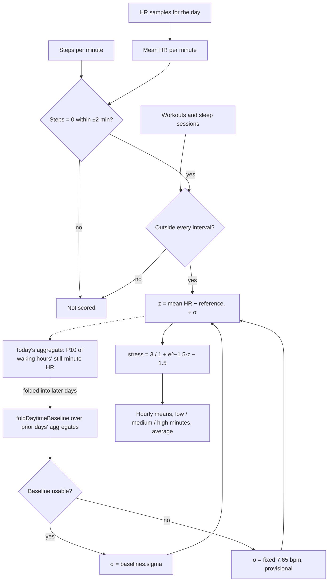

# Stress Monitor

Code: `src/core/algorithms/stress.ts`. Tests: `stress.test.ts`.

The Stress Monitor scores each still, awake minute on a 0–3 scale from how far its heart rate sits above your personal resting daytime heart rate. It follows noop's HR-only `DaytimeStress` path, which has no R-R intervals and therefore no RMSSD term, with two changes:

- **Movement is excluded, not guessed.** noop has to infer motion from the strap. We have Fitbit's per-minute steps, so any minute with steps nearby is simply not scored.
- **Our own 0–3 mapping.** noop's `squash` puts a minute at baseline at 1.5, the middle of the scale. The reference app reads a calm minute near 0, so we shift the logistic: a still minute at baseline reads 0.29, and +3σ reads 2.71.

It is a wellness estimate from heart rate alone, not a measure of psychological stress.

## Flow

## Formula

1. **Minute grid.** Minute *m* covers [`start` + 60m, `start` + 60m + 60), where `start` is local midnight. Its HR is the mean of the samples inside it. A minute without a sample is not scored.
2. **Still and awake.** A minute is scored only when:
   - it and the 2 minutes on each side have 0 steps, and
   - it does not overlap any workout or sleep session (main sleep or nap). A minute that is only partly covered is excluded.
3. **Reference and σ.**
   - When the daytime baseline is usable (at least 4 accepted days, not stale), the reference is its centre and σ = `baselines.sigma(baseline)` = 1.253 × spread. The `daytime_hr` floor spread of 3 bpm keeps σ at 3.76 bpm or more.
   - Otherwise σ is a fixed **7.65 bpm** (15 / 1.96), and the result is marked **provisional**. The reference is the baseline centre if it has accepted any day, else today's own aggregate (step 6).
4. **z** = (minute mean HR − reference) ÷ σ.
5. **Stress** = 3 / (1 + e^(−k(z − z₀))), with k = 1.5 and z₀ = 1.5. It lies in (0, 3).
6. **Daily aggregate.** For each waking hour (06:00–22:00 local) with at least 15 still minutes that have HR, take the mean of those minutes' HR. Today's aggregate is the 10th percentile of those hourly means (noop's `daytimeHRAggregatePercentile`). U10 folds these aggregates, oldest first and excluding today, with `foldDaytimeBaseline` to get the next day's baseline.
7. **Summary.** Minutes at low (< 1), medium (1 to < 2) and high (≥ 2), the mean over scored minutes, and the mean of each hour since `start`, for the chart.

**Why our own aggregate.** noop's `dayDaytimeAggregate` gates each hour on 300 HR samples, which assumes 1 Hz strap data, and it includes walking minutes. Our seed writes HR every 15 s (240 per hour), so that gate never passes, and walking HR is not resting HR. The aggregate here gates on still minutes instead, so it works at any sample rate. The fold, the centre, the spread and the percentile are still noop's.

## Inputs

| Input | Unit | Notes |
|---|---|---|
| `start`, `end` | unix seconds | Local midnight and the next local midnight. A DST day has 1,380 or 1,500 minutes. |
| `hr` | `{ ts, bpm }[]` | The day's `hr_samples`. |
| `steps` | steps per minute, indexed like the grid | `steps_minutes` only stores non-zero minutes, so missing entries count as 0. |
| `excluded` | `{ start, end }[]`, unix seconds | Every workout (`exercises`) and every sleep session (main and naps) that touches the day. |
| `baseline` | `BaselineState` | `foldDaytimeBaseline(aggregates)` over the `dayAggregate` of every earlier day, oldest first. A day with no aggregate is `null`. |

## Constants

All of these live in `stressConfig`.

| Constant | Value | Kind |
|---|---|---|
| `k` | 1.5 | *tunable* |
| `z0` | 1.5 | *tunable* |
| `stillWindowMin` | 2 | spec (±2 minutes) |
| `mediumFrom`, `highFrom` | 1, 2 | spec |
| `minHourStillMinutes` | 15 | *tunable*: a quarter of the hour, so a mostly moving hour does not set the resting floor |
| `fallbackSigmaBpm` | 7.65 | 15 / 1.96, so that +15 bpm lands on stress 2.0 under our curve (noop's intent for its fixed σ) |
| Waking hours, P10 | 06–22, 0.1 | noop: `isWakingHourOfDay`, `daytimeHRAggregatePercentile` |

**The fallback σ under our mapping.** noop chose 21.64 bpm so that +15 bpm lands on 2.0 under *its* squash. Under ours, 2.0 needs z = 1.96, which is +42 bpm at that σ, so provisional days read mostly low. We therefore use 15 / 1.96 = 7.65 bpm, so that +15 bpm lands on 2.0 under our curve and the first days read like later ones.

## Edge rules

- **No HR**, a moving minute, a workout or sleep gives `null` for that minute. These minutes are not counted in any band or in the average.
- **No reference.** With no accepted baseline day and no aggregate today, every minute is `null`.
- **DST.** Hours are minutes since local midnight ÷ 60, so on a DST day the hours after the change are labelled one off. This is marked with a `ponytail:` comment.
- **Levels never reach 0 or 3 exactly**, because the logistic is open at both ends.

## Worked examples

With a trusted baseline of 70 bpm and σ = 4 bpm:

| Minute HR | z | Stress | Band |
|---|---|---|---|
| 70 | 0 | **0.29** | low |
| 74.2 | 1.04 | 1.00 | medium starts |
| 76 | 1.5 | **1.50** | medium |
| 77.8 | 1.96 | 2.00 | high starts |
| 82 | 3 | **2.71** | high |

During the fallback, with the reference still 70 and σ = 7.65 bpm, 82 bpm gives z = 1.57 and stress = **1.58** (medium).

**On the seed** (last 21 days of `data/demo.db`): the personal reference sits at about 71 bpm, with σ at the 3.76 bpm floor. A weekday with scripted desk stress has about 330–490 low, 0–120 medium and 30–65 high minutes, with an average of 0.4–0.9. A weekend day has under 10 high minutes. The short-sleep week averages 1.4–1.9. The illness peak, when daytime HR is up 6–8 bpm all day, averages 2.7, with almost every scored minute high.

## Sources

- noop (`ryanbr/noop`), `DaytimeStress.kt` HR-only mode (L176–183) and `DaytimeBaselines.kt`, ported in `src/core/scoring/stressBase.ts`.
- The reference app Stress Monitor (2023): a 0–3 scale, with calm minutes near 0. The design target only; no the reference app coefficients are used.
