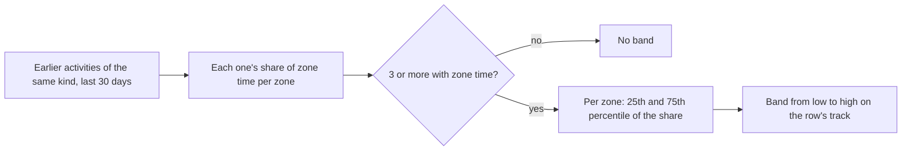

# Zone typical range

Code: `src/core/algorithms/zoneTypical.ts`. Tests: `zoneTypical.test.ts`. Built by `getActivity` in `src/server/queries/activity.ts`. UI: the zone rows on an activity (`ZoneBars variant="rows"`, spec §11 R39).

The reference app shades a "typical range" on each zone row of a workout: a lighter band between two dashed ticks over the hatched track, so you can see whether this session spent more or less of its time in a zone than usual. Pulse draws the same band from your own history.

## Method

- An activity's share in a zone is its seconds in that zone over its seconds in all zones (Zone 0 to Zone 5). Activities with no zone time are left out.
- The band is the middle half of those shares (the 25th to the 75th percentile, linearly interpolated), so one unusual session does not stretch it.
- With fewer than three such activities there is no band, and the rows hide the "Typical range" key.
- Only activities that started before this one count, so the band for a past workout never changes later.
