# Pulse system design, as it is today

Status: descriptive. It records what the code does on branch `belevel/research` (HEAD `8c4833d` plus the uncommitted
`public/sw.js` change, see [Service worker](#service-worker)). Nothing here is a proposal. The proposals are in
[`docs/plans/2026-10-08-007-backend-architecture-plan.md`](../plans/2026-10-08-007-backend-architecture-plan.md).

How to read it:

- Every statement carries a `path:line` reference. Line numbers are for the current tree and will drift.
- "Measured" means a number the owner supplied from the local dev database, or one I measured for this document
  (marked **[M-doc]**, with the method). "Not measured" means no one has measured it. I do not fill those gaps with guesses.
- "Unclear" marks a point the code does not settle. Each is collected in [Unknowns](#unknowns).
- Sources outside the repo are named as such. The only one used is the owner's deployment notes (memory file
  `pulse-deploy-and-pwa-limits.md`) for the production hostname and Cloudflare.

## Contents

1. [Overview and deployment topology](#1-overview-and-deployment-topology)
2. [Frontend](#2-frontend)
3. [Backend](#3-backend)
4. [Data](#4-data)
5. [Caching at every layer](#5-caching-at-every-layer)
6. [End-to-end flows](#6-end-to-end-flows)
7. [Security and privacy boundaries](#7-security-and-privacy-boundaries)
8. [Known bottlenecks and risks](#8-known-bottlenecks-and-risks)
9. [Unknowns](#unknowns)

---

## 1. Overview and deployment topology

### 1.1 What runs where

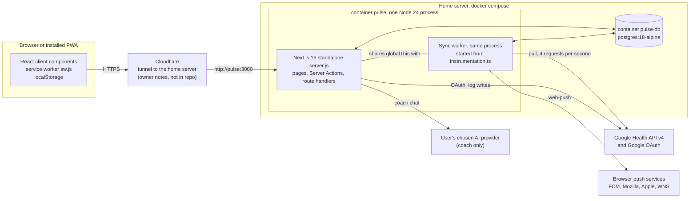

Facts behind the diagram:

| Fact | Source |
|---|---|
| Two containers: `db` (`postgres:18-alpine`, `mem_limit: 256m`, `shared_buffers=64MB`, `max_connections=30`, `work_mem=4MB`) and `pulse` (`mem_limit: 384m`). | `compose.yaml:4-16`, `compose.yaml:24-36` |
| Neither container publishes a host port by default. A tunnel in Docker reaches `http://pulse:3000`. | `compose.yaml:22`, `compose.yaml:37-38`, `docs/setup.md:237-259` |
| `DATABASE_URL` is built from `POSTGRES_PASSWORD`. | `compose.yaml:30-31` |
| Next runs as `output: "standalone"`; the image starts `node server.js`. | `next.config.ts:9`, `Dockerfile:37` |
| The image is two-stage on `node:24-slim`. The V8 heap is capped at 50% of the container limit, `MALLOC_ARENA_MAX=2`. | `Dockerfile:1`, `Dockerfile:17`, `Dockerfile:23` |
| Container health check: `GET /healthz`, 30 s interval, 30 s start period. `/healthz` returns `{ ok: true }` and touches no database. | `Dockerfile:35-36`, `src/app/healthz/route.ts:1-3` |
| Migrations (Drizzle, 6 files in `drizzle/`) run at boot, retrying up to 30 times at 2 s intervals while Postgres starts. A failure calls `process.exit(1)`. | `src/instrumentation.ts:1-12`, `src/server/db/index.ts:37-49` |
| The worker starts in the same Node process, right after migrations. | `src/instrumentation.ts:11` |
| One `pg.Pool` with `max: 10`, shared by pages, actions and the worker. | `src/server/db/index.ts:27` |
| `scripts/reset-password.mjs` and `scripts/seed-demo-user.mts` are bundled with esbuild into `scripts/` of the image. | `Dockerfile:13-15`, `Dockerfile:31` |
| Production is `https://pulsefit.portlabs.in`, behind Cloudflare, on one home server, deployed by the owner running `scripts/deploy.sh`. | Owner's notes (outside the repo). The repo documents Cloudflare Tunnel as one option: `docs/setup.md:107`. |
| Cloudflare's client-IP header is trusted for sign-in rate limits: `cf-connecting-ip`, then `x-forwarded-for`. The code does not check that a request really came through Cloudflare. | `src/server/auth.ts:108-111` |
| CI runs `checks` (typecheck, lint, migration drift, unit tests) and `e2e` (Playwright, demo mode, real Postgres service). | `.github/workflows/ci.yml:19-45`, `.github/workflows/ci.yml:48-90` |
| `site/` is a separate Astro landing page with its own `wrangler.jsonc`. I did not read it for this document. | `site/wrangler.jsonc` (exists), not examined |

### 1.2 Two data modes

`DATA_SOURCE` is `demo` (default) or `google` (`src/server/config.ts:11`).

- `demo`: one shared demo user with generated data; sign-up is disabled (`src/server/auth.ts:41`); the worker syncs only that user
  from `seedSource` (`src/server/worker.ts:198-211`, `:220`).
- `google`: every user connects their own Google account; the worker syncs every user with a live grant
  (`src/server/worker.ts:196-197`).

### 1.3 Deploy

`scripts/deploy.sh` (run on the server):

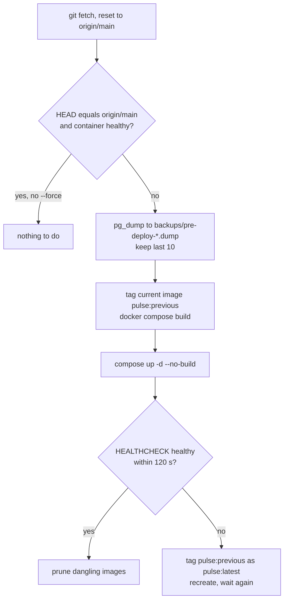

Source: `scripts/deploy.sh:49-61` (fetch and skip), `:63-72` (dump), `:74-82` (build), `:84-107` (start and roll back),
`:109-111` (prune). A rollback restores the old image only. A dump is restored by hand if a migration ran (`scripts/deploy.sh:10-11`).

---

## 2. Frontend

### 2.1 App Router structure

| Area | Files | Notes |
|---|---|---|
| Root layout | `src/app/layout.tsx` | Fonts (Figtree, Barlow via `next/font/google`, self-hosted at build, `:14-23`), theme script (`:67`), service-worker registration script in production only (`:69`), manifest link (`:71`), `PwaRuntime` (`:80`). |
| `(app)` group | `src/app/(app)/layout.tsx` and about 20 route folders | The signed-in app: `/` (in sub-group `(home)`), `activities`, `activity/[id]`, `coach`, `coach/chats`, `health` (+ `fitness`, `healthspan`, `heart-rate`, `monitor`, `stress`), `journal` (+ `insights`), `metric/[key]`, `more` (+ `behaviours`, `data`, `how-it-works/[score]`), `recovery`, `reports/[period]`, `settings`, `sleep`, `strain`, `trends`. |
| Signed out | `login`, `signup`, `forgot`, `onboarding` | `onboarding` is outside `(app)` but is entered from the `(app)` layout's redirect. |
| Admin | `src/app/admin/*` with its own `layout.tsx` | Own frame, not the app shell (`AGENTS.md`, Admin dashboard rule). Gate: `src/app/admin/gate.ts:12-18`. |
| Dev only | `src/app/dev/*` | `notFound()` unless `NODE_ENV === "development"` (`src/app/dev/kit/layout.tsx:9-10`). I read only the kit layout; the `dev/brand` pages were not checked. |
| Route handlers | `sync`, `status`, `heart-rate`, `push`, `avatar`, `healthz`, `logout`, `login/demo`, `oauth/start`, `oauth/callback`, `export/{daily,journal,coach}`, `api/coach`, `api/auth/[...all]`, `.well-known/assetlinks.json`, `manifest.ts` | Counted from the file list: 16 `route.ts` files (non-test) plus `manifest.ts`. |

Counts (from `find` and `grep` on the tree): 40 `page.tsx`, 26 `loading.tsx`, 94 non-test files that start with `"use client"`,
9 files with `"use server"`: `src/app/(app)/settings/actions.ts` and `src/server/actions/{admin,calendar,avatar,log,coach,dashboard,profile,journal}.ts`.

No page sets `dynamic`, `revalidate` or `runtime`. Pages are dynamic because they read cookies or headers, and the `(app)` layout calls
`await connection()` first (`src/app/(app)/layout.tsx:21`).

### 2.2 Server versus client components

- Pages are async Server Components. Each calls a query function from `src/server/queries`, gets a view model, and composes shells
  and kit components (`AGENTS.md` Layout; example `src/app/(app)/recovery/page.tsx:27-59`).
- Client components are the interactive parts: charts, the date switcher, sheets, the check-in, the coach chat, settings forms, and
  the shell chrome (`AppShell`, `AppNav`, `AppLifecycle`, `ShellStatusProvider`).
- `src/lib/*` is shared code. Some of it reaches into `src/server`: `src/lib/offline-queue.ts:1` imports a Server Action and
  `src/lib/journal.ts:3` imports a server type.

### 2.3 The data-fetching pattern

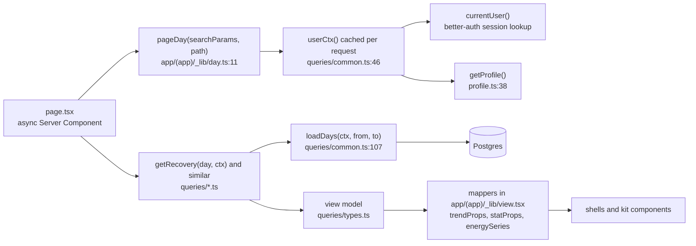

- `pageDay` reads `?d=`, resolves today in the user's zone, and redirects to the same path without `d` when it is not a valid
  day (`src/app/(app)/_lib/day.ts:11-22`).
- `userCtx` is wrapped in React `cache`, so one request builds the context once (`src/server/queries/common.ts:46-54`). It sends a user
  with no profile to `/onboarding` (`:50-52`).
- The `(app)` layout does **not** use `userCtx`. It calls `ctxOf` directly (`src/app/(app)/layout.tsx:27`). A page then builds a second
  context, so `getProfile` (one or two queries) runs twice per render.
- Queries never compute scores. They read stored rows and shape view models. Reason codes make every nullable metric honest
  (`src/lib/reasons.ts:5-26`).
- Mappers in `src/app/(app)/_lib/view.tsx` turn view models into component props (`mapMetric` at `:42-43`, others in the same file).

#### Per-screen queries and the day ranges they read

`loadDays(ctx, from, to)` reads 12 jsonb columns of `daily_scores` (`strain`, `activities`, `recovery`, `sleep`, `training_load`,
`strain_target`, `sleep_planner`, `energy_bank`, `stress`, `health_monitor`, `healthspan`, `fitness`) plus `session_rhr_bpm`, 15 columns of
`daily_metrics`, and all of `daily_values` for the range (`src/server/queries/common.ts:112-156`). It does not read `journal_impact`.

| Screen | Query | Range read by `loadDays` | Other reads | Source |
|---|---|---|---|---|
| Home `/` | `getHome` | `min(day, today-29) - 30` to today: 60 days when `day` is in the last 30 days | exercises of `day`, dashboard keys, latest weekly report, 7-day journal marks, `energy_bank` series | `queries/home.ts:48-62` |
| Recovery | `getRecovery` | `day-181` to `day` (182 days) | | `queries/recovery.ts:66` |
| Sleep | `getSleep` | 182 days | stages, raw HR around the night (`readHr`) | `queries/sleep.ts:49`, `:144-148` |
| Strain | `getStrain` | 182 days | exercises 60 days, `hr` series | `queries/strain.ts:42-44` |
| Activity | `getActivity` | `day-30` to `day` | exercises 31 days, `hr` series | `queries/activity.ts:35-37` |
| Activities | `getActivities` | `days` (default 30) | exercises | `queries/activities.ts:14-19` |
| Health hub | `getHealthHub` | `today-35` to today (36 days) | `stress` series, one-day lookup for last week's healthspan | `queries/health.ts:66-78` |
| Healthspan | `getHealthspan` | `weekEnd-182` to `weekEnd` | | `queries/health.ts:206` |
| Monitor | `getMonitor` | 30 days (or preloaded) | `health_records` (ECG, IRN) | `queries/health.ts:296` |
| Stress | `getStress` | 30 days | `stress` series, exercises | `queries/health.ts:452` |
| Fitness | `getFitness` | 182 days ending at the last stored day | | `queries/health.ts:514` |
| Heart rate | `getHeartRate` | the day | raw `hr_days` samples for the day (`hrMinutes`) | `queries/health.ts:561-566`, `:551-556` |
| Metric detail | `getMetricDetail` | 730 days (`2 x 365`) | exercises 365 days when needed | `queries/metric.ts:167-181` |
| Trends | `getTrends` | 730 days | | `queries/trends.ts:138-139` |
| Reports | `getReport` | the period's days | neighbour reports, latest week and month | `queries/reports.ts:35-45` |
| Journal | `getJournal` | none | entries for the 30-day strip, latest journal impact (one row) | `queries/journal.ts:65-100`, `:53-63` |
| Journal insights | `getJournalInsights` | `asOf-89` to `asOf` | entries (90 days) | `queries/journal.ts:112-113` |
| Calendar month | `getCalendarMonth` | the month | | `queries/calendar.ts:13` |
| Shell status (every layout render and `/status` poll) | `getShellStatus` | none | `sync_state` rows, `min(day)`, and the wear streak: **every scored day** | `queries/settings.ts:233-234`, `:201-231` |

The wear streak reads `strain->>'hrCount'`, `hrMinutesAm` and `hrMinutesPm` for every day up to today, newest first, then stops at the
first gap in JavaScript (`src/server/queries/settings.ts:205-231`). The code marks it as a known limit (`ponytail` comment, `:208`).

### 2.4 Streaming, Suspense and `loading.tsx`

- Pages await their whole view model before rendering. There is no per-section streaming. The `<Suspense>` boundaries that exist:
  the check-in sheet in the `(app)` layout (`src/app/(app)/layout.tsx:39-41`), the range-stats card on the metric page
  (`src/app/(app)/metric/[key]/page.tsx:91-93`) and a `null` fallback in settings (`src/app/(app)/settings/SettingsClient.tsx:40-42`).
- `loading.tsx` gives each of the 26 route folders a skeleton from `src/app/(app)/_lib/skeletons.tsx`
  (example `src/app/(app)/recovery/loading.tsx:1-5`). `loading.tsx` exists for `metric/[key]`, `activities`, `activity/[id]`, `reports` and
  `reports/[period]`. (The scaling plan lists these as missing; the files are present.)
- `(home)/loading.tsx` is itself a server component that does database work: `currentUser()` and `dashboardKeys()` so the skeleton
  has one row per chosen dashboard metric (`src/app/(app)/(home)/loading.tsx:7-13`).
- `(app)/error.tsx` renders a retry view and, if a HEAD probe shows the session has ended, reloads once per session
  (`src/app/(app)/error.tsx:13-51`).

### 2.5 The client router cache and navigation

- `staleTimes: { dynamic: 60, static: 300 }` (`next.config.ts:12-15`). Per the installed docs, `dynamic` applies to pages that are not
  fully prefetched, and `static` applies when a `Link` has `prefetch={true}`
  (`node_modules/next/dist/docs/01-app/03-api-reference/05-config/01-next-config-js/staleTimes.md`).
- The four tabs and Settings use `<Link prefetch>` (full prefetch) in the tab bar, rail and sidebar
  (`src/components/shells/AppNav.tsx:63`, `:96`, `:112`, `:140`). Automatic prefetching runs only in production
  (`node_modules/next/dist/docs/01-app/02-guides/prefetching.md`). So each of `/`, `/health`, `/journal`, `/more` and `/settings` can be
  fetched ahead of a tap, and a tapped tab can open from the client cache for 300 s. The number of prefetch requests per app open is **not measured**.
- Every other link is `auto`, so it uses the 60 s `dynamic` window.
- `router.refresh()` clears the client cache. It is called after: Sync now (`SyncNowButton.tsx:25`), pull-to-refresh and foreground
  refresh (`AppLifecycle.tsx:57`, `:91`), a queued check-in flush (`:46`), the end of a polled sync (`ShellStatus.tsx:64`), and several
  settings and coach actions.
- Server Actions call `revalidatePath` (for example `journal.ts:56-57`, `profile.ts:34` with `("/", "layout")`).

### 2.6 URL state

| Param | Meaning | Parsed in | Changed by |
|---|---|---|---|
| `?d=YYYY-MM-DD` | selected day. Missing means today. Invalid, future or older than 3,650 days is replaced by today. | `src/lib/url.ts:28-49` | `router.replace` in `DateSwitcher.tsx:93` and `DayStrip.tsx:70` |
| `?r=w|m|6m|1y` | trend range, default `m` | `src/lib/url.ts:51-59` | `router.replace` in `TrendChart.tsx:206` |
| `?checkin=1` | opens the check-in sheet over any screen | `CheckInSheet` in the `(app)` layout | links, the manifest shortcut `/journal?checkin=1` (`src/app/manifest.ts:58`) |
| `?m=` | journal insights metric | `journal/insights/Impacts.tsx:31` | `router.replace` |
| `?c=` | coach chat id | `coach/Coach.tsx:323` | `router.replace` |

Each of these is a server navigation: a changed `?d=` or `?r=` re-renders the page on the server.

### 2.7 Theming

An inline script first in `<head>` reads `localStorage["pulse-theme"]` (`system`, `light`, `dark`), and puts `light` or `dark` on `<html>`
before first paint (`src/lib/theme.ts:10`, `src/app/layout.tsx:67`). `useTheme` keeps it in step with the system setting and other tabs
(`src/hooks/use-theme.ts:23-65`). `ThemeColor` follows the page ground (`src/components/shells/ThemeColor.tsx`, not read in detail).

### 2.8 PWA shell

| Piece | Where | What it does |
|---|---|---|
| Manifest | `src/app/manifest.ts:15-60` | `standalone`, portrait, three shortcuts (Check in, Recovery, Sleep), icons with `?v=6`, screenshots. Served without a session. |
| Registration | `src/lib/sw.ts:4-11`, `src/app/layout.tsx:69`, `src/components/pwa/PwaRuntime.tsx:33-60` | Production only. Registers `/sw.js?v=<NEXT_PUBLIC_BUILD_ID>`; the id is `GIT_SHA` or a timestamp (`next.config.ts:5`, `:8`). |
| Update toast | `PwaRuntime.tsx:35-56` | "New version available", with Reload. It posts `SKIP_WAITING`, then reloads on `controllerchange` only if the user asked (`:58`). |
| Stale action guard | `PwaRuntime.tsx:21-24` | "Failed to find Server Action" (an open app calling a newer server) becomes the same reload toast. |
| Offline toast | `PwaRuntime.tsx:26-30` | "You're offline"; "Changes to your check-in are kept and sent later". |
| Lifecycle | `AppLifecycle.tsx:34-118` | Foreground after 5 min: `router.refresh()` and `registration.update()` (`:14`, `:52-60`). Clears the app badge. Flushes the offline queue. Pull-to-sync on coarse pointers (`:70-105`). |
| Push (client) | `src/lib/push-client.ts:18-42` | Permission, `pushManager.subscribe`, `POST /push` with the subscription. |
| Dev | `PwaRuntime.tsx:61-66` | In `next dev` it unregisters workers and clears caches, so a production build's worker cannot serve stale files. |

### Service worker

`public/sw.js` has two versions in play. **Check which one is deployed before reasoning about site data.**

| | Committed (HEAD) | Working tree (uncommitted, `git status` shows `M public/sw.js`) |
|---|---|---|
| Cache name | constant `"pulse-static-v1"` | `pulse-static-<v query param>` (`public/sw.js:5`) |
| Old caches | never deleted: `/_next/static/*` entries pile up with every deploy | `activate` deletes every cache that is not the current build's (`:17-24`) |

Rules, from the working-tree file (these are the same in both versions apart from the cache name):

- `install`: caches `/offline.html` and `/icons/icon-192.png` (`:8-10`). A new worker waits until the page sends `SKIP_WAITING` (`:12-15`).
- `fetch`, GET and same-origin only (`:29`):
  - navigations: network first, `/offline.html` when the network fails (`:31-34`);
  - `/_next/static/*`: cache first, filled on first use when `res.ok` (`:36-50`);
  - everything else, including RSC payloads, API routes and `/status`: not intercepted, so no service-worker caching of pages or health data (`:1-2`).
- `push`: shows a notification (title, body, tag, icon), sets the app badge to 1 (`:53-70`). `notificationclick` focuses an open window or opens the URL (`:72-85`).
- Response headers: `/sw.js` is `no-cache, no-store, must-revalidate` with `Service-Worker-Allowed: /`; `/offline.html` is `no-cache`
  (`next.config.ts:24-25`).

### 2.9 Offline behaviour, the offline queue and localStorage

- A page request with no network shows `/offline.html` (`public/sw.js:31-34`). A client-side navigation inside an open app is handled by Next; I did not test it.
- Only journal check-ins are queued. `CheckIn.tsx:201-224` sends one `saveJournalEntry` Server Action per changed tag, in order. When the
  device is offline (`navigator.onLine`) or an action throws, the unsent entries go to `enqueue(userId, ...)` (`:206`, `:218`) and a toast says
  "Saved on this device".
- Queue storage: `localStorage["pulse:journal-queue:<userId>"]`, an array of `{ day, tag, value }`. A newer entry for the same
  `(day, tag)` replaces an older one (`src/lib/offline-queue.ts:7`, `:27-30`). The old unscoped key is deleted without replay (`:9`, `:42`).
- `flushQueue(userId)` runs on mount, when the page becomes visible, and on the `online` event (`AppLifecycle.tsx:41-68`). The server rejects
  unknown tags and future days, and the client drops those entries. A network failure or signed-out result keeps the rest
  (`src/lib/offline-queue.ts:35-54`).
- A comment in `CheckIn.tsx:216-217` says `PwaRuntime` flushes the queue. It is `AppLifecycle` that does.
- Water, food, weight, mood and cycle logging (`src/server/actions/log.ts`) are not queued: they write to Google, so they need a connection.
- All localStorage and sessionStorage keys in the code:

| Key | Purpose | Source |
|---|---|---|
| `pulse-theme` | theme choice | `src/lib/theme.ts:3` |
| `pulse:journal-queue:<userId>` | offline check-ins | `src/lib/offline-queue.ts:7` |
| `pulse:settings-panel-open`, `pulse:coach-chats-open` | side panel open state | `Settings/SettingsLayout.tsx:22`, `coach/Coach.tsx:268` via `components/shells/panelStore.ts` |
| `pulse:access-reload` (sessionStorage) | one reload per session when access has expired | `src/app/(app)/error.tsx:11`, `:20`, `:36-37` |

### 2.10 Auth on the client and the proxy

- `src/proxy.ts` (Next 16's replacement for middleware) only checks that a session cookie exists, using `getSessionCookie`; no database
  (`:12-18`). Public paths: `/login`, `/signup`, `/forgot`, `/logout`. The matcher also skips `api/auth/`, `oauth/`, `healthz`, `_next/`, `.well-known/`
  and static file extensions (`:20-25`).
- A signed-in user on `/login` is redirected by the page after a real session check, not by the proxy, so an expired cookie cannot loop
  (`:15-16`).
- The `(app)` layout checks the session for real (`src/app/(app)/layout.tsx:23-24`) and redirects to `/onboarding` when there is no profile (`:31`).
  Every route handler calls `requestUser` and every Server Action calls `currentUser` itself. A test enforces it for every action and route
  on disk (`src/server/auth.contract.test.ts:1-3`).
- The client uses `createAuthClient` with the username plugin (`src/lib/auth-client.ts`) for sign-in and sign-up forms
  (`src/components/auth/AuthForm.tsx:60-110`). A sign-in input containing `@` signs in by email, otherwise by username (`:96-100`).

---

## 3. Backend

### 3.1 Auth, sessions and rate limiting

better-auth 1.7 on Postgres through the Drizzle adapter (`src/server/auth.ts:28-118`).

| Topic | Behaviour | Source |
|---|---|---|
| Identity | email or username plus password; password 10 to 128 characters; username `^[a-z0-9_.]{3,30}$`, stored lowercase | `auth.ts:20-22`, `:36-44`, `:114` |
| Ids | serial integers | `auth.ts:111` |
| Sessions | database rows, 30 days, refreshed after 1 day. No cookie cache, so every request does one session lookup and a sign-out takes effect at once. | `auth.ts:96-98` |
| Rate limits | stored in Postgres (`rate_limit` table): `/sign-in/*` 5 per 60 s, `/sign-up/*` 10 per hour, `/change-password` 5 per 10 min. Off when `NODE_ENV=test`. | `auth.ts:99-107` |
| Sign-up gate | in `user.create.before`: an `ADMIN_EMAILS` address may sign up only while the server has no accounts; otherwise mode `closed`, `open` or `invite` (a one-time token in header `x-pulse-invite`, claimed atomically) | `auth.ts:74-85`, `src/server/admin.ts:69-72` |
| After sign-up | default journal tags are created, the invite records who used it | `auth.ts:87-92` |
| Demo account | cannot change password, email or delete itself | `auth.ts:26`, `:56-62` |
| Delete account | revokes the Google grant first, then the cascade removes all rows | `auth.ts:46-54`, `src/server/admin.ts:181-186` |
| Per-request user | `currentUser()` (React `cache`) for components and actions, `requestUser(req)` for routes | `auth.ts:140-149` |
| Other limits | the coach: 10 requests per minute per user, **in memory** (`src/server/coach/store.ts:191-203`). Nothing rate-limits `/sync`, `/status`, `/heart-rate`, `/push` beyond the session check. | |

### 3.2 The worker

`src/server/worker.ts`. Constants: `INTERVAL_MS = 15 min` (`:17`), `FRESH_MS = 5 min` (`:18`), `LIVE_MS = 60 s` (`:20`), advisory lock
first key `0x50756c73` (`:22`).

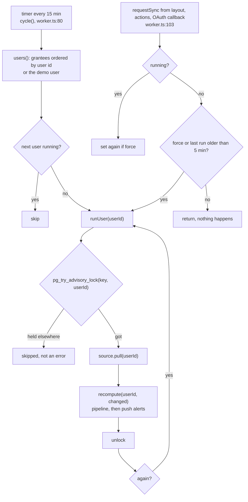

Behaviour, with sources:

- **Scheduling.** `cycle()` clears its timer, walks the user list one at a time with `await runUser`, and re-arms the timer in `finally`
  (`worker.ts:80-89`). The first cycle starts at once (`:96`). A user whose run is already going is skipped (`:83`).
- **Per-user state.** An in-process `Map<number, state>` holds `running`, `lastRunAt`, `lastSuccessAt`, `lastError`, `again`, `liveAt`,
  `live`, `liveStopped` (`:46-51`). It is never pruned.
- **`runUser`** sets `running`, waits for a live heart-rate pull in flight, takes the lock, pulls, recomputes, records success or the error
  message, and clears `liveStopped` (`:53-73`). A queued `again` run starts afterwards, recursively (`:74-77`).
- **`requestSync`** is fire and forget. It does nothing before `start()` (`:105`). While running it only records `again ||= force`
  (`:106-109`). Otherwise the 5-minute gate is on the last *finished* run, not the last success, so a failing source is not retried on every
  page load (`:99-101`, `:110`). `force` bypasses the gate (new grant, journal write, profile save, Google-backed log write).
- **`syncAndWait`** (backs `POST /sync`): requests a forced run and polls the in-memory state every 200 ms until the expected number of
  runs has finished (2 if one was already running, else 1) or 60 s pass. On timeout it answers `ok: true` and the run carries on (`:243-260`).
- **Advisory lock.** `withUserLock` takes a *session* advisory lock on `(0x50756c73, userId)` using a dedicated pool client for the whole
  run, so one of the 10 pool connections is held per running user (`:148-163`). PGlite (tests) takes the lock on its single connection (`:165-172`).
- **Live heart-rate pull** (`pullHeartRate`): skipped while the user's full run is going, within 60 s of the last live pull, or after a 429, a
  revoked grant or `not_connected` until the next full run. It takes the same lock, never throws, and is called by `GET /heart-rate`
  (`worker.ts:118-133`, `src/app/heart-rate/route.ts:21`).
- **After the pull** the worker's recompute hook runs `recomputeIfNeeded`, then `notifyRecovery` and `notifyBrief` (`worker.ts:215-219`).
  Both notifications run inside the user's lock.
- **Lost Google access.** The Google source is wrapped so an `auth_revoked` or `invalid_grant` error sends "Pulse can't sync" once per day
  (`worker.ts:200-210`). The cycle lists only users whose grant has `revoked_at IS NULL` (`:196-197`), but a page load can still run a revoked
  user through `requestSync`; their jobs fail fast with `auth_revoked` (`oauth.ts:324-325`).
- **Singleton.** `globalThis.__pulseWorker` is shared by the instrumentation bundle and route bundles (`:175-177`, `:180-181`).
  Queries read `isRunning` off the global without importing the module (`src/server/queries/settings.ts:231`).
- **Demo.** The demo user is created on the first cycle and its default tags are ensured (`:185-194`).

### 3.3 The Google source

Files: `catalogue.ts` (types), `client.ts` (HTTP), `oauth.ts` (grant), `map.ts` (pure mappers), `sync.ts` (strategy), `write.ts` (log writes), `probe.ts` (a CLI probe, not part of the running app).

**Catalogue.** `DATA_TYPES` holds 36 entries. Each has the filter member (`date`, `sample_time.physical_time`, `interval.start_time`,
`interval.end_time`, `interval.civil_start_time`, or none), `maxDays`, `pageSize` (10,000 or 25) and whether `dailyRollUp` works
(`src/server/sources/google/catalogue.ts:7-24`, `:31-75`). Heart rate and steps are capped at 14 days per request; `sleep`, `exercise`, ECG
differ; roll-up-only types are 14 days.

**Jobs per run.** `JOBS` has **33** entries: 10 daily types (`mapDaily` keys), `sleep`, `exercise`, `total-calories`, `steps-daily`, `steps`,
`time-in-heart-rate-zone`, `heart-rate`, then 16 extras (13 shown-only roll-ups, ECG, irregular rhythm, height)
(`src/server/sources/google/sync.ts:69-92`; counted by importing the lists **[M-doc]**: `daily: 10, extraJobs: 16, fixed: 7`). A run also calls
`pairedDevices` once (`:117`). So a steady-state run makes **at least 34 requests**, one per job window.

**Sync strategy** (`sync.ts:139-183`):

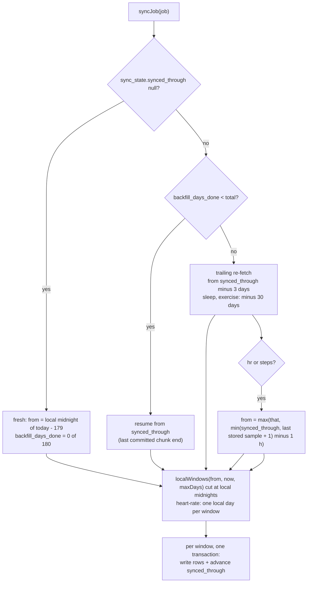

- **Backfill.** `BACKFILL_DAYS = 180` (`sync.ts:44`). Progress is `backfill_days_done / backfill_days_total` in `sync_state`. A chunk's
  rows and its cursor commit in one transaction, so an interrupted backfill resumes (`:176-180`).
- **Order.** Cheap types first, heart rate near the end, extras last (`:77-92`). The data notes estimate the heart-rate backfill at about
  1,300 requests, 5 to 6 minutes at 4 per second (`docs/data-notes.md`, "Cadence and volume"; not measured by me).
- **Trailing re-fetch.** `OVERLAP_DAYS = 3`; `SESSION_OVERLAP_DAYS = 30` for sleep and exercise; heart rate and steps re-read from one hour
  before the earlier of the cursor and the newest stored sample (`:48-59`, `:154-162`).
- **Deletions.** Within a list window the code treats Google's answer as complete. A sleep session or exercise in the window that Google no
  longer returns is deleted and its day marked dirty (`:6-9`, `:307-320`, `:362`, `:370`). It does this only when every point mapped
  (`:362`, `:370`). Heart-rate samples in the window are replaced by what came back, but only when the window returned any (`:379-383`). Deletions older
  than 30 days (sleep, exercise) or whole windows removed upstream (heart rate) are not detected (`ponytail` comments at `:50-55`, `:159`, `:380-381`).
- **Writes.** `upsert()` is a multi-row `INSERT ... ON CONFLICT DO UPDATE ... WHERE (cols) IS DISTINCT FROM (excluded cols)` in chunks of
  1,000, returning only rows that changed (`:253-275`). An unchanged re-fetch writes nothing and reports `changed = false`.
- **What sets `changed` and dirties days.** Daily rows and roll-ups: `changed` only. Sleep, exercise, steps and heart rate: add the
  affected local days to `intraday_dirty` (`:322-386`). Extras and ECG/IRN records never set `changed` (`:333-339`).
- **Heart rate and steps merge** into one row per UTC day (`samples.ts:59-110`). Each call loads the day rows in the window, rebuilds maps of
  every stored sample, and rewrites the whole day's arrays when any value changed (`samples.ts:75-107`). Heart rate uses `replace`, steps use `max` (`sync.ts:352`, `:383`).
- **Per-job error isolation.** A failing job writes its message to `sync_state.last_error` and the loop continues (`:125-135`). Error
  messages hold a status and code only (`oauth.ts:51-60`, `:82-90`).
- **Raw payloads.** Each list or roll-up page is gzipped and archived in `raw_payloads`, deduplicated on a SHA-256 of the body, except heart
  rate and steps (`client.ts:79-99`, `:128`, `:269`). Rows older than 7 days are deleted at the end of each run (`client.ts:125`, `:131-137`,
  `sync.ts:136`). No code reads `raw_payloads` back (every reference is an insert or delete, or in the probe).
- **Mapping.** `map.ts` is pure: int64 strings are cast, an absent field means unknown, not zero (`:5-6`, `:25-31`). Heart rate drops
  `HEALTH_CONNECT` points (`:171-180`). Steps are spread over the minutes of an interval, then the maximum across sources per minute (`:187-209`).
  Sleep picks one `is_main` session per wake day (flagged and longest, else longest) and keeps stage segments only for `SUCCEEDED` with
  readable stages (`:240-300`).
- **Client.** One client per run owns the limiter: 250 ms between requests (`client.ts:17`, `:167-172`). Up to 5 tries for 429, 5xx and network
  failures, backoff 1, 2, 4, 8 s; a `Retry-After` longer than **60 s** fails the job at once (`MAX_WAIT_MS`, `client.ts:22`, `:214-221`).
  (`docs/data-notes.md` says the cap is 5 minutes; the code says 60 s.) A 401 refreshes the token once, then marks the grant revoked
  (`:205-213`).
- **OAuth.** The consent URL asks for `access_type=offline` and `prompt=consent` or `select_account` (`oauth.ts:126-140`). A state token is
  held in an in-memory map for 10 minutes and bound to the user (`:97-120`). The code exchange requires an ID token with a verified email
  and a Google Health profile (`:210-269`). Tokens are refreshed with 60 s of margin (`:18`, `:321-360`).

### 3.4 The pipeline

`src/server/pipeline/`. `SCORING_VERSION = 9` (`types.ts:26`; the comment above it documents versions 1 to 8 only).

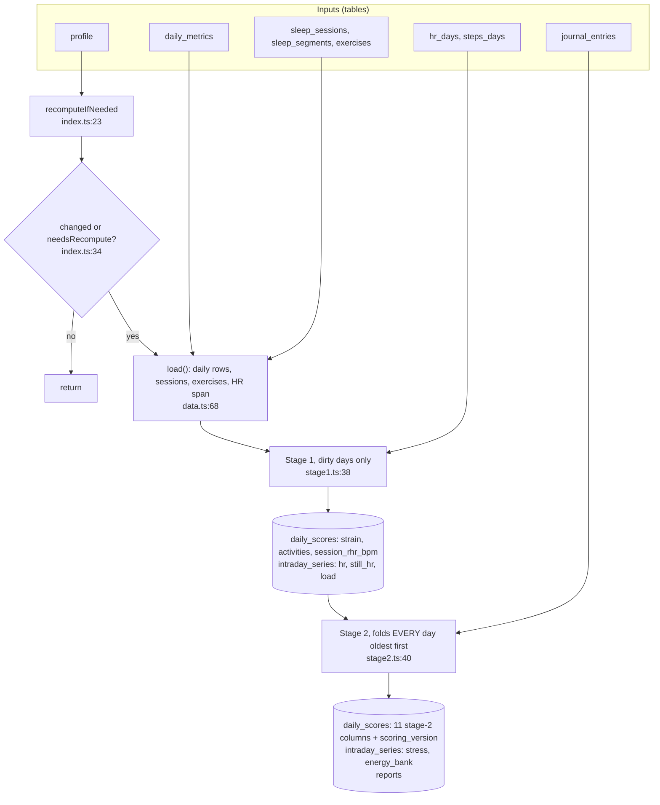

- **Trigger.** `recomputeIfNeeded(userId, changed)`: run when the source changed something, or `needsRecompute` is true: any
  `intraday_dirty` row, any `daily_scores` row with another `scoring_version`, or a newest `daily_metrics` day that has no `daily_scores` row
  (`index.ts:23-45`). Without a profile it returns (scoring needs age and sex, `:26-28`).
- **Stage 1** (`stage1.ts:38-97`): for each day, `stage1Key` hashes the non-sample inputs (scoring version, time zone, max HR, resting HR,
  main sleep, touching sessions and exercises; `:21-36`). A day is redone when it is in `intraday_dirty` (plus the day before when a night started before midnight, `:49-52`) or its stored key differs (`:54`). Days are processed in batches of 30; each
  batch reads HR and steps with one query each and writes `daily_scores` (`strain`, `activities`, `session_rhr_bpm`) and three series (`hr`,
  `still_hr`, `load`) in one transaction (`:60-95`, `data.ts:141-155`). Stage 1 writes `scoring_version = 0` for new rows and does not clear
  `intraday_dirty`, so a crash between stages shows up in `needsRecompute` (`:80-82`).
  Per day it computes: zones on heart-rate reserve, time in zone, Effort (`strain`), per-minute mean HR, a "still minutes" mask for stress,
  per-minute load, session resting HR, and per-activity effort, zone seconds and HR recovery (`:114-188`).
- **Stage 2** (`stage2.ts:40-176`): reads *every* `daily_scores` row (stage-1 JSON, `recovery` and stored `journal_impact`), all sleep
  segments and all journal entries (`:182-221`). Then for each day, oldest first, in a fixed order: sleep, recovery, training load, strain
  target, sleep planner, recovery forecast, stress, energy bank, health monitor, healthspan, fitness, then `recordOutcomes` and the baseline
  updates (`:87-120`). Each scorer reads the `Fold` and some push onto it (`scores.ts:56-75`). The fold holds growing arrays: nights, ledger series,
  readiness rows, monitor rows, healthspan rows, outcomes, efforts, recoveries, daytime aggregates, report rows, wake nights, plus the four baselines.
  `still_hr` and `load` series are loaded 30 days at a time (`:71-86`); stress and energy-bank series are written in batches (`:54-68`).
  After the fold: journal impact per day, memoised on a hash of its inputs (`:124-137`); then one transaction writes the rows in batches of 200,
  upserts reports, deletes reports and rows outside the data range, and **deletes every `intraday_dirty` row for the user** (`:139-175`).
- **Determinism and diff-only writes.** Same database, same bytes: the upserts carry `WHERE (cols) IS DISTINCT FROM (excluded cols)`
  (`stage2.ts:142-144`, `:162`, `data.ts:150-154`, `stage2.ts:168`), so an unchanged recompute writes nothing. Tests: deterministic second
  run (`pipeline.test.ts:67`), identical to a from-scratch run (`:76`), causal (`:105`), version bump recomputes each day once (`:94`).
- **Causality.** A day's scores depend only on that day and earlier days, except the evening features (Energy Bank until tonight's bedtime,
  Stress leaves out tonight's sleep) (`index.ts:1-7`, `AGENTS.md` Rules).

**Data flow per score family** (stored column, scorer, algorithm, spec):

| Family | `daily_scores` column or series | Scorer | Core module | Algorithm doc |
|---|---|---|---|---|
| Effort (day strain), zones, activities | `strain`, `activities` (stage 1) | `stage1Day` `stage1.ts:114` | `core/scoring/strain.ts`, `zones.ts`, `hrRecovery.ts`, `restingHr.ts` | none in `docs/algorithms` |
| Sleep (performance, debt, SRI) | `sleep` | `scoreSleep` `scores.ts:154` | `core/scoring/sleep.ts`, `core/algorithms/sleepRegularity.ts` | `sleep-regularity.md` |
| Recovery, drivers | `recovery` | `scoreRecovery` `scores.ts:208` | `core/scoring/recovery.ts`, `baselines.ts`, `drivers.ts` | none |
| Training load, readiness | `training_load` | `scoreTrainingLoad` `scores.ts:290` | `core/scoring/readiness.ts`, `trainingLoad.ts` | none |
| Strain target | `strain_target` | `scoreStrainTarget` `scores.ts:309` | `core/algorithms/strainTarget.ts` | `strain-target.md` |
| Sleep planner | `sleep_planner` | `scorePlanner` `scores.ts:316` | `core/algorithms/sleepPlanner.ts` | `sleep-planner.md` |
| Recovery forecast | inside `recovery.forecast` | `forecastOf` `scores.ts:340` | `core/scoring/forecast.ts` | none |
| Stress | `stress`, series `stress` | `scoreStress` `scores.ts:354` | `core/algorithms/stress.ts`, `core/scoring/stressBase.ts` | `stress.md` |
| Energy Bank | `energy_bank`, series `energy_bank` | `scoreEnergyBank` `scores.ts:397` | `core/algorithms/energyBank.ts` | `energy-bank.md` |
| Health Monitor | `health_monitor` | `scoreHealthMonitor` `scores.ts:450` | `core/algorithms/healthMonitor.ts`, `core/scoring/illness.ts` | `health-monitor.md` |
| Pulse Age (Healthspan) | `healthspan` | `scoreHealthspan` `scores.ts:488` | `core/algorithms/healthspan.ts` | `healthspan.md` |
| Fitness level | `fitness` | `scoreFitness` `scores.ts:516` | `core/algorithms/fitnessLevel.ts` | `fitness-level.md` |
| Journal impact | `journal_impact` | `stage2.ts:124-137` | `core/algorithms/journalImpact.ts` | `journal-impact.md` |
| Reports (week, month) | table `reports` | `stage2.ts:149-153` | `core/algorithms/reports.ts` | `reports.md` |

`src/core` imports no I/O, clock, random or environment: a search for `Date.now`, `new Date()` (no-argument), `Math.random`, `process.env`
and `console` finds none. The one outward import is a type, `ReasonCode` from `@/lib/reasons` in `core/algorithms/coachSuggestions.ts:1`.

### 3.5 The queries layer

`src/server/queries/*.ts` (17 files, `types.ts` holds the view models, 517 lines). Shared pieces in `common.ts`: `QueryCtx` (`:31-40`),
`userCtx`/`ctxOf` (`:46-62`), `loadDays` (`:107-185`), `loadSeries` for one `(day, kind)` (`:187-194`), `firstDay` (`:196-199`), and the
`ok`/`none`/`maybe` metric builders (`:203-231`). Per-screen ranges are in [2.3](#per-screen-queries-and-the-day-ranges-they-read).
`common.ts` also imports `next/navigation`, `react` and `../auth` (`:7-9`), so the query layer is not free of the web framework.

### 3.6 Notifications, coach, reports, export, admin

- **Push** (`src/server/push.ts`). Off unless all three VAPID variables are set (`config.ts:68`, `push.ts:72`). Subscriptions are rows in
  `push_subscriptions` keyed by `(user_id, endpoint)`; saving moves an endpoint to the current user (`:20-23`). `/push` accepts only https
  endpoints on FCM, Mozilla, Apple or Windows hosts (`src/app/push/route.ts:10-12`). Three alerts: "Recovery ready" once per local day when today's
  recovery exists (`:71-89`), "Pulse can't sync" once per day (`:92-102`), and "Your brief is ready" at the user's chosen minute (`:110-134`).
  Each is claimed with an atomic `UPDATE ... RETURNING` before sending, so a failed send is not retried that day (`:56-68`).
  Sends run in the worker, inside the user's lock, with a 10 s timeout per endpoint (`:42`).
- **Coach** (`src/app/api/coach/route.ts:50-101`). Order: session, access (`coachMode` in `server_settings`, `user.coach_allowed`, owner
  emails; `store.ts:31-38`), consent and model (`:97-110`), in-memory rate limit, body validation, build `QueryCtx`, read admin-edited wording, run
  `streamText` with read-only tools closed over the user's context (`tools.ts:123-223`; each tool calls the same query functions as the
  screens), save the chat on end (`:90-93`). User API keys are AES-256-GCM, key from HKDF of `BETTER_AUTH_SECRET` (`crypto.ts:6-22`).
  Providers: Anthropic, OpenAI, Google, Vercel Gateway, OpenRouter, plus an owner-configured local model (`providers.ts:22-63`). The server never
  accepts a user-supplied URL (`providers.ts:1-3`).
- **Reports** are computed in stage 2 and stored in `reports` (ISO weeks `YYYY-Www` and months `YYYY-MM`) for every period that has data
  (`stage2.ts:149-170`, `core/algorithms/reports.ts:83-86`). Pages only read them (`queries/reports.ts`).
- **Export** (`src/server/export.ts`, routes under `src/app/export/`): daily table (every day from the first stored day via `loadDays`), journal
  table and coach chats, as CSV or JSON, `cache-control: no-store`, never tokens (`export.ts:1-2`, `:13-28`, `:67-77`).
- **Admin** (`src/app/admin/*`, `src/server/admin.ts`, `src/server/actions/admin.ts`): people, invites (token hashed with SHA-256, 7-day
  expiry, `admin.ts:12`, `:53-72`), sign-up and coach access, coach wording. It reads no health data. Owners are `ADMIN_EMAILS`, which can
  only sign up on an empty server (`admin.ts:16-20`). Actions check `isAdmin` themselves.
- **Logging to Google** (`src/server/actions/log.ts`, `src/server/log.ts`, `sources/google/write.ts`): the web process creates a Google client
  and writes data points directly, then mirrors them into `logged_entries` (`log.ts:45-59`). Readable types trigger a forced sync
  (`actions/log.ts:128`, `:146`).

---

## 4. Data

32 tables are defined in `src/server/db/schema.ts` (counted with `grep "= pgTable("`). Six migrations: `0000_init` (26 tables),
`0001_admin_invites`, `0002_coach`, `0003_coach_prompts`, `0004_wonderful_vin_gonzales` (push subscriptions), `0005_lively_the_enforcers`
(coach custom instructions) (`drizzle/*.sql`, `drizzle/meta/_journal.json`). Conventions: unix-second `bigint` timestamps, `date` days in string
mode, `jsonb`, `double precision` (`schema.ts:1-2`). Every per-user table has `user_id` first in its primary key and a cascading foreign key,
enforced by a test (`src/server/db/schema.test.ts:11-42`; exceptions: `user`, `session`, `account`, `verification`, `rate_limit`, `invites`,
`server_settings`, `coach_prompts`, and `raw_payloads`, whose primary key is a serial and whose unique key starts with `user_id`).

### 4.1 Tables

"Size" is from the local dev database: 3 users, of which `daily_scores` has 180 days for user 1 and 183 for user 3; **all heart-rate and steps rows
are user 3's generated demo data** (`hr_days`: 183 rows, 5,676 samples per row on average). Sizes of `daily_scores`, `intraday_series`, `hr_days` came from
`pg_total_relation_size` and `pg_column_size` queries **[M-doc]**, read-only on `pulse-dev-db`. "Not measured" where no query was run.

| Table | Purpose | Key and indexes | Written by | Read by | Size per user-day |
|---|---|---|---|---|---|
| `user`, `session`, `account`, `verification`, `rate_limit` | better-auth, plus Pulse's `role`, `coach_allowed` on `user` | ids; unique email, username, token; `session_userId_idx`, `account_userId_idx`, `verification_identifier_idx` (`schema.ts:17-100`) | better-auth, `admin.ts` | auth, admin | not per day |
| `oauth_tokens` | one Google grant per user: access and refresh token, scope, `revoked_at`, Google email, name, picture | PK `user_id` (`:117-128`) | `oauth.ts:245-256`, `:347-358`, `markRevoked`, `avatar.ts` | worker, oauth, settings, log access | not per day |
| `sync_state` | one row per user and data type: cursor, backfill progress, last attempt, success, error | PK `(user_id, type)` (`:131-144`) | `sync.ts:107-111` | settings, shell status | tiny |
| `raw_payloads` | gzipped raw Google pages, 7-day retention | PK serial; unique `(user_id, type, range_start, range_end, body_hash)`; index `fetched_at` (`:147-160`) | `client.ts:85-98` | **nothing** (no reader) | 324 rows in dev; size not measured separately |
| `hr_days` | band heart rate, one row per user and UTC day: `offsets int4[]`, `values int2[]` | PK `(user_id, bucket)` (`:166-175`) | `samples.ts:59-110` (sync, live pull), `writeSamples` (seed) | stage 1, sleep and heart-rate pages, `lastSample`, `sampleRange` | total 6,560 kB for 183 rows = **36.7 kB per row**. Columns: `offsets` 22,725 B (about 4.0 B per sample, effectively uncompressed), `values` 3,943 B (compressed from 2 B per sample). See [8.3](#83-storage). |
| `steps_days` | per-minute steps, same layout | PK `(user_id, bucket)` (`:178-187`) | `samples.ts` | stage 1 | 344 kB for 182 rows = 1.9 kB per row |
| `daily_metrics` | Google's daily values: HRV, resting HR, respiratory rate, skin temperature, SpO2, VO2max, steps, calories, weight, body fat, zones and ranges | PK `(user_id, day)` (`:189-222`) | `sync.ts:285-286` | pipeline `load`, `loadDays` | 120 kB for 363 rows = 0.33 kB |
| `sleep_sessions` | sleep sessions on their wake day | PK `(user_id, id)`; index `(user_id, day)` (`:225-244`) | `sync.ts:358` | pipeline, queries | small |
| `sleep_segments` | stage segments | PK `(user_id, session_id, start_ts)`, FK to session (`:246-259`) | `sync.ts:289-305` | stage 2, sleep page | 616 kB for 3,971 rows = 1.7 kB per user-day |
| `exercises` | workouts on local start day | PK `(user_id, id)`; index `(user_id, day)` (`:262-277`) | `sync.ts:367` | pipeline, queries | small |
| `journal_tags`, `journal_entries` | behaviours and daily answers | PKs `(user_id, tag)`, `(user_id, day, tag)` (`:279-343`) | actions | stage 2 (impact, monitor context), journal pages | small |
| `daily_values` | Google's shown-only roll-ups and `height_cm` (`day = 'latest'`) | PK `(user_id, day, key)`; index `(user_id, key, day)` (`:296-306`) | `sync.ts:335`, `:343` | `loadDays`, health measurements, profile height | 360 kB total |
| `health_records` | ECG and irregular-rhythm results | PK `(user_id, id)`; index `(user_id, ts)` (`:309-321`) | `sync.ts:338` | health pages | small |
| `dashboard_metrics` | Home "My Dashboard" keys | PK `(user_id, key)` (`:324-332`) | dashboard action | home, `(home)/loading.tsx` | tiny |
| `intraday_dirty` | days whose HR, steps, sessions or journal changed | PK `(user_id, day)` (`:346-353`) | sync, journal action, `saveProfile` | stage 1; cleared by stage 2 | tiny |
| `daily_scores` | one row per day: 3 stage-1 columns, 11 stage-2 columns (13 jsonb in all, incl. `strain`, `activities`), `scoring_version` | PK `(user_id, day)` (`:356-380`) | stage 1 (`stage1.ts:85-93`), stage 2 (`stage2.ts:157-163`) | `loadDays`, shell status, push, journal impact | 4,992 kB for 363 rows = **13.7 kB per row** (heap 2,736 kB, TOAST 2,000 kB, index 40 kB). Compressed column bytes average: `strain` 431, `activities` 83, `recovery` 743, `sleep` 378, `training_load` 208, `strain_target` 91, `sleep_planner` 265, `energy_bank` 224, `stress` 233, `health_monitor` 336, `healthspan` 376, `fitness` 100, `journal_impact` 771; sum about 4.2 kB. The heap holds about 7.5 kB per row, which is not explained by the column sizes alone (dead space or row overhead; not diagnosed). |
| `intraday_series` | per-minute series, 1,440 values each, kinds `hr`, `still_hr`, `load` (stage 1), `stress`, `energy_bank` (stage 2) | PK `(user_id, day, kind)` (`:383-392`) | `data.ts:144-155`, `stage2.ts:60-67` | `loadSeries` (`hr`, `stress`, `energy_bank`), stage 2 (`still_hr`, `load`) | 3,240 kB for 1,625 rows over 363 days = 8.9 kB per day. Avg row bytes: `hr` 1,823, `energy_bank` 2,349 (173 rows), `stress` 745, `still_hr` 809, `load` 253. |
| `reports` | week and month reports | PK `(user_id, period)` (`:395-403`) | `stage2.ts:164-170` | report pages, More, push | 216 kB for 67 rows |
| `profile`, `avatars` | profile (birth date, sex, max HR, height, time zone); uploaded photo | PK `user_id` (`:428-446`) | actions | everywhere (`getProfile`), avatar route | per user |
| `logged_entries` | what the user logged in Pulse, mirrored from Google writes | PK `(user_id, id)`; indexes `(user_id, ts)`, `(user_id, day, type)` (`:452-465`) | `log.ts:45-59` | log page, `waterOn` | small |
| `invites`, `server_settings`, `coach_prompts` | admin: invites, sign-up and coach mode, coach wording versions | serial or key (`:410-426`, `:491-501`) | admin | auth hook, coach | not per user |
| `coach_settings`, `coach_chats` | per-user coach setup (encrypted key) and chats (`messages jsonb`) | PK `user_id`; `(user_id, id)`; index `(user_id, updated_at)` (`:471-515`) | coach actions and route | coach | per user |
| `push_subscriptions` | one row per browser | PK `(user_id, endpoint)` (`:518-530`) | `push.ts:20-27`, claims | `sendPush` | tiny |

`SYNCED_TABLES` (`schema.ts:533-536`) lists what a Google account switch deletes: `sync_state`, `raw_payloads`, `hr_days`, `steps_days`,
`daily_metrics`, `sleep_segments`, `sleep_sessions`, `exercises`, `daily_values`, `health_records`, `intraday_dirty`, `daily_scores`,
`intraday_series`, `reports` (`src/server/avatar.ts:43-48`). `logged_entries` and the journal stay.

Comment drift in the schema file: the doc comment at `schema.ts:405` ("What scoring needs about the person...") sits above `invites`, not above `profile`.

### 4.2 Entity-relationship diagrams

One diagram of 32 tables is unreadable, so it is split in four. Each shows `user` as a stub. Every per-user table has a real foreign key
`user_id -> user.id ON DELETE CASCADE` (`schema.ts:108-111`, enforced by `schema.test.ts:11-42`). Solid lines are foreign keys. Dashed lines are
logical links that the database does not enforce (listed in [4.3](#43-relationships-the-database-does-not-enforce)). Long JSONB payloads are listed by name only.
`PK` and `FK` mark key columns. In composite keys every member is marked `PK`.

#### Auth and account

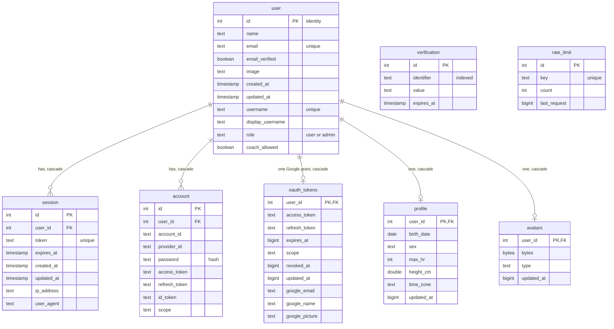

`verification` and `rate_limit` have no `user_id`: better-auth keys them by identifier and by a request key.

#### Raw ingestion (what sync writes)

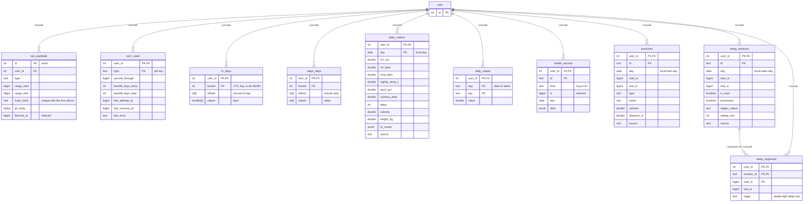

`daily_metrics` has 21 value columns; the diagram lists the main ones (full list: `schema.ts:189-222`).

#### Derived (what the pipeline writes)

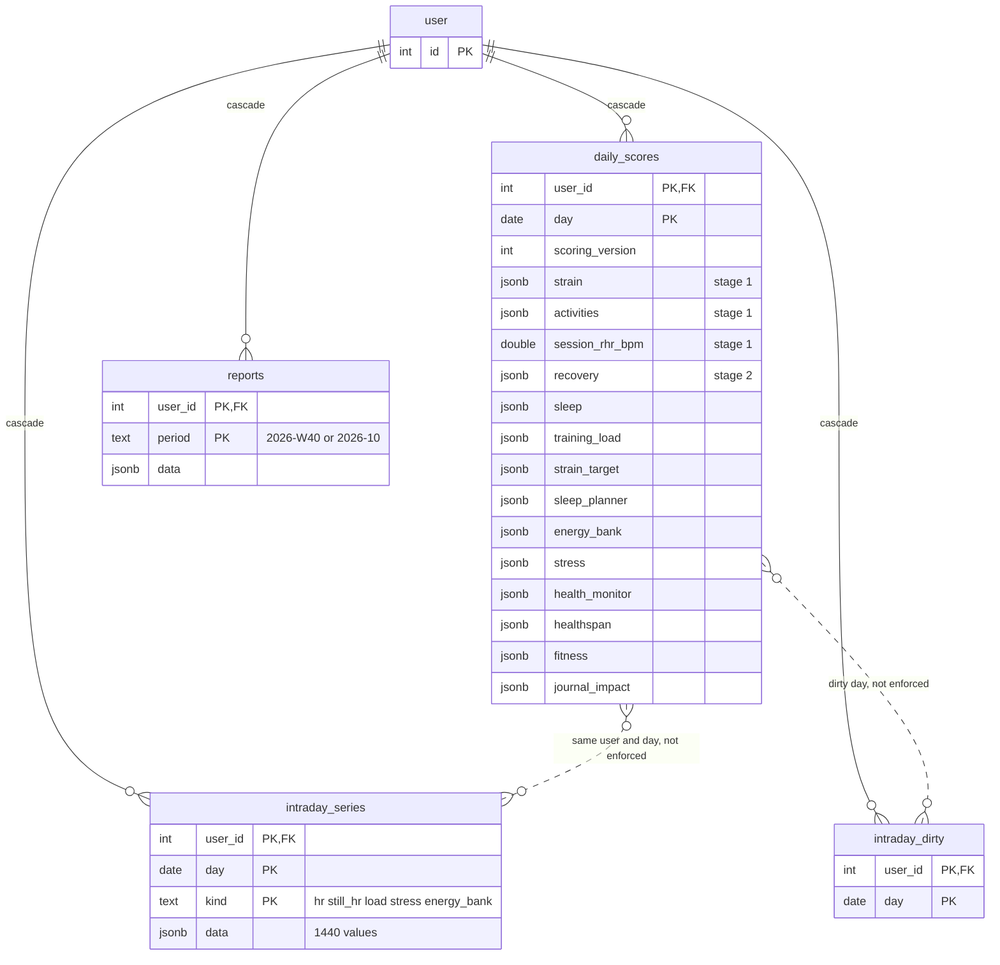

#### App features

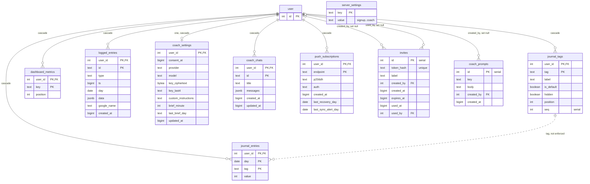

Server-wide tables with no per-user key: `invites`, `server_settings`, `coach_prompts` (`schema.test.ts:9`).

### 4.3 Relationships the database does not enforce

These links exist in the code but have no foreign key, so nothing in Postgres stops a dangling reference. Each is a place where a bug or a partial write can leave rows that disagree.

| Link | Between | How the code keeps it true | Source |
|---|---|---|---|
| Same local day | `daily_scores.day`, `daily_metrics.day`, `sleep_sessions.day`, `exercises.day`, `intraday_series.day`, `journal_entries.day`, `intraday_dirty.day`, `health_records.day`, `logged_entries.day` | Pipeline derives the day list from metrics, sessions, exercises and the HR span, and stage 2 deletes `daily_scores` and `intraday_series` outside `[first, last]` | `pipeline/data.ts:99-108`, `stage2.ts:171-172` |
| UTC bucket versus local day | `hr_days.bucket` and `steps_days.bucket` (UTC day) against every local-day table | `localMidnight` converts at read time; a time-zone change never re-buckets stored samples | `schema.ts:162-165`, `samples.ts:14-22`, `pipeline/data.ts:109` |
| Activity ids inside JSON | `daily_scores.activities[].id` against `exercises.id` | stage 1 builds one entry per exercise of the day; queries match by id | `stage1.ts:166-179`, `queries/common.ts:311` |
| Session ids inside JSON | `daily_scores.sleep.main.id` and `naps[].id` against `sleep_sessions.id` | stage 2 builds them from sessions | `scores.ts:109-150` |
| Journal tag | `journal_entries.tag` against `journal_tags.tag` | the save action refuses an unknown tag; there is no FK, so removing a tag row would leave answers | `actions/journal.ts:41-42`, `schema.ts:334-343` |
| Dashboard keys | `dashboard_metrics.key` against the metric keys in `src/lib/dashboard.ts` | `isDashboardKey` on read | `(home)/page.tsx` import |
| Job key | `sync_state.type` against `JOBS` keys and `GROUPS` in settings | rows are created by `setState`; a retired job leaves a row (the shell ignores optional ones) | `sync.ts:107-111`, `queries/settings.ts:17-46` |
| Report period | `reports.period` against the days in `daily_scores` | stage 2 rewrites all periods and deletes the rest | `stage2.ts:149-170` |
| Stage 1 to stage 2 | `intraday_series.kind in (still_hr, load)` against `daily_scores.strain` of the same day | written in one transaction per batch | `stage1.ts:85-94` |
| Dirty marks | `intraday_dirty.day` against `daily_scores.day` | created by sync, journal, profile save; deleted for the whole user by stage 2 | `sync.ts:374`, `actions/journal.ts:54`, `profile.ts:73-74`, `stage2.ts:174` |
| Google account | `logged_entries.google_name` against the data point at Google | written on create, used on delete | `log.ts:45-59`, `:61-76` |
| Coach brief claim | `coach_settings.last_brief_day`, `push_subscriptions.last_*_day` against the user's local day | atomic `UPDATE ... RETURNING` claims | `push.ts:56-68`, `:123-128` |
| Not a link, but absent | `session`, `account`, `verification`, `rate_limit` carry no Pulse-owned reference to `profile` or `oauth_tokens` other than `user_id` | n/a | `schema.ts:36-100` |

### 4.4 Indexes and which queries use them

"Used by" is read from the query shape in the code. Only the first row of the `daily_scores` and `hr_days` entries was timed (**[M-doc]**, `EXPLAIN ANALYZE` on dev data). I did
not EXPLAIN the others; "no query found" means a search of `src/` found none.

| Table | Index (columns) | Used by |
|---|---|---|
| `user` | PK `id`; unique `email`, unique `username` | better-auth lookups; `isAdmin` by id (`admin.ts:22-25`); `listAccounts` joins (`admin.ts:128-148`) |
| `session` | PK `id`; unique `token`; `session_userId_idx (user_id)` | every request's session lookup (by token); `signOutEverywhere` and `listAccounts` group by user (`admin.ts:129`, `:158`) |
| `account` | PK `id`; `account_userId_idx (user_id)` | better-auth credential lookup; `resetPassword` (`admin.ts:169-174`) |
| `verification` | PK `id`; `verification_identifier_idx (identifier)` | better-auth |
| `rate_limit` | PK `id`; unique `key` | better-auth rate limiter (`auth.ts:99-107`) |
| `oauth_tokens` | PK `user_id` | `getAccessToken` on every Google request (`oauth.ts:323`), `hasGrant`, worker grantee list (`worker.ts:196-197`, a scan filtered on `revoked_at`), `logAccess`, avatar |
| `profile` | PK `user_id` | `getProfile` on every render and request (`profile.ts:39`) |
| `avatars` | PK `user_id` | `/avatar`, `avatarSrc` |
| `sync_state` | PK `(user_id, type)` | `setState` upserts and `syncJob` read (`sync.ts:107-111`, `:140`); `syncRows` (`queries/settings.ts:56-`) on every layout render |
| `raw_payloads` | PK `id`; unique `raw_payloads_dedupe (user_id, type, range_start, range_end, body_hash)`; `raw_payloads_fetched_at (fetched_at)` | dedupe is `ON CONFLICT DO NOTHING` in `archivePage` (`client.ts:85-98`); `fetched_at` serves the prune (`client.ts:131-137`, which also filters `user_id`) |
| `hr_days` | PK `(user_id, bucket)` | `load` range `between bucket` (`samples.ts:14-22`), `lastSample` (`order by bucket desc limit 1`, `sync.ts:389-396`), `sampleRange` (first and last bucket, `samples.ts:42-51`) |
| `steps_days` | PK `(user_id, bucket)` | same functions as `hr_days` |
| `daily_metrics` | PK `(user_id, day)` | `loadDays` range (`common.ts:151`), pipeline `load` (all days, `data.ts:82`), `readings` (all days, `health.ts:412-418`), `getProfile` no |
| `sleep_sessions` | PK `(user_id, id)`; `sleep_sessions_day (user_id, day)` | the PK serves `inArray(id)` deletes and `prune` (`sync.ts:313-318`). No query found that filters sleep sessions by `day`: the pipeline reads by `user_id` ordered by `start_ts` (`data.ts:84-91`) and `prune` filters on `end_ts`. The day index has no confirmed reader |
| `sleep_segments` | PK `(user_id, session_id, start_ts)`; composite FK to `sleep_sessions` | `segments()` by session ids (`sync.ts:292-296`), stage 2 reads all of a user's segments (`stage2.ts:191-195`) |
| `exercises` | PK `(user_id, id)`; `exercises_day (user_id, day)` | `exercisesBetween` day range (`common.ts:300-307`), `activity` and `strain` ranges; pipeline reads all (`data.ts:92-96`) |
| `journal_tags` | PK `(user_id, tag)` | `ensureDefaultTags`, `addTag` count, `tagsOf` (`journal.ts:22-`), save action's known-tag check (`actions/journal.ts:41`) |
| `journal_entries` | PK `(user_id, day, tag)` | `entriesBetween`, `journalWeek` (`home.ts:162-170`), stage 2 reads all (`stage2.ts:197`), export |
| `dashboard_metrics` | PK `(user_id, key)` | `dashboardKeys`, `(home)/loading.tsx` |
| `daily_values` | PK `(user_id, day, key)`; `daily_values_key (user_id, key, day)` | `loadDays` day range uses the PK (`common.ts:155`); `readings` filters `(user_id, key)` ordered by `day desc` and fits the key index (`health.ts:404-411`); `googleHeight` is a PK point lookup (`profile.ts:53-59`) |
| `health_records` | PK `(user_id, id)`; `health_records_ts (user_id, ts)` | `heartRhythm` filters `user_id` and `day <= ?` ordered by `ts desc`, with no limit (`health.ts:379-385`): it can walk the `ts` index but filters `day` row by row |
| `intraday_dirty` | PK `(user_id, day)` | `needsRecompute` (`index.ts:37`), stage 1 read (`stage1.ts:43`), stage 2 delete by user (`stage2.ts:174`) |
| `daily_scores` | PK `(user_id, day)` | `loadDays` range (`common.ts:131`; 0.11 ms for a 60-day read on dev data, **[M-doc]**), stage 1 and 2 full-user reads, `latestImpact` (`order by day desc limit 1`, `journal.ts:53-60`), `getWearStreak` (1.1 ms for 183 rows, **[M-doc]**), `firstDay` (`min(day)`), push `notifyRecovery` point lookup (`push.ts:77-80`) |
| `intraday_series` | PK `(user_id, day, kind)` | `loadSeries` point lookup (`common.ts:187-194`), stage 2 batch read `kind in (still_hr, load)` with a day range (`stage2.ts:81-84`), `upsertSeries` conflict target (`data.ts:151`) |
| `reports` | PK `(user_id, period)` | `readReport` point lookup, `latestReport` with `period like 'YYYY-Www'` ordered `desc limit 3` (`home.ts:304-311`): the PK prefix is `user_id` and the `like` filters the rest; More's count with a JSON filter (`settings.ts:155-165`) |
| `invites` | PK `id`; unique `token_hash` | `usable(token)` for `claimInvite` and `inviteValid` (`admin.ts:60-72`) |
| `server_settings` | PK `key` | `signupMode`, `coachMode` (`admin.ts:38-41`, `coach/store.ts:21-24`) |
| `logged_entries` | PK `(user_id, id)`; `logged_entries_ts (user_id, ts)`; `logged_entries_day_type (user_id, day, type)` | `recentEntries` `ts >= ? order by ts desc` (`log.ts:79-90`) uses the `ts` index; `waterOn` filters `(user_id, type, day)` (`log.ts:100-111`) fits `day_type` (`day` first, then `type`) |
| `coach_settings` | PK `user_id` | `coachModel`, `coachSetup`, `notifyBrief` |
| `coach_prompts` | PK `id`; `coach_prompts_key (key, id)` | `coachTexts` newest row per key: `distinct on (key) order by key, id desc` (`coach/texts.ts:110-112`) |
| `coach_chats` | PK `(user_id, id)`; `coach_chats_recent (user_id, updated_at)` | `listChats` `order by updated_at desc, id desc limit 31` (`coach/store.ts:123-138`), `loadChat` PK lookup |
| `push_subscriptions` | PK `(user_id, endpoint)` | `sendPush` by user, `claim` updates by user (`push.ts:34`, `:61-68`). `saveSubscription` deletes by `endpoint` alone (`push.ts:21`): the PK starts with `user_id`, so that delete cannot use it; there is no index on `endpoint`. Table is small, so this is minor |

### 4.5 Write paths in one picture

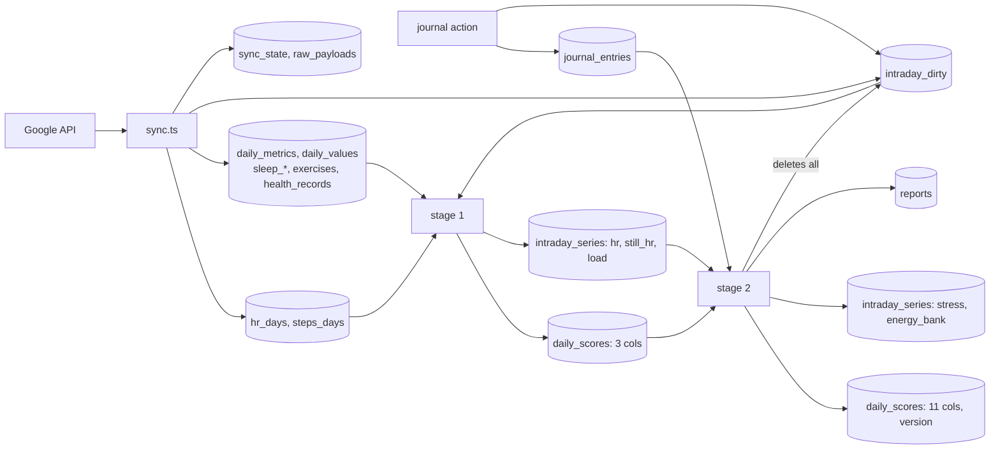

### 4.6 Migrations, retention and pruning

- Migrations are forward-only SQL files generated by `drizzle-kit`; CI fails when `schema.ts` and `drizzle/` disagree (`.github/workflows/ci.yml:36-44`).
  They are applied at every boot (`instrumentation.ts:6`). `scripts/deploy.sh` dumps Postgres first (`:63-72`).
- Retention that exists in code:
  - `raw_payloads`: 7 days, pruned each run (`client.ts:125-137`).
  - `better-auth` sessions: 30 days; nothing in the repo deletes expired rows (not checked in the library).
  - `reports` and `daily_scores` outside the current data range are deleted by stage 2 (`stage2.ts:170-172`).
  - Invites expire at 7 days but expired rows stay until revoked (`admin.ts:89-103`).
- No retention or pruning exists for `hr_days`, `steps_days`, `intraday_series`, `daily_scores` or `coach_chats`. They grow with history.
- `ANALYZE`, autovacuum tuning and bloat monitoring are not configured in the repo (`grep` for `vacuum` finds only a comment, `client.ts:123`).
  In dev, `daily_scores` shows 765 updates of which 122 were HOT (`pg_stat_user_tables`, **[M-doc]**).

---

## 5. Caching at every layer

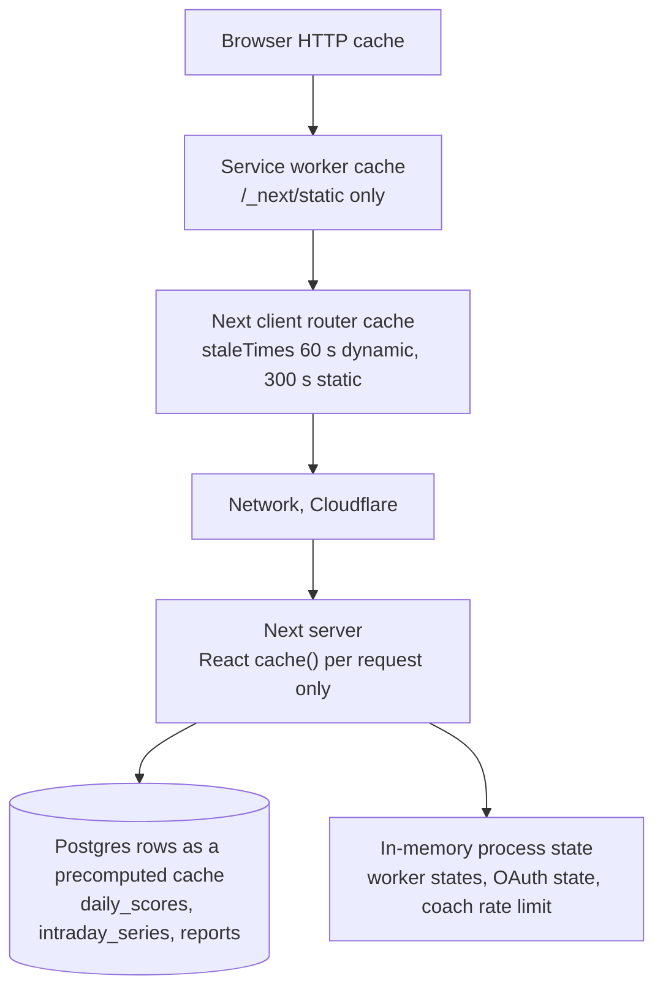

| Layer | What is cached | Rule | Source |
|---|---|---|---|
| Browser HTTP cache, static | Hashed build files under `/_next/static` | Next's default for hashed files. The repo sets no header for them. **Not verified here.** | none in repo |
| Browser HTTP cache, set by the repo | `/sw.js`: no-cache, no-store, must-revalidate. `/offline.html`: no-cache. All paths: `X-Frame-Options: DENY`, `frame-ancestors 'none'`, `nosniff`, `Referrer-Policy`. Avatar: `private, max-age=31536000, immutable` (URL carries `?v=<updatedAt>`). Exports, `/sync`, `/status`, `/heart-rate`, `/push`: `no-store`. | | `next.config.ts:24-34`, `src/app/avatar/route.ts:17`, `export.ts:67-77`, route files |
| Browser HTTP cache, pages and RSC | Pages are dynamic. The `Cache-Control` they send is Next's default for dynamic responses. **Not verified here.** | | unclear |
| Service worker | `/offline.html`, `/icons/icon-192.png`, and `/_next/static/*` filled on first use. Navigations are network first. No pages, RSC, API or health data. | Per-build cache name only in the uncommitted `sw.js`. | `public/sw.js:5-50` |
| Next client router cache | Visited and prefetched route payloads | `dynamic: 60 s`, `static: 300 s`; cleared by `router.refresh()` and by `revalidatePath`. Tabs are fully prefetched. | `next.config.ts:12-15`, `AppNav.tsx:63` |
| Server-side caching | **None.** No `unstable_cache`, `use cache`, `revalidate` or HTTP cache layer. The only per-request memo is React `cache()` in `userCtx` and `currentUser`. | | `queries/common.ts:46`, `auth.ts:140` |
| The database as a precomputed cache | Scores per day (`daily_scores`), per-minute series, reports: computed by the worker, read by pages. Stage 1's `strain.key` is a content hash that makes a day's stage 1 skippable. Journal impact keeps a hash key per day. | | `stage1.ts:21-36`, `stage2.ts:131-134` |
| In-memory worker and other process state | `states` map per user (running, last run, last error, live-pull throttle); `globalThis.__pulseWorker`; OAuth `state` map (10 min); coach rate-limit map; `lastRun` timings; time-zone `Intl` formatters; `getConfig()`; the `getAuth()` instance | Lost on restart. Not shared between processes. | `worker.ts:46`, `oauth.ts:97`, `coach/store.ts:191`, `pipeline/index.ts:20`, `time.ts:4`, `config.ts:115`, `auth.ts:123-129` |
| Postgres | Shared buffers 64 MB in compose. | | `compose.yaml:12` |

---

## 6. End-to-end flows

### 6.1 First sign-in, onboarding, first backfill

```mermaid
sequenceDiagram
  participant U as Browser
  participant P as proxy.ts
  participant A as better-auth
  participant L as (app) layout
  participant W as Worker in the web process
  participant G as Google
  participant D as Postgres
  U->>A: POST /api/auth/sign-up/email (+ x-pulse-invite)
  A->>D: user.create.before: mode check, claim invite
  A->>D: insert user, account; ensureDefaultTags
  A-->>U: session cookie
  U->>P: GET /
  P->>L: cookie present
  L->>D: currentUser, ctxOf: no profile
  L-->>U: redirect /onboarding
  U->>L: saveProfileAction (birth date, sex, time zone)
  L->>D: saveProfile, mark days dirty (none yet)
  L->>W: requestSync(force)
  W->>D: pull: no grant, changed false; recompute: nothing to load
  U->>L: Connect Google, GET /oauth/start
  L->>L: createState(userId), in memory
  L-->>U: 302 Google consent
  U->>L: GET /oauth/callback?code&state
  L->>L: consumeState(state, userId)
  L->>G: exchange code, check Health profile
  L->>D: upsert oauth_tokens; setGoogleAccount
  L->>W: requestSync(force)
  L-->>U: 302 /settings?oauth=connected
  W->>D: advisory lock
  loop 33 jobs, 180-day backfill, 4 requests per second
    W->>G: list or dailyRollUp window
    W->>D: transaction: rows + sync_state cursor
  end
  W->>D: recompute: stage 1 for all days, stage 2 fold
  U->>L: GET /status every 2 s while importing
  L-->>U: importProgress done of 180
  U->>L: router.refresh when the run ends
```

Notes:

- Scores appear only after the whole pull ends: `pull` runs every job, and only then `recompute` runs (`worker.ts:58-61`). A restart mid-backfill resumes
  from each job's stored cursor (`sync.ts:151-153`).
- Until then, `getShellStatus` reports `importing` with the lowest `backfill_days_done` across pending core types (`queries/settings.ts:96-102`, `:240-259`).
- The polling interval is `STATUS_POLL_MS = 2000` (`ShellStatus.tsx:35`).

### 6.2 A morning app open

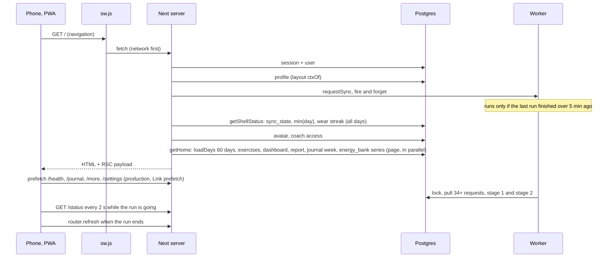

The page renders from what is already stored, so the first paint shows last night's data if the worker's 15-minute cycle already ran
(`layout.tsx:32`, `:34`). New data arrives after the forced refresh. The number of database queries per render is not counted in code; the
Postgres migration plan estimated 20 to 28 for Home (`docs/plans/2026-10-03-004-postgres-multi-user-migration.md`, section 4.6). Not verified.

### 6.3 A tab switch

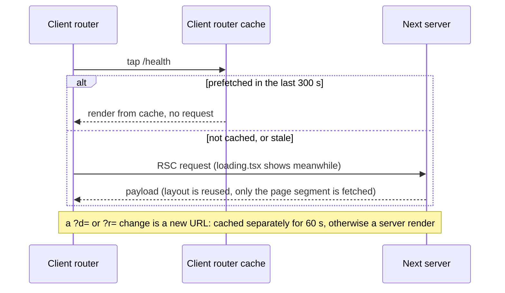

Per the `staleTimes` doc, shared layouts are not refetched on every navigation, only the changed page segment
(`node_modules/next/dist/docs/01-app/03-api-reference/05-config/01-next-config-js/staleTimes.md`). Because of that, the layout's
`requestSync` and `getShellStatus` run on a hard load, a refresh, or a prefetch of a route that includes the layout, not on every tab tap. Which
of these actually happens per tap is **not measured**.

### 6.4 "Sync now"

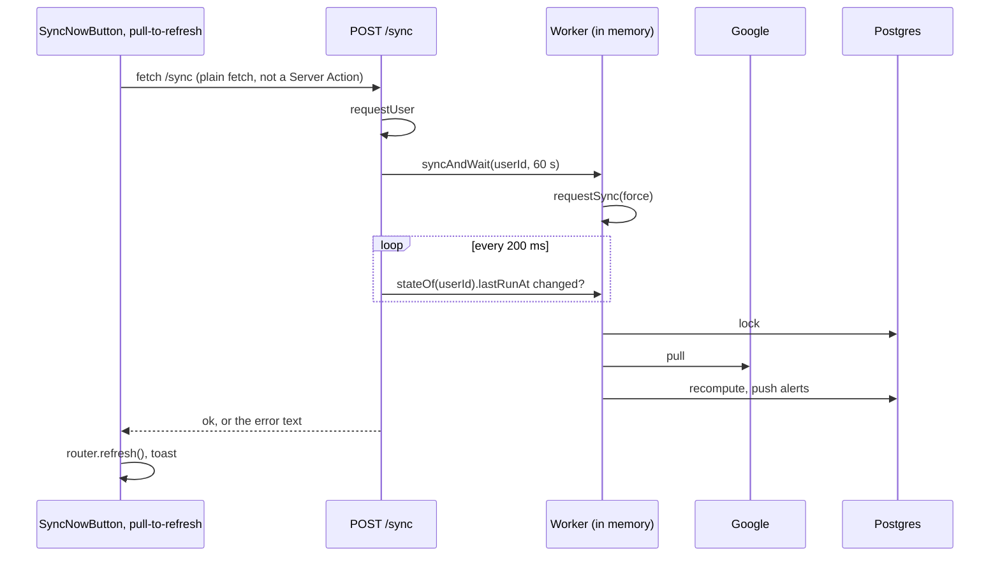

Sources: `src/lib/sync-activity.ts:23-29`, `src/app/sync/route.ts:12-17`, `worker.ts:243-260`. It is a route, not an action, because
Next holds navigation until a pending action returns (`src/app/sync/route.ts:6-10`). If a run is already going, the wait covers two runs (`worker.ts:246`).
There is no rate limit on repeated calls.

### 6.5 A journal check-in, online and offline

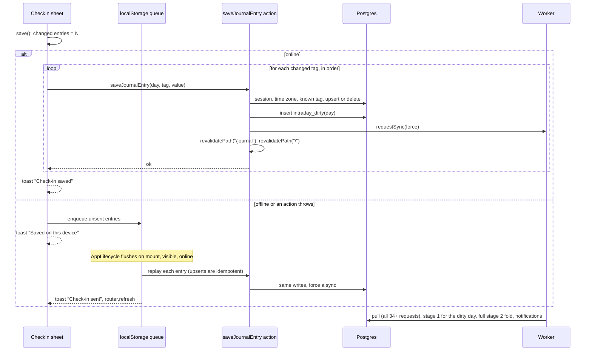

Sources: `CheckIn.tsx:197-224`, `src/server/actions/journal.ts:32-59`, `src/lib/offline-queue.ts:27-54`, `AppLifecycle.tsx:41-68`.

- One check-in with N changed tags makes N Server Actions and N forced `requestSync` calls. The worker coalesces them to at most one running plus one
  queued run (`worker.ts:106-109`, `:74-77`).
- Each forced run does a full Google pull, though a check-in changed nothing at Google. The dirty mark exists so `needsRecompute` is true and stage 2
  re-reads the journal (`journal.ts:51-54`). It also makes stage 1 redo that day (`stage1.ts:54`).
- Not queued offline: anything except check-in answers.

### 6.6 A deploy with a new `SCORING_VERSION`

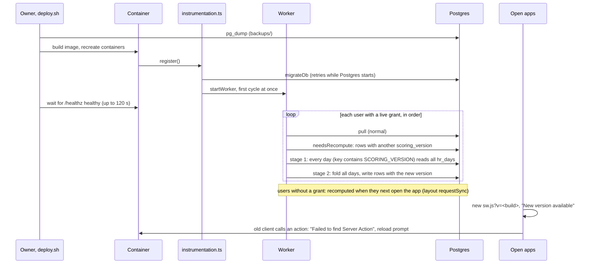

Sources: `scripts/deploy.sh`, `instrumentation.ts:3-12`, `worker.ts:96`, `:196-197`, `pipeline/index.ts:34-45`, `stage1.ts:21-27`, `:54`, `PwaRuntime.tsx:21-24`, `:35-56`.

- While a user's recompute is pending, pages keep reading the old rows; no query checks `scoring_version` (`loadDays` does not select it, `common.ts:112-131`).
- The recompute runs in the web process. The synchronous parts of stage 2 (the fold between batches, the journal-impact loop, the write loops) block the event loop (see [8.1](#81-compute)).
- A SCORING_VERSION bump is the one case where stage 1 recomputes every day, which reads every `hr_days` row of the user.
- `golden.test.ts` pins one fingerprint per column for each version; a scoring change must add a new entry (`golden.test.ts:10-14`, `:195-203`).

---

## 7. Security and privacy boundaries

**What is private per user.** Every per-user table has `user_id`, first in the primary key, with `ON DELETE CASCADE` (`schema.test.ts:11-42`). There is
**no row-level security** (no policy or RLS statement in `drizzle/` or `src/`). Isolation is a code convention: every query filters on
`ctx.userId` (`AGENTS.md`, Users rule). Two tests check it: `isolation.test.ts` builds every screen's view model for user 1 before and after user 2
has data, and `auth.contract.test.ts` globs every Server Action and route handler and checks each refuses a signed-out caller.

**Where `user_id` filtering is enforced.** Inside each query, action and route, by hand: `loadDays` (`common.ts:131`, `:151`, `:155`), `loadSeries`
(`:192`), pipeline `load` (`data.ts:82`, `:90`, `:96`), stage 1 and 2 (`stage1.ts:42-43`, `stage2.ts:84`, `:190`), sync `upsert` (`sync.ts:257`,
adds `userId` to every row) and `prune` (`:313`, `:317`). The coach tools close over the session's `QueryCtx`, so the model never names a user (`tools.ts:1-3`).

**Tokens and secrets.**

| Secret | Where | Protection |
|---|---|---|
| Google access and refresh tokens | `oauth_tokens.access_token`, `refresh_token` (`schema.ts:117-128`) | **Stored as plain text.** No encryption code touches them (`oauth.ts:63-69`, `:245-256`). A database dump holds every user's refresh token (`docs/setup.md:315`). Errors and logs carry status and code only (`oauth.ts:4-5`, `:51-60`). |
| Coach API keys | `coach_settings.key_ciphertext` | AES-256-GCM, key from HKDF of `BETTER_AUTH_SECRET`; never sent to the browser or exported (`coach/crypto.ts:1-24`). Rotating the secret makes them unreadable. |
| Session cookie | better-auth | Signed with `BETTER_AUTH_SECRET`; a demo instance uses a fixed public secret (`auth.ts:34`, `demo.ts:6`). Cookie flags are the library's defaults; not verified here. |
| Invite tokens | `invites.token_hash` | SHA-256 only (`admin.ts:14`, `:56`). |
| Push keys | VAPID env vars; per-browser `p256dh`, `auth` | Subscriptions are rows in `push_subscriptions`. |
| `BETTER_AUTH_SECRET`, `POSTGRES_PASSWORD`, Google client secret | `.env` on the server | Validated at boot by zod (`config.ts:8-76`). |

**Other boundaries.**

- The proxy and layout gate pages; each route and action re-checks (`proxy.ts:12-18`, [2.10](#210-auth-on-the-client-and-the-proxy)). CSRF: `/sync`, `/push`, `/logout`
  rely on the session cookie being `SameSite=Lax` and carry no Origin check of their own (comments at `sync/route.ts:6-10`, `push/route.ts:14`, `logout/route.ts:3-6`);
  the cookie attribute comes from better-auth and was not verified here.
- Admins see accounts, roles, activity and Google-connected flags, never health data (`admin.ts:127-150`). Password reset is owner-only (`setup.md:139-142`).
- The coach sends the user's questions and tool results to the provider they chose. Users cannot set a URL (SSRF), only the owner via `COACH_LOCAL_URL`
  (`providers.ts:1-3`, `config.ts:31-33`).
- Push endpoints are limited to https and four push-service host patterns (`push/route.ts:10-12`).
- No script Content-Security-Policy: the header set is `frame-ancestors 'none'` only (`next.config.ts:30`).
- A signed-in user can call `/sync` without limit; each call forces a run (see [8.4](#84-reliability-and-abuse)).

---

## 8. Known bottlenecks and risks

Cited measurements: page queries 3 to 5 ms; `loadDays` over 730 days 3.6 ms and 478 KB of JSON parsed; a full recompute about 120 ms of which stage 2
about 115 ms, synchronous, in the Next.js process; storage about 47 KB per user-day (`hr_days` 18.5, `daily_scores` 14, `intraday_series` 9); average
`daily_scores` JSON about 3.4 KB per day excluding `journal_impact` at 0.8 to 1.8 KB; production `/healthz` round trip 120 to 170 ms (owner measurements, from
the brief and `docs/plans/scale-10k-users.md:21-29`).

### 8.1 Compute

1. **Stage 2 re-folds all history on every run, and parts of the fold are quadratic.** Each day the fold re-reads whole arrays:
   `evaluateWithTrainingLoad(f.readinessRows, ...)` sorts and re-parses every row (`scores.ts:293`, `core/scoring/readiness.ts:143`, `:168`,
   `trainingLoad.ts:106-113`); `healthspan(f.hsRows, ...)` parses every row's date several times (`healthspan.ts:216-221`, `:234`);
   `foldDaytimeBaseline(f.aggregates)` and Health Monitor's per-vital `foldHistory(prior...)` replay all earlier days (`scores.ts:356`, `healthMonitor.ts:77`).
   **[M-doc]** Scaling run (PGlite in-process, generated demo data, a no-change recompute, stage 2 only): 180 days 209 ms, 360 days 480 ms, 720 days 1,246 ms.
   Doubling the history costs 2.3x then 2.6x. That is between linear (2x) and quadratic (4x). PGlite's database cost is not the same as the production driver's, so only the shape
   carries over. Method: a throwaway script outside the repo seeds a PGlite database with `seedPull` at 180-day spacing, then calls `recompute` twice
   and reads `lastRun`. A CPU profile of the 720-day no-change run put about 255 ms in `baselines.ts` (of which `isoEpochDay` 187 ms),
   132 ms in `healthspan.ts`, 96 ms in `trainingLoad.ts`, 59 ms in `reports.ts`, and about 450 ms in the database layer.
2. **A full recompute is dominated by journal impact when there is no memo.** **[M-doc]** At 720 days, stage 2 took 6.8 s of which about 5.4 s was `journalImpact.ts`
   (bootstrap with 1,000 resamples per tag and metric) in a CPU profile of the whole script. The loop is synchronous (`stage2.ts:128-137`). The memo
   (`:131-134`) hides it once rows exist, and survives a scoring change that leaves recovery, HRV z and sleep performance unchanged. The seeded journal's density
   is not the same as a real user's.
3. **The worker runs in the web process.** Between awaits, the fold and the loops block the event loop that serves pages (`stage2.ts:71-121`, `:128-137`, `:145-153`).
   The stage-2 no-op cost of 115 ms at 180 days is the best case.
4. **Stage 2 reads and rewrites everything.** It selects `strain`, `activities`, `recovery`, `journal_impact` for every day (`stage2.ts:188`) and
   sends every row to Postgres to be compared (`:145-163`).
5. **Every sync with new heart rate triggers a full stage-2 fold,** because today is dirty (`sync.ts:383-385`) and stage 2 has no incremental mode.
6. **The sequential cycle cannot finish at scale.** One steady-state run makes at least 34 requests, paced at 250 ms (`client.ts:17`, `sync.ts:117`, `:125`),
   so at least 8.5 s per user **before** Google's latency or any compute (arithmetic from the constants; not measured). A 15-minute cycle (`worker.ts:17`)
   therefore covers about 105 users; 10,000 users would need about 23.6 hours per cycle.
7. **Journal check-ins force a full pull.** N tag changes cause up to two full runs of 34+ requests (see [6.5](#65-a-journal-check-in-online-and-offline)).

### 8.2 Database reads

1. `getShellStatus` (every layout render and every 2-second status poll) reads every scored day's `strain` JSON for the wear streak (`queries/settings.ts:201-234`).
   The query took 1.1 ms for 183 rows in dev **[M-doc]**; it grows with history.
2. `loadDays` reads 12 jsonb columns for ranges of 60 to 730 days where a screen often needs one or two fields. Examples: Home's strip uses only `recovery.value`
   for most of its 60 rows (`home.ts:53-55`, `:79`); Metric and Trends read 730 rows (`metric.ts:179`, `trends.ts:138`).
   A 60-day read executed in 0.11 ms in Postgres on dev data **[M-doc]**; the cost is parsing (478 KB for 730 days, measured).
3. Layout queries per render include a duplicate profile lookup ([2.3](#23-the-data-fetching-pattern)).
4. `queries/settings.ts:231` and `/sync` depend on the in-memory worker, so they work only because worker and web share a process.

### 8.3 Storage

1. **`hr_days` per heart-rate day is larger than the 18.5 KB per user-day figure.** The 18.5 KB number is the table total (6,560 kB) divided by 363 user-days (3
   users' `daily_scores` rows), but the table has rows for one user only: 183 rows, 5,676 samples each. Per row it is 36.7 kB, which is 6.5 bytes per sample; the
   columns alone are 4.7 bytes per sample (`offsets` 22,725 B uncompressed at 4 B per sample, `values` 3,943 B). The TOAST relation is 6,376 kB for 183 rows,
   about 34.8 kB per row, against about 26.7 kB of column data per row. The excess is roughly 30% (dead tuples or chunk overhead; not diagnosed; 21 updates were seen).
2. **The measured heart-rate density is generated data.** The 5,676 samples per day come from the demo seed (about one sample every 15 s). Real Google heart rate is denser:
   the data notes record about 37,000 rows per day for one Fitbit (`docs/data-notes.md`, "Cadence and volume"), and a code comment says a day can hold 86,000 points (`sync.ts:165-166`).
   Stored size scales with samples, so real `hr_days` rows may be several times larger than any figure above. **Not measured on production data.**
3. `daily_scores` heap is about 7.5 kB per row while its columns total about 4.2 kB. Every stage-1 and stage-2 run updates rows; autovacuum and HOT-update behaviour are not tuned.
4. `journal_impact` is stored for every day (0.8 to 1.8 kB), but pages read only the newest (`queries/journal.ts:53-63`). The rest is a memo for stage 2 (`stage2.ts:133`).
5. `still_hr` and `load` series (1,062 B per day together) are read only by stage 2 (`stage2.ts:84`).
6. `raw_payloads` is write-only in app code (nothing selects from it). It holds at most seven days.
7. Written but never read: `daily_metrics.hr_zones`, `hrv_deep_ms`, `rhr_method`. `hr_zones` is selected by the pipeline (`data.ts:77`) and then unused; the `daily-heart-rate-zones` job still runs
   (`sync.ts:79`, `map.ts:74`). `light_moderate_min` and `vigorous_peak_min` feed only one display stat (`queries/metric.ts:356-357`), although a comment says they are score inputs (`sync.ts:85`).
8. Whole-day rewrite on every merge: `mergeSamples` rewrites a day's full arrays whenever any sample changed (`samples.ts:75-107`), and the live pull does it up to once a minute per viewer.

### 8.4 Reliability and abuse

1. All in-process state is lost on restart and cannot be shared: worker state, OAuth state, coach rate limit ([5](#5-caching-at-every-layer)). A second web instance would break `/sync`, the sync indicator, OAuth connect, and the coach limit.
2. Webhook-free polling plus the per-user gate `FRESH_MS` is the only load control. `force` bypasses it, and `/sync` has no limit (`worker.ts:110`, `sync/route.ts`).
3. The pool is 10 connections, and each running user holds one for the whole run (`worker.ts:150-160`). Two simultaneous user runs are impossible today (the cycle is sequential, `requestSync` runs
   parallel to the cycle): a cycle run, several requested runs and the live pull can each hold a lock connection.
4. Stage 2 deletes every dirty mark for the user at its end (`stage2.ts:174`). Runs are serialised per user by the lock, so a mark added mid-run by another process is lost only if that process does not hold the lock; the
   journal action does write marks without the lock (`actions/journal.ts:54`), so a check-in saved while a run is between stage 1 and stage 2's final transaction can have its dirty mark deleted. The forced `requestSync` that follows
   (`:55`) queues another run (`worker.ts:107`), which reduces but does not remove the gap. Not reproduced.
5. Google tokens are stored in plain text ([7](#7-security-and-privacy-boundaries)).
6. The unverified Google app limit (100 users) and quotas are external facts recorded in `docs/plans/scale-10k-users.md:43-54`; I did not re-check them.
7. Server-side deploys keep no zero-downtime path: one container, recreated in place (`scripts/deploy.sh:84-85`).

---

## Unknowns

Things I could not settle from the code or by measurement:

1. Real-account storage and CPU: production heart-rate volume per day, `hr_days` size on real data, stage-2 time at 730 days against real Postgres (my scaling run used PGlite).
2. Whether production runs the uncommitted `public/sw.js` (per-build cache) or the committed one (`pulse-static-v1`).
3. The `Cache-Control` Next sends for pages, RSC payloads and `/_next/static` in this build (framework default, not set in the repo).
4. How many prefetch requests an app open generates (`AppNav` uses `prefetch`), and which of `requestSync` and `getShellStatus` run per tab tap.
5. The number of database queries per page render (the plan's "20 to 28" for Home was not re-counted).
6. better-auth's cookie flags (`SameSite`, `Secure`, `HttpOnly`) and whether expired session rows are ever deleted.
7. Why the `daily_scores` heap is about 7.5 kB per row against 4.2 kB of columns (page free space, dead tuples, or overhead). `pg_stat_user_tables` estimates in the dev DB looked unreliable (`n_live_tup` 1 for 183 rows), so I used `count(*)`.
8. How Next behaves on a client navigation while offline inside an open app (only the service worker's navigation fallback was read).
9. Google's retention beyond about 209 days and the latency of Google calls (only the 250 ms pacing was read).
10. `site/` (the Astro landing page) and `src/app/dev/brand` were not examined.
11. Whether `docs/data-notes.md`'s 5-minute `Retry-After` cap or the code's 60 s is intended (they disagree).
