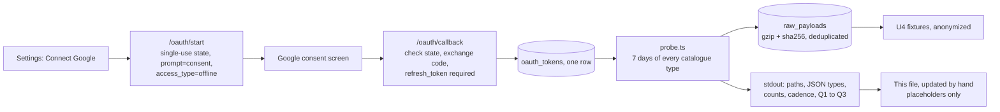
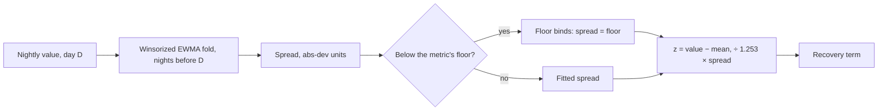

# Google Health API data notes

**Status: unconfirmed on the Fitbit Air.**

Everything below comes from Hælan's probe findings: `probe/findings/field-map.md`, `volume.md`, `scopes.md`, `rollup-methods.md` and `retention.md`. Hælan ran them in August 2026 against one Fitbit account in Europe/Amsterdam. The rest comes from Hælan's `catalogue.ts`.

- Every item carries a status: **confirm on Fitbit Air**, until the first real probe run checks it (U3 verification).
- Values are placeholders such as `<int64 string>`. This file never holds a real reading, timestamp or device name.
- The catalogue in code is `src/server/sources/google/catalogue.ts`. Keep the table below in step with it.

## Where the probe fits



## Running the probe

1. In `.env`, set:
   - `GOOGLE_OAUTH_ENABLED=true`
   - `GOOGLE_CLIENT_ID` and `GOOGLE_CLIENT_SECRET`
   - `APP_URL=http://localhost:3000`

   Register `http://localhost:3000/oauth/callback` on the OAuth client. Its publishing status must be **In production**, because Testing gives refresh tokens a 7-day life.
2. Run `pnpm dev`, open `/oauth/start` and grant every permission. Then stop the server, because the server and the probe share the 5 QPS per-user limit.
3. From the repo root:

   ```sh
   pnpm tsx --env-file=.env src/server/sources/google/probe.ts > data/probe-output.txt
   ```

   `data/` is gitignored. The output contains dates and device names, so keep it out of git.
4. Fill in the "Fitbit Air" cells below with placeholders or shapes, never values, and tick the checklist at the end.

## Conventions (confirm on Fitbit Air)

- **Three casings for one type.** Kebab in the URL path (`daily-resting-heart-rate`), snake in the filter (`daily_resting_heart_rate.date`), camel in the body (`dailyRestingHeartRate`). The filter parser rejects the camel form.
- **List.**
  - Path: `GET /v4/users/me/dataTypes/{type}/dataPoints?filter=…&pageSize=…&pageToken=…`.
  - The body holds `dataPoints[]`, plus `nextPageToken` when more pages follow.
- **Filter grammar.** `<snake_type>.<member> >= "X" AND <snake_type>.<member> < "Y"`. Each member has its own value format:
  - `date` is civil `YYYY-MM-DD` in `TZ`.
  - `interval.civil_start_time` is civil `YYYY-MM-DDTHH:MM:SS` in `TZ`, with no offset.
  - The physical members take RFC 3339 UTC.
- **A wrong filter member is a 400**, not an empty result. Google does not document the members.
- **int64 arrives as a JSON string.** Examples: `beatsPerMinute`, `minutesAsleep`, `steps.count`. Mappers must cast.
- **proto3 omits zero and empty fields.** A missing `dataPoints` means no data. A `civilStartTime.time` can be `{}`, which means midnight.
- **Page cap.** Hælan requested `pageSize=10000` and got pages capped at 5,000 for dense types. Pulse sends 10,000, or 25 for `sleep` and `exercise`.
- **Data sources.** Every point carries `dataSource.platform` (observed values: `FITBIT`, `HEALTH_CONNECT`), `dataSource.recordingMethod` and usually `dataSource.device.displayName`.

## Catalogue

"Max window" is the longest range one request covers, in local days. The list windows are cut at local midnights in `TZ`.

| Type | Filter member | Max window | pageSize | list | dailyRollUp | Fitbit Air |
|---|---|---|---|---|---|---|
| `daily-heart-rate-variability` | `date` | 90 | 10,000 | yes | no | confirm on Fitbit Air |
| `daily-resting-heart-rate` | `date` | 90 | 10,000 | yes | no | confirm on Fitbit Air |
| `daily-respiratory-rate` | `date` | 90 | 10,000 | yes | no | confirm on Fitbit Air |
| `daily-sleep-temperature-derivations` | `date` | 90 | 10,000 | yes | no | confirm on Fitbit Air (not in Hælan's field map) |
| `daily-oxygen-saturation` | `date` | 90 | 10,000 | yes | no | confirm on Fitbit Air |
| `daily-vo2-max` | `date` | 90 | 10,000 | yes | no | confirm on Fitbit Air (not in Hælan's field map) |
| `run-vo2-max` | `sample_time.physical_time` | 90 | 10,000 | yes | no | confirm on Fitbit Air (not in Hælan's field map) |
| `vo2-max` | `sample_time.physical_time` | 90 | 10,000 | yes | no | confirm on Fitbit Air (probe only) |
| `weight` | `sample_time.physical_time` | 90 | 10,000 | yes | no | confirm on Fitbit Air |
| `body-fat` | `sample_time.physical_time` | 90 | 10,000 | yes | no | confirm on Fitbit Air |
| `sleep` | `interval.end_time` | 90 | 25 | yes | no | confirm on Fitbit Air |
| `exercise` | `interval.civil_start_time` | 90 | 25 | yes | no | confirm on Fitbit Air |
| `heart-rate` | `sample_time.physical_time` | 14 | 10,000 | yes | not used | confirm on Fitbit Air |
| `steps` | `interval.start_time` | 14 | 10,000 | yes | yes (daily totals) | confirm on Fitbit Air |
| `total-calories` | none | 14 | n/a | **no** | yes | confirm on Fitbit Air |

Notes:
- **`sleep` windows on the night's end.** A window defined on bed time drops the night that crosses it.
- **`exercise` windows on civil start time.** A window expressed in UTC means something different for this type.
- **The heart-rate 14-day cap comes from the plan.** The other list caps are a conservative guess: 90 days, Hælan's rollup cap. Hælan itself only ever listed one day per request.
- **`:reconcile`.** Hælan observed it only for `daily-resting-heart-rate`, `sleep` and floors. Pulse does not use it.

## Field paths

These are Hælan's observed paths and JSON types. Each one carries the status **confirm on Fitbit Air**. Every point also carries the `dataSource.*` fields listed under Conventions.

**`daily-heart-rate-variability`**

```
dailyHeartRateVariability.averageHeartRateVariabilityMilliseconds                     number
dailyHeartRateVariability.deepSleepRootMeanSquareOfSuccessiveDifferencesMilliseconds  number
dailyHeartRateVariability.entropy                                                     number
dailyHeartRateVariability.nonRemHeartRateBeatsPerMinute                               string (int64)
dailyHeartRateVariability.date.{year,month,day}                                       number
```

U4 uses `averageHeartRateVariabilityMilliseconds` and stores the deep-sleep RMSSD beside it. The two are never mixed in one baseline.

**`daily-resting-heart-rate`**

```
dailyRestingHeartRate.beatsPerMinute                                      string (int64)
dailyRestingHeartRate.dailyRestingHeartRateMetadata.calculationMethod     string {WITH_SLEEP}
dailyRestingHeartRate.date.{year,month,day}                               number
```

**`daily-respiratory-rate`**

```
dailyRespiratoryRate.breathsPerMinute          number
dailyRespiratoryRate.date.{year,month,day}     number
```

**`daily-oxygen-saturation`**

```
dailyOxygenSaturation.averagePercentage              number
dailyOxygenSaturation.lowerBoundPercentage           number
dailyOxygenSaturation.upperBoundPercentage           number
dailyOxygenSaturation.standardDeviationPercentage    number
dailyOxygenSaturation.date.{year,month,day}          number
```

**`daily-sleep-temperature-derivations`** has not been observed. These paths come from the plan and Hælan's catalogue:

```
dailySleepTemperatureDerivations.nightlyTemperatureCelsius     number?
dailySleepTemperatureDerivations.baselineTemperatureCelsius    number?
dailySleepTemperatureDerivations.date.{year,month,day}         number?
```

The skin temperature needs 3 nights before it appears. The pipeline computes the deviation against our own causal baseline, not Google's baseline.

**VO2max** has not been observed. These value paths come from Hælan's catalogue:

```
dailyVo2Max.vo2Max                   number?   (daily-vo2-max, civil date)
runVo2Max.runVo2Max                  number?   (run-vo2-max, sample time)
vo2Max.vo2Max                        number?   (vo2-max, sample time)
```

**`sleep`**

```
sleep.interval.{startTime,endTime}                 string (RFC 3339)
sleep.interval.{startUtcOffset,endUtcOffset}       string
sleep.metadata.mainSleep                           boolean
sleep.metadata.processed                           boolean
sleep.metadata.stagesStatus                        string {SUCCEEDED}
sleep.type                                         string {STAGES}
sleep.stages[].{startTime,endTime}                 string
sleep.stages[].type                                string {AWAKE | DEEP | LIGHT | REM}
sleep.shortAwakenings[].{startTime,endTime,type}   string
sleep.summary.minutesAsleep                        string (int64)
sleep.summary.minutesAwake                         string (int64)
sleep.summary.minutesInSleepPeriod                 string (int64)
sleep.summary.minutesToFallAsleep                  string (int64)
sleep.summary.minutesAfterWakeUp                   string (int64)
sleep.summary.stagesSummary[].{type,minutes,count} string
sleep.createTime, sleep.updateTime, name           string
```

**`heart-rate`**

```
heartRate.beatsPerMinute                                     string (int64)
heartRate.sampleTime.physicalTime                            string (RFC 3339)
heartRate.sampleTime.utcOffset                               string
heartRate.sampleTime.civilTime.date.{year,month,day}         number
heartRate.sampleTime.civilTime.time.{hours,minutes,seconds}  number
dataSource.recordingMethod                                   string {PASSIVELY_MEASURED}
```

**`steps`**

```
steps.count                                                  string (int64)
steps.interval.{startTime,endTime}                           string (RFC 3339)
steps.interval.{startUtcOffset,endUtcOffset}                 string
steps.interval.civil{Start,End}Time.date / .time             number
```

**`exercise`** (only the fields Pulse uses; Hælan's map has more)

```
exercise.exerciseType                                        string {CARDIO_WORKOUT | RUNNING} observed
exercise.displayName                                         string
exercise.interval.{startTime,endTime}                        string (RFC 3339)
exercise.activeDuration                                      string (duration)
exercise.metricsSummary.caloriesKcal                         number
exercise.metricsSummary.distanceMillimeters                  number
exercise.metricsSummary.averageHeartRateBeatsPerMinute       string (int64)
exercise.metricsSummary.steps                                string (int64)
exercise.metricsSummary.activeZoneMinutes                    string (int64)
exercise.metricsSummary.heartRateZoneDurations.{lightTime,moderateTime,vigorousTime,peakTime}  string (duration)
exercise.exerciseEvents[], exercise.splits[]                 array (archived, not mapped)
```

**`weight`** and **`body-fat`**

```
weight.weightGrams                     number
weight.sampleTime.physicalTime         string (RFC 3339)
bodyFat.percentage                     number
bodyFat.sampleTime.physicalTime        string (RFC 3339)
dataSource.platform                    string {FITBIT | HEALTH_CONNECT}, recordingMethod {MANUAL}
```

A shape example with placeholders only:

```json
{
  "name": "<resource name>",
  "dataSource": { "platform": "FITBIT", "recordingMethod": "DERIVED", "device": { "displayName": "<device>" } },
  "dailyRestingHeartRate": {
    "date": { "year": "<yyyy>", "month": "<m>", "day": "<d>" },
    "beatsPerMinute": "<int64 string>",
    "dailyRestingHeartRateMetadata": { "calculationMethod": "WITH_SLEEP" }
  }
}
```

## Cadence and volume

These are Hælan's figures for one Fitbit and one day, with a fully paginated 24-hour window. Each one carries the status **confirm on Fitbit Air**.

| Type | Hælan median gap | Hælan rows/day | Fitbit Air gap | Fitbit Air rows/day |
|---|---|---|---|---|
| `heart-rate` | 2 s | about 37,000 | `<fill in>` | `<fill in>` |
| `steps` | 2 min | about 190 | `<fill in>` | `<fill in>` |
| `daily-*` | 1 day | 1 per type | `<fill in>` | `<fill in>` |
| `sleep` | 1 per night | 1 or more | `<fill in>` | `<fill in>` |
| `weight`, `body-fat` | days apart | sparse | `<fill in>` | `<fill in>` |

- Raw JSON is about 24.9 MB per day uncompressed, and heart rate is 95% of it.
- At 5,000 points per page, one day of heart rate is about 8 requests. A 180-day backfill is about 1,300 requests, which takes about 5–6 minutes at 4 requests per second.

## dailyRollUp contract (confirm on Fitbit Air)

From Hælan's `rollup-methods.md`:

- **Request.** `POST /v4/users/me/dataTypes/{type}/dataPoints:dailyRollUp` with this body:

  ```json
  { "range": { "start": { "date": { "year": "<yyyy>", "month": "<m>", "day": "<d>" } },
               "end":   { "date": { "year": "<yyyy>", "month": "<m>", "day": "<d>" } } } }
  ```

  The end is exclusive. `windowSizeDays` defaults to 1. There is no filter.
- **Response.** The body holds `rollupDataPoints[]`, newest first. Each point has `civilStartTime` and `civilEndTime`. Days with no data are **omitted**, not zeroed.
- **No pagination.** `pageSize` is a floor the request must clear, not a page size.
- **Range cap.** 14 days for `total-calories` and `heart-rate`; 90 for most other types. A request over the cap returns `INVALID_ROLLUP_QUERY_DURATION`, with `metadata.maxDurationDays`. Pulse uses at most 14 days for every rollup.
- **Value paths.**
  - `total-calories`: `totalCalories.kcalSum`, a number in kcal.
  - `steps`: unobserved. Confirm on Fitbit Air.
- **Merging.** Rollups are server-side merged across sources, excluding intervals when a wearable was not worn. `dataSourceFamily` did not change the result.
- **Use `dailyRollUp` for a daily row, not `rollUp`.** `rollUp` windows are UTC-anchored, so they shift the local day.

## Rate limits, retries and errors

- **Documented limits.** 300 requests per minute per user (5 QPS), and 120,000 per minute per project. Exceeding a limit returns 429.
- **Limiter.** Pulse spaces requests 250 ms apart, which is 4 per second.
- **Retries.**
  - A 429 waits for `Retry-After`, capped at 5 minutes. It falls back to the backoff when the header is absent.
  - A 5xx or a network failure backs off 1 s, 2 s, 4 s and 8 s, over 5 attempts in all.
  - A 401 refreshes the token once. A second 401 marks the grant revoked and raises `auth_revoked`.
- **Token refresh.** Only `invalid_grant` on refresh marks the grant revoked. A 5xx from the token endpoint does not.
- **Error contents.** Errors store a status and a code only, never a body or a token. The code is Google's `error.details[].reason` or `error.status`, or `http_<status>`.

## Scopes, publishing and retention

- **Scopes.** All three are read-only and all are "restricted":
  - `googlehealth.health_metrics_and_measurements.readonly`
  - `googlehealth.sleep.readonly`
  - `googlehealth.activity_and_fitness.readonly`
- **Publishing.** Hælan switched an unverified client to In production with no security review. The only warning was about branding. Users see an "unverified app" warning at consent, which is expected.
- **Redirect URIs** must be HTTPS or loopback. A LAN host is not registrable.
- **Retention.** Hælan saw no retention cliff and no loss of resolution within the account's 209-day life. The limit itself is unknown.

## Checklist for the first real probe run

These are the plan's open data questions, plus the gaps in Hælan's findings. Tick each one with a shape, a count or a yes/no, never a reading.

- [ ] **Q1, day assignment.** Which civil `date` does Google give a night's daily HRV, resting HR, respiratory rate and skin temperature, compared with the main sleep's wake day? (The probe prints both. If they are off by one, the U4 mapper shifts them.)
- [ ] **Q2, VO2max.** Which VO2max types does the Air populate: `vo2-max`, `daily-vo2-max` or `run-vo2-max`? (This feeds the Healthspan VO2max source rule.)
- [ ] **Q3, older devices.** Does the account hold history from an older Fitbit device (the probe checks 1, 2, 3 and 5 years back), and should that history be excluded from baselines?
- [ ] **HRV in the Google Health app.** Which HRV field does the app show: the average or the deep-sleep RMSSD? (Check by hand in the app. U4 uses that field.)
- [ ] **Heart-rate cadence.** Is the true cadence 1 s or 2 s, how many rows arrive per day, and what is the observed page cap (5,000?)?
- [ ] **Page sizes.** Do `sleep` and `exercise` accept `pageSize=25`? Does a larger value error or get clamped?
- [ ] **List window caps.** Is the 14-day `heart-rate` cap enforced, and is it inclusive? Are 90-day windows accepted for the `daily-*`, `sleep`, `exercise`, `weight` and `body-fat` types?
- [ ] **Unobserved field paths.** Confirm the field paths of `daily-sleep-temperature-derivations`, `daily-vo2-max`, `run-vo2-max` and `vo2-max`.
- [ ] **Steps rollup.** What is the value path of the `steps` `dailyRollUp`? Is the range end exclusive?
- [ ] **Sleep enums.**
  - Are there `stagesStatus` values besides `SUCCEEDED`?
  - Are there `sleep.type` values besides `STAGES`?
  - Do naps arrive as separate sessions with `mainSleep: false`?
- [ ] **Exercise types.** What `exerciseType` values do strength workouts and rides use? (Hælan saw only `CARDIO_WORKOUT` and `RUNNING`.)
- [ ] **Platforms per type.** Which platforms appear for each type (`FITBIT` or `HEALTH_CONNECT`)? (This feeds U4's source handling, and the rule that `hr_samples` takes band data only.)
- [ ] **Nightly vitals.** Are SpO2 and skin temperature present on the Air? Skin temperature appears after 3 nights. Is respiratory rate present on nights without HRV?
- [ ] **Retry-After.** Does a 429 carry a `Retry-After` header?
- [ ] **Daily volume.** What is the raw volume per day, and the gzipped size in `raw_payloads`? (Use `select type, count(*), sum(length(gz_body)) from raw_payloads group by type`.)

## Fitted baseline spreads (seed values)

**These are seed values, not Fitbit Air data.** They come from one run of the pipeline (U10) on a fresh 180-day demo database (`GOOGLE_OAUTH_ENABLED=false`, the seed scenario in `src/server/sources/seed/scenario.ts`), via `PULSE_E2E=1 pnpm vitest run src/server/pipeline.seed.test.ts`. Repeat this section with real values after the first real backfill.



The spread is in noop's abs-dev units, so σ = 1.253 × spread. The figures are over the 166 days whose baseline was trusted (14 or more accepted nights).

| Baseline | noop floor | p10 | Median | p90 | Days at the floor |
|---|---|---|---|---|---|
| HRV (`hrv_ms`) | 5 ms | 5.2 | 6.1 | 6.8 | 9 of 166 |
| Resting HR (`sessionRestingHR`) | 2 bpm | 2.0 | 2.0 | 2.1 | 108 of 166 |
| Respiratory rate (`resp_bpm`) | 0.5 | 0.5 | 0.5 | 0.5 | 143 of 166 |

- **HRV** sits just above its floor, so the floor rarely binds on the seed.
- **Resting HR and respiratory rate** sit on their floors most days. The seed draws them with small night-to-night noise, so the floors set their z-scores. On Fitbit's smoothed nightly values the same may happen. If it does, those two terms are compressed toward zero, and the floors should be tuned per metric with a `scoring_version` bump.

**Recovery bands on the seed.** Of the 170 scored days, 63 are green (37 %), 84 yellow (49 %) and 23 red (14 %). The other 10 days are the 7 calibrating days, the 2 band-off nights and the no-HRV night.

**Other seed distributions from the same run** (Strain on WHOOP's 0–21 scale; complete days only):

| Series | n | p10 | p25 | Median | p75 | p90 |
|---|---|---|---|---|---|---|
| Day Strain, rest days | 69 | 4.2 | 4.8 | 5.4 | 5.7 | 5.9 |
| Day Strain, workout days | 107 | 5.4 | 8.1 | 11.3 | 11.8 | 12.5 |
| Energy Bank at the end of the day | 168 | 6.0 | 14.7 | 28.3 | 38.2 | 47.3 |

87 of the 168 days end the Energy Bank inside its 15–40 target. U8 tuned its constants with Recovery fixed at 60. With real Recovery, the red days of the training block and the short-sleep week start lower and end below 15, and quiet green weekends end above 40. Retune `energyBankConfig` if that spread looks wrong on real data.
