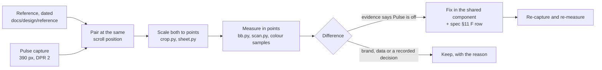

# Visual fidelity audit (U16)

Side-by-side comparison of Pulse's phone screens against the dated WHOOP captures in `docs/design/reference/`, done 2026-10-03 on the user's dev server (demo data, today = Sat 3 Oct 2026). Plan unit U16; spec v2 §11 "F" rows hold every correction this audit made to the contract.

Earlier passes are not repeated here: the large-screen audit and the symmetry pass (`ux-audit-desktop.md`), the web-interface guidelines review (`guidelines-review.md`), the sticky-header build (`sticky.md`) and the Playwright sweep (U14). This pass looks only at what a side-by-side shows at phone width.

## Method

- **Captures.** One background Brave tab through the browser MCP, emulating 390 x 844 at DPR 2 (and 361 x 800 at DPR 3 for the user's OnePlus 13R). Ours are saved in `docs/design/reference/raw/u16/` (gitignored, like the other raw captures): `<screen>.png` before, `<screen>-after.png` after, `p-*` / `s-*` / `z*` the side-by-side sheets.
- **Measuring.** The references are 1179 or 1170 px wide iPhone screenshots (3 px per point; 54 or 47 pt status bar). `crop.py` puts a band of both at 3 px per point side by side, `bb.py` gives a glyph's ink box in points, `scan.py` lists runs along a line (ring edges, pill bounds), and a colour sampler reads text cores. Positions are compared relative to an anchor both screens share (the date pill's centre on Home), never to the top of the image.
- **Rule.** A difference counts when it shows in more than one capture or is larger than the capture's noise (about 1 pt). Brand differences (Pulse naming, wordmark and mark, no battery %, Journal in Community's slot, the check-in button in the coach's) are kept.

## Summary

| | Count |
|---|---|
| Pairs compared | 26 |
| Differences recorded | 100 |
| Fixed (22 spec rows, F1-F22) | 44 |
| Kept, with a reason | 56 |
| Rows checked and found equal (Match, Checked, already fixed above) | 13 |

Top fixes:

1. **Home dials** were 92 pt across against WHOOP's 86-88; now 88 with WHOOP's 6 pt ring, and the wordmark, dials and labels sit at WHOOP's distances from the pill (F1-F3).
2. **Detail hero ring** was 236 pt with a 14 pt stroke against WHOOP's 252 / 17; strain digits now run larger than percentages as in WHOOP, and the ring carries the Pulse wordmark instead of "PULSE" set in a font (F11, F12).
3. **Type scale of the chrome**: bar titles 15 → 12 px, date pill 13 → 11 px, ring-row labels 13 → 11 px, card titles 13 → 12 px. Eight captures agree on each (F4, F5, F7, F13).
4. **Health Monitor tiles** and **Journal Insights rows** now follow WHOOP's density and row anatomy (F16, F17).
5. **Home insight card** padding, counter pill and body colour; **activity rows** get WHOOP's light sleep chip, bright strain chip and time bar (F6, F18).

## Pairs

Each table lists every visible difference. "Fix" names the spec row; "Keep" gives the reason.

### 1. Home at rest

Reference: `latest-home-top-2.jpg` (2026-10-02), `latest-home-top-3.jpg` (2026-07-17), `latest-home-top-1.jpg` (2026-09-23). Ours: `raw/u16/home-top.png`, after `home-top-after.png`.

| # | Difference (WHOOP vs Pulse, at 390 pt) | Decision |
|---|---|---|
| 1.1 | Dial outer diameter 86-88 vs 92 pt | Fix (F2): 88 |
| 1.2 | Wordmark centre 52 pt under the pill centre vs 78 | Fix (F1): 54 |
| 1.3 | Dial centre 74 pt under the wordmark vs 79 | Fix (F1): 74 |
| 1.4 | Ring bottom to label centre 14-15 pt vs 17 | Fix (F3): 14 |
| 1.5 | Labels to the first card about 34 pt vs 50 (an extra 16 pt stack gap) | Fix (F1): 36 without the tag |
| 1.6 | "SO FAR" tag under Strain; WHOOP shows none on today | Keep: the plan's partial-day tag (§5.1) tells the user today's strain is still accruing |
| 1.7 | Date pill label "TODAY" 39 pt wide, 7.3 pt cap vs 49 / 9.5 | Fix (F4): 11 px |
| 1.8 | Pill 29 pt tall vs 32 | Fix (F4): 30 px |
| 1.9 | Insight card text inset 20 pt vs 16 | Fix (F6) |
| 1.10 | Insight title medium weight vs semibold | Fix (F6) |
| 1.11 | Insight body near `#d5d9dc` on 20.5 pt lines vs `#babac0` on 22 | Fix (F6) |
| 1.12 | Counter pill 23 x 46 pt, 8 pt from the corner vs 32 x 48 in the padding | Fix (F6) |
| 1.13 | "VIEW STRAIN →" link in the insight; WHOOP's card has none (its tap opens the coach) | Keep: Pulse has no coach; the link is the card's destination (R1) |
| 1.14 | Soft drop shadow under WHOOP's insight card | Keep: Pulse's card material has no drop shadow (§2.6); the peeking second card already gives depth |
| 1.15 | "HEALTH MONITOR" on one line vs wrapped at 390 | Fix (F7): 12 px title, chevron into the padding |
| 1.16 | "2/5 Metrics" vs "4/5 within range" | Keep: SYM11 copy decision |
| 1.17 | Wordmark is WHOOP's thin logotype in near-white vs Pulse's grey bold wordmark | Keep: brand (brand.md) |
| 1.18 | Battery "55%" vs sync "Demo" | Keep: brand / no battery data (I5) |
| 1.19 | "Your Day In Review" plain card vs the gradient "Your daily outlook" | Keep: WHOOP shows the gradient Daily Outlook before 17:00 [latest-home-collapsing-1] (R3, I15) |
| 1.20 | Bottom chrome sits 30 pt off the screen edge vs 12 | Keep: the 18 pt difference is iOS's home-indicator inset; Pulse adds `env(safe-area-inset-bottom)` on a real phone |

### 2. Home collapsing

Reference: `latest-home-collapsing-1.jpg` (2026-06-23). Ours: `home-collapsing.png`.

| # | Difference | Decision |
|---|---|---|
| 2.1 | Ring-row labels about 25 % larger than WHOOP's | Fix (F5) |
| 2.2 | WHOOP shows "+ ADD ACTIVITY" and "START ACTIVITY" side by side | Keep: Pulse imports workouts and cannot start one (R2) |
| 2.3 | Monitor card titles in grey in this capture, white in the later ones | Keep: the newer captures [latest-home-top-2] show white |

### 3. Home collapsed (ring row)

Reference: `latest-home-collapsed-1.jpg`, `-2.jpg` (2026-07-24), `latest-home-sticky-header-user-2025.png`. Ours: `home-collapsed.png`, after `home-collapsed-after.png`.

| # | Difference | Decision |
|---|---|---|
| 3.1 | "RECOVERY" 57-62 pt wide vs 79 | Fix (F5) |
| 3.2 | Deep in the page WHOOP hides the top row | Keep: user decision (sticky.md A2) |
| 3.3 | Sleep chip light `#7594b1`, activity chip bright `#0091e2` vs the deep variants | Fix (F18) |
| 3.4 | A 2 pt bar after the start and end times | Fix (F18) |
| 3.5 | Times "10:52 PM" vs "00:50" | Keep: locale format (the user's region uses 24-hour time) |
| 3.6 | "My Plan" section | Keep: out of scope (§12.2) |

### 4. My Dashboard

Reference: `latest-home-dashboard-1.jpg` (2026-07-01). Ours: `home-dashboard.png`, after `home-dashboard-after.png`.

| # | Difference | Decision |
|---|---|---|
| 4.1 | No chevron on the rows | Fix (F10) |
| 4.2 | Values without units ("41") vs "50 ms" | Keep: units read better without WHOOP's training (§6) |
| 4.3 | "CUSTOMIZE ✎" vs "vs. 30-day average" | Keep: Pulse has no row customisation; the caption explains the second number |

### 5. Strain & Recovery chart

Reference: `latest-home-collapsed-3.jpg` (2026-07-14). Ours: `home-chart.png`, after `home-chart-after.png`.

| # | Difference | Decision |
|---|---|---|
| 5.1 | Info button at the card's top right vs after the title | Fix (F8), for every card |
| 5.2 | Today's column runs behind the day tick | Fix (F9) |
| 5.3 | Right axis 33 % / 0 % in pure red vs the red text variant | Keep: D8 (contrast) |
| 5.4 | WHOOP alternates strain labels above and below the points | Keep: Pulse's fixed positions do not collide with the demo data; no evidence of a rule |

### 6. Home, past day

Reference: `latest-home-pastday-1.jpg` (2026-09-23). Ours: `home-pastday.png`.

| # | Difference | Decision |
|---|---|---|
| 6.1 | WHOOP shows no monitor cards on a past day | Keep: V7 |
| 6.2 | Spinner in the pill while loading | Keep: the capture is mid-load; Pulse's pill shows the same spinner (`DateSwitcher` loading state) |
| 6.3 | Activity chips and time bar | Fixed with 3.3, 3.4 |

### 7. Recovery

Reference: `latest-recovery-1.jpg` (2026-07-12), `latest-recovery-2.jpg` (2026-06-19). Ours: `recovery.png`, after `recovery-after.png`.

| # | Difference | Decision |
|---|---|---|
| 7.1 | Ring 252 pt with a 17 pt stroke vs 236 / 14 | Fix (F11) |
| 7.2 | WHOOP's logotype inside the ring vs "PULSE" set in tracked caps | Fix (F11): the Pulse wordmark |
| 7.3 | Value cap 48 pt vs 45.5 | Fix (F11): 68 px |
| 7.4 | Bar title "TODAY" 46 pt wide vs 56 | Fix (F13) |
| 7.5 | Band word "YELLOW" under the label | Keep: a non-colour cue for the band (§5.1, accessibility) |
| 7.6 | WHOOP's summary rows show value, arrow and 30-day value; Pulse shows contributor rows with baseline tracks and points | Keep: §5.3 / A5, Pulse explains its own score |
| 7.7 | Hexagon count badge in some headers | Keep: meaning unknown (§12.2) |

### 8. Trends (Recovery trend card)

Reference: `latest-trends-1.jpg` (2026-09-26), `latest-recovery-weekly-1.jpg` (2026-09-22). Ours: `recovery-trend.png`.

| # | Difference | Decision |
|---|---|---|
| 8.1 | Dashed average line with an "AVG." label on month bars | Fix (F21); label "Avg" is inferred styling |
| 8.2 | WHOOP's trend view is its own screen with a metric dropdown | Keep: Pulse puts the trend card on each detail screen (§5.5) |
| 8.3 | Left axis 100 / 66 / 33 % in band colours | Keep: Pulse's bars are band-coloured and the header carries the average; adding a second axis crowds 390 px |
| 8.4 | Bar density | Checked: 8.5 px bars on a 10.5 px pitch, WHOOP's within 1 px |

### 9. Strain

Reference: `latest-strain-1.jpg` (2026-09-24). Ours: `strain.png`, after `strain-after.png`.

| # | Difference | Decision |
|---|---|---|
| 9.1 | Ring size and stroke | Fixed with 7.1 |
| 9.2 | Strain digits 64 pt tall vs 46.5 | Fix (F11): 88 px |
| 9.3 | Label "STRAIN" vs "DAY STRAIN" | Fix (F12) |
| 9.4 | Strain Target row at the top of the summary | Keep: A4 |
| 9.5 | "SO FAR" tag | Keep: as 1.6 |

### 10. Sleep

Reference: `latest-sleep-1.jpg` (2026-04-19). Ours: `sleep.png`, after `sleep-after.png`.

| # | Difference | Decision |
|---|---|---|
| 10.1 | Ring size and stroke | Fixed with 7.1 |
| 10.2 | Every summary row has an icon | Fix (F20) |
| 10.3 | WHOOP's fourth row "High sleep stress" vs "Restorative sleep" | Keep: Pulse has no sleep-stress signal |
| 10.4 | Percent sign full size ("100%") vs a smaller unit | Keep: Pulse's value-unit rule (§3.3) on every row |

### 11. Sleep stages

Reference: `latest-sleep-stages-1.jpg` (2026-09-23). Ours: `sleep-stages.png`.

| # | Difference | Decision |
|---|---|---|
| 11.1 | "Last Night's Sleep" hero with an overnight HR chart | Keep: R9 |
| 11.2 | Stage rows, radio, hatched track with blocks | Match |

### 12. Activity

Reference: `latest-activity-1.jpg` (2026-09-29). Ours: `activity.png`, after `activity-after.png`.

| # | Difference | Decision |
|---|---|---|
| 12.1 | Hero values 34 pt (cap 23.7) vs 44 px | Fix (F14) |
| 12.2 | Name 12 px, time range 13 px vs 15 / 15 | Fix (F13, F14) |
| 12.3 | HR chart on the ground with a spiky line vs zone-banded chart | Keep: R11 |
| 12.4 | Chips beside the values ("• 5.5", "▲ 1,570") and activity steps | Keep: Pulse has no per-activity 30-day comparison or steps |
| 12.5 | "AUTO-DETECTED" chip, `•••` menu | Keep: Pulse has no detection source or edit actions |

### 13. Activity, scrolled

Reference: `latest-activity-2.jpg` (2026-09-29). Ours: `activity-2.png`.

| # | Difference | Decision |
|---|---|---|
| 13.1 | "KEY STATISTICS" as a caps card title over a sideways-scrolling tile row vs a section title over a 2-column grid | Keep: SYM8; a 2-column grid shows every tile without a hidden scroll |
| 13.2 | Milestone card and coach pill | Keep: no community or coach |
| 13.3 | Tile type (label, value, chip) | Fixed with 17.1-17.3 (shared tile) |

### 14. Health tab

Reference: `latest-health-tab-1.jpg` (2026-09-28). Ours: `health.png`.

| # | Difference | Decision |
|---|---|---|
| 14.1 | Orb hero on the ground vs on the Healthspan card | Keep: R14, the user's instruction |
| 14.2 | Title "HEALTH" 12.5 px vs 15 | Fix (F13) |
| 14.3 | "Advanced Labs" card | Keep: no lab data |

### 15. Healthspan at rest

Reference: `latest-whoop-age-cyan-1.jpg` (2026-07-26). Ours: `healthspan.png`, after `healthspan-after.png`.

| # | Difference | Decision |
|---|---|---|
| 15.1 | Subtitle in tracked caps ("NEXT UPDATE IN 7 DAYS") | Fix (F15) |
| 15.2 | Week switcher bare (chevrons and caps), no pill | Fix (F15) |
| 15.3 | "WHOOP AGE" vs "PULSE AGE" | Keep: brand |
| 15.4 | "Your age: 36.7" under the orb | Keep: Pulse context, no WHOOP equivalent |
| 15.5 | Pace of Aging on the ground vs on a card with "Slow / Fast" ends and a Provisional tag | Keep: §7.7 card; the tag is required while the 6-month window fills |

### 16. Healthspan collapsed

Reference: `latest-healthspan-collapsed-1.jpg` (2026-07-14). Ours: `healthspan-collapsed.png`.

| # | Difference | Decision |
|---|---|---|
| 16.1 | Mini orb, years and pace stats | Match (S7) |
| 16.2 | Contributor bars with 6-month and 30-day markers vs Pulse's contributor rows | Keep: §5.3, Pulse has no 6-month per-input history (B10) |

### 17. Health Monitor

Reference: `latest-health-monitor-1.jpg` (2026-09-27). Ours: `monitor.png`, after `monitor-after.png`.

| # | Difference | Decision |
|---|---|---|
| 17.1 | Tile label 10 px on one line vs 12 px wrapping | Fix (F16) |
| 17.2 | Tile value cap 21.7 pt vs 24.8 | Fix (F16): 30 px |
| 17.3 | Chip 16.5 pt tall at about 11 px vs 24 / 12 | Fix (F16) |
| 17.4 | Tile padding about 12 pt vs 16 | Fix (F16) |
| 17.5 | Heart-rate hero and no date row vs "4/5 metrics within range" and a date row | Keep: Pulse browses past days (V7) and has no live heart rate |
| 17.6 | "Share your health report" | Keep: no report export |

### 18. Stress Monitor

Reference: `latest-stress-monitor-1.jpg` (2026-09-15). Ours: `stress.png`, after `stress-after.png`.

| # | Difference | Decision |
|---|---|---|
| 18.1 | Bare "‹ MON, SEP 14 ›" date row vs a pill | Fix (F15) |
| 18.2 | Settings gear in the header | Keep: no stress settings (§4.4) |
| 18.3 | Intraday chart with activity icons, Total Day bars | Keep: §7.9 layout; markers are in the chart's sleep band |

### 19. Journal Insights

Reference: `latest-journal-insights-1.jpg` (2026-06-12). Ours: `insights.png`, after `insights-after.png`.

| # | Difference | Decision |
|---|---|---|
| 19.1 | Behaviour name in sentence case, 15 px medium vs caps 12 px | Fix (F17) |
| 19.2 | Chevron on each row | Fix (F17) |
| 19.3 | % at the end of the track vs top right | Fix (F17) |
| 19.4 | Centre dot black with a white ring vs white | Keep: within 2 px; Pulse's dot keeps the zero point visible on the lit bar |
| 19.5 | "20 days with, 59 without. 90% CI…" line | Keep: Pulse shows the evidence behind each effect |
| 19.6 | Sparkle badge on some behaviours | Keep: meaning not documented |

### 20. Calendar panel

Reference: `calendar-recovery-current-2026-05.jpg` (2026-05-30). Ours: `calendar.png`, after `calendar-after.png`.

| # | Difference | Decision |
|---|---|---|
| 20.1 | Month title cap 9 pt vs 10.6 | Fix (F19) |
| 20.2 | White ring on the selected day in the first capture | Not a difference: the focus ring from a scripted open; a tap shows the dark ring as WHOOP |
| 20.3 | Weeks start Monday | Keep: CAL3 |
| 20.4 | Day numbers, row pitch (48 pt), legend | Match |

### 21. Info card

Reference: `latest-popover-info-1.jpg` (2026-03-28). Ours: `info.png`, after `info-after.png`.

| # | Difference | Decision |
|---|---|---|
| 21.1 | Body text near `#dcdfe6` vs `#babac0` | Fix (F22) |
| 21.2 | Icon, status chip and "OPEN TREND VIEW" button | Keep: this pair compares a vital's card with Pulse's "How Recovery works"; `InfoDialog` takes `icon` and an action where a vital has them |

### 22. Bottom sheet

Reference: `latest-sheet-edit-1.jpg` (2026-09-23). Ours: the check-in sheet, `sheet.png`, after `sheet-after.png`.

| # | Difference | Decision |
|---|---|---|
| 22.1 | Grabber, X left, centred caps title, caps section rules, white SAVE pill | Match |
| 22.2 | No / Yes segment pairs | Keep: Bevel's journal rows (§12.2: WHOOP's questionnaire is not captured) |

### 23. More

Reference: `latest-more-1.jpg` (2026-07-16). Ours: `more.png`, after `more-after.png`.

| # | Difference | Decision |
|---|---|---|
| 23.1 | Section labels light (`#d4d8db`) and larger vs muted 12 px | Fix (F22) |
| 23.2 | Row labels at the card-title size | Fix (F7) |
| 23.3 | Shop carousel, cart | Keep: no store |

### 24. Settings

Reference: `latest-settings-1.jpg` (2026-07-16). Ours: `settings.png`.

| # | Difference | Decision |
|---|---|---|
| 24.1 | X close, centred title | Match |
| 24.2 | Promo cards, refer and earn | Keep: no store or referrals |

### 25. Tab bar

Reference: `latest-tabbar-1.jpg` (2026-09-23). Ours: bottom of `home-top.png`.

| # | Difference | Decision |
|---|---|---|
| 25.1 | Bar 292 x 63 pt vs 297 x 61; round button 62 pt | Match within 2 % |
| 25.2 | Active lens a soft radial glow vs a defined lens | Keep: G1 |
| 25.3 | WHOOP's house icon with a chart line; Community | Keep: lucide icon set; Journal in that slot (V5) |

### 26. Streak header and Day Streak

Reference: `latest-home-sticky-header-user-2025.png` (2025), `latest-streak-1.jpg` (2026-05-28). Ours: top of `home-top.png`.

| # | Difference | Decision |
|---|---|---|
| 26.1 | Avatar on the pill, flame, number | Match (M6) |
| 26.2 | Day Streak screen with week flames and milestones | Keep: no equivalent screen; the pill's title explains the streak |
| 26.3 | Flame tiers (blue at 365) | Keep: §12.2 |

## Screens without a reference

Checked for consistency of components and tokens with the referenced screens, not for a pixel match. The F changes are shared components, so they reach these screens on their own.

| Screen | Check | Result |
|---|---|---|
| Reports (`/reports/week`, `/reports/month`) | Card titles, bar titles, dials, period pill, impact rows | Consistent after F2, F7, F13, F17; the period pill's label moved to 11 px with the date pill (F4) |
| Fitness | Card titles, tiles, header | Consistent (F7, F13, F16) |
| Settings sub-parts | Card titles and rows | Consistent (F7) |
| Journal | Day strip, check-in card, history | Consistent (F7, F13) |
| Laptop (1280 px) | Home and Strain | Dials and hero keep their `md:` sizes; the insight card's corner pill and the moved info buttons hold at `xl` padding |

## Plan polish items

| Item | Status |
|---|---|
| Skeletons match the real components | Every component changed here has its skeleton changed with it: the Home skeleton (wordmark instead of "Pulse" text, `space-y-3`, `-mt-2`), the Activity hero (34 px), the timeline rows (time bar), the vital tiles and both dial sizes (shared `SIZE`) |
| Laptop dashboard UX | `ux-audit-desktop.md` (U18) |
| Spacing and gaps around the dials, ring thickness | Fixed (F1-F3, F11) |
| Micro-interactions | Unchanged components keep the press, hover and focus states audited in `guidelines-review.md`; the new chevrons and bar are decorative |
| Chart tooltips | Not re-tested in this pass; the Strain & Recovery and trend changes only add an extended bar shape and a reference line |

## Verification

- Every fixed pair was re-captured (`*-after.png`) and re-measured: Home dials 88 pt, wordmark 54 pt under the pill, the detail ring 252 pt with a 17 pt stroke, "HEALTH MONITOR" on one line at 390 px.
- No horizontal overflow on 17 routes at 361 and 390 px (an iframe sweep compared `scrollWidth` with the viewport; only the orb canvas paints past it, clipped by M1).
- `impeccable detect` on the changed files: no findings.
- `pnpm typecheck` and `pnpm lint` clean; `pnpm test` 602 passed (1 skipped); `pnpm e2e` 263 passed, 5 skipped (the suite's own skips), on its own server at :3300.

## Flagged to the user

- **Inferred:** the "Avg" label on the trend average line (WHOOP's reads "AVG." on a white chip); its exact styling is not measurable at the capture's size.
- **361 px:** "HEALTH MONITOR" and "STRESS MONITOR" still wrap at 361 px. WHOOP has no capture that narrow.
- **Kept on purpose, worth a second look:** the "So far" tag under Home's Strain dial (26 pt of height WHOOP does not spend), and the "View Strain" link on the insight card.
