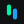
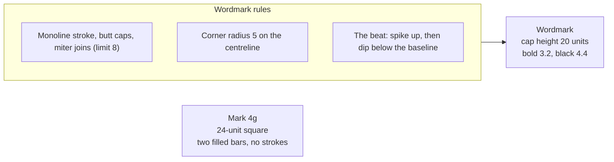
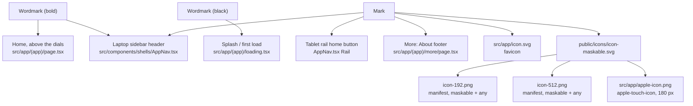

# Pulse brand: wordmark and mark

The wordmark and app mark for Pulse. Both are hand-written SVG, not a font, so they render identically everywhere. Live previews on the dark ground at every size (development only, 404 in production by design):

- `/dev/brand`: the wordmark, the mark and the icon files.
- `/dev/brand/marks`: the option 4 colour variants and all the round 2 mark concepts.

| Favicon (`src/app/icon.svg`) | App icon, maskable (`public/icons/icon-maskable.svg`) |
| --- | --- |
|  |  |

## The problem

The Home screen showed "PULSE" as tracked Figtree caps, and the favicon was a green recovery ring. The ring is WHOOP's dial language, and neither said "pulse". WHOOP's own wordmark is a custom geometric logotype: wide, uppercase, monoline, with stencil breaks. We wanted the same presence on a dark UI (wide, geometric, confident, white on black) without borrowing WHOOP's letterforms or its stencil device.

## Concepts considered

Every concept was built as real SVG and rendered at 14 px cap height and at 16 px favicon size before choosing.

### Wordmark

| # | Concept | Result |
| --- | --- | --- |
| W1 | **Beat in the S spine.** The S's middle bar carries a spike and a dip. | Rejected. The S counters are only about 5 units tall, so the spike hits the top and bottom bars. At 14 px the S turns into a "$". |
| W2 | **Tall beat in the L foot.** A spike at 40% of the cap height, next to the stem. | Rejected. Next to the stem, the spike makes the L read as "h" or "ʌ" ("PUhSE"). |
| W3 | **Beat in the E's middle arm.** | Rejected. The spike crosses both E counters and the E reads as "Ɛ>". |
| W4 | **Rhythm cut.** A thin negative ECG line sliced through the whole word. | Rejected for the header. At 14 px the cut is under 1 px wide and vanishes. It only works on a splash. |
| W5 | **Stencil breaks.** Detached bars, like WHOOP's wordmark. | Rejected. It is the WHOOP device, so it is not ours. |
| **W6** | **L-to-S ligature beat.** The L's foot runs on, beats once (a spike up, then a dip below the baseline) and becomes the S's bottom bar. L, beat and S are one stroke. | **Chosen.** |

### Mark, round 1

| # | Concept | Result |
| --- | --- | --- |
| M1 | **P on a baseline, dip under the stem.** | Rejected. A V hanging under the stem reads as a map pin. |
| M2 | **Beat in the P's open lower-right quadrant.** | Rejected. Anything in that quadrant reads as an R's leg, so the mark said "R". |
| M3 | **P inside the recovery ring.** | Rejected. It keeps the WHOOP dial idea that the old favicon had, which was the original complaint. |
| M4 | **Heart with a P.** | Rejected. Generic health clip art that says nothing about the name. |
| M5 | **The trace draws the P.** A flat line beats once, runs into the foot of the stem, climbs it and draws the bowl, all in one stroke. | Chosen in round 1, then rejected by the user: too busy for a favicon. |

### Mark, round 2: minimal

The brief for round 2: one or two strokes or shapes, bold geometry, and instantly readable at 16 px. All eight are on `/dev/brand/marks` with tab strips, a home screen and every size.

| # | Concept | Rationale |
| --- | --- | --- |
| 1 | **Spike** | One heartbeat stroke and nothing else: the most direct reading of the name. |
| 2 | **Ping** | A solid dot sends out one ring: a live signal, the moment a pulse is read. |
| 3 | **Circle + bar P** | A P built from two primitives, a bar and a ring. |
| **4** | **Two beats** | **Chosen by the user.** Two staggered rounded bars: lub and dub, a heartbeat at its simplest. |
| 5 | **Heavy p** | A lowercase p with a heavy ring, a long descender and one angled cut where the stem starts. A pointed descender read as a map pin, so the cut moved to the top. |
| 6 | **Cut beat** | A solid white tile with the beat cut through it. Loudest in a row of icons. |
| 7 | **Notched dial** | A heavy ring with one cleft at the top: a dial index that also reads as the top of a heart. |
| 8 | **Dot-counter P** | A solid P whose counter shrinks to a single dot. |

### Option 4 colour variants

Built from the data tokens in `src/app/globals.css`. Every colour was checked for contrast on #0f1113, the icon ground. Graphics need at least 3:1:

| Token | Hex | Contrast |
| --- | --- | --- |
| `--optimal` | #00f19f | 12.7 |
| `--recovery-green` | #19ec06 | 11.8 |
| `--sleep` | #7ba1bb | 6.9 |
| `--strain-text` | #1fa0f0 | 6.6 |
| `--strain` | #0093e7 | 5.7 |
| `--recovery-red` | #ff0026 | 4.8 |

| # | Variant | Colours (first beat, second beat) |
| --- | --- | --- |
| 4a | Mono | white, white |
| 4b | Scores | recovery green, strain blue |
| 4c | Night and day | sleep blue, recovery green |
| 4d | Green beat | white, recovery green |
| 4e | Optimal | white, optimal teal |
| 4f | Recovery band | one vertical gradient through both beats: red at the base, yellow, green at the top |
| **4g** | **Cool pair** | **optimal teal, strain blue. Final, chosen by the user.** |

### Why W6

- **It is about the name.** A pulse trace runs through the word and turns into the S.
- **It keeps letter integrity.** In W6, every letter keeps the strokes that identify it: the L keeps its corner and the S keeps both bowls. The beat lives in space that is already open (the gap between L and S). That is why it survives at 14 px where W1 to W3 failed.
- **It is ownable.** The dip below the baseline is the one tension point in an otherwise calm, wide word. It is what makes the line read as an ECG and not just a peak. It is ours and not WHOOP's (WHOOP's device is stencil breaks).
- **It suits the dark UI.** Monoline white strokes on #0f1113, with no fills, gradients or accent colour. Like WHOOP, the wordmark stays monochrome and the metrics carry the colour.

### Final mark: 4g

The user's final choice is 4g, Cool pair. It is live in every icon file and is the `color="brand"` default of `Mark.tsx`. `/dev/brand/marks` stays as the record of the options.

### Why mark 4g

- **It is minimal.** It is two rounded bars and nothing else, so it reads at 16 px in any tab strip, light or dark.
- **It is the beat.** Two strokes, offset in time and height: lub, then dub. It needs no letter to say "pulse".
- **The colour carries meaning.** The first beat is optimal teal (the app's in-range and recovery side), and the second is strain blue. The mark holds the two halves of the day the app measures.
- **The colours are calm.** Teal and blue are neighbouring cool hues, so the pair reads as one object. Recovery green with strain blue (4b) is louder and vibrates at small sizes, and a red-to-green gradient (4f) reads as a traffic light.
- **It complements the wordmark.** The wordmark stays white with its own beat; the mark is the one place the brand uses colour.

## Construction



### Wordmark (`src/components/brand/Wordmark.tsx`)

- **Grid.** The cap height is 20 units. The letters are wide: P 19, U 20, L foot 12 units before the beat, S 21, E 17. The gap between letters is 5.5 units. The proportions are about 4.7 : 1, close to WHOOP's width.
- **Stroke.** The glyphs are centreline paths. Their outer edges land on 0 and 20 for any stroke width, because `build(s)` offsets each path by half the stroke. There are two weights:
  - `bold` (3.2 units, 16% of the cap) for the in-app header, 14 to 18 px cap height.
  - `black` (4.4 units, 22%) for a splash, 32 px cap height and up.
- **Letters.**
  - **P:** square outer top-left corner, and the bowl closes at 60% of the cap height.
  - **U:** two radius-5 corners.
  - **S:** squared, with two tighter radii in each half so the bowls fit.
  - **E:** the middle arm is 2 units shorter than the top and bottom arms.
- **The beat.**
  - The spike's half-width is `0.8 x stroke + 1.3`, so its inner counter stays open at both weights.
  - The spike rises 7.5 units (37% of the cap).
  - The dip falls 2.5 units below the baseline. Its miter tip makes the box 1.208 x the cap height.
- **The box includes the dip.** The SVG's height is 1.208 x the cap height. Size the wordmark by the box:

  | Cap height | `className` height |
  | --- | --- |
  | 14 px | `h-[17px]` |
  | 16 px | `h-[19px]` |
  | 18 px | `h-[22px]` |
  | 32 px (splash) | `h-[39px]` |

  To centre the wordmark optically with other items, align on the cap height, not the box. The dip is a descender.

### Mark (`src/components/brand/Mark.tsx`)

- **Geometry.** In a 24-unit square:
  - Two rounded bars, each 4.2 wide and 11 tall, with radius 2.1 (fully round ends).
  - The first bar: x 6.9, y 4.5 to 15.5.
  - The second bar: x 12.9, y 8.5 to 19.5. It is offset down 4 units, with a 1.8-unit gap between the bars.
  - The pair is 10.2 x 15 units, centred on (12, 12).
- **Component.** The viewBox `4.5 4.5 15 15` crops to the pair, so `size-*` sets its height directly. The `color` prop:
  - `"brand"` (the default) fills the beats with `var(--optimal)` and `var(--strain-text)`.
  - `"mono"` fills both with `currentColor`.
- **Icon files.** They repeat the geometry in hex, #00f19f and #1fa0f0 on #0f1113:
  - `src/app/icon.svg`: the favicon. The pair is scaled 1.15 on a tile with rx 5.5, so at 16 px each bar is about 3 px wide.
  - `public/icons/icon-maskable.svg`: the full-bleed source for the PNGs, at scale 1. The farthest point from the centre is 8.1 units, inside the 80% safe circle (radius 9.6).

## Rules

### Clear space

- **Wordmark:** keep clear space at least equal to the P's width (19 units, or about 0.95 x the cap height) on all sides. Measure it from the cap box, and measure below from the dip tip.
- **Mark:** keep clear space at least 25% of its size on all sides. The icon tiles already include it.
- **Lockup:** mark first, then the wordmark, with a gap of 0.6 x the wordmark's cap height. Make the mark about 1.6 x the cap height (for example, a `size-7` mark with an `h-[17px]` wordmark).

### Minimum size

| Asset | Minimum | Below the minimum |
| --- | --- | --- |
| Wordmark `bold` | 12 px cap height (`h-[15px]`) | Under 12 px the beat's counter fills in. Use the mark instead. |
| Wordmark `black` | 24 px cap height | Under 24 px, use `bold`. |
| Mark (inline `Mark`) | 16 px | Don't use the mark below 16 px. |
| Favicon | 16 px | It is built for 16 px. |

### Colour

**Wordmark**

- Use `currentColor` only. The default is the foreground (white).
  - On Home, use `text-foreground-secondary` to match the current header tone, as WHOOP's grey in-app wordmark does.
- **Don't** colour the wordmark's beat differently from the letters.
- **Don't** put the wordmark on a recovery or strain colour.

**Mark**

- Use `color="brand"` (teal, then blue) wherever the mark stands for the app: icons, the rail and the sidebar.
- Use `color="mono"` where it should recede, for example the muted mark in More's About footer.
- **Don't** swap the order of the beat colours.
- **Don't** colour only one beat.
- **Don't** use other data colours on the mark.
- **Don't** use the brand colours on a light ground; use mono there.

**Both**

- **Don't** add a glow, a gradient or an outline.
- The icon grounds are #0f1113, the `--background` token.

### Don'ts

- **Don't** set "PULSE" in a font as a stand-in.
- **Don't** stretch the wordmark or the mark, or change their letter spacing.
- **Don't** remove the wordmark's beat or dip.
- **Don't** add a tagline under the wordmark in the header.
- **Don't** put the mark inside the recovery ring.
- **Don't** animate the beat on every screen. If it animates anywhere, do it once, on the splash, and respect `prefers-reduced-motion`. The mark's natural motion is a single lub-dub: the two bars scale in one after the other.

## Usage

```tsx
import { Wordmark } from "@/components/brand/Wordmark"
import { Mark } from "@/components/brand/Mark"

<Wordmark className="h-[17px] text-foreground-secondary" />    // Home header, 14 px cap height
<Wordmark weight="black" className="h-[39px]" />                // splash
<Mark className="size-7" />                                     // tablet rail, sidebar (brand colours)
<Mark color="mono" className="size-8 text-muted-foreground" />   // More: About footer
```

Both components render `role="img"` with `aria-label="Pulse"`. Pass `title` to change the label and add a tooltip. When the asset sits inside a link that already names it (for example, `aria-label="Pulse home"`), add `aria-hidden` on a wrapping element, not on the SVG.

## Where each asset goes



Placement in the screens is a separate change. These are the targets:

| Where | Today | Replace with |
| --- | --- | --- |
| Home, above the dials (`src/app/(app)/page.tsx`, the `<p aria-hidden>Pulse</p>` in `slots.top`) | Tracked Figtree caps, 13 px, `text-foreground-secondary` | `<span aria-hidden className="flex justify-center text-foreground-secondary"><Wordmark className="h-[17px]" /></span>`, keeping it hidden from assistive tech as now (the page has its own title). |
| Laptop sidebar header (`AppNav.tsx`, the xl `<nav>`'s first `<Link href="/">`) | Tracked text "Pulse" | The lockup: `<Mark className="size-7" />` + `<Wordmark className="h-[17px]" />`, gap-2.5, inside the existing h-14 link. Wrap both in `<span aria-hidden>` and add `aria-label="Pulse home"` to the link. |
| Tablet rail (`AppNav.tsx` `Rail`, the "P" letter in the size-10 home button) | A Barlow "P" | `<Mark className="size-6" />` |
| Loading / splash (`src/app/(app)/loading.tsx` returns `HomeSkeleton`; for a cold start, the PWA splash uses the manifest icon and `background_color`) | Skeleton only | Keep the skeleton for in-app navigation. For a first-load splash, centre `<Wordmark weight="black" className="h-[39px]" />` on `--background`. |
| More: About footer (`src/app/(app)/more/page.tsx`, the "Pulse {version} · scoring v…" line) | Text only | Put `<Mark color="mono" className="size-8 text-muted-foreground" />` above the version line, centred, with 8 px of space. |

## Regenerating the icons

The PNGs are rendered once from the SVG source with `rsvg-convert` (Homebrew librsvg) and committed:

```sh
rsvg-convert -w 512 public/icons/icon-maskable.svg -o public/icons/icon-512.png
rsvg-convert -w 192 public/icons/icon-maskable.svg -o public/icons/icon-192.png
rsvg-convert -w 180 public/icons/icon-maskable.svg -o src/app/apple-icon.png
```

If you change the bars in `Mark.tsx`, mirror the change in both icon SVGs and rerun these commands.
