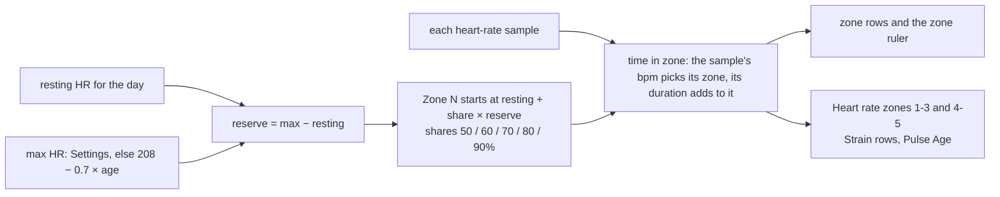
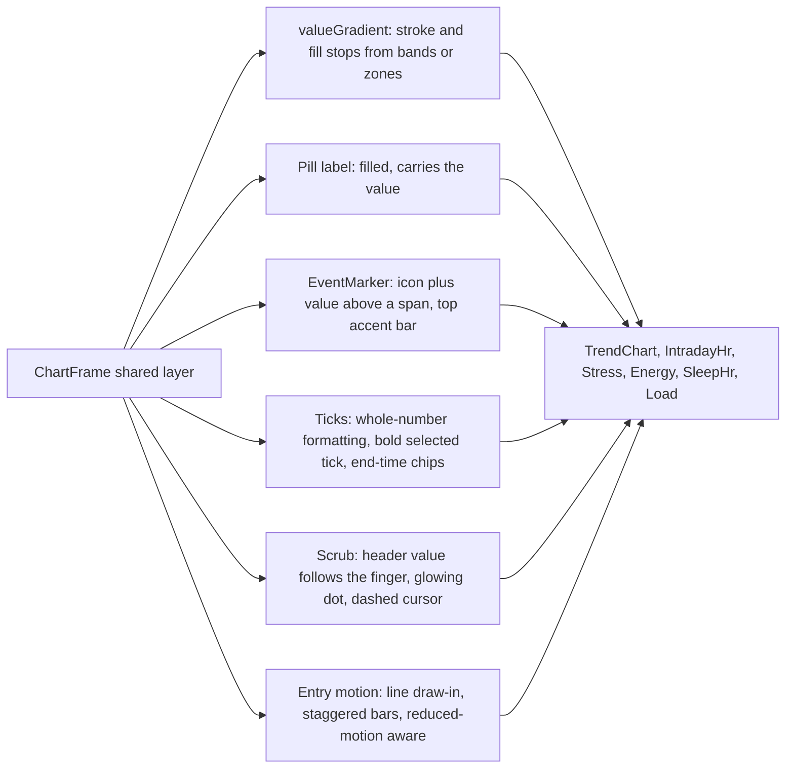

# Charts: what WHOOP and Bevel do, and what ours need

Research from 2026-10-05. Sources are real app screenshots from the past year (Google Images with a past-year filter, the App Store listings, Reddit posts, and reviews from PCMag, Lifehacker, Wareable, CNET and Tom's Guide), covering the WHOOP app after its 2025 redesign and Bevel 3.x. The research did not rely on text descriptions of the apps.

## What makes their charts feel alive

| Technique | WHOOP | Bevel | Ours today |
|---|---|---|---|
| Line colour carries the value | Day HR is grey outside activities and blue inside them | Stress goes cyan → green → yellow → orange → red; Strain goes yellow → red; workout HR follows the zone colours | One flat colour (Energy is split by band; Stress has stepped colour with gaps) |
| Bar fill | Recovery bars in band colours, fading darker toward the floor, with a bright cap line on top | Rounded and flat | Flat, 3 px radius |
| Event markers | Icon plus value above each span (🌙 7:12, 🏃 16.2, RECOVERY 29% in red); a bright bar along each span's top edge; a dashed vertical at wake | Icon above the span (🌙, 🏃); the sleep span is shaded with a top bar | Text labels ("Sleep", "Strength") above the plot |
| Start and end times | Bold start and end times at the x-axis ends, with dotted verticals ending in a dot | Times in chips (🌙 01:08 … ☀ 07:41) | Only on Sleep HR |
| Average and range | "Typical range" row; grey band | Shaded normal-range band that follows the data; filled pill "Avg. 66%" carrying the value | Dashed line plus "Avg" text in the right gutter, without the value |
| Y-axis | Recovery: labels in band colours (100% green, 66% yellow, 33% red), with dashed gridlines at those thresholds | Labels on the right, dashed gridlines | Bars: no y-axis at all; lines: left labels with useless decimals ("48.0", "0.0") |
| Selected day | x label bold white ("Wed 17") | Selected point enlarged, with a callout | Only on Home's Strain & Recovery |
| Insight | Boxed sentence above the chart, against the user's usual ("11 minutes more than you typically spend in this zone during Cycling") | "Coaching" card above the chart | Insight cards exist, but not per chart |
| Metric tabs under the chart | Recovery / HRV / RHR / Resp rate tabs switch the chart, with a "7-Day Average" caption | Chips above the chart (Strain score / Exercise duration / Daytime HR) | One chart per metric page |
| Legend | Stage bars sized by time ("REM 1 h 26 min 22%") | Line-style samples for each series (solid, dotted, dot) | Squares for line series (Load chart), in a different order from the plot |
| Small summaries | n/a | Stage cards with a progress ring; Charged +25% / Drained −19% cards; a battery fill | Charged/Drained cards on Energy only |
| Sparklines | n/a | Every metric row and tile, ending in a dot | None |

## Zones

- WHOOP uses five zones on heart-rate reserve (Karvonen), the same formula as our Strain: Z1–Z5 at 50/60/70/80/90%. Zone bars take their zone's colour.
- Bevel defaults to % of max HR, with Restorative below 50% and Z1–Z5 at 50/60/70/80/90%. Users can switch to HRR, lactate threshold or manual zones.
- Bevel's workout chart has a zone ruler under the HR line. It's a strip of Z0–Z5 colour segments with the bpm cut points (130, 142, 155, 167, 179+) and a marker at the average.
- We show four Google-named zones (Light, Moderate, Vigorous, Peak), while Strain counts its own five. Make them one five-zone set on %HRR.

## Per chart

### TrendChart (Recovery, HRV, RHR, sleep, strain, steps, calories, VO2 max, weight; W/M/6M/1Y)

- Bars: band-coloured where there's a band; a vertical gradient (full colour at the top to about 55% at the floor); a 2 px bright cap; 4 px radius.
- Y-axis on bars: show the band thresholds in band colours for recovery-type metrics (100 / 67 / 33), and only the top tick for the rest. Never leave a bar chart with no scale at all.
- Line (6M/1Y): the stroke coloured by value where there's a band, otherwise one hue. Add a soft area fade, point dots only on the selected point and the latest, and a ring on the latest.
- The Avg pill carries the value ("Avg 61%"). Draw it filled, on the line, at the right edge, inside the gutter.
- Draw the normal-range band whenever a baseline exists, with the caption "Shaded: your normal range".
- Ticks: drop ".0" when the step is a whole number (VO2 48 not 48.0, Pulse Age 38 not 38.0). The W range shows the selected day's label bold in the foreground colour.
- Gridlines: dashed, about 8% opacity, three at most.

### IntradayHrChart (Heart rate day, Activity, Strain)

- Line: grey outside activity spans and zone-coloured inside them (WHOOP). On the Activity variant, the whole line is zone-coloured (Bevel).
- Fill: the same colours fading to zero.
- Events: an icon plus value above each span (moon plus sleep duration, activity icon plus strain), a 2 px accent bar along the span's top edge, and a dashed vertical at wake.
- Zone bands: drop the alternating grey fills and use a zone ruler under the plot instead. Zone names live in the ruler, not in the gutter.
- X-axis: on the Activity variant, start and end time chips at both ends with dotted verticals; intermediate ticks plain.
- Y-axis: three ticks, rounded to 10 bpm.

### ZoneBars (Activity, Strain, Heart rate)

- Each row's fill in its zone colour; the hatch stays for the unfilled track.
- A ▲ marker at the user's typical share for the activity type, and a "+7 min vs typical" chip.
- Rows with 0:00 dim to 40% and stay compact (already done).

### StressChart (Stress, Home)

- One continuous stroke coloured by value (low cyan → medium yellow → high orange/red), with no gaps between colour runs.
- Sleep: a shaded span, a top bar and a moon icon. Activities: an icon with a faint vertical band.
- Y-axis: 0 / 1 / 2 / 3, not 0.0.
- Below the chart: High / Med / Low breakdown bars with % and duration (we have them; restyle them to match the zone rows).

### EnergyBankChart (Home)

- Header: a battery shape filled to the current % in its band colour, next to Charged / Drained cards.
- Line: band-coloured (as now) plus a matching fade.
- Drains: an icon chip at the point ("🏋 −1") instead of loose orange text.
- A stress strip under the plot on the same time axis, with one shared scrub cursor (Garmin/Bevel layout).

### Hypnogram (Sleep)

- Stage blocks as thick rounded bars in stage colours: Awake near-white, Light lavender, SWS (Deep) pink, REM purple (the reference app's 2026 view, spec §11 R33). Thin 1 px connectors between stages.
- Bed and wake times as chips at both ends; hour ticks in between.
- A wake-events tick strip under the plot (WHOOP).
- Legend: one bar per stage, sized by time, with "REM 1 h 26 min 22%".

### SleepHrChart (Sleep)

- Highlight REM stretches of the HR line in the REM colour (WHOOP marks REM in purple).
- Mark the lowest point ("Lowest 52 bpm, 03:10"). Keep the start/end dotted verticals with a dot at the bottom.

### StrainRecoveryChart (Home)

It already matches WHOOP. Add:
- the line drawing in from left to right;
- a glow on today's dots;
- scrubbing a day updates both header numbers.

### ColumnChart (metric pages: hourly, weekday)

- A full-height dim track behind each column. The highlighted column glows and gets the gradient fill.
- The target is drawn as a filled pill.

### LoadChart (Fitness)

- Legend: line samples (solid for Fitness, solid for Fatigue, a bar for Form), in the order the series appear, and each with today's value.
- Fades under Fitness and Fatigue. Form bars stay green and orange, with a zero line.

### Tiles and rows (Home dashboard, Key stats)

A 30-day sparkline ending in a dot, plus a status line ("Normal range", "Above normal").

## Age orb

WHOOP colours the WHOOP Age orb by how much older or younger you are. In screenshots: green at 7.0 to 8.9 years
younger, blue at 6.3 younger, a blue-grey top over an orange bottom at 2.1 older, amber from 2.6 to 5.6 older and
orange at 10.1 older. No screenshot showed an orb past 10 years older.

Ours (`src/lib/orb.ts`, tokens `--orb-*` in globals.css) spreads those hue families so each step reads as its own
colour:

| Years vs your age | Colour |
|---|---|
| 7 or more younger | green |
| 4 younger | blue-green |
| 1.5 younger | cyan |
| level | blue |
| 0.8 to 2.1 older | blue over olive, then over orange |
| 3 older | amber-brown |
| 7 older | rust |
| 12 or more older | red (extrapolated) |

Colours between stops are mixed, so the orb changes continuously.

## Heart-rate zones

Since `SCORING_VERSION` 7 (2026-10-05), every zone in Pulse is one of five on heart-rate reserve. These are the same
edges Strain has always counted with and the ones WHOOP uses.

Google's zone record is not used for max HR: its PEAK zone ends at a flat 220 for everyone, which pushed every zone up
(Zone 1 from 144 bpm for a resting 67). Example: resting 56, max 186. The reserve is 130, so the zones start at 121, 134, 147, 160 and 173 bpm. Time below
Zone 1 is counted but not shown. Google's own zone bounds and time-in-zone roll-up are still synced, but only the
Active Zone Minutes page reads them. Colours, cool to hot: grey-blue, blue, green, orange, red.

## Shared layer

Most of this lives once in `src/components/charts/ChartFrame.tsx`, so every chart picks it up.

## Status (2026-10-05)

**Done:**
- the shared layer: dashed grid, filled pills, band gradients for strokes, soft fades, glow dot, whole-number ticks;
- TrendChart: gradient bars with a cap, y-scales in band colours, line coloured by band, bold selected day;
- heart rate: grey outside workouts, zone colours inside, icon headers on spans, zone strips on the bpm axis;
- Stress and Energy: one continuous level-coloured line, icon spans, drain pills;
- Hypnogram: thick stage blocks, stage-coloured lanes, bold bed and wake times;
- Sleep HR: the lowest point marked;
- ColumnChart tracks;
- Load chart: legend with line samples and today's values;
- the vital strip's 30-night sparkline;
- the typical-share tick and "±min" on activity zones;
- the Age orb scale.

**Done after:** one five-zone %HRR system (`SCORING_VERSION` 7, every stored day recomputes).

**Not done:**
- metric tabs under charts;
- sparklines on Home dashboard rows: needs 30-day series in the dashboard query;
- the Energy battery header and stress strip;
- scrub-driven header numbers on intraday charts.

## Phases

1. **Shared layer, then TrendChart, IntradayHr, Stress and Energy.** The gradient strokes and fills, the pills, event markers, tick formatting and entry motion.
2. **Five zones on %HRR**, with the zone ruler and coloured zone rows; the Hypnogram restyle; REM highlights on Sleep HR; the Energy battery and stress strip.
3. **Data-backed pieces:** sparklines, "vs typical" figures, and metric tabs under charts. These need query changes.

Check every phase in the browser at 390, 820 and 1440 px before pushing it.
