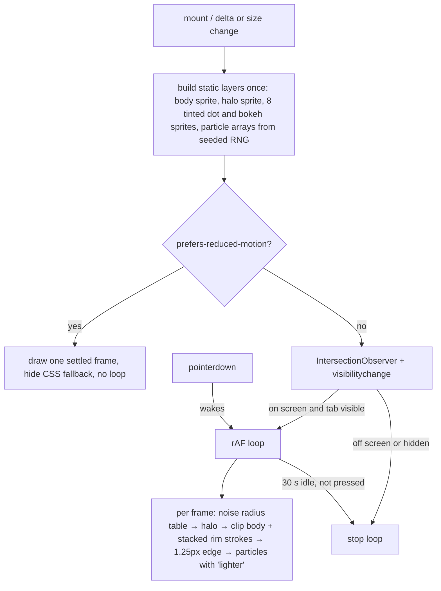

# WHOOP Age orb

The contract for `src/components/metrics/WhoopAgeOrb.tsx` (spec §5.17 defers to this file). The tunables live in one object, `ORB` in `src/lib/orb.ts`. The pure helpers (colour mapping, shape noise, seeded RNG, particle count) are tested in `src/lib/orb.test.ts`.

## Evidence

All references are in `docs/design/reference/`.

| Reference | Delta | What it shows |
|---|---|---|
| `latest-whoop-age-green-2.jpg` | 6.6 younger | Green rim band, mint delta text `#1EDE9C`, crisp edge line, no visible halo on black |
| `latest-whoop-age-green-1.jpg`, `latest-health-tab-1.jpg` | 10.5 younger, `<18` | Health tab hero at about 200 px on a green-tinted ground: lobed edge, soft dark halo |
| `latest-whoop-age-cyan-1.jpg` | 1.0 younger | All teal, delta text pale cyan `#7EC6E4` |
| `latest-whoop-age-mixed-1.jpg` | 0.8 older | Blue on top fading to olive at the bottom |
| `latest-whoop-age-mixed-2.jpg` | 1.8 older | Blue on top, orange at the bottom, more lobed (Health tab) |
| `latest-whoop-age-amber-1.jpg` | 5.6 older | All amber-gold, delta text still pale cyan |
| `latest-whoop-age-touch-frames.jpg` | 6.6 younger | Ten frames of a press: particles leave the rim, swirl through the interior around the numbers, and the outline wobbles |
| `latest-healthspan-collapsed-1.jpg` | 3.4 younger | Mini orb (about 104 px) in the collapsed header: number and label only |

Rim hues were sampled with PIL from the brightest pixel on each ray within 14 px inside the outer edge. The delta text colours were sampled from the text boxes.

Video research (2026-10-02): no screen recording of the opening animation was found. WHOOP's own Healthspan explainers (YouTube "Understand Your WHOOP Age and Pace of Aging with Healthspan", https://www.youtube.com/watch?v=Y4KrD5vLLmo; "All You Need to Know About WHOOP AGE", https://www.youtube.com/watch?v=Tq4Re_zO6wo) and Reddit searches did not show it. The touch frames come from an r/whoop recording of 2026-09-14, "Anyone else use the Whoop Age bubbles thingy as a fidget spinner?" (spec §5.17). The entry and idle motion below are therefore **inferred**. The touch response is **observed**.

## Interface

```tsx
<WhoopAgeOrb age={38.0} deltaYears={1.2} provisional={false} size={300} reason={null} />
```

- `deltaYears` is WHOOP Age minus chronological age, so **positive means older**. This is the view-model convention (`ageDelta`). Spec §5.17 writes the bands as "years younger (+)", which is the opposite sign. The bands below use the data sign.
- `size` is the box in CSS px. The canvas overhangs it by 15% on each side for the halo. Sizes in use: 300 on the Healthspan hero, 200 on the Health hub card, 104 for the collapsed header (§5.18, built by the shell work). Below 160 px the delta line, the tag and the reason copy are dropped and the numeral grows relative to the box, as in `latest-healthspan-collapsed-1`.
- States:
  - Value.
  - `provisional`: the "Provisional" `MetricTags` chip inside the orb, under the delta.
  - Null (`age` or `deltaYears` is null): a dim grey orb (`ORB.empty`), half the particles, `--`, and `ReasonPlaceholder size="sm"` copy for `reason`.
- Accessibility: the wrapper is `role="img"` with `aria-label="WHOOP Age 38.0, 1.2 years older than your age"`. It appends ", provisional" when provisional, and reads "WHOOP Age unavailable. {reason copy}" when null. The canvas and the visible text are `aria-hidden`.

## Colour

`orbColors(delta)` returns a rim colour for the top and the bottom of the orb. It interpolates linearly in RGB between stops and clamps at both ends.

| Delta (years, + older) | Top | Bottom | Source |
|---|---|---|---|
| ≤ −3 | `#4CD48C` | `#4CD48C` | green-1, green-2 |
| −1 to 0 | `#7CC4D4` | `#7CC4D4` | cyan-1; neutral holds teal |
| +0.8 | `#5888C0` | `#6A8452` | mixed-1 |
| +1.8 | `#5E8CC0` | `#D4843A` | mixed-2 |
| ≥ +3 | `#C8862E` | `#C8862E` | amber-1 |

The other colours are derived from the rim colour:

- Body band: rim × `fillShade` (0.68).
- Particles: rim × 1.3, then 12% toward white.
- Edge line: rim with 22% white at 85% opacity.
- Delta line: `ORB.deltaText` (`#7EC6E4`). It switches to `text-optimal` once the orb is green (delta ≤ `greenText`, −2), matching green-2 and cyan-1.

## Rendering

The orb is drawn on a 2D canvas. The pixel ratio is capped at 2.



- **Shape.** `blobRadius(θ, t)` samples 2D value noise on a circle at two frequencies (0.85 at 7.5%, 2.1 at 2.8%; 5% for orbs under 160 px, which the references show more lobed). The sample centre drifts at 0.05 units/s, so the outline morphs slowly. There are 128 steps per outline.
- **Body.** A vertical top-to-bottom rim gradient, darkened by a radial mask: black to 42% of the radius, then ramping to clear at the edge. It is clipped to the blob. Five stacked clipped strokes (0.24R to 0.03R, faintest widest) brighten the band toward the edge without a visible step. A single hard stroke left a second ring.
- **Halo.** A soft ring from 0.8R to 1.36R at 36% peak. It is kept low because green-2 shows none on black, while the Health tab captures do.
- **Particles.** `particleCount(size)`: 3000 at 320 px, scaled by area and clamped to 280–3000. That gives about 2600 at 300 px and about 1170 at 200 px. Most of them are faint dust; the few hundred that read as distinct dots match the 150–250 the spec counts. The mix is 68% dust (0.35–0.75 px), 27% dots (0.9–1.9 px) and 5% soft bokeh discs (2.2–4.8 px, 20–45% alpha). Depth is ρ = 0.965 − 0.62·u^1.7, so particles are dense near the rim and sparse inside. Rim particles are drawn brighter (alpha × 0.4 + 0.6ρ²). Each particle twinkles and drifts at 0.012–0.042 rad/s, a quarter of them against the others.
- **Text.** Barlow `font-numeric` bold tabular, at `18px + 0.07·size` (39 px at 300). The "WHOOP AGE" label is bold, caps, tracked 0.08em, `muted-foreground`, at `7px + 0.023·size`. The delta line is semibold at `8px + 0.024·size`.

## Motion

- **Entry (inferred), 1.2 s.** The body is present from frame 0 and replaces the CSS fallback. Each particle starts at a random point within 1.4R and spirals in along an ease-out cubic over 0.85 s, after a delay of up to 0.35 s. The rim and halo charge from 45% to 100%. The text enters with `@starting-style` (`starting:` utilities): opacity, a 4 px blur and a 4 px rise over 700 ms on `cubic-bezier(0.16,1,0.3,1)`, staggered numeral 200 ms, label 300 ms, delta 400 ms, tag 500 ms. It is gated by `motion-safe` and is visible without JS.
- **Idle (inferred).** Slow angular drift, a ±1.2% radial breath, twinkle, and outline morph. After `ORB.idleSeconds` (30 s) without interaction the loop stops on its last frame (WCAG 2.2.2). A touch, or the orb re-entering the viewport, resumes it.
- **Touch (observed).** While pressed, `gather` eases to 1 at rate 5/s:
  - Two thirds of the particles move to a depth of 0.18–0.73. The rest stay on the rim, as in the frames.
  - Everything swirls at 1.1 rad/s, scaled per particle.
  - Inner particles lean toward the finger.
  - The outline wobble grows by 60% and bulges up to 6% toward the finger.
  - On release, everything eases back and the swirl offset is kept.
  - `touch-action: pan-y`: a vertical scroll cancels the press.
- **Reduced motion.** A single settled frame and no loop. The text appears without transition.

## Fallback

On the server render, with no JS, or when `getContext("2d")` fails, a CSS blob shows instead. It uses asymmetric `rounded-[…]`, a radial black core over the same top-to-bottom gradient, a 1 px ring in the edge colour and a soft shadow, with the same numerals on top. The canvas hides it on its first frame. The swap is instant because both shapes sit at the same radius.

## Performance (measured 2026-10-02, 390 px, DPR 2)

- Unthrottled: steady 75 fps (p95 13.4 ms frame interval, no frame over 25 ms).
- 4× CPU throttle: median still at refresh rate, p95 27 ms.
- The loop stops when the orb is scrolled out of view or the tab is hidden; this was verified through `canvas[data-running]`.
- Static layers are built once per delta or size change. Each frame costs one noise table, one clipped body blit, six strokes and N `drawImage` calls.

## Not done

- The collapsed header mini orb (§5.18) belongs to the shell work. The component already supports `size={104}`.
- The calibrating notice card under the orb (spec §7.7 v2 deltas) belongs to the page work.
- The demo seed never produces a `calibrating` Healthspan, because it scores from day 1. The null state was checked with `no_data` (`?d=2026-04-02`).
