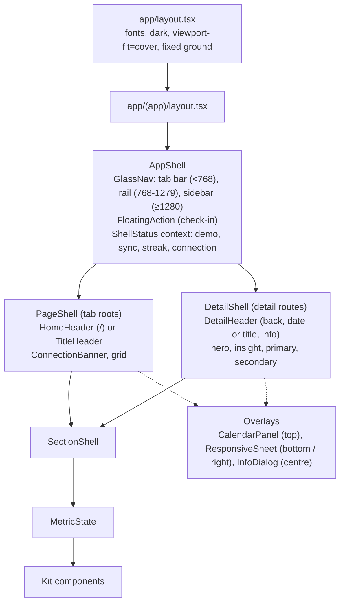
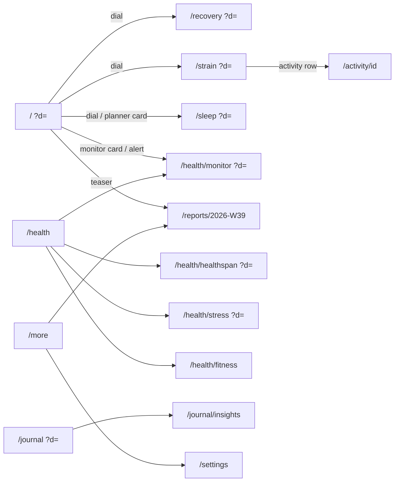

# Pulse design spec v2

This document is the contract for the interface. U17 rebuilds the visual layer from it: tokens (§2), shells (§4), the component kit (§5) and every screen (§7). Data, queries and screen structure stay as U12 and U13 built them. Nobody redesigns in code: a change goes into this file first.

It is also the project's design-system record (what Impeccable calls DESIGN.md). There is no second copy.

**How to read it.** Values in `code` are exact. A reference in brackets is a file in `docs/design/reference/` without its extension: `[latest-home-collapsed-1]` is `latest-home-collapsed-1.jpg`. Every `latest-*` file is dated in the reference README; all of them postdate WHOOP's October 2025 redesign. Older references (no `latest-` prefix) are cited only where the current app did not change, and that is said. **Inferred** marks a decision no reference shows; each one is listed again in §12.

Contents

0. Changelog v1 → v2
1. Direction
2. Tokens (including the glass material system, §2.6)
3. Typography
4. Shells (tab bar, collapsing Home header, detail header, overlays, calendar)
5. Components (including the WHOOP Age orb, §5.17)
6. Copy and formatting
7. Screens
8. Journeys
9. Accessibility
10. Do not
11. Deviations from the plan
12. Inferred decisions and coverage gaps

---

## 0. Changelog v1 → v2

v1 copied WHOOP's 2024-25 look from App Store frames and pre-redesign posts. v2 follows the app as members post it from October 2025 to October 2026 (48 dated captures and 3 screen recordings, README "Latest"). What changed, and the evidence:

| # | Area | v1 | v2 | Evidence |
|---|---|---|---|---|
| C1 | Materials | Flat: no shadows, no rings, no translucency; "no glass" in Do not | A restrained glass system (§2.6): translucent blurred chrome (tab bar, rail, sidebar, floating action), opaque content cards with a 1 px top highlight. Content never turns to glass | Tab bar shows content through it [latest-home-collapsed-2], [latest-home-collapsed-3], [latest-tabbar-1]; card top hairline sampled `#2c2f34` over `#252a2d` [latest-recovery-1] |
| C2 | Page ground | Gradient that scrolls with the page | Gradient fixed to the viewport, so the sticky header and the page share one ground | Header region reads `#242b32` → `#1d252a` in both scrolled and unscrolled states [latest-home-sticky-header-user-2025], [latest-home-collapsed-1] |
| C3 | Home top bar | Demo chip, date pill, sync dot; solid fill | Collapsing header (§4.3): avatar, streak flame + count, `‹ TODAY ›` pill, sync status (WHOOP's band battery). It gains a row of mini Sleep / Recovery / Strain rings once the dials scroll away, and the avatar row hides on scroll down and returns on scroll up | [latest-home-sticky-header-user-2025], [latest-home-collapsing-1], [latest-home-collapsed-1..3], [latest-home-dashboard-1] |
| C4 | Home day strip | DayStrip under the top bar | Removed from Home. Days change with the pill's chevrons and the top calendar; the DayStrip stays on Journal only | No current Home capture has a day strip [latest-home-top-1..3], [latest-home-pastday-1] |
| C5 | Navigation, phone | Opaque pill, 4 items, `bg-muted/95` | Floating glass tab bar (4 destinations) plus a separate round glass action button on its right, as WHOOP's coach button. Tab roots only: detail screens show the round button alone | [latest-tabbar-1], [latest-home-top-1]; detail screens without a tab bar [latest-recovery-1], [latest-strain-1], [latest-activity-2] |
| C6 | Navigation, tablet and laptop | shadcn Sidebar, opaque | The same glass material as a floating rail (tablet, 88 px) and floating sidebar (laptop, 232 px). **Inferred** (WHOOP has no desktop app) | Material from [latest-tabbar-1] |
| C7 | Detail header | Title = metric name, date pill below | Recovery, Strain and Sleep: the title is the date ("TODAY", "MON, JUL 27"); the metric name lives in the dial. Monitors and Healthspan keep their name as title with the date switcher below | [latest-recovery-1], [latest-strain-1], [latest-sleep-1]; [latest-stress-monitor-1], [latest-whoop-age-amber-1] |
| C8 | Calendar | Bottom sheet with shadcn Calendar | `CalendarPanel` (§5.16, built and committed): a flat, opaque panel that drops from the top edge over a 65 % black dim with no blur, month header `‹ MAY ›`, day numbers in band colours, legend bottom right. Flat, not glass, because that is what the May 2026 captures show | README "Calendar references" (May 2026); rows CAL1-CAL7 |
| C9 | Info sheets | Bottom drawer / right sheet | Centred info card over an 85% dim with a close button and an outline action, on every width | [latest-popover-info-1] |
| C10 | Edit sheets | Drawer, `rounded-t-2xl` | Drawer with 28 px top corners, a 1 px top highlight, white primary and outline secondary buttons, 56 px tall | [latest-sheet-edit-1], [latest-sheet-behaviors-1] |
| C11 | Healthspan hero | Static ringed circle with a radial glow | Living WHOOP Age orb (§5.17): organic blob, particle field, inner rim glow, colour by years younger or older, entry and idle animation, pointer swirl | [latest-whoop-age-green-1], [latest-whoop-age-green-2], [latest-whoop-age-touch-frames], [latest-whoop-age-cyan-1], [latest-whoop-age-mixed-1], [latest-whoop-age-mixed-2], [latest-whoop-age-amber-1] |
| C12 | Healthspan scroll | Static | The orb shrinks into a sticky header flanked by years younger and Pace of Aging | [latest-healthspan-collapsed-1] |
| C13 | Health hub ground | Same as every page | Near-black ground with a teal glow at the top | Sampled `#0b3625` / `#112a2e` top centre over `#090909` edges [latest-health-tab-1], [latest-whoop-age-mixed-2] |
| C14 | Stress gauge | 240° arc in three flat segments | 240° arc in one continuous gradient (blue → teal → green → yellow → orange), thin, with a white needle | [latest-stress-monitor-1] |
| C15 | Home sections | Key statistics, weekly teaser at the bottom | Order and names follow WHOOP: monitors, My Day (outlook, activities, journal week, Tonight's sleep), My Dashboard (renamed from Key statistics), the week-in-review banner styled as WHOOP's "Your Day In Review" | [latest-home-top-1], [latest-home-collapsed-1], [latest-home-dashboard-1] |
| C16 | Motion | Dial sweep only; sheets use library defaults | Adds the header collapse, tab press, sheet and calendar entrances, the orb, and tooltips that follow the pointer; still no page-load choreography (§2.7) | Collapse frames [latest-home-collapsing-1] → [latest-home-collapsed-1]; orb [latest-whoop-age-touch-frames] |
| C17 | Skeletons | Each kit component exports a `.Skeleton` | Same, plus a rule set (§5.19): skeletons reuse the component's own box, so nothing moves when data arrives; the header and tab bar never skeleton | User review 2026-10-02 (plan U16) |
| C18 | Radii | Cards 12, sheets 16, tab bar 22 | Cards 16, rows inside cards 10, chips 8, sheets 28, tab bar full | Card corners measured 16 pt on [latest-home-top-1]; sheet 28 pt on [latest-sheet-edit-1]; tab bar is a capsule [latest-tabbar-1] |

Unchanged from v1 and still binding: the data colours and their single meanings (§2.3), the text tiers (§2.2), the faces and type roles (§3), the reason-code states (§4.9, §5.14), the copy rules (§6), every kit component's data behaviour (§5.2-5.15), the equal Home dials (D1), and every deviation row in §11.

---

## 1. Direction

**Design read.** A personal health product UI (Impeccable mode: Operate) for one daily user, copying the current WHOOP app (iOS, 2025-26): a dark slate ground that stays put while content scrolls, opaque charcoal cards with a faint top light, translucent glass only on the chrome that floats over content, white DIN-style numerals, uppercase tracked labels, and colour used only for data meaning. One living moment per screen at most: the dial sweep, or the WHOOP Age orb.

**Use scene.** Checked in bed in the morning and again at night, on a phone, often in a dark room; occasionally on a laptop at a desk. Dark is required by the scene and by WHOOP. There is no light theme.

**What decides what.**

| Question | Decided by |
|---|---|
| Look: palette, materials, type character, layout, density, component shape, copy voice | The `latest-*` references. Where the skills' taste rules disagree (uppercase labels, near-black ground, a full data palette, glass chrome), WHOOP wins |
| Craft: spacing rhythm, states, motion curves, hit areas, contrast, focus, numerals, wrapping, reduced motion and transparency | The skills (`impeccable`, `better-ui`, `make-interfaces-feel-better`, `web-design-guidelines`, `frontend-design`, `design-taste-frontend`) |
| Anything WHOOP does not show (laptop, tablet, Bevel-only features) | Extrapolated from the nearest WHOOP screen in the same material, marked inferred, never a new style |

**Taste dials** (`design-taste-frontend`, set for a product UI): `DESIGN_VARIANCE 3`, `MOTION_INTENSITY 4`, `VISUAL_DENSITY 6`. v1 had motion 3; the header collapse and the orb add one step, and nothing else moves without a cause.

**Glass is a specific effect, not a style.** Impeccable's craft floor refuses "glass and blur as decoration". Here glass has one job: chrome that floats over scrolling content (tab bar, rail, sidebar, floating action) shows that the content continues underneath. Cards, rows, charts and dials are content and stay opaque. This is how the references draw it: content cards are solid [latest-home-top-1]; only the tab bar lets text show through [latest-home-collapsed-2].

**Colour strategy.** Unchanged: a full palette for data (recovery green, yellow, red; strain blue; sleep steel blue; teal "optimal"; orange "attention"; stress light blue) on a restrained neutral ground. Chrome is white and grey only, with one exception taken from WHOOP: the round action button carries an indigo-to-blue rim [latest-tabbar-1].

**Principles.** v1's five hold (the number is the hero; colour is a data channel; three tiers of disclosure; honest states; one vocabulary), plus:

6. **Depth by layer, not by decoration.** Ground (fixed) → cards (opaque, top light) → chrome (glass) → overlays (dimmed). Each layer has one material (§2.6), and nothing skips a layer.
7. **The header follows the content.** When the dials leave the screen, their state stays in the header as mini rings, so the day's three numbers are always one glance away.

**Critique of the v1 build against the latest references** (Impeccable `critique`, heuristic pass). What v2 fixes, by severity:

1. *High.* Wrong era of chrome: an opaque pill tab bar and a solid top bar with a Demo chip read as WHOOP 2024. The current app's identity lives in its chrome (glass bar, round action, collapsing header), so v1 looked "basic" even where the content matched (C1, C3, C5).
2. *High.* State is lost on scroll: once the dials leave the screen, v1 shows no score until the user scrolls back. WHOOP keeps the three rings in the header (principle 7).
3. *Medium.* Healthspan's hero is a static ring with a CSS glow; WHOOP's is the screen's one living object and changes colour with the result (C11). Without it the Health tab has no focal point.
4. *Medium.* Explanations open as tall bottom sheets; WHOOP uses a compact centred card, faster to dismiss (C9).
5. *Low.* Radii (12) and row heights (52) are a step tighter than the current app's 16 / 56, which makes v1 feel denser than WHOOP (C18, V11).
6. *Low.* The Home day strip duplicates the pill's job and pushes the dials down (C4).

---

## 2. Tokens

All tokens live in `src/app/globals.css` under `:root` and are mapped in `@theme inline`, so Tailwind classes exist for them (`bg-card`, `text-recovery-green`, `bg-glass-bar`...). Components use the classes, never raw hex. The only new CSS beyond token definitions is the base-layer ground (§2.1) and the two fallback media blocks (§2.6), which redefine tokens and nothing else.

Sampling: dominant-colour and median probes with PIL on the full-resolution captures in `raw/` (`raw/sample.py`, and inline probes listed in the README). "Sampled" gives the reading; "Token" gives the value shipped (◆ = contrast fix or rounding).

### 2.1 Ground and surfaces

| Token (CSS var) | Tailwind | Value | Sampled from | Use |
|---|---|---|---|---|
| `--background-top` | `bg-background-top` | `#262e33` | v1; `#242b32` at the top of [latest-home-sticky-header-user-2025] | Ground gradient start |
| `--background-mid` | (gradient stop) | `#1b2024` | v1; `#1d252a` at 150 pt [latest-home-sticky-header-user-2025] | Ground stop at 270 px |
| `--background` | `bg-background` | `#0f1113` | v1 | Ground below 740 px; manifest `background_color` |
| `--ground` | `bg-(image:--ground)` | `linear-gradient(180deg, var(--background-top) 0, var(--background-mid) 270px, var(--background) 740px)` | as v1 | The fixed page ground and the header fill (§4.3) |
| `--ground-health` | `bg-(image:--ground-health)` | `radial-gradient(120% 55% at 50% 0, #0f2c2a 0, transparent 70%), linear-gradient(180deg, #0a0b0c 0, #14171c 60%)` | `#0b3625` / `#112a2e` top centre, `#090909` → `#14171c` edges [latest-health-tab-1], [latest-whoop-age-mixed-2] | Health hub ground (C13) |
| `--ground-healthspan` | `bg-(image:--ground-healthspan)` | `linear-gradient(#101518, #101518)` | `#000000` around the orb [latest-whoop-age-amber-1], `#101518` lower and in the collapsed band [latest-healthspan-collapsed-1] (M3) | Healthspan detail ground; the collapsed band paints the same value |
| `--card` | `bg-card` | `#2b2f32` | v1; `#2b2e33` Daily Outlook, `#2c3236` activities card [latest-home-sticky-header-user-2025] | Every card |
| `--card-top` | `from-card-top` | `#2f3337` | `#2c2f34` top hairline over `#252a2d` body [latest-recovery-1]; cards lighten 2-4 % toward their top edge | Top stop of the card's vertical gradient (§2.6) |
| `--secondary` | `bg-secondary` | `#3b4244` ◆ | `#3b4244` activity rows inside the activities card [latest-home-sticky-header-user-2025] (v1 `#34393d`) | Rows inside a card, secondary buttons, selected toggle |
| `--popover` | `bg-popover` | `#252c32` | `#2a373f` → `#1a2129` info card gradient [latest-popover-info-1] | Info cards, dropdowns, tooltips (solid part of §2.6 "overlay") |
| `--accent` | `bg-accent` | `#41484b` | one step above secondary | Hover fill for rows and ghost buttons |
| `--muted` | `bg-muted` | `#22282c` | v1 | Skeletons, toggle-group track |
| `--inset` | `bg-inset` | `#111619` | `#111619` insight card fill [latest-sleep-1] (v1 `#0c0f11`) | Legend strips, insight-card fill |
| `--sheet` | `bg-sheet` | `#14181c` | `#14181c` → `#0f1316` edit sheet [latest-sheet-edit-1] | Bottom sheets and the right sheet |
| `--sheet-bottom` | `to-sheet-bottom` | `#0f1316` | same | Sheet gradient end |
| `--border` | `border-border` | `rgb(255 255 255 / 0.1)` | v1 | Row dividers, input outlines |
| `--input` | `border-input` | `rgb(255 255 255 / 0.15)` | v1 | Input outlines |
| `--field` | `bg-field` | `#32393e` | `#32393e` time fields [latest-sheet-edit-1] | Inputs and read-only value fields in sheets |

**Ground.** The base layer paints `html { background: var(--background) }` and `body::before { content: ""; position: fixed; inset: 0; z-index: -1; background: var(--ground) }`. It no longer scrolls with the page (C2): in every current capture the top of the screen has the same slate whether the page is at rest or scrolled [latest-home-top-1], [latest-home-collapsed-3]. `position: fixed` on a pseudo-element works on iOS Safari, where `background-attachment: fixed` does not. The Health hub and Healthspan swap the ground through a `data-ground="health" | "healthspan"` attribute on `<main>`, which PageShell / DetailShell set; the base layer maps the attribute to `--ground-health` / `--ground-healthspan`. That is the only page-level background switch.

### 2.2 Text tiers

Unchanged from v1 (values and contrast checks hold on the v2 surfaces; `--secondary` rows at `#3b4244` give `--foreground` 10.8 : 1 and `--muted-foreground` 4.6 : 1).

| Token | Tailwind | Value | Sampled | Contrast on `--card` / on `--background-top` | Use |
|---|---|---|---|---|---|
| `--foreground` | `text-foreground` | `#ffffff` | `#FCFCFC` row labels and body [recovery-detail], [trend-view-recovery] | 13.5 / 13.8 | Numbers, titles, labels, body |
| `--foreground-secondary` | `text-foreground-secondary` | `#babac0` | `#BABAC0` "Recommended bedtime", `#B4B4B4` "vs. prior 30 days", `#C0C0C0` "5/5 Metrics" | 7.0 / 7.2 | Supporting lines under a value, times in activity rows |
| `--muted-foreground` ◆ | `text-muted-foreground` | `#999ea3` | `#8A9090` WHOOP's grey body and "Refreshed daily"; `#888d92` header battery % [latest-home-sticky-header-user-2025] | 5.0 / 5.1 (sampled grey was 4.2 on cards) | Captions, 30-day averages, axis ticks, placeholders, header sync text |
| `--primary-foreground` | `text-primary-foreground` | `#0f1113` | derived | 18.9 on white | Text on white primary buttons |

`#5A5A60` (WHOOP's chart axis grey) is **not** a text token: at 2.0 : 1 it fails. Axis ticks use `--muted-foreground`.

### 2.3 Data colours

Every v1 data token is unchanged in value and meaning (recovery green / yellow / red and the red text variant, strain, strain text, strain deep, sleep, sleep deep, optimal, warning, the three stress levels, coach, insight hairline, banner gradient, dial track, dial target, destructive, hypnogram stages, the chart variables and the band rules for Energy Bank, Health Monitor and training load). The current app still uses the same hues: recovery ring `#19ec06`-family green [latest-recovery-1], strain `#0093e7`-family blue [latest-strain-1], sleep steel blue [latest-sleep-1], `#00ec9c` "years younger" = `--optimal` [latest-whoop-age-green-2].

| Token | Tailwind | Value | Sampled | Meaning (and only this meaning) |
|---|---|---|---|---|
| `--recovery-green` | `*-recovery-green` | `#19ec06` | `#19EC06` ring [recovery-detail], `#19EB06` dots [trend-view-recovery] | Recovery ≥ 67. Energy ≥ 67 |
| `--recovery-yellow` | `*-recovery-yellow` | `#ffde00` | `#FEDD00` [trend-view-recovery]; `#fcd855` mini ring [latest-home-sticky-header-user-2025] | Recovery 34-66. Energy 34-66 |
| `--recovery-red` | `*-recovery-red` | `#ff0026` | `#FE0025` [trend-view-recovery] | Recovery ≤ 33. Energy ≤ 33. Fills and rings only |
| `--recovery-red-text` ◆ | `text-recovery-red-text` | `#ff5a6a` | derived (red lifted to 4.5 : 1 on cards) | The word "Red" and red values set as text |
| `--strain` | `*-strain` | `#0093e7` | `#0093E7` ring [strain-detail], `#0092E7` [home-dials] | Strain fill, HR line and area |
| `--strain-text` ◆ | `text-strain-text` | `#1fa0f0` | derived (4.7 : 1 on cards) | Strain values as text below 24 px |
| `--strain-deep` | `bg-strain-deep` | `#0d48be` | `#0D48BE` activity chip [home-device-today] | Activity chip fill, workout spans in charts (25%) |
| `--sleep` | `*-sleep` | `#7ba1bb` | `#7BA1BB` ring [sleep-detail]; `#7d9aa9` mini ring [latest-home-sticky-header-user-2025] | Sleep performance fill |
| `--sleep-deep` | `bg-sleep-deep` | `#39597b` | `#39597B` sleep chip [home-device-today] | Sleep and nap chip fill, sleep spans in charts (15%) |
| `--optimal` | `*-optimal` | `#00f19f` | `#00F19F` "optimal" bars [sleep-detail]; `#00ec9c` "years younger" [latest-whoop-age-green-2] | Good: in range, helps, optimal, positive delta, improving, years younger |
| `--warning` | `*-warning` | `#ffa722` | `#FFA722` "poor" bars, "hurts" bars, `#FEA622` high stress | Attention: out of range, hurts, poor, negative delta |
| `--stress-low` | `*-stress-low` | `#67aee6` | `#67AEE5` [stress-scale] | Stress < 1.0 |
| `--stress-medium` | `*-stress-medium` | `#00f19f` | `#00F09E` [stress-scale] | Stress 1.0-1.9 |
| `--stress-high` | `*-stress-high` | `#ffa722` | `#FEA622` [stress-scale] | Stress ≥ 2.0 |
| `--coach` | `text-coach` | `#7095fe` | `#7095FE` "Break down my Recovery" link [recovery-detail]; same blue "EXPLORE YOUR RECOVERY INSIGHTS" [latest-recovery-1] | Insight-card links only |
| `--insight-from` → `--insight-to` | `from-insight-from to-insight-to` | `#4b418c` → `#346e8c` | `#4B418C` / `#346E8C` insight hairline [recovery-detail]; `#111231` → `#111717` edge [latest-sleep-1] | The 1 px gradient hairline of `InsightCard` |
| `--banner-from` → `--banner-to` | `from-banner-from to-banner-to` | `#2e2c4f` → `#2b3f50` | `#2E2C4F` / `#2B3F50` "Your Day in Review" banner [home-device-planner-nav], unchanged in [latest-home-top-1] | The week-in-review banner |
| `--outlook-from` → `--outlook-to` | `from-outlook-from to-outlook-to` | `#6a5a45` → `#2f4a5e` | warm-to-steel gradient of "Your Daily Outlook" [latest-home-collapsing-1] | The Daily Outlook row on Home (morning variant) |
| `--dial-track` | `fill-dial-track` | `#33383c` | `#33383C` [home-dials]; `#31393b` mini ring track [latest-home-sticky-header-user-2025] | Unfilled dial track, empty meter ticks, mini ring track |
| `--dial-target` | `fill-dial-target` | `#5a5e61` | `#5A5E61` strain target arc [home-dials] | Strain Target range on the dial track |
| `--destructive` | `*-destructive` | `#ff0026` | = recovery red | Destructive buttons and form errors (text uses `--recovery-red-text`) |

**Unchanged rules from v1:** Energy Bank bands like Recovery; Health Monitor in range `--optimal`, out of range `--warning`, illness `--recovery-red`; training load 0.8-1.3 optimal, 1.3-1.5 warning, > 1.5 red, < 0.8 muted; hypnogram lanes `--stage-awake #e6edf2`, `--stage-rem #a6c3d7`, `--stage-light #7ba1bb`, `--stage-deep #48708c`; chart variables `--chart-1` … `--chart-5`, `--chart-grid`, `--chart-band`, `--chart-cursor` as v1.

**WHOOP Age orb palette (new).** Four hue stops, each a rim / glow / particle / text quadruple, interpolated by §5.17's rule. Sampled across the radius of each capture:

| Stop | `--orb-*-rim` | `--orb-*-glow` | `--orb-*-particle` | `--orb-*-text` | Sampled from |
|---|---|---|---|---|---|
| `green` (≥ 3 years younger) | `#21c76b` | `#13733d` | `#80f0c0` | `#00ec9c` (= `--optimal`) | rim `#21c76b` 2 px, glow `#13733d` → black at 46 % of the radius, particle cores `#80f0c0`, soft particles `#58c090` [latest-whoop-age-green-2] |
| `cyan` (about the same age) | `#75cadf` | `#2a5462` | `#9cc8f0` | `#7cc8e8` | rim `#75cadf`, glow `#2a5462` → `#1b343b` [latest-whoop-age-cyan-1] |
| `ice` (cool half of a mixed orb) | `#5f8fb8` | `#305070` | `#a0c0e0` | `#c0d8e0` | top third `#306080` / `#305070`, particles `#a0c0e0`, text `#c0d8e0` [latest-whoop-age-mixed-2] |
| `amber` (≥ 2.5 years older) | `#c98a2a` ◆ | `#895315` | `#f0c070` | `#e0b080` | rim `#895315`-`#93640a` (lifted for a visible 2 px edge), glow → black at 55 % of the radius, particles `#f0c070` [latest-whoop-age-amber-1] |

These eight tokens per stop are used only by `WhoopAgeOrb` and its mini variant. They are data colours: they encode years younger or older and nothing else.

### 2.4 Radii

Explicit scale in `@theme inline` (shadcn's multiplier scale stays replaced):

| Token | Value | Use | Evidence |
|---|---|---|---|
| `rounded-sm` | 4 px | Meter segments, legend swatches | v1 |
| `rounded-md` | 8 px | Status chips, activity chips' inner badge | chips [latest-health-monitor-1] |
| `rounded-lg` | 10 px | Rows inside cards (activity rows, zone rows), inputs, fields | activity rows 10 pt inside a 16 pt card with a 6 pt inset [latest-home-collapsed-1] |
| `rounded-xl` | 12 px | Buttons inside cards and sheets, segmented tracks | "ADD ACTIVITY" button [latest-home-collapsed-1] |
| `rounded-2xl` | 16 px | Cards, alerts, banners, insight cards | 16 pt measured on [latest-home-top-1] (v1 12) |
| `rounded-3xl` | 24 px | Info card | [latest-popover-info-1] |
| `rounded-[28px]` | 28 px | Sheet top corners, the top calendar panel's bottom corners, the laptop sidebar | [latest-sheet-edit-1]; panel corners inferred to match |
| `rounded-full` | pill | Tab bar, rail items, date pill, streak pill, tags, dials, dots, primary buttons in sheets | [latest-tabbar-1], [latest-sheet-edit-1] |

Concentric rule: a row inset 6 px inside a 16 px card is 10 px (`rounded-lg`); a 1 px gradient hairline around a `rounded-2xl` card has an inner `rounded-[15px]`; the tab bar's active lens inset 4 px inside a 31 px half-height capsule is `rounded-full`. Surfaces inset more than 16 px are separate and keep their own radius.

### 2.5 Spacing and layout metrics

Tailwind's 4 px scale. Measured on the device captures (1 pt = 1 CSS px at 390).

| Metric | Phone < 768 | Tablet 768-1279 | Laptop ≥ 1280 | Evidence |
|---|---|---|---|---|
| Page gutter | 16 px (`px-4`) | 24 px | 32 px | v1, unchanged in [latest-home-top-1] |
| Content max width | full | 720 px centred in the space right of the rail | 1120 px | v1 |
| Card padding | 16 px (`p-4`) | 16 px | 20 px (`xl:p-5`) | v1 |
| Gap between cards in a group | 12 px | 12 px | 16 px | v1 |
| Section gap | 32 px | 32 px | 40 px | v1 |
| List row height | 56 px | 56 px | 56 px | dashboard rows 56 pt [latest-home-dashboard-1] (v1 52) |
| Activity row height | 56 px | 56 px | 56 px | v1 |
| Home header, top row | 44 px + `env(safe-area-inset-top)` | 52 px | 52 px | [latest-home-sticky-header-user-2025] |
| Home header, ring row | 40 px | 40 px | 40 px | same |
| Header bottom fade | 24 px | 24 px | 24 px | same ("My Day" fades over about 24 pt) |
| Detail header | 52 px + safe area | 56 px | 56 px | [latest-recovery-1] |
| Tab bar | 62 px capsule, inset 12 px from the left, `bottom = max(env(safe-area-inset-bottom) - 6px, 12px)` | n/a | n/a | 62 pt tall, bottom edge 29 pt above the screen bottom [latest-tabbar-1] |
| Round action button | 62 px circle, 8 px right of the tab bar, 12 px from the right edge | 56 px, bottom-right, 24 px insets | 56 px, bottom-right, 32 px insets | [latest-tabbar-1]; larger widths inferred |
| Rail (tablet) | n/a | 88 px wide, floating, 12 px from the top, left and bottom | n/a | inferred |
| Sidebar (laptop) | n/a | n/a | 232 px wide, floating, 12 px insets | inferred |
| Minimum hit area | 44 × 44 px | 44 × 44 | 40 × 40, keep 44 where cheap | v1 |
| Content bottom padding | `calc(62px + max(env(safe-area-inset-bottom) - 6px, 12px) + 24px)` on tab roots; `calc(62px + 24px + env(safe-area-inset-bottom))` on detail screens (round button) | 96 px | 40 px | derived |

### 2.6 Materials and depth (the glass system)

Five materials. Each surface uses exactly one, named here and as a utility recipe. **Liquid Glass is Apple's native material; there is no web package.** This is a labelled web approximation, matched to what the references show of WHOOP's dark glass: a dark, nearly opaque fill, a soft but legible show-through, a bright top edge and a dark lower edge.

**Measured.** Tab bar over the Home page [latest-tabbar-1]: fill `#20252b` at the top edge → `#181d21` at the bottom (a vertical gradient, lighter on top); a 1 px top edge `#22252b`; a dark band `#0a090c` under the lower edge (the shadow). Text behind the bar stays recognisable but soft ("Upload lab tests and connect your..." through the bar in [latest-home-collapsed-3]), which puts the fill near 80 % opacity with a small blur. Round button: fill `#232735` → `#1e2333`, rim `#2e3053` (indigo, upper left) to `#4c94db` (blue, lower right), inner icon ring `#7778dd`. Active tab: a lighter pool `#2d3238` against `#181d21` under the active item. Alpha and blur cannot be measured from a still; the values below are fitted to the show-through and marked inferred where they are.

| Token | Value | Notes |
|---|---|---|
| `--glass-top` | `rgb(34 39 45 / 0.80)` | sampled `#20252b` plus show-through; alpha inferred |
| `--glass-bottom` | `rgb(22 27 31 / 0.88)` | sampled `#181d21`; alpha inferred |
| `--glass-edge` | `rgb(255 255 255 / 0.10)` | top highlight (sampled `#22252b` on `#20252b` plus the rim visible on the round button) |
| `--glass-rim` | `rgb(255 255 255 / 0.06)` | 1 px ring around the whole capsule |
| `--glass-lens` | `rgb(255 255 255 / 0.07)` | active tab pool, sampled `#2d3238` over `#181d21` |
| `--glass-shadow` | `0 10px 30px rgb(0 0 0 / 0.5), 0 2px 6px rgb(0 0 0 / 0.35)` | the dark lower band |
| `--glass-action-top` → `--glass-action-bottom` | `rgb(35 39 53 / 0.82)` → `rgb(30 35 51 / 0.9)` | sampled `#232735` → `#1e2333` |
| `--action-rim-from` → `--action-rim-to` | `#7778dd` → `#4c94db` | sampled rim and icon ring |
| `--dim` | `rgb(0 0 0 / 0.65)` | calendar dim, as built `bg-black/65` (README calendar findings) |
| `--dim-strong` | `rgb(0 0 0 / 0.85)` | info card and sheet dim: `#020204` over the dark page [latest-popover-info-1], `#040505` [latest-sheet-edit-1] |
| `--card-edge` | `rgb(255 255 255 / 0.06)` | card top hairline, sampled `#2c2f34` over `#252a2d` [latest-recovery-1] |
| `--sheet-edge` | `rgb(255 255 255 / 0.14)` | sheet top hairline, sampled `#4e565a` [latest-sheet-edit-1]; coach sheet `#535760` [latest-coach-sheet-1] |

Blur radii use Tailwind's scale: `backdrop-blur-md` = 12 px, `backdrop-blur-xl` = 24 px.

| Material | Used by | Utility recipe |
|---|---|---|
| **Ground** | page | §2.1, fixed, opaque |
| **Card** (opaque) | cards, banners, monitor cards, chart cards | `rounded-2xl bg-linear-to-b from-card-top to-card shadow-[inset_0_1px_0_var(--card-edge)]` (no ring, no drop shadow: cards sit on the ground) |
| **Glass bar** | tab bar, rail, sidebar, floating action | `bg-linear-to-b from-glass-top to-glass-bottom backdrop-blur-md backdrop-saturate-150 shadow-(--glass-shadow) ring-1 ring-(--glass-rim) [box-shadow:inset_0_1px_0_var(--glass-edge),var(--glass-shadow)]` |
| **Flat panel** (opaque) | the top calendar panel (§5.16), the header sync popover | calendar as built: `bg-background-mid border-b-[1.5px] border-background-top` over `bg-black/65` with no blur (README calendar: fill about `#1a2129`, a lighter 1.3 pt band along the bottom edge, no blur on the dim). Sync popover: `rounded-2xl bg-popover ring-1 ring-white/8` |
| **Overlay** (opaque) | info card, bottom sheet, right sheet, dropdowns, tooltips | info card `rounded-3xl bg-linear-to-b from-[#2a373f] to-popover ring-1 ring-white/8`; sheet `bg-linear-to-b from-sheet to-sheet-bottom shadow-[inset_0_1px_0_var(--sheet-edge)]`; tooltip `rounded-xl bg-popover ring-1 ring-white/10 shadow-[0_8px_24px_rgb(0_0_0/0.45)]` |

Write the arbitrary box-shadow once per material inside the component's `cva` base, never per call site.

**Fallbacks** (token redefinitions only; the recipes do not change):

```css
@supports not ((backdrop-filter: blur(1px)) or (-webkit-backdrop-filter: blur(1px))) {
  :root { --glass-top: #22272d; --glass-bottom: #181d21; --glass-action-top: #232735; --glass-action-bottom: #1e2333; }
}
@media (prefers-reduced-transparency: reduce) {
  :root { --glass-top: #22272d; --glass-bottom: #181d21; --glass-action-top: #232735; --glass-action-bottom: #1e2333;
          --dim: rgb(0 0 0 / 0.8); }
}
```

With opaque glass tokens the blur has nothing to show and the bar reads as the sampled solid colours. Contrast never depends on the blur: tab labels are checked against the opaque `#181d21` (white 15.6 : 1, `--muted-foreground` 6.0 : 1). Add `@custom-variant reduced-transparency (@media (prefers-reduced-transparency: reduce))` so components that also blur content (none in v2) could opt out.

**Depth order (z-index).** Ground `-z-10` (the pseudo-element), content `z-0`, sticky headers `z-20`, glass bar and floating action `z-30`, overlays including the calendar panel `z-50` (Radix / shadcn), toasts: Sonner default. Nothing else sets `z-*`.

**Glow.** One family only: the WHOOP Age orb's inner rim glow (§5.17), drawn in its canvas. The v1 CSS radial glow on the Healthspan orb is retired. No other glows, no neon, no coloured drop shadows.

### 2.7 Motion

| Token | Value | Use |
|---|---|---|
| `--ease-standard` | `cubic-bezier(0.2, 0, 0, 1)` | Every interactive CSS transition (hover, press, colour, lens move) |
| `--ease-out-expo` | `cubic-bezier(0.16, 1, 0.3, 1)` | Arrivals: header ring row, sheets, info card, orb entry |
| `--ease-in-quick` | `cubic-bezier(0.4, 0, 1, 1)` | Exits |
| Fast | 150 ms | Hover, press, colour, focus ring, tab lens |
| Base | 220 ms | Header ring row in and out, top row slide, toggle thumb |
| Overlay in / out | 320 ms / 200 ms | Sheet, info card (the calendar keeps its built 200 ms, §5.16) |
| Dial fill | 700 ms, Recharts `animationEasing="ease-out"` | `ScoreDial` sweep (unchanged) |
| Mini ring fill | 500 ms | First appearance of the ring row only |
| Chart draw | 500 ms | Recharts series on first mount (unchanged) |
| Orb entry | 1100 ms | §5.17 |
| Press | `active:scale-[0.96]`, 150 ms | Buttons, dials, chips, tab items, the round action, the date pill's segments. Rows use `active:bg-accent` |

**Motion thesis** (Impeccable): the focal moment is the WHOOP Age orb on Health and Healthspan, and the dial sweep on Home and the score details. Continuity: the dials hand their state to the header's mini rings; the calendar comes from the pill that opened it. Feedback: press scale and the tab lens. Nothing else moves.

| Interaction | Spec | Evidence |
|---|---|---|
| Header collapse | §4.3: ring row fades in (`opacity 0 → 1`) and rises 6 px, 220 ms `--ease-out-expo`; mini rings fill 0 → value in 500 ms the first time they appear in a page view, instantly afterwards | Mid-collapse frame [latest-home-collapsing-1] shows rings already filled under a still-visible top row |
| Top row | Never hides (user correction 2026-10-03; WHOOP hides it deep, [latest-home-collapsed-2], not adopted) | §4.3 |
| Detail header collapse | §4.3a: row 2 grows 220 ms `--ease-out-expo`, compact hero fades and scales 0.85 → 1, stats fade and rise 4 px | `docs/design/sticky.md` B5 |
| Tab change | Active lens slides between items: a single absolutely positioned lens with `transition-[translate,width] duration-150 ease-standard`; icon and label colour cross-fade 150 ms | Lens [latest-tabbar-1]; movement inferred |
| Calendar open | As built (§5.16): slides down 200 ms `ease-standard` (tw-animate `slide-in-from-top`), the dim fades; reduced motion: appears at once (CAL7) | Opens from the top (user; README) |
| Sheet open | vaul default spring kept; the dim uses `--dim-strong` | [latest-sheet-edit-1] |
| Info card open | `opacity 0 → 1`, `scale 0.96 → 1`, `blur(4px) → 0`, 320 ms `--ease-out-expo`; close 200 ms, no blur | [latest-popover-info-1]; timing inferred |
| Day change | Content swaps with no slide; the dials re-sweep from their previous value (700 ms); the date pill label cross-fades 150 ms | Screen recording of day stepping [latest-home-top-1] source video: content swaps between frames with no transition |
| Loading a past day | The pill label shows a 16 px spinner in place of the date until data arrives (the one spinner in the app); content below keeps the previous day dimmed to 60 % until replaced | [latest-home-pastday-1] (spinner where the pill sits, streak hidden) |
| Hover (pointer devices) | Rows and cards: `hover:bg-accent` / card `hover:from-[#33383c]`, 150 ms; never lift or move | v1 rule |
| Chart tooltip | Appears at the pointer, follows it, snaps to the nearest point, clamps inside the plot; no position animation (`isAnimationActive={false}` on `Tooltip`, `animationDuration={0}`); touch: tap or drag to scrub | Plan U16; WHOOP scrub cursor [latest-trends-2] |
| Dial sweep, chart draw | unchanged | v1 |

Rules:

- Transitions name their properties (`transition-[opacity,translate]`, `transition-transform`). Never `transition-all`.
- No page-load choreography, no staggered section entrances, no counting-up numbers.
- No scroll listener for headers: §4.3 and §4.3a use one `IntersectionObserver` (`useHeroCollapse`) that writes a `data-state` attribute, never React state per frame.
- `prefers-reduced-motion: reduce`: every Recharts series `isAnimationActive={false}`; CSS durations collapse in the base layer; the header switches states with opacity only (no translate); the calendar and sheets appear without movement (opacity 120 ms); the orb renders its static frame (§5.17); skeleton pulse stops.

### 2.8 Icons

Unchanged from v1 (lucide-react, `strokeWidth={1.75}`, sizes 16 / 20 / 24, `currentColor`, outline at rest, `aria-hidden` on decorative icons, the meaning-to-glyph map), with these v2 additions and changes:

| Meaning | lucide | Note |
|---|---|---|
| Tab bar (phone), rail and sidebar | `House`, `HeartPulse`, `NotebookPen`, `Menu` at 26 px, `strokeWidth={1.6}` | WHOOP's tab icons are 26 pt thin outlines [latest-tabbar-1] |
| Avatar (no photo) | `CircleUserRound` 28 px, `strokeWidth={1.5}` | WHOOP's default avatar is this outline [latest-home-collapsed-1], [latest-home-top-3] |
| Streak | `Flame` 16 px, `fill-current` | WHOOP's flame is filled orange [latest-home-sticky-header-user-2025] |
| Sync status (in place of band battery) | `Watch` 22 px with an 8 px status dot at its top right | WHOOP draws the band outline with a green dot [latest-home-sticky-header-user-2025] |
| Round action | the Pulse monogram "P" in a 30 px ring, not an icon | WHOOP's "W" in a ring [latest-tabbar-1] |
| Daily Outlook, Day in Review | `Sun`, `Moon` | [latest-home-collapsing-1], [latest-home-top-1] |
| Close (sheets, info card, calendar has none) | `X` 22 px | [latest-popover-info-1] |

### 2.9 Pattern

Unchanged: `--pattern-hatch` (WHOOP's diagonal hatched track) on zone rows, journal impact rows and, new in v2, the sleep stage rows (stage time drawn as solid blocks on a hatched track) [latest-sleep-stages-1]. It is the only background image besides the grounds, the banner and outlook gradients, and the orb canvas.

---

## 3. Typography

### 3.1 Faces

WHOOP's own webfonts, read from `document.fonts` on whoop.com: **proxima-nova** (text) and **din-2014** / **din-2014-narrow** (numerals). Neither is free. The replacements were chosen by rendering both against candidates in the same page with WHOOP's real fonts loaded ([type-match]) and measuring at 100 px:

| | Digit advance | Cap height | Advance ÷ cap | Tabular |
|---|---|---|---|---|
| WHOOP Recovery hero "85" (measured on [recovery-detail]) | 100 px | 129 px | 0.775 | yes |
| din-2014 Bold | 54.0 | 69 | 0.783 | default |
| **Barlow Bold with `tnum`** | **54.4** | **70** | **0.777** | via `tabular-nums` |
| Barlow Semi Condensed Bold, `tnum` | 52.1 | 70 | 0.744 | via `tabular-nums` |
| din-2014-narrow Bold | 47.8 | 69 | 0.693 | default |

| | Caps width ÷ cap ("HEART RATE VARIABILITY", 700) | Body width ÷ cap (400) | x-height ÷ cap | Storey of "a" |
|---|---|---|---|---|
| proxima-nova | 18.05 | 24.2 | 0.724 | double |
| **Figtree** | **17.4** | **23.5** | **0.714** | double |
| Mulish | 18.1 | 24.2 | 0.716 | single |
| Nunito Sans | 17.96 | 23.7 | 0.690 | double |
| Montserrat | 19.3 | 26.1 | 0.751 | double |

**Choice: Figtree for text (`--font-sans`), Barlow for numerals (`--font-numeric`).** Both are free on Google Fonts and self-hosted by `next/font`.

- Barlow is a DIN-derived grotesk. With `tabular-nums` its digit advance and cap height match din-2014 to within 1%, and it matches the measured WHOOP hero numeral. WHOOP's numerals are DIN 2014 at **regular** width, not condensed (0.775 measured against 0.693 for the narrow cut), so the regular Barlow wins over Barlow Semi Condensed. Weights loaded: 500, 600, 700.
- Figtree matches Proxima Nova's proportions and its double-storey "a". Mulish matches width but has a single-storey "a", which changes the texture of every paragraph. Figtree is variable (300-900).
- `--font-mono` is routed to the numeric face in `@theme`, so shadcn's chart tooltip (`font-mono tabular-nums`) renders Barlow without editing the component.

### 3.2 Roles

Rem values assume 16 px root. "Caps" means the source string is sentence case and the style applies `uppercase` (screen readers read it normally).

| Role | Face | Size / line | Weight | Tracking | Case | Class string |
|---|---|---|---|---|---|---|
| Dial value, hero (detail) | Barlow | 64 / 64 (≥ 768: 72 / 72) | 700 | -0.01em | n/a | `font-numeric text-[64px] leading-none font-bold tracking-[-0.01em] tabular-nums md:text-[72px]` |
| Dial unit "%" | Barlow | 0.55em of the value | 700 | 0 | n/a | `text-[0.55em]` inside the value span |
| Dial value, Home (Sleep, Strain) | Barlow | 26 / 26 (≥ 768: 30) | 700 | -0.01em | n/a | `font-numeric text-[26px] leading-none font-bold tabular-nums md:text-[30px]` |
| Dial value, Home Recovery | Barlow | 30 / 30 (≥ 768: 36) | 700 | -0.01em | n/a | `font-numeric text-[30px] leading-none font-bold tabular-nums md:text-[36px]` |
| Dial value, small | Barlow | 16 / 16 | 700 | 0 | n/a | `font-numeric text-base leading-none font-bold tabular-nums` |
| Dial label | Figtree | 12 / 16 | 700 | 0.08em | caps | `text-xs leading-4 font-bold tracking-[0.08em] uppercase` |
| Wordmark ("PULSE" above the Home dials) | Figtree | 13 / 16 | 600 | 0.35em | caps | `text-[13px] leading-4 font-semibold tracking-[0.35em] uppercase text-foreground-secondary` |
| Top-bar title | Figtree | 13 / 16 | 700 | 0.1em | caps | `text-[13px] leading-4 font-bold tracking-[0.1em] uppercase` |
| Section title ("My Day") | Figtree | 22 / 28 (≥ 1280: 24 / 30) | 600 | -0.01em | sentence | `text-[22px] leading-7 font-semibold tracking-[-0.01em] text-balance xl:text-2xl` |
| Card title | Figtree | 13 / 16 | 700 | 0.08em | caps | `text-[13px] leading-4 font-bold tracking-[0.08em] uppercase` |
| Stat label (row label) | Figtree | 12 / 16 | 700 | 0.08em | caps | `text-xs leading-4 font-bold tracking-[0.08em] uppercase` |
| Stat value, row | Barlow | 20 / 24 | 700 | 0 | n/a | `font-numeric text-xl leading-6 font-bold tabular-nums` |
| Stat value, tile / large | Barlow | 36 / 40 | 700 | -0.01em | n/a | `font-numeric text-4xl leading-10 font-bold tracking-[-0.01em] tabular-nums` |
| Stat unit | Figtree | 13 / 16 | 600 | 0 | lower | `text-[13px] leading-4 font-semibold text-foreground-secondary` |
| Stat sub-value (30-day average) | Barlow | 13 / 16 | 500 | 0 | n/a | `font-numeric text-[13px] leading-4 font-medium tabular-nums text-muted-foreground` |
| Body | Figtree | 15 / 22 | 400 | 0 | sentence | `text-[15px] leading-[22px] text-pretty` (max 65ch) |
| Body strong (insight title) | Figtree | 16 / 22 | 600 | 0 | sentence | `text-base leading-[22px] font-semibold` |
| Caption | Figtree | 12 / 16 | 500 | 0 | sentence | `text-xs leading-4 font-medium text-muted-foreground` |
| Link action ("Break down my Recovery") | Figtree | 12 / 16 | 700 | 0.08em | caps | `text-xs leading-4 font-bold tracking-[0.08em] uppercase text-coach` |
| Button | Figtree | 13 / 16 | 700 | 0.06em | caps | `text-[13px] leading-4 font-bold tracking-[0.06em] uppercase` |
| Chip value (activity chip) | Barlow | 20 / 24 | 700 | 0 | n/a | `font-numeric text-xl leading-6 font-bold tabular-nums` |
| Tab label (bottom bar) | Figtree | 11 / 14 | 600 | 0.01em | sentence | `text-[11px] leading-[14px] font-semibold` |
| Sidebar item | Figtree | 14 / 20 | 600 | 0 | sentence | `text-sm font-semibold` |
| Chart text (ticks, tooltip, labels) | Barlow | 12 / 16 | 500 | 0 | n/a | set on `ChartContainer`: `font-numeric text-xs font-medium` |
| Sheet title | Figtree | 18 / 24 | 600 | -0.01em | sentence | `text-lg leading-6 font-semibold` |

### 3.3 Numeral rules

- Every number that can change uses `tabular-nums` (Barlow figures are proportional by default).
- Units sit after the value with a thin gap (`ml-0.5` for symbols, `ml-1` for words), in the unit role: `72<span>%</span>`, `124<span> ms</span>`.
- Negative numbers use the real minus sign `−` (U+2212). Positive deltas carry `+`.
- No data: `--` in the same role as the value would have been, `text-muted-foreground`.
- Large text: never below `tracking-[-0.04em]`; `text-balance` on titles; `text-pretty` on body; `truncate` with `min-w-0` on every flex child holding a name.

### 3.4 Roles added in v2

Same faces. Sizes measured at 390 on the `latest-*` captures.

| Role | Face | Size / line | Weight | Tracking | Case | Class string | Evidence |
|---|---|---|---|---|---|---|---|
| Header streak count | Barlow | 17 / 20 | 700 | 0 | n/a | `font-numeric text-[17px] leading-5 font-bold tabular-nums` | "2128" [latest-home-sticky-header-user-2025] |
| Date pill label | Figtree | 13 / 16 | 700 | 0.1em | caps | `text-[13px] leading-4 font-bold tracking-[0.1em] uppercase tabular-nums` | "TODAY", "JUL 16 TO TODAY" [latest-home-top-3] |
| Header sync text | Barlow | 15 / 20 | 600 | 0 | n/a | `font-numeric text-[15px] leading-5 font-semibold tabular-nums text-muted-foreground` | "69%" `#888d92` [latest-home-sticky-header-user-2025] |
| Mini ring label | Figtree | 13 / 16 | 700 | 0.1em | caps | `text-[13px] leading-4 font-bold tracking-[0.1em] uppercase` | "SLEEP RECOVERY STRAIN" [latest-home-sticky-header-user-2025] |
| Detail header title (date) | Figtree | 15 / 20 | 700 | 0.1em | caps | `text-[15px] leading-5 font-bold tracking-[0.1em] uppercase` | "TODAY" [latest-recovery-1], "MON, JUL 27" [latest-strain-1] |
| Tab label | Figtree | 11 / 13 | 600 | 0 | sentence | `text-[11px] leading-[13px] font-semibold` | [latest-tabbar-1] |
| Rail / sidebar label | Figtree | 12 / 16 (rail), 15 / 20 (sidebar) | 600 | 0 | sentence | `text-xs font-semibold` / `text-[15px] font-semibold` | inferred from the tab label |
| Orb value | Barlow | 52 / 52 (Health hub orb: 40 / 40; mini orb: 26 / 26) | 700 | -0.01em | n/a | `font-numeric text-[52px] leading-none font-bold tracking-[-0.01em] tabular-nums` | "46.9" cap height 31 pt on a 335 pt orb [latest-whoop-age-green-2] |
| Orb label | Figtree | 15 / 18 (hub 12, mini 10) | 700 | 0.12em | caps | `text-[15px] leading-[18px] font-bold tracking-[0.12em] uppercase text-muted-foreground` | "WHOOP AGE" `#747474` [latest-whoop-age-green-2]; lifted to the muted token |
| Orb delta | Barlow + Figtree | 17 / 22 | 600 | 0 | sentence | `font-numeric text-[17px] leading-[22px] font-semibold` in the orb's text token | "6.6 years younger" [latest-whoop-age-green-2] |
| Sheet primary button | Figtree | 15 / 20 | 700 | 0.08em | caps | `h-14 rounded-full text-[15px] font-bold tracking-[0.08em] uppercase` | "SAVE" [latest-sheet-edit-1] |
| Info card title | Figtree | 15 / 20 | 700 | 0.08em | caps | `text-[15px] leading-5 font-bold tracking-[0.08em] uppercase` | "HRV" [latest-popover-info-1] |
| Section title on Home | unchanged (22 / 28, 600) | | | | | | "My Day", "My Dashboard", "My Plan" [latest-home-collapsed-1], [latest-home-dashboard-1] |

---

## 4. Shells

Shells own layout, every breakpoint and every piece of chrome. Feature components never contain `md:`, `lg:` or `xl:` classes; they fill the width their shell gives them. Exceptions, as in v1: the type roles that step up at 768 px, ScoreDial's size map, and the orb's size map.



### 4.1 Breakpoints

| Name | Range | Tailwind | Navigation | Content column |
|---|---|---|---|---|
| Phone | < 768 px | base | Floating glass tab bar + round action [latest-tabbar-1] | Full width, 16 px gutters |
| Tablet | 768-1279 px | `md:` | Floating glass rail, 88 px (**inferred**) | 720 px, centred in the space right of the rail |
| Laptop | ≥ 1280 px | `xl:` | Floating glass sidebar, 232 px (**inferred**) | Up to 1120 px, 32 px gutters, multi-column grids |

`lg:` (1024) is used only by DetailShell's secondary grid (§4.6). The rail and sidebar are an extrapolation: WHOOP has no tablet or laptop layout after the redesign. They reuse the tab bar's material, icons and active lens so they read as the same object turned on its side.

### 4.2 AppShell and GlassNav (`shells/AppShell.tsx`, `shells/AppNav.tsx`)

Server component wrapper rendered by `app/(app)/layout.tsx`, with client islands for the nav (active state from `usePathname`) and the floating action.

- **shadcn `Sidebar` is retired** (and with it the `matchMedia` open state). `AppNav` renders one `<nav aria-label="Primary">` whose three forms are switched by CSS only: tab bar `md:hidden`, rail `hidden md:flex xl:hidden`, sidebar `hidden xl:flex`. No JS reads the viewport here.
- `ShellStatus` context (v1 fields) gains `streak: { days: number; asOf: string } | null`, read by the Home header (§4.3).
- Main element: `<main id="main" data-ground={…} className="min-h-svh min-w-0 md:pl-[112px] xl:pl-[256px]">`; the skip link stays first.
- **Destinations and routes.** WHOOP's current tabs are Home, Health, Community, More, plus the round coach button [latest-tabbar-1]. Pulse has no community or coach, so:

| WHOOP slot | Pulse | Route | Active for | Why |
|---|---|---|---|---|
| Home | Home | `/` | `/`, `/recovery`, `/strain`, `/sleep`, `/activity/*`, `/reports/*` | same |
| Health | Health | `/health` | `/health/*` | same |
| Community | Journal | `/journal` | `/journal/*` | Pulse's third daily surface; no community exists (§11 V5) |
| More | More | `/more` | `/more`, `/settings` | same |
| round coach button | round **Check in** button | opens the Journal check-in sheet for the current `?d=` | n/a | The one daily action Pulse asks of the user; WHOOP's button opens its assistant (**inferred** mapping, §11 V6) |

**Tab bar (< 768 px)** [latest-tabbar-1], [latest-home-top-1].

```
  ╭────────────────────────────────────────────────╮ ╭──────╮
  │ ╭──────╮                                        │ │ ╭──╮ │   62 px tall
  │ │(home)│   (health)    (journal)     (more)     │ │ │P │ │   glass bar  +  round action
  │ │ Home │    Health      Journal       More      │ │ ╰──╯ │
  │ ╰──────╯ ← lens                                 │ ╰──────╯
  ╰────────────────────────────────────────────────╯
  12 px ┆                                      8 px ┆     ┆ 12 px
  bottom = max(env(safe-area-inset-bottom) - 6px, 12px)
```

- Wrapper: `fixed inset-x-3 bottom-[max(calc(env(safe-area-inset-bottom)-6px),12px)] z-30 flex gap-2 md:hidden`, `touch-action: manipulation` (`touch-manipulation`).
- Capsule: glass bar material (§2.6), `relative flex h-[62px] flex-1 items-stretch rounded-full p-1`.
- Items: four equal `Link`s, `relative z-10 flex flex-1 flex-col items-center justify-center gap-0.5 rounded-full`, icon 26 px over the tab label role. Active: `text-foreground`, `aria-current="page"`; inactive `text-muted-foreground`; hover (pointer) `hover:text-foreground-secondary`; press `active:scale-[0.96]`.
- Active lens: one `span` behind the items, `absolute inset-y-1 left-1 w-[calc((100%-8px)/4)] rounded-full bg-(--glass-lens) transition-[translate] duration-150 ease-standard`, translated by `translate-x-[calc(var(--tab)*100%)]` with `style={{ "--tab": index }}` (a data-driven position, allowed). The sampled pool is lighter toward its bottom [latest-tabbar-1]; add `bg-linear-to-b from-white/4 to-white/9` instead of the flat lens if it reads flat at 3×. No lens on routes outside the four roots' trees (there are none).
- Round action: `FloatingAction` (§4.2.1) sits in the wrapper after the capsule.
- Content padding: tab-root `<main>` gets `pb-[calc(62px+max(env(safe-area-inset-bottom)-6px,12px)+24px)]` (§2.5) so the last card clears the bar. Detail routes do not render the tab bar (C5).

**Rail (768-1279 px), inferred.**

```
 ╭──────╮
 │  P   │   monogram 40 px, links to /
 │      │
 │╭────╮│
 ││(h) ││   64 px item: icon 26 over rail label, lens behind the active one
 ││Home││
 │╰────╯│
 │ (+)  │
 │Health│
 │ (j)  │
 │Journal
 │ (m)  │
 │ More │
 │      │
 │  ●   │   sync status (§4.3 SyncStatus, icon variant)
 ╰──────╯   88 px wide, fixed left-3 top-3 bottom-3, rounded-[28px], glass bar material
```

- `fixed inset-y-3 left-3 z-30 hidden w-[88px] flex-col items-center rounded-[28px] py-4 md:flex xl:hidden`, glass bar material. Items `h-16 w-[72px] rounded-[20px]`; lens moves vertically (`translate-y-[calc(var(--tab)*(100%+8px))]`).
- No Reports or Settings items on the rail (they are reached from More, as on phone).

**Sidebar (≥ 1280 px), inferred.**

- `fixed inset-y-3 left-3 z-30 hidden w-[232px] flex-col rounded-[28px] p-3 xl:flex`, glass bar material.
- Header: wordmark "PULSE" (wordmark role, white) at `h-14 px-3`.
- Items: `h-12 rounded-full px-4 flex items-center gap-3`, icon 24 + sidebar label role; lens as on the tab bar, vertical. After a `h-px bg-white/8 my-2` separator: "Reports" (`CalendarRange`) and "Settings" (`Settings`).
- Footer: Demo chip (demo mode) and the sync status line ("Synced 12 min ago" with the dot), caption role.
- Collapsed items never exist, so no tooltips.

#### 4.2.1 FloatingAction (`shells/FloatingAction.tsx`)

The round glass button [latest-tabbar-1]; on detail screens it floats alone at the bottom right [latest-recovery-1], [latest-strain-1], [latest-activity-2].

- Phone on tab roots: `size-[62px]` inside the tab-bar wrapper. Phone on detail routes and every route ≥ 768: `fixed right-3 bottom-[max(calc(env(safe-area-inset-bottom)-6px),12px)] z-30 size-[62px] md:right-6 md:bottom-6 md:size-14 xl:right-8 xl:bottom-8`.
- Material: `rounded-full bg-linear-to-b from-(--glass-action-top) to-(--glass-action-bottom) backdrop-blur-md` plus a 1.5 px gradient rim drawn as a wrapper `p-[1.5px] rounded-full bg-linear-to-br from-action-rim-from/70 to-action-rim-to/80` around the fill (sampled rim `#2e3053` → `#4c94db`), and the glass shadow.
- Content: a 30 px circle `rounded-full ring-[1.5px] ring-action-rim-from` holding "P" (`font-numeric text-[15px] font-bold`), as WHOOP's ringed "W".
- `aria-label="Check in for {date label}"`; opens the check-in `ResponsiveSheet` (§7.11). When today's check-in is done the button stays and opens the sheet in edit mode. Press `active:scale-[0.96]`; hover `hover:brightness-110` (filter, 150 ms).
- Hidden on `/settings` and while any overlay is open (`data-overlay-open` on `<body>` hides it, so it never sits over a sheet).

### 4.3 HomeHeader (`shells/HomeHeader.tsx`), the collapsing header

Home's top of screen has two states: `top` at rest [latest-home-top-1], and `rings` once the dials have scrolled away [latest-home-collapsing-1], [latest-home-collapsed-1], [latest-home-sticky-header-user-2025]. In `rings` the header keeps **both rows**: the top row and the ring row added under it. **The top row never hides** (user correction, 2026-10-03; WHOOP hides it deep in the page, [latest-home-collapsed-2], which Pulse does not adopt). Home is the one header outside the shared mechanism of §4.3a, but it uses the same hook.

```
 State "top" (scroll 0)                        State "rings" (dials scrolled away, at any depth)
┌──────────────────────────────────────────┐  ┌──────────────────────────────────────────┐
│ (av) [(flame) 70]   ‹ [ TODAY ] ›     55% (⌚•)│  │ (av) [(flame) 70]   ‹ [ TODAY ] ›     55% (⌚•)│
└──────────────────────────────────────────┘  │  ◯ SLEEP     ◯ RECOVERY     ◯ STRAIN     │ 40
               P U L S E                      └───────────── 24 px fade ────────────────┘
     ◯ 96%       ◯ 53%       ◯ 12.1           (content scrolls under, fading in)
    SLEEP >    RECOVERY >   STRAIN >
```

**Frame.** `header sticky top-0 z-20 pt-[env(safe-area-inset-top)]` with the ground as its fill: `bg-(image:--ground) bg-no-repeat [background-size:100%_740px]`. Because the header is pinned to the top of the viewport and the ground is fixed to the viewport, the two gradients line up pixel for pixel (C2). Its lower 24 px fade: `mask-b-from-[calc(100%-24px)]` (Tailwind v4 mask utility: an alpha gradient from opaque to transparent over the bottom 24 px), with `pb-6` so no control sits in the fade. Content passing under it fades in, as "My Day" does in [latest-home-sticky-header-user-2025]. No blur: the captures show a fade, not frosted text.

**Top row** (`h-11 md:h-13`, `grid grid-cols-[1fr_auto_1fr] items-center px-4 md:px-6 xl:px-8`):

| Slot | Element | Spec | Evidence |
|---|---|---|---|
| Left | Avatar | The outlined `CircleUserRound` 28 px alone, no disc behind it, in a 32 px `rounded-full grid place-items-center` link to `/more`, `aria-label="More and settings"`; hit area 44 px via `after:absolute after:-inset-1.5`. Its circle ends where the streak pill starts | default avatar outline [latest-home-collapsed-1] |
| Left | Streak pill | Directly right of the avatar, overlapping it by 4 px as in the capture: `-ml-1 inline-flex h-8 items-center gap-1.5 rounded-full bg-white/[0.05] pl-2.5 pr-3`; `Flame` 16 px `text-warning fill-warning`; count in the header streak role. Hidden when `streak` is null or 0, and on past days (the capture of a past day shows no flame [latest-home-pastday-1]). `aria-label="{n}-day streak"`, `title` "Days in a row with your band worn" | `#293132` pill [latest-home-sticky-header-user-2025] |
| Centre | DateSwitcher | §4.3.1 | [latest-home-top-1..3] |
| Right | SyncStatus | text + device icon, §4.3.2 | "69%" + band icon + green dot [latest-home-sticky-header-user-2025] |

**Streak (data mapping).** WHOOP's streak counts consecutive days of continuous data ("A 365-day streak of continuous data", [latest-streak-1]). Pulse's equivalent is consecutive **worn days**: days ending today (or yesterday, before today has 6 hours of data) where the band was worn, using the same per-day rule that keeps `band_not_worn` off that day's Strain (heart-rate coverage over the day's threshold). That needs one small query, `getWearStreak()` in `server/queries`, feeding `ShellStatus.streak`. The rule is WHOOP's; the threshold reuse is **inferred**. Milestone tiers that recolour WHOOP's flame (blue at 365, gold past 2000 [latest-streak-1]) are not adopted (§12 gap).

**Ring row** (`h-10 grid grid-cols-3 items-center px-4 md:px-6 xl:px-8`): three `MiniRing` links (§5.1, size `mini`): Sleep, Recovery, Strain, in WHOOP's order, each `inline-flex items-center justify-center gap-2` with the ring (22 px, 3 px stroke) and its label in the mini ring label role. Ring colour: Sleep `--sleep`, Recovery the band colour, Strain `--strain` filled to strain / 21. No numbers inside, as in every capture. Reason or no data: track only. Each links to its detail with `?d=`, `aria-label="Recovery 53 percent, yellow. Open Recovery"`. The rings are **always** today's (or the selected day's) values, the same view model the dials use.

**State.** Pure helper `src/lib/header-state.ts`, unit-tested: `type HeaderState = "top" | "rings"`; `nextHeaderState({ dialsVisible })` returns `top` while the dial row (labels included) is below the top row and `rings` once it has scrolled under it. The trigger is the moment the bottom of the dial labels passes under the top row, and it reverses at the same point on the way up. There are no scroll-depth or direction thresholds.

**Wiring.** One client island owns the header and uses the shared `useHeroCollapse` hook (§4.3a): an `IntersectionObserver` on a zero-height sentinel after the dial labels, with `rootMargin` = −(top row height) px. It writes `data-state` on the header and uses no scroll listener. CSS does the rest:

- Ring row: `grid-rows-[0fr] opacity-0 translate-y-1.5` → `group-data-[state=rings]:grid-rows-[1fr] group-data-[state=rings]:opacity-100 group-data-[state=rings]:translate-y-0`, `transition-[grid-template-rows,opacity,translate] duration-220 ease-out-expo`. The ring row lives in an overlay panel that grows over the content, so nothing below shifts.
- Top row: static in both states.
- Mini rings animate their fill only on first reveal in a page view (500 ms), then stay static; under reduced motion no translate, no fill animation, opacity 120 ms.
- WHOOP shrinks the dials into the ring row, linked to scroll position (recording 2026-06-29, [latest-home-collapsed-4], [latest-home-collapsed-5]). Pulse keeps the time-based cross-fade above (`docs/design/sticky.md` A2, B5).

**Other tab roots** (Health, Journal, More) use `TitleHeader`: the same sticky ground frame and fade, a centred page title in the detail header title role ("HEALTH", "JOURNAL", "MORE"), SyncStatus on the right; Journal also centres its DateSwitcher under the title. [latest-health-tab-1] shows "HEALTH" centred; [latest-more-1] shows "MORE" centred with icons on both sides.

#### 4.3.1 DateSwitcher (restyled)

WHOOP's date pill, current form [latest-home-sticky-header-user-2025], [latest-home-top-3].

```
   ‹  [  TODAY  ]  ›          ‹  [ MON, SEP 28 ]  ›          ‹  [ SEP 22 - SEP 28 ]  ›   (week mode)
   outer h-8 track, inner h-7 selected segment
```

- One group: `inline-flex h-8 items-center rounded-full bg-white/[0.04] p-0.5` (sampled `#2a3235` on the `#222930` header ground); prev button, label button, next button.
- Label: `h-7 min-w-24 rounded-full bg-white/[0.08] px-4` (sampled `#3b4348`) in the date pill label role. "Today", "Yesterday", else `EEE, MMM d`; week mode `MMM d - MMM d`. The "MMM d to Today" form WHOOP shows when one physiological day spans dates [latest-home-top-3] is not adopted (Pulse days are calendar days).
- Prev / next: 32 px visual inside 44 px hit areas, `ChevronLeft` / `ChevronRight` 18 px, white; next disabled on today with `text-foreground/35` (sampled grey chevron); prev disabled at the first stored day.
- While the next day loads, the label shows a 16 px spinner (the app's only spinner) and is `aria-busy` [latest-home-pastday-1].
- Tapping the label opens `CalendarPanel` (§5.16) dropping from the top [calendar-recovery-current-2026-05, calendar-trigger-pill-2026-05]. The label is the Radix `Dialog.Trigger`, so focus returns to it on close. No title bar, no "Today" button, no close button.
- Changing the day calls `router.replace` with `?d=` (omitted for today), as v1.
- Keyboard: ArrowLeft / ArrowRight step days on day-aware screens, as v1. Press `active:scale-[0.96]` on each segment.

#### 4.3.2 SyncStatus (WHOOP's band battery)

WHOOP shows the band's battery ("69%") and a band outline with a green connection dot [latest-home-sticky-header-user-2025]. Pulse has no battery data, so the same slot shows sync freshness:

- `inline-flex h-11 items-center gap-1.5` button: text in the header sync text role, then `Watch` 22 px with an 8 px dot at its top right (`absolute -right-0.5 -top-0.5 size-2 rounded-full ring-2 ring-background-top`).
- Text: "Demo" in demo mode; else the age of the last successful sync, short: "Now", "12m", "3h", "2d". Dot: ok `bg-optimal`, syncing `bg-coach animate-pulse motion-reduce:animate-none`, stale (> 2 h) `bg-warning`, error or auth revoked `bg-recovery-red`. `aria-label` as v1 ("Synced 12 minutes ago"...).
- Opens the v1 sync popover, now in the flat panel material (§2.6), anchored under the button.

### 4.3a Sticky and collapsing headers per screen

The full research, API and evidence are in **`docs/design/sticky.md`**. This section summarises them.

- **WHOOP (evidence).** Only Home and Healthspan collapse. Every other screen pins a plain 44 pt bar with an opaque ground fill and a fade of about 20-24 pt. There is no blur and no hairline, no sticky section headers, and no sticky W / M / 6M controls. The tab bar and round button never hide. Sheets and the Sleep Planner pin their primary button at the bottom.
- **Pulse architecture (user decision, 2026-10-03).**
  1. **Each hero component has a compact form.** It takes `compact?: boolean` and renders only its glyph and number, `aria-hidden` and `inert`. Sizes: `WhoopAgeOrb` 108 px (measured); `ScoreDial` recovery, strain and sleep 64 px ring with the value inside; `ScoreDial gauge` 64 px; the Activity glyph disc 40 px; the Monitor "4/5" and Fitness "48.2" as 28 px text. Only the orb size is measured; the rest is designed (sticky.md B2).
  2. **One shared mechanism.** `DetailShell` renders one `CollapsingHeader`, driven by one hook, `useHeroCollapse(headerRef, heroRef)` (a single `IntersectionObserver`, no scroll listener). The hook writes `data-state="top" | "collapsed"` once the hero's bottom passes under the header. In `collapsed`, row 1 keeps back and info and the title or date fades out. A row-2 overlay (`grid h-[62px] grid-cols-[1fr_auto_1fr]`) shows the left stat, `cloneElement(hero, { compact: true })` and the right stat, and grows over the content with no layout shift. Pages declare only `hero` and `stats={{ left: { value, label, tone? }, right: … }}`.
  3. **Transition.** Time-based, on the state change: row 2 `grid-rows` 0fr → 1fr over 220 ms `--ease-out-expo`; the compact hero fades and scales from 0.85 to 1; the stats fade in and rise 4 px, 40 ms later. Reduced motion: opacity only, 120 ms. It reverses when the hero comes back.
  4. **Home is the exception** (§4.3): its own header with two states, `top` and `rings`, built on the same hook. The top row never hides.
- **Per-screen stats** (sticky.md B6): Healthspan years younger or older with Pace of Aging (measured); Recovery HRV and RHR; Strain target and steps; Sleep hours and need; Activity strain and duration; Stress level and last updated; Fitness category and percentile; Health Monitor status. All except Healthspan are inferred. Journal Insights, Reports and Settings stay plain (`collapse={false}`).

### 4.4 DetailHeader (`shells/DetailHeader.tsx`)

[latest-recovery-1], [latest-strain-1], [latest-sleep-1], [latest-stress-monitor-1], [latest-whoop-age-amber-1].

```
 Recovery / Strain / Sleep                       Monitors, Healthspan, everything else
┌──────────────────────────────────────────┐   ┌──────────────────────────────────────────┐
│ [<]        ‹  TODAY  ›               (i) │   │ [<]          STRESS MONITOR          (i) │  52 + safe area
└──────────── 24 px fade ──────────────────┘   │              ‹ MON, SEP 14 ›             │  date switcher in the body (DetailShell)
                                               └──────────── 24 px fade ──────────────────┘
```

- Same sticky ground frame and 24 px fade as HomeHeader. `grid grid-cols-[1fr_auto_1fr] items-center h-13 md:h-14 px-2 md:px-4`.
- Left: back, 44 px, `ChevronLeft` 26 px, stroke 1.75 (v1 behaviour: `router.back()` with the same-origin check, else the parent).
- Centre, **Recovery, Strain, Sleep**: the date as title (detail header title role) between two small chevrons (`ChevronLeft` / `ChevronRight` 16 px in 36 px hit areas, `text-foreground/70`), i.e. a borderless DateSwitcher (`variant="bare"`). The metric name moves into the dial, as WHOOP does (C7). The chevrons are **inferred** (WHOOP's header shows only the date; Pulse keeps day stepping on detail screens for journey 2).
- Centre, **everything else**: the screen name in the same role, optional subtitle under it (caption role, e.g. "NEXT UPDATE IN 6 DAYS" for Healthspan [latest-whoop-age-cyan-1]).
- Right: info button, 44 px hit, a 28 px outline circle `rounded-full ring-[1.5px] ring-foreground/70` holding `Info` 16 px (WHOOP's ringed "i" [latest-recovery-1]), opening `InfoDialog` (§4.8); Stress Monitor's right slot is its settings gear in WHOOP [latest-stress-monitor-1] and stays the info button in Pulse. No sync dot on detail screens.
- The detail screen badge WHOOP shows top right on some details (a hexagon with a count [latest-recovery-weekly-1]) is not adopted (§12 gap).
- No tab bar on detail routes; the FloatingAction floats alone (§4.2.1).

### 4.5 PageShell (`shells/PageShell.tsx`)

For tab roots: Home `/`, Health `/health`, Journal `/journal`, More `/more`. v1 props and layouts stay (`stack`, `grid-2`, `home`), with:

- Header: `HomeHeader` on `/`, `TitleHeader` elsewhere (§4.3). The v1 TopBar (Demo chip, centred switcher, sync dot) is retired; the Demo state shows as "Demo" in SyncStatus.
- `ground` prop: `"default" | "health"` → `data-ground` on `<main>` (§2.1).
- Container: `mx-auto w-full px-4 pt-2 md:max-w-[720px] md:px-6 xl:max-w-[1120px] xl:px-8 xl:pt-4` plus the tab-bar padding (§2.5).
- `home` layout on laptop: `xl:grid xl:grid-cols-[minmax(0,5fr)_minmax(0,7fr)] xl:gap-x-6 xl:gap-y-10` with `top`, `left`, `right`, `bottom` areas, as v1 (§7.1 fills them differently).

### 4.6 DetailShell (`shells/DetailShell.tsx`)

v1 props, slots and grid are unchanged (hero, summary, insight, primary, secondary, footer; laptop hero | summary in `xl:grid-cols-[minmax(360px,max-content)_minmax(0,1fr)]` per B8), with:

- Header: `DetailHeader` (§4.4). `dateSwitcher` now means: in the header (`placement="header"`, Recovery, Strain, Sleep) or in the body under the header (`placement="body"`, monitors, Healthspan in week mode), as WHOOP places them.
- `ground` prop: `"default" | "healthspan"`.
- Summary card under the hero gets WHOOP's pointer: a 12 px rotated square `size-3 rotate-45 bg-card-top` centred on the card's top edge, pointing at the dial (the "speech bubble" notch in [latest-recovery-1], [latest-strain-1], [latest-sleep-1]); laptop, where the summary sits beside the dial, points left instead.
- Bottom padding for the FloatingAction (§2.5).

v1 slot arrangement (still binding):

**Body slots** in order: DateSwitcher (centred, `mt-3`), hero, summary, insight, primary, secondary, footer.

| Slot | Phone | Tablet | Laptop |
|---|---|---|---|
| hero (dial) + summary (rows card) | stacked, dial centred, summary card full width, `mt-6` between | stacked, 720 column | `xl:grid xl:grid-cols-[360px_minmax(0,1fr)] xl:items-center xl:gap-8`: dial left, summary right |
| insight | full width | full width | full width |
| primary (chart card) | full width | full width | full width |
| secondary | one column, `gap-3` | one column | `lg:grid-cols-2 xl:gap-4`; an item can span with `className="lg:col-span-2"` passed by the page |
| footer | full width | full width | full width |

Container widths are PageShell's. Vertical rhythm: 24 px between hero and summary, 32 px between the other slots (`space-y-8`).

### 4.7 SectionShell (`shells/SectionShell.tsx`)

Unchanged from v1 except that the `card` variant uses the card material (§2.6, `rounded-2xl`, gradient, top hairline) and its info button opens `InfoDialog`. Section titles on Home read "My Day", "My Plan", "My Dashboard" [latest-home-collapsed-1], [latest-home-dashboard-1].

v1 text (still binding):

Props: `{ variant: "section" | "card"; title: string; info?: { title; body }; action?: { label: string; href: string } | ReactNode; aside?: ReactNode; children; id?: string }`.

- `section`: `<section aria-labelledby>`; header row `flex items-end justify-between mb-3 xl:mb-4`; `<h2>` in the section-title role ("My Day", "Key statistics"); right side: `aside` (caption role, e.g. "vs. 30-day average") or the action.
- `card`: shadcn `Card` with `ring-0 gap-0 py-0`, inner `p-4 xl:p-5`. Header row `flex min-h-6 items-center justify-between gap-2 mb-3`; `<h2>` (or `<h3>` inside a section) in the card-title role; then optional info button (32 px visual inside a 44 px hit area via `after:absolute after:-inset-1.5`, `Info` 16 px, `text-muted-foreground`), then the action on the right.
- Action as a link: `Link` in the link-action role but white (`text-foreground-secondary hover:text-foreground`), label + `ChevronRight` 14 px, e.g. "View all". When the whole card navigates (Health hub, Home monitor cards), the card itself is the link and the header shows only `ChevronRight` 18 px.

### 4.8 Overlays: ResponsiveSheet, InfoDialog, CalendarPanel

| Overlay | When | Phone | ≥ 768 | Evidence |
|---|---|---|---|---|
| `CalendarPanel` | Date jump | Flat panel from the top, `bg-black/65` dim, no blur (§5.16, built) | Hangs under the header beside the rail / sidebar | README calendar |
| `ResponsiveSheet` | Tasks: journal check-in, vital detail, contributor detail, impact detail | Bottom drawer (vaul) | Right sheet, floating | [latest-sheet-edit-1], [latest-sheet-behaviors-1] |
| `InfoDialog` (new) | Explanations: every "How X works", "About X", tag explanations, the Strain Target note, an HRV-style vital explainer | Centred card | Centred card | [latest-popover-info-1] |

**ResponsiveSheet** (v1 props and behaviour kept: focus in on open, back to the trigger on close, `overscroll-contain`):

- Phone: shadcn `Drawer`. Content `rounded-t-[28px] bg-linear-to-b from-sheet to-sheet-bottom shadow-[inset_0_1px_0_var(--sheet-edge)] max-h-[92svh]`; `tall` = `h-[92svh]`. Grabber `mx-auto mt-2.5 h-1.5 w-10 rounded-full bg-white/25`. Overlay `bg-(--dim-strong)`.
- Header row: `X` close (44 px) at the left, the title centred in the info card title role, an optional action at the right; description under it in caption role [latest-sheet-edit-1], [latest-sheet-behaviors-1].
- Body sections are labelled with a caption-role caps label followed by a hairline that runs to the right edge ("TIME" followed by a rule in [latest-sheet-edit-1]): `flex items-center gap-3 text-xs font-bold tracking-[0.08em] uppercase text-muted-foreground after:h-px after:flex-1 after:bg-white/10`.
- Footer: stacked full-width buttons, primary `h-14 rounded-full bg-foreground text-primary-foreground` (sheet primary button role), secondary `h-14 rounded-full ring-1 ring-foreground/70 text-foreground` [latest-sheet-edit-1]; `gap-3 px-4 pt-3 pb-[max(env(safe-area-inset-bottom),16px)]`, no top border.
- ≥ 768: shadcn `Sheet side="right"`, content `inset-y-3 right-3 h-auto w-[420px] rounded-[28px]` with the same fill (a floating sheet, **inferred**, matching the floating rail), header with `X` at the right.
- Fields inside sheets: `h-11 rounded-lg bg-field px-3` read-only value fields and inputs ("22 Sep at 22:57" [latest-sheet-edit-1]).

**InfoDialog** (`shells/InfoDialog.tsx`, Radix Dialog):

```
        ┌────────────────────────────────┐
        │ (icon)                       ✕ │   icon 28 px, close 44 px hit
        │ [✓] HRV                        │   status chip + title (info card title role), optional
        │     WITHIN 24 - 28             │
        │ Body paragraphs, 15/22, max    │
        │ 6 short paragraphs, scrolls    │
        │ inside past 70svh.             │
        │ Fine print (caption role).     │
        │ ┌────────────────────────────┐ │
        │ │       OPEN TREND VIEW      │ │   optional outline action, h-12 rounded-full
        │ └────────────────────────────┘ │
        └────────────────────────────────┘
         dim rgb(0 0 0 / 0.85), page barely visible
```

- Content `fixed left-1/2 top-1/2 -translate-1/2 w-[calc(100%-32px)] max-w-[360px] max-h-[80svh] overflow-y-auto overscroll-contain rounded-3xl bg-linear-to-b from-[#2a373f] to-popover p-6 ring-1 ring-white/8`. Overlay `bg-(--dim-strong)`, no blur.
- Props: `{ title; icon?; chip?: { tone; text }; body: ReactNode; action?: { label; href } }`. Every v1 info sheet's copy moves here unchanged (§7.15 and each screen's "Info sheet" paragraph).
- Motion §2.7; focus trapped; Esc and tapping the dim close; focus returns to the trigger.

**CalendarPanel ≥ 768 offset.** With the rail and sidebar replacing the shadcn Sidebar, the panel's left offset becomes `md:left-[112px] xl:left-[256px]` (was `left-12`, `xl:left-64`; CAL6 updated in §11).

### 4.9 MetricState (`shells/MetricState.tsx`)

Unchanged from v1:

The only place that branches on data state. Every metric on every screen renders through it.

```ts
type ReasonCode =
  | "calibrating" | "no_hrv_last_night" | "awaiting_sleep_sync"
  | "insufficient_hr_data" | "band_not_worn" | "no_data";
type Metric<T> = {
  value: T | null;
  reason: ReasonCode | null;
  provisional: boolean;
  tags?: ("stale_baseline" | "updated")[];
  nightsLeft?: number; // for calibrating
};

<MetricState
  metric={vm.recovery}            // undefined while streaming
  skeleton={<ScoreDial.Skeleton size="lg" />}
  reasonSize="lg"                 // sm | md | lg, passed to ReasonPlaceholder
  empty={<EmptyState … />}        // optional: when the metric is null (feature has no history)
  renderReason={(r) => <ScoreDial variant="recovery" size="lg" reason={r} />} // optional
>
  {(value, meta) => <ScoreDial variant="recovery" size="lg" value={value} tags={meta.tags} />}
</MetricState>
```

| State | Condition | Renders |
|---|---|---|
| loading | `metric === undefined` | `skeleton` (each kit component exports `.Skeleton` in its final shape). Route-level `loading.tsx` composes the same skeletons |
| empty | `metric === null`, or a list with zero items | `empty`, or the component's default empty copy (§5 tables) |
| reason | `value === null && reason !== null` | `renderReason(reason)` if given, else `ReasonPlaceholder` at `reasonSize` |
| provisional | `value !== null && provisional` | `children(value, { provisional: true, tags })`; the component shows the "Provisional" tag |
| value | otherwise | `children(value, { provisional: false, tags })`; tags "Baseline stale" / "Updated" render if present |

Unknown reason codes fall back to `no_data`. `NaN` never reaches the UI (U10 guarantees it; MetricState treats a non-finite number as `no_data` defensively).

**EmptyState** (shared by MetricState and list components): `flex flex-col items-center gap-2 py-8 text-center`; icon 24 px `text-muted-foreground`; one line body role, `text-foreground-secondary`, max 36ch; optional `Button size="sm" variant="secondary"` action. Copy is specified per use in §5 and §7.

---

## 5. Components

Files: `src/components/metrics/*` (dials, rows, lists, cards) and `src/components/charts/*` (everything drawn with Recharts). Each component:

- takes view-model props from `server/queries` (never imports `core`);
- renders inside `MetricState` when it shows a nullable metric;
- exports `.Skeleton` in its final shape;
- has no breakpoint classes (§4).

**v2 changes to §5** (everything else in §5.0-5.16 below is carried from v1 and still binding):

- **Cards** are the card material (§2.6): `rounded-2xl`, top-light gradient, 1 px top hairline. shadcn `Card` keeps `ring-0`; its base class gets the material once.
- **Rows inside cards** (activity rows, zone rows, monitor value tiles): `rounded-lg bg-secondary` (10 px, `#3b4244`) [latest-home-collapsed-1], [latest-activity-2].
- **Buttons.** `default` stays white with dark text for the one primary action (WHOOP "+", "SAVE", "COMMIT" [latest-sheet-edit-1], [latest-coach-sheet-1]); `secondary` is `bg-secondary`; new `outline-pill` variant `rounded-full ring-1 ring-foreground/70 bg-transparent` for the second action in sheets and the info card ("DELETE", "OPEN TREND VIEW"). The "+" on Home is a 48 px `rounded-[14px] bg-foreground text-primary-foreground` square with `Plus` 26 px [latest-home-collapsed-1]. Press scale 0.96 everywhere, as v1.
- **Tags and status chips** keep v1's look; chips get `rounded-md` (8 px).
- **Insight card** keeps the 1 px gradient hairline; inner radius `rounded-[15px]` (§2.4), fill `--inset` `#111619` [latest-sleep-1].
- **The Home "Ask"/coach row and WHOOP's floating coach pill** are not adopted (Pulse has no assistant). Insight text stays in `InsightCard`.

### 5.0 Shared conventions

**shadcn primitives used** (all already in `src/components/ui`; v2 retires `Sidebar`, §4.2, and adds nothing): `Card`, `Button`, `Badge`, `ToggleGroup`, `Tabs` (not used; `ToggleGroup` covers segmented controls), `Drawer`, `Sheet`, `Dialog`, `Popover`, `Tooltip`, `Calendar`, `ScrollArea`, `Skeleton`, `Progress`, `Alert`, `Switch`, `Input`, `Label`, `Separator`, `Sonner`, `Chart` (`ChartContainer`, `ChartTooltip`, `ChartTooltipContent`, `ChartLegend`, `ChartLegendContent`).

**One edit to the generated `button.tsx` in U12** (theme-level, not a component style): add two sizes and use them for every touch action.

| Size | Classes | Use |
|---|---|---|
| `touch` | `h-11 gap-2 rounded-lg px-4 text-[13px] font-bold tracking-[0.06em] uppercase [&_svg:not([class*='size-'])]:size-5` | Every text button in content and sheets |
| `icon-touch` | `size-11 rounded-full [&_svg:not([class*='size-'])]:size-5` | Icon buttons (back, info, close, sync) |

Variants: `default` (white fill, `#0f1113` text: the WHOOP "+" and "Start activity" style) for the one primary action per view; `secondary` for the rest; `ghost` for icon buttons; `outline` with `text-recovery-red-text` for "Disconnect"; never `destructive` fill for routine actions. Press: `active:scale-[0.96] transition-transform duration-150 ease-standard` (shadcn's `active:translate-y-px` stays; both are fine together).

**Tags (status badges).** `Badge variant="outline"` with `h-5 rounded-full border-border px-2 text-[11px] font-bold tracking-[0.06em] uppercase text-foreground-secondary`. Texts: "Provisional", "Baseline stale", "Updated", "So far", "Partial week", "Partial month", "Estimate". Tags never carry colour; colour is for data.

**Status chips** (value plus tone, e.g. "✓ within 16.1 - 16.9"): `inline-flex h-6 items-center gap-1 rounded-md px-2 text-xs font-bold`; tone classes: optimal `bg-optimal/15 text-optimal`, warning `bg-warning/15 text-warning`, alert `bg-recovery-red/15 text-recovery-red-text`, neutral `bg-secondary text-foreground-secondary`. Icon 12 px (`Check`, `TriangleAlert`, `CircleAlert`, or a filled `Triangle`).

**Delta arrows** (KeyStatRow, TrendChart header, reports). A filled lucide `Triangle` at 8 px (`fill-current`, `rotate-180` for down). Tone: good `text-optimal`, bad `text-warning`, neutral = a 6 px `rounded-full bg-muted-foreground` dot instead of a triangle. Direction and tone come from `src/lib/bands.ts` (`deltaTone(metric, value, average, sd)`): inside ±1 σ is neutral; outside, the metric's good direction decides good or bad. Good directions: HRV up, resting HR down, respiratory rate neutral (always neutral tone, arrow still shows direction), sleep performance up, hours up, consistency up, efficiency up, calories neutral, steps up, SpO2 up, skin temperature toward 0, strain neutral, VO2 max up, stress down, energy up.

**Charts (every Recharts chart).**

- Wrap in `<figure>`; first child `<figcaption className="sr-only">` with a one-line summary written by the component from its data, e.g. "Recovery over the last week: average 68 percent, range 41 to 88, one day missing."
- `ChartContainer config={…} className="aspect-auto w-full font-numeric text-xs font-medium h-[var]"`. Heights are fixed per component (below), never percentage.
- Root chart gets `accessibilityLayer` (arrow keys move the tooltip).
- `CartesianGrid vertical={false} stroke="var(--color-chart-grid)"`. Axes: `tickLine={false} axisLine={false} tickMargin={8}`; tick text is `--muted-foreground` (ChartContainer's default selector already does this).
- Tooltip: `ChartTooltip cursor={{ stroke: "var(--color-chart-cursor)", strokeWidth: 1 }}` (bars: `cursor={{ fill: "rgb(255 255 255 / 0.05)" }}`) with `ChartTooltipContent indicator="line"`, a `labelFormatter` giving the date or time, and value formatters from `src/lib/format.ts`.
- `isAnimationActive={!reducedMotion}`, `animationDuration={500}`, `animationEasing="ease-out"` on every series.
- Missing data is `null` in the series; lines use `connectNulls={false}`; bars simply do not render. Never interpolate a gap.
- Colour by band on a line (stress, energy): `src/lib/charts.ts` exports `splitByBand(points, thresholds)` which returns one series per band, each point also copied into the next point's band so segments join. Render one `Line` per band with that band's colour. This replaces SVG gradient tricks.

### 5.1 ScoreDial (`metrics/ScoreDial.tsx`)

Purpose: the WHOOP ring. Recovery %, Strain 0-21 with target, Sleep %, a small stat dial, and the Stress gauge.

Anatomy (lg):

```
            ┌───────────────┐
         ╭──┘   P U L S E   └──╮      wordmark inside (lg only, caption role, tracking 0.35em)
        │                       │
        │         72%           │     value (dial-hero role), unit 0.55em
        │       RECOVERY        │     label (dial-label role)
        │        GREEN          │     band word (dial-label role, band colour), lg only
         ╰──┐  [PROVISIONAL]  ┌─╯     tag (if any)
            └───────────────┘
   ring: track = --dial-track, fill clockwise from 12 o'clock, flat ends
```

Sizes:

| Size | Diameter | Ring | Value role | Label | Where |
|---|---|---|---|---|---|
| `sm` | 56 | 5 | small (16) | below, caption | Forecast, reports, Health hub |
| `md` | 96 (≥ 768: 120) | 6 (7) | Home | below, dial-label + `ChevronRight` 12 | Home Sleep and Strain |
| `lg` | 240 (≥ 768: 280) | 11 (13) | hero | inside | Detail heroes |

The 768 px step is part of the size, set with `md:` inside ScoreDial's size map (the one place a kit component reads a breakpoint, because the dial's geometry is its type role). Diameters are fixed pixel boxes so centre text never clips.

Variants and colour:

| Variant | Domain | Fill colour | Value format | Extras |
|---|---|---|---|---|
| `recovery` | 0-100 | band: ≥ 67 `--recovery-green`, 34-66 `--recovery-yellow`, ≤ 33 `--recovery-red` | integer + "%" | band word on lg ("Green", "Yellow", "Red"; red word uses `--recovery-red-text`) |
| `strain` | 0-21 | `--strain` | one decimal, "0.0" to "21.0" | target arc + tick; label "Day strain" (lg) / "Strain" (md); "So far" tag for today |
| `sleep` | 0-100 | `--sleep` | integer + "%" | label "Sleep performance" (lg) / "Sleep" (md) |
| `stat` | given | given token | given | `sm` only; used for forecast and report averages |
| `gauge` | 0-3 | full 240° arc filled with three segments `--stress-low` / `--stress-medium` / `--stress-high`, plus a white marker at the value | one decimal | level word under value in level colour; end labels "0.0" and "3.0"; caption "Last updated 15:05" |

Recharts construction (no SVG maths):

- `RadialBarChart` sized to the diameter, `data={[{ value }]}`, `startAngle={90} endAngle={-270}`, `innerRadius = r - ring`, `outerRadius = r`, `barSize = ring`; `PolarAngleAxis type="number" domain={[0, max]} tick={false}`; `RadialBar dataKey="value" background={{ fill: "var(--color-dial-track)" }} cornerRadius={0}` with `fill` from the variant.
- **Strain target:** a `PieChart` stacked underneath (same box, `absolute inset-0`) with one `Pie` of three slices `[lo, hi - lo, 21 - hi]`, same radii, `startAngle={90} endAngle={-270}`, fills `transparent`, `var(--color-dial-target)`, `transparent`, `stroke="none"`, `isAnimationActive={false}`. The tick: a second `Pie` with slices `[mid - 0.1, 0.2, 21 - mid - 0.1]` where `mid = (lo + hi) / 2`, middle slice `fill="var(--color-foreground)"`, same radii as the ring (it stays inside the track, as in WHOOP). The blue fill draws above both, so once Strain passes the target the band is covered, as in WHOOP [home-dials].
- **Gauge:** `startAngle={210} endAngle={-30}`; the arc is a `Pie` with three slices `[1, 1, 1]` in the three stress colours (with `paddingAngle={2}`), and the marker is a second `Pie` like the strain tick at the value.
- Centre content is an absolutely positioned HTML block over the chart (`absolute inset-0 grid place-content-center text-center`), not SVG text.

States:

| State | sm / md | lg |
|---|---|---|
| loading | `Skeleton` ring: `rounded-full border-[6px] border-muted animate-pulse motion-reduce:animate-none` at the diameter, label skeleton `h-3 w-14` below | same at 240/280, plus two text bars inside |
| empty | as reason `no_data` | as reason `no_data` |
| reason | full track, no fill; centre "--" (value role, muted); label stays; the screen shows one `ReasonPlaceholder` line under the dial row (Home) | full track; centre: reason icon 24 px + short copy (body-strong, `text-foreground-secondary`, max-w-40, centred, 2 lines max) + long copy below the dial (caption, centred) |
| provisional | value as normal + "Provisional" tag below the label | tag inside, under the band word |
| value | fill animates from 0 on mount and from the previous value on day change (700 ms) | same |

Accessibility: the dial root is `role="img"` with `aria-label` built in `src/lib/format.ts`: "Recovery 72 percent, green", "Recovery provisional, 58 percent, yellow", "Strain 9.4 of 21 so far, target 12.0 to 15.0", "Sleep performance 84 percent", "Stress 1.5, medium", "Recovery unavailable: calibrating, 4 nights left". When the dial is a link (Home), the `Link` wraps dial and label and carries `aria-label="{dial label}. Open {Recovery} details"`; the inner `role="img"` is then `aria-hidden`. Hit area: the whole dial + label column (≥ 96 × 132 px). Press: `active:scale-[0.96]`.

**v2 additions to ScoreDial.**

- **Hero (`lg`) anatomy** [latest-recovery-1], [latest-strain-1], [latest-sleep-1]: the wordmark sits inside the ring above the value, the label under it ("RECOVERY", "STRAIN", "SLEEP PERFORMANCE" on two lines). The band word ("GREEN") under the label stays (accessibility, v1 principle 2); WHOOP omits it, so it is set in the dial-label role at `text-foreground-secondary` rather than the band colour, to keep the ring the only colour. Sleep `lg` adds WHOOP's three-segment status bar under the label (`Poor / Sufficient / Optimal`, 16 × 4 px segments, active one coloured) [latest-sleep-1]. Ring thickness at `lg` becomes 14 (`md:` 16), measured 14 pt on a 300 pt dial [latest-recovery-1] (v1 11 / 13).
- **Gap at 12 o'clock.** Every current ring starts after a small gap at the top (the track does not close) [latest-recovery-1], [latest-home-top-1]: `startAngle={86} endAngle={-266}` for track and fill (4° gap each side of 12 o'clock).
- **`mini` size (new)**, for the header ring row: 22 px diameter, 3 px ring, no centre content, `isAnimationActive` only on first reveal (§4.3), `role="img"` hidden when inside a labelled link. Same Recharts construction.
- **Gauge (Stress), v2** [latest-stress-monitor-1]: still `startAngle={210} endAngle={-30}` (240°), but drawn as one continuous gradient: a `Pie` of 24 equal slices with `paddingAngle={0}` whose fills step through `--stress-low` → `--stress-medium` → `--stress-high` (slices 1-8 low → medium blend, 9-16 medium, 17-24 medium → high blend), `innerRadius = r - 4`, `outerRadius = r` (a thin 4 px arc, as captured), and the white needle as a second `Pie` slice 0.6° wide extending 6 px beyond both radii. Value centre: value, level word in its level colour, time of reading in caption role. End labels "0.0" and "3.0" under the arc ends. No SVG maths: slices only.
### 5.2 KeyStatRow (`metrics/KeyStatRow.tsx`)

Purpose: one metric with label, value, unit, 30-day average and a good/bad arrow. Two variants.

Row (Home key statistics, detail summaries, reports) [home-tablet], [recovery-detail]:

```
 ┌───────────────────────────────────────────────────────┐
 │ [icon] HEART RATE VARIABILITY            124 ms   ▲   │  52 px
 │                                           98          │  30-day avg under the value
 └───────────────────────────────────────────────────────┘
```

- `flex min-h-13 items-center gap-3 py-2`; dividers between rows: `divide-y divide-border` on the parent list (one border per gap, never top and bottom on every row).
- Left: icon 20 px `text-muted-foreground` (optional), label (stat-label role, `min-w-0 truncate`).
- Right: `text-right`: value (stat-value role) + unit (stat-unit role); below it, the average (stat sub-value role) when given; the delta arrow sits right of the value, vertically centred on it.
- Optional `status: "poor" | "sufficient" | "optimal"` (Sleep summary rows, [sleep-detail]): three 16 × 4 px `rounded-sm` segments before the value, inactive `bg-dial-track`, active one `bg-warning` / `bg-foreground-secondary` / `bg-optimal`. The legend strip under the list (inset): "▬ Poor ▬ Sufficient ▬ Optimal".
- Optional `href`: the whole row is a `Link` with `hover:bg-accent active:bg-accent rounded-lg -mx-2 px-2` and a `ChevronRight` 16 px at the far right.

Tile (Health Monitor vitals, activity key statistics) [health-monitor], [activity-detail-zones]:

```
 ┌──────────────────────────┐
 │ [Wind] RESPIRATORY RATE  │   stat-label role, 2 lines max
 │                          │
 │ 16.8 rpm                 │   stat value tile role + unit
 │ [✓ within 16.1 - 16.9]   │   status chip, or "▲ 151 bpm" vs 30-day avg
 └──────────────────────────┘
```

- `Card ring-0 p-4 gap-3 min-h-34`; out-of-range tile adds `ring-1 ring-warning/50`. Optional `href` or `onSelect` (opens a sheet): whole tile is the button.

Props: `{ variant: "row" | "tile"; icon?; label; metric: Metric<number>; unit?; format: Formatter; average?: number | null; averageLabel?: string; direction: GoodDirection; sd?: number; status?; chip?: { tone; text }; href?; onSelect? }`.

States:

| State | Row | Tile |
|---|---|---|
| loading | label skeleton `h-3 w-32`, value skeleton `h-5 w-14` right | label `h-3 w-24`, value `h-9 w-20`, chip `h-6 w-28` |
| empty | not used (rows always exist) | not used |
| reason | value "--" (muted); average hidden; a caption under the label with the short reason copy, e.g. "Not worn" | value "--"; chip replaced by the reason caption |
| provisional | value + "Provisional" tag after the unit | tag above the chip |
| value | as anatomy | as anatomy |

Accessibility: the row reads as one sentence through an `aria-label` on the row (or the link): "Heart rate variability 124 milliseconds, above your 30-day average of 98, good". Visual parts are `aria-hidden` to avoid double reading. Units are spelled out in the label via `src/lib/format.ts`.

### 5.3 ContributorRow (`metrics/ContributorRow.tsx`)

Purpose: one input's value against its normal band, and its effect on the score.

Variant `recovery` (Recovery contributors: HRV, resting HR, respiratory rate, sleep performance, skin temperature):

```
 [Activity] HEART RATE VARIABILITY                 124 ms     +9 pts
 ├──────────[▒▒▒▒▒▒ normal ▒▒▒▒▒▒]────────●────────┤
 Baseline 98 ± 11 ms
```

- Row: `py-3` inside a card, `divide-y divide-border` between rows.
- Line 1: icon, label (stat-label), value (stat-value) + unit, points (`font-numeric text-base font-bold tabular-nums`, `+` in `text-optimal`, `−` in `text-warning`, `0` muted), suffix " pts" (stat unit).
- Line 2: the band track, `relative h-1.5 rounded-full bg-dial-track`; the normal band (mean ± 1 σ) `absolute inset-y-0 rounded-full bg-foreground/20` positioned with inline `left`/`width` percentages of the domain (mean ± 3 σ, values clamped); the marker `absolute top-1/2 size-2.5 -translate-1/2 rounded-full ring-2 ring-card` coloured by the delta tone (good `bg-optimal`, bad `bg-warning`, neutral `bg-foreground`).
- Line 3: caption "Baseline 98 ± 11 ms".

Variant `healthspan` (the nine Healthspan inputs) [healthspan-contributors]:

```
 [CircleGauge] VO2 MAX                                    58 ml/kg/min
         ▼ You 58                                        −5.3 years
 [warning ═════════ grey ═════════ optimal]
 15                       ▲ Target 52                        70
```

- Track `h-1.5 rounded-full bg-linear-to-r from-warning via-dial-target to-optimal` when higher is better; `from-optimal via-dial-target to-warning` when lower is better (resting HR). The axis runs low to high value, left to right, as in WHOOP.
- "You" marker: `ArrowDown`-shaped filled `Triangle` 8 px, white, above the track at the value; target marker: filled `Triangle` 8 px `text-muted-foreground` below the track.
- Years: `font-numeric text-xl font-bold tabular-nums`, younger (negative) `text-optimal`, older `text-warning`, zero `text-foreground-secondary`; suffix " years" stat unit. "−0.1 years" shows one decimal always.
- End labels: caption, `font-numeric`.
- The row is a button (opens the contributor sheet, journey 5): `hover:bg-accent rounded-lg -mx-2 px-2`, `ChevronRight` 16 px.

States: loading (three skeleton lines); reason: value "--", track without marker, points/years hidden, caption with the reason ("Not measured: left out of today's score" for a missing Recovery input; "No lean body mass: add weight and body fat in Fitbit" for Healthspan); provisional: tag after the value; value: as anatomy.

Accessibility: `aria-label` "Heart rate variability 124 milliseconds, above your normal range of 87 to 109, added 9 points" / "VO2 max 58, target 52, 5.3 years younger".

### 5.4 DriverList (`metrics/DriverList.tsx`)

Purpose: ranked effects as diverging bars on WHOOP's hatched track [journal-insights]. Two variants.

```
 [▾] LOWERED              POINTS              RAISED [▴]          header (recovery)
 [▾] HURTS              % IMPACT               HELPS [▴]          header (impact)
 ┌───────────────────────────────────────────────────────────┐
 │ HRV ABOVE BASELINE                                   +12  │
 │ ░░░░░░░░░░░░░░░░░░░░░░░░░●███████████████████░░░░░░░░░░░░ │  hatched track, centre dot
 └───────────────────────────────────────────────────────────┘
 ┌───────────────────────────────────────────────────────────┐
 │ ALCOHOL                                              −12% │
 │ ░░░░░░░░░░░░░░░██████████●░░░░░░░░░░░░░░░░░░░░░░░░░░░░░░░ │
 │ 14 days with, 52 without. 90% CI −19 to −5%             │  impact variant only
 └───────────────────────────────────────────────────────────┘
```

- Header row: `grid grid-cols-3 items-center text-xs font-bold tracking-[0.08em] uppercase mb-2`; left label `text-warning` with a 16 px `rounded-sm bg-warning/20` box holding `ChevronDown` 12; centre muted; right `text-optimal` with `ChevronUp`.
- Each driver: `rounded-xl bg-card px-4 py-3 space-y-2`; selected (impact rows open their detail) `ring-1 ring-foreground/60`.
- Line 1: label (stat-label, truncate) and value (`font-numeric text-base font-bold tabular-nums`) coloured by sign: positive `text-optimal`, negative `text-warning`, no clear effect `text-foreground-secondary`.
- Bar: `relative h-2 rounded-sm bg-(image:--pattern-hatch)`; centre dot `absolute left-1/2 top-1/2 size-1.5 -translate-1/2 rounded-full bg-foreground`; fill `absolute inset-y-0 rounded-sm` from 50% to the right (`left-1/2`, `width = |Δ| / max|Δ| × 50%`) for positive (`bg-optimal`), to the left (`right-1/2`) for negative (`bg-warning`); no clear effect `bg-foreground-secondary/60`. Inline style for width only.
- Impact caption (caption role): "{yes} days with, {no} without. 90% CI {lo} to {hi}{unit}".
- Order: by |Δ| descending (U10 sorts). Recovery variant shows all drivers; impact variant shows behaviours with enough data, then a "Needs more data" group (§7.12).

Props: `{ variant: "recovery" | "impact"; unit: "pts" | "%" | "SD"; items: { key; label; delta: number; effect?: "positive" | "negative" | "none"; yes?; no?; ci?: [number, number] }[]; onSelect? }`.

States: loading (header + three skeleton rows `h-16`); empty: recovery "No drivers yet: Recovery needs 7 nights first." / impact "Not enough check-ins yet. Insights need 5 days with and 5 without a behaviour in the last 90 days." + "Check in" button; reason: the list hides and the parent's ReasonPlaceholder shows; provisional: header shows the "Provisional" tag; value: as anatomy.

Accessibility: `role="list"`; each item `aria-label` "Alcohol lowered next-day Recovery by 12 percent, 90 percent confidence 5 to 19, from 14 days with and 52 without". Bars `aria-hidden`.

### 5.5 TrendChart (`charts/TrendChart.tsx`)

Purpose: one metric over 1 week, 1 month or 6 months [trend-view-recovery], [trend-view-line].

```
 AVERAGE                                   ┌──────────────┐
 72%                                       │ W │ M │ 6M  │   ToggleGroup
 [▲ 3% vs. prior month]                    └──────────────┘
 ┌──────────────────────────────────────────────────────────┐
 │  88                                                       │
 │  ▇▇  ▇▇      ▇▇  ▇▇  ▇▇                                   │  W, M: bars
 │  ▇▇  ▇▇  ▇▇  ▇▇  ▇▇  ▇▇      ▇▇   (gap = missing day)     │  6M: line + dots
 │  M   T   W   T   F   S   S                                │
 └──────────────────────────────────────────────────────────┘
 Shaded: your normal range                                    (when baseline is shown)
```

- Header: left: "Average" (stat-label), value (`font-numeric text-[28px] leading-8 font-bold tabular-nums`) + unit, delta chip (status-chip, neutral tone with arrow; good/bad tone only for metrics with a good direction) "▲ 3% vs. prior month". Right: `ToggleGroup type="single"` (track `rounded-lg bg-muted p-0.5`, items `h-10 min-w-11 rounded-md px-3 font-numeric text-[13px] font-bold text-muted-foreground data-[state=on]:bg-secondary data-[state=on]:text-foreground`), items "W", "M", "6M" with `aria-label` "1 week", "1 month", "6 months". Range is kept in the URL as `?r=w|m|6m` with `router.replace` (default `m`).
- On scrub, the header switches to the scrubbed day ("Mon, Sep 28" in place of "Average"); the tooltip also shows.
- Chart height 200 px. `ComposedChart`.
  - W and M: `Bar dataKey="value" radius={[3, 3, 0, 0]} maxBarSize={28}` with a `Cell` per day coloured by `colorBy` (`band` → recovery band colours; `strain` → `--strain`; `sleep` → `--sleep`; `single` → `--chart-5`). W adds `LabelList position="top"` with values (`fill="var(--color-foreground)"`, 11 px). Provisional days `fillOpacity={0.45}`.
  - 6M: `Line type="monotone" strokeWidth={1.5} stroke="var(--color-foreground-secondary)" dot={banded dots r=3} activeDot={{ r: 5 }}` (WHOOP's grey line with band-coloured dots), `connectNulls={false}`.
  - Optional baseline band: `ReferenceArea y1={mean - sd} y2={mean + sd} fill="var(--color-chart-band)" ifOverflow="extendDomain"`; caption under the chart "Shaded: your normal range".
  - Optional target band (Strain): `ReferenceArea` with `--dial-target` at 30% opacity, caption "Shaded: your Strain Target".
  - X ticks: W weekday initials; M every 7th day "Sep 1"; 6M month "Apr". Y axis hidden for W and M (values on bars or tooltip); 6M shows `YAxis width={32}` with 3 ticks.
- Data: U10 supplies 182 days ending on `d`; the chart slices by range.

States: loading (header skeleton + `h-[200px] rounded-lg` skeleton); empty "No data in this range yet." (EmptyState inside the chart box); reason: n/a at chart level (individual days are gaps); provisional: per-day opacity + tooltip line "Provisional"; value: as anatomy.

### 5.6 Hypnogram (`charts/Hypnogram.tsx`)

**v2:** replaced on the Sleep screen by the stage rows of §7.5 (V8). The v1 text is kept for the data rules (lanes, tooltip copy, empty and reason states), which the stage rows reuse.

Purpose: last night's stages as a step chart over four lanes, top to bottom Awake, REM, Light, Deep (plan order; derived design).

```
 AWAKE ┤▬▬        ▬                       ▬▬
 REM   ┤      ▬▬▬▬     ▬▬▬▬▬       ▬▬▬▬▬
 LIGHT ┤  ▬▬▬▬     ▬▬▬       ▬▬▬▬▬     ▬▬▬
 DEEP  ┤     ▬▬▬       ▬▬▬▬
       22:48                               06:41
```

- `LineChart` height 160 px. `YAxis type="number" domain={[0, 3]} ticks={[3, 2, 1, 0]} tickFormatter` → "Awake", "REM", "Light", "Deep" (stat-label style via `tick` props: 11 px, bold), `width={52}`. `XAxis type="number" scale="time" domain={[bed, wake]}` with hourly ticks, `interval="preserveStartEnd"`, `HH:mm`.
- Series: one connector `Line type="stepAfter" stroke="rgb(255 255 255 / 0.25)" strokeWidth={1.5} dot={false}` through every point; then four `Line type="stepAfter" strokeWidth={6} strokeLinecap="butt"` series, one per stage, holding the value only inside that stage's segments (null elsewhere), stroked `--stage-awake`, `--stage-rem`, `--stage-light`, `--stage-deep`.
- Horizontal grid at each lane. Tooltip: label "02:14 to 02:51", row "REM, 37 min".

States: loading (`h-40` skeleton); empty: "No stage data for this night. Fitbit only stages sleeps longer than about 3 hours." (session without stages, `stages_status` not SUCCEEDED); reason: `awaiting_sleep_sync` / `band_not_worn` via ReasonPlaceholder md centred in the 160 px box; provisional: n/a; value: as anatomy.

### 5.7 IntradayHrChart (`charts/IntradayHrChart.tsx`)

Purpose: heart rate across the day or an activity window, with zones and markers [activity-detail-hr].

```
 175 ┤                                                     Z5
     │      ╱╲                                             Z4  (alternate zone bands)
 150 ┤   ╱╲╱  ╲╱╲╱╲      ┌ RUN ┐                           Z3
     │  ╱          ╲╱╲╱╲ │▒▒▒▒▒│                            Z2
 100 ┤ ╱  ▓ blue fill ▓  │▒▒▒▒▒│                            Z1
     └┬──────────────────┬──────────────────────┬─ ┊ now
     00:00              12:00                  18:00
```

- `AreaChart` height 200 px (activity: 180 px). `XAxis type="number" scale="time"` with `HH:mm` ticks; `YAxis width={32}` domain `[min - 10, max + 10]` rounded to 10.
- `Area type="monotone" dataKey="bpm" stroke="var(--color-strain)" strokeWidth={1.5} fill="url(#hr-fill)"` with `defs/linearGradient#hr-fill` (vertical, stops `--strain` 45% → 0%). `connectNulls={false}`.
- Zones: `ReferenceArea y1={zone.min} y2={zone.max}` for zones 1-5; odd zones `fill="var(--color-chart-band)"`, even transparent; label `{ value: "Z" + n, position: "insideRight", fill: "var(--color-muted-foreground)", fontSize: 10 }`.
- Spans: workouts `ReferenceArea x1 x2 fill="var(--color-strain-deep)" fillOpacity={0.3}` labelled with the short activity name ("Run", "Ride", "Strength") `position: "insideTop"`; sleep `fill="var(--color-sleep)" fillOpacity={0.12}` labelled "Sleep". "Now" (today only): `ReferenceLine x={now} stroke="var(--color-chart-cursor)" strokeDasharray="4 4"`.
- Tooltip: label "14:32", rows "142 bpm" and "Zone 3".

States: loading (`h-[200px]` skeleton); empty: "No heart-rate data for this day."; reason `insufficient_hr_data` / `band_not_worn` via ReasonPlaceholder md centred; provisional n/a; value as anatomy.

### 5.8 ZoneBars (`charts/ZoneBars.tsx`)

DOM meters, not a Recharts chart (§11, D5). Two variants.

`rows` (time in zones 5 down to 1) [activity-detail-zones]:

```
 ┌────────────────────────────────────────────────────────────┐
 │ ZONE 4   161-172 BPM   <1%                       0:01:01   │
 │ ▌░░░░░░░░░░░░░░░░░░░░░░░░░░░░░░░░░░░░░░░░░░░░░░░░░░░░░░░░░ │
 └────────────────────────────────────────────────────────────┘
```

- Each zone: `rounded-lg bg-secondary px-3 py-2.5 space-y-2` inside the card, `space-y-2` between.
- Line 1: "Zone 4" (stat-label), range "161-172 bpm" (stat-label, `text-muted-foreground`, `font-numeric`), share ("<1%", "13%": stat-label, `text-foreground-secondary`); right: duration `font-numeric text-lg font-bold tabular-nums` as `h:mm` with `:ss` in `text-xs text-muted-foreground` (WHOOP "0:22:40").
- Bar: `relative h-2 rounded-sm bg-(image:--pattern-hatch)`, fill `absolute inset-y-0 left-0 rounded-sm bg-foreground` at the share width.
- Zones with zero time: `opacity-40`.
- Footer caption: "Zones from your max heart rate of 186 bpm."

`stacked` (days per Recovery band, minutes per stress level) [trend-view-recovery]:

```
 ███████████████████████████▌██████████████▌████
 ■ 4x  GREEN (67-100%)
 ■ 2x  YELLOW (34-66%)
 ■ 1x  RED (0-33%)
```

- Bar `flex h-3 gap-0.5 overflow-hidden rounded-sm`, segments `flex-[n]` coloured by token (zero segments omitted).
- Legend rows (`space-y-1.5 mt-3`): swatch `size-2.5 rounded-sm`, count `font-numeric text-[15px] font-bold tabular-nums` with suffix "x" for days (WHOOP) or `h:mm` for minutes, label stat-label `text-muted-foreground`.

States: loading (five `h-14` skeleton rows / one bar + three lines); empty: "No heart-rate zones yet today." / "No days with Recovery in this period."; reason via parent; provisional n/a; value as anatomy. Accessibility: `role="list"`, each zone `aria-label` "Zone 4, 161 to 172 bpm, 1 minute, under 1 percent".

### 5.9 EnergyBankChart (`charts/EnergyBankChart.tsx`)

Purpose: Bevel's Energy Bank in WHOOP's language: intraday reserve 0-100 with drain annotations [bevel-energy-bank].

```
 100 ┤
     │ ●━━━━━╮                      green segment (≥ 67)
  67 ┤       ╰━━━╮   −18 Run
     │           ╰━━━━━━━━╮          yellow segment (34-66)
  33 ┤                     ╰━━━ ●    now
     └┬──────────┬──────────┬───
     06:40      12:00      18:00
```

- `ComposedChart` height 140 px. X from wake to the current minute (today) or to sleep (past days). `YAxis domain={[0, 100]} ticks={[33, 67, 100]} width={28}`.
- Lines: `splitByBand(points, [33, 67])` → three `Line type="monotone" strokeWidth={2} dot={false}` in `--recovery-red`, `--recovery-yellow`, `--recovery-green`. One `Area` under the full series `fill="var(--color-foreground)" fillOpacity={0.06}`.
- Annotations: the three biggest drains as `ReferenceDot` at their start (`r={3} fill="var(--color-warning)"`) with `label={{ value: "−18 Run", position: "top", fill: "var(--color-warning)", fontSize: 11 }}`; naps as `ReferenceArea` `--sleep` 12% labelled "Nap"; "now" dot `r={4}` in the current band colour.

States: loading (`h-[140px]` skeleton); empty: "Energy Bank starts once you wake up."; reason (no Recovery or no sleep yet): ReasonPlaceholder md; provisional: inherits Recovery's provisional flag (tag on the card header); value as anatomy.

### 5.10 StressChart (`charts/StressChart.tsx`)

Purpose: intraday stress 0-3 with level-coloured line and sleep/workout markers [stress-monitor], [stress-monitor-device].

```
 3.0 ┤             [Run]                       ┊
 2.0 ┤- - - - - - -▒▒▒▒▒- - - - - - - -╭╮- - - ┊   orange above 2
 1.0 ┤- - - - - - -▒▒▒▒▒- ╭━━━━━━━━━━━╯ ╰╮ - -┊   teal 1-2
 0.0 ┤━━━━(sleep)━━▒▒▒▒▒━━╯               ╰━● ┊   blue below 1
     └┬────────────┬────────────┬────────────┬
     03:00        07:00        11:00        15:05
```

- `full`: `ComposedChart` height 200 px; `YAxis domain={[0, 3]} ticks={[0, 1, 2, 3]} tickFormatter={(v) => v.toFixed(1)} width={28}`; horizontal grid only at 1 and 2. Lines from `splitByBand(points, [1, 2])` in `--stress-low`, `--stress-medium`, `--stress-high`, `strokeWidth={2}`. Spans like IntradayHrChart (sleep labelled "Sleep", workouts labelled with the activity). Excluded movement minutes are `null` (gaps). "Now" `ReferenceLine` dashed and a `ReferenceDot` at the latest point.
- `spark`: height 44 px, no axes, grid, tooltip or labels; same banded lines at `strokeWidth={1.5}`; latest point `ReferenceDot r={3}`. Used on Home and the Health hub.

States: loading (skeleton at the height); empty: "No still minutes to score yet today. Stress is measured only while you are not moving."; reason `band_not_worn` via ReasonPlaceholder; provisional: "Provisional" tag on the parent card when the daytime baseline is young; value as anatomy.

### 5.11 DayStrip (`metrics/DayStrip.tsx`)

**v2:** used on Journal only (V2). Selected item `data-[state=on]:bg-white/10`, items `rounded-xl`.

Purpose: scrub the last 30 days; no future days.

```
  S    M    T    W    T    F  ┌────┐  M    T    W    T
 20   21   22   23   24   25  │ 26 │ 27   28   29   30      ← scrolled so the selected day is centred
 ▬    ▬    ▬    ▬    ▬    ▬   │ ▬  │ ▬    ▬    ▬    ▬       recovery band bar (or journal mark)
                              └────┘
```

- `ScrollArea` (horizontal; hide the scrollbar with `[&_[data-slot=scroll-area-scrollbar]]:hidden`) containing `ToggleGroup type="single" value={d} className="gap-1 px-4"`.
- Item: `ToggleGroupItem` `h-15 w-11 flex-col gap-1 rounded-lg p-0 data-[state=on]:bg-secondary`; weekday initial `text-[11px] font-semibold text-muted-foreground`; date `font-numeric text-[17px] font-semibold tabular-nums`; indicator:
  - `recovery`: `h-1 w-4 rounded-full` in the day's band colour, `bg-dial-track` when none.
  - `journal`: `size-4 rounded-full` with `Check` 10 px: done `bg-optimal/20 text-optimal`; not done `ring-1 ring-border`.
- Range: the 30 days ending today. If `d` is older (chosen in the calendar), the strip extends back to include `d`.
- On mount and on `d` change: `scrollIntoView({ inline: "center", block: "nearest" })` on the selected item (instant under reduced motion).
- Change: `router.replace` with `?d=` (omitted for today). Each item is a real `Link`-equivalent toggle; also keyboard: Radix roving focus with arrows, Enter/Space selects.
- `aria-label` on the group "Choose a day"; item `aria-label` "Saturday 26 September, Recovery 72 percent, green" / "…, no Recovery".

States: loading: 7 skeleton cells; others n/a (days always render; missing data shows the empty indicator).

### 5.12 ActivityCard and SleepCard (`metrics/ActivityCard.tsx`, `metrics/SleepCard.tsx`)

Purpose: rows on the day's timeline [home-device-today], [activity-row-insight].

```
 ┌──────────────────────────────────────────────────────────┐
 │ ┌───────────┐                                   00:51    │
 │ │ (Moon) 6:29│  SLEEP                            07:38    │   56 px row, bg-secondary
 │ └───────────┘                                            │
 └──────────────────────────────────────────────────────────┘
   chip 72 × 44, rounded-md        name              times (stacked)
```

- Row: `Link` `flex h-14 items-center gap-3 rounded-lg bg-secondary pl-1.5 pr-3 hover:bg-accent active:bg-accent` (concentric inside a 12 px card with 4-6 px inset rows → 8 px).
- Chip: `flex h-11 min-w-18 items-center justify-center gap-1.5 rounded-md px-2.5 text-foreground`; SleepCard `bg-sleep-deep` with `Moon` 16 px and duration `h:mm`; ActivityCard `bg-strain-deep` with the activity icon 16 px and strain one decimal (chip-value role).
- Name: `min-w-0 flex-1 truncate` stat-label role at 15 px (`text-[15px] tracking-[0.06em]`): "Sleep", "Nap", "Running", "Strength training", "Cycling", "Walking", "Workout".
- Times: `text-right font-numeric text-xs font-medium tabular-nums text-foreground-secondary leading-4`, start over end, `HH:mm`.
- Sleep links to `/sleep?d=`; naps link to `/sleep?d=` as well; activities to `/activity/[id]`.

States: loading: two `h-14 rounded-lg` skeleton rows; empty (in the parent card): "No activities yet today. Workouts appear after Fitbit syncs them." (past days: "No activities on this day."); reason: activity strain `null` (insufficient HR) → chip shows "--" and a caption under the name "No strain: not enough heart-rate data"; provisional n/a; value as anatomy.

Accessibility: link `aria-label` "Running, strain 10.3, 11:16 to 12:14" / "Sleep, 6 hours 29 minutes, 00:51 to 07:38".

### 5.13 ConnectionBanner (`metrics/ConnectionBanner.tsx`)

Purpose: the one place the app talks about its data connection. Rendered by PageShell and DetailShell under the top bar, from `ShellStatus`. Never shown in demo mode.

```
 ┌──────────────────────────────────────────────────────────┐
 │ (icon)  Importing history                                │  shadcn Alert, bg-card, rounded-xl
 │         42 of 180 days. Scores fill in as days arrive.   │
 │         ▓▓▓▓▓▓▓▓▓▓░░░░░░░░░░░░░░░░░░░░░░░░               │  Progress (import only)
 │                                         [ RECONNECT ]    │  action (phone: own row, full width)
 └──────────────────────────────────────────────────────────┘
```

| State | Icon (tone) | Title | Description | Action |
|---|---|---|---|---|
| `not_connected` | `Plug` (`text-foreground`) | Connect Google to start | Pulse reads your Fitbit data from Google Health. Nothing syncs until you connect. | Button default "Connect Google" → `/oauth/start` |
| `importing` | `CloudDownload` (`text-coach`) | Importing history | {done} of 180 days. Scores fill in as days arrive. | none; `Progress value={done / total × 100}` |
| `auth_revoked` | `Unplug` (`text-recovery-red-text`) | Reconnect Google | Google access was revoked or expired. Sync is paused until you reconnect. | Button default "Reconnect Google" → `/oauth/start` |
| `stale` (> 2 h since success) | `TriangleAlert` (`text-warning`) | Sync is behind | Last successful sync {relative} ago. Data may be out of date. | Button secondary "Retry" → `router.refresh()` (a page load already calls `requestSync()`) |

- `Alert` with `ring-0 bg-card rounded-xl px-4 py-3`; title body-strong role; description body role `text-foreground-secondary`; action right-aligned on ≥ 768, full-width own row on phone (the banner is a shell element, so this breakpoint is allowed here).
- `role="status"` (`aria-live="polite"`) for importing and stale; `role="alert"` for revoked.

### 5.14 ReasonPlaceholder (`metrics/ReasonPlaceholder.tsx`)

Purpose: copy and icon for every reason code. The single source of reason copy is `src/lib/reasons.ts`; this component renders it.

| Reason | Icon | Short (dial centre, tile) | Long (line, sheet) | Shown as |
|---|---|---|---|---|
| `calibrating` | `Hourglass` | Calibrating | Calibrating: {n} nights left (`n = 1`: "Calibrating: 1 night left") | Empty dial track |
| `provisional` (flag, not a reason) | none | tag "Provisional" | Based on fewer than 14 nights. It firms up as your baseline fills in. | The number with a "Provisional" tag |
| `no_hrv_last_night` | `HeartPulse` | No HRV last night | No HRV last night (needs about 3 h of sleep) | Empty track |
| `awaiting_sleep_sync` | `RefreshCw` | Waiting for sleep | Waiting for last night's sleep to sync | Empty track |
| `insufficient_hr_data` | `Activity` | Not enough data | Not enough heart-rate data | Empty track |
| `band_not_worn` | `Watch` | Not worn | No data: band not worn | Empty track |
| `stale_baseline` (tag) | none | tag "Baseline stale" | Your baseline has 14 nights or more missing. Scores firm up as new nights arrive. | The number with a "Baseline stale" tag |
| `updated` (tag) | none | tag "Updated" | Updated after a late sync added data. | The number with an "Updated" tag |
| `no_data` (and any unknown code) | none | -- | No data | A muted `--` |

Sizes: `sm` inline (`inline-flex items-center gap-1.5`, icon 14 px, caption role, `text-muted-foreground`); `md` block (`flex flex-col items-center gap-2 py-6 text-center`, icon 20 px, body role `text-foreground-secondary`); `lg` dial centre (icon 24 px, short copy body-strong, long copy as a caption under the dial).

Accessibility: icon `aria-hidden`; text is real text. Tag explanations appear in a `Tooltip` on pointer devices and in the metric's info sheet for touch.

### 5.15 Additions to the plan's kit

Two components the screens need that the plan's table does not list (§11, D4).

**InsightCard (`metrics/InsightCard.tsx`).** WHOOP's coach card [recovery-detail], [activity-row-insight].

```
 ╭─ 1 px gradient hairline (insight-from → insight-to) ─────╮
 │ Steady and healthy                                       │  optional title, body-strong
 │ Your HRV is above your baseline while resting heart rate │  body, max 4 lines on phone
 │ and sleep are typical, which lifted Recovery today.      │
 │ SEE WHAT SHAPED IT  →                                    │  optional action, link-action role
 ╰──────────────────────────────────────────────────────────╯
```

- Wrapper `rounded-xl bg-linear-to-r from-insight-from to-insight-to p-px`; inner `rounded-[11px] bg-inset p-4 space-y-2`.
- Action: `Link` or button, `text-coach`, with `ArrowRight` 14 px; `hover:underline underline-offset-4`.
- Text comes from U10 queries (templated, not AI). Copy rules: second person, present tense, no exclamation marks, no em dashes, one idea.
- States: loading (three text skeleton lines inside the frame); empty/reason: not rendered; provisional: body may say "Early estimate:" as the first words; value as anatomy.

**TickScale (`metrics/TickScale.tsx`).** WHOOP's ruler [healthspan] and Bevel's segmented meter [bevel-stress-energy].

```
 marker:  (Turtle) Slow                 0.8x                 Fast (Rabbit)
          |||||||||||||||||||||||||||||█|█|█|||||||||||||||||||||||||||||
          −1.0x                         1.0x                         3.0x
 meter:   62%   ||||||||||||||||||||||||||||||::::::::::::::::::::::::::
```

- Ticks: `flex h-8 items-end justify-between` with 48 children `w-0.5 h-5 rounded-full` (DOM, not SVG). Marker variant: all ticks `bg-dial-track`; the three ticks nearest the value become `h-8 w-[3px] bg-foreground`; value label above (`font-numeric text-[22px] font-bold tabular-nums`, positioned at the value with inline `left: pct%`, `-translate-x-1/2`, clamped to the ends). Optional `bands` colour ticks in a range (ACWR sweet spot 0.8-1.3 `bg-optimal/60`, > 1.5 `bg-warning/60`).
- Meter variant: ticks up to the value in the value's band colour, the rest `bg-dial-track`; the value label sits left of the ticks (`font-numeric text-2xl font-bold tabular-nums`).
- End labels: caption role with `font-numeric`, `flex justify-between mt-1`. Leading/trailing slots hold "Slow"/"Fast" with `Turtle`/`Rabbit` 16 px.
- `role="meter"` with `aria-valuemin`, `aria-valuemax`, `aria-valuenow`, `aria-valuetext` ("Pace of Aging 0.8 times: aging slower than your 6-month average"; "Energy 62 percent").
- States: loading (`h-8` skeleton bar); reason: all ticks `bg-dial-track`, no marker, value label "--"; provisional: "Provisional" tag after the value label; value as anatomy.
### 5.16 CalendarPanel (`shells/CalendarPanel.tsx`)

WHOOP's current calendar [calendar-recovery-current-2026-05, calendar-recovery-current-2026-05-nodata-today, calendar-recovery-current-2026-05-monday, calendar-strain-dropdown-user-2yr-old]. Opened from the DateSwitcher label (§4.3). Logic in `src/lib/calendar.ts`; data from `getCalendarMonth("YYYY-MM")` (`server/queries/calendar.ts`) through the Server Function `loadCalendarMonth` (`server/actions/calendar.ts`), fetched per month on open and on month change, cached for the session.

```
 ┌──────────────────────────────────────────────┐  ← viewport top, over the status bar and top bar
 │ ‹                    MAY                   › │  h-14; chevrons 44 px at the edges
 │ MON  TUE  WED  THU  FRI  SAT  SUN            │  text-xs semibold caps, muted-foreground
 │                     1    2    3              │  rows h-12, columns 1/7, no outside days
 │  4    5    6    7    8    9   10             │  numerals in band colours
 │ …                             (30)  31       │  selected day: 32 px circle; future grey
 │                 • <34%  • 34% - 66%  • >66%  │  legend, text-xs semibold, right
 └──────────────────────────────────────────────┘  1.5 px band, border-background-top
          page below dimmed bg-black/65, no blur
```

- Radix `Dialog` with its own overlay and content (not shadcn's `DialogContent`, whose overlay blurs). Panel `fixed inset-x-0 top-0 bg-background-mid pt-[env(safe-area-inset-top)] border-b-[1.5px] border-background-top`, square corners, no shadow. Overlay `bg-black/65`, no blur. Tap the dim or press Esc to close.
- ≥ 768: the same panel hangs under the top bar (`top: safe-area + 56 px`), beside the rail / sidebar (`md:left-[112px]`, `xl:left-[256px]`; v2, follows V1), the overlay covering the same region; the grid is `max-w-[560px]` centred (CAL6).
- Header: month in the top-bar title role at 14 px (`text-sm font-bold tracking-[0.1em] uppercase`), "May"; outside the current year "December 2025" (CAL2). Chevrons `ChevronLeft`/`ChevronRight` 32 px, stroke 1.5, white; disabled `text-foreground/50` when the month would be after today's or before `firstDay`'s.
- Weekdays: three-letter caps, Monday first (`WEEK_STARTS_ON`, a `weekStartsOn` prop overrides) (CAL3).
- Day: `<button>` filling the cell (≥ 44 × 48 px), numeral `font-numeric text-[17px] font-bold tabular-nums`. Colour by context:
  - Recovery: band text tokens (`text-recovery-red-text` below 34, `text-recovery-yellow` 34-66, `text-recovery-green` 67+).
  - Strain: `text-strain-text`, a 4 px `bg-strain` dot under days with Day Strain ≥ 10.0.
  - Sleep: `text-sleep`, a 4 px `bg-sleep` dot under days with Sleep performance ≥ 85% (CAL4).
  - No score, future days and days before `firstDay`: `text-foreground/40` (WHOOP `#707579`). Future and pre-`firstDay` days are disabled.
- Context from the route: `/strain` and `/activity` Strain, `/sleep` Sleep, else Recovery; `DateSwitcher calendar=` overrides.
- Selected day (`?d=`, default today): `size-8 rounded-full bg-dial-track ring-2 ring-background`; the numeral keeps its colour (grey when there is no score) (CAL5).
- Legend: Recovery `• <34%  • 34% - 66%  • >66%` in the band colours; Strain `• Day Strain 10+`; Sleep `• Sleep 85%+` (CAL4).
- Choosing a day: `router.replace(dayHref(…))` and close. Keyboard: arrows move a roving focus by day / week, crossing months and clamped to `[firstDay, today]`; Enter selects; Esc closes; focus is trapped, opens on the selected day, returns to the pill.
- Motion: slides down 200 ms `ease-standard` (tw-animate `slide-in-from-top`), overlay fades. Reduced motion: the base layer's duration collapse makes it appear at once (CAL7).
- While a month loads, numerals are grey and still selectable; a failed fetch leaves them grey and retries on the next open.

### 5.17 WhoopAgeOrb (`metrics/WhoopAgeOrb.tsx`)

**The contract for the orb is `docs/design/orb.md`**, written by the agent building it from the `latest-whoop-age-*` references. This section records the evidence and the interface the screens rely on; where orb.md is more specific, orb.md wins.

Evidence, measured on the captures (all 2026):

- **Shape.** An organic blob, never a circle: low-frequency outline wobble of a few percent of the radius, slowly changing; it squashes toward a dragging finger [latest-whoop-age-touch-frames] (from the 2026-09-14 recording "Anyone else use the Whoop Age bubbles thingy as a fidget spinner?").
- **Edge.** A crisp 2 px rim in the stop's rim colour; pure black outside, no outer glow [latest-whoop-age-green-2].
- **Fill.** Inner glow from the rim inward: `#13733d` at the rim to black by about 46 % of the radius (green), 55 % (amber); the centre stays dark behind the number.
- **Particles.** Roughly 150-250 dots, two populations: small sharp cores and larger soft (bokeh) discs at 30-60 % alpha; denser toward the rim, sparse in the centre; colour a light tint of the stop (`#80f0c0`, `#f0c070`, `#9cc8f0`, plus a few near-white).
- **Colour by years younger (+) or older (−)**, captures in brackets: ≥ +3 green (+10.5 [latest-whoop-age-green-1], +6.6 [latest-whoop-age-green-2], +3.5); +0.5 to +3 green blending to cyan (+3.4 teal-green, +2.1 green-blue); about 0 cyan (+1.0 [latest-whoop-age-cyan-1], +0.5 teal-blue); 0 to −2.5 two-tone, cool on top and amber at the bottom, the amber share growing with age (−0.8 [latest-whoop-age-mixed-1], −1.3, −1.5, −1.8 [latest-whoop-age-mixed-2]); ≤ −2.5 amber (−2.7, −5.6 [latest-whoop-age-amber-1], −6.1). Palette tokens in §2.3.
- **Type inside.** Value in the orb value role, "WHOOP AGE" in the orb label role, delta "6.6 years younger" in the stop's text colour (§3.4).
- **Motion.** Particles swirl with a dragging pointer and the outline deforms toward it [latest-whoop-age-touch-frames]. The idle drift and the entry animation are not in any capture (**inferred**: a slow drift and an outward bloom on mount). Reduced motion: a single static frame.
- **Collapsed form.** On scroll the Healthspan header shows a mini orb (about 104 px) with the number and label, flanked by "3.4 / YEARS YOUNGER" on the left and "−0.8x / PACE OF AGING" on the right [latest-healthspan-collapsed-1].

Interface used by §7: `<WhoopAgeOrb age={29.9} deltaYears={+2.3} size="hero" | "hub" | "mini" state="value" | "provisional" | "calibrating" | "no_data" />`, sizes 300 / 200 / 104 px (phone; `md:` 340 / 220 / 104). Hub and hero sizes from [latest-health-tab-1] and [latest-whoop-age-amber-1]. Accessibility: `role="img"`, `aria-label="WHOOP Age 29.9, 2.3 years younger than your age"`; the canvas is `aria-hidden` and the number is real text over it. The v1 CSS orb (§7.7 hero, B1) is replaced.

### 5.18 HealthspanHeader (part of DetailShell for `/health/healthspan`)

[latest-healthspan-collapsed-1]. When the hero orb scrolls under the DetailHeader, the header grows a row: `grid grid-cols-[1fr_auto_1fr] items-center h-28`: left "3.4" (stat value row role, `text-optimal` when younger, `text-warning` when older) over "YEARS YOUNGER" / "YEARS OLDER" (stat-label); centre the `mini` orb; right "−0.8x" over "PACE OF AGING". This is now the shared `CollapsingHeader` of §4.3a with `hero={<WhoopAgeOrb …/>}` (compact 108 px); the layout and measurements are in `docs/design/sticky.md` B3 and A6.

### 5.19 Skeletons (rules for every `.Skeleton`)

Plan U16 asks that nothing moves when data arrives. Every kit component's `.Skeleton` follows these rules; U17 audits each one in `/dev/kit` side by side with the loaded component.

| Rule | Spec |
|---|---|
| Same box | The skeleton renders the component's own outer element with its real classes (size, padding, radius, gap), and swaps only the content for bars. Implement as one component with a `loading` branch, not a second layout. |
| Same text metrics | A text bar is the role's line height tall and its cap height filled: `h-[1lh]` wrapper with an inner `h-[0.72em] rounded-sm bg-muted`; width from the expected content (labels at their real length class, numbers `w-[3ch]`-`w-[5ch]`). |
| Dials | Track drawn as the real Recharts track (not a CSS border ring), no fill, centre bars; the label text is real (labels are static). |
| Charts | The chart card, its title, its toggle (real, disabled) and a plot-sized `bg-muted/60` block at the chart's fixed height; axis labels omitted. |
| Rows | Real icons and labels (they are static); only values are bars. |
| Never skeleton | Headers, the tab bar, the rail, the FloatingAction, section titles, card titles, static copy. |
| Motion | `animate-pulse` at 2 s, stopped under reduced motion. No shimmer gradient. |
| Orb | Rim track only (2 px `--dial-track` circle at the orb size), no particles, number bar in the centre. |
| Route `loading.tsx` | Composes the same component skeletons in the page's real layout, so the swap is in place (A8 still applies). |

### 5.20 Chart tooltips (every Recharts chart)

- `ChartTooltip` gets `isAnimationActive={false}` and `animationDuration={0}` (no slide-in from the left), `cursor` as v1, `allowEscapeViewBox={{ x: false, y: false }}` and `wrapperStyle={{ pointerEvents: "none" }}`.
- Position follows the pointer (`position` unset); bars snap to the hovered category, lines and areas snap to the nearest point (`ComposedChart` default with `accessibilityLayer`).
- Touch: `onTouchMove` scrubs (Recharts default); the header readout switches to the scrubbed point, as v1 TrendChart.
- Look: tooltip material (§2.6), label in caption role, values in the chart text role.

---

## 6. Copy and formatting

Voice (WHOOP's): plain, second person, present tense, calm. Say what the number means and what to do. No exclamation marks, no em dashes, no "simply", no hype. Errors name the problem and the fix. Every string below is final copy; U13 does not reword it.

| Thing | Rule | Examples |
|---|---|---|
| Labels, card titles, buttons, tabs in the caps roles | Written in sentence case in code, displayed uppercase by the role | source "Heart rate variability" → shows HEART RATE VARIABILITY |
| Section titles, body, sheet titles | Sentence case | "My Day", "Key statistics", "How Recovery works" |
| Score names | Capitalised as names | Recovery, Strain, Sleep Performance, Strain Target, Energy Bank, Health Monitor, Stress Monitor, Sleep Planner, WHOOP Age, Pace of Aging |
| Recovery | integer + `%` | `72%` |
| Strain | one decimal, no unit | `9.4`, `14.0` |
| Strain Target | range with spaced hyphen | `12.0 - 15.0` |
| Sleep performance, efficiency, consistency, restorative, SpO2 | integer + `%` | `84%` |
| Durations (sleep, zones, activity) | `h:mm` (zone rows `h:mm:ss`, seconds small) | `7:42`, `0:22:40` |
| Durations in sentences | words | "38 minutes", "1 hour 12 minutes" |
| Clock times | 24-hour `HH:mm` (`Intl.DateTimeFormat` with `hourCycle: "h23"`) | `22:40`, `06:45` |
| Dates | "Today", "Yesterday", else `EEE, MMM d`; ranges `MMM d - MMM d` | "Mon, Sep 28", "Sep 22 - Sep 28" |
| HRV | integer + ` ms` | `124 ms` |
| Resting and average HR | integer + ` bpm` | `49 bpm` |
| Respiratory rate | one decimal + ` rpm` | `14.5 rpm` |
| Skin temperature | signed one decimal + ` °C`, "from baseline" in the label | `+0.4 °C`, `−0.6 °C` |
| VO2 max | one decimal + ` ml/kg/min` | `48.2 ml/kg/min` |
| Steps | grouped integer (`Intl.NumberFormat`) | `12,459` |
| Calories | grouped integer + ` kcal` | `2,214 kcal` |
| Stress | one decimal, level word | `1.5` Medium |
| Energy | integer + `%` | `62%` |
| WHOOP Age | one decimal; delta "{x} years younger" / "{x} years older" / "Same as your age" | `29.9`, "2.3 years younger" |
| Pace of Aging | one decimal + `x` | `0.8x` |
| ACWR | two decimals | `1.12` |
| Deltas | signed, unit of the value; percentage points for scores | `+6`, `−3 bpm`, `▲ 3%` |
| Negative sign | `−` (U+2212) | `−0.4` |
| Missing | `--` | `--` |
| Band words | Green, Yellow, Red; Low, Medium, High (stress) | |
| Strain categories (info sheet only) | Light 0-9.9, Moderate 10-13.9, Strenuous 14-17.9, All out 18-21 | |
| Loading text (rare, buttons only) | ends with `…` | "Saving…", "Connecting…" |
| Toasts | past tense of the action | "Check-in saved", "Google disconnected" |

**v2 copy additions** (same voice rules):

| Thing | Copy | Evidence |
|---|---|---|
| Home sections | "My Day", "My Dashboard", "My journal", "Behaviour insights" (button), "Strain & recovery" | [latest-home-collapsed-1], [latest-home-dashboard-1], [latest-home-collapsed-2] |
| Day banners | "Your daily outlook", "Your day in review", "Your week in review" | [latest-home-collapsing-1], [latest-home-top-1] |
| Streak | count only; `aria-label` "{n}-day streak"; title "Days in a row with your band worn" | [latest-home-sticky-header-user-2025] |
| Sync status | "Now", "12m", "3h", "2d", "Demo" | battery slot [latest-home-sticky-header-user-2025] |
| FloatingAction | `aria-label` "Check in for {Today / Mon, Sep 28}" | inferred |
| Journal insights title | "Behaviour insights" (WHOOP's term, in Pulse's existing British spelling: one spelling everywhere) | [latest-journal-insights-1] |
| Healthspan calibrating notice | "Your Healthspan is calibrating, so changes in your WHOOP Age are normal. It settles as Pulse collects more data." | [latest-whoop-age-amber-1] |
| Pace of Aging chip | "Slower vs. last week" / "Faster vs. last week" / "No change vs. last week" | [latest-whoop-age-green-1], [latest-whoop-age-mixed-2] |
| Dashboard aside | "vs. 30-day average" (unchanged) | |

---

## 7. Screens

Every screen below lists its shell, its sections in order, the components and exact copy, its empty and reason states, and its arrangement at 390, 820 and 1440 px. Conventions in the wireframes: `[ ]` controls, `( )` icons, `◯` dials, `▓` fills, `░` hatched tracks, `●` dots, `|` icon rail or sidebar edge. Widths are schematic.

**Every day-aware screen** (`/`, `/recovery`, `/strain`, `/sleep`, `/health/monitor`, `/health/stress`, `/journal`, and Healthspan in week mode) reads `?d=YYYY-MM-DD` through `src/lib/url.ts`: missing → today; future or unparsable → today (and the URL is replaced without `d`). Links from a day-aware screen to another one carry `d` (omitted for today).

**Every screen** has a `loading.tsx` that renders the same shell with each section's `.Skeleton`, and an `error.tsx` that keeps the shell, shows an EmptyState ("Couldn't load this screen." + button "Try again" → `reset()`), and on a failed fetch caused by an expired Access session performs one guarded full reload (`sessionStorage` flag) as the plan's U13 describes.

**v2 conventions for every screen below.**

- Tab roots (`/`, `/health`, `/journal`, `/more`) have the tab bar and FloatingAction on phone; detail screens have only the FloatingAction (C5). In the v1 phone wireframes that are carried forward, read any `╭ tab bar ╮` line on a detail screen as the FloatingAction alone at the bottom right.
- In the carried tablet and laptop wireframes, the left column (`│ P │`, `│ PULSE │`) is now the floating glass rail / sidebar (§4.2), and the top line is the v2 header (§4.3, §4.4), not the v1 top bar with its Demo chip and sync dot.
- Cards are 16 px radius with the card material; info buttons open `InfoDialog`; every "Info sheet" below is an info card.
- Detail headers: Recovery, Strain and Sleep show the date as title (`‹ TODAY ›`), and the v1 body `DateSwitcher` line under the header is removed on those three.

### 7.1 Home `/`

Shell: `PageShell layout="home"` with `HomeHeader` (§4.3). References: [latest-home-top-1], [latest-home-top-2], [latest-home-top-3], [latest-home-collapsing-1], [latest-home-collapsed-1], [latest-home-collapsed-2], [latest-home-collapsed-3], [latest-home-dashboard-1], [latest-home-pastday-1], [latest-plan-1], [latest-home-sticky-header-user-2025].

| # | Section | Component(s) | Copy | Empty / reason | Evidence |
|---|---|---|---|---|---|
| 1 | Header | HomeHeader: avatar, streak, DateSwitcher, SyncStatus; ring row when collapsed | "Today", "{n}" streak, "12m" / "Demo" | streak hidden at 0 and on past days | §4.3 |
| 2 | Connection | ConnectionBanner (card material) | §5.13 | hidden when connected or demo | v1 |
| 3 | Wordmark and dials | wordmark "Pulse" (wordmark role) over three equal ScoreDial `md` links (Sleep, Recovery, Strain with target), labels with `ChevronRight` 12 | "Sleep", "Recovery", "Strain"; "So far" tag under Strain today | as v1 (track only, one ReasonPlaceholder line) | dials equal, wordmark centred [latest-home-top-1] |
| 4 | Insight (today only) | InsightCard compact: title body-strong, 3 lines max, a "1"/check counter at the right in a `rounded-lg bg-white/8` 32 × 48 pill when there are several (swipe, **inferred** as tap to cycle) | U10's top insight, e.g. title "Reaching optimal strain", body "You're inside today's target of 12.6. More strain from here adds load faster than benefit." | hidden when none | "Reaching Optimal Strain" card [latest-home-top-1], "Heart Rate Zones Updated" [latest-home-top-3] |
| 5 | Health Monitor alert | v1 `Alert` (card material, warning / red ring) | v1 copy | only when flagged | v1 |
| 6 | Monitor row | two linked cards, `grid grid-cols-2 gap-3` | v1 copy (Health Monitor "Within range / 5/5 Metrics"; Stress Monitor value chip + level + time) | v1 + A1 | [latest-home-top-1], [latest-home-top-3] |
| 7 | My Day | SectionShell `section` "My Day" with the white "+" square at the right (opens the check-in sheet, the FloatingAction's twin; `aria-label="Add to today"`) | "My Day" | | [latest-home-collapsed-1] |
| 7a | Daily outlook / Day in review | 56 px banner row, `rounded-2xl`, icon 22 + text body-strong + `ChevronRight`: morning (before 17:00) "Your daily outlook" on `bg-linear-to-r from-outlook-from to-outlook-to` with `Sun`; evening "Your day in review" on the banner gradient with `Moon`. Tap opens an InfoDialog with U10's day summary text | as left | hidden when U10 has no text | [latest-home-collapsing-1], [latest-home-top-1] |
| 7b | Today's activities | SectionShell `card` "Today's activities" (past: "Activities"), `Maximize2` → `/strain?d=`; Sleep / Activity rows `space-y-2`; footer buttons `grid grid-cols-1 gap-2` "+ Add activity" is **not** adopted (Pulse imports activities); instead a caption "Workouts appear after Fitbit syncs them." when today has only sleep | v1 row copy | v1 empty copy | rows and buttons [latest-home-collapsed-1], [latest-home-collapsing-1] |
| 7c | My journal (week) | SectionShell `card` "My journal" + `ChevronRight` → `/journal`; seven columns: weekday caps (stat-label, `text-muted-foreground`, today white) over a 28 px circle: done `bg-optimal text-background` with `Check` 16, not done `ring-1 ring-white/25`, future none; footer button `h-12 rounded-xl bg-secondary` with `Sparkles` "Behaviour insights" → `/journal/insights` | "My journal", "Behaviour insights" | first week: circles only | [latest-home-collapsed-1], [latest-home-top-1] video |
| 7d | Energy Bank | v1 card | v1 | v1 | Bevel-only, WHOOP language (v1) |
| 7e | Tonight's sleep | v1 card, restyled as WHOOP's: two time blocks with icons (`Sunset`-style `Moon` left "Recommended bedtime", `AlarmClock` right "Typical wake") joined by a dashed rule; the Peak / Perform / Get by toggle stays | v1 | v1 | "TONIGHT'S SLEEP 11:20 ----- 8:30" [latest-home-top-1] |
| 8 | My Dashboard | SectionShell `section` "My Dashboard" (renamed from Key statistics; the aside "vs. 30-day average" stays); each metric is its **own** 56 px card-material row (not rows in one card): icon 22 left, label stat-label, value right (stat value row role) with the 30-day average under it and the delta arrow right of it | v1 rows, same order and links | per-row reason copy | separate row cards [latest-home-dashboard-1] |
| 9 | Strain & Recovery chart | new card "Strain & recovery" + info: 7-day dual line: Strain on the left axis 0-21 (`--strain`, labels in blue), Recovery on the right axis 0-100 % (dots and labels in band colours), today's column highlighted `bg-white/6` | header "Strain & recovery" | hidden with fewer than 2 days | [latest-home-collapsed-2], [latest-home-collapsed-3] |
| 10 | Week in review | v1 teaser, restyled as the 56 px banner row of 7a with `CalendarRange` | v1 copy | v1 | v1 + banner style |

Day change: pill chevrons or the calendar; past days hide 1 (streak), 4 and 5, and title 7b "Activities", as [latest-home-pastday-1] shows (no insight, no monitors row on a past day: WHOOP shows the monitors only for today; Pulse keeps them for past days because the data exists, **deviation V7**).

Phone, 390:

```
┌────────────────────────────────────────────┐
│ (av)[(flame)70]     ‹ [ TODAY ] ›     12m (⌚•) │ header top row 44 + safe area
│                  P U L S E                 │
│     ◯◯           ◯◯           ◯◯          │ three 96 dials, equal
│    96%          53%          12.1          │
│  SLEEP >     RECOVERY >     STRAIN >       │
│                              [SO FAR]      │
│ ┌────────────────────────────────────[✓]┐ │ insight (today)
│ │Reaching optimal strain             [1]│ │
│ │You're inside today's target of 12.6…  │ │
│ └────────────────────────────────────────┘ │
│ ┌──────────────────┐ ┌───────────────────┐ │
│ │HEALTH MONITOR   >│ │STRESS MONITOR    >│ │
│ │[✓] WITHIN RANGE  │ │[0.7] LOW          │ │
│ │    5/5 Metrics   │ │      21:44        │ │
│ └──────────────────┘ └───────────────────┘ │
│ My Day                                [+]  │
│ [(sun) Your daily outlook               >] │ gradient banner row
│ ┌────────────────────────────────────────┐ │
│ │TODAY'S ACTIVITIES                  [⤢] │ │
│ │[(moon) 8:30] SLEEP           [Wed]23:06│ │
│ │                                  08:28 │ │
│ │[(run) 8.5]  RUNNING             13:35  │ │
│ └────────────────────────────────────────┘ │
│ ┌────────────────────────────────────────┐ │
│ │MY JOURNAL                            > │ │
│ │ MON TUE WED THU FRI SAT SUN            │ │
│ │ (✓) (✓) (✓) (✓) (✓) ( )  ( )           │ │
│ │[(✦) BEHAVIOUR INSIGHTS                ]│ │
│ └────────────────────────────────────────┘ │
│ [ENERGY BANK card, v1]                     │
│ [TONIGHT'S SLEEP 22:40 - - - - 06:45]      │
│ My Dashboard         vs. 30-day average    │
│ [(hrv) HEART RATE VARIABILITY    41 ▲ ]    │ one card per row, 56 px
│ [          37                         ]    │
│ [(rhr) RESTING HEART RATE        47 ▼ ]    │
│ ... 6 more rows                            │
│ [STRAIN & RECOVERY 7-day dual line]        │
│ [(cal) Your week in review   Sep 22-28 >]  │
│ ╭──────────────────────────────────╮ ╭───╮ │ glass tab bar + round action
│ │(home)  (health)  (journal) (more)│ │ P │ │
│ ╰──────────────────────────────────╯ ╰───╯ │
└────────────────────────────────────────────┘

 Scrolled past the dials ("rings", at any depth; the top row stays):
┌────────────────────────────────────────────┐
│ (av)[(flame)70]     ‹ [ TODAY ] ›     12m (⌚•) │
│  ◯ SLEEP     ◯ RECOVERY      ◯ STRAIN      │
│░░░░░░░░ My Day (fading under) ░░░░░░░░░░░░░│
│ [(sun) Your daily outlook               >] │
```

Tablet, 820 (rail 88 + insets; 720 px column; dials 120 px):

```
╭──────╮┌──────────────────────────────────────────────────────────────┐
│  P   ││ (av)[(flame)70]           ‹ [ TODAY ] ›                12m (⌚•) │
│╭────╮││                         P U L S E                            │
││Home│││        ◯ 96%             ◯ 53%              ◯ 12.1           │
│╰────╯││       SLEEP >          RECOVERY >          STRAIN >          │
│Health││  [insight .................................................] │
│Journal│  [HEALTH MONITOR ...........] [STRESS MONITOR ..............] │
│ More ││  My Day                                                  [+] │
│      ││  [daily outlook] [TODAY'S ACTIVITIES] [MY JOURNAL] [ENERGY]  │ stacked
│  ●   ││  [TONIGHT'S SLEEP] My Dashboard [rows] [STRAIN & RECOVERY]   │
╰──────╯└──────────────────────────────────────────────────────────────┘   round action bottom-right 56 px
```

Laptop, 1440 (sidebar 232 + insets; content 1120; grid 5fr / 7fr), **inferred**:

```
╭────────────────╮ ┌──────────────────────────────────────────────────────────────────────────────┐
│ PULSE          │ │ (av)[(flame)70]                     ‹ [ TODAY ] ›                       12m (⌚•) │
│╭──────────────╮│ │            P U L S E               ┌──────────────────┐┌──────────────────┐ │
││(h) Home      ││ │  ◯ 96%     ◯ 53%     ◯ 12.1        │HEALTH MONITOR   >││STRESS MONITOR   >│ │ top
│╰──────────────╯│ │ SLEEP >  RECOVERY >  STRAIN >      └──────────────────┘└──────────────────┘ │
│ (+) Health     │ │  [insight, full width ....................................................] │
│ (j) Journal    │ │  My Dashboard       vs. 30-day avg │ My Day                              [+] │ left | right
│ (m) More       │ │  [HRV            41 ▲]             │ [daily outlook ...........................]│
│ ────────────── │ │  [RESTING HR     47 ▼]             │ [TODAY'S ACTIVITIES ......................]│
│ (c) Reports    │ │  [... 8 row cards]                 │ [MY JOURNAL ........] [ENERGY BANK .......]│
│ (s) Settings   │ │  [STRAIN & RECOVERY chart]         │ [TONIGHT'S SLEEP .........................]│
│ [DEMO] ● 12m   │ │  [Your week in review ...................................... Sep 22 - 28 >]│ bottom
╰────────────────╯ └──────────────────────────────────────────────────────────────────────────────┘
```

On laptop the header ring row works the same; because the dials sit in the `top` area, it appears after about 260 px of scroll.
### 7.2 Recovery `/recovery?d=`

Shell: `DetailShell title="Recovery" dateSwitcher={{ mode: "day" }} info={How Recovery works}`. Reference: [recovery-detail], [trend-view-recovery].

**v2 deltas** [latest-recovery-1], [latest-recovery-2], [latest-recovery-weekly-1]: header title is the date (`‹ TODAY ›`), the body DateSwitcher line goes; the hero is ScoreDial `lg` v2 (wordmark inside, 4° top gap, ring 14) with the summary card's notch pointing at it; the summary card keeps the v1 contributors (A5) with WHOOP's inset legend strip at its foot; the insight card keeps its gradient hairline and the coach-blue action ("Explore your recovery insights" in WHOOP; Pulse keeps "See what shaped it"). The trend card is titled "Weekly trends" when the range is W, matching WHOOP's section [latest-recovery-weekly-1]. A red day shows the ring nearly empty with only a red tip, as [latest-recovery-2]; no other change for low scores.

| Slot | Component | Copy | Empty / reason |
|---|---|---|---|
| hero | ScoreDial `recovery lg` | value, "Recovery", band word | reason: track + icon + short copy in the centre, long copy under the dial ("Calibrating: 4 nights left") |
| summary | `Card ring-0 px-4 py-1` with five ContributorRow `recovery`, then an inset legend `rounded-lg bg-inset px-3 py-2 caption`: "Dot: today. Shaded: your normal range." | rows "Heart rate variability" ms, "Resting heart rate" bpm (sleeping RHR), "Respiratory rate" rpm, "Sleep performance" %, "Skin temperature" °C from baseline | missing input row: "Not measured: left out of today's score" |
| insight | InsightCard | body from U10, e.g. "Your HRV is above your baseline while resting heart rate and sleep are typical, which lifted Recovery today." action "See what shaped it" (scrolls to the drivers card, `#drivers`) | hidden in reason state |
| primary | SectionShell `card` "Recovery trend" + TrendChart `colorBy="band"`, default range `m` | header "Average" | "No data in this range yet." |
| secondary 1 | SectionShell `card` "What shaped it" (`id="drivers"`) + DriverList `recovery` | header "Lowered / Points / Raised" | "No drivers yet: Recovery needs 7 nights first." |
| secondary 2 | SectionShell `card` "Tomorrow's forecast" + ScoreDial `stat sm` (band colour) + body | value; caption "Estimate. Based on today's strain and your recent trend." tag "Estimate" | before 14 nights: reason `calibrating` sm "Forecast starts after 14 nights." |

Info sheet "How Recovery works": "Recovery shows how ready your body is to take on strain, from 0 to 100%. Pulse scores it each morning from last night's heart rate variability, resting heart rate, respiratory rate, sleep performance and skin temperature, each compared with your own baseline." Then three rows with band swatches: "Green, 67-100%: your body is primed for strain." "Yellow, 34-66%: you are maintaining; moderate strain fits." "Red, 0-33%: your body needs rest." Then: "Recovery needs 7 nights of HRV before the first score and stays provisional until 14. A day without HRV or processed sleep gets no score rather than a guess."

Phone, 390:

```
┌────────────────────────────────────────────┐
│ [<]            ‹  TODAY  ›             (i)│
│              ╭───────────╮                 │
│            ╭─╯  P U L S E ╰─╮              │
│            │      72%       │              │ 240 dial
│            │    RECOVERY    │              │
│            │     GREEN      │              │
│            ╰─╮            ╭─╯              │
│              ╰────────────╯                │
│ ┌────────────────────────────────────────┐ │
│ │(hrv) HEART RATE VARIABILITY 124 ms +9pts│ │ contributors
│ │──────[▒▒▒normal▒▒▒]───●─────────────── │ │
│ │Baseline 98 ± 11 ms                     │ │
│ │ ... 4 more rows                        │ │
│ │[Dot: today. Shaded: your normal range.]│ │
│ └────────────────────────────────────────┘ │
│ ╭────────────────────────────────────────╮ │
│ │Your HRV is above your baseline while…  │ │ insight
│ │SEE WHAT SHAPED IT →                    │ │
│ ╰────────────────────────────────────────╯ │
│ ┌ RECOVERY TREND ────────────────────────┐ │
│ │AVERAGE 68%  [▲ 4% vs prior]  [W|M|6M]  │ │
│ │[band-coloured bars, 200]               │ │
│ └────────────────────────────────────────┘ │
│ ┌ WHAT SHAPED IT ────────────────────────┐ │
│ │[driver rows]                           │ │
│ └────────────────────────────────────────┘ │
│ ┌ TOMORROW'S FORECAST ───────────────────┐ │
│ │ ◯ 64%  Estimate. Based on today's…     │ │
│ └────────────────────────────────────────┘ │
│ ╭ tab bar ╮                                │
└────────────────────────────────────────────┘
```

Tablet, 820: the phone stack in the 720 px column; dial 280 px.

```
┌───┬──────────────────────────────────────────────────────────────┐
│ P │ [<]                     RECOVERY                         (i) │
│(h)│                      ‹   TODAY   ›                           │
│ … │                       ◯◯◯ 72% (280)                          │
│   │  [contributors card .........................................]│
│   │  [insight ...................................................]│
│   │  [RECOVERY TREND .............................................]│
│   │  [WHAT SHAPED IT .............................................]│
│   │  [TOMORROW'S FORECAST ........................................]│
└───┴──────────────────────────────────────────────────────────────┘
```

Laptop, 1440:

```
┌───────────────┬──────────────────────────────────────────────────────────────────────────────────┐
│ PULSE         │ [<]                              RECOVERY                                     (i)│
│ (h) Home ◄    │                                ‹   TODAY   ›                                     │
│ …             │  ┌──────── 360 ────────┐  ┌────────────────────────────────────────────────────┐ │
│               │  │      ◯◯◯ 72%        │  │ contributors (5 rows)                              │ │ hero | summary
│               │  │      RECOVERY       │  │                                                    │ │
│               │  │       GREEN         │  │ [legend inset]                                     │ │
│               │  └─────────────────────┘  └────────────────────────────────────────────────────┘ │
│               │  ╭ insight, full width ───────────────────────────────────────────────────────╮ │
│               │  ┌ RECOVERY TREND, full width ─────────────────────────────────────────────────┐ │
│               │  └─────────────────────────────────────────────────────────────────────────────┘ │
│               │  ┌ WHAT SHAPED IT ──────────────────────┐ ┌ TOMORROW'S FORECAST ───────────────┐ │ lg:grid-cols-2
│               │  └──────────────────────────────────────┘ └────────────────────────────────────┘ │
└───────────────┴──────────────────────────────────────────────────────────────────────────────────┘
```

### 7.3 Strain `/strain?d=`

Shell: `DetailShell title="Strain" dateSwitcher={{ mode: "day" }} info={How Strain works}`. Reference: [strain-detail], [home-dials], [activity-detail-hr].

**v2 deltas** [latest-strain-1]: header title is the date; hero ScoreDial `strain lg` v2 with the target band and the tick inside the ring (as built); summary rows as v1 + A4 with the inset "▲▼ Today vs. last 30 days" strip; the Strain Coach insight sits under the summary as an InsightCard. No other change.

| Slot | Component | Copy | Empty / reason |
|---|---|---|---|
| hero | ScoreDial `strain lg` with target | value; "Day strain"; today adds tag "So far" | reason `insufficient_hr_data` / `band_not_worn` |
| summary | Card with KeyStatRow rows (row variant, vs. 30-day average) | "Strain Target" `12.0 - 15.0` (no arrow), "Heart rate zones 1-3" `h:mm`, "Heart rate zones 4-5" `h:mm`, "Strength activity time" `h:mm`, "Steps"; legend inset "▲▼ Today vs. prior 30 days" | Strain Target before 14 days shows the band default with tag "Estimate" |
| insight | InsightCard (Strain Coach) | U10 templates by position: below target "Your target today is 12.0 - 15.0. You are at 9.4, so about 40 minutes of moderate activity would put you in range."; in range "You are inside today's target of 12.0 - 15.0. More strain from here adds load faster than benefit."; above "You are past today's target. Prioritise sleep tonight to recover."; red recovery "Your body needs rest today. Keep strain between 6.0 and 9.0." Action "Plan tonight's sleep" → `/sleep?d=#planner` | hidden in reason |
| primary | SectionShell `card` "Heart rate" + IntradayHrChart (whole day) | n/a | "No heart-rate data for this day." |
| secondary 1 | SectionShell `card` "Time in zones" + ZoneBars `rows` | footer caption "Zones from your max heart rate of 186 bpm." | "No heart-rate zones yet today." |
| secondary 2 | SectionShell `card` "Activities" + ActivityCard rows | n/a | "No activities on this day." |
| secondary 3 | SectionShell `card` "Strain trend" + TrendChart `colorBy="strain"`, target band shown | n/a | as TrendChart |

Info sheet "How Strain works": "Strain measures the cardiovascular load of your day on a 0 to 21 scale, from the time you spend at higher heart rates. The scale is non-linear: each point is harder to earn than the last." Rows: "Light: 0 - 9.9", "Moderate: 10 - 13.9", "Strenuous: 14 - 17.9", "All out: 18 - 21". Then: "Your Strain Target is a range for today, set from your Recovery and your recent training load. Today's Strain is a running total until midnight."

Phone, 390:

```
┌────────────────────────────────────────────┐
│ [<]            ‹  TODAY  ›             (i)│
│            ◯◯◯ 9.4 (target arc + tick)     │ 240 dial
│              DAY STRAIN [SO FAR]           │
│ ┌────────────────────────────────────────┐ │
│ │STRAIN TARGET               12.0 - 15.0 │ │
│ │HEART RATE ZONES 1-3            1:05 ▲  │ │
│ │HEART RATE ZONES 4-5            0:23 ▲  │ │
│ │STRENGTH ACTIVITY TIME          0:35 ▼  │ │
│ │STEPS                         12,459 ▲  │ │
│ │[▲▼ Today vs. prior 30 days]            │ │
│ └────────────────────────────────────────┘ │
│ ╭ Your target today is 12.0 - 15.0. …  ─╮ │
│ ╰ PLAN TONIGHT'S SLEEP →               ─╯ │
│ ┌ HEART RATE ────────────────────────────┐ │
│ │[HR area, zones Z1-Z5, RUN span, now]   │ │
│ └────────────────────────────────────────┘ │
│ ┌ TIME IN ZONES ─────────────────────────┐ │
│ │[ZONE 5 … ZONE 1 rows]                  │ │
│ └────────────────────────────────────────┘ │
│ ┌ ACTIVITIES ────────────────────────────┐ │
│ │[(run) 10.3] RUNNING        11:16 12:14 │ │
│ └────────────────────────────────────────┘ │
│ ┌ STRAIN TREND [W|M|6M] ─────────────────┐ │
│ └────────────────────────────────────────┘ │
└────────────────────────────────────────────┘
```

Tablet, 820:

```
┌───┬──────────────────────────────────────────────────────────────┐
│ P │ [<]                       STRAIN                         (i) │
│(h)│                      ‹   TODAY   ›                           │
│ … │                     ◯◯◯ 9.4 (280)                            │
│   │  [summary rows ..............................................]│
│   │  [insight ...................................................]│
│   │  [HEART RATE chart ..........................................]│
│   │  [TIME IN ZONES .............................................]│
│   │  [ACTIVITIES ................................................]│
│   │  [STRAIN TREND ..............................................]│
└───┴──────────────────────────────────────────────────────────────┘
```

Laptop, 1440:

```
┌───────────────┬──────────────────────────────────────────────────────────────────────────────────┐
│ PULSE         │ [<]                               STRAIN                                      (i)│
│ …             │                                ‹   TODAY   ›                                     │
│               │  [ dial 280 ]                 [ summary rows (5) ...............................] │
│               │  [ insight, full width ......................................................... ] │
│               │  [ HEART RATE, full width ..................................................... ] │
│               │  [ TIME IN ZONES .....................] [ ACTIVITIES ......................... ] │
│               │  [ STRAIN TREND, lg:col-span-2 ................................................ ] │
└───────────────┴──────────────────────────────────────────────────────────────────────────────────┘
```

### 7.4 Activity `/activity/[id]`

Shell: `DetailShell title={activity name} subtitle="07:02 to 07:44"` (no date switcher; back returns to the previous screen, fallback `/strain?d={activity day}`). Reference: [activity-detail-hr], [activity-detail-zones], [activity-detail-stats].

**v2 deltas** [latest-activity-1], [latest-activity-2]: the header is left-aligned, as WHOOP's: back, then a 24 px activity icon, then the name (detail header title role) over "Today 15:32 to 16:42" (caption role), all left-aligned; no centred title, no info button. The hero becomes a left-aligned stat pair: activity strain `font-numeric text-[44px] font-bold text-strain-text` over "Activity strain" (stat-label) and, beside it, duration in white over "Duration"; the HR chart follows full-bleed inside the 16 px gutters without a card (WHOOP draws it on the ground); then the zone rows (ZoneBars `rows`, each zone a `rounded-lg bg-secondary` row with the hatched track, as v1); then "Key statistics" tiles with the aside "vs. 30 day average". The InsightCard moves to the end (WHOOP shows its coach note as a pill at the bottom, which Pulse does not adopt).

```
┌────────────────────────────────────────────┐
│ [<] (run) RUNNING                          │ left-aligned header
│           Today 07:02 to 07:44             │
│ 10.3              0:42                     │
│ ACTIVITY STRAIN   DURATION                 │
│ [HR area chart on the ground, 180]         │
│ [ZONE 5 173+ BPM 0%            0:00:00]    │ rows, hatched tracks
│ [ZONE 4 ...                           ]    │
│ Key statistics           vs. 30 day average│
│ [CALORIES 512 kcal] [AVG HR 148 bpm]       │
│ [MAX HR 176 bpm]   [HR RECOVERY 32 bpm]    │
│ ╭ insight ╮                          ( P ) │ floating action
└────────────────────────────────────────────┘
```

| Slot | Component | Copy | Empty / reason |
|---|---|---|---|
| hero | activity strain block (not a dial, WHOOP): `font-numeric text-[56px] leading-none font-bold tabular-nums text-strain-text` + label "Activity strain" (stat-label) + caption "of 14.2 day strain"; activity icon 24 px above in `bg-strain-deep rounded-full size-12 grid place-items-center` | n/a | strain null → `--` + ReasonPlaceholder `sm` "Not enough heart-rate data" |
| summary | `grid grid-cols-2 gap-3` of KeyStatRow `tile` (vs. 30-day average for this activity type, chip "▲ 151 bpm") | "Duration" `h:mm`, "Average heart rate" bpm, "Max heart rate" bpm, "Calories" kcal; section aside "vs. 30-day average" | tiles show `--` per missing value |
| insight | InsightCard | e.g. "You spent 31 minutes in zones 2 and 3, steady aerobic work that builds your base." | hidden when no zones |
| primary | SectionShell `card` "Heart rate" + IntradayHrChart (window = activity ± 10 min, zones) | n/a | reason `insufficient_hr_data` |
| secondary 1 | SectionShell `card` "Time in zones" + ZoneBars `rows` | as Strain | as Strain |
| secondary 2 | SectionShell `card` "Heart rate recovery" + value block | value `32` + " bpm" and caption "Drop in the first 60 seconds after you stopped. Above 20 is typical for fit adults."; tone chip: ≥ 20 optimal "Good", 12-19 neutral "Typical", < 12 warning "Low" | reason `insufficient_hr_data`: "Not enough heart-rate data after the workout." |

Phone, 390:

```
┌────────────────────────────────────────────┐
│ [<]              RUNNING                   │
│              07:02 to 07:44                │
│                  ((run))                   │
│                   10.3                     │ 56 px, strain-text
│              ACTIVITY STRAIN               │
│            of 14.2 day strain              │
│ Key statistics          vs. 30-day average │
│ ┌──────────────────┐ ┌───────────────────┐ │
│ │DURATION          │ │AVERAGE HEART RATE │ │
│ │0:42              │ │148 bpm            │ │
│ │[▲ 0:31]          │ │[▲ 139 bpm]        │ │
│ ├──────────────────┤ ├───────────────────┤ │
│ │MAX HEART RATE    │ │CALORIES           │ │
│ │176 bpm           │ │512 kcal           │ │
│ └──────────────────┘ └───────────────────┘ │
│ ╭ You spent 31 minutes in zones 2 and 3… ╮ │
│ ┌ HEART RATE ────────────────────────────┐ │
│ │[HR area 180, zones]                    │ │
│ └────────────────────────────────────────┘ │
│ ┌ TIME IN ZONES ─────────────────────────┐ │
│ │ZONE 5 173+ BPM 0%             0:00:00  │ │
│ │░░░░░░░░░░░░░░░░░░░░░░░░░░░░░░░░░░░░░░  │ │
│ │ZONE 4 161-172 BPM <1%         0:01:01  │ │
│ │ ...                                    │ │
│ └────────────────────────────────────────┘ │
│ ┌ HEART RATE RECOVERY ───────────────────┐ │
│ │32 bpm  [GOOD]                          │ │
│ │Drop in the first 60 seconds after…     │ │
│ └────────────────────────────────────────┘ │
└────────────────────────────────────────────┘
```

Tablet, 820: same stack in the 720 column; key stat tiles become `grid-cols-4` because the summary slot gives the tile grid 720 px (the grid's column count is set by the page from the slot: `grid-cols-2 md:grid-cols-4`, a page-level layout choice, allowed in pages).

```
┌───┬──────────────────────────────────────────────────────────────┐
│ P │ [<]                       RUNNING                            │
│ … │                   ((run)) 10.3  ACTIVITY STRAIN              │
│   │  [DURATION] [AVERAGE HR] [MAX HR] [CALORIES]                 │
│   │  [insight ...................................................]│
│   │  [HEART RATE ................................................]│
│   │  [TIME IN ZONES .............................................]│
│   │  [HEART RATE RECOVERY .......................................]│
└───┴──────────────────────────────────────────────────────────────┘
```

Laptop, 1440:

```
┌───────────────┬──────────────────────────────────────────────────────────────────────────────────┐
│ PULSE         │ [<]                              RUNNING                                         │
│ …             │  [ ((run)) 10.3 ACTIVITY STRAIN ] [DURATION][AVG HR][MAX HR][CALORIES]            │ hero | summary
│               │  [ insight, full width ......................................................... ] │
│               │  [ HEART RATE, full width ..................................................... ] │
│               │  [ TIME IN ZONES ......................] [ HEART RATE RECOVERY ................ ] │
└───────────────┴──────────────────────────────────────────────────────────────────────────────────┘
```

### 7.5 Sleep `/sleep?d=`

Shell: `DetailShell title="Sleep" dateSwitcher={{ mode: "day" }} info={How Sleep works}`. Reference: [sleep-detail], [home-device-planner-nav].

**v2 deltas** [latest-sleep-1], [latest-sleep-stages-1]: header title is the date; hero ScoreDial `sleep lg` v2 with "SLEEP / PERFORMANCE" on two lines and the three-segment status bar under it; summary rows with status segments and the "Poor · Sufficient · Optimal" legend strip (A3). The "Sleep stages" card becomes WHOOP's **Last night's sleep** card: title "Last night's sleep" with "Today vs. prior 30 days" caption and an "Edit" link (not adopted: Pulse cannot edit Fitbit sleep), the hours hero (`font-numeric text-[32px] font-bold` "6:40" with ▲ and the 30-day value under it), the overnight HR chart, then the four stage rows as the hypnogram itself: each row has a radio-style 22 px circle, the stage name and share ("AWAKE 20%"), the duration right, and below it a hatched track on which the stage's intervals are drawn as solid `bg-foreground/80` blocks positioned by time; selecting a row (radio) emphasises its blocks and dims the others to 35 % (DOM meters, inline `left`/`width` from the data). "Typical range" and "Duration" sit above the rows as captions. This replaces the v1 Recharts step chart (§11 V8).

| Slot | Component | Copy | Empty / reason |
|---|---|---|---|
| hero | ScoreDial `sleep lg` | value; "Sleep performance" | `awaiting_sleep_sync` (today before sync), `band_not_worn` (past) |
| summary | Card with KeyStatRow rows with `status` segments; legend inset "Poor · Sufficient · Optimal" with swatches | "Hours vs. needed" %, "Sleep consistency" %, "Sleep efficiency" %, "Restorative sleep" % | per-row reason |
| insight | InsightCard | e.g. "Your sleep was sufficient. Consistency is the easiest win: you went to bed 70 minutes later than usual." | hidden in reason |
| primary | SectionShell `card` "Sleep stages" + Hypnogram, then stage rows | stage rows (KeyStatRow row, no arrow): "Awake" `7%` caption "Typical 5-10%", "REM" `22%` "Typical 20-25%", "Light" `51%` "Typical 45-55%", "Deep" `20%` "Typical 13-23%"; each row's value in `--stage-*` colour swatch (8 px square before the label) | Hypnogram empty copy |
| secondary 1 | SectionShell `card` "Hours vs. need" | value `7:12` (stat value tile role) + " of 8:24 needed" (stat unit); need breakdown rows (caption-size rows with `font-numeric` values): "Baseline need 8:00", "Yesterday's strain +0:12", "Sleep debt +0:12", "Naps −0:00" | calibrating under 7 nights: "Your need settles after 7 nights. Using 8:00 until then." |
| secondary 2 | SectionShell `card` "Details" with KeyStatRow rows | "Time in bed" `h:mm`, "Wake events" integer, "Respiratory rate" rpm, "Sleep debt" `h:mm` | per-row reason |
| secondary 3 | SectionShell `card` "Sleep debt" + TrendChart `colorBy="sleep"` (hours of debt, bars, W/M/6M) | n/a | TrendChart empty |
| secondary 4 | SectionShell `card` "Tonight's sleep" (`id="planner"`) | the three goals as rows: "Peak" `22:10` caption "100% of need", "Perform" `22:58` "85%", "Get by" `23:46` "70%"; then "Typical wake" `06:45` (weekday / weekend caption "Weekday wake time"); caption "Need tonight: 8:24" | calibrating: "Sleep Planner needs 7 nights to learn your wake time." |

Info sheet "How Sleep works": "Sleep Performance compares the sleep you got with the sleep you needed, adjusted for consistency, efficiency and restorative sleep. Your need is your personal baseline plus extra for yesterday's strain and any sleep debt, minus naps." Second paragraph: "Sleep consistency is the Sleep Regularity Index: how closely your sleep and wake times match from one day to the next, over the last 7 days."

Info sheet "Tonight's sleep": "Bedtimes are worked back from your typical wake time and how efficiently you sleep. Peak gets you 100% of tonight's need, Perform 85%, Get by 70%."

Phone, 390:

```
┌────────────────────────────────────────────┐
│ [<]            ‹  TODAY  ›             (i)│
│              ◯◯◯ 84% (240)                 │
│             SLEEP PERFORMANCE              │
│ ┌────────────────────────────────────────┐ │
│ │HOURS VS. NEEDED      ▬ ▬ ▬     86%     │ │ status segments
│ │SLEEP CONSISTENCY     ▬ ▬ ▬     71%     │ │
│ │SLEEP EFFICIENCY      ▬ ▬ ▬     93%     │ │
│ │RESTORATIVE SLEEP     ▬ ▬ ▬     42%     │ │
│ │[▬ Poor ▬ Sufficient ▬ Optimal]         │ │
│ └────────────────────────────────────────┘ │
│ ╭ Your sleep was sufficient. … ─────────╮ │
│ ┌ SLEEP STAGES ──────────────────────────┐ │
│ │[hypnogram 160]                         │ │
│ │■ AWAKE 7%  Typical 5-10%               │ │
│ │■ REM 22% … ■ LIGHT 51% … ■ DEEP 20% …  │ │
│ └────────────────────────────────────────┘ │
│ ┌ HOURS VS. NEED ────────────────────────┐ │
│ │7:12 of 8:24 needed                     │ │
│ │Baseline need 8:00 / strain +0:12 / …   │ │
│ └────────────────────────────────────────┘ │
│ [DETAILS] [SLEEP DEBT trend] [TONIGHT'S SLEEP] │
└────────────────────────────────────────────┘
```

Tablet, 820:

```
┌───┬──────────────────────────────────────────────────────────────┐
│ P │ [<]                        SLEEP                         (i) │
│ … │                       ◯◯◯ 84% (280)                          │
│   │  [summary rows + legend .....................................]│
│   │  [insight ...................................................]│
│   │  [SLEEP STAGES: hypnogram + stage rows ......................]│
│   │  [HOURS VS. NEED ............................................]│
│   │  [DETAILS ...................................................]│
│   │  [SLEEP DEBT ................................................]│
│   │  [TONIGHT'S SLEEP ...........................................]│
└───┴──────────────────────────────────────────────────────────────┘
```

Laptop, 1440:

```
┌───────────────┬──────────────────────────────────────────────────────────────────────────────────┐
│ PULSE         │ [<]                               SLEEP                                       (i)│
│ …             │  [ dial 280 ]                   [ summary rows + legend ........................ ] │
│               │  [ insight, full width ......................................................... ] │
│               │  [ SLEEP STAGES, full width: hypnogram 180 + stage rows in 4 columns ........... ] │
│               │  [ HOURS VS. NEED .....................] [ DETAILS ............................ ] │
│               │  [ SLEEP DEBT ........................] [ TONIGHT'S SLEEP ...................... ] │
└───────────────┴──────────────────────────────────────────────────────────────────────────────────┘
```

### 7.6 Health hub `/health`

Shell: `PageShell title="Health" layout="grid-2"`. Shows today's values. Reference: [health-tab].

**v2 deltas** [latest-health-tab-1], [latest-whoop-age-green-1], [latest-whoop-age-mixed-2]: `PageShell ground="health"` (teal glow at the top, C13) with `TitleHeader` "HEALTH". The Healthspan card is replaced by an un-carded hero: the WhoopAgeOrb `hub` (200 px) centred, then a "Pace of aging" card (TickScale marker, "Slow" / "Fast", the "slower vs. last week" chip at the right of its title) with a full-width secondary button "Go to Healthspan"; then the Health Monitor card (five vital icons over status squares, v1), the Stress Monitor card (v1), the Fitness card (v1). The 2 × 2 grid becomes a single column on tablet too, matching the phone order; laptop keeps two columns under the hero row (orb + pace card side by side).

```
┌────────────────────────────────────────────┐
│                 HEALTH                     │ teal glow at the top
│               ╭~~~~~~~~╮                   │
│              (  29.9    )                  │ hub orb 200, particles
│              ( WHOOP AGE)                  │
│               ╰~2.3 yrs younger~╯          │
│ ┌ PACE OF AGING         [▼ slower vs. last week] ┐
│ │ Slow           0.8x            Fast     │ │
│ │ ||||||||||||||█|||||||||||||||||||||||  │ │
│ │ −1.0x          1.0x            3.0x     │ │
│ │ [          GO TO HEALTHSPAN           ] │ │
│ └────────────────────────────────────────┘ │
│ [HEALTH MONITOR: 5 vital icons, 5/5]       │
│ [STRESS MONITOR: today's high stress]      │
│ [FITNESS: VO2 max, training load]          │
│ ╭ tab bar ╮                        ╭ P ╮   │
└────────────────────────────────────────────┘
```

Four cards, each a SectionShell `card` whose whole surface links to the detail screen (header shows `ChevronRight`):

| Card | Content | Copy | Empty / reason |
|---|---|---|---|
| Healthspan → `/health/healthspan` | left: `29.9` (stat value tile role) + "WHOOP Age" (stat-label); delta line "2.3 years younger" (`text-optimal`, body-strong); right: "Pace of Aging" (stat-label) over `0.8x` (`font-numeric text-xl font-bold`) | caption "Updated weekly" | under 20 days: value with "Provisional" tag; no data: "Healthspan needs 20 days of data." |
| Health Monitor → `/health/monitor` | five vital icons in a row (`Wind`, `Droplet`, `Heart`, `Activity`, `Thermometer`), each over a 20 px status square (`bg-optimal/15 text-optimal` `Check`, or `bg-warning/15 text-warning` `TriangleAlert`) with stat-label abbreviations "Resp", "SpO2", "RHR", "HRV", "Temp"; footer inset row "5/5 metrics within range" with a `Check` chip | as left | no readings: icons with `--`, "No readings from last night" |
| Stress Monitor → `/health/stress` | left: "Today's high stress" (stat-label) over `0:24` (stat value tile) + " hrs"; status chip "▼ vs. typical Thu" (neutral/optimal/warning by direction); right: StressChart `spark` | n/a | "No still minutes yet today" |
| Fitness → `/health/fitness` | `48.2` + " ml/kg/min" (stat value tile + unit); category word "Excellent" (stat-label, `text-optimal` for Excellent and Superior, `text-foreground` for Good, `text-warning` for Fair and Poor); caption "78th percentile for your age"; right: "Training load" over ACWR `1.12` + status chip | n/a | no VO2 max: "No VO2 max yet. Fitbit estimates it from runs and resting heart rate." |

Below the grid, a caption (centred, muted): "Estimates for personal insight, not medical advice."

Phone, 390:

```
┌────────────────────────────────────────────┐
│                  HEALTH                  ● │
│ ┌────────────────────────────────────────┐ │
│ │HEALTHSPAN                            > │ │
│ │29.9  WHOOP AGE          PACE OF AGING  │ │
│ │2.3 years younger                0.8x   │ │
│ │Updated weekly                          │ │
│ └────────────────────────────────────────┘ │
│ ┌────────────────────────────────────────┐ │
│ │HEALTH MONITOR                        > │ │
│ │ (wind) (drop) (heart) (hrv) (temp)     │ │
│ │  [✓]    [✓]    [✓]    [✓]    [✓]       │ │
│ │ RESP   SPO2    RHR    HRV    TEMP      │ │
│ │[✓ 5/5 metrics within range]            │ │
│ └────────────────────────────────────────┘ │
│ ┌────────────────────────────────────────┐ │
│ │STRESS MONITOR                        > │ │
│ │TODAY'S HIGH STRESS      ╱╲_╱╲___╱╲_●   │ │
│ │0:24 hrs [▼ vs. typical Thu]            │ │
│ └────────────────────────────────────────┘ │
│ ┌────────────────────────────────────────┐ │
│ │FITNESS                               > │ │
│ │48.2 ml/kg/min  EXCELLENT   TRAINING LOAD│ │
│ │78th percentile for your age  1.12 [OK] │ │
│ └────────────────────────────────────────┘ │
│   Estimates for personal insight, not…    │
│ ╭ tab bar ╮                                │
└────────────────────────────────────────────┘
```

Tablet, 820 (`grid-cols-2` in the 720 column):

```
┌───┬──────────────────────────────────────────────────────────────┐
│ P │                           HEALTH                           ● │
│ … │  ┌──────────────────────────┐ ┌──────────────────────────┐   │
│   │  │HEALTHSPAN               >│ │HEALTH MONITOR           >│   │
│   │  └──────────────────────────┘ └──────────────────────────┘   │
│   │  ┌──────────────────────────┐ ┌──────────────────────────┐   │
│   │  │STRESS MONITOR           >│ │FITNESS                  >│   │
│   │  └──────────────────────────┘ └──────────────────────────┘   │
│   │            Estimates for personal insight, not…               │
└───┴──────────────────────────────────────────────────────────────┘
```

Laptop, 1440: the same 2 × 2 grid at 1120 px, cards `xl:p-5`, gap 16.

```
┌───────────────┬──────────────────────────────────────────────────────────────────────────────────┐
│ PULSE         │                                  HEALTH                                       ●  │
│ (+) Health ◄  │  ┌─────────────────────────────────────┐ ┌─────────────────────────────────────┐ │
│ …             │  │HEALTHSPAN                          >│ │HEALTH MONITOR                      >│ │
│               │  └─────────────────────────────────────┘ └─────────────────────────────────────┘ │
│               │  ┌─────────────────────────────────────┐ ┌─────────────────────────────────────┐ │
│               │  │STRESS MONITOR                      >│ │FITNESS                             >│ │
│               │  └─────────────────────────────────────┘ └─────────────────────────────────────┘ │
└───────────────┴──────────────────────────────────────────────────────────────────────────────────┘
```

### 7.7 Healthspan `/health/healthspan?d=`

Shell: `DetailShell title="Healthspan" subtitle="Next update in {n} days" dateSwitcher={{ mode: "week" }} info={About Healthspan}`. The week shown is the ISO week containing `d`. Reference: [healthspan], [healthspan-contributors].

**v2 deltas** [latest-whoop-age-amber-1], [latest-whoop-age-cyan-1], [latest-whoop-age-mixed-1], [latest-healthspan-collapsed-1]: `DetailShell ground="healthspan"` (near-black); header "HEALTHSPAN" with subtitle "NEXT UPDATE IN {n} DAYS"; the week switcher `‹ JUL 26 - AUG 1 ›` in the body; the hero is WhoopAgeOrb `hero` (300 px, §5.17, contract in `docs/design/orb.md`), replacing the v1 ring and B1; "Your age: 32.2" caption under it stays. The provisional state shows WHOOP's calibrating notice as a card under the orb: `Hourglass` icon, "Your Healthspan is calibrating, so fluctuations in your WHOOP Age are normal. As WHOOP collects more data, it will stabilize." adapted to Pulse ("...as Pulse collects more data, it settles."), with a dismiss `X` (dismissal kept in `localStorage`) [latest-whoop-age-amber-1], [latest-whoop-age-mixed-2]. The Pace of Aging block sits on the ground without a card, as captured. Scrolling past the orb collapses it into §5.18's header. Contributor sections ("Sleep", "Strain", "Fitness") get WHOOP's per-section legend "▼ 6 month avg.  ▲ 30 day avg." on the section title line and one card per contributor; ContributorRow `healthspan` draws its track as 12 segments (`flex gap-0.5`, `h-2`, colours stepping `--warning` → `--dial-target` → `--optimal`) instead of a smooth gradient, keeping the v1 markers and the "+0.7 years" value at the right [latest-healthspan-collapsed-1].

```
┌────────────────────────────────────────────┐
│ [<]            HEALTHSPAN              (i) │
│           NEXT UPDATE IN 6 DAYS            │
│           ‹  SEP 22 - SEP 28  ›            │
│            ╭~~~~~~~~~~~~~~~╮               │ hero orb 300 on near-black
│           (      29.9       )              │
│           (   WHOOP AGE     )              │
│           ( 2.3 years younger)             │
│            ╰~~~~~~~~~~~~~~~╯               │
│              Your age: 32.2                │
│ PACE OF AGING                              │ on the ground
│ Slow            0.8x               Fast    │
│ |||||||||||||||||█|||||||||||||||||||||    │
│ ╭ Steady and healthy. Your Pace of… ────╮ │
│ [WHOOP AGE HISTORY]                        │
│ Sleep          ▼ 6 month avg. ▲ 30 day avg.│
│ [HOURS OF SLEEP  ▮▮▮▮▮▮▮▮▮▮▮▮  +0.3 years] │
│                                    ( P )   │
└────────────────────────────────────────────┘
 Collapsed (scrolled):
┌────────────────────────────────────────────┐
│ [<]            HEALTHSPAN              (i) │
│   2.3            (29.9)            0.8x    │ mini orb 104
│ YEARS YOUNGER   WHOOP AGE     PACE OF AGING│
└──────────── 24 px fade ────────────────────┘
```

| Slot | Component | Copy | Empty / reason |
|---|---|---|---|
| hero | Orb: `relative mx-auto grid size-60 place-content-center rounded-full bg-radial from-optimal/35 via-optimal/10 to-transparent ring-1 ring-optimal/60 md:size-70`; inside `29.9` (dial-hero role) + "WHOOP Age" (dial-label) + delta "2.3 years younger" (`font-numeric` number + body, `text-optimal`; older `text-warning`; same `text-foreground-secondary`); under the orb caption "Your age: 32.2" | n/a | under 20 days: tag "Provisional" and caption "Healthspan firms up after 20 days of data."; no data: orb ring only, `--`, "Healthspan needs 20 days of data." |
| summary | Card: "Pace of Aging" (card title) + TickScale `marker` −1.0x to 3.0x, leading "Slow" (`Turtle`), trailing "Fast" (`Rabbit`), end labels "−1.0x", "1.0x", "3.0x" | caption "Compares your last 30 days with your 6-month WHOOP Age." | under 6 months: tag "Provisional" + caption "Pace of Aging uses a 6-month window. It firms up as history builds." |
| insight | InsightCard with title | e.g. title "Steady and healthy", body "Your Pace of Aging slowed by 0.4x this week, mostly from more time in zones 1-3." | hidden when no data |
| primary | SectionShell `card` "WHOOP Age history" + TrendChart `colorBy="single"` (weekly points, line), with a `ReferenceLine` at chronological age labelled "Your age" | n/a | "History builds one week at a time." |
| secondary 1 | SectionShell `card` "Sleep" + ContributorRow `healthspan` × 2 | "Hours of sleep" `h:mm` per night, "Sleep consistency" % | per-row reason |
| secondary 2 | SectionShell `card` "Strain" + ContributorRow × 4 | "Time in zones 1-3" `h:mm` per week, "Time in zones 4-5" `h:mm` per week, "Strength activity time" `h:mm` per week, "Daily steps" | |
| secondary 3 | SectionShell `card` "Fitness" + ContributorRow × 3 | "VO2 max" ml/kg/min (caption "From runs" or "Estimated: counts half"), "Resting heart rate" bpm, "Lean body mass" kg | lean mass missing: "No lean body mass: add weight and body fat in Fitbit. Left out of WHOOP Age." |

Contributor sheet (journey 5), opened by any ContributorRow: title = contributor name; body: value block (`font-numeric text-4xl font-bold` + unit), target line "Target for your age: 52 ml/kg/min", impact line "5.3 years younger than your age", then the contributor's explanation (one of nine, U10/U7 strings from `docs/algorithms/healthspan.md`, e.g. VO2 max: "Higher cardiorespiratory fitness is one of the strongest predictors of a longer life. Each extra 1 MET (3.5 ml/kg/min) is linked to about 13% lower all-cause mortality."), then caption "Source: Kodama 2009." and a TrendChart `M` for the input when history exists.

Info sheet "About Healthspan": "WHOOP Age estimates how old your body behaves, from nine habits and vitals measured over the last 6 months. Pace of Aging compares your last 30 days with those 6 months: 1.0x means aging at the normal rate, below 1.0x slower, above 1.0x faster. Both are estimates for personal insight, not a medical assessment."

Phone, 390:

```
┌────────────────────────────────────────────┐
│ [<]             HEALTHSPAN              (i)│
│           Next update in 6 days            │
│           ‹  SEP 22 - SEP 28  ›            │
│               ╭──────────╮                 │
│             ╭─╯  (glow)  ╰─╮               │ 240 orb
│             │     29.9     │               │
│             │  WHOOP AGE   │               │
│             │2.3 years younger│            │
│             ╰─╮          ╭─╯               │
│               ╰──────────╯                 │
│              Your age: 32.2                │
│ ┌ PACE OF AGING ─────────────────────────┐ │
│ │(turtle) Slow        0.8x     Fast (rabbit)│
│ │||||||||||||||||||█|█|█|||||||||||||||| │ │
│ │−1.0x            1.0x              3.0x │ │
│ │Compares your last 30 days with …       │ │
│ └────────────────────────────────────────┘ │
│ ╭ Steady and healthy. Your Pace of… ────╮ │
│ ┌ WHOOP AGE HISTORY ─────────────────────┐ │
│ └────────────────────────────────────────┘ │
│ ┌ SLEEP ─────────────────────────────────┐ │
│ │HOURS OF SLEEP          7:24   −0.8 yrs │ │
│ │[gradient track ▼you ▲target]           │ │
│ └────────────────────────────────────────┘ │
│ [STRAIN: 4 rows] [FITNESS: 3 rows]         │
└────────────────────────────────────────────┘
```

Tablet, 820:

```
┌───┬──────────────────────────────────────────────────────────────┐
│ P │ [<]                     HEALTHSPAN                       (i) │
│ … │                   ‹  SEP 22 - SEP 28  ›                      │
│   │                     (orb 280) 29.9                           │
│   │  [PACE OF AGING .............................................]│
│   │  [insight ...................................................]│
│   │  [WHOOP AGE HISTORY .........................................]│
│   │  [SLEEP ] [STRAIN ] [FITNESS ] stacked                        │
└───┴──────────────────────────────────────────────────────────────┘
```

Laptop, 1440:

```
┌───────────────┬──────────────────────────────────────────────────────────────────────────────────┐
│ PULSE         │ [<]                             HEALTHSPAN                                    (i)│
│ …             │                            ‹  SEP 22 - SEP 28  ›                                 │
│               │  [ orb 280, 29.9 ]               [ PACE OF AGING tick scale ..................... ] │
│               │  [ insight, full width ......................................................... ] │
│               │  [ WHOOP AGE HISTORY, full width .............................................. ] │
│               │  [ SLEEP ..............................] [ STRAIN ............................. ] │
│               │  [ FITNESS ............................]                                          │
└───────────────┴──────────────────────────────────────────────────────────────────────────────────┘
```

### 7.8 Health Monitor `/health/monitor?d=`

Shell: `DetailShell title="Health Monitor" dateSwitcher={{ mode: "day" }} info={About Health Monitor}`. Reference: [health-monitor], [health-tab].

**v2 deltas** [latest-health-monitor-1]: header "HEALTH MONITOR" with the body DateSwitcher; vital tiles follow WHOOP's: icon 20 + caps label on one line, value `font-numeric text-[34px] font-bold` + unit, then the status chip ("✓ near 15.7", "! elevated > 72") in the chip style (§5.0 v2), in a 2-column grid of card-material tiles; skin temperature spans both columns on phone. WHOOP's live heart-rate hero and "Share your health report" are not adopted (no live HR; no report export). No other change.

| Slot | Component | Copy | Empty / reason |
|---|---|---|---|
| hero | count block: `4/5` (dial-hero role; the "/5" at 0.55em, `text-foreground-secondary`) + "Metrics within range" (dial-label) + status chip "Within range" (optimal) / "1 out of range" (warning) / "Possible illness signal" (alert) | n/a | no readings: `--/5`, reason `band_not_worn` or `awaiting_sleep_sync` long copy below |
| summary | illness `Alert` when the combined signal is raised (`ring-1 ring-recovery-red/60`, `CircleAlert` `text-recovery-red-text`) | title "Possible illness signal", body "Several vitals moved away from your normal range together, a pattern that often comes before feeling unwell. Consider an easier day and extra sleep." | hidden otherwise |
| primary | SectionShell `section` "Last night's readings" + `grid grid-cols-2 gap-3` (page: `md:grid-cols-3 xl:grid-cols-5`) of KeyStatRow `tile`, each opens the vital sheet | tiles: "Respiratory rate" rpm, "Blood oxygen" %, "Resting heart rate" bpm, "Heart rate variability" ms, "Skin temp (from baseline)" °C; chips: in range "Within 16.1 - 16.9" (`Check`, optimal); high "Elevated, above 16.9" (`Triangle` up, warning); low "Low, below 16.1" (`Triangle` down, warning); SpO2 under 95 "Below 95%" (warning) | tile reason: `--` + short reason |
| secondary | none; the 6th grid cell on phone (beside the 5th tile) holds the "About your ranges" text cell: "Your normal range is your baseline plus or minus two standard deviations, from the last 60 nights." (caption, `p-4`, no card) | | |

Vital sheet: title = vital name; value block; chip; line "Your normal range: 16.1 - 16.9 rpm"; TrendChart `M` (line, baseline band, `colorBy="single"`); caption "Shaded: your normal range."

Info sheet "About Health Monitor": "Health Monitor compares last night's vitals with your personal normal range: your baseline plus or minus two standard deviations. Blood oxygen also flags anything below 95%. A change in several vitals at once can be an early sign of illness. Pulse is not a medical device; if you feel unwell, talk to a doctor."

Phone, 390:

```
┌────────────────────────────────────────────┐
│ [<]           HEALTH MONITOR            (i)│
│               ‹   TODAY   ›                │
│                    4/5                     │
│           METRICS WITHIN RANGE             │
│             [! 1 out of range]             │
│ [(!) Possible illness signal … (if raised)]│
│ Last night's readings                      │
│ ┌──────────────────┐ ┌───────────────────┐ │
│ │(wind) RESPIRATORY│ │(drop) BLOOD OXYGEN│ │
│ │RATE              │ │                   │ │
│ │16.8 rpm          │ │97%                │ │
│ │[✓ Within 16.1-16.9]│[✓ Within 95-99]   │ │
│ ├──────────────────┤ ├───────────────────┤ │
│ │(heart) RESTING HR│ │(hrv) HRV          │ │
│ │58 bpm            │ │61 ms              │ │
│ │[▲ Elevated >55]  │ │[✓ Within 58-84]   │ │ ring-warning on the flagged tile
│ ├──────────────────┤ ├───────────────────┤ │
│ │(temp) SKIN TEMP  │ │Your normal range  │ │
│ │+0.2 °C           │ │is your baseline … │ │
│ └──────────────────┘ └───────────────────┘ │
└────────────────────────────────────────────┘
```

Tablet, 820 (`grid-cols-3`):

```
┌───┬──────────────────────────────────────────────────────────────┐
│ P │ [<]                   HEALTH MONITOR                     (i) │
│ … │                      ‹   TODAY   ›                           │
│   │                  4/5  METRICS WITHIN RANGE                   │
│   │  [illness alert, if raised .................................]│
│   │  Last night's readings                                       │
│   │  [RESP ] [SPO2 ] [RHR  ]                                     │
│   │  [HRV  ] [TEMP ] [About your ranges]                         │
└───┴──────────────────────────────────────────────────────────────┘
```

Laptop, 1440 (`grid-cols-5`, the ranges note moves under the grid as a caption):

```
┌───────────────┬──────────────────────────────────────────────────────────────────────────────────┐
│ PULSE         │ [<]                           HEALTH MONITOR                                  (i)│
│ …             │                                ‹   TODAY   ›                                     │
│               │  [ 4/5 METRICS WITHIN RANGE ]     [ illness alert, if raised ................... ] │ hero | summary
│               │  Last night's readings                                                           │
│               │  [ RESP ] [ SPO2 ] [ RHR ] [ HRV ] [ TEMP ]                                      │
│               │  Your normal range is your baseline plus or minus two standard deviations…       │
└───────────────┴──────────────────────────────────────────────────────────────────────────────────┘
```

### 7.9 Stress Monitor `/health/stress?d=`

Shell: `DetailShell title="Stress Monitor" dateSwitcher={{ mode: "day" }} info={About Stress Monitor}`. Reference: [stress-monitor], [stress-monitor-device], [stress-scale].

**v2 deltas** [latest-stress-monitor-1]: header "STRESS MONITOR"; body DateSwitcher; hero gauge v2 (§5.1, continuous gradient arc, needle, level word in its colour, time under it); the stress chart carries activity and sleep icons above the plot at their start times (lucide icons 16 px, `text-foreground-secondary`) and a zoom button is not adopted; "Time in each level" becomes WHOOP's "Total day" card: two stacked three-segment bars, the selected day over "typical {weekday}" (`opacity-50`), with the three durations under them in level colours.

| Slot | Component | Copy | Empty / reason |
|---|---|---|---|
| hero | ScoreDial `gauge lg` | today: latest value + level word + caption "Last updated 15:05"; past days: day average + "Day average" | reason `band_not_worn`; empty "No still minutes to score yet today." |
| summary | none | | |
| insight | InsightCard | e.g. "Most of your time was in low stress. Your longest high-stress stretch started at 14:20 and lasted 38 minutes." | hidden when empty |
| primary | SectionShell `card` "Today" (past: the date) + StressChart `full` | n/a | StressChart empty copy |
| secondary 1 | SectionShell `card` "Time in each level" + ZoneBars `stacked` (minutes; low, medium, high) + caption "vs. your typical {weekday}: {delta}" | legend labels "Low (0.0-0.9)", "Medium (1.0-1.9)", "High (2.0-3.0)" | "No still minutes to score yet today." |
| secondary 2 | SectionShell `card` "30-day trend" + TrendChart (daily average stress as bars, coloured by level; fixed range `m`, toggle hidden) | header "Average" | TrendChart empty |

Info sheet "About Stress Monitor": "Stress Monitor scores how activated your body is, from 0 to 3, by comparing your heart rate with your daytime resting baseline." Three rows with swatches: "Low, 0.0 - 0.9: you might be feeling calm, relaxed or sleepy." "Medium, 1.0 - 1.9: neutral, alert or mildly activated." "High, 2.0 - 3.0: excited, stressed or highly activated." Then: "Pulse only scores still minutes. Movement, workouts and sleep are left out, so a walk never counts as stress."

Phone, 390:

```
┌────────────────────────────────────────────┐
│ [<]           STRESS MONITOR            (i)│
│               ‹   TODAY   ›                │
│             ╭─────────────╮                │
│           ╭─╯ blue→teal→orange ╰─╮         │ 240° gauge, white marker
│           │       1.5       │              │
│           │     MEDIUM      │              │
│           │ Last updated 15:05 │           │
│          0.0               3.0             │
│ ╭ Most of your time was in low stress… ─╮ │
│ ┌ TODAY ─────────────────────────────────┐ │
│ │[stress line 200, sleep + run spans]    │ │
│ └────────────────────────────────────────┘ │
│ ┌ TIME IN EACH LEVEL ────────────────────┐ │
│ │██████████▌████████████████▌█████       │ │
│ │■ 5:29 LOW (0.0-0.9)                    │ │
│ │■ 2:39 MEDIUM (1.0-1.9)                 │ │
│ │■ 0:38 HIGH (2.0-3.0)                   │ │
│ └────────────────────────────────────────┘ │
│ ┌ 30-DAY TREND ──────────────────────────┐ │
│ └────────────────────────────────────────┘ │
└────────────────────────────────────────────┘
```

Tablet, 820:

```
┌───┬──────────────────────────────────────────────────────────────┐
│ P │ [<]                   STRESS MONITOR                     (i) │
│ … │                      ‹   TODAY   ›                           │
│   │                    (gauge 280) 1.5 MEDIUM                    │
│   │  [insight ...................................................]│
│   │  [TODAY chart ...............................................]│
│   │  [TIME IN EACH LEVEL ........................................]│
│   │  [30-DAY TREND ..............................................]│
└───┴──────────────────────────────────────────────────────────────┘
```

Laptop, 1440:

```
┌───────────────┬──────────────────────────────────────────────────────────────────────────────────┐
│ PULSE         │ [<]                           STRESS MONITOR                                  (i)│
│ …             │                                ‹   TODAY   ›                                     │
│               │  [ gauge 280 ]                    [ insight ................................... ] │ hero | insight beside
│               │  [ TODAY chart, full width .................................................... ] │
│               │  [ TIME IN EACH LEVEL .................] [ 30-DAY TREND ....................... ] │
└───────────────┴──────────────────────────────────────────────────────────────────────────────────┘
```

On laptop, with no summary slot, DetailShell puts the insight in the hero's right column.

### 7.10 Fitness `/health/fitness`

Shell: `DetailShell title="Fitness" info={About Fitness}` (latest values; no date switcher). Derived screen (no WHOOP equivalent; built from [healthspan] and [trend-view-line]).

**v2 deltas**: shell only (DetailHeader with title, card material, InfoDialog). Derived screen, unchanged.

| Slot | Component | Copy | Empty / reason |
|---|---|---|---|
| hero | value block: `48.2` (dial-hero role) + " ml/kg/min" (stat unit) + "VO2 max" (dial-label) + category word (dial-label, coloured as §7.6); caption "From a run on Sep 21" or "Daily estimate from Fitbit" | n/a | "No VO2 max yet. Fitbit estimates it from runs and resting heart rate." |
| summary | Card "Percentile" + TickScale `marker` 0-100 with end labels "0", "50", "100", category bands as tick colours (Poor < 20 `bg-warning/50`, Fair 20-39 `bg-warning/30`, Good 40-59 `bg-foreground-secondary/40`, Excellent 60-79 `bg-optimal/40`, Superior ≥ 80 `bg-optimal/70`) and category labels under the scale in five equal columns (caption) | caption "78th percentile for men 30-39 (FRIEND registry)." | n/a |
| insight | none | | |
| primary | SectionShell `card` "VO2 max trend" + TrendChart (line, default `6m`) | n/a | TrendChart empty |
| secondary 1 | SectionShell `card` "Training load" + ACWR value (`font-numeric text-4xl font-bold`) + status chip + TickScale `marker` 0.5-2.0 with bands (0.8-1.3 optimal, > 1.5 warning) + body | status copy: < 0.8 "Detraining: your recent load is well below your usual. Fitness slowly drops if this lasts.", 0.8-1.3 "Optimal: your recent load matches what you are used to.", 1.3-1.5 "Pushing: load is rising faster than usual. Watch your Recovery.", > 1.5 "High risk: load jumped well above your usual. Injury and illness risk rise." | under 28 days: "Training load needs 28 days of strain." |
| secondary 2 | SectionShell `card` "Fitness, fatigue and form" + `LineChart` 90 days: `Line` CTL "Fitness" `--chart-1`, `Line` ATL "Fatigue" `--chart-4`, `Bar` TSB "Form" `--chart-2` (negative bars `--warning` via `Cell`), `ReferenceLine y={0}`, `ChartLegend` with `ChartLegendContent` | caption "Fitness is your 42-day load, fatigue your 7-day load, form the difference." | same as above |

Info sheet "About Fitness": "VO2 max is the most oxygen your body can use during hard exercise. Pulse ranks it against people of your age and sex from the FRIEND registry. Training load compares your last 7 days of strain with your last 28 (the acute to chronic ratio); 0.8 to 1.3 is the usual sweet spot."

Phone, 390:

```
┌────────────────────────────────────────────┐
│ [<]               FITNESS               (i)│
│              48.2 ml/kg/min                │
│           VO2 MAX   EXCELLENT              │
│           From a run on Sep 21             │
│ ┌ PERCENTILE ────────────────────────────┐ │
│ │ (warn)(warn)(grey)(opt)(opt)  78       │ │
│ │||||||||||||||||||||||||||||█|█|||||||| │ │
│ │Poor Fair Good Excellent Superior       │ │
│ │78th percentile for men 30-39 …         │ │
│ └────────────────────────────────────────┘ │
│ ┌ VO2 MAX TREND [W|M|6M] ────────────────┐ │
│ └────────────────────────────────────────┘ │
│ ┌ TRAINING LOAD ─────────────────────────┐ │
│ │1.12 [OPTIMAL]                          │ │
│ │|||||||█████████|||||||||||||||█|||||||  │ │
│ │Optimal: your recent load matches …     │ │
│ └────────────────────────────────────────┘ │
│ ┌ FITNESS, FATIGUE AND FORM ─────────────┐ │
│ │[CTL line, ATL line, TSB bars]          │ │
│ └────────────────────────────────────────┘ │
└────────────────────────────────────────────┘
```

Tablet, 820:

```
┌───┬──────────────────────────────────────────────────────────────┐
│ P │ [<]                       FITNESS                        (i) │
│ … │                 48.2 ml/kg/min  VO2 MAX  EXCELLENT           │
│   │  [PERCENTILE ................................................]│
│   │  [VO2 MAX TREND .............................................]│
│   │  [TRAINING LOAD .............................................]│
│   │  [FITNESS, FATIGUE AND FORM .................................]│
└───┴──────────────────────────────────────────────────────────────┘
```

Laptop, 1440:

```
┌───────────────┬──────────────────────────────────────────────────────────────────────────────────┐
│ PULSE         │ [<]                               FITNESS                                     (i)│
│ …             │  [ 48.2 VO2 MAX EXCELLENT ]       [ PERCENTILE tick scale ...................... ] │
│               │  [ VO2 MAX TREND, full width .................................................. ] │
│               │  [ TRAINING LOAD ......................] [ FITNESS, FATIGUE AND FORM ........... ] │
└───────────────┴──────────────────────────────────────────────────────────────────────────────────┘
```

### 7.11 Journal `/journal?d=`

Shell: `PageShell dateSwitcher={{ mode: "day" }} actions={Insights button}` . The actions row shows the page title "Journal" (section-title role) on the left and `Button variant="secondary" size="touch"` with `Sparkles` "Insights" → `/journal/insights` on the right. References: [bevel-journal] for structure, WHOOP surfaces and type.

**v2 deltas** [latest-sheet-behaviors-1]: `TitleHeader` "JOURNAL" with the DateSwitcher under it; the actions row keeps "Insights". The FloatingAction is the main way into the check-in; the card's "Check in" button stays. The check-in sheet gets the v2 sheet anatomy (X at the left, centred title, caps section labels with a running hairline, white "Save" pill). The No / Yes toggles stay (Bevel-derived, B3).

| # | Section | Component | Copy | Empty / reason |
|---|---|---|---|---|
| 1 | Week strip | DayStrip `indicator="journal"` | n/a | n/a |
| 2 | Check-in card | SectionShell `card` "Check-in" with the date as aside caption | not done: body "Log what you did today. Pulse compares it with tomorrow's Recovery." + `Button size="touch"` default "Check in" (full width on phone via the card's flex column). Done: chip "Checked in" (optimal, `Check`), the yes behaviours as tags (`Badge variant="secondary"`, sentence case, `h-7 rounded-full px-3 text-[13px] font-semibold`), `Button variant="secondary" size="touch"` "Edit" | future dates never reach here (URL rule) |
| 3 | Insights teaser | InsightCard | "Your strongest effect so far: alcohol lowers next-day HRV by 12%." action "See all insights" → `/journal/insights`; before enough data: "Insights appear after 5 days with and 5 without a behaviour." | n/a |
| 4 | History | SectionShell `section` "History" + Card with rows (`divide-y`): date (stat-label) left, up to 3 behaviour tags + "+2" right, `ChevronRight`; tap → `?d=` that day | rows for the last 30 days that have entries | "No check-ins yet. Your first one takes under a minute." + "Check in" |

**Check-in sheet** (ResponsiveSheet `size="tall"`): title "Check in", description = the date ("Mon, Sep 28").

- Groups (card-title role headings, `mt-6` above each): "Evening": Alcohol, Late caffeine, Late meal, Screen in bed. "Recovery": Meditation, Stretching, Sauna. "Context": Travel, Illness. "Your behaviours": custom tags.
- Row: `flex min-h-14 items-center gap-3 border-b border-border`; icon 20 px muted; label body role (`text-foreground`); control `ToggleGroup type="single" variant="outline"` with items "No" and "Yes" (`h-11 min-w-14 rounded-lg text-[13px] font-bold uppercase tracking-[0.06em]`, on-state: No `bg-secondary text-foreground`, Yes `bg-foreground text-primary-foreground`). Unset = neither pressed (the behaviour is not logged). Each row's group has `aria-label="{Behaviour}"`.
- Add a behaviour: `Label` "Add a behaviour" + `Input` (`h-11`, placeholder "e.g. Cold shower…", `autoComplete="off"`, `maxLength={32}`) + `Button variant="secondary" size="touch"` "Add". Error under the input: "That behaviour already exists." / "Use 32 characters or fewer."
- Footer: `Button size="touch"` default "Save" (full width on phone). While saving: "Saving…", disabled. On success: close, toast "Check-in saved", `revalidatePath`. On error: inline `Alert` in the footer "Couldn't save. Check your connection and try again."
- Dismissing with unsaved changes opens a `Dialog`: title "Discard changes?", body "Your check-in for Mon, Sep 28 isn't saved.", buttons "Keep editing" (secondary) and "Discard" (outline, `text-recovery-red-text`).

Phone, 390:

```
┌────────────────────────────────────────────┐
│ [DEMO DATA]      ‹   TODAY   ›          ●  │
│ Journal                      [(✦) INSIGHTS]│
│  S   M   T   W   T   F  [S]  M   T   W   T │
│ 20  21  22  23  24  25  26  27  28  29  30 │
│ (✓) (✓) (✓) ( ) (✓) (✓) ( ) ...           │
│ ┌ CHECK-IN                  Mon, Sep 28 ─┐ │
│ │Log what you did today. Pulse compares  │ │
│ │it with tomorrow's Recovery.            │ │
│ │[            CHECK IN               ]   │ │
│ └────────────────────────────────────────┘ │
│ ╭ Your strongest effect so far: alcohol…╮ │
│ ╰ SEE ALL INSIGHTS →                    ╯ │
│ History                                    │
│ ┌────────────────────────────────────────┐ │
│ │SUN, SEP 27   [Alcohol][Late meal] +1 > │ │
│ │SAT, SEP 26   [Stretching]            > │ │
│ └────────────────────────────────────────┘ │
└────────────────────────────────────────────┘

 Check-in drawer (phone):
┌────────────────────────────────────────────┐
│                  ───                       │ handle
│ Check in                                   │
│ Mon, Sep 28                                │
│ EVENING                                    │
│ (wine) Alcohol              [NO] [YES]     │
│ (cup) Late caffeine         [NO] [YES]     │
│ (fork) Late meal            [NO] [YES]     │
│ (phone) Screen in bed       [NO] [YES]     │
│ RECOVERY                                   │
│ (flower) Meditation         [NO] [YES]     │
│ ...                                        │
│ YOUR BEHAVIOURS                            │
│ Add a behaviour                            │
│ [e.g. Cold shower…        ] [ADD]          │
│────────────────────────────────────────────│
│ [               SAVE                  ]    │ sticky footer + safe area
└────────────────────────────────────────────┘
```

Tablet, 820 (the check-in opens as a right Sheet, 420 px):

```
┌───┬──────────────────────────────────────────────┬──────────────────┐
│ P │                ‹   TODAY   ›               ● │ Check in      [X]│
│ … │ Journal                         [INSIGHTS]   │ Mon, Sep 28      │
│   │  [week strip ..............................] │ EVENING          │
│   │  [CHECK-IN card ...........................] │ Alcohol [NO][YES]│
│   │  [insights teaser .........................] │ …                │
│   │  History [rows ............................] │ [SAVE]           │
└───┴──────────────────────────────────────────────┴──────────────────┘
```

Laptop, 1440:

```
┌───────────────┬──────────────────────────────────────────────────────────────────────────────────┐
│ PULSE         │ [DEMO DATA]                       ‹   TODAY   ›                               ●  │
│ (j) Journal ◄ │  Journal                                                          [INSIGHTS]     │
│ …             │  [ week strip, full width ...................................................... ] │
│               │  [ CHECK-IN ...........................] [ insights teaser .................... ] │ grid-cols-2 (page)
│               │  History                                                                         │
│               │  [ rows, full width ........................................................... ] │
└───────────────┴──────────────────────────────────────────────────────────────────────────────────┘
```

### 7.12 Journal Insights `/journal/insights`

Shell: `DetailShell title="Journal insights"` (parent `/journal`). Reference: [journal-insights].

**v2 deltas** [latest-journal-insights-1]: header title "BEHAVIOUR INSIGHTS" (WHOOP's name; copy change, §6); every DriverList `impact` row is its own card-material row with the label, a coach-blue sparkle when the behaviour is a custom one (not adopted: Pulse has no custom flag), a `ChevronRight`, and the hatched track with the centre dot (v1). "Keep logging to unlock" section title for the "Needs more data" group, as WHOOP.

| Slot | Component | Copy | Empty / reason |
|---|---|---|---|
| hero | intro block, left-aligned: "Recovery impact analysis" (section-title role), body "How each behaviour changed your next-day {metric} over the last 90 days. Tap a behaviour for details.", caption "Updated daily" | metric word follows the toggle: "Recovery", "HRV", "sleep performance" | n/a |
| summary | `ToggleGroup type="single"` (same style as TrendChart's) items "Recovery", "HRV", "Sleep"; kept in `?m=recovery|hrv|sleep` via `router.replace` | n/a | n/a |
| primary | DriverList `impact` with header "Hurts / % impact / Helps" (HRV: "Impact (SD)") | rows per §5.4 | DriverList impact empty copy + "Check in" → `/journal` (opens the sheet with `?checkin=1`) |
| secondary 1 | SectionShell `card` "Needs more data" + rows: behaviour label (stat-label), caption "3 of 5 days with, 40 of 5 without" and a `Progress` of the smaller side's count to 5 | n/a | hidden when every behaviour qualifies |
| footer | caption | "Effects are differences in averages, not proof of cause. Change one habit at a time to see what it really does." | n/a |

Impact detail (tap a row): ResponsiveSheet title = behaviour; body: effect value (`font-numeric text-4xl font-bold`, toned) + metric line "next-day Recovery", rows "Days with: 14", "Days without: 52", "90% confidence: −19% to −5%", "Average with: 58%", "Average without: 70%"; caption as footer above.

Phone, 390:

```
┌────────────────────────────────────────────┐
│ [<]          JOURNAL INSIGHTS              │
│ Recovery impact analysis                   │
│ How each behaviour changed your next-day   │
│ Recovery over the last 90 days. Tap a …    │
│ Updated daily                              │
│ [ RECOVERY | HRV | SLEEP ]                 │
│ [▾] HURTS        % IMPACT        HELPS [▴] │
│ ┌────────────────────────────────────────┐ │
│ │STRETCHING                         +9%  │ │
│ │░░░░░░░░░░░░░░░░░░░●███████░░░░░░░░░░░  │ │
│ │22 days with, 44 without               │ │
│ └────────────────────────────────────────┘ │
│ ┌────────────────────────────────────────┐ │
│ │ALCOHOL                           −12%  │ │
│ │░░░░░░░░░░██████████●░░░░░░░░░░░░░░░░░  │ │
│ │14 days with, 52 without               │ │
│ └────────────────────────────────────────┘ │
│ ┌ NEEDS MORE DATA ───────────────────────┐ │
│ │SAUNA  3 of 5 days with  ▓▓▓▓▓▓░░░░     │ │
│ └────────────────────────────────────────┘ │
│ Effects are differences in averages, …     │
└────────────────────────────────────────────┘
```

Tablet, 820:

```
┌───┬──────────────────────────────────────────────────────────────┐
│ P │ [<]                  JOURNAL INSIGHTS                        │
│ … │  Recovery impact analysis              [RECOVERY|HRV|SLEEP]  │
│   │  How each behaviour changed …                                │
│   │  [▾] HURTS            % IMPACT                  HELPS [▴]    │
│   │  [impact rows ...............................................]│
│   │  [NEEDS MORE DATA ...........................................]│
└───┴──────────────────────────────────────────────────────────────┘
```

Laptop, 1440 (intro and toggle left in the hero column, list right):

```
┌───────────────┬──────────────────────────────────────────────────────────────────────────────────┐
│ PULSE         │ [<]                          JOURNAL INSIGHTS                                    │
│ …             │  [ Recovery impact analysis ]     [ HURTS     % IMPACT     HELPS ............... ] │
│               │  [ body, Updated daily      ]     [ impact rows ................................ ] │
│               │  [ RECOVERY | HRV | SLEEP   ]     [ ............................................ ] │
│               │  [ NEEDS MORE DATA ....................] (secondary, left)                        │
└───────────────┴──────────────────────────────────────────────────────────────────────────────────┘
```

### 7.13 Reports `/reports/[period]`

`period` is `YYYY-Www` (ISO week, "2026-W39") or `YYYY-MM` ("2026-09"). Shell: `DetailShell title="Weekly report" | "Monthly report"` with a period switcher in the date-switcher slot (`DateSwitcher mode="week"` for weeks; a month variant `‹ SEPTEMBER 2026 ›` for months; the next arrow is disabled at the latest complete period, and an in-progress period opens with the tag "Partial week" / "Partial month"). Derived (WHOOP's in-app reports were removed in May 2025; see [trend-view-recovery]).

**v2 deltas**: shell only.

| Slot | Component | Copy | Empty / reason |
|---|---|---|---|
| hero | `ToggleGroup` "Week" / "Month" (links to the latest period of that kind), then three ScoreDial `md` (no links): Sleep average, Recovery average, Strain average, each with a delta tag under it "+4 vs. last week" (caption, toned) | labels "Avg sleep", "Avg recovery", "Avg strain" | period without data: EmptyState "No data for this week." |
| summary | none | | |
| insight | InsightCard | e.g. "A balanced week: 4 green days and strain inside your target on 5 of 7 days. Sleep consistency dipped at the weekend." | |
| primary | SectionShell `card` "Recovery breakdown" (aside "Days") + ZoneBars `stacked` | legend "Green (67-100%)", "Yellow (34-66%)", "Red (0-33%)" | "No days with Recovery in this period." |
| secondary 1 | SectionShell `card` "Averages" + KeyStatRow rows with deltas vs. previous period (the arrow compares to last period, not 30 days; aside "vs. last week") | "Recovery" %, "Day strain", "Sleep performance" %, "Hours of sleep" `h:mm`, "Sleep consistency" %, "Heart rate variability" ms, "Resting heart rate" bpm | per-row reason |
| secondary 2 | SectionShell `card` "Training balance" + status word (stat value row role, toned) + ACWR caption + body | statuses: "Balanced" (optimal), "Overreaching" (warning), "Undertrained" (muted), with one line each, e.g. "Your strain matched your recovery most days." | "Not enough data for a training balance." |
| secondary 3 | SectionShell `card` "Top journal effects" + DriverList `impact` top 3, action "View all" → `/journal/insights` | n/a | "No journal effects yet." |
| secondary 4 | SectionShell `card` "Best and worst day" + two rows: label "Best day" / "Worst day" (stat-label), date, ScoreDial `stat sm` recovery, strain value; each links to `/?d=` | n/a | hidden if fewer than 2 scored days |

Phone, 390:

```
┌────────────────────────────────────────────┐
│ [<]            WEEKLY REPORT               │
│          ‹  SEP 22 - SEP 28  ›             │
│            [ WEEK | MONTH ]                │
│    ◯ 81%        ◯ 68%        ◯ 11.2        │
│  AVG SLEEP   AVG RECOVERY   AVG STRAIN     │
│   +4 vs.        −3 vs.        +0.8 vs.     │
│ ╭ A balanced week: 4 green days and… ───╮ │
│ ┌ RECOVERY BREAKDOWN               DAYS ─┐ │
│ │██████████████████▌█████████▌███        │ │
│ │■ 4x GREEN (67-100%)                    │ │
│ │■ 2x YELLOW (34-66%)                    │ │
│ │■ 1x RED (0-33%)                        │ │
│ └────────────────────────────────────────┘ │
│ ┌ AVERAGES                 vs. last week ┐ │
│ │RECOVERY                      68% ▼     │ │
│ │ ... 7 rows                             │ │
│ └────────────────────────────────────────┘ │
│ [TRAINING BALANCE] [TOP JOURNAL EFFECTS]   │
│ [BEST AND WORST DAY]                       │
└────────────────────────────────────────────┘
```

Tablet, 820:

```
┌───┬──────────────────────────────────────────────────────────────┐
│ P │ [<]                    WEEKLY REPORT                         │
│ … │                   ‹  SEP 22 - SEP 28  ›   [WEEK|MONTH]       │
│   │          ◯ 81%          ◯ 68%          ◯ 11.2                │
│   │  [insight ...................................................]│
│   │  [RECOVERY BREAKDOWN ........................................]│
│   │  [AVERAGES ..................................................]│
│   │  [TRAINING BALANCE] [TOP JOURNAL EFFECTS] [BEST AND WORST]   │ stacked
└───┴──────────────────────────────────────────────────────────────┘
```

Laptop, 1440:

```
┌───────────────┬──────────────────────────────────────────────────────────────────────────────────┐
│ PULSE         │ [<]                              WEEKLY REPORT                                   │
│ …             │                       ‹  SEP 22 - SEP 28  ›    [WEEK|MONTH]                       │
│               │  [ ◯81% ◯68% ◯11.2 averages ]     [ insight ................................... ] │
│               │  [ RECOVERY BREAKDOWN, full width ............................................. ] │
│               │  [ AVERAGES ...........................] [ TRAINING BALANCE ................... ] │
│               │  [ TOP JOURNAL EFFECTS ................] [ BEST AND WORST DAY ................. ] │
└───────────────┴──────────────────────────────────────────────────────────────────────────────────┘
```

### 7.14 More `/more` and Settings `/settings`

**More.** Shell: `PageShell title="More" layout="stack"`. Derived (WHOOP's More tab is a plain list).

**v2 deltas** [latest-more-1], [latest-settings-1]: More uses `TitleHeader` "MORE"; its rows become WHOOP's settings rows: one card-material row per item, 56 px, icon 22 left, label in the card-title role (caps), `ChevronRight`; groups under caps section labels ("REPORTS", "APP"). Settings opens with an `X` at the left of its header instead of a back chevron (WHOOP presents Settings as a modal screen [latest-settings-1]); it is still the `/settings` route. Shop, referral and gift sections are not adopted.

| Section | Rows (Card `ring-0 px-4 py-1`, `divide-y`, each row a 52 px `Link` with icon 20 px, label body role, `ChevronRight`) |
|---|---|
| "Reports" (section title) | "Weekly report" (`CalendarRange`, right caption "Sep 22 - Sep 28") → latest week; "Monthly report" (`CalendarDays`, caption "September") → latest month |
| "App" | "Settings" (`Settings`) → `/settings`; "Data source" (`Plug` or `FlaskConical`, caption "Demo data" / "Google Health") → `/settings#source` |
| footer | caption, centred: "Pulse 0.1.0 · scoring v{n}" |

**Settings.** Shell: `DetailShell title="Settings"` (parent `/more`).

| Section (SectionShell `card`, with `id` for deep links) | Content | Copy |
|---|---|---|
| "Data source" `#source` | row "Source" with value "Demo data" or "Google Health"; status tag; description; actions | Demo: tag "Demo", body "Demo mode generates 180 days of realistic data so every screen can be explored. Set GOOGLE_OAUTH_ENABLED=true on the server to use your Fitbit data." (no actions). Google not connected: tag "Not connected", body "Connect the Google account your Fitbit Air syncs to. Pulse only reads data.", `Button size="touch"` default "Connect Google" → `/oauth/start`. Connected: tag "Connected", body "Connected as {email}." (if the query exposes it) and buttons "Reconnect" (secondary) and "Disconnect" (outline, red text). Revoked: tag "Reconnect needed", body "Google access was revoked or expired. Sync is paused.", button default "Reconnect Google" |
| "Sync status" `#sync` | importing: `Progress` + "Importing history: 42 of 180 days"; then rows per data type: label (body role) left; right: relative time (caption, `font-numeric`) + status icon (`Check` optimal, `TriangleAlert` warning for stale > 2 h, `CircleAlert` red with the error code as caption, e.g. "HTTP 429") | types: "Heart rate", "Steps", "Sleep", "Heart rate variability", "Resting heart rate", "Respiratory rate", "Skin temperature", "Blood oxygen", "Exercise", "VO2 max", "Calories", "Weight and body fat". Demo: one row "Demo generator" "Updated 3 min ago" |
| "Profile" | read-only rows (label stat-label, value body right) | "Birth date" (`d MMM yyyy`), "Age", "Sex", "Max heart rate" ("186 bpm, estimated" or "190 bpm, set"), "Time zone" ("Asia/Kolkata"); caption "Set in the server environment. Change it there and restart." |
| "About" | body text | "Scoring is ported from noop (PolyForm Noncommercial 1.0.0). Google Health ingestion follows Hælan (AGPL-3.0). The interface is modelled on WHOOP and Bevel for personal use. Pulse is not a medical device." Then rows "Version 0.1.0", "Scoring version {n}" |

Disconnect `Dialog`: title "Disconnect Google?", body "Sync stops. Your stored data stays on this server.", buttons "Cancel" (secondary), "Disconnect" (outline, red text). Toast after: "Google disconnected".

More, phone 390:

```
┌────────────────────────────────────────────┐
│                   MORE                   ● │
│ Reports                                    │
│ ┌────────────────────────────────────────┐ │
│ │(cal) Weekly report     Sep 22 - 28   > │ │
│ │(cal) Monthly report    September     > │ │
│ └────────────────────────────────────────┘ │
│ App                                        │
│ ┌────────────────────────────────────────┐ │
│ │(gear) Settings                       > │ │
│ │(flask) Data source     Demo data     > │ │
│ └────────────────────────────────────────┘ │
│           Pulse 0.1.0 · scoring v3         │
└────────────────────────────────────────────┘
```

Settings, phone 390:

```
┌────────────────────────────────────────────┐
│ [<]              SETTINGS                  │
│ ┌ DATA SOURCE ───────────────────────────┐ │
│ │Source            Google Health [CONNECTED]│
│ │Connected as you@example.com            │ │
│ │[ RECONNECT ]   [ DISCONNECT ]          │ │
│ └────────────────────────────────────────┘ │
│ ┌ SYNC STATUS ───────────────────────────┐ │
│ │Heart rate                 12 min ago ✓ │ │
│ │Sleep                       2 h ago   ! │ │
│ │ ... 12 rows                            │ │
│ └────────────────────────────────────────┘ │
│ ┌ PROFILE ───────────────────────────────┐ │
│ │BIRTH DATE                  1 Jan 1995  │ │
│ │ ...                                    │ │
│ └────────────────────────────────────────┘ │
│ ┌ ABOUT ─────────────────────────────────┐ │
│ └────────────────────────────────────────┘ │
└────────────────────────────────────────────┘
```

Tablet, 820 (both screens: single column in the 720 px column):

```
┌───┬──────────────────────────────────────────────────────────────┐
│ P │ [<]                       SETTINGS                           │
│ … │  [DATA SOURCE ...............................................]│
│   │  [SYNC STATUS ...............................................]│
│   │  [PROFILE ...................................................]│
│   │  [ABOUT .....................................................]│
└───┴──────────────────────────────────────────────────────────────┘
```

Laptop, 1440 (Settings: two columns; More: the same lists at max 720 px, left-aligned in the content area):

```
┌───────────────┬──────────────────────────────────────────────────────────────────────────────────┐
│ PULSE         │ [<]                               SETTINGS                                       │
│ …             │  [ DATA SOURCE ........................] [ SYNC STATUS ........................ ] │
│ (s) Settings ◄│  [ PROFILE ............................] [ (sync status continues) ............ ] │
│               │  [ ABOUT ..............................]                                          │
└───────────────┴──────────────────────────────────────────────────────────────────────────────────┘
```

### 7.15 Remaining info-sheet copy

- **Energy Bank:** "Energy Bank estimates how much energy you have left today, from 0 to 100. It starts each morning from your Recovery and Sleep, drains with exertion and stressful stretches, and recharges during calm, still periods and naps. It is an estimate, not a measurement." Then the band rows: "67-100: plenty in reserve." "34-66: pace yourself." "0-33: running low."

**v2 delta**: every paragraph below is shown in an `InfoDialog` (§4.8), not a sheet.
- **Strain Target (sheet from the summary row):** "Your Strain Target is a range for today, set from your Recovery and your training load over the last 28 days. Inside it, training builds fitness without digging a recovery hole."
- **Provisional tag (tooltip and sheet line):** "Based on fewer than 14 nights. It firms up as your baseline fills in."
- **Baseline stale tag:** "Your baseline has 14 nights or more missing. Scores firm up as new nights arrive."
- **Updated tag:** "Updated after a late sync added data."
- **Demo chip (tooltip):** "You're looking at generated demo data."

---

## 8. Journeys

URL rules: day changes on the same screen use `router.replace` (the back gesture leaves the screen, it does not step through days). Moving to another screen uses `Link` (push). Links between day-aware screens carry `?d=` (omitted for today). Back = DetailHeader back (§4.5) or the browser/Android back gesture; both return to the previous URL, `d` included.



1. **Morning check.** Open `/` → header pill "Today", dials animate once; scroll down and the mini rings appear in the header. Tap the Recovery dial → `/recovery` (no `d`). Read the contributors, then "See what shaped it" scrolls to the drivers card. Back → `/`, scroll position restored by Next (the header state is recomputed from the restored position).
2. **Browse the past.** On `/`, tap the pill's ‹ twice, or open the calendar from the pill and tap 26 → `router.replace("/?d=2026-09-26")`; dials, monitor cards and My Day re-render for that day; Strain shows no "So far" tag. Tap Recovery → `/recovery?d=2026-09-26` (DateSwitcher reads "Sat, Sep 26"). Back → `/?d=2026-09-26`. Tap Strain → `/strain?d=2026-09-26`; back; tap Sleep → `/sleep?d=2026-09-26`. On laptop, ←/→ steps days on any of these.
3. **Workout review.** `/` → Strain dial → `/strain?d=`. Scroll to "Activities", tap "Running" → `/activity/[id]`: hero strain, key stat tiles, HR chart with zones, zone rows, HR recovery. Back → `/strain?d=`.
4. **Bedtime plan.** `/` → "Tonight's sleep" card shows "22:40 Recommended bedtime" (Peak). Switch to "Perform" (client state only). Tap the card's chevron → `/sleep?d=#planner`, which scrolls to the "Tonight's sleep" card listing all three goals.
5. **Healthspan.** Tab "Health" → `/health` → Healthspan card → `/health/healthspan` (current week). Tap "VO2 max" → contributor ResponsiveSheet (drawer on phone, floating right sheet on laptop) with value, target, years, explanation and trend. Close → focus returns to the row.
6. **Illness week (seeded).** Choose a day in the illness week (tap the date pill → the calendar panel drops from the top → pick the date) → `/?d=…`: the Health Monitor alert shows above the monitor row, and the Health Monitor card reads "Out of range, 3/5 metrics". Tap "View Health Monitor" → `/health/monitor?d=…`: hero "2/5", illness alert, flagged tiles ringed in warning. Tap "Resting heart rate" → vital sheet with the 30-day line and the shaded normal range.
7. **Journal.** Tab "Journal" → `/journal`. "Check in" (or the round FloatingAction from any screen) opens the sheet; set Alcohol "Yes", Stretching "No"; "Save" → toast "Check-in saved", card shows "Checked in" with the Alcohol tag, today's strip mark turns optimal. "Insights" → `/journal/insights`: Alcohol is near the top with a negative (orange) bar and "14 days with, 52 without".
8. **Weekly report.** `/` → scroll to "Your week in review" → `/reports/2026-W39`. Switch to "Month" → `/reports/2026-09`; ‹ › step periods. Tap "Best day" → `/?d=` that day.
9. **First real connect** (Google mode, runbook-checked). `/more` → "Settings" → `/settings#source` "Not connected" → "Connect Google" → `/oauth/start` → Google consent → `/oauth/callback` → redirect to `/`. ConnectionBanner shows "Importing history, 0 of 180 days" with a Progress bar; each page load advances it; dials show reasons until enough nights exist; the banner disappears when import completes.
10. **Token revoked.** Sync returns `auth_revoked` → the sync dot turns red and every screen shows the "Reconnect Google" banner (`role="alert"`). "Reconnect Google" → `/oauth/start` → consent → back on `/`; the next sync succeeds, dot turns green, banner hides.

---

## 9. Accessibility

- Contrast: every text token ≥ 4.5 : 1 on `--card` and on `--background-top` (§2.2, §2.3 ◆ fixes). Non-text data marks (rings, bars) ≥ 3 : 1 against their track or surface, except the dial track itself, which is context.
- Colour is never alone: bands show a word (detail heroes) or number; deltas show arrow direction; Health Monitor chips include an icon and text; DriverList values carry a sign.
- `ScoreDial` `role="img"` with labels per §5.1. Charts: `figure` + `sr-only figcaption` summary + `accessibilityLayer`. Meters: `role="meter"`.
- Hit areas ≥ 44 px on touch (`size="touch"`, `icon-touch`, DayStrip 44 × 60, tab items, rows 52+). Extend small visuals with `after:absolute after:-inset-*`, never overlapping a neighbour.
- Focus: shadcn's `focus-visible:ring-3 ring-ring/50` (white at 50%, 4.6 : 1 on cards) on every interactive element; cards and rows that are links show the same ring with `rounded-xl` / `rounded-lg`. Never `outline-none` without it. Sticky bars must not cover focused elements: the main scroller uses `scroll-pt-16` (and `scroll-pb-24` on phone for the tab bar).
- Landmarks: skip link, one `<main>`, `nav aria-label="Primary"`, `<h1>` = the top-bar title (visually that role) or "Today" on Home (sr-only h1 "Home"), `<h2>` sections, `<h3>` cards inside sections.
- Live regions: ConnectionBanner (§5.13), Sonner toasts (polite), saving state in the check-in sheet.
- Reduced motion: §2.7. Zoom is never disabled (no `maximum-scale`). `touch-action: manipulation` on the tab bar and DayStrip.
- `viewport` export in the root layout (U12): `{ viewportFit: "cover", themeColor: "#262e33" }`; manifest `theme_color` and `background_color` `#0f1113`, `display: "standalone"`.

**v2 additions to accessibility.**

- **Transparency.** No text sits on glass without the opaque fallback passing contrast (§2.6): tab labels are checked against `#181d21`. `prefers-reduced-transparency: reduce` and missing `backdrop-filter` both make the glass opaque.
- **Header collapse.** The ring row is real links with full labels; hiding the top row never hides a focused element (`:focus-within`). The sticky headers and the tab bar never cover the focused element: `<main>` keeps `scroll-pt-[120px]` (header with ring row) and `scroll-pb-[110px]` on phone tab roots.
- **Orb.** Real text over an `aria-hidden` canvas; the motion stops under reduced motion, when the tab is hidden (`visibilitychange`) and when the orb is offscreen (IntersectionObserver), per the web interface guidelines' rule on decorative loops.
- **InfoDialog and sheets.** `role="dialog"`, labelled by their title, focus trapped, Esc closes, focus returns to the trigger; `overscroll-behavior: contain` on scrolling bodies.
- **FloatingAction.** `aria-label` names the action and the day; it is in the tab order after the tab bar.
- `viewport` export: `themeColor: "#262e33"` unchanged; `color-scheme: dark` on `<html>`.

---

## 10. Do not

- Do not write CSS outside `globals.css`, and do not add rules to it beyond tokens, the fixed ground (§2.1) and the two fallback blocks (§2.6). No `style` props except data-driven widths and positions (meters, markers, the tab lens index, the orb's canvas size).
- Do not use raw hex, `zinc-*`, `slate-*`, `gray-*` or any Tailwind palette colour in components. Tokens only. (Recipes in §2.6 that show a hex are written once into a token or a `cva` base, never at call sites.)
- **Do not put content on glass.** Glass is for chrome that floats over scrolling content: tab bar, rail, sidebar, FloatingAction. Cards, rows, charts, dials, sheets, the info card and the calendar are opaque.
- Do not blur the page behind an overlay. Dims are plain black at 65 % (calendar) or 85 % (sheets, info card).
- Do not give cards drop shadows, rings or borders. Their depth is the material's top light (§2.6). Do not nest cards: a card holds rows (`bg-secondary`), not cards.
- Do not mix radii: cards 16, rows 10, buttons in cards 12, chips 8, sheets 28, pills full. Inner radius follows the concentric rule.
- Do not build generic dashboard tiles. WHOOP uses rows, dials and purpose-built cards; My Dashboard rows are rows that happen to be separate cards.
- Do not use a data colour for chrome. The one exception is the FloatingAction's indigo-to-blue rim (§2.6), taken from WHOOP.
- Do not add eyebrows above headings, section numbers, decorative dots (the sync dot, band bars and journal circles are data), gradient text, glows other than the orb's inner glow, or emoji.
- Do not use em dashes in UI copy; numeric ranges use a spaced hyphen ("12.0 - 15.0"). One middle dot per line at most.
- Do not fake numbers: no zero for missing data, no interpolation across gaps, no counting-up animation, no fake battery percentage.
- Do not put breakpoint classes in kit components (§4). Do not read the viewport in JS except in ResponsiveSheet.
- Do not animate on page load beyond the dial sweep and the orb's entry; no staggered entrances; no `transition-all`; no animation that ignores reduced motion; no scroll handler that sets React state per frame.
- Do not use d3, hand-written SVG paths or SVG angle maths. Charts are Recharts; meters are DOM; the orb is a canvas (the one drawing surface, owned by orb.md).
- Do not use spinners in content; use the component's `.Skeleton`. The date pill's loading spinner is the one exception (§4.3.1).
- Do not use a modal where a sheet works; the info card is a dialog because WHOOP's is, and it carries no task.
- Do not rename WHOOP-style labels per screen: one label per metric, as in §5 and §7.
- Do not adopt WHOOP features Pulse has no data for: band battery, community, coach chat, shop, referral, Advanced Labs, achievements, edit sleep.

---

## 11. Deviations from the plan's UI Specification

| # | Plan says | Spec does | Why |
|---|---|---|---|
| D1 | Home: "Recovery is the hero and is larger" | Three equal `md` dials (Sleep, Recovery, Strain), as in WHOOP's Home | User decision 2026-10-02: match WHOOP's equal-sized row exactly |
| D2 | AppShell owns the top bar | AppShell owns the frame and status (`ShellStatus` context); PageShell renders `TopBar` and DetailShell renders `DetailHeader` in the same sticky slot | A layout cannot receive per-page title/date props; detail screens need back and info instead of the global items, as in WHOOP |
| D3 | Fonts: "a condensed numeric display face" | Barlow at regular width (+ `tabular-nums`) | Measured WHOOP numerals are DIN 2014 regular width (advance ÷ cap 0.775); Barlow matches to 1%, the semi-condensed cut does not |
| D4 | Kit list | Adds `InsightCard` and `TickScale`; `KeyStatRow` gains a `tile` variant and `status` segments; `ZoneBars` gains a `stacked` variant; `DriverList` gains an `impact` variant (Journal Insights) | Needed by Recovery/Strain/Stress/Healthspan coach text, Pace of Aging, Energy Bank, Health Monitor tiles, report breakdowns; variants reuse rather than add components |
| D5 | "shadcn charts (Recharts) for every chart" | Inline meters inside list rows (ZoneBars, DriverList bars, TickScale, ContributorRow tracks) are DOM; every chart with axes or time is Recharts | WHOOP draws these as row meters with hatched tracks; DOM keeps them in the row layout with no SVG maths |
| D6 | TrendChart ranges "1W/1M/6M" | Labels "W", "M", "6M" (aria "1 week" etc.), range kept in `?r=` | WHOOP's labels; URL state per the web interface guidelines |
| D7 | Weekly report screen modelled on WHOOP | Derived layout | WHOOP removed in-app reports in May 2025; no reference exists |
| D8 | Text tokens ≥ 4.5 : 1 against black | Also ≥ 4.5 on cards; WHOOP's grey `#8A9090` lifted to `#999ea3`, red and strain blue get text variants | WHOOP's grey is 4.2 : 1 on its own cards |
| D9 | Home section order lists the weekly teaser last | Kept last; Health Monitor and Stress cards sit directly under the dials (WHOOP position), the alert above them | Matches WHOOP; plan order otherwise unchanged |
| D10 | DESIGN.md (Impeccable) | This file is the design record; no root DESIGN.md (U11 may only write under `docs/design/`) | One contract |
| B1 | §7.7 orb `bg-radial from-optimal/35 via-optimal/10 to-transparent` | `from-transparent from-45% via-optimal/10 to-optimal/35` (glow at the rim, dark centre) | Matches [healthspan], where the colour sits on the rim; keeps the hero numeral on a dark ground |
| B2 | §7.10 percentile ticks in five category tints | Two tints from TickScale's `bands`: Poor and Fair `warning`, Good the plain track, Excellent and Superior `optimal`; the five category words sit under the scale | TickScale has two band tones; five opacity steps would need a new kit API for one card |
| B3 | §7.11 check-in "No" on-state `bg-secondary` | `bg-foreground/15` plus `border-foreground/50` | `bg-secondary` equals the sheet's `bg-popover`, so a selected "No" was invisible |
| B4 | §5.2 tile label "2 lines max" | 3 lines max | "Skin temp (from baseline)" needs three lines in a 390 px two-column grid |
| B5 | §5.0 status chip `h-6` | `min-h-6 py-1` | Long chips ("Elevated, above 16.0") wrap inside a phone tile instead of overflowing |
| B6 | §7.7 history and §7.8 vital sheet as a TrendChart line | Both use TrendChart with `fixedRange="6m"` (the line mode) for weekly or 30-day series; a single-hue 6M line gets a data-fitted y-axis; WHOOP Age history adds a dashed "Your age" reference line | Line mode is TrendChart's only line; a zero-based axis flattened a 37-39 series to a straight line |
| B7 | §7.13 period switcher in the date-switcher slot | A link pill in the hero, above the Week/Month toggle and the dials (on laptop: hero column, insight beside) | DateSwitcher works on `?d=`; report periods are path segments, so prev/next are links |
| B8 | §4.5 laptop hero column 360 px, `items-center` | `minmax(360px, max-content)`; hero content can opt into top alignment with `data-hero-align="start"` (Journal Insights) | Three `md` dials (3 × 120 px) overflow 360 px; the Insights intro floated mid-column beside a long list |
| B9 | §7.14 connected: "Connected as {email}." | No email line; Disconnect removes the stored grant (`settings/actions.ts`), then toasts "Google disconnected" | The settings query exposes no email; spec allows omitting it |
| B10 | §7.7 contributor sheet "and a TrendChart M for the input" | No per-input chart | The Healthspan view model carries no per-input history ("when history exists") |
| A1 | Home Health Monitor card: in range or out of range | When no vital has been judged yet (every baseline still calibrating), the card reads "No readings" over "Calibrating" | "Within range, 0/5 metrics" on a calibrating day would claim a result that does not exist (U13, half A) |
| A2 | Time in zones empty copy "No heart-rate zones yet today." | Past days read "No heart-rate zones on this day."; Activity reads "No heart-rate zones for this activity." | "Yet today" is wrong off today; mirrors the activities empty copy (U13, half A) |
| A3 | Sleep summary: KeyStatRow rows with status segments | Status segments and value only, no 30-day average or arrow | Matches [sleep-detail]; the segments already carry the judgement (U13, half A) |
| A4 | Strain summary row "Strain Target 12.0 - 15.0" as a KeyStatRow | A page-level row in the same metrics (icon `Flame`, value column aligned), with the Strain Target info button (§7.15) and the "Estimate" tag | KeyStatRow formats single numbers only; a range needs its own row (U13, half A) |
| A5 | Recovery contributor rows always show the value | A contributor without a usable baseline reads "Calibrating: {n} nights left" | ContributorRow needs a baseline band; a bare number with no band would misread as normal (U13, half A) |
| A7 | Energy Bank chart annotates the three biggest drains | Only drains at least 90 minutes apart are labelled (the list below the chart still shows the top three) | Close drains overlapped their labels at phone width (U13, half A) |
| A8 | Every route has its own `loading.tsx` | `(app)/loading.tsx` is the Home skeleton; Recovery, Strain, Sleep and Activity have their own. Any `(app)` route without one inherits the Home skeleton | Home is `(app)/page.tsx`, so its loading file is the group's (U13, half A) |
| A9 | Next's hash scroll for `/sleep?d=#planner` | A small client `HashScroll` re-scrolls to the hash once the page renders | Next scrolls while the route's loading skeleton shows, before `#planner` exists (journey 4) (U13, half A) |
| CAL1 | Date jump in a `ResponsiveSheet` titled "Go to date" with a "Today" button | WHOOP's top-dropping month panel (§5.16), no title or buttons | Matches the current app [calendar-recovery-current-2026-05] |
| CAL2 | n/a | The year is appended outside the current year ("December 2025") | Inferred: every reference shows a current-year month |
| CAL3 | n/a | Weeks start on Monday (the app's ISO weeks; Asia/Kolkata default), `weekStartsOn` prop to change | WHOOP follows the phone's region (SUN-first and MON-first captures); one configurable default keeps it simple |
| CAL4 | n/a | Sleep context: `text-sleep` numerals, dot at Sleep performance ≥ 85%, legend "Sleep 85%+"; Strain context from the old Strain capture | Inferred: no Sleep calendar reference exists; Strain's is about two years old |
| CAL5 | n/a | The circle marks the selected day (`?d=`), not only today | Inferred: every capture was taken on today, where the two coincide |
| CAL6 | n/a | ≥ 768: the panel hangs under the top bar beside the sidebar, grid max 560 px centred | Inferred: WHOOP has no laptop app |
| CAL7 | Reduced motion: the panel fades | It appears at once | The base layer collapses every animation duration under reduced motion (§2.7); a fade would need an exception there |

**v2 rows.** Earlier rows stay in force unless a v2 row below names them as overridden.

| # | Plan or v1 says | v2 does | Why |
|---|---|---|---|
| V1 | Plan: AppShell with shadcn `Sidebar` on tablet and laptop | Floating glass rail (tablet) and sidebar (laptop), custom `AppNav`; shadcn Sidebar retired | Same object as the phone tab bar; WHOOP has no desktop (inferred) |
| V2 | Plan: Home `DayStrip` then dials | No DayStrip on Home; pill chevrons and the calendar change days. Journal keeps its strip | No current Home capture has a strip [latest-home-top-1..3] |
| V3 | Plan: top bar with the date switcher, sync dot and "Demo data" chip | HomeHeader / TitleHeader / DetailHeader (§4.3, §4.4); the Demo state is "Demo" in SyncStatus | Matches [latest-home-sticky-header-user-2025]; overrides v1 D2's TopBar half (D2's ShellStatus context stays) |
| V4 | Plan and v1: `ResponsiveSheet` for metric explanations | `InfoDialog` (centred card) for explanations; sheets for tasks | [latest-popover-info-1] |
| V5 | WHOOP: Community tab | Journal in that slot | Pulse has no community |
| V6 | WHOOP: round coach button | Round "Check in" FloatingAction | No assistant; check-in is the daily action (inferred mapping) |
| V7 | WHOOP shows the monitor cards and the insight only for today | Pulse shows the monitor cards on past days too (the insight stays today-only) | The data exists for past days; journey 6 relies on it |
| V8 | v1 §5.6 Hypnogram as a Recharts step chart | Stage rows with hatched tracks and time blocks, radio-selectable (DOM), at every width | [latest-sleep-stages-1] |
| V9 | v1 key statistics in one card; title "Key statistics" | "My Dashboard", one card per row | [latest-home-dashboard-1] |
| V10 | v1 Healthspan orb (and B1) | WhoopAgeOrb canvas, contract in `docs/design/orb.md` | C11; B1 is overridden |
| V11 | v1 radii and row height 52 | Radii §2.4, rows 56 | Measured on the latest captures |
| V12 | v1 detail titles = metric name | Date as title on Recovery, Strain, Sleep | C7 |
| CAL6 (updated) | ≥ 768 panel beside the sidebar at `left-12` / `xl:left-64` | Beside the rail / sidebar at `md:left-[112px]` / `xl:left-[256px]` | Follows V1 |

Rows overridden by v2: **D2** (TopBar part only, V3), **B1** (V10), **CAL6** (offset only). All other D, B, A and CAL rows stand.

**U17 build rows (G).** Deviations the shell and material build made from v2, with the reason.

| # | v2 says | Build does | Why |
|---|---|---|---|
| G1 | §4.2: tab bar a full capsule, round action a 62 px circle, lens a `rounded-full bg-(--glass-lens)` pill | Both are squircles, `rounded-[22px]` at 62 px (`md:` action `rounded-[20px]` at 56 px); the lens is a radial light pool brightest at the item's lower edge | A zoomed crop of [latest-tabbar-1] shows corners about 30 % of the height on both, and a glow under "Home", not a pill |
| G2 | §4.2.1: the action opens the check-in sheet in place and hides while an overlay is open | It links to `/journal?checkin=1` (with `d`), which opens the existing check-in sheet; it is not hidden under overlays, the 85 % dim (z-50) covers it | Reuses `CheckIn` without a second copy of the sheet; WHOOP itself leaves its coach button above the info-card dim [latest-popover-info-1] |
| G3 | §4.3: header `sticky` with the ring row as a grid row inside it | The in-flow header is the top row plus its fade (68 px, `md:` 76 px); rows live in an absolute panel over it, so the ring row grows over the content and nothing below reflows | A growing sticky header pushed the dials and fought the observer |
| G4 | §4.3: avatar `bg-white/6` | No fill: the outlined icon alone (visual QA, 2026-10-03). The icon's circle (23 px in the 32 px box) ends where the streak pill's −4 px overlap begins, so nothing doubles | A filled disc behind an outlined circle drew a circle in a circle; WHOOP shows the outline only [latest-home-collapsed-1] |
| G5 | §2.7: mini rings sweep only on first reveal, then static | First reveal sweeps 0 → value (500 ms); later value changes (day steps) sweep from the previous value | Same rule as the dials on a day change; holding them static needs a second code path |
| G6 | §4.3 I4: today counts once it has data | Today counts toward the streak once it has 6 h of heart-rate minutes; until then the streak ends yesterday and today neither counts nor breaks it | The spec's "before today has 6 hours of data", made exact |
| G7 | §2.7: rows press with `active:bg-accent` | Card-material rows that are links (My Dashboard, More, Behaviour insights) and whole-card links press with `active:scale-[0.96]` too; rows inside cards keep `active:bg-accent` | User review: press feedback on every tappable element; card-rows are cards |
| G8 | §4.8: InfoDialog moves focus in on open | Focus goes to the card itself (`tabIndex=-1`), not the close button; Tab reaches the close button next | A tap no longer lights a focus ring on the X, as in [latest-popover-info-1] |

**Sticky-header build rows (S).** Deviations the sticky and collapsing header build (2026-10-03) made from §2.7, §4.3, §4.3a, §4.4 and `docs/design/sticky.md` B, with the reason. They override the text they name.

| # | Spec says | Build does | Why |
|---|---|---|---|
| S1 | §4.3, §2.7, sticky.md B5: Home keeps a time-based cross-fade; no scroll listener for headers | Below 1280 px the dials shrink **in place** into the ring row, tied to the scroll position: Web Animations keyframes (translate, scale, opacity only) on a `ScrollTimeline`, run off the main thread. Without `ScrollTimeline` the same keyframes are paused and driven by one passive rAF-throttled scroll listener. The collapse distance runs from the dials' top reaching the top row to their labels reaching the ring row's bottom, so the band's edge moves 1:1 with the content. The pin is a linear counter-translate. Chevrons and tags fade by p 0.35, values 0.35 to 0.7, and labels move sideways first and rise late. At p = 1 the header's own ring row takes over at the same pixels. `nextHeaderState(progress)` gives the discrete state (`rings` at p ≥ 1) for inert, pointer input and focus. Helpers: `src/lib/collapse.ts` | User decision 2026-10-03; WHOOP's morph [latest-home-collapsed-4], [latest-home-collapsed-5] |
| S2 | S1 everywhere | From 1280 px and under reduced motion, Home keeps the discrete swap: the ring row fades in (220 ms `--ease-out-expo`; reduced motion 120 ms, opacity only) and the band snaps | On laptop the dials sit in a column beside the monitor cards, which the growing band would cover; reduced motion asks for no movement |
| S3 | §2.7, G5: mini rings sweep 0 → value on first reveal | No sweep at hand-off: the mini rings are the docked dials, already filled | Sweeping from 0 at the moment the dial becomes the ring would contradict the continuity |
| S4 | §4.3a, sticky.md B2-B6: every hero collapses into the header | Only Healthspan opts in (`DetailShell collapse`, `hero`, `stats`). Every other detail screen pins the plain bar. `ScoreDial` and `WhoopAgeOrb` take `compact` so a screen can opt in later | User decision 2026-10-03; in WHOOP only Home and Healthspan collapse (sticky.md A0) |
| S5 | §4.4: row `h-13 md:h-14`, edges at the main area | Row `h-11 md:h-13` (44 / 52 px, WHOOP's 44 pt bar). From 1280 px the detail, tab-root and Home rows follow the 1120 px content column, and the info ring's edge sits on the content edge | User decision 2026-10-03 (plain 44 pt bar); visual QA: info sat at x = 1386 against content ending at 1369 |
| S6 | sticky.md B3, A6: collapsed band `#101518` | The band is the page ground, like every header | `#101518` is WHOOP's page ground on that screen, so its band reads as the page. Pulse's Healthspan page renders the default slate ground, where a `#101518` band reads as a separate dark slab. To match literally, change the page's ground, and the band follows |
| S7 | sticky.md B2: compact orb "same canvas" | One settled canvas frame (same colour logic, particle count by size), no loop and no touch, `aria-hidden` and `inert`, 108 px. On Healthspan it hangs 8 px below the stats' centre line | The references are stills; a second rAF loop beside the hero orb costs frames for no visible gain. The 8 px offset matches the orb's 30 px overhang in [latest-healthspan-collapsed-2] |
| S8 | §5.1: track under the fill at the ring radii | The fill arc spans the full ring (`barCategoryGap={0}`); the track sits 0.25 px inside each edge, and the Strain Target tick draws above the fill | Recharts' 10 % default gap inset the arc 1.3 px, leaving a dark fringe; the tick under the arc showed as two specks (visual QA; [latest-strain-1]) |


**Mobile QA rows (M).** Fixes from real-device testing (OnePlus 13R, Brave Android, CSS viewport about 361 px, 2026-10-03), with the reason. They override the text they name.

| # | Spec says | Build does | Why |
|---|---|---|---|
| M1 | §2.6, `docs/design/orb.md`: the orb canvas overhangs its 300 px box by 15 % a side so the glow can bleed | Unchanged, but DetailShell's hero slot is full-bleed below 768 px (`max-md:-mx-4 max-md:px-4`) with `overflow-x: clip`, so the glow bleeds to the screen edge and stops there | The 390 px canvas was wider than any viewport under 390 px. At 361 px it pushed `scrollWidth` to 375, so the phone laid the page out wider than the screen and opened zoomed in, with empty space on the right when pinched out. Desktop emulation at 412 px is wider than the canvas, so it never showed |
| M2 | §4.2: AppShell `<main>` has no overflow rule | `<main>` gets `overflow-x: clip` as a safety net. `clip` is used, not `hidden`, so `<main>` is not a scroll container and the sticky headers keep working. The root `viewport` export now states `width: "device-width", initialScale: 1` explicitly (zoom stays enabled, §9) | Any future element that paints past the edge can no longer widen the layout viewport on a phone |
| M3 | §2.1: Healthspan ground `#050607`; S6: the collapsed band is the page ground, and the page keeps the default slate | `--ground-healthspan` is `#101518`, and the Healthspan page and its loading skeleton pass `ground="healthspan"`. The collapsed band follows, because it paints `--page-ground`. The page's `theme-color` is `#101518`. The `:root:has([data-ground=…])` switch moved out of `@layer base`: the unlayered `:root` tokens beat it there, so no ground swap had ever applied | User decision 2026-10-03: WHOOP's darker ground on Healthspan (sticky.md B3, A6). This is the change S6 asked for |
| M4 | §4.3: Home top row `grid-cols-[1fr_auto_1fr]` with fixed-size streak and date pills | Side tracks are `minmax(max-content,1fr)`. Below 400 px: the row gap is 4 px; the streak pill tightens (8 px padding, 4 px gap, 14 px flame, 15 px numerals); the date pill's chevrons are 24 px (40 px hit area) and its label is sized to its text (`px-2.5`, no 96 px minimum). Below 380 px, on rows without the streak (past days, whose labels run to "Mon, Sep 28"), the sync text ("Demo", "12m") is hidden; the band, its dot, the popover and the accessible name keep it | At about 361 px the 78 px side track was narrower than avatar plus streak (91 px), so the streak ran under the date pill. Measured from 320 to 480 px on today, yesterday and an older day: the pill stays centred to 0.1 px, the gap is at least 4 px, nothing clips |
| M5 | §5.3: the healthspan row's "Target X" sits centred between the end labels | It sits under its ▲ marker: a box centred on the marker, extending only as far as the nearer end label (bounded in `ch`), with `justify-content: safe center`. When the label does not fit the box, it is pinned beside that end label instead of overlapping it or the row edge | User decision 2026-10-03: the label belongs to the marker. Centred between the end labels, it read as the midpoint of the scale |

**Screen restyle rows (R).** Deviations the per-screen v2 build (2026-10-03) made from §7 and the rows above, with the reason. They override the text they name.

| # | Spec says | Build does | Why |
|---|---|---|---|
| R1 | §7.1 row 4: Home insight is an `InsightCard` (gradient hairline) | An opaque card-material card (`_lib/HomeInsight.tsx`): title, body, coach-blue link to the detail ("View Strain"), the check-over-count pill at the right showing the cards left, and a second card peeking 8 px underneath when there are several. Every card sits in one grid cell, so the box keeps the tallest card's height and a cycle moves nothing. Cards: Strain Coach, Recovery, Sleep, from the detail screens' own templates; today only. Tap to cycle stays **inferred** (I13) | [latest-home-top-1], [latest-home-top-3] draw a plain card, not the hairline coach card |
| R2 | §7.1 row 7b: "+ Add activity" not adopted | Adopted as the 48 px secondary button at the foot of Today's activities (today only). It opens an info card: Pulse imports workouts from Fitbit, so log them in the Fitbit app | [latest-home-collapsed-1], [latest-home-pastday-1] show it; a dead button or a fake form would both mislead |
| R3 | §7.1 row 7a: the banner opens "U10's day summary text" | `getHome().outlook`: a templated summary of stored scores. Outlook (today before 17:00): Recovery and band, Strain Target, sleep against need. Review (after 17:00 and every past day): Day Strain against target with the activity count, Recovery, time in high stress. Hidden when none of these exist. The 17:00 switch is **inferred** (I15); the copy is **inferred** (no capture shows the banner's content) | No U10 day-summary text existed; every sentence is a stored number |
| R4 | §7.1 row 7c: a calendar week with a "future" state; `Sparkles` button | The 7 days ending on the selected day (no future days), each circle a link to that day's journal; the button uses `Lightbulb` | [latest-home-collapsed-1] runs FRI to THU ending today and draws a bulb |
| R5 | §7.1 row 9: Strain & recovery dual line | In the My Dashboard column under the rows (laptop: left column). Recovery dots joined by a faint grey line (TrendChart 6M's style); today's column is a light bar behind both series; a Strain label under 3.5 sits above its dot so it never lands on the day ticks | Readable gaps between the two series; [latest-home-collapsed-2] |
| R6 | §7.1 row 7e: Tonight's sleep times 32 px | `Sunset` and `AlarmClock` icons, a dashed rule capped at 112 px; the times drop to 26 px while the card is under 288 px wide (container query), which the laptop half-column is | At 32 px the two times overflowed the laptop card |
| R7 | §4.7: section header `items-end` | `min-h-[34px] items-center` for every section, so the 34 px "+" on My Day no longer pushes its title down against My Dashboard beside it, and the "+" sits centred on "My Day" as in the capture | [latest-home-top-1]; laptop titles were 6 px apart |
| R8 | §4.6: every summary card gets the notch | Opt-in `DetailShell notch`, used by Recovery, Strain and Sleep: a 16 px square turned 45°, its two upper edges carrying the card's hairline; on laptop it points left at the dial | The captures show it only under those three dials; the Health Monitor alert and the Fitness card have nothing to point at |
| R9 | §7.5: "Last night's sleep" with an hours hero, the overnight HR chart, "Typical range" brackets on the tracks | `SleepStages`: card title stays "Sleep stages"; a caption line with bed and wake times and the night's duration; rows in WHOOP's order (Awake, Light, Deep, REM) with native radios; the typical share is a caption on each row. **Deferred**: the hours hero (the Sleep view model has no 30-day hours value) and the overnight HR chart (no overnight HR series in it). The hypnogram stays in `/dev/kit` only | Typical ranges are shares of the night, so they cannot be placed on a time track; no number is drawn without data |
| R10 | §7.2: "Weekly trends" when the range is W | Recovery's and Strain's trend cards; read from `?r=w` on the server. Sleep's "Sleep debt" card keeps its name | The debt chart is one specific measure, not WHOOP's weekly trends set |
| R11 | §7.4 v2 | Left-aligned header (`DetailShell align="start" titleIcon`), no info button; hero = strain (44 px, strain blue) and duration over their labels, then "Day strain 14.2"; HR chart and zone rows on the ground with screen-reader headings; Key statistics tiles (average and max heart rate, calories, now with icons) and Heart rate recovery; the insight last. Duration left the tiles because it is in the hero | [latest-activity-1], [latest-activity-2] |
| R12 | §5.1 gauge: 240° | 250° (215° to −35°), a 7 px arc with round ends, gradient stops `--stress-low` → `--stress-medium` → `--recovery-yellow` → `--stress-high`; the needle is a radial fade to white that crosses the arc. "Total day": the day's bar over the typical same-weekday bar (mean of the same weekday over the last 4 weeks, **inferred**), the three durations in level colours with the typical value under each | [latest-stress-monitor-1]; WHOOP does not say what "typical" averages |
| R13 | §7.8 v2: skin temperature spans both columns on phone | It stays one column beside the ranges note; RHR and HRV tiles use their short names; tiles put icon and label on one line, 34 px values and 15 px units (every tile, so Activity's match). Chips keep the "Within …" copy and may wrap (B5) | [latest-health-monitor-1] shows skin temp in one column with the next cell empty |
| R14 | §7.6 v2: un-carded orb hero, separate Pace of Aging card with "Go to Healthspan" | The 200 px orb stays on the Healthspan card (user instruction), with the Pace of Aging ruler and the week-on-week chip (`healthspan.paceDelta`, "No change" inside ±0.05) under it; the whole card is the link, so there is no inner button. One column through tablet; on laptop the orb and the ruler sit side by side and the card spans both columns. `ground="health"` on the page and its `loading.tsx` | User decision for this build; a button inside a link card would nest interactive elements |
| R15 | §7.12 "Needs more data" card | "Keep logging to unlock": a caps title, one line of copy, then one card row per behaviour with an x/10 progress (yes days up to 5 plus no days up to 5). The behaviour detail stays the existing impact sheet | [latest-journal-insights-1]; [latest-behavior-detail-1] is a coach chat, nothing to copy |
| R16 | §2.7 "content below keeps the previous day dimmed to 60 %" | DateSwitcher sets `data-day-loading` on `<main>` while its transition runs; the shared content column reads it with `in-data-day-loading:opacity-60` (150 ms) | One attribute, no page re-render |
| R17 | §2.7 reduced motion; v1 sheet had `motion-reduce:animate-none` | The phone sheet fades over 120 ms with vaul's own `fadeIn` / `fadeOut` keyframes | "Sheets appear without movement (opacity 120 ms)" |
| R18 | n/a | Negative margins that crowded content are gone (Journal strip `-mt-2`, Reports dials `-mx-2`, the Home skeleton's "+" `-my-2`, Healthspan caption `-mt-2`). Kept on purpose: full-bleed strips (`-mx-4`), hover fills aligned to text (`-mx-2 px-2`), the focus-ring room in DayStrip, the streak overlap (G4) and two 2 px optical nudges | Breathing room on phone and laptop |

Open items for U12/U13 (not design changes): the `button.tsx` sizes edit (§5.0), `src/hooks/use-reduced-motion.ts`, `src/lib/charts.ts` (`splitByBand`), the root `viewport` export, and "WHOOP Age" as the label (the plan's name; swap the one constant in `src/lib/format.ts` for "Pulse Age" if preferred).

Open items for U17 (not design changes): `src/lib/header-state.ts` with its unit test, `getWearStreak()`, the `--glass-*` and orb tokens, retiring shadcn `Sidebar` from `AppShell`, and `InfoDialog`.

---

## 12. Inferred decisions and coverage gaps

### 12.1 Inferred (no reference shows it; flag to the user)

| # | Decision | Section | Basis |
|---|---|---|---|
| I1 | Glass alpha (0.80 / 0.88) and blur (12 px) | §2.6 | Fitted to the show-through and the sampled solids; a still cannot measure them |
| I2 | Tablet rail (88 px) and laptop sidebar (232 px), floating, in the tab bar's material | §4.2 | WHOOP has no tablet or laptop layout after the redesign |
| I3 | FloatingAction opens the check-in (WHOOP's opens the coach) | §4.2.1 | Pulse has no assistant |
| I4 | Streak = consecutive worn days, using the `band_not_worn` coverage rule | §4.3 | WHOOP's "continuous data" wording [latest-streak-1]; the threshold is Pulse's |
| I5 | Sync freshness in the battery slot ("12m", dot colours) | §4.3.2 | Pulse has no battery data |
| I6 | Header trigger: ring row (Home) or compact hero (details) when the hero's bottom passes under the header; compact dial, gauge and stat sizes and their side stats (sticky.md B2, B6) | §4.3, §4.3a | Only Home's rings and Healthspan's orb are in the captures |
| I7 | Tab lens slides between items (150 ms) | §2.7 | The lens is captured, its motion is not |
| I8 | Detail header keeps small chevrons beside the date | §4.4 | WHOOP shows only the date; journey 2 needs stepping |
| I9 | Info card motion (scale 0.96 + blur 4 px → 0, 320 ms) | §2.7 | Card captured, motion not |
| I10 | Floating right sheet on ≥ 768 | §4.8 | No WHOOP tablet sheet capture |
| I11 | Orb idle drift and entry bloom | §5.17, orb.md | Only the drag interaction is recorded |
| I12 | Orb colour thresholds between captures (exact blend points) | §2.3, §5.17 | 17 dated captures bracket them; the curve between is interpolated |
| I13 | Home insight counter acts as tap-to-cycle | §7.1 | WHOOP's counter is captured, its gesture is not |
| I14 | Laptop Home arrangement (dials and monitors on top, Dashboard left, My Day right) | §7.1 | Extrapolated from the phone order |
| I15 | Daily outlook gradient switches to Day in review at 17:00 | §7.1 | Both banners are captured at different times of day; the switch time is not |
| I16 | Health hub tint is constant teal (not tied to the orb colour) | §2.1 | Green and mixed orbs both sit on a teal glow; the dependence, if any, is unclear |
| CAL2-CAL6 | Calendar year label, week start, Sleep context, selected-day ring, ≥ 768 placement | §5.16 | as listed in §11 |

### 12.2 Coverage gaps (screens or interactions with no current reference)

| Gap | What Pulse does instead |
|---|---|
| Weekly / monthly report (WHOOP removed it in May 2025; email only) | v1 derived layout in the v2 materials (§7.13) |
| Fitness / VO2 max detail (WHOOP shows VO2 max inside Trends and Healthspan only) | v1 derived screen (§7.10) |
| Energy Bank (Bevel-only) | v1 card in WHOOP's v2 card material |
| Journal check-in questionnaire as WHOOP draws it (only the behaviour picker sheet is captured, [latest-sheet-behaviors-1]) | v1 Bevel-style No / Yes rows in the v2 sheet |
| Calendar in Strain and Sleep contexts (current) | CAL4 |
| The opening (entry) animation of the WHOOP Age orb | I11 |
| Page and detail transitions (push / pop) | Browser default navigation; no custom transition |
| Pull to refresh | Not adopted |
| Laptop and tablet anything | I2, I14 |
| Streak flame tiers (blue at 365, gold past 2000 [latest-streak-1]) | Single orange flame |
| The hexagon count badge in some detail headers [latest-recovery-weekly-1] | Not adopted (meaning unclear: likely achievements) |
| The "MMM d TO TODAY" pill label [latest-home-top-3] | Not adopted (Pulse days are calendar days) |
| WHOOP's in-app coach pill, Ask row, Plan (custom plans with goal rings [latest-plan-1]) | Not adopted (no data); My Plan is out of scope |
| Light mode | None (v1) |
