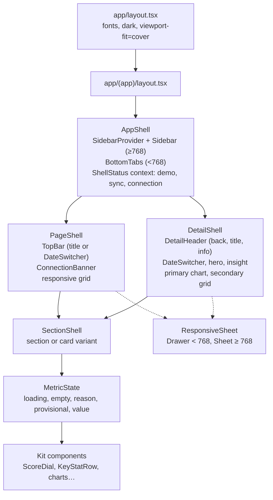
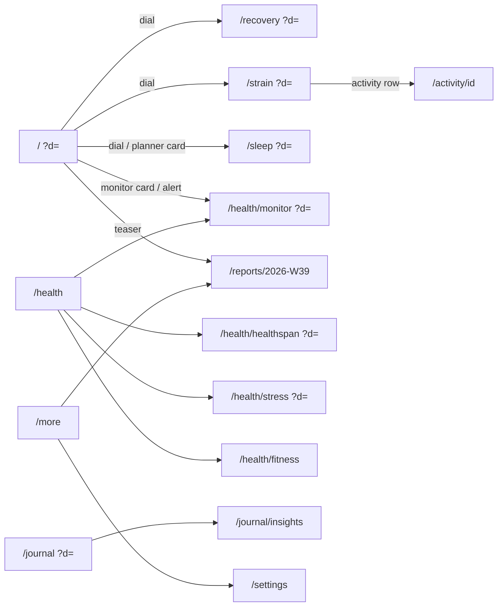

# Pulse design spec

This document is the contract for the interface. U12 builds the shells and the component kit from §4 and §5. U13 builds every screen from §7 and makes every journey in §8 work. Neither unit redesigns: a change goes into this file first.

It also serves as the project's design-system record (what Impeccable calls DESIGN.md). There is no second copy.

**How to read it.** Values in `code` are exact. "WHOOP" means the reference screenshots in `docs/design/reference/`, named in brackets like [recovery-detail]. Where WHOOP has no screen, the section says "derived" and names what it was derived from.

Contents

1. Direction
2. Tokens
3. Typography
4. Shells
5. Components
6. Copy and formatting
7. Screens
8. Journeys
9. Accessibility
10. Do not
11. Deviations from the plan

---

## 1. Direction

**Design read.** A personal health product UI (Impeccable mode: Operate) for one daily user, copying WHOOP's 2025 app: a dark slate ground, flat charcoal cards, white DIN-style numerals, uppercase tracked labels, and colour used only for data meaning. Bevel-only features (Energy Bank, Journal Insights) are drawn in WHOOP's language, not Bevel's light glass style.

**Use scene.** Checked in bed in the morning and again at night, on a phone, often in a dark room; occasionally on a laptop at a desk. Dark is required by the scene and by WHOOP. There is no light theme.

**What decides what.**

| Question | Decided by |
|---|---|
| Visual direction: palette, type character, layout, density, component look, copy voice | WHOOP references. Where the skills' taste rules disagree (uppercase labels, near-black ground, a full data palette), WHOOP wins |
| Craft: spacing rhythm, states, motion, hit areas, contrast, focus, numerals, wrapping, reduced motion | The skills (`design-taste-frontend`, `frontend-design`, `impeccable`, `web-design-guidelines`, `make-interfaces-feel-better`, `better-ui`) |
| Anything WHOOP does not show | Derived from the nearest WHOOP screen, never invented in a new style |

**Taste dials** (from `design-taste-frontend`, set for a dashboard rather than a landing page): `DESIGN_VARIANCE 3`, `MOTION_INTENSITY 3`, `VISUAL_DENSITY 6`. Symmetric, centred-hero detail screens; motion only for state; dense data in plain rows.

**Colour strategy.** Full palette for data (recovery green, yellow, red; strain blue; sleep steel blue; teal "optimal"; orange "attention"; stress light blue) on a restrained neutral ground. Each hue has one meaning everywhere. Chrome (nav, buttons, focus) is white and grey only.

**Principles.**

1. **The number is the hero.** Each detail screen opens on one dial and one number. Everything after it explains that number.
2. **Colour is a data channel.** Never use a data colour for decoration, and never show a data colour without the word or number it encodes.
3. **Three tiers of disclosure** (WHOOP): overview (Home dials), trends (detail screens), raw biometrics (rows, charts, sheets).
4. **Honest states.** A score that cannot be computed says why, in plain words. No fake zeros.
5. **One vocabulary.** The same row, card, chip, dial and sheet on every screen. If two screens draw the same thing differently, one is wrong.

---

## 2. Tokens

All tokens live in `src/app/globals.css` under `:root`, and are mapped in `@theme inline` so Tailwind classes exist for them (`bg-card`, `text-recovery-green`, `fill-strain`…). Components use the classes, never raw hex.

Sampling method: dominant-colour and median probes with PIL on the full-resolution originals (`docs/design/reference/raw/sample.py`). The "Sampled" column gives the raw reading; "Token" gives the value shipped, which differs only where a contrast fix was needed (marked ◆).

### 2.1 Ground and surfaces

| Token (CSS var) | Tailwind | Token value | Sampled from | Use |
|---|---|---|---|---|
| `--background-top` | `bg-background-top` | `#262e33` | `#262E33` top of [home-device-planner-nav], `#232C32` [trend-view-recovery], `#252C34` [health-tab] | Gradient start; sticky top bar fill |
| `--background-mid` | (gradient stop only) | `#1b2024` | `#1B2024` at 267 px [home-device-planner-nav], `#1B2126` [recovery-detail] | Gradient stop at 270 px |
| `--background` | `bg-background` | `#0f1113` | `#0F1113` at 733 px [home-device-planner-nav], `#101215` [trend-view-recovery] | Page ground below 740 px; manifest `background_color` |
| `--card` | `bg-card` | `#2b2f32` | `#2E3135` [home-device-planner-nav] HM card, `#292D30` [activity-detail-zones] tiles, `#292E31` zone rows | Every card. Flat: no shadow, no ring (see §2.6) |
| `--secondary` | `bg-secondary` | `#34393d` | `#323435` "Set alarm" button, `#2E3337` rows inside cards | Rows inside a card (activity rows), secondary buttons, selected toggle |
| `--popover` | `bg-popover` | `#34393d` | `#32373D` to `#40474E` action menu | Popovers, dropdowns, tooltips |
| `--accent` | `bg-accent` | `#34393d` | as secondary | Hover fill for rows and ghost buttons |
| `--muted` | `bg-muted` | `#22282c` | `#1F272B` W/M/6M toggle track [trend-view-recovery], `#1D2328` floating tab bar | Skeletons, toggle-group track, tab bar pill |
| `--inset` | `bg-inset` | `#0c0f11` | `#090C0D` legend inset [recovery-detail], `#111619` insight card fill | Legend strips and insight-card fill: darker than the card they sit in |
| `--border` | `border-border` | `rgb(255 255 255 / 0.1)` | `#393E40` divider on `#24292C` [recovery-detail] (white about 10%) | Row dividers, input outlines, sheet edges |
| `--input` | `border-input` | `rgb(255 255 255 / 0.15)` | derived | Input outlines |
| `--sidebar` | `bg-sidebar` | `#14181b` | derived: one step below `--background-mid` | Sidebar column (≥ 768 px) |
| `--sidebar-accent` | `bg-sidebar-accent` | `#2b2f32` | = card | Active sidebar item |
| `--sidebar-border` | `border-sidebar-border` | `rgb(255 255 255 / 0.08)` | derived | Sidebar edge |

The body ground is `linear-gradient(180deg, var(--background-top) 0, var(--background-mid) 270px, var(--background) 740px) no-repeat, var(--background)`, set once in the base layer. It scrolls with the page (WHOOP's gradient is anchored to the top of the screen). No component sets its own page background.

### 2.2 Text tiers

| Token | Tailwind | Value | Sampled | Contrast on `--card` / on `--background-top` | Use |
|---|---|---|---|---|---|
| `--foreground` | `text-foreground` | `#ffffff` | `#FCFCFC` row labels and body [recovery-detail], [trend-view-recovery] | 13.5 / 13.8 | Numbers, titles, labels, body |
| `--foreground-secondary` | `text-foreground-secondary` | `#babac0` | `#BABAC0` "Recommended bedtime", `#B4B4B4` "vs. prior 30 days", `#C0C0C0` "5/5 Metrics" | 7.0 / 7.2 | Supporting lines under a value, times in activity rows |
| `--muted-foreground` ◆ | `text-muted-foreground` | `#999ea3` | `#8A9090` WHOOP's grey body and "Refreshed daily" | 5.0 / 5.1 (sampled grey was 4.2 on cards) | Captions, 30-day averages, axis ticks, placeholders |
| `--primary-foreground` | `text-primary-foreground` | `#0f1113` | derived | 18.9 on white | Text on white primary buttons |

`#5A5A60` (WHOOP's chart axis grey) is **not** a text token: at 2.0 : 1 it fails. Axis ticks use `--muted-foreground`.

### 2.3 Data colours

| Token | Tailwind | Value | Sampled | Meaning (and only this meaning) |
|---|---|---|---|---|
| `--recovery-green` | `*-recovery-green` | `#19ec06` | `#19EC06` ring [recovery-detail], `#19EB06` dots [trend-view-recovery] | Recovery ≥ 67. Energy ≥ 67 |
| `--recovery-yellow` | `*-recovery-yellow` | `#ffde00` | `#FEDD00` [trend-view-recovery] | Recovery 34-66. Energy 34-66 |
| `--recovery-red` | `*-recovery-red` | `#ff0026` | `#FE0025` [trend-view-recovery] | Recovery ≤ 33. Energy ≤ 33. Fills and rings only |
| `--recovery-red-text` ◆ | `text-recovery-red-text` | `#ff5a6a` | derived (red lifted to 4.5 : 1 on cards) | The word "Red" and red values set as text |
| `--strain` | `*-strain` | `#0093e7` | `#0093E7` ring [strain-detail], `#0092E7` [home-dials] | Strain fill, HR line and area |
| `--strain-text` ◆ | `text-strain-text` | `#1fa0f0` | derived (4.7 : 1 on cards) | Strain values as text below 24 px |
| `--strain-deep` | `bg-strain-deep` | `#0d48be` | `#0D48BE` activity chip [home-device-today] | Activity chip fill, workout spans in charts (25%) |
| `--sleep` | `*-sleep` | `#7ba1bb` | `#7BA1BB` ring [sleep-detail], `#7BA0BB` [home-dials] | Sleep performance fill |
| `--sleep-deep` | `bg-sleep-deep` | `#39597b` | `#39597B` sleep chip [home-device-today] | Sleep and nap chip fill, sleep spans in charts (15%) |
| `--optimal` | `*-optimal` | `#00f19f` | `#00F19F` "optimal" bars [sleep-detail], "helps" bars [journal-insights], `#02FEAD` range chips [health-monitor] | Good: in range, helps, optimal, positive delta, improving |
| `--warning` | `*-warning` | `#ffa722` | `#FFA722` "poor" bars, "hurts" bars, `#FEA622` high stress | Attention: out of range, hurts, poor, negative delta |
| `--stress-low` | `*-stress-low` | `#67aee6` | `#67AEE5` [stress-scale] | Stress < 1.0 |
| `--stress-medium` | `*-stress-medium` | `#00f19f` | `#00F09E` [stress-scale] | Stress 1.0-1.9 |
| `--stress-high` | `*-stress-high` | `#ffa722` | `#FEA622` [stress-scale] | Stress ≥ 2.0 |
| `--coach` | `text-coach` | `#7095fe` | `#7095FE` "Break down my Recovery" link [recovery-detail] | Insight-card links only |
| `--insight-from` → `--insight-to` | `from-insight-from to-insight-to` | `#4b418c` → `#346e8c` | `#4B418C` / `#346E8C` insight hairline [recovery-detail] | The 1 px gradient hairline of `InsightCard` |
| `--banner-from` → `--banner-to` | `from-banner-from to-banner-to` | `#2e2c4f` → `#2b3f50` | `#2E2C4F` / `#2B3F50` "Your Day in Review" banner [home-device-planner-nav] | The report teaser banner |
| `--dial-track` | `fill-dial-track` | `#33383c` | `#33383C` [home-dials] | Unfilled dial track, empty meter ticks |
| `--dial-target` | `fill-dial-target` | `#5a5e61` | `#5A5E61` strain target arc [home-dials] | Strain Target range on the dial track |
| `--destructive` | `*-destructive` | `#ff0026` | = recovery red | Destructive buttons and form errors (text uses `--recovery-red-text`) |

**Energy Bank** has no hue of its own: its value is banded exactly like Recovery (≥ 67 green, 34-66 yellow, ≤ 33 red), as Bevel's battery changes colour by level. This keeps green, yellow and red meaning "readiness" everywhere.

**Health Monitor statuses** follow WHOOP's support article: in range = `--optimal`, out of range = `--warning`, illness signal = `--recovery-red` (with `--recovery-red-text` for words).

**Training load** status: 0.8-1.3 `--optimal`, 1.3-1.5 `--warning`, > 1.5 `--recovery-red`, < 0.8 `--muted-foreground` (detraining is not alarming).

**Hypnogram lanes** (derived, no WHOOP capture): a sleep-blue ramp, lighter for lighter sleep. `--stage-awake #e6edf2`, `--stage-rem #a6c3d7`, `--stage-light #7ba1bb`, `--stage-deep #48708c`.

**Chart variables** (shadcn names, used by `ChartConfig` keys):

| Var | Value | Default series |
|---|---|---|
| `--chart-1` | `#0093e7` | strain, CTL (fitness), HR |
| `--chart-2` | `#00f19f` | optimal, TSB (form) |
| `--chart-3` | `#7ba1bb` | sleep, sleep debt |
| `--chart-4` | `#ffa722` | warning, ATL (fatigue) |
| `--chart-5` | `#67aee6` | stress low, secondary line |
| `--chart-grid` | `rgb(255 255 255 / 0.08)` | `CartesianGrid` stroke (sampled `#31373C` on `#1A2126`) |
| `--chart-band` | `rgb(255 255 255 / 0.05)` | Baseline band, HR zone bands |
| `--chart-cursor` | `rgb(255 255 255 / 0.4)` | Tooltip cursor line, "now" line |

### 2.4 Radii

Explicit scale in `@theme inline` (shadcn's multiplier scale is replaced):

| Token | Value | Use |
|---|---|---|
| `rounded-sm` | 4 px | Meter segments, legend swatches |
| `rounded-md` | 6 px | Activity chips, badges inside rows |
| `rounded-lg` | 8 px | Rows inside cards, buttons, inputs, toggle items |
| `rounded-xl` | 12 px | Cards, alerts, banners, insight cards (measured 12 pt on [home-device-planner-nav]) |
| `rounded-2xl` | 16 px | Sheets (top corners), popovers |
| `rounded-[22px]` | 22 px | The floating tab bar pill only |
| `rounded-full` | pill | Date switcher pill, tags, dials, dots |

Concentric rule: a row inset 4 px inside a 12 px card is 8 px (`rounded-lg`); a 1 px gradient hairline around an `rounded-xl` card has an inner `rounded-[11px]`. Rows inset 16 px are separate surfaces and keep 8 px.

### 2.5 Spacing and layout metrics

Tailwind's 4 px scale. Measured on the device captures at 3×.

| Metric | Phone < 768 | Tablet 768-1279 | Laptop ≥ 1280 |
|---|---|---|---|
| Page gutter | 16 px (`px-4`, measured 16 pt) | 24 px (`px-6`) | 32 px (`px-8`) |
| Content max width | full | 720 px centred (WHOOP iPad column) | 1200 px |
| Card padding | 16 px (`p-4`) | 16 px | 20 px (`xl:p-5`) |
| Gap between cards in a group | 12 px (`gap-3`, measured 13 pt) | 12 px | 16 px (`xl:gap-4`) |
| Section gap (title block to title block) | 32 px (`space-y-8`) | 32 px | 40 px |
| Section title to its content | 12 px (`mb-3`) | 12 px | 16 px |
| List row height | 52 px (measured 52.5 pt) | 52 px | 52 px |
| Activity row height | 56 px | 56 px | 56 px |
| Top bar | 52 px + `env(safe-area-inset-top)` | 56 px | 56 px |
| Bottom tab bar | 64 px pill, inset 12 px, above `max(env(safe-area-inset-bottom), 12px)` | none | none |
| Minimum hit area | 44 × 44 px | 44 × 44 | 40 × 40 (pointer) but keep 44 where cheap |

### 2.6 Elevation

WHOOP is flat. Depth comes from surface steps (`background` → `card` → `secondary`), not shadows.

- **Cards:** no shadow and no ring. shadcn `Card` ships `ring-1 ring-foreground/10`; every Pulse card passes `ring-0`. Measured: WHOOP cards have no edge line (edge pixels go straight from ground to fill).
- **Exceptions with a hairline:** `InsightCard` (1 px gradient), selected rows (`ring-1 ring-foreground/60`), Health Monitor vital tiles when out of range (`ring-1 ring-warning/50`).
- **Overlays** (popover, dropdown, sheet, drawer, dialog): `shadow-[0_12px_32px_rgb(0_0_0/0.5)]` plus `ring-1 ring-border`. In dark mode the ring does the visible work.
- **Glow:** one only, the Healthspan orb (§7.8): `bg-radial from-optimal/35 via-optimal/10 to-transparent`. No other glows, no neon, no coloured shadows.

### 2.7 Motion

| Token | Value | Use |
|---|---|---|
| `ease-standard` | `cubic-bezier(0.2, 0, 0, 1)` (in `@theme`) | All CSS transitions |
| Fast | 150 ms | Hover, press, colour, focus ring |
| Base | 200 ms | Sheet and sidebar width (shadcn default), toggle thumb |
| Dial fill | 700 ms, Recharts `animationEasing="ease-out"` | `ScoreDial` sweep on first mount and on day change |
| Chart draw | 500 ms, `ease-out` | Recharts series on first mount |
| Press | `active:scale-[0.96]`, 150 ms | Buttons, dials, chips, tab items. Not rows (rows use `active:bg-accent`) |

Rules:

- Transitions name their properties (`transition-[background-color,color]`, `transition-transform`). Never `transition-all`.
- No page-load choreography, no staggered section entrances, no counting-up numbers. The dial sweep is the one authored moment.
- `prefers-reduced-motion: reduce`: every Recharts series gets `isAnimationActive={false}` (read with a `useReducedMotion` hook in the chart wrapper); the base layer in `globals.css` collapses CSS animation and transition durations; skeleton pulse stops.
- Sheets use vaul and Radix defaults; do not restyle their motion.

### 2.8 Icons

- lucide-react only (already a dependency). One stroke: `strokeWidth={1.75}` everywhere (beside 600-700 weight labels). Sizes: 16 px inline with captions, 20 px in rows and buttons, 24 px in the tab bar and sidebar.
- Icons inherit `currentColor`. Outline at rest; the active tab uses the same glyph at full white (lucide has no filled variants, so active = white + label white; inactive = `text-muted-foreground`).
- Decorative icons get `aria-hidden`. Icon-only buttons get `aria-label`.
- Map (one glyph per meaning):

| Meaning | lucide |
|---|---|
| Home, Health, Journal, More | `House`, `HeartPulse`, `NotebookPen`, `Menu` |
| Recovery, Strain, Sleep | `Gauge`, `Flame`, `Moon` |
| HRV, resting HR, respiratory rate, SpO2, skin temperature | `Activity`, `Heart`, `Wind`, `Droplet`, `Thermometer` |
| Steps, calories, VO2 max, strength | `Footprints`, `Zap`, `CircleGauge`, `Dumbbell` |
| Run, ride, walk, generic workout | `PersonStanding`, `Bike`, `Footprints`, `Timer` |
| Energy Bank, Stress, Healthspan, Fitness | `BatteryMedium`, `Brain`, `Infinity`, `TrendingUp` |
| Info, back, next, expand, close | `Info`, `ChevronLeft`, `ChevronRight`, `Maximize2`, `X` |
| Good, attention, alert | `Check`, `TriangleAlert`, `CircleAlert` |
| Pace slow / fast | `Turtle`, `Rabbit` |
| Journal behaviours | alcohol `Wine`, late caffeine `Coffee`, late meal `Utensils`, screen in bed `Smartphone`, meditation `Flower2`, stretching `StretchHorizontal`, sauna `Bath`, travel `Plane`, illness `Thermometer`, custom `Tag` |
| Sync, Google, demo | `RefreshCw`, `Plug` / `Unplug`, `FlaskConical` |
| Insights | `Sparkles` |

### 2.9 Pattern

`--pattern-hatch` is WHOOP's diagonal hatched track (zone rows, journal impact rows [activity-detail-zones], [journal-insights]). Use it as `bg-(image:--pattern-hatch)` on the track element. It is the only background image besides the page gradient, the banner gradient and the Healthspan orb.

---

## 3. Typography

### 3.1 Faces

WHOOP's own webfonts, read from `document.fonts` on whoop.com: **proxima-nova** (text) and **din-2014** / **din-2014-narrow** (numerals). Neither is free. The replacements were chosen by rendering both against candidates in the same page with WHOOP's real fonts loaded ([type-match]) and measuring at 100 px:

| | Digit advance | Cap height | Advance ÷ cap | Tabular |
|---|---|---|---|---|
| WHOOP Recovery hero "85" (measured on [recovery-detail]) | 100 px | 129 px | 0.775 | yes |
| din-2014 Bold | 54.0 | 69 | 0.783 | default |
| **Barlow Bold with `tnum`** | **54.4** | **70** | **0.777** | via `tabular-nums` |
| Barlow Semi Condensed Bold, `tnum` | 52.1 | 70 | 0.744 | via `tabular-nums` |
| din-2014-narrow Bold | 47.8 | 69 | 0.693 | default |

| | Caps width ÷ cap ("HEART RATE VARIABILITY", 700) | Body width ÷ cap (400) | x-height ÷ cap | Storey of "a" |
|---|---|---|---|---|
| proxima-nova | 18.05 | 24.2 | 0.724 | double |
| **Figtree** | **17.4** | **23.5** | **0.714** | double |
| Mulish | 18.1 | 24.2 | 0.716 | single |
| Nunito Sans | 17.96 | 23.7 | 0.690 | double |
| Montserrat | 19.3 | 26.1 | 0.751 | double |

**Choice: Figtree for text (`--font-sans`), Barlow for numerals (`--font-numeric`).** Both are free on Google Fonts and self-hosted by `next/font`.

- Barlow is a DIN-derived grotesk. With `tabular-nums` its digit advance and cap height match din-2014 to within 1%, and it matches the measured WHOOP hero numeral. WHOOP's numerals are DIN 2014 at **regular** width, not condensed (0.775 measured against 0.693 for the narrow cut), so the regular Barlow wins over Barlow Semi Condensed. Weights loaded: 500, 600, 700.
- Figtree matches Proxima Nova's proportions and its double-storey "a". Mulish matches width but has a single-storey "a", which changes the texture of every paragraph. Figtree is variable (300-900).
- `--font-mono` is routed to the numeric face in `@theme`, so shadcn's chart tooltip (`font-mono tabular-nums`) renders Barlow without editing the component.

### 3.2 Roles

Rem values assume 16 px root. "Caps" means the source string is sentence case and the style applies `uppercase` (screen readers read it normally).

| Role | Face | Size / line | Weight | Tracking | Case | Class string |
|---|---|---|---|---|---|---|
| Dial value, hero (detail) | Barlow | 64 / 64 (≥ 768: 72 / 72) | 700 | -0.01em | n/a | `font-numeric text-[64px] leading-none font-bold tracking-[-0.01em] tabular-nums md:text-[72px]` |
| Dial unit "%" | Barlow | 0.55em of the value | 700 | 0 | n/a | `text-[0.55em]` inside the value span |
| Dial value, Home (Sleep, Strain) | Barlow | 26 / 26 (≥ 768: 30) | 700 | -0.01em | n/a | `font-numeric text-[26px] leading-none font-bold tabular-nums md:text-[30px]` |
| Dial value, Home Recovery | Barlow | 30 / 30 (≥ 768: 36) | 700 | -0.01em | n/a | `font-numeric text-[30px] leading-none font-bold tabular-nums md:text-[36px]` |
| Dial value, small | Barlow | 16 / 16 | 700 | 0 | n/a | `font-numeric text-base leading-none font-bold tabular-nums` |
| Dial label | Figtree | 12 / 16 | 700 | 0.08em | caps | `text-xs leading-4 font-bold tracking-[0.08em] uppercase` |
| Wordmark ("PULSE" above the Home dials) | Figtree | 13 / 16 | 600 | 0.35em | caps | `text-[13px] leading-4 font-semibold tracking-[0.35em] uppercase text-foreground-secondary` |
| Top-bar title | Figtree | 13 / 16 | 700 | 0.1em | caps | `text-[13px] leading-4 font-bold tracking-[0.1em] uppercase` |
| Section title ("My Day") | Figtree | 22 / 28 (≥ 1280: 24 / 30) | 600 | -0.01em | sentence | `text-[22px] leading-7 font-semibold tracking-[-0.01em] text-balance xl:text-2xl` |
| Card title | Figtree | 13 / 16 | 700 | 0.08em | caps | `text-[13px] leading-4 font-bold tracking-[0.08em] uppercase` |
| Stat label (row label) | Figtree | 12 / 16 | 700 | 0.08em | caps | `text-xs leading-4 font-bold tracking-[0.08em] uppercase` |
| Stat value, row | Barlow | 20 / 24 | 700 | 0 | n/a | `font-numeric text-xl leading-6 font-bold tabular-nums` |
| Stat value, tile / large | Barlow | 36 / 40 | 700 | -0.01em | n/a | `font-numeric text-4xl leading-10 font-bold tracking-[-0.01em] tabular-nums` |
| Stat unit | Figtree | 13 / 16 | 600 | 0 | lower | `text-[13px] leading-4 font-semibold text-foreground-secondary` |
| Stat sub-value (30-day average) | Barlow | 13 / 16 | 500 | 0 | n/a | `font-numeric text-[13px] leading-4 font-medium tabular-nums text-muted-foreground` |
| Body | Figtree | 15 / 22 | 400 | 0 | sentence | `text-[15px] leading-[22px] text-pretty` (max 65ch) |
| Body strong (insight title) | Figtree | 16 / 22 | 600 | 0 | sentence | `text-base leading-[22px] font-semibold` |
| Caption | Figtree | 12 / 16 | 500 | 0 | sentence | `text-xs leading-4 font-medium text-muted-foreground` |
| Link action ("Break down my Recovery") | Figtree | 12 / 16 | 700 | 0.08em | caps | `text-xs leading-4 font-bold tracking-[0.08em] uppercase text-coach` |
| Button | Figtree | 13 / 16 | 700 | 0.06em | caps | `text-[13px] leading-4 font-bold tracking-[0.06em] uppercase` |
| Chip value (activity chip) | Barlow | 20 / 24 | 700 | 0 | n/a | `font-numeric text-xl leading-6 font-bold tabular-nums` |
| Tab label (bottom bar) | Figtree | 11 / 14 | 600 | 0.01em | sentence | `text-[11px] leading-[14px] font-semibold` |
| Sidebar item | Figtree | 14 / 20 | 600 | 0 | sentence | `text-sm font-semibold` |
| Chart text (ticks, tooltip, labels) | Barlow | 12 / 16 | 500 | 0 | n/a | set on `ChartContainer`: `font-numeric text-xs font-medium` |
| Sheet title | Figtree | 18 / 24 | 600 | -0.01em | sentence | `text-lg leading-6 font-semibold` |

### 3.3 Numeral rules

- Every number that can change uses `tabular-nums` (Barlow figures are proportional by default).
- Units sit after the value with a thin gap (`ml-0.5` for symbols, `ml-1` for words), in the unit role: `72<span>%</span>`, `124<span> ms</span>`.
- Negative numbers use the real minus sign `−` (U+2212). Positive deltas carry `+`.
- No data: `--` in the same role as the value would have been, `text-muted-foreground`.
- Large text: never below `tracking-[-0.04em]`; `text-balance` on titles; `text-pretty` on body; `truncate` with `min-w-0` on every flex child holding a name.

---

## 4. Shells

Shells own layout and every breakpoint. Feature components never contain `md:`, `lg:` or `xl:` classes; they fill the width their shell gives them. The only exceptions are the type roles in §3.2 that step up at 768 px, which are part of the role, not layout.



### 4.1 Breakpoints

| Name | Range | Tailwind | Navigation | Content column |
|---|---|---|---|---|
| Phone | < 768 px | base | Floating bottom tab bar | Full width, 16 px gutters |
| Tablet | 768-1279 px | `md:` | shadcn `Sidebar` as icon rail (48 px) | 720 px, centred in the remaining width |
| Laptop | ≥ 1280 px | `xl:` | shadcn `Sidebar` expanded (256 px) | Up to 1200 px, 32 px gutters, multi-column grids |

`lg:` (1024) is used only by DetailShell's secondary grid (§4.5).

### 4.2 AppShell (`src/components/shells/AppShell.tsx`)

Server component wrapper rendered by `app/(app)/layout.tsx`, with client islands for the sidebar and tab bar.

- Wraps children in `SidebarProvider`. The open state is driven by the viewport, not by the user: `open = matchMedia("(min-width: 1280px)")`. No `SidebarTrigger`, no `⌘B` shortcut, no cookie. `Sidebar` uses `collapsible="icon"`.
- Provides a `ShellStatus` React context: `{ mode: "demo" | "google", sync: { state: "ok" | "syncing" | "stale" | "error", lastSuccessAt, }, connection: "connected" | "not_connected" | "importing" | "auth_revoked" | "stale", importProgress?: { done, total } }`. The top bar, sync dot, demo chip and `ConnectionBanner` read it. This is how the "top bar with the date switcher, sync-status dot and Demo data chip" stays global while each page shell decides the top bar's left and centre content (see §11, D2).
- Main element: `<main id="main" className="min-h-svh min-w-0 flex-1">`. A skip link "Skip to content" is the first focusable element (`sr-only focus:not-sr-only`, top-left, `bg-primary text-primary-foreground rounded-lg px-3 py-2`).

**Bottom tab bar (< 768 px).** WHOOP's 2025 floating pill [home-device-planner-nav].

```
         ╭──────────────────────────────────────────╮
         │  [House]    [HeartPulse]  [NotebookPen]   [Menu]  │  64 px
         │   Home        Health        Journal        More   │
         ╰──────────────────────────────────────────╯
 12 px inset each side; bottom = max(env(safe-area-inset-bottom), 12px)
```

- `nav aria-label="Primary"`, `fixed inset-x-3 bottom-[max(env(safe-area-inset-bottom),12px)] z-30 h-16 rounded-[22px] bg-muted/95 ring-1 ring-border md:hidden`.
- Four equal `Link`s, each a 44+ px column: icon 24 px above label (tab label role). Active (route starts with the tab's root; detail routes map to their parent: `/recovery`, `/strain`, `/sleep`, `/activity/*`, `/reports/*` → Home; `/health/*` → Health; `/journal/*` → Journal; `/settings` → More): `text-foreground`, `aria-current="page"`. Inactive: `text-muted-foreground`. Press: `active:scale-[0.96]`.
- Main content gets `pb-[calc(64px+max(env(safe-area-inset-bottom),12px)+24px)] md:pb-10` so the last card clears the bar.

**Sidebar (≥ 768 px).**

- `Sidebar collapsible="icon"` with `bg-sidebar`, right edge `border-sidebar-border`.
- Header: icon rail shows a 32 px "P" monogram (`font-numeric text-xl font-bold`); expanded shows the wordmark "PULSE" (wordmark role, white).
- `SidebarMenu` items, same four destinations plus (expanded only, after a `SidebarSeparator`) "Reports" and "Settings": `SidebarMenuButton size="lg"` (48 px), icon 24 px, label sidebar-item role. Active: `isActive` → `bg-sidebar-accent text-sidebar-accent-foreground`. Collapsed items show a `Tooltip` with the label (shadcn does this via `tooltip` prop).
- Footer: Demo chip (when `mode = demo`) and the sync status (dot + "Synced 12 min ago" when expanded; dot only on the rail).

**Z-index scale.** Top bar `z-20`, bottom tab bar `z-30`, sidebar `z-10` (shadcn), overlays `z-50` (shadcn), toasts: Sonner default. Nothing else sets `z-*`.

### 4.3 TopBar (part of the shell kit, rendered by PageShell)

```
 ┌──────────────────────────────────────────────┐
 │ [DEMO DATA]       ‹   TODAY   ›          ●   │  52 px (+ safe-area-top)
 └──────────────────────────────────────────────┘
   left 44+ px       centre: title or DateSwitcher   right: sync dot (44 px button)
```

- `header sticky top-0 z-20 bg-background-top pt-[env(safe-area-inset-top)]`, inner `h-13 md:h-14 grid grid-cols-[1fr_auto_1fr] items-center px-4 md:px-6 xl:px-8`. Solid fill (no blur): at scroll 0 it equals the gradient's first stop, so the seam is invisible.
- **Left:** `mode = demo` → Demo chip: `Badge variant="outline"` `h-6 rounded-full border-border px-2.5 text-[11px] font-bold tracking-[0.08em] uppercase text-foreground-secondary` with `FlaskConical` 12 px, text "Demo data". Otherwise empty.
- **Centre:** either the page title (top-bar title role) or the `DateSwitcher`.
- **Right:** `SyncStatus`: a 44 px ghost icon button containing an 8 px dot. Dot colour: ok `bg-optimal`, syncing `bg-coach animate-pulse`, stale (> 2 h) `bg-warning`, error or auth revoked `bg-recovery-red`. `aria-label`: "Synced 12 minutes ago", "Syncing", "Last sync 3 hours ago", "Sync failed". Opens a `Popover` (w-64): title "Sync", one line per state ("Last sync 09:42", "Demo data refreshes every 15 minutes" in demo mode), and a link "Sync settings" → `/settings#sync`. On ≥ 1280 the sidebar footer also shows the status, and the top bar keeps the dot.

**DateSwitcher.** WHOOP's date pill [home-overview-marketing].

```
   ‹   TODAY   ›        ‹  MON, SEP 28  ›        ‹  SEP 22 - SEP 28  ›   (week mode)
```

- Three parts in one pill `inline-flex h-9 items-center rounded-full bg-secondary`: prev button, label button, next button. Prev/next are 44 × 44 hit areas (visual 36 px) with `ChevronLeft`/`ChevronRight` 18 px; `aria-label` "Previous day" / "Next day" (or week).
- Label: top-bar title role, `min-w-24 px-3 text-center tabular-nums`. "Today", "Yesterday", else `EEE, MMM d` ("Mon, Sep 28"); week mode `MMM d - MMM d`.
- Next is `disabled` (opacity 40%) on today (or the current week). Prev is disabled at the first stored day.
- Tapping the label opens the date-jump `ResponsiveSheet` (§4.7) with shadcn `Calendar` (`mode="single"`, `disabled={{ after: today, before: firstDay }}`), title "Go to date", and a "Today" button.
- Changing the day calls `router.replace` with `?d=` (omitted for today) so the back gesture leaves the screen instead of stepping through days (§8).
- Keyboard (any pointer device): on day-aware screens, `ArrowLeft` / `ArrowRight` go to the previous / next day when focus is not in an input, textarea, `[role=slider]` or open sheet. One listener lives in the DateSwitcher.

### 4.4 PageShell (`src/components/shells/PageShell.tsx`)

For tab roots: Home `/`, Health `/health`, Journal `/journal`, More `/more`.

Props: `{ title?: string; dateSwitcher?: { mode: "day" | "week" }; actions?: ReactNode; layout?: "stack" | "home" | "grid-2"; children }`.

- Renders `TopBar` (centre = `dateSwitcher` if given, else `title`), then `ConnectionBanner` (from context), then the content container: `mx-auto w-full px-4 pt-4 md:max-w-[720px] md:px-6 xl:max-w-[1200px] xl:px-8 xl:pt-6`.
- `actions` render right-aligned on the first row of content (e.g. Journal's "Insights" button). They never go in the top bar (the top bar's right slot is the sync dot everywhere).
- `layout`:
  - `stack`: `flex flex-col gap-8 xl:gap-10`.
  - `grid-2`: `grid grid-cols-1 gap-3 md:grid-cols-2 xl:gap-4` (Health hub cards).
  - `home`: phone and tablet = `stack`; laptop = `xl:grid xl:grid-cols-[minmax(0,5fr)_minmax(0,7fr)] xl:gap-x-6 xl:gap-y-10` with named children `top` (spans both columns), `left`, `right`, `bottom` (spans both).

### 4.5 DetailShell (`src/components/shells/DetailShell.tsx`)

For `/recovery`, `/strain`, `/sleep`, `/activity/[id]`, `/health/healthspan`, `/health/monitor`, `/health/stress`, `/health/fitness`, `/journal/insights`, `/reports/[period]`, `/settings`.

Props: `{ title: string; subtitle?: string; info?: { title: string; body: ReactNode }; dateSwitcher?: { mode: "day" | "week" }; hero?: ReactNode; summary?: ReactNode; insight?: ReactNode; primary?: ReactNode; secondary?: ReactNode[]; footer?: ReactNode }`.

**DetailHeader** (replaces TopBar on detail routes, same sticky frame and z-index):

```
 ┌──────────────────────────────────────────────┐
 │ [‹]             RECOVERY                (i)  │   52 px (+ safe-area-top)
 │              Next update in 6 days           │   optional subtitle (caption)
 └──────────────────────────────────────────────┘
```

- Left: back button, 44 px, `ChevronLeft` 24 px, `aria-label="Back"`. Behaviour: `router.back()` when `window.history.length > 1` and the referrer is same-origin; otherwise `router.push(parentHref)` where `parentHref` is `/` (Home details, keeping `?d=`), `/health` (Health details), `/journal`, `/more`.
- Centre: title (top-bar title role) and optional subtitle (caption role).
- Right: info button (44 px, `Info` 22 px, `aria-label="About {title}"`) when `info` is set; it opens `ResponsiveSheet` with `info.title` and `info.body`. Otherwise the sync dot.
- The parent tab stays active in the tab bar and sidebar.

**Body slots** in order: DateSwitcher (centred, `mt-3`), hero, summary, insight, primary, secondary, footer.

| Slot | Phone | Tablet | Laptop |
|---|---|---|---|
| hero (dial) + summary (rows card) | stacked, dial centred, summary card full width, `mt-6` between | stacked, 720 column | `xl:grid xl:grid-cols-[360px_minmax(0,1fr)] xl:items-center xl:gap-8`: dial left, summary right |
| insight | full width | full width | full width |
| primary (chart card) | full width | full width | full width |
| secondary | one column, `gap-3` | one column | `lg:grid-cols-2 xl:gap-4`; an item can span with `className="lg:col-span-2"` passed by the page |
| footer | full width | full width | full width |

Container widths are PageShell's. Vertical rhythm: 24 px between hero and summary, 32 px between the other slots (`space-y-8`).

### 4.6 SectionShell (`src/components/shells/SectionShell.tsx`)

Props: `{ variant: "section" | "card"; title: string; info?: { title; body }; action?: { label: string; href: string } | ReactNode; aside?: ReactNode; children; id?: string }`.

- `section`: `<section aria-labelledby>`; header row `flex items-end justify-between mb-3 xl:mb-4`; `<h2>` in the section-title role ("My Day", "Key statistics"); right side: `aside` (caption role, e.g. "vs. 30-day average") or the action.
- `card`: shadcn `Card` with `ring-0 gap-0 py-0`, inner `p-4 xl:p-5`. Header row `flex min-h-6 items-center justify-between gap-2 mb-3`; `<h2>` (or `<h3>` inside a section) in the card-title role; then optional info button (32 px visual inside a 44 px hit area via `after:absolute after:-inset-1.5`, `Info` 16 px, `text-muted-foreground`), then the action on the right.
- Action as a link: `Link` in the link-action role but white (`text-foreground-secondary hover:text-foreground`), label + `ChevronRight` 14 px, e.g. "View all". When the whole card navigates (Health hub, Home monitor cards), the card itself is the link and the header shows only `ChevronRight` 18 px.

### 4.7 ResponsiveSheet (`src/components/shells/ResponsiveSheet.tsx`)

Props: `{ open; onOpenChange; title: string; description?: string; children; footer?: ReactNode; size?: "default" | "tall" }`. Uses `useIsMobile()` (768 px, `src/hooks/use-mobile.ts`), the one breakpoint read allowed in JS.

| | Phone (< 768) | Tablet / laptop (≥ 768) |
|---|---|---|
| Primitive | shadcn `Drawer` (vaul), bottom | shadcn `Sheet` `side="right"` |
| Size | `max-h-[90svh]`; `tall` = `h-[90svh]` | `w-full sm:max-w-[420px] xl:max-w-[440px]` |
| Corners | `rounded-t-2xl` | none on the screen edge |
| Header | handle (vaul), `DrawerTitle` (sheet-title role), `DrawerDescription` (caption) | `SheetTitle`, `SheetDescription`, close `X` 44 px |
| Body | `overflow-y-auto overscroll-contain px-4 pb-4` | `overflow-y-auto overscroll-contain px-6 pb-6` |
| Footer | sticky, `border-t border-border px-4 pt-3 pb-[max(env(safe-area-inset-bottom),16px)]`, full-width buttons | sticky, `px-6 py-4`, buttons right-aligned |

Uses: metric info sheets, the date jump, the journal check-in, Health Monitor vital detail, Healthspan contributor detail. Focus moves into the sheet on open and returns to the trigger on close (Radix and vaul handle this; do not override).

### 4.8 MetricState (`src/components/shells/MetricState.tsx`)

The only place that branches on data state. Every metric on every screen renders through it.

```ts
type ReasonCode =
  | "calibrating" | "no_hrv_last_night" | "awaiting_sleep_sync"
  | "insufficient_hr_data" | "band_not_worn" | "no_data";
type Metric<T> = {
  value: T | null;
  reason: ReasonCode | null;
  provisional: boolean;
  tags?: ("stale_baseline" | "updated")[];
  nightsLeft?: number; // for calibrating
};

<MetricState
  metric={vm.recovery}            // undefined while streaming
  skeleton={<ScoreDial.Skeleton size="lg" />}
  reasonSize="lg"                 // sm | md | lg, passed to ReasonPlaceholder
  empty={<EmptyState … />}        // optional: when the metric is null (feature has no history)
  renderReason={(r) => <ScoreDial variant="recovery" size="lg" reason={r} />} // optional
>
  {(value, meta) => <ScoreDial variant="recovery" size="lg" value={value} tags={meta.tags} />}
</MetricState>
```

| State | Condition | Renders |
|---|---|---|
| loading | `metric === undefined` | `skeleton` (each kit component exports `.Skeleton` in its final shape). Route-level `loading.tsx` composes the same skeletons |
| empty | `metric === null`, or a list with zero items | `empty`, or the component's default empty copy (§5 tables) |
| reason | `value === null && reason !== null` | `renderReason(reason)` if given, else `ReasonPlaceholder` at `reasonSize` |
| provisional | `value !== null && provisional` | `children(value, { provisional: true, tags })`; the component shows the "Provisional" tag |
| value | otherwise | `children(value, { provisional: false, tags })`; tags "Baseline stale" / "Updated" render if present |

Unknown reason codes fall back to `no_data`. `NaN` never reaches the UI (U10 guarantees it; MetricState treats a non-finite number as `no_data` defensively).

**EmptyState** (shared by MetricState and list components): `flex flex-col items-center gap-2 py-8 text-center`; icon 24 px `text-muted-foreground`; one line body role, `text-foreground-secondary`, max 36ch; optional `Button size="sm" variant="secondary"` action. Copy is specified per use in §5 and §7.

---

## 5. Components

Files: `src/components/metrics/*` (dials, rows, lists, cards) and `src/components/charts/*` (everything drawn with Recharts). Each component:

- takes view-model props from `server/queries` (never imports `core`);
- renders inside `MetricState` when it shows a nullable metric;
- exports `.Skeleton` in its final shape;
- has no breakpoint classes (§4).

### 5.0 Shared conventions

**shadcn primitives used** (all already in `src/components/ui`): `Sidebar`, `Card`, `Button`, `Badge`, `ToggleGroup`, `Tabs` (not used; `ToggleGroup` covers segmented controls), `Drawer`, `Sheet`, `Dialog`, `Popover`, `Tooltip`, `Calendar`, `ScrollArea`, `Skeleton`, `Progress`, `Alert`, `Switch`, `Input`, `Label`, `Separator`, `Sonner`, `Chart` (`ChartContainer`, `ChartTooltip`, `ChartTooltipContent`, `ChartLegend`, `ChartLegendContent`).

**One edit to the generated `button.tsx` in U12** (theme-level, not a component style): add two sizes and use them for every touch action.

| Size | Classes | Use |
|---|---|---|
| `touch` | `h-11 gap-2 rounded-lg px-4 text-[13px] font-bold tracking-[0.06em] uppercase [&_svg:not([class*='size-'])]:size-5` | Every text button in content and sheets |
| `icon-touch` | `size-11 rounded-full [&_svg:not([class*='size-'])]:size-5` | Icon buttons (back, info, close, sync) |

Variants: `default` (white fill, `#0f1113` text: the WHOOP "+" and "Start activity" style) for the one primary action per view; `secondary` for the rest; `ghost` for icon buttons; `outline` with `text-recovery-red-text` for "Disconnect"; never `destructive` fill for routine actions. Press: `active:scale-[0.96] transition-transform duration-150 ease-standard` (shadcn's `active:translate-y-px` stays; both are fine together).

**Tags (status badges).** `Badge variant="outline"` with `h-5 rounded-full border-border px-2 text-[11px] font-bold tracking-[0.06em] uppercase text-foreground-secondary`. Texts: "Provisional", "Baseline stale", "Updated", "So far", "Partial week", "Partial month", "Estimate". Tags never carry colour; colour is for data.

**Status chips** (value plus tone, e.g. "✓ within 16.1 - 16.9"): `inline-flex h-6 items-center gap-1 rounded-md px-2 text-xs font-bold`; tone classes: optimal `bg-optimal/15 text-optimal`, warning `bg-warning/15 text-warning`, alert `bg-recovery-red/15 text-recovery-red-text`, neutral `bg-secondary text-foreground-secondary`. Icon 12 px (`Check`, `TriangleAlert`, `CircleAlert`, or a filled `Triangle`).

**Delta arrows** (KeyStatRow, TrendChart header, reports). A filled lucide `Triangle` at 8 px (`fill-current`, `rotate-180` for down). Tone: good `text-optimal`, bad `text-warning`, neutral = a 6 px `rounded-full bg-muted-foreground` dot instead of a triangle. Direction and tone come from `src/lib/bands.ts` (`deltaTone(metric, value, average, sd)`): inside ±1 σ is neutral; outside, the metric's good direction decides good or bad. Good directions: HRV up, resting HR down, respiratory rate neutral (always neutral tone, arrow still shows direction), sleep performance up, hours up, consistency up, efficiency up, calories neutral, steps up, SpO2 up, skin temperature toward 0, strain neutral, VO2 max up, stress down, energy up.

**Charts (every Recharts chart).**

- Wrap in `<figure>`; first child `<figcaption className="sr-only">` with a one-line summary written by the component from its data, e.g. "Recovery over the last week: average 68 percent, range 41 to 88, one day missing."
- `ChartContainer config={…} className="aspect-auto w-full font-numeric text-xs font-medium h-[var]"`. Heights are fixed per component (below), never percentage.
- Root chart gets `accessibilityLayer` (arrow keys move the tooltip).
- `CartesianGrid vertical={false} stroke="var(--color-chart-grid)"`. Axes: `tickLine={false} axisLine={false} tickMargin={8}`; tick text is `--muted-foreground` (ChartContainer's default selector already does this).
- Tooltip: `ChartTooltip cursor={{ stroke: "var(--color-chart-cursor)", strokeWidth: 1 }}` (bars: `cursor={{ fill: "rgb(255 255 255 / 0.05)" }}`) with `ChartTooltipContent indicator="line"`, a `labelFormatter` giving the date or time, and value formatters from `src/lib/format.ts`.
- `isAnimationActive={!reducedMotion}`, `animationDuration={500}`, `animationEasing="ease-out"` on every series.
- Missing data is `null` in the series; lines use `connectNulls={false}`; bars simply do not render. Never interpolate a gap.
- Colour by band on a line (stress, energy): `src/lib/charts.ts` exports `splitByBand(points, thresholds)` which returns one series per band, each point also copied into the next point's band so segments join. Render one `Line` per band with that band's colour. This replaces SVG gradient tricks.

### 5.1 ScoreDial (`metrics/ScoreDial.tsx`)

Purpose: the WHOOP ring. Recovery %, Strain 0-21 with target, Sleep %, a small stat dial, and the Stress gauge.

Anatomy (lg):

```
            ┌───────────────┐
         ╭──┘   P U L S E   └──╮      wordmark inside (lg only, caption role, tracking 0.35em)
        │                       │
        │         72%           │     value (dial-hero role), unit 0.55em
        │       RECOVERY        │     label (dial-label role)
        │        GREEN          │     band word (dial-label role, band colour), lg only
         ╰──┐  [PROVISIONAL]  ┌─╯     tag (if any)
            └───────────────┘
   ring: track = --dial-track, fill clockwise from 12 o'clock, flat ends
```

Sizes:

| Size | Diameter | Ring | Value role | Label | Where |
|---|---|---|---|---|---|
| `sm` | 56 | 5 | small (16) | below, caption | Forecast, reports, Health hub |
| `md` | 96 (≥ 768: 120) | 6 (7) | Home | below, dial-label + `ChevronRight` 12 | Home Sleep and Strain |
| `md-hero` | 116 (≥ 768: 144) | 7 (8) | Home Recovery | below | Home Recovery |
| `lg` | 240 (≥ 768: 280) | 11 (13) | hero | inside | Detail heroes |

The 768 px step is part of the size, set with `md:` inside ScoreDial's size map (the one place a kit component reads a breakpoint, because the dial's geometry is its type role). Diameters are fixed pixel boxes so centre text never clips.

Variants and colour:

| Variant | Domain | Fill colour | Value format | Extras |
|---|---|---|---|---|
| `recovery` | 0-100 | band: ≥ 67 `--recovery-green`, 34-66 `--recovery-yellow`, ≤ 33 `--recovery-red` | integer + "%" | band word on lg ("Green", "Yellow", "Red"; red word uses `--recovery-red-text`) |
| `strain` | 0-21 | `--strain` | one decimal, "0.0" to "21.0" | target arc + tick; label "Day strain" (lg) / "Strain" (md); "So far" tag for today |
| `sleep` | 0-100 | `--sleep` | integer + "%" | label "Sleep performance" (lg) / "Sleep" (md) |
| `stat` | given | given token | given | `sm` only; used for forecast and report averages |
| `gauge` | 0-3 | full 240° arc filled with three segments `--stress-low` / `--stress-medium` / `--stress-high`, plus a white marker at the value | one decimal | level word under value in level colour; end labels "0.0" and "3.0"; caption "Last updated 15:05" |

Recharts construction (no SVG maths):

- `RadialBarChart` sized to the diameter, `data={[{ value }]}`, `startAngle={90} endAngle={-270}`, `innerRadius = r - ring`, `outerRadius = r`, `barSize = ring`; `PolarAngleAxis type="number" domain={[0, max]} tick={false}`; `RadialBar dataKey="value" background={{ fill: "var(--color-dial-track)" }} cornerRadius={0}` with `fill` from the variant.
- **Strain target:** a `PieChart` stacked underneath (same box, `absolute inset-0`) with one `Pie` of three slices `[lo, hi - lo, 21 - hi]`, same radii, `startAngle={90} endAngle={-270}`, fills `transparent`, `var(--color-dial-target)`, `transparent`, `stroke="none"`, `isAnimationActive={false}`. The tick: a second `Pie` with slices `[mid - 0.1, 0.2, 21 - mid - 0.1]` where `mid = (lo + hi) / 2`, middle slice `fill="var(--color-foreground)"`, outer radius `r + 2`, inner `r - ring - 2`. The blue fill draws above both, so once Strain passes the target the band is covered, as in WHOOP [home-dials].
- **Gauge:** `startAngle={210} endAngle={-30}`; the arc is a `Pie` with three slices `[1, 1, 1]` in the three stress colours (with `paddingAngle={2}`), and the marker is a second `Pie` like the strain tick at the value.
- Centre content is an absolutely positioned HTML block over the chart (`absolute inset-0 grid place-content-center text-center`), not SVG text.

States:

| State | sm / md | lg |
|---|---|---|
| loading | `Skeleton` ring: `rounded-full border-[6px] border-muted animate-pulse motion-reduce:animate-none` at the diameter, label skeleton `h-3 w-14` below | same at 240/280, plus two text bars inside |
| empty | as reason `no_data` | as reason `no_data` |
| reason | full track, no fill; centre "--" (value role, muted); label stays; the screen shows one `ReasonPlaceholder` line under the dial row (Home) | full track; centre: reason icon 24 px + short copy (body-strong, `text-foreground-secondary`, max-w-40, centred, 2 lines max) + long copy below the dial (caption, centred) |
| provisional | value as normal + "Provisional" tag below the label | tag inside, under the band word |
| value | fill animates from 0 on mount and from the previous value on day change (700 ms) | same |

Accessibility: the dial root is `role="img"` with `aria-label` built in `src/lib/format.ts`: "Recovery 72 percent, green", "Recovery provisional, 58 percent, yellow", "Strain 9.4 of 21 so far, target 12.0 to 15.0", "Sleep performance 84 percent", "Stress 1.5, medium", "Recovery unavailable: calibrating, 4 nights left". When the dial is a link (Home), the `Link` wraps dial and label and carries `aria-label="{dial label}. Open {Recovery} details"`; the inner `role="img"` is then `aria-hidden`. Hit area: the whole dial + label column (≥ 96 × 132 px). Press: `active:scale-[0.96]`.

### 5.2 KeyStatRow (`metrics/KeyStatRow.tsx`)

Purpose: one metric with label, value, unit, 30-day average and a good/bad arrow. Two variants.

Row (Home key statistics, detail summaries, reports) [home-tablet], [recovery-detail]:

```
 ┌───────────────────────────────────────────────────────┐
 │ [icon] HEART RATE VARIABILITY            124 ms   ▲   │  52 px
 │                                           98          │  30-day avg under the value
 └───────────────────────────────────────────────────────┘
```

- `flex min-h-13 items-center gap-3 py-2`; dividers between rows: `divide-y divide-border` on the parent list (one border per gap, never top and bottom on every row).
- Left: icon 20 px `text-muted-foreground` (optional), label (stat-label role, `min-w-0 truncate`).
- Right: `text-right`: value (stat-value role) + unit (stat-unit role); below it, the average (stat sub-value role) when given; the delta arrow sits right of the value, vertically centred on it.
- Optional `status: "poor" | "sufficient" | "optimal"` (Sleep summary rows, [sleep-detail]): three 16 × 4 px `rounded-sm` segments before the value, inactive `bg-dial-track`, active one `bg-warning` / `bg-foreground-secondary` / `bg-optimal`. The legend strip under the list (inset): "▬ Poor ▬ Sufficient ▬ Optimal".
- Optional `href`: the whole row is a `Link` with `hover:bg-accent active:bg-accent rounded-lg -mx-2 px-2` and a `ChevronRight` 16 px at the far right.

Tile (Health Monitor vitals, activity key statistics) [health-monitor], [activity-detail-zones]:

```
 ┌──────────────────────────┐
 │ [Wind] RESPIRATORY RATE  │   stat-label role, 2 lines max
 │                          │
 │ 16.8 rpm                 │   stat value tile role + unit
 │ [✓ within 16.1 - 16.9]   │   status chip, or "▲ 151 bpm" vs 30-day avg
 └──────────────────────────┘
```

- `Card ring-0 p-4 gap-3 min-h-34`; out-of-range tile adds `ring-1 ring-warning/50`. Optional `href` or `onSelect` (opens a sheet): whole tile is the button.

Props: `{ variant: "row" | "tile"; icon?; label; metric: Metric<number>; unit?; format: Formatter; average?: number | null; averageLabel?: string; direction: GoodDirection; sd?: number; status?; chip?: { tone; text }; href?; onSelect? }`.

States:

| State | Row | Tile |
|---|---|---|
| loading | label skeleton `h-3 w-32`, value skeleton `h-5 w-14` right | label `h-3 w-24`, value `h-9 w-20`, chip `h-6 w-28` |
| empty | not used (rows always exist) | not used |
| reason | value "--" (muted); average hidden; a caption under the label with the short reason copy, e.g. "Not worn" | value "--"; chip replaced by the reason caption |
| provisional | value + "Provisional" tag after the unit | tag above the chip |
| value | as anatomy | as anatomy |

Accessibility: the row reads as one sentence through an `aria-label` on the row (or the link): "Heart rate variability 124 milliseconds, above your 30-day average of 98, good". Visual parts are `aria-hidden` to avoid double reading. Units are spelled out in the label via `src/lib/format.ts`.

### 5.3 ContributorRow (`metrics/ContributorRow.tsx`)

Purpose: one input's value against its normal band, and its effect on the score.

Variant `recovery` (Recovery contributors: HRV, resting HR, respiratory rate, sleep performance, skin temperature):

```
 [Activity] HEART RATE VARIABILITY                 124 ms     +9 pts
 ├──────────[▒▒▒▒▒▒ normal ▒▒▒▒▒▒]────────●────────┤
 Baseline 98 ± 11 ms
```

- Row: `py-3` inside a card, `divide-y divide-border` between rows.
- Line 1: icon, label (stat-label), value (stat-value) + unit, points (`font-numeric text-base font-bold tabular-nums`, `+` in `text-optimal`, `−` in `text-warning`, `0` muted), suffix " pts" (stat unit).
- Line 2: the band track, `relative h-1.5 rounded-full bg-dial-track`; the normal band (mean ± 1 σ) `absolute inset-y-0 rounded-full bg-foreground/20` positioned with inline `left`/`width` percentages of the domain (mean ± 3 σ, values clamped); the marker `absolute top-1/2 size-2.5 -translate-1/2 rounded-full ring-2 ring-card` coloured by the delta tone (good `bg-optimal`, bad `bg-warning`, neutral `bg-foreground`).
- Line 3: caption "Baseline 98 ± 11 ms".

Variant `healthspan` (the nine Healthspan inputs) [healthspan-contributors]:

```
 [CircleGauge] VO2 MAX                                    58 ml/kg/min
         ▼ You 58                                        −5.3 years
 [warning ═════════ grey ═════════ optimal]
 15                       ▲ Target 52                        70
```

- Track `h-1.5 rounded-full bg-linear-to-r from-warning via-dial-target to-optimal` when higher is better; `from-optimal via-dial-target to-warning` when lower is better (resting HR). The axis runs low to high value, left to right, as in WHOOP.
- "You" marker: `ArrowDown`-shaped filled `Triangle` 8 px, white, above the track at the value; target marker: filled `Triangle` 8 px `text-muted-foreground` below the track.
- Years: `font-numeric text-xl font-bold tabular-nums`, younger (negative) `text-optimal`, older `text-warning`, zero `text-foreground-secondary`; suffix " years" stat unit. "−0.1 years" shows one decimal always.
- End labels: caption, `font-numeric`.
- The row is a button (opens the contributor sheet, journey 5): `hover:bg-accent rounded-lg -mx-2 px-2`, `ChevronRight` 16 px.

States: loading (three skeleton lines); reason: value "--", track without marker, points/years hidden, caption with the reason ("Not measured: left out of today's score" for a missing Recovery input; "No lean body mass: add weight and body fat in Fitbit" for Healthspan); provisional: tag after the value; value: as anatomy.

Accessibility: `aria-label` "Heart rate variability 124 milliseconds, above your normal range of 87 to 109, added 9 points" / "VO2 max 58, target 52, 5.3 years younger".

### 5.4 DriverList (`metrics/DriverList.tsx`)

Purpose: ranked effects as diverging bars on WHOOP's hatched track [journal-insights]. Two variants.

```
 [▾] LOWERED              POINTS              RAISED [▴]          header (recovery)
 [▾] HURTS              % IMPACT               HELPS [▴]          header (impact)
 ┌───────────────────────────────────────────────────────────┐
 │ HRV ABOVE BASELINE                                   +12  │
 │ ░░░░░░░░░░░░░░░░░░░░░░░░░●███████████████████░░░░░░░░░░░░ │  hatched track, centre dot
 └───────────────────────────────────────────────────────────┘
 ┌───────────────────────────────────────────────────────────┐
 │ ALCOHOL                                              −12% │
 │ ░░░░░░░░░░░░░░░██████████●░░░░░░░░░░░░░░░░░░░░░░░░░░░░░░░ │
 │ 14 days with, 52 without. 90% CI −19 to −5%             │  impact variant only
 └───────────────────────────────────────────────────────────┘
```

- Header row: `grid grid-cols-3 items-center text-xs font-bold tracking-[0.08em] uppercase mb-2`; left label `text-warning` with a 16 px `rounded-sm bg-warning/20` box holding `ChevronDown` 12; centre muted; right `text-optimal` with `ChevronUp`.
- Each driver: `rounded-xl bg-card px-4 py-3 space-y-2`; selected (impact rows open their detail) `ring-1 ring-foreground/60`.
- Line 1: label (stat-label, truncate) and value (`font-numeric text-base font-bold tabular-nums`) coloured by sign: positive `text-optimal`, negative `text-warning`, no clear effect `text-foreground-secondary`.
- Bar: `relative h-2 rounded-sm bg-(image:--pattern-hatch)`; centre dot `absolute left-1/2 top-1/2 size-1.5 -translate-1/2 rounded-full bg-foreground`; fill `absolute inset-y-0 rounded-sm` from 50% to the right (`left-1/2`, `width = |Δ| / max|Δ| × 50%`) for positive (`bg-optimal`), to the left (`right-1/2`) for negative (`bg-warning`); no clear effect `bg-foreground-secondary/60`. Inline style for width only.
- Impact caption (caption role): "{yes} days with, {no} without. 90% CI {lo} to {hi}{unit}".
- Order: by |Δ| descending (U10 sorts). Recovery variant shows all drivers; impact variant shows behaviours with enough data, then a "Needs more data" group (§7.12).

Props: `{ variant: "recovery" | "impact"; unit: "pts" | "%" | "SD"; items: { key; label; delta: number; effect?: "positive" | "negative" | "none"; yes?; no?; ci?: [number, number] }[]; onSelect? }`.

States: loading (header + three skeleton rows `h-16`); empty: recovery "No drivers yet: Recovery needs 7 nights first." / impact "Not enough check-ins yet. Insights need 5 days with and 5 without a behaviour in the last 90 days." + "Check in" button; reason: the list hides and the parent's ReasonPlaceholder shows; provisional: header shows the "Provisional" tag; value: as anatomy.

Accessibility: `role="list"`; each item `aria-label` "Alcohol lowered next-day Recovery by 12 percent, 90 percent confidence 5 to 19, from 14 days with and 52 without". Bars `aria-hidden`.

### 5.5 TrendChart (`charts/TrendChart.tsx`)

Purpose: one metric over 1 week, 1 month or 6 months [trend-view-recovery], [trend-view-line].

```
 AVERAGE                                   ┌──────────────┐
 72%                                       │ W │ M │ 6M  │   ToggleGroup
 [▲ 3% vs. prior month]                    └──────────────┘
 ┌──────────────────────────────────────────────────────────┐
 │  88                                                       │
 │  ▇▇  ▇▇      ▇▇  ▇▇  ▇▇                                   │  W, M: bars
 │  ▇▇  ▇▇  ▇▇  ▇▇  ▇▇  ▇▇      ▇▇   (gap = missing day)     │  6M: line + dots
 │  M   T   W   T   F   S   S                                │
 └──────────────────────────────────────────────────────────┘
 Shaded: your normal range                                    (when baseline is shown)
```

- Header: left: "Average" (stat-label), value (`font-numeric text-[28px] leading-8 font-bold tabular-nums`) + unit, delta chip (status-chip, neutral tone with arrow; good/bad tone only for metrics with a good direction) "▲ 3% vs. prior month". Right: `ToggleGroup type="single"` (track `rounded-lg bg-muted p-0.5`, items `h-10 min-w-11 rounded-md px-3 font-numeric text-[13px] font-bold text-muted-foreground data-[state=on]:bg-secondary data-[state=on]:text-foreground`), items "W", "M", "6M" with `aria-label` "1 week", "1 month", "6 months". Range is kept in the URL as `?r=w|m|6m` with `router.replace` (default `m`).
- On scrub, the header switches to the scrubbed day ("Mon, Sep 28" in place of "Average"); the tooltip also shows.
- Chart height 200 px. `ComposedChart`.
  - W and M: `Bar dataKey="value" radius={[3, 3, 0, 0]} maxBarSize={28}` with a `Cell` per day coloured by `colorBy` (`band` → recovery band colours; `strain` → `--strain`; `sleep` → `--sleep`; `single` → `--chart-5`). W adds `LabelList position="top"` with values (`fill="var(--color-foreground)"`, 11 px). Provisional days `fillOpacity={0.45}`.
  - 6M: `Line type="monotone" strokeWidth={1.5} stroke="var(--color-foreground-secondary)" dot={banded dots r=3} activeDot={{ r: 5 }}` (WHOOP's grey line with band-coloured dots), `connectNulls={false}`.
  - Optional baseline band: `ReferenceArea y1={mean - sd} y2={mean + sd} fill="var(--color-chart-band)" ifOverflow="extendDomain"`; caption under the chart "Shaded: your normal range".
  - Optional target band (Strain): `ReferenceArea` with `--dial-target` at 30% opacity, caption "Shaded: your Strain Target".
  - X ticks: W weekday initials; M every 7th day "Sep 1"; 6M month "Apr". Y axis hidden for W and M (values on bars or tooltip); 6M shows `YAxis width={32}` with 3 ticks.
- Data: U10 supplies 182 days ending on `d`; the chart slices by range.

States: loading (header skeleton + `h-[200px] rounded-lg` skeleton); empty "No data in this range yet." (EmptyState inside the chart box); reason: n/a at chart level (individual days are gaps); provisional: per-day opacity + tooltip line "Provisional"; value: as anatomy.

### 5.6 Hypnogram (`charts/Hypnogram.tsx`)

Purpose: last night's stages as a step chart over four lanes, top to bottom Awake, REM, Light, Deep (plan order; derived design).

```
 AWAKE ┤▬▬        ▬                       ▬▬
 REM   ┤      ▬▬▬▬     ▬▬▬▬▬       ▬▬▬▬▬
 LIGHT ┤  ▬▬▬▬     ▬▬▬       ▬▬▬▬▬     ▬▬▬
 DEEP  ┤     ▬▬▬       ▬▬▬▬
       22:48                               06:41
```

- `LineChart` height 160 px. `YAxis type="number" domain={[0, 3]} ticks={[3, 2, 1, 0]} tickFormatter` → "Awake", "REM", "Light", "Deep" (stat-label style via `tick` props: 11 px, bold), `width={52}`. `XAxis type="number" scale="time" domain={[bed, wake]}` with hourly ticks, `interval="preserveStartEnd"`, `HH:mm`.
- Series: one connector `Line type="stepAfter" stroke="rgb(255 255 255 / 0.25)" strokeWidth={1.5} dot={false}` through every point; then four `Line type="stepAfter" strokeWidth={6} strokeLinecap="butt"` series, one per stage, holding the value only inside that stage's segments (null elsewhere), stroked `--stage-awake`, `--stage-rem`, `--stage-light`, `--stage-deep`.
- Horizontal grid at each lane. Tooltip: label "02:14 to 02:51", row "REM, 37 min".

States: loading (`h-40` skeleton); empty: "No stage data for this night. Fitbit only stages sleeps longer than about 3 hours." (session without stages, `stages_status` not SUCCEEDED); reason: `awaiting_sleep_sync` / `band_not_worn` via ReasonPlaceholder md centred in the 160 px box; provisional: n/a; value: as anatomy.

### 5.7 IntradayHrChart (`charts/IntradayHrChart.tsx`)

Purpose: heart rate across the day or an activity window, with zones and markers [activity-detail-hr].

```
 175 ┤                                                     Z5
     │      ╱╲                                             Z4  (alternate zone bands)
 150 ┤   ╱╲╱  ╲╱╲╱╲      ┌ RUN ┐                           Z3
     │  ╱          ╲╱╲╱╲ │▒▒▒▒▒│                            Z2
 100 ┤ ╱  ▓ blue fill ▓  │▒▒▒▒▒│                            Z1
     └┬──────────────────┬──────────────────────┬─ ┊ now
     00:00              12:00                  18:00
```

- `AreaChart` height 200 px (activity: 180 px). `XAxis type="number" scale="time"` with `HH:mm` ticks; `YAxis width={32}` domain `[min - 10, max + 10]` rounded to 10.
- `Area type="monotone" dataKey="bpm" stroke="var(--color-strain)" strokeWidth={1.5} fill="url(#hr-fill)"` with `defs/linearGradient#hr-fill` (vertical, stops `--strain` 45% → 0%). `connectNulls={false}`.
- Zones: `ReferenceArea y1={zone.min} y2={zone.max}` for zones 1-5; odd zones `fill="var(--color-chart-band)"`, even transparent; label `{ value: "Z" + n, position: "insideRight", fill: "var(--color-muted-foreground)", fontSize: 10 }`.
- Spans: workouts `ReferenceArea x1 x2 fill="var(--color-strain-deep)" fillOpacity={0.3}` labelled with the short activity name ("Run", "Ride", "Strength") `position: "insideTop"`; sleep `fill="var(--color-sleep)" fillOpacity={0.12}` labelled "Sleep". "Now" (today only): `ReferenceLine x={now} stroke="var(--color-chart-cursor)" strokeDasharray="4 4"`.
- Tooltip: label "14:32", rows "142 bpm" and "Zone 3".

States: loading (`h-[200px]` skeleton); empty: "No heart-rate data for this day."; reason `insufficient_hr_data` / `band_not_worn` via ReasonPlaceholder md centred; provisional n/a; value as anatomy.

### 5.8 ZoneBars (`charts/ZoneBars.tsx`)

DOM meters, not a Recharts chart (§11, D5). Two variants.

`rows` (time in zones 5 down to 1) [activity-detail-zones]:

```
 ┌────────────────────────────────────────────────────────────┐
 │ ZONE 4   161-172 BPM   <1%                       0:01:01   │
 │ ▌░░░░░░░░░░░░░░░░░░░░░░░░░░░░░░░░░░░░░░░░░░░░░░░░░░░░░░░░░ │
 └────────────────────────────────────────────────────────────┘
```

- Each zone: `rounded-lg bg-secondary px-3 py-2.5 space-y-2` inside the card, `space-y-2` between.
- Line 1: "Zone 4" (stat-label), range "161-172 bpm" (stat-label, `text-muted-foreground`, `font-numeric`), share ("<1%", "13%": stat-label, `text-foreground-secondary`); right: duration `font-numeric text-lg font-bold tabular-nums` as `h:mm` with `:ss` in `text-xs text-muted-foreground` (WHOOP "0:22:40").
- Bar: `relative h-2 rounded-sm bg-(image:--pattern-hatch)`, fill `absolute inset-y-0 left-0 rounded-sm bg-foreground` at the share width.
- Zones with zero time: `opacity-40`.
- Footer caption: "Zones from your max heart rate of 186 bpm."

`stacked` (days per Recovery band, minutes per stress level) [trend-view-recovery]:

```
 ███████████████████████████▌██████████████▌████
 ■ 4x  GREEN (67-100%)
 ■ 2x  YELLOW (34-66%)
 ■ 1x  RED (0-33%)
```

- Bar `flex h-3 gap-0.5 overflow-hidden rounded-sm`, segments `flex-[n]` coloured by token (zero segments omitted).
- Legend rows (`space-y-1.5 mt-3`): swatch `size-2.5 rounded-sm`, count `font-numeric text-[15px] font-bold tabular-nums` with suffix "x" for days (WHOOP) or `h:mm` for minutes, label stat-label `text-muted-foreground`.

States: loading (five `h-14` skeleton rows / one bar + three lines); empty: "No heart-rate zones yet today." / "No days with Recovery in this period."; reason via parent; provisional n/a; value as anatomy. Accessibility: `role="list"`, each zone `aria-label` "Zone 4, 161 to 172 bpm, 1 minute, under 1 percent".

### 5.9 EnergyBankChart (`charts/EnergyBankChart.tsx`)

Purpose: Bevel's Energy Bank in WHOOP's language: intraday reserve 0-100 with drain annotations [bevel-energy-bank].

```
 100 ┤
     │ ●━━━━━╮                      green segment (≥ 67)
  67 ┤       ╰━━━╮   −18 Run
     │           ╰━━━━━━━━╮          yellow segment (34-66)
  33 ┤                     ╰━━━ ●    now
     └┬──────────┬──────────┬───
     06:40      12:00      18:00
```

- `ComposedChart` height 140 px. X from wake to the current minute (today) or to sleep (past days). `YAxis domain={[0, 100]} ticks={[33, 67, 100]} width={28}`.
- Lines: `splitByBand(points, [33, 67])` → three `Line type="monotone" strokeWidth={2} dot={false}` in `--recovery-red`, `--recovery-yellow`, `--recovery-green`. One `Area` under the full series `fill="var(--color-foreground)" fillOpacity={0.06}`.
- Annotations: the three biggest drains as `ReferenceDot` at their start (`r={3} fill="var(--color-warning)"`) with `label={{ value: "−18 Run", position: "top", fill: "var(--color-warning)", fontSize: 11 }}`; naps as `ReferenceArea` `--sleep` 12% labelled "Nap"; "now" dot `r={4}` in the current band colour.

States: loading (`h-[140px]` skeleton); empty: "Energy Bank starts once you wake up."; reason (no Recovery or no sleep yet): ReasonPlaceholder md; provisional: inherits Recovery's provisional flag (tag on the card header); value as anatomy.

### 5.10 StressChart (`charts/StressChart.tsx`)

Purpose: intraday stress 0-3 with level-coloured line and sleep/workout markers [stress-monitor], [stress-monitor-device].

```
 3.0 ┤             [Run]                       ┊
 2.0 ┤- - - - - - -▒▒▒▒▒- - - - - - - -╭╮- - - ┊   orange above 2
 1.0 ┤- - - - - - -▒▒▒▒▒- ╭━━━━━━━━━━━╯ ╰╮ - -┊   teal 1-2
 0.0 ┤━━━━(sleep)━━▒▒▒▒▒━━╯               ╰━● ┊   blue below 1
     └┬────────────┬────────────┬────────────┬
     03:00        07:00        11:00        15:05
```

- `full`: `ComposedChart` height 200 px; `YAxis domain={[0, 3]} ticks={[0, 1, 2, 3]} tickFormatter={(v) => v.toFixed(1)} width={28}`; horizontal grid only at 1 and 2. Lines from `splitByBand(points, [1, 2])` in `--stress-low`, `--stress-medium`, `--stress-high`, `strokeWidth={2}`. Spans like IntradayHrChart (sleep labelled "Sleep", workouts labelled with the activity). Excluded movement minutes are `null` (gaps). "Now" `ReferenceLine` dashed and a `ReferenceDot` at the latest point.
- `spark`: height 44 px, no axes, grid, tooltip or labels; same banded lines at `strokeWidth={1.5}`; latest point `ReferenceDot r={3}`. Used on Home and the Health hub.

States: loading (skeleton at the height); empty: "No still minutes to score yet today. Stress is measured only while you are not moving."; reason `band_not_worn` via ReasonPlaceholder; provisional: "Provisional" tag on the parent card when the daytime baseline is young; value as anatomy.

### 5.11 DayStrip (`metrics/DayStrip.tsx`)

Purpose: scrub the last 30 days; no future days.

```
  S    M    T    W    T    F  ┌────┐  M    T    W    T
 20   21   22   23   24   25  │ 26 │ 27   28   29   30      ← scrolled so the selected day is centred
 ▬    ▬    ▬    ▬    ▬    ▬   │ ▬  │ ▬    ▬    ▬    ▬       recovery band bar (or journal mark)
                              └────┘
```

- `ScrollArea` (horizontal; hide the scrollbar with `[&_[data-slot=scroll-area-scrollbar]]:hidden`) containing `ToggleGroup type="single" value={d} className="gap-1 px-4"`.
- Item: `ToggleGroupItem` `h-15 w-11 flex-col gap-1 rounded-lg p-0 data-[state=on]:bg-secondary`; weekday initial `text-[11px] font-semibold text-muted-foreground`; date `font-numeric text-[17px] font-semibold tabular-nums`; indicator:
  - `recovery`: `h-1 w-4 rounded-full` in the day's band colour, `bg-dial-track` when none.
  - `journal`: `size-4 rounded-full` with `Check` 10 px: done `bg-optimal/20 text-optimal`; not done `ring-1 ring-border`.
- Range: the 30 days ending today. If `d` is older (chosen in the calendar), the strip extends back to include `d`.
- On mount and on `d` change: `scrollIntoView({ inline: "center", block: "nearest" })` on the selected item (instant under reduced motion).
- Change: `router.replace` with `?d=` (omitted for today). Each item is a real `Link`-equivalent toggle; also keyboard: Radix roving focus with arrows, Enter/Space selects.
- `aria-label` on the group "Choose a day"; item `aria-label` "Saturday 26 September, Recovery 72 percent, green" / "…, no Recovery".

States: loading: 7 skeleton cells; others n/a (days always render; missing data shows the empty indicator).

### 5.12 ActivityCard and SleepCard (`metrics/ActivityCard.tsx`, `metrics/SleepCard.tsx`)

Purpose: rows on the day's timeline [home-device-today], [activity-row-insight].

```
 ┌──────────────────────────────────────────────────────────┐
 │ ┌───────────┐                                   00:51    │
 │ │ (Moon) 6:29│  SLEEP                            07:38    │   56 px row, bg-secondary
 │ └───────────┘                                            │
 └──────────────────────────────────────────────────────────┘
   chip 72 × 44, rounded-md        name              times (stacked)
```

- Row: `Link` `flex h-14 items-center gap-3 rounded-lg bg-secondary pl-1.5 pr-3 hover:bg-accent active:bg-accent` (concentric inside a 12 px card with 4-6 px inset rows → 8 px).
- Chip: `flex h-11 min-w-18 items-center justify-center gap-1.5 rounded-md px-2.5 text-foreground`; SleepCard `bg-sleep-deep` with `Moon` 16 px and duration `h:mm`; ActivityCard `bg-strain-deep` with the activity icon 16 px and strain one decimal (chip-value role).
- Name: `min-w-0 flex-1 truncate` stat-label role at 15 px (`text-[15px] tracking-[0.06em]`): "Sleep", "Nap", "Running", "Strength training", "Cycling", "Walking", "Workout".
- Times: `text-right font-numeric text-xs font-medium tabular-nums text-foreground-secondary leading-4`, start over end, `HH:mm`.
- Sleep links to `/sleep?d=`; naps link to `/sleep?d=` as well; activities to `/activity/[id]`.

States: loading: two `h-14 rounded-lg` skeleton rows; empty (in the parent card): "No activities yet today. Workouts appear after Fitbit syncs them." (past days: "No activities on this day."); reason: activity strain `null` (insufficient HR) → chip shows "--" and a caption under the name "No strain: not enough heart-rate data"; provisional n/a; value as anatomy.

Accessibility: link `aria-label` "Running, strain 10.3, 11:16 to 12:14" / "Sleep, 6 hours 29 minutes, 00:51 to 07:38".

### 5.13 ConnectionBanner (`metrics/ConnectionBanner.tsx`)

Purpose: the one place the app talks about its data connection. Rendered by PageShell and DetailShell under the top bar, from `ShellStatus`. Never shown in demo mode.

```
 ┌──────────────────────────────────────────────────────────┐
 │ (icon)  Importing history                                │  shadcn Alert, bg-card, rounded-xl
 │         42 of 180 days. Scores fill in as days arrive.   │
 │         ▓▓▓▓▓▓▓▓▓▓░░░░░░░░░░░░░░░░░░░░░░░░               │  Progress (import only)
 │                                         [ RECONNECT ]    │  action (phone: own row, full width)
 └──────────────────────────────────────────────────────────┘
```

| State | Icon (tone) | Title | Description | Action |
|---|---|---|---|---|
| `not_connected` | `Plug` (`text-foreground`) | Connect Google to start | Pulse reads your Fitbit data from Google Health. Nothing syncs until you connect. | Button default "Connect Google" → `/oauth/start` |
| `importing` | `CloudDownload` (`text-coach`) | Importing history | {done} of 180 days. Scores fill in as days arrive. | none; `Progress value={done / total × 100}` |
| `auth_revoked` | `Unplug` (`text-recovery-red-text`) | Reconnect Google | Google access was revoked or expired. Sync is paused until you reconnect. | Button default "Reconnect Google" → `/oauth/start` |
| `stale` (> 2 h since success) | `TriangleAlert` (`text-warning`) | Sync is behind | Last successful sync {relative} ago. Data may be out of date. | Button secondary "Retry" → `router.refresh()` (a page load already calls `requestSync()`) |

- `Alert` with `ring-0 bg-card rounded-xl px-4 py-3`; title body-strong role; description body role `text-foreground-secondary`; action right-aligned on ≥ 768, full-width own row on phone (the banner is a shell element, so this breakpoint is allowed here).
- `role="status"` (`aria-live="polite"`) for importing and stale; `role="alert"` for revoked.

### 5.14 ReasonPlaceholder (`metrics/ReasonPlaceholder.tsx`)

Purpose: copy and icon for every reason code. The single source of reason copy is `src/lib/reasons.ts`; this component renders it.

| Reason | Icon | Short (dial centre, tile) | Long (line, sheet) | Shown as |
|---|---|---|---|---|
| `calibrating` | `Hourglass` | Calibrating | Calibrating: {n} nights left (`n = 1`: "Calibrating: 1 night left") | Empty dial track |
| `provisional` (flag, not a reason) | none | tag "Provisional" | Based on fewer than 14 nights. It firms up as your baseline fills in. | The number with a "Provisional" tag |
| `no_hrv_last_night` | `HeartPulse` | No HRV last night | No HRV last night (needs about 3 h of sleep) | Empty track |
| `awaiting_sleep_sync` | `RefreshCw` | Waiting for sleep | Waiting for last night's sleep to sync | Empty track |
| `insufficient_hr_data` | `Activity` | Not enough data | Not enough heart-rate data | Empty track |
| `band_not_worn` | `Watch` | Not worn | No data: band not worn | Empty track |
| `stale_baseline` (tag) | none | tag "Baseline stale" | Your baseline has 14 nights or more missing. Scores firm up as new nights arrive. | The number with a "Baseline stale" tag |
| `updated` (tag) | none | tag "Updated" | Updated after a late sync added data. | The number with an "Updated" tag |
| `no_data` (and any unknown code) | none | -- | No data | A muted `--` |

Sizes: `sm` inline (`inline-flex items-center gap-1.5`, icon 14 px, caption role, `text-muted-foreground`); `md` block (`flex flex-col items-center gap-2 py-6 text-center`, icon 20 px, body role `text-foreground-secondary`); `lg` dial centre (icon 24 px, short copy body-strong, long copy as a caption under the dial).

Accessibility: icon `aria-hidden`; text is real text. Tag explanations appear in a `Tooltip` on pointer devices and in the metric's info sheet for touch.

### 5.15 Additions to the plan's kit

Two components the screens need that the plan's table does not list (§11, D4).

**InsightCard (`metrics/InsightCard.tsx`).** WHOOP's coach card [recovery-detail], [activity-row-insight].

```
 ╭─ 1 px gradient hairline (insight-from → insight-to) ─────╮
 │ Steady and healthy                                       │  optional title, body-strong
 │ Your HRV is above your baseline while resting heart rate │  body, max 4 lines on phone
 │ and sleep are typical, which lifted Recovery today.      │
 │ SEE WHAT SHAPED IT  →                                    │  optional action, link-action role
 ╰──────────────────────────────────────────────────────────╯
```

- Wrapper `rounded-xl bg-linear-to-r from-insight-from to-insight-to p-px`; inner `rounded-[11px] bg-inset p-4 space-y-2`.
- Action: `Link` or button, `text-coach`, with `ArrowRight` 14 px; `hover:underline underline-offset-4`.
- Text comes from U10 queries (templated, not AI). Copy rules: second person, present tense, no exclamation marks, no em dashes, one idea.
- States: loading (three text skeleton lines inside the frame); empty/reason: not rendered; provisional: body may say "Early estimate:" as the first words; value as anatomy.

**TickScale (`metrics/TickScale.tsx`).** WHOOP's ruler [healthspan] and Bevel's segmented meter [bevel-stress-energy].

```
 marker:  (Turtle) Slow                 0.8x                 Fast (Rabbit)
          |||||||||||||||||||||||||||||█|█|█|||||||||||||||||||||||||||||
          −1.0x                         1.0x                         3.0x
 meter:   62%   ||||||||||||||||||||||||||||||::::::::::::::::::::::::::
```

- Ticks: `flex h-8 items-end justify-between` with 48 children `w-0.5 h-5 rounded-full` (DOM, not SVG). Marker variant: all ticks `bg-dial-track`; the three ticks nearest the value become `h-8 w-[3px] bg-foreground`; value label above (`font-numeric text-[22px] font-bold tabular-nums`, positioned at the value with inline `left: pct%`, `-translate-x-1/2`, clamped to the ends). Optional `bands` colour ticks in a range (ACWR sweet spot 0.8-1.3 `bg-optimal/60`, > 1.5 `bg-warning/60`).
- Meter variant: ticks up to the value in the value's band colour, the rest `bg-dial-track`; the value label sits left of the ticks (`font-numeric text-2xl font-bold tabular-nums`).
- End labels: caption role with `font-numeric`, `flex justify-between mt-1`. Leading/trailing slots hold "Slow"/"Fast" with `Turtle`/`Rabbit` 16 px.
- `role="meter"` with `aria-valuemin`, `aria-valuemax`, `aria-valuenow`, `aria-valuetext` ("Pace of Aging 0.8 times: aging slower than your 6-month average"; "Energy 62 percent").
- States: loading (`h-8` skeleton bar); reason: all ticks `bg-dial-track`, no marker, value label "--"; provisional: "Provisional" tag after the value label; value as anatomy.

---

## 6. Copy and formatting

Voice (WHOOP's): plain, second person, present tense, calm. Say what the number means and what to do. No exclamation marks, no em dashes, no "simply", no hype. Errors name the problem and the fix. Every string below is final copy; U13 does not reword it.

| Thing | Rule | Examples |
|---|---|---|
| Labels, card titles, buttons, tabs in the caps roles | Written in sentence case in code, displayed uppercase by the role | source "Heart rate variability" → shows HEART RATE VARIABILITY |
| Section titles, body, sheet titles | Sentence case | "My Day", "Key statistics", "How Recovery works" |
| Score names | Capitalised as names | Recovery, Strain, Sleep Performance, Strain Target, Energy Bank, Health Monitor, Stress Monitor, Sleep Planner, WHOOP Age, Pace of Aging |
| Recovery | integer + `%` | `72%` |
| Strain | one decimal, no unit | `9.4`, `14.0` |
| Strain Target | range with spaced hyphen | `12.0 - 15.0` |
| Sleep performance, efficiency, consistency, restorative, SpO2 | integer + `%` | `84%` |
| Durations (sleep, zones, activity) | `h:mm` (zone rows `h:mm:ss`, seconds small) | `7:42`, `0:22:40` |
| Durations in sentences | words | "38 minutes", "1 hour 12 minutes" |
| Clock times | 24-hour `HH:mm` (`Intl.DateTimeFormat` with `hourCycle: "h23"`) | `22:40`, `06:45` |
| Dates | "Today", "Yesterday", else `EEE, MMM d`; ranges `MMM d - MMM d` | "Mon, Sep 28", "Sep 22 - Sep 28" |
| HRV | integer + ` ms` | `124 ms` |
| Resting and average HR | integer + ` bpm` | `49 bpm` |
| Respiratory rate | one decimal + ` rpm` | `14.5 rpm` |
| Skin temperature | signed one decimal + ` °C`, "from baseline" in the label | `+0.4 °C`, `−0.6 °C` |
| VO2 max | one decimal + ` ml/kg/min` | `48.2 ml/kg/min` |
| Steps | grouped integer (`Intl.NumberFormat`) | `12,459` |
| Calories | grouped integer + ` kcal` | `2,214 kcal` |
| Stress | one decimal, level word | `1.5` Medium |
| Energy | integer + `%` | `62%` |
| WHOOP Age | one decimal; delta "{x} years younger" / "{x} years older" / "Same as your age" | `29.9`, "2.3 years younger" |
| Pace of Aging | one decimal + `x` | `0.8x` |
| ACWR | two decimals | `1.12` |
| Deltas | signed, unit of the value; percentage points for scores | `+6`, `−3 bpm`, `▲ 3%` |
| Negative sign | `−` (U+2212) | `−0.4` |
| Missing | `--` | `--` |
| Band words | Green, Yellow, Red; Low, Medium, High (stress) | |
| Strain categories (info sheet only) | Light 0-9.9, Moderate 10-13.9, Strenuous 14-17.9, All out 18-21 | |
| Loading text (rare, buttons only) | ends with `…` | "Saving…", "Connecting…" |
| Toasts | past tense of the action | "Check-in saved", "Google disconnected" |

---

## 7. Screens

Every screen below lists its shell, its sections in order, the components and exact copy, its empty and reason states, and its arrangement at 390, 820 and 1440 px. Conventions in the wireframes: `[ ]` controls, `( )` icons, `◯` dials, `▓` fills, `░` hatched tracks, `●` dots, `|` icon rail or sidebar edge. Widths are schematic.

**Every day-aware screen** (`/`, `/recovery`, `/strain`, `/sleep`, `/health/monitor`, `/health/stress`, `/journal`, and Healthspan in week mode) reads `?d=YYYY-MM-DD` through `src/lib/url.ts`: missing → today; future or unparsable → today (and the URL is replaced without `d`). Links from a day-aware screen to another one carry `d` (omitted for today).

**Every screen** has a `loading.tsx` that renders the same shell with each section's `.Skeleton`, and an `error.tsx` that keeps the shell, shows an EmptyState ("Couldn't load this screen." + button "Try again" → `reset()`), and on a failed fetch caused by an expired Access session performs one guarded full reload (`sessionStorage` flag) as the plan's U13 describes.

### 7.1 Home `/`

Shell: `PageShell layout="home" dateSwitcher={{ mode: "day" }}`. References: [home-overview-marketing], [home-device-today], [home-device-planner-nav], [home-tablet], [home-dials].

| # | Section | Component(s) | Copy | Empty / reason |
|---|---|---|---|---|
| 1 | Top bar | TopBar: Demo chip, DateSwitcher, SyncStatus | "Demo data"; "Today" | n/a |
| 2 | Connection | ConnectionBanner | §5.13 | hidden when connected or demo |
| 3 | Day strip | DayStrip `indicator="recovery"` | n/a | n/a |
| 4 | Wordmark and dials | wordmark "Pulse"; ScoreDial `sleep md`, `recovery md-hero`, `strain md` (with target) as links | labels "Sleep", "Recovery", "Strain"; "So far" tag under Strain for today | Any dial in reason: track only, centre `--`; one centred ReasonPlaceholder `sm` line under the row with the most important reason (Recovery's, else Sleep's, else Strain's), e.g. "Calibrating: 4 nights left" |
| 5 | Health Monitor alert (only when flagged) | `Alert` (bg-card, `ring-1 ring-warning/50`; illness: `ring-recovery-red/60`), icon `TriangleAlert` warning / `CircleAlert` red | Flagged: title "{n} vitals outside your normal range", body "{Names} are outside your usual range. This can be an early sign of illness or heavy strain.", link "View Health Monitor". Illness: title "Your body may be fighting something", body "Several vitals moved away from your normal range together, a pattern that often comes before feeling unwell. Consider an easier day.", same link | hidden when nothing is flagged |
| 6 | Monitor row | two linked cards (SectionShell `card`, whole card is the link) | **Health Monitor**: in range → chip `Check` on `bg-optimal/15` + "Within range" (`text-optimal`, stat-label) over "5/5 metrics" (caption); flagged → `TriangleAlert` on `bg-warning/15` + "Out of range" (`text-warning`) over "3/5 metrics". **Stress Monitor**: value chip (`font-numeric text-lg font-bold`, `rounded-md px-1.5` on the level colour at 15%, text in level colour) + level word (stat-label, level colour) over the time of the reading (caption, `HH:mm`) | Health Monitor reason (no vitals last night): chip `--`, "No readings" / reason short copy. Stress no data: chip `--`, "No still minutes yet" |
| 7 | My Day | SectionShell `section` "My Day" | | |
| 7a | Today's activities | SectionShell `card` "Today's activities", action icon link `Maximize2` → `/strain?d=` (`aria-label` "Open Strain"); SleepCard / ActivityCard rows `space-y-1.5` | For past days the title reads "Activities" | "No activities yet today. Workouts appear after Fitbit syncs them." (past: "No activities on this day.") |
| 7b | Energy Bank | SectionShell `card` "Energy Bank" + info; TickScale `meter`; caption; EnergyBankChart; two mini stats; drains list | value `62%`; caption "Started at 81% at 06:40"; mini stats "Charged" `+12` (`text-optimal`), "Drained" `−31` (`text-warning`) in a `grid grid-cols-2 gap-3` of `bg-secondary rounded-lg p-3` tiles; drains (caption role, one line each): "Run at 07:02 · −18", "Stress at 14:10 · −9", "Commute at 18:30 · −4" | before wake: reason `awaiting_sleep_sync` md; no Recovery: same reason as Recovery |
| 7c | Tonight's sleep | SectionShell `card` "Tonight's sleep" + info + link → `/sleep?d=`; times row; ToggleGroup | left `22:40` (`font-numeric text-[32px] font-bold`) + "Recommended bedtime" (stat-label, `text-foreground-secondary`); a dashed rule `border-t border-dashed border-border flex-1`; right `06:45` + "Typical wake"; ToggleGroup items "Peak", "Perform", "Get by" (default Peak; switches the bedtime shown; aria "Peak, 100 percent of need"); caption "Need tonight: 8:24". The card's `aria-label` reads "Bed by 22:40 for peak" | fewer than 7 nights: reason `calibrating` md with "Sleep Planner needs 7 nights to learn your wake time." |
| 8 | Key statistics | SectionShell `section` "Key statistics", aside "vs. 30-day average"; a `Card ring-0 px-4 py-1` holding KeyStatRow rows with `divide-y` | rows in order: "Heart rate variability" ms, "Resting heart rate" bpm, "Respiratory rate" rpm, "Sleep performance" %, "Calories" kcal, "Steps", "Blood oxygen" %, "Skin temperature" °C (from baseline); each row links to its detail (`/recovery`, `/recovery`, `/health/monitor`, `/sleep`, `/strain`, `/strain`, `/health/monitor`, `/health/monitor`) | per-row reason copy |
| 9 | Weekly report teaser | banner link | `rounded-xl bg-linear-to-r from-banner-from to-banner-to h-14 px-4 flex items-center gap-3`; `CalendarRange` 20 px; "Your week in review" (body-strong); right caption "Sep 22 - Sep 28" + `ChevronRight`; → `/reports/2026-W39` (latest complete ISO week) | hidden until the first complete week exists |

Info sheets on Home: Energy Bank, Tonight's sleep (copy in §7.15). Dials link to their detail screens with `?d=`.

Phone, 390:

```
┌────────────────────────────────────────────┐
│ [DEMO DATA]      ‹   TODAY   ›          ●  │ top bar 52 + safe area
├────────────────────────────────────────────┤
│ (!) Importing history                      │ banner (if any)
│     42 of 180 days. ▓▓▓▓▓▓░░░░░░░░░░░░     │
│  S   M   T   W   T   F  [S]  M   T   W   T │ day strip, selected centred
│ 20  21  22  23  24  25  26  27  28  29  30 │
│  ▬   ▬   ▬   ▬   ▬   ▬   ▬   ▬   ▬   ▬   ▬ │
│                  P U L S E                 │
│    ◯           ◯◯◯            ◯            │ 96 / 116 / 96
│   74%          85%          14.2           │
│  SLEEP >     RECOVERY >     STRAIN >       │
│                              [SO FAR]      │
│ ┌──────────────────┐ ┌───────────────────┐ │
│ │HEALTH MONITOR   >│ │STRESS MONITOR    >│ │ 2-up, gap 12
│ │[✓] WITHIN RANGE  │ │[1.5] MEDIUM       │ │
│ │    5/5 metrics   │ │      16:31        │ │
│ └──────────────────┘ └───────────────────┘ │
│ My Day                                     │
│ ┌────────────────────────────────────────┐ │
│ │TODAY'S ACTIVITIES                  [⤢] │ │
│ │[(moon) 6:29] SLEEP             00:51   │ │
│ │                                07:38   │ │
│ │[(run) 10.3] RUNNING            11:16   │ │
│ └────────────────────────────────────────┘ │
│ ┌────────────────────────────────────────┐ │
│ │ENERGY BANK (i)                         │ │
│ │62% ||||||||||||||||||||::::::::::::::  │ │
│ │Started at 81% at 06:40                 │ │
│ │[energy chart, 140]                     │ │
│ │[CHARGED +12]       [DRAINED −31]       │ │
│ │Run at 07:02 · −18                      │ │
│ └────────────────────────────────────────┘ │
│ ┌────────────────────────────────────────┐ │
│ │TONIGHT'S SLEEP (i)                   > │ │
│ │22:40 - - - - - - - - - - - - - - 06:45 │ │
│ │RECOMMENDED BEDTIME      TYPICAL WAKE   │ │
│ │[ PEAK | PERFORM | GET BY ]             │ │
│ │Need tonight: 8:24                      │ │
│ └────────────────────────────────────────┘ │
│ Key statistics        vs. 30-day average   │
│ ┌────────────────────────────────────────┐ │
│ │(hrv) HEART RATE VARIABILITY   124 ▲    │ │
│ │                                98      │ │
│ │ ... 8 rows, 52 px each                 │ │
│ └────────────────────────────────────────┘ │
│ [(cal) Your week in review  Sep 22 - 28 >] │
│                                            │
│ ╭────────────────────────────────────────╮ │ floating tab bar
│ │ (home)    (health)   (journal)  (more) │ │
│ │  Home      Health     Journal    More  │ │
│ ╰────────────────────────────────────────╯ │
└────────────────────────────────────────────┘
```

Tablet, 820 (icon rail 48 px, 720 px column):

```
┌───┬──────────────────────────────────────────────────────────────┐
│ P │ [DEMO DATA]              ‹   TODAY   ›                     ● │
│   ├──────────────────────────────────────────────────────────────┤
│(h)│   S  M  T  W  T  F [S] M  T  W  T  F  S  M  T  W  T  F  S    │
│(+)│                          P U L S E                           │
│(j)│        ◯ 74%            ◯◯ 85%             ◯ 14.2            │ 120 / 144 / 120
│(m)│       SLEEP >         RECOVERY >          STRAIN >           │
│   │  ┌────────────────────────────┐ ┌────────────────────────────┐│
│   │  │HEALTH MONITOR             >│ │STRESS MONITOR             >││
│   │  └────────────────────────────┘ └────────────────────────────┘│
│   │  My Day                                                       │
│   │  [TODAY'S ACTIVITIES ......................................]  │
│   │  [ENERGY BANK ..............................................]  │
│   │  [TONIGHT'S SLEEP ..........................................]  │
│   │  Key statistics                          vs. 30-day average   │
│   │  [8 rows ....................................................]  │
│   │  [Your week in review ......................................]  │
└───┴──────────────────────────────────────────────────────────────┘
```

Laptop, 1440 (sidebar 256 px, content 1120 px, grid 5fr / 7fr, gap 24):

```
┌───────────────┬──────────────────────────────────────────────────────────────────────────────────┐
│ PULSE         │ [DEMO DATA]                       ‹   TODAY   ›                               ●  │
│               ├──────────────────────────────────────────────────────────────────────────────────┤
│ (h) Home  ◄   │  S  M  T  W  T  F  S  M  T  W  T  F  S  M  T  W  T  F  S  M  T  W  T  F [S] M    │ top
│ (+) Health    │            P U L S E               ┌───────────────────┐ ┌───────────────────┐   │
│ (j) Journal   │    ◯ 74%     ◯◯ 85%     ◯ 14.2     │HEALTH MONITOR    >│ │STRESS MONITOR    >│   │
│ (m) More      │   SLEEP >  RECOVERY >  STRAIN >    │[✓] WITHIN RANGE   │ │[1.5] MEDIUM       │   │
│ ───────────   │                                    └───────────────────┘ └───────────────────┘   │
│ (c) Reports   │  [Health Monitor alert, full width, only when flagged]                           │
│ (s) Settings  │  Key statistics   vs. 30-day avg  │ My Day                                       │ left │ right
│               │  ┌─────────────────────────────┐  │ ┌──────────────────────────────────────────┐ │
│               │  │HRV                  124 ▲   │  │ │TODAY'S ACTIVITIES                     [⤢]│ │
│               │  │RESTING HEART RATE    49 ▲   │  │ │[6:29] SLEEP                              │ │
│               │  │RESPIRATORY RATE    14.5 ●   │  │ │[10.3] RUNNING                            │ │
│               │  │SLEEP PERFORMANCE    84% ▲   │  │ └──────────────────────────────────────────┘ │
│               │  │CALORIES          2,214      │  │ ┌───────────────────┐ ┌────────────────────┐ │
│               │  │STEPS            12,459 ▲    │  │ │ENERGY BANK     (i)│ │TONIGHT'S SLEEP  (i)│ │ 2-up inside right
│               │  │BLOOD OXYGEN         97%     │  │ │62% |||||||:::::   │ │22:40 - - - - 06:45 │ │
│               │  │SKIN TEMPERATURE  +0.2 °C    │  │ │[chart]            │ │[PEAK|PERFORM|GET BY]││
│               │  └─────────────────────────────┘  │ └───────────────────┘ └────────────────────┘ │
│ [DEMO] ● 12m  │  [Your week in review ............................................ Sep 22 - 28 >] │ bottom
└───────────────┴──────────────────────────────────────────────────────────────────────────────────┘
```

On laptop the `top` area is a `grid grid-cols-[minmax(0,5fr)_minmax(0,7fr)] items-center`: wordmark and dials left, the monitor row right. Dials keep their tablet sizes (120 / 144 / 120). The right column's Energy Bank and Tonight's sleep sit in `grid grid-cols-2 gap-4`.

### 7.2 Recovery `/recovery?d=`

Shell: `DetailShell title="Recovery" dateSwitcher={{ mode: "day" }} info={How Recovery works}`. Reference: [recovery-detail], [trend-view-recovery].

| Slot | Component | Copy | Empty / reason |
|---|---|---|---|
| hero | ScoreDial `recovery lg` | value, "Recovery", band word | reason: track + icon + short copy in the centre, long copy under the dial ("Calibrating: 4 nights left") |
| summary | `Card ring-0 px-4 py-1` with five ContributorRow `recovery`, then an inset legend `rounded-lg bg-inset px-3 py-2 caption`: "Dot: today. Shaded: your normal range." | rows "Heart rate variability" ms, "Resting heart rate" bpm (sleeping RHR), "Respiratory rate" rpm, "Sleep performance" %, "Skin temperature" °C from baseline | missing input row: "Not measured: left out of today's score" |
| insight | InsightCard | body from U10, e.g. "Your HRV is above your baseline while resting heart rate and sleep are typical, which lifted Recovery today." action "See what shaped it" (scrolls to the drivers card, `#drivers`) | hidden in reason state |
| primary | SectionShell `card` "Recovery trend" + TrendChart `colorBy="band"`, default range `m` | header "Average" | "No data in this range yet." |
| secondary 1 | SectionShell `card` "What shaped it" (`id="drivers"`) + DriverList `recovery` | header "Lowered / Points / Raised" | "No drivers yet: Recovery needs 7 nights first." |
| secondary 2 | SectionShell `card` "Tomorrow's forecast" + ScoreDial `stat sm` (band colour) + body | value; caption "Estimate. Based on today's strain and your recent trend." tag "Estimate" | before 14 nights: reason `calibrating` sm "Forecast starts after 14 nights." |

Info sheet "How Recovery works": "Recovery shows how ready your body is to take on strain, from 0 to 100%. Pulse scores it each morning from last night's heart rate variability, resting heart rate, respiratory rate, sleep performance and skin temperature, each compared with your own baseline." Then three rows with band swatches: "Green, 67-100%: your body is primed for strain." "Yellow, 34-66%: you are maintaining; moderate strain fits." "Red, 0-33%: your body needs rest." Then: "Recovery needs 7 nights of HRV before the first score and stays provisional until 14. A day without HRV or processed sleep gets no score rather than a guess."

Phone, 390:

```
┌────────────────────────────────────────────┐
│ [<]              RECOVERY               (i)│
├────────────────────────────────────────────┤
│               ‹   TODAY   ›                │
│              ╭───────────╮                 │
│            ╭─╯  P U L S E ╰─╮              │
│            │      72%       │              │ 240 dial
│            │    RECOVERY    │              │
│            │     GREEN      │              │
│            ╰─╮            ╭─╯              │
│              ╰────────────╯                │
│ ┌────────────────────────────────────────┐ │
│ │(hrv) HEART RATE VARIABILITY 124 ms +9pts│ │ contributors
│ │──────[▒▒▒normal▒▒▒]───●─────────────── │ │
│ │Baseline 98 ± 11 ms                     │ │
│ │ ... 4 more rows                        │ │
│ │[Dot: today. Shaded: your normal range.]│ │
│ └────────────────────────────────────────┘ │
│ ╭────────────────────────────────────────╮ │
│ │Your HRV is above your baseline while…  │ │ insight
│ │SEE WHAT SHAPED IT →                    │ │
│ ╰────────────────────────────────────────╯ │
│ ┌ RECOVERY TREND ────────────────────────┐ │
│ │AVERAGE 68%  [▲ 4% vs prior]  [W|M|6M]  │ │
│ │[band-coloured bars, 200]               │ │
│ └────────────────────────────────────────┘ │
│ ┌ WHAT SHAPED IT ────────────────────────┐ │
│ │[driver rows]                           │ │
│ └────────────────────────────────────────┘ │
│ ┌ TOMORROW'S FORECAST ───────────────────┐ │
│ │ ◯ 64%  Estimate. Based on today's…     │ │
│ └────────────────────────────────────────┘ │
│ ╭ tab bar ╮                                │
└────────────────────────────────────────────┘
```

Tablet, 820: the phone stack in the 720 px column; dial 280 px.

```
┌───┬──────────────────────────────────────────────────────────────┐
│ P │ [<]                     RECOVERY                         (i) │
│(h)│                      ‹   TODAY   ›                           │
│ … │                       ◯◯◯ 72% (280)                          │
│   │  [contributors card .........................................]│
│   │  [insight ...................................................]│
│   │  [RECOVERY TREND .............................................]│
│   │  [WHAT SHAPED IT .............................................]│
│   │  [TOMORROW'S FORECAST ........................................]│
└───┴──────────────────────────────────────────────────────────────┘
```

Laptop, 1440:

```
┌───────────────┬──────────────────────────────────────────────────────────────────────────────────┐
│ PULSE         │ [<]                              RECOVERY                                     (i)│
│ (h) Home ◄    │                                ‹   TODAY   ›                                     │
│ …             │  ┌──────── 360 ────────┐  ┌────────────────────────────────────────────────────┐ │
│               │  │      ◯◯◯ 72%        │  │ contributors (5 rows)                              │ │ hero | summary
│               │  │      RECOVERY       │  │                                                    │ │
│               │  │       GREEN         │  │ [legend inset]                                     │ │
│               │  └─────────────────────┘  └────────────────────────────────────────────────────┘ │
│               │  ╭ insight, full width ───────────────────────────────────────────────────────╮ │
│               │  ┌ RECOVERY TREND, full width ─────────────────────────────────────────────────┐ │
│               │  └─────────────────────────────────────────────────────────────────────────────┘ │
│               │  ┌ WHAT SHAPED IT ──────────────────────┐ ┌ TOMORROW'S FORECAST ───────────────┐ │ lg:grid-cols-2
│               │  └──────────────────────────────────────┘ └────────────────────────────────────┘ │
└───────────────┴──────────────────────────────────────────────────────────────────────────────────┘
```

### 7.3 Strain `/strain?d=`

Shell: `DetailShell title="Strain" dateSwitcher={{ mode: "day" }} info={How Strain works}`. Reference: [strain-detail], [home-dials], [activity-detail-hr].

| Slot | Component | Copy | Empty / reason |
|---|---|---|---|
| hero | ScoreDial `strain lg` with target | value; "Day strain"; today adds tag "So far" | reason `insufficient_hr_data` / `band_not_worn` |
| summary | Card with KeyStatRow rows (row variant, vs. 30-day average) | "Strain Target" `12.0 - 15.0` (no arrow), "Heart rate zones 1-3" `h:mm`, "Heart rate zones 4-5" `h:mm`, "Strength activity time" `h:mm`, "Steps"; legend inset "▲▼ Today vs. prior 30 days" | Strain Target before 14 days shows the band default with tag "Estimate" |
| insight | InsightCard (Strain Coach) | U10 templates by position: below target "Your target today is 12.0 - 15.0. You are at 9.4, so about 40 minutes of moderate activity would put you in range."; in range "You are inside today's target of 12.0 - 15.0. More strain from here adds load faster than benefit."; above "You are past today's target. Prioritise sleep tonight to recover."; red recovery "Your body needs rest today. Keep strain between 6.0 and 9.0." Action "Plan tonight's sleep" → `/sleep?d=#planner` | hidden in reason |
| primary | SectionShell `card` "Heart rate" + IntradayHrChart (whole day) | n/a | "No heart-rate data for this day." |
| secondary 1 | SectionShell `card` "Time in zones" + ZoneBars `rows` | footer caption "Zones from your max heart rate of 186 bpm." | "No heart-rate zones yet today." |
| secondary 2 | SectionShell `card` "Activities" + ActivityCard rows | n/a | "No activities on this day." |
| secondary 3 | SectionShell `card` "Strain trend" + TrendChart `colorBy="strain"`, target band shown | n/a | as TrendChart |

Info sheet "How Strain works": "Strain measures the cardiovascular load of your day on a 0 to 21 scale, from the time you spend at higher heart rates. The scale is non-linear: each point is harder to earn than the last." Rows: "Light: 0 - 9.9", "Moderate: 10 - 13.9", "Strenuous: 14 - 17.9", "All out: 18 - 21". Then: "Your Strain Target is a range for today, set from your Recovery and your recent training load. Today's Strain is a running total until midnight."

Phone, 390:

```
┌────────────────────────────────────────────┐
│ [<]               STRAIN                (i)│
│               ‹   TODAY   ›                │
│            ◯◯◯ 9.4 (target arc + tick)     │ 240 dial
│              DAY STRAIN [SO FAR]           │
│ ┌────────────────────────────────────────┐ │
│ │STRAIN TARGET               12.0 - 15.0 │ │
│ │HEART RATE ZONES 1-3            1:05 ▲  │ │
│ │HEART RATE ZONES 4-5            0:23 ▲  │ │
│ │STRENGTH ACTIVITY TIME          0:35 ▼  │ │
│ │STEPS                         12,459 ▲  │ │
│ │[▲▼ Today vs. prior 30 days]            │ │
│ └────────────────────────────────────────┘ │
│ ╭ Your target today is 12.0 - 15.0. …  ─╮ │
│ ╰ PLAN TONIGHT'S SLEEP →               ─╯ │
│ ┌ HEART RATE ────────────────────────────┐ │
│ │[HR area, zones Z1-Z5, RUN span, now]   │ │
│ └────────────────────────────────────────┘ │
│ ┌ TIME IN ZONES ─────────────────────────┐ │
│ │[ZONE 5 … ZONE 1 rows]                  │ │
│ └────────────────────────────────────────┘ │
│ ┌ ACTIVITIES ────────────────────────────┐ │
│ │[(run) 10.3] RUNNING        11:16 12:14 │ │
│ └────────────────────────────────────────┘ │
│ ┌ STRAIN TREND [W|M|6M] ─────────────────┐ │
│ └────────────────────────────────────────┘ │
└────────────────────────────────────────────┘
```

Tablet, 820:

```
┌───┬──────────────────────────────────────────────────────────────┐
│ P │ [<]                       STRAIN                         (i) │
│(h)│                      ‹   TODAY   ›                           │
│ … │                     ◯◯◯ 9.4 (280)                            │
│   │  [summary rows ..............................................]│
│   │  [insight ...................................................]│
│   │  [HEART RATE chart ..........................................]│
│   │  [TIME IN ZONES .............................................]│
│   │  [ACTIVITIES ................................................]│
│   │  [STRAIN TREND ..............................................]│
└───┴──────────────────────────────────────────────────────────────┘
```

Laptop, 1440:

```
┌───────────────┬──────────────────────────────────────────────────────────────────────────────────┐
│ PULSE         │ [<]                               STRAIN                                      (i)│
│ …             │                                ‹   TODAY   ›                                     │
│               │  [ dial 280 ]                 [ summary rows (5) ...............................] │
│               │  [ insight, full width ......................................................... ] │
│               │  [ HEART RATE, full width ..................................................... ] │
│               │  [ TIME IN ZONES .....................] [ ACTIVITIES ......................... ] │
│               │  [ STRAIN TREND, lg:col-span-2 ................................................ ] │
└───────────────┴──────────────────────────────────────────────────────────────────────────────────┘
```

### 7.4 Activity `/activity/[id]`

Shell: `DetailShell title={activity name} subtitle="07:02 to 07:44"` (no date switcher; back returns to the previous screen, fallback `/strain?d={activity day}`). Reference: [activity-detail-hr], [activity-detail-zones], [activity-detail-stats].

| Slot | Component | Copy | Empty / reason |
|---|---|---|---|
| hero | activity strain block (not a dial, WHOOP): `font-numeric text-[56px] leading-none font-bold tabular-nums text-strain-text` + label "Activity strain" (stat-label) + caption "of 14.2 day strain"; activity icon 24 px above in `bg-strain-deep rounded-full size-12 grid place-items-center` | n/a | strain null → `--` + ReasonPlaceholder `sm` "Not enough heart-rate data" |
| summary | `grid grid-cols-2 gap-3` of KeyStatRow `tile` (vs. 30-day average for this activity type, chip "▲ 151 bpm") | "Duration" `h:mm`, "Average heart rate" bpm, "Max heart rate" bpm, "Calories" kcal; section aside "vs. 30-day average" | tiles show `--` per missing value |
| insight | InsightCard | e.g. "You spent 31 minutes in zones 2 and 3, steady aerobic work that builds your base." | hidden when no zones |
| primary | SectionShell `card` "Heart rate" + IntradayHrChart (window = activity ± 10 min, zones) | n/a | reason `insufficient_hr_data` |
| secondary 1 | SectionShell `card` "Time in zones" + ZoneBars `rows` | as Strain | as Strain |
| secondary 2 | SectionShell `card` "Heart rate recovery" + value block | value `32` + " bpm" and caption "Drop in the first 60 seconds after you stopped. Above 20 is typical for fit adults."; tone chip: ≥ 20 optimal "Good", 12-19 neutral "Typical", < 12 warning "Low" | reason `insufficient_hr_data`: "Not enough heart-rate data after the workout." |

Phone, 390:

```
┌────────────────────────────────────────────┐
│ [<]              RUNNING                   │
│              07:02 to 07:44                │
│                  ((run))                   │
│                   10.3                     │ 56 px, strain-text
│              ACTIVITY STRAIN               │
│            of 14.2 day strain              │
│ Key statistics          vs. 30-day average │
│ ┌──────────────────┐ ┌───────────────────┐ │
│ │DURATION          │ │AVERAGE HEART RATE │ │
│ │0:42              │ │148 bpm            │ │
│ │[▲ 0:31]          │ │[▲ 139 bpm]        │ │
│ ├──────────────────┤ ├───────────────────┤ │
│ │MAX HEART RATE    │ │CALORIES           │ │
│ │176 bpm           │ │512 kcal           │ │
│ └──────────────────┘ └───────────────────┘ │
│ ╭ You spent 31 minutes in zones 2 and 3… ╮ │
│ ┌ HEART RATE ────────────────────────────┐ │
│ │[HR area 180, zones]                    │ │
│ └────────────────────────────────────────┘ │
│ ┌ TIME IN ZONES ─────────────────────────┐ │
│ │ZONE 5 173+ BPM 0%             0:00:00  │ │
│ │░░░░░░░░░░░░░░░░░░░░░░░░░░░░░░░░░░░░░░  │ │
│ │ZONE 4 161-172 BPM <1%         0:01:01  │ │
│ │ ...                                    │ │
│ └────────────────────────────────────────┘ │
│ ┌ HEART RATE RECOVERY ───────────────────┐ │
│ │32 bpm  [GOOD]                          │ │
│ │Drop in the first 60 seconds after…     │ │
│ └────────────────────────────────────────┘ │
└────────────────────────────────────────────┘
```

Tablet, 820: same stack in the 720 column; key stat tiles become `grid-cols-4` because the summary slot gives the tile grid 720 px (the grid's column count is set by the page from the slot: `grid-cols-2 md:grid-cols-4`, a page-level layout choice, allowed in pages).

```
┌───┬──────────────────────────────────────────────────────────────┐
│ P │ [<]                       RUNNING                            │
│ … │                   ((run)) 10.3  ACTIVITY STRAIN              │
│   │  [DURATION] [AVERAGE HR] [MAX HR] [CALORIES]                 │
│   │  [insight ...................................................]│
│   │  [HEART RATE ................................................]│
│   │  [TIME IN ZONES .............................................]│
│   │  [HEART RATE RECOVERY .......................................]│
└───┴──────────────────────────────────────────────────────────────┘
```

Laptop, 1440:

```
┌───────────────┬──────────────────────────────────────────────────────────────────────────────────┐
│ PULSE         │ [<]                              RUNNING                                         │
│ …             │  [ ((run)) 10.3 ACTIVITY STRAIN ] [DURATION][AVG HR][MAX HR][CALORIES]            │ hero | summary
│               │  [ insight, full width ......................................................... ] │
│               │  [ HEART RATE, full width ..................................................... ] │
│               │  [ TIME IN ZONES ......................] [ HEART RATE RECOVERY ................ ] │
└───────────────┴──────────────────────────────────────────────────────────────────────────────────┘
```

### 7.5 Sleep `/sleep?d=`

Shell: `DetailShell title="Sleep" dateSwitcher={{ mode: "day" }} info={How Sleep works}`. Reference: [sleep-detail], [home-device-planner-nav].

| Slot | Component | Copy | Empty / reason |
|---|---|---|---|
| hero | ScoreDial `sleep lg` | value; "Sleep performance" | `awaiting_sleep_sync` (today before sync), `band_not_worn` (past) |
| summary | Card with KeyStatRow rows with `status` segments; legend inset "Poor · Sufficient · Optimal" with swatches | "Hours vs. needed" %, "Sleep consistency" %, "Sleep efficiency" %, "Restorative sleep" % | per-row reason |
| insight | InsightCard | e.g. "Your sleep was sufficient. Consistency is the easiest win: you went to bed 70 minutes later than usual." | hidden in reason |
| primary | SectionShell `card` "Sleep stages" + Hypnogram, then stage rows | stage rows (KeyStatRow row, no arrow): "Awake" `7%` caption "Typical 5-10%", "REM" `22%` "Typical 20-25%", "Light" `51%` "Typical 45-55%", "Deep" `20%` "Typical 13-23%"; each row's value in `--stage-*` colour swatch (8 px square before the label) | Hypnogram empty copy |
| secondary 1 | SectionShell `card` "Hours vs. need" | value `7:12` (stat value tile role) + " of 8:24 needed" (stat unit); need breakdown rows (caption-size rows with `font-numeric` values): "Baseline need 8:00", "Yesterday's strain +0:12", "Sleep debt +0:12", "Naps −0:00" | calibrating under 7 nights: "Your need settles after 7 nights. Using 8:00 until then." |
| secondary 2 | SectionShell `card` "Details" with KeyStatRow rows | "Time in bed" `h:mm`, "Wake events" integer, "Respiratory rate" rpm, "Sleep debt" `h:mm` | per-row reason |
| secondary 3 | SectionShell `card` "Sleep debt" + TrendChart `colorBy="sleep"` (hours of debt, bars, W/M/6M) | n/a | TrendChart empty |
| secondary 4 | SectionShell `card` "Tonight's sleep" (`id="planner"`) | the three goals as rows: "Peak" `22:10` caption "100% of need", "Perform" `22:58` "85%", "Get by" `23:46` "70%"; then "Typical wake" `06:45` (weekday / weekend caption "Weekday wake time"); caption "Need tonight: 8:24" | calibrating: "Sleep Planner needs 7 nights to learn your wake time." |

Info sheet "How Sleep works": "Sleep Performance compares the sleep you got with the sleep you needed, adjusted for consistency, efficiency and restorative sleep. Your need is your personal baseline plus extra for yesterday's strain and any sleep debt, minus naps." Second paragraph: "Sleep consistency is the Sleep Regularity Index: how closely your sleep and wake times match from one day to the next, over the last 7 days."

Info sheet "Tonight's sleep": "Bedtimes are worked back from your typical wake time and how efficiently you sleep. Peak gets you 100% of tonight's need, Perform 85%, Get by 70%."

Phone, 390:

```
┌────────────────────────────────────────────┐
│ [<]               SLEEP                 (i)│
│               ‹   TODAY   ›                │
│              ◯◯◯ 84% (240)                 │
│             SLEEP PERFORMANCE              │
│ ┌────────────────────────────────────────┐ │
│ │HOURS VS. NEEDED      ▬ ▬ ▬     86%     │ │ status segments
│ │SLEEP CONSISTENCY     ▬ ▬ ▬     71%     │ │
│ │SLEEP EFFICIENCY      ▬ ▬ ▬     93%     │ │
│ │RESTORATIVE SLEEP     ▬ ▬ ▬     42%     │ │
│ │[▬ Poor ▬ Sufficient ▬ Optimal]         │ │
│ └────────────────────────────────────────┘ │
│ ╭ Your sleep was sufficient. … ─────────╮ │
│ ┌ SLEEP STAGES ──────────────────────────┐ │
│ │[hypnogram 160]                         │ │
│ │■ AWAKE 7%  Typical 5-10%               │ │
│ │■ REM 22% … ■ LIGHT 51% … ■ DEEP 20% …  │ │
│ └────────────────────────────────────────┘ │
│ ┌ HOURS VS. NEED ────────────────────────┐ │
│ │7:12 of 8:24 needed                     │ │
│ │Baseline need 8:00 / strain +0:12 / …   │ │
│ └────────────────────────────────────────┘ │
│ [DETAILS] [SLEEP DEBT trend] [TONIGHT'S SLEEP] │
└────────────────────────────────────────────┘
```

Tablet, 820:

```
┌───┬──────────────────────────────────────────────────────────────┐
│ P │ [<]                        SLEEP                         (i) │
│ … │                       ◯◯◯ 84% (280)                          │
│   │  [summary rows + legend .....................................]│
│   │  [insight ...................................................]│
│   │  [SLEEP STAGES: hypnogram + stage rows ......................]│
│   │  [HOURS VS. NEED ............................................]│
│   │  [DETAILS ...................................................]│
│   │  [SLEEP DEBT ................................................]│
│   │  [TONIGHT'S SLEEP ...........................................]│
└───┴──────────────────────────────────────────────────────────────┘
```

Laptop, 1440:

```
┌───────────────┬──────────────────────────────────────────────────────────────────────────────────┐
│ PULSE         │ [<]                               SLEEP                                       (i)│
│ …             │  [ dial 280 ]                   [ summary rows + legend ........................ ] │
│               │  [ insight, full width ......................................................... ] │
│               │  [ SLEEP STAGES, full width: hypnogram 180 + stage rows in 4 columns ........... ] │
│               │  [ HOURS VS. NEED .....................] [ DETAILS ............................ ] │
│               │  [ SLEEP DEBT ........................] [ TONIGHT'S SLEEP ...................... ] │
└───────────────┴──────────────────────────────────────────────────────────────────────────────────┘
```

### 7.6 Health hub `/health`

Shell: `PageShell title="Health" layout="grid-2"`. Shows today's values. Reference: [health-tab].

Four cards, each a SectionShell `card` whose whole surface links to the detail screen (header shows `ChevronRight`):

| Card | Content | Copy | Empty / reason |
|---|---|---|---|
| Healthspan → `/health/healthspan` | left: `29.9` (stat value tile role) + "WHOOP Age" (stat-label); delta line "2.3 years younger" (`text-optimal`, body-strong); right: "Pace of Aging" (stat-label) over `0.8x` (`font-numeric text-xl font-bold`) | caption "Updated weekly" | under 20 days: value with "Provisional" tag; no data: "Healthspan needs 20 days of data." |
| Health Monitor → `/health/monitor` | five vital icons in a row (`Wind`, `Droplet`, `Heart`, `Activity`, `Thermometer`), each over a 20 px status square (`bg-optimal/15 text-optimal` `Check`, or `bg-warning/15 text-warning` `TriangleAlert`) with stat-label abbreviations "Resp", "SpO2", "RHR", "HRV", "Temp"; footer inset row "5/5 metrics within range" with a `Check` chip | as left | no readings: icons with `--`, "No readings from last night" |
| Stress Monitor → `/health/stress` | left: "Today's high stress" (stat-label) over `0:24` (stat value tile) + " hrs"; status chip "▼ vs. typical Thu" (neutral/optimal/warning by direction); right: StressChart `spark` | n/a | "No still minutes yet today" |
| Fitness → `/health/fitness` | `48.2` + " ml/kg/min" (stat value tile + unit); category word "Excellent" (stat-label, `text-optimal` for Excellent and Superior, `text-foreground` for Good, `text-warning` for Fair and Poor); caption "78th percentile for your age"; right: "Training load" over ACWR `1.12` + status chip | n/a | no VO2 max: "No VO2 max yet. Fitbit estimates it from runs and resting heart rate." |

Below the grid, a caption (centred, muted): "Estimates for personal insight, not medical advice."

Phone, 390:

```
┌────────────────────────────────────────────┐
│                  HEALTH                  ● │
│ ┌────────────────────────────────────────┐ │
│ │HEALTHSPAN                            > │ │
│ │29.9  WHOOP AGE          PACE OF AGING  │ │
│ │2.3 years younger                0.8x   │ │
│ │Updated weekly                          │ │
│ └────────────────────────────────────────┘ │
│ ┌────────────────────────────────────────┐ │
│ │HEALTH MONITOR                        > │ │
│ │ (wind) (drop) (heart) (hrv) (temp)     │ │
│ │  [✓]    [✓]    [✓]    [✓]    [✓]       │ │
│ │ RESP   SPO2    RHR    HRV    TEMP      │ │
│ │[✓ 5/5 metrics within range]            │ │
│ └────────────────────────────────────────┘ │
│ ┌────────────────────────────────────────┐ │
│ │STRESS MONITOR                        > │ │
│ │TODAY'S HIGH STRESS      ╱╲_╱╲___╱╲_●   │ │
│ │0:24 hrs [▼ vs. typical Thu]            │ │
│ └────────────────────────────────────────┘ │
│ ┌────────────────────────────────────────┐ │
│ │FITNESS                               > │ │
│ │48.2 ml/kg/min  EXCELLENT   TRAINING LOAD│ │
│ │78th percentile for your age  1.12 [OK] │ │
│ └────────────────────────────────────────┘ │
│   Estimates for personal insight, not…    │
│ ╭ tab bar ╮                                │
└────────────────────────────────────────────┘
```

Tablet, 820 (`grid-cols-2` in the 720 column):

```
┌───┬──────────────────────────────────────────────────────────────┐
│ P │                           HEALTH                           ● │
│ … │  ┌──────────────────────────┐ ┌──────────────────────────┐   │
│   │  │HEALTHSPAN               >│ │HEALTH MONITOR           >│   │
│   │  └──────────────────────────┘ └──────────────────────────┘   │
│   │  ┌──────────────────────────┐ ┌──────────────────────────┐   │
│   │  │STRESS MONITOR           >│ │FITNESS                  >│   │
│   │  └──────────────────────────┘ └──────────────────────────┘   │
│   │            Estimates for personal insight, not…               │
└───┴──────────────────────────────────────────────────────────────┘
```

Laptop, 1440: the same 2 × 2 grid at 1120 px, cards `xl:p-5`, gap 16.

```
┌───────────────┬──────────────────────────────────────────────────────────────────────────────────┐
│ PULSE         │                                  HEALTH                                       ●  │
│ (+) Health ◄  │  ┌─────────────────────────────────────┐ ┌─────────────────────────────────────┐ │
│ …             │  │HEALTHSPAN                          >│ │HEALTH MONITOR                      >│ │
│               │  └─────────────────────────────────────┘ └─────────────────────────────────────┘ │
│               │  ┌─────────────────────────────────────┐ ┌─────────────────────────────────────┐ │
│               │  │STRESS MONITOR                      >│ │FITNESS                             >│ │
│               │  └─────────────────────────────────────┘ └─────────────────────────────────────┘ │
└───────────────┴──────────────────────────────────────────────────────────────────────────────────┘
```

### 7.7 Healthspan `/health/healthspan?d=`

Shell: `DetailShell title="Healthspan" subtitle="Next update in {n} days" dateSwitcher={{ mode: "week" }} info={About Healthspan}`. The week shown is the ISO week containing `d`. Reference: [healthspan], [healthspan-contributors].

| Slot | Component | Copy | Empty / reason |
|---|---|---|---|
| hero | Orb: `relative mx-auto grid size-60 place-content-center rounded-full bg-radial from-optimal/35 via-optimal/10 to-transparent ring-1 ring-optimal/60 md:size-70`; inside `29.9` (dial-hero role) + "WHOOP Age" (dial-label) + delta "2.3 years younger" (`font-numeric` number + body, `text-optimal`; older `text-warning`; same `text-foreground-secondary`); under the orb caption "Your age: 32.2" | n/a | under 20 days: tag "Provisional" and caption "Healthspan firms up after 20 days of data."; no data: orb ring only, `--`, "Healthspan needs 20 days of data." |
| summary | Card: "Pace of Aging" (card title) + TickScale `marker` −1.0x to 3.0x, leading "Slow" (`Turtle`), trailing "Fast" (`Rabbit`), end labels "−1.0x", "1.0x", "3.0x" | caption "Compares your last 30 days with your 6-month WHOOP Age." | under 6 months: tag "Provisional" + caption "Pace of Aging uses a 6-month window. It firms up as history builds." |
| insight | InsightCard with title | e.g. title "Steady and healthy", body "Your Pace of Aging slowed by 0.4x this week, mostly from more time in zones 1-3." | hidden when no data |
| primary | SectionShell `card` "WHOOP Age history" + TrendChart `colorBy="single"` (weekly points, line), with a `ReferenceLine` at chronological age labelled "Your age" | n/a | "History builds one week at a time." |
| secondary 1 | SectionShell `card` "Sleep" + ContributorRow `healthspan` × 2 | "Hours of sleep" `h:mm` per night, "Sleep consistency" % | per-row reason |
| secondary 2 | SectionShell `card` "Strain" + ContributorRow × 4 | "Time in zones 1-3" `h:mm` per week, "Time in zones 4-5" `h:mm` per week, "Strength activity time" `h:mm` per week, "Daily steps" | |
| secondary 3 | SectionShell `card` "Fitness" + ContributorRow × 3 | "VO2 max" ml/kg/min (caption "From runs" or "Estimated: counts half"), "Resting heart rate" bpm, "Lean body mass" kg | lean mass missing: "No lean body mass: add weight and body fat in Fitbit. Left out of WHOOP Age." |

Contributor sheet (journey 5), opened by any ContributorRow: title = contributor name; body: value block (`font-numeric text-4xl font-bold` + unit), target line "Target for your age: 52 ml/kg/min", impact line "5.3 years younger than your age", then the contributor's explanation (one of nine, U10/U7 strings from `docs/algorithms/healthspan.md`, e.g. VO2 max: "Higher cardiorespiratory fitness is one of the strongest predictors of a longer life. Each extra 1 MET (3.5 ml/kg/min) is linked to about 13% lower all-cause mortality."), then caption "Source: Kodama 2009." and a TrendChart `M` for the input when history exists.

Info sheet "About Healthspan": "WHOOP Age estimates how old your body behaves, from nine habits and vitals measured over the last 6 months. Pace of Aging compares your last 30 days with those 6 months: 1.0x means aging at the normal rate, below 1.0x slower, above 1.0x faster. Both are estimates for personal insight, not a medical assessment."

Phone, 390:

```
┌────────────────────────────────────────────┐
│ [<]             HEALTHSPAN              (i)│
│           Next update in 6 days            │
│           ‹  SEP 22 - SEP 28  ›            │
│               ╭──────────╮                 │
│             ╭─╯  (glow)  ╰─╮               │ 240 orb
│             │     29.9     │               │
│             │  WHOOP AGE   │               │
│             │2.3 years younger│            │
│             ╰─╮          ╭─╯               │
│               ╰──────────╯                 │
│              Your age: 32.2                │
│ ┌ PACE OF AGING ─────────────────────────┐ │
│ │(turtle) Slow        0.8x     Fast (rabbit)│
│ │||||||||||||||||||█|█|█|||||||||||||||| │ │
│ │−1.0x            1.0x              3.0x │ │
│ │Compares your last 30 days with …       │ │
│ └────────────────────────────────────────┘ │
│ ╭ Steady and healthy. Your Pace of… ────╮ │
│ ┌ WHOOP AGE HISTORY ─────────────────────┐ │
│ └────────────────────────────────────────┘ │
│ ┌ SLEEP ─────────────────────────────────┐ │
│ │HOURS OF SLEEP          7:24   −0.8 yrs │ │
│ │[gradient track ▼you ▲target]           │ │
│ └────────────────────────────────────────┘ │
│ [STRAIN: 4 rows] [FITNESS: 3 rows]         │
└────────────────────────────────────────────┘
```

Tablet, 820:

```
┌───┬──────────────────────────────────────────────────────────────┐
│ P │ [<]                     HEALTHSPAN                       (i) │
│ … │                   ‹  SEP 22 - SEP 28  ›                      │
│   │                     (orb 280) 29.9                           │
│   │  [PACE OF AGING .............................................]│
│   │  [insight ...................................................]│
│   │  [WHOOP AGE HISTORY .........................................]│
│   │  [SLEEP ] [STRAIN ] [FITNESS ] stacked                        │
└───┴──────────────────────────────────────────────────────────────┘
```

Laptop, 1440:

```
┌───────────────┬──────────────────────────────────────────────────────────────────────────────────┐
│ PULSE         │ [<]                             HEALTHSPAN                                    (i)│
│ …             │                            ‹  SEP 22 - SEP 28  ›                                 │
│               │  [ orb 280, 29.9 ]               [ PACE OF AGING tick scale ..................... ] │
│               │  [ insight, full width ......................................................... ] │
│               │  [ WHOOP AGE HISTORY, full width .............................................. ] │
│               │  [ SLEEP ..............................] [ STRAIN ............................. ] │
│               │  [ FITNESS ............................]                                          │
└───────────────┴──────────────────────────────────────────────────────────────────────────────────┘
```

### 7.8 Health Monitor `/health/monitor?d=`

Shell: `DetailShell title="Health Monitor" dateSwitcher={{ mode: "day" }} info={About Health Monitor}`. Reference: [health-monitor], [health-tab].

| Slot | Component | Copy | Empty / reason |
|---|---|---|---|
| hero | count block: `4/5` (dial-hero role; the "/5" at 0.55em, `text-foreground-secondary`) + "Metrics within range" (dial-label) + status chip "Within range" (optimal) / "1 out of range" (warning) / "Possible illness signal" (alert) | n/a | no readings: `--/5`, reason `band_not_worn` or `awaiting_sleep_sync` long copy below |
| summary | illness `Alert` when the combined signal is raised (`ring-1 ring-recovery-red/60`, `CircleAlert` `text-recovery-red-text`) | title "Possible illness signal", body "Several vitals moved away from your normal range together, a pattern that often comes before feeling unwell. Consider an easier day and extra sleep." | hidden otherwise |
| primary | SectionShell `section` "Last night's readings" + `grid grid-cols-2 gap-3` (page: `md:grid-cols-3 xl:grid-cols-5`) of KeyStatRow `tile`, each opens the vital sheet | tiles: "Respiratory rate" rpm, "Blood oxygen" %, "Resting heart rate" bpm, "Heart rate variability" ms, "Skin temp (from baseline)" °C; chips: in range "Within 16.1 - 16.9" (`Check`, optimal); high "Elevated, above 16.9" (`Triangle` up, warning); low "Low, below 16.1" (`Triangle` down, warning); SpO2 under 95 "Below 95%" (warning) | tile reason: `--` + short reason |
| secondary | none; the 6th grid cell on phone (beside the 5th tile) holds the "About your ranges" text cell: "Your normal range is your baseline plus or minus two standard deviations, from the last 60 nights." (caption, `p-4`, no card) | | |

Vital sheet: title = vital name; value block; chip; line "Your normal range: 16.1 - 16.9 rpm"; TrendChart `M` (line, baseline band, `colorBy="single"`); caption "Shaded: your normal range."

Info sheet "About Health Monitor": "Health Monitor compares last night's vitals with your personal normal range: your baseline plus or minus two standard deviations. Blood oxygen also flags anything below 95%. A change in several vitals at once can be an early sign of illness. Pulse is not a medical device; if you feel unwell, talk to a doctor."

Phone, 390:

```
┌────────────────────────────────────────────┐
│ [<]           HEALTH MONITOR            (i)│
│               ‹   TODAY   ›                │
│                    4/5                     │
│           METRICS WITHIN RANGE             │
│             [! 1 out of range]             │
│ [(!) Possible illness signal … (if raised)]│
│ Last night's readings                      │
│ ┌──────────────────┐ ┌───────────────────┐ │
│ │(wind) RESPIRATORY│ │(drop) BLOOD OXYGEN│ │
│ │RATE              │ │                   │ │
│ │16.8 rpm          │ │97%                │ │
│ │[✓ Within 16.1-16.9]│[✓ Within 95-99]   │ │
│ ├──────────────────┤ ├───────────────────┤ │
│ │(heart) RESTING HR│ │(hrv) HRV          │ │
│ │58 bpm            │ │61 ms              │ │
│ │[▲ Elevated >55]  │ │[✓ Within 58-84]   │ │ ring-warning on the flagged tile
│ ├──────────────────┤ ├───────────────────┤ │
│ │(temp) SKIN TEMP  │ │Your normal range  │ │
│ │+0.2 °C           │ │is your baseline … │ │
│ └──────────────────┘ └───────────────────┘ │
└────────────────────────────────────────────┘
```

Tablet, 820 (`grid-cols-3`):

```
┌───┬──────────────────────────────────────────────────────────────┐
│ P │ [<]                   HEALTH MONITOR                     (i) │
│ … │                      ‹   TODAY   ›                           │
│   │                  4/5  METRICS WITHIN RANGE                   │
│   │  [illness alert, if raised .................................]│
│   │  Last night's readings                                       │
│   │  [RESP ] [SPO2 ] [RHR  ]                                     │
│   │  [HRV  ] [TEMP ] [About your ranges]                         │
└───┴──────────────────────────────────────────────────────────────┘
```

Laptop, 1440 (`grid-cols-5`, the ranges note moves under the grid as a caption):

```
┌───────────────┬──────────────────────────────────────────────────────────────────────────────────┐
│ PULSE         │ [<]                           HEALTH MONITOR                                  (i)│
│ …             │                                ‹   TODAY   ›                                     │
│               │  [ 4/5 METRICS WITHIN RANGE ]     [ illness alert, if raised ................... ] │ hero | summary
│               │  Last night's readings                                                           │
│               │  [ RESP ] [ SPO2 ] [ RHR ] [ HRV ] [ TEMP ]                                      │
│               │  Your normal range is your baseline plus or minus two standard deviations…       │
└───────────────┴──────────────────────────────────────────────────────────────────────────────────┘
```

### 7.9 Stress Monitor `/health/stress?d=`

Shell: `DetailShell title="Stress Monitor" dateSwitcher={{ mode: "day" }} info={About Stress Monitor}`. Reference: [stress-monitor], [stress-monitor-device], [stress-scale].

| Slot | Component | Copy | Empty / reason |
|---|---|---|---|
| hero | ScoreDial `gauge lg` | today: latest value + level word + caption "Last updated 15:05"; past days: day average + "Day average" | reason `band_not_worn`; empty "No still minutes to score yet today." |
| summary | none | | |
| insight | InsightCard | e.g. "Most of your time was in low stress. Your longest high-stress stretch started at 14:20 and lasted 38 minutes." | hidden when empty |
| primary | SectionShell `card` "Today" (past: the date) + StressChart `full` | n/a | StressChart empty copy |
| secondary 1 | SectionShell `card` "Time in each level" + ZoneBars `stacked` (minutes; low, medium, high) + caption "vs. your typical {weekday}: {delta}" | legend labels "Low (0.0-0.9)", "Medium (1.0-1.9)", "High (2.0-3.0)" | "No still minutes to score yet today." |
| secondary 2 | SectionShell `card` "30-day trend" + TrendChart (daily average stress as bars, coloured by level; fixed range `m`, toggle hidden) | header "Average" | TrendChart empty |

Info sheet "About Stress Monitor": "Stress Monitor scores how activated your body is, from 0 to 3, by comparing your heart rate with your daytime resting baseline." Three rows with swatches: "Low, 0.0 - 0.9: you might be feeling calm, relaxed or sleepy." "Medium, 1.0 - 1.9: neutral, alert or mildly activated." "High, 2.0 - 3.0: excited, stressed or highly activated." Then: "Pulse only scores still minutes. Movement, workouts and sleep are left out, so a walk never counts as stress."

Phone, 390:

```
┌────────────────────────────────────────────┐
│ [<]           STRESS MONITOR            (i)│
│               ‹   TODAY   ›                │
│             ╭─────────────╮                │
│           ╭─╯ blue→teal→orange ╰─╮         │ 240° gauge, white marker
│           │       1.5       │              │
│           │     MEDIUM      │              │
│           │ Last updated 15:05 │           │
│          0.0               3.0             │
│ ╭ Most of your time was in low stress… ─╮ │
│ ┌ TODAY ─────────────────────────────────┐ │
│ │[stress line 200, sleep + run spans]    │ │
│ └────────────────────────────────────────┘ │
│ ┌ TIME IN EACH LEVEL ────────────────────┐ │
│ │██████████▌████████████████▌█████       │ │
│ │■ 5:29 LOW (0.0-0.9)                    │ │
│ │■ 2:39 MEDIUM (1.0-1.9)                 │ │
│ │■ 0:38 HIGH (2.0-3.0)                   │ │
│ └────────────────────────────────────────┘ │
│ ┌ 30-DAY TREND ──────────────────────────┐ │
│ └────────────────────────────────────────┘ │
└────────────────────────────────────────────┘
```

Tablet, 820:

```
┌───┬──────────────────────────────────────────────────────────────┐
│ P │ [<]                   STRESS MONITOR                     (i) │
│ … │                      ‹   TODAY   ›                           │
│   │                    (gauge 280) 1.5 MEDIUM                    │
│   │  [insight ...................................................]│
│   │  [TODAY chart ...............................................]│
│   │  [TIME IN EACH LEVEL ........................................]│
│   │  [30-DAY TREND ..............................................]│
└───┴──────────────────────────────────────────────────────────────┘
```

Laptop, 1440:

```
┌───────────────┬──────────────────────────────────────────────────────────────────────────────────┐
│ PULSE         │ [<]                           STRESS MONITOR                                  (i)│
│ …             │                                ‹   TODAY   ›                                     │
│               │  [ gauge 280 ]                    [ insight ................................... ] │ hero | insight beside
│               │  [ TODAY chart, full width .................................................... ] │
│               │  [ TIME IN EACH LEVEL .................] [ 30-DAY TREND ....................... ] │
└───────────────┴──────────────────────────────────────────────────────────────────────────────────┘
```

On laptop, with no summary slot, DetailShell puts the insight in the hero's right column.

### 7.10 Fitness `/health/fitness`

Shell: `DetailShell title="Fitness" info={About Fitness}` (latest values; no date switcher). Derived screen (no WHOOP equivalent; built from [healthspan] and [trend-view-line]).

| Slot | Component | Copy | Empty / reason |
|---|---|---|---|
| hero | value block: `48.2` (dial-hero role) + " ml/kg/min" (stat unit) + "VO2 max" (dial-label) + category word (dial-label, coloured as §7.6); caption "From a run on Sep 21" or "Daily estimate from Fitbit" | n/a | "No VO2 max yet. Fitbit estimates it from runs and resting heart rate." |
| summary | Card "Percentile" + TickScale `marker` 0-100 with end labels "0", "50", "100", category bands as tick colours (Poor < 20 `bg-warning/50`, Fair 20-39 `bg-warning/30`, Good 40-59 `bg-foreground-secondary/40`, Excellent 60-79 `bg-optimal/40`, Superior ≥ 80 `bg-optimal/70`) and category labels under the scale in five equal columns (caption) | caption "78th percentile for men 30-39 (FRIEND registry)." | n/a |
| insight | none | | |
| primary | SectionShell `card` "VO2 max trend" + TrendChart (line, default `6m`) | n/a | TrendChart empty |
| secondary 1 | SectionShell `card` "Training load" + ACWR value (`font-numeric text-4xl font-bold`) + status chip + TickScale `marker` 0.5-2.0 with bands (0.8-1.3 optimal, > 1.5 warning) + body | status copy: < 0.8 "Detraining: your recent load is well below your usual. Fitness slowly drops if this lasts.", 0.8-1.3 "Optimal: your recent load matches what you are used to.", 1.3-1.5 "Pushing: load is rising faster than usual. Watch your Recovery.", > 1.5 "High risk: load jumped well above your usual. Injury and illness risk rise." | under 28 days: "Training load needs 28 days of strain." |
| secondary 2 | SectionShell `card` "Fitness, fatigue and form" + `LineChart` 90 days: `Line` CTL "Fitness" `--chart-1`, `Line` ATL "Fatigue" `--chart-4`, `Bar` TSB "Form" `--chart-2` (negative bars `--warning` via `Cell`), `ReferenceLine y={0}`, `ChartLegend` with `ChartLegendContent` | caption "Fitness is your 42-day load, fatigue your 7-day load, form the difference." | same as above |

Info sheet "About Fitness": "VO2 max is the most oxygen your body can use during hard exercise. Pulse ranks it against people of your age and sex from the FRIEND registry. Training load compares your last 7 days of strain with your last 28 (the acute to chronic ratio); 0.8 to 1.3 is the usual sweet spot."

Phone, 390:

```
┌────────────────────────────────────────────┐
│ [<]               FITNESS               (i)│
│              48.2 ml/kg/min                │
│           VO2 MAX   EXCELLENT              │
│           From a run on Sep 21             │
│ ┌ PERCENTILE ────────────────────────────┐ │
│ │ (warn)(warn)(grey)(opt)(opt)  78       │ │
│ │||||||||||||||||||||||||||||█|█|||||||| │ │
│ │Poor Fair Good Excellent Superior       │ │
│ │78th percentile for men 30-39 …         │ │
│ └────────────────────────────────────────┘ │
│ ┌ VO2 MAX TREND [W|M|6M] ────────────────┐ │
│ └────────────────────────────────────────┘ │
│ ┌ TRAINING LOAD ─────────────────────────┐ │
│ │1.12 [OPTIMAL]                          │ │
│ │|||||||█████████|||||||||||||||█|||||||  │ │
│ │Optimal: your recent load matches …     │ │
│ └────────────────────────────────────────┘ │
│ ┌ FITNESS, FATIGUE AND FORM ─────────────┐ │
│ │[CTL line, ATL line, TSB bars]          │ │
│ └────────────────────────────────────────┘ │
└────────────────────────────────────────────┘
```

Tablet, 820:

```
┌───┬──────────────────────────────────────────────────────────────┐
│ P │ [<]                       FITNESS                        (i) │
│ … │                 48.2 ml/kg/min  VO2 MAX  EXCELLENT           │
│   │  [PERCENTILE ................................................]│
│   │  [VO2 MAX TREND .............................................]│
│   │  [TRAINING LOAD .............................................]│
│   │  [FITNESS, FATIGUE AND FORM .................................]│
└───┴──────────────────────────────────────────────────────────────┘
```

Laptop, 1440:

```
┌───────────────┬──────────────────────────────────────────────────────────────────────────────────┐
│ PULSE         │ [<]                               FITNESS                                     (i)│
│ …             │  [ 48.2 VO2 MAX EXCELLENT ]       [ PERCENTILE tick scale ...................... ] │
│               │  [ VO2 MAX TREND, full width .................................................. ] │
│               │  [ TRAINING LOAD ......................] [ FITNESS, FATIGUE AND FORM ........... ] │
└───────────────┴──────────────────────────────────────────────────────────────────────────────────┘
```

### 7.11 Journal `/journal?d=`

Shell: `PageShell dateSwitcher={{ mode: "day" }} actions={Insights button}` . The actions row shows the page title "Journal" (section-title role) on the left and `Button variant="secondary" size="touch"` with `Sparkles` "Insights" → `/journal/insights` on the right. References: [bevel-journal] for structure, WHOOP surfaces and type.

| # | Section | Component | Copy | Empty / reason |
|---|---|---|---|---|
| 1 | Week strip | DayStrip `indicator="journal"` | n/a | n/a |
| 2 | Check-in card | SectionShell `card` "Check-in" with the date as aside caption | not done: body "Log what you did today. Pulse compares it with tomorrow's Recovery." + `Button size="touch"` default "Check in" (full width on phone via the card's flex column). Done: chip "Checked in" (optimal, `Check`), the yes behaviours as tags (`Badge variant="secondary"`, sentence case, `h-7 rounded-full px-3 text-[13px] font-semibold`), `Button variant="secondary" size="touch"` "Edit" | future dates never reach here (URL rule) |
| 3 | Insights teaser | InsightCard | "Your strongest effect so far: alcohol lowers next-day HRV by 12%." action "See all insights" → `/journal/insights`; before enough data: "Insights appear after 5 days with and 5 without a behaviour." | n/a |
| 4 | History | SectionShell `section` "History" + Card with rows (`divide-y`): date (stat-label) left, up to 3 behaviour tags + "+2" right, `ChevronRight`; tap → `?d=` that day | rows for the last 30 days that have entries | "No check-ins yet. Your first one takes under a minute." + "Check in" |

**Check-in sheet** (ResponsiveSheet `size="tall"`): title "Check in", description = the date ("Mon, Sep 28").

- Groups (card-title role headings, `mt-6` above each): "Evening": Alcohol, Late caffeine, Late meal, Screen in bed. "Recovery": Meditation, Stretching, Sauna. "Context": Travel, Illness. "Your behaviours": custom tags.
- Row: `flex min-h-14 items-center gap-3 border-b border-border`; icon 20 px muted; label body role (`text-foreground`); control `ToggleGroup type="single" variant="outline"` with items "No" and "Yes" (`h-11 min-w-14 rounded-lg text-[13px] font-bold uppercase tracking-[0.06em]`, on-state: No `bg-secondary text-foreground`, Yes `bg-foreground text-primary-foreground`). Unset = neither pressed (the behaviour is not logged). Each row's group has `aria-label="{Behaviour}"`.
- Add a behaviour: `Label` "Add a behaviour" + `Input` (`h-11`, placeholder "e.g. Cold shower…", `autoComplete="off"`, `maxLength={32}`) + `Button variant="secondary" size="touch"` "Add". Error under the input: "That behaviour already exists." / "Use 32 characters or fewer."
- Footer: `Button size="touch"` default "Save" (full width on phone). While saving: "Saving…", disabled. On success: close, toast "Check-in saved", `revalidatePath`. On error: inline `Alert` in the footer "Couldn't save. Check your connection and try again."
- Dismissing with unsaved changes opens a `Dialog`: title "Discard changes?", body "Your check-in for Mon, Sep 28 isn't saved.", buttons "Keep editing" (secondary) and "Discard" (outline, `text-recovery-red-text`).

Phone, 390:

```
┌────────────────────────────────────────────┐
│ [DEMO DATA]      ‹   TODAY   ›          ●  │
│ Journal                      [(✦) INSIGHTS]│
│  S   M   T   W   T   F  [S]  M   T   W   T │
│ 20  21  22  23  24  25  26  27  28  29  30 │
│ (✓) (✓) (✓) ( ) (✓) (✓) ( ) ...           │
│ ┌ CHECK-IN                  Mon, Sep 28 ─┐ │
│ │Log what you did today. Pulse compares  │ │
│ │it with tomorrow's Recovery.            │ │
│ │[            CHECK IN               ]   │ │
│ └────────────────────────────────────────┘ │
│ ╭ Your strongest effect so far: alcohol…╮ │
│ ╰ SEE ALL INSIGHTS →                    ╯ │
│ History                                    │
│ ┌────────────────────────────────────────┐ │
│ │SUN, SEP 27   [Alcohol][Late meal] +1 > │ │
│ │SAT, SEP 26   [Stretching]            > │ │
│ └────────────────────────────────────────┘ │
└────────────────────────────────────────────┘

 Check-in drawer (phone):
┌────────────────────────────────────────────┐
│                  ───                       │ handle
│ Check in                                   │
│ Mon, Sep 28                                │
│ EVENING                                    │
│ (wine) Alcohol              [NO] [YES]     │
│ (cup) Late caffeine         [NO] [YES]     │
│ (fork) Late meal            [NO] [YES]     │
│ (phone) Screen in bed       [NO] [YES]     │
│ RECOVERY                                   │
│ (flower) Meditation         [NO] [YES]     │
│ ...                                        │
│ YOUR BEHAVIOURS                            │
│ Add a behaviour                            │
│ [e.g. Cold shower…        ] [ADD]          │
│────────────────────────────────────────────│
│ [               SAVE                  ]    │ sticky footer + safe area
└────────────────────────────────────────────┘
```

Tablet, 820 (the check-in opens as a right Sheet, 420 px):

```
┌───┬──────────────────────────────────────────────┬──────────────────┐
│ P │                ‹   TODAY   ›               ● │ Check in      [X]│
│ … │ Journal                         [INSIGHTS]   │ Mon, Sep 28      │
│   │  [week strip ..............................] │ EVENING          │
│   │  [CHECK-IN card ...........................] │ Alcohol [NO][YES]│
│   │  [insights teaser .........................] │ …                │
│   │  History [rows ............................] │ [SAVE]           │
└───┴──────────────────────────────────────────────┴──────────────────┘
```

Laptop, 1440:

```
┌───────────────┬──────────────────────────────────────────────────────────────────────────────────┐
│ PULSE         │ [DEMO DATA]                       ‹   TODAY   ›                               ●  │
│ (j) Journal ◄ │  Journal                                                          [INSIGHTS]     │
│ …             │  [ week strip, full width ...................................................... ] │
│               │  [ CHECK-IN ...........................] [ insights teaser .................... ] │ grid-cols-2 (page)
│               │  History                                                                         │
│               │  [ rows, full width ........................................................... ] │
└───────────────┴──────────────────────────────────────────────────────────────────────────────────┘
```

### 7.12 Journal Insights `/journal/insights`

Shell: `DetailShell title="Journal insights"` (parent `/journal`). Reference: [journal-insights].

| Slot | Component | Copy | Empty / reason |
|---|---|---|---|
| hero | intro block, left-aligned: "Recovery impact analysis" (section-title role), body "How each behaviour changed your next-day {metric} over the last 90 days. Tap a behaviour for details.", caption "Updated daily" | metric word follows the toggle: "Recovery", "HRV", "sleep performance" | n/a |
| summary | `ToggleGroup type="single"` (same style as TrendChart's) items "Recovery", "HRV", "Sleep"; kept in `?m=recovery|hrv|sleep` via `router.replace` | n/a | n/a |
| primary | DriverList `impact` with header "Hurts / % impact / Helps" (HRV: "Impact (SD)") | rows per §5.4 | DriverList impact empty copy + "Check in" → `/journal` (opens the sheet with `?checkin=1`) |
| secondary 1 | SectionShell `card` "Needs more data" + rows: behaviour label (stat-label), caption "3 of 5 days with, 40 of 5 without" and a `Progress` of the smaller side's count to 5 | n/a | hidden when every behaviour qualifies |
| footer | caption | "Effects are differences in averages, not proof of cause. Change one habit at a time to see what it really does." | n/a |

Impact detail (tap a row): ResponsiveSheet title = behaviour; body: effect value (`font-numeric text-4xl font-bold`, toned) + metric line "next-day Recovery", rows "Days with: 14", "Days without: 52", "90% confidence: −19% to −5%", "Average with: 58%", "Average without: 70%"; caption as footer above.

Phone, 390:

```
┌────────────────────────────────────────────┐
│ [<]          JOURNAL INSIGHTS              │
│ Recovery impact analysis                   │
│ How each behaviour changed your next-day   │
│ Recovery over the last 90 days. Tap a …    │
│ Updated daily                              │
│ [ RECOVERY | HRV | SLEEP ]                 │
│ [▾] HURTS        % IMPACT        HELPS [▴] │
│ ┌────────────────────────────────────────┐ │
│ │STRETCHING                         +9%  │ │
│ │░░░░░░░░░░░░░░░░░░░●███████░░░░░░░░░░░  │ │
│ │22 days with, 44 without               │ │
│ └────────────────────────────────────────┘ │
│ ┌────────────────────────────────────────┐ │
│ │ALCOHOL                           −12%  │ │
│ │░░░░░░░░░░██████████●░░░░░░░░░░░░░░░░░  │ │
│ │14 days with, 52 without               │ │
│ └────────────────────────────────────────┘ │
│ ┌ NEEDS MORE DATA ───────────────────────┐ │
│ │SAUNA  3 of 5 days with  ▓▓▓▓▓▓░░░░     │ │
│ └────────────────────────────────────────┘ │
│ Effects are differences in averages, …     │
└────────────────────────────────────────────┘
```

Tablet, 820:

```
┌───┬──────────────────────────────────────────────────────────────┐
│ P │ [<]                  JOURNAL INSIGHTS                        │
│ … │  Recovery impact analysis              [RECOVERY|HRV|SLEEP]  │
│   │  How each behaviour changed …                                │
│   │  [▾] HURTS            % IMPACT                  HELPS [▴]    │
│   │  [impact rows ...............................................]│
│   │  [NEEDS MORE DATA ...........................................]│
└───┴──────────────────────────────────────────────────────────────┘
```

Laptop, 1440 (intro and toggle left in the hero column, list right):

```
┌───────────────┬──────────────────────────────────────────────────────────────────────────────────┐
│ PULSE         │ [<]                          JOURNAL INSIGHTS                                    │
│ …             │  [ Recovery impact analysis ]     [ HURTS     % IMPACT     HELPS ............... ] │
│               │  [ body, Updated daily      ]     [ impact rows ................................ ] │
│               │  [ RECOVERY | HRV | SLEEP   ]     [ ............................................ ] │
│               │  [ NEEDS MORE DATA ....................] (secondary, left)                        │
└───────────────┴──────────────────────────────────────────────────────────────────────────────────┘
```

### 7.13 Reports `/reports/[period]`

`period` is `YYYY-Www` (ISO week, "2026-W39") or `YYYY-MM` ("2026-09"). Shell: `DetailShell title="Weekly report" | "Monthly report"` with a period switcher in the date-switcher slot (`DateSwitcher mode="week"` for weeks; a month variant `‹ SEPTEMBER 2026 ›` for months; the next arrow is disabled at the latest complete period, and an in-progress period opens with the tag "Partial week" / "Partial month"). Derived (WHOOP's in-app reports were removed in May 2025; see [trend-view-recovery]).

| Slot | Component | Copy | Empty / reason |
|---|---|---|---|
| hero | `ToggleGroup` "Week" / "Month" (links to the latest period of that kind), then three ScoreDial `md` (no links): Sleep average, Recovery average, Strain average, each with a delta tag under it "+4 vs. last week" (caption, toned) | labels "Avg sleep", "Avg recovery", "Avg strain" | period without data: EmptyState "No data for this week." |
| summary | none | | |
| insight | InsightCard | e.g. "A balanced week: 4 green days and strain inside your target on 5 of 7 days. Sleep consistency dipped at the weekend." | |
| primary | SectionShell `card` "Recovery breakdown" (aside "Days") + ZoneBars `stacked` | legend "Green (67-100%)", "Yellow (34-66%)", "Red (0-33%)" | "No days with Recovery in this period." |
| secondary 1 | SectionShell `card` "Averages" + KeyStatRow rows with deltas vs. previous period (the arrow compares to last period, not 30 days; aside "vs. last week") | "Recovery" %, "Day strain", "Sleep performance" %, "Hours of sleep" `h:mm`, "Sleep consistency" %, "Heart rate variability" ms, "Resting heart rate" bpm | per-row reason |
| secondary 2 | SectionShell `card` "Training balance" + status word (stat value row role, toned) + ACWR caption + body | statuses: "Balanced" (optimal), "Overreaching" (warning), "Undertrained" (muted), with one line each, e.g. "Your strain matched your recovery most days." | "Not enough data for a training balance." |
| secondary 3 | SectionShell `card` "Top journal effects" + DriverList `impact` top 3, action "View all" → `/journal/insights` | n/a | "No journal effects yet." |
| secondary 4 | SectionShell `card` "Best and worst day" + two rows: label "Best day" / "Worst day" (stat-label), date, ScoreDial `stat sm` recovery, strain value; each links to `/?d=` | n/a | hidden if fewer than 2 scored days |

Phone, 390:

```
┌────────────────────────────────────────────┐
│ [<]            WEEKLY REPORT               │
│          ‹  SEP 22 - SEP 28  ›             │
│            [ WEEK | MONTH ]                │
│    ◯ 81%        ◯ 68%        ◯ 11.2        │
│  AVG SLEEP   AVG RECOVERY   AVG STRAIN     │
│   +4 vs.        −3 vs.        +0.8 vs.     │
│ ╭ A balanced week: 4 green days and… ───╮ │
│ ┌ RECOVERY BREAKDOWN               DAYS ─┐ │
│ │██████████████████▌█████████▌███        │ │
│ │■ 4x GREEN (67-100%)                    │ │
│ │■ 2x YELLOW (34-66%)                    │ │
│ │■ 1x RED (0-33%)                        │ │
│ └────────────────────────────────────────┘ │
│ ┌ AVERAGES                 vs. last week ┐ │
│ │RECOVERY                      68% ▼     │ │
│ │ ... 7 rows                             │ │
│ └────────────────────────────────────────┘ │
│ [TRAINING BALANCE] [TOP JOURNAL EFFECTS]   │
│ [BEST AND WORST DAY]                       │
└────────────────────────────────────────────┘
```

Tablet, 820:

```
┌───┬──────────────────────────────────────────────────────────────┐
│ P │ [<]                    WEEKLY REPORT                         │
│ … │                   ‹  SEP 22 - SEP 28  ›   [WEEK|MONTH]       │
│   │          ◯ 81%          ◯ 68%          ◯ 11.2                │
│   │  [insight ...................................................]│
│   │  [RECOVERY BREAKDOWN ........................................]│
│   │  [AVERAGES ..................................................]│
│   │  [TRAINING BALANCE] [TOP JOURNAL EFFECTS] [BEST AND WORST]   │ stacked
└───┴──────────────────────────────────────────────────────────────┘
```

Laptop, 1440:

```
┌───────────────┬──────────────────────────────────────────────────────────────────────────────────┐
│ PULSE         │ [<]                              WEEKLY REPORT                                   │
│ …             │                       ‹  SEP 22 - SEP 28  ›    [WEEK|MONTH]                       │
│               │  [ ◯81% ◯68% ◯11.2 averages ]     [ insight ................................... ] │
│               │  [ RECOVERY BREAKDOWN, full width ............................................. ] │
│               │  [ AVERAGES ...........................] [ TRAINING BALANCE ................... ] │
│               │  [ TOP JOURNAL EFFECTS ................] [ BEST AND WORST DAY ................. ] │
└───────────────┴──────────────────────────────────────────────────────────────────────────────────┘
```

### 7.14 More `/more` and Settings `/settings`

**More.** Shell: `PageShell title="More" layout="stack"`. Derived (WHOOP's More tab is a plain list).

| Section | Rows (Card `ring-0 px-4 py-1`, `divide-y`, each row a 52 px `Link` with icon 20 px, label body role, `ChevronRight`) |
|---|---|
| "Reports" (section title) | "Weekly report" (`CalendarRange`, right caption "Sep 22 - Sep 28") → latest week; "Monthly report" (`CalendarDays`, caption "September") → latest month |
| "App" | "Settings" (`Settings`) → `/settings`; "Data source" (`Plug` or `FlaskConical`, caption "Demo data" / "Google Health") → `/settings#source` |
| footer | caption, centred: "Pulse 0.1.0 · scoring v{n}" |

**Settings.** Shell: `DetailShell title="Settings"` (parent `/more`).

| Section (SectionShell `card`, with `id` for deep links) | Content | Copy |
|---|---|---|
| "Data source" `#source` | row "Source" with value "Demo data" or "Google Health"; status tag; description; actions | Demo: tag "Demo", body "Demo mode generates 180 days of realistic data so every screen can be explored. Set GOOGLE_OAUTH_ENABLED=true on the server to use your Fitbit data." (no actions). Google not connected: tag "Not connected", body "Connect the Google account your Fitbit Air syncs to. Pulse only reads data.", `Button size="touch"` default "Connect Google" → `/oauth/start`. Connected: tag "Connected", body "Connected as {email}." (if the query exposes it) and buttons "Reconnect" (secondary) and "Disconnect" (outline, red text). Revoked: tag "Reconnect needed", body "Google access was revoked or expired. Sync is paused.", button default "Reconnect Google" |
| "Sync status" `#sync` | importing: `Progress` + "Importing history: 42 of 180 days"; then rows per data type: label (body role) left; right: relative time (caption, `font-numeric`) + status icon (`Check` optimal, `TriangleAlert` warning for stale > 2 h, `CircleAlert` red with the error code as caption, e.g. "HTTP 429") | types: "Heart rate", "Steps", "Sleep", "Heart rate variability", "Resting heart rate", "Respiratory rate", "Skin temperature", "Blood oxygen", "Exercise", "VO2 max", "Calories", "Weight and body fat". Demo: one row "Demo generator" "Updated 3 min ago" |
| "Profile" | read-only rows (label stat-label, value body right) | "Birth date" (`d MMM yyyy`), "Age", "Sex", "Max heart rate" ("186 bpm, estimated" or "190 bpm, set"), "Time zone" ("Asia/Kolkata"); caption "Set in the server environment. Change it there and restart." |
| "About" | body text | "Scoring is ported from noop (PolyForm Noncommercial 1.0.0). Google Health ingestion follows Hælan (AGPL-3.0). The interface is modelled on WHOOP and Bevel for personal use. Pulse is not a medical device." Then rows "Version 0.1.0", "Scoring version {n}" |

Disconnect `Dialog`: title "Disconnect Google?", body "Sync stops. Your stored data stays on this server.", buttons "Cancel" (secondary), "Disconnect" (outline, red text). Toast after: "Google disconnected".

More, phone 390:

```
┌────────────────────────────────────────────┐
│                   MORE                   ● │
│ Reports                                    │
│ ┌────────────────────────────────────────┐ │
│ │(cal) Weekly report     Sep 22 - 28   > │ │
│ │(cal) Monthly report    September     > │ │
│ └────────────────────────────────────────┘ │
│ App                                        │
│ ┌────────────────────────────────────────┐ │
│ │(gear) Settings                       > │ │
│ │(flask) Data source     Demo data     > │ │
│ └────────────────────────────────────────┘ │
│           Pulse 0.1.0 · scoring v3         │
└────────────────────────────────────────────┘
```

Settings, phone 390:

```
┌────────────────────────────────────────────┐
│ [<]              SETTINGS                  │
│ ┌ DATA SOURCE ───────────────────────────┐ │
│ │Source            Google Health [CONNECTED]│
│ │Connected as you@example.com            │ │
│ │[ RECONNECT ]   [ DISCONNECT ]          │ │
│ └────────────────────────────────────────┘ │
│ ┌ SYNC STATUS ───────────────────────────┐ │
│ │Heart rate                 12 min ago ✓ │ │
│ │Sleep                       2 h ago   ! │ │
│ │ ... 12 rows                            │ │
│ └────────────────────────────────────────┘ │
│ ┌ PROFILE ───────────────────────────────┐ │
│ │BIRTH DATE                  1 Jan 1995  │ │
│ │ ...                                    │ │
│ └────────────────────────────────────────┘ │
│ ┌ ABOUT ─────────────────────────────────┐ │
│ └────────────────────────────────────────┘ │
└────────────────────────────────────────────┘
```

Tablet, 820 (both screens: single column in the 720 px column):

```
┌───┬──────────────────────────────────────────────────────────────┐
│ P │ [<]                       SETTINGS                           │
│ … │  [DATA SOURCE ...............................................]│
│   │  [SYNC STATUS ...............................................]│
│   │  [PROFILE ...................................................]│
│   │  [ABOUT .....................................................]│
└───┴──────────────────────────────────────────────────────────────┘
```

Laptop, 1440 (Settings: two columns; More: the same lists at max 720 px, left-aligned in the content area):

```
┌───────────────┬──────────────────────────────────────────────────────────────────────────────────┐
│ PULSE         │ [<]                               SETTINGS                                       │
│ …             │  [ DATA SOURCE ........................] [ SYNC STATUS ........................ ] │
│ (s) Settings ◄│  [ PROFILE ............................] [ (sync status continues) ............ ] │
│               │  [ ABOUT ..............................]                                          │
└───────────────┴──────────────────────────────────────────────────────────────────────────────────┘
```

### 7.15 Remaining info-sheet copy

- **Energy Bank:** "Energy Bank estimates how much energy you have left today, from 0 to 100. It starts each morning from your Recovery and Sleep, drains with exertion and stressful stretches, and recharges during calm, still periods and naps. It is an estimate, not a measurement." Then the band rows: "67-100: plenty in reserve." "34-66: pace yourself." "0-33: running low."
- **Strain Target (sheet from the summary row):** "Your Strain Target is a range for today, set from your Recovery and your training load over the last 28 days. Inside it, training builds fitness without digging a recovery hole."
- **Provisional tag (tooltip and sheet line):** "Based on fewer than 14 nights. It firms up as your baseline fills in."
- **Baseline stale tag:** "Your baseline has 14 nights or more missing. Scores firm up as new nights arrive."
- **Updated tag:** "Updated after a late sync added data."
- **Demo chip (tooltip):** "You're looking at generated demo data."

---

## 8. Journeys

URL rules: day changes on the same screen use `router.replace` (the back gesture leaves the screen, it does not step through days). Moving to another screen uses `Link` (push). Links between day-aware screens carry `?d=` (omitted for today). Back = DetailHeader back (§4.5) or the browser/Android back gesture; both return to the previous URL, `d` included.



1. **Morning check.** Open `/` → TopBar "Today", dials animate once. Tap the Recovery dial → `/recovery` (no `d`). Read the contributors, then "See what shaped it" scrolls to the drivers card. Back → `/`, scroll position restored by Next.
2. **Browse the past.** On `/`, tap Sat 26 in the DayStrip → `router.replace("/?d=2026-09-26")`; dials, monitor cards and My Day re-render for that day; Strain shows no "So far" tag. Tap Recovery → `/recovery?d=2026-09-26` (DateSwitcher reads "Sat, Sep 26"). Back → `/?d=2026-09-26`. Tap Strain → `/strain?d=2026-09-26`; back; tap Sleep → `/sleep?d=2026-09-26`. On laptop, ←/→ steps days on any of these.
3. **Workout review.** `/` → Strain dial → `/strain?d=`. Scroll to "Activities", tap "Running" → `/activity/[id]`: hero strain, key stat tiles, HR chart with zones, zone rows, HR recovery. Back → `/strain?d=`.
4. **Bedtime plan.** `/` → "Tonight's sleep" card shows "22:40 Recommended bedtime" (Peak). Switch to "Perform" (client state only). Tap the card's chevron → `/sleep?d=#planner`, which scrolls to the "Tonight's sleep" card listing all three goals.
5. **Healthspan.** Tab "Health" → `/health` → Healthspan card → `/health/healthspan` (current week). Tap "VO2 max" → contributor ResponsiveSheet (drawer on phone, right sheet on laptop) with value, target, years, explanation and trend. Close → focus returns to the row.
6. **Illness week (seeded).** Choose a day in the illness week (DateSwitcher label → calendar sheet → pick the date) → `/?d=…`: the Health Monitor alert shows above the monitor row, and the Health Monitor card reads "Out of range, 3/5 metrics". Tap "View Health Monitor" → `/health/monitor?d=…`: hero "2/5", illness alert, flagged tiles ringed in warning. Tap "Resting heart rate" → vital sheet with the 30-day line and the shaded normal range.
7. **Journal.** Tab "Journal" → `/journal`. "Check in" opens the sheet; set Alcohol "Yes", Stretching "No"; "Save" → toast "Check-in saved", card shows "Checked in" with the Alcohol tag, today's strip mark turns optimal. "Insights" → `/journal/insights`: Alcohol is near the top with a negative (orange) bar and "14 days with, 52 without".
8. **Weekly report.** `/` → scroll to "Your week in review" → `/reports/2026-W39`. Switch to "Month" → `/reports/2026-09`; ‹ › step periods. Tap "Best day" → `/?d=` that day.
9. **First real connect** (Google mode, runbook-checked). `/more` → "Settings" → `/settings#source` "Not connected" → "Connect Google" → `/oauth/start` → Google consent → `/oauth/callback` → redirect to `/`. ConnectionBanner shows "Importing history, 0 of 180 days" with a Progress bar; each page load advances it; dials show reasons until enough nights exist; the banner disappears when import completes.
10. **Token revoked.** Sync returns `auth_revoked` → the sync dot turns red and every screen shows the "Reconnect Google" banner (`role="alert"`). "Reconnect Google" → `/oauth/start` → consent → back on `/`; the next sync succeeds, dot turns green, banner hides.

---

## 9. Accessibility

- Contrast: every text token ≥ 4.5 : 1 on `--card` and on `--background-top` (§2.2, §2.3 ◆ fixes). Non-text data marks (rings, bars) ≥ 3 : 1 against their track or surface, except the dial track itself, which is context.
- Colour is never alone: bands show a word (detail heroes) or number; deltas show arrow direction; Health Monitor chips include an icon and text; DriverList values carry a sign.
- `ScoreDial` `role="img"` with labels per §5.1. Charts: `figure` + `sr-only figcaption` summary + `accessibilityLayer`. Meters: `role="meter"`.
- Hit areas ≥ 44 px on touch (`size="touch"`, `icon-touch`, DayStrip 44 × 60, tab items, rows 52+). Extend small visuals with `after:absolute after:-inset-*`, never overlapping a neighbour.
- Focus: shadcn's `focus-visible:ring-3 ring-ring/50` (white at 50%, 4.6 : 1 on cards) on every interactive element; cards and rows that are links show the same ring with `rounded-xl` / `rounded-lg`. Never `outline-none` without it. Sticky bars must not cover focused elements: the main scroller uses `scroll-pt-16` (and `scroll-pb-24` on phone for the tab bar).
- Landmarks: skip link, one `<main>`, `nav aria-label="Primary"`, `<h1>` = the top-bar title (visually that role) or "Today" on Home (sr-only h1 "Home"), `<h2>` sections, `<h3>` cards inside sections.
- Live regions: ConnectionBanner (§5.13), Sonner toasts (polite), saving state in the check-in sheet.
- Reduced motion: §2.7. Zoom is never disabled (no `maximum-scale`). `touch-action: manipulation` on the tab bar and DayStrip.
- `viewport` export in the root layout (U12): `{ viewportFit: "cover", themeColor: "#262e33" }`; manifest `theme_color` and `background_color` `#0f1113`, `display: "standalone"`.

---

## 10. Do not

- Do not write CSS outside `globals.css`, and do not add rules to it beyond tokens. No `style` props except data-driven widths and positions (meters, markers).
- Do not use raw hex, `zinc-*`, `slate-*`, `gray-*` or any Tailwind palette colour in components. Tokens only.
- Do not give cards shadows, rings or borders (§2.6). Do not nest cards; a card holds rows (`bg-secondary`), not cards.
- Do not mix radii: cards 12, rows and buttons 8, chips 6, pills full. Inner radius follows the concentric rule.
- Do not build generic dashboard tiles (icon square + heading + number + sparkline in a grid of equal cards). WHOOP uses rows, dials and purpose-built cards.
- Do not use a data colour for chrome (no green buttons, no blue links except `text-coach` in insight cards), and do not put a data colour on a value without its meaning.
- Do not add eyebrows or kickers above headings (the uppercase role is the card title itself), section numbers, decorative dots (the sync dot and band bars are data), gradient text, glass, glows other than the Healthspan orb, or emoji.
- Do not use em dashes in UI copy; numeric ranges use a spaced hyphen ("12.0 - 15.0"). One middle dot per line at most.
- Do not fake numbers: no zero for missing data, no interpolation across gaps, no counting-up animation.
- Do not put breakpoint classes in kit components (§4). Do not read the viewport in JS except in AppShell (sidebar open state) and ResponsiveSheet.
- Do not animate on page load beyond the dial sweep; no staggered entrances; no `transition-all`; no animation that ignores reduced motion.
- Do not use d3, hand-written SVG paths or SVG angle maths; use Recharts primitives (charts) and DOM meters (§5.8, §5.15).
- Do not use spinners in content; use the component's `.Skeleton`.
- Do not use a modal where a sheet works; dialogs are only for destructive confirmation and unsaved-changes prompts.
- Do not put actions in the top bar's right slot (it is the sync status everywhere).
- Do not rename WHOOP-style labels per screen: one label per metric, as in §5 and §7.

---

## 11. Deviations from the plan's UI Specification

| # | Plan says | Spec does | Why |
|---|---|---|---|
| D1 | Home: "Recovery is the hero and is larger" | Recovery is the centre dial at 1.2× (116 / 144 px) between equal Sleep and Strain dials, in WHOOP's Sleep, Recovery, Strain order | WHOOP's 2025 Home uses three equal dials; 1.2× honours the plan without breaking WHOOP's row |
| D2 | AppShell owns the top bar | AppShell owns the frame and status (`ShellStatus` context); PageShell renders `TopBar` and DetailShell renders `DetailHeader` in the same sticky slot | A layout cannot receive per-page title/date props; detail screens need back and info instead of the global items, as in WHOOP |
| D3 | Fonts: "a condensed numeric display face" | Barlow at regular width (+ `tabular-nums`) | Measured WHOOP numerals are DIN 2014 regular width (advance ÷ cap 0.775); Barlow matches to 1%, the semi-condensed cut does not |
| D4 | Kit list | Adds `InsightCard` and `TickScale`; `KeyStatRow` gains a `tile` variant and `status` segments; `ZoneBars` gains a `stacked` variant; `DriverList` gains an `impact` variant (Journal Insights) | Needed by Recovery/Strain/Stress/Healthspan coach text, Pace of Aging, Energy Bank, Health Monitor tiles, report breakdowns; variants reuse rather than add components |
| D5 | "shadcn charts (Recharts) for every chart" | Inline meters inside list rows (ZoneBars, DriverList bars, TickScale, ContributorRow tracks) are DOM; every chart with axes or time is Recharts | WHOOP draws these as row meters with hatched tracks; DOM keeps them in the row layout with no SVG maths |
| D6 | TrendChart ranges "1W/1M/6M" | Labels "W", "M", "6M" (aria "1 week" etc.), range kept in `?r=` | WHOOP's labels; URL state per the web interface guidelines |
| D7 | Weekly report screen modelled on WHOOP | Derived layout | WHOOP removed in-app reports in May 2025; no reference exists |
| D8 | Text tokens ≥ 4.5 : 1 against black | Also ≥ 4.5 on cards; WHOOP's grey `#8A9090` lifted to `#999ea3`, red and strain blue get text variants | WHOOP's grey is 4.2 : 1 on its own cards |
| D9 | Home section order lists the weekly teaser last | Kept last; Health Monitor and Stress cards sit directly under the dials (WHOOP position), the alert above them | Matches WHOOP; plan order otherwise unchanged |
| D10 | DESIGN.md (Impeccable) | This file is the design record; no root DESIGN.md (U11 may only write under `docs/design/`) | One contract |

Open items for U12/U13 (not design changes): the `button.tsx` sizes edit (§5.0), `src/hooks/use-reduced-motion.ts`, `src/lib/charts.ts` (`splitByBand`), the root `viewport` export, and "WHOOP Age" as the label (the plan's name; swap the one constant in `src/lib/format.ts` for "Pulse Age" if preferred).
