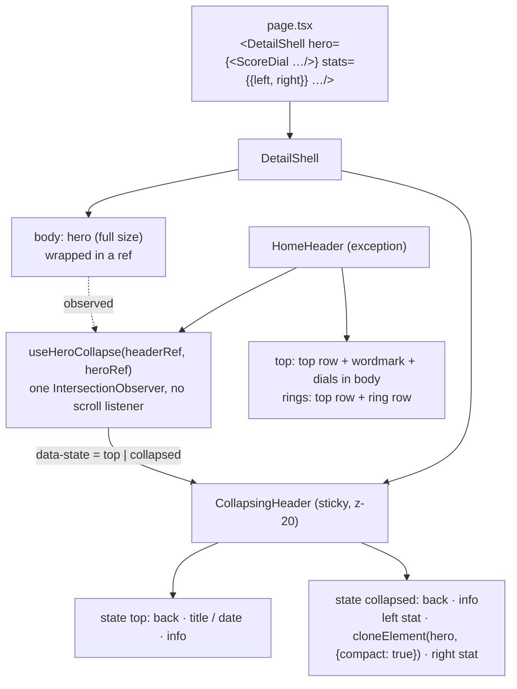

# Sticky and collapsing headers

This document does two things. Part A records what WHOOP's current app (October 2025 redesign through October 2026) keeps on screen while a page scrolls, screen by screen. Part B is Pulse's architecture for sticky views, as the user set it on 2026-10-03, with the API, the shared hook and the per-screen mapping. Spec v2 §4.3 and §4.3a point here.

Sources: about 1,450 r/whoop images in `reference/raw/rd/` (Oct 2025 to Oct 2026). I cropped the header area of all 981 phone screenshots into header contact sheets and checked the scrolled ones at full size. I also used 14 screen recordings in `reference/raw/vid/`, 4 of them newly downloaded. Evidence files are listed in `reference/README.md` under "Sticky and collapsing headers". Measurements are in iOS points, which equal CSS px at a 393 pt viewport. **Inferred** marks anything with no capture behind it.

---

## Part B. Pulse architecture (user decision, 2026-10-03)

Part B comes first because it is what we build. Part A has the evidence.

### B1. The rule

1. **Every hero component has a compact (sticky) form of itself.** ScoreDial (Recovery, Strain, Sleep), the stress gauge (ScoreDial `gauge`), WhoopAgeOrb, and the stat heroes (Activity, Health Monitor, Fitness) each render a `compact` variant. The orb shrinks into the header, and so do the dials and the gauge.
2. **One shared mechanism. There is no sticky component per screen.** `DetailShell` owns one `CollapsingHeader` and one hook. The hook watches the page's hero. When the hero has scrolled under the header, the header shows `back`, then that hero's compact form with the left and right stats, then `info`. A page declares only `hero={…}` and `stats={…}`.
3. **Home is the exception.** `HomeHeader` is its own component. It has two states, `top` and `rings`. When collapsed it keeps **both rows**: the top row (avatar, streak, date pill, sync) and the Sleep / Recovery / Strain ring row added under it. The top row never hides.



### B2. `compact` on each hero component

Every hero component takes `compact?: boolean`. When it is true, the component renders only its glyph and number: no label under it, no chevron, no tags, no wordmark, no caption, and no pointer interaction. It is `aria-hidden` and `inert`, because the full hero stays in the page for assistive technology. Sizes are for the phone; `md:` uses the same sizes.

| Hero component | Compact rendering | Size | Evidence |
|---|---|---|---|
| `WhoopAgeOrb` | Same canvas (particles, rim, inner glow), with the value ("40.7", "<18.0") and "WHOOP AGE" inside and no delta line. Drag interaction off. Static frame under reduced motion | **108 px** (measured 107-113 on 5 captures) | [latest-healthspan-collapsed-1..5], [latest-healthspan-collapsed-user-2026] |
| `ScoreDial` `recovery` / `strain` / `sleep` | The ring with a 5 px stroke and the same 4° top gap, band or metric colour, the value inside in `font-numeric text-[20px] font-bold tabular-nums` ("72%", "12.4"). A reason state shows the track only, with "--" | **64 px** (**inferred**: it fills the 62 pt stats row, see B4) | WHOOP shows no compact dial (Part A); designed to match the orb row |
| `ScoreDial` `gauge` (stress) | The gradient arc and needle at 64 px, the value inside ("2.1") in the level colour | **64 px** (**inferred**) | as above |
| Activity stat hero | The activity glyph in its 40 px `bg-strain-deep` disc, without the number (the number moves to the left stat) | 40 px (**inferred**) | |
| Health Monitor count | "4/5" in `font-numeric text-[28px] font-bold`, with "/5" at 0.55em in `text-foreground-secondary` | text (**inferred**) | |
| Fitness VO2 max | "48.2" in `font-numeric text-[28px] font-bold` with a small "ml/kg/min" unit | text (**inferred**) | |

Wrapper heroes that a page defines itself (the Healthspan `Orb`, the Activity `Hero`, the Monitor `Count`, the Fitness `Hero`, and the stress page's `div` around the gauge) must forward `compact` to the component inside, or the page passes the bare component as `hero`.

### B3. `CollapsingHeader` and the shell API

```tsx
// What a page writes (Recovery):
<DetailShell
  title="Recovery" dateSwitcher={…} info={…}
  hero={<ScoreDial variant="recovery" size="lg" value={r.value} … />}
  stats={{ left: { value: "52 ms", label: "HRV" }, right: { value: "47 bpm", label: "RHR" } }}
  …
/>

type HeaderStat = {
  value: React.ReactNode          // formatted already, e.g. "3.4", "-0.8x", "7:12"
  label: string                   // caps label, e.g. "YEARS YOUNGER"
  tone?: "optimal" | "warning"    // value colour; default foreground
}

type DetailShellProps = {
  /* existing props: title, subtitle, info, backHref, dateSwitcher, dismiss, ground, summary, insight, … */
  hero?: React.ReactElement<{ compact?: boolean }>
  /** Leave this out and the header stays plain (screens with no hero, or a text hero). */
  stats?: { left?: HeaderStat; right?: HeaderStat }
  /** Turns the collapse off on a screen that has a hero. Default true when hero is set. */
  collapse?: boolean
}

// Internal to DetailShell; pages never use it directly:
type CollapsingHeaderProps = {
  back: { href?: string; mode: "back" | "close" }
  title?: string; subtitle?: string; date?: DateSwitcherProps   // shown in state top only
  info?: React.ReactNode                                         // shown in both states
  compact?: React.ReactNode    // cloneElement(hero, { compact: true }), built once by DetailShell
  stats?: { left?: HeaderStat; right?: HeaderStat }
}
```

**Layout** (measured on the collapsed Healthspan header, [latest-healthspan-collapsed-2]):

```
 state top (in flow, sticky top-0)            state collapsed (the overlay grows over the content)
┌────────────────────────────────────┐      ┌────────────────────────────────────────┐
│ [<]     TITLE / ‹ DATE ›       (i) │ 44   │ [<]                                (i) │ 44  row 1: the centre fades out
└──────── 20 px fade ────────────────┘      │   9.2          ╭~~~~~╮        0.2x     │ 62  row 2: grid-cols-[1fr_auto_1fr]
                                            │ YEARS YOUNGER (  40.7 ) PACE OF AGING  │     stats centred on the row
                                            └───────────────(─────)──────────────────┘     then the 24 px fade
                                                             ╰~~~~╯                        a 108 orb hangs about 30 px below
```

- Row 1 is the existing `DetailHeader` row: the same height and back and info buttons. In state `collapsed`, the centre (title, subtitle, date) fades out, because the compact hero now identifies the screen, as WHOOP drops "HEALTHSPAN" and the week switcher.
- Row 2 is `grid h-[62px] grid-cols-[1fr_auto_1fr] items-center px-4`. Each stat is `flex flex-col items-center`: the value in the stat value row role (`font-numeric text-xl font-bold tabular-nums`, `text-optimal` / `text-warning` by `tone`) over the label in the stat label role (`text-xs font-bold tracking-[0.08em] uppercase text-muted-foreground`, measured `#b0b8b8`). The labels may wrap to two lines at large text sizes [latest-healthspan-collapsed-5].
- The compact hero sits in the centre column, `relative z-10`. If it is taller than 62 px (the orb), it overflows the row equally above and below and is drawn over the fade and the first card, as captured (orb top at row 1's bottom −16 px, bottom 30 px past the band).
- **No layout shift.** The header's height in the page flow stays at row 1 plus the fade. Row 2 lives in an absolutely positioned panel that grows over the content, as `HomeHeader` already does for its ring row. Content never moves.
- Fill: the page ground (opaque, no blur), with the same 24 px `mask-b` fade under whichever row is last. Ground on Healthspan: `#101518` (measured).

### B4. The shared hook

```ts
/** One observer. state collapsed once the hero's bottom edge is under the header's bottom edge. */
function useHeroCollapse(header: RefObject<HTMLElement>, hero: RefObject<HTMLElement>): void
```

- An `IntersectionObserver` on the hero wrapper, with `rootMargin` = −(the header's row-1 bottom) px at the top and a threshold of 0. The state is `collapsed` when `!entry.isIntersecting && entry.boundingClientRect.top < rootBounds.top` (the hero has left upward), and `top` otherwise. The hook writes `header.dataset.state`. There is no React state, no scroll listener and no direction logic. CSS does the rest (`group-data-[state=collapsed]:…`).
- Home uses the same hook, with its dial row (labels included) as the hero and `rings` as the collapsed state name. That replaces the custom effect in `HomeHeader`. `nextHeaderState` in `src/lib/header-state.ts` already reduces to this boolean.
- The state reverses as soon as the hero's bottom edge comes back under the header (scrolling up). No hysteresis is needed: an IntersectionObserver with one threshold does not flicker.
- Focus: if focus is inside the expanded centre (the date switcher) when the state flips to collapsed, keep the state at `top` until focus leaves (`:focus-within`), as §4.3 did.

### B5. Transition

The motion is time-based and runs on the state change. It is not linked to scroll. That keeps the one-observer design.

| Element | Into `collapsed` | Back to `top` |
|---|---|---|
| Row 2 panel | `grid-rows-[0fr] → [1fr]`, 220 ms `--ease-out-expo` | reverse, 200 ms `--ease-in-quick` |
| Compact hero | `opacity 0 → 1`, `scale 0.85 → 1` (origin centre), 220 ms `--ease-out-expo` | `opacity → 0`, `scale → 0.85`, 150 ms |
| Stats | `opacity 0 → 1`, `translate-y 4px → 0`, 220 ms, 40 ms after the hero | fade out, 150 ms |
| Row 1 centre (title, date) | `opacity 1 → 0`, 150 ms | `0 → 1`, 220 ms |
| Reduced motion | opacity only, 120 ms, no scale or translate | same |

Transitions name their properties (`transition-[opacity,scale,translate,grid-template-rows]`), never `transition-all` (§2.7).

**Not adopted (noted for fidelity).** WHOOP's Home shrinks its dials into the ring row **linked to scroll position** (Part A). A future `--collapse` progress variable could drive that, but it needs a per-frame write and is outside this architecture.

### B6. Per-screen mapping

| Screen (route) | `hero` | Compact | `stats.left` | `stats.right` | Evidence for stats |
|---|---|---|---|---|---|
| Home `/` | dial row | `HomeHeader` ring row (three `MiniRing`, 22 px, labels right) | n/a | n/a | [latest-home-collapsed-1], [latest-home-sticky-header-user-2025] |
| Recovery `/recovery` | `ScoreDial recovery lg` | 64 ring, "72%" | HRV "52 ms" / "HRV" | RHR "47 bpm" / "RESTING HR" | **inferred** (the first two summary rows) |
| Strain `/strain` | `ScoreDial strain lg` | 64 ring, "12.4" | Target "12.0-15.0" / "STRAIN TARGET" | Steps "8,212" / "STEPS" | **inferred** |
| Sleep `/sleep` | `ScoreDial sleep lg` | 64 ring, "92%" | "7:12" / "HOURS OF SLEEP" | "8:24" / "SLEEP NEEDED" | **inferred** |
| Activity `/activity/[id]` | activity stat hero | 40 glyph disc | strain "11.8" (`text-strain-text`) / "ACTIVITY STRAIN" | "1:10" / "DURATION" | **inferred** |
| Healthspan `/health/healthspan` | `WhoopAgeOrb` 300 | orb 108 | delta "3.4" / "YEARS YOUNGER" (`optimal`) or "YEARS OLDER" (`warning`); "--" when below the floor | pace "-0.8x" / "PACE OF AGING" (white) | **measured** [latest-healthspan-collapsed-1..5] |
| Stress Monitor `/health/stress` | `ScoreDial gauge lg` | 64 gauge, "2.1" | level word "HIGH" (level colour) / "STRESS LEVEL" | "15:05" / "LAST UPDATED" (today) or "DAY AVERAGE" (past) | **inferred** |
| Health Monitor `/health/monitor` | count block | "4/5" | "Within range" (toned) / "STATUS" | none | **inferred** |
| Fitness `/health/fitness` | VO2 max block | "48.2" | category "EXCELLENT" (toned) / "CATEGORY" | "78th" / "PERCENTILE" | **inferred** |
| Journal Insights, Reports, Settings, Trend sheets | text or composite hero | none: `collapse={false}` or no `hero` | n/a | n/a | WHOOP: a plain bar [latest-journal-insights-1], [latest-trends-collapsed-1] |

Tab roots other than Home (Health, Journal, More) keep `TitleHeader`, a plain sticky title with no collapse [latest-health-tab-collapsed-1].

### B7. Bottom chrome (all screens)

- The tab bar (tab roots) and the round action (all screens) **never hide on scroll** [latest-home-collapsed-2], [latest-home-collapsed-4]. That is already built.
- Sheets keep their primary button pinned at the sheet's bottom (vaul footer) [latest-sheet-edit-1], and the Sleep Planner keeps "SAVE & SET ALARM" pinned (recording 2026-03-22, `raw/vid/1s0r4vd.mp4`).
- There are no sticky section headers and no sticky segmented controls (W / M / 6M scroll with the content) [latest-trends-collapsed-1].

---

## Part A. WHOOP evidence, screen by screen

### A0. Summary

| Screen | Header at rest | Collapsed form in WHOOP | Trigger and motion | Other sticky elements |
|---|---|---|---|---|
| Home | Top row, wordmark, three dials | Top row + ring row; deep in the page, ring row only | Dials **shrink into** the ring row, linked to scroll position. The top row slides away about 120 ms later on a downward scroll | Tab bar + coach button |
| Recovery, Strain, Sleep | Back, date title, info or hexagon badge | **None**: the bar stays and the dial scrolls under it | n/a | Coach button |
| Activity | Back, glyph, name + time range, `•••` | None | n/a | Coach insight pill (Sept 2026) or coach button |
| Health tab | Centred "HEALTH" | None | n/a | Tab bar + coach button |
| Healthspan | Back, title + subtitle, week switcher, info | Back + info, a 108 orb, years and pace stats | When the hero is off-screen; motion **unknown** | Coach button |
| Health Monitor | Back, title | None | n/a | Coach button |
| Stress Monitor | Back, title, gear, date row | **Unknown** | n/a | Coach insight pill |
| Trend View | Back, title | None; the dropdown and W / M / 6M scroll away | n/a | Coach button |
| Behavior Insights | Back, title | None | n/a | none |
| Coach chat | Chip, history, memory | None | n/a | Chips + input pill at the bottom |
| Sleep Planner, sheets | X, title | None | n/a | Primary button at the bottom |
| Live workout | `•••`, title + timer, `+`, tabs | None | n/a | START SET / END SET at the bottom |

**Where WHOOP and Pulse differ.** In WHOOP only Home and Healthspan collapse. The compact dial, gauge and stat forms in B2 and B6 are a Pulse design choice, the user's decision. WHOOP's Home also hides its top row deep in the page (frame 12.1 s of [latest-home-collapsed-4], [latest-home-collapsed-2]). Pulse keeps the top row, also the user's decision.

### A1. Shared materials

- **Fill.** Opaque and equal to the page ground at that height, so header and page read as one surface. No blur or glass, and nothing shows through.
- **Bottom edge.** A soft fade with no hairline. On Recovery, a row label just under the bar rises from 20 % to full brightness over about **20 pt**, starting about 22 pt below the title's centre line [latest-recovery-collapsed-1]. On Healthspan, the card under the collapsed header fades in over about **24 pt** [latest-healthspan-collapsed-2].
- **Row.** 44 pt under the status bar. Back is a 26 pt chevron. Info is a 28 pt outline circle. The title is centred, in caps and letter-spaced.
- **Bottom chrome.** The glass tab bar and the round coach button stay at every scroll position, with content showing through the glass [latest-home-collapsed-2], [latest-home-collapsed-4]. Detail screens show only the floating coach button [latest-recovery-collapsed-2], [latest-sleep-collapsed-1].

### A2. Home

- **At rest** [latest-home-top-1]: the top row (avatar, streak, `‹ TODAY ›`, battery + band), the "WHOOP" wordmark, and three dials with "SLEEP ›", "RECOVERY ›", "STRAIN ›".
- **Collapsed** [latest-home-collapsed-1..3], [latest-home-sticky-header-user-2025]: the top row plus a 40 pt ring row (rings of about 24 pt with no number, the label to the right of each). Deep in the page WHOOP also hides the top row [latest-home-collapsed-2].
- **Motion**, from the screen recording posted 2026-06-29 at 30 fps [latest-home-collapsed-4], [latest-home-collapsed-5]:
  - As you scroll down, the dials stay pinned under the top row and **shrink in place**: at 11.4 s they are full size; at 11.6 s about 70 % with values; at 11.7 s about 45 %, the chevrons gone and the labels moving to the side; at 11.8 s tiny, the values faded; at 11.9 s the final ring row. The wordmark rises and fades behind the top row.
  - The shrink is **linked to scroll position**: at 18.6 s the finger pauses and the header holds a half-size state for 0.3 s. The morph covers about 150 pt of scroll (approximate).
  - It **reverses** symmetrically on an upward scroll: at 6.7 s the rings grow back without numbers, at 6.8 s the numbers return, at 6.9 s the chevrons, and at 7.1 to 7.3 s the wordmark.
  - **Top row hide**, which Pulse does not adopt: about 0.2 s after the rings dock, while still scrolling down, the top row fades and slides up over about 120 ms, and the ring row moves under the status bar (12.1 s). An upward scroll brings it back first.
  - Pull-to-refresh at the very top shows "DATA CAUGHT UP · SYNCED TO 11:04 AM" (7.5 s in the recording).

### A3. Recovery, Strain, Sleep

The bar shows back, the date title ("TODAY"), and either the ringed "i" or a hexagon count badge ("1643", "244") [latest-recovery-collapsed-2], [latest-sleep-collapsed-2]. It never changes. The hero dial, summary, insights and Weekly Trends scroll under it and fade out [latest-recovery-collapsed-1], [latest-recovery-collapsed-2], [latest-strain-collapsed-1], [latest-sleep-collapsed-1], [latest-sleep-collapsed-2]. Nine captures from Oct 2025 to Sept 2026 show no compact dial and no score in the header. The Sleep legend and "Last Night's Sleep" scroll with the content. The coach's insight sheet can rise from the bottom [latest-sleep-collapsed-2].

### A4. Activity

The header looks the same at rest and scrolled [latest-activity-1], [latest-activity-collapsed-1]: back, glyph, the name in caps over the time range ("06:44 to 08:30"), and `•••`, left-aligned. The zones and key statistics scroll under it. At the bottom since about Sept 2026 there is a floating **coach insight pill** with `⌃` that opens the coach sheet [latest-activity-2]. Earlier builds show the round button.

### A5. Health tab

"HEALTH" stays pinned and the cards pass under it. The teal glow stays at the top of the viewport at the page's bottom, so the ground is fixed to the viewport (spec C2) [latest-health-tab-collapsed-1]. There is no collapse.

### A6. Healthspan / WHOOP Age

- **At rest** [latest-whoop-age-cyan-1], [latest-healthspan-collapsed-4, left]: back, "HEALTHSPAN" over "NEXT UPDATE IN 7 DAYS", `‹ AUG 23 - AUG 29 ›`, info, then the 300 pt orb.
- **Collapsed** [latest-healthspan-collapsed-1..5], [latest-healthspan-collapsed-user-2026]: back and info stay at about 85 pt (status bar 0 to 54). The title and week switcher are gone. The **107-113 pt** orb has its top at about 90 pt and its bottom at about 198 pt, with the value and "WHOOP AGE" inside. The left stat is the value over "YEARS YOUNGER" / "YEARS OLDER", with its vertical centre at about 136 pt. The value is green `#30e8a0` when younger (also for "--" at an age below 18), amber when older ("6.1 YEARS OLDER") [latest-healthspan-collapsed-3]. The right stat is "0.2x", "-0.6x" or "1.7x" in white over "PACE OF AGING". The band is opaque `#101518` down to about 168 pt, then fades over about 24 pt. The orb is drawn over the fade and the first card. At the largest text size the labels wrap and the orb keeps its size [latest-healthspan-collapsed-5].
- **Trigger**: every collapsed capture has the hero and Pace of Aging fully off-screen. The earliest position shows the "WHOOP AGE TREND" card [latest-healthspan-collapsed-4, right]. **Motion: no recording.**

### A7. Health Monitor, Stress Monitor

- **Health Monitor**: back + "HEALTH MONITOR". The HR hero and the tiles scroll under the bar and fade out [latest-health-monitor-collapsed-1].
- **Stress Monitor** [latest-stress-monitor-1]: back, "STRESS MONITOR", gear, a `‹ MON, SEP 14 ›` row, and a coach insight pill at the bottom. **No scrolled capture** in 30 posts.

### A8. Trend View

The bar (back + "TREND VIEW") stays. The metric dropdown, AVERAGE and W / M / 6M scroll with the content [latest-trends-collapsed-1]. In a German capture (2026-03-18) the AVERAGE label is half under the bar while the toggle beside it is fully visible, so the toggle is not pinned.

### A9. Journal, Coach, sheets, live workout, Community, More

- **Behavior Insights**: back + title pinned; rows scroll under it [latest-journal-insights-1]. **Behavior Details** (X over a hero photo): no scrolled capture. **Journal check-in**: no capture.
- **Coach** (a sheet) [latest-coach-chat-1], [latest-coach-sheet-1]: the grabber, "Beta v5.4" chip, history and memory icons are pinned at the top; suggestion chips and the "Ask WHOOP anything" pill are pinned at the bottom; messages fade under the top (recording 2026-05-29, `raw/vid/1tqujl1.mp4`).
- **Sleep Planner**: X + title pinned; "SAVE & SET ALARM" pinned at the bottom of the wake-time sheet (`raw/vid/1s0r4vd.mp4`) [latest-sleep-planner-1]. **Edit sheets**: the white SAVE at the bottom [latest-sheet-edit-1], [latest-sheet-behaviors-1].
- **Live workout** (not in Pulse): the header tabs LIVE SESSION / EXERCISES are pinned, and START SET / END SET is pinned at the bottom (`raw/vid/1sptcei.mp4`, `1o0dyld.mp4`).
- **Community** [latest-community-1]: a photo header with INFO / STRAIN / RECOVERY / SLEEP tabs and a DAILY / MON-SUN / MONTHLY control. Whether the photo collapses is unknown, because the captures are cropped. **More** and **Settings**: seen only at the top of the page [latest-more-1], [latest-settings-1].

## Gaps

- **Compact dials, gauge and stat heroes** (B2, B6) have no WHOOP reference. Their sizes and side stats are designed, not measured.
- Healthspan's collapse **motion** and its exact trigger point: no recording.
- No scrolled capture for Stress Monitor, Behavior Details, the Journal check-in, or More and Settings. Community's header collapse is unknown.
- The Home morph timings come from one Android recording at 30 fps. The iOS build is assumed to match.
- The meaning of the hexagon count badge on score-detail headers (still a §12 gap).
