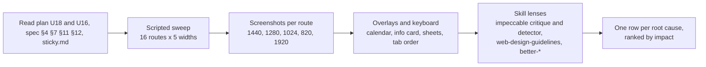

# Large-screen UX audit (U18)

Audit of the tablet and laptop web UI at 820, 1024, 1280, 1440 and 1920 px, done 2026-10-03 against the user's dev server (demo data, today = Sat 3 Oct 2026). Plan unit U18; spec v2 §4, §7, §11, §12.

## Method

- **Browser.** One background tab in Brave through the browser MCP, with device emulation at each width. An in-page iframe sweep loaded every route at each width and measured `scrollWidth` against `clientWidth`, elements painting past the viewport, interactive elements with no `href`, no React click handler and no form control, chevrons outside any link or button, and missing `hover:` or `focus-visible:` classes on interactive elements.
- **Routes.** `/`, `/recovery`, `/strain`, `/sleep`, `/activity/seed-ex-2026-09-24-0`, `/health`, `/health/healthspan`, `/health/monitor`, `/health/stress`, `/health/fitness`, `/journal`, `/journal/insights`, `/reports/2026-W39`, `/reports/2026-09`, `/more`, `/settings`.
- **Overlays.** The calendar panel (Recovery header pill), the "How Recovery works" info card, the check-in sheet (from the card button and from `?checkin=1`), and the behaviour detail sheet on Journal Insights.
- **Lenses.** `impeccable` critique (heuristics) and audit (technical) with the bundled detector, `web-design-guidelines` (rules fetched fresh from vercel-labs/web-interface-guidelines), `better-layout`, `better-ui`, `better-interface`, `better-accessibility` and `make-interfaces-feel-better`.
- **Critique run.** Single context, not the two isolated sub-agents impeccable's critique asks for, because this unit allows one browser tab. The detector ran on `src/app/(app)` and `src/components` and returned no findings (`[]`), so every row below comes from the browser and the code.

## What already works

- **No horizontal overflow** at any width, and no element paints past the viewport.
- **No dead interactive elements.** The mechanical check found no link without a target, no button without a handler and no chevron outside a link, at all five widths.
- **Overlays behave.** Esc closes the calendar, the info card and both sheets, and focus returns to the trigger. The calendar takes arrow keys with a visible ring.
- **Headers collapse correctly.** Home's discrete ring row (1280 px and up) and Healthspan's collapse both swap at the right scroll point.
- **Charts render.** Axes and ticks read at every width (5 date ticks; hour ticks every 4 to 6 h).

The problems are in composition, affordance and keyboard paths.

## Heuristic scores (impeccable critique, laptop)

| # | Heuristic | Score | Key issue |
|---|---|---|---|
| 1 | Visibility of system status | 3 | Sync and demo state are always visible; focus is lost after the check-in sheet closes |
| 2 | Match system / real world | 3 | WHOOP vocabulary held; the sidebar duplicates More |
| 3 | User control and freedom | 2 | Back pushes the parent instead of going back, so browser Back loops |
| 4 | Consistency and standards | 2 | Buttons show the arrow cursor while links show the hand; card heights in the same grid are stretched on some screens and not on others |
| 5 | Error prevention | 3 | n/a beyond the check-in |
| 6 | Recognition rather than recall | 3 | The metric toggle on Insights scrolls away from the list it controls |
| 7 | Flexibility and efficiency | 2 | Primary nav sits after the page content in tab order; dials carry 3 dead tab stops each |
| 8 | Aesthetic and minimalist design | 2 | Orphaned and stretched cards, 300 px holes, 1920 px dead bands |
| 9 | Error recovery | 3 | Error states keep the shell |
| 10 | Help and documentation | 3 | Info cards on every metric |
| **Total** | | **26/40** | Acceptable: significant layout work needed |

## Findings

Severity: **high** blocks or hides content or a control, or breaks a keyboard path; **medium** harms hierarchy, reading order or consistency; **low** is isolated polish.

| ID | Screen | Width(s) | Issue | Sev | Evidence | Proposed fix | Status |
|---|---|---|---|---|---|---|---|
| G-01 | All | all with a pointer | Every `<button>` shows the arrow cursor: Tailwind v4's preflight resets buttons to `cursor: default`, while links show the hand. The vital tiles, info rings, date pill, back button, toggles and Add activity all look inert on hover | high | `getComputedStyle(button).cursor` = `default` for 10 of 10 buttons on /health/monitor; `pointer` for the links | One base rule in `globals.css`: enabled `button` and `[role=button]` get `cursor: pointer` | fixed (D-L11) |
| G-02 | All | 820-1920 | The floating check-in button sits over the content column and hides controls at the bottom right as you scroll | high | 1440: button x 1352-1408 against the column's right edge at 1376, over the "Your week in review" chevron and the W/M/6M toggle. 1280: x 1192-1248, fully inside the column. 820: over the right edge of every card | From 768 px, put the action in the rail (56 px squircle above sync) and the sidebar (a "Check in" pill above the footer). It stays floating on phone | fixed (D-L5) |
| G-03 | Strain, Recovery, Sleep, Healthspan, Activity, Reports, Stress, Settings | 1024-1279 | The secondary grid splits into 2 columns at `lg` inside the 720 px tablet column, giving 330 px cards: zone rows squeezed, Activities orphaned. Spec §7 calls 768-1279 tablet, one column | medium | /strain at 1024: Time in zones 316 px wide beside a 1-row Activities card | Two columns from `xl` (1280), in DetailShell and Settings | fixed (D-L3) |
| G-04 | All | 1024-1279 (and any tablet wider than 864) | Header rows span the whole main area while the content is the 720 px column, so the avatar, back, info and sync sit outside the column edges | medium | 1024: avatar x 140 and back x 145 against the column at 232; sync right at 1000 against 904 | Header rows use the same width as the column: one shared width constant from `md` | fixed (D-L2) |
| G-05 | All | 768+ | The rail and sidebar come after `<main>` in the DOM, so keyboard users tab through the whole page before reaching navigation | medium | Home 1440: "Home" in the sidebar is tab stop 51 of 58 | Render the nav before `<main>` (the skip link stays first) | fixed (D-L6) |
| G-06 | Recovery, Strain, Sleep, Stress, Fitness, Healthspan, Home | all | Cartesian charts are focusable (Recharts' keyboard layer lets arrows scrub) but `ChartContainer` hides the outline, so a focused chart shows nothing | medium | `svg.recharts-surface` has `tabindex=0` and `outline: transparent` | Visible focus ring on the chart surface in `ChartFigure` | fixed (D-L11) |
| G-07 | All | 1920 | The 1120 px column centred in 1664 px leaves a 316 px dead band between the sidebar and the content, and 304 px on the right | medium | 1920: content x 560-1616, sidebar ends at 244 | From 1536 px (`2xl`), the column grows to 1280 px; headers follow through the shared width constant | fixed (D-L1) |
| K-01 | Home, Reports, Recovery | all | Every ScoreDial and MiniRing leaves 3 focusable SVG nodes (Recharts' `accessibilityLayer` and Pie `rootTabIndex`) inside its link: 9 invisible tab stops between the date pill and the monitor cards | high | Tab order on Home: `A Sleep…`, `svg`, `g`, `svg`, `A Recovery…`, `svg`, `g`, `svg`… | `accessibilityLayer={false}` and `rootTabIndex={-1}` on the decorative dial and ring charts | fixed (D-L11) |
| N-01 | Every detail screen | all | The in-app Back button calls `router.push(parent)` unless `document.referrer` is same-origin, and the referrer never updates on client navigation. Home → Recovery → Back adds a new `/` entry, and browser Back then returns to Recovery | medium | Scripted: Home → Recovery → Back → `history.back()` lands on `/recovery` | Use the Navigation API's `canGoBack` (same-origin entries only), falling back to the referrer check | fixed (D-L10) |
| H-01 | Home | 1280 | Tonight's sleep: the two times overflow the half-width card. "08:36" and "TYPICAL WAKE" run into the card's edge | high | 1280: label right edge 1245 against the card edge 1248 (padding 20 px gone) | Times step down to 22 px below a 15 rem container, and the dashed rule may shrink to 0 | fixed: times step 32 / 26 / 22 px by card width |
| H-02 | Home | 1280+ | Reading and tab order run My Day (right column) before My Dashboard (left column), against the left-to-right visual order | medium | Tab order: monitors, My Day's "+", activities, journal… then the Dashboard rows at x 320 | My Day in the wide left column (7fr), My Dashboard in the right (5fr). The DOM order, phone order and visual order then agree | fixed (D-L4) |
| H-03 | Home | 1280+ | The monitor cards float vertically centred beside the dials, with about 110 px of dead space above and below | medium | 1440: dial column 330 px tall, monitor cards 108 px at y 173-281 | Stack the two monitor cards in the 5fr column so they fill the dial row's height | fixed (D-L4) |
| S-01 | Strain | 1280+ | Activities (one row, 130 px) sits beside Time in zones (435 px), leaving a 300 px hole under it | medium | 1440 screenshot: Activities ends at y 1018, zones at 1322 | Time in zones spans two rows; Activities and Strain trend stack beside it (`xl:row-span-2`) | fixed (D-L8) |
| HS-01 | Healthspan | 1280+ | The Sleep card (2 rows) is stretched to the Strain card's height (4 rows) with about 280 px empty, and Fitness sits alone in a half row | medium | 1440: Sleep 1012-1466 with content ending at 1230; Fitness 1485-1905, right half empty | Strain spans two rows: Sleep and Fitness stack in the left column | fixed (D-L8): Strain keeps its natural height; the right column ends about 240 px early, with no stretched card and no orphan |
| R-01 | Reports (week and month) | 1280+ | Training balance (about 140 px of content) is stretched to the Averages card's height (475 px) | medium | 1440: Training balance 606-1079, text ends at 740 | Averages spans two rows with Training balance and Best and worst day beside it; Top journal effects spans both columns (`grid-flow-dense`) | fixed (D-L8) |
| A-01 | Activity | 1280+ | Heart rate recovery sits alone in a half row, while Key statistics spans both columns with three tiles | medium | 1440: HRR at x 320-840, right half empty | Key statistics and Heart rate recovery side by side, with HRR bottom-aligned to the tiles | fixed (D-L8) |
| J-01 | Journal | 1280+ | History rows stretch to 1056 px (date at x 320, tags at x 1250), and the check-in and teaser cards side by side have unequal heights | medium | 1440 full-page screenshot | Laptop split: check-in and teaser stacked in a sticky left column (5fr), History on the right (7fr) | fixed (D-L7) |
| JI-01 | Journal Insights | 1280+ | The hero column (intro and toggle) ends at y 280 while the list runs to 780: a 500 px dead column, and the RECOVERY / HRV / SLEEP toggle scrolls out of view while you read the list it controls | medium | 1440 screenshot | Sticky hero column from 1280 px (DetailShell, when the hero opts into top alignment) | fixed (D-L7) |
| ST-01 | Settings | 1024-1279, 1280+ | Two columns already at 1024 (spec: one on tablet). On laptop the right column holds only Sync status (128 px) beside three stacked cards | medium | 1440: Sync ends at y 219 while the left column runs to 947 | Two columns from `xl`; About moves to the right column under Sync | fixed (D-L3) |
| O-01 | Calendar panel | 768+ | The panel is a full-bleed slab to the viewport's right edge with square corners, unlike the floating rail, sidebar and sheets (12 px insets, 28 px radii) | low | 1440: panel x 256-1440 | From 768 px, inset 12 px on the right with 28 px bottom corners; the dim stays full width | fixed (D-L9) |
| O-02 | Check-in sheet | 768+ | Opened from the round button or `?checkin=1`, the sheet has no opener, so focus falls to `<body>` on close | medium | `document.activeElement` = BODY after Esc | ResponsiveSheet takes a fallback focus target; CheckIn passes its Check in button | fixed (D-L11) |
| O-03 | Check-in and detail sheets | 768+ | The X sits at the left of the floating right sheet; spec §4.8 puts it at the right from 768 px | low | Screenshot: X at x 1038 | Close in the header's right slot on the floating sheet | fixed (D-L9) |
| HS-02 | Healthspan collapsed header | 1280+ | The two stats sit at the edges of the 1056 px row, about 300 px from the compact orb | low | 1440: stats centred at x 553 and 1143, orb at 848 | Row 2 is 720 px wide, centred, from 768 px | fixed (D-L2) |
| M-01 | More | 1280+ | The list is 720 px and left-aligned while the header title is centred over the 1056 px column | low | 1440 screenshot | Centre the 720 px list | fixed (D-L8) |
| RP-02 | Reports hero | 1280+ | The three dials sit edge to edge (about 4 px between rings) in the hero column | low | 1440 and 1280 screenshots | 16 px gap between dials from 1280 px | fixed (D-L8) |
| SB-01 | Sidebar | 1280+ | The "PULSE" wordmark link has no hover state | low | Interactive-class scan: no `hover:` on it | `hover:text-foreground-secondary` | fixed |
| RC-01 | Recovery | 1280+ | Tomorrow's forecast (180 px) sits beside What shaped it (450 px) | low | 1440 screenshot | — | deferred: two cards with fixed natural heights. Stretching the forecast leaves an empty 450 px card, and full width stretches the driver rows to 1056 px; both read worse. Revisit if a third card joins the row |
| SM-01 | Stress Monitor | 1280+ | Total day is stretched to the 30-day trend's height, about 100 px empty | low | 1440 screenshot | — | deferred: two cards, same trade-off as RC-01; the gap is 100 px |
| HH-01 | Health hub | 1280+ | Fitness spans both columns with about 600 px between VO2 max and training load | low | 1440 screenshot | — | deferred: a three-up row at 1280 px leaves about 300 px per card, too tight for five vital tiles. The card is content-limited, not broken |
| J-02 | Journal | all | The Insights button takes its own row above the strip | low | 1440: row y 125-165 with nothing else in it | — | deferred: moving the button into the header changes the phone layout, which this unit keeps as it is |
| H-04 | Home | 1280+ | Two "PULSE" wordmarks are visible (sidebar and above the dials) | low | 1440 screenshot | — | deferred: both wordmarks are specified (sidebar header §4.2, Home wordmark §7.1 from WHOOP) |
| A-02 | Activity | 1280+ | The hero stat pair is left-aligned with nothing beside it | low | 1440 screenshot | — | deferred: R11 keeps the insight last, and nothing else can move beside the hero without changing the phone order |
| O-04 | Behaviour detail sheet | 768+ | The floating sheet is full height for about 400 px of content | low | 1440: sheet 876 px tall | — | deferred: content-height sheets would jump in size between behaviours; the full-height floating sheet is the spec's pattern (§4.8) |
| O-05 | Info card | 1280+ | Centred on the viewport (x 720), not on the content column (x 848) | low | 1440 screenshot | — | deferred: a modal centred on the viewport is the platform norm, and its dim covers the sidebar too |
| HB-01 | Health hub | 1280+ | The floating sidebar's shadow reads as a dark column over the teal glow | low | 1440 screenshot | — | deferred: the shadow is the glass material's own (§2.6); removing it flattens the floating sidebar on every other ground |

| H-06 | Home header (user request, 2026-10-03) | 320-480, all | The avatar and streak pill did not match WHOOP: the avatar sat beside the pill instead of on it; the flame was a flat lucide icon about 20% small; the pill was tight; there was no photo support | high | Side by side with the user's WHOOP capture: WHOOP's avatar is about 1.1x the pill, overlaps its left end and has a page-colour ring; the flame is two-tone, red-orange with an orange-yellow core | Avatar on the pill with a ground-colour ring; two-tone SVG flame; WHOOP-measured proportions on one `--u` scale, stepped down on narrow phones; photo from `AVATAR_URL` or `public/avatar.*` | fixed (spec §11 M6) |
| H-07 | Healthspan (at rest), Activity | all | With a subtitle, the title and subtitle were centred together in the 44 px row, so the title sat 4 px from the top. Every other header has its title centred 22 px down | medium | Measured title top: Healthspan and Activity 4 px against 12 px elsewhere (phone); the user's screenshot | The title line keeps the plain bar's position and the subtitle hangs below it | fixed (spec §11 D-L12) |
| H-08 | Health, Journal, More (tab roots) | all | TitleHeader rows were 52 / 56 px while Home and detail rows are 44 / 52 px, so the tab-root titles sat 4 px lower | low | Title centre at 26 px (phone) and 28 px (768+), against 22 / 26 px elsewhere | `h-11 md:h-13`, as the other headers | fixed (D-L12) |

**Counts.** 5 high, 17 medium, 16 low (38 rows): 29 fixed, 9 deferred (all low).

## Checked and fine

- **Back, Esc and focus restore** for the calendar, info cards and the behaviour sheet.
- **Calendar.** Arrow keys move the roving day with a visible ring.
- **Segmented controls.** W/M/6M is a native radio group (arrows move); Peak / Perform / Get by is a Radix toggle group (roving focus).
- **Sticky headers.**
  - Home's discrete swap from 1280 px: the ring row fades in once the dials pass under the top row.
  - Healthspan: collapses once the orb has scrolled away.
  - Detail bars: pinned 52 px with a 24 px fade at every width; edges on the content column from 1280 px (S5).
- **Charts.** Tick density is 5 labels at 1016 px (trend) and every 4 to 6 h (intraday). Tooltips sit at the pointer and stay inside the plot.
- **Empty states at width.** No activities, No readings, Waiting for sleep and the Energy Bank reason all stay centred inside their cards.
- **Console.** No errors during the per-route sweep. Three "Uncaught (in promise)" entries were traced to the scripted rapid back/forward test, not to a route.

## Verification (after fixes)

- **Sweep.** All 16 routes at 820, 1024, 1280, 1440 and 1920 px, plus 361 and 390 px:
  - `scrollWidth` equals `clientWidth` everywhere;
  - no element paints past the viewport (the Healthspan orb canvas is clipped by design, M1);
  - no interactive element without an `href`, a click handler or a form control;
  - no chevron outside a link;
  - no `<a>` or `<button>` without the hand cursor;
  - no focusable SVG inside a link.
- **Console.** No errors on clean top-level loads. The iframe sweep logs "Uncaught (in promise)" when it tears down mid-request, and it never appears on a direct load.
- **Header top padding.** On 15 routes at 361, 390, 820 and 1440 px, every title line (or the date pill on Home, Recovery, Strain and Sleep) is centred 22 px below the safe area on phone and 26 px from 768 px. Back, info, the avatar and sync sit on the same line. The loading skeletons render through the same PageShell and DetailShell headers, so they match.
- **Home header (M6).** At 320 to 480 px, with the streak and on a past day, the date pill stays centred to 0.1 px and sits at least 8 px from the streak pill. Checked side by side with the user's WHOOP capture at 390 px, in both photo and no-photo states.
- **Checks.**
  - `pnpm typecheck`: clean.
  - `pnpm lint`: clean.
  - `pnpm test`: 601 passed and 1 skipped when the machine is idle. Under load, three seed-heavy server tests (`home.test.ts`, `pipeline.test.ts`, `sleep.test.ts`) can hit vitest's 5 s and 10 s timeouts; none of them touches UI code.
