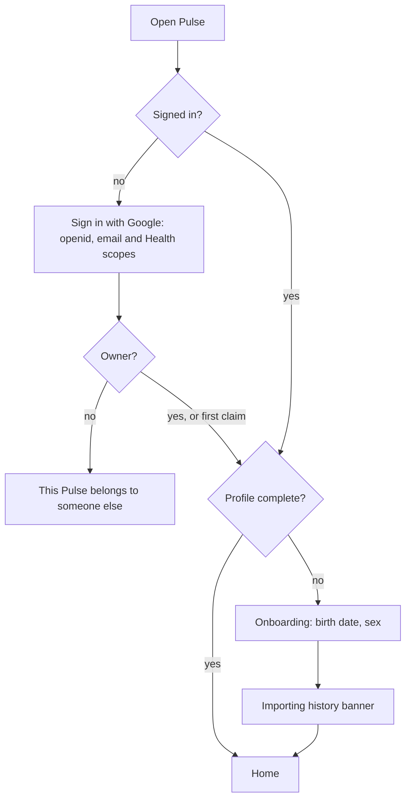

# Handoff: session 1 (2026-10-02 to 2026-10-03)

This document is the starting point for the next session. Read it first, then `AGENTS.md`, then the plan.

## Where things stand

- **Repo:** https://github.com/adityaongit/pulse. Local work is on `main`, which tracks `origin/main`. The local branch `feat/pulse-v1` is an archive whose history still contains the design screenshots. Never push it.
- **History:** 50+ commits, rewritten so that `docs/design/reference/` (third-party WHOOP and Bevel screenshots, now gitignored) and `CLAUDE.md` appear in no commit.
- **License:** PolyForm Noncommercial 1.0.0. Credits for noop and Hælan live in `NOTICE` and the README only.
- **Plan:** `docs/plans/2026-10-02-001-feat-whoop-style-fitbit-webapp-plan.md`, status `active`. U1–U18 are done. U19 and U20 are open (see next steps).
- **Checks at hand-off:**
  - `pnpm typecheck` and `pnpm lint` are clean.
  - `pnpm test` passes: about 620 unit tests.
  - `pnpm e2e` passes: 263 Playwright tests on its own server on :3300.

## What was built

- **Data:** Google Health API v4. The user's own unverified OAuth client must be in **In production** status. `GOOGLE_OAUTH_ENABLED=false` gives a deterministic 180-day demo. Storage is SQLite (drizzle + better-sqlite3, WAL), with migrations at boot.
- **Scoring:**
  - `src/core/scoring/` is noop's analytics ported to TypeScript, with golden tests.
  - `src/core/algorithms/` holds our own models: healthspan (Pulse Age), strain target, sleep planner, energy bank, stress, SRI, fitness level, health monitor, journal impact and reports.
  - `src/server/pipeline.ts` runs a two-stage, causal, deterministic recompute.
- **UI:**
  - Next.js 16 with shadcn/ui and Recharts, following WHOOP's 2025–26 glass design, branded Pulse. The contract is `docs/design/spec.md`.
  - Key pieces: the two-state collapsing Home header, the Healthspan compact orb, the animated Pulse Age orb, the top drop-down calendar, and the floating glass tab bar.
- **Brand:** the PULSE wordmark, and the final mark "4g", two staggered beats in teal and blue. See `docs/design/brand.md` and `/dev/brand/marks`.
- **Audits:** `docs/design/audit.md` (WHOOP side by side), `ux-audit-desktop.md`, `guidelines-review.md` (41 low findings still open), `sticky.md` and `orb.md`.
- **Deploy:** `Dockerfile`, `compose.yaml` and `docs/runbook.md`, for the homelab behind Cloudflare Tunnel and Access. Not deployed yet.

## Next steps, in order

1. **Check the last agent's work.** The residual-findings agent has committed fixes #2, #6, #24, #7 and #11. It should also have pushed `docs/residual-review-findings.md`. Verify with `git log origin/main` and `pnpm test`.
2. **U19 and U20 together, as one first-run flow.** Detail is in the plan.
   - **U19:** move the profile out of `.env` into a `profile` table. Add an onboarding screen (birth date, sex, optional max HR) and Settings › Profile. Saving the profile recomputes every day. Height and weight come from Google.
   - **U20:** built-in "Sign in with Google" with the owner lock (`OWNER_EMAIL`, or the first account to sign in), a signed session cookie (secret generated on first boot), and auth modes `google` | `cloudflare` | `none` (demo and development only). Add `openid` and `email` to the consent.
3. **Open user decisions from U16:**
   - Keep the "So far" tag under Home's Strain dial and the "View Strain" link?
   - "HEALTH MONITOR" and "STRESS MONITOR" wrap at 361 px. Accept, or shrink?
   - The vitest `hookTimeout` is 60 s, added because the machine was under load.
4. **Deferred work:**
   - the residual review findings (pipeline refactor, raw-archive retention, deleted Fitbit records);
   - 41 low web-guideline findings;
   - the Sleep card's hours hero and overnight HR chart (no data in the view model);
   - a customizable My Dashboard, suggested on Reddit.
5. **Real data:** the user has a Google Cloud project, "Pulse Fit", with the OAuth consent logo ready (`public/icons/oauth-logo-120.png`). Set the client ID and secret in `.env`, set `GOOGLE_OAUTH_ENABLED=true`, then run the probe (`docs/runbook.md`, "First real probe"). Fill in `docs/data-notes.md` from the real Fitbit Air payloads, and re-tune the baseline floor spreads.

## Working rules learned this session

- **Research first.** Use the LATEST WHOOP screenshots (2025–26, mostly from r/whoop) before building any UI. List every state and interaction (sticky, collapse, the direction a panel opens, animation, touch) and cite the dated reference. The user had to point out each miss one at a time; avoid that.
- **Reusable structure.** Prefer reusable architecture over one-offs. For example: every hero component has a `compact` form, rendered by one `CollapsingHeader`.
- **Frontend skills.** For UI work, load `design-taste-frontend`, `frontend-design:frontend-design`, `impeccable`, `web-design-guidelines`, `make-interfaces-feel-better` and `better-ui`.
- **The user's phone** is a OnePlus 13R with a CSS width of about 361 px. Always check 361 px.
- **Agents and the dev server.** Agents must never kill processes by pattern. The user's dev server runs on :3000. e2e uses :3300 with `NEXT_DIST_DIR=.next/e2e`.
- **Git.**
  - Push only from inside `~/personal`, where the personal credential helper applies; a clone in `/tmp` picks up the work identity.
  - Identity: `adityaongit` / raghavjindal017@gmail.com.
  - Never use `gh`.
- **Docs.** Docs are markdown in the repo, with mermaid diagrams. No Artifacts.
- **Other session.** Another Claude session ("pulse-53") wrote `docs/research/recovery-readiness.md`, an evidence review of the recovery scoring. Use it when re-tuning scores.
