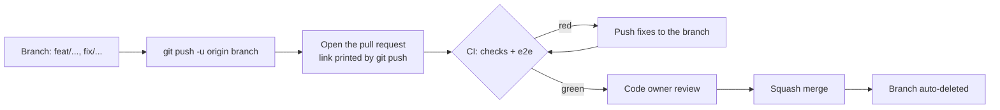

# Maintainer guide

How the GitHub repository is configured, and how changes reach `main`. Most of it is one-time setup in the
repository settings; the files it relies on are in `.github/`.

## How a change reaches main

Nobody pushes to `main`, including the maintainer. Work on a branch, push it, and open the pull request from
the link `git push` prints (or the repository page). The repository uses the `git` CLI only.

As the only maintainer you can't approve your own pull request, so the ruleset lets repository admins bypass
the review **only through a pull request**: you merge your own green PR yourself, but a direct push to `main`
is still refused.

## One-time repository settings

### Ruleset for main

**Settings › Rules › Rulesets › New ruleset › Import a ruleset**, and pick
[`.github/rulesets/main.json`](../.github/rulesets/main.json). It applies to the default branch and:

| Rule | Effect |
|---|---|
| Restrict deletions | `main` can't be deleted |
| Block force pushes | History on `main` can't be rewritten |
| Require linear history | Only squash merges, no merge commits |
| Require a pull request | 1 approval, from a code owner (`.github/CODEOWNERS`); stale approvals are dismissed on new pushes; the last pusher can't approve; all review threads resolved |
| Require status checks | `checks` and `e2e` from `.github/workflows/ci.yml`, on a branch up to date with `main` |
| Bypass | Repository admins, through pull requests only |

The required checks only exist after CI has run once, so merge the pull request that adds the workflow first,
or let one CI run finish before importing.

### General

- **Pull requests:** allow squash merging only; turn on **Automatically delete head branches**; turn on
  **Always suggest updating pull request branches**.
- **Features:** turn off Wiki and Projects unless you use them; Issues on; Discussions optional.

### Security (Settings › Code security)

- **Private vulnerability reporting:** on (SECURITY.md points reporters there).
- **Dependency graph, Dependabot alerts and Dependabot security updates:** on. Version updates come from
  `.github/dependabot.yml`.
- **Secret scanning** and **Push protection:** on, so a pushed token is blocked.
- **Code scanning (CodeQL) default setup:** on.

### Actions (Settings › Actions › General)

- **Workflow permissions:** read repository contents only; leave "Allow GitHub Actions to create and approve
  pull requests" off.
- **Fork pull request workflows:** require approval for first-time contributors (or all outside
  collaborators), so a stranger's PR can't run code in CI before you've read it.

## Contributions from others

- Contributors fork, branch and open a PR; CI runs once you approve the workflow for a first-time contributor.
- Commits need a DCO sign-off (`Signed-off-by:`); ask for `git commit --amend -s` if it's missing.
- Squash merge with a Conventional Commit title.
