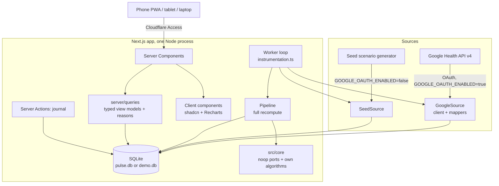
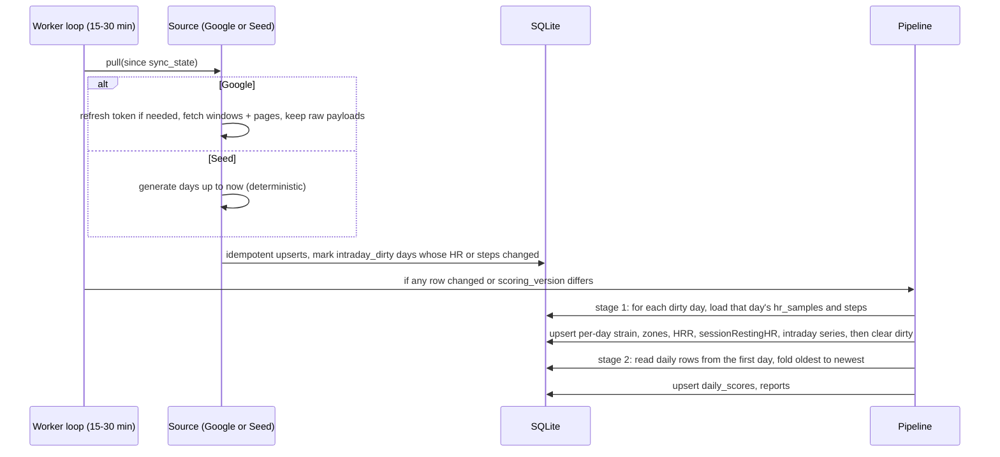
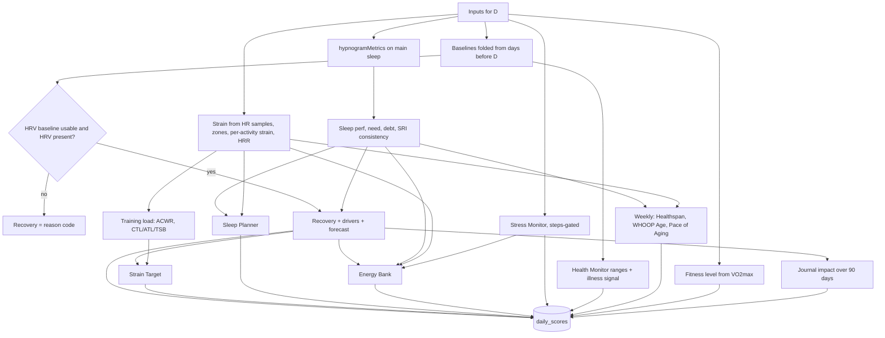
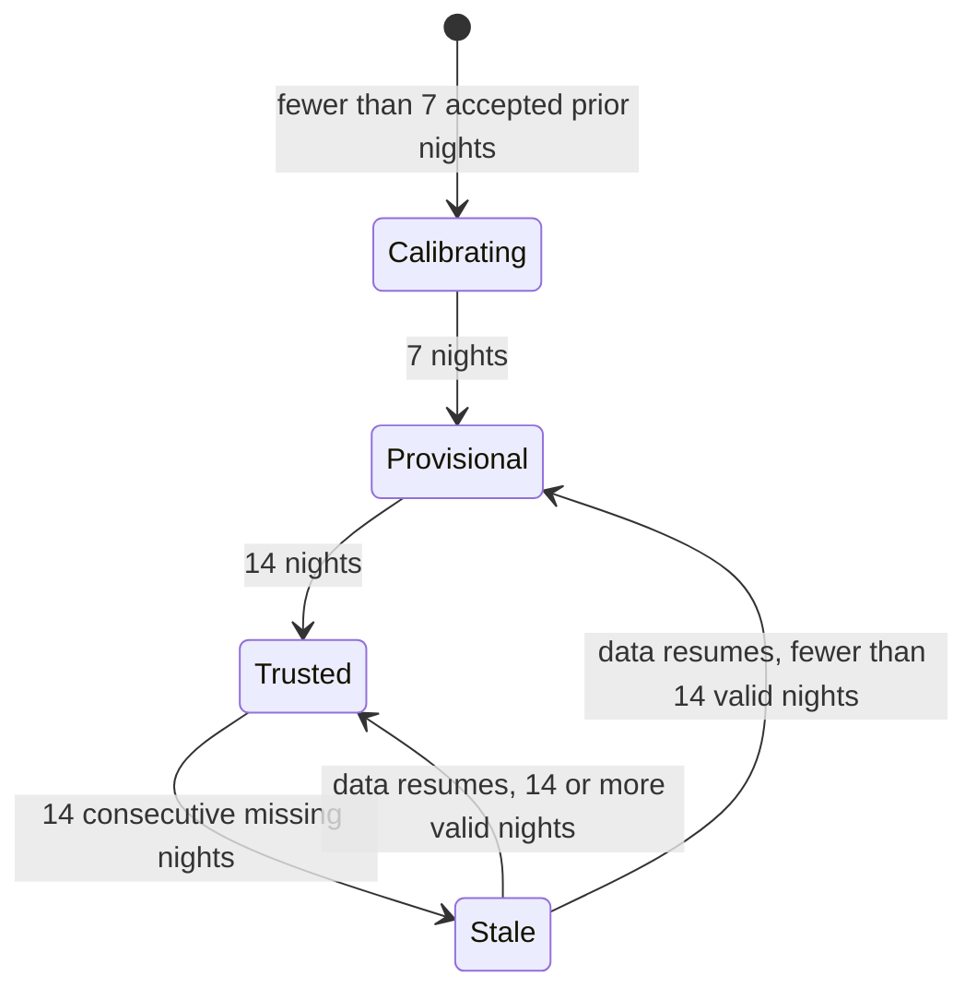
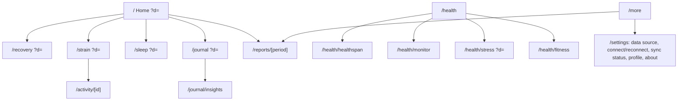

# feat: Pulse, a WHOOP-style personal health app for Fitbit Air

**Target repo:** `pulse/` (new, inside `personal/`, kept private). All paths are relative to `pulse/`. "Pulse" is a working name.

## Summary

Build one Next.js app, mobile-first and installable as a PWA, that gives a Fitbit Air the full WHOOP experience, plus the paid-tier extras from WHOOP and Bevel, for free. It has two parts.

The backend, inside the same Next.js app:
- It reads Fitbit data from the Google Health API, or generates realistic demo data when `GOOGLE_OAUTH_ENABLED=false`.
- It stores everything in SQLite.
- It computes scores with a TypeScript port of noop's scorers, plus our own algorithms for features neither Google nor noop provides: WHOOP Age, Pace of Aging, Strain Target, Sleep Planner, Energy Bank, Stress Monitor, Sleep Regularity, fitness level, journal impact, Health Monitor and reports.

The frontend:
- It copies WHOOP's UI and user journeys, because this is for personal use.
- It is built in a single pass from a written design spec, on shadcn/ui components and shadcn charts inside layout shells.
- It uses no hand-written CSS beyond theme tokens.

---

## Problem Frame

The Fitbit Air records good signals, and Google exposes them through the free Google Health API. But the Google Health app has no WHOOP-style recovery and strain loop, no WHOOP Age, and no coaching extras. Bevel has no Android app and charges for its extras, and Baro is not polished. noop already contains well-tested scoring maths for exactly these nightly inputs, but it is tied to WHOOP's Bluetooth protocol.

The user wants:
- a single personal app that works on phone, tablet and laptop;
- an exact WHOOP-quality UI, built once rather than iterated;
- the paid-tier features, built as our own algorithms;
- a way to see the whole UI populated before connecting Google.

---

## Requirements

**Data and modes**
- R1. When `GOOGLE_OAUTH_ENABLED=true`, read the user's data from the Google Health API v4 using the user's own unverified OAuth client in "In production" status. Sync incrementally every 15–30 minutes, and backfill 180 days on first connect.
- R2. When `GOOGLE_OAUTH_ENABLED=false`, generate 180 days of realistic, deterministic demo data ending at "now". It goes into the same normalized tables and through the same scoring pipeline, so every screen and every state shows with real computed numbers. The demo data lives in a separate database file and is never mixed with real data.
- R3. Keep raw Google payloads, gzipped and deduplicated by body hash, so normalized data and scores can be rebuilt without refetching. Raw HR pages older than 30 days may be pruned, because `hr_samples` holds the same data losslessly.

**Ported scores (noop)**
- R4. Recovery: 0–100%, banded green ≥ 67, yellow 34–66, red ≤ 33. Built from HRV, resting HR, respiratory rate, sleep performance and skin temperature against personal baselines, with a "what shaped it" driver breakdown and a forecast for tomorrow.
- R5. Strain on WHOOP's 0–21 scale from heart rate, with HR zones, per-activity strain and heart-rate recovery after each workout.
- R6. Sleep performance %, personal sleep need and sleep debt.
- R7. Training load (acute:chronic ratio, fitness/fatigue/form) and an illness signal.
- R8. Honest calibration. A score that cannot be computed returns a typed reason (calibrating, no HRV last night, awaiting sleep sync, and so on), never a fabricated number.
- R9. Stable history. A day's scores depend only on that day and earlier days (causal baselines).

**Own algorithms (not provided by Google or noop)**
- R10. Healthspan: WHOOP Age and Pace of Aging, from the same nine inputs WHOOP's Healthspan uses.
- R11. Strain Target: a recommended strain range for today, from recovery and training load.
- R12. Sleep Planner: tonight's sleep need broken down, and recommended bedtimes for 100%, 85% and 70% of need.
- R13. Energy Bank: an intraday energy-reserve curve, in the style of Bevel.
- R14. Stress Monitor: an intraday stress level from 0 to 3, gated by movement.
- R15. Sleep Consistency, computed as the Sleep Regularity Index.
- R16. Fitness level: VO2max percentile and category for the user's age and sex.
- R17. Health Monitor: each vital against its personal normal range, plus the combined illness flag.
- R18. Journal: a daily behaviour check-in, plus each behaviour's measured effect on next-day recovery, HRV and sleep.
- R19. Weekly and monthly performance reports.

**Experience**
- R20. Copy WHOOP's dark visual language and information architecture. Bevel-only features are drawn in that same language.
- R21. Every screen in the Screen Inventory works without breakage at phone (390 px), tablet (820 px) and laptop (1440 px) widths. No horizontal scroll, no clipped text.
- R22. Use component libraries only: shadcn/ui, shadcn charts (Recharts) and lucide icons. Layout lives in shells and features live in components. Styling is Tailwind utilities plus theme tokens, with no bespoke CSS files.
- R23. Every metric component handles five states: loading, empty, a reason-coded null, provisional, and a value.

**Hosting and privacy**
- R24. One container on the homelab, reachable only through Cloudflare Tunnel plus Cloudflare Access for the user's email. The app checks the Access JWT itself and refuses to run without that configuration.
- R25. Health data never leaves the homelab except as requests to Google. No third-party runtime requests: fonts are self-hosted through `next/font`.

---

## Feature Catalog

Where each feature comes from, and where it shows up.

| Feature | Source | Screen |
|---|---|---|
| HRV, resting HR, respiratory rate, SpO2, skin-temp deviation, sleep stages, HR (1 s), steps (1 min), workouts, VO2max, calories, weight/body fat | Google Health API (raw) | All |
| Personal baselines, Recovery and drivers, Strain (Edwards TRIMP), sleep performance, need and debt, confidence tiers, HR zones | noop port | Home, Recovery, Strain, Sleep |
| Recovery forecast, training load (ACWR, CTL/ATL/TSB), illness signal, HR recovery after workouts, daytime-stress base model | noop port | Recovery, Strain/Activity, Health |
| WHOOP Age and Pace of Aging (Healthspan) | Own | Health › Healthspan |
| Strain Target | Own | Home, Strain |
| Sleep Planner (need breakdown and bedtimes) | Own | Home, Sleep |
| Energy Bank | Own | Home |
| Stress Monitor (0–3, movement-gated) | Own, built on noop's base | Home, Health › Stress |
| Sleep Consistency (Sleep Regularity Index) | Own | Sleep, Healthspan |
| Fitness level (VO2max percentile) | Own | Health › Fitness |
| Health Monitor (personal normal ranges) | Own, plus the noop illness signal | Health › Monitor |
| Journal and behaviour impact | Own | Journal |
| Weekly and monthly reports | Own (aggregation) | Reports |

---

## Scope Boundaries

- A Next.js app only. The PWA covers phone, tablet and laptop.
- No Bluetooth or raw-signal processing. Sleep stages and nightly HRV come from Fitbit as-is.
- Single user. No accounts or household features. Profile values come from environment config.
- No AI coach, nutrition logging, community, blood-work import or ECG.
- Nothing is written back to Google: the API does not grant third-party writes. Journal entries live only in our database.
- The app is never published. The WHOOP lookalike and the PolyForm-Noncommercial (noop) and AGPL (Hælan) derived code stay in a private repo for personal use.

### Deferred to Follow-Up Work

- An optional WebView shell around the same URL, only if home-screen widgets or push notifications are ever wanted.
- An AI coach (Claude API over our own metrics).
- WHOOP-style "cycle" day boundaries (wake to next sleep) instead of calendar days.
- Google Health API webhooks instead of polling.
- A light theme.

---

## Context & Research

### noop scorers to port (`ryanbr/noop`, PolyForm Noncommercial 1.0.0)

The Kotlin is in `android/app/src/main/java/com/noop/analytics/`. The golden-value tests are in `android/app/src/test/java/com/noop/analytics/`.

| File | What we take | Key constants |
|---|---|---|
| `Baselines.kt` | Winsorized EWMA baselines | Usable at 4 nights, trusted at 14, stale after 14 missing. Half-life 14 (centre) / 21 (spread). Clamp 3.0× and reject 5.0× EWMA spread (σ = 1.253 × spread). Young regime for the first 8 valid nights: half-life 3, spread × 2.5, hard reject suspended. Per-metric floor spreads: HRV 5 ms, RHR 2 bpm, respiratory rate 0.5 |
| `WatchRecovery.kt` (gate only) | Minimum prior nights for daily-aggregate HRV sources | `minBaselineNights = 7`. Fitbit nightly HRV is this class, so Recovery waits for 7 accepted prior nights |
| `SleepStager.kt` `sessionRestingHR` (L3242) | Recovery's RHR input | Lowest gated 5-minute mean HR inside the main sleep. This is the construct noop's RHR weights and 2 bpm floor were tuned on |
| `AnalyticsModels.kt` (subset) | `MetricCfg`, `BaselineState`, `Deviation`, `UserProfile`, `HypnogramMetrics` | — |
| `RecoveryScorer.kt`, `RecoveryDrivers.kt` | Recovery and its drivers | Weights: HRV 0.55, RHR 0.20, sleep 0.15, respiratory rate 0.05, skin temp 0.05. Logistic `100/(1+e^(−1.6(z+0.2)))`. Missing terms renormalize |
| `StrainScorer.kt` | Strain (internally 0–100 "Effort") | Edwards %HRR weights 1–5. `Effort = 100·ln(TRIMP+1)/ln(7201)`. Gate: 600 readings, or ≥20 spanning ≥600 s. Gap credit capped at 2 min |
| `AnalyticsEngine.kt` L1505–1739 (`RestScorer`), `SleepDebt.kt` | Sleep performance, need, debt | Weights: duration 0.5, efficiency 0.2, restorative 0.2, consistency 0.1. Need = 75th percentile of nightly sleep, clamped 8–9.5 h. Debt: 14-day window, carry 0.55 |
| `ScoreConfidence.kt`, `HrZones.kt` | Confidence tiers, display zones | — |
| `ReadinessEngine.kt`, `TrainingLoadEngine.kt` | ACWR, monotony, CTL/ATL/TSB | Acute 7 / chronic 28. τ 42/7 |
| `RecoveryForecast.kt` | Tomorrow's recovery | — |
| `IllnessSignalEngine.kt`, `V5HealthSignals.kt` | Illness signal from z-scores | — |
| `DaytimeStress.kt` (HR-only mode, L176–183), `DaytimeBaselines.kt` | Base for the Stress Monitor | — |
| `HeartRateRecovery.kt` | HRR after a workout | Needs dense HR; Fitbit HR has a 2 s median gap |
| `SleepStager.kt` `hypnogramMetrics` (L3415) | Sleep-stage aggregates | About 40 lines. The rest of the stager is dropped |

**Not ported:**
- all RR-interval HRV, IMU staging, steps from motion, workout auto-detection, BLE/battery and fusion code;
- `IntelligenceEngine.kt`, because our pipeline replaces it;
- `FitnessAgeEngine.kt` and `VitalityEngine.kt`, because our Healthspan model replaces them.

noop scores the strap path against an end-of-window baseline that includes the night being scored (around `IntelligenceEngine.kt` L1682). We fold prior nights only.

Golden values to port:
- `ChargeEffortRestScoringTest`: `trimpToStrain` 100→51.96, 500→69.99, 1000→77.78, 3600→92.20, 7200→100. Edwards at 115/135/155 bpm with RHR 60 and HRmax 160 gives 27.0 / 38.66 / 44.27.
- `SleepDebtTest`, `TrainingLoadEngineTest` (CTL 57.6759…, ATL 81.6060…, TSB −23.9301…), `RecoveryForecastTest`, `RecoveryDriversTest`, `IllnessSignalEngineTest`, `HrZonesTest`.

### Google Health API v4

- Endpoint: `GET /v4/users/me/dataTypes/{type}/dataPoints` with `:list`, `:reconcile`, `:rollUp` and `:dailyRollUp`, paginated by `nextPageToken`.
- Types we use:
  - `daily-heart-rate-variability`
  - `daily-resting-heart-rate`
  - `daily-respiratory-rate`
  - `daily-sleep-temperature-derivations`
  - `daily-oxygen-saturation`
  - `sleep` (page size 25)
  - `heart-rate` (1 s resolution, 14-day maximum range)
  - `steps` (1 min)
  - `exercise` (page size 25)
  - `daily-vo2-max`
  - `total-calories` (rollUp/dailyRollUp only)
  - `weight`
  - `body-fat`
- Also `run-vo2-max`, which is refined from GPS runs. `daily-vo2-max` is likely estimated mainly from resting HR.
- Scopes:
  - `googlehealth.health_metrics_and_measurements.readonly`
  - `googlehealth.sleep.readonly`
  - `googlehealth.activity_and_fitness.readonly`
- Rate limit: 300 requests per minute per user (5 QPS), per developers.google.com/health/rate-limits as recorded in Hælan's `probe/findings/scopes.md`.
- Filters (from Hælan's probe; undocumented by Google):
  - Each type windows on a different member. `daily-*` use civil `date` and need the time zone. HR, HRV and the respiratory summary use `sample_time.physical_time`. Steps use `interval.start_time`. Sleep uses `interval.end_time`. Exercise uses `interval.civil_start_time`.
  - Filter roots are snake_case, and int64 values arrive as JSON strings.
  - `total-calories` accepts only `dailyRollUp`, a POST with a civil date range of up to 14 days and no pagination.
  - `:reconcile` was observed only for `daily-resting-heart-rate`, `sleep` and floors. Daily step totals come from `dailyRollUp`, which is Google's merged worn-only total.
- Observed volume for a Fitbit (Hælan's `probe/findings/volume.md`):
  - HR has a 2 s median gap, about 37k rows per day.
  - Raw JSON is about 24.9 MB per day uncompressed, and HR is 95% of it.
- Real field names (Hælan's `probe/findings/field-map.md`):
  - HRV: `dailyHeartRateVariability.averageHeartRateVariabilityMilliseconds` and `deepSleepRootMeanSquareOfSuccessiveDifferencesMilliseconds`.
  - Resting HR: `dailyRestingHeartRate.beatsPerMinute`, with `calculationMethod` (observed `WITH_SLEEP`).
  - Skin temperature: `dailySleepTemperatureDerivations.nightlyTemperatureCelsius` and `baselineTemperatureCelsius`.
  - Sleep metadata: `sleep.metadata.mainSleep`, `processed` and `stagesStatus`. Stage segments are in `sleep.stages[]`, typed AWAKE, DEEP, LIGHT or REM.
- Fitbit HRV is RMSSD measured during sleep and needs about 3 h of good sleep. Skin temperature needs 3 nights before it appears.
- These are free without Premium.

### Hælan (`bardesss/haelan`, AGPL-3.0): ingestion reference

A self-hosted Google Health mirror (Fastify, React, drizzle, better-sqlite3), currently running in production for one household. Its README records:
- publishing status must be **In production**, because Testing gives refresh tokens a 7-day life;
- the unverified-app warning is expected;
- redirects must be HTTPS or loopback;
- declare every scope up front.

The code worth reading or copying:
- `packages/core/src/api/oauth.ts`, `client.ts`, `catalogue.ts` (per-type filter members, windows and page caps), `map*.ts`
- `packages/core/src/store/rawArchive.ts` (gzipped raw payloads, deduplicated by body hash)
- `packages/core/src/db/migrate.ts` (migrations at boot)
- `packages/core/src/sync/windows.ts`, `runBackfill.ts`
- `packages/core/src/testing/seed.ts`, a synthetic-data generator to adapt for R2
- `probe/findings/*.md`: real payload shapes, volumes and limits

### Design reference: WHOOP, with Bevel features

- **WHOOP**:
  - Home is a scrolling overview with the Sleep, Recovery and Strain dials, My Day / activities and key statistics. A Health tab holds Healthspan, the Health Monitor and the Stress Monitor.
  - The canvas is black and the data is coloured. Disclosure has three tiers: overview, then trends, then raw biometrics.
  - Recovery bands are 67 / 34. Strain is 0–21. Sleep is a 0–100% performance score.
  - Healthspan uses nine inputs: sleep hours, sleep consistency, weekly time in HR zones 1–3, weekly time in zones 4–5, weekly strength time, daily steps, VO2max, resting HR, lean body mass. WHOOP Age uses 6 months. Pace of Aging compares the last 30 days with that window, on a scale from −1.0× to 3.0×.
- **Bevel**:
  - The Energy Bank combines recovery, sleep, strain and stress into a cumulative reserve.
  - Biological Age uses the same nine inputs plus lifestyle and blood markers, updates weekly, and needs at least 20 days.
  - The Journal ranks behaviour impact.

### Homelab

- Containers join the external `proxy` network and publish no ports.
- `cloudflared-portlabs` (config in `/opt/portlabs/`, `protocol: http2`) routes hostnames to container names.
- The box is shared with a second admin who has root.
- Docs live in `homelab/`.

---

## Key Technical Decisions

- **KTD1. One Next.js app (App Router, standalone output) is both frontend and backend.**
  - Server-only modules hold the database, Google client, sync loop and pipeline.
  - Server Components read through a typed query layer and pass props to client chart components.
  - Journal writes use Server Actions.
  - There is no separate API server and no public JSON API. Routes exist only for OAuth and the health check.
  - Rationale: the user asked for Next.js and one app that does everything. A second server would add deploys without adding capability.
  - **The backend language is TypeScript, not Python.** Every algorithm here is scalar maths over a few hundred daily rows and per-minute series: EWMAs, z-scores, logistic maps, TRIMP sums, percentiles and a bootstrap. There is no linear algebra, signal processing or machine learning that would need numpy or scipy. The noop ports also read line-for-line from Kotlin into TypeScript. One language gives shared types between view models and components, one runtime, one container and no internal API contract. Revisit only if a future feature needs real statistics or machine learning, for example a regression-based journal model. That would be a sidecar, not a rewrite.
- **KTD2. A `GOOGLE_OAUTH_ENABLED` flag selects the data source.**
  - `true`: the Google OAuth and sync source, using `data/pulse.db`.
  - `false`: the deterministic seed source, using `data/demo.db`.
  - Both write the same normalized tables and run the same pipeline, so demo mode tests the real scoring and UI end to end.
  - A visible "Demo data" chip marks demo mode.
- **KTD3. The seed writes normalized tables directly, not fake Google payloads.**
  - The seed is decoupled from Google's JSON shape, which is still unconfirmed until the U3 probe.
  - The Google mappers are tested separately with recorded fixtures.
  - The seed uses a seeded PRNG keyed by date, so screenshots stay stable, and it extends to "now" on each tick.
- **KTD4. A layered backend.**
  - `src/core/` is pure TypeScript with no I/O: the noop ports and our algorithms.
  - `src/server/` is server-only: the database, sources, sync, pipeline and queries.
  - The UI never imports `core` directly. It receives view models from `server/queries`.
  - This keeps the algorithms unit-testable, and lets them move out if a separate backend is ever wanted.
- **KTD5. The sync worker starts from Next's `instrumentation.ts` `register()` hook.**
  - The hook is guarded to the Node runtime and holds a `globalThis` singleton, so dev hot reloads don't start two loops.
  - The loop is chained with `setTimeout`, so runs never overlap.
  - The fallback, if this misbehaves in standalone mode, is a second compose service running the same image with a worker entrypoint.
- **KTD6. Recompute in two stages.**
  - **Stage 1, intraday, per day:** strain, zones, per-activity strain, HR recovery, `sessionRestingHR`, and the per-minute load and stress series. These read the heavy `hr_samples` and `steps_minutes` tables, so they run only for days marked in `intraday_dirty`. Results are cached in `daily_scores` and `intraday_series`.
  - **Stage 2, folds over daily rows:** baselines, Recovery, sleep need and debt, training load, Healthspan, Strain Target, Sleep Planner, Energy Bank (from the cached stage-1 series), Health Monitor, journal impact and reports. This stage always runs from the first stored day.
  - A changed `scoring_version` at startup marks every day dirty and reruns both stages.
  - Folds never start mid-history. Restarting a baseline, CTL or Healthspan fold from a truncated window gives different numbers from a full run, and breaks the 6-month window (from the adversarial and feasibility reviews).
- **KTD7. Port noop code; copy Hælan patterns.** Both licences permit private personal use. A `NOTICE` file credits both, and the repo stays private.
- **KTD8. Own algorithms are explicit, documented heuristics.**
  - Each has a spec in `docs/algorithms/<name>.md` giving formula, inputs, constants and the sources for its coefficients.
  - Tests check direction, bounds and reference points.
  - They are labelled as estimates in the UI, and never presented as clinical.
- **KTD9. The frontend uses component libraries only.**
  - shadcn/ui (Radix + Tailwind) for primitives and blocks: `Sidebar`, `Card`, `Tabs`, `ToggleGroup`, `Drawer`, `Sheet`, `Dialog`, `Skeleton`, `Badge`, `Tooltip`, `Calendar`, `ScrollArea`, `Sonner`.
  - shadcn charts (Recharts) for every chart: radial bars for the dials, step lines for the hypnogram, areas with `ReferenceArea` for HR zones, bars coloured per band for trends.
  - lucide-react for icons.
  - Styling is Tailwind utilities only. The only CSS is shadcn's theme-token file, which holds the WHOOP tokens.
  - No d3 and no hand-rolled SVG maths.
- **KTD10. Shells first, then components.**
  - Every page composes `AppShell` → (`PageShell` | `DetailShell`) → `SectionShell` → feature components.
  - Every metric component renders inside `MetricState`, which owns the loading, empty, reason-coded null, provisional and value states.
  - Responsive behaviour lives in the shells, so feature components never contain breakpoint logic.
- **KTD11. A single-pass UI build.**
  - The design spec and its reference screenshots come first (U11).
  - Then the shells and component kit (U12).
  - Then every screen in one pass against seed data (U13).
  - A Playwright sweep over routes and three viewports (U14) is the "doesn't break anywhere" check.
- **KTD12. Dark theme only; fonts through `next/font`.** WHOOP is dark-only. `next/font` self-hosts the fonts at build time, which satisfies R25 with no runtime requests to Google Fonts.
- **KTD13. Auth is Cloudflare Access, plus the app's own JWT check.**
  - The request-interception file (`proxy.ts` or `middleware.ts`, depending on the Next version) verifies `Cf-Access-Jwt-Assertion` with `jose` against the team's JWKS and checks `aud`.
  - The bypass requires both `NODE_ENV=development` and `DEV_ACCESS_BYPASS=1`.
  - Startup fails if the bypass is off and the team domain or AUD is missing.
- **KTD14. SQLite through better-sqlite3 and drizzle, in WAL mode.** It is a familiar stack, and Hælan has proven it on this API. better-sqlite3 is a server external package.
- **KTD15. Day state lives in the URL** (`?d=YYYY-MM-DD`), so the selected day carries into detail screens and survives a refresh or the Android back gesture.

---

## High-Level Technical Design

### Components and data modes



### Sync and recompute cycle



### Daily pipeline (per local day D, oldest to newest)



### Score state lifecycle



Recovery gates at 7 accepted prior nights. That is noop's gate for daily-aggregate HRV sources (`WatchRecovery.minBaselineNights`), and is stricter than its 4-night strap seed. The underlying baselines still follow `Baselines.kt`: usable at 4, trusted at 14.

Healthspan has its own clock. It is provisional below 20 days of data. Pace of Aging needs about 6 months for its full window, and is provisional until then.

### Screen map and navigation



Navigation:
- Below 768 px, a bottom tab bar: Home, Health, Journal, More.
- At 768 px and above, a shadcn `Sidebar` with the same destinations: icon rail from 768 px, expanded from 1280 px.
- Detail screens show an in-app back arrow (`router.back()`, falling back to `/`) and keep their parent tab active.

---

## Own Algorithm Specs

These are design direction. Each algorithm gets a full spec, with cited coefficients, in `docs/algorithms/<name>.md` during U7–U9. Constants marked *tunable* are heuristics, adjusted against the seed and then real data.

- **Healthspan: WHOOP Age and Pace of Aging (R10).**
  - **Inputs:** nightly sleep hours; sleep consistency (SRI); weekly minutes in zones 1–3 and in zones 4–5 (from HR samples); weekly strength minutes (from strength-typed workouts); daily steps; VO2max; resting HR; lean body mass (from weight × (1 − body fat); the term is dropped if absent).
  - **VO2max source:**
    - Use `run-vo2-max` when there is a value in the last 90 days.
    - Otherwise use `daily-vo2-max`, with its contribution halved (*tunable*). It is likely estimated mainly from resting HR, which is already its own input, so full weight would count resting HR twice.
    - Record which types the Fitbit Air actually populates in `docs/data-notes.md`.
  - **Reference profile:** the 75th percentile for age and sex, taken from the FRIEND tables (the same tables as fitness level), plus published target values for the other inputs. The reference profile maps to WHOOP Age = chronological age.
  - **Method:**
    - Each input maps to a log hazard ratio against the reference profile, through piecewise-linear dose-response curves taken from published meta-analyses. Candidate sources:
      - VO2max: per-MET mortality, Kodama 2009
      - Steps: Paluch 2022
      - Resting HR: Zhang 2016
      - Sleep duration: U-shaped, Cappuccio 2010
      - Sleep regularity: Windred 2024
      - Aerobic activity: Ekelund 2019
      - Strength: Momma 2022
      - Lean mass: a cohort source picked during U7
    - Sum the logs and shrink by an overlap factor (*tunable*, noop uses 0.75). Then Δage = Σ ln HR ÷ (ln 2 / 8), using Gompertz with mortality doubling about every 8 years.
    - WHOOP Age = chronological age + Δage, clamped to ±15 years, computed over 6 months of data.
    - Pace of Aging = clamp(1 + (Δage₃₀d − Δage₆mo) ÷ S, −1, 3), where S is *tunable* and starts at 5 years.
    - Both Δage values are evaluated at today's chronological age, so flat inputs give exactly 1.0.
  - **UI:** each input's contribution is shown in years.
- **Strain Target (R11).**
  - Base = mean daily strain over the last 28 days (0–21).
  - Range by recovery band: green ×[1.0, 1.25], yellow ×[0.8, 1.0], red ×[0.5, 0.75] (*tunable*).
  - ACWR > 1.3 caps the upper bound at the base. ACWR < 0.8 adds +10%.
  - Clamp to 4–19, with a minimum width of 2.
  - Cold start (under 14 days): use defaults per band of green 14–18, yellow 10–14, red 6–10.
- **Sleep Planner (R12).**
  - Need tonight = noop baseline need + strain adjustment (+0.05 h for each strain point above the 28-day mean, *tunable*) + debt repayment (debt × 0.2, *tunable*) − today's nap minutes.
  - Typical wake time = median wake time over the last 14 nights, split into weekday and weekend.
  - Bedtime for X% of need = wake − (X · need ÷ median efficiency), for X of 100, 85 and 70.
- **Energy Bank (R13).**
  - Reserve on a 0–100 scale. It starts at wake at 0.6·recovery + 0.4·sleep performance.
  - Each minute it drains by the Edwards-weighted HR load (zone weight × k₁) and by stress minutes at level ≥ 2 (× k₂). It recharges during calm, still minutes (× k₃) and during naps (× k₄).
  - Output: the intraday curve, the current value, and the three biggest drains.
  - k₁ to k₄ are *tunable* so that a typical seeded day ends between 15 and 40.
- **Stress Monitor (R14).**
  - Per minute, only when steps = 0 within ±2 minutes and the minute is outside workouts and sleep: z = (HR − daytime resting baseline) ÷ σ, using noop's `DaytimeBaselines`.
  - Map z to 0–3 with a logistic curve, following noop's HR-only `DaytimeStress` mapping.
  - Movement minutes are excluded, rather than guessed as noop must.
  - Daily summary: minutes at low (< 1), medium (1–2) and high (≥ 2), and the average.
- **Sleep Consistency (R15).**
  - Use the Sleep Regularity Index (Phillips et al. 2017) over the last 7 days: a minute-level sleep/wake state from the sessions, then SRI = −100 + 200·P(same state at t and t + 24 h), counting only pairs where both days have data.
  - Shown on a 0–100 scale: max(0, SRI).
  - It replaces noop's 1 − CV consistency inside sleep performance.
- **Fitness level (R16).** VO2max percentile by age decade and sex, from the FRIEND registry tables (Kaminsky 2015 and 2022 updates), stored as a cited table. Categories by percentile: Poor < 20, Fair 20–39, Good 40–59, Excellent 60–79, Superior ≥ 80.
- **Health Monitor (R17).**
  - For each vital (resting HR, HRV, respiratory rate, SpO2, skin-temp deviation), the personal range is the baseline mean ± 2σ. SpO2 also has a fixed floor of 95%.
  - Outputs: "N of 5 in range", each metric's status, and noop's illness signal as a combined flag.
- **Journal impact (R18).**
  - Analyse each behaviour that has at least 5 "yes" days and 5 "no" days in the last 90.
  - The effect on next-day recovery, HRV z-score and sleep performance is Δ = mean(yes) − mean(no), with a 90% bootstrap CI (1,000 resamples, seeded).
  - Label it positive or negative when the CI excludes 0, and "no clear effect" otherwise. Rank by |Δ|.
- **Reports (R19).**
  - Built per ISO week and per calendar month: averages and deltas against the previous period for recovery, strain, sleep performance, hours, HRV and resting HR.
  - Also: days in each recovery band, training-balance status, sleep consistency, the top 3 journal impacts, and the best and worst day.

---

## UI Specification

U11 turns this section into `docs/design/spec.md`, together with sampled tokens and reference screenshots. U12 and U13 build from that spec without redesigning.

### Shells (`src/components/shells/`)

- `AppShell`:
  - Phone: a bottom tab bar, with safe-area insets via `env(safe-area-inset-bottom)` and `viewport-fit=cover`.
  - Tablet and laptop: the shadcn `Sidebar`.
  - A top bar with the date switcher, sync-status dot and "Demo data" chip.
  - The `ConnectionBanner` slot.
- `PageShell`: title and action slots, with content capped at about 1200 px and a responsive grid.
- `DetailShell`: back arrow, title and date; a hero slot for the dial; a full-width primary chart, then secondary cards in one column (phone) or two (laptop).
- `SectionShell`: heading, an optional "info" sheet trigger and an optional "see all" link.
- `ResponsiveSheet`: a shadcn `Drawer` (bottom sheet) on phone and a `Sheet` (side) on laptop. Used for metric explanations, the journal check-in and the date jump.
- `MetricState`: wraps every metric. It renders a skeleton, empty, a reason-coded placeholder, provisional (number plus tag) or the value.

### Component kit (`src/components/metrics/`, `src/components/charts/`)

| Component | Purpose |
|---|---|
| `ScoreDial` | Recharts radial bar, band-coloured, with a centred value. Variants: recovery %, strain 0–21 with a target arc, sleep %, and a small stat variant |
| `KeyStatRow` | Label, value, unit and a 30-day average, with an arrow that knows the metric's good direction (HRV up is good, resting HR up is bad). Coloured good, neutral or bad |
| `ContributorRow` | An input's value against its baseline band, with the points it moved recovery |
| `DriverList` | The ranked noop drivers, as diverging bars |
| `TrendChart` | 1W/1M/6M range via `ToggleGroup`, band-coloured bars or a line, an optional baseline band, touch scrub and hover readout, and explicit gaps |
| `Hypnogram` | Recharts step line over 4 lanes (awake, REM, light, deep) |
| `IntradayHrChart` | HR area with zone `ReferenceArea`s and workout markers |
| `ZoneBars` | Time in zones 1–5 |
| `EnergyBankChart` | Intraday reserve area with drain annotations |
| `StressChart` | Intraday 0–3 area with level bands |
| `DayStrip` | `ToggleGroup` inside a `ScrollArea` covering the last 30 days, with no future days; keyboard ←/→ on laptop |
| `ActivityCard`, `SleepCard` | Rows on the timeline |
| `ConnectionBanner` | States: not connected, importing history (N of 180 days), reconnect Google (auth revoked), sync stale (over 2 h) |
| `ReasonPlaceholder` | Copy and icon for each reason code (below) |

### State matrix (reason codes from `server/queries`)

| Reason | Shown as |
|---|---|
| `calibrating` | Empty dial track, "Calibrating: N nights left" |
| `provisional` | The number with a "Provisional" tag |
| `no_hrv_last_night` | Empty track, "No HRV last night (needs about 3 h of sleep)" |
| `awaiting_sleep_sync` | Empty track, "Waiting for last night's sleep to sync" |
| `insufficient_hr_data` | Empty track, "Not enough heart-rate data" |
| `band_not_worn` | Empty track, "No data: band not worn" |
| `stale_baseline` | The number with a "Baseline stale" tag |
| `no_data` | A muted dash |

Today's Strain is labelled "so far" until the day ends.

### Screen inventory (each has phone, tablet and laptop layouts from the shells)

- **Home** (`/`):
  - `DayStrip`, then the three dials in a row. Recovery is the hero and is larger.
  - A Strain Target arc on the strain dial.
  - The `ConnectionBanner`.
  - A Health Monitor alert, when flagged.
  - Today's activities: a timeline of sleep, naps and workouts.
  - An Energy Bank card.
  - A Sleep Planner card ("Bed by 22:40 for peak").
  - A Stress snapshot.
  - Key statistics: HRV, resting HR, respiratory rate, sleep performance, calories, steps, SpO2, skin temperature.
  - A weekly report teaser.
  - Laptop: dials across the top, then two columns (key stats on the left; activities, Energy Bank and planners on the right).
- **Recovery** (`/recovery`): hero dial and band word, drivers, contributors, tomorrow's forecast, trend, and a "How Recovery works" sheet.
- **Strain** (`/strain`): dial with target, Strain Coach text, intraday HR chart, zones, activities, trend.
- **Activity** (`/activity/[id]`): type, duration, strain, average and max HR, calories, HR curve, zones, HR recovery at 60 s.
- **Sleep** (`/sleep`):
  - Performance dial, hours against need (with the need breakdown) and the hypnogram.
  - Stage percentages against typical ranges.
  - Efficiency, consistency (SRI), restorative %, wake events, respiratory rate.
  - A debt trend and tonight's Sleep Planner.
- **Health** (`/health`): a hub of four cards: Healthspan, Monitor, Stress, Fitness.
  - **Healthspan** (`/health/healthspan`): WHOOP Age against chronological age, the Pace of Aging dial, the nine contributors in years, and a weekly history.
  - **Monitor** (`/health/monitor`): "N/5 in range", each vital against its personal range, and the illness flag.
  - **Stress** (`/health/stress`): the intraday stress chart, time in each level, and a 30-day trend.
  - **Fitness** (`/health/fitness`): VO2max and its percentile and category, the VO2max trend, the ACWR status and a CTL/ATL/TSB chart.
- **Journal** (`/journal`):
  - The daily check-in, a `ResponsiveSheet` of behaviour toggles: alcohol, late caffeine, late meal, screen in bed, meditation, stretching, sauna, travel, illness, plus custom tags.
  - The history by day.
  - **Insights** (`/journal/insights`): ranked behaviour effects with n and CI.
- **Reports** (`/reports/[period]`): weekly and monthly performance assessments.
- **More / Settings** (`/more`, `/settings`):
  - data source (demo or Google), with connect, reconnect and disconnect;
  - sync status per data type;
  - read-only profile from env;
  - about and attribution.

### User journeys (each must work end to end in demo mode)

1. Morning check: open the app, see the Home dials, tap Recovery, read the drivers, go back to Home.
2. Browse the past: swipe the day strip to a past day. Recovery, Strain and Sleep for that day all open with `?d=` carried over.
3. Workout review: Strain, then an activity, then HR and zones.
4. Bedtime plan: Home's Sleep Planner card, then the Sleep detail's planner.
5. Healthspan: Health, then Healthspan, then a contributor's info sheet.
6. Illness week (seeded): a Health Monitor banner on Home, then Monitor, then the vitals out of range.
7. Journal: check in for today, then Insights shows the seeded alcohol effect.
8. Weekly report: the Home teaser, then the report.
9. First real connect: Settings, Connect Google, consent, return to the app, the banner shows importing history and fills in.
10. Token revoked: the banner shows "Reconnect Google", and reconnecting restores sync.

### Accessibility basics

- `ScoreDial` has `role="img"` with a label such as "Recovery 72 percent, green". Detail screens show the band as a word too, not only as a colour.
- Touch targets are at least 44 px.
- Visible `focus-visible` styles. Text tokens are at least 4.5:1 against black.
- Every chart has a visually hidden one-line summary.
- `prefers-reduced-motion` turns off the chart animations.

---

## Output Structure

```text
pulse/
  package.json  next.config.ts  tsconfig.json  components.json  drizzle.config.ts
  vitest.config.ts  playwright.config.ts  Dockerfile  compose.yaml
  .env.example  .gitignore  .dockerignore  NOTICE
  instrumentation.ts
  proxy.ts (or middleware.ts)          # Cloudflare Access JWT check
  drizzle/                             # migrations
  docs/
    plans/
    runbook.md
    data-notes.md                      # observed Google payload shapes (placeholders only)
    algorithms/                        # one spec per own algorithm
    design/spec.md
    design/reference/                  # WHOOP / Bevel reference screenshots
  src/
    app/
      layout.tsx  manifest.ts  globals.css (theme tokens only)
      (app)/layout.tsx                 # AppShell
      (app)/page.tsx                   # Home
      (app)/recovery/page.tsx  (app)/strain/page.tsx  (app)/sleep/page.tsx
      (app)/activity/[id]/page.tsx
      (app)/health/page.tsx  (app)/health/{healthspan,monitor,stress,fitness}/page.tsx
      (app)/journal/page.tsx  (app)/journal/insights/page.tsx
      (app)/reports/[period]/page.tsx
      (app)/more/page.tsx  (app)/settings/page.tsx
      oauth/start/route.ts  oauth/callback/route.ts  healthz/route.ts
    components/
      ui/                              # shadcn generated
      shells/                          # AppShell, PageShell, DetailShell, SectionShell, ResponsiveSheet, MetricState
      metrics/                         # ScoreDial, KeyStatRow, ContributorRow, DriverList, DayStrip, ConnectionBanner, ...
      charts/                          # TrendChart, Hypnogram, IntradayHrChart, ZoneBars, EnergyBankChart, StressChart
    core/
      scoring/                         # noop ports: baselines, recovery, drivers, strain, sleep, zones, confidence,
                                       #   trainingLoad, readiness, forecast, illness, stressBase, hrRecovery
      algorithms/                      # own: healthspan, strainTarget, sleepPlanner, energyBank, stress,
                                       #   sleepRegularity, fitnessLevel, healthMonitor, journalImpact, reports
    server/
      config.ts  db/schema.ts  db/index.ts
      sources/google/{oauth,client,map,sync}.ts
      sources/seed/{scenario,generate}.ts
      worker.ts  pipeline.ts
      queries/                         # view models + reason codes, one file per screen
      actions/journal.ts
    lib/                               # client-safe: formatters, band colours, reason copy, url helpers
  e2e/
    sweep.spec.ts                      # every route × 3 viewports
```

---

## Implementation Units

### Phase A: Foundation and data

### U1. Next.js scaffold, configuration, schema and worker bootstrap

**Goal:** A running Next.js app with the layered folders, a validated config including the `GOOGLE_OAUTH_ENABLED` switch, the SQLite schema, and the worker loop starting once.

**Requirements:** R2, R3, R24, R25

**Dependencies:** none

**Files:**
- `package.json`, `next.config.ts`, `tsconfig.json`, `drizzle.config.ts`, `vitest.config.ts`
- `.env.example`, `.gitignore`, `.dockerignore`, `NOTICE`, `instrumentation.ts`
- `src/server/config.ts`, `src/server/db/schema.ts`, `src/server/db/index.ts`, `src/server/worker.ts`
- `drizzle/`
- Test: `src/server/config.test.ts`, `src/server/worker.test.ts`

**Approach:**
- Use the current stable Next.js App Router with standalone output, Tailwind and pnpm. `better-sqlite3` goes in `serverExternalPackages`.
- Config is parsed once with zod.
  - Variables: `GOOGLE_OAUTH_ENABLED`, `DATABASE_PATH` (default `data/pulse.db` or `data/demo.db` by mode), `PORT` (default 3000), `BIRTH_DATE`, `SEX`, `TZ`, optional `MAX_HR` (otherwise Tanaka from age), `GOOGLE_CLIENT_ID`/`SECRET`, `APP_URL`, `CF_ACCESS_TEAM_DOMAIN`, `CF_ACCESS_AUD`, `DEV_ACCESS_BYPASS`.
  - Missing Google values are an error only when OAuth is enabled.
  - Missing Access values are an error unless the bypass is on.
- Schema:
  - `oauth_tokens`, `sync_state`
  - `raw_payloads(type, range_start, range_end, body_hash, gz_body, fetched_at)`, unique on `(type, range_start, range_end, body_hash)` and inserted with `ON CONFLICT DO NOTHING`
  - `hr_samples(ts, bpm)` and `steps_minutes(ts, steps)` as `WITHOUT ROWID` tables
  - `daily_metrics(day, hrv_ms, rhr_bpm, rhr_method, resp_bpm, nightly_temp_c, spo2_pct, vo2max, vo2max_kind, steps, calories, weight_kg, body_fat_pct, source)`
  - `sleep_sessions(…, is_main, processed, stages_status, source)`, `sleep_segments`, `exercises(…, source)`
  - `journal_entries(day, tag, value)`, `journal_tags`
  - `intraday_dirty(day)`, `daily_scores(day, scoring_version, …json columns per feature…)`, `intraday_series(day, kind, json)`, `reports(period, json)`
- Migrations are applied at boot with drizzle's better-sqlite3 migrator (`db/index.ts`), following Hælan's `db/migrate.ts`. The `drizzle/` folder ships in the image.
- The worker runs from `instrumentation.ts` `register()`, Node runtime only, with a `globalThis` singleton and a `setTimeout` chain. It calls `source.pull()`, then `pipeline.recomputeIfNeeded()`. The pipeline is a stub here.
- The worker exports `requestSync()`. A page load calls it without awaiting, and it starts a run immediately when the last success is over 5 minutes old and nothing is running. This means the morning check doesn't wait for the next scheduled tick.
- Ignore files cover `.env`, `data/`, `*.db*` and `docs/design/reference/raw/`.

**Test scenarios:**
- Config: `GOOGLE_OAUTH_ENABLED=false` with no Google variables is valid and resolves `data/demo.db`. `true` without a client ID fails with a named error.
- Config: missing `CF_ACCESS_AUD` with the bypass off fails at startup. `DEV_ACCESS_BYPASS=1` without `NODE_ENV=development` fails.
- Worker: calling `start()` twice starts one loop. A run that throws schedules the next run and records the error, and the loop does not die.
- Worker: `requestSync()` while a run is in progress starts no second run. Calling it 2 minutes after a success does nothing. Calling it 6 minutes after a success starts a run.
- Migrations: booting on an empty file creates every table. Booting again is a no-op.

**Verification:** `pnpm dev` boots, the worker logs one start, and the schema migrates on an empty database.

### U2. Seed source: a deterministic 180-day demo scenario

**Goal:** In demo mode, fill the database with realistic data that exercises every feature and every UI state, generated up to "now".

**Requirements:** R2, R8, R23

**Dependencies:** U1

**Files:**
- `src/server/sources/seed/scenario.ts`, `src/server/sources/seed/generate.ts`
- Test: `src/server/sources/seed/generate.test.ts`

**Approach:**
- A seeded PRNG keyed by date (`mulberry32(hash(day))`), so any day regenerates identically.
- The generator writes into the normalized tables:
  - HR at 15 s cadence: a circadian curve plus workout bumps;
  - steps per minute;
  - one main sleep with stage segments (`is_main`, processed, stages succeeded), plus naps;
  - nightly HRV, Google-style daily resting HR, respiratory rate, nightly skin temperature and SpO2;
  - `daily-vo2-max` weekly, plus `run-vo2-max` after seeded runs; calories; weight and body fat monthly;
  - journal entries.
- Scenario timeline (`scenario.ts`):
  - days 1–7 are calibrating;
  - weekday/weekend sleep patterns;
  - a training block in weeks 8–10 (ACWR above 1.3);
  - a 5-night short-sleep streak (debt);
  - an illness episode around day 120 (HRV −25%, RHR +6, respiration +1.5, temperature +0.6 °C);
  - a 2-day band-off gap;
  - a night without HRV;
  - alcohol tags that lower next-day HRV by about 12%;
  - a mix of runs, strength and rides;
  - today partial (strain "so far"), with last night complete.
- Physiological coupling: high strain lowers next-day HRV slightly, and short sleep raises resting HR.
- Adapt from Hælan's `packages/core/src/testing/seed.ts` where useful.

**Test scenarios:**
- Determinism: generating day X twice gives identical rows, and generating the full range twice gives identical row counts and checksums.
- Coverage: the generated range contains at least one day for each reason code: calibrating (days 1–7), `no_hrv_last_night`, `band_not_worn`, and today with `awaiting_sleep_sync` when the clock is before the seeded wake time.
- Spread: a seeded HRV series has a fitted EWMA spread above noop's 5 ms floor, so seeded Recovery covers all three bands rather than clustering mid-range.
- Plausibility: every HRV is within 20–120 ms, resting HR within 45–75, the main sleep within 4–10 h, and stage percentages within physiological ranges.
- Incremental: a tick an hour later only adds HR and steps for the new hour. Earlier rows are unchanged.

**Verification:** In demo mode a fresh database fills within seconds. Pipeline output (after U10) shows every state somewhere in the 180 days.

### U3. Google source: OAuth, client and raw probe

**Goal:** Real Google connectivity behind the flag: secure OAuth, token refresh, a windowed and paginated client, and a probe that records real payload shapes.

**Requirements:** R1, R3, R24

**Dependencies:** U1

**Files:**
- `src/server/sources/google/oauth.ts`, `src/server/sources/google/client.ts`
- `src/app/oauth/start/route.ts`, `src/app/oauth/callback/route.ts`
- `docs/data-notes.md`
- Test: `src/server/sources/google/oauth.test.ts`, `src/server/sources/google/client.test.ts`

**Approach:**
- Use the authorization-code flow with `access_type=offline`, `prompt=consent` and the three read-only scope bundles.
  - `prompt=consent` matters because the same client is authorized both on localhost and in production. Without it, Google returns no refresh token on the second grant.
  - `/oauth/start` creates a random single-use `state`, kept in memory with a 10-minute expiry.
  - `/oauth/callback` rejects a missing, mismatched or expired `state`, from the security review. A token response without a `refresh_token` fails loudly into the reconnect state.
  - Tokens are stored in a single-row `oauth_tokens`.
- `client.ts`:
  - A per-type catalogue of filter member, maximum window and page cap, copied from Hælan's `catalogue.ts`. List filters are built as `<snake_type>.<member> >= X AND < Y`, with civil members in `TZ`.
  - Windows are aligned to local days.
  - A limiter at 4 requests per second, under the documented 5 QPS, plus backoff on 429 and 5xx.
  - One refresh on 401, then an `auth_revoked` error.
  - A `dailyRollUp` method (POST, civil range of at most 14 days, no pagination) for `total-calories` and daily step totals.
- Raw pages are stored gzipped with a sha256 `body_hash` and `ON CONFLICT DO NOTHING`, following Hælan's `rawArchive.ts`, so an unchanged re-fetch costs nothing.
- Errors store only status and code, never response bodies or tokens. The same rule applies to logs.
- The probe fetches 7 days of every type into `raw_payloads`.
  - `docs/data-notes.md` records field names, types, cadence and daily volume, with placeholder values only. Start from Hælan's `field-map.md` and confirm against the Fitbit Air.
  - It also answers:
    - Which civil `date` does Google give a night's daily HRV, resting HR, breathing and temperature, compared with the sleep session's end?
    - Which VO2max types are populated?
    - Does the account hold history from an older Fitbit device?

**Test scenarios:**
- A callback with a missing or wrong `state` is rejected and leaves `oauth_tokens` unchanged. A reused `state` is rejected.
- The authorization URL contains `prompt=consent` and `access_type=offline`. A token response without `refresh_token` stores nothing and surfaces `auth_revoked`.
- Raw archive: storing the same page body twice inserts one row. A changed body for the same window inserts a second row.
- Filters: a `daily-resting-heart-rate` request filters on civil `date` in `TZ`. A `sleep` request filters on `interval.end_time`.
- Pagination: two stubbed pages return all points in order and stop when no `nextPageToken` comes back.
- Windows: a 30-day `heart-rate` request splits into 14 + 14 + 2 days, with no gap or overlap.
- 429 with `Retry-After` waits, then retries. 401 refreshes once. A second 401 gives `auth_revoked`. `invalid_grant` on refresh marks the token revoked.
- Logging hygiene: a failing request's stored error contains no token and no body text.

**Verification:** With real credentials on localhost, consent completes, the probe fills `raw_payloads`, and `docs/data-notes.md` is written.

### U4. Google mappers and incremental sync

**Goal:** Map raw Google payloads into the same normalized tables the seed fills, kept current incrementally.

**Requirements:** R1, R3

**Dependencies:** U3

**Files:**
- `src/server/sources/google/map.ts`, `src/server/sources/google/sync.ts`
- Test: `src/server/sources/google/map.test.ts`, `src/server/sources/google/sync.test.ts`, plus fixtures in `src/server/sources/google/__fixtures__/` (anonymized from the U3 probe)

**Approach:**
- Pure mappers write the normalized rows with idempotent upserts. The source is kept on daily rows, sessions and exercises. `hr_samples` comes from the band only. `steps_minutes` takes the maximum across sources per minute, which is used only for movement gating; daily step totals come from `dailyRollUp`.
- Sleep:
  - `is_main` comes from `sleep.metadata.mainSleep`. Fall back to the longest session only when the flag is absent.
  - A session belongs to its local wake day.
  - `processed` and `stages_status` are stored. Sessions without stages, or whose stages did not succeed, keep their summary minutes but give no hypnogram.
- HRV: use `averageHeartRateVariabilityMilliseconds` consistently, and also store the deep-sleep RMSSD. Never mix the two in one baseline.
- Skin temperature: store `nightlyTemperatureCelsius`. The deviation is computed against our own causal baseline in the pipeline, not Google's 30-day baseline, which may include the night itself.
- Resting HR: store `beatsPerMinute` and `calculationMethod` for display and Healthspan. Recovery uses `sessionRestingHR` instead (U10).
- Trailing overlap is set per type: `daily-*` and `sleep` re-fetch 3 days; `heart-rate` and `steps` re-fetch from `synced_through` minus 1 hour. Only days whose HR or steps actually changed are marked `intraday_dirty`.
- First connect backfills 180 days, oldest first, and reports progress in `sync_state`, which feeds the "importing history" banner. At the measured 2 s cadence, this is roughly 1,300 HR requests, about 5–6 minutes at 4 requests per second.

**Test scenarios:**
- A session from 23:30 to 07:10 maps to the wake day. When two sessions overlap, the one flagged `mainSleep` wins even if it is shorter. With no flag, the longer one is deterministically main.
- A session with `stagesStatus` other than SUCCEEDED maps its summary minutes and has no segments.
- HR re-fetch from `synced_through` minus 1 hour marks only today dirty. An unchanged daily re-fetch marks nothing.
- Re-importing the same payload leaves row counts unchanged.
- One failing type does not block the others, and its `last_error` is recorded.
- Backfill progress reports "N of 180 days" as monotonic.

**Verification:** After connecting a real account, the normalized tables match the shapes the seed produces, and the same screens render from real data.

### Phase B: Scoring

### U5. Port noop's core scorers

**Goal:** TypeScript ports of baselines, Recovery and drivers, Strain, sleep performance, need and debt, zones and confidence, matching noop's golden values.

**Requirements:** R4, R5, R6, R8, R9

**Dependencies:** none. These are pure modules, so this unit can run in parallel with Phase A.

**Files:**
- `src/core/scoring/types.ts`, `baselines.ts`, `recovery.ts`, `drivers.ts`, `strain.ts`, `sleep.ts`, `restingHr.ts` (`sessionRestingHR`), `zones.ts`, `confidence.ts`
- Test: one `*.test.ts` beside each file

**Approach:**
- Port line by line from the files in Context, keeping noop's constants, gates and null-renormalizing behaviour, and its explicit rounding helpers as written.
- Replace `java.time` with noop's integer day-number helper.
- Strain is 0–100 internally. `toWhoopStrain` multiplies by 21/100.
- Sleep inputs come from the ported `hypnogramMetrics`.
- The consistency input becomes SRI later (U7). Until then, keep noop's 1 − CV behind the same interface.
- Execution note: write the tests first from noop's golden values.

**Test scenarios:**
- The `trimpToStrain` values and Edwards values from Context (±0.01).
- Strain: under 20 readings returns null; 20 readings spanning under 600 s returns null; a 10-minute gap is credited as 2 minutes.
- Recovery: an unusable or missing HRV baseline returns null. Fewer than 7 accepted prior nights returns null with `calibrating`. Skin-temp null equals the no-skin-temp model exactly. ±0.5 °C gives the same penalty.
- Band boundaries: 66.9 is yellow, 67 green, 33.9 red, 34 yellow.
- Baselines: 3 nights unusable, 4 usable, 14 trusted. During the first 8 valid nights the young regime applies (half-life 3, spread × 2.5, no hard reject). After 8 nights, a value 6× spread away is rejected and leaves the baseline unchanged. A Stale baseline with 14 or more valid nights returns to Trusted when data resumes.
- `sessionRestingHR`: the lowest gated 5-minute mean inside the main sleep. A sleep with under 30 minutes of HR returns null.
- Sleep need under 7 nights is 8 h, and the clamp holds at 8–9.5 h. Debt matches `SleepDebtTest`.
- Drivers: the driver deltas sum to score − neutral, within rounding.

**Verification:** All golden values pass, and `src/core` imports nothing from `server` or `app`.

### U6. Port noop's insight engines

**Goal:** Training load and readiness, recovery forecast, illness signal, HR recovery, and the daytime-stress base model.

**Requirements:** R4, R5, R7

**Dependencies:** U5

**Files:**
- `src/core/scoring/trainingLoad.ts`, `readiness.ts`, `forecast.ts`, `illness.ts`, `stressBase.ts`, `hrRecovery.ts`
- Test: one `*.test.ts` each

**Approach:** Port from `TrainingLoadEngine.kt`, `ReadinessEngine.kt`, `RecoveryForecast.kt`, `IllnessSignalEngine.kt` with `V5HealthSignals.kt`, `DaytimeStress.kt` and `DaytimeBaselines.kt` (HR-only path), and `HeartRateRecovery.kt`.

**Test scenarios:**
- Training load matches `TrainingLoadEngineTest` exactly. Under 14 days it is not established.
- ACWR at 0.8 / 1.3 / 1.5 classifies as in noop. Monotony ≥ 2.0 sets the flag.
- Forecast and illness match `RecoveryForecastTest` and `IllnessSignalEngineTest`.
- HR recovery: a synthetic workout ending at 170 bpm that drops to 140 at +60 s gives HRR60 = 30. Fewer than 50 s of post-workout data returns null.

**Verification:** All ported vectors pass.

### U7. Own algorithms I: Healthspan, Sleep Regularity and fitness level

**Goal:** WHOOP Age, Pace of Aging, SRI consistency and VO2max percentile, each with a spec document.

**Requirements:** R10, R15, R16

**Dependencies:** U5, U6

**Files:**
- `src/core/algorithms/healthspan.ts`, `sleepRegularity.ts`, `fitnessLevel.ts`
- `docs/algorithms/healthspan.md`, `sleep-regularity.md`, `fitness-level.md`
- Test: one `*.test.ts` each

**Approach:**
- Follow the Own Algorithm Specs.
- Pin every coefficient from the cited papers into a table in the doc, and mirror it in code with the citation in a comment.
- Swap SRI into sleep performance's consistency input, and record a `scoring_version` bump.

**Test scenarios:**
- Healthspan: the reference profile gives WHOOP Age = chronological age. Raising VO2max lowers WHOOP Age. Raising resting HR raises it. Missing lean mass drops the term and renormalizes. The result clamps to ±15 years. Under 20 days it is provisional.
- VO2max source: with a `run-vo2-max` value in the last 90 days, that value is used at full weight. With only `daily-vo2-max`, the same value moves WHOOP Age half as much.
- Pace of Aging: flat inputs give 1.0. Improving the last 30 days gives < 1.0, worsening gives > 1.0. The output always stays within [−1, 3].
- SRI: an identical schedule every day gives 100 (SRI = 100). Schedules shifted 12 h on alternate days give SRI ≤ 0, shown as 0. Pairs where a day is missing are excluded.
- Fitness level: the FRIEND table lookup at sampled ages and sexes returns the documented percentile. The category cut-offs sit at 20/40/60/80.

**Verification:** The tests pass, and each doc lists its sources and constants.

### U8. Own algorithms II: Strain Target, Sleep Planner, Energy Bank, Stress Monitor and Health Monitor

**Goal:** The coaching and intraday features.

**Requirements:** R11, R12, R13, R14, R17

**Dependencies:** U5, U6, U7

**Files:**
- `src/core/algorithms/strainTarget.ts`, `sleepPlanner.ts`, `energyBank.ts`, `stress.ts`, `healthMonitor.ts`
- `docs/algorithms/strain-target.md`, `sleep-planner.md`, `energy-bank.md`, `stress.md`, `health-monitor.md`
- Test: one `*.test.ts` each

**Approach:** Follow the Own Algorithm Specs. Every *tunable* constant lives in one exported object per algorithm, so tuning is a single-file change with a `scoring_version` bump.

**Test scenarios:**
- Strain Target: a green day with a base of 12 gives [12, 15]. Red gives [6, 9]. ACWR 1.4 caps the upper bound at the base. Under 14 days, the band defaults apply. Width is always ≥ 2, and bounds stay within [4, 19].
- Sleep Planner: no debt and base strain gives need = baseline. Debt of 60 min adds 12 min. A 30-minute nap subtracts 30. Bedtimes order 100% earliest, then 85%, then 70%. Wake times differ for weekday and weekend.
- Energy Bank: it starts at 0.6·recovery + 0.4·sleep. A rest day drains less than a workout day. A nap raises the curve. It never leaves [0, 100].
- Stress: minutes with steps > 0 nearby are excluded. A still minute at baseline HR has stress near 0. A still minute at +3σ has stress ≥ 2. Workout and sleep minutes are excluded.
- Health Monitor: a vital inside mean ± 2σ is in range and outside it is flagged. SpO2 94 is flagged even inside the personal range. The seeded illness week flags at least 3 of 5 and raises the illness signal.

**Verification:** The tests pass. On seed data a typical day's Energy Bank ends between 15 and 40, and the illness week shows on the Health Monitor.

### U9. Journal and reports

**Goal:** Journal check-in storage and actions, behaviour-impact analysis, and the weekly and monthly reports.

**Requirements:** R18, R19

**Dependencies:** U5, U7

**Files:**
- `src/core/algorithms/journalImpact.ts`, `src/core/algorithms/reports.ts`
- `src/server/actions/journal.ts`
- `docs/algorithms/journal-impact.md`, `docs/algorithms/reports.md`
- Test: `src/core/algorithms/journalImpact.test.ts`, `src/core/algorithms/reports.test.ts`, `src/server/actions/journal.test.ts`

**Approach:**
- Default tags are seeded into `journal_tags`. The user can add custom tags.
- The Server Action upserts `(day, tag, value)` with zod validation, and only for today or past days.
- Impact and report maths follow the specs. The bootstrap uses a seeded PRNG.

**Test scenarios:**
- Impact: with fewer than 5 yes or 5 no days, the result is "not enough data". On seeded alcohol data the effect is negative with a CI that excludes 0. A random tag gives "no clear effect". The ranking is by |Δ|.
- Reports: a week with 7 days of scores gives correct averages and deltas against the previous week. A partial week is labelled partial. Band day counts add up to the number of days with recovery.
- Action: a journal entry for a future date is rejected. An unknown tag is rejected. A repeat submit is idempotent.

**Verification:** On seed data, Insights shows the alcohol effect and a weekly report renders for every seeded week.

### U10. Pipeline and query layer

**Goal:** Wire every scorer and algorithm over stored data with the two-stage recompute (KTD6), and expose typed view models with reason codes for each screen.

**Requirements:** R4–R19, R8, R9, R23

**Dependencies:** U2 (or U4), U5–U9

**Files:**
- `src/server/pipeline.ts`
- `src/server/queries/home.ts`, `recovery.ts`, `strain.ts`, `activity.ts`, `sleep.ts`, `health.ts`, `journal.ts`, `reports.ts`, `settings.ts`
- Test: `src/server/pipeline.test.ts`, `src/server/queries/home.test.ts`, `src/server/queries/sleep.test.ts`

**Approach:**
- The pipeline runs in the two stages of KTD6.
  - Stage 1 handles dirty days only.
  - Stage 2 folds causal baselines over every day, oldest to newest, and computes every feature in the order of the daily-pipeline diagram.
  - It upserts `daily_scores`, `intraday_series` (HR per minute, stress, Energy Bank) and `reports`.
- Scale contracts, which replace the glue that lived in noop's `IntelligenceEngine`:
  - Recovery's `sleepPerf` is sleep performance / 100, falling back to efficiency.
  - Recovery's RHR term is `sessionRestingHR` over the main sleep's HR samples. Google's daily resting HR is for display and Healthspan only.
  - The skin-temperature deviation is `nightly_temp_c` minus our own causal skin-temperature baseline.
  - Respiratory-rate and skin-temperature baselines are passed only when usable.
  - `core` keeps Effort on its 0–100 scale. `toWhoopStrain` is applied only in Strain Target, which is specified on the 0–21 scale, and in queries.
- Recovery gating: day D is scored only when its main sleep is processed with stages SUCCEEDED and D's daily HRV exists. Otherwise it gets a reason code. `daily_scores` stores the terms used. A score that gains a term later is shown with an "Updated" tag.
- Queries return screen-shaped view models, each nullable metric as `{ value, reason, provisional }`.
- Reason rules: `awaiting_sleep_sync` applies to today when there is no processed main sleep yet. Past nights with no sleep are `band_not_worn`.

**Test scenarios:**
- Causality: adding a later night and recomputing changes no earlier day's recovery.
- Incremental equals full: on 220 seeded days, a late night inserted for day 200 followed by an incremental recompute produces `daily_scores` byte-identical to a from-scratch recompute.
- Stage 1 scope: a sync that changes only today's HR re-runs stage 1 for today alone, which is visible as a single `hr_samples` day read.
- Version bump: every day is recomputed exactly once.
- Reasons: seed days 1–7 show `calibrating` with the nights left, and day 8 is the first score. The seeded no-HRV night shows `no_hrv_last_night`. The band-off days show `band_not_worn`. Today before wake shows `awaiting_sleep_sync`.
- Scale contracts: Recovery receives `sleepPerf` in [0, 1], never 0–100. A day where sleep performance is 85 gives `sleepPerf` 0.85.
- The Home view model contains every Home section. A metric that has no data has a reason and never `NaN`.
- Determinism: recomputing twice gives byte-identical `daily_scores`.

**Verification:**
- In demo mode every query returns populated view models for today and any past day, and every reason code appears somewhere in the range.
- After the first real backfill, append to `docs/data-notes.md`:
  - each baseline's fitted spread against noop's floor spreads (HRV 5 ms, RHR 2 bpm, respiratory rate 0.5);
  - the share of days in each Recovery band.
  
  If the floors bind on Fitbit's smoothed nightly values, Recovery compresses toward the middle. Tune the floors per metric with a `scoring_version` bump.

### Phase C: Interface (a single pass)

### U11. Design spec and reference capture

**Goal:** Freeze the visual spec before any UI code exists, so the build is a single pass.

**Requirements:** R20, R21, R22

**Dependencies:** none. It can run alongside Phase B.

**Files:**
- `docs/design/spec.md`
- `docs/design/reference/` (screenshots)
- `src/app/globals.css` (theme tokens only)
- `components.json`

**Approach:**
- Collect WHOOP reference screenshots: the Home overview, the Recovery, Strain and Sleep details, the activity detail, the Health tab, Healthspan, the Health Monitor, the Stress Monitor, the Journal and the weekly report. Use App Store and Play listings, whoop.com and design galleries, captured with the browser tools. Add Bevel screenshots for the Energy Bank and Journal Insights.
- Sample the exact tokens into the shadcn theme variables:
  - background and surface greys;
  - recovery green, yellow and red; strain blue; sleep colour; text tiers;
  - radii and spacing.
- Choose fonts for `next/font`: a condensed numeric display face with tabular figures, plus a sans text face, both close to WHOOP's.
- `spec.md` maps each screen in the Screen Inventory to its sections, components, copy, empty and reason states, and phone, tablet and laptop arrangement. It is the build contract.

**Test expectation:** none. This is a documentation and theme unit, reviewed by eye against the reference screenshots.

**Verification:** `spec.md` covers every screen and journey in this plan, and the theme tokens render correctly on a shadcn sample page.

### U12. Shells and the component kit

**Goal:** All shells and all metric and chart components, built from shadcn/ui and shadcn charts, each rendering its five states, before any page is assembled.

**Requirements:** R21, R22, R23

**Dependencies:** U11

**Files:**
- `src/components/ui/*` (shadcn add)
- `src/components/shells/*`, `src/components/metrics/*`, `src/components/charts/*`
- `src/lib/format.ts`, `src/lib/bands.ts`, `src/lib/reasons.ts`, `src/lib/url.ts`
- `src/app/manifest.ts`, `src/app/layout.tsx`, `src/app/(app)/layout.tsx`
- Test: `src/lib/bands.test.ts`, `src/lib/reasons.test.ts`, `src/lib/url.test.ts`, `src/components/metrics/KeyStatRow.test.tsx`

**Approach:**
- Build each component exactly as the spec describes. Tailwind utilities only, plus theme tokens.
- Recharts goes through shadcn's `ChartContainer` and tooltip for consistent theming.
- `MetricState` is the only place that branches on loading, empty, reason or provisional.
- `AppShell` switches between the bottom tabs and the `Sidebar` at 768 px. Feature components hold no breakpoints.
- The manifest uses `display: standalone`, black theme and background colours, and maskable icons.
- The manifest `<link>` must carry `crossorigin="use-credentials"`. Browsers fetch manifests without cookies otherwise, so Cloudflare Access would redirect the fetch and Chrome would see no manifest. If Next's generated link lacks the attribute, the root layout renders the link itself.

**Test scenarios:**
- Bands: 67 maps to green, 66.9 to yellow, 33.9 to red. Strain colour does not depend on band.
- `KeyStatRow` direction: HRV +8% against average shows good. Resting HR +3 bpm shows bad. Inside ±1σ shows neutral.
- Reasons: every reason code has copy and an icon, and an unknown code falls back to `no_data`.
- URL: `?d=` parses, defaults to today, rejects future dates (falling back to today), and keeps `d` when building links to detail screens.

**Verification:** A component gallery route in dev only (`/dev/kit`) renders every component in every state at 390, 820 and 1440 px without overflow.

### U13. Every screen and journey, in one pass

**Goal:** Assemble every screen in the Screen Inventory from shells, components and query view models, so that all ten user journeys work in demo mode.

**Requirements:** R4–R23

**Dependencies:** U10, U12

**Files:**
- `src/app/(app)/**/page.tsx` (every route in the Output Structure)
- `src/app/(app)/settings/*` (connect, reconnect and disconnect UI)
- Test: covered by U14's sweep and journey specs

**Approach:**
- Each page is a Server Component that calls its `server/queries/*`, then composes `PageShell` or `DetailShell` with `SectionShell`s containing kit components.
- Client components only for charts, the day strip, sheets and the journal form.
- Day changes navigate with `?d=`. Journal saves through the Server Action, then `revalidatePath`.
- Every page has a `loading.tsx` with skeletons.
- An `error.tsx` keeps the last view and offers retry. A redirected or failed fetch, which means the Access session expired, triggers one guarded full reload.
- Build all screens in one pass against the spec, without stopping to redesign. Deviations go into `spec.md` first.

**Test scenarios:** These live in U14. Every journey in the UI Specification is an e2e test.

**Verification:** All ten journeys pass in demo mode. A side-by-side visual check against `docs/design/reference/` per screen shows the same structure, hierarchy and colour semantics.

### U14. Responsive and journey verification harness

**Goal:** Automated proof that nothing breaks on phone, tablet or laptop, and that every journey works.

**Requirements:** R21, R23

**Dependencies:** U13

**Files:**
- `playwright.config.ts`
- `e2e/sweep.spec.ts`, `e2e/journeys.spec.ts`

**Approach:**
- Run against the demo-mode build.
- The sweep visits every route, for today, a past day, a calibrating day, the illness week and a band-off day, at 390×844, 820×1180 and 1440×900. It asserts:
  - `scrollWidth ≤ clientWidth`;
  - no console errors;
  - no text clipped in dial centres (checked through bounding boxes).
- It saves screenshots to `e2e/__screens__/` for review.
- The journeys spec scripts journeys 1–8. Journeys 9 and 10 need real Google and are checked manually through the runbook.

**Test scenarios:**
- Every route × 3 viewports × 5 dates: no horizontal overflow, no console errors.
- Journeys 1–8 complete with the expected text visible at each step.
- Keyboard: on laptop, Tab reaches every interactive element, and ←/→ changes the day.

**Verification:** The suite is green, and the screenshots look like the reference at each viewport.

### U16. Visual fidelity audit against WHOOP and Bevel references

Added 2026-10-02 at the user's request, after the Home dials shipped at unequal sizes when WHOOP's are equal.

**Goal:** Every component and every screen is checked side by side against the real WHOOP and Bevel screenshots, so that no deviation like the unequal dials survives.

**Requirements:** R20, R21, R22

**Dependencies:** U13, U14

**Files:**
- `docs/design/audit.md` (the findings)
- Fixes in `src/components/**` and `src/app/(app)/**`
- Updates to `docs/design/spec.md`, where the spec itself was wrong

**Approach:**
- Capture each screen and each `/dev/kit` component at 390 px, in demo mode, and pair it with its reference image in `docs/design/reference/`.
- For each pair, record every visible difference in `docs/design/audit.md`:
  - sizes and proportions (dial diameter, ring thickness, gaps)
  - colour, typography (face, weight, size, tracking, case) and spacing
  - alignment and order of sections
  - icons, copy and the states shown
- Classify each difference: fix it, or keep it as a deliberate deviation. A kept deviation needs a stated reason, for example that WHOOP has no equivalent screen.
- Fix every "fix" item. Re-capture and confirm.
- Where spec.md caused the difference, correct the spec first, so the contract and the UI agree.
- Screens without a reference (reports, Settings, Fitness, the desktop sidebar) are checked against the nearest WHOOP screen for consistency of components, not for a pixel match.
- **Evidence first.** Before judging any component or interaction (opening direction of sheets and pickers, transitions, tooltips, gestures), find real WHOOP or Bevel screenshots or video frames through web search and save them in `docs/design/reference/`. Every decision in `audit.md` cites its reference. Anything without one is marked "inferred" and flagged to the user. Example of what this catches: WHOOP's calendar drops down from the top bar, while the first build used a bottom sheet.
- Polish items from the user's review of the first build (2026-10-02). Each one is checked and fixed explicitly:
  - **Skeletons match the real components.** Every loading skeleton has the same shape, size and position as the component it stands in for, so nothing shifts when data arrives.
  - **Laptop dashboard UX.** At 1280 px and wider, the screens use the space well: deliberate column layouts, sensible content widths, and no stretched or sparse cards.
  - **Spacing and gaps.** Check the gaps between the three Home dials and the spacing around the rings, the track gap at the ring's start, and ring thickness against WHOOP.
  - **Micro-interactions:**
    - hover, press and focus states on every tappable element
    - dial fill-in animation
    - page and sheet transitions
    - the day-strip selection
    - toggle feedback
    - all of it respecting reduced motion
  - **Chart tooltips** appear at the pointer with no slide-in from the left edge, follow the cursor or snap to the nearest point, stay inside the chart, and work on touch (tap or drag to scrub). The slide-in was fixed by turning off Recharts' tooltip position animation; re-check the rest.
- Load the frontend skills while auditing: `impeccable` (critique and audit), `better-ui`, `make-interfaces-feel-better`, `web-design-guidelines`, `frontend-design:frontend-design` and `design-taste-frontend`.

**Test scenarios:**
- U14's sweep still passes after the fixes, at every route and all 3 viewports.
- Test expectation for the visual comparison itself: none. It is a reviewed side-by-side record in `audit.md`.

**Verification:** `docs/design/audit.md` lists every screen and component with its reference pair. No difference is left open: each one is either fixed, or kept with a reason. A re-capture of every fixed item matches its reference.

### Phase D: Ship

### U15. Deploy to the homelab behind Cloudflare Access

**Goal:** Production on `hpprodesk`, in either mode, with a fail-closed Access check and a runbook.

**Requirements:** R1, R24, R25

**Dependencies:** U10. Ideally U13.

**Files:**
- `Dockerfile`, `compose.yaml`
- `proxy.ts` (or `middleware.ts`)
- `docs/runbook.md`
- Test: `src/server/access.test.ts`

**Approach:**
- The image uses Next's standalone output on `node:24-slim`, and copies `drizzle/` into the runtime stage so migrations run at boot. The data volume is mounted at `/app/data`.
- The container joins the external `proxy` network with no published ports.
- Setup order:
  1. Create the Access app for `pulse.portlabs.in` first (Allow for the user's email, about 30-day session).
  2. Add the ingress `pulse.portlabs.in → http://pulse:3000` (`PORT`) to `/opt/portlabs/config.yml`.
  3. Run `cloudflared tunnel route dns portlabs pulse.portlabs.in`, per `homelab/cloudflare-tunnel.md`.
  4. Restart `cloudflared-portlabs`.
- `proxy.ts` verifies the Access JWT (`jose` with remote JWKS, checking `aud`) on every path except `/healthz`. On failure it returns 403. There is no exemption for the manifest or icons: they are fetched with credentials (U12).
- For the Google console, add `https://pulse.portlabs.in/oauth/callback` and confirm "In production" status.
- The runbook covers:
  - the Google project setup (Hælan's six steps);
  - env for both modes;
  - the Cloudflare route and Access setup;
  - backups using `sqlite3 .backup` into a 0700 directory with 0600 files, a fixed retention, and encryption before anything goes offsite;
  - mermaid diagrams of the deploy and the request flow;
  - a "switch demo to real" procedure;
  - a note in `homelab/` adding the new route.

**Test scenarios:**
- No assertion returns 403. A tampered, expired or wrong-`aud` assertion returns 403. A valid one passes.
- The bypass works only with both `NODE_ENV=development` and `DEV_ACCESS_BYPASS=1`.
- `/healthz` passes without an assertion and returns no data. `/manifest.webmanifest` without an assertion returns 403.

**Verification:**
- On the phone over mobile data, the app asks for Access login once, then installs and opens.
- `docker run --rm --network proxy curlimages/curl http://pulse:3000/` returns 403.
- `docker ps` shows no published ports.
- Sync survives a container restart.

---

## Alternative Approaches Considered

- **A Python backend (FastAPI) beside a Next.js frontend.** Rejected (KTD1): the algorithms need nothing beyond plain maths, and a second service adds a runtime, an API contract, duplicated types and a second deploy.
- **Run Hælan as a sidecar, or fork it.** Rejected: it would tie us to someone else's internal schema and about 70k lines of TypeScript we would mostly replace. We copy its patterns instead.
- **Seed by generating Google-shaped payloads.** Rejected for now: it would couple the seed to a JSON shape that is not yet confirmed (KTD3). Revisit once `docs/data-notes.md` exists, if mapper coverage needs it.
- **Hand-built SVG charts and custom CSS.** Rejected at the user's request. shadcn charts cover rings, step, area and bar charts.

---

## System-Wide Impact

- **Homelab:** one more container and tunnel route on a shared box. The `homelab/` docs record it.
- **Security posture:** the refresh token and health data sit on a host where a second admin has root. That is accepted for personal use, and stated in the runbook. Hygiene that mitigates it:
  - Access is verified twice: at Cloudflare, and in the app's fail-closed check;
  - OAuth uses a `state` parameter;
  - no secrets or bodies are written to logs;
  - ignore files keep the database out of git and the image;
  - backups go into restricted directories.
- **Google account:** a new Cloud project with an unverified "In production" OAuth client.
- **Licences:** the repo contains PolyForm-Noncommercial and AGPL-derived code. It must stay private and non-commercial.

---

## Risks & Dependencies

| Risk | Mitigation |
|---|---|
| Google Health API v4 is new; filters are undocumented and the schema may change | Hælan's probe findings, plus our U3 probe and `raw_payloads`, allow a rebuild. A 4-request-per-second limiter (documented limit is 5) with backoff. One client seam |
| Unverified "In production" restricted-scope clients get disallowed | Fallback: Testing mode with a weekly reconnect, shown by the reconnect banner |
| Own algorithms are heuristics. Healthspan coefficients come from mixed studies | Spec docs with sources, labelled as estimates in the UI, tunable constants versioned through `scoring_version` |
| noop's constants were tuned on strap HRV. Its absolute floor spreads (HRV 5 ms, RHR 2 bpm, respiratory rate 0.5) can bind on Fitbit's smoother nightly values and compress Recovery toward the middle | U10 records fitted spreads against the floors and the Recovery band distribution from the real backfill, then tunes the floors per metric with a `scoring_version` bump. Recovery's RHR uses `sessionRestingHR`, the construct noop tuned on |
| Morning Recovery is computed before all of Fitbit's nightly inputs arrive | Score only once the main sleep is processed and daily HRV exists, store the terms used, and tag later changes "Updated" (U10) |
| "Single-shot" UI drifts from WHOOP once components meet real data | The spec is frozen before code (U11), the build runs on seed data that covers every state, and U14 sweeps screenshots |
| `instrumentation.ts` worker is fragile under standalone or dev reload | `globalThis` singleton. Fallback: a separate worker service from the same image (KTD5) |
| HR volume: a 2 s median gap gives about 37k rows and 24.9 MB of raw JSON per day | Raw pages are gzipped and deduplicated by body hash. HR re-fetches only the last hour. Raw HR older than 30 days is prunable. `hr_samples` is a `WITHOUT ROWID` table of about 13.6M rows a year, which is acceptable for one user; a `ponytail:` comment marks a per-minute rollup as the upgrade path |
| Cloudflare Access login inside an installed PWA is awkward | Long session, a manifest fetched with credentials, and a guarded reload on session expiry (U13) |
| A WHOOP lookalike and copyleft or non-commercial code | Private repo, personal use, never published |

---

## Open Questions

### Deferred to Implementation

- The Fitbit Air's real payloads, compared with Hælan's `field-map.md`: true HR cadence, and which VO2max types are populated. U3 writes them into `docs/data-notes.md`.
- Which civil date Google gives each night's daily metrics, compared with the sleep's wake day. If it is off by one, the mapper shifts it.
- Which HRV field the Google Health app itself shows (average or deep-sleep RMSSD). Use that one, and never mix the two.
- Whether the account holds older Fitbit-device history that should be excluded from baselines.
- Exact WHOOP colour values and the font pairing, sampled in U11.
- Exact Healthspan dose-response coefficients, pinned from the papers in U7.
- Whether the Next version uses `proxy.ts` or `middleware.ts`.

---

## Sources & Research

- noop (PolyForm Noncommercial 1.0.0): https://github.com/ryanbr/noop
- Hælan (AGPL-3.0): https://github.com/bardesss/haelan
- Google Health API data types: https://developers.google.com/health/data-types
- Google Health API overview (Terra): https://tryterra.co/blog/everything-you-need-to-know-about-google-health-new-api
- Fitbit vitals requirements: https://support.google.com/googlehealth/answer/14236917
- WHOOP Healthspan inputs: https://www.community.whoop.com/t/what-is-whoop-age-and-pace-of-aging/466
- WHOOP Healthspan method: https://gadgetsandwearables.com/2025/08/07/science-behind-whoop-health-span/
- Bevel biological age: https://www.bevel.health/blog/biological-age-the-basics
- Bevel scores: https://www.fitcoin.co/articles/bevel-scores-explained
- WHOOP design breakdown: https://www.925studios.co/blog/whoop-design-breakdown
- WHOOP home-screen revamp: https://the5krunner.com/2025/10/15/whoop-homescreen-gets-a-revamp/
- Sleep Regularity Index: Phillips et al., 2017, Scientific Reports
- FRIEND VO2max norms: Kaminsky et al., 2015 (Mayo Clinic Proceedings), and the 2022 update
- intervals.icu declining verification (CASA cost): https://forum.intervals.icu/t/google-health-fitbit-air/130172
- Cloudflare Access JWT validation: https://developers.cloudflare.com/cloudflare-one/access-controls/applications/http-apps/authorization-cookie/validating-json/
- shadcn/ui charts: https://ui.shadcn.com/charts
