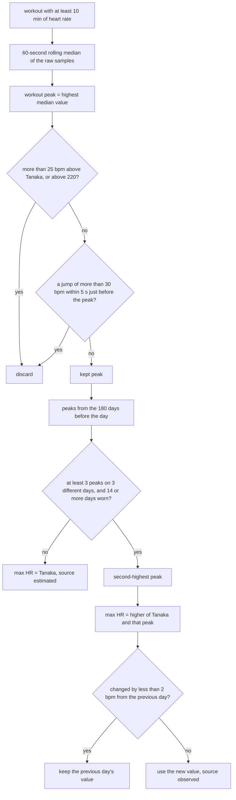

# Observed max heart rate

Pulse's max HR is the person's own (Settings), else Tanaka (208 − 0.7 × age). Age formulas miss individuals by about
±10 bpm (Nes 2013: SEE 10.8 bpm), and max HR sets every heart-rate zone and Strain's heart-rate reserve. This plan
raises max HR from what the band actually records in workouts, the way WHOOP and Garmin do. It finishes finding 3 of
`docs/research/strain-load.md`. `estimateHRmax` in `src/core/scoring/strain.ts` was ported from noop for this and is
never called. This plan replaces it with a stricter rule.

Google is no help here. Its `daily-heart-rate-zones` decode to its daily resting HR plus 220 − age, at 40/60/85% of
the reserve, with fixed 30 and 220 ends (see `docs/data-notes.md`). It holds no measured maximum.

## Summary

| | Today | After |
|---|---|---|
| Max HR | Settings, else Tanaka | Settings, else the higher of Tanaka and an observed workout peak |
| Sources shown in Settings | `set`, `estimated` | `set`, `observed` (with the workout and date), `estimated` |
| Per day | one max HR for all history | each day uses the peaks recorded before it, so history never shifts |
| Zones and Strain | from that max | the same formulas, fed the new max |

## The rule

1. **Where a peak can come from: workouts only.** Spikes at rest are almost always optical noise: arm movement, a
   loose band. A workout counts with at least 10 minutes of heart rate.
2. **Smoothing.** Take a 60-second rolling median of the raw samples. The workout's peak is the highest median value,
   so a single spiky second cannot set it.
3. **Plausibility.** Discard a peak more than 25 bpm above Tanaka, or above 220. Also discard it if the heart rate
   jumped more than 30 bpm within 5 seconds just before it (an artifact, not effort).
4. **Minimum data.** Use observation only with at least 3 kept peaks on 3 different days in the window, and at least
   14 days worn overall. New users stay on Tanaka, labelled "estimated", until then.
5. **Value.** Take the **second-highest** kept peak, so a maximum must show up on two separate days.
   Max HR = max(Tanaka, that peak): observation only raises the formula.
6. **Window.** 180 days before the day. Old peaks drop out, so after months without hard efforts max HR drifts back
   toward the formula, never below it.
7. **Stability.** Keep the previous day's value when the new one differs by less than 2 bpm, so zones don't wobble
   from day to day.
8. **Causal.** Day *d* uses only peaks recorded before *d*. A day's zones and Strain never change after the fact; a
   new hard workout moves only the days after it.
9. **Priority.** The Settings value always wins (lab test, beta-blockers, a known value). Then observed, then Tanaka.

Tunables (one place, `src/core/scoring/maxHr.ts`): window 180 days, minimum 3 peaks and 14 worn days, the +25 bpm
cap, the 30 bpm / 5 s jump test, the 2 bpm hysteresis, and the 10-minute workout minimum.

## Build

### Core (pure, tested)

- New `src/core/scoring/maxHr.ts`:
  - `workoutPeak(samples)`: the 60-second rolling-median peak and the jump test. Returns `{ bpm, ok }` or `null`.
  - `resolveMaxHr({ day, age, peaks, wornDays, previous })`: steps 3 to 7. Returns `{ maxHr, source: "observed" | "estimated", from?: { activityId, day } }`.
- Delete `estimateHRmax`, `hrmaxMinSamples` and `hrmaxPercentile` from `strain.ts`, along with their test (replaced).
- Tests in `maxHr.test.ts`:
  - a single spike is ignored;
  - one high workout is not enough, two on different days are;
  - the +25 cap and the jump test reject;
  - fewer than 3 days stays on Tanaka;
  - old peaks expire after 180 days;
  - a change under 2 bpm is held;
  - the result never goes below Tanaka;
  - the Settings value wins.

### Pipeline

Today `stage1` takes one `opts.profile.maxHr` for every day. With this plan, max HR is resolved per day before zones
and Strain need it:

1. In `stage1Day`, each activity also stores its `peak` (`workoutPeak`), in `daily_scores.activities[]`. A peak does
   not depend on max HR, so storing it creates no loop.
2. A pass in date order, before scoring each day, collects the stored peaks of the previous 180 days and calls
   `resolveMaxHr`. The result goes into the day's `s1.maxHr` plus a new `s1.maxHrSource`. Zones and Strain read the
   day's value instead of the profile's.
3. The stage-1 key (`stage1Key`) swaps `opts.profile.maxHr` for the day's resolved max, so a new peak recomputes only
   the days after it.
4. `profile.maxHr` remains the Settings value or Tanaka. The per-day value lives in `daily_scores`.
5. Bump `SCORING_VERSION` to 9 and pin `GOLDEN[9]`. Expected moves: `strain`, `activities` and `healthspan` (zones
   1-3 / 4-5), plus whatever reads Strain (training load, Strain Target), since the demo will now learn a max HR.
   Check that the demo's seeded workouts produce a sensible observed max, and say in the commit why each fingerprint
   moved.

### App

- **Settings › Max heart rate:** "189 bpm, observed (Run, Sep 12)", "estimated from age", or "set by you". Read the
  latest day's `s1.maxHr` and `s1.maxHrSource`; fall back to the profile's value with no scored day.
- **How it works:** the Max heart rate entry and the Strain "Limits" paragraph explain the rule in one or two
  sentences.
- **Zone note** (`zoneNote`): "Zones on your heart-rate reserve: resting 67 to max 189 bpm (observed)."

### Docs

- `docs/research/strain-load.md`, finding 3: mark it done and note the stricter rule (second-highest peak, causal, 3 days).
- `docs/design/charts.md` "Heart-rate zones": the max-HR box in the flowchart.
- `docs/design/spec.md` GZ1: the max-HR source.
- `docs/data-notes.md`: nothing new from Google.

## Rollout

1. Build locally. Recompute users 1 and 3 and compare each user's observed max with what their workouts suggest.
2. Restart the local dev server after the version bump: its worker singleton keeps the old code.
3. Deploy. The worker recomputes users with a live Google grant one at a time. Users without one update when they
   reconnect.
4. On production, check that nobody's observed max sits at the +25 cap. That would mean the artifact filter is
   letting spikes through.

## Risks

- **Too few hard workouts.** People who never push stay on Tanaka. That's acceptable: the formula is the fallback.
- **Rules too strict for sparse sampling.** If Google's heart rate inside workouts is under about 1 sample per 5 s, the
  jump test sees nothing. Check the real sample interval inside exercises before the first deploy.
- **A first run after months off.** The observed max can only rise, so an old peak can keep it above what someone
  reaches today until it expires. The 180-day window bounds that.
- **Strain goes down a little** for people whose max rises, because their reserve grows. Say so in the release note.

## Out of scope

- Detecting max-HR tests or races specially.
- Lowering max HR below the formula (would need medical context).
- Resting HR changes (finding 4 of `strain-load.md`): a separate plan.
