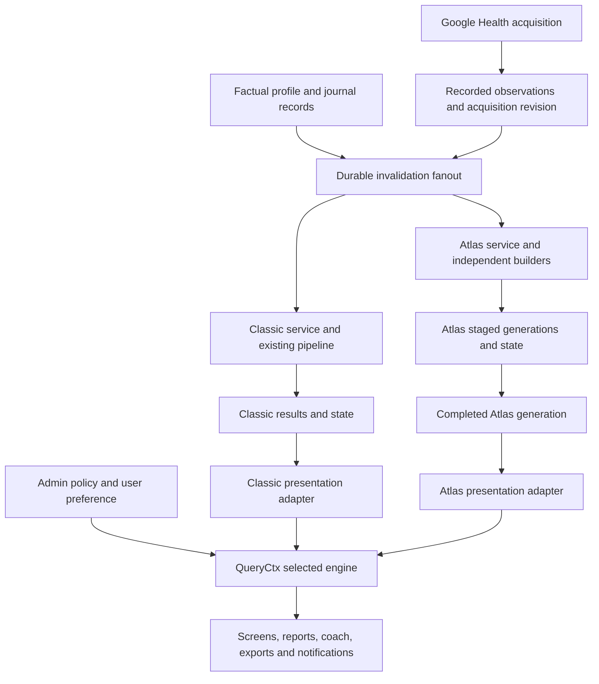
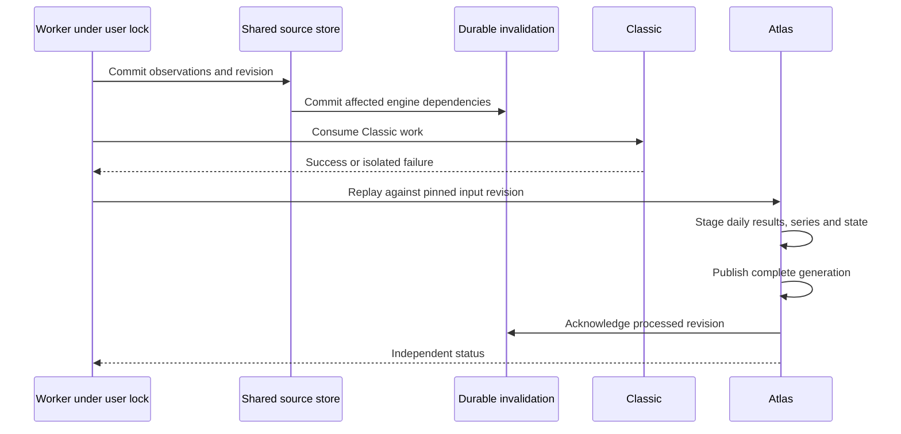

# Atlas Scoring Engine - Plan

## Goal Capsule

Objective: Users can choose between Pulse's current scores and a second scoring system, including additional metrics where inputs and recovered methods support them.

Means: Introduce an independent Atlas engine and route complete result sets through engine-specific adapters (KTD1, KTD2, KTD5).

Authority: User requirements govern product behavior. Repository rules govern causality, privacy, authentication and honest metric states. The audited source build governs recovered methods only to the extent supported by evidence. This plan defines implementation choices within those constraints.

Execution: This document plans future code changes. Implement infrastructure and experimental metric slices first. Production equivalence is a separate, per-metric gate. Do not claim a complete replica while required preprocessing, history or reference outputs remain unknown. A future implementation request authorizes execution, not this planning request alone.

## Product Contract

### Summary

Call the second engine Atlas. Use `AtlasScoreService`, engine ID `atlas`, and settings labels Classic / Atlas. Classic contains current noop-derived and Pulse algorithms. Atlas owns independent preprocessing, formulas, baselines, state, results and presentation adapters. Admins control availability and the default; permitted users select their preferred engine.

### Problem Frame

Replacing individual formula calls would leave scores tied to Classic inputs, historical folds, scale conversions and caches. That would create mixed outputs and make parity impossible to assess. The recovered package supplies useful kernels and additional leads, but no complete runtime-validated replica yet exists.

### Requirements

#### Engine ownership

- R1. Atlas must compute independently of Classic derived inputs, formulas, baselines and state.
- R2. Existing Classic outputs must retain their current numeric behavior.
- R3. A selected engine must own the displayed scores, histories, contributors and derived series for that request.
- R4. Shipped implementation names and UI must use neutral Pulse terminology, while private research retains accurate source provenance.

#### Selection and availability

- R5. Admins can enable Atlas, choose the server default and permit user selection.
- R6. Permitted users can choose Classic, Atlas or the server default without triggering a second source pull.
- R7. Missing, pending, unsupported and experimental metrics must have honest states rather than fabricated numbers or silent Classic substitution.
- R8. Selection must preserve historical results for both engines and allow a return to Classic.

#### Data and metrics

- R9. Input eligibility must distinguish connector support, observed device records and verified reference-input equivalence.
- R10. Every recovered output family must have a capability entry describing required inputs, recovery status and implementation status.
- R11. Atlas must preserve native units, ranges, precision and sampling cadence until a verified presentation rule converts them.
- R12. Late data, profile corrections and method changes must trigger independent, causal replay.
- R13. Each production equivalence claim requires reference-build input/output evidence beyond static kernel tests.

#### Product integration

- R14. Reports, journal associations, coach, exports and notifications must use the resolved engine consistently.
- R15. Per-user isolation, account switching, deletion and server-side authorization must cover all new stores and actions.
- R16. New metric screens and settings must follow existing UI states and update the landing site in the same change.

### Actors and flows

An admin controls engine policy. A user controls preference only when policy permits it. The existing worker acquires observations once and schedules independent scoring work. Researchers supply versioned parity fixtures without putting private health payloads in logs or public artifacts.

F1. Import observations, publish an acquisition revision, invalidate each affected engine, then compute both enabled engines (R1, R12).

F2. Resolve policy and user preference once, pin a result generation, and read all requested views through that engine's adapter (R3, R5, R6).

F3. Add a metric as experimental, validate its whole path against reference examples, then promote that specific implementation after its gate passes (R7, R13).

### Acceptance examples

- AE1. Switching Classic to Atlas changes recovery, its trend and its contributor explanation together; it does not reuse a Classic recovery driver (R3).
- AE2. An Atlas replay fails after writing staged series. Classic remains available, and readers see the last completed Atlas generation with an explicit stale state (R7, R8).
- AE3. A food metric without food or glucose records says the required data is unavailable. Air heart-rate data does not become a food score (R7, R9).
- AE4. A corrected night invalidates each dependent engine even if Classic already acknowledged its own dirty work (R12).
- AE5. An unauthorized preference request cannot enable Atlas or select another user's results (R5, R15).

### Scope and dependencies

In scope: two engines, independent replay/storage, selectable complete views, an 18-family capability catalogue, incremental Atlas implementations and per-metric validation.

Deferred: side-by-side comparison UI, hybrid scoring, automatic engine recommendation, distributed parallel replay, moving all Classic modules, and inventing unrecovered formulas. Pulse-native features without a recovered counterpart remain separately identified product features. When they depend on scores, they need an explicit selected-engine adapter; otherwise they are unavailable in Atlas mode.

There is no foundation blocker. Exact-replica releases depend on recovering missing builders and obtaining reference examples. The user's observation that the source app displays outputs with Air is a test target, not evidence that every displayed value uses only Air observations.

## Planning Contract

### Key technical decisions

- KTD1. Keep Classic modules in their existing locations behind a thin `ClassicScoreService`; create Atlas under `src/core/atlas/` and `src/server/scoring/atlas/` (R1, R2). Moving Classic internals would add regression risk without improving Atlas independence.
- KTD2. Use separate `atlas_*` result, series, replay and state tables (R1, R8). Existing `daily_scores` and `intraday_series` keys cannot hold two engines, and shared mutable folds would break ownership.
- KTD3. Share acquisition and factual profile observations, with typed provenance-preserving records where current storage is insufficient (R9). Atlas independently resolves profile defaults, units, filtering and aggregation.
- KTD4. Fan out durable invalidation before either engine acknowledges its work; retain the existing per-user worker lock (R12). Catch scoring failures per engine so a successful source pull or Classic run survives Atlas failure.
- KTD5. Resolve an engine and completed generation in `QueryCtx`, then use engine-specific presentation adapters (R3, R11, R14). Atlas rows must not be cast to Classic row shapes.
- KTD6. Store selection in a dedicated per-user `scoring_preferences` table and policy in `server_settings` (R5, R6, R15). Preference changes are read configuration, not profile edits that invalidate all scores.
- KTD7. Version Atlas formulas, preprocessing, state schema and calculation settings independently (R12, R13). Immutable completed generations make a failed or interrupted rebuild distinguishable from current results.
- KTD8. Maintain two distinct evidence dimensions: static recovery confidence and runtime parity status (R10, R13). Synthetic fixtures establish implementation correctness against transcribed methods, not source-app equivalence.

Atlas is the proposed neutral name. No user approval of this particular name is assumed. Complete separation and selectable engines are user-directed requirements; private provenance is retained rather than obscured.

### Current integration facts

| Existing location | Relevant constraint |
|---|---|
| `src/server/pipeline/types.ts` | One global Classic scoring version, currently 8 |
| `src/server/pipeline/stage1.ts` | Derives zones, masks, effort and session inputs using Classic methods |
| `src/server/pipeline/stage2.ts` | Owns Classic causal fold and clears user dirty rows |
| `src/server/db/schema.ts` | Daily results, series and reports have no engine key |
| `src/server/sources/google/client.ts` | Compressed raw pages expire after seven days |
| `src/server/samples.ts` | Stored HR and merged steps have reduced precision/provenance |
| `src/server/sources/google/sync.ts` | Extra/record jobs currently do not mark score changes |
| `src/server/profile.ts` | Resolved max HR includes a Classic estimate; latest height is not historical height |
| `src/server/queries/common.ts` | Context has no engine; display helpers assume Classic scales |
| `src/server/queries/recovery.ts` | Direct Classic driver/constants dependencies |
| `src/server/worker.ts` | Shared acquisition and per-user advisory lock already exist |
| `src/server/actions/admin.ts` | Actions authenticate and check admin themselves |

Further direct consumers include queries for reports, journal, health, settings and home, plus `src/server/push.ts`, `src/server/export.ts` and `src/server/coach/`. These require explicit routing, not just changes to `loadDays`.

### Ownership and proposed layout

All paths below are proposed additions except the existing pipeline.

```text
src/core/atlas/
  types.ts                 native inputs, outputs, units and states
  version.ts               method/preprocessing/state versions
  math/                    recovered numerical primitives
  inputs/                  filtering, aggregation and context builders
  baselines/               independent history models
  metrics/                 one module per output family
  state/                   causal fold and checkpoint definitions
src/server/scoring/
  contracts.ts             orchestration and presentation interfaces
  registry.ts              installed services and capabilities
  selection.ts             immutable request selection
  settings.ts              policy and per-user preference
  orchestrator.ts          shared acquisition revision fanout
  classic/service.ts       wrapper around existing pipeline
  classic/presentation.ts  adapter for existing results
  atlas/service.ts         AtlasScoreService
  atlas/input-repository.ts
  atlas/result-repository.ts
  atlas/runner.ts
  atlas/presentation.ts
src/server/db/atlas-schema.ts
src/server/db/scoring-schema.ts
src/server/pipeline/        existing Classic implementation
```

Shared contracts must not import Classic algorithm types. Atlas must not import `src/core/scoring/`, `src/core/algorithms/` or `src/server/pipeline/`. Neutral time and quantity helpers can be shared only if they contain no calibration, baseline or score policy. Enforce the boundary with an import check.



### Storage, publication and replay

KTD2 and KTD7 use these proposed stores:

| Store | Purpose and key |
|---|---|
| `atlas_score_generations` | User, generation, input revision, versions, settings hash, run status and publication metadata |
| `atlas_daily_scores` | User/generation/day, native typed outputs and per-metric state |
| `atlas_activity_scores` | User/generation/source activity identity |
| `atlas_intraday_series` | User/generation/day/kind, explicit timestamps, units and cadence |
| `atlas_dirty_days` | User/day, earliest dependency and invalidation revision |
| `scoring_preferences` | User, inherited or explicit engine preference |
| `health_observations` | Typed retained fields required beyond current lossy sample tables, source identity and revision |

Start with full Atlas replay from retained inputs. Add `atlas_state_checkpoints` only if measured history cost warrants it. Checkpoints must use the same versions/settings identity and invalidate from the earliest changed dependency. They are an optimization, not the sole authoritative history.

Publish the generation pointer only after its complete replay transaction succeeds. A request pins that generation. A selected engine with no completed generation renders pending states. A retained older generation includes its as-of revision and stale status. Preference does not silently revert when output is unavailable.

Initially stage all Atlas results for a full user generation. Avoid incremental copy-on-write complexity until full versus incremental equivalence is demonstrated. Later incremental computation can assemble a complete new generation from unchanged validated outputs plus the replayed suffix, with explicit lineage and one publication step.



Profile changes, journals, body/food/glucose records, settings changes, account switching and live pulls need dependency-aware invalidation. A later observation may alter a past day only when it corrects that day's inputs; later days cannot leak into earlier baselines. Use each calculation day's age and available historical profile facts. Any adaptation from an unrecovered or noncausal source path must be identified as a deviation.

Add all source-dependent tables to `SYNCED_TABLES` or the equivalent audited account-switch cleanup. Apply per-user foreign keys and cascades. Staged unpublished generations need bounded cleanup and crash recovery without deleting the last published results.

### Selection policy

Initial policy is Classic default, Atlas disabled, user selection disabled. Admins can enable experimental Atlas before any metric is promoted to parity-validated status. Engine availability is separate from metric confidence.

| Condition | Effective engine |
|---|---|
| User override allowed and selected engine enabled | User preference |
| No allowed user override | Admin default |
| Policy missing | Classic |
| Attempt to set disabled or unauthorized engine | Reject action |
| Previously selected engine subsequently disabled | Resolve admin default and explain policy change |
| Enabled engine lacks data or implementation | Retain selection, show reason state |

The server validates policy updates so its default is enabled. Only an administrator can change availability. Admin screens display operational metadata, never scores or health data. Selection is independent of input-calculation settings and never erases history.

### Metric scope and release map

These are 18 discovered output families, not a complete inventory of every app field. Contributors, registry rows, aliases, display variants and helper kernels do not add families. All full paths remain partial. This table is a work catalogue, not permission to fill unknown logic with guesses.

| Family | Current counterpart | Recovered anchor | Next prerequisite |
|---|---|---|---|
| Recovery | Recovery | Weighted normalized HRV/RHR/sleep with optional penalties | Context, baseline windows, eligibility and optional branches |
| Daily Strain | Effort/strain | Steps plus nonlinear time-in-zone kernel | Zone construction, sample handling and final display clipping |
| Sleep Score | Sleep | Six nonlinear weighted components | Component builders, selected session and targets |
| Stress | Stress | HR CDF with optional HRV combination | Exact context, historical windows and intraday inputs |
| Energy Bank | Energy Bank | Six-minute charge/drain updates | Seed, interval gaps, rollover and clipping |
| Biological Age | Pulse Age | Hazard-based physiological/lifestyle aggregate | Units, optional inputs, confidence and history |
| Cardio Load | Training load | Distinct ATL/CTL recurrences | Input TRIMP, range and initial state |
| Sleep Bank | Sleep debt/bank | Seven-slot exponential signed-minute fold | Slot ordering, naps and goal assignment |
| Sleep Consistency | SRI | Pairwise daily sleep-mask agreement | Mask construction, wear handling and DST |
| Sleep Needed | Sleep planner | Bank/strain adjustments and goal paths | Automatic goal estimator and caller dependencies |
| Target Strain | Strain target | Cumulative fields and helper leads | Main producer and dependency order |
| HR Recovery | HR recovery | Maximum-drop pair selector | Upstream eligibility, workout windows and aggregation |
| Muscular Load | None | Strength/cardio contribution leads | Cardio-only allocation and personalization |
| Muscular Freshness | None | Decay/capacity/muscle score kernels | Calibration, allocation and full history |
| Food Glucose | None | Meal-aligned peak/AUC/normalization | Meal logs and glucose series |
| Food Quality | None | Category/nutrient contributor kernels | Classification, amounts and serving basis |
| Daily Nutrition | None | Model and overall-score state found | Main formula and nutrition records |
| TDEE | None | BMR/thermic energy/fallback arithmetic | Body profile, activity/nutrition source and window |

Counting baseline: 12 counterpart benchmark targets comprise 11 mapped-core candidates plus one partial Biological Age candidate. The remaining six comprise two muscular cardio-only leads and four families with additional full-model inputs. There are zero proven new Air-compatible full paths, zero runtime-validated replicas and zero production replacements supported by the current audit.

A fallback TDEE path or reduced Biological Age model might produce values without every full-model input. Eligibility must follow recovered branches and actual records, not a blanket assumption that missing nutrition or labs always blocks a score.

Prioritize capability mapping and well-supported kernel fixtures first. Recovery, sleep bank/consistency, HR recovery, load and TDEE offer bounded kernel work. Stress, strain, sleep and Energy Bank require deeper builders/state. Sleep Needed, Target Strain and muscular models need more producer/caller recovery. Food and nutrition paths depend on additional inputs. No group is promoted solely because its kernel is easy to port.

### Input and numeric rules

For R9, retain sample type, measurement method, original unit/value, timestamps, source/device identity, revision and missingness where provided. Record separately whether an input is mapped, observed from Air, or proven equivalent to the source build's input. Do not substitute SDNN for RMSSD or a Classic derived RHR for a recovered context calculation. Source-app server preprocessing may not be present in the IPA.

The existing raw-page retention and historical sample loss require an explicit coverage marker. Backfill through supported API paths where possible. Where original precision/provenance cannot be recovered, mark those periods unsuitable for strict parity rather than treating Classic-derived caches as raw input.

For R11, test source floating-point width, `atanf` behavior, branch comparisons, clipping and rounding. Use Float32 emulation at verified conversion boundaries only. Do not force all Atlas results into Classic's 0-100 effort schema or apply `toStrainScale` indiscriminately. The local strain kernel lacks a verified 100 cap, Atlas stress differs from Classic's 0-3 scale, and consistency differs from Phillips SRI. Preserve explicit series timestamps instead of assuming one-minute bins.

Calculation contexts discovered in metadata, including sleep scope and HRV/RHR methods, must be traced before implementing configurable variants. Freeze one supported configuration first. Unrecovered options remain unavailable rather than receiving invented defaults.

### Open questions

| Question | Impact | Resolution path |
|---|---|---|
| Exact source-server normalization for Google records | Blocks strict input parity | Capture normalized reference inputs or compare source exports with paired Google records |
| Patched dylib effects in audited package | Blocks claim of pristine official-build parity | Attribute hooks or obtain an authorized matching unmodified reference build |
| Source baselines, history, goal estimators and state seeds | Blocks affected metric promotions | Trace callers, persisted models and controlled reference trajectories |
| Air-specific input availability and origin for each account | Blocks input eligibility claims | Inspect redacted typed records/provenance, not connector docs alone |
| Runtime reference access/examples | Blocks equivalence validation | Obtain authorized component/daily/intraday outputs with matched history and settings |
| Final name Atlas | Deferred, reversible | Rename namespace before implementation if user prefers another name |

The first five block corresponding claims or metric releases. They do not block building the isolated engine framework or explicitly experimental recovered kernels.

## Implementation Units

| Unit | Outcome | Depends on |
|---|---|---|
| U1 | Ownership contracts and capability catalogue | None |
| U2 | Retained inputs and durable invalidation | U1 |
| U3 | Independent stores and generation publication | U1 |
| U4 | Dual-engine orchestration | U2, U3 |
| U5 | Policy, preference and request selection | U3, U4 |
| U6 | Atlas builders and causal replay | U2, U3 |
| U7 | Recovered metric slices and reference fixtures | U6 |
| U8 | Complete selected-engine presentation | U5, U7 |
| U9 | Secondary consumers and product features | U8 |
| U10 | Release validation, site and rollback | U4-U9 |

### U1. Contracts, boundaries and catalogue

Goal: Define independent engine ownership and assessable metric capabilities.

Requirements: R1, R2, R4, R10, R11. Dependencies: none.

Files: proposed core/server namespaces from the layout; proposed `src/server/scoring/registry.test.ts`; existing pipeline golden/parity tests as baseline.

Approach: Implement KTD1 and KTD8. The orchestration contract exposes identity, versions, dependencies, recompute and read adapters. Presentation results carry value, reason, provisional status, unit/range, engine, generation and confidence. Keep static confidence separate from runtime parity. Populate exactly the 18-family catalogue and explicit Pulse-native entries outside that count.

Patterns: Pure core functions; nullable metric envelope from `src/lib/reasons.ts`; Classic wrapper leaves existing modules intact.

Test scenarios: Atlas forbidden import detected; capability aliases do not inflate counts; Classic wrapper preserves existing outputs.

Verification: Existing Classic goldens pass unchanged, import boundary check passes, and each family has input/method/output/unknown/provenance fields. Package-neutral code uses opaque evidence IDs linked to a verified private manifest with source hashes, symbol addresses, offsets and build identity. Do not rename or delete the existing research archive during this unit without preserving that mapping.

### U2. Acquisition coverage and invalidation

Goal: Provide sufficient recorded observations and independently acknowledged changes.

Requirements: R9, R12, R15. Dependency: U1.

Files: `src/server/sources/google/{client,map,write,sync}.ts`, `src/server/samples.ts`, `src/server/profile.ts`, `src/server/actions/journal.ts`; proposed `src/server/scoring/invalidation.ts` and observation repository/tests.

Approach: Implement KTD3 and KTD4. Audit each dependency against current connector output and retained metadata. Persist required typed observations before raw-page pruning. Extend extra/record/live/profile/journal invalidation only for affected dependencies. Keep Classic writes compatible. Backfill supported historical fields under existing quota control; store coverage gaps explicitly.

Patterns: Existing Google mapping fixtures, source-write transactions and UTC/local-day helpers.

Test scenarios: Corrected sample, deleted sample, duplicate source, same-day live update, food-only update, missing HRV method, account switch and unavailable backfill.

Verification: Both engine queues retain work after either acknowledgement. Partial retrieval cannot become zero or device-confirmed data. Account switching clears owned observations and derived outputs without crossing users.

### U3. Storage and publication

Goal: Store and publish Atlas results without exposing partial generations.

Requirements: R1, R7, R8, R12, R15. Dependency: U1.

Files: proposed `src/server/db/{atlas-schema,scoring-schema}.ts`; `src/server/db/schema.ts`; generated migrations; proposed Atlas repository/tests; `src/server/testing.ts`, schema tests.

Approach: Implement KTD2 and KTD7 using the storage table above. Integrate new table definitions without circular schema dependencies. Stage replay outputs under a new generation, then atomically publish and acknowledge its processed invalidation revision. Bound orphan-generation retention. Acknowledge only revisions actually consumed.

Patterns: Drizzle migrations, PGlite temporary database tests, existing user FK/cascade and `SYNCED_TABLES`.

Test scenarios: Crash before publication, transaction failure, new invalidation arriving during a run, retry, two users, source switch and deletion.

Verification: No reader can see mixed generation IDs across daily/activity/series data. The previous published generation remains readable through failed rebuilds. New tables pass isolation and cleanup checks.

### U4. Dual-engine worker

Goal: Compute both engines from one acquisition without shared failure state.

Requirements: R2, R6, R8, R12. Dependencies: U2, U3.

Files: `src/server/worker.ts`, worker tests, pipeline index/types; proposed `src/server/scoring/{orchestrator,classic/service,atlas/service}.ts` and tests.

Approach: Replace the worker's direct Classic callback with the neutral dispatcher. Keep the existing user lock and source scheduling. Execute independently versioned services against the same committed acquisition revision. Atlas disabled means no Atlas compute. Enabled Atlas computes independently of the displayed preference. Record per-engine operational status without health payloads.

Patterns: Existing advisory lock, force-run coalescing and worker dependency injection.

Test scenarios: Atlas throws; Classic throws; source pull fails; duplicate force requests; replay restart; disabled Atlas; live pull invalidation.

Verification: One source pull per worker request. One engine failure does not skip the other service or erase pending work. Existing Classic incremental behavior and goldens remain stable.

### U5. Admin policy and user preference

Goal: Make engine choice authorized, predictable and reversible.

Requirements: R5-R8, R15, R16. Dependencies: U3, U4.

Files: proposed scoring settings/selection/actions and tests; proposed `src/app/admin/scoring/page.tsx` and client controls; `src/app/admin/AdminNav.tsx`, admin gate/actions patterns; settings query and current user settings UI.

Approach: Implement KTD6 and the selection table. Authenticate every action and enforce admin/user policy on the server. Add inherited/default preference. Resolve selection in the request context and revalidate settings/layout when it changes. Atlas experimental availability includes a plain label distinct from data calibration.

Patterns: Existing admin mode controls and settings server actions. Read installed Next.js guides before implementing route/action/cache changes.

Test scenarios: Forged engine ID, non-admin policy write, user override denied, default disabled, default changed, cross-user preference write and browser refresh.

Verification: Admin page shows metadata only. Preference updates neither source data nor score history. Selection persists and unauthorized choices fail server-side.

### U6. Atlas input builders and replay

Goal: Establish an independent causal input/state path before metric rollout.

Requirements: R1, R9, R11, R12. Dependencies: U2, U3.

Files: proposed `src/core/atlas/{inputs,baselines,state}/`; Atlas input repository and runner; unit and temporary-DB replay tests.

Approach: Implement traced builders with unit/provenance contracts and a dependency DAG. Resolve raw profile observations independently. Start oldest-first full replay with pre-day baseline reads and explicitly timed state updates. Recover sleep/goal/strain dependency order before enabling coupled outputs. Unrecovered builders return a capability reason.

Patterns: Existing causal tests are behavioral examples, not reusable Classic folds.

Test scenarios: Short history, zero variance, duplicate sleep, naps, DST, nonwear gaps, unsorted upstream HR, corrected profile and future records appended.

Verification: Adding a future day does not alter earlier outputs. Full replay is deterministic. Historical profile resolution cannot use a later height or current age without an identified deviation.

### U7. Per-metric implementations and reference validation

Goal: Implement recovered slices with evidence-backed promotion decisions.

Requirements: R7, R9-R13. Dependency: U6.

Files: proposed `src/core/atlas/metrics/` modules and colocated tests; proposed private-fixture harness and neutral method manifest.

Approach: Execute the metric release map one vertical slice at a time: input builder, baseline/state, kernel, output gate, presentation metadata and fixtures. Verify constants, floating-point operations, branches and units against the archived disassembly/tables. Keep approximate or unknown paths explicitly experimental. Do not include guessed code as a recovered implementation.

Patterns: Pure algorithm golden/property tests and independently generated fixture expectations.

Test scenarios: Nil versus zero, thresholds immediately below/at/above, optional contributors, zero SD, rounding ties, minimum history, historical update and day boundaries. Include negative HR recovery candidates, strain above an assumed display maximum and TDEE fallback paths.

Verification: Every implemented branch has provenance and a meaningful fixture. Promotion follows the Verification Contract. A metric with only static tests retains runtime parity status `not_tested`.

### U8. Screens, scales and series adapters

Goal: Display one engine coherently across home, detail, activities and trends.

Requirements: R3, R7, R11, R16. Dependencies: U5, U7.

Files: `src/server/queries/{common,types,home,recovery,sleep,strain,stress,energy,health}.ts` where present; all actual activity/trend query paths discovered during implementation; proposed presentation adapters; metric/chart components, app routes and `src/lib/reasons.ts`.

Approach: Implement KTD5. Audit direct table reads and Classic constants across all queries. Add appropriate reason codes for unrecovered algorithm, missing required input and pending computation. Ensure `provisional` does not falsely imply parity. Update calibration/tag copy that currently assumes Classic baseline durations. Use native ranges and timestamps from each adapter. Expose new metric navigation only when catalogue eligibility and implementation allow it.

Patterns: `MetricState`, existing shells and kit components; no new CSS files.

Test scenarios: Whole-screen switch, missing generation, stale output, native strain/stress ranges, six-minute series, metric contributors and all five UI states.

Verification: No Atlas screen applies Classic scale conversions or drivers. A selected request cannot combine different engines or generations. Unimplemented metrics render a specific reason.

### U9. Reports, journal, coach, exports and notifications

Goal: Remove secondary paths that mix scoring methods.

Requirements: R3, R8, R14, R15. Dependency: U8.

Files: `src/server/queries/{reports,journal,settings,home}.ts`, report persistence, `src/server/coach/{tools,texts}.ts`, `src/server/export.ts`, `src/server/push.ts` and associated tests.

Approach: Route score-dependent consumers through pinned context. Keep Classic reports untouched and create Atlas-owned report storage or generation-qualified derived summaries. Key journal associations, report caches and notification deduplication by engine/version. Adapt coach scale descriptions and capture engine/version in conversation context. Export units and method identity. Unknown alert thresholds remain disabled for Atlas.

Patterns: Session-closed coach tools, existing per-user query tests, notification dedupe and report periods.

Test scenarios: Engine switch between chat turns, report rebuild, journal edit, export, duplicate notification and cross-user tool access.

Verification: No Classic thresholds or correlations silently describe Atlas values. Coach tool documentation matches its selected input/output units. Admin policy does not expose health data.

### U10. Release checks and rollback

Goal: Ship experimental capabilities safely and promote only justified replicas.

Requirements: R2-R4, R7-R9, R13, R15, R16. Dependencies: U4-U9.

Files: Existing pipeline/worker/query/isolation/e2e suites; new Atlas suites; `docs/design/spec.md`, neutral metric documentation; `site/src/data/metrics.ts`, `site/src/pages/index.astro`, site screenshots and tokens when changed.

Approach: Run the global verification gates, benchmark history replay and record supported input coverage. Verify deployment migration/backfill ordering on an isolated database. Exercise admin rollback to Classic while both histories remain intact. Keep source attribution and sensitive fixture inputs in the preserved private archive; scan shipped code/UI for unintended source-brand references without deleting provenance.

Patterns: Existing demo mode and landing screenshots; headed `agent-browser` for manual checks.

Test scenarios: Migration upgrade, restart mid-backfill, policy rollback, disabled metric, slow full history, data deletion and account change.

Verification: Check app/site at 390 px and 1440 px. Validate experimental claims independently from parity claims. Release only capabilities with matching evidence and honest unavailable states.

## Verification Contract

### Engineering gates

Before a future implementation commit, run `pnpm typecheck`, `pnpm lint` and `pnpm test`. Run `pnpm e2e` after UI changes. Generate migrations with `pnpm db:generate` and validate them through the existing temporary-DB test pattern. Algorithm additions get golden or property tests beside the implementation.

Maintain unchanged Classic golden/parity results. Add per-user and per-engine isolation, causality, source-account cleanup, crash/retry, selection authorization, generation consistency and full-versus-incremental replay tests. Test scale/cadence semantics in adapters, not only kernel arithmetic. Do not update Classic goldens to hide accidental changes.

Landing verification follows repository rules: demo app on port 3317, `pnpm screens` from `site/`, current feature copy and screenshots, matching theme tokens, phone and laptop checks. Clean comments on changed code before committing using the required skill when available.

### Per-metric parity gate

A reference fixture must identify source package/executable hash, build, hook status, calculation options, time zone, profile facts, normalized inputs, complete required prior history, initial state and actual outputs. Record whether the output came from a kernel harness, persisted calculation, debug export or visible UI. Screenshots alone prove only the displayed rounded value.

Compare in this order:

1. Raw-record correspondence and selected observations.
2. Units, filtering, aggregation, eligibility and missingness.
3. Baseline/history values and state before calculation.
4. Unrounded score and state after calculation.
5. Display conversion, clipping, rounding, contributor labels and series alignment.

Required cases include ordinary days, threshold boundaries, missing optional/required inputs, zero variance, calibration, naps/overlapping sleep, workout endings, daylight-saving changes, late correction and multi-day replay. Stateful outputs need trajectories and intermediate states, not one daily scalar. Seeded synthetic goldens and user-observed Air outputs are useful evidence, but insufficient without the matched inputs.

Establish per-output tolerances from the source numeric representation and display resolution before comparisons. Require exact branch/null/reason behavior where recoverable. Do not choose broad tolerances after inspecting failures. Report raw and displayed differences separately.

Promote a metric only when its input builder, formula, history/state and presentation are recovered or explicitly supported by reference evidence, and independent fixtures pass. Unresolved patch effects restrict the claim to the audited package. A faithful port need not be more accurate physiologically than Classic; evaluate practical quality separately from parity.

## Definition of Done

The foundation is done when U1-U6 pass their checks and an enabled Atlas can replay, publish and be selected without consuming Classic derived state. That is an infrastructure milestone, not a complete metric replacement.

Experimental rollout is done when each released Atlas slice passes U7-U10, its capability entry names missing evidence, and all affected screens and consumers respect the selected engine. Unimplemented families remain visible in the catalogue as gaps rather than being counted as supported.

A per-metric production replacement is done only after the parity gate passes and provenance identifies the tested source build. A complete source-equivalent service requires that gate for every claimed family and supported input configuration. Current evidence does not satisfy that milestone.

This planning task is done when this document records separation, routing, storage, input eligibility, implementation units and validation gates. It changes no app algorithms.

## Appendix

### Evidence baseline

Use the existing research inventory, audit manifest, verified tables and evidence archive as private source authorities. Link neutral shipped method IDs to their exact archived claims; preserve hashes and original evidence filenames in the private mapping. Do not treat untracked research files as a guaranteed durable archive until their storage is verified.

The audited package is version 3.1.7, build 2728. IPA SHA-256: `329886dda54e712799b3e913e6f717a1c4e6ddec921cf3f482e4329b02679af7`. Main executable SHA-256: `78c1c99c815163517c69a0bec10bd97b415e4b3b3c0d642132c13a43b366c083`. It is ARM64 and unencrypted, with linked patch dylibs whose effects remain unresolved. Those constraints belong in any parity report.

Two omissions would materially distort this plan: Google backend normalization is not fully recoverable from the local executable, and source identity/precision already lost from historical Pulse samples cannot be restored by adding another formula service. U2 and the reference gate handle those limitations explicitly.
