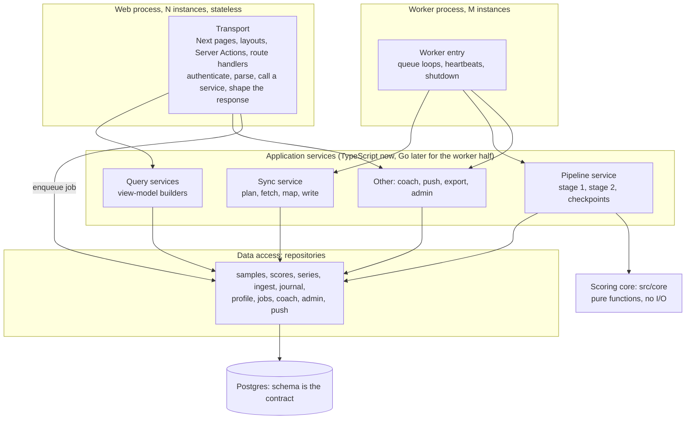
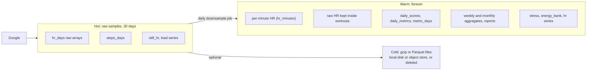
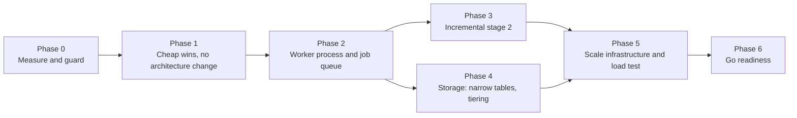

# Backend architecture plan: clean layers, 10k users, and a Go-ready core

Status: plan only. No code was changed. Written 2026-10-08 on branch `belevel/research`.

Builds on [`scale-10k-users.md`](scale-10k-users.md). **Webhooks are out of scope**: the owner deferred them (`scale-10k-users.md:127`), so every
change here works with polling. Describes today's system in
[`docs/architecture/system-design.md`](../architecture/system-design.md); citations such as "SD 8.1" point to its sections.

How to read it:

- Every claim about today's code has a `path:line` reference. A number is either **measured** (owner's local-dev measurements, or marked **[M-doc]** when I measured it for these two documents) or an **estimate** (arithmetic from stated inputs, always labelled).
- Where the code or a measurement does not settle something, it says "unknown" and the item is in [Unknowns](#unknowns).
- The plan contains no code. Interfaces appear as tables and field lists.

## Contents

0. [Findings that change the scale plan](#0-findings-that-change-the-scale-plan)
1. [Target architecture](#1-target-architecture)
2. [Language-neutral contracts for a Go port](#2-language-neutral-contracts-for-a-go-port)
3. [Concrete refactors](#3-concrete-refactors) (R1 to R14)
4. [Phased order and exit criteria](#4-phased-order-and-exit-criteria)
5. [Code-quality findings](#5-code-quality-findings)
- [Unknowns](#unknowns)

---

## 0. Findings that change the scale plan

Checked against the code. Each one changes a number or a step in `scale-10k-users.md`.

| # | The scale plan says | The code and measurements say | Effect |
|---|---|---|---|
| F1 | `loadDays` "reads all 13 JSON columns" (`:17`) | It reads 12 jsonb columns; `journal_impact` is not among them (`src/server/queries/common.ts:112-131`). Only `queries/journal.ts:56-58` reads `journal_impact`, and only the newest row. | Narrowing still pays, but the saving is 12 columns, not 13. |
| F2 | 10,000 users in 900 s is "90 ms per user, less than one Google round trip" (`:35`) | A steady-state run makes at least 34 requests (33 jobs plus `pairedDevices`: `sync.ts:69-92`, `:117`), paced 250 ms apart (`client.ts:17`). That is at least **8.5 s per user** before any latency or compute. A sequential cycle covers about 105 users per 15 minutes; 10,000 users would take about 23.6 hours. (Arithmetic from constants; Google latency not measured.) | The sequential cycle is already unable to finish at about 100 users, not at 10,000. The queue (R2) is the first scale blocker, ahead of compute. |
| F3 | Storage "about 47 KB per user-day: `hr_days` 18.5 KB (about 5,700 samples a day)" (`:29`) | The 18.5 KB is the `hr_days` table total (6,560 kB) divided by 363 `daily_scores` rows. The table has rows for **one** user: 183 rows, so **36.7 kB per heart-rate day** (6.5 bytes per sample; the columns alone are 4.7 bytes per sample). Those 5,676 samples per day are the generated demo seed (about one every 15 s). The data notes record about 37,000 heart-rate rows per day for a real Fitbit (`docs/data-notes.md`, "Cadence and volume") and a code comment says 86,000 is possible (`sync.ts:165-166`). | Real `hr_days` rows can be several times larger than any measured figure. Real density is the single biggest unknown for storage sizing (SD 8.3). It must be measured on production data in Phase 0. |
| F4 | Stage 2 "folds the WHOLE history every run" and recompute is about 120 ms | Correct, and it is worse than linear. **[M-doc]** A no-change recompute, stage 2 only, PGlite in-process on generated data: 180 days 209 ms, 360 days 480 ms, 720 days 1,246 ms (growth 2.3x then 2.6x per doubling). Causes: `scores.ts:293`, `readiness.ts:143`, `trainingLoad.ts:106-113`, `healthspan.ts:216`, `scores.ts:356`, `healthMonitor.ts:77` (SD 8.1). | Do the quadratic clean-up before the incremental fold; it is a pure refactor that goldens can check. |
| F5 | "Seed the fold from the stored row of the day before. ATL, CTL ... already stored per day" (`:121`) | Not enough. The stored `recovery.baselines` keep only `{mean, sd, status, nValid}` where `sd = 1.253 * spread` (`scores.ts:101-102`); the EWMA needs the exact `spread` and `nightsSinceUpdate` (`baselines.ts:62-117`). Five more baselines have no stored form at all (Health Monitor's per-vital baselines, the daytime-HR baseline). Training load restarts at the first day of the longest gap-free run (`trainingLoad.ts:127-140`). Healthspan needs the first-ever data day (`healthspan.ts:234`). | Incremental stage 2 needs a small stored **fold state** per day (R3), not just the previous row. |
| F6 | Phase 1.4 sets `staleTimes.dynamic`; 1.5 adds missing `loading.tsx`; 1.6 prunes the service-worker cache | Already done: `staleTimes: { dynamic: 60, static: 300 }` (`next.config.ts:12-15`); `loading.tsx` exists for `metric/[key]`, `activities`, `activity/[id]`, `reports`, `reports/[period]`; the per-build cache name is in `public/sw.js:5` but **uncommitted** (`git status`: `M public/sw.js`). | Remove 1.4 and 1.5. Commit 1.6 after checking the deployed worker. |
| F7 | `requestSync` on page load "should only mark the user as due" (`:111-112`) | True, but the larger issue is that **a journal check-in forces a full Google pull** per changed tag: `saveJournalEntry` calls `requestSync({force: true})` (`actions/journal.ts:55`), and `CheckIn.tsx:207-212` sends one action per changed tag. A full run is at least 34 requests (R5). | A cheap, high-value fix: a check-in needs stage 2 from one day, never a pull. |
| F8 | Journal impact is 0.8 to 1.8 KB per day "per week or on demand" | Pages read only the newest day's value; older days' values are a memo for stage 2 (`stage2.ts:133`, `journal.ts:53-63`). **[M-doc]** In a CPU profile of a 720-day full recompute, journal impact took about 5.4 s of the 6.8 s stage 2, and it is a synchronous loop (`stage2.ts:128-137`). | Journal impact needs its own cadence (R7), and must not run in the web process (R1). |
| F9 | `raw_payloads` "is already pruned" (`:169`) | Pruned at 7 days (`client.ts:125`) and **never read** by app code (SD 4.1). | Either use it (re-map recent data) or stop writing it (R7). |

---

## 1. Target architecture

### 1.1 Layers

The web tier reads stored results and enqueues work. The worker tier is the only writer of derived data. They meet at the database: the schema, the stored JSON payloads and the job table are the contract (section 2). That boundary is also the cut line for a Go port: the worker half moves first, the TypeScript web tier keeps reading the same tables.

### 1.2 Responsibilities, allowed dependencies, current violations

| Layer | Responsibility | May depend on | Must not depend on | Current violations (file:line) |
|---|---|---|---|---|
| **Scoring core** (`src/core`) | Pure functions from plain inputs to plain outputs. Defines the algorithms, config constants, and the shape of every stored score. Explicit state in, explicit state out. | the language's standard library only | Next, React, Drizzle, `pg`, `process.env`, the clock, randomness, `src/lib`, `src/server` | (1) `core/algorithms/coachSuggestions.ts:1` imports a type from `@/lib/reasons`, and `lib/reasons.ts:1` imports `lucide-react` icons, so a UI file owns `ReasonCode` and `Metric`. (2) `coachSuggestions.ts:15-24` and `core/algorithms/coaching.ts` hold user-facing copy, not algorithms. (3) The fold state is not a value: it is a mutable object that scorers push onto in a fixed order (`scores.ts:56-75`, `stage2.ts:70-120`). (4) Otherwise clean: no `Date.now`, no no-argument `new Date()`, no `Math.random`, no `process.env`, no `console` (checked by search). |
| **Data access** (`src/server/data/`, new) | The only code that imports Drizzle or writes SQL. One module per aggregate. Always takes a `userId`. Returns plain rows. Hides storage layout (arrays, jsonb, tiers). | Drizzle, `db/schema`, core types for payload shapes | services, transport, Next | No such layer exists. Drizzle or SQL appears in 27 non-test server files and in transport: `app/(app)/settings/actions.ts:4,9,24`, `app/export/coach/route.ts:1,4`, and pages `login/page.tsx:8`, `signup/page.tsx:8`, `onboarding/page.tsx:5`. Raw SQL strings in services: `pipeline/index.ts:37-42`, `profile.ts:73-74`, `queries/settings.ts:205-222`, `log.ts:100-111`, `journalTags.ts:41-47`, `sources/google/sync.ts:391-394` (reads `hr_days` outside `samples.ts`), `stage2.ts:143-144` and `sync.ts:261-263` (`sql.raw` column names). `samples.ts` is the one good example: all `hr_days` and `steps_days` access except `sync.ts:391-394` goes through it. |
| **Application services** (`sync`, `pipeline`, `queries`, `coach`, `push`, `export`, `admin`) | Use cases. Orchestrate repositories and core. Own transactions, idempotency and error policy. Query services build view models. | data access, core, config object passed in, a clock passed in | `next/*`, `react`, `globalThis`, `process.env`, other services' internals | `queries/common.ts:7-9` imports `next/navigation`, `react` and `../auth`; `common.ts:46-54` redirects (a transport act). `queries/settings.ts:11` re-exports `requestSync` from the worker; `settings.ts:231` reads `globalThis.__pulseWorker`. `pipeline/index.ts:20` is a module-level mutable record (`lastRun`) and `:30` logs with `console`. `pipeline/types.ts:2` imports `@/lib/reasons`. Config is read from a global singleton deep inside services: `push.ts:17,31,72,93,111`, `coach/store.ts:32,70,90`, `profile.ts:38` (default `today` from the clock). View-model builders carry UI copy: `queries/home.ts:119-139` (outlook sentences), `:141` (titles). |
| **Transport** (`src/app/**`) | Authenticate, validate, call one service function, shape the response, set headers. No business rules, no SQL. | services, repositories only through services | core algorithms directly | `(app)/layout.tsx:33` calls `requestSync` during render (a side effect that Next may also run on prefetch: `node_modules/next/dist/docs/01-app/02-guides/prefetching.md`, "Triggering unwanted side-effects"). Actions hold business logic: `actions/journal.ts:32-59` validates, writes, marks dirty and kicks the worker. `actions/log.ts:57-60` builds a Google client in the web tier. `sync/route.ts:15` waits on in-process worker memory. Direct DB: see data-access row. |
| **Worker process** (`src/server/worker/`, new entry) | Own the clock for background work: claim jobs, run them, heartbeat, retry, shut down cleanly. | services, repositories, config | Next, pages, the web process | `worker.ts` mixes the scheduler (`:42-140`), the lock (`:148-173`), startup wiring (`:180-224`), a `globalThis` registry (`:177`) and the web-facing API (`requestSync`, `pullHeartRate`, `syncAndWait`: `:230-260`). It is started from `instrumentation.ts:11` inside the web server. |

An import check enforces the table: an ESLint `no-restricted-imports` rule per layer, run in CI beside typecheck (`.github/workflows/ci.yml:34-35`). The Atlas plan proposes the same device (`2026-10-06-1805-feat-atlas-scoring-engine-plan.md`, "Ownership and proposed layout"); share one implementation.

### 1.3 What stays where in a Go port

| Component | First port? | Why |
|---|---|---|
| Google mappers (`map.ts`) | Yes | Pure, 402 lines, 19 fixtures already exist (`src/server/sources/google/__fixtures__`). |
| Google client, OAuth refresh, rate limiter | Yes (worker) | Network and time only. |
| Downsample job (R7) | Yes | New code, no TS legacy. |
| Stage 1 | Second | Pure over arrays; needs the zone, strain, stress and HR-recovery core modules. |
| Stage 2 and the core scorers | Third | Largest, depends on the fold state spec (R3, section 2). |
| View-model builders (`queries/*`) | Never, unless wanted | They carry UI copy and are tied to the screens; the TypeScript web tier keeps them. Only stored payload shapes cross the boundary. |
| Auth, admin, coach, push UI | Not planned | Web-tier concerns. Push sending can move with the worker later. |

---

## 2. Language-neutral contracts for a Go port

### 2.1 The database schema is the source of truth

- It already is: `src/server/db/schema.ts` generates `drizzle/*.sql`, and CI fails when they drift (`.github/workflows/ci.yml:36-44`). `schema.test.ts:11-42` pins the structural rule (user key first, cascade).
- Make the generated SQL the published contract: a Go worker reads the same `drizzle/*.sql` files through its own migrate-free client. **Only one process applies migrations** (the worker or a one-shot deploy step). Whether Drizzle's migrator is safe with two processes starting at once was not verified, so do not rely on it.
- Add `schema_version` to every JSON payload column that the worker writes and the web tier reads (below), so a column can change shape without a flag day.

### 2.2 JSON schemas for stored payloads and view models

- **Stored payloads.** The stored shapes are TypeScript types in `pipeline/types.ts:38-207`: `Stage1Day`, `Stage1Activity`, `RecoveryRow`, `SleepRow`, `StressRow`, `EnergyBankRow`, `TrainingLoadRow`, `StrainTargetRow`, `SleepPlannerRow`, `HealthMonitorRow`, `HealthspanRow`, `FitnessRow`, `JournalImpactRow`, and the series (`number | null` arrays of 1,440 values). Several rows are object spreads of core results: `scores.ts:335` (`...plan`), `:461-466` (`...healthMonitor(...)`), `:508-509` (`...hs`), `:527` (`...fitnessLevel(...)`). So the stored JSON is whatever the core returns today, and a new field in a core function changes stored data silently (the golden test is the only catch).
  - Pin each shape with a schema. The project already depends on zod 4 (`package.json`); Zod 4's JSON Schema export should produce the language-neutral file (**to verify**: I did not run it). Use the schemas in tests (every fixture payload validates), not on every read.
  - Replace the unchecked casts on read, `as Stage1Day | null` and similar (`queries/common.ts:167-179`, `stage2.ts:203-210`), with the same schema in development builds.
  - Reason codes and the `Metric` envelope (`lib/reasons.ts:5-26`) move to a pure types module (R10).
- **View models.** `queries/types.ts` (517 lines) is the web tier's contract with its own pages. It only needs a language-neutral schema if the view-model builders are ever ported (section 1.3 says they are not).
- **Versioning.** `SCORING_VERSION` (`types.ts:26`) stays the rule for "recompute everything". Split it as in R7 and R3: `STAGE1_VERSION` for per-sample outputs and `STAGE2_VERSION` for folds, plus a `payload_schema_version` per column family.

### 2.3 The job and queue contract

A table in Postgres, not a broker. Both languages claim and complete jobs with plain SQL.

| Field | Meaning |
|---|---|
| `id` | bigserial |
| `user_id` | owner; `ON DELETE CASCADE` |
| `type` | `sync`, `backfill`, `pipeline`, `downsample`, `notify`, `maintenance` |
| `key` | coalescing key, for example `sync:fast`, `pipeline`, `notify:recovery:2026-10-08`. Unique with `(user_id, type)` while the job is queued |
| `run_at` | due time, unix seconds |
| `priority` | smallint; app-open and user-requested above scheduled above backfill |
| `payload` | small JSON validated by a schema per `type` (for example `{from_day}` for `pipeline`) |
| `state` | `queued`, `running`, `done`, `dead` |
| `attempts`, `max_attempts` | retry accounting |
| `locked_by`, `lease_until` | worker id and lease expiry; a crashed worker's job returns to `queued` after the lease |
| `last_error` | status and code only, as `sync_state.last_error` today (`schema.ts:130-141`) |
| `created_at`, `finished_at` | for the observability queries in R12 |

Rules (the contract a second implementation must follow):

1. **Claim**: select due `queued` rows by `priority desc, run_at` with `FOR UPDATE SKIP LOCKED`, set `running`, `locked_by`, `lease_until`, in one statement.
2. **One running job per user and class**: enforced with a partial unique index (user, class) on `running` rows, replacing the advisory lock (`worker.ts:148-173`). The advisory lock may stay as belt and braces during migration.
3. **Heartbeat** extends `lease_until`. A job that outlives its lease may be claimed again, so every job type must be **idempotent**. All existing writes already are diff-only upserts (`sync.ts:253-275`, `stage2.ts:142-163`).
4. **Enqueue is an upsert on the key** that sets `run_at = least(run_at, requested)` and `priority = greatest(...)`. A page load, a journal check-in and "Sync now" all enqueue; none runs work in the web tier.
5. **Retry**: backoff by setting `run_at`; 429 sets `run_at` from `Retry-After`; `dead` after `max_attempts`, shown in Settings through `last_error`.
6. **Completion** deletes or marks `done`; a daily maintenance job removes finished rows older than seven days, so the table stays small.

The same table carries `pipeline` jobs, so "recompute from day D" is a first-class request (R3, R5).

### 2.4 Golden fixtures any implementation must reproduce

What exists:

- `golden.test.ts`: one fingerprint per `daily_scores` column, per series kind and for `reports`, for each `SCORING_VERSION` (`:15-158`), on the pinned 180-day demo database. Hash input is canonical JSON with sorted keys and numbers rounded to **10 significant digits** (`:160-175`).
- `parity.test.ts`: recovery, strain and sleep on every seeded day against an older snapshot, tolerance 1e-6 (`:11-27`).
- `incremental.test.ts`: a late night for day 200 then an incremental recompute equals a from-scratch recompute byte for byte on 220 days (`:30-70`).
- `pipeline.test.ts`: determinism (`:67`), equals a from-scratch run (`:76`), causality (`:105`), version bump recomputes each day once (`:94`), crash between stages (`:150`).
- Google fixtures: 19 JSON payloads (`src/server/sources/google/__fixtures__`) used by `map.test.ts`.
- `time.test.ts` (DST cases for `localMidnight`, `fromWall`).

What to add, as language-neutral JSON files checked into the repo and generated by a TypeScript script (CI fails when they drift, like the migration check):

| Fixture set | Input | Expected output |
|---|---|---|
| F1 mappers | each Google payload | rows for `daily_metrics`, `daily_values`, `sleep_*`, `exercises`, `health_records`, per `map.ts` function |
| F2 sample merge | stored arrays, window, incoming samples, mode (`replace` or `max`) | merged arrays and the changed timestamps (`samples.ts:59-110`) |
| F3 stage 1 | one day: time zone, profile, HR samples, steps, sessions, exercises, daily metrics | `strain`, `activities`, `session_rhr_bpm`, `hr`, `still_hr`, `load` |
| F4 stage 2 | an ordered list of days with all stage-1 outputs and journal entries | the 11 columns per day, `stress` and `energy_bank` series, reports, and the **final fold state** |
| F5 incremental | a F4 input, a change (late night, journal entry, profile change), a start day | rows equal to the full-fold rows, plus the checkpoint used |
| F6 time | zone, instant, expected day, local midnight, offset, across DST gaps and repeats | exact strings and integers |
| F7 canonical hashes | the existing `GOLDEN` table moved to JSON | the same per-column fingerprints |

**Comparison rule.** The ask says "byte for byte". That holds for integers, strings, booleans, nulls, array lengths and key sets. It cannot be promised for raw floating-point bits: `golden.test.ts:160-161` already rounds to 10 significant digits because "a last-ulp difference in Math between Node versions" is not a scoring change. A Go implementation uses different math libraries, so the rule is: **after the same canonical encoding (sorted keys, 10 significant digits, shortest round-trip text for integers), outputs hash equal.** How often a value sits near a rounding boundary and flips is unknown; Phase 6 measures it on the seeded users before the port starts.

### 2.5 What is hard to port today, and how to isolate it

| Item | Where | Why it is hard | Isolation |
|---|---|---|---|
| Shared mutable fold, scorers mutate it in order | `scores.ts:56-75`, `:166`, `:319-320`, `:453`, `:493`, `:532-545`; `stage2.ts:70-120` | A Go port would copy an implicit protocol. | Make the fold an explicit value: `state_in, day_inputs -> row, state_out`. Serialise it (R3). |
| Closures and `Pick<Map,"get">` inputs | `scores.ts:50-53` (`stillHr`, `loadSeries`), `stage2.ts:218` (`tagOn` closure) | Lazy readers hide I/O inside "pure" scorers. | Pass fully loaded arrays per batch. Already the case in practice (`stage2.ts:71-86`); make it the type. |
| Dynamic JSON from object spreads | `scores.ts:335`, `:461-466`, `:508-509`, `:527` | Output shape is implicit. | Per-column JSON Schemas (2.2). |
| Mixed discriminated unions `reason: null` vs `{reason}` | `types.ts:135-175` | Go needs tagged structs. | Document each as `oneOf` in the schema. |
| Drizzle specifics | `onConflictDoUpdate` with `setWhere` and `sql.raw` (`stage2.ts:143-163`, `sync.ts:253-275`), `$client` pool sniffing (`worker.ts:149`), `returning()` | Not portable, and easy to get wrong. | Repository layer owns them. Document the exact SQL of each upsert as the contract (diff-only via `IS DISTINCT FROM`). |
| Time zones | `Intl.DateTimeFormat` based `wall`, `localMidnight`, `fromWall` (`time.ts:4-58`) | Go's `time` and the tz database can differ on DST gaps and repeats; `localMidnight` encodes a rule for Santiago, Havana and Azores (`:39-48`). | F6 fixtures first; port `time` before anything else. |
| Locale-dependent comparison | `a.id.localeCompare(b.id)` in `pipeline/data.ts:115` and `map.ts:227`; the database sorts text with `collate "C"` (`data.ts:66`) | `localeCompare` depends on ICU, not bytes. | Replace with a plain byte comparison in TypeScript first, covered by a test. |
| JSON text as hash input | `stage1Key` hashes `JSON.stringify([...])` with SHA-1 (`stage1.ts:21-36`, `data.ts:136`) | Number formatting differs between languages, so the keys differ and a first run after the port recomputes stage 1 once. | Accept one recompute, or define the key over a canonical byte string. |
| Math functions | `Math.exp`, `Math.log`, `Math.pow` in baselines, readiness, stress, forecast | Last-ulp differences. | Canonical comparison (2.4). |
| Seeded bootstrap | `mulberry32` and FNV-1a (`journalImpact.ts:58-72`) | Integer-only; portable if `Math.imul` and `>>> 0` semantics are copied. | F-fixtures for the PRNG stream. |
| Window and date helpers duplicated | `addDays` four times (`time.ts:33`, `url.ts:14`, `reports.ts:57`, `journalImpact.ts:75`) | Four chances to diverge. | One day-arithmetic module in core. |

---

## 3. Concrete refactors

Format per item: problem (with file:line), change, effect on DB load, DB size, CPU and readability, risk, test strategy. Effects are estimates unless a measurement is cited. Order in section 4.

### R1. Move the worker out of the web process

**Problem.**
- The worker is started inside the web server (`instrumentation.ts:11`) and shares its event loop, heap (192 MB cap: `Dockerfile:23`, `compose.yaml:36`) and 10-connection pool (`db/index.ts:27`).
- The synchronous parts of a recompute block page requests: the fold between awaits, the journal-impact loop (`stage2.ts:128-137`), the row-building loops (`:145-153`). **[M-doc]** a 720-day full recompute spent about 5.4 s of 6.8 s in the journal-impact loop.
- Web code reaches into worker memory: `queries/settings.ts:231`, `worker.ts:230-260`, `(app)/layout.tsx:33`, `sync/route.ts:15`.
- A second web instance would have its own worker, its own state map and its own lock holders.

**Change.**
- New entry `worker/main.ts` (a second `node` command in the same image; `compose.yaml` gets a `worker` service). It loads config, claims jobs (R2), runs `recomputeIfNeeded`, sync, push, and shuts down on SIGTERM after finishing the current job.
- `requestSync`, `syncAndWait`, `pullHeartRate` become thin functions in the transport layer that **insert or update a job row** and, for the two that wait, poll the job row. No `globalThis.__pulseWorker`.
- `getShellStatus` derives "syncing" from a `running` job row, not memory (`queries/settings.ts:231`).
- `instrumentation.ts` only validates config. Migrations run from the worker or a one-shot compose step (section 2.1).
- The web pool shrinks (reads only); the worker pool is sized separately.

**Effect.**
- DB load: adds one small job row per enqueue; removes nothing. Polling for "Sync now" adds about 5 reads per second per waiting user (200 ms interval, as today in memory).
- DB size: one row per queued job, deleted after seven days.
- CPU: web process no longer runs scoring. Worker CPU moves to its own container (compose limit set separately).
- Readability: removes `globalThis` registries and the layout side effect; `worker.ts` splits into scheduler, job handlers and entry.

**Risk.** Journal and profile actions currently see the worker run "soon" in memory; with a job table the latency becomes the claim loop interval (design: a worker wakes on `LISTEN/NOTIFY` or polls every 1 s). A crashed worker no longer blocks web pages but stops all syncing: needs a heartbeat alarm (R12). Docker memory limits change (`mem_limit` for two containers).

**Test strategy.** Keep `worker.test.ts` semantics (cycle never overlaps a user, 5-minute gate, force queues one extra run, live pull throttle, `syncAndWait`) as tests over the job table with PGlite. Add a contract test that no module under `src/app` imports `worker`. Playwright: the existing admin and journey specs (`e2e/*.spec.ts`) run against web plus worker. Load check: event-loop lag in the web process stays under a threshold during a worker full recompute (exit criterion, section 4).

### R2. A due-time job queue, parallel workers, per-type cadence, a global rate limiter

**Problem.**
- One user at a time, every 15 minutes, in one process (`worker.ts:80-89`). With 34 requests at 250 ms each, one user takes at least 8.5 s (finding F2).
- Every run fetches all 33 types, whether or not any can have changed (`sync.ts:125-135`). The scale plan's open question, how many calls return new data, has no measurement yet.
- The only protection from Google's per-project quota is "one user at a time" (`worker.ts:1-3`). It cannot coexist with parallel workers.
- The per-user limiter lives inside a client created per run (`client.ts:155-172`).

**Change.**
- **Due-time scheduling.** Each user has recurring jobs by class, each with its own `run_at` rule:
  - **fast**: heart rate, steps, sleep, exercise, nightly HRV, resting HR, respiratory rate. About 7 requests (`sync.ts:78-92`): hot users every 15 minutes, users active in the last 7 days hourly, dormant users daily.
  - **slow**: weight, body fat, SpO2, skin temperature, VO2max, calories, the roll-ups and the 13 shown-only extras (`sync.ts:69-75`): every 3 to 4 hours for active users, daily otherwise.
  - **rare**: ECG, irregular rhythm, height, paired devices (`sync.ts:117`), `time-in-heart-rate-zone`: daily.
  - **backfill**: 180-day first import split into jobs of one type and one chunk, lower priority, spread by the limiter.
  - An app open, a check-in, "Sync now" or a new grant enqueue with higher priority and an earlier `run_at` (capped by a minimum gap like `FRESH_MS`, `worker.ts:18`).
  - The class thresholds are **proposals**; Phase 0 measures the fraction of calls per type that return changed data and the thresholds are set from that (the scale plan's open question 2).
- **Parallel workers.** M worker processes with concurrency C each claim with `SKIP LOCKED` (section 2.3). Network-bound work, so C of 16 to 32 per process is plausible; the real value comes from the load test.
- **Global rate limiter.** A token bucket in Postgres (one row per limiter name) with atomic `UPDATE ... RETURNING`, sized to the documented 1,000 QPS sustained per project and 5 QPS per user (`scale-10k-users.md:45-54`). The per-user 4-per-second spacing stays inside the client (`client.ts:17`). A single hot row at hundreds of updates per second is itself a risk; the fallback is each worker taking a fixed budget slice (budget divided by M) and rebalancing every few seconds. 429s set the user's next `run_at` from `Retry-After`.
- Today's per-job failure isolation (`sync.ts:125-135`) stays: each type records its own `last_error`.

**Effect.**
- DB load: claims are index scans on due jobs (one partial index on `(priority desc, run_at) where state = 'queued'`). Fewer writes: a run no longer upserts `sync_state` for 33 jobs twice each (`sync.ts:126-132`: about 66 writes per run).
- Google requests (estimate): fast class 7 requests instead of 34; at 10,000 users with every user hot that is about 6.7 million requests per day (about 78 per second average) against 1,000 per second. Realistic mixes are lower.
- DB size: job rows only.
- CPU: unchanged per run; more runs in parallel.
- Readability: `JOBS` (`sync.ts:78-92`) becomes a table of `{type, class, cadence, kind}`.

**Risk.** Staleness for slow types (a weight entry could appear up to the slow cadence later; mitigated by an immediate slow-class job after a Pulse log write, `actions/log.ts:128`). A per-class cursor model changes `sync_state` semantics (`synced_through` per type already exists, so little changes). Deletion detection windows (`sync.ts:6-9`) must run at least as often as today for sleep and exercise.

**Test strategy.** Extend `sync.test.ts` and `client.test.ts` with a fake clock: every type is fetched at least once per its cadence; a 429 pushes `run_at`; two workers never run the same user concurrently (two PGlite connections cannot show this: add one Postgres-backed test in the e2e job, `ci.yml:48-60`). A property test: total requests per user per day under the fast class is at most the configured budget.

### R3. Incremental stage 2 seeded from stored state, equal to the full fold

**Problem.**
- Every run folds all history (`stage2.ts:71-121`), reads every day's `strain`, `activities`, `recovery`, `journal_impact` (`:188`), and sends every row for comparison (`:145-163`).
- Cost is superlinear (finding F4, SD 8.1) and a sync with new heart rate always re-folds, because today is dirty (`sync.ts:383-385`).
- A custom per-day journal-impact bootstrap dominates a cold fold (F8).

**What the fold needs from the past.** From the code, per scorer:

| State | Needed from the past | Source |
|---|---|---|
| HRV, resting HR, respiratory rate, skin-temperature baselines | exact `BaselineState` (baseline, spread, nValid, nightsSinceUpdate) after day D-1 | `stage2.ts:115-118`, `baselines.ts:62-117` |
| Daytime-HR baseline | exact `BaselineState` replacing the array replay | `scores.ts:356`, `stressBase.ts:163` |
| Health Monitor vitals | five exact `BaselineState`s (resting HR, HRV, resp, SpO2, skin temp) replacing `foldHistory(prior)` | `healthMonitor.ts:77` |
| Illness window | last 30 monitor rows | `illness.ts:15`, `:155` |
| Readiness window | last 30 rows (HRV, RHR, resp), last 28 Effort values | `readiness.ts:50-53`, `:147-168` |
| Training load | the contiguous run: its start day, its first 7 loads (seed), and the exact CTL and ATL after D-1 | `trainingLoad.ts:127-165` |
| Sleep | last 28 nights (need), last 14 nights (ledger), last 14 wake nights (planner) | `scores.ts:156`, `sleep.ts:154`, `sleepPlanner.ts:12` |
| Healthspan | last 180 days of inputs and the first-ever day with data | `healthspan.ts:94`, `:216`, `:234` |
| Fitness | latest run VO2max in 89 days, latest daily VO2max | `scores.ts:518-520` |
| Forecast, strain target | recoveries (count, up to 14 and the baseline window), Effort windows | `scores.ts:341`, `strainTarget.ts:8`, `forecast.ts:57` |
| Journal impact | entries and outcomes, 90 days | `journalImpact.ts:9` |
| Reports | the week and month containing each changed day, plus the previous period | `reports.ts:83-106` |

**Change.**
1. **Step A, pure refactor, same output.** Remove the quadratic work with goldens unchanged: parse each row's day once and reuse it; pass pre-parsed windows to `evaluate`, `healthspan`, `evaluateTrainingLoad`; carry the infinite-memory states forward one day at a time instead of replaying them. Every golden fingerprint and `pipeline.test.ts` stays identical. Expect stage 2 growth to become close to linear; the effect is measured by the Phase 0 harness, not predicted here.
2. **Step B, fold state.** Add `daily_scores.fold_state` (jsonb, about the 10 exact baselines, the training-load run descriptor, the first-data day and counters: **size estimated at about 1 KB; to be measured**). The windows are rebuilt from at most 180 days of stored narrow rows: every window input above is derivable from stored columns (`recovery.inputs`, `s1.effort`, `sleep.main.asleepMin`, `sleep.sri`, `s1.zoneSeconds`, `daily_metrics`, `exercises`), so no windows are stored.
3. **Step C, dirty from day D.** Replace "delete all dirty marks" (`stage2.ts:174`) with `stage2_from(user, day)` holding the earliest changed day (sources: sync, journal entry on day X means from X, profile change means all days, version change means all days). Stage 2 loads the fold state of D-1, the narrow windows, and folds D to the last day, writing only those rows. Reports are rebuilt only for periods that overlap `[D, today]` plus the previous period.
4. **Step D, journal impact** recomputes only for days at or after D. Its per-day memo and storage move to R7.
5. **Version bump.** `STAGE2_VERSION` change triggers a full fold as a low-priority background `pipeline` job, a few users at a time, that also writes fresh fold states (`scale-10k-users.md:123-125`).

**Effect.**
- DB load: a typical run reads about 180 narrow days and the previous fold state, and writes 1 to 3 day rows, against all history in and out today.
- DB size: `fold_state` about 1 KB per day (estimate), or less if stored every day only for recent days.
- CPU: from O(history) per run to O(window plus changed days). Typical-run target for the exit criterion: stage 2 at 730 days no slower than at 180 days (today's PGlite no-change run is 5.96x slower at 4x the days).
- Readability: the fold becomes a function `(state, day inputs) -> (row, state)`, which is also what a Go port needs (section 2.5).

**Risk.** The largest in this plan. Floating-point sequences must match the full fold exactly: the seed state must hold exact doubles (a JSON number written by `JSON.stringify` round-trips doubles), and each scorer's operation order must stay the same (the training-load recurrence at `trainingLoad.ts:149-153` is the same sequence if seeded exactly). Windows rebuilt from stored rows must equal the in-memory windows (rounding at storage time matters: for example `hrSeries` uses `r1`, `stage1.ts:184`; stored `recovery.inputs` is unrounded). An edge: rows with `reason` and no value must contribute `null` exactly as today.

**Test strategy.** The key test is an equality test against a full fold, and it already has a home: `incremental.test.ts:30-70`.
- Extend it to stage 2: for random `D` and random change kinds (late night, check-in, profile change, deleted workout, a gap of missing days), run the incremental path and a from-scratch fold on a copy and require `dump()` equality for `daily_scores`, `intraday_series`, `reports` (as the test does at `:67-69`).
- A fold-state round trip: serialise state after every day of a 220-day and a 730-day seed, resume from each, and compare the final rows. 
- Keep `golden.test.ts` and `pipeline.test.ts:67,76,105` unchanged.
- Run on the seeded users with the Phase 0 harness at 730 days.

### R4. Narrow, column-selective `loadDays` and precomputed range aggregates

**Problem.**
- `loadDays` selects 12 jsonb columns plus 15 `daily_metrics` columns plus all `daily_values` for every range (`queries/common.ts:112-156`). Most screens use a few fields: Home's strip uses `recovery.value` for most of its 60 rows (`home.ts:53-55`, `:79`), Metric and Trends read 730 rows (`metric.ts:179`, `trends.ts:138`).
- Measured: 3.6 ms and 478 KB of JSON parsed for 730 days. The execution inside Postgres was 0.11 ms for 60 days **[M-doc]**; the cost is in transfer and parsing.
- `getWearStreak` reads every day's `strain` JSON on every layout render and status poll (`queries/settings.ts:201-231`; 1.1 ms for 183 rows **[M-doc]**, linear in history).

**Change.**
1. **Column selection.** `loadDays(ctx, from, to, columns)` takes the set of columns a screen needs, and returns only those. Each screen declares its columns next to its query. No change in view models.
2. **A narrow `metric_days` table**, written by stage 2 in the same transaction as `daily_scores`: one row per user-day with the scalar values screens plot (recovery, sleep performance, Effort and strain scale, asleep minutes, HRV, resting HR, respiratory rate, skin-temperature deviation, ACWR, hr count and worn minutes, steps, calories, weight, and so on; the exact list comes from `TREND_METRICS`, `queries/trends.ts:89-95`, which I did not enumerate). Estimated 100 to 150 bytes per day. Trends, Metric detail, Home's strip, shell status and exports read it.
3. **Weekly and monthly aggregates** (`metric_periods`): per period and metric, mean, count, min, max. The 1-year and 2-year ranges read about 100 rows. `reports` already stores some per-period data for some metrics (`stage2.ts:149-170`); the aggregates table generalises it.
4. **Wear streak** from `metric_days` (worn minutes and hr count), or a maintained `streak` counter written by stage 1.

**Effect.**
- DB load: Trends and Metric reads fall from 730 wide rows to 730 narrow rows (or about 100 aggregate rows). Shell status becomes O(streak length).
- DB size: about 100 to 150 bytes per day for `metric_days` (estimate), plus about 15 bytes per day equivalent for aggregates.
- CPU: far less JSON parsing; the 478 KB parse for 730 days drops by the ratio of row widths.
- Readability: a screen states its inputs.

**Risk.** Two sources of truth (JSON column and narrow table) must agree: the narrow row is derived inside the same transaction, from the same row object, so they cannot drift except through a code bug. Backfill: a `STAGE2_VERSION` bump populates the table. Anything the screens read that is not in the table keeps using wide `loadDays`.

**Test strategy.** For every `TREND_METRICS` entry, `pick(wideRow)` equals the narrow value over the 180-day seed (a table-driven test). `isolation.test.ts` extended to the new tables. Golden fingerprints extended with `metric_days`. Performance: the Phase 0 query timers assert row bytes per screen.

### R5. A check-in needs stage 2, not a Google pull

**Problem.** `saveJournalEntry` writes the entry, inserts a dirty day and calls `requestSync({force: true})` (`actions/journal.ts:51-55`); each changed tag is its own action (`CheckIn.tsx:207-212`); a forced run is a full pull (34+ requests) plus stage 1 for that day plus a full fold (SD 6.5). The dirty mark makes stage 1 redo the day (`stage1.ts:54`) though nothing it reads changed.

**Change.**
- A journal write enqueues a `pipeline` job with `payload.from_day = day`, not a `sync` job. No Google request.
- Stage 1 and stage 2 dirty are separate: a `stage2_from` mark (R3) rather than `intraday_dirty`. `intraday_dirty` stays for HR, steps and sessions.
- The check-in sends all changes in one action (an array), so one request, one transaction and one enqueue. (Offline queue entries are already a list: `offline-queue.ts:10`, `:27-30`.)
- Same for `saveProfile`: a profile change that affects only stage 2 (height, for Healthspan) enqueues `pipeline`; max HR, birth date, sex and time zone still affect stage 1 (`stage1.ts:29-30`) and mark days dirty (`profile.ts:73-74`).

**Effect.** DB load: per check-in from about 6 requests plus at least 34 Google requests per changed tag (up to 2 coalesced full runs), to one action and one `pipeline` job. Size: none. CPU: stage 1 for a day is avoided; stage 2 per R3.

**Risk.** Low. The ordering rule the code states (`journal.ts:51-54`) is preserved: write first, then enqueue. A failure after the write leaves the answer saved with no recompute; the periodic `needsRecompute` check (`pipeline/index.ts:34-45`) must also cover a pending `stage2_from`, so add it there.

**Test strategy.** Extend `actions/journal.test.ts` and `pipeline.test.ts:172` (a check-in's dirty mark refreshes journal impact, causally and deterministically): the journal write produces no Google call (assert the fake client saw none), and the resulting `journal_impact` equals the previous behaviour.

### R6. Batch notification side effects

**Problem.** After every run, inside the user's lock, the worker calls `notifyRecovery` and `notifyBrief` (`worker.ts:215-219`). With VAPID configured, each call issues several queries even when there is nothing to send: time zone (`push.ts:74`), today's score (`:77-80`), the claim update (`:61-68`), coach settings (`:113`). Sending holds the user's lock connection for up to 10 s per endpoint (`push.ts:42`). Without VAPID these return early (`push.ts:72`, `:93`, `:111`).

**Change.**
- Stage 2, when it writes today's recovery for the first time (null to a value), inserts a `notify` job keyed `notify:recovery:<local day>`. The brief job is created at the user's chosen minute: `run_at` is set when preferences change, not discovered by polling.
- Notification jobs run outside the user's sync lock, in their own worker loop, group sends by push-service host, keep the 10 s timeout and prune dead endpoints on 404 and 410 (`push.ts:45-46`).
- The "can't sync" alert stays an event raised by the sync job on `auth_revoked` (`worker.ts:200-210`), as a `notify` job.

**Effect.** DB load: about 4 to 6 queries per run per user removed (2 to 3 for a user with no coach settings) when VAPID is set; sends no longer hold a pool connection. Size: none. CPU: negligible. Readability: `worker.ts` loses its push calls.

**Risk.** The "claimed before sending, so a failed send is not retried that day" rule (`push.ts:59`) must be kept or replaced on purpose; `notify` jobs with `max_attempts` make retries explicit, which changes behaviour.

**Test strategy.** `push.test.ts` extended: one notification per user per local day under repeated stage-2 runs; a job at the chosen minute; dead-endpoint pruning; no sends without VAPID.

### R7. Storage: tiering, compaction and cadence

#### 7.1 The tiering design: hot, warm, cold

**Tiers.**

| Tier | Contents | Kept | Why |
|---|---|---|---|
| Hot | Raw `hr_days` arrays and `steps_days`; the stage-1 intermediates `still_hr` and `load` (read only by stage 2: `stage2.ts:84`); recompute and late-data inputs | **30 days** | Sleep and exercise are re-fetched and re-pruned up to 30 days back (`sync.ts:55`), and stage 1 for a day needs the previous evening's samples and 330 s past workout ends (`stage1.ts:66`). Compacting before 30 days would break deletion handling and late workouts. The brief suggests 14 to 90; 30 is the lowest value consistent with the code. |
| Warm | Per-minute HR; raw HR only inside workouts (plus 330 s after: `stage1.ts:66`, because `hrRecovery` reads it at `:177`); `daily_scores`, `daily_metrics`, `metric_days`, `sleep_*`, `exercises`; weekly and monthly aggregates; `reports`; `stress`, `energy_bank` and `hr` series | Forever | What every screen reads. |
| Cold (optional) | Raw HR older than the hot window, as one compressed file per user and month (gzip, or Parquet if analytics are wanted) on local disk or an object store | Policy-defined, or not kept at all | Google re-serves 180 days (`BACKFILL_DAYS`, `sync.ts:44`), but its retention beyond about 209 days is unobserved (`docs/data-notes.md`, "Retention"), so deleting raw older than 180 days is irreversible. The owner decides between archive and delete. |

**The daily downsample job** (a `downsample` job, one per user per day, queue class `maintenance`):

1. Select `hr_days` buckets older than the hot window by a margin. Buckets are **UTC days** while days are local (`schema.ts:162-165`), so the cutoff is the start of the oldest local day still inside the window, minus one UTC day, minus the zone offset margin. A bucket is never compacted while any local day it overlaps is inside the window.
2. For each bucket, in **one transaction**: compute per-minute values; keep raw samples inside each exercise interval plus 330 s (exercise windows come from `exercises`); write `hr_minutes`; replace the `hr_days` arrays by the kept samples; set `tier = 'compact'` and `compacted_at`.
3. **Idempotent**: the selection excludes `tier = 'compact'` rows, the output is a pure function of the input bucket and the exercise list, and a retry after a crash either finds the old row (transaction rolled back) or the new one (skipped). A second run changes no byte.
4. Optionally write the raw samples to cold storage before the transaction commits (write file, then commit, then record the file key); a failure before commit leaves a stray file that the next run overwrites with identical bytes.
5. Delete `still_hr` and `load` series older than the hot window in the same job: they are inputs to stage 2 folds only, and with R3 old days are not re-folded.

**How stage 1 treats a day older than the hot window.** It does not recompute it.
- `todo` in `stage1.ts:54` excludes any day whose bucket is compact. Its stored `strain`, `activities` and series stay as last computed.
- Sync must not merge heart rate into a compact bucket: `writeHr` (`sync.ts:379-386`) drops samples older than the hot window (late data beyond 30 days is lost, as deletions older than 30 days already are, `sync.ts:50-55`).
- `sampleRange` (`samples.ts:42-51`) must keep returning the first and last day: compact rows keep at least one element, or `hr_minutes` is consulted.
- A stage-1 algorithm change bumps `STAGE1_VERSION`, which applies to the hot window only. Older days keep results computed under older versions; this is a documented drift, not a bug. A stage-2-only change (`STAGE2_VERSION`) still refolds everything, because stage 2 reads stored stage-1 outputs.
- A profile change (`profile.ts:73-74` marks every day dirty today) affects stage 1 through max HR, birth date, sex and time zone (`stage1.ts:29-30`). For compact days stage 1 cannot run. **Decision for the owner, not made here**: freeze old days at their old zones, or recompute their zone times approximately from per-minute means.
- Pages for old days read warm data: `nightHrOf` (`queries/sleep.ts:144-165`) and `hrMinutes` (`queries/health.ts:551-556`) read raw samples and compute per-minute means. They would read `hr_minutes`.
  - `nightHrOf` rounds `sum / n` per minute (`sleep.ts:154-155`). Reproducing that exactly needs the unrounded mean (or the sum and count). Storing a rounded or one-decimal mean can differ by 1 bpm at a rounding boundary (double rounding). **Not decided**: store 2-decimal means (rare differences) or sums and counts (exact, larger). I could not determine whether a 1 bpm change on old days is acceptable.
  - The live "latest sample" (`health.ts:549-557`) only concerns today, so it stays on raw.

**Expected sizes per user-day.**

Measured today on the dev DB (generated data, 5,676 samples per day, 1 user with HR):

| Item | Measured |
|---|---|
| `hr_days`, per row | 36.7 kB total (6.5 B per sample): `offsets` 22,725 B (4.0 B per sample, not compressed), `values` 3,943 B; TOAST relation 34.8 kB per row (about 30% above the column bytes; cause undiagnosed) |
| `steps_days`, per row | 1.9 kB |
| `daily_scores` | 13.7 kB per row total (heap 7.5 kB, TOAST 5.5 kB); compressed column bytes about 4.2 kB |
| `intraday_series` | 8.9 kB per day; `hr` 1,823 B, `energy_bank` 2,349 B (173 of 363 days), `stress` 745 B, `still_hr` 809 B, `load` 253 B |
| `daily_metrics` | 0.33 kB; `sleep_segments` 1.7 kB |

The brief's figure of 18.5 KB, or 3.2 bytes per sample, divides the table by every user-day (F3). Per day that actually has heart-rate data it is 36.7 kB, 6.5 bytes per sample.

Targets (**estimates, not measured**; each is checked by the Phase 0 table-size job and a prototype on real data):

| Item | Today per HR day | Target | Basis |
|---|---|---|---|
| Hot raw HR (first 30 days) | 36.7 kB at 5,676 samples (6.5 B per sample) | at most 2.5 B per sample | delta-coded offsets (1 byte when the gap is under 128 s) plus one byte of bpm, before compression; **needs a prototype** |
| Warm per-minute HR | 1,823 B as jsonb `hr` series | about 1.5 kB | 1,440 minutes at 1 byte (bpm under 256) plus a presence bitmap, or int2 at 2.9 kB uncompressed; the exact encoding depends on the rounding decision above |
| Raw inside workouts (warm) | none | about 2.5 B per sample: an hour at 1 Hz is about 9 kB, at the demo cadence (15 s) about 0.6 kB | `activities` and the workout windows |
| `daily_scores` columns | 4.2 kB compressed | at most 4.5 kB, with `journal_impact` not stored per day (saves about 0.77 kB) | measured per-column bytes |
| `intraday_series` kept warm (`hr`, `stress`, `energy_bank`) | 4.9 kB | about 3.5 kB with compact encoding | `still_hr` and `load` leave the warm tier |
| `daily_metrics`, `sleep_segments`, `metric_days`, other | 2.0 kB | about 2.2 kB | `metric_days` adds 100 to 150 B |
| **Warm total per user-day** | about 63 kB per HR day today (36.7 + 13.7 + 8.9 + 1.9 + 0.3 + 1.7). The scale plan's 47 kB average includes a user with no HR rows | **about 12 kB on days without a workout, under 15 kB on average** | sum of the rows above |

Fleet arithmetic at 10,000 users (estimates):

- Warm: 12 to 15 kB x 365 x 10,000 = 44 to 55 GB per year (the scale plan says 55 GB).
- Hot raw HR for a 30-day window, per user: at the demo density (5,676 samples per day) 30 x 36.7 kB = 1.1 MB today, 30 x 14 kB = 0.43 MB at 2.5 B per sample, so 4 to 11 GB for 10,000 users. At the data-notes density of 37,000 samples per day: 30 x 37,000 x 2.5 B = 2.8 MB per user, 28 GB for 10,000 users; at today's 6.5 B per sample 7.2 MB per user, 72 GB. At the 86,000 samples per day mentioned at `sync.ts:165`: 6.5 MB per user at 2.5 B per sample, 65 GB. **The hot window length and the real sample density decide the hot tier; both must be measured on production before sizing.**
- Cold (if archived): compressed raw per user-month is unknown until the encoding is prototyped.

**Other compaction items.**

| Item | Problem | Change |
|---|---|---|
| Intraday series encoding | `intraday_series.data` is jsonb with 1,440 floats and nulls (`schema.ts:383-392`); 8.9 kB per day | Store as `bytea` or a typed array with a presence bitmap and fixed scaling (for example `energy_bank` at 0.1 resolution as int2). Estimated 2 to 4x smaller. The series are read whole by `loadSeries` (`common.ts:187-194`); decoding is local to the repository. |
| `still_hr` and `load` | Written by stage 1 and read only by stage 2 (`stage2.ts:84`) | Keep in hot tier only (above); optionally derive from the `hr` series on demand (`minuteLoad(means, restingHr, maxHr)`, `stage1.ts:186`, and the still mask from `stress`, `:145-146`), measured against the recompute cost. |
| `journal_impact` per day | Stored every day (0.77 kB average, 0.8 to 1.8 kB per the brief) but pages read only the newest (`journal.ts:53-63`); older days are a memo (`stage2.ts:133`) | Store the latest value plus a small memo hash per day, or recompute on demand from the 90-day window (R3 step D makes the memo cheap to rebuild). Cadence: recompute at most daily per user and only for days at or after the change. |
| `hr_days` write amplification | `mergeSamples` rewrites the whole day on any change (`samples.ts:75-107`); the live pull does this up to once a minute per viewer (`worker.ts:20`) | Hot tier as hourly rows (24 per day) so a merge rewrites about 1/24 of the day, and compaction drops whole hours. The change is local to `samples.ts`, which already owns `hr_days` access. Risk: `sync.ts:389-396` reads `hr_days` directly and must move into the repository first. |
| `daily_scores` heap bloat | Heap about 7.5 kB per row against 4.2 kB of columns (cause not diagnosed); 765 updates, 122 HOT in dev **[M-doc]** | Set a lower `fillfactor` and aggressive autovacuum for the table, and write each row once per run instead of twice (stage 1 then stage 2 update the same row: `stage1.ts:85-93`, `stage2.ts:157-163`); a Phase 0 job records dead tuples and table size per user-day. |
| Dead or unread data | `raw_payloads` is write-only (F9); `daily_metrics.hr_zones`, `hrv_deep_ms`, `rhr_method` are written and never read; `hr_zones` is selected and unused (`pipeline/data.ts:77`); the `daily-heart-rate-zones` job still runs (`sync.ts:79`, `map.ts:74`); `time-in-heart-rate-zone` feeds only one display stat (`queries/metric.ts:356-357`) though `sync.ts:85` calls it a score input | Owner decisions: stop the `daily-heart-rate-zones` fetch and drop the columns, stop the `time-in-heart-rate-zone` job or keep it for display, and either read `raw_payloads` for re-mapping or stop writing it. Each removed job is one request per run. |
| Retention for other tables | None for `coach_chats`, expired sessions and invites (SD 4.6) | A daily `maintenance` job. |

**Effect of R7.** DB size: warm at about 12 kB per user-day instead of 47 kB or more; hot window bounded; table growth for `hr_days` flat after 30 days per user. DB load: less to read, less to vacuum, smaller backups. CPU: encode and decode in repositories; the daily job is one transaction per bucket. Readability: storage layout hidden in `samples` and `series` repositories.

**Risk.** Irreversibility if raw is deleted (cold archive or delete is a policy choice). Stage-1 results for old days become frozen, which is a product decision (profile changes, algorithm changes). Rounding differences for old-day pages (above). Compaction must never run while a late workout could still arrive for a bucket inside the 30-day overlap.

**Test strategy.** (a) Compaction is idempotent: run twice, dumps equal. (b) Pages for a compacted day equal pages for the same day before compaction, within the documented rounding choice: a table-driven comparison over the seeded 180 days using `home`, `sleep`, `health`. (c) Stage 1 skips compact days: `pipeline.test.ts:85`-style (only today reruns) plus a compact-day case. (d) A sync that returns samples for a compact day writes nothing. (e) Golden fingerprints for the hot window are unchanged. (f) A bucket straddling two local days (non-UTC zone, e.g. `Asia/Kolkata` used in `testing.ts:15`) is not compacted early.

#### 7.2 Decision record: TimescaleDB, not now, and when yes

| | |
|---|---|
| **Decision** | Do not adopt TimescaleDB now. Do the tiering above in plain Postgres. |
| **What Timescale offers** | Hypertables (time-partitioned tables), native columnar compression, continuous aggregates, and retention policies. These pay off with one row per sample. |
| **Why the gain is small today** | Pulse already packs one row per user-day with arrays (`schema.ts:162-175`); the stored cost is already a few bytes per sample (4.7 B in the columns, 6.5 B with overhead, **measured**: section 7.1), and reads are small `(user_id, day range)` primary-key scans: `loadDays` 3.6 ms for 730 days; page queries 3 to 5 ms. The scale problem is compute (stage 2), the sequential queue and data volume per sample, not time-series query speed. |
| **Costs** | A migration; a new database image instead of `postgres:18-alpine` (`compose.yaml:5`) and a new test image (tests use PGlite, `testing.ts`; PGlite has no Timescale); and, per the coordinator's note, features under the Timescale License are not available on most managed Postgres services (**not verified here**; it limits where Pulse could be hosted later). Drizzle has no hypertable support: schema and migrations would need hand-written SQL, which breaks the current drift check (`ci.yml:36-44`). |
| **What stays true either way** | Tiering is plain Postgres: a `tier` column, a downsample job, and a retention job. Timescale's retention and compression policies would automate parts of it, but not the stage-1 and fold-state decisions, which are Pulse's. |
| **Revisit when** | (1) The product stores per-sample data, for example RR intervals or per-second heart rate rows, so rows per user-day reach thousands. (2) A need for continuous aggregates appears that R4's maintained `metric_periods` cannot serve. (3) Phase 0 measurements show Postgres, not the worker, as the bottleneck, for example autovacuum falling behind on `hr_days` or index bloat dominating reads. |

### R8. Remove in-memory per-user state that blocks horizontal scaling

| State | Where | What breaks with two instances | Replacement |
|---|---|---|---|
| Worker `states` map: running, last run, last error, live-pull throttle | `worker.ts:46-51` | Each instance has its own view; `/sync` and the sync indicator read the wrong one | The job table: `running` job rows, `last_error`, and `sync_state.last_success_at`; the live throttle becomes a unique `sync:live` job with `run_at = now + 60 s` |
| `globalThis.__pulseWorker` registry | `worker.ts:177`, `queries/settings.ts:231` | Web cannot see a worker in another process | Removed (R1) |
| OAuth `state` map (10 minutes) | `oauth.ts:97-120` | `/oauth/start` on instance A and `/oauth/callback` on instance B fail with `expired` | A small `oauth_states` table (state hash, user, expires), deleted on use; or a signed state value (HMAC with `BETTER_AUTH_SECRET`) carrying user and expiry, which needs no storage |
| Coach rate limit | `coach/store.ts:191-203` (comment at `:190` says to move it when Pulse runs several instances) | Limit becomes 10 per minute per instance | better-auth already stores rate limits in the database (`auth.ts:99-107`); add a custom rule, or a counter row keyed `(user, minute)` |
| `lastRun` timings record | `pipeline/index.ts:20`, read at `:30` | Runs for two users overlap; the record mixes them | Return a value from `recompute` instead of mutating a module global |
| `getAuth()` per-database instance, `getConfig()` cache, time-zone formatter cache | `auth.ts:123-129`, `config.ts:115`, `time.ts:4` | Harmless: identical in every process | Keep |
| Web-side work started in a request | `(app)/layout.tsx:33` | Fires per instance and on prefetch | Enqueue (R1, R5) |

**Effect.** No DB load change. Size: one small table at most. CPU: none. Readability: removes five `globalThis` or module-level registries. **Risk.** The OAuth state table adds one write per connect; a signed state value avoids it. **Test.** Existing `oauth.test.ts`, `worker.test.ts`, coach route tests, plus a test that boots two app instances against one database in the e2e job and runs connect and "Sync now" through different instances.

### R9. A repository layer and removing framework leaks from services

**Problem.** Section 1.2: Drizzle in 27 server files and several transport files; `queries/common.ts:7-9` imports Next and React; raw SQL strings in services; `sync.ts:391-394` bypasses `samples.ts`.

**Change.** Create `src/server/data/` with one module per aggregate (`samples`, `scores`, `series`, `ingest`, `journal`, `profile`, `jobs`, `coach`, `admin`, `push`, `sessions`). Move code mechanically, no behaviour change; each function takes `(db, userId, ...)`. A single `mine(table, userId)` helper (the migration plan proposed it: `2026-10-03-004-postgres-multi-user-migration.md` section 4) makes a missing user filter visible. The `userCtx` and `redirect` pieces of `queries/common.ts` move to a transport helper; services receive a plain context. Add the ESLint import rules (section 1.2).

**Effect.** DB load, size, CPU: none. Readability: large. It is the prerequisite for R3, R4 and R7 because they change storage layout behind these modules.

**Risk.** A large mechanical diff; merge conflicts with feature work. Do it per aggregate, `samples` first (it is already the model).

**Test strategy.** No new tests are needed for moves; `isolation.test.ts` and the existing query tests must pass unchanged. Add the import-rule check to CI, and a test that fails when `drizzle-orm` is imported outside `src/server/data`.

### R10. Pure types module and an explicit core API

**Problem.** `ReasonCode`, `Metric` and the stored payload types live in files that import UI or other layers: `lib/reasons.ts:1` imports `lucide-react`; `pipeline/types.ts:2` imports from it; `core/algorithms/coachSuggestions.ts:1` imports it. `Fold` is an implicit protocol (SD 3.4).

**Change.** `src/core/types/` holds reason codes, `Metric`, and the stored payload types (moved from `pipeline/types.ts`), with no imports. `lib/reasons.ts` keeps only the copy and icons and imports the codes from core. The fold becomes `FoldState` with `step(state, day) -> {row, state}` per scorer group, preserving call order (`stage2.ts:87-120`).

**Effect.** None on load or size; readability and portability. **Risk.** Low. **Test.** Typecheck; goldens unchanged.

### R11. Narrow shell status and per-request setup

**Problem.** Every layout render and every 2-second status poll runs `getShellStatus`: `sync_state` rows, `min(day)`, and the all-history wear streak (`queries/settings.ts:233-234`, `:201-231`). The layout builds the profile context twice (`(app)/layout.tsx:27` and `userCtx` in the page, `common.ts:46`); `currentUser()` plus `ctxOf` plus avatar plus coach access are separate queries (`layout.tsx:23`, `:27`, `:34`).

**Change.** Wear streak from R4. One `getShellStatus` query joining `sync_state` summary and `first_day` (store `first_day` in `profile` or `metric_days` min). Layout uses `userCtx`. Coach access folded into the session query or cached per request.

**Effect.** DB load: per layout render from about 7 queries to about 4 (estimate; the query count was not measured), and independent of history length. **Risk.** Low. **Test.** `settings.test.ts`, `home.test.ts`; assert query count per layout render in a test with a counting DB wrapper.

### R12. Observability

**Problem.** The only timings today are `lastRun` (`stage1Ms`, `stage2Ms`, `ms`; `pipeline/index.ts:20`, `:56-60`) and one log line (`:30`). There is no request timing, no event-loop measure, no per-type Google counts, no storage metrics.

**Change.**
1. **`Server-Timing` header** on page and route responses: session lookup, profile, page queries, render (a per-request timer in the transport layer; the header's use in browsers is documented by the platform, not by this repo).
2. **Pipeline phase timings** per run as one structured log line and a row in a small `run_metrics` table kept 14 days: load, stage-1 read, stage-1 compute, stage-1 write, stage-2 read, fold time per scorer, journal impact, write; rows read and written; days folded.
3. **Event-loop lag** in web and worker with `perf_hooks.monitorEventLoopDelay`, p50, p99 and max, logged every minute.
4. **Pool metrics**: total, idle and waiting counts of the `pg` pool (`db/index.ts:27`), per process.
5. **Google call accounting**: per user, type and run: requests, pages, status, and whether rows changed (`changed` is already computed: `sync.ts:177`). This answers the open question of how many calls return new data.
6. **Storage job**: a daily `maintenance` job writing table sizes, row counts, dead tuples and bytes per user-day per table.
7. **Queue metrics**: queued count, oldest due age, running count, dead count, lease expiries.

**Effect.** Small writes (one row per run, a few log lines per minute). **Risk.** Metrics volume; keep rows narrow and prune at 14 days. **Test.** Unit tests that each timer is non-negative and sums to at most the total; a test that the `Server-Timing` value parses.

### R13. Google token refresh from two processes, and token storage

**Problem.** After R1 both the web tier (`actions/log.ts:57-60` writes data points) and the worker call `getAccessToken` (`oauth.ts:321-360`), which refreshes and writes the row without coordination. Two refreshes at once may or may not invalidate each other (unknown: Google's behaviour for concurrent refresh with the same refresh token was not checked). Tokens are stored as plain text (`schema.ts:117-128`).

**Change.** Route Google writes from the web tier through a `google_write` job executed by the worker (so one process holds the client), or refresh inside a row lock (`SELECT ... FOR UPDATE` on the `oauth_tokens` row). Optionally encrypt `access_token` and `refresh_token` with the existing AES-GCM helper (`coach/crypto.ts:6-24`), keyed from `BETTER_AUTH_SECRET`; rotating the secret then needs a re-connect for every user, as it does for coach keys today (`docs/setup.md:197-199`).

**Effect.** Negligible load. **Risk.** Moving writes to a job makes "log water" asynchronous (the UI shows pending); encryption makes a secret rotation destructive. **Test.** `oauth.test.ts` with two concurrent `getAccessToken` calls; `log.test.ts` for the job path.

### R14. Rate limits and abuse on enqueue paths

**Problem.** `/sync` forces a run on every call and has no limit (`sync/route.ts:15`, `worker.ts:110`); `/status`, `/heart-rate` and `/push` only check the session. With R1 each call writes a job row.

**Change.** A per-user minimum gap on forced jobs (for example 30 s, enforced in the enqueue upsert by `run_at`), reusing better-auth's database-backed limiter for the routes. **Effect.** Caps per-user load at about 2 forced jobs per minute. **Risk.** "Sync now" can feel unresponsive; show the remaining wait. **Test.** Route tests: the second call within the gap returns the queued state, not a new job.

---

## 4. Phased order and exit criteria

Every phase ends with the existing gates green: `pnpm typecheck`, `pnpm lint`, `pnpm test` and `pnpm e2e` (`AGENTS.md`, Commands), and golden fingerprints unchanged unless the phase bumps a version on purpose.

| Phase | Contains | Measurable exit criteria |
|---|---|---|
| **0. Measure and guard** (about 1 week) | R12 (all seven items except queue metrics); R9 import rules in warn mode; fixtures F6 and F7 exported; a production read-only measurement script for real heart-rate samples per day and `hr_days` bytes per row; the Google call accounting; a load-test harness | (1) Server-Timing and event-loop lag visible for a week of real traffic; baseline p50 and p95 per route recorded. (2) Real samples per user-day and bytes per user-day per table recorded for the production user(s): resolves unknowns 1 and 2. (3) Per type: fraction of Google calls that returned changed data, recorded: sets R2's cadence classes. (4) Stage-2 timing at 180, 360 and 720 days against real Postgres recorded (replaces the PGlite figures in F4). (5) Load-test harness seeds N synthetic users (target 500 first) without going through `seedPull`'s 1.4 s per user-180-days **[M-doc]** (4 hours for 10,000 users), by bulk-generating rows. |
| **1. Cheap wins** (about 1 to 2 weeks) | R5 (check-in needs no pull) as a pipeline-only request even before the queue; R4 steps 1 and 4 (column selection, wear streak); R11; R3 step A (remove quadratic work); dead-job removal decisions from R7; commit the per-build service-worker cache; replace `localeCompare` (section 2.5); remove stale comments (section 5) | (1) All golden fingerprints identical (`golden.test.ts` unchanged). (2) No-change stage-2 time at 720 days is at most 4.5x the 180-day time in the same harness (today 5.96x: 1,246 ms / 209 ms), tightened to 4.2x once step A lands fully; a CI test pins it with a generous margin. (3) A journal check-in with 3 changed tags makes zero Google requests (test asserts). (4) Layout query count per render reduced by at least 2 (counting wrapper test). (5) Bytes read per Home, Trends and Metric request reduced by at least 50% (R12 timers). |
| **2. Worker process and queue** (about 2 to 3 weeks) | R1, R2 with M = 1 first and then M = 2, R8 (all rows), R14 | (1) No `globalThis.__pulseWorker` in `src` (grep gate in CI). (2) p99 event-loop lag in the web process under 50 ms while the worker runs a 720-day full recompute (the web process runs none of it). (3) Two web instances plus two workers pass the e2e journeys including OAuth connect and "Sync now" across instances. (4) A fast-class run issues at most the configured request budget per user (about 7 requests, test asserts). (5) With 500 synthetic users: every hot user synced within 15 minutes, queue oldest-due age p99 under 60 s, no pool waiters. |
| **3. Incremental stage 2** (about 3 to 4 weeks) | R3 steps B to D, `STAGE2_VERSION` split, R10 | (1) The extended equality test passes on 220- and 730-day seeds for at least 200 random (change kind, start day) cases, with `dump()` equality for `daily_scores`, `intraday_series` and `reports`. (2) Typical run (1 to 3 changed days) stage 2 at 730 days is within 1.5x of the same run at 180 days in the harness. (3) A `STAGE2_VERSION` bump completes as a background job for 500 synthetic users without raising web p95 above baseline. (4) Fold state size per day recorded; fits the size budget. |
| **4. Storage** (about 3 to 4 weeks) | R4 steps 2 and 3, R7 (tiering, encoding, journal-impact cadence, maintenance job), the TimescaleDB record stays as is | (1) Warm bytes per user-day, measured by the maintenance job over a user with at least 60 days past the hot window, at most 15 kB (target 12 kB). (2) `hr_days` rows per user stop growing after 30 days past the window (row count and bytes steady). (3) Compaction idempotent and pages for compacted days match within the decided rounding rule (tests R7). (4) Dead-tuple ratio on `daily_scores` and `intraday_series` under 20% after a week (autovacuum tuning verified). (5) Trends and Metric detail read at most 150 rows for 1 and 2 year ranges. |
| **5. Scale infrastructure** (about 2 weeks plus external time) | pgbouncer in transaction mode, web and worker pools sized separately (`scale-10k-users.md` Phase 4); WAL archiving with a tested restore; Google app verification started (external, can take weeks: `scale-10k-users.md:179`) | (1) Load test at 10,000 synthetic users with at least 1,000 active: web p95 server time under 150 ms (the plan's target, `scale-10k-users.md:72`), score freshness under 15 minutes for users active in the last 24 hours, queue age p99 under 120 s. (2) A restore from backup completed and timed. (3) Storage and growth projections from the maintenance job match the section 7.1 arithmetic within 25%. |
| **6. Go readiness** (about 2 weeks, before any port) | Section 2: JSON Schemas for every stored payload, fixtures F1 to F7, the job contract document, the canonical comparison tool | (1) Every stored payload in the seeded database validates against its schema. (2) Fixtures regenerate with no diff in CI. (3) Measured rate of canonical-hash mismatch caused by libm differences, on a stand-in second implementation of the numerical kernels (baselines, EWMA), is recorded, so the "10 significant digits" rule is justified. (4) The first Go component (mappers F1) passes fixtures byte for byte. |

---

## 5. Code-quality findings

### 5.1 What is already good

- **Deterministic, diff-only writes.** Same database, same bytes; unchanged recompute writes nothing: `IS DISTINCT FROM` upserts at `stage2.ts:142-144`, `:162`, `:168`, `data.ts:150-154`, `sync.ts:253-275`. Tests pin it (`pipeline.test.ts:67`, `:76`).
- **Pure core.** `src/core` has no I/O, clock or randomness (SD 3.4), and each algorithm has a spec in `docs/algorithms` and a test beside it.
- **Crash-safe stage handoff.** Stage 1 never stamps the version and never clears dirty marks, so a crash between stages is caught by `needsRecompute` (`stage1.ts:80-82`, `pipeline/index.ts:34-45`; tested at `pipeline.test.ts:150-171`).
- **Causality is a documented and tested rule** (`index.ts:1-7`, `pipeline.test.ts:105`).
- **Honest states.** `Metric` with reason codes everywhere (`lib/reasons.ts:5-26`).
- **Tenant isolation checks.** Structural test (`schema.test.ts:11-42`), a leak net over every screen (`isolation.test.ts`), and a contract test that every action and route refuses a signed-out caller (`auth.contract.test.ts`).
- **Safe errors.** Google errors carry a status and code only (`oauth.ts:51-60`); tokens never reach logs (`AGENTS.md`, Secrets).
- **Resumable backfill and per-job isolation** (`sync.ts:125-135`, `:176-180`); raw HR is mapped page by page to avoid heap blowups (`sync.ts:165-168`, `:227-234`).
- **Config validated at boot** with a readable error list (`config.ts:8-84`).
- **`samples.ts` as the single access point** for the biggest tables.
- **CI drift check** between `schema.ts` and `drizzle/` (`ci.yml:36-44`).
- **Known ceilings are marked.** 19 `ponytail:` comments in `src/` record a limit and its upgrade path (for example `sync.ts:50-55`, `settings.ts:208`, `push.ts:59`).

### 5.2 Dead code and dead data

| Finding | Evidence |
|---|---|
| `daily_metrics.hr_zones`, `hrv_deep_ms`, `rhr_method` are written and never read; `hrZones` is selected by the pipeline and unused | `map.ts:61-65`, `:74`; `pipeline/data.ts:40`, `:77`; no other reader (search of `src`) |
| The `daily-heart-rate-zones` job fetches data nothing consumes | `sync.ts:78-79`, `map.ts:74` |
| `raw_payloads` is write-only | `client.ts:85-98`, `:131-137`; no select anywhere; the comment at `client.ts:121-123` says it is input for re-mapping, but no code does that |
| `queries/settings.ts:11` re-exports `requestSync` and nothing imports it from there; the file header at `:1` says "Pages also call worker.requestSync() on load", but only the layout does | search of imports; `(app)/layout.tsx:12` imports from `@/server/worker` |
| `DISABLE_SIGNUP` legacy flag | `config.ts:23-24`, `:93` |
| `daily_values.day = 'latest'` convention only for height | `schema.ts:300`, `sync.ts:343` (a text column in a `date`-keyed family) |
| `src/server/pipeline/__parity__/sqlite-scores.json` and its test name refer to the removed SQLite build; still a valid regression snapshot | `parity.test.ts:1-8` |
| `light_moderate_min`, `vigorous_peak_min` feed one display stat only | `queries/metric.ts:356-357` |
| `src/server/sources/seed/generate.ts` (761 lines) ships in the production tree for demo mode and `seed-user` | `Dockerfile:13-15`, `worker.ts:14` |
| Possibly unused index `sleep_sessions_day (user_id, day)`: no query found that filters sessions by day | SD 4.4 |

### 5.3 Duplication

| Finding | Evidence |
|---|---|
| `addDays` defined four times | `server/time.ts:33`, `lib/url.ts:14` (date-fns), `core/algorithms/reports.ts:57`, `core/algorithms/journalImpact.ts:75`; plus similar ISO helpers at `trainingLoad.ts:86`, `baselines.ts:181` |
| `mean`, `clamp`, `round` redefined across modules | `mean`: `readiness.ts:63`, `forecast.ts:95`, `stressBase.ts:47`, `healthspan.ts:157`, `queries/trends.ts:122`, `queries/activity.ts:102`, `generate.ts:235`; `clamp`: `healthspan.ts:203`, `energyBank.ts:71`, `sleep.ts:81`, `forecast.ts:123`, `generate.ts:77`, `lib/crop.ts:13`, `lib/orb.ts:67`; `round`: `pipeline/data.ts:137`, `coach/tools.ts:25`, `generate.ts:78` |
| Two copies of the same read sequence for the layout | `(app)/layout.tsx:27` vs `queries/common.ts:46-54` (context built twice per render) |
| Two SQL idioms in one codebase | Drizzle builder and `sql` templates and `sql.raw` (`stage2.ts:143-144`, `sync.ts:261-263`, `queries/settings.ts:205-222`) |
| Two day-bucket systems | UTC buckets for samples (`schema.ts:162-165`), local days elsewhere; the conversion appears in `samples.ts`, `stage1.ts`, `sync.ts:280-283` |

### 5.4 Unclear module boundaries

| Finding | Evidence |
|---|---|
| `core/scoring` versus `core/algorithms` is split by provenance (ported versus own), not by function (`AGENTS.md`, Layout) | `src/core/scoring/*`, `src/core/algorithms/*`; for example `drivers.ts` and `healthspan.ts` are both scorers |
| `queries/` builds view models, holds domain wording and also helpers used by the coach and export | `queries/home.ts:119-141` (sentences), `coach/tools.ts:9-21`, `export.ts:6-7` |
| `src/lib` holds both client UI helpers and server-shared code | `lib/offline-queue.ts:1` imports a Server Action; `lib/journal.ts:3` imports a server type; `lib/bands.ts:3` imports core; `lib/reasons.ts` carries icons and types |
| The worker file is scheduler, lock, wiring, registry and web API | `worker.ts:42-260` |
| `pipeline/types.ts` is stored types plus options plus the scoring version constant plus a column list | `types.ts:26-207` |
| `actions/` files combine validation, business rules and persistence | `actions/journal.ts:32-59`, `actions/log.ts:63-130` |

### 5.5 Oversized files

Largest non-test source files (lines): `sources/seed/generate.ts` 761, `more/how-it-works/content.ts` 666, `queries/health.ts` 579 (12 exported functions: `getHealthHub`, `getHealthspan`, `getMonitor`, `getStress`, `getFitness`, `getHeartRate`, ...), `pipeline/scores.ts` 546 (14 scorers in one file), `db/schema.ts` 537 (32 tables), `(home)/page.tsx` 534, `coach/Coach.tsx` 524, `queries/types.ts` 517, `journal/Log.tsx` 510, `components/charts/TrendChart.tsx` 503, `queries/metric.ts` 482 (counted from `wc -l`). Suggested splits: `health.ts` by screen, `scores.ts` by score family (matches section 1's per-family table), `schema.ts` by domain (auth, ingestion, derived, features, as in SD 4.2), `generate.ts` out of the production bundle.

### 5.6 Naming and comments

| Finding | Evidence |
|---|---|
| `daily_scores.strain` stores **Effort** on 0 to 100, while "strain" in queries means the 0 to 21 scale | `stage1.ts:82` (`strain: r.s1`), `types.ts:37-50` (`Stage1Day.effort`), `common.ts:236` (`toStrain`), `AGENTS.md` (Scales) |
| `Stage1Day.key` is a hash, `strain.key` in SQL (`stage1.ts:42`) | `types.ts:39-40` |
| `hr_samples` named in a comment after the table became `hr_days` | `map.ts:168-169` |
| `PwaRuntime` named as the queue flusher; it is `AppLifecycle` | `CheckIn.tsx:216-217` vs `AppLifecycle.tsx:41-68` |
| The version-history comment stops at 8 while `SCORING_VERSION = 9` | `pipeline/types.ts:17-26` |
| `sync.ts:85` calls `time-in-heart-rate-zone` a score input; `healthspan` uses Pulse's own zones since version 7 | `sync.ts:85`, `scores.ts:497-499` |
| A doc comment above `invites` describes `profile` | `schema.ts:405-410` |
| Stacked comments: "The AppShell's ShellStatus" sits above `workerRunning`, not above `getShellStatus` | `queries/settings.ts:228-233` |
| `data-notes.md` says a 429 `Retry-After` is capped at 5 minutes; the code caps at 60 s | `docs/data-notes.md` ("Rate limits"), `client.ts:22` |
| SQLite wording left after the migration | `pipeline/data.ts:65`, `stage2.ts:196` |
| Third-party app names in code comments (provenance) | many files under `src/core/scoring` and `src/core/algorithms` (for example `sleep.ts`, `strain.ts`); `AGENTS.md` says user-facing text says Pulse, which these comments do not break, but they are the only link to provenance for a future port |
| Module-global mutable record named like an event | `pipeline/index.ts:20` (`lastRun`) |

### 5.7 Smaller risks seen while reading

- A check-in's dirty mark can be deleted by a stage 2 transaction that started earlier (SD 8.4 item 4). Not reproduced.
- `getWearStreak` and `heartRhythm` are unbounded reads (`queries/settings.ts:205-222`, `queries/health.ts:379-385`).
- `requestSync` runs a revoked-grant user through a full job loop that fails each job fast (`oauth.ts:324-325`); cheap but 33 `sync_state` writes pairs (`sync.ts:126-132`).
- Google tokens are plain text (SD 7).
- `worker.ts:46` per-user state is never pruned (about a few hundred bytes per user; negligible at 10,000 users but unbounded).

---

## Unknowns

Nothing below could be settled from the code or the measurements I could make:

1. **Real heart-rate density and size on production.** Every `hr_days` figure is generated demo data (5,676 samples per day). The data notes say about 37,000 rows per day for one Fitbit, a code comment says 86,000 is possible. Hot-tier sizing depends on it (R7).
2. **Stage-2 time at 730 days against real Postgres.** My scaling run used PGlite; only its shape carries over.
3. **How many Google calls return changed data, per type.** Needed to set R2's cadence classes. No measurement exists.
4. **Whether 1 bpm differences on pages for days older than the hot window are acceptable** (R7 rounding), and whether profile changes should recompute old days (R7).
5. **Fold state size** (R3). I estimate about 1 KB; the real size needs a serialised fold from a real history.
6. **Google's behaviour for concurrent token refresh**, and its quota and verification rules today (the scale plan's facts were not re-checked).
7. **Whether Zod 4's JSON Schema export covers the stored types as needed** (section 2.2); I did not run it.
8. **Drizzle migrator behaviour with two processes starting at once** (section 2.1).
9. **Whether the licence statement about Timescale on managed Postgres is current**; the coordinator's note was recorded, not verified (R7.2).
10. **Why `daily_scores` heap is about 7.5 kB per row against 4.2 kB of column data** (bloat, page free space or overhead) and why `hr_days` TOAST is about 30% above column bytes.
11. **How often a canonical (10-significant-digit) comparison would flip between a TypeScript and a Go implementation.** Measured only in Phase 6.
12. **The exact list of `TREND_METRICS` values** `metric_days` must carry (R4); I did not enumerate it.
13. **Prefetch request volume per app open and the number of queries per page render** (SD Unknowns 4 and 5), which affect how much of R11 matters.
14. **Whether production runs the committed or the uncommitted `public/sw.js`.**
