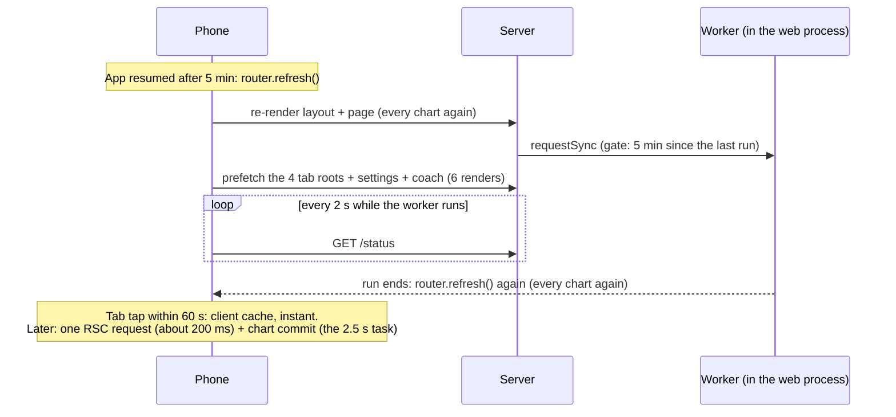
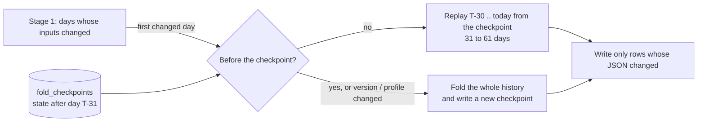

# Why the app felt slow, measured, and what changed

Written 2026-10-09 from production measurements (17 accounts, 12 with a live Google grant, database 150 MB) and
a signed-in browser session against https://pulsefit.portlabs.in. Every number below was read, not estimated.

## Summary

The server is not the problem. Every page renders in 115 to 235 ms end to end through Cloudflare, and a full
recompute takes 0.4 to 0.8 s per user. The 3 to 5 s the owner sees on a phone is **client-side rendering**: Recharts
measured every axis label by inserting a `` into `<body>` and reading its size, which forced a style
recalculation of the whole document about 80 times while React was still committing the charts. On a 4x-throttled
CPU that one task took 2.5 s, 1.9 s of it in those forced reflows. The fix is a 30-line patch to Recharts that
measures text on a canvas instead. Two smaller fixes remove wasted work on app resume and on journal check-ins, and
the sync cycle now runs a few users at a time.

## What was measured

### Server and network (signed-in, from a laptop on the same network as the server, through Cloudflare)

| Request | TTFB | Total | Body (uncompressed) |
|---|---|---|---|
| `/healthz` | 108 to 187 ms | | |
| `/` (RSC navigation payload) | 114 to 235 ms | 202 to 294 ms | 143 KB |
| `/sleep` | 113 to 123 ms | 209 to 244 ms | 133 KB |
| `/strain` | 119 to 121 ms | 189 to 205 ms | 155 KB |
| `/recovery`, `/metric/hrv`, `/trends`, `/health` | 115 to 125 ms | 152 to 193 ms | 65 to 100 KB |
| `/status` | 55 to 82 ms | | 210 B |
| `/sleep` as a document (HTML with the inlined payload) | 138 to 328 ms | 466 to 1,231 ms | 291 KB |

Server render time per page is therefore under 100 ms on top of the round trip. Origin upload through the tunnel
moved a 113 KB file in about 20 ms, so the home uplink is not the limit either.

### Production worker and database

| Item | Value |
|---|---|
| Recompute per user (`[pipeline]` log, 24 h) | 340 to 810 ms, stage 1 on 0 to 3 days |
| Database size | 150 MB |
| `hr_days` | 90 MB (60 %), 647 rows; real Fitbit density is 31,000 to 37,700 samples a day, about 160 KB per user-day |
| `raw_payloads` | 16 MB, 21,192 rows, write-only (7-day retention) |
| `daily_scores` | 10 MB, 2,553 rows; `recovery` 1.4 MB, `strain` 1.1 MB, `sleep` 0.8 MB |
| `intraday_series` | 10 MB, 10,693 rows (hr 1,066 B, still_hr 679 B, stress 448 B, load 190 B, energy_bank 2,311 B per day) |
| Containers | app 172 MB of a 1 GiB limit, Postgres 105 MB of 256 MB; host load 0.3 on 6 cores |

### The phone (Brave, 390x844, 4x CPU slowdown, Fast 4G, production `/sleep`)

| Metric | Value |
|---|---|
| LCP | 1,948 ms (TTFB 600 ms, render delay 1,348 ms) |
| Longest main-thread task | 2,527 ms at 2.5 s, inside React's commit |
| Of which forced reflows | 1,938 ms, 1,863 ms attributed to one Recharts function (`measureTextWithDOM`) |
| Style recalculations in that task | about 80, each over the whole document (2,100 elements) |
| JavaScript loaded | 2.3 MB uncompressed in 40 chunks (Recharts about 480 KB, react-dom 229 KB, a coach chunk with the AI SDK and zod 332 KB) |
| DOM | 1,626 elements, 49 SVGs |

The same page in the local dev server, before and after the Recharts patch (same emulation):

| | Before | After |
|---|---|---|
| Forced reflows with a stack | 436 | 8 |
| Style recalculations | 239 | 26 |
| Time in style recalculation | 2,335 ms | 369 ms |
| Reflow time attributed to Recharts text measurement | 2,325 ms | 0 |
| LCP | 1,403 ms | 1,061 ms |

(The after-trace still shows a 3.5 s task, which is React's development-mode instrumentation; it does not exist in a
production build.)

## Why it felt like "slow on open, fast a second later"

Each full chart commit paid the Recharts measurement cost. Within 60 s the client router cache served the page without
a commit, so it looked instant.

## What changed (this branch)

1. **`patches/recharts@3.10.1.patch`**: `getStringSize` measures on an offscreen canvas with the same font the body span
   inherited plus the style Recharts passes, so sizes match the old numbers and no reflow happens. Applied by pnpm
   (`pnpm-workspace.yaml`, `patchedDependencies`).
2. **App resume** (`AppLifecycle`, `ShellStatusProvider.recheck`, `/status`): coming back after 5 minutes asks `/status`
   once instead of re-rendering everything. The route kicks the worker (as the layout did); the page refreshes only when
   newer scores landed or the day changed, and the existing poll takes over while a sync runs.
3. **Journal check-ins** recompute from stored data (`requestSync({ pull: false })`) instead of forcing a full Google
   pull of 34 or more requests per changed tag.
4. **Sync cycle** runs 4 users at a time (`CYCLE_CONCURRENCY`) instead of one after another. One user takes 8.5 s or more
   of paced requests, so a sequential cycle capped out near 100 users per 15 minutes.
5. **Incremental stage 2** (`fold_checkpoints`, migration 0007): the fold state after one day is stored per user as JSON
   text, 31 days behind the newest day and moved forward every 30 days. A run replays from the day after it unless
   something before it changed (then the whole history, as before). Daily-row changes from Google now mark their day
   dirty, so stage 2 knows the first changed day. The replayed rows are byte-identical to a full fold
   (`incremental.test.ts`). On the 180-day seed, stage 2 went from 260 ms (180 days) to 71 ms (31 days); the saving
   grows with history, which was the point: a user with two years of data no longer re-folds 730 days every 15 minutes.
6. **Heart-rate compaction** (`hr_days.minute`, `compactHr`): after each run the worker folds up to 30 raw days older
   than 30 days to one rounded mean per minute. A raw Fitbit day is about 37,000 samples and 160 KB; compacted it is
   at most 1,440 and about 8 KB. Everything on screen and in stage 1 already works per minute; only a stage-1 rerun of
   an old day (a scoring-version bump) sees the compacted samples, so old days then score from minute means rather
   than reproduce byte for byte. The first pass over production (about 650 raw days) spreads over about 20 runs.

## What is still open, with the numbers to decide by

- **Heart-rate storage**: done above (compaction). Expected on production: `hr_days` from 90 MB to about 10 MB once
  the first pass completes.
- **`raw_payloads`** (16 MB) is written on every fetch and read by nothing but the dev probe. Dropping it saves the
  gzip per page in the web process and 10 % of the database.
- **The worker inside the web process.** Recompute was 0.4 to 0.8 s per user before the incremental fold, so with 12
  users the event loop was busy for under 10 s per 15-minute cycle. The separate worker process (plan R1 in
  [2026-10-08-007-backend-architecture-plan.md](2026-10-08-007-backend-architecture-plan.md)) matters at hundreds of
  users, not at 17.
- **JavaScript size** (2.3 MB): the AI SDK and zod chunk (332 KB) is prefetched for the coach on every page. Lazy-load
  the coach page to keep it off the critical path.
- **Tab prefetch**: every document load and every refresh render 6 extra pages on the server for the tab cache. Fine at
  17 users; revisit with the worker split.
- **Bevel scoring engine**: Phase 1 design doc per [bevel-engine-session-prompt.md](bevel-engine-session-prompt.md),
  then one family at a time behind the admin toggle.
