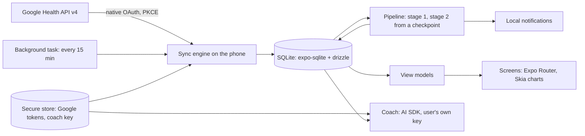
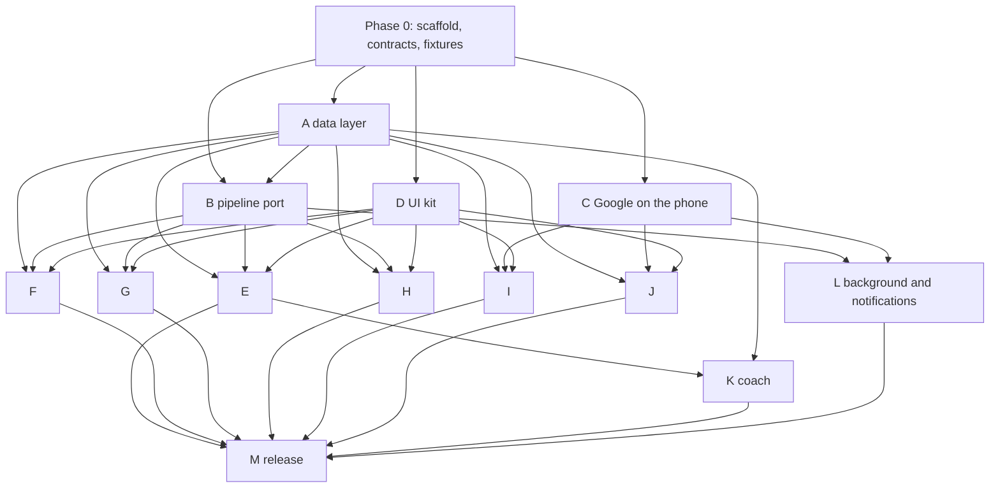

# Pulse Mobile: a React Native app with every byte on the phone

Status: plan, written 2026-10-10 for a new repository `pulse-mobile`. Nothing implemented. Written so that a fresh
Claude Code session can run the work streams below with several subagents in parallel.

## Why and what

Users want the app; the owner does not want to pay for servers. A native app can do without one: Google's native
(Android and iOS) OAuth clients use PKCE and return refresh tokens without a client secret, so the phone can call
the Google Health API itself, keep the data in SQLite and score it with Pulse's own `src/core`. Bevel and Baro work
this way. Everything the web app does on the server (sync, pipeline, view models, coach, notifications, export) moves
onto the device. There is no web interface, no accounts, no admin panel, no invites: one install is one person.

What stays the same: the Google Health data model (the same 33 data types, the same mappers), the scoring (byte for
byte, checked against fixtures exported from the web app), the screens and copy (the design spec in `docs/design/`).

What changes for the user: data lives on one phone; Google is the source of truth, so a new phone backfills 180 days
again. Journal check-ins and the Log are Pulse-only data and ride on the OS backup (Android auto backup, iCloud),
plus an export. No multi-device, no web. Google's app verification for the health scopes is still required beyond
100 users (`docs/google-verification.md`).



## Stack decisions

| Need | Choice | Why |
|---|---|---|
| App framework | Expo (SDK 54+, React Native 0.81+), TypeScript, Expo Router | File routes like the App Router, EAS builds, OTA updates, one config for both stores |
| Database | `expo-sqlite` with `drizzle-orm/expo-sqlite` and `drizzle-kit` migrations bundled into the app | Same ORM as the web app, so the repositories read almost the same; migrations run at app start as they do now |
| Google sign-in | `expo-auth-session` with Google's native client ids (Android: package name + SHA-1; iOS: bundle id), PKCE | Refresh tokens without a client secret; this is the whole reason the server can go |
| Secrets on device | `expo-secure-store` | Google refresh token, the coach's provider key |
| Background sync | `expo-background-task` + `expo-task-manager` (iOS BGTaskScheduler, Android WorkManager) | The OS gives a few minutes every 15 min or so; a run is a bounded sync + incremental recompute |
| Notifications | `expo-notifications`, local only | "Recovery ready", the morning brief, sync problems; no push server |
| Charts | `@shopify/react-native-skia` with `victory-native` (v41+, Skia based) | Recharts is DOM/SVG only; Skia is the fast path and draws the same shapes (bars, lines, hypnogram, rings) |
| UI kit | NativeWind (Tailwind classes) + the tokens from `src/app/globals.css`; `react-native-reanimated`; bottom sheets via `@gorhom/bottom-sheet` | Keeps the spec's class vocabulary; sheets replace Vaul |
| Coach | `ai` 7 + `@ai-sdk/react` in React Native (streaming fetch polyfill per the AI SDK Expo guide), provider packages as today | Same tool code over local repositories; key never leaves the phone |
| Export | `expo-file-system` + `expo-sharing` | Share sheet instead of a download route |
| Tests | Vitest for core, pipeline and repositories (SQLite via `better-sqlite3` in Node), React Native Testing Library for components, Maestro for a few journeys | The Node tests carry the parity fixtures |
| CI and release | GitHub Actions: typecheck, lint, vitest; EAS Build for store binaries; `expo-updates` for JS-only fixes | |

Not chosen: Capacitor (WebView; the owner wants native and to learn React Native), Realm or WatermelonDB (a
second data model to learn; SQLite is enough), a Bevel-style token proxy (defeats the point).

## Repository layout

```
pulse-mobile/
  app/                     Expo Router routes (one per web route under src/app/(app))
  src/
    core/                  copied from pulse src/core: pure scoring, no I/O (kept in sync by hand; same files)
    pipeline/              stage1, stage2, scores, types: ported from pulse src/server/pipeline onto the repositories
    data/
      schema.ts            drizzle SQLite schema (the contract in "Data model")
      migrations/          drizzle-kit output, bundled
      repos/               samples, scores, series, daily, sessions, journal, log, profile, settings, coach
    google/                oauth (native), client (fetch + rate limiter), catalogue, map, sync, write: ported
    queries/               view models: ported from pulse src/server/queries, SQL parts rewritten on the repos
    coach/                 tools, texts, instructions, history, approvals: ported; model factory from secure store
    notify/                local notification scheduling (recovery ready, brief, sync problem)
    tasks/                 background sync task registration and the run loop
    ui/                    tokens, shells (AppShell, DetailShell, SectionShell), kit (ScoreDial, KeyStatRow, charts)
    lib/                   format, url, bands, reasons, behaviors, dashboard, extraMetrics: copied
  fixtures/                parity fixtures exported from the pulse repo (see "Parity contract")
  docs/                    this plan, the design spec copy, decisions
```

`src/core` and `src/lib` are copies, not a shared package: two repositories, one owner, and the web app may be
retired. A `scripts/sync-core.sh` that copies them from a pulse checkout and runs the tests keeps them aligned.

## Data model (the contract between work streams)

The same tables as `pulse/src/server/db/schema.ts` minus auth, admin, invites, server settings, push subscriptions,
avatars and `user_id` (one person per install), with these SQLite translations:

| Postgres today | SQLite | Note |
|---|---|---|
| `hr_days.offsets integer[]`, `values smallint[]` | two BLOBs: offsets as delta-encoded varints, values as uint8 | 37,000 samples a day; the per-minute compaction after 30 days stays |
| `steps_days` arrays | same as hr_days | |
| `jsonb` columns (`daily_scores.*`, `intraday_series.data`, `reports.data`, `health_records.data`, `logged_entries.data`, `coach_chats.messages`) | `text` JSON | JSON text keeps key order, which journal impact's memo key depends on (the web app learned this on 2026-10-09) |
| `date` days | `text` `YYYY-MM-DD` | as the string mode today |
| `bigint` unix seconds | `integer` | |
| `fold_checkpoints.fold text` | same | one row, no user id |
| `on conflict ... do update ... where ... is distinct from` | `insert ... on conflict do update ... where ... is not ...` per column, or read-compare-write in the repository | SQLite has no `is distinct from`; the repository hides it |
| `generate_series`, `collate "C"` | done in TypeScript | |

Repositories (`src/data/repos/*`) are the only code that touches SQLite. Each takes plain rows in and out, exactly
the shapes the pipeline and queries use today. This is the backend plan's data-access layer
([2026-10-08-007-backend-architecture-plan.md](2026-10-08-007-backend-architecture-plan.md), section 1.2), built
here from the start.

## Parity contract

Before any port begins, the pulse repository exports fixtures (a script under `scripts/`, run once per
`SCORING_VERSION`) into `pulse-mobile/fixtures/`:

| Fixture | Input | Expected |
|---|---|---|
| F1 mappers | each Google payload in `src/server/sources/google/__fixtures__` | the rows `map.ts` produces |
| F2 seed | the 180-day demo seed as rows (daily_metrics, sessions, segments, exercises, hr and steps samples, journal) | |
| F3 scores | F2 | every `daily_scores` row, every `intraday_series` row, every `reports` row, canonical JSON (sorted keys, 10 significant digits, as `golden.test.ts` hashes them) |
| F4 incremental | F2 plus a late night for day 200 | the same rows as a full fold |
| F5 time | zone, instant | day, local midnight, wall time, including the DST cases in `time.test.ts` |
| F6 view models | F2 at a fixed `now` | the `HomeVM`, `SleepVM`, `RecoveryVM`, `StrainVM`, `MetricVM` JSON for a few days |

The mobile pipeline passes when its output hashes equal F3 and F4; the queries pass when they reproduce F6. The
comparison rule is the backend plan's (section 2.4): equal after canonical encoding, since Hermes and V8 may differ in
the last bit of `Math.exp` and friends. The hard-to-port list in that plan's section 2.5 applies: `localeCompare`
becomes a byte comparison in pulse first, `Intl.DateTimeFormat` on Hermes is checked by F5 on day one.

## Phases

### Phase 0: contracts and scaffolding (1 week, one session, no parallel agents)

1. Create `pulse-mobile` with Expo, TypeScript strict, ESLint, Vitest, NativeWind, Expo Router, EAS config. One
   screen that boots, opens SQLite, runs an empty migration.
2. Copy `src/core` and `src/lib` from pulse; port `time.ts`; run F5 under Hermes (a tiny `expo run` smoke) and under
   Node.
3. Write `src/data/schema.ts` and the repository interfaces (names, signatures, row types) as empty functions.
4. Export the fixtures from pulse (a script in the pulse repo, committed there).
5. Google Cloud: add Android and iOS OAuth clients to the existing project, same scopes as `SCOPES` in
   `src/server/sources/google/oauth.ts`; add test users.
6. Write `AGENTS.md` for the new repo: layout, rules (no I/O in core, repositories only touch SQLite, no secrets in
   logs, every screen renders the five metric states), commands, and the parity rule.

Exit: `pnpm typecheck && pnpm lint && pnpm test` green with the F5 fixture; an EAS development build installs on
the owner's phone.

### Phase 1: foundation, four streams in parallel (3 to 4 weeks)

| Stream | Owner agent | Scope | Done when |
|---|---|---|---|
| **A. Data layer** | Sonnet | `schema.ts`, migrations, every repository; the BLOB sample encoding; `compactHr` | Repository tests on `better-sqlite3`: round trips, diff-only writes, the sample merge rules (`samples.test.ts` semantics), `COMPACT_BATCH` behaviour |
| **B. Pipeline port** | Opus | `stage1.ts`, `stage2.ts`, `scores.ts`, `types.ts` onto the repositories; checkpoint semantics as in pulse (`CHECKPOINT_LAG` 31, `CHECKPOINT_STEP` 30); `needsRecompute` | F3 and F4 hashes equal; the no-change run writes nothing; determinism and causality tests ported from `pipeline.test.ts` |
| **C. Google on the phone** | Sonnet | native OAuth flow and token refresh in secure store; `client.ts` on `fetch` with the 250 ms per-user pacing and `Retry-After`; `catalogue.ts`, `map.ts` (F1), `sync.ts` (backfill 180 days, overlaps, deletions, dirty days), `write.ts` and the log import | F1 passes; sync tests ported from `sync.test.ts` against a scripted fetch; a real backfill on the owner's account completes on a dev build |
| **D. UI kit** | Sonnet | tokens from `globals.css` into NativeWind; AppShell with the tab bar, DetailShell, SectionShell, headers, sheets; ScoreDial, KeyStatRow, MetricState (five states), InsightCard, DayStrip, DateSwitcher; chart kit on Skia: ColumnChart, TrendChart, IntradayHrChart, SleepHrChart, Hypnogram, StressChart, EnergyBankChart, StrainRecoveryChart, zone bars | A kit screen (like `src/app/dev/kit`) shows every component in light and dark at 390 px; screenshots reviewed against the web app's kit |

Stream B depends on A's interfaces (fixed in Phase 0), not on A's implementation: it runs on an in-memory
implementation of the same interfaces until A lands, then switches. C and D depend on nothing else.

Exit: a dev build signs in to Google, backfills, recomputes, and the kit screen renders.

### Phase 2: screens, parallel by area (4 to 5 weeks)

Each stream ports the web query (`src/server/queries/*.ts`) onto the repositories, checks it against F6 where a
fixture exists, then builds the screens from the kit. Screens mirror `src/app/(app)` route for route; copy comes
from the web app; the five metric states and reason codes are the same.

| Stream | Screens | Query files | Notes |
|---|---|---|---|
| **E. Home and Sleep** | `(home)`, `sleep`, `sleep/nap/[id]` | home.ts, sleep.ts, calendar.ts | the day strip and date switcher are shared with every stream, so E finishes them first |
| **F. Recovery and Strain** | `recovery`, `strain`, `activities`, `activity/[id]` | recovery.ts, strain.ts, activities.ts, activity.ts | |
| **G. Health** | `health`, `health/monitor`, `health/stress`, `health/fitness`, `health/healthspan`, `health/heart-rate` (live view: foreground pull every 60 s) | health.ts | |
| **H. Trends and metrics** | `trends`, `trend/[key]`, `metric/[key]`, `reports`, `reports/[period]` | trends.ts, trendView.ts, metric.ts, reports.ts | the largest query files; range stats for 1y and 2y read stored rows, as today |
| **I. Journal and Log** | `journal`, `journal/insights`, check-in sheet, the day log and log sheets | journal.ts, log.ts | writes go through the log repository and the Google write path from stream C |
| **J. Settings and onboarding** | onboarding (birth date, sex, max HR, zone), `settings`, `more`, `more/behaviours`, `more/data`, `more/how-it-works`, about | settings.ts, profile.ts | Google connect, disconnect, "sync now", data export (share sheet), delete everything, notifications toggles, theme |

Exit: every route of the web app opens on the phone with the owner's data; a screenshot sweep at 390 px for light
and dark is reviewed against the web app.

### Phase 3: coach, background, notifications, release prep (2 to 3 weeks)

| Stream | Scope | Done when |
|---|---|---|
| **K. Coach** | `coach/`: provider factory from the secure-store key, the read tools over the repositories, the log tools with approvals, chat storage, `useChat` with streaming in React Native, the chats list, settings and consent | The scripted mock model drives the same tests as `coach.test.ts`; a real provider answers on a dev build; the key never appears in logs |
| **L. Background and notifications** | the background task: sync, incremental recompute, compaction, then schedule local notifications (recovery ready once per local day, the brief at the chosen minute, sync problems once a day); foreground resume runs the same with the 5-minute gate | On the owner's phone, a morning notification arrives without opening the app on both platforms (iOS gives background time at its discretion; document the limits as `docs/pwa.md` did for the PWA) |
| **M. Release** | app icons and splash from `public/`, store listings, privacy manifest (iOS) and data safety form (Android) with the privacy text from `docs/technical-details.md`, EAS build profiles, GitHub Actions for typecheck, lint and tests, Maestro journeys for sign-in, backfill, Home, Sleep, check-in | TestFlight and an internal Play track with the owner's account |

### Phase 4: beta (ongoing)

Invite the people who asked. Watch: background run frequency per platform, sync errors, battery, and the parity of
scores against the web app for the owner's own account (same Google account, two apps, compare `daily_scores`).

## Dependency graph



## Running it with subagents

- One orchestrating session per phase. Phase 0 is done by hand in that session. Phases 1 to 3 spawn one agent per
  stream, each in its own git worktree of `pulse-mobile`, each on a branch named after the stream.
- Models: Opus only for stream B (the parity port) and for merge conflicts in shared files; Sonnet for everything
  else; Haiku for screenshot sweeps and fixture diffs. Ask the owner before launching a batch and show this table.
- Every brief says: the stream's scope and done-when from this document, the files it owns, the files it must not
  touch, the fixture it must pass, "do not spawn agents, forks or workflows", "leave no background process running",
  and "stop and report when done; do not widen scope".
- Shared files (`schema.ts`, repository interfaces, tokens, the kit's exports) change only in the orchestrating
  session, between waves. A stream that needs a change asks for it in its report.
- Each stream lands as one pull request with its tests; the orchestrator reviews with the web app's code open beside
  it (the port must read like the original).

## Effort

| Phase | Calendar | Notes |
|---|---|---|
| 0 | 1 week | mostly setup, Google console, fixtures |
| 1 | 3 to 4 weeks | four agents in parallel; the pipeline port is the long pole |
| 2 | 4 to 5 weeks | six agents in parallel, each 1 to 2 weeks; review time dominates |
| 3 | 2 to 3 weeks | background behaviour on real phones takes the time |
| Total | about 3 months to a beta | the web app keeps running on the home server meanwhile |

## Risks and the decision each needs

1. **iOS background time.** iOS may run the task a few times a day, not every 15 minutes. Mitigation: the app
   syncs on open (as the PWA does), and "Recovery ready" fires when the morning's run happens; accept that it is
   not at 7:00 sharp on iOS.
2. **Hermes numeric parity.** F3 and F4 settle it in Phase 1; if a scorer flips a threshold in the last bit, the
   canonical-rounding rule decides and the case is recorded.
3. **Google verification.** Unchanged from today; the native clients join the same project, so the verification
   covers both. Start it when the beta has 20 users.
4. **Health Connect and HealthKit** as later sources (Fitbit writes to Health Connect on Android): out of scope here;
   the data model already has `source` columns, and Bevel's source-merge rules are in `docs/research/bevel/ingestion.md`.
5. **Learning curve.** The owner wants to learn React Native: Phase 0 and stream D are the ones to do or review by
   hand; the others port existing code.
