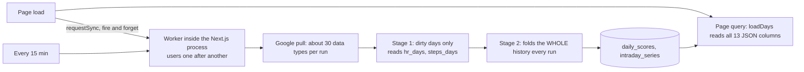
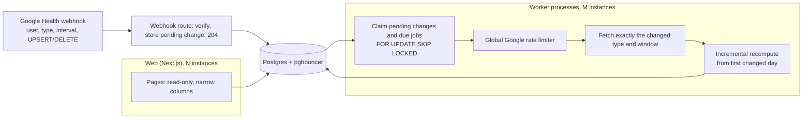

# Scaling Pulse to 10,000 users

Status: plan only, nothing implemented. Written 2026-10-08. Superseded in detail by [2026-10-08-007-backend-architecture-plan.md](2026-10-08-007-backend-architecture-plan.md).

Correction (2026-10-08): the storage figures below divided `hr_days` over every user's days, but only one (demo) user has heart rate. Per heart-rate day it is about 36.7 KB for about 5,700 samples. The `offsets` array is effectively uncompressed at about 4 B per sample. Real Fitbit heart rate is about 37,000 samples a day (`docs/data-notes.md`), so real storage per user-day is several times higher and still unmeasured. The sequential sync also caps out near 105 users per 15-minute cycle (34 requests × 250 ms pacing), long before 10k.

Goal: serve 10,000 users with fast pages and fresh scores, without raising database load or size per user. Every change below either leaves the database untouched or reduces reads, writes or bytes.

## How it works today

Measured on the local dev database (2 users, about 180 days each, Apple Silicon):

| Thing | Measurement |
|---|---|
| Page queries (home, sleep, recovery, strain) | 3-5 ms |
| `loadDays` over 730 days | 3.6 ms, 478 KB of JSON parsed |
| Full recompute | about 120 ms, of which stage 2 is about 115 ms. Synchronous, in the same process that serves pages |
| Production `/healthz` round trip | 120-170 ms |
| Storage per user-day | about 47 KB in total: `hr_days` 18.5 KB (about 5,700 samples a day), `daily_scores` 14 KB, `intraday_series` 9 KB, everything else about 5 KB |

## What breaks at 10,000 users

| Area | Today | At 10k users |
|---|---|---|
| Sync cycle | Sequential, every 15 min, in one process | 10,000 users in 900 s gives 90 ms per user, which is less than one Google round trip. The cycle never finishes, so freshness collapses |
| Google API calls | About 30 data types re-fetched every run | 10k × 96 runs × 30 calls is about 29 M requests a day (about 330 per second). That fits the default project quota (below), but almost all of those calls return nothing new |
| Google app verification | Unverified app | An unverified app is capped at 100 users. 10k users needs the app verified |
| CPU | Stage 2 re-folds all history on every run | Cost grows with users × history. On the home server it blocks the event loop for every page request |
| Storage | About 47 KB per user-day | About 170 GB a year, before WAL, backups and bloat |
| Page latency | No client cache; each tab switch hits the server | Each request queues behind recompute work in the same process |
| Site data on devices | Static cache never pruned | Grows with every deploy (about 10 MB seen) |

## Google Health API facts (from the official docs, checked 2026-10-08)

Quotas ([rate limits](https://developers.google.com/health/rate-limits)):

| Limit | Default |
|---|---|
| Per project, daily | 86.4 M requests a day (about 1,000 QPS sustained) |
| Per project, per minute | 120,000 requests a minute (about 2,000 QPS burst) |
| Per user, per minute | 300 requests a minute (5 QPS) |
| Unverified app | 250 QPS total, at most 100 users, 2.5 QPS per user |

Exceeding a limit returns 429; back off and retry. Increases can be requested in the Cloud Console.

Webhooks ([webhook subscriptions](https://developers.google.com/health/webhooks)):
- **Subscriber and coverage:** one subscriber per project. It covers HR, steps, sleep, exercise, daily HRV/RHR/SpO2/RR, temperature derivations, weight, body fat, VO2 max, nutrition, hydration, glucose and the roll-up types Pulse reads.
- **Each notification carries:**
  - `healthUserId`
  - data type
  - the changed time interval (UTC and civil)
  - the operation (`UPSERT` or `DELETE`)
- **Delivery:** batched up to 99 notifications, signed (P-256 ECDSA in `GOOGLE-HEALTH-API-SIGNATURE`) plus a configured `Authorization` secret. Retried with backoff for up to 7 days. No ordering or exactly-once guarantee. The endpoint must answer 204 immediately and process asynchronously.

Consequences for the plan:
- The quota is not the bottleneck at 10k users.
- Verification is a hard requirement beyond 100 users.
- Polling every type every 15 minutes can be replaced by fetching exactly the changed type and window when a webhook arrives.

## Target

- Page server time: p95 under 150 ms, independent of history length.
- Score freshness: under 15 minutes for users active in the last 24 h; hours for dormant users.
- Database: bytes per user-day at or below today's value (goal: under 15 KB); reads and writes per user per day lower than today.
- No compute on the request path.

## Plan

### Phase 0: measure first (no behaviour change)

Before changing anything, add the numbers that decide what matters, so each phase can show its effect.

1. Server-Timing on page responses (DB time, render time) and an event-loop lag metric.
2. Per-run worker log: pull time, Google calls per type, stage 1 and stage 2 time, rows written. The pipeline already logs total ms; split it.
3. A daily job that records table sizes and rows per user-day.
4. A load-test harness: seed 10,000 synthetic users with the existing seed source and replay a realistic morning peak (for example 30 % of users opening the app between 7 and 9 am).
5. Count real Google calls per user per day, and how many return changed data. That shows how much the webhooks will save.

Database impact: one small metrics table or log lines only.

### Phase 1: take work off the request path (quick wins)

1. **Run the worker as its own process**, not inside Next.js. Same codebase, separate entry point. Page requests then never wait on a stage 2 fold. If a separate process is not possible yet, run stage 2 in a `worker_thread` or yield between days. No database impact.
2. **Make `requestSync` on page load cheap.** It should only mark the user as due ("visited, raise priority"), never start work in the web process. No database impact if it reuses `sync_state`.
3. **Read narrow columns.** `loadDays` takes the list of score columns a page needs; the metric detail page reads one column. For ranges like the metric detail's 2 years, read precomputed range stats (see Phase 3) instead of 730 rows. This reduces database reads.
4. **Client router cache:** set Next `staleTimes.dynamic` to about 30 s, so moving between tabs does not refetch. Data stays in memory on the device only. This reduces requests.
5. **`loading.tsx` for metric, activities, activity and reports,** so navigation shows a skeleton immediately.
6. **Prune the service-worker cache:** name the static cache per build, or delete entries not in the current build's manifest on `activate`. Site data drops back to the size of one build.

### Phase 2: incremental and parallel compute (the core change)

1. **Incremental stage 2,** the model Bevel uses (see `docs/research/bevel/shared-machinery.md`, G08):
   - Recompute only from the first changed day to today. Seed the fold from the stored row of the day before. ATL, CTL, strain target, sleep bank and the energy-bank end state are already stored per day in `daily_scores`.
   - Baselines need the 60 days before the window; read them from `daily_metrics` and stored scores (cheap columns), not by re-folding history.
   - A typical run then touches 1-3 days instead of the whole history. CPU drops from O(history) to O(changed days).
   - A `SCORING_VERSION` bump becomes a low-priority background backfill, a few users at a time, at night.
   - Keep the existing determinism test: incremental output must equal a full fold byte for byte. Add a test that compares the two on the seeded users.
   - Database impact: fewer reads and fewer writes. Size unchanged.
2. **Webhook-driven sync** (DEFERRED by user decision, 2026-10-08; kept here for later). Until then, polling (items 3-5) carries the load. It replaces most polling:
   - Add a webhook route that verifies the signature and secret, writes each notification as a small "pending change" row, and returns 204 at once.
   - Pending change rows hold the user, data type and changed interval. Coalesce them per user and type, and delete them once fetched, so the table stays tiny.
   - A worker fetches exactly that type and interval, upserts it, marks the affected days dirty and runs the incremental recompute.
   - `DELETE` notifications remove the rows in that window, which replaces today's "re-list the window to detect deletions".
   - Keep a slow safety poll, for example once a day per user over the last few days, to catch missed notifications. Webhooks have no exactly-once guarantee, and notifications older than 7 days are dropped.
   - Effect: Google calls fall from about 29 M a day to roughly the number of real data changes. Freshness becomes minutes instead of up to 15 minutes. Database writes only happen for real changes.
   - Prerequisite: a public HTTPS endpoint (Cloudflare already fronts the server) and the subscriber registered per environment.
3. **Due-time scheduling for the remaining work** (first backfill, the safety poll, `SCORING_VERSION` backfills):
   - Add `next_due_at` and `priority` to `sync_state` (or a small `sync_jobs` table, one row per user).
   - Workers claim due users with `FOR UPDATE SKIP LOCKED`. The existing per-user advisory lock stays.
   - Run M worker processes in parallel. Sync is network-bound, so concurrency of 20-50 per process is reasonable.
   - Database impact: one small row per user.
4. **Safety-poll cadence,** if webhooks are delayed or not yet live:
   - Users active in the last 24 h: every 15 min.
   - Users active in the last 7 days: every 1-2 h.
   - Dormant users: daily.
   - On an app open: due now, still capped to once per 5 min (today's `FRESH_MS`).
   - Per type, heart rate, steps and sleep need every run. Weight, body fat, VO2 max, height, ECG, zones and roll-ups need at most a few times a day.
5. **Global Google rate limiter:** a token bucket shared across worker processes, sized to the documented limits: 1,000 QPS per project sustained and 5 QPS per user. Back off per user on 429. Today's "one user at a time" is the only protection, and it cannot coexist with parallel workers. With webhooks the limiter mainly protects first backfills, which pull 180 days of many types and should be spread out.
6. **Batch side effects:** move `notifyRecovery` and `notifyBrief` out of every recompute into a scheduled pass, sent once the morning scores are final.

### Phase 3: storage compaction (reduce bytes per user-day)

Target: from about 47 KB down to under 15 KB per user-day, without losing anything scoring needs.

1. **Heart rate (`hr_days`, 18.5 KB a day):**
   - Bevel's research shows Strain, Stress, Energy Bank and HR dip all work on minute aggregates; only HR recovery needs raw samples, and only inside workouts.
   - Keep raw samples for a recent window (for example 14 days, enough for late data and replays).
   - After that, keep per-minute values plus raw samples inside workouts.
   - Store offsets as delta-encoded integers or a bitmap of present minutes instead of a full offset array.
   - Expected: about 4-6 times smaller for older days.
   - Verify first that nothing in stage 1 re-reads raw HR older than the window.
2. **Intraday series (`intraday_series`, 9 KB a day):**
   - 1,440-point JSON arrays of floats.
   - Store them as compact binary (int16 scaled values with a null sentinel), or keep only the series the UI shows for older days.
   - Expected: about 3-4 times smaller.
3. **`daily_scores` (14 KB a day):**
   - The JSON payloads average about 3.4 KB, so the rest is TOAST and row overhead plus possible bloat from rewrites. Check `n_dead_tup` and autovacuum settings first.
   - Store `journal_impact` per week, or compute it on demand, instead of per day (it is the largest column at 0.8-1.8 KB).
   - Drop fields that pages never read.
4. **Precomputed range stats:** store per-metric weekly and monthly aggregates. The `reports` table already does this for some metrics. Long-range pages (1y, 2y) then read about 100 rows instead of 730 daily blobs. A small addition that replaces much larger reads.
5. **Retention:** `raw_payloads` is already pruned. Confirm the window and that it is not retaining full bodies longer than needed.

### Phase 4: infrastructure for 10k

1. **pgbouncer** in transaction mode in front of Postgres. Web and worker pools sized separately, so a sync burst cannot starve pages.
2. **Two or more web instances** behind Cloudflare; the web tier is stateless once the worker is out of it. Move any in-memory per-user state (the worker `states` map, live heart-rate throttle) to the worker processes or Postgres.
3. **Sizing:** the server can be scaled as needed, so these numbers set the size rather than block the plan:
   - Storage: at about 15 KB per user-day after Phase 3, 10k users is about 55 GB a year plus WAL and backups.
   - Traffic: page traffic for 5k daily users × 30 views × about 30 KB is about 4.5 GB a day of upload.
   - Compute: with incremental compute and webhooks, CPU follows data changes rather than user count × history.
4. **Google app verification:** start early, because an unverified app stops at 100 users. Health scopes may need a security assessment, which can take weeks.
5. **Backups and vacuum:** tune autovacuum for `daily_scores` and `intraday_series` (frequent upserts), and set up WAL archiving with a tested restore.

## Order and expected effect

| Step | Effort | Effect |
|---|---|---|
| Phase 0 measurement | Small | Decides priorities; nothing guessed |
| Phase 1.1-1.2 worker out of the web process | Small-medium | Pages stop waiting on recompute |
| Phase 1.3-1.6 narrow reads, client cache, skeletons, SW prune | Small | Faster navigation, fewer reads, site data back to one build |
| Phase 2.1 incremental stage 2 | Medium-large | CPU per run independent of history length |
| Phase 2.2 webhooks | Medium | Google calls fall to the number of real changes; minutes-fresh data |
| Phase 2.3-2.5 queue, parallel workers, safety poll, rate limiter | Medium | Backfills and the safety poll keep up at 10k users |
| Google app verification | External, weeks | Required beyond 100 users |
| Phase 3 compaction | Medium | About 3 times less storage per user-day |
| Phase 4 infrastructure | Medium | Headroom and safety at 10k |

## Open questions to answer in Phase 0

- Google Health API verification requirements and timeline for the health scopes Pulse requests.
- Webhook latency and coverage in practice for a Fitbit Air account (which types arrive, and how soon after the band syncs).
- Real usage shape: daily active share, morning peak and pages per session.
- Whether `daily_scores` size is bloat from rewrites or genuine payload.
