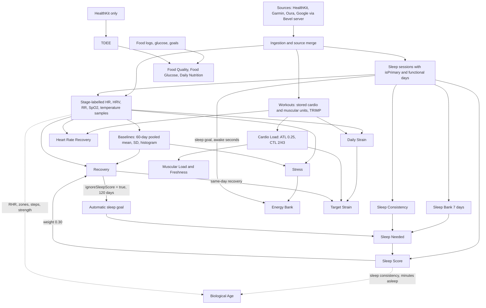

# Bevel 3.1.7 reverse-engineering study: implementation reference for Pulse

This folder is the final, implementable record of how Bevel 3.1.7 (build 2728) computes its health metrics. It replaces the earlier research in [../bevel-metrics.md](../bevel-metrics.md), [../bevel-unverified-tasks.md](../bevel-unverified-tasks.md) and [../bevel-vs-pulse-algorithms.md](../bevel-vs-pulse-algorithms.md) wherever they conflict (those files carry a superseded note). Every algorithm an engineer needs to implement in `src/core/` is in the family docs below, not only in `evidence/`.

## What this is

- Subject: the Bevel iOS app, `CFBundleShortVersionString 3.1.7`, build 2728.
- IPA sha256: `329886dda54e712799b3e913e6f717a1c4e6ddec921cf3f482e4329b02679af7` (from `../bevel-metric-inventory.json`, field `ipa_sha256`).
- Method: a full Ghidra decompile of the main binary (`Superset`, arm64, image base 0x100000000) plus ARM64 assembly checks of every boundary, constant and condition code that matters. Swift metadata (reflection, field descriptors, conformance and witness tables) gave type layouts and dispatch. Addresses in these docs are unslid virtual addresses; `FUN_xxxxxxxxx` is the decompile entry name. The two added dylibs were analysed with a static decryptor and an ARM64 interpreter that intercepts all external calls.
- Scope: the 18 score families plus shared machinery (ingestion, windows, baselines, settings, gates, replay, presentation), the remaining registered calculators (cycle, journal, EPOC, cardio focus, sport statistics, trend bands, blood pressure, glucose, macro balance), the two injected dylibs, provenance of the earlier labels, and the resource and remote-configuration audit.
- Not in scope: runtime parity against live Bevel outputs (see [Runtime parity](#runtime-parity-deferred)).

Status definitions used throughout:

| Status | Meaning |
|---|---|
| RESOLVED | The arithmetic, branches, inputs, units, windows, state and presentation for the task are recovered with addresses, and boundaries were re-read in assembly. A task can be RESOLVED and still name a connector or server boundary (for example "Google field choice is server side"). |
| NOT IN IPA (proven) | The IPA contains no code or data that answers the question, and the boundary evidence is stated (for example the Bevel server holds the Google tokens and the client copies `value: Double` unchanged; the app supplies no ORDER BY). This is a proof of absence at a named boundary, not "not yet found". |
| DEFERRED (runtime parity, by user decision) | Same-build same-input comparison against live Bevel outputs. Not attempted; the user decided to defer it. |

Evidence precedence, applied wherever findings disagree: `evidence/R2.md` (the final closer) and `evidence/R.md` (the residual closer) win over A-G; the orchestrator's own assembly verifications ("verified in assembly") win over the family findings; then the family finding; the earlier research is last. The check files (`evidence/check-*.md`) record independent spot checks. One reported mismatch is a false alarm: check-DEF flagged the strain zone-weight table, but zone 1 is the inline constant `(2, 2)` (`0x4000000040000000`, `1015d.c:4423`), so the table `(0,1) (2,2) (3,4) (4,7) (7,12) (12,20)` is correct.

## Metric family dependency graph

Edges verified by A (G12) and re-verified by R (R10). "Baselines" means the 60-day pooled per-day aggregates (windows are calendar days; a night belongs to the day it ends).

## Index of documents

| Doc | Contents | Tasks |
|---|---|---|
| [ingestion.md](ingestion.md) | Server boundary and DTOs, response mappers, dispatcher table, Google sleep sessions and primary flag, HRV kernel, SpO2 and temperature chains, source merge and lists | G01, G02, G03, G10 |
| [shared-machinery.md](shared-machinery.md) | Functional days and windows, sample labelling, baselines, settings and defaults, gates, replay and caches, presentation layer, dependency graph | G04-G09, G12 |
| [recovery-stress-energy.md](recovery-stress-energy.md) | Recovery, Stress, Energy Bank | M01, M04, M05 |
| [sleep.md](sleep.md) | Sleep Score, Sleep Bank, Sleep Consistency, Sleep Needed and automatic goal | M03, M14, M15, M16 |
| [strain-load.md](strain-load.md) | Daily Strain, workout units and TRIMP, Cardio Load, Target Strain, Heart Rate Recovery | M02, M07, M17, M18 |
| [biological-age-muscular.md](biological-age-muscular.md) | Biological Age, Muscular Load, Muscular Freshness | M06, M08, M09 |
| [nutrition-tdee.md](nutrition-tdee.md) | Food Glucose, Food Quality, Daily Nutrition Score, TDEE | M10-M13 |
| [other-calculators.md](other-calculators.md) | Cycle, journal, EPOC, cardio focus, sport statistics, vitals and trend bands, blood pressure, glucose variability, macro balance, strength helpers | G15 |
| [patches.md](patches.md) | The two injected dylibs, provenance audit, resources and remote configuration | G13, G14, G16 |
| [pulse-gaps.md](pulse-gaps.md) | What Pulse must change per family, connector status, decisions for the user | G11 |
| [evidence/](evidence/) | Verbatim findings A-I, R, R2 and the three check files | all |

## Final status of every task

All 104 task IDs from `../bevel-unverified-tasks.json`. The "Resolved in" column links to the section that contains the algorithm. The same status and path are stored in `../bevel-unverified-tasks.json` as `final_status` and `resolved_in`.

| Task | Status | Resolved in | Note |
|---|---|---|---|
| G01 | RESOLVED | [ingestion.md#g01-source-selection](ingestion.md#g01-source-selection) | Source lists, default `enabled` (R2), arbitration routines (R2), session ranking, duplicate rules, sample vs daily vs minute store |
| G02 | RESOLVED | [ingestion.md#g02-local-versus-server-conversions](ingestion.md#g02-local-versus-server-conversions) | Complete list of local conversions; server transforms are the boundary |
| G03 | RESOLVED | [ingestion.md#g03-units-and-methods](ingestion.md#g03-units-and-methods) | HRV kernel, SpO2 fraction and x100, temperature baseline + delta, units |
| G04 | RESOLVED | [shared-machinery.md#g04-functional-days-and-windows](shared-machinery.md#g04-functional-days-and-windows) | Calendar days, window selector, baseline window generator, DST |
| G05 | RESOLVED | [shared-machinery.md#g05-baselines](shared-machinery.md#g05-baselines) | Chan merge, daily pool, priors, histogram, default config table |
| G06 | RESOLVED | [shared-machinery.md#g06-settings-and-defaults](shared-machinery.md#g06-settings-and-defaults) | CalculationsOptions default 0x0101, goal default 7.5 h, Data Loading Window (three formulas per consumer, R2) |
| G07 | RESOLVED | [shared-machinery.md#g07-null-calibration-and-error-gates](shared-machinery.md#g07-null-calibration-and-error-gates) | Calibration badge, missing data, status gates; load gate `min(trainingDensity, recency) < 0.35` (R2) |
| G08 | RESOLVED | [shared-machinery.md#g08-replay-caches-and-late-data](shared-machinery.md#g08-replay-caches-and-late-data) | Settings change replays full window; caches 33 and 35 |
| G09 | RESOLVED | [shared-machinery.md#g09-presentation-layer](shared-machinery.md#g09-presentation-layer) | Formatter half-even, donut maxValue 100, bands, notifications |
| G10 | NOT IN IPA (proven) | [ingestion.md#g10-air-observations](ingestion.md#g10-air-observations) | Google semantics live in the Bevel backend; same-account capture needed |
| G11 | RESOLVED | [pulse-gaps.md#connector-status-google](pulse-gaps.md#connector-status-google) | Per-family inputs versus Pulse's connector |
| G12 | RESOLVED | [shared-machinery.md#g12-dependency-graph](shared-machinery.md#g12-dependency-graph) | Edges verified, R edges re-verified in R10 |
| G13 | RESOLVED | [patches.md#g13-the-two-injected-dylibs](patches.md#g13-the-two-injected-dylibs) | One StoreModel subscription clamp; no score touched; popup cadence key reproduced (R2) |
| G14 | RESOLVED | [patches.md#g14-provenance-of-annotations-and-labels](patches.md#g14-provenance-of-annotations-and-labels) | Labels and addresses re-derived; widget comparison; export count and 401-address residue closed (R2) |
| G15 | RESOLVED | [other-calculators.md#status-of-the-g15-groups](other-calculators.md#status-of-the-g15-groups) | All eight groups recovered (H BLOCKED superseded by I; BP thresholds by orchestrator addendum, BP AND/OR and trend window by R2) |
| G16 | RESOLVED | [patches.md#g16-resources-opaque-blobs-and-remote-configuration](patches.md#g16-resources-opaque-blobs-and-remote-configuration) | No on-device model or coefficient blob; server DTOs are the boundary |
| M01.01 | RESOLVED | [recovery-stress-energy.md#recovery](recovery-stress-energy.md#recovery) | Local per-sample HRV mean in sleep window; Google field choice is server side |
| M01.02 | RESOLVED | [recovery-stress-energy.md#recovery](recovery-stress-energy.md#recovery) | Baseline inclusion and no outlier rules |
| M01.03 | RESOLVED | [recovery-stress-energy.md#recovery](recovery-stress-energy.md#recovery) | Gate and half-even label |
| M02.01 | RESOLVED | [strain-load.md#daily-strain](strain-load.md#daily-strain) | HR minute aggregates only |
| M02.02 | RESOLVED | [strain-load.md#daily-strain](strain-load.md#daily-strain) | Three pools: workouts, exercise windows (Apple exercise time, R2), passive |
| M02.03 | RESOLVED | [strain-load.md#presentation-of-strain](strain-load.md#presentation-of-strain) | Formula, units; no 0-21 scale |
| M03.01 | RESOLVED | [sleep.md#sleep-score](sleep.md#sleep-score) | Overlap resolver, trimAwakeEdges, no short-awakening filter |
| M03.02 | RESOLVED | [sleep.md#sleep-score](sleep.md#sleep-score) | Six components, kernel, continuity table |
| M03.03 | RESOLVED | [sleep.md#sleep-score](sleep.md#sleep-score) | HR dip window and baseline |
| M03.04 | RESOLVED | [sleep.md#sleep-score](sleep.md#sleep-score) | Age/sex targets and nil fallbacks |
| M04.01 | RESOLVED | [recovery-stress-energy.md#stress](recovery-stress-energy.md#stress) | Connector gap: no intraday HRV in Pulse |
| M04.02 | RESOLVED | [recovery-stress-energy.md#stress](recovery-stress-energy.md#stress) | Slots, median/trimmed mean, kernel, display filter |
| M05.01 | RESOLVED | [recovery-stress-energy.md#energy-bank](recovery-stress-energy.md#energy-bank) | Seed (window.start, 0), full state update |
| M05.02 | RESOLVED | [recovery-stress-energy.md#energy-bank](recovery-stress-energy.md#energy-bank) | UTC 6-minute grid, no midnight reset |
| M05.03 | RESOLVED | [recovery-stress-energy.md#energy-bank](recovery-stress-energy.md#energy-bank) | Raw vs display stress |
| M05.04 | RESOLVED | [recovery-stress-energy.md#energy-bank](recovery-stress-energy.md#energy-bank) | Mindfulness context only |
| M05.05 | RESOLVED | [recovery-stress-energy.md#energy-bank](recovery-stress-energy.md#energy-bank) | Core Data persistence, no calibration |
| M06.01 | RESOLVED | [biological-age-muscular.md#physiological-factors](biological-age-muscular.md#physiological-factors) | Nine factors, no renormalization; blood row order is NOT IN IPA |
| M06.02 | RESOLVED | [biological-age-muscular.md#weekly-history-windows-and-overlap](biological-age-muscular.md#weekly-history-windows-and-overlap) | Rolling 28-day windows; per-source recalculation `fromDate` (R2); overlap correction NOT IN IPA |
| M06.03 | NOT IN IPA (proven) | [biological-age-muscular.md#vo2-availability](biological-age-muscular.md#vo2-availability) | VO2 estimator NOT IN IPA; availability rule resolved |
| M06.04 | RESOLVED | [biological-age-muscular.md#lifestyle-factors](biological-age-muscular.md#lifestyle-factors) | Body composition and alcohol defaults; smoking hazard and confidence (R2) |
| M07.01 | RESOLVED | [strain-load.md#workout-level-units-and-trimp](strain-load.md#workout-level-units-and-trimp) | Banister TRIMP and RHR baseline |
| M07.02 | RESOLVED | [strain-load.md#cardio-load](strain-load.md#cardio-load) | Day S computed; 60-day warm-up (R3) |
| M07.03 | RESOLVED | [strain-load.md#cardio-load](strain-load.md#cardio-load) | Optimal range 0.7/0.8/1.3/1.4 and status |
| M08.01 | RESOLVED | [biological-age-muscular.md#muscular-load](biological-age-muscular.md#muscular-load) | Sport factors and muscle fractions |
| M08.02 | RESOLVED | [biological-age-muscular.md#muscular-load](biological-age-muscular.md#muscular-load) | Producer, display, status |
| M08.03 | RESOLVED | [biological-age-muscular.md#muscular-load](biological-age-muscular.md#muscular-load) | Lifting branch, set RPE, k table |
| M09.01 | RESOLVED | [biological-age-muscular.md#muscular-freshness](biological-age-muscular.md#muscular-freshness) | Cardio part divided by 3 |
| M09.02 | RESOLVED | [biological-age-muscular.md#muscular-freshness](biological-age-muscular.md#muscular-freshness) | Feed and first date closed by R6; rest days do not decay |
| M09.03 | RESOLVED | [biological-age-muscular.md#muscular-freshness](biological-age-muscular.md#muscular-freshness) | Personal capacity, 0.9 weighted quantile |
| M09.04 | RESOLVED | [biological-age-muscular.md#muscular-freshness](biological-age-muscular.md#muscular-freshness) | Connector gap: set-level data |
| M10.01 | RESOLVED | [nutrition-tdee.md#food-glucose](nutrition-tdee.md#food-glucose) | Connector gap: timestamped glucose |
| M10.02 | RESOLVED | [nutrition-tdee.md#food-glucose](nutrition-tdee.md#food-glucose) | mg/dL, display 18.018 only |
| M10.03 | RESOLVED | [nutrition-tdee.md#food-glucose](nutrition-tdee.md#food-glucose) | q95 and wait 2 h (+180 min Apple Health) |
| M10.04 | RESOLVED | [nutrition-tdee.md#food-glucose](nutrition-tdee.md#food-glucose) | Day attribution; 60-day baseline |
| M11.01 | RESOLVED | [nutrition-tdee.md#food-quality](nutrition-tdee.md#food-quality) | Connector gap: categories, sugar, sodium, alcohol |
| M11.02 | RESOLVED | [nutrition-tdee.md#food-quality](nutrition-tdee.md#food-quality) | Excluded contributors add positive weights |
| M11.03 | RESOLVED | [nutrition-tdee.md#food-quality](nutrition-tdee.md#food-quality) | Evaluators and overlap |
| M12.01 | RESOLVED | [nutrition-tdee.md#daily-nutrition-score](nutrition-tdee.md#daily-nutrition-score) | (Q + G)/2, else Q |
| M12.02 | RESOLVED | [nutrition-tdee.md#daily-nutrition-score](nutrition-tdee.md#daily-nutrition-score) | goal*0.3 threshold (asm, R2), goal precedence, macro-goal record selection (R2) |
| M12.03 | RESOLVED | [nutrition-tdee.md#daily-nutrition-score](nutrition-tdee.md#daily-nutrition-score) | Connector gap: food logs |
| M13.01 | RESOLVED | [nutrition-tdee.md#tdee](nutrition-tdee.md#tdee) | 30-day HealthKit buckets, coverage 0.8 |
| M13.02 | RESOLVED | [nutrition-tdee.md#tdee](nutrition-tdee.md#tdee) | Profile weight, no default |
| M13.03 | RESOLVED | [nutrition-tdee.md#tdee](nutrition-tdee.md#tdee) | Mifflin-St Jeor constants |
| M13.04 | RESOLVED | [nutrition-tdee.md#tdee](nutrition-tdee.md#tdee) | R1: Google energy does not feed TDEE |
| M14.01 | RESOLVED | [sleep.md#sleep-bank](sleep.md#sleep-bank) | Two banks per day, 7 slots from the oldest |
| M14.02 | RESOLVED | [sleep.md#sleep-bank](sleep.md#sleep-bank) | No goal history; naps included |
| M14.03 | RESOLVED | [sleep.md#sleep-bank](sleep.md#sleep-bank) | Missing night skipped, slot consumed |
| M15.01 | RESOLVED | [sleep.md#sleep-consistency](sleep.md#sleep-consistency) | 1440-bin agreement, up to 7 included days |
| M15.02 | RESOLVED | [sleep.md#sleep-consistency](sleep.md#sleep-consistency) | Local midnight bins, DST rules |
| M15.03 | RESOLVED | [sleep.md#sleep-consistency](sleep.md#sleep-consistency) | Primary sessions only |
| M16.01 | RESOLVED | [sleep.md#sleep-needed-and-automatic-goal](sleep.md#sleep-needed-and-automatic-goal) | suffix(90), top 15 %, 120-day windows |
| M16.02 | RESOLVED | [sleep.md#sleep-needed-and-automatic-goal](sleep.md#sleep-needed-and-automatic-goal) | inBed converted away |
| M16.03 | RESOLVED | [sleep.md#sleep-needed-and-automatic-goal](sleep.md#sleep-needed-and-automatic-goal) | 7.5 h default, onboarding table |
| M16.04 | RESOLVED | [sleep.md#sleep-needed-and-automatic-goal](sleep.md#sleep-needed-and-automatic-goal) | Recovery with ignoreSleepScore = true |
| M16.05 | RESOLVED | [sleep.md#sleep-needed-and-automatic-goal](sleep.md#sleep-needed-and-automatic-goal) | Tonight efficiency and latency caps |
| M17.01 | RESOLVED | [strain-load.md#target-strain](strain-load.md#target-strain) | Seed S-15..S-1, day S computed (R3) |
| M17.02 | RESOLVED | [strain-load.md#cumulative-metrics-replay](strain-load.md#cumulative-metrics-replay) | Checkpoint S-1, warm-up S-60 |
| M17.03 | RESOLVED | [strain-load.md#target-strain](strain-load.md#target-strain) | Same-day recovery, stored strain |
| M17.04 | RESOLVED | [strain-load.md#target-strain](strain-load.md#target-strain) | Half-away rounding; notification at rounded low |
| M17.05 | RESOLVED | [strain-load.md#target-strain](strain-load.md#target-strain) | Kernel does not sanitize |
| M18.01 | RESOLVED | [strain-load.md#heart-rate-recovery](strain-load.md#heart-rate-recovery) | Window start..activeEnd+2 min |
| M18.02 | RESOLVED | [strain-load.md#heart-rate-recovery](strain-load.md#heart-rate-recovery) | Zone-four gate, last pause rule |
| M18.03 | RESOLVED | [strain-load.md#heart-rate-recovery](strain-load.md#heart-rate-recovery) | Raw HR samples, native cadence |
| M18.04 | RESOLVED | [strain-load.md#heart-rate-recovery](strain-load.md#heart-rate-recovery) | Deque selector tie and NaN rules |
| M18.05 | RESOLVED | [strain-load.md#heart-rate-recovery](strain-load.md#heart-rate-recovery) | Age ranges and aggregation |
| V01 | DEFERRED (runtime parity, by user decision) | [README.md#runtime-parity-deferred](README.md#runtime-parity-deferred) | Runtime parity |
| V02 | DEFERRED (runtime parity, by user decision) | [README.md#runtime-parity-deferred](README.md#runtime-parity-deferred) | Runtime parity |
| V03 | DEFERRED (runtime parity, by user decision) | [README.md#runtime-parity-deferred](README.md#runtime-parity-deferred) | Runtime parity |
| V04 | DEFERRED (runtime parity, by user decision) | [README.md#runtime-parity-deferred](README.md#runtime-parity-deferred) | Runtime parity |
| F01 | DEFERRED (runtime parity, by user decision) | [README.md#runtime-parity-deferred](README.md#runtime-parity-deferred) | Recovery fixtures |
| F02 | DEFERRED (runtime parity, by user decision) | [README.md#runtime-parity-deferred](README.md#runtime-parity-deferred) | Daily Strain fixtures |
| F03 | DEFERRED (runtime parity, by user decision) | [README.md#runtime-parity-deferred](README.md#runtime-parity-deferred) | Sleep Score fixtures |
| F04 | DEFERRED (runtime parity, by user decision) | [README.md#runtime-parity-deferred](README.md#runtime-parity-deferred) | Stress fixtures |
| F05 | DEFERRED (runtime parity, by user decision) | [README.md#runtime-parity-deferred](README.md#runtime-parity-deferred) | Energy Bank fixtures |
| F06 | DEFERRED (runtime parity, by user decision) | [README.md#runtime-parity-deferred](README.md#runtime-parity-deferred) | Biological Age fixtures |
| F07 | DEFERRED (runtime parity, by user decision) | [README.md#runtime-parity-deferred](README.md#runtime-parity-deferred) | Cardio / Training Load fixtures |
| F08 | DEFERRED (runtime parity, by user decision) | [README.md#runtime-parity-deferred](README.md#runtime-parity-deferred) | Muscular Load fixtures |
| F09 | DEFERRED (runtime parity, by user decision) | [README.md#runtime-parity-deferred](README.md#runtime-parity-deferred) | Muscular Freshness fixtures |
| F10 | DEFERRED (runtime parity, by user decision) | [README.md#runtime-parity-deferred](README.md#runtime-parity-deferred) | Food Glucose fixtures |
| F11 | DEFERRED (runtime parity, by user decision) | [README.md#runtime-parity-deferred](README.md#runtime-parity-deferred) | Food Quality fixtures |
| F12 | DEFERRED (runtime parity, by user decision) | [README.md#runtime-parity-deferred](README.md#runtime-parity-deferred) | Nutrition Score fixtures |
| F13 | DEFERRED (runtime parity, by user decision) | [README.md#runtime-parity-deferred](README.md#runtime-parity-deferred) | TDEE fixtures |
| F14 | DEFERRED (runtime parity, by user decision) | [README.md#runtime-parity-deferred](README.md#runtime-parity-deferred) | Sleep Bank fixtures |
| F15 | DEFERRED (runtime parity, by user decision) | [README.md#runtime-parity-deferred](README.md#runtime-parity-deferred) | Sleep Consistency fixtures |
| F16 | DEFERRED (runtime parity, by user decision) | [README.md#runtime-parity-deferred](README.md#runtime-parity-deferred) | Sleep Needed fixtures |
| F17 | DEFERRED (runtime parity, by user decision) | [README.md#runtime-parity-deferred](README.md#runtime-parity-deferred) | Target Strain fixtures |
| F18 | DEFERRED (runtime parity, by user decision) | [README.md#runtime-parity-deferred](README.md#runtime-parity-deferred) | Heart Rate Recovery fixtures |

## Runtime parity (deferred)

V01-V04 and F01-F18 are runtime-parity tasks: pin a reference build, collect same-input Bevel outputs and intermediates, define tolerances (Float32 operation order, library math, ties, NaN), and compare each family on holdout histories including long stateful trajectories, cold starts, late data and setting changes. By user decision none of this was attempted, so no family has runtime reference pairs. Every static algorithm here is therefore "recovered from code, not yet compared with a running Bevel". When parity work starts, the family docs list the exact inputs, the Float32 points and the rounding to compare, and [pulse-gaps.md](pulse-gaps.md) lists the decisions that determine what "parity" means.

## What the IPA cannot give

Every item below is NOT IN IPA (proven), with its boundary evidence. These, plus the runtime-parity deferrals above, are the only open items. R2 closed every other earlier gap from the code (see [Closed gaps](#closed-gaps-r2)).

| Item | Boundary evidence |
|---|---|
| What the Bevel backend sends for Google data (G10): which Google field feeds HRV (RMSSD or SDNN, sample or daily), aggregation behind resting HR and minute aggregates, SpO2 as fraction or percent, temperature-deviation definition, retention, cadence, source choice among Google devices | `Google Health tokens are not stored on the client` (string 0x1059166b0). The client decodes `value: Double` at 0x10520bc44 / 0x10520bfd0 and copies it unchanged (`FUN_101661e90`, `FUN_101662804`, `FUN_101662fa0`). `hrvRmssd` and `heartRateVariability` both map to tag 8, so RMSSD cannot be told from SDNN. Only a same-account capture can answer. See [ingestion.md](ingestion.md#g10-air-observations). |
| Food category apportionment used by Food Quality | `FoodScoreApportionResponse` (0x10520cefc) and `scoreCategories` arrive from `api/nutrition/v1/score-categories/apportion`. The contributor arithmetic is local; the per-food categories are server data. [patches.md](patches.md#g16-resources-opaque-blobs-and-remote-configuration), [nutrition-tdee.md](nutrition-tdee.md#food-quality). |
| Any on-device model or coefficient table | No Core ML, Vision, NaturalLanguage or FoundationModels is linked, and there is no `MLModel` string. The entropy scan found one 4 KB high-entropy window, among vendor lookup tables (0x1051e9dc0-0x1051eadc0). All `Assets.car` catalogs have zero data assets (check-GHR confirms). The activity classifier is server side (`api/training/activity-classifier/upload`). |
| Server entitlement and metered coach features | The patch changes only a local cache byte. `ServerSubscriptionStatusV2 {unsubscribed, pro, ultra}` and `CoachingUsageState` are fetched from the server. Whether the coach backend accepts a non-Pro account is a server question ([patches.md](patches.md#g13-the-two-injected-dylibs)). The values of `nutritionScoreV2` and the coach feature flags are server side too. |
| A VO2 max estimator (M06.03) | No code references a VO2 formula. The factor reads only `vo2Max` BioMetric samples (anchored HealthKit query and integration points). The only VO2 numerics are the reference table and the hazard kernel. |
| The marketed "overlap correction between correlated factors" in Biological Age (M06.02) | The combination is `A + sum(deltas)` with no pairwise term. The assembly of 0x103c41698 and the sums 0x100576cfc / 0x100572d38 contain no correlation constants. |
| Which blood sample wins per marker when several exist (R8) | The request (`FUN_100557580`) has no ORDER BY or LIMIT. Row order is SQLite planner behaviour, which depends on index choice among `idx_confirmed_biomarker_sample_biomarker`, `idx_confirmed_biomarker_sample_document_id`, `idx_health_document_date` and `idx_health_document_deleted_at`. See [biological-age-muscular.md](biological-age-muscular.md#blood-query-and-the-row-order-boundary-r8). |
| Local classification of macro balance | `MacroBalanceStatus` is written as nil tag 4 by both builders (0x10009fb58, 0x102459104). No code classifies it. See [other-calculators.md](other-calculators.md#macro-balance). |
| The values that decide whether the patch popup shows | The key format is in the IPA and reproduced (patches.md). The decision reads values stored at run time under `__popup_display_v2_…` and `__sys_ui_shown`, and the key itself depends on the device's `identifierForVendor`. This is runtime data. A real-device run of the tamper path was not performed; that is a runtime-parity matter, since the static path is fully extracted. |

## Gaps and contradictions

### Closed gaps (R2)

Earlier versions of this README listed ten gaps. R2 closed all of them from the code, and the results now sit in the family docs. Details and evidence are in [evidence/R2.md](evidence/R2.md).

1. Smoking hazard arrangement and confidence tiers: re-derived from 0x103c47644 and 0x103c448e8. See [biological-age-muscular.md](biological-age-muscular.md#smoking).
2. Default `enabled` for a newly discovered source: true, except that a new Apple-Health iPhone source starts disabled for the sleep list (merge 0x101b562ec). See [ingestion.md](ingestion.md#source-lists-and-priority).
3. Bio Age `fromDate` per recalculation source (dataLoad, journal, document, smoking, profile) and the merge rule. See [biological-age-muscular.md](biological-age-muscular.md#weekly-history-windows-and-overlap).
4. Blood-pressure AND/OR for every category, read in assembly in 0x100595d08. See [other-calculators.md](other-calculators.md#blood-pressure-categories).
5. Trend status window: the ±1 SD band uses the mean and SD of the selected trend window, not the per-day baseline. The ±5% direction has no baseline, and per-metric eligibility and judgement are given. See [other-calculators.md](other-calculators.md#vitals-trend-status-bands-and-trend-directions).
6. Nutrition macro-goal record selection, including ties (first matching record in stored order wins), and the `goal * 0.3` constant in assembly. See [nutrition-tdee.md](nutrition-tdee.md).
7. Source arbitration internals (0x1015b48ac, 0x1015b3954, 0x10183e414, 0x10183f384, 0x1015bc090), the workout heart-rate fetch, and the exercise-segment producer (Apple exercise time). See [ingestion.md](ingestion.md#g01-source-selection) and [strain-load.md](strain-load.md#daily-strain).
8. G13 popup cadence key format: reproduced. See [patches.md](patches.md#g13-the-two-injected-dylibs).
9. G14: the 66-entry export-count difference is garbage reached through the overwritten trie prefix (clean walk = 108,353). The 401-address residue is classified, and every logic function is covered. See [patches.md](patches.md#g14-provenance-of-annotations-and-labels).
10. check-ABC, check-DEF and check-GHR rows still marked PENDING or CANNOT CHECK: all confirmed in assembly (table in [evidence/R2.md](evidence/R2.md#item-9-check-rows-and-the-export-count-resolved)). One citation was wrong: the mindfulness bounds are at 0x1015b0e70 / 0x1015b0e98, not 0x1015b1b20.

Also closed: the HealthMetric producers that feed Biological Age (exact write sites, including the strength-minutes rule) and the sleep-segment source filter 0x1015bc090.

### Contradictions between findings and the choice made

| Topic | Findings | Followed |
|---|---|---|
| TDEE source | G M13.04: a Google/Air connector can feed E. A and R1: it never reaches TDEE (HealthKit statistics only). | R1 (A confirmed). |
| Energy Bank initial state | A G12: "not recovered". C and R2a: seed `(window.start, 0)`. | R2a. |
| Day S in cumulative replay | E: day S never recomputed, seed 14 values S-14..S-1. R3: `FUN_1030c7b04` includes interval.start; day S is computed; seed is 15 values S-15..S-1 (14 after removeFirst); warm-up is S-60..S-1. | R3. |
| Temperature baseline | A: the baseline value is not used. R2d: sample = baselineF + deviationF; default baseline seeded 97.9 / 98.1 / 95.7 F. | R2d (verified in assembly). |
| Default CalculationsOptions | A: BLOCKED. B and R2c: packed 0x0101. | R2c. |
| Missing sleep goal | D (first pass): 0. B, D (corrected) and R9: 7.5 h. | 7.5 h. |
| Dashboard rounding | C: untraced. R2b: half-even, 0 decimals, unclamped. | R2b. |
| UI strain scaling | E: UI clamp not found. R4: dashboard ring value/100 with no clamp; activity card clamp [0, 1]. | R4. |
| Stage lookup | A: BLOCKED. B: summary. R5: exact `[start, end)` binary search, non-unspecified first. | R5. |
| Cardio and muscular calibration gate | B G07 summarizes `ctlMaturity = min(historyDays/28, 1)` with a density sum; E (cardio) and F (muscular) give `min(trainingDensity, recency)` with `trainingDensity = min(1, N/28)` (N from 42 days of flags, `load > 5` for cardio and `> 250` for muscular), `recency` with 0.0625 steps, and `ctlMaturity` as UI-only (`min(1, CTL/30)` cardio, `min(1, CTL/1500)` muscular). | E and F. R2 read the gate in assembly in the writer 0x1015efbc4, the cardio UI 0x10000ae0c and the muscular UI 0x10008bd08; B's term is a mislabel. shared-machinery.md now carries the corrected rule. |
| Data Loading Window span | F: `now - (X+1)` calendar years. B: `(option+1)*365` days (fetch start `now - (option*365+427)`). | Both, on different consumers (R2): calendar years for the Bio Age week list, pruning and backfill; (X+1)*365 days for metric and cumulative recalculation; (X+1)*365+62 days for integration sync fetch starts. Per-consumer table in [shared-machinery.md](shared-machinery.md#data-loading-window). |
| Set effort (muscular) | E gave an ambiguous pseudo-code; F's asm reading (M08.03) resolves it. | F (in strain-load.md and biological-age-muscular.md). |
| InBed in HealthKit-built sessions | A: the shared builder sums every segment including inBed. D: the resolver first rewrites inBed pieces to awake or asleepUnspecified, so the dictionary never holds `.inBed`. | Consistent: D describes the resolved list that A's loop sums. |
| M10.04 baseline window | G: hand-off. B: 60 calendar days, Chan merge with prior pseudo-days. | B. |
| M09.02 first date | F: unresolved. R6: recalculation covers 365 x (option + 1) days; cache path `maxLookbackDays`. | R6. |
| G15 status | H: BLOCKED. I: all eight groups resolved; orchestrator addendum resolves blood-pressure thresholds. | I plus addendum plus R2 (BP AND/OR read in assembly). |
| Trend status baseline | I: "the trend payload `baselineAverage` / `baselineStdDev` are the baseline statistics". R2: they are the mean and population SD of the selected trend window's points (0x10183d970 over `selectedData`). | R2 (assembly). |
| Bio Age smoking hazard and confidence | Earlier doc: formulas without code re-derivation. F: constants only. R2: arrangement and confidence re-derived (confidence uses signed days from the week end to the confirmation). | R2. |
| Zone-weight table | check-DEF: mismatch. Orchestrator: false alarm (inline zone 1 constant). | Table as in E. |

## Evidence

[evidence/](evidence/) holds the findings and check files verbatim (A.md, B.md, C.md, D.md, E.md, F.md, G.md, H.md, I.md, R.md, R2.md, check-ABC.md, check-DEF.md, check-GHR.md). The scratch directory that produced them is temporary; scratch dumps and `.asm` / `.c` files were not copied. `../bevel-evidence.zip` predates this folder.
