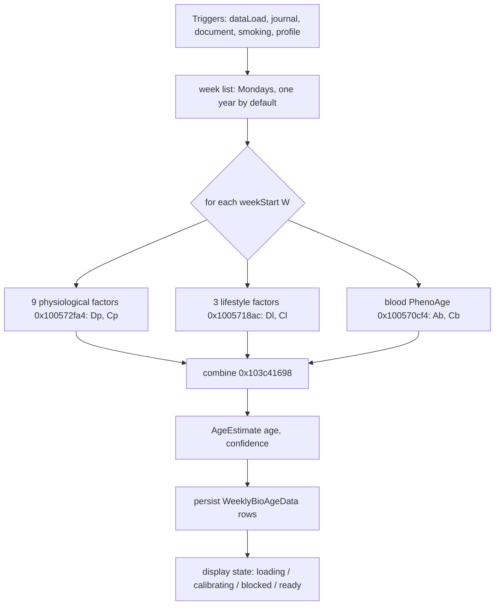
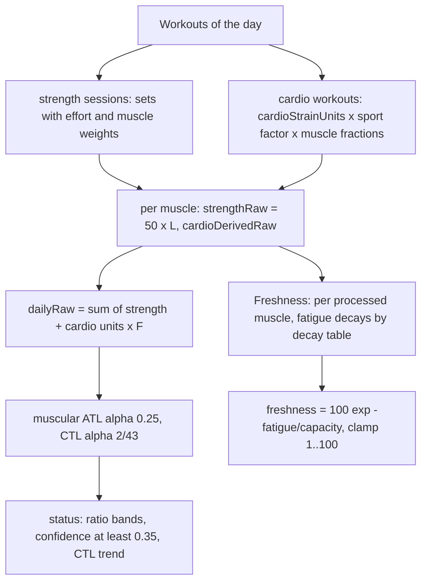

# Biological Age, Muscular Load and Muscular Freshness (Bevel 3.1.7)

Scope: M06 (Biological Age), M08 (Muscular Load), M09 (Muscular Freshness). Source: `evidence/F.md`, extended by `evidence/R.md` (R6 freshness feed and first date, R7 display-state mapping and gating order, R8 blood-row order and the NOT IN IPA boundary) and `evidence/E.md` for the workout-level muscular units. B's `data_loading.full_metrics_recalculate_window` finding is also applied.

Conventions: addresses are VAs in `Superset`. The decompiler drops `fmaxnm` / `fminnm` clamps and mislabels Swift comparison stubs; stubs at 0x104e57d6c / 78 / 84 / 90 are `>`, `<`, `>=`, `<=` (verified with `otool -Iv`). Date maths: `FUN_1030cbe4c(d, n)` = d minus n days; `FUN_1030cc894(d, n)` = d minus n years (calendar); `FUN_1030c92c8(d, 1)` = d plus 1 week; `FUN_1030ca614(d, 1)` = start of week with `firstWeekday = 2` (Monday); `FUN_1030cf508(a, b)` = calendar day difference.

## Contents

- [Biological Age architecture](#biological-age-architecture)
- [Physiological factors](#physiological-factors)
- [Lifestyle factors](#lifestyle-factors)
- [Composite](#composite)
- [Blood path (PhenoAge)](#blood-path-phenoage)
- [Weekly history, windows and overlap](#weekly-history-windows-and-overlap)
- [VO2 availability](#vo2-availability)
- [Display state and gating](#display-state-and-gating)
- [Muscular Load](#muscular-load)
- [Muscular Freshness](#muscular-freshness)
- [Task closure](#task-closure)
- [Corrections to earlier research](#corrections-to-earlier-research)

## Biological Age architecture

All local, one service. `BioAgeRecalcService` (0x100585890 ..., triggers: dataLoad, journal, document, smoking, profile; debounced AsyncStream; `BioAgeRecalcTrigger{fromDate | full}`) to `BioAgeService.recalculateFromDate / recalculateAll` (`Superset/BioAgeService+Recalculation.swift`) to 0x100591080 (date, isFull) to 0x1005910fc (week list) to 0x1005914c8 to 0x100591694 (loop head).



For every weekStart W: `async let physio = 0x100592cac to 0x100572fa4 (9 factors)`; `lifestyle = 0x100592dd4 to 0x1005718ac (3 factors)`; `blood = 0x100592ef4 to 0x100570cf4`; combine `0x103c41698(A, Dp, Cp, Dl, Cl, Ab, Cb, bloodNil)` gives `AgeEstimate(age, confidence)?`. Then 0x100592170 / 0x100591ff4 flatten arrays and `persistBioAge` (0x100564c18 ...) writes `PhysioMetricDeltaYears` / `LifestyleMetricDeltaYears` rows plus the derived score (`WeeklyBioAgeData`: weekStart, chronologicalAge, bioEstimate, physio/lifestyle breakdowns, bloodEstimate, bloodCompleteness, bloodFreshness, biomarkerSamples).

Preconditions in the loop head (0x100591694, asm): effective sex via protocol (`FUN_1005915c8`): `BiologicalSex` raw 0 male, 1 female, 2 other/missing; 2 logs "Effective sex is missing. Skipping bio age calculations." and returns. Birthday nil logs "Birthday is missing. Skipping bio age calculations." `isMale = (sex byte == 0)` (`cset w26, eq`).

## Physiological factors

There is no factor selection or renormalisation step. Nine physiological factors are always evaluated, in iteration order `[0, 1, 2, 3, 4, 5, 7, 6, 8]` (array at 0x1061ff138). Each yields a `PhysioMetricDeltaYears` record `(kind, metricValue?, hazardRatio?, deltaYears?, confidence, validDays, rangeSegments)` (0x1005736f0). A factor with no data has `metricValue / hazardRatio / deltaYears = nil` and confidence 0. The composite uses:

```ts
Dp = sum of non-nil deltaYears over the 9 records            // 0x100576cfc: plain add loop, missing contributes 0
Cp = mean(confidence) over ALL 9 records, nil ones included   // 0x103c45990
Dl, Cl identically over the 3 lifestyle records (0x100572d38, 0x103c4496c)
```

No renormalisation of Dp for missing factors and no overlap or correlation correction: plain additions. Missing factors only lower the confidence mean.

Window for every factor: D = weekStart W; 28 calendar days `W-28d ... W-1d` (see weekly windows). Dispatch is 0x1005736f0; kinds are the tag byte `*(x22+0xd9)`.

| kind | factor | producer | daily source (HealthMetric index / BioMetric) | aggregate over window |
|---|---|---|---|---|
| 0 | sleepDuration | 0x100573e08 to 0x100573f3c | HealthMetric 12 `timeAsleepMinutes` | mean of (min/60) over days with a value |
| 1 | sleepConsistency | 0x10057445c to 0x100574590 | HealthMetric 10 `sleepConsistency` | mean |
| 2 | steps | 0x100574a94 to 0x100574bc8 | HealthMetric 25 `steps` | mean (also receives age A) |
| 3 | zone2to3Time | 0x1005750cc(0) to 0x100575204 | HealthMetric 27 `zone2and3Minutes` | sum x 0.25 (minutes per week) |
| 4 | zone4to5Time | 0x1005750cc(1) | HealthMetric 28 `zone4and5Minutes` | sum x 0.25 |
| 5 | strengthTraining | 0x100575734 to 0x100575868 | HealthMetric 29 `strengthTrainingMinutes` | sum x 0.25 |
| 6 | restingHeartRate | 0x100575d48 to 0x100575e7c | HealthMetric 1 `restingHeartRate` | mean |
| 7 | vo2Max | 0x100576380 to 0x1005763e4 | raw samples, BioMetric key 0 `vo2Max` | mean of samples with `windowStart <= t < D` |
| 8 | leanBodyMass (percent) | 0x1005766e8 to 0x10057674c | raw samples, BioMetric key 6 `leanBodyPercentage` | mean of samples with `windowStart <= t < D` |

Daily sources are a Combine `@Published` dictionary on the service's metrics provider (keypath DAT_104ef7478 / 104ef74a0; value = array indexed by HealthMetric raw index, enum cases value(Float) / ... / nil). Raw samples are `@Published [BioMetric: [(Double value?, Date)]]` (DAT_104ef74c0 / 104ef74e8). Day = `Calendar.current.startOfDay`. Day-level loop (all day-based producers, e.g. 0x100573f3c lines about 60-150): for each of the days from `FUN_1030e44c0(windowStart, D)`, look up dict[startOfDay]; take the Float at the metric index; skip when the enum case is "nil"; count++. Result `(mean | sum, isNil = count < 1, count)`. Zero valid days gives `isNil`.

Hazard and delta (0x1005736f0, asm 0x100573800-0x100573818):

```ts
if (x == nil) { hazard = nil; delta = nil }
else { (HR, hrNil) = 103c4c110(x, age_or_isMale_payload, kindCode)      // 0x103c4c110
       if (hrNil) { hazard = nil; delta = nil } else delta = 10 * Math.log(HR) }   // fmul d0,d0,#10.0 after log
confidence = kind in 0..6 ? Math.min(1, validDays / 20)                 // asm 0x100573914-0x100573928: fdiv 20, fcmp, fcsel gt
                          : (x != nil ? 1 : 0)                          // kinds 7 and 8 (w8 = kind-7 <= 1)
```

Per-factor kernels (constants read from data, clamps from assembly):

| factor | hazard before clamp | clamp | notes |
|---|---|---|---|
| sleepDuration (0x103c4a8c8) | `exp(0.05*(x-7.5)*(x-9))` | [0.9802, 1.24608] | x in hours |
| sleepConsistency (0x103c4a46c) | `exp((70-x)*s)`, s = 0.007 if x > 70 else 0.015 (0x10512f110 / 0x10512f118) | [0.74082, 1.16183] | |
| steps (0x103c4adf0) | `(clamp(x, 1, cap) / target)^-0.26` | [0.90484, 1.24608] | age < 60 (`fcmp d1,60; mi`): target 8000, cap 10000; age >= 60: target 6000, cap 8000 |
| zone2to3 (0x103c4ba38) | `0.75 + 0.46*exp(-x/246)` | [0.74082, 1.10517] | args 0x3fe8..., 0x104ec0090 = 0.46, 246 |
| zone4to5 (0x103c4bda4) | `0.95123 + 0.08041*exp(-x/20)` | [0.95123, 1.03045] | |
| strength (0x103c4b2a4) | `0.827 + 0.3348*exp(-x/15.14)` | [0.84366, 1.10517] | |
| RHR (0x103c4a050) | `exp(0.012*(x-ref))` | [0.63763, 1.2214] | ref from the RHR table |
| vo2Max (0x103c4b610) | `max(0.3, exp(0.038*(ref-x)))` | [0.60653, 1.28403] | |
| leanBodyMass (0x103c49af8) | `z = (bfMean - (100 - lean)) / bfSD`; z < 0: `1 + 0.12 z^2`; else `1 - max(0, 0.005*(A-35)) * z`; SD <= 0 gives 1 | [0.95123, 1.49182] | |

Reference tables (re-read from the binary; lookup `lower <= A < upper`, rows scanned in order; male selected when `isMale & 1`):

- RHR (0x103c466b0; rows `[lower, upper): male/female`): [0,26) 61/65; [26,36) 61/64; [36,46) 62/64; [46,56) 63/65; [56,66) 61/64; fallback male 62, female 64 (`0x404f..` = 62).
- VO2 (0x103c467ac): [0,20) 48/37.6; [20,30) 48/37.6; [30,40) 42.4/30.2; [40,50) 37.8/26.7; [50,60) 32.6/23.4; [60,70) 28.2/20; [70,80) 24.4/18.3; fallback 24.4/18.3.
- Body fat (0x103c468f0): [0,20) male 17/7.78, female 30/6.82; [20,40) 21.2/6.82, 32.5/7.71; [40,60) 25.2/5.19, 36.4/6.45; [60,80) 27.3/5.26, 38.9/5.41; fallback male 27.3/4.89, female 36.9/5.56 (the pairs are mean/SD).

## Lifestyle factors

Kinds 0 nutrition, 1 alcohol, 2 smoking; iteration order from `FUN_1038c6178`; 0x1005718ac / 0x100571a30 / 0x100571f28 / 0x100572904.

- Nutrition (0x10056fdd8): mean over the same 28 days of the daily nutrition score (separate `@Published` dict DAT_104ef72a8 / 72d0, value case 1 = present); nil if none. Hazard `clamp(0.96^((x-50)*1.1/10), 0.79, 1.27)`; confidence `min(1, count/20)`. No default: no days gives a nil factor with confidence 0.
- Lifestyle record: `deltaYears = 10*ln(HR)` as above. Smoking record `metricValue` for display = `clamp(10*ln(HR) / 5.007752879124892 * 100, 0, 100)` (0x103c496f4; the constant is `10*ln(1.65)`).
- Body composition (factor 8): input is `leanBodyPercentage` samples (mean in window). Derived at ingestion (0x100595d08, line about 2539): `leanBodyPercentage = leanBodyMass / bodyWeight * 100` when both exist and bodyWeight > 0; the HealthKit bodyFat fraction is multiplied by 100 (type tag 0x23, 0x100599c54). No default is substituted: no sample gives a nil factor, confidence 0, delta 0. Hazard uses `100 - lean` as body-fat percent.

### Alcohol (M06.04)

`AlcoholIntakeResolver.resolve` = 0x103c4c900, struct `Sources{onboardingDrinksPerWeek: Int?, onboardingCompletedAt: Date?, windowStart, windowEnd, journalDrinksByDay: [ymd: Double]}`.

- Journal drinks per day = (sum of Float alcohol amounts logged that day, from journal answers via 0x10056fa24) / 14.0 (0x10056f6c4, constant 14 at asm 0x10056f784); only days D-28 ... D-1 enter the dictionary.
- Aggregate (0x103c4d69c) over sorted journal days: `total`, `sinceOnboarding` (days with ymd >= ymd(onboardingCompletedAt); all days if completedAt nil), `firstDayOnOrAfterOnboarding`, `noneOnOrAfter`, `hasJournal = dict nonempty`, `anyBeforeOnboarding`. `within = start <= onboarding <= end` by (y, m, d) (0x103c4d994); `before = ymd(windowEnd) < ymd(onboarding)` (0x103c4db88).

```ts
weeks = daysBetween(ymd(windowStart), ymd(windowEnd)) / 7         // 28/7 = 4
if (onboardingDrinks == nil || (!(within && !anyBefore) && !(before && !hasJournal))) {
   // journal-only path (also the path when onboardingDrinks is present but neither case below applies)
   drinks = hasJournal && weeks > 0 ? total / weeks : nil
} else if (within && !anyBefore) {
   pre = daysBetween(windowStart, noneOnOrAfter ? windowEnd : firstDayOnOrAfter)
   drinks = weeks > 0 ? (sinceOnboarding + (onboardingDrinks / 7) * max(pre, 0)) / weeks : nil
} else /* before && !hasJournal */ { drinks = onboardingDrinks as Double }
```

Case order from asm 0x103c4c9b0-0x103c4cb80: with `onboardingDrinks` nil go straight to the journal path; with it present test `within && !anyBefore` first, then `before && !hasJournal`. Output flags: `isWithinOnboardingWindow`, `hasJournalEntry`, `isBeforeOnboardingWindow`.

Alcohol factor confidence (0x100571f28, asm 0x1005722b8-0x1005723f0; flags `w28` from the resolver: bit0 drinks nil, bit8 within, bit16 hasJournal, bit24 isBefore):

```ts
eligibleBeforeOnboarding = onboardingCompletedAt != nil && !hasJournal && isBefore && windowEnd >= (onboardingCompletedAt - 1 year)   // Comparable.>= stub 0x104e57d84 with 0x1030cc894(onb, 1)
conf = (drinks != nil && (drinks == 0 || within || eligibleBeforeOnboarding)) ? 1.0 : (hasJournal ? 1.0 : 0.0)
```

The default used when the user never logs is the profile `drinksPerWeek` ("This value is used for Biological Age unless alcohol is logged in Nutrition or Journal"); no other default. Alcohol hazard (0x103c47054): male slope 0.025 threshold 4; other slope 0.035 threshold 2 (`isMale` flag); `clamp(max(1, 1 + slope*(d - thr)), 1, 1.28)`; zero drinks gives 1.

### Smoking

Inputs (0x103c47b2c from 0x103c48c24 log clipping and 0x103c49100 accumulation). Logs are clipped to the window.
- Cigarette periods: `avgCigsPerDay = sum(intake / divisor[freq] * days) / sum(days)`, with divisor table 0x105130730 = [1, 7, 30, 365] (per day / week / month / year).
- Vaping: `avgIntensity = sum(freqFactor[f] * strengthFactor[s] * days) / sum(days)`, with `freqFactor` 0x105130750 = [1.0, 0.7, 0.3, 0.1] and `strengthFactor` 0x105130770 = [0.3, 0.7, 1.0].
- Durations are days/365.25.

The kernel input is `SmokingHazardRatioContext` (descriptor 0x1052aeeb8):

| Offset | Field |
|---|---|
| +0x00 | endOfWindow (y, m, d of the week end D) |
| +0x18 | cigDurationYears |
| +0x20 | cigQuitDate? (nil tag at +0x38) |
| +0x40 | avgCigsPerDay |
| +0x48 | vapingDurationYears |
| +0x50 | vapingQuitDate? (nil tag at +0x68) |
| +0x70 | avgVapingIntensity |

Hazard (0x103c47644, arrangement read in assembly by R2). The constants are bytes: 0.06 at 0x104ef2450, 0.05 at 0x104ebe300, 0.2 at 0x104ebe498, 0.03 at 0x104f90f38, 0.04 at 0x104ebe8a0, 0.15 inline, 0.015 at 0x10501e938, 1.65 = 0x3ffa666666666666.

```ts
const ysq = (quit) => quit == null ? 0 : (dateComponents(.day, from: quit, to: endOfWindow).day ?? 0) / 365.25;  // 0x1030f8fb8
const cig  = (1 + 0.03 * cigDur)  * (0.06 * avgCigsPerDay + Math.min(0.05 * cigDur, 0.2)) * Math.exp(-0.75 * ysq(cigQuit));
const vape = (1 + 0.015 * vapeDur) * avgVapingIntensity * Math.min(0.04 * vapeDur, 0.15) * Math.exp(-0.75 * ysq(vapeQuit));
let H = (1 + cig) + vape;
H = H <= 1 ? 1 : H;          // fcsel ls (NaN passes through)
H = H > 1.65 ? 1.65 : H;     // logs "[…] HR clamped" when changed
deltaYears = 10 * Math.log(H);                       // 0x100570b24
```

A nil quit date means a current smoker (exp(-0) = 1). No negative-elapsed clamp exists.

Smoking confidence (0x103c448e8; -0.8 at 0x105142dd0). Caller 0x1005706e0, asm 0x1005709fc-0x100570b38:

```ts
lastConfirm = max(profile.smokingBehaviorLastConfirmedAt, profile.onboardingCompletedAt)   // non-nil values; 0x101d7a7e0 ('<' stub)
if (lastConfirm == null) conf = 0;
else {
  days = dateComponents(.day, from: D /*week end*/, to: lastConfirm).day ?? 0;           // 0x1030cf508, SIGNED
  m = days / 30;
  conf = m <= 3 ? 1 : Math.max(0, 1 - 0.8 * ((m - 3) / 9) ** 2);
}
```

Days are positive when the confirmation is after the week. Weeks that end after the confirmation, or within 90 days before it, get 1. Earlier weeks decay: 0.2 at 12 months, 0 from about 13.06 months.

Profile persistence: `BioAgeProfile{id, drinksPerWeek, checkpoint, onboardingCompletedAt, smokingBehaviorLastConfirmedAt, updatedAt, syncedAt}` synced via `api/user-data/v1/biology-profile/push|pull`.

## Composite

`combine` (0x103c41698, asm verified), `A = (W - birthday) / 31557600 s` (0x100591980, divisor 365.25 d):

```ts
function combine(A, Dp, Cp, Dl, Cl, Ab, Cb, bloodNil) {
  const w = Math.max(A, 30);                         // fmaxnm (dropped by the decompiler)
  const bloodW = A < 50 ? 0.3 + 0.4 * (w - 30) / 20 : 0.7;      // [0.3, 0.7]
  const otherW = A < 50 ? 0.7 - 0.4 * (w - 30) / 20 : 0.3;
  const effBlood = bloodNil ? 0 : bloodW * Cb;
  const effOther = otherW * (0.7 * Cp + 0.3 * Cl);
  const total = effOther + effBlood;
  if (total <= 0) return null;                        // fcmp d17,#0; b.le
  const conf = (Cl + Cp + (bloodNil ? 0 : Cb)) / 3;
  if (conf <= 0) return null;                         // fcmp d8,#0; b.le
  const age = ((A + Dp + Dl) * effOther + (bloodNil ? 0 : Ab) * effBlood) / total;
  return sanitize(age) ? { age: clamp(age, 0, 150), confidence: conf } : null;      // 0x1038cd3b8: NaN gives nil, else clip [0, 150]
}
```

`Ab` and `Cb` are zeroed when `bloodNil`. The A < 30 case uses weight 0.3 (the max with 30 clamps). With wearable-only data: blood nil; Cl is 0 if there is no nutrition, alcohol or smoking record confidence; `conf` stays > 0 whenever Cp > 0.

Projection (display only, 0x103c419a8): `rate = clamp(B/A, 0.6, 1.6)` if A > 0 else 0.6 (constant 0x105142dc8 = 1.6); 22 points y = 0..21: `(date + y years, projectedBio = B + rate*y [sanitised, falls back to A + y], chrono = A + y)`; caller 0x100468328 converts to Float pairs for the chart. Confidence tier for the UI (0x103e027dc): conf <= 0 gives missingData; (0, 1/3) low; [1/3, 2/3) medium; [2/3, 1) high; >= 1 max.

## Blood path (PhenoAge)

0x100570cf4: 0x100551dc8 fetches `(Biomarker -> sample)` for the nine PhenoAge markers (remap table 0x104ef6bb2 from PhenoAgeBiomarker to Biomarker raw index: albumin 53, creatinine 50, glucose 69, ALP 55, lymphocyte % 47, MCV 20, RDW 24, WBC 40, hsCRP 34) with two dates D and D-365d (0x100551e4c: `FUN_1030cbe4c(out, 0x16d)`) via GRDB (`ConfirmedBiomarkerSampleRecord`). One sample per marker results (`Dictionary(uniqueKeysWithValues:)`, 0x100bbd2ec). Then (0x100570d98, asm verified):

```ts
(phenoAge, usedSamples) = 103c44c7c(samples, A)       // unit conversion 0x103c4532c, PhenoAge regression 0x103c456d8
if (usedSamples == nil) return nil
fresh = mean freshness over usedSamples               // 0x103c43d64
cover = sum(weights of markers with calendarAge(collectedAt vs D) < 366) / sum(all 9 weights)    // 0x103c4443c, 0x103c447d4: cmp x0,#0x16e; signed lt
conf = cover >= 0.95 ? fresh : 0                      // fcmp d0,0.95; b.ge (asm 0x100570e1c-e2c)
if (conf <= 0) return nil else AgeEstimate(sanitize(phenoAge), conf)
```

Freshness tiers (0x103c43680 asm; n = calendar days from collectedAt to D; unsigned compares): n <= 90 gives 1.0; 91..180 gives 0.75; 181..272 gives 0.5; 273..365 gives 0.25; >= 366 or a future date (wraps unsigned) gives 0.

Coverage weights (0x1051300d8; marker order albumin, creatinine, glucose, ALP, lymph %, MCV, RDW, WBC, hsCRP): 1.4448, 0.684, 0.99603, 0.133, 0.36, 2.412, 4.2978, 0.3601, 0.15354037684621316.

PhenoAge coefficient table 0x106219e10 (32-byte records marker id, unit code, coef, logFlag): albumin -0.0336 (unit 6); creatinine 0.0095 (11); glucose 0.1953 (10); hsCRP 0.0954 (1, log = 1); lymph % -0.012 (24); MCV 0.0268 (22); RDW 0.3306 (24); ALP 0.0019 (16); WBC 0.0554 (20).

```ts
L = -19.9067 + 0.0804 * A + sum(coef * marker)
M = 1 - Math.exp(Math.exp(L) * -1.51714167042929 / 0.0076927)
phenoAge = 141.50225 + Math.log(-0.00553 * Math.log(1 - M)) / 0.090165      // constants at 0x105142dd8..0x105142e08
```

### Blood query and the row-order boundary (R8)

The request (`FUN_100557580`, calls in order) builds filters through `FUN_102fcddc4`: `deletedAt IS NULL`; `date IS NOT NULL`; `date <= D` (operator `0x102fee804`, `<=`); optional `date >= lower` (`0x102fee870`, `>=`); optional `markerId IN (array)` (`FUN_102fefd58`, only when the array argument is non-nil). After the filters come the join and selection (`FUN_10302f484`, `FUN_102fc7d40`, `FUN_102fd1540`), the annotation `document.date AS "collectedAt"` (`FUN_10301ccc8` to `FUN_102febf40` to `FUN_102fddfec(..., "collectedAt")` to `FUN_102fce144`), then fetch (`FUN_102f5d354`, `FUN_102f4d23c`). There is NO ORDER BY and NO LIMIT built anywhere in the function.

```sql
-- tables health_document (HealthDocumentRecord: deletedAt col 3, date col 6) JOIN confirmed_biomarker_sample
WHERE document.deletedAt IS NULL AND document.date IS NOT NULL
  AND document.date <= :D                      -- D = weekly date W (Monday 00:00); a test dated in the current week is excluded until next week
  [AND document.date >= :D - 365d]             -- weekly path passes D-365d; the blood banner path 0x100457e90 passes now-365d (FUN_1030cbe4c(date, 0x16d), then 0x1005545fc)
  AND sample.markerId IN (9 PhenoAge marker ids, remapped 53,50,69,55,47,20,24,40,34)
```

Fold (asm 0x100558264-0x100558624), per row in SQLite return order:

```ts
for (row of rows) {
  marker = FUN_101c84b00(row.marker); if (marker is unknown /*0x59*/) continue;       // skipped, not a break (b.ne/continue at 0x100558298)
  sample = FUN_101c7fa0c(row); 
  if (sample is not convertible /*result tag 3*/) dict.remove(marker)                // an unconvertible row DELETES any earlier sample for that marker (FUN_100baf020)
  else dict[marker] = sample                                                          // overwrite (assignWithTake FUN_100557484); no date comparison
}
```

Which sample wins is the last convertible row SQLite returns for that marker. That order is SQLite query-planner behaviour (system libsqlite3), depending on index choice among `idx_confirmed_biomarker_sample_biomarker`, `idx_confirmed_biomarker_sample_document_id`, `idx_health_document_date` and `idx_health_document_deleted_at` (schema strings 0x10593e070-0x10593e220). With the biomarker index driving: insertion (rowid) order inside each marker. With the date index driving: date ascending. The app supplies no ordering, so the IPA does not fix it: NOT IN IPA (proven). Parity rule: take the latest `collectedAt` per marker within `[D - 365 d, D]`; Bevel will usually agree but can pick an older re-uploaded report. The bound is `<= D` (not `< D`); with W at 00:00 only a test stamped exactly Monday 00:00 differs.

## Weekly history, windows and overlap

Week list (0x1005910fc, 0x100592fec, asm):

```ts
X  = userSetting("data_loading.full_metrics_recalculate_window")  // LOCAL, UserDefaults-backed; oneYear..fiveYears via _findStringSwitchCase; nil or unknown gives 0
start = max(now - (X + 1) years, fromDate)                         // 0x1005911a0: Comparable.>= (stub 0x104e57d84)
firstW = startOfWeek(start) + 1 week
lastW  = startOfWeek(now)                                          // loop condition `<=` (stub 0x104e57d90): the current week IS included
weeks  = [firstW, firstW + 1w, ..., lastW]                         // Monday 00:00 local, firstWeekday = 2
```

`1005910fc` calls `FUN_101dce914` (a UserDefaults-backed read), then `FUN_100050e1c` (string-switch enum, 5 maps to 0), then `FUN_1030cc894(now, X+1)`. No remote-config fetch exists in the path. Key string at 0x1058aea60; case strings `oneYear..fiveYears` at 0x1058aea30. The Bio Age list subtracts X+1 CALENDAR years (`FUN_1030cc894` = `Calendar.date(byAdding: .year, value: -(X+1))`). The (X+1)*365-day form belongs to metric recalculation, a different consumer of the same setting; [shared-machinery.md](shared-machinery.md#data-loading-window) lists every consumer. Default when unset is X = 0 (one year). `recalculateAll` passes the earliest date so `start = now - (X+1) y`; `recalculateFromDate(d)` passes d. Persisted per week as `WeeklyBioAgeData` (descriptor 0x105208e50).

Per-week input windows: the factor window is the 28 days `W-28d ... W-1d`. `FUN_1030e44c0(windowStart, D)` takes `C = D - 1 day`, then `FUN_1030e9e04` builds days from noon(C) stepping back one day while `day >= noon(windowStart)` (`Comparable.>=` stub 0x104e57d84, asm 0x1030ea40c and 0x1030ea5a0), so the list is `D-1 ... D-28` (28 days), sorted ascending (`FUN_1030db8cc`). Samples (VO2, lean %) use `D-28d <= t < D` (`>=` then `Date.<`, asm 0x100576550-0x100576564). Blood window D-365d ... D. Alcohol window `[D-28d, D]` with `weeks = daysBetween(start, end)/7 = 4`.

Consecutive weekly windows overlap by 21 days (rolling 28-day windows at a 7-day stride). That is the only overlap in the code. The documented "overlap correction between correlated factors" does not exist (NOT IN IPA, proven): the combination is `A + sum(deltas)` with no pairwise term (asm of 0x103c41698 and sums 0x100576cfc / 0x100572d38 contain no correlation constants). A given W is fully determined by data strictly before W (blood/physio).

Triggers (`BioAgeRecalcService`, fields at descriptor 0x105209704). Sources are dataLoad, journal, document, smoking and profile (`BioAgeRecalcSource`). The trigger is `BioAgeRecalcTrigger{fromDate(Date), full}`. Log strings: "Algo version is stale at startup. Running full recalculate" (startup) and "Somehow finished an initial data load without knowing where we started. Treating as full recalculation."

Enqueue 0x1005878f4 merges pending triggers with 0x100587c58:
- nothing pending: take the new trigger;
- either side is `.full`: `.full`;
- otherwise `.fromDate(min(a, b))`.

The sources are accumulated for the log.

`fromDate` per source (R2 item 5):

| Source | Code | Trigger |
|---|---|---|
| dataLoad | 0x100582e68 | `HealthDataReloadEvent{type, scope, time}` with `type = .dataLoad(DataUpdateType)` and `scope` all or nutrition only. The other scopes (cycleTracking, bioAge, bio) and `.observation` are ignored. `.fromDate(d)` gives fromDate(d), the start of the reload that just completed. `.initial` gives `.full` (with the log). `.full` gives `.full`. A full recalculate publishes `.dataLoad(.full)` (0x101605c2c). |
| journal | 0x10058373c | Only changes whose `factorKey` is in {"alcohol"} (0x10058220c). fromDate = min(change.date) over them (0x101889e68). |
| document | 0x100584228 | fromDate = min(`HealthDocument.date`) over the changed documents with a date. No dated document gives no trigger. |
| smoking | 0x100584ac8 | Every date sent by `SmokingLogRepository.logChanges` gives fromDate(date). save: asOfDate (0x1005692ec); replaceLog: min(previousDate, newLog.asOfDate) (0x10056b640); deleteLog: asOfDate (0x10056bff0); clear: `distantPast` (0x10056c7cc); upsertFromServer: startOfDay(asOfDate) (0x10056e068). |
| profile | 0x100586514 | Only when `smokingBehaviorLastConfirmedAt` changes between the previous and the new profile (both nil or equal: nothing). New value nil gives `.full`; otherwise fromDate(new value). |

The week list then starts at `max(now - (X+1) years, fromDate)`. After recalculation a CurrentValueSubject emits false (isCalculating) and the "New Biological Age Available" banner logic reads the week records.

## VO2 availability

NOT IN IPA (proven) for a VO2 estimator: Bevel never estimates VO2 max. The factor reads BioMetric `vo2Max` samples only. Samples arrive through `BioBackgroundQueryService` (anchored HealthKit query, "[BIO ANCHOR QUERY]") and from Garmin, Oura and Google Health integrations ("bio data point sourced from ..." strings), stored by `BioBodyCompositionDatabaseManager`. Availability rule: at least one sample with `D-28d <= t < D`; value = arithmetic mean; confidence = 1 if any sample else 0 (kinds 7 and 8). No code references a VO2 formula; the only VO2 numerics are the reference table and the hazard kernel.

## Display state and gating

(R7 resolves F's "not recovered" item.) Pipeline: `streamBiologicalAge(for:)` = `FUN_10058bb4c(weeks, date)` to `FUN_10058c1a4` to ... `FUN_10058bd88`. The scores stream (closure `FUN_10058fe50` to `FUN_10058c960`) builds `{scores, chronologicalAge = FUN_100589b14() (Double?), isCalibrating = FUN_10058feb4(scores, date)}`. The restriction stream: `Deferred` (`FUN_10058cef4` to `FUN_10058cc88`; `CurrentValueSubject` seeded with 6 = unknown) to `share` to `compactMap` (`FUN_1003afb50`). `CombineLatest(scores, restriction)` to `compactMap(FUN_10058c638)` gives `BioAgeState`. The view model (`FUN_100459120`, transform of the VM stream) calls `FUN_10045b834(...)`, which produces `BioAgeDisplayState`. The same builder is also used by 0x101e64ca8 and 0x101e8c9a0. `BioAgeStateController` has no logic of its own (it is the `_stateController` stored property of `BiologyViewModel`, written from one place, the stream consumer 0x1004589c0).

```ts
// FUN_10058feb4 (asm 0x100590044-0x100590168)
isCalibrating = (s = scores.first(x => Calendar.current.isDate(x.weekStart, inSameDayAs: date))) ? s.bioEstimate == nil : false

// BioAgeRestrictionService (FUN_100597de8 to FUN_1005981b4, asm 0x1005983a4-0x1005986b0)
function restriction(profile: SharedUserProfile?, isPaid: Bool /*StoreModel via FUN_101e93180, debug override FUN_101b99830*/, onboardingDone: Bool) {
  const age = profile ? profile.ageYears /*FUN_10310e084*/ : nil
  if (age != nil && age < 18) return userUnderAge18            // cmp x25,#0x12 lt; precedes the paid check
  if (!isPaid) return unpaid
  if (!onboardingDone) return onboardingIncomplete
  if (profile?.birthday == nil) return missingAgeOrSex
  if (profile == nil || effectiveSex(profile) == other(2)) return missingAgeOrSex   // cmp w19,#2 gives 3
  return nil /*4*/ }

// FUN_10058c638 (asm 0x10058c650-0x10058c6a4): input {scores, chrono?, isCalibrating, restriction? (4 = none, 5 = not yet known)}
if (restriction == NOT_KNOWN) -> no emission (compactMap nil, 0xfcfe)
else if (restriction != nil) -> BioAgeState.blocked(Data{scores, chrono}, restriction)     // 0x4000 | r<<8
else if (isCalibrating)      -> .calibrating(Data)
else                         -> .ready(Data)                                                // 0x8000

// FUN_10045b834(out, scores, chrono?, state, date)
(weekRange, daysUntilUpdate) = FUN_10045c230(date)     // startOfWeek(+1 week) formatting " - " and day count
range = chrono == nil ? [20, 40] : [chrono - 5, chrono + 5]
switch (state) {
  case calibrating: return .calibrating({weekRange, daysUntilUpdate, chrono, minAge: range.lo, maxAge: range.hi, missingBlood: FUN_10045dc80(cur)})
  case blocked(r):  return .blocked({r, weekRange, daysUntilUpdate, chrono, range.lo, range.hi, missingBlood})
  case ready:
    cur = FUN_10045bf60(scores, date)                  // this week's DerivedAgeScore
    if (!cur || cur.bioEstimate == nil) return .loading({weekRange, daysUntilUpdate})
    prev = FUN_10045bf60(scores, previous week)
    comparison = (prev?.bioEstimate == nil || |bio - prev.bio| < 0.1) ? noChange        // FUN_10045de0c: 0.1 at 0x104ebf1b0, fabd/fcmp
               : (bio - prev.bio <= 0 ? decreased(prev) : increased(prev))
    hist = sorted scores' bioEstimate ages (FUN_10045df3c)
    [minAge, maxAge] = gaugeRange(bio, cur.chronologicalAge, hist)                      // FUN_103c462fc
    return .ready({bioAge: bio, chronologicalAge, weekRange, daysUntilUpdate, minAge, maxAge, comparison, confidence: cur.bioEstimate.confidence, missingBlood})
}
missingBlood(cur) = cur == nil ? 9 : (cur.bloodEstimate == nil ? 9 - cur.presentBloodBiomarkerCount : nil)    // FUN_10045dc80; 9 = PhenoAge markers
function gaugeRange(bio, chrono, hist) {               // asm 0x103c46324-0x103c46448
  devs = [|bio - chrono|]; if (hist.length) devs.push(|hist.last - chrono|)
  dev = max(devs)
  ladder = [5, 10, 20, 30, 45, 60, 75]                 // array 0x10621a008
  span = ladder.find(L => !(dev > 0.85 * L)) ?? 75     // 0.85 = 0x3feb333333333333; an empty ladder is impossible
  return chrono >= 18 ? [max(chrono - span, 18), min(chrono + span, 120)] : [18, min(18 + span, 120)] }
```

Gating order: not-known restriction (nothing shown yet), then blocked, then calibrating, then ready; ready falls back to loading when the current week has no bio estimate. F's "delta badge" at 0x100448a74 (`fabd` then `fcmp d0, 0.1; b.mi`, strictly less so a gap of exactly 0.1 is NOT "in line"; then `bio - chrono > 0` older, `<= 0` younger) is a view helper; the model comparison is the week-over-week rule above. `BioAgeRestrictionState` cases: userUnderAge18, unpaid, onboardingIncomplete, missingAgeOrSex; the coaching enum `BioAgeCalibrationReason` (missingMetrics, missingProfile) comes from the persisted weekly scores.

## Muscular Load

### Data model

`MuscleRawLoad{strengthRaw: Float, cardioDerivedRaw: Float}` (0x1051fe490); per-day `MuscularFreshnessMetrics{muscleLoads: [StrengthMuscleGroup: MuscleRawLoad]}`; `MuscularLoadMetrics{atl?, ctl?, dailyRaw?: Float}` (0x1051fe644); both live inside `CumulativeMetrics{atl, ctl, targetStrain, workoutImpacts, dailyTrimp, muscularLoad, muscularFreshness}` (0x10523181c; JSON via encode/decodeMuscularLoad; DB migration `B2026_07_16_UpsertMuscularMetrics`). Display models: `MuscularLoadData{atl, displayLoad, optimalRangeStart, optimalRangeEnd, calibrationConfidence, ctlMaturity, trainingDensity, recency, dailyRaw, ratio, status}`; `MuscleFreshness{muscle, freshnessPercent, status, capacity, personalizedCapacity?, observationCount, fatigue}`; `MuscularFreshnessData{muscles, categories, overallFreshnessPercent}`. `LoadStatus` (0x1052b409c): 0 calibrating, 1 detraining, 2 maintaining, 3 peaking, 4 productive, 5 fatigued, 6 overtraining. `MuscularFreshnessStatus`: 0 calibrating, 1 recovered, 2 fatigued, 3 depleted. 22 `StrengthMuscleGroup` cases (index): abductors 0, abs 1, adductors 2, biceps 3, calves 4, chest 5, core 6, forearm 7, glutes 8, hamstrings 9, hipFlexors 10, lats 11, lowerBack 12, middleBack 13, neck 14, obliques 15, quads 16, rotatorCuff 17, shoulder 18, traps 19, triceps 20, upperBack 21. Categories: legs 0, shoulders 1, core 2, arms 3, chest 4, back 5.



### Cardio-to-muscular conversion (M08.01)

Per workout `w` (protocol existential, 40 bytes; slots +0x20 sport byte = `WorkoutActivityType` raw, +0x28 `cardioStrainUnits: Float?`, +0x30 `muscularStrainUnits: Float?`, +0x38 strength sessions):

```ts
cardioMuscularUnits(w) = (w.cardioStrainUnits ?? 0) * F[sport]                // Float table 0x104ec2fac (identical Double table 0x104ec2148)
perMuscle[m]           = w.cardioStrainUnits * F[sport] * frac[sport][m]        // 0x100085838; only when the product > 0
```

Sport factors F (nonzero only; `WorkoutActivityType` indices): indoorWalking (20) 0.12, outdoorWalking (21) 0.12, indoorRunning (22) 0.35, outdoorRunning (23) 0.35, indoorCycling (24) 0.30, outdoorCycling (25) 0.30, handCycling (26) 0.30, elliptical (28) 0.25, hiit (30) 0.45, hiking (44) 0.35, rowing (52) 0.40, swimming (55) 0.25, mixedMetabolicCardioTraining (73) 0.45, mixedCardio (78) 0.45. All other types 0 (strengthTraining 66 has 0).

Per-sport muscle fractions (0x1000857b4 switch; Double arrays, each sums to 1):

- walking 20 / 21 [0x1060289d8]: quads .30, glutes .25, calves .20, hamstrings .15, hipFlexors .10. Running 22 / 23 and hiking 44 [0x106028a48]: identical to walking.
- cycling 24 / 25 / 26 [0x106028ab8]: quads .40, glutes .25, calves .15, hamstrings .10, hipFlexors .10.
- elliptical 28 [0x106028848]: quads .30, glutes .25, hamstrings .15, calves .15, hipFlexors .10, core .05.
- hiit 30, 73, 78 [0x1060287a8]: quads .25, glutes .20, hamstrings .15, calves .10, core .10, shoulder .10, chest .05, lats .05.
- rowing 52 [0x106028958]: quads .30, lats .25, glutes .20, hamstrings .10, biceps .10, core .05.
- swimming 55 [0x1060288c8]: lats .30, shoulder .20, chest .15, triceps .10, core .10, quads .10, calves .05.
- any other sport: empty map, no cardio-derived load.

Daily totals: `dailyRaw` gets `(strength S_w or overlay) + cardioUnits*F` per workout (0x10008b9d0); the per-muscle dict is the sum over workouts (0x100085b1c = sum of the 0x100085464 strength dict and the 0x100085838 cardio dict; nil when empty). `cardioStrainUnits` and `muscularStrainUnits` are columns of `WorkoutSummaryScores` computed in the workout strain pipeline (see [strain-load.md](strain-load.md#workout-level-units-and-trimp)).

### Lifting-data branch (M08.03)

`StrengthSession` = array in the workout (+0x38) with fields `sets` (array, record offset +0x1c) and `estimatedEffort: Double?` (+0x20). In 0x10008b9d0: if `sessions` is empty the workout contributes `muscularStrainUnits ?? 0` (UI "overlay muscular units"); otherwise `S_w = sum over sessions of 0x1015ad2d4(session)`, ignoring the overlay. Per session (0x1015acb64, asm 0x1015acca0-0x1015acfb0), for each set `s` of exercise `e`:

```ts
rpe   = setRPE(s, sessionEstimatedEffort)               // 0x103e45650
w[e]  = muscle weights: each primary muscle 1/nPrimary; each secondary muscle 0.5/nSecondary (secondary overwrites if also primary)    // 0x1015ac7f4
raw[m] += rpe * w[e][m]                                 // fmul d0,d8,d9; no reps/weight/volume term
// after all sets:
L[m] = 100 * Math.atan(raw[m] * k[m] / 150)             // k from 0x104f93f20; 150 = 0x4062c0..; 100 = 0x4059..
```

Session dictionaries are summed over sessions (0x1015ad2d4) and `S_w = 50.0 * sum_m L[m]` (asm 0x1015ad6d0 `fmul 50.0`); per-muscle strength raw = `50 * L[m]` (0x100085300, constant 50 at 0x100085300). `k[m]`: abductors 1.8, abs 3.0, adductors 1.8, biceps 2.0, calves 1.6, chest 3.6, core 3.0, forearm 1.4, glutes 4.0, hamstrings 2.8, hipFlexors 2.2, lats 3.2, lowerBack 2.4, middleBack 3.0, neck 1.0, obliques 2.6, quads 3.6, rotatorCuff 1.2, shoulder 2.4, traps 4.4, triceps 1.8, upperBack 3.4.

Set RPE (0x103e45650, asm): fallback `f = sessionEstimatedEffort ?? 5.0`; if the set's analysis dictionary (offset 0x40, `[String: Double]`) is nil or empty returns f. Else `steLoss_v1` present: `r = 3 + 10*steLoss` else `r = 3`; then if `detectedReps_v1` present: `|detectedReps - recordedReps| > 5` (recorded nil = 0) returns f, otherwise clamp r to [3, 10]; if absent: `steLoss present ? clamp(max(r, 3), .., 10) : f`. Recorded weight, reps count and equipment never enter muscular load; they enter 1RM and volume stats only. Magnitude check: 5 sets x RPE 8 of a single-primary chest exercise gives raw `5*8*3.6/150 = 0.96`, `L = 100*atan(0.96) = 76.4`, strengthRaw = 3820, consistent with the default capacities (4500).

### Producer and status (M08.02)

Producer (cumulative loop 0x1015e9840, day iteration ascending, calls 0x1015efbc4 once per day with the previous day's state; the same function updates the Cardio Load ATL/CTL). Muscular half (asm epilogue 0x1015f06f8-0x1015f0798):

```ts
daily = sum over workouts W(day) of 10008b9d0(w)                       // Float
perMuscle = 100085b1c(workouts)                                         // nil if empty, so muscularFreshness is nil
muscATL' = 0.25 * daily + (prev == nil ? 0 : 0.75 * prevATL)            // 0.75 = fmov #0.75
muscCTL' = 0.046511628 * daily + (prev == nil ? 0 : 0.95348835 * prevCTL)    // 2/43; 0.046511628 = 0x3d3e82fa, 0.95348835 = 0x3f7417d0
store MuscularLoadMetrics(atl: muscATL', ctl: muscCTL', dailyRaw: daily), muscularFreshness: perMuscle
```

No seed beyond "prev nil". Display (0x10008bd08, caller 0x101db5d6c; asm verified 0x10008c1f0-0x10008c320): input `[(date, MuscularLoadMetrics)]` sorted ascending by date (0x100083908); days with nil dailyRaw produce no output element but still advance the windows with 0.

```ts
for each day d (ascending):
  raw = dailyRaw ?? 0
  trainingFlags.push(raw > 250); keep last 42 flags; trainedDays = sum(flags)           // 0x10008b85c: removeFirst when count >= 42 before append
  rawWindow.push(raw); keep last 28                                                       // removeFirst when count >= 28 before append
  if (dailyRaw == nil) emit nothing
  if (ATL or CTL not finite) emit nothing
  ratio = CTL > 0 ? ATL / CTL : 0
  ctlMaturity = min(1, CTL / 1500)
  trainingDensity = min(1, trainedDays / 28)
  recency = n >= 2 ? min(1, 0.25 * sum over i = 0..n-2 with dist = (n-1-i) <= 15 and rawWindow[i] > 250 of (1 - dist/16)) : 0     // excludes today
  confidence = min(trainingDensity, recency)
  pctCTL = prevCTL > 0 ? (CTL - prevCTL) / prevCTL * 100 : (none)                        // prevCTL = CTL of the previous emitted day
  trend  = pctCTL > 5 ? rising : pctCTL < -5 ? falling : stable                          // none gives stable
  status: if (confidence < 0.35 || !(prevCTL > 0)) calibrating(0)                         // fcmp d3,0.35; b.mi; fcmp s13,#0; b.ls
          else ratio >= 1.5 overtraining(6); >= 1.3 fatigued(5); >= 1.05 productive(4); >= 0.95 maintaining(2);
               >= 0.8 ? (rising peaking(3) : falling detraining(1) : stable maintaining(2)) : detraining(1)
  displayLoad = ATL / 50; optimalRange = [0.8 * CTL / 50, 1.5 * CTL / 50]               // constants at 0x104ec2f80 (0.8, 1.5), 50.0
  emit MuscularLoadData(atl, displayLoad, optStart, optEnd, confidence, ctlMaturity, trainingDensity, recency, dailyRaw, ratio, status)
```

These match the in-app "Muscular Load Status Logic" debug text (strings 0x10596cde0...). The UI also shows a 30-day display history. Cardio Load uses sibling rules in 0x1015efbc4 ([strain-load.md](strain-load.md#cardio-load)). Note: [shared-machinery.md](shared-machinery.md#g07-null-calibration-and-error-gates) summarizes this gate from B with a different `ctlMaturity` definition; F's (asm-verified) version above is the one to implement.

## Muscular Freshness

### Kernel (M09.01, M09.03): `MuscularFreshnessCalculator.calculate` 0x100081efc, asm verified

The freshness input per muscle is `MuscleRawLoad(strengthRaw, cardioDerivedRaw)` exactly as above (strengthRaw = 50*L, cardioDerivedRaw = strainUnits x F x fraction). The cardio part is divided by 3 in the kernel (`0.3333333333333333`). Input `[Date: [Muscle: MuscleRawLoad]]` is converted to an array and sorted ascending by date; state `prevFatigue[m]` (starts missing = 0) and `events[m]`.

```ts
for (day of sortedDays)
  for (m of muscles present in day's dict)                                 // only keys of that day's dictionary are processed
    decay = DECAY[m]; base = CAP[m]                                         // tables 0x104ec1fe8, 0x104ec2098
    fatigue = strengthRaw + cardioDerivedRaw / 3 + decay * (prevFatigue[m] ?? 0)
    prevFatigue[m] = fatigue
    if (strengthRaw + cardioDerivedRaw > 0) events[m].push({ initialFatigue: strengthRaw + cardioDerivedRaw, date: day })   // undiscounted sum, cardio NOT / 3
    calib = capacityCalibration(events[m], day)                              // 0x10008303c
    cap = Math.max(1, calib?.personalizedCapacity ?? base)
    fresh = clamp(100 * Math.exp(-fatigue / cap), 1, 100)                    // lower clamp 1, upper 100 (fcmp/fcsel)
    status = calib == nil ? calibrating
           : (daysBetween(calib.latestObservationDate, day) > 42 ? calibrating          // cmp x20,#0x2a; b.le: thresholds only when <= 42 days (or day diff nil)
              : fresh >= 75 ? recovered : fresh >= 35 ? fatigued : depleted)             // fcmp d10 vs 0x4052c0.. (75), 0x4041800.. (35); csel ge
    out[m] = { freshnessPercent: fresh, status, capacity: cap, personalizedCapacity: calib?.personalizedCapacity, observationCount: calib?.count, fatigue: fatigue / cap }
categories (0x100086904): for each category c in [legs, shoulders, core, arms, chest, back]:
   members = muscles of out with CATEGORY[m] == c   // table 0x104ec23d0: abductors/abs/adductors/core/obliques = core; biceps/forearm/triceps = arms;
                                                    // calves/glutes/hamstrings/hipFlexors/quads = legs; chest = chest; lats/lowerBack/middleBack/upperBack = back; neck/rotatorCuff/shoulder/traps = shoulders
   catFresh = members.isEmpty ? 100 : mean(freshnessPercent)
   catStatus = (any member status == calibrating) ? calibrating : (catFresh >= 75 ? recovered : catFresh >= 35 ? fatigued : depleted)
overall = out.isEmpty ? 100 : mean(freshnessPercent of out)                  // unweighted mean
```

`capacityCalibration` (0x10008303c, asm): `n = events.count`; need `n >= 3` (`cmp x22,#2; b.ls` gives nil); weights `w_i = exp(-max(daysBetween(event.date, day), 0) / 28)` (days nil gives weight 1); pairs `(initialFatigue_i, w_i)` sorted ascending by value (insertion sort 0x100084480, `fcmp d0,d1; b.pl`); `personalizedCapacity = max(1, weightedQuantile(0.9))`: `W = sum w`; if `W <= 0` return the last value; walk ascending accumulating `cum`; return the first value with `cum/W >= 0.9` (`fcmp d8,d2; b.hi` continues while `0.9 > cum/W`); else the last value; `latestObservationDate = max(event.date)`; `observationCount = n`. Constant 0.9 at 0x104ec1f38, 28 at asm 0x1000832d8. Muscles whose personalized capacity is nil (fewer than 3 loaded days) still display `freshnessPercent` with the default capacity but `status = calibrating`.

Decay and base capacity per muscle (re-verified): abductors .58 / 4500; abs .62 / 4200; adductors .60 / 4300; biceps .78 / 2600; calves .52 / 4200; chest .78 / 4500; core .62 / 4500; forearm .66 / 2800; glutes .56 / 6000; hamstrings .60 / 4500; hipFlexors .56 / 3800; lats .70 / 4500; lowerBack .70 / 4200; middleBack .62 / 4500; neck .68 / 2200; obliques .62 / 4200; quads .50 / 5500; rotatorCuff .70 / 2200; shoulder .68 / 3200; traps .62 / 4500; triceps .78 / 2600; upperBack .62 / 4500.

B's G07 describes the status gate from the display side: no calibration record gives calibrating; `days = dateComponents(.day, from: record.date, to: now)`, `days >= 43` gives calibrating (consistent with `> 42` above); then >= 75 recovered, >= 35 fatigued, else depleted; freshness clamped to <= 100.

### Eligibility, rest days and the feed (M09.02, R6)

Kernel input type: 0x100081efc takes `[Date: CumulativeMetrics]` (the per-day cumulative-metrics record produced by 0x1015e9840 / 0x1015efbc4), built at 0x101db6c80 (x20) from the trend provider `MuscleGroupTrendStreamProvider` (0x101db3880; 0x101db3e48 / 0x101db51e4 to 0x101db6a30 to 0x100081efc). R6 closes the feed: `MuscleGroupTrendStreamProvider` (decomp 101db.c:2380-2440) subscribes to `HealthDataModel._publishedData` (Published projected value; `PublishedHealthDataItems` descriptor 0x105232304) through an `AsyncMapSequence` whose transform is record 0x104fec3a0 to `FUN_101db7ed4` to `FUN_101db3cbc` to `FUN_101db3e48` / `FUN_101db51e4` to `FUN_101db6a30`, which calls `FUN_100081efc` with x0 = the provider's dictionary (0x101db6c80). The only `[Date: CumulativeMetrics]` in `PublishedHealthDataItems` is `cumulativeMetricHistory`. F's 0x101db7440 is a different helper: it sums workouts inside a date interval for the chart, not the feed. The writers of that dictionary are the cumulative-metric paths feeding `HealthDataModel`:

1. Recalculation: `calculateAndUpsertCumulativeMetrics` reads the cache `FUN_1015ec004(E - cumulativeLookback, E)` then `FUN_1016c88b4(from, to, algorithmVersion "35")` then `FUN_1015931cc`; the GRDB filter is `version == "35" AND date >= from AND date <= to` (operators 0x102fee870 `>=`, 0x102fee804 `<=`). Recomputed days S ... E are then merged in.
2. Load from cache: `FUN_10168d5b4`, nil branch at 0x10168de30, reads `[startOfDay(currentDay) - maxLookbackDays, startOfDay(currentDay)]`.

First date covered = `startOfDay(currentDay) - cumulativeMetricsLookbackDays`: 365 x (DataLoadingWindow option + 1) on the recalculation path (default 365 days); `maxLookbackDays` on the cache path. Inside it, the recurrence started from a zero state 60 days before the earliest recomputed S (see strain-load.md).

Rest-day semantics (unchanged): rest days ARE keys in the dictionary (every calendar day of the cumulative loop has a `CumulativeMetrics` entry), but their `muscularFreshness` is nil, so the inner loop has no muscle keys and nothing runs. Rest days do NOT decay or restore anything: freshness changes only on days with a workout for that muscle; the time axis is workout-event based, not calendar based (a muscle trained once then idle for 30 days keeps the freshness of its last processed entry). Per-display-day point selection is 0x101db78c4 and hidden/empty chart rules are in 0x101db825c. "30-Day Muscle Freshness" is the chart window only.

### Required inputs for lifting (M09.04)

Per strength workout: (a) a list of sessions each with a list of sets; per set the exercise identity (preset from the 548-case `StrengthWorkout` catalog or a custom exercise with user-chosen primary/secondary `StrengthMuscleGroup`s); (b) per set an optional analysis dictionary `[String: Double]` with `steLoss_v1` (fractional velocity loss, 0 to about 0.7) and `detectedReps_v1`, plus recordedReps (Int) for the 5-rep agreement check; (c) per session an optional `estimatedEffort` on a 0-10 scale (default 5 when nil); (d) when no sets exist, an overlay `muscularStrainUnits` Float on the workout summary; (e) for cardio workouts only `cardioStrainUnits` (Float, Bevel's strain-unit scale) and the workout activity type. Weight, reps count and equipment are not read by Muscular Load / Freshness.

## Task closure

| Task | Status | Where |
|---|---|---|
| M06.01 Air-only factor selection / renormalization | RESOLVED: no factor selection and no renormalization; plain sums, confidence mean over all records | [Physiological factors](#physiological-factors), [Composite](#composite) |
| M06.02 weekly history and overlap | RESOLVED; the "overlap correction" is NOT IN IPA (proven) | [Weekly history](#weekly-history-windows-and-overlap) |
| M06.03 VO2 availability | VO2 estimator NOT IN IPA (proven); availability rule RESOLVED | [VO2 availability](#vo2-availability) |
| M06.04 body composition and journal defaults | RESOLVED (smoking hazard and confidence re-derived by R2) | [Lifestyle factors](#lifestyle-factors) |
| M08.01 cardio-to-muscular conversion | RESOLVED | [Muscular Load](#muscular-load) |
| M08.02 full producer/display/status path | RESOLVED | [Muscular Load](#muscular-load) |
| M08.03 optional lifting-data branch | RESOLVED | [Muscular Load](#muscular-load) |
| M09.01 cardio-to-muscle mapping | RESOLVED | [Muscular Freshness](#muscular-freshness) |
| M09.02 caller eligibility | RESOLVED (R6 closes the feed and first date) | [Muscular Freshness](#muscular-freshness) |
| M09.03 personal capacity and calibration | RESOLVED | [Muscular Freshness](#muscular-freshness) |
| M09.04 full lifting behaviour requires reps/weight/RPE not mapped by Pulse | RESOLVED (connector gap stated) | [Muscular Freshness](#muscular-freshness) |

Blood-row order inside M06.01 is NOT IN IPA (proven) by R8; see [the blood query section](#blood-query-and-the-row-order-boundary-r8).

## Corrections to earlier research

- "Factor preprocessing and overlap remain partial": all nine producers, windows, units and confidence counts are recovered; no overlap correction exists.
- Exercise denominators: minutes per week = sum over the 28-day window x 0.25.
- Blood age weight clamp `clamp((A-30)/20, 0, 1)`: same value, but the code is `max(A, 30)` and `A < 50`; at A >= 50 the weight is the constant 0.7.
- Strength raw is `50 * 100 * atan(...)` per muscle; cardio raw is strain units x sport factor x fraction; personalization is fully specified; the freshness status gate is "no personalized capacity, or last loaded day older than 42 days".
- The `BioAgeDisplayState` gating order, week-over-week comparison (|delta| < 0.1 gives noChange) and gauge ladder are recovered (R7). The earlier "delta badge" belongs to the view only.
- 0x101db7440 is not the freshness feed (R6).
- A blood row that cannot be converted deletes the marker's earlier sample in the fold (R8).
