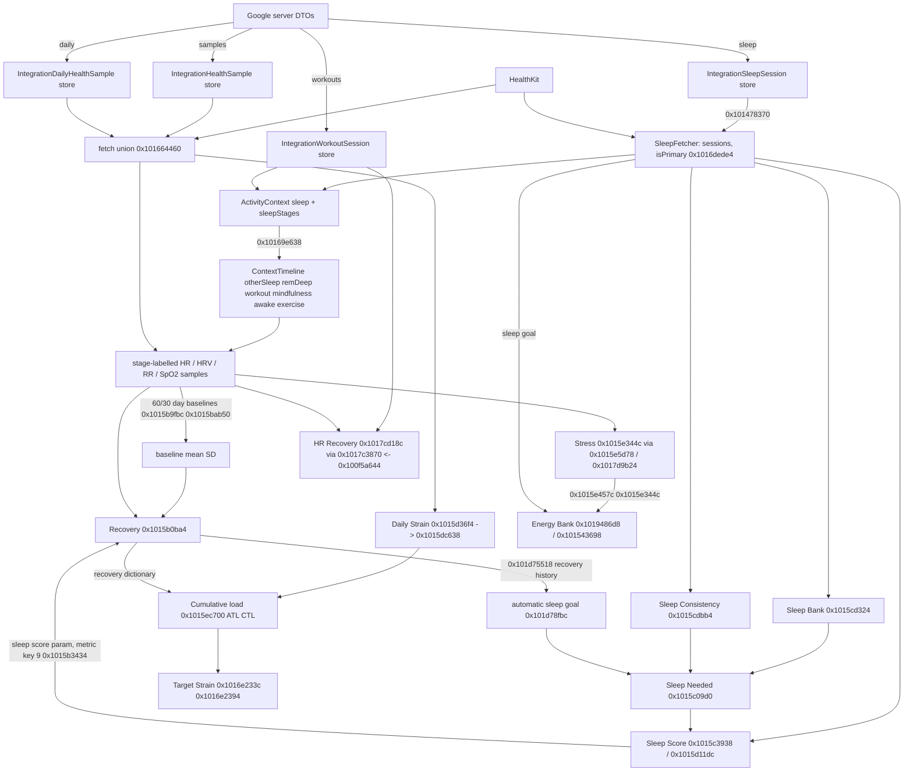

# Agent A findings: data ingestion (G01, G02, G03, G10 expectations, G11, G12)

Tools and scratch: /Users/adityajindal/bevel-re/work/A/ (va.py, ty.py, tf.py, f.py, fc.py, cc.py, sx.py, relref.py, dsym.py (annotated disassembly with stub symbol names), blscan.py, TOOLS.txt). Address conventions: unslid VAs; `FUN_x` = decompile entry in /Users/adityajindal/bevel-re/out/decomp-main/<shard>.c. Boundary comparisons stated below were re-read in assembly (Ghidra prints `<=` as `<` and `>=` as `>` for Comparable calls; resolved by the stub symbol names `$sSL2leoi`/`$sSL2geoi`).

Structure: first the shared evidence sections, then the per-task sections (G01, G02, G03, G10, G11, G12), then corrections, new discoveries, hand-offs.

## Established ingestion facts (shared by G01/G02/G03)

### Server boundary and DTOs
- Endpoints (strings.tsv 1058c6630-1058c6760): `api/integrations/v1/samples?source=google-health`, `.../daily?source=google-health`, `.../sleep?...`, `.../workouts?...`, `.../backfill?source=google-health`, `.../backfill/status?source=google-health&backfillId=`, `.../deregister?source=google-health` (1058c94c0). Request enum `IntegrationsAPIRequest` (descriptor 0x10520a4ac): googleHealthSamplesByType(GoogleHealthSampleSyncRequest), googleHealthDaily/Workouts/Sleep(GoogleHealthCursorSyncRequest), googleHealthBackfill(IntegrationBackfillRequest{dataLoadingWindowYears:Int}), googleHealthBackfillStatus(backfillId).
- Google never reaches the phone: `Google Health tokens are not stored on the client` (string 105916 6b0). All raw Google -> Bevel conversion is server side.
- Response DTOs (decoded with synthesized Codable, reflection metadata via ty.py):
  - GoogleHealthSamplesResponse 0x10520bc1c {samples:[IntegrationHealthSampleResponse], moreAvailable:Bool, nextCursor:GoogleHealthSampleCursor?}
  - IntegrationHealthSampleResponse 0x10520bc44 {sourceId:String?, sampleType:String, startDate:Date, endDate:Date, value:Double, platform:String?}
  - GoogleHealthDailyResponse 0x10520bbf4 {daily:[IntegrationDailyHealthSampleResponse], moreAvailable, nextCursor:IntegrationPaginationCursor?}
  - IntegrationDailyHealthSampleResponse 0x10520bfd0 {sourceId:String?, sampleType:String, date:String, value:Double, platform:String?}
  - GoogleHealthSleepResponse 0x10520bc6c {sleep:[IntegrationSleepSessionResponse], moreAvailable, nextCursor}; IntegrationSleepSessionResponse 0x10520bc94 {id, type:String, startTime, endTime, stages:[{sleepStage:String,startTime,endTime}], deletedAt:Date?, platform:String?}
  - GoogleHealthWorkoutsResponse 0x10520bd0c {workouts:[IntegrationWorkoutSessionResponse], moreAvailable, nextCursor}; IntegrationWorkoutSessionResponse 0x10520bd34 {id, activityType:String, startDate,endDate, activeCalories?, restingCalories?, distanceInMeters?, averageHeartRate?, title?, activeDurationSeconds?, elevationGainInMeters?, elevationLossInMeters?, averageSpeedMetersPerSecond?, averagePaceSecondsPerMeter?, averagePowerWatts?, resolvedWorkoutEffort?, pauses[{startDate,endDate}], splits[{startDate,endDate,distanceInMeters?,durationSeconds?,averageHeartRate?}], locations[{timestamp,latitudeInDegrees,longitudeInDegrees,altitudeMeters?,speedMetersPerSecond?}]?, deletedAt?, platform?}
  - Request DTOs: GoogleHealthSampleSyncRequest 0x10520ac74 {sampleType:String,lastSyncedAt,lastSampleDate,earliestDataDate,cursor,limit:Int}; GoogleHealthSampleCursor {lastSyncedAt,id?,lastSampleDate}; GoogleHealthCursorSyncRequest {lastSyncedAt?,earliestDataDate,cursor:IntegrationPaginationCursor?,limit:Int} (daily request limit constant 500 at 0x1013a3... request build, FUN_1013a31b8 stores 500).
  - Request sample types (enum GoogleHealthSampleSyncType 0x10522c3e0, 11 cases): heartRate, heartRateMinuteAggregate, heartRateVariability, steps, spo2Percentage, activeEnergy, restingEnergy, bodyWeightKg, bodyFatPercentage, bloodGlucoseMgDl, bodyTemperatureFahrenheit. Per-type UserDefaults cursors `integrations.google_health_samples_<type>_last_sync` (strings 105946630-105946940).
  - Backfill job types (IntegrationBackfillJobType ids / GoogleHealthBackfillJobTypeResponse 0x10520c008): heartRate, heartRateVariability, oxygenSaturation, activeEnergyBurned, basalEnergyBurned, steps, weight, bodyFat, bloodGlucose, coreBodyTemperature, dailyRestingHeartRate, dailyRespiratoryRate, dailyVO2Max, dailySleepTemperatureDerivations, dailyTotalCalories, dailyActiveEnergyBurned, sleep, exercise. These are the Google Health API data types the Bevel server reads (names mirror Google's data type ids).
  - Sync notifications: silent push types `new_sleep_data_available` and `new_exercise_data_available` (105916fe0/105916fc0, handler 0x10142bd44) trigger only sleep and workouts sync.
  - Daily `date` string is an 8-char `yyyyMMdd` DateKey: FUN_1030f8428 (called from the daily mapper 0x1013a2518) returns nil unless String.count == 8, parses 4+2+2 digits; invalid date -> log `Skipping Google Health daily sample with invalid date` and drop.

### Response mappers (the only client-side transform of sample/daily DTOs)
- Sample mapper FUN_1013a2050 (caller 0x1013a59c8), daily mapper FUN_1013a2518 (caller 0x1013a31b8). Per element: `if sampleType == "hrvRmssd" -> tag 8 (heartRateVariability) else tag = IntegrationHealthSampleType(rawValue: sampleType)` via FUN_10146eaa0 = Swift `_findStringSwitchCaseWithCache` over the 19-case array at 0x1060b19f0; tag 0x13 (unknown) -> record dropped with log `Skipping Google Health sample with unknown type `. Unit tag = byte table 0x104f82e40[tag]. New local id = UUID().uuidString (fresh random id every mapping). sourceId/platform copied. value copied unchanged (double). No clamping, no unit conversion, no filtering by value.
- IntegrationHealthSampleType (descriptor 0x10522e838) raw strings (verified by reading the array at 0x1060b19f0, 24-byte elements {String, caseIndex}): 0 steps, 1 activeEnergy, 2 restingEnergy, 3 totalEnergy, 4 restingHeartRate, 5 spo2Percentage, 6 heartRate, 7 heartRateMinuteAggregate, 8 heartRateVariability, 9 respiratoryRate, 10 vo2Max, 11 temperatureDeviationFahrenheit, 12 bloodPressureSystolic, 13 bloodPressureDiastolic, 14 bodyWeightKg, 15 bodyFatPercentage, 16 bloodGlucoseMgDl, 17 bodyTemperatureFahrenheit, 18 wristTemperatureFahrenheit.
- Unit table 0x104f82e40 (type tag -> IntegrationHealthSampleUnitType): [1,2,2,2,0,3,0,0,5,6,4,7,8,8,9,3,10,7,7]; IntegrationHealthSampleUnitType (0x10522e854): 0 bpm,1 count,2 kCal,3 percentDecimal,4 mlOverKgMin,5 ms,6 breathsPerMinute,7 fahrenheit,8 mmHg,9 kgs,10 mgPerDl. So: steps=count; activeEnergy/restingEnergy/totalEnergy=kCal; restingHeartRate/heartRate/hrMinuteAggregate=bpm; spo2Percentage and bodyFatPercentage=percentDecimal; HRV=ms; RR=breathsPerMinute; vo2Max=mlOverKgMin; temperature*=fahrenheit; BP=mmHg; weight=kgs; glucose=mgPerDl.
- Unit -> HealthQuantityUnitType table 0x104f96a55 (copies at 0x104f96eda, 0x104fa14ea): [1,8,2,6,4,3,1,7,21,10,20]: bpm->countPerMinute, count->count, kCal->kCal, percentDecimal->percentDecimal, mlOverKgMin->mlOverKgMin, ms->milliseconds, breathsPerMinute->countPerMinute (sic), fahrenheit->fahrenheit, mmHg->mmHg, kgs->kgs, mgPerDl->mgPerDl. The decompiled converters (FUN_101661e90 line 2139, FUN_101662804, FUN_101662fa0, FUN_101661120) copy the Double value at the sample's value slot unchanged (no /100, no F<->C).

## Dispatcher: HealthDataFetchType -> integration stores (G01/G02/G03 core)

Request enum `HealthDataFetchType` (descriptor 0x105231e8c). Payload cases first (tags 0..3): restingHeartRate(HealthDataRHRCalculation), wristTemperatureFahrenheit(temperatureBaselineFahrenheit: Double?), bodyTemperatureFahrenheit(Double?), stepsCount(ContextTimeline); no-payload cases (index 0..17): heartRateMinuteAggregates, heartRateSamples, heartRateVariabilityMilliseconds, respiratoryRateBreathsPerMinute, spo2Percent, bloodGlucoseMgDl, weightKgs, stepsTotalsCount, energyConsumedTotalsKCal, restingEnergyBurnedTotalsKCal, activeEnergyBurnedTotalsKCal, proteinConsumedTotalsGrams, carbohydratesConsumedTotalsGrams, leanBodyMass, bodyFatPercentage, vo2Max, bloodPressureSystolic, bloodPressureDiastolic.

Integration fetch (Oura + Google concurrently, results concatenated: async-let pair in FUN_101666a04: Oura record 0x104f96ab8 -> FUN_101666d20 -> FUN_10166437c -> FUN_10167af0c; Google record 0x104f96ac8 -> FUN_101666d8c -> FUN_1016643f8 -> FUN_101660370 -> dispatcher FUN_10166038c; results appended by FUN_1017e4dac, FUN_101666b98). Shared services: DAT_1064afe90 = IntegrationHealthSampleService.shared (init FUN_10146efb8), DAT_1064afe80 = IntegrationDailyHealthSampleService.shared (init FUN_10145fddc, accessor 0x10145fe5c). The Google branch always queries sourceType = googleHealth (enum value 1; oura = 0).

Dispatcher FUN_10166038c table (verified by reading each branch; helpers: S = sample store via FUN_101661c90 -> FUN_101661d48 (service witness +0x30) -> continuation FUN_101661e90; D1 = daily store via FUN_101662690 -> FUN_101662348/FUN_1016623d4 -> FUN_101662770 -> FUN_101662804; D2 = daily store via FUN_101662d4c -> FUN_101662348 -> FUN_101662eac -> FUN_101662fa0):

| Request case | Output HealthQuantityType | Integration type queried | Store |
|---|---|---|---|
| restingHeartRate(payload hrHistory) | restingHeartRate (0) / none | NOT fetched: FUN_101655bcc filters the supplied hrHistory (HealthQuantitySampleWithStage) keeping stage tag < 2 (otherSleep, remAndDeepSleep) and strips the stage | in-memory |
| wristTemperatureFahrenheit(baseline?) / bodyTemperatureFahrenheit(baseline?) | temperature (0x13) / bodyTemperature (0x14) | temperatureDeviationFahrenheit (11) only when the baseline payload is non-nil (flag byte != 1); nil baseline -> returns empty. Types 17 bodyTemperatureFahrenheit and 18 wristTemperatureFahrenheit are never requested here | D1 |
| stepsCount(ContextTimeline) | steps (0x15) | steps (0) via FUN_101660a0c path | S |
| heartRateMinuteAggregates | heartRateMinuteAggregates (4) | heartRateMinuteAggregate (7) | S |
| heartRateSamples | heartRateSamples (5) | heartRate (6) | S |
| heartRateVariabilityMilliseconds | heartRateVariability (1) | heartRateVariability (8) | S |
| respiratoryRateBreathsPerMinute | respiratoryRate (3) | respiratoryRate (9) | D1 (daily) |
| spo2Percent | spO2 (0x12) | spo2Percentage (5) | D1 (daily, NOT the sample store) |
| bloodGlucoseMgDl | bloodGlucose (0xf) | bloodGlucoseMgDl (16) | S |
| weightKgs | weight (0x22) | bodyWeightKg (14) | S |
| stepsTotalsCount | stepsDisplay (0x16) | steps (0) | S |
| energyConsumedTotalsKCal | energyConsumedDisplay (0xb) | totalEnergy (3) | D2 |
| restingEnergyBurnedTotalsKCal | restingEnergyBurnedDisplay (8) | derived: FUN_101660e20 -> FUN_101661120 (see below) | D (derived) |
| activeEnergyBurnedTotalsKCal | activeEnergyBurnedDisplay (9) | activeEnergy (1) | D2 |
| protein/carbohydrates/leanBodyMass | 0xc / 0xd / 0x30 | none (returns immediately) | - |
| bodyFatPercentage | bodyFatPercentage (0x23) | bodyFatPercentage (15) | S |
| vo2Max | vo2Max (2) | vo2Max (10) | D2 (daily) |
| bloodPressureSystolic / Diastolic | bloodPressureSystolic (0x10) / Diastolic (0x11) | bloodPressureSystolic (12) / Diastolic (13) | S |

Never read by this dispatcher for Google: restingHeartRate daily sample type (4), restingEnergy sample (2), temperature body/wrist samples (17/18), activeEnergy/restingEnergy/spo2/heartRate "daily" duplicates of sample types.
Note the naming quirk: `energyConsumedTotalsKCal` is served from Google `totalEnergy` (total calories burned). `FUN_101655bcc` evidence: 0x101655bcc keeps elements whose stage byte < 2 (`*(byte*)(...)<2`).

Conversion continuations (all verified by decompile lines 10166.c 2139 (FUN_101661e90), 3073 (FUN_101662804), 4095 (FUN_101662fa0) using byte table 0x104f96a55):
- Sample continuation FUN_101661e90: for each IntegrationHealthSample -> HealthQuantitySampleWithSource{ id=fresh UUID string, metadata=.googleHealth (HealthQuantitySampleMetadata tag via enum payload encoded 2/3 depending on source type byte), type = requested HealthQuantityType (taken from the REQUEST, not from the sample's own sampleType), unit = table[0x104f96a55][sample.unit], doubleValue = sample.value copied bit-for-bit, start/end = sample.startDate/endDate, source = HealthDataSource{rawIdentifier "GOOGLE_HEALTH", metadata googleHealth (words 0,2)} }. The sample's sourceId, platform are dropped.
- Daily continuations FUN_101662804 and FUN_101662fa0: each IntegrationDailyHealthSample (dateKey y/m/d) -> sample with start = Calendar.current.startOfDay(dateKey), end = start + 1 day (FUN_1030f8774 builds the date from the DateKey; FUN_1030cbe40/FUN_1030cbe94 add one day), value unchanged, unit via the same unit tables, same GOOGLE_HEALTH source. Day boundaries therefore use the phone's current calendar/time zone, not the server's.
- Derived resting energy (FUN_101661120, continuation of FUN_101660e20): builds a dictionary keyed by DateKey from the activeEnergy daily samples (FUN_101663844 dictionary insert), then for each totalEnergy daily sample: `rest = total.value - activeByDay[dateKey] (if present)`; if `rest < 0.0` the day is dropped; else emits sample type restingEnergyBurnedDisplay with start/end = that day's start/next start, unit kCal (unit tag 2 written at +0x22, `*(byte*)(lVar23+0x20)=0x201,0x22=2`). Units kCal.

## SleepStage and Google sleep session construction (hand-offs from agent D)

- SleepStage (descriptor 0x105233a48): 0 asleepUnspecified, 1 awake, 2 core, 3 deep, 4 rem, 5 inBed. SleepSession (0x105233a80) {segments:[SleepStageSegment], inBedSegments:[DateInterval], startTime, endTime, activityScore:Float?, isPrimary:Bool, secondsInSleepStage:[SleepStage:Float], source:HealthDataSource}. SleepStageSegment (0x1052332c8) {sleepStage, startTime, endTime, source, activityScore:Float?}. FunctionalDay (0x10523300c) {dayStart, dayEnd}. CachedSleepSample (HealthKit cache, 0x105230d80) {uuid, sleepStage, startTime, endTime, sourceMetadata}.
- Google session fetch: AppSleepIntegrationProvider.googleHealthSleep(in: DateInterval) FUN_1016d8bd8 -> async FUN_10156fe40 -> FUN_10156fec4: gated by `FUN_1014216dc(4, connectedIntegrations)` (table 0x104f881c4 maps ConnectedIntegration tags strava 3, oura 2, garmin 0, polar 1, googleHealth 4, so code 4 = googleHealth connected). If not connected returns [] immediately. Errors in the fetch are swallowed: FUN_1016d8d3c logs `SleepFetcher Google Health sleep fetch failed` and returns an empty array. Then IntegrationSleepService fetch (witness at FUN_10156ff74) and FUN_101570074 maps each IntegrationSleepSession through FUN_101478370, then FUN_10156f1b8 sorts them (merge/insertion sort on startTime).
- IntegrationSleepSession -> SleepSession conversion FUN_101478370 (called from 0x101570074 and 0x1016dbac4), exact:
  - segments[i] = SleepStageSegment{ stage = byte-table (0x04030201 >> (8*tag)): awake->1 awake, light->2 core, deep->3 deep, rem->4 rem, asleepUnspecified->0 asleepUnspecified; startTime/endTime copied; source = HealthDataSource{rawIdentifier = the session id String (first 16 bytes of IntegrationSleepSession), metadata = .googleHealth (words 0,2)}; activityScore = nil }.
  - inBedSegments = [DateInterval(session.startTime, session.endTime)] if the DateInterval init (FUN_100c00624) is valid (end >= start), else []. So the whole Google session window is the in-bed interval.
  - startTime = session.startTime, endTime = session.endTime (copied; not derived from segments).
  - activityScore = nil; isPrimary = false (assigned later, see below).
  - secondsInSleepStage: Float32 dictionary, `dict[stage] = (dict[stage] ?? 0) + Float(end.timeIntervalSince(start))` per segment (loop at 0x101478a..). It never contains stage 5 (inBed) because the Google stage enum has no in-bed case and in-bed time is kept as inBedSegments. IntegrationSleepType (sleep/nap) and platform are NOT used by this conversion; sleep vs nap is not distinguished here.
  - source = same HealthDataSource as the segments (rawIdentifier = session id).
- Shared HealthKit-style builder FUN_101d7ba70 (used by FUN_1016d7d80 for CachedSleepSample and FUN_101571a24 for Oura-app-in-HealthKit, not for Google): clusters segments with `mergeIntervals(gap = 0x409c200000000000 = 1800.0 s, ...)` (FUN_101d7d750 -> FUN_100bfff3c; input must already be sorted by start), builds per cluster SleepSession with `startTime = min(all segment starts and inBed interval starts)` else cluster start, `endTime = max(ends)` else cluster end (FUN_101d7cf98), `secondsInSleepStage[stage] += Float(end - start)` for every segment including inBed ones (no stage filter), isPrimary false. FUN_101d7dc58 extracts stage==5 (inBed) segments into inBedSegments for a flagged branch (setting forceIncludeManualSleep, `health_settings.force_include_manual_sleep_key`, see FUN_1015b8098: if flag and the first segment is not user-entered HealthKit, user-entered HealthKit segments from the full list are appended).
- Stage-segment overlap resolution sort at 0x1015c93f8 (array<SleepStageSegment>.sort(by:) specialisation FUN_1015be1f8, insertion sort when count < _minimumMergeRunLength, otherwise merge via FUN_1015c83d4; caller FUN_1015cb390 from FUN_101d7ba70): verified in assembly 0x1015c956c-0x1015c9604. With cur = a[i], prev = a[i-1]: if (cur.stage != inBed) != (prev.stage != inBed): swap iff cur is not inBed and prev is inBed (inBed segments sorted last). If both same inBed-ness: no swap iff (cur is NOT a user-entered HealthKit segment AND prev IS user-entered HealthKit), where "HealthKit" = source.metadata first word (+0x18 of the HealthDataSource) >= 4 (payload present; integration sources store tags 0..3) and user-entered = byte at source+0x40 bit0 (SampleSourceMetadata.isUserEntered). So the comparator is `cur.UEhk || !prev.UEhk` i.e. not a strict weak ordering: with no user-entered samples every element swaps to the front (order reversal inside each inBed-ness group, for count below minimum merge run length). Source priority numbers are NOT used here; Google segments (metadata tag 2) are never "user entered".
  The caller then (FUN_1015cb390) skips leading inBed elements, sorts, and inserts segments one by one into a time-ordered list with binary search on startTime/endTime (clipping later-priority segments), using FUN_1015ca840.
- Cross-source session choice and primary flag (FUN_1016dede4, called 4x from FUN_1016d75a4 / FUN_1016dcf58 once per source array, args (functionalDays, sessions, sleepSourcePriority = Published array index 7 of DAT_106a11620)):
  1. intervals = sessions' [start,end]; clusters = mergeIntervals(gap 0.0).
  2. For each cluster, take the contiguous slice of sessions and call FUN_1015b5438(slice, priorityList) which groups sessions by source (FUN_1015b8d08 key = source.rawIdentifier when a priority list exists; FUN_1015b9004 key = whole HealthDataSource when none), orders the keys and returns the sessions of the FIRST key with any sessions. Ordering when a priority list exists = FUN_101e35790 (names: Garmin -> "Garmin", Oura -> "OURA", googleHealth -> "GOOGLE_HEALTH", healthKit -> bundleIdentifier; sort predicate FUN_101e342dc: listed names ordered by list position, listed before unlisted, unlisted by String <). Without a list: FUN_1015b46cc -> comparator in FUN_1015b64ac: rank 1 = HealthKit source whose lowercased rawIdentifier has prefix "com.apple.health" and productType hasPrefix "Watch"; rank 2 = any non-Apple-Health source (includes Garmin, Oura, GOOGLE_HEALTH and third party apps); rank 3 = Apple Health non-Watch; rank 4 = user-entered HealthKit; ties broken by rawIdentifier ascending.
  3. For each FunctionalDay window, the selected sessions whose endTime lies within [dayStart, dayEnd] (both inclusive; verified `$sSL2geoi`/`$sSL2leoi` = >= and <= at 0x1016df7c0/0x1016df7e8) are sorted by FUN_1016dd8b8 -> FUN_1016de360: sessions that have at least one segment with stage core/deep/rem (property FUN_10171df70) first, then longer duration (end - start) first; the first one wins the window.
  4. Winner key = "sleep-" + (source is HealthKit ? startTime.description : source.rawIdentifier). Final: for every selected session `isPrimary = winnerKeys.contains(key(session))`. For Google sessions rawIdentifier is the unique session id, so the key is unique per session. For HealthKit sessions the key is the start timestamp description, so two HealthKit sessions with equal start would both be primary.
  Consequence: sleep stage `asleepUnspecified` (Google classic sleep) does not count as "has stages" in step 3.

## HRV method, RMSSD kernel (hand-off from agent B) and SpO2 x100 (hand-offs from B and C)

HrvMethod (0x10523680c) {appleHealth, bevelRMSSD}; RhrMethod (0x105236860) {appleHealth, bevel}; CalculationsOptions (0x105236898) carries hrvMethod, rhrMethod, hrvContext, rhrContext, caloriesDisplay, temperatureSource, sp02Window, rrWindow, stored in UserDefaults `health_settings.calculations_options_key` (SettingsUserDefaultsKeys index 15). Legacy keys (DeprecatedUserDefaultsKeys 0x10524523c): hrvAlgorithmKey (`health_settings.hrv_algorithm_key`, migration reader FUN_101dd9fd8), useMindfulnessHrvKey, per-metric `use<X>SourceKey`/`<X>SourceKey`.

HealthKit HRV fetch FUN_10166a59c (log string `[HRV DATA LOADING] HRV HISTORY (RMSSD) fetched`, FUN_10166ab98):
- Published hrvMethod byte at frame+0xb1c == 0 (appleHealth): single HKSampleQuery for the HealthKit HRV quantity type (HealthQuantityType index 1 -> HKQuantityType heartRateVariabilitySDNN, i.e. Apple's HRV is SDNN in ms) with predicate `HKQuery.predicateForSamplesWithStartDate(start,end,options: .strictStartDate (1))`; the samples are passed through as-is (FUN_10166b5f8/FUN_10166b678). No log, no RMSSD, no unit change.
- hrvMethod != 0 (bevelRMSSD): two concurrent tasks: (1) the same SDNN query (FUN_10166ce2c -> FUN_10166be74 -> FUN_10166be94), (2) heartbeat-series RMSSD (FUN_10166cea4 -> FUN_10166c394 -> FUN_10166eef0 -> FUN_10166d860 -> FUN_10166d87c = `HKSeriesType.heartbeatSeriesType` query, predicate strictStartDate, then per series FUN_10166efd4/FUN_10166e834). The result array returned by FUN_10166ab98 is ONLY the RMSSD list (task 2) after the source filter below, sorted by FUN_10166c440; the SDNN list (task 1) is used only for the emptiness check that selects the log line `(no samples)`. (Fallback to SDNN when RMSSD is empty is not in this function.)
- Source filter in FUN_10166ab98 (stable partition then truncate): keep a series sample only if source rawIdentifier/bundle id lowercased hasPrefix("com.apple.health") (FUN_1015b57ac(prefix, string) = `string.hasPrefix(prefix)`, verified in assembly 0x1015b57ac-0x1015b58f8), AND productType != nil AND productType.hasPrefix("Watch") (case sensitive) AND not user-entered. All other series (third-party, iPhone, manual) are removed.
- RMSSD kernel (HealthKit heartbeat series only). Per HKHeartbeatSeriesSample the heartbeats are (timeIntervalSinceStart: Double seconds, precededByGap: Bool). FUN_10166dcf0 splits the beats into segments: a beat with precededByGap == true starts a new segment; a segment is kept only if it has >= 4 beats (`3 < count`). FUN_10166df34 per segment, for consecutive beat triples (t[i-1], t[i], t[i+1]): RR1 = (t[i]-t[i-1])*1000, RR2 = (t[i+1]-t[i])*1000 (ms); skip the triple if any RR > 2000.0 or any RR < 300.0 (fcmgt strict, so 300 <= RR <= 2000 is kept; 0x10166dfdc-0x10166dff8); d = RR2 - RR1; ratio = d / RR1; keep iff -0.245 <= ratio <= 0.325 (constants at 0x104f96b68 = -0.245 and 0x104f96b60 = 0.325, both inclusive, asm 0x10166e010-0x10166e02c); emit d*d (ms^2). FUN_10166e0d4 pools all kept squares of all segments of the series: `rmssd = sqrt(sum(sq)/n)` (Float64), returning sqrt(0) = 0.0 when n == 0 (no guard here). FUN_10166e834 wraps it: an HKQuantitySample of unit millisecond (HKUnit.secondUnit(withMetricPrefix: milli)) from series.startDate to series.endDate, created only if endDate.timeIntervalSince(startDate) <= 345600.0 s (4 days; asm `fcmp d9,d0; b.ls` at 0x10166e8fc), else nil. So there is one HRV sample per series (typically a short Watch background measurement), not one per night.
- No log transform anywhere on this path. The same kernel is also reachable from 0x1020a1b1c / 0x1020a1f6c (sleeping HRV debug export, string `Not enough RMSSD samples during REM and deep sleep` at 0x105921620, function 0x1016f51f0).
Google/integration HRV: HealthDataFetchType.heartRateVariabilityMilliseconds -> sample store type heartRateVariability (ms), value passed through unchanged (see dispatcher above); the hrvMethod option is not consulted on that path and no RMSSD/SDNN conversion exists locally. The server decides which Google value is sent: the mapper accepts both `hrvRmssd` and `heartRateVariability` strings and treats both as the same tag 8/ms (0x1013a2050, 0x1013a2518), so the client cannot tell RMSSD from SDNN. NOT IN IPA (proven): which Google field (RMSSD vs SDNN, sample vs daily) the server writes.

SpO2 unit chain (hand-offs from B and C):
- Local storage unit: IntegrationHealthSampleUnitType.percentDecimal (type tags spo2Percentage/bodyFatPercentage in table 0x104f82e40) -> HealthQuantityUnitType.percentDecimal (table 0x104f96a55 value 6). HealthKit side: FUN_103107a54 maps HealthQuantityType 0x12 (spO2) and 0x23 (bodyFatPercentage) to `HKUnit.percentUnit()` (global DAT_106a19b18 initialised in FUN_103105c30), whose doubleValue is a FRACTION (0.97). So percentDecimal == fraction in the HealthKit path, and the Google path copies the server's double unchanged into the same unit slot (no /100, no *100 in FUN_101662804/FUN_101662fa0/FUN_101661e90). Therefore Google SpO2 is only correct if the Bevel server sends a fraction; this cannot be verified in the IPA (server field `value: Double` of IntegrationDailyHealthSampleResponse, decoded in memory without transform). The names `spo2Percentage`/`percentDecimal` are the only client-side evidence that the contract is a decimal fraction.
- The x100 step is in the Recovery builder FUN_1015b0ba4, not in the formatter: at 0x1015b1c90 the statistics helper FUN_10183bdc0 returns the mean of the current night's SpO2 Float32 samples; at 0x1015b1d08-0x1015b1d14 `s8 = Float(mean) * 100.0f` (constant 0x42c80000) gives currentSpO2Percent; that same s8 is written as the `HealthMetric.spO2` (index 36, 0x24) measurement value (entry at 0x1015b34a4: key byte 0x24, singleValue = s14 = s8, present flag cleared at 0x1015b36a4) in RecoveryMetrics.metricMeasurements, so the UI formatter FUN_1038c2da8 receives percent already (it formats HealthMetric indices {1,2,3,36,37,38} with one fraction digit; flag mask 0x700000000e at 0x1038c2f.. ). The oxygen penalty at 0x1015b366c uses `(baselineMean - baselineSD) * 100.0f - currentSpO2Percent`: baseline mean/SD are fractions (statistics of the fraction samples) and are multiplied by 100 at 0x1015b367c.
- HealthMetric enum (0x10529f840, 55 cases): 0 recoveryScore, 1 restingHeartRate, 2 heartRateVariability, 3 respiratoryRate, 4 heartRateDip, 5 daytimeHeartRate, 6 maxHeartRate, 7 meditationMinutes, 8 sleepBank, 9 sleepScore, 10 sleepConsistency, 11 timeInBedMinutes, 12 timeAsleepMinutes, 13 timeRemSleepMinutes, 14 timeDeepSleepMinutes, 15 wakeTime, 16 sleepTime, 17 sleepEfficiency, 18 timeToFallAsleep, 19 exerciseMinutes, 20 cardioMinutes, 21 activeCaloriesBurned, 22 totalCaloriesBurned, 23 strainScore, 24 trainingLoad, 25 steps, 26 zone2Minutes, 27 zone2and3Minutes, 28 zone4and5Minutes, 29 strengthTrainingMinutes, 30 stressScore, 31 activeStress, 32 inactiveStress, 33 sleepStress, 34 averageHeartRateVariability, 35 averageHeartRate, 36 spO2, 37 temperature, 38 bodyTemperature, 39 daylightMinutes, 40 energyConsumed, 41 netEnergy, 42 foodQualityScore, 43 macroBalanceBreakdown, 44 proteinConsumed, 45 carbsConsumed, 46 fatsConsumed, 47 nutritionScore, 48 glucoseAverage, 49 glucoseVariability, 50 morningFastingGlucose, 51 temperatureDeviation, 52 hrvDeviation, 53 rhrDeviation, 54 recoveryDeviation. HealthMetricUnit (0x10529f878): percentage, grams, durationInMinutes, minutesFromMidnight, seconds, milliseconds, score, beatsPerMinute, respirationsPerMinute, calories, fahrenheit, miles, feet, milesPerHour, secondsPerMile, count, pounds, reps, decibels, none, watts, yards, milligramsPerDeciliter, millimetersOfMercury.
- Recovery measurement dictionary entries seen at 0x1015b3428-0x1015b35e0 (key byte + singleValue Float?): key 9 sleepScore, key 0x24 spO2 (percent), key 0x25/0x26 temperature or bodyTemperature (selected by temperatureSource: `0x25 + (x26 == 0x10000000000)`), others for HRV/RHR/RR.

## Source merging and HealthKit statistics options (hand-off from agent G: TDEE energy source; also G01)

- Provider fan-out: FUN_101663b18 (async, no direct callers) launches three concurrent fetches of the same HealthDataFetchType request and a fourth cached lookup, then merges: (1) HealthKit: async record 0x104f96a70 -> FUN_101664148 -> FUN_1016640d8 -> FUN_101665558 -> FUN_1016655f0 (HealthKit fetch switch); (2) Garmin core-data: record 0x104f96a88 -> FUN_10166423c -> FUN_1016641c0 -> FUN_10165e798; (3) integrations (Oura + Google together): record 0x104f96a98 -> FUN_101664310 -> FUN_1016642a8 -> FUN_1016669e4 -> FUN_101666a04 (Oura FUN_101666d20 and Google FUN_101666d8c in parallel); (4) a memo lookup FUN_10165c134 behind a Bool witness check. FUN_101664460 (called at 0x101663d94) is a 4-way merge of the four date-sorted arrays by the sample date field (pops from the end of each array and appends the one with the latest date, ties resolved in array order 1, 2, 3, 4): a pure UNION at fetch level. There is no replacement, de-duplication or source fallback in the merge itself. Source selection therefore happens before the fetch (enabled-source predicates, per-store gating) or after it in each consumer.
- HealthKit cumulative totals (HealthDataFetchType cases stepsTotals .. carbohydratesConsumedTotals = no-payload indices 7..12; FUN_1016655f0 branch `lVar21 - 7U < 6`) go to the statistics function FUN_10182c29c: `HKStatisticsCollectionQueryDescriptor(predicate: .quantitySample(type, predicate), options: opt, anchorDate, intervalComponents)` with `opt = HKStatisticsOptions.cumulativeSum (0x10)`, or `cumulativeSum | separateBySource (0x11)` when the HealthQuantityType byte is in 0xb...0xe (energyConsumedDisplay, protein, carbohydrates, fat; test `byte - 0xb < 4`, asm at FUN_10182c29c). A second specialisation FUN_10182bac0 takes `options` from its caller. Results are converted by FUN_10182c878: for 0xb..0xe it sums `sumQuantity(for: source)` over `statistics.sources` (separateBySource data, per-source sums added together) else uses `statistics.sumQuantity()`; each interval becomes `HKQuantitySample(type, quantity, start: interval.startDate, end: interval.endDate)`. Active/resting energy (HealthQuantityType 9 activeEnergyBurnedDisplay, 8 restingEnergyBurnedDisplay) therefore use plain cumulativeSum (HealthKit's own cross-source de-duplication, i.e. the order the user set in the Health app), not Bevel's priority list.
- HealthKit source filter FUN_10182d0c0: builds `predicateForObjectsFromSources(allowedHKSources)` AND-ed with the query predicate. allowedHKSources = the HKSources that have data for the type minus every source whose AnySourceWithEnabledAndLatest.enabled == false in the user's list for that CustomSourcePriorityType (names compared as bundleIdentifier for HealthKit, "Garmin", "OURA", "GOOGLE_HEALTH" for integrations; list read from the Published dictionary DAT_106a11620 indexed by the metric's CustomSourcePriorityType). So the stored priority order is not used for HealthKit totals; only the enabled flag is. When no source set is supplied the original predicate is returned unchanged.
- TDEE: TDEECalculator (0x1051ff840) has exactly three stored properties {healthKitManager: HKMProtocol, userAttributesProvider, userDefaultsService}; TDEEService (0x1051ff7ec) {userDefaultsService, calculator}. Its history terms read `[HealthQuantityType: [HKQuantitySample]]` built by the HealthKit manager: FUN_10198f484 reads dict key 9 (activeEnergyBurnedDisplay) and turns each HKQuantitySample.startDate into a DateKey (FUN_1030f801c); FUN_1019901c4 reads key 13 (carbohydratesConsumedDisplay); FUN_10198fd0c is the third term. The final value (FUN_1001129a0/FUN_100112c10, also FUN_1019de590 for the macro walkthrough) = Int(trunc(A + B + X)) with fallback 2500.0 kcal when the flag argument == 1 (`param_2 & 0xff == 1`, literal 2500.0 at 0x1001129ac / 0x40a3880000000000 in FUN_1019de590). Because TDEECalculator holds no integration service and the dictionary holds HKQuantitySample objects, Google/Fitbit active energy (dispatcher case activeEnergyBurnedTotalsKCal -> Google activeEnergy daily) is NEITHER a replacement, NOR an addition, NOR a fallback for TDEE: it never reaches the TDEE calculator. (It does reach HealthMetric activeCaloriesBurned/energy displays through the merged fetch above.)

## BioAge hand-off (agent F): HealthMetric indices and BioMetric sources

HealthMetric indices consumed by Biological Age (index -> name verified from the enum at 0x10529f840; the unit column comes from the case names; the producer column is inferred from the family names and from the verified dispatcher, it was not traced per metric) and what a Google-only user can supply (values are Float32 `MeasurementValue.singleValue` entries of the daily HealthMetric history):
| Index | Name | Unit (HealthMetricUnit) | Local producer / source |
|---|---|---|---|
| 1 | restingHeartRate | beatsPerMinute | Recovery/Sleep metricMeasurements; from the "bevel" RHR over sleeping HR samples (RhrMethod.bevel) or Apple Health value; Google HR samples via heartRateSamples (stage-filtered, see G03) |
| 10 | sleepConsistency | percentage (0-100 score) | Sleep Consistency calculator over sleep sessions of any source (Google sessions included) |
| 12 | timeAsleepMinutes | durationInMinutes | sum of core+deep+rem (+asleepUnspecified) seconds of the primary session |
| 25 | steps | count | HealthDataFetchType.stepsTotalsCount / stepsCount: HealthKit statistics sum + Google steps samples (union) |
| 27 | zone2and3Minutes | durationInMinutes | HR-zone minutes from HR samples/workouts (HeartRateZonesService) |
| 28 | zone4and5Minutes | durationInMinutes | same |
| 29 | strengthTrainingMinutes | durationInMinutes | workout/strength sessions |
BioMetric (0x10529f55c): 0 vo2Max, 1 bodyWeight, 2 bodyFatPercentage, 3 rhrBaseline, 4 hrvBaseline, 5 leanBodyMass, 6 leanBodyPercentage, 7 bloodPressureSystolic, 8 bloodPressureDiastolic. BioDataPointSource (0x105208e78) = healthKit(name?, bundleIdentifier), garmin, oura, googleHealth, demo, so Google bio data points exist. BioBackgroundQueryService (0x105209ac0) holds only {hkm: HKMProtocol, uds, bioMetricsQuery: HKAnchoredObjectQuery, bioMetricsAnchor, streamContinuation}: the anchored query is HealthKit-only; the Google values come through BioModel's raw fetch (BioModel has healthKitManager, databaseManager, anchorQueryService, sanitisation) via the merged HealthDataFetchType fetch (vo2Max -> Google vo2Max daily (type 10), weightKgs -> bodyWeightKg samples (14), bodyFatPercentage -> bodyFatPercentage samples (15), bloodPressure* -> samples (12, 13)). Unit values arrive unchanged: weight kgs, body fat percentDecimal (fraction), vo2Max mlOverKgMin, BP mmHg.

## HealthKit versus integration source settings (G01 evidence, remaining pieces)

- Section text in the app (strings.tsv 38418-38421, 38422): `Set your preferred method for each metric. These options only affect data synced from Apple Health.` (section title `Apple Health Calculations`, string 105962350). RHR help (105962120): `The Bevel method uses heart rate data to calculate RHR, while the Apple Health method uses the RHR field from Apple Health. It is recommended to use the Bevel method and "Entire sleep" option.` HRV help (1059621f0): `The Bevel method uses raw heart beat data and filters out noisy samples to calculate HRV (RMSSD). The Apple Health method uses the HRV field from Apple Health. ...` Recovery help (1059526a0 / 105952740): `By default, Bevel's Recovery score pulls HRV samples from the deepest stages of your sleep cycle.` and `... pulls HR data from the deepest stages of your sleep cycle.` So hrvMethod/rhrMethod/hrvContext/rhrContext are Apple-Health-only switches; the dispatcher path for Google/Oura/Garmin does not read hrvMethod/rhrMethod (verified: the only HRV/RHR integration branches are the sample-store fetch and the stage filter FUN_101655bcc). The stored default values of CalculationsOptions (UserDefaults key `health_settings.calculations_options_key`, JSON) were not recovered (the strings say deepest-stage contexts by default but also recommend "Entire sleep"): BLOCKED sub-item, unblock = read the default CalculationsOptions initialiser or one device defaults dump.
- Per-metric source list: `[CustomSourcePriorityType: [AnySourceWithEnabledAndLatest]]` persisted as JSON in UserDefaults key `health_settings.metric_sources_key_v2` (writers FUN_10192417c, FUN_101b51e70; reorder/enable UI = ReorderDataSourcesPicker/HideDataSourcesPicker). CustomSourcePriorityType cases (0x10523d578): activeEnergy, cycleTracking, hr, hrv, nutrition, restingEnergy, rhr, sleep, steps, workout, vo2Max, respiratoryRate, temperature, bloodOxygen. AnySourceWithEnabledAndLatest = {source: AnyCodableSource(healthKit(CodableHKSource{name, bundleIdentifier, priority:Int}) | garmin | oura | googleHealth), enabled: Bool, latestSampleTime: Date?, latestSampleName: String?, productVersion: String?}. Legacy per-metric single-source keys (deprecated, `health_settings.use_<x>_source_key`, `<x>_source_key`) are migrated.
- Default ordering of a source list built by the DataSourceRepository (comparators FUN_101b603d8 / FUN_101b5d0bc, used when sorting new lists): by latestSampleTime descending (missing time = distantPast), ties by name ascending (`Garmin`, `OURA`, `GOOGLE_HEALTH`, bundle id for HealthKit). The HealthKit `priority` Int inside CodableHKSource is not read by any consumer that I found (readers use list position and the enabled flag).
- Where the lists are applied: (a) HealthKit quantity/statistics predicates drop disabled sources (FUN_10182d0c0); (b) sleep: FUN_1016dede4 + FUN_1015b5438 choose, inside every overlapping cluster, the first non-empty source in list order (list position, unlisted sources after, ties alphabetical); with no list the default rank Apple Watch < other non-Apple < iPhone Apple Health < user-entered is used; (c) FUN_1015bc090 (called from the HealthKit sleep builder FUN_1016d7d80 with the sleep list; partially decoded, the return value usage in the caller is not shown by the decompiler) collects the disabled sources' names and filters HealthKit sleep segments: a segment is considered only when its source rawIdentifier lowercased has prefix `com.apple.health`, its name does not contain `watch` or `aw`, is not exactly `Health` and contains `iphone`, and then only when not matched in the supplied list (iPhone-originated Apple Health sleep); (d) HRV bevel path: only Apple Watch, non-user-entered series (FUN_10166ab98).
- Duplicate sources: strings `hideDuplicateGoogleHealthSources` (0x1059512e0), `integrations.did_show_google_health_duplicate_sources_sheet` (0x105946 5f0), type GoogleHealthDuplicateSourceService (0x10522c610, a single stored property userDefaultsService) and `com.fitbit.FitbitMobile` (0x105914880) exist, but the hide action only edits the enabled flags of the HealthKit source entries (a user with both Apple Health writes from the Fitbit app and the Google integration can disable the `com.fitbit.FitbitMobile` HealthKit source); there is no automatic de-duplication between HealthKit and Google samples in the fetch merge (FUN_101664460 is a union).

### G01 — RESOLVED

Resolved with addresses (see the evidence sections above):
1. Source priority: storage, default order, per-consumer application (sleep clusters, HealthKit enabled filter, HRV Watch filter, session comparator) and the proof that HealthKit totals use the enabled flag only while ordering comes from HealthKit itself (cumulativeSum). Integration sources participate in the same lists as `GOOGLE_HEALTH`/`OURA`/`Garmin` names.
2. Device/source metadata use: SampleSourceMetadata{name, bundleIdentifier, productType, isUserEntered, additionalMetadata} read at 0x1015b64ac (rank: prefix `com.apple.health`, productType prefix `Watch`), 0x1015c93f8 (isUserEntered), 0x10166ab98 (Watch and !userEntered), 0x1015bc090 (name contains watch/aw/iphone, == "Health"), 0x1015b8098 (user-entered). Google HealthQuantitySamples carry HealthDataSource{rawIdentifier `GOOGLE_HEALTH`, metadata .googleHealth}; the server `sourceId` and `platform` fields are dropped at conversion (not stored in the quantity sample); Google sleep segments carry rawIdentifier = session id.
3. Duplicate rejection: (i) the local mapper creates a fresh UUID for every record and applies no filter other than unknown type and (daily) invalid date; (ii) store: INSERT OR REPLACE for samples (GRDB `insert(db, onConflict: .replace)`; asm 0x101467e48 `mov w2,#4` before 0x10305503c; ConflictResolution replace = 4, nil = 5) together with the Google-only unique index (sample_type_key, start_date) WHERE source_type_key = 'googleHealth' (FUN_101bcd540 and migration columns `sample_type_key`,`start_date`): one Google sample per (type, startDate), the later write wins, regardless of sourceId/value; Oura rows have no such index; daily rows: per sample FUN_10145bce4 builds a filter on (source_type_key, sample_type_key, date_key) and applies a filtered request via FUN_102fc89a0 whose result is unused (delete-then-insert pattern, inferred from the call shape), then inserts with the record's default policy (policy nil = 5 at 0x10145c42c); sleep and workout rows use `.replace` (policy 4 at 0x10147615c and 0x101481d50/0x101481ec4), keyed by the server id; (iii) fetch: the union merge FUN_101664460 never de-duplicates; (iv) sleep: overlapping sessions resolved by source priority (above); overlapping stage segments inside one session resolved by the sort at 0x1015c93f8 plus insertion into a time-ordered list (FUN_1015ca840).
4. Sample versus daily versus minute aggregate: table in "Dispatcher" above (heartRateMinuteAggregate and heartRate are separate sample types; spo2, RR, vo2, temperature deviation, total/active energy are read from the DAILY store; resting energy is derived locally; steps from the sample store). Daily records become whole-local-day intervals [00:00, +1 day).
Residual sub-items (BLOCKED, with unblock path): (a) which consumers request heartRateMinuteAggregates versus heartRateSamples (the request enum values are chosen by the HealthDataLoader/metric callers; the HealthKit implementations are at 0x101670800 (minute aggregates) and 0x101676ea0 (samples); tracing their callers needs the async continuation chain from FUN_1016a1318/FUN_1016a1f98 MetricSampleHistoryCalculator); (b) the default `enabled` value assigned to newly discovered HealthKit sources; (c) default CalculationsOptions values.

### G02 — RESOLVED

Field-by-field (server field -> local handling). "dropped" means decoded then never stored.
| Endpoint / DTO field | Decode | Local handling |
|---|---|---|
| samples: sourceId String? | IntegrationHealthSampleResponse 0x10520bc44 | copied to IntegrationHealthSample.sourceId (0x1013a2050); persisted in `source_id`; NOT copied to HealthQuantitySample (dropped at FUN_101661e90) |
| samples: sampleType String | same | `hrvRmssd` -> tag 8; else IntegrationHealthSampleType(rawValue:) over 19 strings; unknown -> record skipped + log |
| samples: startDate/endDate Date | same | copied; unit tag table 0x104f82e40; dedupe key (type,start) for Google |
| samples: value Double | same | copied unchanged through DB/file store and into HealthQuantitySample.doubleValue |
| samples: platform String? | same | stored in `platform` column (migration M2026_07_07_AddPlatformToIntegrationTables), not used by any metric path found |
| samples envelope: moreAvailable, nextCursor{lastSyncedAt,id?,lastSampleDate} | GoogleHealthSamplesResponse 0x10520bc1c | paging loop in GoogleHealthSamplesSyncService (page limit error paginationLimitExceeded(sampleType)); page size 500 (constant 500 stored by FUN_1013a... at 0x1013a.c lines 2103, 3557 ...) |
| daily: sourceId, sampleType, value, platform | IntegrationDailyHealthSampleResponse 0x10520bfd0 | as above, same type mapper FUN_1013a2518 |
| daily: date String | same | 8-character yyyyMMdd -> DateKey (FUN_1030f8428); else dropped with log |
| sleep: id, type, startTime, endTime, stages[], deletedAt, platform | IntegrationSleepSessionResponse 0x10520bc94 | stored by id (replace); conversion to SleepSession at FUN_101478370 uses id, stages, startTime, endTime only; type (sleep/nap), platform not used there; deletedAt stored in the serialization wrapper (soft delete) |
| sleep stages: sleepStage String, startTime, endTime | IntegrationSleepStageSegmentResponse 0x10520bcbc | string -> IntegrationSleepStageType {awake, light, deep, rem, asleepUnspecified}; unknown values logged (`Google Health sleep sessions with unknown enum values`, string 0x1059145e0) |
| workouts: all fields | IntegrationWorkoutSessionResponse 0x10520bd34 | stored in IntegrationWorkoutSessionRecord/Metrics (calories = activeCalories, restingCalories in metrics, pauses, splits, locations in IntegrationWorkoutLocationRecord table); consumed by IntegrationWorkoutFetcher (0x105233f28) -> RawWorkoutSource (conversion not traced here; belongs to the workout agents) |
| backfill: IntegrationBackfillRequest{dataLoadingWindowYears}, response backfillId, status{createdAt?, jobs[{dataType,status,error?}]} | 0x10520af98 / 0x10520bd84 / 0x10520bdbc | polling service (IntegrationBackfillPollingService); only progress/error UI |
| sync notifications `new_sleep_data_available`, `new_exercise_data_available` | FUN_10142bd44 | trigger sleep or workout sync only |
Server boundary (NOT IN IPA, proven): every number the client uses is the DTO `value` Double (sample/daily) or the stage times (sleep); the client performs no unit conversion, no RMSSD/SDNN/log transform, no percent/fraction conversion, no Celsius/Fahrenheit conversion, no day aggregation (except the local resting-energy subtraction and the whole-day interval of daily values) and no outlier filter. The raw Google data type, field choice, aggregation (what `restingHeartRate`, `heartRateMinuteAggregate`, `spo2Percentage`, `temperatureDeviationFahrenheit` mean), unit scaling and source selection among Google devices all happen in the Bevel backend, which receives Google data through server-side tokens (string 0x1059166b0: `Google Health tokens are not stored on the client`), so they can only be learned from same-account server payloads (task G10).
Local conversions (complete list): (1) type string -> tag, `hrvRmssd` alias; (2) tag -> unit tags; (3) daily date string -> DateKey -> local-calendar day interval; (4) request-driven HealthQuantityType assignment; (5) restingEnergy = total - active per day, dropped if negative; (6) temperature deviation only when the caller supplies a non-nil baseline; (7) SleepSession construction (stage mapping, inBed interval, Float32 stage seconds); (8) RHR payload filter to sleep contexts; (9) day windows from the phone's calendar.

### G03 — RESOLVED

- HRV: HealthKit appleHealth = HealthKit SDNN quantity passthrough in ms; bevelRMSSD = RMSSD kernel above (Apple Watch series only, 300-2000 ms RR window, ratio filter [-0.245, +0.325], >= 4-beat segments split at gaps, sample = whole-series pooled RMSSD, 4-day series cap). Google/integration: value passthrough in ms from the server field (`hrvRmssd` or `heartRateVariability`), no method switch, no log. No log transform exists on the ingestion path; Recovery uses raw HRV mean/SD (earlier research eq., 0x1015b0ba4).
- RHR/HR: units bpm (HealthQuantityUnitType.countPerMinute = 1; Google heartRate/heartRateMinuteAggregate/restingHeartRate all `bpm` -> countPerMinute; breathsPerMinute is also mapped to countPerMinute). For integrations the daily `restingHeartRate` type (4) is never fetched by the dispatcher; RHR is the `IntegrationRHRCalculation.bevel(hrHistory)` case: the supplied HR history (HealthQuantitySampleWithStage) is filtered to stages otherSleep and remAndDeepSleep (stage tag < 2, FUN_101655bcc) and then aggregated by the baseline/recovery code (combined samples, mean via FUN_10183bdc0, contexts per rhrContext; configuration table in bevel-metrics.md section 20). HR sample context stages are assigned from the ContextTimeline built by FUN_10169e638: sleep stage segments core and asleepUnspecified -> otherSleep (0); deep and rem -> remAndDeepSleep (1); workouts -> workout (2); mindfulness -> mindfulness (3); remaining time inside the activity window -> awake (4, FUN_10169de60; inferred from the gap-fill call FUN_10169de60(merged, activityContext.start, activityContext.end)); exercise segments -> exercise (5); awake and inBed sleep stages create no sleep context. (The point-in-timeline lookup that attaches the stage to each sample was not located: BLOCKED sub-item, unblock = trace the caller of FUN_10169e638 at 0x1016a5cc4 and the sample-history calculators 0x1016a1318/0x1016a1f98.)
- SpO2: fraction end to end (unit percentDecimal = HKUnit.percent fraction); x100 in the Recovery builder at 0x1015b1d14 and 0x1015b367c; formatter 0x1038c2da8 shows one decimal (metrics {1,2,3,36,37,38}). Google value must already be a fraction (server contract, not verifiable). Google SpO2 is read from the DAILY store, so only a daily `spo2Percentage` row (date = yyyyMMdd) feeds it; its start is local midnight of that date, so a sleep-session window that starts after midnight does not contain it when contexts/windows are sleepSession (window semantics: baseline selector [start,end), 0x1015b9928).
- Temperature: unit fahrenheit (HKUnit degreeFahrenheit for HealthKit types 0x13/0x14). Google contributes only `temperatureDeviationFahrenheit` (a DELTA in degrees Fahrenheit, no 32 offset) through the daily store and only when the caller's baseline payload is non-nil; the baseline value itself is not used in the conversion. Types bodyTemperatureFahrenheit/wristTemperatureFahrenheit are unused by the dispatcher. HealthMetric.temperature (37) / bodyTemperature (38) key is chosen by temperatureSource {wrist, body} (key 0x25 + (x26 == 0x10000000000)) in the Recovery builder. Unit conversion for display: HealthMetricUnit.fahrenheit; temperature_unit setting `health_settings.temperature_unit_key`.
- Durations and energy: sleep stage seconds are Float32 sums of Double timeIntervals (0x101478a..); workout durations seconds; Google energy kCal; daily energy intervals are whole days; steps count; vo2 mlOverKgMin; weight kgs; body fat percentDecimal (fraction); glucose mgPerDl; BP mmHg.
- Narrowing: Double -> Float32 happens at the baseline selector (0x1015ba98c-0x1015ba9b8) and the SpO2/HRV statistics helper 0x10183bdc0 (Float32 sums, divisor n).
- BLOCKED sub-items: default CalculationsOptions values; sample-to-stage lookup boundaries; whether Google `restingHeartRate` daily rows are used by any consumer outside the dispatcher (none found).

### G10 — NOT IN IPA (proven)

Boundary: all Google data semantics live in the Bevel backend (tokens are not on the client; DTO `value: Double` decoded at 0x10520bc44/0x10520bfd0 and used unchanged). What the IPA expects, for the later same-account comparison:

Request types the client sends to samples endpoint (11): heartRate, heartRateMinuteAggregate, heartRateVariability, steps, spo2Percentage, activeEnergy, restingEnergy, bodyWeightKg, bodyFatPercentage, bloodGlucoseMgDl, bodyTemperatureFahrenheit. Records accepted back from either endpoint (19 type strings + `hrvRmssd` alias), each with sourceId?, platform?, value Double. Fields the metric code actually reads from the Google stores: SAMPLE store (startDate, endDate, value): heartRate (bpm), heartRateMinuteAggregate (bpm), heartRateVariability (ms, one value per sample/series with start/end), steps (count), bloodGlucoseMgDl, bodyWeightKg, bodyFatPercentage (fraction), bloodPressureSystolic/Diastolic. DAILY store (date yyyyMMdd, value): spo2Percentage (fraction), respiratoryRate (breaths/min), vo2Max, temperatureDeviationFahrenheit (delta F, needed non-nil baseline context), totalEnergy (kcal), activeEnergy (kcal). SLEEP: sessions with startTime/endTime and stages {awake, light, deep, rem, asleepUnspecified} (staged sessions required for sleep stage components and for deep/REM HR/HRV contexts), nap sessions are not distinguished. WORKOUTS: summary fields listed in G02. Cadence/age: pages of 500; per-type incremental cursors; sleep and exercise also by silent push; backfill window years (user setting dataLoadingWindowYears). The IPA does not state cadence (minutes vs seconds), retention, or whether `spo2Percentage` daily rows exist; those are the G10 questions: check (1) heartRate sample spacing, (2) whether a daily spo2Percentage and respiratoryRate and temperatureDeviationFahrenheit row exists per night with date = wake date and fractional/delta scaling, (3) whether heartRateVariability rows are RMSSD per night or per sample, (4) whether sessions contain classic `asleepUnspecified`, (5) restingEnergy sample rows are ignored by the client (derive from totals).

### G11 — RESOLVED

Bevel integration inputs per family versus Pulse's Google connector (type/unit level; evidence tags: V = verified in this pass with addresses above, R = taken from earlier research /Users/adityajindal/personal/pulse/docs/research/bevel-metrics.md and consistent with V facts)

Pulse files: catalogue /Users/adityajindal/personal/pulse/src/server/sources/google/catalogue.ts, mapper map.ts, sync sync.ts (line numbers from the files as read). "Pulse retains?" = what Pulse writes today.

Common Google-fed inputs, exactly as Bevel's code receives them (HealthQuantitySampleWithSource, value unchanged from the server):
| Bevel request (HealthDataFetchType) | Integration type (tag) | Store | Unit delivered | Window/cadence at consumer | Pulse retains? | Pulse would need |
|---|---|---|---|---|---|---|
| heartRateSamples | heartRate (6) | sample | bpm | start/end per sample, window = night/day/context per consumer | partial: second-level bpm, integer, HEALTH_CONNECT dropped, dedup per second (map.ts:171-180; sync.ts:89,165-175; catalogue.ts:50) | keep sources/timestamps only if parity on server-side source choice is needed; keep Fitbit-only (already) |
| heartRateMinuteAggregates | heartRateMinuteAggregate (7) | sample | bpm | per-minute | no (derivable from map.ts:171-180) | per-minute mean/aggregation of HR; Bevel's exact aggregation (mean/max) is server-side, unknown |
| heartRateVariabilityMilliseconds | heartRateVariability (8, alias `hrvRmssd`) | sample | ms | one value per sample; context = sleep stage timeline; baseline daily mean over 60 days | partial: nightly average and deep RMSSD only as daily fields (map.ts:58-62; catalogue.ts:34) | HRV samples (Google `heart-rate-variability` data type, RMSSD) with start/end and keep time stamps to bucket by sleep stage |
| restingHeartRate(payload hrHistory) | none fetched; HR samples filtered to otherSleep+remAndDeepSleep | in-memory | bpm | rhr context | partial (daily `rhrBpm` map.ts:63-66 is NOT what Bevel uses) | stage-labelled HR samples (needs HR + sleep stage segments, both retained: map.ts:171-180, 240-300) |
| respiratoryRateBreathsPerMinute | respiratoryRate (9) | daily | breaths/min | one row per date; rrWindow | yes (map.ts:67 respBpm) | none |
| spo2Percent | spo2Percentage (5) | daily | FRACTION (percentDecimal) | one row per date; sp02Window; baseline 60-day daily means | partial: daily average in percent (map.ts:75) | store as fraction (value/100) or divide on use |
| wrist/bodyTemperature(baseline?) | temperatureDeviationFahrenheit (11) | daily | delta in F | baseline 30-day daily means; payload must be non-nil | partial: nightly C, baseline C, SD C (map.ts:69-73) | deviation = (nightly - baseline) C * 1.8 (no +32) |
| stepsCount / stepsTotalsCount | steps (0) | sample | count | per sample; day totals summed locally | yes: minute steps (map.ts:187-209) and daily rollup (map.ts:119) | none (Bevel's per-sample cadence unknown) |
| activeEnergyBurnedTotalsKCal | activeEnergy (1) | daily | kCal | whole local day | partial: `active-energy-burned` rollup only as shown extra (map.ts:343; catalogue.ts:62) | active kcal per day as score input |
| energyConsumedTotalsKCal (quirk) | totalEnergy (3) | daily | kCal | whole day | yes: total calories rollup (map.ts:120; catalogue.ts:53) | none |
| restingEnergyBurnedTotalsKCal | derived: totalEnergy - activeEnergy per day, dropped if < 0 | daily (derived) | kCal | whole day | partial (both inputs exist in different tables: daily_metrics.calories map.ts:120, daily_values active_calories map.ts:343) | combine per day with the same negative-drop rule |
| vo2Max | vo2Max (10) | daily | mL/kg/min | per date | yes (map.ts:76 daily, 78 run) | none |
| weightKgs / bodyFatPercentage | bodyWeightKg (14) / bodyFatPercentage (15, fraction) | sample | kg / fraction | latest | yes: kg (map.ts:79), percent (map.ts:80) | store body fat as fraction or divide |
| bloodGlucoseMgDl | bloodGlucoseMgDl (16) | sample | mg/dL | per sample, windows around meals | partial: daily average only (map.ts:353) | glucose samples (Google blood-glucose list, not rollup) |
| bloodPressureSystolic/Diastolic | 12 / 13 | sample | mmHg | per sample | no | blood-pressure data type |
| sleep sessions | IntegrationSleepSession (stages awake/light/deep/rem/asleepUnspecified) | sleep store | seconds | session + inBed interval = whole session; all sessions, naps included | partial: sessions, 4 stage vocabulary, main-session flag (map.ts:240-300; STAGES map.ts:215; stages cleared when any stage unknown map.ts:281-283; short awakenings omitted) | keep `asleepUnspecified` (classic sleep), nap/main flag semantics, short awakenings, every session id |
| workouts | IntegrationWorkoutSession | workout store | mixed | per workout | partial: id/day/start/end/type/name/calories/distance (map.ts:303-324) | active+resting calories, average HR, active duration, elevation gain/loss, avg speed/pace/power, effort, pauses, splits, route locations |

Per-family inputs (what each calculator pulls from integrations; everything else comes from user settings, profile, food logs or other families):
| # | Family | Integration inputs consumed (Bevel type -> unit; window) | Pulse retains? | What Pulse would need |
|---|---|---|---|---|
| 1 | Recovery (0x1015b0ba4) | HRV samples ms (sleep contexts, 60-day daily-mean baseline), HR samples bpm for RHR (otherSleep/remAndDeepSleep, 60-day), RR daily breaths/min (60-day), SpO2 daily FRACTION (60-day), temperature daily delta F (30-day), sleep score (from sleep sessions) [V for types; R for windows] | partial: RR yes; HRV/RHR partial; SpO2/temperature units differ; sleep partial | HRV samples, stage-labelled HR, fraction SpO2, F delta temperature, classic-sleep support |
| 2 | Daily Strain (0x1015dc638 via 0x1015d36f4) | steps (count/day), HR samples bpm with user HR zones (seconds weighted by zone), workouts (workout cardio/muscular units) [R; call graph V: 0x1015d36f4 uses 0x1015b9fbc, 0x10183bdc0, 0x1015dc638] | steps and HR yes; workouts partial | per-second HR with durations, zone settings (local), workout detail |
| 3 | Sleep Score (0x1015c3938, 0x1015d11dc) | sleep session stage seconds (asleep, deep, rem), inBed interval -> efficiency, continuity from segments, HR dip from sleeping HR vs awake HR, sleep need (goal/strain/bank), age/sex [V for session fields; R for formula] | partial | stage seconds incl. asleepUnspecified, in-bed interval, HR samples |
| 4 | Stress (0x1015e344c) | HR samples (percentile vs historical HR distribution), HRV (latest/average, context), RHR baseline, contexts from sleep/workout/mindfulness/exercise timeline [V: 0x1015e5d78, 0x10169e638; R formula] | HR yes; HRV partial | HRV samples, stage/workout contexts |
| 5 | Energy Bank (0x101543698, input builders 0x10154152c/0x1019486d8) | raw stress series (family 4), HR (interpolated), sleep sessions and sleep goal (80 / sleepGoalSeconds), 8-day awake-duration history [V: 0x1019486d8 calls stress builders 0x1015e457c/0x1015e344c; R constants] | partial | same as stress + sleep goal |
| 6 | Biological Age | HealthMetric history indices 1 restingHeartRate, 10 sleepConsistency, 12 timeAsleepMinutes, 25 steps, 27 zone2and3Minutes, 28 zone4and5Minutes, 29 strengthTrainingMinutes; nutrition daily score; BioMetric vo2Max (HealthKit anchored query only; Google vo2Max daily via merged fetch), bodyWeight, bodyFatPercentage (fraction), lean body percentage (derived), BP | vo2max, weight, body fat, steps, RHR yes; zone minutes partial (Google time-in-zone roll-up map.ts:123-127, Bevel derives from HR zones) ; BP no | HR zones locally, BP, strength minutes |
| 7 | Cardio Load (EWMA 0x1015f06f4) | daily load from HR zone seconds + workouts (TRIMP) [R] | partial | per-second HR + zones |
| 8 | Muscular Load | cardio-derived raw per muscle + strength sessions (workout type) [R] | partial | workout types, durations, HR |
| 9 | Muscular Freshness | muscular load history (family 8) only | n/a | n/a |
| 10 | Food Glucose Score | bloodGlucoseMgDl samples (mg/dL) from the sample store in [meal time, +2 h]; 60-day baselines of peak/AUC/delta; needs meal timestamps (app food log) | partial: daily avg glucose only (map.ts:353) | glucose samples |
| 11 | Food Quality | none from integrations (food logs) | n/a | n/a |
| 12 | Daily Nutrition | food logs; (HealthKit/Google energy-consumed totals exist but Google's `energyConsumedTotalsKCal` returns total burned energy: no verified consumer) | n/a | n/a |
| 13 | TDEE (0x1001129a0) | NONE from Google: reads HealthKit statistics buckets only (TDEECalculator has no integration service) | n/a | n/a |
| 14 | Sleep Bank (0x1015cd324) | primary sleep seconds per night vs sleep needed (7 slots) [R; V: called from 0x1015c09d0 and 0x1015be838] | partial | primary-session flag semantics (see isPrimary) |
| 15 | Sleep Consistency (0x1015cdbb4) | primary sessions' start/end times per day [R; V caller] | partial | start/end for every session |
| 16 | Sleep Needed (0x1015c09d0; automatic goal 0x101d78fbc) | sleep sessions, Recovery scores history (pairs (SleepSession?, RecoveryMetrics?), first 90, top 15%), sleep bank, strain/naps [R, V: 0x101d75518 calls recovery builder] | partial | recovery history parity |
| 17 | Target Strain (0x1015ec700/0x1015efbc4/0x1016e233c) | previous strain values + optional recovery score; no direct integration input [R] | n/a | n/a |
| 18 | HR Recovery (0x1017cd18c) | HR samples bpm within workout end + 120 s window, workout end time; called from the workout scoring path (V: 0x1017c3870 <- 0x100f5a644) | HR yes, workout partial | HR at 1 s cadence, workout end/zone-four gate |

Notes: (i) Google `restingEnergy` (2), `restingHeartRate` (4), bodyTemperature/wrist temperature samples (17/18) and the Google HRV *daily* rows are never read by the dispatcher. (ii) Pulse's HR sample dedupe/round (map.ts:171-180) and `HEALTH_CONNECT` drop have no counterpart locally: Bevel's HR is whatever the server sends. (iii) Pulse temperature is C with 30-night SD (map.ts:72); Bevel's Recovery uses current vs 30-day mean/SD of the delivered F delta (R: temperatureZ).

### G12 — RESOLVED

Dependency graph. Edges verified in this pass are marked V; edges taken from earlier research and not re-verified here are marked R (Target Strain <- Recovery dictionary and Strain history (0x1015ec700 is reached only through async function pointers, no direct caller found), Cumulative load <- Strain/workouts, Sleep Needed -> Sleep Score target, automatic goal estimator input types).

Containers (reflection, 0x105233330 HealthMetrics): {sleepMetrics, recoveryMetrics, strainMetrics, stressMetrics: [FunctionalDay: Result<MetricsHistorical<T>, Error>], activityContext, workoutScorePayloads, summaryOnlyScores}; SleepMetrics {sleepScore Float?, sleepHistory [SleepStageSegment], metricMeasurements [HealthMetric: MeasurementValue], sleepStageMetrics, startingSleepNeeded: SleepNeeded, scoreComponents [SleepScoreComponent: Result?], missingData, sessionMetadata}; RecoveryMetrics {recoveryScore Float?, metricMeasurements, missingData}; StressMetrics {stressScore Float?, ...}; StrainMetrics {strainScore Float?, strainZoneMetrics, metricMeasurements}. ActivityContext {workouts, sleep: SortedList<SleepSession>, sleepStages: SortedList<SleepStageSegment>, mindfulness, exercise, startTime, endTime}.

Edge evidence: Sleep -> ContextTimeline (V: FUN_10169e638 reads ActivityContext fields {workouts [0], sleepStages [2], mindfulness [3], exercise [4]}); ContextTimeline -> RHR/HRV stage filter (V: 0x101655bcc, HealthDataSample stage field); Sleep Score -> Recovery (V: Recovery measurement key 9 sleepScore written at 0x1015b3434 from a Float? argument, formula weight 0.30 R); Recovery -> Sleep goal (V: 0x101d75518 -> 0x1015b0ba4; estimator input type (SleepSession?, RecoveryMetrics?) R from section 20); Bank/Consistency -> Sleep Needed (V: 0x1015c09d0 calls 0x1015cd324 and 0x1015cdbb4; same pair called from 0x1015be838); Sleep Needed -> Sleep Score (R: need target in component 1; `startingSleepNeeded` lives in SleepMetrics (V reflection)); Stress -> Energy Bank (V: 0x1019486d8 calls 0x1015e457c, 0x1015e344c); Strain -> Cumulative/Target Strain and Recovery -> Target Strain (R from section 20, `recovery dictionary` argument; types reflect: 0x1015ec700 callers not traced); HR Recovery in workout scoring (V call path). Units/history per edge: Recovery baselines 60 days (HRV, RHR, RR, SpO2) and 30 days (temperature) (R, 0x101e23994 defaults; selector 0x1015b9360 called with 0x3c = 60 at 0x1017d9358 and 0x101d75518); Sleep Bank 7 days; Target Strain history 14 days and recovery R (section 20); automatic sleep goal first 90 eligible (SleepSession, Recovery) pairs, k = trunc(0.15 n), recoveries >= 67 count >= 15 (R, section 20).
For a Google-only user every edge is producible except: TDEE (HealthKit-only), Food Quality/Nutrition (logs), Energy Bank initial state (not recovered), muscular strength inputs (workout logs), and Biological Age BP/strength inputs.

## Corrections to earlier research

1. "Google daily mappers preserve HRV with unit table" (bevel-metrics.md section 18 `Fitbit path`): confirmed, but the table also shows spo2Percentage/bodyFatPercentage use `percentDecimal` (fraction) and temperature types are Fahrenheit; earlier note "Temperature C versus Bevel Fahrenheit must be reconciled" is refined: Google contributes only a Fahrenheit DELTA (temperatureDeviationFahrenheit) and only via the daily store.
2. Earlier: "Pulse requests nightly HRV ... Bevel's HRV method/context/window selection therefore needs matching" -> hrvMethod/rhrMethod and their contexts apply to Apple Health data only; Google HRV is a passthrough sample series (no method).
3. Earlier: "Sleep aggregate: HR dip, daily RHR may differ" -> for integrations RHR is not the Google daily restingHeartRate (type 4 never fetched by the dispatcher).
4. Earlier: "Sleep Bank/Consistency eligible-day masks ... Identify whether Google short awakenings were merged server-side": local Google conversion never merges or splits; it copies stage segments as supplied (no gap fill, no overlap clipping inside a session) and keeps the whole session window as the in-bed interval.
5. Earlier: "Source priority ... unresolved" -> resolved above (HealthKit statistics use the enabled flag; sleep uses list order).
6. Earlier section 20: "HRV ... Daily mean ... aggregates"; unchanged. The recovery path's SpO2 x100 location is 0x1015b1d14 (current) and 0x1015b367c (baseline), previously 0x1015b366c only.

## New discoveries (outside the original task list)

- RMSSD kernel constants (300-2000 ms RR gate, -0.245/+0.325 ratio gate, >= 4 beats per segment, 4-day series cap, Apple-Watch-only) at 0x10166df34/0x10166dcf0/0x10166e0d4/0x10166e834.
- Sleep session isPrimary algorithm and cross-source selection (0x1016dede4, 0x1015b5438, 0x1015b64ac, 0x1016de360, 0x10171df70) and the segment sort 0x1015c93f8.
- ContextTimeline builder 0x10169e638 (stage -> context mapping).
- Fetch union 0x101664460 and provider fan-out 0x101663b18.
- HealthKit statistics options and enabled-source predicate 0x10182c29c / 0x10182d0c0.
- TDEE has no integration input (TDEECalculator fields).
- Dispatcher quirk: `energyConsumedTotalsKCal` returns Google total burned energy.
- Daily date format yyyyMMdd; page limit 500; silent-push types.
- Recovery measurement dictionary entries at 0x1015b3428-0x1015b35e0 (keys 9, 0x24, 0x25/0x26).

## Hand-offs

- Agent D (sleep): 0x1015c93f8 comparator (assembly-verified, non-strict predicate), isPrimary algorithm (0x1016dede4: window inclusion inclusive both ends via `$sSL2geoi`/`$sSL2leoi` at 0x1016df7c0/0x1016df7e8; sort = has core/deep/rem stage first then longer duration; key `sleep-` + startTime.description for HealthKit, `sleep-` + source.rawIdentifier otherwise), Google builder never stores in-bed seconds in `secondsInSleepStage` (inBed kept as inBedSegments = whole session), HealthKit builder FUN_101d7ba70 sums all segments including inBed, start/end rules (min/max over segment and inBed bounds, fallback cluster bounds), session clustering gap 1800 s with mergeIntervals (0x100bfff3c; assembly-verified at 0x100c00344-0x100c00384: `Date.-` then `Date.<` (symbol `$s10Foundation4DateV1loiySbAC_ACtFZ`): a new cluster starts iff `curEnd < next.start - gap` strictly, so a gap of exactly 1800 s (and 0 s for gap=0.0) still merges; the extension is `curEnd = max(curEnd, next.end)` via `>=` at 0x100c00280; input must already be sorted by start, no sorting inside).
- Agent C (recovery): SpO2 x100 and fraction contract (above); HRV/minute-HR/SpO2 mapping notes; Recovery measurement dictionary entries (keys, sentinel flags) at 0x1015b3428-0x1015b35e0.
- Agent B: RMSSD details (above); formatter flag mask for 1-decimal metrics {1,2,3,36,37,38}.
- Agent G (TDEE/nutrition): HealthKit statistics options (0x10 cumulativeSum, 0x11 with separateBySource for HealthQuantityType 0xb-0xe), TDEE reads dict keys 9 and 13, no integration input; fallback constant 2500.0 kcal when the flag argument is 1.
- Agent F (bio age): HealthMetric index table, BioMetric/BioDataPointSource enums, BioBackgroundQueryService is HealthKit-only.
