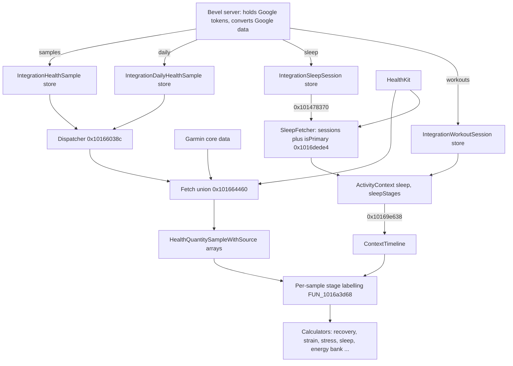

# Ingestion: how Bevel 3.1.7 turns Google, Oura, Garmin and HealthKit data into metric inputs

Scope: tasks G01, G02, G03, G10 (and the ingestion half of G11/G12). Sources: `evidence/A.md`, corrected by `evidence/R.md` (R1, R2c, R2d, R5) and the orchestrator assembly checks. Where A and R disagree this doc follows R and says so in "Corrections".

Conventions: addresses are unslid virtual addresses in the Bevel 3.1.7 (2728) main binary. `FUN_x` is the Ghidra decompile entry. Boundary comparisons were re-read in assembly (Ghidra prints `<=` as `<` and `>=` as `>` for `Comparable` calls; the stub symbol names `$sSL2leoi` / `$sSL2geoi` resolve them).

## Contents

- [Pipeline overview](#pipeline-overview)
- [Server boundary and DTOs](#server-boundary-and-dtos)
- [Response mappers](#response-mappers)
- [Dispatcher: HealthDataFetchType to integration stores](#dispatcher-healthdatafetchtype-to-integration-stores)
- [Google sleep sessions](#google-sleep-sessions)
- [Cross-source session choice and the primary flag](#cross-source-session-choice-and-the-primary-flag)
- [HRV methods and the RMSSD kernel](#hrv-methods-and-the-rmssd-kernel)
- [SpO2 unit chain](#spo2-unit-chain)
- [Temperature](#temperature)
- [HR and RHR streams](#hr-and-rhr-streams)
- [Source merging and HealthKit statistics](#source-merging-and-healthkit-statistics)
- [Source lists and priority](#source-lists-and-priority)
- [HealthMetric and BioMetric enums](#healthmetric-and-biometric-enums)
- [G01: Source selection](#g01-source-selection)
- [G02: Local versus server conversions](#g02-local-versus-server-conversions)
- [G03: Units and methods](#g03-units-and-methods)
- [G10: Air observations](#g10-air-observations)
- [Corrections to earlier research](#corrections-to-earlier-research)

## Pipeline overview



Key idea: the Google API is never called from the phone. The Bevel backend holds the tokens, converts raw Google data and serves it through `api/integrations/v1/...`. The phone only decodes the DTOs, copies `value: Double` through unchanged, and wraps it in the same sample types that HealthKit data uses. Everything after the dispatcher is source-agnostic.

## Server boundary and DTOs

Endpoints (strings 0x1058c6630-0x1058c6760, 0x1058c94c0):

- `api/integrations/v1/samples?source=google-health`
- `.../daily?source=google-health`
- `.../sleep?...`
- `.../workouts?...`
- `.../backfill?source=google-health`
- `.../backfill/status?source=google-health&backfillId=`
- `.../deregister?source=google-health`

Request enum `IntegrationsAPIRequest` (descriptor 0x10520a4ac): `googleHealthSamplesByType(GoogleHealthSampleSyncRequest)`, `googleHealthDaily/Workouts/Sleep(GoogleHealthCursorSyncRequest)`, `googleHealthBackfill(IntegrationBackfillRequest{dataLoadingWindowYears: Int})`, `googleHealthBackfillStatus(backfillId)`.

String at 0x1059166b0: `Google Health tokens are not stored on the client`.

Response DTOs (synthesized Codable):

| DTO (descriptor) | Fields |
|---|---|
| GoogleHealthSamplesResponse (0x10520bc1c) | `samples: [IntegrationHealthSampleResponse]`, `moreAvailable: Bool`, `nextCursor: GoogleHealthSampleCursor?` |
| IntegrationHealthSampleResponse (0x10520bc44) | `sourceId: String?`, `sampleType: String`, `startDate: Date`, `endDate: Date`, `value: Double`, `platform: String?` |
| GoogleHealthDailyResponse (0x10520bbf4) | `daily: [IntegrationDailyHealthSampleResponse]`, `moreAvailable`, `nextCursor: IntegrationPaginationCursor?` |
| IntegrationDailyHealthSampleResponse (0x10520bfd0) | `sourceId: String?`, `sampleType: String`, `date: String`, `value: Double`, `platform: String?` |
| GoogleHealthSleepResponse (0x10520bc6c) | `sleep: [IntegrationSleepSessionResponse]`, `moreAvailable`, `nextCursor` |
| IntegrationSleepSessionResponse (0x10520bc94) | `id`, `type: String`, `startTime`, `endTime`, `stages: [{sleepStage: String, startTime, endTime}]`, `deletedAt: Date?`, `platform: String?` |
| GoogleHealthWorkoutsResponse (0x10520bd0c) | `workouts: [IntegrationWorkoutSessionResponse]`, `moreAvailable`, `nextCursor` |
| IntegrationWorkoutSessionResponse (0x10520bd34) | `id`, `activityType`, `startDate`, `endDate`, `activeCalories?`, `restingCalories?`, `distanceInMeters?`, `averageHeartRate?`, `title?`, `activeDurationSeconds?`, `elevationGainInMeters?`, `elevationLossInMeters?`, `averageSpeedMetersPerSecond?`, `averagePaceSecondsPerMeter?`, `averagePowerWatts?`, `resolvedWorkoutEffort?`, `pauses[{startDate,endDate}]`, `splits[{startDate,endDate,distanceInMeters?,durationSeconds?,averageHeartRate?}]`, `locations[{timestamp,latitudeInDegrees,longitudeInDegrees,altitudeMeters?,speedMetersPerSecond?}]?`, `deletedAt?`, `platform?` |

Request DTOs: `GoogleHealthSampleSyncRequest` (0x10520ac74) `{sampleType: String, lastSyncedAt, lastSampleDate, earliestDataDate, cursor, limit: Int}`; `GoogleHealthSampleCursor {lastSyncedAt, id?, lastSampleDate}`; `GoogleHealthCursorSyncRequest {lastSyncedAt?, earliestDataDate, cursor: IntegrationPaginationCursor?, limit: Int}`. Page size is 500 (the daily request builder `FUN_1013a31b8` stores 500). Page overflow raises `paginationLimitExceeded(sampleType)`.

Sample types Bevel asks for (`GoogleHealthSampleSyncType`, 0x10522c3e0, 11 cases): heartRate, heartRateMinuteAggregate, heartRateVariability, steps, spo2Percentage, activeEnergy, restingEnergy, bodyWeightKg, bodyFatPercentage, bloodGlucoseMgDl, bodyTemperatureFahrenheit. Per-type cursor keys in UserDefaults: `integrations.google_health_samples_<type>_last_sync` (strings 0x105946630-0x105946940).

Backfill job types (`GoogleHealthBackfillJobTypeResponse`, 0x10520c008): heartRate, heartRateVariability, oxygenSaturation, activeEnergyBurned, basalEnergyBurned, steps, weight, bodyFat, bloodGlucose, coreBodyTemperature, dailyRestingHeartRate, dailyRespiratoryRate, dailyVO2Max, dailySleepTemperatureDerivations, dailyTotalCalories, dailyActiveEnergyBurned, sleep, exercise. These mirror Google Health API data type ids.

Silent push types `new_sleep_data_available` and `new_exercise_data_available` (strings 0x105916fe0, 0x105916fc0; handler 0x10142bd44) trigger only a sleep sync or a workout sync.

The daily `date` string is an 8-character `yyyyMMdd` DateKey. `FUN_1030f8428` (called from the daily mapper 0x1013a2518) returns nil unless `String.count == 8` and parses 4+2+2 digits. An invalid date logs `Skipping Google Health daily sample with invalid date` and drops the row.

## Response mappers

The only client-side transform of sample and daily DTOs. Sample mapper `FUN_1013a2050` (caller 0x1013a59c8); daily mapper `FUN_1013a2518` (caller 0x1013a31b8).

```ts
// per element
tag = sampleType === "hrvRmssd" ? 8 /*heartRateVariability*/ : IntegrationHealthSampleType(rawValue: sampleType)  // FUN_10146eaa0, _findStringSwitchCaseWithCache over array 0x1060b19f0
if (tag === 0x13 /*unknown*/) { log("Skipping Google Health sample with unknown type "); drop }
unit = byteTable_0x104f82e40[tag]
id   = UUID().uuidString        // a fresh random id on every mapping
// sourceId and platform copied. value copied unchanged (Double). No clamp, no unit conversion, no value filter.
```

`IntegrationHealthSampleType` (descriptor 0x10522e838; strings read from array 0x1060b19f0, 24-byte elements `{String, caseIndex}`):

| Tag | Name | Tag | Name |
|---|---|---|---|
| 0 | steps | 10 | vo2Max |
| 1 | activeEnergy | 11 | temperatureDeviationFahrenheit |
| 2 | restingEnergy | 12 | bloodPressureSystolic |
| 3 | totalEnergy | 13 | bloodPressureDiastolic |
| 4 | restingHeartRate | 14 | bodyWeightKg |
| 5 | spo2Percentage | 15 | bodyFatPercentage |
| 6 | heartRate | 16 | bloodGlucoseMgDl |
| 7 | heartRateMinuteAggregate | 17 | bodyTemperatureFahrenheit |
| 8 | heartRateVariability | 18 | wristTemperatureFahrenheit |
| 9 | respiratoryRate | 0x13 | unknown (dropped) |

Unit table `0x104f82e40` (tag to `IntegrationHealthSampleUnitType`): `[1,2,2,2,0,3,0,0,5,6,4,7,8,8,9,3,10,7,7]`. `IntegrationHealthSampleUnitType` (0x10522e854): 0 bpm, 1 count, 2 kCal, 3 percentDecimal, 4 mlOverKgMin, 5 ms, 6 breathsPerMinute, 7 fahrenheit, 8 mmHg, 9 kgs, 10 mgPerDl. So steps = count; activeEnergy/restingEnergy/totalEnergy = kCal; restingHeartRate/heartRate/heartRateMinuteAggregate = bpm; spo2Percentage and bodyFatPercentage = percentDecimal; HRV = ms; respiratoryRate = breathsPerMinute; vo2Max = mlOverKgMin; temperature types = fahrenheit; BP = mmHg; weight = kgs; glucose = mgPerDl.

Unit to `HealthQuantityUnitType` table `0x104f96a55` (copies at 0x104f96eda, 0x104fa14ea): `[1,8,2,6,4,3,1,7,21,10,20]`. That is bpm to countPerMinute, count to count, kCal to kCal, percentDecimal to percentDecimal, mlOverKgMin to mlOverKgMin, ms to milliseconds, breathsPerMinute to countPerMinute (sic), fahrenheit to fahrenheit, mmHg to mmHg, kgs to kgs, mgPerDl to mgPerDl. The decompiled converters (`FUN_101661e90` line 2139, `FUN_101662804`, `FUN_101662fa0`, `FUN_101661120`) copy the Double value unchanged (no /100, no Fahrenheit/Celsius change).

## Dispatcher: HealthDataFetchType to integration stores

Request enum `HealthDataFetchType` (descriptor 0x105231e8c). Payload cases (tags 0..3): `restingHeartRate(HealthDataRHRCalculation)`, `wristTemperatureFahrenheit(temperatureBaselineFahrenheit: Double?)`, `bodyTemperatureFahrenheit(Double?)`, `stepsCount(ContextTimeline)`. No-payload cases (index 0..17): heartRateMinuteAggregates, heartRateSamples, heartRateVariabilityMilliseconds, respiratoryRateBreathsPerMinute, spo2Percent, bloodGlucoseMgDl, weightKgs, stepsTotalsCount, energyConsumedTotalsKCal, restingEnergyBurnedTotalsKCal, activeEnergyBurnedTotalsKCal, proteinConsumedTotalsGrams, carbohydratesConsumedTotalsGrams, leanBodyMass, bodyFatPercentage, vo2Max, bloodPressureSystolic, bloodPressureDiastolic.

Integration fetch runs Oura and Google concurrently and concatenates (async-let pair in `FUN_101666a04`: Oura record 0x104f96ab8 to `FUN_101666d20` to `FUN_10166437c` to `FUN_10167af0c`; Google record 0x104f96ac8 to `FUN_101666d8c` to `FUN_1016643f8` to `FUN_101660370` to dispatcher `FUN_10166038c`). Shared services: `DAT_1064afe90` = `IntegrationHealthSampleService.shared` (init `FUN_10146efb8`), `DAT_1064afe80` = `IntegrationDailyHealthSampleService.shared` (init `FUN_10145fddc`). The Google branch always queries `sourceType = googleHealth` (enum value 1; oura = 0).

Dispatcher `FUN_10166038c`. Helpers: S = sample store (`FUN_101661c90` to `FUN_101661d48` to continuation `FUN_101661e90`); D1 = daily store (`FUN_101662690` to `FUN_101662770` to `FUN_101662804`); D2 = daily store (`FUN_101662d4c` to `FUN_101662eac` to `FUN_101662fa0`).

| Request case | Output HealthQuantityType | Integration type queried | Store |
|---|---|---|---|
| restingHeartRate(hrHistory) | restingHeartRate (0) | NOT fetched. `FUN_101655bcc` filters the supplied `hrHistory` (HealthQuantitySampleWithStage), keeping stage tag < 2 (otherSleep, remAndDeepSleep), and strips the stage | in memory |
| wristTemperatureFahrenheit(baseline?) / bodyTemperatureFahrenheit(baseline?) | temperature (0x13) / bodyTemperature (0x14) | temperatureDeviationFahrenheit (11), only when the baseline payload is non-nil (flag byte != 1); nil baseline returns empty. Types 17 and 18 are never requested | D1 |
| stepsCount(ContextTimeline) | steps (0x15) | steps (0) via `FUN_101660a0c` | S |
| heartRateMinuteAggregates | heartRateMinuteAggregates (4) | heartRateMinuteAggregate (7) | S |
| heartRateSamples | heartRateSamples (5) | heartRate (6) | S |
| heartRateVariabilityMilliseconds | heartRateVariability (1) | heartRateVariability (8) | S |
| respiratoryRateBreathsPerMinute | respiratoryRate (3) | respiratoryRate (9) | D1 (daily) |
| spo2Percent | spO2 (0x12) | spo2Percentage (5) | D1 (daily, not the sample store) |
| bloodGlucoseMgDl | bloodGlucose (0xf) | bloodGlucoseMgDl (16) | S |
| weightKgs | weight (0x22) | bodyWeightKg (14) | S |
| stepsTotalsCount | stepsDisplay (0x16) | steps (0) | S |
| energyConsumedTotalsKCal | energyConsumedDisplay (0xb) | totalEnergy (3) | D2 |
| restingEnergyBurnedTotalsKCal | restingEnergyBurnedDisplay (8) | derived, see below | derived |
| activeEnergyBurnedTotalsKCal | activeEnergyBurnedDisplay (9) | activeEnergy (1) | D2 |
| protein / carbohydrates / leanBodyMass | 0xc / 0xd / 0x30 | none (returns immediately) | none |
| bodyFatPercentage | bodyFatPercentage (0x23) | bodyFatPercentage (15) | S |
| vo2Max | vo2Max (2) | vo2Max (10) | D2 (daily) |
| bloodPressureSystolic / Diastolic | 0x10 / 0x11 | 12 / 13 | S |

Never read by the dispatcher for Google: daily restingHeartRate (4), restingEnergy sample (2), body and wrist temperature samples (17, 18), and the daily duplicates of activeEnergy, restingEnergy, spo2 and heartRate. Naming quirk: `energyConsumedTotalsKCal` is served from Google `totalEnergy` (total calories burned).

Conversion continuations:

- Sample continuation `FUN_101661e90`: each IntegrationHealthSample becomes `HealthQuantitySampleWithSource { id: fresh UUID string, metadata: .googleHealth, type: the REQUESTED HealthQuantityType (not the sample's own sampleType), unit: table[0x104f96a55][sample.unit], doubleValue: sample.value copied bit for bit, start/end: sample.startDate/endDate, source: HealthDataSource{rawIdentifier "GOOGLE_HEALTH", metadata googleHealth} }`. `sourceId` and `platform` are dropped here.
- Daily continuations `FUN_101662804` and `FUN_101662fa0`: each IntegrationDailyHealthSample (DateKey y/m/d) becomes a sample with `start = Calendar.current.startOfDay(dateKey)`, `end = start + 1 day` (`FUN_1030f8774` builds the date, `FUN_1030cbe40/FUN_1030cbe94` add a day), value unchanged. Day boundaries use the phone's current calendar and time zone, not the server's.
- Derived resting energy (`FUN_101661120`, continuation of `FUN_101660e20`):

```ts
activeByDay = dict(dateKey -> value) from activeEnergy daily samples        // FUN_101663844
for (total of totalEnergy daily samples) {
  rest = total.value - (activeByDay[total.dateKey] ?? 0)   // subtraction only if the active row exists
  if (rest < 0.0) continue                                  // day dropped
  emit { type: restingEnergyBurnedDisplay, start: dayStart, end: nextDayStart, unit: kCal, value: rest }
}
```

## Google sleep sessions

Types: `SleepStage` (0x105233a48): 0 asleepUnspecified, 1 awake, 2 core, 3 deep, 4 rem, 5 inBed. `SleepSession` (0x105233a80): `{segments: [SleepStageSegment], inBedSegments: [DateInterval], startTime, endTime, activityScore: Float?, isPrimary: Bool, secondsInSleepStage: [SleepStage: Float], source: HealthDataSource}`. `SleepStageSegment` (0x1052332c8): `{sleepStage, startTime, endTime, source, activityScore: Float?}`. `FunctionalDay` (0x10523300c): `{dayStart, dayEnd}`. `CachedSleepSample` (0x105230d80): `{uuid, sleepStage, startTime, endTime, sourceMetadata}`.

Fetch: `AppSleepIntegrationProvider.googleHealthSleep(in: DateInterval)` (`FUN_1016d8bd8`) to async `FUN_10156fe40` to `FUN_10156fec4`. It is gated by `FUN_1014216dc(4, connectedIntegrations)` (table 0x104f881c4: strava 3, oura 2, garmin 0, polar 1, googleHealth 4). Not connected returns `[]`. Fetch errors are swallowed: `FUN_1016d8d3c` logs `SleepFetcher Google Health sleep fetch failed` and returns `[]`. Then `FUN_101570074` maps each IntegrationSleepSession through `FUN_101478370` and `FUN_10156f1b8` sorts by startTime.

`FUN_101478370` IntegrationSleepSession to SleepSession (exact):

```ts
segments[i] = {
  sleepStage: byteTable(0x04030201 >> (8*tag)),  // awake->1 awake, light->2 core, deep->3 deep, rem->4 rem, asleepUnspecified->0 asleepUnspecified
  startTime, endTime,                            // copied
  source: HealthDataSource{ rawIdentifier: session.id, metadata: .googleHealth },
  activityScore: nil }
inBedSegments = DateInterval.valid(start, end) ? [DateInterval(session.startTime, session.endTime)] : []   // FUN_100c00624, valid when end >= start
startTime = session.startTime; endTime = session.endTime               // copied, NOT derived from segments
activityScore = nil; isPrimary = false                                 // assigned later
secondsInSleepStage = {}                                               // Float32
for (seg of segments) d[seg.stage] = (d[seg.stage] ?? 0) + Float(seg.end - seg.start)   // loop at 0x101478a..
source = same HealthDataSource as the segments
```

Facts: the whole Google session window is the in-bed interval. `secondsInSleepStage` never contains stage 5 (inBed) for Google. `IntegrationSleepType` (sleep or nap) and `platform` are NOT used, so naps are not distinguished. No gap fill and no overlap clipping inside a session.

Shared HealthKit-style builder `FUN_101d7ba70` (used by `FUN_1016d7d80` for CachedSleepSample and `FUN_101571a24` for Oura-app-in-HealthKit; not for Google):

- Clusters segments with `mergeIntervals(gap = 1800.0 s)` (`0x409c200000000000`; `FUN_101d7d750` to `FUN_100bfff3c`). Input must already be sorted by start.
- `mergeIntervals` rule (assembly 0x100c00344-0x100c00384, 0x100c00280): a new cluster starts iff `curEnd < next.start - gap` (strict). A gap of exactly 1800 s (or 0 s when gap = 0.0) still merges. Extension: `curEnd = max(curEnd, next.end)`.
- Per cluster a SleepSession with `startTime = min(all segment starts and inBed interval starts)` (else cluster start) and `endTime = max(ends)` (else cluster end) (`FUN_101d7cf98`); `secondsInSleepStage[stage] += Float(end - start)` for every segment including inBed ones (no stage filter); isPrimary false.
- `FUN_101d7dc58` extracts stage == 5 segments into inBedSegments for a flagged branch. Setting `forceIncludeManualSleep` (`health_settings.force_include_manual_sleep_key`, `FUN_1015b8098`): if the flag is on and the first segment is not user-entered HealthKit, user-entered HealthKit segments from the full list are appended.

Segment overlap resolution (sort at 0x1015c93f8, specialisation `FUN_1015be1f8`, insertion sort when count < `_minimumMergeRunLength`, otherwise merge via `FUN_1015c83d4`; caller `FUN_1015cb390` from `FUN_101d7ba70`; assembly-verified 0x1015c956c-0x1015c9604):

```ts
// cur = a[i], prev = a[i-1]
if ((cur.stage != inBed) != (prev.stage != inBed)) swap iff (cur.stage != inBed && prev.stage == inBed)   // inBed sorted last
else swap iff !(!cur.userEnteredHK && prev.userEnteredHK)   // equivalently: cur.userEnteredHK || !prev.userEnteredHK
// userEnteredHK = source.metadata first word (+0x18) >= 4 (HealthKit payload present; integration tags are 0..3) AND byte at source+0x40 bit0 (SampleSourceMetadata.isUserEntered)
```

This predicate is not a strict weak ordering. With no user-entered samples every element swaps to the front, which reverses order inside each inBed-ness group when count is below the minimum merge run length. Source priority numbers are NOT used here; Google segments (metadata tag 2) are never "user entered". The caller then skips leading inBed elements, sorts, and inserts segments one by one into a time-ordered list via binary search on startTime/endTime, clipping later-priority segments (`FUN_1015ca840`).

## Cross-source session choice and the primary flag

`FUN_1016dede4`, called 4 times from `FUN_1016d75a4` / `FUN_1016dcf58` once per source array with `(functionalDays, sessions, sleepSourcePriority)`; `sleepSourcePriority` is Published array index 7 of `DAT_106a11620`.

```ts
// 1. clusters
intervals = sessions.map(s => [s.start, s.end]); clusters = mergeIntervals(intervals, gap = 0.0)
// 2. per cluster: contiguous slice of sessions -> FUN_1015b5438(slice, priorityList)
//    groups sessions by source (key = source.rawIdentifier when a priority list exists: FUN_1015b8d08;
//    key = whole HealthDataSource when none: FUN_1015b9004), orders the keys, returns the sessions of the FIRST key that has any
//    ordering with a list = FUN_101e35790: names Garmin -> "Garmin", Oura -> "OURA", googleHealth -> "GOOGLE_HEALTH", healthKit -> bundleIdentifier;
//      predicate FUN_101e342dc: listed names by list position, listed before unlisted, unlisted by String <
//    ordering without a list = FUN_1015b46cc -> comparator in FUN_1015b64ac (rank, lower first):
//      1 = HealthKit source whose lowercased rawIdentifier hasPrefix "com.apple.health" AND productType hasPrefix "Watch"
//      2 = any non-Apple-Health source (Garmin, Oura, GOOGLE_HEALTH, third-party apps)
//      3 = Apple Health non-Watch
//      4 = user-entered HealthKit
//      ties: rawIdentifier ascending
// 3. per FunctionalDay window
selected = sessions.filter(s => s.endTime >= day.dayStart && s.endTime <= day.dayEnd)   // both inclusive ($sSL2geoi / $sSL2leoi at 0x1016df7c0 / 0x1016df7e8)
selected.sort(FUN_1016dd8b8 -> FUN_1016de360)  // sessions with at least one core/deep/rem segment first (property FUN_10171df70), then longer (end - start) first
winner = selected[0]
// 4. keys
key(s) = "sleep-" + (s.source is HealthKit ? s.startTime.description : s.source.rawIdentifier)
isPrimary(s) = winnerKeys.contains(key(s))     // for every selected session
```

Consequences: for Google sessions `rawIdentifier` is the unique session id, so the key is unique per session. Two HealthKit sessions with an equal start would both be primary. A session with only `asleepUnspecified` stages (Google classic sleep) does not count as "has stages" in step 3.

## HRV methods and the RMSSD kernel

`HrvMethod` (0x10523680c) {appleHealth, bevelRMSSD}; `RhrMethod` (0x105236860) {appleHealth, bevel}; `CalculationsOptions` (0x105236898) carries hrvMethod, rhrMethod, hrvContext, rhrContext, caloriesDisplay, temperatureSource, sp02Window, rrWindow, stored as JSON in UserDefaults `health_settings.calculations_options_key` (SettingsUserDefaultsKeys index 15). Defaults: see [shared-machinery.md](shared-machinery.md) (R2c: packed `0x0101`: bevelRMSSD, bevel, entireSleep contexts, total calories, wrist temperature, entireSleep windows). Legacy keys (DeprecatedUserDefaultsKeys 0x10524523c): `health_settings.hrv_algorithm_key` (migration reader `FUN_101dd9fd8`), `useMindfulnessHrvKey`, per-metric `use<X>SourceKey` / `<X>SourceKey`.

HealthKit HRV fetch `FUN_10166a59c` (log string `[HRV DATA LOADING] HRV HISTORY (RMSSD) fetched`, `FUN_10166ab98`):

- hrvMethod == appleHealth (published byte at frame +0xb1c == 0): one HKSampleQuery for HealthQuantityType index 1 (HKQuantityType heartRateVariabilitySDNN, ms) with `predicateForSamplesWithStartDate(start, end, options: .strictStartDate (1))`. Samples pass through as-is (`FUN_10166b5f8` / `FUN_10166b678`). No RMSSD, no unit change.
- hrvMethod == bevelRMSSD: two concurrent tasks: (1) the same SDNN query (`FUN_10166ce2c` to `FUN_10166be74`), (2) heartbeat-series RMSSD (`FUN_10166cea4` to `FUN_10166c394` to `FUN_10166eef0` to `FUN_10166d860` to `FUN_10166d87c`: `HKSeriesType.heartbeatSeriesType` query, strictStartDate, then per series `FUN_10166efd4` / `FUN_10166e834`). The array returned by `FUN_10166ab98` is ONLY the RMSSD list after the source filter, sorted by `FUN_10166c440`; the SDNN list is used only for the emptiness check that picks the log line `(no samples)`. There is no fallback to SDNN in this function.
- Source filter in `FUN_10166ab98` (stable partition then truncate): keep a series only if source rawIdentifier/bundle id lowercased `hasPrefix("com.apple.health")` (`FUN_1015b57ac`, assembly 0x1015b57ac-0x1015b58f8) AND `productType != nil` AND `productType.hasPrefix("Watch")` (case sensitive) AND not user-entered. Third-party, iPhone and manual series are removed.

RMSSD kernel (HealthKit heartbeat series only), per HKHeartbeatSeriesSample with beats `(timeIntervalSinceStart: Double s, precededByGap: Bool)`:

```ts
// FUN_10166dcf0: split into segments. A beat with precededByGap == true starts a new segment.
// A segment is kept only if it has >= 4 beats (3 < count).
// FUN_10166df34: per segment, per consecutive beat triple (t[i-1], t[i], t[i+1]):
RR1 = (t[i] - t[i-1]) * 1000;  RR2 = (t[i+1] - t[i]) * 1000;      // ms
if (RR1 > 2000.0 || RR2 > 2000.0 || RR1 < 300.0 || RR2 < 300.0) skip   // strict fcmgt: 300 <= RR <= 2000 kept (0x10166dfdc-0x10166dff8)
d = RR2 - RR1; ratio = d / RR1;
keep iff -0.245 <= ratio && ratio <= 0.325     // constants 0x104f96b68 = -0.245, 0x104f96b60 = 0.325, both inclusive (asm 0x10166e010-0x10166e02c)
emit d*d                                        // ms^2
// FUN_10166e0d4: pool all kept squares of all segments of the series
rmssd = sqrt(sum(sq) / n)   // Float64; n == 0 -> sqrt(0) = 0.0 (no guard here)
// FUN_10166e834: HKQuantitySample (unit millisecond) from series.startDate to series.endDate,
// created only if endDate.timeIntervalSince(startDate) <= 345600.0 s (4 days; asm fcmp d9,d0; b.ls at 0x10166e8fc), else nil
```

One HRV sample per series (a short Watch background measurement), not one per night. No log transform anywhere. The same kernel is reachable from 0x1020a1b1c / 0x1020a1f6c (sleeping-HRV debug export; string `Not enough RMSSD samples during REM and deep sleep` at 0x105921620, function `0x1016f51f0`).

Google/integration HRV: `heartRateVariabilityMilliseconds` maps to the sample store type heartRateVariability (ms), value unchanged; hrvMethod is not consulted. The mapper accepts both `hrvRmssd` and `heartRateVariability` as tag 8, so the client cannot tell RMSSD from SDNN. NOT IN IPA (proven): which Google field the server writes.

## SpO2 unit chain

- Local storage unit: `percentDecimal` (tags spo2Percentage and bodyFatPercentage; table 0x104f82e40 to `HealthQuantityUnitType.percentDecimal` = 6 in table 0x104f96a55). HealthKit side: `FUN_103107a54` maps HealthQuantityType 0x12 (spO2) and 0x23 (bodyFatPercentage) to `HKUnit.percentUnit()` (global `DAT_106a19b18`, init `FUN_103105c30`), whose doubleValue is a FRACTION (0.97). The Google path copies the server double unchanged into the same slot.
- Therefore Google SpO2 is correct only if the Bevel server sends a fraction. Not verifiable in the IPA; the names `spo2Percentage` / `percentDecimal` are the only client-side evidence of a decimal-fraction contract.
- The x100 step is in the Recovery builder `FUN_1015b0ba4`: at 0x1015b1c90 `FUN_10183bdc0` returns the mean of the night's SpO2 Float32 samples; at 0x1015b1d08-0x1015b1d14 `currentSpO2Percent = Float(mean) * 100.0f` (constant 0x42c80000). That same value is written as the `HealthMetric.spO2` (index 36, 0x24) measurement (entry 0x1015b34a4; key byte 0x24; present flag cleared at 0x1015b36a4). The UI formatter `FUN_1038c2da8` therefore receives percent, with one fraction digit for HealthMetric indices {1,2,3,36,37,38}. The oxygen penalty at 0x1015b366c uses `(baselineMean - baselineSD) * 100.0f - currentSpO2Percent`; baseline mean and SD are fractions, multiplied by 100 at 0x1015b367c.
- Google SpO2 is read from the DAILY store: only a daily `spo2Percentage` row (date yyyyMMdd) feeds it, with start = local midnight. A sleep-session window that starts after midnight does not contain that sample when contexts/windows are `sleepSession` (baseline selector window semantics `[start, end)`, 0x1015b9928).

## Temperature

(Corrected by R2d. A said the baseline value is not used; that is wrong.)

- Types: Fahrenheit. HealthKit types 0x13 (wrist temperature) and 0x14 (body temperature) use HKUnit degreeFahrenheit.
- Google contributes only `temperatureDeviationFahrenheit` (type 11) through the DAILY store, and only when the caller's baseline payload is non-nil. Dispatcher `FUN_10166038c` (tags 1/2, baseline non-nil) fetches the daily deviation and then, in `FUN_101660c60`, calls `FUN_1016689e8(baselineF = request word 0, samples, source "GOOGLE_HEALTH")`:

```ts
sample.doubleValue = baselineF + deviationF      // param_1 + dVar14; absolute degrees F, not a delta
```

The same function serves Garmin (`FUN_10165ed1c`) and Oura (`FUN_10167bc80`). So integration temperature samples are absolute °F = user baseline + nightly deviation.

- Baseline value: UserDefaults key `data_integrations.temperature_baseline_fahrenheit` (case 1 of `DataIntegrationsUserDefaultsKeys`, descriptor 0x10524507c; raw-value table 0x1061104e8 / 0x106110500). UI bounds 95.0 to 99.9 °F (35.0 °C lower bound in Celsius).
- Default baseline, seeded locally by `TemperatureBaselineDefaultCalculator` (`FUN_10149dbf4`, asm 0x10149dc1c-0x10149dc64), written as Float to that key:

```ts
sex = effectiveSex(profile)       // FUN_10310dea8: 0 male, 1 female, 2 other, 3 notSet
age = profile.ageYears            // FUN_10310e084 -> Int?
base = ((sex & 0xfd) == 0) ? 97.9 : 98.1    // male and "other" 97.9 F (double at 0x104f8c838); female/notSet 98.1 F (0x104f8c830)
if (age != nil && age > 64) base = 95.7     // cmp x19,#0x40; ccmp gt; fcsel ne; double at 0x104f8c840
```

Verified in assembly (orchestrator): defaults 98.1 / 97.9 / 95.7 °F at 0x104f8c830-0x104f8c840.

- Recovery uses a z-score against the baseline, so a constant baseline cancels. A baseline change mid-history shifts the stored samples.
- HealthMetric.temperature (37) vs bodyTemperature (38) is selected by `temperatureSource` {wrist, body}: key `0x25 + (x26 == 0x10000000000)`. Display setting key `health_settings.temperature_unit_key`.

## HR and RHR streams

Which heart-rate stream each consumer uses and how samples get stage labels (R5) is in [shared-machinery.md](shared-machinery.md#r5-heart-rate-stream-per-consumer-and-sample-labelling). Ingestion-side facts:

- Units: bpm to `countPerMinute` (value 1) for heartRate, heartRateMinuteAggregate, restingHeartRate; breathsPerMinute is also mapped to countPerMinute.
- For integrations the daily `restingHeartRate` type (4) is never fetched. RHR is `IntegrationRHRCalculation.bevel(hrHistory)`: the supplied labelled HR history is filtered to stage tags < 2 (otherSleep, remAndDeepSleep) by `FUN_101655bcc` and then aggregated by the baseline/recovery code. R5 adds that for key 0 the per-source split tag (+0x18: 0 Garmin, 1 Oura, 2 Google, else HealthKit) selects which list gets the `.bevel(...)` calculation, and `rhrMethod == bevel` (byte at +0x242 `== 1`) switches HealthKit between `.bevel(hkList)` and `.appleHealth`.
- ContextTimeline builder `FUN_10169e638` reads ActivityContext fields {workouts [0], sleepStages [2], mindfulness [3], exercise [4]}: core and asleepUnspecified become otherSleep (0); deep and rem become remAndDeepSleep (1); workouts workout (2); mindfulness mindfulness (3); remaining time inside the activity window awake (4, `FUN_10169de60(merged, activityContext.start, activityContext.end)`); exercise segments exercise (5); awake and inBed stages create no sleep context. Note: R5 shows that the per-sample labels applied to the metric histories come from `FUN_1016a3d68` (algorithm in shared-machinery, which follows R5 exactly). Where this paragraph's stage mapping differs from R5's per-sample rules, R5 wins; this is A's description of the ContextTimeline builder, not of the per-sample lookup.
- HealthKit history fetches have a 300 s timeout; HR and glucose fall back to 5-minute `discreteAverage` buckets (see shared-machinery R5).
- Narrowing: Double to Float32 at the baseline selector (0x1015ba98c-0x1015ba9b8) and the statistics helper `0x10183bdc0` (Float32 sums, divisor n).

## Source merging and HealthKit statistics

- Provider fan-out `FUN_101663b18` (async, no direct callers) launches three concurrent fetches of the same HealthDataFetchType plus a cached lookup: (1) HealthKit: record 0x104f96a70 to `FUN_101664148` to `FUN_101665558` to `FUN_1016655f0`; (2) Garmin core data: record 0x104f96a88 to `FUN_10166423c` to `FUN_10165e798`; (3) integrations (Oura + Google): record 0x104f96a98 to `FUN_101664310` to `FUN_1016669e4` to `FUN_101666a04`; (4) memo lookup `FUN_10165c134` behind a Bool witness check.
- `FUN_101664460` (called at 0x101663d94) is a 4-way merge of the four date-sorted arrays by the sample date: pops from the end of each array and appends the one with the latest date; ties resolved in array order 1, 2, 3, 4. This is a pure UNION. There is no replacement, de-duplication or source fallback in the merge. Source selection happens before the fetch (enabled-source predicates, per-store gating) or after it in each consumer.
- HealthKit cumulative totals (cases stepsTotals .. carbohydratesConsumedTotals = no-payload indices 7..12; `FUN_1016655f0` branch `lVar21 - 7U < 6`) go to `FUN_10182c29c`: `HKStatisticsCollectionQueryDescriptor(predicate: .quantitySample(type, predicate), options: opt, anchorDate, intervalComponents)` with `opt = cumulativeSum (0x10)`, or `cumulativeSum | separateBySource (0x11)` when the HealthQuantityType byte is in 0xb..0xe (energyConsumedDisplay, protein, carbohydrates, fat; test `byte - 0xb < 4`). A second specialisation `FUN_10182bac0` takes `options` from its caller. Results convert in `FUN_10182c878`: for 0xb..0xe it sums `sumQuantity(for: source)` over `statistics.sources`, else `statistics.sumQuantity()`; each interval becomes `HKQuantitySample(type, quantity, start: interval.startDate, end: interval.endDate)`. Active (9) and resting (8) energy therefore use plain cumulativeSum (HealthKit's own cross-source de-duplication), not Bevel's priority list.
- HealthKit source filter `FUN_10182d0c0`: `predicateForObjectsFromSources(allowedHKSources)` AND-ed with the query predicate. allowedHKSources = HKSources that have data for the type minus every source whose `AnySourceWithEnabledAndLatest.enabled == false` in the user's list for the metric's CustomSourcePriorityType (names: bundleIdentifier for HealthKit, "Garmin", "OURA", "GOOGLE_HEALTH"; list read from the Published dictionary `DAT_106a11620`). The stored order is not used for HealthKit totals; only the enabled flag is. With no source set the original predicate is returned.
- TDEE (R1 resolves this, A and R agree): `TDEECalculator` (0x1051ff840) has three stored properties `{healthKitManager: HKMProtocol, userAttributesProvider, userDefaultsService}`; HKMProtocol has exactly two conformances (HealthKitManager 0x104fa3bd4, MockHealthKitManager 0x104f378a0), and witness slot +0x60 for HealthKitManager ends in an `HKStatisticsCollectionQueryDescriptor`. Google, Fitbit and Oura energy in Bevel's integration stores never reaches TDEE; it can enter only if another app writes it into Apple Health. Details in [nutrition-tdee.md](nutrition-tdee.md).

## Source lists and priority

- Section text: `Set your preferred method for each metric. These options only affect data synced from Apple Health.` (section `Apple Health Calculations`). RHR help: `The Bevel method uses heart rate data to calculate RHR, while the Apple Health method uses the RHR field from Apple Health. It is recommended to use the Bevel method and "Entire sleep" option.` HRV help: `The Bevel method uses raw heart beat data and filters out noisy samples to calculate HRV (RMSSD). The Apple Health method uses the HRV field from Apple Health. ...` Recovery help: `By default, Bevel's Recovery score pulls HRV samples from the deepest stages of your sleep cycle.` So hrvMethod, rhrMethod, hrvContext and rhrContext are Apple-Health-only switches; the Google, Oura and Garmin paths do not read them (the only HRV/RHR integration branches are the sample-store fetch and the stage filter `FUN_101655bcc`).
- Per-metric source list: `[CustomSourcePriorityType: [AnySourceWithEnabledAndLatest]]` persisted as JSON in UserDefaults `health_settings.metric_sources_key_v2` (writers `FUN_10192417c`, `FUN_101b51e70`; UI ReorderDataSourcesPicker / HideDataSourcesPicker). `CustomSourcePriorityType` (0x10523d578): activeEnergy, cycleTracking, hr, hrv, nutrition, restingEnergy, rhr, sleep, steps, workout, vo2Max, respiratoryRate, temperature, bloodOxygen. `AnySourceWithEnabledAndLatest = {source: AnyCodableSource(healthKit(CodableHKSource{name, bundleIdentifier, priority: Int}) | garmin | oura | googleHealth), enabled: Bool, latestSampleTime: Date?, latestSampleName: String?, productVersion: String?}`. Legacy per-metric keys (`health_settings.use_<x>_source_key`, `<x>_source_key`) are migrated.
- Default ordering of a list built by the DataSourceRepository (comparators `FUN_101b603d8` / `FUN_101b5d0bc`): `latestSampleTime` descending (missing = distantPast), ties by name ascending (`Garmin`, `OURA`, `GOOGLE_HEALTH`, bundle id). The HealthKit `priority` Int in CodableHKSource is not read by any consumer found (readers use list position and the enabled flag).
- Where lists apply: (a) HealthKit quantity/statistics predicates drop disabled sources (`FUN_10182d0c0`); (b) sleep: `FUN_1016dede4` + `FUN_1015b5438` choose the first non-empty source in list order inside every overlapping cluster (list position, unlisted after, ties alphabetical); no list means the default rank Apple Watch < other non-Apple < iPhone Apple Health < user-entered; (c) `FUN_1015bc090` (called from the HealthKit sleep builder `FUN_1016d7d80` with the sleep list; fully decoded by R2) builds `drop = disabledNames(list) ∪ names(iPhoneSegmentsNotInList)` and returns the segments whose source rawIdentifier is not in `drop`. A segment is an iPhone segment when its source is HealthKit, `bundleIdentifier.lowercased()` has prefix `com.apple.health`, its name (lowercased) contains neither `watch` nor `aw`, it is not exactly `Health`, and it contains `iphone`. It counts as "not in list" when its rawIdentifier matches no list entry name. Net effect: HealthKit sleep from a disabled source, or from an iPhone source the user never listed, is dropped; (d) the Bevel HRV path accepts only Apple Watch, non-user-entered series (`FUN_10166ab98`).
- Duplicate sources: strings `hideDuplicateGoogleHealthSources` (0x1059512e0), `integrations.did_show_google_health_duplicate_sources_sheet`, `GoogleHealthDuplicateSourceService` (0x10522c610, a single stored property `userDefaultsService`), `com.fitbit.FitbitMobile` (0x105914880). The hide action only edits the enabled flags of the HealthKit source entries (a user with both Apple Health writes from the Fitbit app and the Google integration can disable `com.fitbit.FitbitMobile`). There is no automatic de-duplication between HealthKit and Google samples in the fetch merge.
- Default `enabled` for a newly discovered source (R2 item 4; merge 0x101b562ec(userList, fetchedList, CustomSourcePriorityType), called from DataSourceModel 0x101b516a0 and 0x10206cc80):
  - A fetched entry already in the user list keeps the user's `enabled` (+0x28). It takes `latestSampleTime`, `latestSampleName` and `productVersion` from the fetch.
  - A new integration entry (Garmin, OURA, GOOGLE_HEALTH) gets `enabled = true`.
  - A new HealthKit entry is classified by 0x1015bbeb4(name, bundleId). If not `bundleId.lowercased().hasPrefix("com.apple.health")`, class 6. Otherwise, on the lowercased name: contains "watch" or "aw" gives 2; equal to "Health" gives 3; contains "iphone" gives 1; anything else gives 6. Class 1 (iPhone) gets `enabled = (type != sleep (7))`. Every other class gets `true`.
  - So a newly seen iPhone source starts DISABLED for sleep and enabled for every other metric.
  - User entries that the fresh fetch no longer contains are dropped.
  - Order: with a saved list, entries in the list come first by their saved index, then unlisted ones by the default comparator (0x101b4da74, fallback 0x101b4f354). Without a saved list the default order is used (0x101b4dd70).
- SampleSourceMetadata `{name, bundleIdentifier, productType, isUserEntered, additionalMetadata}` is read at 0x1015b64ac (rank: prefix `com.apple.health`, productType prefix `Watch`), 0x1015c93f8 (isUserEntered), 0x10166ab98 (Watch and not user-entered), 0x1015bc090 (name contains watch/aw/iphone, == "Health"), 0x1015b8098 (user-entered).

## HealthMetric and BioMetric enums

`HealthMetric` (0x10529f840, 55 cases): 0 recoveryScore, 1 restingHeartRate, 2 heartRateVariability, 3 respiratoryRate, 4 heartRateDip, 5 daytimeHeartRate, 6 maxHeartRate, 7 meditationMinutes, 8 sleepBank, 9 sleepScore, 10 sleepConsistency, 11 timeInBedMinutes, 12 timeAsleepMinutes, 13 timeRemSleepMinutes, 14 timeDeepSleepMinutes, 15 wakeTime, 16 sleepTime, 17 sleepEfficiency, 18 timeToFallAsleep, 19 exerciseMinutes, 20 cardioMinutes, 21 activeCaloriesBurned, 22 totalCaloriesBurned, 23 strainScore, 24 trainingLoad, 25 steps, 26 zone2Minutes, 27 zone2and3Minutes, 28 zone4and5Minutes, 29 strengthTrainingMinutes, 30 stressScore, 31 activeStress, 32 inactiveStress, 33 sleepStress, 34 averageHeartRateVariability, 35 averageHeartRate, 36 spO2, 37 temperature, 38 bodyTemperature, 39 daylightMinutes, 40 energyConsumed, 41 netEnergy, 42 foodQualityScore, 43 macroBalanceBreakdown, 44 proteinConsumed, 45 carbsConsumed, 46 fatsConsumed, 47 nutritionScore, 48 glucoseAverage, 49 glucoseVariability, 50 morningFastingGlucose, 51 temperatureDeviation, 52 hrvDeviation, 53 rhrDeviation, 54 recoveryDeviation.

`HealthMetricUnit` (0x10529f878): percentage, grams, durationInMinutes, minutesFromMidnight, seconds, milliseconds, score, beatsPerMinute, respirationsPerMinute, calories, fahrenheit, miles, feet, milesPerHour, secondsPerMile, count, pounds, reps, decibels, none, watts, yards, milligramsPerDeciliter, millimetersOfMercury.

`BioMetric` (0x10529f55c): 0 vo2Max, 1 bodyWeight, 2 bodyFatPercentage, 3 rhrBaseline, 4 hrvBaseline, 5 leanBodyMass, 6 leanBodyPercentage, 7 bloodPressureSystolic, 8 bloodPressureDiastolic. `BioDataPointSource` (0x105208e78) = healthKit(name?, bundleIdentifier), garmin, oura, googleHealth, demo. `BioBackgroundQueryService` (0x105209ac0) holds only `{hkm, uds, bioMetricsQuery: HKAnchoredObjectQuery, bioMetricsAnchor, streamContinuation}`: the anchored query is HealthKit-only. Google values reach BioModel through the merged HealthDataFetchType fetch (vo2Max to Google vo2Max daily (10), weightKgs to bodyWeightKg (14), bodyFatPercentage to (15), bloodPressure* to (12, 13)). Units arrive unchanged: weight kg, body fat fraction, vo2Max mL/kg/min, BP mmHg.

HealthMetric indices consumed by Biological Age. Producers come from a scan of every `mov wN,#key; strb; storeEnumTagMultiPayload` measurement write in the binary (R2):

| HealthMetric | Producer | Write site | Value |
|---|---|---|---|
| 1 restingHeartRate | Recovery 0x1015b0ba4 | 0x1015b3590 | Bevel RHR over sleeping HR samples, or the Apple Health value |
| 10 sleepConsistency | getSleepMetrics 0x1015c3938 | 0x1015c4dec | |
| 12 timeAsleepMinutes | getSleepMetrics 0x1015c3938 | 0x1015c4e78 | |
| 25 steps | getWorkoutMetrics 0x1015d36f4 | 0x1015d6990 | `Float(steps)` from 0x1015bcbdc |
| 26 zone2Minutes | getWorkoutMetrics 0x1015d36f4 | | z[2]/60 |
| 27 zone2and3Minutes | getWorkoutMetrics 0x1015d36f4 | | (z[2] + z[3])/60 |
| 28 zone4and5Minutes | getWorkoutMetrics 0x1015d36f4 | | (z[4] + z[5])/60 |
| 29 strengthTrainingMinutes | getWorkoutMetrics 0x1015d36f4 | 0x1015d6aa0 | strength seconds / 60 (rule in [strain-load.md](strain-load.md#daily-strain)) |

`z` is the day's zone-seconds dictionary (0x1015da5e0; lookups at 0x1015d6700-0x1015d67dc).

Recovery measurement dictionary entries seen at 0x1015b3428-0x1015b35e0: key 9 sleepScore, key 0x24 spO2 (percent), key 0x25/0x26 temperature or bodyTemperature (by temperatureSource), others for HRV, RHR, RR.

## G01: Source selection

Status: RESOLVED. Sub-items closed by later agents:
- which consumer uses minute aggregates versus samples (R5, shared-machinery);
- default CalculationsOptions (R2c, shared-machinery);
- the default `enabled` flag and the per-consumer arbitration routines (R2 items 4 and 8).

Per-consumer arbitration routines (R2, assembly-read). "Source key" is `HealthDataSource.rawIdentifier`: the bundle id for HealthKit, or `Garmin` / `OURA` / `GOOGLE_HEALTH`. 0x1016b0224 maps a HealthQuantityType to its CustomSourcePriorityType (table DAT_104f98278); a type in the static list 0x1000fe4d8 maps to nutrition (4); anything else maps to 0xe (no list).

| Routine | Used by | Rule |
|---|---|---|
| `0x10183f384` enabled filter | glucose 0x100098c30, nutrition 0x10009146c, 0x101841e80 (any type other than sleep and 0xe) | If the user has a list for the type, drop samples whose source is DISABLED; else return unchanged. Union of enabled sources, no de-duplication. |
| `0x10183e414` single source | the same callers when the type is sleep (7) | Group by source. With a list: order by saved index (unlisted after, then key string ascending; 0x101e35790), drop disabled, return the first group with samples (else []). Without a list: Bevel's own HealthKit writes (`com.supersethealth…`) first, then source key lowercased ascending (0x101840c30); return the first non-empty group (else the input). |
| `0x1015b48ac` steps | Strain/day steps 0x1015bcbdc | type 0xe returns the input. Candidates are all source groups minus DISABLED sources; the saved list ORDER is not used. Sort by rank (0x1015b64ac): 1 = Apple Health source (`com.apple.health…`) whose `productType` starts with `Watch`; 2 = anything not `com.apple.health…` (third-party apps, Garmin, OURA, GOOGLE_HEALTH, demo); 3 = other `com.apple.health…` (iPhone); 4 = HealthKit `isUserEntered` (checked first). Ties use lowercased key ascending. Return the samples of the first candidate that has samples. A `com.whoop` prefix test is computed and discarded (0x1015b66c0). |
| `0x1015b3954` HRR heart rate | Heart Rate Recovery (type 2) | Drop samples from DISABLED sources, else unchanged. |
| `0x10182d0c0` HealthKit predicate | HealthKit statistics and sample queries | `predicateForObjectsFromSources(sources with data minus disabled)`. |
| `0x1015bc090` sleep segment filter | HealthKit sleep builder 0x1016d7d80 | Drop disabled sources and iPhone sources not in the list (see (c) above). |
| `0x1016dede4` + `0x1015b5438` | sleep session choice | First non-empty source per overlapping cluster in list order (see (b) above). |

1. Source priority: storage, default order and per-consumer application are in "Source lists and priority" above. HealthKit totals use the enabled flag only (ordering comes from HealthKit's own cumulativeSum). Integration sources appear in the same lists under `GOOGLE_HEALTH` / `OURA` / `Garmin`.
2. Device/source metadata: see the SampleSourceMetadata line above. Google HealthQuantitySamples carry `HealthDataSource{rawIdentifier "GOOGLE_HEALTH", metadata .googleHealth}`; server `sourceId` and `platform` are dropped at conversion. Google sleep segments carry rawIdentifier = session id.
3. Duplicate rejection: (i) the local mapper creates a fresh UUID per record and filters only unknown types and (daily) invalid dates; (ii) store: INSERT OR REPLACE for samples (GRDB `insert(db, onConflict: .replace)`, asm 0x101467e48 `mov w2,#4` before 0x10305503c; ConflictResolution replace = 4, nil = 5) plus a Google-only unique index `(sample_type_key, start_date) WHERE source_type_key = 'googleHealth'` (`FUN_101bcd540`): one Google sample per (type, startDate), later write wins regardless of sourceId or value; Oura rows have no such index. Daily rows: per sample `FUN_10145bce4` builds a filter on `(source_type_key, sample_type_key, date_key)` deleted via `FUN_102fc89a0` (GRDB `deleteAll`: it calls the delete-statement generator 0x1030089b4, string "Can't delete query with GROUP BY clause"; the returned row count is unused; R2), i.e. delete-then-insert, then inserts with the record default policy (nil = 5 at 0x10145c42c). Sleep and workout rows use `.replace` (policy 4 at 0x10147615c, 0x101481d50, 0x101481ec4), keyed by the server id. (iii) fetch merge never de-duplicates. (iv) sleep: overlapping sessions by source priority, overlapping segments inside a session by the sort at 0x1015c93f8 plus ordered insertion.
4. Sample versus daily versus minute aggregate: see the dispatcher table. heartRateMinuteAggregate and heartRate are separate sample types; spo2, RR, vo2, temperature deviation, total and active energy come from the DAILY store; resting energy is derived locally; steps from the sample store. Daily records become whole-local-day intervals `[00:00, +1 day)`.

## G02: Local versus server conversions

Status: RESOLVED. NOT IN IPA (proven) for server-side semantics.

| DTO field | Local handling |
|---|---|
| samples `sourceId` | copied to `IntegrationHealthSample.sourceId`, persisted in column `source_id`, dropped before HealthQuantitySample (`FUN_101661e90`) |
| samples `sampleType` | `hrvRmssd` to tag 8, else raw-value lookup over 19 strings, unknown skipped with log |
| samples `startDate`/`endDate` | copied; dedupe key (type, start) for Google |
| samples `value` | copied unchanged through DB/file store into `doubleValue` |
| samples `platform` | stored in column `platform` (migration M2026_07_07_AddPlatformToIntegrationTables), no metric path uses it |
| envelope `moreAvailable`, `nextCursor{lastSyncedAt, id?, lastSampleDate}` | paging loop in GoogleHealthSamplesSyncService, page size 500 |
| daily `date` | 8-char yyyyMMdd to DateKey (`FUN_1030f8428`), else dropped with log |
| sleep `id, type, startTime, endTime, stages, deletedAt, platform` | stored by id (replace). `FUN_101478370` uses id, stages, startTime, endTime only. `deletedAt` kept in the serialization wrapper (soft delete) |
| sleep stage strings | string to `IntegrationSleepStageType {awake, light, deep, rem, asleepUnspecified}`; unknown values logged (`Google Health sleep sessions with unknown enum values`, 0x1059145e0) |
| workouts, all fields | stored in IntegrationWorkoutSessionRecord/Metrics (calories = activeCalories; restingCalories in metrics; pauses, splits, locations in IntegrationWorkoutLocationRecord), consumed by IntegrationWorkoutFetcher (0x105233f28) to RawWorkoutSource (see [strain-load.md](strain-load.md)) |
| backfill | polling service, UI only |
| silent pushes | trigger sleep or workout sync only |

Server boundary (NOT IN IPA, proven): every number the client uses is the DTO `value: Double` (sample/daily) or the stage times (sleep). The client performs no unit conversion, no RMSSD/SDNN/log transform, no percent/fraction conversion, no Celsius/Fahrenheit conversion (beyond adding the local baseline, see Temperature), no day aggregation (except local resting-energy subtraction and whole-day intervals for daily values) and no outlier filter. Raw Google data type, field choice, aggregation (what `restingHeartRate`, `heartRateMinuteAggregate`, `spo2Percentage`, `temperatureDeviationFahrenheit` mean), unit scaling and source selection among Google devices all happen in the Bevel backend.

Complete list of local conversions: (1) type string to tag with the `hrvRmssd` alias; (2) tag to unit tags; (3) daily date string to DateKey to local-calendar day interval; (4) request-driven HealthQuantityType assignment; (5) restingEnergy = total - active per day, dropped if negative; (6) temperature deviation only with a non-nil baseline, then baseline + deviation; (7) SleepSession construction; (8) RHR payload filter to sleep contexts; (9) day windows from the phone's calendar.

## G03: Units and methods

Status: RESOLVED (client side). NOT IN IPA (proven) for the Google field and scaling choices (server).

- HRV: see "HRV methods and the RMSSD kernel". No log transform on the ingestion path; Recovery uses raw HRV mean and SD.
- RHR/HR: bpm; see "HR and RHR streams".
- SpO2: fraction end to end, x100 in the Recovery builder (0x1015b1d14, 0x1015b367c).
- Temperature: Fahrenheit, integration value = baseline + deviation (R2d).
- Durations and energy: sleep stage seconds are Float32 sums of Double timeIntervals (0x101478a..); workout durations in seconds; Google energy kCal; daily energy intervals are whole days; steps count; vo2 mL/kg/min; weight kg; body fat fraction; glucose mg/dL; BP mmHg.
- Narrowing: Double to Float32 at 0x1015ba98c-0x1015ba9b8 and in `0x10183bdc0`.

## G10: Air observations

Status: NOT IN IPA (proven). Boundary: all Google data semantics live in the Bevel backend (tokens not on the client; DTO `value: Double` decoded at 0x10520bc44 / 0x10520bfd0 and used unchanged). Only a same-account server capture can answer.

What the IPA expects (for a future same-account comparison):

- Request types sent to the samples endpoint (11): heartRate, heartRateMinuteAggregate, heartRateVariability, steps, spo2Percentage, activeEnergy, restingEnergy, bodyWeightKg, bodyFatPercentage, bloodGlucoseMgDl, bodyTemperatureFahrenheit. Records accepted back from either endpoint: 19 type strings plus the `hrvRmssd` alias, each with `sourceId?`, `platform?`, `value: Double`.
- SAMPLE store fields read by metric code (startDate, endDate, value): heartRate (bpm), heartRateMinuteAggregate (bpm), heartRateVariability (ms, one value per sample/series with start and end), steps (count), bloodGlucoseMgDl, bodyWeightKg, bodyFatPercentage (fraction), bloodPressureSystolic/Diastolic.
- DAILY store (date yyyyMMdd, value): spo2Percentage (fraction), respiratoryRate (breaths/min), vo2Max, temperatureDeviationFahrenheit (delta °F; needs a non-nil baseline), totalEnergy (kcal), activeEnergy (kcal).
- SLEEP: sessions with startTime and endTime and stages {awake, light, deep, rem, asleepUnspecified}. Staged sessions are required for sleep-stage components and for deep/REM HR/HRV contexts. Naps are not distinguished.
- WORKOUTS: summary fields listed in the DTO table.
- Cadence and retention: pages of 500; per-type incremental cursors; sleep and exercise also by silent push; backfill window in years (user setting dataLoadingWindowYears). The IPA states no sample cadence, retention, or whether daily `spo2Percentage` rows exist.

Questions only a same-account capture can answer: (1) heartRate sample spacing; (2) whether a daily spo2Percentage, respiratoryRate and temperatureDeviationFahrenheit row exists per night with date = wake date and fractional/delta scaling; (3) whether heartRateVariability rows are RMSSD per night or per sample; (4) whether sessions contain classic `asleepUnspecified`; (5) restingEnergy sample rows are ignored by the client (derived from totals).

## Corrections to earlier research

1. A's "the baseline value is not used" for temperature is wrong (R2d). Integration temperature = user baseline °F + nightly deviation °F. A default baseline is seeded (97.9 / 98.1 / 95.7 °F).
2. A's G12 line "Energy Bank initial state (not recovered)" is superseded: seed is 0 (see [recovery-stress-energy.md](recovery-stress-energy.md)).
3. A's BLOCKED sub-item on default CalculationsOptions is closed (0x0101).
4. A's BLOCKED sub-item on the sample-to-stage lookup is closed (R5): `[start, end)` binary search, non-unspecified stages first.
5. A's TDEE note stands; G's M13.04 claim that a Fitbit/Google connector can feed TDEE is wrong (R1).
6. "Google daily mappers preserve HRV with unit table": confirmed, but spo2Percentage and bodyFatPercentage use `percentDecimal` (fraction) and temperature types are Fahrenheit.
7. Earlier "Pulse requests nightly HRV, so method/context must match Bevel": hrvMethod, rhrMethod and their contexts apply to Apple Health data only; Google HRV is a passthrough sample series.
8. For integrations RHR is not the Google daily `restingHeartRate` (type 4 is never fetched).
9. Sleep Bank/Consistency masks: local Google conversion never merges or splits stage segments; it copies them and keeps the whole session window as the in-bed interval.
10. The SpO2 x100 location is 0x1015b1d14 (current) and 0x1015b367c (baseline), previously only 0x1015b366c.
