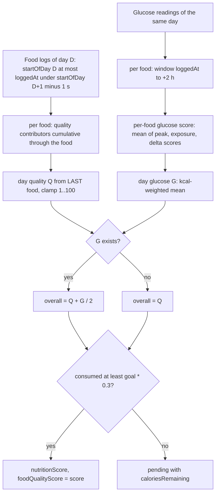

# Nutrition: Food Glucose, Food Quality, Daily Nutrition Score and TDEE (Bevel 3.1.7)

Scope: M10 (Food Glucose), M11 (Food Quality), M12 (Daily Nutrition Score), M13 (TDEE). Source: `evidence/G.md`, corrected by `evidence/R.md` (R1: TDEE reads HealthKit only; G's M13.04 is wrong) and by `evidence/B.md` (glucose baselines: 60 days, Chan merge, prior pseudo-days). Macro balance and glucose variability (a different calculator) are in [other-calculators.md](other-calculators.md).

Verified in assembly (orchestrator): the TDEE fallback 2500 in `FUN_1001129a0`. Verified in assembly (R2): the day calorie threshold `goal * 0.3` (0x100091814: `mov x8,#0x3333333333333333; movk x8,#0x3fd3,lsl #48; fmul d9, d0(Measurement.value), d1`) and the TDEE 30-day window (0x1016aff14 `mov w0,#0x1e; bl 0x1030cbe4c`).

Conventions: comparison stubs were checked against the stub symbol or the condition code, not the Ghidra label (`geoi` is `>=`, `leoi` is `<=`, `Date.loi` is `<`, `b.pl` after `fcmp` is `>=`, `b.hi` is `>`).

## Contents

- [Shared architecture](#shared-architecture)
- [Food Glucose](#food-glucose)
- [Food Quality](#food-quality)
- [Daily Nutrition Score](#daily-nutrition-score)
- [TDEE](#tdee)
- [Task closure](#task-closure)
- [Corrections to earlier research](#corrections-to-earlier-research)

## Shared architecture

Entry: `calculateMetrics(currentDay:lookbackDays:inputs:activityContext:macronutrientsGoalConfigurations:totalDailyEnergyExpenditure:syncedNutrientTotals:settings:dataSources:cgmRepository:)`, file `Superset/NutritionCalculator.swift`, implemented by `FUN_10008f1a4` (18 KB). Caller `FUN_1016bef30` logs "Nutrition Metrics - Calculate nutrition metrics by day" and "Merge metrics and cache results".

Types (Swift reflection):

- `FoodLog {id, imageUrl, title, analysisSessionId, loggedAt: Date, compoundFood, numServings: Double, relativePortion, nutritionScores?}` (0x1051ff21c). `loggedAt` is the food time.
- `GlucoseDataPoint {timestamp: Date, valueInMgDl: Float32?}` (0x1051fec48). Internal unit mg/dL, Float32, optional.
- `FoodGlucoseScores {glucoseScore: Double?, glucoseContributors: [GlucoseContributor: Double?], glucoseMetrics: [GlucoseContributor: Double?], glucoseBaselines: [GlucoseContributor: baseline?], glucoseScoreState}`. `GlucoseScoreState`: waitingForData 0, baselinesCalibrating 1, complete 2. `GlucoseContributor`: peak 0, exposure 1, delta 2.
- `FoodQualityScores {qualityContributors: [Contributor: FoodQualityContributorValue], preFoodQualityScore, postFoodQualityScore}`; `FoodQualityContributorValue {thresholdPercentage, previousPercentage?, percentage, prevScore?, score, isCappedImpact, cumulativeValue}` (0x48-byte record). `FoodNutritionScores {qualityScores, glucoseScores?}`.
- `PendingOrAvailableNutritionScore = pending(caloriesRemaining: Measurement<kcal>) | score(Double)`.
- `NutritionMetrics {nutritionScore, foodQualityScore, glucoseScore: Double?, aggregateQualityContributors, nutrients, metricMeasurements, foodScores}` (0x1051fea44). `DayScoreCalorieConfiguration {dayCalorieGoal, dayScoreCalorieThreshold}` (kcal Measurements).
- `ConnectedCGMState {device: ContinuousGlucoseMonitor, method}`. `ContinuousGlucoseMonitor`: dexcomG6, dexcomG7, dexcomStelo, lingo, freestyleLibre2, freestyleLibre3, other. Method enum (table 0x1060c9f60): appleHealth 0, dexcomFollow 1, libreLinkUp 2, liveTracking 3. Stored as a ushort (device low byte, method high byte); "not connected" is a method byte of 4 or 5. The raw value is JSON in UserDefaults `nutrition.connected_cgm` read by `FUN_1000ad3b4` (default 0x500 = not connected). `FUN_10008f1a4` normalizes `(v & 0xfe00) == 0x400` to 0x400.
- HealthQuantityType tag order: 0 restingHeartRate, 1 hrv, 2 vo2Max, 3 respiratoryRate, 4 hrMinuteAggregates, 5 hrSamples, 6 restingEnergyBurned, 7 activeEnergyBurned, 8 restingEnergyBurnedDisplay, 9 activeEnergyBurnedDisplay, 10 energyBurnedDisplay, 11 energyConsumedDisplay, 12 protein, 13 carbs, 14 fat, 15 bloodGlucose.



Day loop in `FUN_10008f1a4`, for each day D:

- Foods of the day: `startOfDay(D) <= food.loggedAt < startOfDay(D+1 day) - 1 s`. Lower bound `geoi` at 0x100090420 and 0x100090558; upper bound `Date.<` at 0x100090434 and 0x100090570 (strict, so a log at 23:59:59 is dropped).
- Glucose readings of the day: same day window. The 2 h meal window is applied on top, so a late-evening meal cannot see readings after midnight.
- Foods are processed in chronological order, `Calendar.current` (device time zone).
- Per food: quality, then glucose (`FUN_100101c00`), then cumulative contributors. After all foods: `FUN_100103bcc` (per-food map) and `FUN_100104390` (day roll-up).
- Effective macro-goal configuration for a day (R2, loop 0x100090458-0x100090890, asm read).
  - The configurations are 0x170-byte records. Each holds a start DayDate (y, m, d at +0x128..+0x138) and an optional end DayDate (+0x140..+0x150, nil flag at +0x158). A nil end is treated as `distantFuture` (0x100090718).
  - The day key is `0x1030f801c(D)` = (year, month, day). Comparisons are lexicographic on (y, m, d) (0x100090740-0x100090860).
  - Records are scanned in stored order and the FIRST that matches wins, so on ties the earlier record wins:

```ts
for (const c of configs) {
  if (c.start == day) return c;                        // equal start: chosen regardless of end
  if (c.start < day) { if (!(c.end < day)) return c; } // start < day <= end (end inclusive)
  else               { if (!(day < c.end)) return c; } // start after day: only a degenerate record with end <= day
}
return ZERO_CONFIGURATION;                              // 0x10009a270 zero-fills the record (no goals)
```

## Food Glucose

### Inputs (M10.01)

1. Timestamped glucose points: `HealthQuantitySample` for bloodGlucose (`doubleValue` mg/dL, `startDate` as timestamp). The baseline builder `FUN_100097bdc` copies `doubleValue` into `GlucoseDataPoint.valueInMgDl` with no unit check, via `(float)dVar35`. The provider must deliver mg/dL. Only `startDate` is used; `endDate` is ignored. Nothing assumes a 5-minute cadence; any spacing works, but the exposure integral needs at least 2 points in the window.
2. Meal logs: `loggedAt` and food `id`, plus the nutrient content for quality.
3. CGM connection state `ConnectedCGMState?` from the user setting. It controls the waiting time and `glucoseDisabled` (setting text "Incorporate glucose tracking into your overall nutrition score").

Internal unit mg/dL; no mmol/L to mg/dL conversion in the scoring path. Display only: `FUN_1020202b0` divides by 18.018 (Float32) when `GlucoseUnit == mmolL` (`GlucoseUnit`: mgDl, mmolL; `CustomizationViewModel.newGlucoseUnit`). HealthKit unit accessor `FUN_10310584c` = gram(milli)/liter(deci) = mg/dL (writers `FUN_101ba0650`, `FUN_101baf774`). Delta units follow glucose units; the quantile key is `Int(trunc(delta))` in mg/dL.

### Per-meal score (M10.03), `FUN_100101c00(out, food, now, readings, baselines, connectedCGM: ushort, glucoseDisabled: Bool)`

```ts
window = readings.filter(t => food.loggedAt <= t && t <= food.loggedAt + 2h)    // FUN_100101194 + 1030cb480: geoi then leoi, closed interval
if (glucoseDisabled)                                                            // LAB_100101d30
  return { score: nil, contributors: {}, metrics: {}, state: complete(2) }
method = connectedCGM.methodByte; hasCGM = !(method in {4, 5})
if (hasCGM) {
  wait = 2h + (method == appleHealth(0) ? 180 min : 0)
  if (now < food.loggedAt + wait)                                               // Date.< strict (0x100101d18)
    return { score: nil, empty, state: waitingForData(0) } }
// not connected: computes immediately, no waiting

peak     = max(window.valueInMgDl non-nil)                                      // Float32, nil if none            0x1000975e0
exposure = trapz over non-nil points sorted by timestamp:
           sum((t[i] - t[i-1]) / 3600 * (v[i-1] + v[i]) * 0.5)                  // Double, nil if < 2 points       0x100097790
delta    = Float32(last.value - first.value) in array order, nil if empty or either end nil     // 0x100097b4c
```

Contributors from `FUN_1001014d8` (keys: peak 0xa, exposure 9, delta 0xb):

```ts
function normalize(v, base) {                                                   // 0x10010136c, all Float32
  if (v == nil || base == nil) return nil
  z = -(Float(v) - base.mean) / base.sd
  f = z < -1 ? 0 : (min(z, 1) * 0.5 + 0.5) * 100
  return isFinite(f) ? f : nil      // sd == 0 and v == mean gives nil; sd == 0 and v > mean gives 0; v < mean gives 100
}
peakScore     = normalize(peak, baseline[peak])
exposureScore = normalize(exposure, baseline[exposure])
deltaScore    = deltaQuantile(delta, baseline[delta].histogram)
```

Delta quantile `FUN_100101400` (histogram built by `FUN_10183ba60` and `FUN_1014ddf08`):

```ts
if (delta == nil || histogram.entries < 2) return nil
hist = sorted [(Int(trunc(deltaValue_k)), count)]        // keys are Int(Double): truncation toward zero, traps if non-finite
cum_i = running sum of (count_i / total)                 // Double accumulation, NOT count-cum/total
q95 = key of first entry with cum >= 0.95                // asm fcmp d0,0.95; b.lt continues the scan, so >= 0.95 stops
if (no entry reaches 0.95) return nil
r = 100 - abs(delta / Double(q95)) * 100
r = clamp(r, 0, 100)                                     // r < 0 gives 0; r > 100 gives 100
return isFinite(r) ? r : nil
```

Zero q95: if q95 == 0 and delta != 0, delta/0 = inf, r = -inf, clamps to 0 (a valid 0, not nil). If delta == 0 and q95 == 0 the quotient is NaN and the result is nil.

Score and state:

```ts
glucoseScore = mean of the non-nil contributor scores (peak, exposure, delta)   // 0x100101870; nil if none
state: baselines == empty                 -> baselinesCalibrating(1)
for (c of [peak, exposure, delta]) { b = baselines[c]
  if (b missing) -> calibrating
  if (b.histogram != nil && Float(b.count) < 20.0) -> calibrating }       // asm fcmp s9,s8; b.pl: count >= 20 passes
else complete(2)
```

The score is computed whether or not the state is complete; the state is metadata. Observation count means non-nil feature values among the baseline meals (one per meal), not days. Count 19 gives calibrating, 20 gives complete. Note `FUN_100101c00` and B's `calculateGlucoseScore` text (shared-machinery G07) describe the same function; baseline counts include the prior pseudo-count.

### Baselines

Record `(mean: Float32, sd: Float32, count: Float32, histogram)` built by `FUN_10183b824`: mean = sum x / n, sd = sqrt(sum (x - mean)^2 / n) (population SD), n = number of non-nil values. Built by `FUN_100097bdc` over foods with `windowStart <= loggedAt < windowEnd` (`geoi` plus `Date.<`) and the matching readings; per food `window()` then the 3 features, pooled per contributor key. Day-to-baseline pooling (B): per-day stats are per meal (`count` = meals that day); the baseline is a Chan merge (n-1) of the preceding 60 calendar days plus a built-in prior pseudo-day:

| Metric | Prior |
|---|---|
| foodGlucoseAUC (9) | avg 200, popSD 16.3299, count 3, histogram {180:1, 200:1, 220:1} |
| foodGlucosePeak (10) | avg 160, SD 16.3299, count 3 |
| foodGlucoseDelta (11) | avg 50.0, SD 0, count 1, histogram [{50, 1}] |

So 17 real meals suffice for AUC/Peak and 19 for Delta to reach the 20 gate (shared-machinery G05).

### Day attribution and roll-up (M10.04)

A meal belongs to the calendar day of `loggedAt`; its readings are limited to the same day. Day glucose score G (`FUN_100104390` with `FUN_10183c390`) is the kcal-weighted mean over foods with a non-nil `glucoseScore`: `G = sum(score_i * kcal_i) / sum(kcal_i)`; nil if `sum kcal == 0` or no entries. The state (waiting or calibrating) is not checked here. G feeds the overall score.

## Food Quality

Contributor order (`DAT_10602a6a8`): 0 vegetables, 1 fruit, 2 wholeGrains, 3 nutsSeedsLegumes, 4 fishSeafood, 5 healthyOilUse, 6 redMeat, 7 processedMeat, 8 excessSugar, 9 excessSodium, 10 alcohol. Table re-verified from bytes (`FUN_1000aa3a0` and `FUN_10010353c`, constants 0x104ec51b0-0x104ec5218):

| # | Basis | Lower | Upper | Weight | Categories (FoodCategory index: weight) |
|---|---|---|---|---|---|
| 0 vegetables | kcal fraction | 0 | 0.10 | +10 | wholeVegetables(2): 1.0 |
| 1 fruit | kcal fraction | 0 | 0.06 | +10 | wholeFruit(0): 1.0 |
| 2 wholeGrains | kcal fraction | 0 | 0.05 | +10 | wholeGrains(5): 1.0 |
| 3 nutsSeedsLegumes | kcal fraction | 0 | 0.06 | +10 | nuts(9): 1, seeds(11): 1, legumes(10): 1, healthyNutsSeeds(8): 1, omega3NutsSeeds(7): 0.5 |
| 4 fishSeafood | fraction or binary | 0 | 0.03 | +10 | fattyFish(18): 1, egg(21): 0.1, soy(12): 0.5, omega3NutsSeeds(7): 0.5, leanFish(19): 0.05, shellfish(20): 0.1; binary list: omega3Supplement(33) |
| 5 healthyOilUse | kcal fraction | 0 | 0.07 | +10 | healthyOils(22): 1 |
| 6 redMeat | kcal fraction | 0 | 0.09 | -5 | redMeat(13): 1, processedRedMeat(17): 1 |
| 7 processedMeat | kcal fraction | 0 | 0.05 | -10 | processedMeat(15): 1, processedPoultry(16): 1 |
| 8 excessSugar | sugar kcal fraction | 0.05 | 0.10 | -10 | nutrient sugar; grams x 4 kcal |
| 9 excessSodium | mass, grams | 1.5 | 2.3 | -5 | nutrient 0x1c |
| 10 alcohol | mass, grams | 0 | 14 | -10 | nutrient 0x29 |

Overlap: a category can appear in several contributors with a weight (omega3NutsSeeds counts 0.5 toward both nuts and fish; processedRedMeat counts toward red meat only; processedPoultry toward processed meat only). Category index to name (35 entries, table 0x10602c010): wholeFruit, refinedFruit, wholeVegetables, refinedVegetables, starchyVegetables, wholeGrains, refinedGrains, omega3NutsSeeds, healthyNutsSeeds, nuts, legumes, seeds, soy, redMeat, poultry, processedMeat, processedPoultry, processedRedMeat, fattyFish, leanFish, shellfish, egg, healthyOils, unhealthyOils, butter, margarine, dairy, milk, cheese, plantBasedMilk, sugar, snack, artificialSweetener, omega3Supplement, other. The food category is assigned by the server (`FoodScoreApportionResponse` consumed at 0x10520cefc; check-GHR confirms), so the per-food `FoodCategory` is NOT IN IPA as an algorithm.

### Required inputs (M11.01)

Per food: `compoundFood` nutrient data with `FoodCategory` assignment (35-way per component), energy kcal, `numServings`, `relativePortion`, sugar (g), sodium (any mass unit; converted with `Measurement.converted(to: grams)`) and alcohol (g). Sodium 1.5 to 2.3 g is 1500 to 2300 mg. Per-nutrient kcal factors: 4 kcal/g for mask 0x21000821, 9 for fats (mask 0x84440400), 7 for alcohol (0x29) at `FUN_1000a76a0`; sugar uses 4.

### Aggregate (M11.02): `FUN_10010353c(contributorDict, excludedSet)`

```ts
score = 50
for (c of excludedSet) if (config(c) is positive (tags 0, 1)) score += weight(c)   // +10; negatives add 0
dict.removeKeys(excludedSet)
score += sum(entry.score for remaining)               // entry.score at +0x30
return clamp(score, 1, 100)                           // score < 1 gives 1, score > 100 gives 100; equality passes through
```

The excluded set is the persisted setting `disabledFoodQualityContributors` (published property read through key paths on the settings object, `param_11`, passed as `local_7a0`). All 11 disabled gives 50 + 60 = 100 before the clamp.

### Evaluators (M11.03)

Contributor types (`FoodQualityContributorType`): adderCaloricPercentageOrBinary (fish, tag 0), adderCaloricPercentage (tag 1), detractorCaloricPercentage (tag 2), detractorCaloricBasedMass (sugar, tag 3), detractorMass (sodium, alcohol, tag 4). Evaluators `FUN_1000a6e44` (tags 0-2), `FUN_1000a76a0` (tag 3), `FUN_1000a7d5c` (tag 4). Each outputs a 0x48-byte `FoodQualityContributorValue`: +0x00 threshold-percentage, +0x08 previousPercentage, +0x18 percentage, +0x20 prevScore, +0x30 score, +0x38 isCappedImpact, +0x40 cumulativeValue. "prev" is the same contributor's record after the previous food of the day (nil dict gives 0).

Tags 0-2 (`FUN_1000a6e44`, asm 0x1000a7360-0x1000a7598):

```ts
catKcal  = sum over (cat, w) of w * dayCumulativeKcal[cat]          // cumulative through this food
foodKcal = this food's category kcal (d12)
p = catKcal / dayCumulativeTotalKcal                                 // fdiv d15 = d13/d11 at 0x1000a7450, no zero guard
percentage = fminnm(p >= 0 ? p / upper : 0, 1.0)                     // fcmp d0,#0; fcsel ..ge; NaN gives 0
t = (p - lower) / (upper - lower)
score = (t < 0 || isNaN(t)) ? 0 : (t >= 1 ? weight : weight * t)     // t >= 1: fcmp d0,d1; b.pl
isCappedImpact = (foodKcal > 0 /*fcmp d12,#0; b.gt*/) && (prevScore == weight)    // exact equality, fcmp d14,d8; cset eq
cumulativeValue = catKcal
// fish binary (tag 0): if the cumulative category dictionary has ANY entry for omega3Supplement(33) (key presence, kcal value irrelevant),
// p is forced to `upper`: percentage 1.0, t = 1, score = +10
```

Tag 3 sugar (`FUN_1000a76a0`, asm 0x1000a7a58-0x1000a7ac0): `nutrientKcal = grams * 4`; `p = (nutrientKcal + prev.cumulativeValue(+0x40)) / dayTotalKcal`; if p is non-finite (abs bits >= 0x7ff0000000000000, `fcsel ... lt`) then `p = prev.percentage (+0x18)`; same t, percentage and clamp rules with lower 0.05, upper 0.10, weight -10 (t >= 1 gives -10); `isCapped = (this food's nutrient kcal > 0 /*b.gt*/) && prevScore == weight`; `cumulativeValue = nutrientKcal + prev cumulative`.

Tag 4 sodium and alcohol (`FUN_1000a7d5c`, asm 0x1000a7e50-0x1000a80d8):

```ts
mass = this food's nutrient amount converted to grams (Measurement.converted(to: NSUnitMass grams))     // 0x1000a7e7c
lower, upper = threshold Measurements converted to grams (sodium 1.5/2.3, alcohol 0/14)
cum = mass + prev.cumulativeValue(+0x40) (0 if no prev)                  // fadd d12 = d10 + d12 at 0x1000a7fd0
t = (cum - lower) / (upper - lower)                                      // 0x1000a7fd4-fdc
t2 = (t >= 0) ? fminnm(t, 1.0) : 0                                       // fcmp d0,#0; fcsel ge; NaN gives 0
score = weight * t2                                                      // weight -5 sodium, -10 alcohol
percentage = clamp(cum / upper, 0, 1)                                    // fcmp d0,#0; fcsel ge; fminnm 1.0
isCappedImpact = (mass > 0 /*fcmp d10,#0; b.le gives false*/) && (prevScore == weight)    // exact equality
cumulativeValue = cum
```

A special `nutrient == 0xa` case (`FUN_1000a7b80`, zeroes mass when it returns false) is never taken for sodium (0x1c) and alcohol (0x29). Zero intake: 0/0 is NaN for tags 0-3 which falls to score 0 and percentage 0; mass contributors with 0 g give t2 = 0.

Boundary audit: `t < 0` gives 0 (b.ge falls through on NaN; equal-to-0 scores 0 anyway); `t >= 1` gives full weight (`b.pl`); scores are continuous so those equalities change nothing numerically; percentage clamp `>= 0` and `min(., 1)` with `fminnm` returning the non-NaN operand; isCapped uses strict `> 0` and exact `==`; aggregate clamp `fcmp ... 100.0` then `1.0 <= score`.

## Daily Nutrition Score

### Overall (M12.01), asm 0x100104a18-0x100104a38 in `FUN_100104390`

```ts
Q = FUN_10010353c(lastFoodOfDay.qualityScores.qualityContributors, disabledSet)    // clamp [1, 100]; empty day gives clamp(50 + disabled positives)
G = kcalWeightedMean(foods with non-nil glucoseScore)                              // or nil
overall = (G == nil) ? Q : (Q + 0.0 + G) * 0.5                                     // fcsel d0, d8, d0, eq
```

`FUN_100104390` returns d0 = overall, d1 = Q, x0 = G (with nil flag). The dispatcher builds `nutritionScore` from d0 and `foodQualityScore` from d1. The day Quality score uses only the LAST food's cumulative contributors, not a per-food average.

### Calorie and food-input gating (M12.02)

```ts
goal = FUN_100093994(configGoal, tdee)               // asm 0x100093a84-0x100093b8c
     = configGoal if present                          // first test (x0), b.ne copies config
       else tdee if present                           // second test (x1)
       else 2000 kcal (0x409f400000000000)
threshold = goal * 0.3                                // 0x3fd3333333333333, asm 0x100091814
consumed = sum of the day's food kcal
if (consumed >= threshold)                            // geoi (>=), asm 0x1000927c8 / 0x1000928ac
  nutritionScore = .score(overall); foodQualityScore = .score(Q)
else
  both = .pending(caloriesRemaining = threshold - consumed)
```

Precedence evidence: call site 0x100091800-0x100091804 is `bl 100093994` with x0 = local buffer `[x19+0x210]` (the day's selected macronutrient goal configuration, Optional<Measurement<kcal>>, allocated at 0x10008f910) and x1 = `[x19+0x80]` (9th argument of `FUN_10008f1a4`, stack arg `[x29+0x10]` stored at 0x100090230, the TDEE argument). Inside `FUN_100093994` x0 is tested first (`getEnumTagSinglePayload == 1` means nil); only when nil is x1 tested; both nil stores 2000. Glucose absent gives overall = Q.

### Required per day (M12.03)

Food logs with `loggedAt`, per-food energy (kcal), the nutrient and category details of M11.01, optional glucose points, and a calorie goal or TDEE. Without calories logged the score stays pending. Remote flags `nutritionScoreV2` and `nutritionScore` (CoachingFeatureFlags, decode 0x1043e27ac) have server-side values (boundary).

## TDEE

### Final composition (`FUN_1001129a0`, asm 0x1001129a0-0x100112a5c)

```ts
B = FUN_10198fd0c(profile)         // BMR; nil or missing gives TDEE = 2500 (not rounded)
E = FUN_10198f484(dict)            // mean daily active energy
X = FUN_1019901c4(dict)            // thermic term
if (B missing)      tdee = 2500
else if (E missing) tdee = roundAway(B * 1.4)
else if (X missing) tdee = roundAway((B + E) + 0.1 * (B + E))      // 0.1 = 0x104ebf1b0
else                tdee = roundAway(B + E + X)                      // FRINTA, ties away from zero
```

Persisted as Float32 under UserDefaults `nutrition.tdee_value` (store key 0xc). `FUN_10011215c` returns the stored value as a kcal Measurement if present; compute only runs when the stored value is nil. A manually edited TDEE (EditTDEEView) lives in the same key; "Reset to auto-calculated TDEE" clears it. The 2500 fallback flag argument: `(param_2 & 0xff) == 1` (also literal `0x40a3880000000000` in `FUN_1019de590`, the macro walkthrough).

### Outer history and sums (M13.01)

- History window (`FUN_1016afe1c` / `FUN_1016afebc`): `from = startOfDay(now - 30 days)` (`FUN_1030cbe4c` negates 30), `to = now`; the provider widens it to `[startOfDay(from), startOfDay(to + 1 day) - 1 s]` (`FUN_10166cff0`: `cbe40`, `cbe94`); interval `DateComponents(day: 1)`.
- Types fetched: `[12, 13, 14]` merged with `[9]` (static arrays 0x1060bc178, 0x1060bc1a0), one child task per type with a 300 s timeout.
- Day buckets come from an `HKStatisticsCollectionQuery`-style fetch in `HealthKitManager` (`FUN_10182b9bc`, descriptor init 0x10182bbb8). For types 11-14 the bucket value is the sum over sources of `sumQuantityForSource`; other types use `sumQuantity`. Each bucket becomes a synthetic `HKQuantitySample(start, end)`; buckets with a nil sum are skipped (`FUN_10182c878`).
- E: samples of key 9 grouped by calendar day of `startDate` (`FUN_1030f801c` with `isDate(inSameDayAs:)`), summed per day in `HKUnit.largeCalorie` (kcal) (`FUN_10198f680`), then `mean`.
- X inputs: per-element `doubleValue(for: gram)` of keys 13, 12, 14 (carbs, protein, fat), then `mean`.
- `mean` (`FUN_101990000`, coverage constant 0.8 at 0x104ebe868): drops NaN/inf and exact zeros (both signs; subnormals kept); `coverage = accepted / supplied`; nil if `coverage < 0.8` (asm `fcmp d8,d0; b.hi` rejects 0.8 > coverage, so exactly 0.8 passes) or accepted == 0; else sum/accepted. Negative values are kept. The denominator is the number of supplied buckets (days with data), not 30 calendar days.
- `X = 0.25*(4*protein) + 0.07*(4*carbs) + 0.03*(9*fat)` with the Float32 4/4/9 multiply before the Double 0.25/0.07/0.03.

### Source: HealthKit only (R1, supersedes G's M13.04)

R1 traced every hop: `FUN_100112638` (TDEE compute) calls the async record 0x104f98258 to `FUN_1016afe1c(x0 = calculator + 0x10)`. `+0x10` is the first stored property of `TDEECalculator` (descriptor 0x1051ff840: `healthKitManager {HKMProtocol}`, `userAttributesProvider`, `userDefaultsService`). `FUN_1016afebc`: `from = startOfDay(now - 30 d)`; async let 0x104f98268 to `FUN_1016b01a4` to `FUN_1016afc44` / `FUN_1016afc64` with a task group over `[12, 13, 14] + [9]`. Each child task runs 0x104f97c58 to `FUN_1016a523c` to `FUN_1016a0f94` / `FUN_1016a100c`: a task group with a 300 s timeout (`0x4072c00000000000`), then 0x104f97c78 to `FUN_1016a55e4` to `FUN_1016a154c` / `FUN_1016a156c`, which calls the async record 0x104f96c38 = `FUN_10166cff0(DAT_106a11620, hkmExistential, type, from, to)` to `FUN_10166d124`, which calls HKMProtocol witness slot +0x60 on the TDEE calculator's existential. HKMProtocol has exactly two conformances (HealthKitManager: conformance descriptor 0x104fa3bd4, witness table 0x1060c4eb8; MockHealthKitManager: conformance 0x104f378a0). For HealthKitManager slot +0x60 is entry 0x1060c4f18 to record 0x104fa3c18 to `FUN_10183104c` to `FUN_10182c058`, which builds an `HKStatisticsCollectionQueryDescriptor`: HealthKit only. The integration fan-out (`FUN_101663b18`, union of Google, Oura, Garmin) is not on this path.

So E (key 9 `activeEnergyBurnedDisplay`) is the mean daily sum of HealthKit statistics buckets; sources disabled in the user's source list are filtered out by `FUN_10182d0c0`. Google, Fitbit and Oura energy that sits only in Bevel's integration stores contributes NOTHING to TDEE; it can enter only if another app (for example the Fitbit iOS app) writes it into Apple Health. G's M13.04 claim ("a Fitbit/Google (Air) connector that supplies active kcal can feed it") is false for the integration connector.

### Profile and BMR (M13.02, M13.03)

- Profile source `CachedUserAttributesProvider` (class 0x106430e90) caches a `SharedUserProfile {birthday?, heightInchesDecimal?, weightLbs?, biologicalSex?, fallbackSex?}` JSON in UserDefaults key 0xd, via the async method 0x1001133e0 (cache hit, else default). Weight = `Measurement(weightLbs, pounds)`, height = `Measurement(heightInchesDecimal, inches)` (`FUN_10310dfb8`, `FUN_10310deec`). Default profile (`FUN_10310e370`): birthday, height, weight nil; `biologicalSex` = notSet(3), `fallbackSex` = 2. Any missing weight, height or birthday gives a nil `BMRAttributes`, so B is missing and TDEE = 2500. There is no default weight. Weight is not read from a scale or HealthKit; it comes from the user profile. `BMRAttributes {weight, height, birthday, biologicalSex}`.
- `BiologicalSex`: male 0, female 1, other 2, notSet 3. The sex constant is `-161` only for female (tag 1); male, other and notSet use `+5`. `fallbackSex` is not used.
- `B = 10*kg + 6.25*cm - 5*age + sexConst`; kg and cm via `Measurement.converted(to: kilograms / centimeters)` (`FUN_10198fd0c`). Age: Gregorian `dateComponents([.year], from: birthday, to: now).year` (`FUN_1030ce4ec`). No lower clip.
- X depends on dietary protein, carbs and fat logs (grams), which a wearable connector does not provide; without them TDEE = round((B + E) * 1.1). B needs the user-entered profile; with no profile the answer is 2500.

## Task closure

| Task | Status | Where |
|---|---|---|
| M10.01 timestamped glucose and meals absent in current map | RESOLVED (connector gap stated) | [Food Glucose](#food-glucose) |
| M10.02 CGM/provider conversion | RESOLVED | [Food Glucose](#food-glucose) |
| M10.03 zero q95 and delayed completion | RESOLVED | [Food Glucose](#food-glucose) |
| M10.04 daily attribution | RESOLVED (baseline window 60 days from B) | [Food Glucose](#food-glucose) |
| M11.01 food category/sugar/sodium/alcohol detail not retained | RESOLVED (connector gap stated; categories are server-assigned) | [Food Quality](#food-quality) |
| M11.02 filter published-property assignment | RESOLVED | [Food Quality](#food-quality) |
| M11.03 zero intake and category overlap | RESOLVED | [Food Quality](#food-quality) |
| M12.01 overall equation | RESOLVED | [Daily Nutrition Score](#daily-nutrition-score) |
| M12.02 day calorie / food-input gating | RESOLVED | [Daily Nutrition Score](#daily-nutrition-score) |
| M12.03 required external food logs | RESOLVED (connector gap) | [Daily Nutrition Score](#daily-nutrition-score) |
| M13.01 outer history and per-day sample sum | RESOLVED | [TDEE](#tdee) |
| M13.02 profile weight source/default | RESOLVED | [TDEE](#tdee) |
| M13.03 enum/source dispatch semantic verification | RESOLVED | [TDEE](#tdee) |
| M13.04 Air calories versus user/scale weight and food logs | RESOLVED by R1: Air energy does not reach TDEE | [TDEE](#tdee) |

## Corrections to earlier research

- Glucose baseline normalizer is Float32 and returns nil on NaN; delta is a quantile of a truncated-integer histogram with an accumulated-division cumulative; the 20-observation gate is per contributor and inclusive; the post-meal wait is 2 h (5 h for Apple Health), not a fixed 2 h; the window is closed `[t, t+2h]`.
- Per-meal glucose score is computed even with calibrating baselines; the state is only a label. Bevel delays Apple Health glucose by 3 h on top of the 2 h meal window.
- The day Quality score uses only the last food's cumulative contributors.
- M13.04 (G) is wrong: the integration connector does not feed TDEE (R1).
