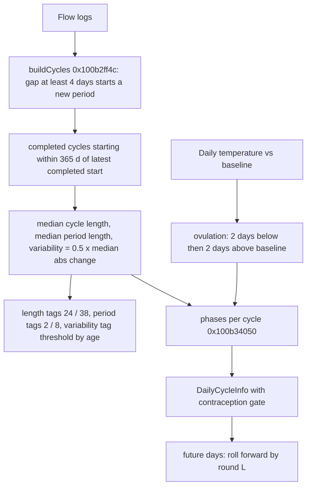

# Other calculators (task G15): cycle, journal, EPOC and cardio focus, sport statistics, trend bands, blood pressure, glucose variability, macro balance, strength helpers

Scope: G15 (registered calculators beyond the 18 score families). Sources: `evidence/I.md` (G15.1 to G15.8 plus the orchestrator's blood-pressure addendum), `evidence/H.md` (G15 classification table, strength helpers, widget/capture comparison; superseded by I where they conflict). `evidence/R.md` supplies the TRIMP resting-HR baseline used by EPOC. G15 is closed by I. H's own status "BLOCKED" is superseded.

Assembly verified by the orchestrator ("verified in assembly"): EPOC `exp(4*...)`, 0.3, 0.7, 0.85 at 0x1017cc54c. Blood-pressure thresholds per the I.md addendum (read from the category jump table); the AND/OR combinator of every category was read in assembly by R2 (0x100595d08).

Comparison stubs (checked against `otool -Iv`): `0x104e57d78` is `<`, `0x104e57d84` is `>=`, `0x104e57d90` is `<=`. Swift `Optional<T>` results come back as (value, isNil flag) register pairs; "nil" below means the flag is set.

## Contents

- [Status of the G15 groups](#status-of-the-g15-groups)
- [Cycle prediction](#cycle-prediction)
- [Journal insights](#journal-insights)
- [EPOC and cardio focus](#epoc-and-cardio-focus)
- [Sport statistics](#sport-statistics)
- [Vitals, trend status bands and trend directions](#vitals-trend-status-bands-and-trend-directions)
- [Blood pressure categories](#blood-pressure-categories)
- [Glucose average, variability and fasting glucose](#glucose-average-variability-and-fasting-glucose)
- [Macro balance](#macro-balance)
- [Strength helpers](#strength-helpers)
- [Widget and capture extension calculators](#widget-and-capture-extension-calculators)
- [Corrections to earlier research](#corrections-to-earlier-research)

## Status of the G15 groups

| Group | Status | Section |
|---|---|---|
| strength effective weight, 1RM, RPE | RESOLVED (H full, F for RPE) | [Strength helpers](#strength-helpers) |
| widget / capture calculators | RESOLVED (comparison) | [Widget and capture extension calculators](#widget-and-capture-extension-calculators) |
| cycle prediction | RESOLVED | [Cycle prediction](#cycle-prediction) |
| journal regression | RESOLVED | [Journal insights](#journal-insights) |
| cardio focus / EPOC | RESOLVED | [EPOC and cardio focus](#epoc-and-cardio-focus) |
| pace / power / cadence / swim / running dynamics | RESOLVED | [Sport statistics](#sport-statistics) |
| vitals / health monitor / trends | RESOLVED, including blood-pressure categories (orchestrator addendum) | [Vitals](#vitals-trend-status-bands-and-trend-directions), [Blood pressure](#blood-pressure-categories) |
| glucose variability / fasting glucose | RESOLVED | [Glucose](#glucose-average-variability-and-fasting-glucose) |
| macro balance | RESOLVED (status enum is never computed locally) | [Macro balance](#macro-balance) |

## Cycle prediction

Files and functions (`Superset/CycleTrackingPredictionService.swift`):

| Role | Address |
|---|---|
| top level `calculateCycleTrackingPrimaryMetrics(...)` | 0x100b35c98 (caller `calculateAndStoreCyclePredictions` 0x100b5190c) |
| daily historical snapshots | 0x100b31710 |
| flow days to `PeriodCycle` list | 0x100b2ff4c |
| completed-cycle filter (365 d) | 0x100b3059c |
| median cycle length / median period length / variability | 0x100b30974 / 0x100b30ad4 / 0x100b30c1c |
| median | 0x100b308bc |
| status (`active` / paused `noFlowLoggedTooLong`) | 0x100b31440 |
| daily infos and phases for every cycle | 0x100b34784 |
| phases for one ovulation day | 0x100b34050 |
| ovulation day choice | 0x100b33b1c (median of previous days 0x100b32c7c; temperature 0x100b33620 to 0x100b32ff4) |
| future days | `generateMissingDays` 0x100b32830 to `generateFutureMetricsSnapshots` 0x100b31ef8 |
| next period date | 0x100b345d4 (+0x100b2cfac) |
| contraception gates | 0x100a1de88 (active), 0x100b3126c (after stopping, until the first flow) |
| `DayTemperatureEntry` builder | 0x100bcf604 |
| prediction defaults | 0x100b3e55c |

Day keys: `0x1030f8aa4(n, key)` = key + n days and `0x1030f8a98(n, key)` = key - n days (both through `0x1030cba00` / `0x1030cbc20` with `.day`). `0x1030f8fb8(A, B)` = `Calendar.dateComponents([.day], from: B, to: A).day` = A - B in days, or 0 if nil.

Types: `PeriodCycle{startDateKey, endDateKey?, periodLength: Int, cycleLength: Int?}` (stride 0x50). `CyclePhaseInfo{phase, startDay, endDay, isLowConfidence}`. `CycleTrackingLengthTag{normal, short, long}`. `CycleVariabilityTag{regular, irregular}`. `CycleTrackingStatus{paused(PauseReason{noFlowLoggedTooLong, contraception}), active}` raw 0/1/2. `DayTemperatureEntry{date, average: Double, baseline: Double?}`. `CycleTrackingFlowLevel{noFlow, unspecified, light, medium, heavy}`. `CyclePhase{period, follicular, ovulatory, luteal}`. `CycleTrackingPredictionDefaults{cycleLength, periodLength}`.



```ts
// 0x100b2ff4c  build cycles from flow (H's rule confirmed: asm 0x100b30288 `cmp x0,#4; b.lt` means a gap >= 4 starts a new period)
function buildCycles(flows) {                       // flows: {date, flowLevel}
  const days = flows.filter(f => f.flowLevel != noFlow).map(f => dayKey(startOfDay(f.date))).sort();
  const cycles = []; let start = null, cur = [];
  for (const d of days) {
    if (cur.length == 0) { start = d; cur = [d]; continue; }
    if (d - last(cur) >= 4) {                        // more than 3 days: new period
      cycles.push({ start, end: d, periodLength: last(cur) - start + 1, cycleLength: d - start });
      start = d; cur = [d];
    } else cur.push(d);
  }
  if (start) cycles.push({ start, end: null, periodLength: last(cur) - start + 1, cycleLength: null });   // ongoing cycle
  return cycles;
}
// 0x100b3059c(cycles, completeOnly = true)
function window365(cycles) {
  const c = cycles.filter(x => x.end != null);       // completed cycles only
  if (!c.length) return [];
  const cutoff = last(c).start - 365;                // 0x100b30700 mov x0,#-0x16d
  return c.filter(x => x.start >= cutoff);
}
const median = xs => { s = sort(xs); n = s.length; return n % 2 ? s[(n-1)/2] : (s[n/2-1] + s[n/2]) / 2 }   // 0x100b308bc, nil if empty
function medianCycleLength(cycles, defaults) {       // 0x100b30974
  if (cycles.length == 1 && cycles[0].end == null) return { value: defaults.cycleLength, usingDefaults: true };
  return { value: median(window365(cycles).map(c => c.cycleLength).filter(notNil)) };
}
function medianPeriodLength(cycles, defaults) {      // 0x100b30ad4 (same default rule)
  if (cycles.length == 1 && cycles[0].end == null) return { value: defaults.periodLength, usingDefaults: true };
  return { value: median(window365(cycles).map(c => c.periodLength)) };
}
function variability(cycles) {                       // 0x100b30c1c
  const L = window365(cycles).map(c => c.cycleLength).filter(notNil);
  if (L.length < 2) return null;
  return 0.5 * median(L.slice(1).map((x, i) => Math.abs(x - L[i])));      // fmul by 0.5 at 0x100b30e6c
}
// Defaults (0x100b3e55c): UserDefaults key "cycleTrackingPredictionDefaults" (JSON).
// If the key is missing or does not decode: { cycleLength: 28, periodLength: 5 } (0x100b3e640 / 0x100b3e644).
```

Daily historical snapshot (0x100b31710, one record per day key in `[start, min(end, today)]`). For each day D only flows up to D are used:

```ts
age = userAge ?? 40                                   // 0x100b35c98: local_288 = 0x28 when userAge is nil
cycles = buildCycles(flowsUpTo(D))
mcl = medianCycleLength; mpl = medianPeriodLength; v = variability
cycleLengthTag  = mcl == nil ? nil : mcl < 24 ? short : mcl > 38 ? long : normal      // d12 = 24, 0x4043.. = 38
periodLengthTag = mpl == nil ? nil : mpl < 2  ? short : mpl > 8  ? long : normal      // d10 = 2, d11 = 8
thr = ((age >= 18 && age <= 25) || (age >= 42 && age <= 45)) ? 5 : 4                  // asm 0x100b31c7c-0x100b31cd0, mask 0x3c0003fc0000
variabilityTag  = v == nil ? nil : (v > thr ? irregular : regular)                     // strict >
status = statusFor(mcl, flowsUpTo(D), D)
dayOfCycle = D - (cycles.last?.start ?? rangeStart) + 1
isUsingDefaults = mcl.usingDefaults || mpl.usingDefaults
cycleCount = cycles.length                            // includes the ongoing cycle
// 0x100b31440
function statusFor(mcl, flows, D) {
  if (mcl == nil) return active;
  const f = flows.filter(x => x.flowLevel != noFlow);
  if (!f.length) return active;
  return (D - dayKey(last(f).date)) > 2 * mcl ? paused(noFlowLoggedTooLong) : active;  // fcmp: 2*mcl < days
}
```

So the in-app copy "age 26-41 +/-4, otherwise +/-5" is wrong at the edges: ages below 18, above 45 and nil (40) all get threshold 4; only 18-25 and 42-45 get 5.

Temperature input (0x100bcf604): `average` is the day's mean of temperature metric 7 (body source) or 6 (wrist), midnight-to-midnight window; `baseline` is the stored baseline for key 20 or 19 (Float to Double). Same source switch as Recovery. A missing baseline gives nil.

Ovulation from temperature (0x100b33620 + 0x100b32ff4):

```ts
function predictOvulationFromTemperature(cycle, temps /* [DateKey: DayTemperatureEntry] */) {
  if (cycle.cycleLength == nil) return nil;           // "Cannot use temperature ovulation prediction for ongoing cycle"
  const pts = [];
  for (let i = 0; i < cycle.cycleLength; i++) { const e = temps[cycle.start + i]; if (e) pts.push({ day: i + 1, e }); }
  if (pts.length < 4) return nil;                     // "need 4"
  for (let i = 3; i < pts.length; i++) {
    const [a, b, c, d] = [pts[i-3], pts[i-2], pts[i-1], pts[i]].map(p => p.e);
    if ([a, b, c, d].some(x => x.baseline == nil)) continue;
    if (a.average < a.baseline && b.average < b.baseline && c.average > c.baseline && d.average > d.baseline)
      return pts[i-2].day;                            // the second low day (element i-2, asm 0x100b333c0-0x100b334a0)
  }
  return nil;
}
```

There is no temperature-rise magnitude threshold, only the sign relative to the baseline.

```ts
// 0x100b32c7c / 0x100b33b1c
function predictOvulationDay(priorCycles, L, temps, prevOvulationDays) {
  let med = prevOvulationDays.length ? round(median(prevOvulationDays)) : nil;    // frinta (half away from zero)
  if (med != nil && !(L - 14 <= med && med <= L - 8)) med = nil;                  // "outside valid luteal range, skipping"
  const fallback = med ?? (L - 13); const usedDefault = (med == nil);
  if (!temps.size || !priorCycles.length) return { temp: nil, fallback, usedDefault };
  let t = predictOvulationFromTemperature(last(priorCycles), temps);
  if (t != nil && !(L - 14 <= t && t <= L - 8)) t = nil;
  return { temp: t, fallback, usedDefault };
}
// 0x100b34050
function phasesForOvulationDay(ovDay, P /*periodLength*/, L /*effectiveCycleLength*/, follicularLengths, variability, forceLow) {
  const ov = Math.max(ovDay, P + 2);
  const luteal = L - (ov + 2) + 1;
  if (luteal < 8 || luteal > 14) return fail;         // "Luteal phase length ... outside valid range [8, 14]"
  const folLen = (ov - 2) - (P + 1) + 1;
  if (folLen < 0) return fail;                        // "Follicular phase length would be negative"
  const typical = follicularLengths.length ? Math.min(max(follicularLengths), 20) : 15;   // 0x101d7acbc is max()
  const lowConf = folLen == 0 ? true : ((variability ?? 0) + typical < folLen) || forceLow;
  return [ { period, 1, P, false },
           ...(folLen ? [{ follicular, P + 1, ov - 2, false }] : []),
           { ovulatory, ov - 1, ov + 1, lowConf },
           { luteal, ov + 2, L, false } ];
}
```

Phases per cycle plus daily infos (0x100b34784). Cycles are processed oldest first; two arrays carry across cycles: `follicularLengths` (slot x19+0x268) and `previousOvulationDays` (slot x19+0x260).

```ts
for (const cyc of lastSnapshot.cycles) {
  snaps = cyc.end ? snapshots with cyc.start <= date < cyc.end
                  : snapshots with date >= cyc.start whose last cycle starts at cyc.start;
  [M, variability] = snaps.length ? [latest(snaps).medianCycleLength, latest(snaps).variability] : [cyc.cycleLength, nil];
  currentDay = cyc.end ? nil : max(snaps.dayOfCycle);
  prior = cycles with start <= cyc.start;
  if (!prior.length) continue;                         // "No current cycle available"
  if (M == nil || M < 21) continue;                    // "Median cycle length X below minimum valid 21"
  Lm = round(M); cur = last(prior); limit = Math.min(2 * M, 90)   // written as 2M<=90 ? x>2M : x>90
  if (cur.ongoing) { L = (currentDay != nil && Lm < currentDay) ? currentDay : Lm;
                     if (currentDay > Lm && currentDay > limit) continue; }   // "Cycles would be too long"
  else { L = cur.cycleLength; if (L > limit) continue; }                       // "Actual cycle length ... unreasonable"
  if (L < cur.periodLength + 11) continue;                                      // "Cycles would be too short"
  o = predictOvulationDay(prior, L, temps, previousOvulationDays);
  ph = o.temp != nil ? phasesForOvulationDay(o.temp, P, L, follicularLengths, variability, false) : fail;
  if (ph ok) { previousOvulationDays.push(o.temp); }                            // learned only from temperature cycles
  else       ph = phasesForOvulationDay(o.fallback, P, L, follicularLengths, variability, o.usedDefault);
  if (ph has follicular) follicularLengths.push(fol.end - fol.start + 1);       // learned from every cycle with phases
  phasesByCycleStart[cyc.start] = ph;
}
// DailyCycleInfo per snapshot
for (s of snapshots) {
  contraceptionBlocked = activeContraception(s.date) || afterContraceptionBeforeFirstFlow(s.date);
  //  0x100a1de88: an entry is active when start <= date <= (end ?? distantFuture), and it blocks unless (contraceptiveType == unspecified && overrideAllowsPhaseTracking)
  //  0x100b3126c: take the latest ended blocking entry E with E.end < date; blocked while date > E.end and (no flow after E.end, or date < first flow after E.end)
  if (!contraceptionBlocked) {
    phase = the phase in phasesByCycleStart[s.lastCycle.start] with start <= s.dayOfCycle <= end;
    dayOfPhase = dayOfCycle - phase.start + 1; isLowConfidence = phase.isLowConfidence;
  } else { status = paused(contraception); phase = nil; }
  hasFlow = flow[s.date]?.flowLevel != noFlow;
  hasSufficientData = s.cycleCount > 5;                // asm 0x100b35940 cmp #5, gt
  // the rest is copied from the snapshot: medians, tags, cycleCount, isUsingDefaults, isFuturePrediction = s.isPrediction
}
// nextPeriodDate (0x100b345d4):
//   a future-predicted day whose phase is .period and whose previous day is not .period: that day's own date;
//   otherwise min(first later day with dayOfCycle == 1, first later day that starts a .period run (0x100b2cfac)).
```

The current card's phases in 0x100b35c98 repeat the same block for the last cycle only with `currentDay = today - lastStart + 1`; `preCalculatedMedianCycleLength` and `preCalculatedVariability` override the snapshot values; `shouldShowPhases` is the success flag of `phasesForOvulationDay`.

Future days (0x100b31ef8): `L` and `P` are frozen and rounded. Rounding failure logs "Cannot round ..." and gives no future days. If `currentDay > min(2L, 90)` it logs "Current cycle day X exceeds reasonable length for median, cannot predict". Otherwise it walks day by day; once the counter passes `round(L)` it appends a predicted cycle (`start = previous start + round(L)`, `periodLength = round(P)`, `cycleLength = nil`) and restarts at day 1. Future snapshots get `isPrediction = true` and copy variability, tags and status from the last historical snapshot.

Evidence: decompile 100b3.c; asm 0x100b31bcc-0x100b31cd4 (tags), 0x100b30e64 (x0.5), 0x100b316c8-0x100b316e8 (2x median), 0x100b333c0-0x100b334bc (temperature shift), 0x100b340a8-0x100b344a0 (phases), 0x100b35940 (> 5). Log strings at 0x1058dccd0-0x1058dd740.

## Journal insights

Path: the async body 0x10189fd08 (JournalModel insights) loops over outputs `{sleepScore (variant 96), recoveryScore (97)}`. For each output it builds `[(DateKey, value)]` for the last 90 days (0x101891d94 to 0x10188f048, window `today - 90 d` via `0x1030cbe4c(..., 0x5a)`), then calls 0x101892dc0 per input key; 0x101892dc0 calls the regression 0x1018d5e58 which uses the significance test 0x1018d5c38.

Pairing (0x101892dc0): for every output day D the input is the factor value on day D - 1 (`0x1030f8a98(1, D)`). Days whose input is nil are skipped. The input encoders return only 0.0 or 1.0:

- boolean presets (0x1018914f4 / 0x101890c64 boolean branch): 1 if logged true.
- nutrient presets (variants 0x51-0x5c and `alcohol` 0x10): `sum` = the day's Float sum of the nutrient; `(target?, limit?)` from 0x1018926a4. `x = 0` if a target exists and (`target == 0 ? sum <= 0 : sum < target`); otherwise `x = (limit == nil || sum <= limit) ? 1 : 0`.
- `menstruationV2` / `abdominalCramps` (0x5d / 0x5e) use cycle data. State of Mind (0x1018929f0) uses the last State of Mind sample of the day: valence classes 2 and 5 are skipped; `x = 1` when the class is in {1, 3} (positive key) or {0, 4} (negative key).

```ts
function journalInsight(pairs /* {y: outputScore(D), x: input(D-1) in {0,1}} */) {
  const falses = pairs.filter(p => p.x == 0).map(p => p.y), trues = pairs.filter(p => p.x == 1).map(p => p.y);
  if (falses.length < 5 || trues.length < 5) return insufficientData(falses.length, trues.length);   // asm 0x1018d6140-0x1018d6168
  const n = pairs.length, Sx = sum(x), Sy = sum(y), Sxy = sum(x*y), Sxx = sum(x*x);
  const den = n * Sxx - Sx * Sx;
  if (den == 0) return regressionError;                                            // tag 3
  const slope = round((n * Sxy - Sy * Sx) / den);                                   // frinta at 0x1018d62f8: whole score points
  const n1 = falses.length, n2 = trues.length, m1 = mean(falses), m2 = mean(trues);
  const v1 = sum((f - m1)^2) / (n1 - 1), v2 = sum((t - m2)^2) / (n2 - 1);          // 0x1018d5ac0 (sample variance)
  const df = n1 + n2 - 2;
  const sp2 = ((n1 - 1) * v1 + (n2 - 1) * v2) / df;
  const t = Math.abs((m1 - m2) / Math.sqrt(sp2 / n1 + sp2 / n2));
  const crit = T85[Math.min(Math.trunc(df), 30) - 1];
  return t > crit ? strong(slope) : weak(slope);                                    // 0x1018d5e20 fcmp crit,t; cset mi
}
// T85 (one-sided 0.85 quantile, i.e. two-sided alpha = 0.30), Swift array at 0x1060c9180 (30 Doubles):
const T85 = [1.963, 1.386, 1.25, 1.19, 1.156, 1.134, 1.119, 1.108, 1.1, 1.093, 1.088, 1.083, 1.079, 1.076, 1.074,
             1.071, 1.069, 1.067, 1.066, 1.064, 1.063, 1.061, 1.06, 1.059, 1.058, 1.058, 1.057, 1.056, 1.055, 1.055];
```

With binary x the slope equals `round(mean(trues) - mean(falses))`.

Presentation (0x101fc90f8, view-model grouping into `InsightItemType`): strong with slope > 0 gives `positive`; strong with slope < 0 `negative`; strong with slope == 0 `neutral`; weak gives `lowConfidence`; insufficientData or regressionError gives `insufficientData`. In 0x10189fd08, `insufficientData` results are dropped for automatic presets (variant < 11, or variant in {30, 31, 32, 33, 73}) unless a published toggle (`0xe8` byte) is set; `regressionError` with a zero payload is dropped. Sections are sorted by 0x10189e29c / 0x1018a3354. Evidence: 10189.c, 1018d.c; table bytes read at 0x1060c91a0 (30 doubles).

## EPOC and cardio focus

One producer computes both: `0x1017cc54c(restingHR: Float, segments, zoneSettings)`. Callers: the legacy overlay 0x1017c3870, 0x1014e6f3c and the sport path 0x10177ed54 (from 0x10175f370). Inputs are the workout HR segments that [strain-load.md](strain-load.md) documents for TRIMP (0x1017cc170 copies a segment `{bpm: Float @0, durationSec: Float @4, date}`). `maxHR = zoneSettings + 0x78`. `restingHR` is the TRIMP 60-day RHR baseline (R3; see strain-load.md "TRIMP baselines").

```ts
function epocAndCardioFocus(rest, max, segments) {
  let epoc = 0; const focus = new Map();    // zone to value
  const series = [];
  for (const s of segments) {
    const r = (Math.round(s.bpm) - rest) / (max - rest);                    // frinta on bpm (0x1017cc6c4)
    let inc;
    if (r < 0)         inc = 0.05 * epoc;                                    // DAT_104ebe300 = +0.05 (bytes 0x3fa999999999999a)
    else if (r <= 0.4) inc = 0;                                              // 0.4 = DAT_104ebd7f8
    else               inc = 0.3 * Math.exp(4 * (Math.min(r, 1) - 0.4));     // -0.4 = DAT_104fa1760, 0x3fd3333333333333 = 0.3
    inc *= s.durationSec / 60;
    if (inc > 0) {
      const zone = r < 0.7 ? 'lowAerobic' : (r < 0.85 ? 'highAerobic' : 'anaerobic');   // 0x1017cc760-0x1017cc788
      focus.set(zone, (focus.get(zone) ?? 0) + inc);
    }
    epoc = Math.max(0, epoc + inc);
    series.push({ date: s.date, value: Float32(epoc) });                     // LoadMetrics.epoc: [MetricDataPoint]
  }
  const total = sum(focus.values());
  const percentageImpact = map(focus, v => total <= 0 ? 0 : v / total);     // 0x1017cc1f0 (fraction 0..1)
  const valueImpact = [...focus];                                            // 0x1017cc3f8 gives [CardioFocusMetric{zone, value}]
  return { series, cardioFocus: valueImpact, percentageImpact };
}
```

Notes:

- Below resting HR the code ADDS 5 % of the current EPOC per minute (`inc = 0.05 * epoc`). That looks like an intended decay with a sign bug, but it is what ships. Those increments are positive, so they are also credited to `lowAerobic`. This is the "EPOC sign bug" listed in [pulse-gaps.md](pulse-gaps.md#decisions-for-the-user).
- No decay for `0 <= r <= 0.4`. Values are not capped; the EPOC series is the running total.
- Period summary (`CardioFocusSummary`, 0x100d94a14 to 0x100d93948): `zoneValues[z] = sum over workouts of valueImpact[z]`; `percentage[z] = zoneValues[z] / sum zoneValues`, nil when the total is <= 0. Items cover every zone (allCases), sorted by 0x100d92d24.
- 0x1017bb258 (BEVEL_DEMO sample generator) is not EPOC; it synthesizes demo HR data.
- Persisted type: `BevelWorkoutTypes.LoadMetrics{trimp: [MetricDataPoint], epoc: [MetricDataPoint], cardioFocusImpact, cardioLoadImpact}` (0x1052b4da8); `WorkoutOverlayCacheEntity.cardioFocus`.

Evidence: 1017c.c (0x1017cc54c); asm 0x1017cc610-0x1017cc788; orchestrator assembly check of `exp(4*...)`, 0.3, 0.7, 0.85 at 0x1017cc54c.

## Sport statistics

Assembler 0x10177ed54 (called from the sport path 0x10175f370). Helpers:

- MetricStat (0x10177db10, fed by 0x10177df38 for `HealthQuantitySample` series such as HR and power, and by 0x10177e600 for `WorkoutMetricSample` series such as cadence, stride, vertical oscillation, ground contact). Samples are first clipped to the window (0x10177cd2c / 0x10177e0b8).

```ts
function metricStat(samples /* {value, dur = end - start sec} */) {
  if (!samples.length) return { avg: nil, min: nil, max: nil };
  const D = sum(samples.filter(s => s.dur > 0).map(s => s.dur));
  const avg = D > 0 ? sum(s.value * Math.max(s.dur, 0)) / D : mean(values);    // time-weighted; simple mean if no duration
  return { avg, min: min(values), max: max(values) };                           // 0x101d79fb4 / 0x101d7a790 over all values
}
```

- Window-proportional sums of cumulative quantities (distance, energy, swim strokes; 0x10177d344, 0x10177d658): each sample contributes `value * clamp(overlap/duration, 0, 1)`.
- Moving time (0x10177e77c): `max(0, window.duration - sum overlap(pauses, window))`.
- Swim: strokes per 100 m `avg = totalStrokes(window) * 100 / distanceMeters`, nil when distance <= 0 or either input is nil (decompile of 0x10177ed54, line 590: `dVar42 = (dVar16 * 100.0) / local_ce8`); `min`/`max` nil; `poolLengthMeters` and `laps` pass through from workout metadata.
- Pace: `speed.avg = distanceMeters / duration` (nil if <= 0) (decompile lines 1073-1090); `min`/`max` come from the speed samples.
- Elevation (0x10177ea34 to 0x1017ba660): altitude samples are bucketed into 90-second bins from local midnight (0x1030cf054: `startOfDay + 90 * trunc((t - startOfDay) / 90)`), each bin is averaged (0x1017b9f58); `ascended = sum of positive bin-to-bin deltas`, `descended = sum |negative deltas|`; at least 2 bins required.
- Types: `SportSummaryScores`, `WorkoutWindowScores`, `PaceMetrics`, `PowerMetrics`, `CadenceMetrics{cadence, unit}`, `SwimMetrics{strokeCountPer100Meters, poolLengthMeters, laps}`, `RunningDynamicsMetrics{strideLengthMeters, verticalOscillationCm, groundContactMs}`, `MetricStat`; raw inputs `WorkoutRunningDynamicsData`, `WorkoutCadenceAndSwimStrokeData`, `WorkoutPowerData`; persisted as `WorkoutScoreRecordData` (avg/min/max for speed, HR, cadence, power, swim stroke per 100 m).
- None of this feeds Strain or Recovery.

## Vitals, trend status bands and trend directions

Status calculator 0x101f7a2f8(`metric, value: Float?, a: Float?, b: Float?, cfg`). `cfg` bits 6-7 select the mode. Callers: health registrar 0x101dacaa0, 0x101cc9654, 0x101f72cf0, 0x101f7954c, 0x101f7a70c, 0x1008fe33c, 0x1009095a8.

```ts
switch (mode) {
 case 0 /* range: a = rangeMin, b = rangeMax of the last TrendTimeRangeData point */:
   s = value > b ? higher : value < a ? low : normal; if (b nil || cfg.nil) s = noStatus; if (value nil) s = noData;
   if (metric == wakeTime(15) || sleepTime(16)) map normal to normal, low to earlierThanNormal, higher to laterThanNormal (table 0x0100040203);
 case 1 /* baselineOffset, deviation metrics 51-54: x = deviation, t = threshold (Doubles) */:
   s = x > t ? aboveBaseline : x < -t ? belowBaseline : withinBaseline; nil gives noData;
 case 2 /* default */:
   switch (metric) {
     sleepBank(8):        v > 0 ? surplus : debt;                nil gives noData
     netEnergy(41):       v < -100 ? deficit : v > 100 ? surplus : balance;    // kcal
     macroBalanceBreakdown(43): noStatus (always)
     nutritionScore(47):  v > 67 ? optimal : v >= 34 ? fair : poor
     glucose 48/49/50:    benchmark table (see Glucose below)
     else /* standard z-score */:
       if (value nil || avg nil || sd nil) noData
       else if (sd == 0) normal
       else z = (value - avg) / sd; z < -1 gives low; z > 1 gives higher; else normal;    // TrendStatusStandard
   }
}
```

The Health Monitor and widget status (`HealthMonitorMeasurement.status`, `WidgetFileHealthMonitorItem.status`) is this standard status, converted by 0x100167908: every standard vital (RHR, HRV, respiratory rate, SpO2, temperature) is "normal within +/-1 SD of the payload's `baselineAverage`, low below, higher above". Mode 0 is used when the metric's trend data is a min/max range series (the last point's own range). Mode 1 is used for metrics 0x33-0x36 (0x101dacaa0, the `|0x40` at `cfg`). Mode 2 otherwise (`|0x80`). Where `baselineAverage` / `baselineStdDev` come from (R2 item 7, registrar 0x101dacaa0, default path 0x101dadbd0 → 0x101f7a2f8). This corrects the earlier claim that they are the per-day baseline statistics.
- `value` = the last point of the trend payload's `selectedData`. 0x101f69628 returns `TrendDetailPayload.selectedData`: dynamicRange, benchmarkRange or standard case; descriptor 0x10524ad6c.
- `baselineAverage` and `baselineStdDev` = the Float32 Welford mean and POPULATION standard deviation (`sqrt(M2/n)`, 0x10183d970) over all non-nil values of that same `selectedData` (0x10194b6d8 then 0x101dc3358). n = 0 gives nil.
- So the ±1 SD band is measured against the trend window the user is viewing: the LookbackPeriod (7d, 14d, 30d, 3m, 6m, 1y, YTD) and its AggregationType. The current point is included. It is NOT the 60-day per-day baseline.
- The Health Monitor and widget convert this same status (0x100167908). Types: `HealthMonitorMeasurement{type, value, baselineAverage, baselineStdDev, status}` (0x1051fdf28), `HealthMonitorRange{high, middle, low}`, `HealthMetricTrendPayload` (0x1051fff50), `TrendStatusStandard{normal, low, higher, noData, noStatus}`, `BaselineOffsetValue{below, within, above}`, `UnifiedTrendAnalysisEntry{periodDays, percentChange, absoluteChange, direction}`, `LookbackPeriod {7d, 14d, 30d, 3m, 6m, 1y, YTD}`, `AggregationType{day, 3d, 6d, 12d, week, month}`.

Trend direction (0x1002d62f8, called from 0x1002d2158 from the registrar). Windows `[3, 7, 14, 30, 90]` (Swift array 0x106036060). There is no baseline: each window compares the last daily point with the point N days earlier.

Input series and per-metric eligibility (R2 item 7). 0x1002d2158 receives the metric's history series from the registrar's metric-to-series dictionary (argument 4 of 0x101dacaa0) and the reference date.
- 0x1002d4838 pads the series. `start` = the timestamp of the series' last element, or ref − 365 d when the series is empty. 0x1002d47a8 builds the calendar days start…ref (0x1030e9e04, noon-stepped, inclusive), reverses them into ascending order, and APPENDS them after the series as nil-valued points (0x1017e4d5c). The series is therefore oldest-first, and missing recent days become trailing nils.
- 0x1002d5694 applies the per-kind bucketing.
- Points are kept when their date is before `startOfDay(ref) + 1 day`.
- Judgement mode, and whether a metric gets direction analysis at all:

| Masks | Metrics | Mode |
|---|---|---|
| A 0x807342edf33f and C 0x6bc004002a | restingHeartRate, respiratoryRate, daytimeHeartRate, timeToFallAsleep, stressScore, inactiveStress, sleepStress, temperature, bodyTemperature | 1 decreaseGood |
| A only (wakeTime, sleepTime) | wakeTime, sleepTime | 3 increaseAndDecreaseBad |
| A only (the rest) | recoveryScore, heartRateVariability, heartRateDip, sleepBank, sleepScore, timeAsleepMinutes, timeRemSleepMinutes, timeDeepSleepMinutes, exerciseMinutes, activeCaloriesBurned, totalCaloriesBurned, strainScore, steps, spO2, nutritionScore | 0 increaseGood |
| B 0x7000000000000 | glucoseAverage, glucoseVariability, morningFastingGlucose | 5 benchmark |
| (separate path 0x1002d2694) | netEnergy | |
| (none) | every other metric (for example maxHeartRate, timeInBedMinutes, sleepEfficiency, cardioMinutes, zone minutes, averageHeartRate, energyConsumed, macros, deviations) | no direction analysis |


```ts
for (N of [3, 7, 14, 30, 90]) {
  const pts = series truncated after its last non-nil point;
  absoluteChange = last(pts) - pts[pts.length - N];                 // nil if either is nil
  const sl = originalSeries.slice(-(N + 1));                         // last N+1 points of the untruncated series
  if (sl.length < 2 || first(sl) nil || last(sl) nil) dir = nil;
  else if (first == 0) dir = last == 0 ? neutral : nil;
  else { p = (last - first) / |first|; dir = p >= 0.05 ? increase : p <= -0.05 ? decrease : neutral; }
  // N == 90 also builds the 30-day projection (0x1002d6024(..., 3)).
}
```

Good/bad interpretation (0x1008357c4) combines the direction with `TrendStatusJudgementMode{increaseGood, decreaseGood, increaseAndDecreaseGood, increaseAndDecreaseBad, neutral}`. The registrar's judgement byte (masks 0x66 / 0x188 by mode) maps increase/decrease to good(0)/bad(2)/neutral(1). Benchmark-mode metrics (mode 5) map the benchmark status to a judgement via masks 0x120001 / 0x2c0000 / 0x18000.

## Blood pressure categories

Orchestrator addendum to G15.6 (RESOLVED after agent I finished). The thresholds are integer bounds built per category by `FUN_1005454f4(category)` (callers 0x100595d08, 0x10050e3b4, 0x1005138f8), dispatched through the byte jump table at 0x104ef5f58 (base 0x100545524). Category tags (enum field records 0x105b34630..): 0 noData, 1 ahaNormal, 2 ahaElevated, 3 ahaHypertensionStage1, 4 ahaHypertensionStage2, 5 ahaSevereHypertension, 6 escNonElevated, 7 escElevated, 8 escHypertension, 9 escHypertensiveEmergency.

Each category returns `{systolicPredicate, systolicBound, diastolicPredicate, diastolicBound}`, stored at 0x100545860 (`stp x10,x20 / x21,x9 / x0,x8`). The predicate closures (integer `cmp`/`cset`):

- 0x1005458e8 (thunk 0x9b4): `x < b`
- 0x1005458ac (thunk 0x9b0): `x >= b`
- 0x100545898 (thunk 0x9ac): `x > b`
- 0x1005458d0 (thunk 0x9b8): `lo <= x <= hi`

Range pairs are read from 0x104ef6030 (130, 139), 0x104ef6040 (80, 89), 0x104ef6050 (120, 129).

| Tag | Category | Systolic (mmHg) | Diastolic (mmHg) | Block |
|---|---|---|---|---|
| 0 | noData | none | none | 0x100545524 |
| 1 | ahaNormal | < 120 | < 80 | 0x100545724 |
| 2 | ahaElevated | 120-129 | < 80 | 0x100545614 |
| 3 | ahaHypertensionStage1 | 130-139 | 80-89 | 0x10054566c |
| 4 | ahaHypertensionStage2 | >= 140 | >= 90 | 0x100545574 |
| 5 | ahaSevereHypertension | > 180 | > 120 | 0x100545774 |
| 6 | escNonElevated | < 130 | < 80 | 0x1005457c4 |
| 7 | escElevated | 130-139 | 80-89 | 0x1005456c4 |
| 8 | escHypertension | >= 140 | >= 90 | 0x100545814 |
| 9 | escHypertensiveEmergency | > 180 | > 120 | 0x1005455c4 |

How the predicates combine (R2 item 6, read in assembly in 0x100595d08; the decompiler renders it as a broken switch).
- Standard byte `w1 == 1` (ESC) walks the list at 0x10604bfe0, which holds [6, 7, 8, 9]. Any other value (AHA) walks the list at 0x10604c008, which holds [1, 2, 3, 4, 5].
- The list is walked from the LAST element back, so AHA order is 5, 4, 3, 2, 1 and ESC order is 9, 8, 7, 6.
- The first category whose combined predicate holds is returned. No match returns 0 (noData).

| Tag | Category | Combinator | Asm |
|---|---|---|---|
| 1 | ahaNormal | systolic AND diastolic | 0x100595dc4: sys false continues; dia true returns 1 at 0x100596684 |
| 2 | ahaElevated | AND | 0x100595fc8 → 0x100596674 |
| 3 | ahaHypertensionStage1 | OR | 0x100596078: sys true → 0x10059655c, else dia → 0x100596624 |
| 4 | ahaHypertensionStage2 | OR | 0x100595e70 → 0x100596460 / 0x100596604 |
| 5 | ahaSevereHypertension | OR | 0x1005961d8 → 0x1005964b4 / 0x100596634 |
| 6 | escNonElevated | AND | 0x100596288: sys false continues; dia true → 0x100596664 |
| 7 | escElevated | OR | 0x100596128 → 0x1005965b0 / 0x100596614 |
| 8 | escHypertension | OR | 0x100596338 → 0x100596508 / 0x100596654 |
| 9 | escHypertensiveEmergency | OR | 0x100595f20 → 0x100596410 / 0x100596644 |

```ts
function bpCategory(sys: number, dia: number, esc: boolean): number {
  for (const cat of esc ? [9, 8, 7, 6] : [5, 4, 3, 2, 1]) {
    const [ps, pd] = predicates(cat);                          // 0x1005454f4, thresholds table above
    const hit = (cat === 1 || cat === 2 || cat === 6) ? (ps(sys) && pd(dia)) : (ps(sys) || pd(dia));
    if (hit) return cat;
  }
  return 0; // noData
}
```

Inputs: `BloodPressureValue{timestamp, source, systolic, diastolic}` (0x105208df0; systolic at [md+0x18], diastolic at [md+0x1c]). Callers: the BP trend registrar 0x101d9bfd4 / 0x101d9cdbc, where the standard byte comes from a packed setting, and the view model 0x100500b70. No blood-pressure branch exists in the status calculator 0x101f7a2f8.

## Glucose average, variability and fasting glucose

The producer is inside the nutrition calculator 0x10008f1a4, which writes `metricMeasurements[48/49/50]` at asm 0x1000931c8 / 0x1000931f8 / 0x10009322c from values computed at 0x1000909cc / 0x1000909e0.

```ts
// 0x100098a28(day: FunctionalDay, samples, dataSources)
r = samples[bloodGlucose(0xf)].filter(s => day.dayStart <= s.startDate && s.startDate <= day.dayEnd);   // stubs >= / <=
r = sourceSelect(r)                    // 0x1016b0224 to 0x10183e414 (mode 7) or 0x10183f384, none for mode 0xe
v = r.map(s => Float(s.doubleValue))   // mg/dL
glucoseAverage     = mean(v)           // 0x10183bdc0: Float sum / n
glucoseVariability = popSD(v)          // same helper: population SD in mg/dL; nil if no readings
// 0x100098de0(day: FunctionalDayWithSleep, foodLogs, samples)
W = day.primarySleep?.endTime; if (!W) return nil;                          // wake time
meal = sortBy(foodLogs, loggedAt).find(f => f.loggedAt >= W - 1h);          // 0x1030cbe64 (hour, -1); stub >=
end  = meal && meal.loggedAt <= W + 30min ? meal.loggedAt : W + 30min;      // 0x1030cbe70 (minute, +30)
fasting = mean(bloodGlucose readings with W <= start <= end);               // stubs >= / <=; nil if none
```

Status bands (0x101910bc0 to 0x101910958; used by the status calculator and by 0x1002d62f8). The value is first rounded to 0.1 (`round(v*10)/10`). mmol values are mg/dL / 18.018 (the user's `GlucoseUnit`). A value that matches no band gets status 0 (`noData`). Interval ends are taken from the table's `inclusive` byte, read by the matcher at 0x101f7a440-0x101f7a61c.

| Metric | Band (mg/dL) | Status (`BenchmarkRangeStatus`) |
|---|---|---|
| 48 glucoseAverage | > 115 | glucoseHigh |
| | (105, 115] | glucoseElevated |
| | (69, 105] | glucoseExcellent |
| | (54, 69] | glucoseLow |
| | (0, 54] | glucoseVeryLow |
| 50 morningFastingGlucose | > 100 | glucoseHigh |
| | (90, 100] | glucoseElevated |
| | (69, 90] | glucoseExcellent |
| | (54, 69] | glucoseLow |
| | (0, 54] | glucoseVeryLow |
| 49 glucoseVariability (SD) | >= 21 | glucosePoor |
| | [15, 21) | glucoseFair |
| | [0, 15) | glucoseExcellent |

The 70-140 mg/dL band found earlier (0x102050154, called with `0x428c0000` / `0x430c0000` at 10205c848 and 101b2d7c0) is only the live-chart shading, not the status. Types: `GlucoseLevelStatus{low, normal, elevated, high}`, `GlucoseDataRangeStatus{inRange, above, below}`, `GlucoseChartConfiguration{upper/lowerNormalThresholdMgDl}`.

## Macro balance

- `MacroBalanceStatus{balanced, highCarb, highProtein, highFat}` is stored in `MacroData.macroBalanceStatus`. Both builders, 0x10009fb58 (called by the nutrition calculator, widget, watch and cache) and 0x102459104, write the nil tag 4 (`*(... + fieldoff 0x20) = 4`). The only other code touching the enum metadata (0x10602d110: 0x1000f265c-0x1000f4070) is Codable. So in 3.1.7 no local code classifies macro balance; the field is always nil unless decoded from a cached or transferred payload. The trend status of metric 43 is hard-coded `noStatus` (0x101f7a470).
- What the app shows: per-period macro percentages (`MacroBalanceWeekData` builder 0x101f68250, called from 0x101f68d74):

```ts
for (week of weeks) {
  for (k of ['1_fat', '2_carbs', '3_protein']) [avgG[k], totalG[k]] = avgAndTotal(week.days[k]);   // 0x101f67f50: avg over days with a value; 0 if none
  const kcal = [avgG.fat * 9, avgG.protein * 4, avgG.carbs * 4];       // factors (9, 4) at 0x104f20b88 and 4.0 in s12
  const pct = largestRemainder(kcal);                                   // 0x10183d5a4
  // pct[0] is fat, pct[1] protein, pct[2] carbs; nil when sum(kcal) is 0, NaN or inf
}
function largestRemainder(xs) {
  const S = sum(xs); const raw = xs.map(x => x / S * 100); const fl = raw.map(Math.trunc);
  let d = 100 - sum(fl);   // indices ordered by fractional part (0x10183d458 merge sort on frac)
  for (i of orderByFraction(raw).slice(0, |d|)) fl[i] += Math.sign(d);
  return fl;
}
```

Other types: `MacroGoalType{custom, surplus, maintenance, deficit}`, `MacroGoalsEditFormViewModel{tolerance, FormError.caloriesTooLow / unableToRebalance}`.

## Strength helpers

(H, full.) These feed muscular load and the 1RM/volume stats; see [biological-age-muscular.md](biological-age-muscular.md) for muscular load.

- Effective weight `0x103e45340(bodyWeight, set)` (callers 0x1015ae3f0, 0x1015aeea8, 0x1015ad748, 0x100f21cdc, 0x100f06d84, 0x10090dfb4, 0x1040508a4, 0x1040519d4, 0x104052004, 0x1014e6ce8, 0x1015dea44). Type `StrengthEquipment` (19 cases, 0x1052b3f54); `StrengthWorkoutSetWeightConfiguration{labelWeight, effectiveWeight}` (0x10520aa80):

```ts
// equipment tag 2 bodyweight:
if (presetExercise in {pullUp, pullUpCloseGrip, pullUpWideGrip, chinUp, chestDip, tricepsDip, pullUpLSit, pullUpTypewriter, pullUpFrenchie, muscleUp})   // ids 0xfc,0xfe,0x100,0x58,0x4d,0x17f,0x1b1,0x1b2,0x1d5,0x1d8
  effective = bodyWeight + set.weightLbs
else effective = set.weightLbs
// tags 4 cableDouble, 6 dumbbellDouble, 9 kettlebellDouble: 2 * set.weightLbs
// tag 12 machineAssisted: max(bodyWeight - set.weightLbs, 0)
// everything else: set.weightLbs
```

- 1RM `0x103e45580(weight, rpe, reps)` (`StrengthWeightPRType {best1RM, heaviestWeight, sessionVolume, setVolume, lowestAssistance}`, 0x1052b4428):

```ts
R = reps < 2 ? 1 : min(reps, 20)
if (reps <= 12 && rpe >= 7) {                  // rpe clamped to <= 10; rpe <= 1 is treated as absent
  oneRM = 100 * w / ((100 - 1.5 * R) - 1.5 * (10 - rpe))      // 0 if non-finite
} else oneRM = w * (R / 30 + 1)                // Epley
// reps 0 and 1 use R = 1; reps > 20 use R = 20 in Epley and never the RPE formula; rpe > 10 uses rpe = 10 only when reps <= 12
```

- Set RPE `0x103e45650` (and motion-derived 0x103e457c4): the resolved rule is in [strain-load.md](strain-load.md#workout-level-units-and-trimp) (`steLoss_v1`: `3 + 10*steLoss`, clamp 3..10, reps mismatch > 5 falls back to session effort or 5.0).

## Widget and capture extension calculators

Comparison (H, G14): the widget `SupersetWidgetExtension` (26 MB) carries separately compiled copies of the 18 families' call trees: 513 byte-identical modulo relocations plus 8 identical after FP-sequence alignment (521 of 564 functions), 0 differing, 43 absent (inlined or generic specialisations, not removed). The capture extension `SupersetCaptureExtension` (29 MB): 205 identical, 1 aligned, 2 non-identical (generic specialisation: a direct `bl` in main versus a `blr` through a witness in capture), 356 absent (small subset embedded). The Recovery calculator 0x1015b0ba4 (2,861 words) equals widget 0x10027b528; Strain 0x1015dc638 equals widget 0x1002a4018 (differences only in log-string literal construction). Widget payload producers: `WidgetFileHealthMonitorItem{type, value, baselineAverage, baselineStdDev, status}` built by `transferHealthMonitor(refreshedAt:unitSettings:healthMetricHistory:)` 0x101e16a9c; `transferHealthData` 0x101e14848; `WidgetFilePayload`. Nothing recomputes scores; they ship cached `RecalculatedMetrics` (0x102158178 read, 0x10215a9b4 write). This is the strongest available evidence that the main-binary calculators were not byte-patched (see [patches.md](patches.md)).

## Corrections to earlier research

1. H: "metrics use the 6 most recent cycles". Code: medians and variability use the COMPLETED cycles that start within 365 days of the latest completed cycle's start (0x100b3059c). `hasSufficientData` is `cycleCount > 5` (0x100b35940).
2. H: "regular variability +/-4 d (age 26-41) or +/-5 d otherwise". Code: 5 only for ages 18-25 and 42-45; every other age gets 4, including a nil age which defaults to 40. Variability is half the median absolute change in cycle length (0x100b30c1c).
3. H: "no regression helper found". It is at 0x1018d5e58 (OLS slope, rounded) with the pooled t-test 0x1018d5c38 (alpha = 0.30).
4. H: "TrendStatusStandard z-band edges not located". They are +/-1.0 SD (path 0x101f7a5c0 of 0x101f7a2f8), with sd == 0 giving normal.
5. H: "glucose normal band 70-140 mg/dL" is the chart shading only. Status bands are in the glucose table; metric values are mean, population SD and post-wake mean.
6. H: "summaries are avg/min/max". The average is time-weighted by sample duration, swim strokes and speed are derived, and elevation uses 90-second bin means.
7. H's macro-balance row treated `MacroBalanceStatus` as a real classification; it is never computed locally.
8. EPOC adds +5 %/min of the current EPOC when HR < resting HR (probable sign bug). The journal pairing uses the factor value on the day BEFORE the outcome day. Cycle prediction learns `follicularLengths` from every cycle but ovulation days only from temperature-detected cycles. Default prediction values are 28 d cycle and 5 d period.
