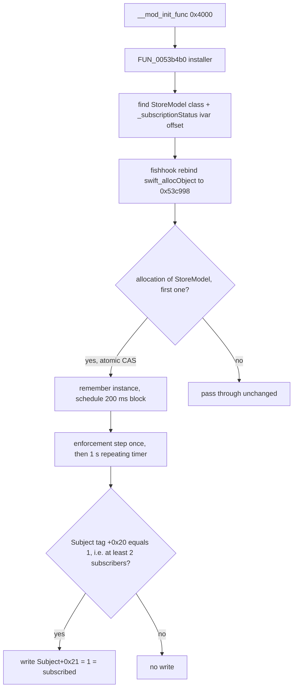

# Patches, provenance and resources (tasks G13, G14, G16)

Scope: what the two added dylibs do (G13), how far the earlier research's labels and addresses can be trusted (G14), and whether any bundled resource or remote configuration changes Bevel's numbers (G16). Source: `evidence/H.md`, verified by `evidence/check-GHR.md` (G13: 20 of 20 claims OK; G14: 11 of 11; G16: 8 of 8). Nothing was executed on a device; the obfuscated dylib code was single-stepped in a small ARM64 interpreter on a Mac with all external calls intercepted (no network, no dlopen, no foreign code run natively).

Headline for implementers: neither dylib touches a metric, score, baseline, cache or DTO. The only functional hook is a one-byte rewrite of the in-memory subscription status. The scoring arithmetic documented in the other docs is Bevel's own.

## Contents

- [G13: the two injected dylibs](#g13-the-two-injected-dylibs)
- [G14: provenance of annotations and labels](#g14-provenance-of-annotations-and-labels)
- [G16: resources, opaque blobs and remote configuration](#g16-resources-opaque-blobs-and-remote-configuration)
- [Corrections to earlier research](#corrections-to-earlier-research)

## G13: the two injected dylibs

Status: RESOLVED. The hypothesis "the patch unlocks Bevel's own paywalled premium features" is proven for the Pro tier, client side only.

### Identity and linkage

| Item | Value | Evidence |
|---|---|---|
| `BevelAIHealthCoachPatch.dylib` | sha256 `e5f14354d2b146f6110e19a66da82d39ae283bcb8b39ec5d7cec969e5379d3d1`, 8,932,064 bytes, WEAK `LC_LOAD_DYLIB` of the main binary only | `otool -L Superset` (`@rpath/BevelAIHealthCoachPatch.dylib ... weak`); extensions do not link it |
| `blatantsPatch.dylib` | sha256 `4fb1f1d688a795bd3fb63aec01cf238ed48834fb95733cdaa280ee0618401f5a`, 70,848 bytes, strong link of the main binary, `SupersetWidgetExtension.appex` and `SupersetCaptureExtension.appex` | `otool -L` of the three executables |
| main binary signature | CodeDirectory only, no CMS blob, `TeamIdentifier=not set`, `cryptid 0` | `codesign -dvvv Superset`. Page hashes cover the patched file, so they cannot be a pristine reference |
| bundle | `CFBundleShortVersionString 3.1.7`, build 2728, `cyan.entitlements` in the bundle root (the IPA was re-packed by a sideload/injection tool) | `Info.plist`, `cyan.entitlements` |

### BevelAIHealthCoachPatch.dylib

The 8.9 MB `__text` is about 97 % decoy: 47 exported C++ symbols (`SubscriptionVerifier_Validate`, `EntitlementGuard_Verify`, `PurchaseHistory_Sync`, `GrantMatrix_Recompute`, `RemoteConfig_Fetch`, `FeatureFlag_Resolve`, `DRMChannel_Provision`, `PirateSignal_Scan`, ...) and 22 named ObjC classes (18 decoys: `LicenseBroker`, `EntitlementResolver`, `TokenBroker`, `DRMPolicyEngine`, `PolicyEngine`, `SessionBroker`, `InvoiceReconciliation`, `WatermarkTracker`, `HardwareAttestation`, `FeatureFlagStore`, `ABTestAllocator`, `CrashDispatcher`, `TelemetryClient`, `AuditTrail`, `RateLimiterBucket`, `UsageTracker`, `OCSPChecker`, `SignatureVerifier`; plus `VIPWindowGuard`, `PopupValidator`, `_DABootstrap`, `_FDBootstrap`) and 9 obfuscated-name UI classes (the popup), plus the BBAES library. All 624 decompiled functions were run under the interpreter with every external call logged:

- No decoy function writes to Bevel state. They hash and format junk with hard-coded fake secrets and hosts (for example `https://api.license-broker.net/v7/entitlement/verify`, `wss://realtime.enforcement-bus.io/subscribe`, `sk_live_51Hx...`) and drop the result.
- No function issues a network request. The dylib imports `NSURL` / `NSMutableURLRequest` but never `NSURLSession`, `NSURLConnection`, CFNetwork or sockets to a remote host. `RemoteConfig_Fetch` (0x3dd358) builds an `NSMutableURLRequest` and never sends it (zero `dataTask` / `NSURLSession` / `sendSynchronous` selectors in the call log). The only socket code (0x7493ac, 0x749874, 0x75cc50) connects to `127.0.0.1` (a Frida port probe) and scans dyld image and thread names. The one external effect is `UIApplication openURL:` of `https://bit.ly/410kOxh` (the nag popup).
- BBAES (`bb_TripleLayerAESDecryptedStringWithKey1:key2:key3:`, `decryptedDataFromString:IV:key:`) and `CCCryptorGCMOneshot*` have no reachable caller. The real strings are not BBAES-encrypted.

String hiding scheme: no key material. Each function begins with a once-only guard that fills its string pool with `dst[i] = a[i] OP b[i]` (OP in `^`, `+`, `-`, written as mixed-boolean-arithmetic), where `a` and `b` are two stored byte arrays; the result is a NUL-terminated C string used with `dlsym(RTLD_DEFAULT = -2, ...)`, `NSClassFromString`, `objc_getClass`, `sel_registerName` or wrapped in a `CFString` (208 `__cfstring` objects at 0x7ec998-0x7ee398 point into the same pool). Example `FUN_0053b4b0` (`BevelAIHealthCoachPatch.dylib.c:88585`) loop 1: `dst[i] = (a[i] & ~b[i]) - (~a[i] & b[i])` (= `a[i] - b[i]`; a = 0x849640, b = 0x849840, dst = 0x849660, 0x1a bytes) giving `class_getInstanceVariable`. The string-decrypt prologues of 206 functions were reproduced statically in Python and independently by interpreter execution; both agree. The security-relevant pool of `FUN_0053b4b0`: 0x849660 `"class_getInstanceVariable"`, 0x849689 `"ivar_getOffset"`, 0x849760 `"_subscriptionStatus"`, 0x8497a0 `"swift_allocObject"`, 0x8497e0 `"NSClassFromString"`, 0x8496f0 `"/System/Library/Frameworks/Foundation.framework/Versions/C/Foundation"`, CFString 0x7ede78 pointing to 0x849820 `"_TtC8Superset10StoreModel"`.

### Initializers and entry points

| Entry | Address | What it does |
|---|---|---|
| `__mod_init_func[0]` | 0x4000 (`FUN_00004000`, `.c:1`) | (a) `ptrace(PT_DENY_ATTACH = 31)` via raw `svc #0x80` (`x16 = 26`, repeated; `x16 = 0` indirect form), sysctl `P_TRACED` check; (b) `bl 0x53b4b0` at 0x4684 = the hook installer (below); (c) schedules timed blocks on the main queue |
| `__mod_init_func[1]` | 0x422ed8 | `ptrace` deny-attach again, copies 7 selector-name pointers from `__objc_selrefs` (0x7f3420-0x7f3458) into a global table 0x870cb0-0x870ce8. No calls |
| `+[mW0yRdLVf0ngMwMF1qgChlmo load]` | 0x2424e0 (`.c:7928`) | `dlsym(RTLD_DEFAULT, "dispatch_once")` then `dispatch_once(0x8703c0, block 0x7ec148 to 0x22b7f0)` = tamper check of the popup classes |
| `+[_DABootstrap load]` | 0x39e5cc | `dispatch_once(0x870940, block 0x7ec238 to 0x39d7b4)`: `[VIPWindowGuard sharedInstance]`, `[PopupValidator canonicalEndpoint]` (decoys, results dropped) |
| `+[_FDBootstrap load]` | 0x420adc | one class message to each decoy class (`[LicenseBroker brokerForBundle:]`, `[EntitlementResolver resolveForUser:]`, `[TokenBroker mintSessionTokenForBundle:expiry:]`, `[PolicyEngine defaultEngine]`, `[SessionBroker brokerForDeviceID:]`, `[InvoiceReconciliation reconciliationForInvoice:]`, `[DRMPolicyEngine engineForChannel:]`, `[WatermarkTracker trackerForSession:]`, `[HardwareAttestation attestForDevice:]`, `[FeatureFlagStore defaultStore]`, `[CrashDispatcher shared]`, `[ABTestAllocator activeExperiments]`); results unused |

### The one real hook: `swift_allocObject` fishhook to `StoreModel._subscriptionStatus`



`FUN_0053b4b0` (`.c:88585`; call at 0x4684), after the pool decryption (cached by flags 0x871284 / 0x871278):

```
dlopen(Foundation, RTLD_NOW|RTLD_GLOBAL)               // 9
NSClassFromString         = dlsym(RTLD_DEFAULT,"NSClassFromString")        -> g[0x871210]
class_getInstanceVariable = dlsym(...)                                      -> g[0x871218]
ivar_getOffset            = dlsym(...)                                      -> g[0x871220]
cls = NSClassFromString(@"_TtC8Superset10StoreModel"); if (!cls) return
iv  = class_getInstanceVariable(cls, "_subscriptionStatus"); if (!iv) return
g[0x849620] = ivar_getOffset(iv)                       // offset of the Published<SubscriptionStatus> storage
g[0x8711a0] = cls
g[0x8711a8] = dlsym(RTLD_DEFAULT,"swift_allocObject")  // original
FUN_007d6490(&rebinding{name=0x8497a0 "swift_allocObject", replacement=0x53c998, replaced=0x8711a8}, 1)   // facebook fishhook rebind_symbols
```

The rebinding struct is the 3-word record at 0x7ec6a0 (`{0x8497a0, 0x53c998, 0x8711a8}`). `FUN_007d6490` (`.c:127270`) is the stock fishhook (`_dyld_register_func_for_add_image`, `_dyld_get_image_header`, `_dyld_get_image_vmaddr_slide`, `vm_protect` for `__DATA_CONST`, walks `__la_symbol_ptr` / `__got` through the indirect symbol table).

Replacement 0x53c998 (`FUN_0053c998`, `.c:88844`), verified by calling it in the interpreter with several metadata pointers:

```
void* hook(void* metadata, size_t size, size_t alignMask) {
    obj = orig_swift_allocObject(metadata, size, alignMask);
    if (metadata == g[0x8711a0] /*StoreModel class*/ && atomic_cas(g[0x8711b0]: 0 -> 1)) {   // ldaxr/stlxr at 0x53d654/0x53d668
        g[0x8711b8] = obj;                                                                // first StoreModel instance only
        dispatch_after(dispatch_time(0, 200ms), dispatch_get_global_queue(QOS_USER_INITIATED=0x19,0), block 0x7ec6b8 -> 0x53dcec);
    }
    return obj;      // every other allocation: pass-through, no side effects
}
```

The 200 ms block 0x53dcec runs the enforcement step once, then (flag 0x87128c) arms a repeating `dispatch_source` timer on queue `"superset.clamp"` (QOS 0x11): `dispatch_source_set_timer(src, start = now + 100 ms, interval = 1,000,000,000 ns, leeway = 200,000,000 ns)`, handler = block 0x7ec6d8 to 0x540390. Enforcement step (identical code in 0x53dcec and 0x540390, probed exhaustively over input bytes):

```
if (g[0x8711b0] == 0 || g[0x87120c] != 0) return          // 0x87120c is never written anywhere in the dylib, so always 0
obj = g[0x8711b8]; off = g[0x849620];
w   = *(uint64*)(obj + off);                              // Published<SubscriptionStatus> storage word
p   = w & 0x0000FFFFFFFFFFFF;                             // 0x5409f0
if (p < 0x100000001) return;                              // .value(inline status) or nil: untouched (cmp x10,#0x100000001 @0x5409f8)
if (*(uint8*)(p + 0x20) == 1)                             // compare with const byte at 0x849630 (== 1)
    *(uint8*)(p + 0x21) = 1;                              // SubscriptionStatus.subscribed
```

Probing all 256 values of `p[0x20]` (both `p[0x21]` initial values 0 and 7) writes exactly `p[0x21] = 1` iff `p[0x20] == 1`, otherwise nothing; a non-pointer word writes nothing.

What `p` is (proved by running the same Swift code on a Mac): `Published<T>` is an enum `{value(T), publisher(Publisher)}`. Once any subscriber touched `$subscriptionStatus`, the storage word holds a pointer to Combine's `Published.Publisher.Subject`. In that object `+0x20` is the `ConduitList` tag (observed 0 = single subscriber, 1 = many (>= 2), 2 = none/empty) and `+0x21` is `currentValue` (the stored 1-byte enum). So the patch means: while the status publisher has 2 or more subscribers, rewrite its `currentValue` to `.subscribed` once per second, silently (no `send`, so no notification). Every later read and every new subscription sees `.subscribed`. Already-attached subscribers still receive real transitions until the next tick overwrites the cache. The tag test is an empirical heuristic by the patch author (macOS Combine layout; iOS 18 has the same source), so the clamp is inactive with fewer than two subscribers.

Main-binary side:

- `Superset.StoreModel` class descriptor 0x105248204 (field descriptor 0x105b78f10, 13 fields). `_subscriptionStatus: Published<SubscriptionStatus>` is field index 2. `SubscriptionStatus` (0x1052481cc, 1-byte no-payload enum): `freeTrial = 0, subscribed = 1, subscriptionExpired = 2, notConfigured = 3, unknown = 4`.
- `StoreModel` is a singleton: `FUN_101e9b7e8` (`101e9.c:6300`) = `swift_once(&DAT_1064e0df8, ...)` (`10048.c:6599`) to `_swift_allocObject()` (through the stub the fishhook rebinds) to `FUN_101e9b9d8` init, which seeds `_loading = true` and `_subscriptionStatus = .notConfigured (3)` (`101e9.c:9881-9889`). The allocation the hook waits for is exactly `StoreModel.shared`.
- Getter `subscriptionStatus.getter` = vtable slot 6 (`FUN_101e9b838`, `101e9.c:6815`). `$subscriptionStatus` publisher: `FUN_101e9cc50` (`101e9.c:8115`, vtable slot 56; 4 call sites 0x1008bcc94, 0x1019611b0, 0x1008d5b2c, 0x1024441f4) mapped to the `isPro`-like Bool stream via `FUN_101eb1af4` to `FUN_101e9ce24`.
- Pro Bool: `isPro = ((status & 0xfe) == 0)` via `FUN_101e93180`, i.e. `.freeTrial (0)` and `.subscribed (1)` count as Pro; `.subscriptionExpired (2)`, `.notConfigured (3)`, `.unknown (4)` do not. The closure first consults Bevel's own `FeatureFlagService` (`FUN_102e42ec8`, `FUN_101b99830(1)` = flag index 1 `forceEnableStore`): an internal or TestFlight build with that flag off short-circuits `isPro = true`. That bool feeds `NotificationSchedulerRepository.handleSubscriptionStatusChange(isProSubscribed:)` (0x101961408) and the `isProSubscriber` view inputs. The patch's value 1 is exactly the "paying" state, not a new state.
- Consumers (types holding `StoreModel`): `BioAgeRestrictionService` (state `BioAgeRestrictionState.unpaid`), `CoachingEnabledService`, `CoachingUsageStatusService` (`CoachingUsageState.usage|ultra`), `ExtraCreditsStoreService`, `HealthRecordsPaywallCoordinator`, `EmbeddedCoachingV2FooterModifier`, `CycleDashboardCoachingCard`, `CycleTrackingDetailContents`, `TrendsAnalysisView/SegmentedView`, `JournalViewWrapper`, `DashboardHomeDatePager`, `SleepNeededSheetCard`, `UpgradeProCTAView`, `SubscriptionStatusCard`, `SettingsSubscriptionView`, `CameraCaptureService`, `ShareableDataService`, `LogFoodInChatPreferenceService`, `PhoneWCApplicationContextService`, `NotificationSchedulerRepository`, `SettingsVisibilityPickerViewModel`, `DashboardUniversalSheetController`, and Bool inputs `isProSubscriber` / `isSubscribed` on several dashboard and coaching views.

Features unlocked (all Bevel's own code): the Pro tier, `ProPaywallFeature` (0x105248820): contextualIntelligence, biologicalAge, healthRecords, optimizeRecovery, personalizedTrainingPlans, easyNutritionTracking, improveSleepQuality, identifyStressTriggers, track390PlusBiomarkers, understandYourCycle, trackHabitsAndSymptoms, advancedFitnessMetrics, bevelIntelligence. Paywalled actions are `FeatureSheetType` (0x105248e68): trackNutrition, createCustomFoods, buildRecipes, createWorkoutTemplates, logActivities, viewHistoricalData, viewActivityData, intelligence, addHealthDocuments, startBioOnboarding, raised from `PaywallLocation` (0x105205318): home, onboarding, nutrition, fitness, strain, sleep, recovery, journal, biology, stress, energy, settings, cycleTracking.

What it does NOT change: product/tier state (`StoreModel._currentSubscription`, `SubscriptionType` proMonthly/proAnnual/proAnnualReferred/ultraMonthly), the server-side entitlement (`ServerSubscriptionStatusV2 {unsubscribed, pro, ultra}`, `SyncAppTransactionRequest{expectedStatus, latestTransactionJWS}`), and therefore any server-metered feature (coach chat quotas, `CoachingUsageState`). Whether the coach backend accepts a request from an account that is not Pro server-side is a server question and not decidable from the IPA (NOT IN IPA).

Does it alter any metric or score computation? No. No code path of the dylib touches a calculator, a HealthKit/Google input, a baseline, a cache or a DTO: (1) the only runtime mutation primitive is the fishhook (`vm_protect` is dlsym'd exactly once, in `FUN_007d9ddc`, called from `FUN_007d3008` = fishhook's `rebind_symbols_for_image`, whose only caller is `FUN_007d6490` from `FUN_0053b4b0`; `method_setImplementation`, `method_exchangeImplementations`, `class_replaceMethod`, `class_addMethod`, `mprotect`, `vm_write` are never named in any decrypted string or dlsym call across all 624 functions); (2) the replacement passes every allocation except the first `StoreModel` through unchanged; (3) the single write into Bevel memory is one byte (`Subject+0x21`) of StoreModel's `Published<SubscriptionStatus>` cache. Indirect effect: Pro-only pipelines (for example Biological Age, gated by `BioAgeRestrictionState.unpaid`) run for the patched install, so which scores exist differs from a free install; their arithmetic is Bevel's.

Pristine-comparison status: there is no App Store 3.1.7 to diff (`LC_CODE_SIGNATURE` re-hashed, ad-hoc style). The widget extension is a second, separately linked compile of the same calculators and carries only the `blatantsPatch` load command. Comparing function bodies (G14 table): the call trees of all 18 score families (564 functions of 8 or more words, depth <= 6 from 81 anchor bodies) are identical to the widget copies modulo relocations and log-string literals for 521 functions with 0 arithmetic differences and 43 functions absent from the widget. So the calculators the hooks could conceivably influence are provably not byte-patched in the main binary. Code outside those trees (the 43 absent ones, StoreModel and paywall code, UI) is not covered by this witness.

### Anti-tamper layer (no effect on features)

- Deny-attach and debugger checks: raw `svc #0x80` ptrace (x16 = 26, and via syscall 0) at about 2,562 `svc` sites; `getpid` / `sysctl(KERN_PROC_PID)` `P_TRACED` check (`FUN_0021e918`); exit path `svc x16 = 1, x0 = 0x58`.
- Frida and jailbreak probes: loopback connect to 127.0.0.1, dyld image-name and thread-name scans (`pthread_getname_np`, `task_threads`), paths `/Library/MobileSubstrate/MobileSubstrate.dylib`, `/Applications/Cydia.app`, `/Applications/Sileo.app`, `/usr/sbin/frida-server`, `/usr/sbin/sshd`, `/private/var/lib/apt/`, `/etc/apt/sources.list.d/`; integrity of its own `__TEXT,__text` via `getsectiondata` and SHA-256 / HMAC (`expected_text_hash`, `expected_text_hmac`, `skip_hash_check`), `class_copyMethodList` / `class_getMethodImplementation` + `dladdr` checks that the popup classes' IMPs still live in this image.
- Block 0x7ec148 to 0x22b7f0 (dispatch_once from `+load` and several callers) verifies the popup controllers' `viewDidLoad`, `ibTHpBYiZcmU77oICNO47V7j`, `G9KlgL6HHX45Da9bp6ocSAsh`, `makeKeyAndVisible` IMPs with `dladdr`.
- Block 0x7ec168 to 0x28c3e0 (15 s + `arc4random_uniform(45000)` ms after start) contains `kill(getpid(), 9)`, `abort()`, `_exit(0x2a)` reached when its `dladdr(0x21fd90)` integrity test fails (the stubbed `dladdr` returns 0, so the interpreter reaches them; a real device run was not performed).

### The VIP nag popup (the only feature the patch itself adds)

Scheduled by `FUN_00004000`: main-queue blocks 0x7ec068 to 0x4b10 at 1 s (anti-debug checks, then a 100 ms follow-up; block 0x7ec088 to 0x4b94 picks the foreground-active `UIWindowScene`), 0x7ec0a8 to 0x4f0c at 5 s + U(0..3000) ms, 0x7ec0c8 to 0x5360 at 10 s + U(0..4000) ms (both read two `NSUserDefaults` keys, a cadence gate. R2 reproduced the key with H's interpreter and a hooked `objc_msgSend`: `seed = "<bundleIdentifier>-<identifierForVendor.UUIDString>"` (`stringWithFormat:` "%@-%@", CFString 0x7ecbf8); each UTF-16 unit is shifted by +11 with no wrap (`appendFormat:` "%C", CFString 0x7ecc18); `key = "__popup_display_v2_" + shifted.prefix(20)` (decrypted C string 0x86f068, `substringToIndex: 20`); second key `"__sys_ui_shown"` (C string 0x86eed0). Whether the popup shows depends on the values stored under those keys at run time), and 0x7ec168 at 15 s + U(0..45000) ms (tamper kill above). UI: a window above the app, classes `i8bCgi2KJxMjDjObaE8Xc4qH` (popup controller; one-shot `NSTimer` 15.0 s auto-close), `MedtnBE6MGGZ9Xr8eOocgcer` (card view), `OTFSKrNarmIss7UII9LIrsLn` (controller with a repeating 1.0 s countdown), watchdog `iwqzbnMnHMsrAMIG6yp7mTKY`. Text: "EXCLUSIVE MEMBERSHIP", "Elevate Your Experience", "Become a VIP Member", "Maybe Later", "What's Included". The CTA and the countdown end in `UIApplication openURL:` of `https://bit.ly/410kOxh` (the patcher's own advertisement; a URL open, not a request body). No device or health data is read except `bundleIdentifier` and `identifierForVendor` for the cadence key (format above).

### blatantsPatch.dylib (70 KB, clear code, fully read)

Two `__init_offsets` entries: 0x4000 and 0x444c.

- 0x4000: generic-password keychain item `{kSecClass: GenericPassword, kSecAttrAccount: "blatantsPatch", kSecAttrService: "", kSecReturnAttributes: true}`: `SecItemCopyMatching`, on `errSecItemNotFound (-25300)` `SecItemAdd`; reads `kSecAttrAccessGroup` into globals `__accessGroupId` and `__bundleId`; then `rebindSecFuncs` = fishhook (`FUN_00004f18` / `FUN_00004d34` / `FUN_00004fd4`, `vm_protect`) of `SecItemAdd`, `SecItemCopyMatching`, `SecItemUpdate`, `SecItemDelete` to wrappers (`FUN_00004a60/4ad8/4b50/4bc8`) that `mutableCopy` the query dictionary and force `kSecAttrAccessGroup = __accessGroupId`. Effect: Bevel's keychain access works under a foreign signing identity (the original group `P5S89K5583.com.supersethealth.superset` is replaced by the sideload group).
- 0x444c swizzles with `method_setImplementation` / `class_addMethod` (`FUN_00004570`): `-[CKEntitlements initWithEntitlementsDict:]` (removes `com.apple.developer.icloud-container-environment` and `com.apple.developer.icloud-services`), `-[CKContainer _setupWithContainerID:options:]` and `-[CKContainer _initWithContainerIdentifier:]` (return 0, CloudKit disabled), `-[NSFileManager containerURLForSecurityApplicationGroupIdentifier:]` (real group container via `LSBundleProxy`, else `<Documents>/<groupId>`), `-[NSUserDefaults _initWithSuiteName:container:]` (suite names with prefix `group` get the redirected container). Effect: sideload compatibility only (keychain, app groups, CloudKit off). The CloudKit-backed Core Data container `iCloud.com.supersethealth.coredata` therefore does not sync on this build. No Bevel score or metric class is touched; no network.

Evidence index (G13): `BevelAIHealthCoachPatch.dylib.c`: 1 (`FUN_00004000`), 82/268/323 (4b10/4f0c/5360), 7922 (0x22b7f0), 7928 (`mW0y load`), 9057 (0x27f35c, FAILED decompile), 42766 (`_DABootstrap load`), 66145 (`_FDBootstrap load`), 88136 (0x53330c), 88585 (0x53b4b0), 88844 (0x53c998), 89028 (0x53dcec, FAILED decompile; asm `patch-failed.asm:820975`), 127270 (fishhook). Main: `101e9.c:6300, 6815, 8115, 9790-9900`, `10048.c:6599`.

## G14: provenance of annotations and labels

Status: RESOLVED. All audits were made against raw bytes and metadata, never against the earlier scratch annotations.

| Claim family in earlier research | Check | Result |
|---|---|---|
| "Direct-BL index: 98,904 target keys, 2,142,419 call sites" | re-scanned the 79 MB `__text` for `BL` (opcode `100101`) | reproduced exactly: 2,142,419 BL sites, 98,904 distinct targets (88,164 of them are `LC_FUNCTION_STARTS` entries) |
| what the BL index leaves out | counted | BLR sites 407,620; BR sites 21,889; `B` tail branches landing on a function start 88,681; `LC_FUNCTION_STARTS` lists 355,662 functions. Roughly one call in six is indirect and about 4 % of branch targets are tail calls: caller lists in decompile headers (`callers:`) are incomplete by construction; vtable, witness and async calls need the metadata route |
| rewritten export-trie root; 108,353 export names; 3,982 non-Swift labels with a `$s` prefix | parsed the trie: from root offset 0 only 61 entries are visible; from the surviving original root at trie offset 3,157,882 there are 108,419 distinct names in 108,424 terminals. R2 explained the gap. The injected 61-entry trie overwrote trie bytes [0, 2,307). Edges that land there read garbage nodes, producing 71 terminals (66 distinct names, junk flags 48/50/111/116, one name ending in `\x04`) and 88 out-of-range children. The walk over clean nodes only yields exactly 108,353, the audited number (flags: 108,293 regular + 60 weak) | the 3,982 figure is exact (3,905 + 77). Exported Swift symbols exist only for public APIs of linked packages (for example `BevelBioAge...calculateBioAgeEstimate` at 0x103c41698); none of the internal `Superset` calculators (Recovery, Strain, Sleep, Stress, Energy Bank, Cardio Load, Food Quality, Glucose, Cycle) has a symbol. Their names in the research come from log and `#function` strings |
| function names attached to addresses | built a string-to-function map from all ADRP+ADD pairs (3,155 name/path strings, 3,129 resolved) | every name-bearing address in the earlier doc that carries a function-name string (21 distinct functions) was independently confirmed: Recovery 0x1015b0ba4 (11,444 B, `calculateRecoveryMetricsForDay`), Strain 0x1015dc638 (`calculateDayStrainScore`), sleep metrics 0x1015c3938 (`getSleepMetrics`), 0x1015c09d0 (`calculateSleepMetricsForDay` / `calculateSleepHistory`), Food Glucose 0x100101c00 (`calculateGlucoseScore`), Nutrition 0x10008f1a4 (`calculateMetrics`), HRR 0x1017cd18c (`findMaxHRRecoveryInWindow`), RHR baseline 0x1014ecff0 (`calculateBaselineRestingHR`), 0x10158af94 (`calcMissingAggregatesAndComputeBaselines`), HRV history 0x10166a59c / ab98 / b678 (`getHRVHistory`), 0x1016a1f98 (`fetchAggregatedFallback`), 0x1016a1318 (`parallelCalculateHKCollectionHistories`), workout scoring 0x100f5a644 (`calculateScoresForWorkout`), seed helper 0x1015eecc0 (`constructInitialStrainWindow`), 0x1013a2050 / 2518 (`mapToHealthSamples` / `mapToDailyHealthSamples`). Caveat: the BioAge calculators (0x103c49af8-0x103c4bda4, 0x103c47054-0x103c47644) carry only the shared helper-name string `clampHR`, so their per-metric labels rest on the enum order of the registry descriptors (0x10529f8e8, 0x10529f894); the arithmetic itself was re-derived |
| entry-point versus interior addresses | classified all 546 distinct `0x1xxxxxxxx` addresses in the earlier doc against `functions.tsv` and Swift metadata | 294 function entries, 58 interior points, 181 in data/metadata, 5 data, 1 unmapped. Interior points (for example 0x1015b1400 = Recovery +2140, 0x100082400 / 520 / 824 / d94 inside 0x100081efc, 0x1015dc6b8 inside Strain) are instruction ranges inside one large Ghidra function; document them as "range starting at X in function Y" |
| async continuation claims | read the bytes | six confirmed with exact immediates: 0x101d78fbc to continuation 0x101d79054; 0x101543618 stores the point array at async frame +0x9f0 and builds 0x101543698; 0x1015432a0 `mov w1,#0x1e` (argument 30); 0x10158d318 `bl 0x104e5161c` after `neg x1,x8`; HRR 0x1017cd56c-0x1017cd57c loads 0x405e000000000000 (120.0) and calls 0x1017cdb20; 0x1015eefe4 `mov w0,#0xe` then `bl 0x1030cbe4c` |
| annotation register tracking might mislead (constants) | re-derived a sample from bytes: 0.8 coverage threshold (double at 0x104ebe868, passed in `d8` to mean helper 0x101990000 at 0x1019905f0-0x101990634) | confirmed with a correction: the helper `0x101990000(threshold, [Double])` keeps finite non-zero values, returns `(0, nil)` when `kept/supplied < threshold` or `kept == 0`, else `(mean(kept), ok)`. The 0.8 is a caller-supplied threshold, not inside the helper; zeros count as missing together with NaN/Inf |
| widget extension as an independent second copy | structural comparison of function bodies (canonical form masks only relocatable operands: ADRP/ADR/LDR-literal, ADD/LDR/STR page offsets after ADRP, branch targets, Swift string-length immediates); roots = the 81 function bodies containing the 18 families' anchors; call trees to depth 6 over direct BL (564 functions of 8+ words) | widget: 513 byte-identical modulo relocations (+8 after FP alignment), 0 differing, 43 absent. Capture: 205 identical, 1 aligned, 2 non-identical, 356 absent. Recovery 0x1015b0ba4 (2,861 words) equals widget 0x10027b528; Strain 0x1015dc638 equals widget 0x1002a4018 |

Corrections: the 0.8 threshold is passed by the caller (0x1019901c4 at 0x1019905f0, constant 0x104ebe868) and zeros are treated as missing together with NaN/Inf; several ranges cited as "calculator at X" are interior addresses; the export-count difference (108,419 versus 108,353) is the 66 garbage names reached through the overwritten trie prefix (R2), while 3,982 is exact.

Residue closed (R2). R2 classified all 546 addresses the earlier doc cites by owning function and content:

| Class | Count |
|---|---|
| Cited directly in these docs | 157 |
| Owner function cited | 38 |
| Cited in evidence only | 12 |
| Data, metadata or gap regions | 142 |
| Metadata accessors or once-thunks | 38 |
| Constant-returning thunks | 146 |
| Real logic functions | 21 |

Every logic function is covered in a family doc under a caller or sibling address:

| Function | Content | Covered in |
|---|---|---|
| 0x1015e486c | stress CDF interpolation | recovery-stress-energy.md Step 5 |
| 0x103c4522c | PhenoAge coefficients | biological-age-muscular.md, table 0x106219e10 |
| 0x100103170 / 0x100103334 | Food Quality disabled contributors | nutrition-tdee.md |
| 0x103c46abc / 0x103c46c20 / 0x103c46d88 | RHR, VO2 and body-fat reference lookups | biological-age-muscular.md "Reference tables" |
| 0x103c472ec, 0x103c448b0, 0x103c45adc, 0x103c44864, 0x103c435f0, 0x103c4649c | nutrition hazard, nutrition / physio / alcohol / blood confidence, deltaYears | biological-age-muscular.md |
| 0x1017ce068 | HRR selection | strain-load.md |
| 0x101d744dc / 0x101d78d04 | automatic sleep goal sort and recovery >= 67 count | sleep.md |
| 0x101dc3358 | Float array cast | (generic) |
| 0x1017e88b4 | Array append | (generic) |
| 0x104b17850 | Air guide UI | (UI) |
| 0x101541440 | empty debug arrays | (debug) |

No uncovered metric logic remains ([evidence/R2.md](evidence/R2.md)).

## G16: resources, opaque blobs and remote configuration

Status: RESOLVED (NOT IN IPA (proven) for any on-device model). Method: full bundle walk (1,156 files), `assetutil --info` on all 21 `Assets.car`, entropy scan of every data section of the 113 MB executable (4 KB windows), reflection of all 14,057 Swift types, string/ADRP cross reference, and a read of every decoded server DTO whose fields look numeric.

| Resource | What it is | Can it change a metric? |
|---|---|---|
| `Assets.car` x21 (main 259 MB, `BevelBioAge` 47 MB, `BevelCoaching` 14 MB, ...) | images, colors, vectors, gradients, icon stacks; zero data-set (`Data`) assets in any catalog | No numeric content; color assets only skin the UI (zone colors are code constants) |
| `*.riv` (5), `*.mp4`, `onboard-wave-bg.gif`, fonts, `mathFonts.bundle/*.plist` | animation, video, typography | No |
| `PhoneNumberMetadata.json`, `StoreKitTestCertificate.cer` (Xcode StoreKit test root), `GoogleService-Info.plist` (`IS_ANALYTICS_ENABLED=false`, no RemoteConfig framework), `Metadata.appintents/extract.actionsdata`, `cyan.entitlements`, `README.md`, `StrengthWorkoutKeyboard_README.md` | phone-number rules, StoreKit-test trust anchor, Firebase client config, App Intents manifest, entitlements, two developer READMEs (data-loading architecture: 60-day pagination windows, 5-minute backend-sync threshold, 24 h HealthKit authorization preflight; keyboard value limits) | No coefficient; the READMEs document orchestration only |
| `*.lproj/Localizable.strings(dict)`, `BevelIntelligence_Prompts.strings`, `StrengthWorkoutInstructions.strings`, `BiomarkerInfoSections.strings` | UI copy in 14 languages; ~100 suggested chat prompts | No. Explanatory copy documents thresholds (for example cycle copy) and was used as a hypothesis source only; the code values are in other-calculators.md and differ at the edges |
| `Superset.momd` (68 Core Data model versions, latest `v67_20260723_AddStrengthWorkoutSessionSubsport`, about 58 entities) | schema only. Cache entities persisting computed numbers: `HealthMetricsCacheEntity`, `CumulativeMetricsCacheEntity`, `HealthAggregatedCacheEntity`, `WorkoutOverlayCacheEntity` (`trimp`, `strainScore`, `cardioFocus`, `cardioStrainUnits`, `muscularStrainUnits`, `strainZones`, `heartRateRecovery`, `resolvedWorkoutEffort`, `distanceMetrics`, `hrDetails`, `maxHR`), `ActivityHistoryCacheEntity`, `EnergyDataPointEntity`, `CycleTrackingTemperatureBaselineEntity` | Indirectly yes: previously cached values survive an app update until the algorithm version stamp changes. Stamps: `algorithmVersion` (HealthMetricsCache / CumulativeHealthMetricRecord / AggregatedDataState), `analysisVersion`, `dataVersion`, `MetricsCacheReadError{invalidSchema, mismatchedAlgorithm, cachedMissing}` (0x1052314d4). A fresh install has no stale cache |
| Mach-O data sections | entropy scan of `__TEXT,__const` (3.4 MB), `__constg_swiftt`, `__cstring` (1.7 MB), `__DATA,__data` (2.4 MB), `__DATA_CONST,__const` (2.9 MB), `__text` (79 MB): exactly one 4 KB window above 7.2 bits/byte, 0x1051e9dc0-0x1051eadc0, among vendor lookup tables referenced from library code in shard 104bf | No Bevel model or encrypted coefficient table. No Core ML (CoreML, Vision, NaturalLanguage, FoundationModels, SoundAnalysis are not linked; no `MLModel` / `.mlmodelc` string) |
| Frameworks | RiveRuntime, Sentry, Singular, Firebase Analytics/AppMeasurement stubs, static Mixpanel/Firebase/GRDB code | Marketing and telemetry only; Singular fetches `https://app-analytics-services.com/config/app/%@` (SDK config) |

Remote configuration and model consumers (what can change numbers without an app update):

1. Local feature flags `Superset.FeatureFlag` (0x10523e250, 8 cases): `testFlight, forceEnableStore, disableStoreStatusSyncing, disableBetaMode, coachingLatexSupport, coachingWorkoutKitGenerations, fitnessChartsV3, activityDetailsV2`, typed by `FeatureFlagType` (`userDefaults / internalOnly / testFlight / released`) read through `FeatureFlagService(isInternalUser, isTestFlightBuild)` (0x10523e288). These are UserDefaults or build-channel switches, not remote. None enters a calculator signature (calculators take no flag parameter; checked across the 18 families' call trees).
2. Server coach flags `CoachingFeatureFlags {booleanFlags: [nutritionScoreV2, latexSupport, workoutKitGenerations, experimentalModel, experimentalFeatures], versionFlags: [{key: nutritionScore | cycleTracking | integrations | streamParts, semanticVersion}]}` (0x1052c48ec, protobuf `Coaching_CoachingFeatureFlags` 0x1052cbac8), carried as the `feature_flags` field of 6 protobuf messages and cached under UserDefaults `cached_feature_flags_config`. They select coach-side payload/format versions (what the coach backend assumes), not the on-device scores. The on-device Nutrition Score calculator (0x10008f1a4) takes no such flag.
3. Server inputs that feed calculators: (a) food category apportionment `api/nutrition/v1/score-categories/apportion` to `FoodScoreApportionResponse{categories:[{category: String, percentage: Double, basis: calories|weight|binary}]}` and `FoodDataResponse/SearchFoodDataResponse.scoreCategories`, `CustomFoodResponse.caloricPercentages`: the FoodCategory split used by Food Quality is SERVER data (consumed at 0x10520cefc / 0x10520d2d0), so the category input is not recoverable from the IPA while the contributor arithmetic is; (b) `api/nutrition/v1/macronutrient-goals/pull`, `api/user-data/v1/{activity-status, biology-profile, smoking-logs}/pull`, `api/journal/v1/user-journal-data/pull`, `api/fitness/v1/user-fitness-data/pull`: user-entered data sync; (c) Google/Oura/Garmin integration DTOs (raw samples; Oura `score/readiness` and Garmin `overallSleepScore` are vendor scores shown as such); (d) `api/coaching/v2/usage/status` quotas; (e) `api/training/activity-classifier/upload` uploads training data for a SERVER-side activity classifier (no local classifier, no ML framework); (f) `api/users/v1/subscription/sync`, `app-transaction/sync` (entitlement).
4. No Firebase Remote Config consumer (`FirebaseRemoteConfigInterop` types exist only for Crashlytics rollouts); no A/B framework besides Mixpanel's built-in `FeatureFlagManager` whose flag values are not held by any of the app's reflected types. `bevelBannerVariant` (SwiftUI environment key) is a color theme, not a remote variant.

Conclusion: no bundled table, model or opaque blob alters Bevel's score arithmetic. The metric-relevant external inputs are exactly: HealthKit and integration samples, user settings and profile, server-provided food category apportionments and goals, and persisted caches guarded by `algorithmVersion` stamps. NOT IN IPA (proven) for any on-device model; the server-side food-category model and activity classifier are boundary items.

## Corrections to earlier research

- "Hook effects uncharacterized; do not assume modifications only unlock subscriptions": now characterized. The only functional hook is the `StoreModel` clamp; the rest is anti-tamper, decoys and nag UI. Scores are untouched by the dylibs.
- The string-screen hits (`validateSubscriptionToken:`, `persistEntitlementSnapshot:`, `bridgeEntitlementToPolicyLayer`, `resolveEntitlementPayload:`, `EntitlementResolver`) are decoy names; none is hooked or calls into Bevel.
- "Mean helper 0x101990000 ... at least 0.8": the threshold is caller-supplied; the helper has no embedded threshold.
- Calculator addresses cited as "calculator at X" may be interior addresses; use the containing function plus offset.
