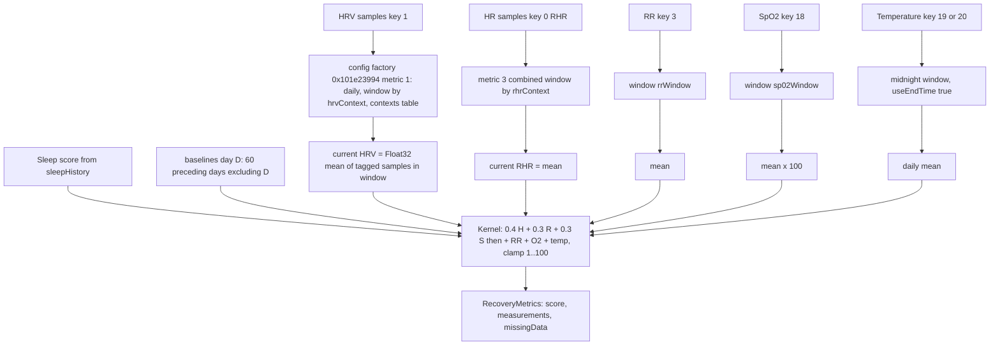
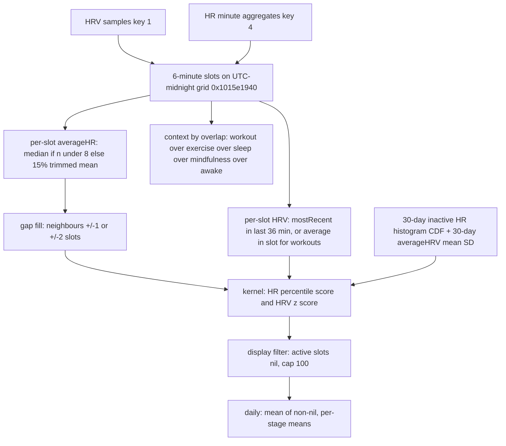
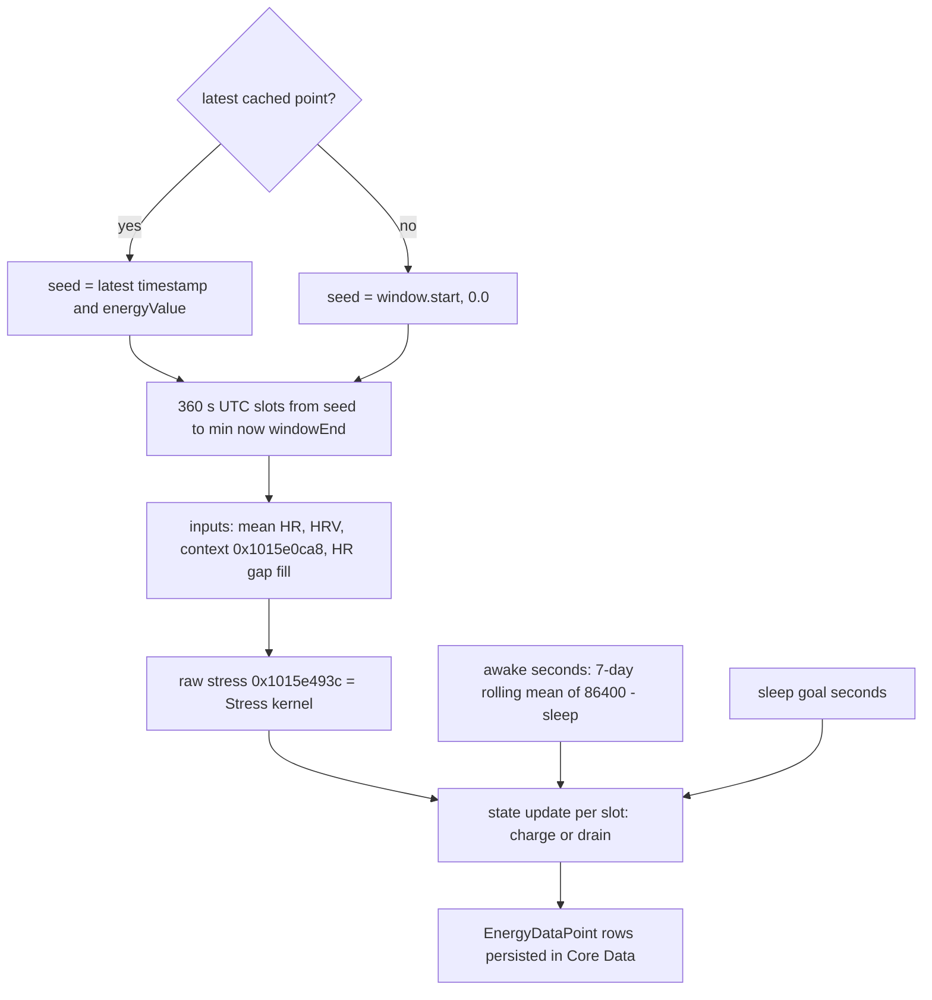

# Recovery, Stress and Energy Bank (Bevel 3.1.7)

Scope: M01 (Recovery), M04 (Stress), M05 (Energy Bank). Sources: `evidence/C.md`, corrected by `evidence/R.md` (R2a seed, R2b label rounding, R2c defaults, R2d temperature) and by the orchestrator's assembly checks.

Assembly verified by the orchestrator ("verified in assembly"):

- Recovery kernel at 0x1015b21c8-0x1015b220c: `0.4*HRV + 0.3*RHR + 0.3*Sleep`, then `+RR`, `+O2`, `+temp` in that order, lower clamp 1; ignored sleep = 100 (`0x42c80000`).
- Stress at 0x1015e41c4-0x1015e41e0: `0.6*HR score + 0.4*HRV score`.

Ghidra operator naming: `<__infix` is `<=` and `>__infix` is `>=` (stubs `0x104e57d6c` `>`, `0x104e57d78` `<`, `0x104e57d84` `>=`, `0x104e57d90` `<=`; `0x104e511f0` `Date.>`, `0x104e511fc` `Date.<`, `0x104e51250` `Date.==`). Every inclusive or exclusive bound below was checked this way.

Shared framework (windows, baselines, labelling, calibration gates) is in [shared-machinery.md](shared-machinery.md). Source values (Google fields, units) are in [ingestion.md](ingestion.md).

## Contents

- [Types and layouts](#types-and-layouts)
- [Recovery](#recovery)
- [Stress](#stress)
- [Energy Bank](#energy-bank)
- [Task closure](#task-closure)
- [Corrections to earlier research](#corrections-to-earlier-research)

## Types and layouts

| Type (descriptor) | Cases or fields |
|---|---|
| `CalculatedMetric` (0x105246bd4) | 0 averageHeartRateVariability, 1 restingHeartRateVariability, 2 respiratoryRate, 3 restingHeartRate, 4 inactiveHeartRate, 5 sleepingHeartRate, 6 wristTemperature, 7 bodyTemperature, 8 spO2, 9-11 foodGlucose AUC/Peak/Delta |
| `HealthQuantityType` (0x105277e88) | 0 restingHeartRate, 1 heartRateVariability, 3 respiratoryRate, 4 heartRateMinuteAggregates, 5 heartRateSamples, 18 spO2, 19 temperature, 20 bodyTemperature |
| CalculatedMetric to HealthQuantityType, byte table 0x104f935be (also 0x104ff340c) | `01 01 03 00 04 04 13 14 12 0f 0f 0f` |
| `CalculationsOptions` (0x105236898), 8 packed bytes | b0 hrvMethod (0 appleHealth, 1 bevelRMSSD), b1 rhrMethod (0 appleHealth, 1 bevel), b2 hrvContext, b3 rhrContext (MetricContext 0 entireSleep, 1 remDeepSleep, 2 mindfulnessOnly, 3 sleepAndMindfulness, 4 entireDay), b4 caloriesDisplay, b5 temperatureSource (0 wrist, 1 body), b6 sp02Window, b7 rrWindow (MetricWindow 0 entireSleep, 1 entireDay) |
| Default options | `0x0101` (0x101915fbc, 0x101916484): bevelRMSSD, bevel RHR, entireSleep both contexts, wrist temperature, entireSleep SpO2 and RR windows (R2c confirms) |
| `WindowType` (0x105233b58) | 0 midnightToMidnight, 1 sleepSession, 2 sleepStartToSleepStart |
| `SampleContextType` (0x1052332ac) | 0 otherSleep, 1 remAndDeepSleep, 2 workout, 3 mindfulness, 4 awake, 5 exercise (Optional nil is tag 6) |
| `SleepStage` (0x105233a48) | 0 asleepUnspecified, 1 awake, 2 core, 3 deep, 4 rem, 5 inBed |
| `AggregateStatistics` (0x1052311c8) | average Float, stdDev Float, count Float, histogram `[HistogramValue]?` (Optional-nil marker word2 == 1) |
| `HealthMissingData` (0x105233314) | 0 recoveryHRV, 1 recoveryHRVBaseline, 2 recoveryRHR, 3 recoveryRHRBaseline, 4 recoverySleepScore, 5 stressRHRBaseline, 6 stressHR, 7 sleepMissingInputs |
| `StressScoreInput` | averageHR Float?, mostRecentHRV HealthQuantitySampleWithStage?, averageHRV Float?, context SampleContextType? |
| `StressDataPoint` | timestamp, value Float?, hrvValue Float?, ahrValue Float?, level StressScoreLevel (0 high, 1 mediumHigh, 2 medium, 3 lowMedium, 4 low, 5 undefined), stage ActivityStage (0 active, 1 inactive, 2 sleep) |
| `EnergyBankInput` | averageHR Float?, mostRecentHRV?, context SampleContextType? |
| `EnergyBankInputWithStress` | input, rawStress Float?, displayStress Float? |
| `EnergyDataPointWithStress` | timestamp, energyValue Float, stressValue Float? (display), rawStressValue Float? |
| `EnergyRecalcSlice` | sleep, sleepStages, workouts, mindfulness, exercise (SortedLists), freezePoint, seedDate (+0x28), window |

Per-day baseline machinery recap (details in shared-machinery G05): the `HealthDataBaselines` actor (0x10158bf80) keeps `perDay` (actor +0x18) and `baselines` (actor +0x10), both keyed by `startOfDay(functionalDay.dayEnd)`. `perDay` is built by 0x101589ec8, running 0x10158b508 per day, which calls 0x10158b7a4, which calls `0x1015bab50(samples, [thatDay], config)`: daily metrics give the day's window mean; combined metrics give population mean, SD and count of the day's samples plus an optional histogram (0x1015baf78, 0x10183c038). `baselines` is built by 0x1015869a4: for each tuple from `0x1015b9360(days, n, 60)` (1015b.c:5255) the history slice is `days[max(0, i-60) ..< i]` for i >= 2, so it EXCLUDES the day itself; for i = 0 and i = 1 the slice is `days[0..<1]`, so the oldest day is its own baseline. The 60 is the literal `0x3c` at every recovery and baseline caller (0x1017db4a4, 0x100054dc4, 0x10005e5d4, 0x10161fc44). `BaselineConfiguration.baselineDays` is not read. The statistics helper 0x10183bdc0 skips nil, takes a Float32 sequential sum / n, population SD, no minimum count, no outlier rejection.

## Recovery

Entry: `calculateRecoveryMetricsForDay(selectedDay:sleepHistory:metricHistories:baselines:mindfulness:options:ignoreSleepScore:isToday:)` = 0x1015b0ba4 (1015b.c:9723, name string 0x10591bf80).



### Call path and caller flags

- Recalculation pipeline 0x1017d7fb8 ("Calculate Recovery History", string 0x1059280b0) to closure 0x1017df7f4 to 0x1017d9358 (1017d.c:6846).
- 0x1017d9358 keeps functional days with `day.dayEnd <= startOfDay(X) + 1d` (`Comparable.<=`), then calls `0x1015b9360(days, recoveryDays, 60)`.
- Per day it calls 0x1015b0ba4 with `ignoreSleepScore = false` (`w6 = 0` at 0x1017d98cc) and `isToday = (day.dayStart == startOfDay(now))`. `isToday` only enables a debug log (0x1015b2224).
- The second caller 0x101d75518 (sleep-goal path, 120 days) passes `ignoreSleepScore = true` (`w6 = 1` at 0x101d75cac).

### Inputs

All inputs come from `metricHistories[HealthQuantityType]` (already stage-tagged, see shared-machinery R5) and the baselines for the day.

| Input | Samples | Window and context | Current value | Baseline |
|---|---|---|---|---|
| HRV | key 1 (read with `FUN_101e3d520(1, ...)`) | factory 0x101e23994(metric 1 restingHRV): `aggregationMethod = daily`; `windowType = [(0x0202000101 >> (hrvContext*8)) & 0xff]` i.e. entireSleep to sleepSession, remDeep to sleepSession, mindfulnessOnly to midnight, sleepAndMindfulness to sleepStart-to-sleepStart, entireDay to sleepStart-to-sleepStart; `contexts = table 0x106115818[hrvContext]`; `forceIncludeMindfulness = (hrvContext == 3)` | `FUN_1015bab50(samples, [selectedDay], cfg)`: Float32 arithmetic mean of every HRV sample whose stage passes the context filter inside the window; selector errors (e.g. missing sleep session) leave it nil | `baselines[startOfDay(day.dayEnd)][restingHRV (1)]` |
| RHR | key 0 (restingHeartRate; built from HR minute aggregates, see shared-machinery R5) | factory metric 3, combined, window and contexts by rhrContext as for HRV, `forceIncludeMindfulness = (rhrContext == 3)` | mean of all selected samples. For Google/Oura/Garmin the "samples" are HR samples (`IntegrationRHRCalculation.bevel(hrHistory)`) so RHR is the mean HR over the sleep-stage samples | `[restingHR (3)]` |
| Respiratory rate | key 3 | `[rrWindow == entireDay ? midnight : sleepSession]`, no contexts, `useEndTime = false`, selector 0x1015b9fbc directly (array built at 0x1015b1b20) | mean of window samples | `[respiratoryRate (2)]` |
| SpO2 | key 18 | `[sp02Window == entireDay ? midnight : sleepSession]` | Float32 sequential sum / n (0x1015b1dc0-0x1015b1e0c), through stats, then x100 (percent; `fmul s8, s0, 100.0` at 0x1015b1d08-0x1015b1d14, R2 asm check) | `FUN_101586158(day, spO2 (8))` (fraction) |
| Temperature | key 20 (metric 7) if `temperatureSource == body` else key 19 (metric 6) (0x1015b1e98-0x1015b1ed0: `mov w8,#0x13; cinc w24,w8,eq` on options byte 5; R2 asm check; both static window arrays 0x1060b8820 / 0x1060b8848 = count 1, element 0 midnightToMidnight) | daily aggregation, `windowType = [midnightToMidnight]` for BOTH sources, `useEndTime = true`, no contexts (config built inline at x19+0x300, 0x1015b1ea0-0x1015b1ec0; static arrays 0x1060b8820 and 0x1060b8848 both hold element 0) | daily mean via `FUN_1015bab50` | `FUN_101586158(day, metric)` |
| Sleep | `sleepHistory[day]` (`FUN_1017ff48c`, 0x60-byte record) | none | first Float? field (sleep score) | none |
| Mindfulness | segments with `start >= dayStart && start <= dayEnd` (`>=` stub at 0x1015b0e70, `<=` stub at 0x1015b0e98; R2 asm check) | none | `sum(end - start) / 60` to `HealthMetric.meditationMinutes` | none (NOT part of the score) |

Baseline lookup: `baselines[Calendar.current.startOfDay(selectedDay.functionalDay.dayEnd)][metric]`, inlined at 0x1015b0ffc (HRV), 0x1015b11a4 (RR), 0x1015b15c8 (RHR), plus `FUN_101586158` for SpO2 and temperature.

Source-specific facts (see [ingestion.md](ingestion.md)):

- `hrvMethod` is not read by Recovery or the config factory; it chooses which samples populate key 1. Bevel never uses a source-supplied nightly HRV aggregate: current HRV is a local per-sample mean.
- With defaults (entireSleep) the current HRV is the mean of all HRV samples tagged otherSleep or remAndDeepSleep inside the primary sleep session window.
- Temperature (R2d): integration temperature samples are absolute `°F = baselineF + nightly deviation`. Recovery compares current daily mean to the baseline mean and SD of the stored values, so a constant baseline cancels.
- SpO2 baseline and current values must be fractions (0.97) before the x100 step; see the SpO2 chain in ingestion.md.

Evidence (disassembly in work/C/recovery.s): HRV normalisation 0x1015b13e8-0x1015b1470; RHR 0x1015b1a6c-0x1015b1b14 and 0x1015b36c8; RR 0x1015b1a90-0x1015b1aec.

### Baseline inclusion

- `baselines[D]` holds statistics over the per-day aggregates of up to 60 preceding functional days, excluding D. The oldest day in a run uses `days[0]`, which includes itself.
- restingHRV (daily): population SD of the nightly means, count = number of nights.
- RHR and RR (combined): pooled (n-1) statistics of all selected samples. Temperature and SpO2 (daily): statistics of daily means.
- A day is skipped when its selector returned nothing, so missing days are omitted, not counted as zero.
- No minimum count: one history night gives SD 0. No outlier, Winsorization or non-finite filter anywhere on the path (0x10183bdc0, 0x10158db9c, 0x10158d9b8, 0x1015bab50).
- Values are `doubleValue` narrowed to Float32 in the selector 0x1015b9fbc.

### Kernel (Float32, operation order from ARM64; verified in assembly)

```ts
const f = Math.fround;
// normalised components
function compUp(cur, mean, sd)   {                                   // HRV (0x1015b13f8)
  let z = sd === 0 ? 0 : f(f(cur - mean) / sd);
  if (z < -1) return 0;
  return f(f(f(Math.min(z, 1)) * 0.5 + 0.5) * 100); }                // fcsel gt / mi; NaN z gives NaN
function compDown(cur, mean, sd) {                                   // RHR, RR (0x1015b1a74 / 0x1015b1a84)
  if (sd === 0) return 50;
  const z = f(-f(cur - mean) / sd);
  if (z < -1) return 0;                                              // b.pl: NaN goes to the compute path
  return f(f(f(Math.min(z, 1)) * 0.5 + 0.5) * 100); }

H = compUp(hrvCur, hrvMean, hrvSD)       // only if hrvCur != nil && baseline != nil
R = compDown(rhrCur, rhrMean, rhrSD)     // only if rhrCur != nil && baseline != nil
B = compDown(rrCur, rrMean, rrSD)        // optional
S = ignoreSleepScore ? 100 : sleepScore  // 100 = 0x42c80000; required unless ignoreSleepScore

rrAdj = (rrCur && rrBase) ? f(f(B + -50) * 0.2) : 0                  // 0xc2480000, 0x3e4ccccd (0x1015b20c4)
o2Adj = (spo2Cur && spo2Base)
  ? (() => { let d = f(f(f(mean - sd) * 100) - spo2CurPct);          // baseline fractions x100, current already percent
             if (!(d > 0)) d = 0;                                    // fcsel ls -> 0
             const a = f(Math.atan(f(d / 5)));                       // atanf
             const p = f(a * 30); return p < 30 ? f(-a * 30) : -30; })()   // 0x1015b366c..0x1015b36bc
  : 0
tempZneg = (tempCur && tempBase) ? (sd === 0 ? -0 : f(-f(tempCur - mean) / sd)) : nil      // 0x1015b2bcc
tempAdj  = tempZneg == nil ? 0
         : Math.max(-30, f(f(Math.atan(f((tempZneg > 0 ? 0 : tempZneg) / 10))) * 30))       // fmaxnm

sum = f(f(f(f(f(f(H * 0.4) + f(R * 0.3)) + f(S * 0.3)) + rrAdj) + o2Adj) + tempAdj)         // 0x1015b21d8..0x1015b2200
recovery = sum <= 1 ? 1 : (sum > 100 ? 100 : sum)                    // fcsel ls / gt; NaN stays NaN
```

Constants are Float32: 0.4 = `0x3ecccccd`, 0.3 = `0x3e99999a`, 0.2 = `0x3e4ccccd`. RR, O2 and temperature are added in exactly that order after the three weighted terms (`fadd s3`, `fadd s2`, `fadd s15`).

Reference cases: zero SD gives HRV 50, RHR 50, RR 50, temperature -0 (adjustment -0), SpO2 deficit of `mean*100 - cur`. If both SpO2 baseline and current are percents the deficit becomes `100*(mean - sd - cur)` (about 100x too sensitive, saturating at -30 for a 0.3-point drop); if only the current is a fraction there is no penalty.

### Gate and output

- A score is produced only when HRV current and baseline are present, RHR current and baseline are present, and a sleep record with a non-nil score exists (unless `ignoreSleepScore`). Branch at 0x1015b2198-0x1015b21b8, gating byte `[x19+0x214]`.
- Otherwise the function returns nil (score 0.0 with nil flag 1) and builds `missingData` in the order 0 recoveryHRV, 1 recoveryHRVBaseline, 2 recoveryRHR, 3 recoveryRHRBaseline, 4 recoverySleepScore.
- RR, SpO2 and temperature never gate. Every selector or aggregate error is swallowed (`cbz x21` / `swift_errorRelease`, e.g. 0x1015b12dc) and becomes nil.
- `RecoveryMetrics{recoveryScore Float?, metricMeasurements [HealthMetric: MeasurementValue], missingData}` (descriptor 0x10523157c). Measurements: recoveryScore (0), sleepScore (9), spO2 (36, percent), temperature (37) or bodyTemperature (38), respiratoryRate (3), heartRateVariability (2) as `valueWithBaseline{current, mean, sd, z}`, restingHeartRate (1), meditationMinutes (7). Per-day results go into an enum array in 0x1017d9358 (computed vs day-only).

### Presentation and calibration

- Calibration badge (`HealthMetricCalibrationService`, 0x101cc5a24 to 0x101cc5614): 60 days for recoveryScore, 30 for stress metrics; a day counts as calibrated when the data dates span at least the window and there are at least 5 data days (see shared-machinery G07). The flag changes the badge only, never the score.
- Dashboard label: 0 decimals, half-even (`NumberFormatter` default), unclamped (R2b). Recovery 66.5 shows "66"; 67.5 shows "68". Category bands: >= 67 high, 34 to < 67 medium, < 34 or NaN low (see shared-machinery G09).
- Demo mode overrides recovery, sleep and strain via `demo_mode.recovery_score_override` (0x10591b9d0). Not production.
- Sleep-goal path: 0x101d75518 recomputes 120 days with sleep fixed at 100. These are the recoveries the automatic sleep goal ranks (see [sleep.md](sleep.md)).

## Stress

Core: `0x1015e344c(metricHistories, functionalDay, ..., contextHistory{sleepStages, workouts, exercise, mindfulness}, baselines, debug=false, start = FunctionalDayWithSleep.start (0x1016ed088), end = ...end (0x1016edb4c))` (1015e.c:7281). Pipeline: 0x1017d9b24 to 0x1015e5d78 (daily summary) to the core; charts use `getDayStressHistoryForCharts` = 0x1019486d8 with the same core; then 0x1015e457c ("filterActiveStressAndClampData").



### Inputs

1. `metricHistories[heartRateVariability (1)]`: individual HRV samples (`HealthQuantitySampleWithStage`) with `startDate`.
2. `metricHistories[heartRateMinuteAggregates (4)]`: minute-level HR.

Both are sliced to `startDate in [start, end)` by binary search (four `>=` calls).

- mostRecentHRV for a 6-minute slot `[s, e)`: the latest HRV sample with `startDate > s - 36 min && startDate < e` (backward scan 0x1015e2110-0x1015e21f0; `FUN_1030cbe7c(36)` subtracts minutes via 0x1030cbc20). Drives HRV stress outside workouts.
- averageHRV for the slot: mean of HRV samples with `startDate in [s, e)` (two `>=` searches). Used only when the slot context is workout.
- HRV baseline: `averageHeartRateVariability` (combined, midnightToMidnight, all contexts) over per-day aggregates whose day key lies in `[to - 30 d, to]`, `to = min(endOfDay(dayEnd) - 1 s, now)`: 0x1015e04f8 (1015e.c:264): `FUN_1030cbe40(+1 day)`, `startOfDay`, `FUN_1030cbe94(-1 s)`, `Comparable.<` against now, then `Calendar.date(byAdding: .day, -30)`; 0x101588d0c uses `>=` and `<=`, so 30 calendar days INCLUDING the current day.
- HR distribution: `inactiveHeartRate` histogram (heartRateMinuteAggregates; midnight window; contexts `[[awake]]`; per-day histogram 0x1015baf78 to 0x10183c038 keyed `Int(trunc(bpm))` via `fcvtzs`; summed over the same 30-day range, sorted ascending).
- CDF: 0x1014ddf08, `cdf_i = sum_{j<=i} count_j / total` (Double, accumulated in order).
- If the histogram is missing, every point has a nil score and `HealthMissingData.stressRHRBaseline (5)` is appended (0x1015e3734).

What Bevel needs from a Google-style source: timestamped intraday HRV samples at a cadence of at least one per 36 minutes during waking hours (otherwise the slot falls back to HR-only stress); at least 30 days of the same samples (all contexts) for the HRV mean/SD baseline; minute HR aggregates for both the slot HR and the 30-day awake-context histogram. Pulse stores only daily HRV (`src/server/sources/google/map.ts:59-61`), so a Pulse implementation without an intraday HRV fetch is HR-only for every slot. The Google-to-sample conversion is server-side (boundary type 0x10520bc44).

### Step 1: slots

`0x1015e1940` (1015e.c:3307) calls `FUN_100bff304(360.0 s, start, end)`. The grid starts at UTC midnight of `start`: `Calendar.current` with `timeZone = TimeZone(identifier: "UTC")` (0x100bff620), then `date(bySettingHour: 0, minute: 0, second: 0, of: start, .nextTime, .first, .forward)`. It strides 360 s THROUGH `end` (0x10003a854, a StrideThrough with didReturnEnd flag). Intervals are `[t_i, t_i+1]` for each `t_i >= start` (`>=`).

### Step 2: per-slot inputs

- HR = samples with `startDate in [s, e)`, read through a monotonic cursor with `Date.<`.
- averageHR (0x1015e0be0): sort ascending. n = 0 gives nil. n < 8 gives the median: odd n `a[n/2]`; even n `f(f(a[n/2-1] + a[n/2]) * 0.5)`. n >= 8 gives the trimmed mean: `k = min(trunc(f(n) * 0.15f), (n-1)/2)`, mean of `a[k ..< n-k]` with a Float32 sequential sum / `f(n - 2k)` (0x1015e0b4c, 0x1015e0a78).
- Context (0x1015e0ca8; segment search 0x1015df720 uses overlap `seg.end >= s && seg.start <= e`), priority: workout gives 2; exercise 5; sleep stage (0x1015df41c): rem(4) or deep(3) gives remAndDeepSleep(1), core / asleepUnspecified / inBed give otherSleep(0), awake(1) falls through; mindfulness 3; otherwise awake 4.

### Step 3: gap fill (0x1015e26e4)

For a slot whose averageHR is nil: `L = hr[i-1] ?? hr[i-2]`, `R = hr[i+1] ?? hr[i+2]`, both read from the ORIGINAL array. If both exist, `averageHR = f(f(L + R) * 0.5)` (0x1015e2f58) and the other fields are kept. Otherwise the slot stays nil.

### Step 4: baselines (0x1015e04f8)

HRV mean and SD as above; HR CDF as above.

### Step 5: kernel (per point, 0x1015e3e1c-0x1015e41f0)

```ts
if (averageHR == nil || cdf == nil) score = nil
else {
  // HR percentile p (Double); keys are Int bpm
  let hrScore = 0                                      // also when cdf empty or hr < key0
  if (cdf.length && hr >= key0) {
    let p = hr === key0 ? cdf[0].v : 1.0
    if (hr !== key0 && cdf.length > 1) {
      i = first index in [1, n) with key >= hr         // lower bound
      if (i < n) p = key[i-1] === key[i] ? (v[i-1] + v[i]) * 0.5
                                         : v[i-1] + (v[i] - v[i-1]) * ((hr - key[i-1]) / (key[i] - key[i-1]))
    }
    // piecewise curve, table 0x1060b9040: (0,0) (0.1,3) (0.4,18) (0.5,30) (0.75,45) (0.9,60) (0.97,85) (1,100)
    if (p > 0) hrScore = p > 1 ? 100 : f(interp_double(p))      // equal-key segment: average
  }
  // HRV
  let hrv = nil
  if (hrvMean != nil && hrvSD != nil && mostRecentHRV != nil)
    hrv = context === 2 /*workout*/ ? averageHRV /*may be nil*/ : f(mostRecentHRV.doubleValue)
  let s
  if (hrv == nil) s = hrScore
  else {
    let x = 4
    if (hrvSD !== 0) { const z = f(f(hrv - hrvMean) / hrvSD); x = z < -4 ? 0 : f(Math.min(z, 3) + 4) }
    const y = f(f(x / 7) * 100); const hrvScore = y < 0 ? 100 : f(100 - Math.min(y, 100))
    s = f(f(hrvScore * 0.4) + f(hrScore * 0.6))        // 0x3ecccccd, 0x3f19999a  (0.4 HRV + 0.6 HR; verified in assembly 0x1015e41c4-0x1015e41e0)
  }
  score = s >= 0 ? s : 0                               // NaN gives 0
}
level = score == nil ? undefined(5) : score < 30 ? low(4) : score < 60 ? medium(2) : high(0)
stage = ctx == nil ? inactive : [sleep, sleep, active, inactive, inactive, active][ctx]    // table 0x0101000202
```

Reference cases: same HR with and without HRV gives HR score alone vs `0.4*hrvScore + 0.6*hrScore`. z = -4 gives hrvScore 100, z = 0 gives 42.857, z = 3 gives 0. Zero HRV SD gives 42.857. Stale nighttime HRV during daytime (older than 36 minutes) gives HR-only.

### Step 6: display filter (0x1015e457c)

Points with stage == active get `value`, `hrvValue` and `ahrValue` set to nil and level `undefined`. Every other value becomes `min(value, 100)`. No temporal smoothing beyond the per-slot median or trimmed mean and the gap fill.

### Step 7: daily metrics (0x1015e5d78, 1015e.c:5181)

- stressScore = Float32 mean of the non-nil filtered values. Per-stage means feed inactiveStress and sleepStress.
- `HealthMissingData.stressHR (6)` is appended when every value is nil.
- Live status (0x1016e48e0): `CurrentStressStatus{score = last non-nil, highest = max, lowest = min, average = mean}`, levels at the same 30/60 thresholds.
- Level thresholds (0x1015e4220-0x1015e423c): score >= 60 high, >= 30 medium, else low; a negative score is clamped to 0 first.
- Calibration: 30-day span plus at least 5 data days (shared-machinery G07), `isCalibrating` badge only.

## Energy Bank

Service: `EnergyBankService.recalculateCurrentEnergyBank(latest:slice:windowEnd:metricHistories:)`. Entry 0x10154229c (10154.c:1357); continuations 0x1015424a0, 0x101542f80, 0x101543544 to 0x10154152c (`constructEnergyBankScoreInputs(slice:metricHistory:windowStart:windowEnd:baselines:includePrototypeData:)`), 0x101543618 and update 0x101543698 ("Generate Energy History", 10154.c:6615).



### Seed (0x1015424a0; R2a confirms)

- `latest: EnergyDataPoint?` non-nil: seed = `(latest.timestamp, latest.energyValue)`.
- `latest` nil: seed = `(slice.seedDate, 0.0)` (`*(float*)(seed + energyOffset) = 0` with `slice + 0x28`). `slice.seedDate = window.start`, where `window` is the slice's DateInterval (0x10154edc8, `DateInterval.get_start`).
- Full recalculation 0x101532ecc stores tag 1 (nil) before calling 0x10154229c via 0x104f917f8; the incremental path 0x10153aa2c passes `latest = cache.last`, or nil when the cache array count is 0; 0x101531dc0 passes an explicit point.
- So no cache means seed = `(window.start, 0.0)`; the first update clamps to at least 1 (with seed 0 the first slot clamps up to 1). Pulse's `.6 * recovery + .4 * sleep` seed has no counterpart in Bevel.
- `windowStart = seed.timestamp`; `windowEnd' = min(now, windowEnd)` (`Comparable.<`).

### Per-call constants

- `sleepGoalSeconds = f(f(f(minutes) / 60) + f(hours)) * 3600`. Hours and minutes come from the published sleep-goal setting (singleton 0x106a10688, keypaths 0x104f91828 / 0x104f91850; 0x10154376c-0x10154378c). Missing goal reads as 7.5 h (shared-machinery G06).
- `awake[day]`: see below.
- Stress baselines come from `HealthDataBaselines.load(windowStart, 30 days)` (0x10158cd6c with argument 30 at 0x1015432a0).

### Input points (0x1015415bc)

1. 0x10153f504 builds 360 s UTC-aligned slots `[windowStart ... windowEnd']` with: averageHR = ARITHMETIC MEAN of heartRateMinuteAggregates with `start in [s, e)` (not the median used on the stress dashboard); averageHRV = mean of HRV with `start in [s - 36 min, e)`; mostRecentHRV = latest HRV with `start in (s - 36 min, e)`; context from 0x1015e0ca8 over the slice's SortedLists.
2. 0x10154062c fills HR gaps with the same +/-1 / +/-2 neighbour average (0x101540f8c).
3. 0x1015e493c computes RAW stress, identical to the Stress kernel. Baselines are recomputed via 0x1015e04f8 whenever `startOfDay(point) >` the current baseline day.
4. 0x1015e457c computes DISPLAY stress (active slots set to nil, value <= 100).
5. 0x101538478 zips the arrays into `EnergyBankInputWithStress`.

### State update (per point, in order; assembly 0x1015437c0-0x101543c84, work/C/e_3698.s)

```ts
let E = seed.energyValue
for (pt of points) {
  const awakeSec = awake.get(startOfDay(pt.ts)) ?? 57600          // 0x47610000
  const c = pt.input.context ?? 6, S = pt.rawStress               // Float?
  let charging, base
  if (c === 0 || c === 1)      { charging = true;  base = f(80 / sleepGoalSeconds) }
  else if (c === 3)            { charging = true;  base = f(50 / awakeSec) }
  else /* 2, 4, 5, 6 */        { charging = S != nil && S < 20;  base = f((charging ? 15 : 60) / awakeSec) }
  let delta
  if (S == nil) delta = f(f(base * 0.7) * 360)                    // 0x3f333333
  else if (charging) { const k = f(Math.fround(Math.pow(0.93, f(S + -5))) + 0.1)           // powf(0x3f6e147b), + 0x3dcccccd
                       delta = k <= 1 ? f(f(base * k) * 360) : f(base * 360) }
  else               { const k = S > 100 ? f(Math.fround(Math.pow(1.0115059614181519, S)) + 0.40839999914)     // 0x3f817907, 0x3ed119ce
                                         : f(Math.fround(Math.pow(1.0150359869003296, S)) + -0.89999997615)    // 0x3f81ecb3, 0xbf666666
                       delta = f(f(base * k) * 360) }
  const expo = charging ? -f(E + -60) : f(E + -40)
  const cap  = Math.min(1, Math.fround(Math.pow(1.0499999523162842, expo)))                  // 0x3f866666
  const step = f((charging ? 1 : -1) * f(delta * cap))
  emit({ timestamp: pt.ts, energyValue: E /* value BEFORE this slot */, stressValue: pt.displayStress, rawStressValue: S })
  const n = f(E + step); E = n <= 1 ? 1 : (n > 100 ? 100 : n)    // NaN stays NaN
}
```

Notes: a workout, exercise or awake slot charges when raw stress < 20. Raw stress is <= 100 by construction, so the `S > 100` branch is unreachable in practice. A slot with no stress and a sleep context charges at 70 % of its rate; an awake slot with no stress drains at `60/awake * 0.7`. A mindfulness slot always charges at `50/awakeSeconds`, whatever the stress.

### Grid, gaps and rollover

- 6-minute slots on a UTC-midnight-aligned grid (0x100bff304), from the first grid point at or after the seed timestamp through `min(now, windowEnd)`. No reset at day boundaries; the state carries across midnight.
- Missing HR is bridged only when a value exists within 2 slots on both sides. Otherwise the slot keeps its context (awake when no segment matches), with stress nil.
- Interpolation applies to HR only; stress and HRV are not interpolated.
- Slots are in UTC; day keys use `Calendar.current` (DST handled by the calendar).

### Awake-seconds table (0x10154f680, then 0x101541cf4)

- Over `[windowStart - 8 days (FUN_1030cbe4c, subtract), windowEnd']`, each slice sleep session that touches the range is split at local midnight. Its seconds accrue to `startOfDay` of each part.
- `awakeDay = 86400 - sleepSeconds` (`0x47a8c000`, 0x10154ff64).
- Then a rolling mean over the sorted days: for each day d, average every entry with date `<= d` (`Comparable.<=`) and `>= d - 6 d` (removal `Date.<`). When count > 1, store it at `d + 1 day`.
- Lookup key is `Calendar.current.startOfDay(point)`. Default when the key is missing is 57600 (16 h).

### Mindfulness

Mindfulness enters only as context 3 through `slice.mindfulness` overlap in 0x1015e0ca8 (priority workout > exercise > non-awake sleep stage > mindfulness > awake). With no mindfulness segments the slot is awake (charge 15/awake if stress < 20, else drain 60/awake). In Stress a mindfulness slot is stage `inactive`, so it stays in the display. In Recovery, mindfulness only produces `meditationMinutes` and the forced-mindfulness baseline option.

### Persistence and calibration

- Points are `EnergyDataPointEntity` rows in Core Data written by `EnergyBankStorage`: `upsertEnergyDataPoints`, `deleteEnergyDataPointsInRange(from:to:)`, `fetchEnergyDataPoints(earliestDate:)` (strings 0x10591a3f0-0x10591a630).
- The incremental path resumes from the last cached point, which re-emits that timestamp and value as the first output. `clearCacheAndFullRecalculate()` re-seeds at `(window.start, 0)`.
- The slice carries a `freezePoint`: a supplied date or `FunctionalDayWithSleep(startOfDay(today)).start` via 0x1016ed088 (0x10154ec98-0x10154eca0).
- No calibration state exists for Energy Bank (the CalibrationState service covers only recovery and stress metrics).
- Derived presentation (0x101539418, `EnergyBankDerivedMetrics`): `energyCharged` = sum of positive consecutive deltas; `energyDrained` = sum of |negative deltas|; charging segments and the last charge come from runs of increases; a run has a special case when the value equals 1.0 (10153.c:9706, around the `== 1.0` tests).

## Task closure

| Task | Status | Where |
|---|---|---|
| M01.01 Google RMSSD source/window versus nightly aggregate | RESOLVED. Local per-sample mean in the primary sleep window; Google HRV field choice is server side (NOT IN IPA) | [Recovery](#recovery), ingestion.md |
| M01.02 baseline inclusion and outlier rules | RESOLVED | [Recovery](#recovery) |
| M01.03 caller gating and presentation | RESOLVED (label half-even, R2b) | [Recovery](#recovery) |
| M04.01 Google HRV sample fetch absent in Pulse | RESOLVED (connector gap stated) | [Stress](#stress) |
| M04.02 HR-only branch, baseline/context and smoothing | RESOLVED | [Stress](#stress) |
| M05.01 initial seed and full state updates | RESOLVED, seed 0 (R2a) | [Energy Bank](#energy-bank) |
| M05.02 gap and day rollover | RESOLVED | [Energy Bank](#energy-bank) |
| M05.03 upstream raw/display stress construction and gap rules | RESOLVED | [Energy Bank](#energy-bank) |
| M05.04 missing mindfulness context | RESOLVED | [Energy Bank](#energy-bank) |
| M05.05 persistence/calibration transitions | RESOLVED | [Energy Bank](#energy-bank) |

## Corrections to earlier research

- Body-temperature window is midnightToMidnight (not sleep-start to sleep-start); `useEndTime = true` is correct.
- The "average HR" fed to the Stress dashboard is a median (n < 8) or 15 % trimmed mean (n >= 8), not a mean. Energy Bank uses the arithmetic mean.
- The Stress HRV baseline is the 30-day `averageHeartRateVariability` including the current day, not the resting-HRV baseline. Thresholds 30/60 were missing from the earlier research.
- Energy Bank seeds from 0 when no cache exists (R2a); A's "initial state not recovered" is superseded.
- Integration temperature = baseline + deviation (R2d); A's "baseline value is not used" is wrong.
- Calibration rule: at least 5 days in a 60-day (recovery) or 30-day (stress family) span, with the dates also spanning N days (B refinement).
- Energy and Stress use different HR estimators (mean versus median / trimmed mean).
- Recovery dashboard label rounding is half-even with 0 decimals (R2b), resolving C's residual.
