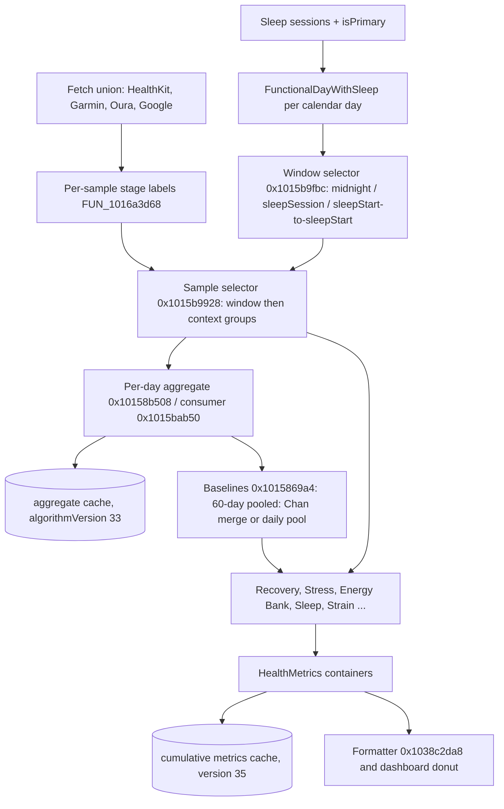
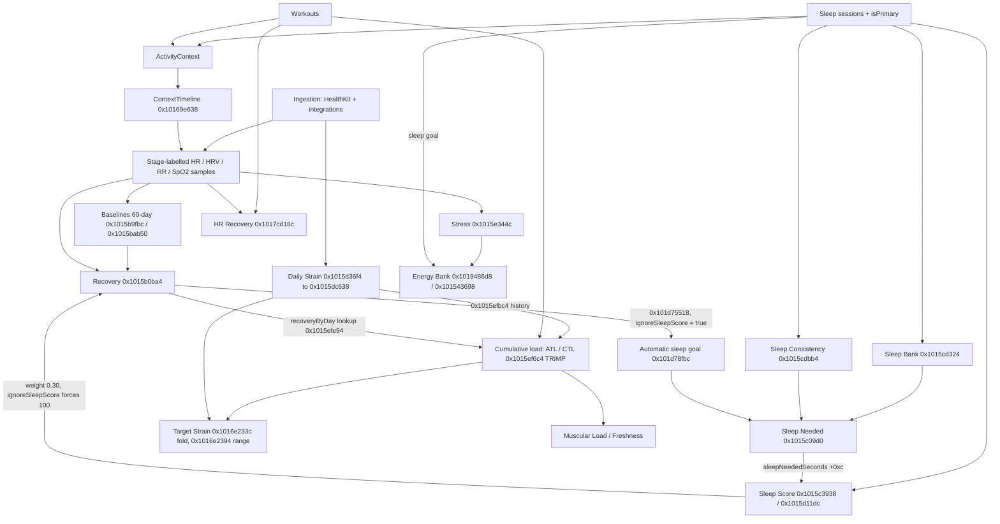

# Shared machinery: windows, baselines, settings, gates, replay, presentation

Scope: tasks G04 to G09 and G12 (dependency graph, edges verified by R10). Sources: `evidence/B.md`, corrected and extended by `evidence/R.md` (R2b, R2c, R3, R4, R5, R6, R9, R10). Where B and R disagree, this doc follows R and says so.

Conventions: addresses are unslid VAs. `FUN_x` is the Ghidra decompile entry; `1015b.c:6500` means shard `1015b.c`, line 6500 of `out/decomp-main/`. Ghidra prints `<=` as `<__infix` and `>=` as `>__infix` for `Comparable` calls. The comparison stubs were checked: `0x104e57d6c` is `>`, `0x104e57d78` is `<`, `0x104e57d84` is `>=`, `0x104e57d90` is `<=`, `0x104e511fc` is `Date.<`.

## Contents

- [Pipeline overview](#pipeline-overview)
- [G04: Functional days and windows](#g04-functional-days-and-windows)
- [R5: Heart-rate stream per consumer and sample labelling](#r5-heart-rate-stream-per-consumer-and-sample-labelling)
- [G05: Baselines](#g05-baselines)
- [G06: Settings and defaults](#g06-settings-and-defaults)
- [G07: Null, calibration and error gates](#g07-null-calibration-and-error-gates)
- [G08: Replay, caches and late data](#g08-replay-caches-and-late-data)
- [G09: Presentation layer](#g09-presentation-layer)
- [G12: Dependency graph](#g12-dependency-graph)
- [Corrections to earlier research](#corrections-to-earlier-research)

## Pipeline overview



## G04: Functional days and windows

Status: RESOLVED.

### Calendar primitives

All date arithmetic uses `Calendar.current`, so it is DST-safe and follows the device time zone. No code adds a fixed 86 400 s.

- `Date.addDays(n)` 0x1030cbe40 calls 0x1030cba00 (1030c.c:7430): `Calendar.current.date(byAdding: .day, value: n, to: self, wrappingComponents: false) ?? self`.
- `subtractDays` / `subtractSeconds` (0x1030cbe4c / 0x1030cbe94) call 0x1030cbc20 (1030c.c:7891): `date(byAdding: comp, value: -n) ?? self`.
- A day is a calendar day, so DST days are 23 h or 25 h.

### Day intervals

`DateHelper.generatePreviousDayIntervals(dayCount:currentTime:calendar:)` at 0x1030defb0 (1030d.c:11989):

```ts
function generatePreviousDayIntervals(n: number, now: Date, cal: Calendar) {
  const s0 = cal.startOfDay(now); const out = [];
  for (let i = n - 1; i >= 1; i--) {                  // oldest first
    const start = cal.date(byAdding: .day, -i, s0)!;
    const next  = Calendar.current.date(byAdding: .day, 1, start) ?? start;
    const end   = Calendar.current.date(byAdding: .second, -1, Calendar.current.startOfDay(next)) ?? start;
    out.push({ startTime: start, endTime: end, index: i });   // end = 23:59:59 local
  }
  out.push({ startTime: s0, endTime: now, index: 0 });         // today ends at "now"
  return out;
}
```

`0x1018416ec` (10184.c:420) maps the intervals to `[FunctionalDay(dayStart: startTime, dayEnd: endTime)]`.

### Functional day is a calendar day

Types: `FunctionalDay {dayStart, dayEnd}` (0x10523300c); `FunctionalDayWithSleep {functionalDay, primarySleep: SleepSession?, nextPrimarySleep: SleepSession?, naps: [SleepSession]}` (0x105233034).

Builder 0x1015556e0 (10155.c:6164), `(D: Date, sleepsByWakeDay)`:

```ts
functionalDay = { dayStart: startOfDay(D), dayEnd: startOfDay(D + 1 day) - 1 s }   // 0x1016eea24 (1016e.c:8412), min/max ordered
primarySleep     = sleepsByWakeDay[startOfDay(D)]?.first(s => s.isPrimary)
nextPrimarySleep = sleepsByWakeDay[startOfDay(D + 1 day)]?.first(s => s.isPrimary)
naps             = (sleepsByWakeDay[startOfDay(D)] ?? []).filter(s => !s.isPrimary)   // supplied order
```

`sleepsByWakeDay` (0x10155cd64, 10155.c:9683) = `Dictionary(grouping: sessions, by: Calendar.current.startOfDay(session.endTime))`. A night belongs to the calendar day on which it ENDS. Callers pass `D = functionalDay.dayEnd` from the day interval (HealthDataLoader 0x1017db4a4 at 1017d.c:10965; also 0x101d77174, 0x10157d408). For today, `startOfDay(now)` is today and the rebuilt `dayEnd` is 23:59:59, not "now". `isPrimary` assignment is described in [ingestion.md](ingestion.md#cross-source-session-choice-and-the-primary-flag).

### WindowType to [start, end)

Selector 0x1015b9fbc (1015b.c:6500), verified in assembly:

| WindowType | start | end |
|---|---|---|
| 0 midnightToMidnight | dayStart | dayEnd (23:59:59) |
| 1 sleepSession | `primarySleep?.startTime ?? dayStart` | `primarySleep?.endTime ?? dayStart` (no primary sleep gives an empty window) |
| 2 sleepStartToSleepStart | `min(asleepStart(primarySleep), dayStart)`; `dayStart` if there is no primary sleep | `sleepStartEnd(day)` 0x1016edb4c (1016e.c:8074): if `dayStart == startOfDay(now)` then `startOfDay(now + 1 d) - 1 s`; else if nextPrimarySleep then `min(nextPrimarySleep.startTime, dayEnd)`; else `dayEnd` |

- `asleepStart` is 0x10171d7f8 (10171.c:11123): returns `(start of the first segment whose stage != awake, end of the last such segment)`, falling back to `(session.startTime, session.endTime)`. inBed segments are not excluded. The same start is exposed as 0x1016ed088 (1016e.c:7454), used by the histogram builder.
- `windowType` is an ordered fallback list. For each type: compute the window, select samples with 0x1015b9928 (time `[start, end)` by binary lower-bound search on `startDate`, or `endDate` when `useEndTime`; then context groups; then forced mindfulness). Map `doubleValue` to Float32 and return as soon as the result is non-empty.
- Empty `windowType` throws `ScoreCalculationError` (payload 0,0). If every window was computed but empty it returns `[]`, not an error.

### Timestamp ordering and endpoints

- The selector assumes input sorted by the chosen date and never checks. Arrays arrive in fetch order.
- The end is exclusive. Because `dayEnd` is :59:59, a sample stamped at or after 23:59:59.000 is excluded from midnight windows.
- Today's midnight window ends at 23:59:59 in the window builder (the raw generator would end it at "now"; the FDWS rebuild changes that).
- Comparison operators (assembly): selector lower bounds use `>=` (0x1015b9afc, 0x1015b9bc0), so slices are `[start, end)`; the histogram slice uses `>=` (0x1015bb7b8, 0x1015bb86c); sleepStartToSleepStart start and end use `<` (min) (0x1016edb4c, 0x1015ba780); `dataSpanAtLeast` uses `<=`; glucose meal and sample day filter `>= dayStart && Date.< dayEnd` (0x100097e4c / 0x100097e70).

### Baseline windows generator

0x1015b9360 (1015b.c:5255), arguments `(days: [FDWS] ascending, count C, span B)`:

```ts
for k in 1...clamp(C, 1, n):  i = n - k                       // newest first, inserted at front, ascending output
  window = { currentDay: days[i], previous: days[max(i,1) - 1],
             baselineDays: days[max(i - B, 0) ..< max(i, 1)],   // the B days BEFORE i (i == 0 gives [day0] itself)
             nextBaseline: days[max(i - B + 1, 0) ..< i + 1] }  // includes the current day
```

Call sites and spans:

| Span B | Call sites | Used for |
|---|---|---|
| 60 (0x3c) | 10005.c:5395, 10005.c:11227, 10161.c:11903, 1017d.c:6986, 1017d.c:11346 | Data loading, HealthDataBaselines |
| 30 (0x1e) | 1015b.c:8594 (calculateSleepHistory), 1017d.c:7826 | Sleep |
| 120 (0x78) | 101d7.c:8346 | Sleep-goal estimator, 120 windows |
| 120 windows x 60 | 101d7.c:9886 | Sleep goal |
| 7 | 1015d.c:2126 | Strain-family helper |

In `HealthDataLoader.calculateMetrics` (continuation 0x1017da934, 1017d.c:7101), lookback L is the second async argument (ctx+0x270) and maxBaselineCalcDays M the third (ctx+0x278):

- Day intervals: `L + 61` (`L + 1 + 60`) via `generatePreviousDayIntervals` (1017d.c:7221).
- Windows: `L + 1`, named `lookbackDaysWithBufferDay` (ctx+0x480, forwarded to calculateHealthMetrics at 1017d.c:8608).
- Data limit: `startOfDay(now) - max(M, 8)` days via `subtractDays` (`M < 9` gives 8). This is `earliestDataLimit` for missing-aggregate computation (G05).
- The service recalculation passes `M = 3` (0x101689224 tail call `mov w2,#3`).

### Daily versus combined date selection

Aggregate consumer 0x1015bab50 (1015b.c:5071):

- Daily: for each supplied day run the selector, skip days that throw or return empty, take the Float32 sequential mean per day, then population stats over the day means (`0x10183bdc0`).
- Combined: run the selector on `days[0]` only and compute population stats over those samples. An empty `days` throws.
- The baseline engine always calls this with a single-day array (`[day]`, 0x10158b7a4). The 60-day span is built afterwards by pooling per-day aggregates (G05), not by one wide window.

### Week and 28-day helpers

`Date.startOfWeek(startingOn: Weekday)` is 0x1030ca614 (Bio Age uses Monday starts in `Calendar.current`). `DateHelper.generateExclusiveDateRange(from:to:)` is 0x1030e44c0 (traced as D-28 to D-1, a noon-based descending loop).

### Time zone

There are no explicit TimeZone calls on this path. Every key is `Calendar.current.startOfDay(...)` evaluated at run time. The dictionary keys of `baselines`, `aggregates` and the sleep grouping are absolute `Date`s, so after a time-zone change cached day keys fall at a different instant than the new local midnight, miss, and are recomputed as "missing". Inferred from the keying; there is no explicit TZ-change handler.

### Date list helper that includes the start (R3 correction)

`FUN_1030c7b04(interval, comps)` is used to list day starts. It returns `[interval.start] + midnights in (start, end)`: it allocates the array with `{count 1, capacity 1}`, writes `interval.start` into element 0, and only then calls `Calendar.enumerateDates(startingAfter: start, matching: comps, .nextTime, .first, .forward)` with a closure (`FUN_1030c7d60`) that appends `m` while `m < interval.end` (`Date.<`). The cumulative-metric docs rely on this (see [strain-load.md](strain-load.md)).

## R5: Heart-rate stream per consumer and sample labelling

Status: RESOLVED (R5, supersedes A's BLOCKED sub-item and B's one-line G05 section 10).

### How samples are labelled

Applied when per-type histories are built: `FUN_1016a3d68` (called from 0x1016a0460, 0x1016a5b90, 0x1016a6604, 0x1020a2650, 0x101f57f20). Classifier 0x1016a30fc. The sleep stage at a time comes from 0x1016a2ec0, which checks non-unspecified segments before asleepUnspecified ones.

```ts
// t = sample.startDate (HealthQuantitySample slot 0x24); isHR = (type & 0xfe) == 4 (types 4 minute-aggregates, 5 samples)
stagesA = activity.sleepStages.filter(s => s.stage != asleepUnspecified)    // loop 1 of FUN_1016a3d68
stagesB = activity.sleepStages.filter(s => s.stage == asleepUnspecified)    // loop 2
function find(list, t) {          // FUN_1016a16e4 / FUN_1016a19b8: binary search, assumes sorted, non-overlapping
  lo = 0, hi = n - 1
  while (lo <= hi) { mid = (lo + hi) / 2; s = list[mid]
    if (t >= s.start /*0x104e57d84*/ && t < s.end /*Date.<*/) return s       // half-open [start, end)
    if (t < s.start) hi = mid - 1; else lo = mid + 1 }
  return nil }
stage = find(stagesA, t)?.stage ?? find(stagesB, t)?.stage ?? NONE(6)       // FUN_1016a2ec0
if (stage == rem(4)) return remAndDeepSleep(1)                               // 0x1016a33f8 mov w0,#1
if (stage != awake(1) && stage != NONE) return stage == deep(3) ? 1 : 0      // 0x1016a3780 cset eq 3; core/unspecified/inBed -> otherSleep(0)
// awake or no stage: same [start, end) search on the context SortedLists, in this order
if (find(workouts, t))    return workout(2)       // 0x1016a39b8
if (find(mindfulness, t)) return mindfulness(3)   // 0x1016a3b64
if (isHR && find(exercise, t)) return exercise(5) // 0x1016a3d28, HR types 4/5 only
return awake(4)                                   // 0x1016a39f0
```

SampleContextType: otherSleep 0, remAndDeepSleep 1, workout 2, mindfulness 3, awake 4, exercise 5.

- Ties: a sample exactly at a segment boundary belongs to the segment that starts there.
- Overlapping segments: the binary search returns whichever probe hits first; there is no priority and the input is assumed non-overlapping (HealthKit sessions are de-overlapped upstream).
- Stress and Energy Bank do NOT use these per-sample tags for their slot context. They classify each 6-minute slot by overlap (`seg.end >= s && seg.start <= e`) with priority workout > exercise > non-awake sleep > mindfulness > awake (`FUN_1015e0ca8`; see [recovery-stress-energy.md](recovery-stress-energy.md)).

### Which HR stream each consumer uses

| Consumer | HR stream | Label use |
|---|---|---|
| Daily Strain | key 4 heartRateMinuteAggregates only (0x1015d45c4) | per-sample tag: exercise pool {2,5}, passive pool {4} |
| Stress | key 4 (slot HR, median/trimmed mean) + key 1 HRV | slot overlap context; awake-context key-4 histogram baseline |
| Energy Bank | key 4 (slot mean) + key 1 HRV | slot overlap context |
| Sleep Score HR dip | key 4 (`lVar4 = 4` at 0x1015d24c4) | per-sample tag in {0,1} inside the primary sleep [start,end); baseline = inactiveHR (key 4, awake) |
| RHR / Recovery | key 0 restingHeartRate, built from key 4 | per-sample tag via factory contexts (default [[remDeep, other]], sleepSession window) |
| HR Recovery | raw `heartRateSamples`: HealthKit `FUN_101676ea0` + Garmin `FUN_1017befb8` + integrations `heartRate` type 6 (`FUN_1017bd0f0(source, 6, ...)`) via `WorkoutHeartRatesFetcher` (`FUN_1017bdf3c`, three async lets 0x104fa1530/48/58) | none (time window only) |
| Workout TRIMP / units | workout HR segments | none |

### How the RHR key-0 history is built

`FUN_1016a5f80`:

```ts
hr = metricHistories[4]                     // thunk_FUN_1017fef0c with key 4, already tagged
// split by source metadata tag (+0x18): 0 -> Garmin list, 1 -> Oura list, 2 -> Google list, else HealthKit list
request = HealthDataFetchType.restingHeartRate(HealthDataRHRCalculation{
  healthKit: rhrMethod == bevel ? .bevel(hkList) : .appleHealth,
  garmin: .bevel(...), oura: .bevel(...), googleHealth: .bevel(...) })
// rhrMethod is the Published CalculationsOptions byte at +0x242 (== 1 means bevel)
// fetched via fetchSamplesWithFallback (FUN_1016a2698); the integration branch keeps tag < 2 (FUN_101655bcc)
// result re-tagged by FUN_1016a3d68 and stored as key 0 (FUN_100ba3474(..., 0, dict) in FUN_1016a6604)
```

### HealthKit HR timeout fallback (new in R)

`MetricSampleHistoryCalculator.fetchSamplesWithFallback` (`FUN_1016a2728` / `FUN_1016a2988`): the primary fetch has a 300 s timeout (`0x4072c00000000000`). On timeout, for heartRateMinuteAggregates, heartRateSamples (`(word0 & ~4) == 1`) and bloodGlucose, it runs `fetchAggregatedFallback` (`FUN_1016a1d1c` to `FUN_10166f24c` / `FUN_10166f33c`): an `HKStatisticsCollectionQuery` with `.discreteAverage` (options 2; steps use 0x10 cumulativeSum) and interval `DateComponents(minute: 5)` (`mov w8,#5` at 0x10166f520), also with a 300 s timeout. Otherwise the result is `[]`.

## G05: Baselines

Status: RESOLVED. Caches live under `algorithmVersion "33"` for per-day aggregates (`readCachedAggregates`, 0x10159c08c; small string 0x3333) and `"35"` for cumulative metrics (`FUN_1016c88b4(..., 0x3533, ...)`, 1015e.c:6271; checked in check-ABC as two separate caches, no conflict).

Types: `CalculationConfiguration {aggregationMethod, windowType: [WindowType], useEndTime, contexts: [[SampleContextType]]?, forceIncludeMindfulness}`; `BaselineConfiguration {calculationConfiguration, baselineDays: Int, computeHistogram: Bool}`; `AggregateStatistics {average: Float, stdDev: Float, count: Float, histogram: [HistogramValue{value: Int, count: Int}]?}`. `HealthDataBaselines` class: +0x10 `baselines: [Date: [CalculatedMetric: AggregateStatistics?]]`, +0x18 `aggregates` (same shape), +0x20 `missingBaselines: Bool`, +0x28 `baselineConfiguration: [CalculatedMetric: BaselineConfiguration]`.

Pipeline (run by the HealthDataBaselines instance):

1. `loadCachedAggregates(windows)` (entry 0x1015880cc, 10158.c:4689 to 0x101588254 to 0x10158876c): flatten all `window.baselineDays`, dedupe by `dayEnd`, sort, `earliest = startOfDay(first.dayEnd)`. Call `readCachedAggregates(algorithmVersion: "33", earliestDate:)`. For each unique day: if `cache[startOfDay(dayEnd)]` exists copy it into `self.aggregates` and list as cached, else list as missing. Returns `(cachedDays, missingDays)`.
2. `calcMissingAggregatesAndComputeBaselines(missing:windows:earliestDataLimit:baselineInputs:writeToCache:)` (entry 0x101589ccc, 10158.c:5056 to 0x101589ec8, 10158.c:9910): for each missing day compute aggregates only if `earliestDataLimit == nil || day.dayEnd >= earliestDataLimit` (older missing days stay missing); store `self.aggregates[startOfDay(day.dayEnd)] = perDayAggregates(day, baselineInputs)` (0x10158b508); run `computeBaselines(windows)` (0x1015869a4); if `writeToCache` call `aggregateCacheWriter.write(self.aggregates, "33")`. Returns the windows whose `currentDay.dayEnd >= earliestMissing.dayEnd` (`changedBaselineDays`; operator `Comparable.>=` at 0x10158a664) for `updateHRReserveZonesIfNeeded`.
3. Per-day aggregates 0x10158b508 (10158.c:6340): metric list is `CalculatedMetric.allCases` minus {sleepingHR 5, glucose 9/10/11} (0x101e23518, mask 0xe20). Sample source per metric from byte table 0x104f935be:

   | CalculatedMetric | HealthQuantityType |
   |---|---|
   | avgHRV, restingHRV | heartRateVariability (1) |
   | RR | respiratoryRate (3) |
   | RHR | restingHeartRate (0) |
   | inactiveHR, sleepingHR | heartRateMinuteAggregates (4) |
   | wristTemp | temperature (19) |
   | bodyTemp | bodyTemperature (20) |
   | spO2 | spO2 (18) |
   | glucose | bloodGlucose (15) |

   `stats = singleDay(metric, day, samples)` (0x10158b7a4, 10158.c:6905) = `0x1015bab50(samples, [day], config.calculationConfiguration)`; nil if samples are nil, the selector throws, or mean/sd/count is nil. Daily metrics yield `(dayMean, 0, 1)`; combined metrics yield `(mean, popSD, nSamples)`. If `computeHistogram`, the histogram is `hist(window types in order; first non-nil)` (0x1015baf78). Glucose metrics are added by 0x100097bdc (see [nutrition-tdee.md](nutrition-tdee.md)).
4. Baselines 0x1015869a4 (10158.c:6583): for every window `list = window.baselineDays.map(d => self.aggregates[startOfDay(d.dayEnd)] ?? {} /* sets missing = true */)`; `self.baselines[startOfDay(currentDay.dayEnd)] = combine(list)` (0x10158bad4); `self.missingBaselines = anyMissing`. For `windows[0]` only, 0x101587270 (10158.c:8630) also writes cold-start baselines for every day k inside its baselineDays from the prefix `baselineDays[0..<k]` (k = 0 skipped).
5. `combine(perDayDicts)` 0x10158bad4 (10158.c:7595), assembly-verified. For each metric in `allCases - {sleepingHR}` (0x101e23614):

```ts
entries = perDay.map(d => d[m]).filter(nonNil)                     // oldest -> newest
prior = populationPrior(m) /*0x101e23c3c*/; if (prior) entries.push(prior)   // appended LAST
baseline[m] = config[m].aggregation == combined ? chanMerge(entries) : dailyPool(entries)
// empty entries -> nil
// dailyPool (0x10158db9c): population mean/SD (divisor n, 0x10183bdc0) of entries.average, count = #entries
// chanMerge (0x10158d9b8, 10158.c:8535), exact Float32 in instruction order:
M = e0.avg; V = e0.sd * e0.sd; N = e0.count
for (e of rest) { n = e.count; NN = n + N; d = e.avg - M
  M = (d * n) / NN + M
  V = ((N - 1) * V + (e.sd * e.sd) * (n - 1) + (d * d) * ((n * N) / NN)) / (NN - 1)
  N = NN }
return { average: M, stdDev: sqrtf(V), count: N, histogram: mergeHist(nonNil hists) /*0x10158d680*/ }
```

   Note the mixed definitions: per-day SD is population (/n) while the merge uses (n-1) weights. A first entry with sd 0 and n 1 gives `(0*0 + ...) / (NN - 1)`.
6. Population priors 0x101e23c3c (101e2.c:2573), glucose only:

   | Metric | Source | Values (Float64) | Prior |
   |---|---|---|---|
   | foodGlucoseAUC (9) | array 0x106115750 | [180, 200, 220] | avg 200, popSD 16.3299, count 3, histogram {180:1, 200:1, 220:1} (Int-truncated, 0x10183ba60) |
   | foodGlucosePeak (10) | array 0x106115718 | [140, 160, 180] | avg 160, SD 16.3299, count 3 |
   | foodGlucoseDelta (11) | immediates | none | avg 50.0 (0x42480000), SD 0, count 1.0 (0x3f800000), histogram [{50, 1}] (static 0x1061156e8) |

   Every other metric gets nil. The prior is merged as one more pseudo-day.
7. Default configuration map 0x10158c980 (10158.c:9092) with factory 0x101e23994 (101e2.c:2699). Options packed one byte each: b0 hrvMethod, b1 rhrMethod, b2 hrvContext, b3 rhrContext, b4 calories, b5 tempSource, b6 sp02Window, b7 rrWindow.

   | Metric | Agg | windowType | useEnd | contexts | force | baselineDays | hist |
   |---|---|---|---|---|---|---|---|
   | 0 averageHRV | combined | [midnight] (static 0x1060b7bb8) | F | nil | F | 60 | F |
   | 1 restingHRV | daily | [`0x0202000101 >> (8*hrvCtx)` & 0xff]: ctx 0,1 sleepSession; 2 midnight; 3,4 sleepStart-to-sleepStart | F | table 0x106115818[hrvCtx] | hrvCtx == 3 | 60 | F |
   | 2 respiratoryRate | combined | rrWindow == entireDay(1) ? midnight : sleepSession | F | nil | F | 60 | F |
   | 3 restingHR | combined | as restingHRV but rhrCtx | F | table[rhrCtx] | rhrCtx == 3 | 60 | F |
   | 4 inactiveHR | combined | [midnight] | F | [[awake]] | F | 60 | T |
   | 5 sleepingHR | combined | [sleepSession] (0x1061152d0) | F | [[rem/deep, otherSleep]] | F | not in the map | F |
   | 6 wristTemp | daily | [midnight] | T | nil | F | 30 | F |
   | 7 bodyTemp | daily | [midnight] (0x106115528) | T | nil | F | 30 | F |
   | 8 spO2 | daily | sp02Window == entireDay ? midnight : sleepSession | F | nil | F | 60 | F |
   | 9-11 glucose | combined | [midnight] (default branch) | F | nil | F | 60 | F |

   Context table entries: 0 `[[rem/deep, other]]`, 1 `[[rem/deep]]`, 2 `[[mindfulness]]`, 3 `[[rem/deep, other]]`, 4 `[[0..5]]` (0x1060bad10).
8. `baselineDays` (60/30) is never read by the engine (no load of field +0x28 from the 0x38-stride configuration entries; a disassembly search for `mov w*,#0x38` followed by `ldr x,[x,#0x28]` found one unrelated hit at 0x104a4ede4). The effective span is the window generator constant (60 for HealthDataBaselines), temperatures included. So the 30-day temperature span in the table is dead configuration; the real span is 60.
9. Histogram ("HR CDF") 0x1015baf78 (1015b.c:7092) to 0x10183c038 (10183.c:9099): same window as the selector but only the FIRST context group, no group fallback, no forced mindfulness; `useEndTime` forced false so the slice is by `startDate`. Values are binned as `Int(Float32(value))` (truncation toward zero), counted in a dictionary, mapped to `[HistogramValue]` (0x101585740) and sorted (0x10183b258). A NaN, infinite value or Int overflow TRAPS (crash). Only inactiveHR has `computeHistogram` (minute-aggregate HR, midnight window, awake context); daily histograms merge across days by `mergeHist`.
10. Sample contexts: see R5 above.
11. Rejection: no outlier, Winsorization or zero filtering anywhere in the engine. Non-finite values are not filtered (NaN propagates through means, except the histogram trap). SD == 0 is a valid value; the Recovery z-score treats SD 0 as z = 0.
12. Calibration and validity: the engine has no minimum-days gate. A baseline exists as soon as one prior day has an aggregate. `missingBaselines` is set when any baseline day lacks a cached or computed aggregate.

Glucose baselines (hand-off from the nutrition agent): per-day glucose aggregates come from 0x100097bdc (not the window selector). For each meal or food log whose timestamp is in `[dayStart, dayEnd)`, AUC (0x1000975e0), Peak (0x100097790) and Delta (0x100097b4c) are computed; per day it stores Double population stats (0x10183b824) with `count` = number of meals that day, plus the histogram (0x10183ba60). Span = the 60 calendar days before the day. Glucose tags 9-11 fall to the default branch of 0x10158c980 (`cmp w22,#8; b.ne default`, assembly-verified) giving `combined`; 0x10158bad4 tests `cmp w19,#1; cset eq`, so combined means `chanMerge`. The baseline count is the sum of meals over the preceding at most 60 days plus the prior pseudo-count (3 for AUC/Peak, 1 for Delta). The 20-count gate (G07) applies to the pooled count, so 17 real meals suffice for AUC/Peak and 19 for Delta.

Confirmations: the n-1 Chan merge applies to every metric whose config is combined (averageHRV, respiratoryRate, restingHR, inactiveHR, glucose AUC/Peak/Delta). Daily pooling (population stats of day means) applies to restingHRV, wristTemp, bodyTemp and spO2. sleepingHR is excluded from the baseline list.

R3 addition, the TRIMP RHR baseline: `HealthDataBaselines.load(date, 60)` returns the 60-day pooled RHR baseline for the workout day (see [strain-load.md](strain-load.md#trimp-baselines)).

## G06: Settings and defaults

Status: RESOLVED.

### CalculationsOptions

`SettingsUserDefaultsKeys` (desc 0x1052452ac, conformance 0x104feeea4, accessor 0x1005d8484, raw-value table around 0x1061122a8). `CalculationsOptions` is JSON under case 15 `health_settings.calculations_options_key` (string 0x1059471d0, 40 bytes).

- Read 0x101915fbc (10191.c:4805): if the key is absent (`uVar6 >> 0x3c >= 0xf`) or the JSON decode throws (second `mov w0,#0x101` at 0x1019160a0) the packed default is `0x0000000000000101` (R2c, closes A's BLOCKED sub-item).
- Write 0x1019160d4 (JSONEncoder, witness +0x50 set data, key 0xf), which also publishes `_calculationsOptions`.
- Per-field `decodeIfPresent` defaults (0x101915a2c; assembly 0x101915b14-0x101915d70):

| Field | Default if missing |
|---|---|
| hrvMethod | bevelRMSSD (appleHealth / bevelRMSSD) |
| rhrMethod | bevel (appleHealth / bevel) |
| hrvContext | entireSleep |
| rhrContext | entireSleep |
| caloriesDisplay | total (total / active) |
| temperatureSource | wrist (wrist / body) |
| sp02Window | entireSleep (entireSleep / entireDay) |
| rrWindow | entireSleep (entireSleep / entireDay) |

Packed byte order (encoder 0x101915318): b0 hrvMethod, b1 rhrMethod, b2 hrvContext, b3 rhrContext, b4 calories, b5 tempSource, b6 sp02Window, b7 rrWindow. hrvMethod and rhrMethod select the sample source (RMSSD computation 0x10166ab98, see [ingestion.md](ingestion.md#hrv-methods-and-the-rmssd-kernel)).

### Sleep goal

Keys: case 12 `health_settings.sleep_goal_key` (Float hours) and case 13 `health_settings.sleep_goal_method_key` (String). Getter 0x1019383e0 (caller 0x101936a94), assembly-verified:

```ts
goal = defaults.float("health_settings.sleep_goal_key") ?? 7.5   // fcsel #7.5 on nil, 0x1019384f4-0x1019384f8
isAutomatic = defaults.string("health_settings.sleep_goal_method_key") == "automatic"   // case table 0x1060d04f8 ["manual","automatic"]; missing = manual
```

The UserDefaults float getter 0x101b98028 returns nil (not 0) when the object is absent, so a missing goal reads as 7.5 h, not 0 (D's "0" does not hold). R9: `FUN_1019383e0` calls the `UserDefaultsServiceProtocol` witness +0x10 with key `SettingsUserDefaultsKeys(12)` (raw value at 0x106112260); conformance 0x104ff017c, witness table 0x106113060, +0x10 = `FUN_101dd5ed0` to `FUN_101dd8b14` (via `UserDefaultsService.migrations`) to `FUN_101b98e54` to `FUN_101b98028`, which is `objectForKey(key) == nil ? nil : Float(floatForKey(key))`. The method string is read from key 13 through witness +0x68 and compared with the case table 0x1060d04f8.

The tonight planner reads the same value: `TonightSleepNeededService` (descriptor 0x105244a9c: todayModel +0x40, healthData +0x48, settings +0x50) builds `CombineLatest4(todayModel.$today, healthData.$publishedData, settings.$sleepHours, healthData.$loadingStatus)` (`FUN_101d7e544`, 101d7.c:10560-10650; `_TtC8Superset13SettingsModel::_sleepHours`), feeding `FUN_101d7ece0` to `calculateSleepNeeded` 0x1015cc358. It is the same Published property that the score, bank and Energy Bank read.

Writers: the automatic estimator writes `hours + minutes/60` (0x101d79b30); onboarding writes the onboarding model's published goal (0x101af8270). The only age-dependent onboarding computation found is `automatedMaxHeartRate = 220 - age` (0x101af6a10); no age-based sleep-goal table was found among the onboarding callers of `ageYearsOn` (0x101af6a10, 0x101af957c).

### Temperature baseline

Key `data_integrations.temperature_baseline_fahrenheit` (0x1059482d0), stored in °F. Input bounds: lower 95.0 °F (35.0 °C when the unit is Celsius; 0x102a58264), upper 99.9 °F (double at 0x104ecfca0, 0x102a5a910). Display conversion `(F - 32) * 5 / 9` (0x102a57fc4). Default seed from sex and age: 97.9 / 98.1 / 95.7 °F, see [ingestion.md](ingestion.md#temperature) (R2d).

### Data Loading Window

Key `data_loading.full_metrics_recalculate_window`, values `DataLoadingLookbackWindowOption` raw strings `oneYear` to `fiveYears`.
- It is a LOCAL user setting, not remote config.
  - Written by 0x100050ab0, which is called from 0x1020724a4 ("Recalculating data...").
  - Settings row "Data Loading Window" (string 0x105962f00, referenced by 0x1029f7c28).
  - Read by 0x101dce914 and mapped by 0x100050e1c.
- `X` is the option index (oneYear = 0 … fiveYears = 4). Every consumer maps an unset or unknown value (5) to X = 0.
- The date helper 0x1030cbc20 is `Calendar.current.date(byAdding: component, value: -n, to: date) ?? date`. 0x1030cc894 subtracts years and 0x1030cbe4c subtracts days.

The 91 consumers use one of three formulas (R2 item 2):

| Formula | Consumers |
|---|---|
| `now - (X+1)` calendar years | Bio Age weekly list 0x1005910fc (`start = max(now - (X+1) years, fromDate)`), BioAge recalculateAll 0x100590e04 / 0x1005943ec, cache pruning cutoff 0x101614888, initial refresh 0x100050984 / 0x100050ab0, pheno fetch 0x10058a5c0, sanitization 0x1005a1cf4, cycle onboarding 0x100b164a8, backfill request 0x1013699d0 (sends `dataLoadingWindowYears = X+1`), and the settings and display view models |
| `date - (X*365 + 365)` days, i.e. (X+1)*365 days | metric history and cumulative recalculation 0x10168ca5c (R3 `cumulativeMetricsLookbackDays`), full recalculate input 0x101615968, cache pruning 0x1015f2a00, PhoneDataLoadingManager (0x101612738, 0x101606f08, 0x101602afc, 0x10160b2b8, 0x10160b73c, 0x101607a34, 0x101623d8c, 0x101627630), cache loads (0x101692394, 0x10161af14, 0x100b56fec), Energy Bank 0x101532c78, journal factors (0x1018749fc, 0x1018746e0, 0x101876d88, 0x1018452d4, 0x101843ccc, 0x101843094, 0x1018437a8), source priority 0x101b5b67c / 0x101b5c790, BackfillService 0x101b17530, coaching payload 0x100821b1c, embedded workout 0x10085d9dc, cardio-load RHR baseline 0x1014efa80, HealthDataLoader 0x1017d4f14, activity-context load 0x1015592d0 (`[startOfDay(now - (X+1)*365 d), now]`), cardio load history 0x1007de27c |
| `startOfDay(now) - (X*365 + 427)` days, i.e. (X+1)*365 + 62 days | integration sync fetch start: Google and Oura notifications 0x10142e114, Garmin new data 0x1014299c0, Oura sync 0x10143052c, historical sync 0x1014b752c / 0x102a96660, debug sync 0x102b5e8d0 / 0x102b6a6dc, quick refresh and restart 0x10160c3f8 |

"Years" uses calendar arithmetic (leap days included). "Days" uses calendar-day arithmetic in the device time zone.

### Remote values

`BevelCoaching.CoachingFeatureFlags` has the `nutritionScoreV2` boolean and the `nutritionScore` version flag (decode 0x1043e27ac); their values are server side. The Mixpanel flag manager has no metric keys; Firebase RemoteConfig is used only for Crashlytics rollouts. No remote numeric metric constant exists; every threshold and window is compiled in.

### Profile

Age comes from `Date.ageYears` / `ageYearsOn` (0x1030ce468 / 0x1030ce4ec); sex from `EffectiveSex` (`FUN_10310dea8`: 0 male, 1 female, 2 other, 3 notSet). Max HR default is `220 - age` (0x101af6a10).

## G07: Null, calibration and error gates

Status: RESOLVED. Shared states (layouts from reflection):

- `ScoreCalculationError {noDataError(message), dateError, queryError}`.
- `GlucoseScoreState {waitingForData, baselinesCalibrating, complete}`; `CalibrationState {uncalibrated, calibrated}`.
- `LoadStatus {calibrating, detraining, maintaining, peaking, productive, fatigued, overtraining}`.
- `MuscularFreshnessStatus` and `MuscleFreshnessStatus {calibrating, recovered, fatigued, depleted}`.
- `HealthMissingData {recoveryHRV, recoveryHRVBaseline, recoveryRHR, recoveryRHRBaseline, recoverySleepScore, stressRHRBaseline, stressHR, sleepMissingInputs}`, carried in `RecoveryMetrics/StressMetrics/SleepMetrics.missingData`.
- `DynamicSleepGoalCalculationResult {sufficientData, insufficientData, failed}`; `StressScoreLevel {high, mediumHigh, medium, lowMedium, low, undefined}`; `BioAgeState/BioAgeDisplayState {loading, calibrating(CalibratingData), blocked, ready}`.
- All score fields are `Float?`. nil means unavailable; 0 is a valid value.

### Calibration service (Recovery 60-day, Stress 30-day badge)

`HealthMetricCalibrationService`; per-metric builder 0x101cc5a24, assembly 0x101cc5ae4-0x101cc5b0c.

```ts
spanDays = metric == recoveryScore(0) ? 60
         : metric in {stressScore(30), inactiveStress(32), sleepStress(33)} ? 30
         : null        // every other metric: no calibration state; activeStress(31) is excluded
// per day (0x101cc5614, cset lt at 0x101cc5808): dates = data dates up to that day (trend entries 0x10194a1ec)
calibrated = DateHelper.dataSpanAtLeast(numDays: spanDays, dates)   // 0x1030dd1bc: min(dates).addDays(N) <= max(dates), stub 0x104e57d90 = <=
             && dates.count > 4                                      // at least 5 data days
```

Lookup 0x101cc666c to 0x101cc5308 returns nil (2) when no entry exists. Consumers store the state as an `isCalibrating` flag in the Stress and Energy data: 0x1016e3e3c (LiveStressService), 0x101522958, 0x1015262b8, 0x101524ec4, 0x1016e43f4, all querying metric 0x1e. UI copy: "allow up to 60 days" (Recovery, 0x105951030), "30 days" (Stress, 0x105950ee0). The dates must also span at least N days (`first + N <= last`).

### Recovery missing data

Recovery builder 0x1015b0ba4. Baselines are read as `baselines[startOfDay(day)][restingHRV]` and `[restingHR]`. `missingData` is appended in this order (rec.c lines 1187-1287): today's HRV nil gives recoveryHRV; today's RHR nil gives recoveryRHR; HRV baseline nil gives recoveryHRVBaseline; RHR baseline nil gives recoveryRHRBaseline; sleep score nil gives recoverySleepScore. A baseline is nil only when no prior day in the 60-day window has an aggregate. UI text from 0x1016f51f0 / 0x1016f5a28 ("Please wear your watch for at least 2 nights in the last 30 days for Bevel to calculate a baseline." is copy only; the code gate is baseline nil).

### Glucose state

`calculateGlucoseScore` 0x100101c00:

```ts
if (cgm == nil /*method tag 4*/) { if (glucoseDisabled) return {score: nil, state: complete}; /* else compute */ }
else {
  readyAt = mealTime.addHours(2).addMinutes(cgm.method == appleHealth ? 180 : 0)   // 0x1030cbe58, 0x1030cbe70
  if (glucoseDisabled) return {nil, complete}
  if (currentTime < readyAt) return {score: nil, state: waitingForData}
}
if (glucoseBaseline == nil) state = baselinesCalibrating
else for (m of [AUC, Peak, Delta]) if (baseline[m] == nil || baseline[m].count < 20.0) state = baselinesCalibrating
otherwise state = complete
```

The count includes the prior pseudo-count (G05).

### Cardio Load status

0x1015efbc4 (1015e.c near line 9440); same rules in the history path 0x1014e5ee8:

```ts
// rolling state updated BEFORE the day's step (0x1015ec8e4 / 0x1015e9840):
activeDays42 = count(load > 5.0) over the last 42 days           // 0x100009ea4
trainingDensity = min(1, activeDays42 / 28)                       // 0x1015f0184-0x1015f019c
recency = n < 2 ? 0 : min(1, 0.25 * sum_{i=0..n-2, ago=(n-2)-i, load[i] > 5, ago <= 15} (1 - 0.0625*ago))   // 0x10000ad88, last 28 loads, today excluded
confidence = min(trainingDensity, recency)                        // fcsel mi at 0x1015f03a0
if (confidence < 0.35) status = calibrating                       // 0x3fd6666666666666, b.pl continues
ctlMaturity = min(1, CTL / 30)                                    // UI field only (0x10000b3f4); NOT part of the gate
ratio = ATL / CTL (nonfinite -> 0)
trend% = (CTL - CTLprev) / CTLprev * 100   // when both exist (5-day windows, see strain-load.md)
ratio > 1.4 -> overtraining;  1 < ratio <= 1.4 -> (recovery >= 20 or missing) ? productive : fatigued
ratio <= 1: trend > 5 -> peaking; trend < -5 -> detraining; else maintaining (also when no trend)
```

The "6 weeks" in 0x105904170 is copy only; the code gate is `min(trainingDensity, recency) >= 0.35`. Correction (R2 item 1): B's earlier summary `ctlMaturity = min(historyDays/28, 1)` in the gate was a mislabel of trainingDensity. E and F read it correctly, and R2 confirmed it in assembly in both the writer (0x1015efbc4) and the UI builder (0x10000ae0c).

### Muscular Load status

0x10008bd08 (10008.c near 11600); doubles at 0x104ec2f80-0x104ec2f98 and 0x104ebe868.
- A training day is daily load > 250.
- `confidence = min(min(1, trainedDays42/28), recency)`, with the same recency weights.
- The status is calibrating when `confidence < 0.35` or prevCTL <= 0 (asm 0x10008c274 `b.mi`, 0x10008c294 `b.ls`).
- `ctlMaturity = min(1, CTL/1500)` is display only.
- Bands: ratio >= 1.5 overtraining; >= 1.3 fatigued; >= 1.05 productive; >= 0.95 maintaining; >= 0.8 peaking, detraining or maintaining by CTL trend (+/- 5 %); below that detraining.
- Optimal range = CTL x [0.8, 1.5]; display value = ATL / 50.

### Muscle Freshness status

0x100081efc (10008.c:8229) and 0x100086904. No calibration record gives calibrating. Else `days = dateComponents(.day, from: record.date, to: now)`: `days >= 43` gives calibrating; else >= 75 recovered; >= 35 fatigued; < 35 depleted. Freshness is clamped to <= 100.

### Target Strain, sleep goal, stress level

- Target Strain has no calibrating state in code. The "2 weeks" copy (0x105950f80) matches the 14-day seed (0x1015eecc0). The range helper always returns finite bounds; `DailyScores.targetStrainBounds` is Optional.
- Sleep-goal estimator: insufficientData / failed (estimator 0x101d78fbc, see [sleep.md](sleep.md)).
- Stress level (0x1015e344c, assembly 0x1015e4220-0x1015e423c): score >= 60 high; >= 30 medium; else low; no data undefined. A negative score is clamped to 0 first.
- Shared primitives: the selector throws vs returns `[]`; baselines are nil-only with no minimum count; `safeRoundedInt` returns nil on non-finite input.

| Family | Gate (exact) | Output on fail |
|---|---|---|
| Recovery | calibration: 60-day span plus at least 5 data days; missing HRV/RHR/sleep/baseline list | `isCalibrating` badge; `missingData` items; score nil when inputs are nil |
| Stress (score/inactive/sleep) | 30-day span plus at least 5 data days; RHR baseline / HR missing items | badge; `undefined` level |
| Glucose | meal + 2 h (+180 min Apple Health CGM); baselines count >= 20 for AUC, Peak, Delta | waitingForData / baselinesCalibrating |
| Cardio Load | min(min(1, activeDays42/28), recency) < 0.35 (active: load > 5) | calibrating |
| Muscular Load | same with load > 250, or prevCTL <= 0 | calibrating |
| Muscle Freshness | no calibration record or >= 43 days old | calibrating |
| Target Strain | none (14-day seed) | none |
| Sleep goal | 90 / 15 rule | insufficientData / failed |

## G08: Replay, caches and late data

Status: RESOLVED.

- Settings-change trigger: the calculation-settings save chain is 0x10206b840 to 0x1019160d4 (persist options) to 0x10206b8fc, which also writes bool key 16 `forceIncludeManualSleepKey`, to 0x10206b9e8. That stores `DataUpdateType.full` (enum desc 0x1051fda08 `{fromDate(Date), initial, full}`, tag 2) and calls the shared refresh entry 0x100f4d8c8 (relative pointer at 0x104f5d748; 26 callers), which enqueues through `DataLoadingTaskQueue.enqueueTask(key:operation:)` 0x100064c24 and cancels any in-progress full recalculation for the same scope. A settings change therefore replays the full Data Loading Window (1-5 years).
- The full-recalculation input path (0x10161608c) builds a fresh `HealthDataBaselines` (0x10158bf80, then 0x10158c980) and does not reference `loadBaselinesFromCache`; that string is xref'd only by the initial refresh at 0x100055538 and 0x100056164. All aggregates are recomputed with the new options.
- Per-day aggregate cache `algorithmVersion "33"`; cumulative metrics cache `"35"` (GRDB filter `version == "35" AND date >= from AND date <= to`, operators `0x102fee870` `>=` and `0x102fee804` `<=`).
- Each refresh recomputes `L + 1` days; baselines are rebuilt from cached aggregates.
- Late HealthKit data re-consolidates the affected days of the daily history (0x1005b6b04).
- Service recalculation scopes are (7, 2) and (31, 31) with maxBaselineCalcDays 3, so missing aggregates are filled only for the last 8 days.
- Bounded initial lookback = `min(max(required, daysSinceIntegrationChange ?? 0), lookbackWindow)`.
- Cumulative-metric replay window (R3): `calculateMetricsHistory(endDate:lookbackDays:...)` (`FUN_10168beb0`) computes `D = startOfDay(endDate)` (0x10168dde0), `start = D - lookbackDays` (0x10168de9c-0x10168df14), `calculationWindow = DateInterval(start, D)` (0x10168e070). So `S = startOfDay(endDate) - lookbackDays` and `E = startOfDay(endDate)`. `loadMetricsFromCache` (`FUN_1016909fc`) passes a nil recalc marker and only reads the cache over `[D - maxLookbackDays, D]` (`FUN_1015ec004`). Full detail in [strain-load.md](strain-load.md).
- Blood-row order and other SQLite-dependent behavior: see [biological-age-muscular.md](biological-age-muscular.md).

## G09: Presentation layer

Status: RESOLVED (shared presentation); metric-specific rounding in the family docs.

### Central formatter

`HealthMetric.formatValue(value:settings:)` 0x1038c2da8 (assembly-verified nil branch):

- nil gives "—" (U+2014, small string 0xe28094).
- Minutes metrics (sleepBank 8, timeInBed/Asleep/REM/Deep 11-14, timeToFallAsleep 18, exerciseMinutes 19) give `DateHelper.formatDuration(seconds: v*60)`.
- wakeTime and sleepTime (15, 16) give `formatTimeOfDay(v*60)`.
- Other metrics use `formatDecimal(DecimalFormatOptions{fractionDigits: .fixed(n), withGrouping: true, displayPlusForPositive})` (0x1030d3ca4 to 0x1030d389c, NSNumberFormatter decimal style with min = max fraction digits and NO rounding mode set, so iOS default `.halfEven`). The only `setRoundingMode:` sender in the binary is `FUN_104e205e0`, outside the app's formatter (R2b). n by metric:
  - n = 1 for RHR, HRV, RR (1-3) and spO2, temperature, bodyTemperature (36-38).
  - n = 1 with "+" for temperature, HRV and RHR deviations (51-53).
  - n = 0 with "+" for recoveryDeviation (54).
  - n from the user's glucose-unit setting (UnitSettings byte 6) for glucose metrics 48-50.
  - n = 0 for everything else (every score).
- `Float.safeRoundedInt(clamp:)` 0x1030d5a84: NaN or infinity gives nil; otherwise `frinta` (half away from zero in Float32); out of Int range gives `clamp ? Int.min/max : nil`. 34 callers (sleep goal, target-strain notification bounds, morning/summary notifications).
- Units: HK samples keep `quantity.doubleValue(for: rawUnit)` (0x10310076c), no scaling. `HealthQuantityUnitType` includes `percentDecimal` and `fahrenheit`. Display Celsius/Fahrenheit uses Foundation `NSUnitTemperature` Measurement conversion; the temperature-baseline UI uses `(F - 32) * 5 / 9`.

### Dashboard donut (R2b, R4)

Main dashboard cards are `DashboardChartCardItem` (descriptor 0x10525db64: `type: DashboardMetricType {sleep, recovery, strain, stress, nutrition, energy}`, `value: Float?`, `targetBounds`). View witness (conformance 0x1050347e0) body 0x1024af350 to `FUN_1024ae0b8`, which calls `FUN_1032f0850` with `s0 = 100.0` (`mov w9,#0x42c80000` at 0x1024ae404, unconditional) to build `DashboardDonutChart` (descriptor 0x105281258: `maxValue: Float`, `unit`, `targetBounds`, `value: Binding<Float?>`).

- Label (0x1032f1ba0-0x1032f1bd8): `formatDecimal(value, DecimalFormatOptions{fractionDigits: 0, grouping on, no plus}, Locale.autoupdatingCurrent)` via 0x1030d3ca4; same layout as `HealthMetric.formatValue` (0x1038c2f6c-0x1038c2f94). Half-even and unclamped: Recovery 66.5 displays "66", 67.5 displays "68", strain 128.8 displays "129".
- Ring: `FUN_1032f157c` (0x1032f1674-0x1032f1690) computes `progress = Double(Float(value ?? 0) / maxValue)`, passed to `FUN_1032f2918`, which uses `progress` while `_drawingStroke` is true, else 0 (0x1032f3610 fcsel). `DonutRingView` (descriptor 0x1052815f0, body 0x103303eb4): arc angle = `progress * 360°` (0x4076800000000000) with a separate tip/branch when `progress > 0.95`. No clamp to 1; a strain above 100 overdraws past a full turn. Target bounds drawn by `DonutTargetBoundChart` (0x105281650) with low, high and 100.0 (0x1032f36dc-0x1032f36f4).
- Activity strain card (`BevelFitness/ActivityStrainCard.swift`, `ActivityStrainGauge {score: Float}`, body `FUN_103f81580`): gauge fraction `clamp(score/100, 0, 1)` (0x103f81a6c-0x103f81a98; `fdiv` 100.0, `fcsel ls` 0, `b.le` 1.0), 0 unless drawing or reduce-motion; label `Int(score.rounded(.toNearestOrAwayFromZero))` (`frinta` at 0x103f81bfc), unclamped; colour band `FUN_103f80284`: `r = frinta(score)`; `r <= 20`, `<= 40`, `<= 60`, `<= 79`, else top band (`b.ls` at 0x103f8063c).
- Elsewhere: `HealthMetric.strainScore (23)` formats with 0 decimals, half-even. Target-strain bounds round half away from zero. No 0-21 rescale exists anywhere.

### Bands and notifications

- Recovery category (0x102843978 and copies 0x102830xxx, 0x10245xxxx): >= 67 high; 34 to < 67 medium; < 34 or NaN low.
- Stress level: >= 60 high; >= 30 medium; else low. Muscle freshness: >= 75 / >= 35.
- Morning status notification (hardcoded path 0x101967ac4 to 0x1019729b0, matrix 0x10197284c). Inputs sleepScore S and recovery R, both required non-nil. Recovery tiers use 67/34; sleep tiers S >= 85, 70 <= S < 85, S < 70. Message case 0-8: 0 S >= 85 and R >= 67; 1 70 <= S < 85 and R >= 67; 2 S < 70 and R >= 67; 3 S >= 85 and 34 <= R < 67; 4 S >= 85 and R < 34; 5 70 <= S < 85 and 34 <= R < 67; 6 S < 70 and 34 <= R < 67; 7 or 8 R < 34 with S < 85.
- Target-strain notification: bounds rounded with `safeRoundedInt(clamp: false)` and sent to the coaching server (0x10196c7b4) when coaching is enabled; otherwise the local path 0x10196bca4 records the send time.
- Chart y-domain (BaselineDeviationChart 0x103b70718): `E = max absoluteExtrema(points)` with `absoluteExtrema = max(|value|, |bounds|)` (0x103b6b130). Domain `[-E - 0.05E, E + 0.05E]` (pad = 2E x 0.025); a zero span expands by +/-20 %; then constrained against the configured range (ClosedRange safe init 0x1030c89c0) and written by `yDomain` setter 0x103b72e40. The x domain is padded by half an interval each side.

## G12: Dependency graph

Status: RESOLVED. Edges verified in A are marked V. Edges A marked R (taken from earlier research) were verified in R10 and are marked V(R10) below.

Containers (reflection, 0x105233330 HealthMetrics): `{sleepMetrics, recoveryMetrics, strainMetrics, stressMetrics: [FunctionalDay: Result<MetricsHistorical<T>, Error>], activityContext, workoutScorePayloads, summaryOnlyScores}`. `SleepMetrics {sleepScore Float?, sleepHistory [SleepStageSegment], metricMeasurements [HealthMetric: MeasurementValue], sleepStageMetrics, startingSleepNeeded: SleepNeeded, scoreComponents [SleepScoreComponent: Result?], missingData, sessionMetadata}`; `RecoveryMetrics {recoveryScore Float?, metricMeasurements, missingData}`; `StressMetrics {stressScore Float?, ...}`; `StrainMetrics {strainScore Float?, strainZoneMetrics, metricMeasurements}`. `ActivityContext {workouts, sleep: SortedList<SleepSession>, sleepStages: SortedList<SleepStageSegment>, mindfulness, exercise, startTime, endTime}`.



R10 edge verification:

| Edge | Verification |
|---|---|
| Strain history to Target Strain | `FUN_1015efbc4` calls fold 0x1016e233c and range 0x1016e2394 (direct callees). History values are `strainMetrics[startOfDay(d)]` appended per day; seed from `FUN_1015eecc0`. A second caller `FUN_1016892a4` (today/service recalculation) runs the same kernels. |
| Recovery dictionary to Target Strain (and Cardio status) | `recoveryByDay[d]` lookup at 0x1015efe94-0x1015eff1c inside `FUN_1015efbc4`; input is the `recoveryMetrics` argument of `FUN_1015e9400`. |
| Strain/workouts to Cumulative load | `FUN_1015ef6c4` (daily TRIMP from `workoutsByDay`) is a direct callee of `FUN_1015e9840` / `FUN_1015ec8e4` / `FUN_1015f166c`; arguments come from `FUN_1015e9400(strainMetrics, recoveryMetrics, workoutsByDay, window, lookback)`. 0x1015ec700 has no callers or relative references; it is not on the path. |
| Sleep Needed to Sleep Score | component inputs use `need = SleepNeeded.sleepNeededSeconds (+0xc)` in 0x1015c3524 / 0x1015c3938. |
| Sleep Score to Recovery (weight 0.30) | `S*0.3` at 0x1015b21d8-0x1015b2200; `ignoreSleepScore` forces S = 100. |
| Recovery to automatic sleep goal | 0x101d75518 to 0x1015b0ba4 with `ignoreSleepScore = true` (`mov w6,#1` at 0x101d75cac); estimator 0x101d79054 takes `(primarySleep, recovery)` pairs, suffix(90), top 15 %. |
| Baseline spans | 60 days for every HealthDataBaselines metric, temperature included (0x1015b9360 with 0x3c; `baselineDays` unused). Automatic goal uses 120 windows x 60. |
| Sleep Bank 7 days | `bank(slice(-7))` in 0x1015be838 / 0x1015c09d0 to 0x1015cd324. |

Other verified edges (A): Sleep to ContextTimeline (`FUN_10169e638` reads ActivityContext fields {workouts [0], sleepStages [2], mindfulness [3], exercise [4]}); ContextTimeline to RHR/HRV stage filter (0x101655bcc); Recovery measurement key 9 sleepScore written at 0x1015b3434 from a Float? argument; Bank/Consistency to Sleep Needed (0x1015c09d0 calls 0x1015cd324 and 0x1015cdbb4; same pair from 0x1015be838); Stress to Energy Bank (0x1019486d8 calls 0x1015e457c, 0x1015e344c); HR Recovery in workout scoring (0x1017c3870 from 0x100f5a644).

For a Google-only user every edge is producible except: TDEE (HealthKit-only), Food Quality and Nutrition (food logs), muscular strength inputs (workout logs), and Biological Age blood-pressure and strength inputs. Energy Bank's initial state is now recovered (seed 0).

## Corrections to earlier research

- Functional day is calendar midnight to 23:59:59 local, not sleep-anchored. Sleep anchoring happens only in window types 1 and 2.
- Combined baselines never span all baselineDays in one window. They are Chan-merged per-day statistics with (n-1) weights. Daily baselines are population statistics of day means.
- bodyTemperature window is midnightToMidnight, not sleepStart-to-sleepStart (array 0x106115528, element 0).
- sleepingHR window is sleepSession, not sleepStart-to-sleepStart (0x1061152d0, element 1).
- RHR baselines use `HealthQuantityType.restingHeartRate` samples, not raw HR.
- Glucose baselines carry a built-in prior pseudo-day. `baselineDays` 30 is dead configuration.
- Missing sleep goal is 7.5 h, not 0.
- `FUN_1030c7b04` includes interval.start (R3), which corrects E's day-S claim (see strain-load.md).
- A's "BLOCKED" CalculationsOptions defaults and sample-to-stage lookup are closed (R2c, R5).
- Recovery dashboard label is half-even, 0 decimals (R2b).

New discoveries: glucose baseline priors and the "33" cache version; the 60/30-day calibration badge rule (span plus 5 data days); cardio and muscular calibration is a confidence measure; a settings change triggers a full replay; histogram binning traps on non-finite values; HealthKit HR 300 s timeout fallback; dashboard cards share one donut with maxValue 100.

Hand-offs still open: none. The SpO2 x100 step is in the Recovery builder (asm 0x1015b1d08-0x1015b1d14; see recovery-stress-energy.md). The R2 assembly checks of the check-file rows are in [evidence/R2.md](evidence/R2.md#item-9-check-rows-and-the-export-count-resolved).
