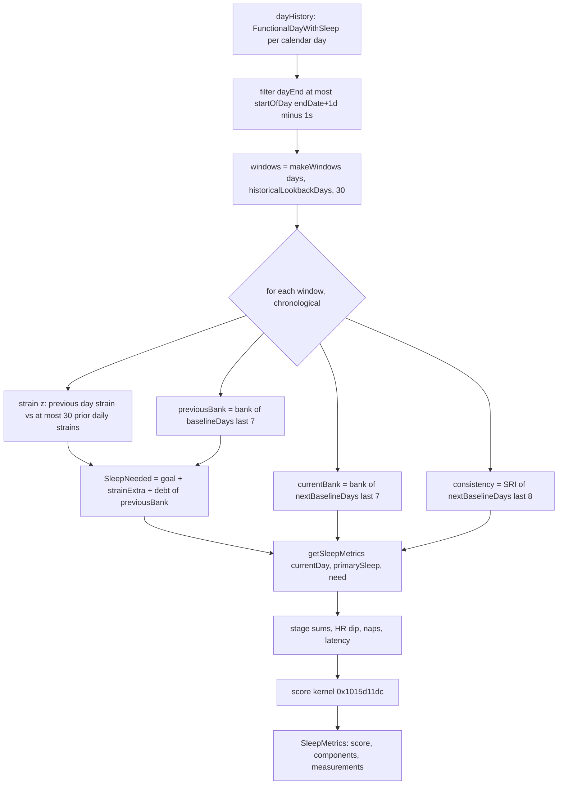

# Sleep family: Score, Bank, Consistency, Needed and goal (Bevel 3.1.7)

Scope: M03 (Sleep Score), M14 (Sleep Bank), M15 (Sleep Consistency), M16 (Sleep Needed and the automatic goal). Source: `evidence/D.md`, corrected by `evidence/R.md` (R9 goal read path, R10 edges, R3 windows) and by `evidence/B.md` (goal default 7.5 h). Source file: `Superset/SleepCalculator.swift` (string 0x10591c240).

Ghidra operator naming: `Comparable::>__infix` is `>=`, `Comparable::<__infix` is `<=`, `Comparable::<_infix` and `Date::<_infix` are strict `<`. Stubs: 0x104e57d78 `Comparable.<`, 0x104e57d84 `>=`, 0x104e57d90 `<=`, 0x104e511fc `Date.<`, 0x104e51250 `Date.==`. All boundaries below were re-checked in assembly (second-pass boundary audit in D):

| Boundary | Instruction(s) | Result |
|---|---|---|
| Day filter in calculateSleepHistory | 0x1015be9d4 `<=`(dayEnd, startOfDay(endDate+1d)-1s) | `dayEnd <= cutoff` |
| isToday flag | 0x1015bf0a0 `Date.==` | confirmed |
| HR-dip sample window | 0x1015b9afc `>=`(startDate, start), 0x1015b9bc0 `>=`(startDate, end) | `start <= startDate < end` |
| Consistency clip | 0x1015cf7e0 `>=`(dayStart, segStart) picks dayStart (max); 0x1015cf820 `<`(dayEnd, segEnd) picks dayEnd (min); 0x1015cf854 `Date.<`(a,b) required | confirmed |
| Consistency end bin | 0x1015cfcbc `Date.==`(b, dayEnd) gives 1440; `cmp x26,#0x5a0 b.ge` skip | confirmed |
| Session > 24 h | `fcmp d0,#86400; b.le` gives the normal pair painting | `<= 86400` is normal |
| Tonight history | 0x1015cc104 `>=`(day, date-30d), 0x1015cc128 `<=`(day, date-1d) | both inclusive |
| Tonight strain window | 0x1030cb480: lo = `<`-min, hi = `>=`-max, `<=`(lo,hi) precondition, `>=`(self,lo) at 0x1030cb6fc, `<=`(self,hi) at 0x1030cb714; args (date-30d, date-0d) at 0x1015dac28/0x1015dac34/0x1015dad1c | closed range |
| Continuity table | `subs x8,x0,#6; b.lo` gives 1.0; `cmp x8,#7; b.hs` gives formula | n < 6 gives 1; 6..12 table; >= 13 formula |
| Status thresholds | 0x1015d1444 `fcmp/csel gt` 0.9, `le` 0.67, `gt` 0.34, `eq` 0 | NaN gives poor |
| Age table | `cmp x0,#0x1e b.ge` (signed), then unsigned `b.hi` #0x27/#0x31/#0x3b/#0x45 | confirmed |
| Default goal by age | 0x101d79e9c: `ccmp x10,#0xa` (20..29), `cmp x0,#0x45; cinc le` (<= 69 gives 8), 60..69, 40..59, 30..39 (`lo`) | confirmed |
| Kernel | `fcsel d0,d10,d0,gt` (min 1); `fcmp d9,#0; b.ls` gives nil; clamp `gt` 100 / `ls` 0 | confirmed |
| Bank skip | `fcmp s11,#0; b.eq` | exactly 0 skipped |
| Strain multiplier / debt / extra | `fcmp s12,1; cset hi`; `fcmp s10,#0; fcsel ge`; `fcsel ls` | m > 1 only; bank < 0 only; extra >= 0 |
| Tonight caps | 0x1015cc358 `fcmp s0,s1; b.hi` (mult > 1), 0x1015cc8cc `fcsel gt` (min 3600), 0x1015ccc18 `fcsel gt` (min 60), `fcmp s0,#0; b.eq` (avgEff == 0) | confirmed |
| Dynamic goal | `cmp x24,#0x5a; ccmp x21,#0xf,#8,hs; cset lt`; high count `fcmp s9,s8; b.lt` skip (>= 67 kept); sort `fcmp s1,s0; b.pl` stop | confirmed |

## Contents

- [Types](#types)
- [Pipeline overview](#pipeline-overview)
- [Sleep Score](#sleep-score)
- [Sleep Bank](#sleep-bank)
- [Sleep Consistency](#sleep-consistency)
- [Sleep Needed and automatic goal](#sleep-needed-and-automatic-goal)
- [Task closure](#task-closure)
- [Corrections to earlier research](#corrections-to-earlier-research)

## Types

| Type (descriptor) | Fields / cases |
|---|---|
| `SleepStage` (0x105233a48) | 0 asleepUnspecified, 1 awake, 2 core, 3 deep, 4 rem, 5 inBed |
| `SleepStageSegment` (0x1052332c8) | sleepStage, startTime, endTime, source: HealthDataSource, activityScore: Float? |
| `SleepSession` (0x105233a80) | segments, inBedSegments: [DateInterval], startTime, endTime, activityScore: Float?, isPrimary, secondsInSleepStage: [SleepStage: Float], source |
| `FunctionalDay` (0x10523300c) | dayStart, dayEnd |
| `FunctionalDayWithSleep` (0x105233034) | functionalDay, primarySleep?, nextPrimarySleep?, naps |
| window tuple (0x1052ed648) | (currentDay, previousDay, baselineDays, nextBaselineDays) |
| `SleepNeeded` (0x105233afc) | sleepGoalSeconds, recentStrainNeedSeconds, sleepDebtSeconds, sleepNeededSeconds, sleepBankMinutes (all Float), sleepEfficiencyAdjustmentSeconds: Float?, timeToFallAsleepSeconds: Float? |
| `SleepMetrics` (0x105233a2c) | sleepScore: Float?, sleepHistory, metricMeasurements: [HealthMetric: MeasurementValue], sleepStageMetrics, startingSleepNeeded: SleepNeeded, scoreComponents: [SleepScoreComponent: SleepScoreComponentResult?], missingData, sessionMetadata |
| `SleepScoreComponent` (0x105233ae0) | 0 asleepRatio, 1 heartRateDipPercentage, 2 remSleepRatio, 3 deepSleepRatio, 4 sleepEfficiency, 5 sleepContinuity |
| `SleepScoreComponentResult` (0x105233ac4) | score: Float?, percentOfTarget: Float?, status |
| `SleepContributorStatus` (0x105233d78) | 0 excellent, 1 good, 2 fair, 3 poor, 4 noData |
| `SleepLatency` (0x10523162c) | value(latency: Double), lackOfValue(hasStages, hasInBedSegments) |
| `BevelBiologicalSex` (0x1052779c0) | 0 male, 1 female, 2 other (nil = byte 3) |
| `SettingsModel` (0x105237550) | `_sleepHours: Published<(hours: Int, minutes: Int)>`, `_sleepGoalCalculationMethod: Published<SleepGoalCalculationMethod>` (0 manual, 1 automatic) |
| `DynamicSleepGoalCalculationResult` (0x105244a64) | sufficientData(hours, minutes), insufficientData(hours, minutes), failed |

Function map: `calculateSleepHistory(endDate:dayHistory:historicalLookbackDays:strainHistory:sleepHistory:metricHistories:baselines:age:biologicalSex:)` async entry 0x1015be56c, body 0x1015be838 (first iteration), loop continuation 0x1015c09d0 (later iterations); `calculateSleepMetricsForDay` is inlined in those two. `getSleepMetrics(selectedDay:session:sleepNeeded:baselines:metricHistories:currentSleepBank:sleepConsistency:age:biologicalSex:isToday:)` entry 0x1015c3310, then 0x1015c3524 (four `async let`), 0x1015c3874, 0x1015c38bc, 0x1015c38e0, 0x1015c3924, 0x1015c3938 (score and metrics), 0x1015c5a40 (return). Caller chain: 0x1017d6700 (scores pipeline, span "calculateSleepHistory") to async-let child 0x1017df748 to 0x1017d92a8 to 0x1015be56c.

## Pipeline overview



## Sleep Score

### Session ingestion as the score consumes it

Main sleep versus nap: the score uses only `currentDay.primarySleep` (`getSleepMetrics` argument `session`, `x2 = selectedDay + fieldOffset(primarySleep)`, asm 0x1015bfe20). Naps never enter components; they are only added to two displayed measurements. How a session becomes primary: [ingestion.md](ingestion.md#cross-source-session-choice-and-the-primary-flag).

Overlap resolution (HealthKit session builder 0x101d7ba70, 101d7.c:10690):

1. Segments sort by 0x1015be1f8 with comparator 0x1015c93f8 (1015c.c:1891). Every non-inBed segment sorts before every inBed segment; within a class a source predicate on `HealthDataSource.metadata` (fields +0x18 > 3 and flag +0x40) decides (details in ingestion.md).
2. Resolver 0x1015cb390 (1015c.c:5547) walks the sorted list. A segment that overlaps nothing accepted is inserted whole. An overlapping segment is cut by 0x1015ca840 (1015c.c:5068) so only the gaps not already covered are kept. Earlier-sorted segments always win.
3. A kept piece with stage `inBed` (5) is rewritten: it becomes awake (1) if the session has any non-inBed segment, or asleepUnspecified (0) if the session is inBed-only (`local_1cc = firstNonInBedIndex != count`, 1015c.c:5547 near `if (*pcVar13 != '\x05')`). `activityScore` becomes nil.
4. `session.segments` is this resolved list. `secondsInSleepStage[stage]` is the per-stage sum of `end - start` over it. Raw inBed segments go separately to `inBedSegments` via 0x101d7dc58 (filter `stage == 5`, 101d7.c:7666), only when the session has non-inBed segments.

So for HealthKit-built sessions `segments` and `secondsInSleepStage` never contain `.inBed`. In-bed time not covered by staged data counts as awake (staged session) or asleepUnspecified (in-bed-only session). Google sessions bypass this resolver: `FUN_101478370` copies the stages as supplied, keeps the whole session as `inBedSegments`, and its `secondsInSleepStage` never contains inBed either (A).

### Score-side preprocessing

`trimAwakeEdges` 0x1015d0b4c (1015d.c:1): returns `segments[first..last]` where first and last are the first and last segments whose stage is not awake. Leading and trailing awake segments are dropped. A nil session or an all-awake session gives an empty list.

Stage sums 0x1015d0f14 (1015d.c:174), on the trimmed list, Float32 accumulation, `dur = Float(end.timeIntervalSince(start))`:

```ts
type Sums = { total, asleep, awake, core, deep, rem, unspecified: number; interruptions: number };
function stageSums(session?: SleepSession): Sums {
  const s = zeros();
  for (const seg of trimAwakeEdges(session)) {            // no merging; overlaps (if any) are double-counted
    const d = seconds(seg.end - seg.start);
    s.total += d;
    if (seg.stage === AWAKE) { s.awake += d; s.interruptions += 1; continue; }
    s.asleep += d;                                          // includes inBed(5) if one ever survived upstream
    if (seg.stage === CORE) s.core += d; else if (seg.stage === DEEP) s.deep += d;
    else if (seg.stage === REM) s.rem += d; else if (seg.stage === UNSPECIFIED) s.unspecified += d;
  }
  return s;
}
```

Short awakenings: nothing merges or ignores them. Every interior awake segment counts as one interruption whatever its length; there is no minimum duration. Edge awake segments are removed by the trim. `hasStages` = `session.segments` contains any core, deep or REM segment (0x10171df70, 10171.c:10410, `stage - 2 < 3`).

### Component inputs (0x1015c3524 and 0x1015c3938; asm 0x1015c396c-0x1015c3a54)

```ts
const s = stageSums(session);                          // session = currentDay.primarySleep
const need = sleepNeeded.sleepNeededSeconds;           // SleepNeeded +0xc (see Sleep Needed)
const awakeFrac = s.total === 0 ? 0 : s.awake / s.total;
const asleepRatio = need === 0 ? 0 : s.asleep / need;                                      // never nil
const deepRatio = (!session || !hasStages(session)) ? null : (need === 0 ? 0 : s.deep / need);   // divided by NEED, not by asleep
const remRatio  = (!session || !hasStages(session)) ? null : (need === 0 ? 0 : s.rem  / need);
const hrDip     = hrDipPercentage(day, metricHistories, baselines);                        // may be null
const efficiency = 1 - awakeFrac;                                                          // never nil
const continuity = continuityFactor(s.interruptions);                                      // never nil
```

Continuity factor 0x1015d1174 (1015d.c:147), table at 0x104f94670 (Float32):

```ts
function continuityFactor(n: number): number {
  if (n < 6) return 1.0;
  if (n <= 12) return [0.98, 0.95, 0.91, 0.86, 0.80, 0.73, 0.65][n - 6];
  return Math.max(0.4, (n - 12) * -0.05 + 0.65);       // f32: 0xbd4ccccd, 0x3f266666, 0x3ecccccd (fmaxnm)
}
```

### Kernel 0x1015d11dc (1015d.c:657, asm verified)

Input order `[asleepRatio, deepRatio, remRatio, hrDip, efficiency, continuity]` (Float32?).

| idx | component | target (f64) | exponent | weight |
|---|---|---|---|---|
| 0 | asleepRatio | 1.0 | 3 | 0.35 |
| 1 | deepRatio | 0.125 default, or table | 2 | 0.20 |
| 2 | remRatio | 0.2 | 2 | 0.20 |
| 3 | hrDip | 0.255 default, or table | 3 | 0.10 |
| 4 | efficiency | 0.97 | 15 | 0.075 |
| 5 | continuity | 1.0 | 10 | 0.075 |

Constants: targets at 0x104f94420 (0.97, 1.0), 0.2 at 0x104ebe498, 0.255 at 0x104f943b0, 0.125 = `fmov d0,#0.125`; weights at 0x104f94430 (0.35, 0.2, 0.2, 0.1) plus `0x3fb3333333333333` = 0.075 twice; exponents at 0x104f801f0 and 0x104f94450 (3, 2, 2, 3, 15, 10).

```ts
function sleepScore(c: (number|null)[], age: number|null, sex: 0|1|2|null): number|null {
  if (c.length > 0 && c[0] !== null && c[0] === 0) return null;     // asleepRatio exactly +/-0 gives no score
  const t = targets(age, sex);                                        // [1, deep, 0.2, hrDip, 0.97, 1]
  let num = 0, den = 0;
  c.forEach((x, i) => { if (x === null) return;                       // missing component dropped
    const v = Math.min(1, Math.pow(x / t[i], EXP[i]));                // f64 pow; NaN passes through
    num += W[i] * v; den += W[i]; });
  if (!(den > 0)) return null;
  return clamp(Math.fround(num * 100 / den), 0, 100);                 // f32 result
}
```

Consequences: no session, zero asleep time or `sleepNeededSeconds == 0` all give asleepRatio 0 and so a nil score. Reaching 80 % of need gives 0.8^3 = 0.512 for the duration component. A nil score makes 0x1015c09d0 set `missingData = [.sleepMissingInputs]` (HealthMissingData case 7).

### Per-sex and per-age targets (M03.04; helper 0x1015be43c, 1015b.c:6295, asm verified)

Inputs `x0 = age` (signed Int), `w1 = (sex == male)`, `d0 = 0.2` passed through as REM. Returns deep (d0), REM (d1), HR dip (d2).

| age | deep male | deep female | HRdip male | HRdip female |
|---|---|---|---|---|
| < 30 (signed; includes negative) | 0.15 | 0.15 | 0.30 | 0.30 |
| 30-39 | 0.13 | 0.14 | 0.28 | 0.29 |
| 40-49 | 0.12 | 0.13 | 0.27 | 0.28 |
| 50-59 | 0.11 | 0.12 | 0.26 | 0.27 |
| 60-69 | 0.10 | 0.11 | 0.25 | 0.26 |
| >= 70 | 0.09 | 0.10 | 0.24 | 0.25 |

REM is always 0.2. The helper is called only when `ageIsNil == false && sex < 2`. Otherwise (age nil, sex `other` (2), or sex nil (byte 3)) the kernel uses deep 0.125, REM 0.2, HR dip 0.255. The caller 0x1017d6700 (1017d.c:11662): `age = Calendar.current.dateComponents([.year], from: profile.birthday, to: Date())` (0x10310e084, 10310.c:12515), i.e. age NOW, not at the scored day; nil without a birthday or profile. `sex = SharedUserProfile.biologicalSex` (nil is byte 3); `fallbackSex` (HealthKit) is NOT used; without a profile sex = 3.

### HR dip producer (M03.03; async-let child 0x1015d19f8 to 0x1015c5bf8 to 0x1015d23a0 to 0x1015d249c, 1015d.c:1502)

```ts
function hrDipPercentage(day, metricHistories, baselines) {
  const samples = metricHistories[4] ?? [];             // key 4 = HR minute aggregates (HealthQuantitySampleWithStage[])
  // window strategy list [1] (0x1060b8cb0): [primarySleep.startTime, primarySleep.endTime]; nil sleep gives [dayStart, dayStart] (empty)
  // 0x1015b9928: binary search on sample.startDate: keep start <= startDate < end (both bounds via >=)
  // then keep samples whose context is in {remAndDeepSleep(1), otherSleep(0)} (group list 0x1060b8d00 = [[1,0]])
  const hr = filtered.map(s => Math.fround(s.doubleValue));
  const sleeping = hr.length ? mean(hr) : null;         // 0x10183bdc0 Float32 mean
  const base = baselines.baselines[startOfDay(day.functionalDay.dayStart)]?.[4]?.average ?? null;   // CalculatedMetric.inactiveHeartRate (awake histogram metric)
  const pct = (sleeping !== null && base !== null) ? Math.max(0, 1 - sleeping / base) : null;
  return { restingBpm: base, sleepingBpm: sleeping, percentage: pct };
}
```

No `base == 0` guard exists (result is `inf` or `NaN`; NaN passes through `max`, see the kernel). A Published value read at the start of 0x1015d249c (singleton 0x106a10528, keypath 0x104f94600) is never used afterwards. The tagging of samples is described in [shared-machinery.md](shared-machinery.md#r5-heart-rate-stream-per-consumer-and-sample-labelling) (R5 confirms: Sleep Score HR dip reads key 4 with per-sample tags in {0,1} inside the primary sleep `[start, end)`; baseline = inactiveHR).

### Presentation (0x1015c3938, 0x1015d1444, 1015d.c:332)

For each component: `score` = the raw input value (not the curve). `percentOfTarget = powf(value / target, exp)` in Float32 and NOT clamped. `status` from percentOfTarget: `> 0.9` excellent, `> 0.67` good, `> 0.34` fair, otherwise poor, noData when exactly 0. A nil input stores a nil result (status byte 5 is the Optional nil). The asleepRatio entry is built inline with the same thresholds (`powf(ratio, 3)`).

Metric measurements written per day (HealthMetric to singleValue):

- sleepScore = kernel output. sleepBank = `currentSleepBank`. sleepConsistency = SRI.
- sleepEfficiency = `(1 - awakeFrac) * 100`.
- timeInBedMinutes = `(session ? end - start : total)/60 + napTotalSeconds/60`.
- timeAsleepMinutes = `asleep/60 + napAsleepSeconds/60` (nil when 0).
- timeRem/DeepSleepMinutes = `rem/60`, `deep/60` (nil when no stages).
- heartRateDip = `max(0, pct) * 100`.
- sleepTime / wakeTime = minutes from `currentDay.dayStart` to the first / last non-awake segment start / end (0x1015d1564; fallback session start/end via 0x10171d7f8).
- timeToFallAsleep = latency minutes (0x1015d1780: when `hasStages && !inBedSegments.isEmpty`, `(firstNonAwakeSegment.start - session.startTime)/60`, else nil).

Nap sums come from a task group over `currentDay.naps` (0x1015c5fa0, per-nap 0x1015c3250 to 0x1015d0f14, accumulator 0x1015c3050). `sleepStageMetrics` = [awake, core, deep, rem, unspecified] (percentage of total, seconds). Previous SleepMetrics are kept as a rolling <= 30-entry list (0x1015ccf74, 0x1015d18a0) but never read during calculation (dead state).

Rounding for display: 0 decimals half-even for scores (shared-machinery G09); minute metrics via `formatDuration`.

## Sleep Bank

### Day list and windows

`dayHistory` is one FunctionalDayWithSleep per consecutive functional day (generator 0x1030defb0). A night with no sleep is a day with `primarySleep == nil`. 0x1015be838 first keeps days with `functionalDay.dayEnd <= startOfDay(endDate + 1 day) - 1 second` (asm 0x1015be944-0x1015be9d4). `makeWindows(days, count = historicalLookbackDays, lookback = 30)` (0x1015b9360, 1015b.c:5255) produces for each of the last `clamp(count, 1, n)` indices i (chronological): `currentDay = days[i]`; `previousDay = days[max(i,1)-1]`; `baselineDays = days[max(i-30,0) ..< max(i,1)]` (for i = 0 this is `[days[0]]` itself); `nextBaselineDays = days[max(i-29,0) ... i]`.

### Two banks per day (asm 0x1015bf300-0x1015bf408, 0x1015c1588-0x1015c1680)

```ts
const goalHours = Math.fround(settings.sleepHours.minutes / 60 + settings.sleepHours.hours);
const previousBank = bank(w.baselineDays.slice(-7), goalHours);      // days i-7..i-1: feeds SleepNeeded.sleepBankMinutes and debt
const currentBank  = bank(w.nextBaselineDays.slice(-7), goalHours);  // days i-6..i: HealthMetric.sleepBank shown for day i
```

### Kernel 0x1015cd324 (1015c.c:5992, asm 0x1015cd9ec-0x1015cdab0)

```ts
const STAGES_NO_AWAKE = [0, 2, 3, 4, 5];            // static array 0x1060b8b58/0x1060bfa60 = allCases minus awake(1)
const sessSecs = (s?: SleepSession) => s ? sum(STAGES_NO_AWAKE.filter(k => k in s.secondsInSleepStage).map(k => s.secondsInSleepStage[k])) : 0;
function bank(days: FunctionalDayWithSleep[], goalHours: number): number {
  const totals = days.map(d => sum(d.naps.map(sessSecs)) + sessSecs(d.primarySleep));    // f32
  let out = 0;
  totals.forEach((t, j) => { if (t === 0) return;       // zero/missing night: no contribution, slot still consumed
    out += ((t - goalHours * 3600) / 60) * Math.exp(0.3 * (j - 6)); });   // expf, f32; j counts from the OLDEST element
  return out;                                            // minutes, unclamped
}
```

Weights for j = 0..6: 0.165299, 0.223130, 0.301194, 0.406570, 0.548812, 0.740818, 1.0. With fewer than 7 days (first days of history) the newest day does NOT get weight 1; with 3 days the weights are e^-1.8, e^-1.5, e^-1.2.

### Goal, naps, missing nights (M14.02, M14.03)

- Goal: the current `SettingsModel.sleepHours` (Published keypath 0x104f94480 on singleton 0x106a10688; confirmed SettingsModel by the flow-VM init at 10207.c:10459). Read once per `calculateSleepHistory` run and applied to every past day. There is NO goal history: a goal change re-scores all history.
- Naps are included. Each day's total = sum over naps plus primarySleep of the `secondsInSleepStage` excluding awake. `nextPrimarySleep` is ignored. inBed would count if the dictionary held it (never for HealthKit sessions or Google sessions).
- A missing night (`primarySleep == nil` and no naps, or total exactly 0) is skipped: no credit, no debt, positional weight slot kept. A day with only naps counts its nap seconds against the full goal. If the upstream list were sparse the slot alignment would shift (the generator returns a contiguous list).
- Debt use: `SleepNeeded.sleepDebtSeconds = previousBank < 0 ? previousBank * -60 * 0.25 : 0`. A positive bank never lowers need.
- Display: sleepBank is shown through the minutes formatter (`formatDuration(seconds: v*60)`).

## Sleep Consistency

Call: `sri = consistency(days = nextBaselineDays.suffix(8).dropFirst(), anchorSleep = nextBaselineDays.suffix(8).first?.primarySleep)` (asm 0x1015bf43c-0x1015bf5fc). Function 0x1015cdbb4 (1015c.c:9100):

```ts
function consistency(days: FunctionalDayWithSleep[], anchor: SleepSession|null): number|null {
  const D = days.filter(d => d.primarySleep != null);
  if (D.length < 2) return null;
  const cal = Calendar.current;                                         // device time zone at compute time
  const long: SleepSession[] = [];                                      // sessions with (end - start) > 86400 s
  if (anchor && dur(anchor) > 86400) long.push(anchor);
  for (const d of D) if (dur(d.primarySleep) > 86400) long.push(d.primarySleep);
  const prev = [anchor, ...D.slice(0, -1).map(d => d.primarySleep)];   // previous FILTERED day's sleep, not previous calendar day
  const k = new Array(1440).fill(0); let N = 0;
  D.forEach((d, idx) => {
    const start = d.functionalDay.dayStart;
    const end = cal.date(byAdding: .day, value: 1, to: start); if (!end) return;     // 23 or 25 h on DST days
    N++;
    const mark = new Array(1440).fill(false);
    const paint = (s: SleepSession) => { for (const seg of s.segments) {
        if (!(seg.stage < 5 && seg.stage !== 1)) continue;              // asleepUnspecified, core, deep, rem only
        const a = max(start, seg.start), b = min(end, seg.end);         // >= and <= picks
        if (!(a < b)) continue;
        const m0 = hour(a) * 60 + minute(a);                            // cal.dateComponents([.hour,.minute]); seconds truncated
        if (m0 >= 1440) continue;
        const m1 = (b == end) ? 1440 : hour(b) * 60 + minute(b);
        if (m1 <= m0) continue;                                         // wrap or DST fold: nothing marked
        for (let m = m0; m < m1; m++) if (!mark[m]) { mark[m] = true; k[m]++; } } };
    for (const s of [prev[idx], d.primarySleep]) if (s && dur(s) <= 86400) paint(s);
    for (const s of long) paint(s);                                     // > 24 h sessions painted on every day
  });
  if (N < 2) return null;
  let agr = 0; for (const km of k) agr += km * (km - 1) + (N - km) * (N - km - 1);   // Double
  return Math.fround(agr / ((N - 1) * N) / 1440 * 100);
}
```

- Included days: up to the 7 most recent days of the window that have a primarySleep. N counts them. All 1440 bins are scored on every included day, so a day with sleep but no qualifying segment in its window counts as fully awake.
- Bins use wall-clock `hour*60+minute` from `Calendar.current` (time zone at compute time). Day windows are `[dayStart, dayStart + 1 calendar day)`.
- Spring-forward (23 h): the missing hour gets no clock minutes, but a segment spanning it marks the whole index range including the missing hour. Fall-back (25 h): repeated clock minutes map to the same bins; each bin counted once per day via `mark`; a segment whose clipped end clock-minute is <= its start clock-minute marks nothing. An end clipped exactly at the day end maps to bin 1440 (exclusive). This only works if `dayStart` is local midnight; otherwise a sleep crossing midnight gives `m1 < m0` and is skipped.
- Only `primarySleep` sessions are used (current day's plus previous included day's, the anchor for the first). Naps never. `nextPrimarySleep` not used. The formula is the plain agreement percentage (no `2a-1` transform).

## Sleep Needed and automatic goal

### Per-day SleepNeeded used by the score (asm 0x1015bfd30-0x1015bfdd4; 0x1015c09d0 repeats it)

```ts
const goal = Math.fround((sleepHours.minutes / 60 + sleepHours.hours) * 3600);
const prevStrain = strainHistory[w.previousDay.functionalDay]?.score;          // dict lookup 0x1017ff48c
const stats = meanStd(recentStrains);       // 0x10183bdc0: non-nil values, f32 mean, POPULATION std = sqrt(sum((x-mu)^2) / n)
let mult = 1, valid = false;
if (stats && prevStrain != null) { const z = stats.std === 0 ? 0 : (prevStrain - stats.mean) / stats.std; mult = 1 + 0.02 * z; valid = true; }
const m = (valid && mult > 1) ? mult : 1;
const strainExtra = Math.max(0, m * goal - goal);
const debt = previousBank < 0 ? previousBank * -60 * 0.25 : 0;
need = { sleepGoalSeconds: goal, recentStrainNeedSeconds: strainExtra, sleepDebtSeconds: debt,
         sleepNeededSeconds: debt + (goal + strainExtra), sleepBankMinutes: previousBank,
         sleepEfficiencyAdjustmentSeconds: null, timeToFallAsleepSeconds: null };
```

`recentStrains`: first window = the strains of `baselineDays` (<= 30 days ending with previousDay; 0x1015ccc84). Each next iteration appends the current day's strain; when the list already holds 30, the oldest drops first (0x1015c0c38 `cmp #0x1e`). This is a rolling <= 30-day list ending with the previous day. `0.02` = `0x3ca3d70a`. Strain values are the Strain family's raw scores (see [strain-load.md](strain-load.md); they are on the open-ended 0 to about 128.8 scale, not 0-21, which matters for z-scores only through relative values).

### Goal setting, defaults and read path (M16.03; R9)

- `SettingsModel` init (0x101936a94; asm 0x101936b9c / 0x101936ba4) loads `sleepHours` from key enum 0xc through 0x1019383e0 (10193.c:5217). R9: the getter calls the `UserDefaultsServiceProtocol` witness +0x10 with `SettingsUserDefaultsKeys(12)` (raw value at 0x106112260 = `health_settings.sleep_goal_key`), conformance 0x104ff017c, witness table 0x106113060 (+0x10 = `FUN_101dd5ed0` to `FUN_101dd8b14` to `FUN_101b98e54` to `FUN_101b98028`), which is `objectForKey(key) == nil ? nil : Float(floatForKey(key))`. A missing value becomes 7.5 h (asm 0x1019384e4 `and x8,x19,#0xff00000000; cmp x8,#0x100000000; fmov s1,#7.5; fcsel s8,s1,s0,eq`; `fcsel` at 0x1019384f8). The init converts with 0x101939510 (10193.c:6061): `hours = floor(h)` (frintm), `minutes = round_half_away((h - floor(h)) * 60)` (frinta). For 7.5 this gives (7, 30). The method is read from key 0xd (string): `"automatic"` is automatic, anything else or missing is manual.
- The calculators never read the method: SleepCalculator, the tonight planner and the bank read only `sleepHours`. Method keypaths appear only in SettingsModel init/persistence (0x101936a94), DynamicSleepGoalService (0x101d79cb8) and the settings and customization view models (patterns 0x105008068, 0x105007e50, 0x105081858).
- The tonight planner reads the same Published value (R9): `TonightSleepNeededService` combines `settings.$sleepHours` (`FUN_101d7e544`) and calls `calculateSleepNeeded` 0x1015cc358.
- With no saved goal every consumer sees (7 h, 30 min) = 27000 s:

| Consumer | Read site | Value with no saved goal |
|---|---|---|
| Sleep Score need | Published get, keypath 0x104f94480, asm 0x1015beb14-0x1015bebc8; goal = (30/60 + 7)*3600 at 0x1015bfd34-0x1015bfd64 | 27000 s goal; need = 27000 + strainExtra + debt |
| Sleep Bank (both) | same `goalHours`, asm 0x1015bf3c0-0x1015bf3e8 to 0x1015cd324 | 7.5 h |
| Sleep Needed, per-day `startingSleepNeeded` | same as the score | 27000 s |
| Sleep Needed, tonight (0x101d7ece0 to 0x1015cc358) | `(hours, minutes)` tuple from `SettingsModel.sleepHours`; `(min/60 + h)` at 101d7.c:10439 | 7.5 h |
| Energy Bank | 0x101542f80 reads the same Published property (keypath 0x104f91828: hours at +0x6b8, minutes at +0x6d0) | (7, 30) |

- Onboarding (`OnboardingViewModel`, 0x101af957c to 0x101d79a90 to 0x101d79ab0 / 0x101d79b30 / 0x101d79cb8): `sleepHours = defaultGoalByAge(age)` (age from HealthKit birthday, now); defaults key 0xc gets the Float hours; method key 0xd = "automatic". The 7.5 h default applies only if that path never ran.

```ts
function defaultGoalByAge(age: number|null) {          // 0x101d79e9c, 101d7.c:5324
  if (age == null || (age >= 20 && age <= 29)) return [8, 0];
  if (age >= 30 && age <= 39) return [7, 45];
  if (age >= 40 && age <= 59) return [7, 30];
  if (age >= 60 && age <= 69) return [7, 15];
  return age < 70 ? [8, 0] : [7, 0];                   // < 20 (incl. negative) gives 8:00; >= 70 gives 7:00
}
```

### Automatic goal estimator (DynamicSleepGoalService)

Entry 0x101d797ec; data load 0x101d79804 to 0x101d763ec / 0x101d76720 / 0x101d75518; input shaping 0x100c0088c; estimator 0x101d78fbc to 0x101d79054 (101d7.c:6636). Input: 0x1030defb0(180, date) builds 180 consecutive functional days; `0x1015b9360(days, 120, 60)` builds windows for the LAST 120 days (60-day baseline lookback); recovery is computed per window with `calculateRecoveryMetricsForDay(..., ignoreSleepScore: true)` (`mov w6,#1` at 0x101d75cac; `isToday` from `Date.==` at 0x101d75c88; fresh `HealthDataBaselines` 0x10158bf80); the result dictionary `[FunctionalDay: (primarySleep, recovery)]` becomes an array sorted ascending by `dayStart` (comparator 0x100c01d90, `Date.<`).

```ts
function dynamicGoal(items /* chronological */): Result {
  const pairs = [];
  for (const it of items) {
    if (!it.recovery || it.recovery.recoveryScore == null) continue;
    if (!it.primarySleep) continue;
    const vals = STAGES_NO_AWAKE.filter(k => k in it.primarySleep.secondsInSleepStage).map(k => it.primarySleep.secondsInSleepStage[k]);
    if (vals.length === 0) continue;                    // empty dictionary: skip; a zero total is KEPT
    pairs.push({ r: it.recovery.recoveryScore, s: Math.fround(sum(vals)) });
  }
  const last = pairs.slice(-90);                        // 0x101d72cb8 = Sequence.suffix(90) (ring buffer), NOT prefix
  const sorted = stableSort(last, (a, b) => a.r > b.r); // 0x101d72880: Swift stable merge sort, descending; ties keep chronological order
  const k = Math.trunc(last.length * 0.15);             // f64 multiply, fcvtzs
  if (k === 0) return 'failed';
  const mean = Math.fround(sum(sorted.slice(0, k).map(p => p.s)) / k);
  const secs = roundHalfAwayFromZero(mean);             // 0x1030d5a84 frinta; non-finite gives failed
  const total = secs + 30;
  const high = items.filter(it => it.recovery && it.recovery.recoveryScore != null && it.recovery.recoveryScore >= 67).length;   // ALL input, sleep not required
  if (high === 0) return 'failed';
  const hours = Math.trunc(total / 3600), minutes = Math.trunc(total / 60) % 60;
  return (last.length >= 90 && high >= 15) ? { sufficientData: { hours, minutes } } : { insufficientData: { hours, minutes } };
}
```

With 90 eligible days k = 13. Because of the 120-day window, 90 eligible days needs at least 90 of the last 120 days with both sleep and a recovery score. The estimator runs only when the user opens the settings sleep-goal flow (`SettingsSleepGoalFlowViewModel` 0x10207cdcc sets `.calculating` then `.finished(result)`); no background re-estimation path exists in the binary. `failed` provides no value; `insufficientData` still carries hours and minutes and the view presents it; applying it writes `sleepHours`. The automatic estimator writes `hours + minutes/60` to the goal key (0x101d79b30).

### Tonight planner (M16.05; `TonightSleepNeededService`, compute 0x101d7ece0 (101d7.c:10147) to `calculateSleepNeeded` 0x1015cc358 (1015c.c:4484))

Every caller passes `includeAdjustments = true` (0x1008f2238, 0x101d71bc0, 0x101d7ece0).

```ts
function tonightSleepNeeded(date, items, sleepHours) {
  const today = items.sleepMetrics.find(e => e.day.dayStart == date);
  const bank = today?.metrics.metricMeasurements[8 /*sleepBank*/]?.value ?? 0;    // = currentBank (includes last night)
  const z = strainZ(items.strainMetrics, date);   // 0x1015da8d4: strains whose startOfDay(day) lies in the CLOSED range [date-30d, date]
                                                  // (0x1030cb480: `>=` lo at 0x1030cb6fc, `<=` hi at 0x1030cb714), so today's strain is inside its own mean/std;
                                                  // today's strain = entry with day == date; z = (today - mean) / popStd, std == 0 gives 0; nil if missing
  const hist = items.sleepMetrics.filter(e => e.day.dayStart >= date - 30d && e.day.dayStart <= date - 1d);   // 0x1015cbedc
  return calculateSleepNeeded(goalHours(sleepHours), bank, z, hist, true);
}
function calculateSleepNeeded(goalHours, bankMin, z, hist, adjust) {
  const goal = goalHours * 3600;
  const m = (z == null) ? 1 : Math.max(1, 1 + 0.02 * z);
  const strain = Math.max(0, goal * m - goal);
  const debt = bankMin < 0 ? bankMin * -60 * 0.25 : 0;
  const base = debt + goal + strain;
  if (!adjust) return { goal, strain, debt, needed: base, bank: bankMin, eff: null, lat: null };
  const effs = hist.map(h => h.metricMeasurements[17 /*sleepEfficiency %*/]).filter(nonNil);
  const avgEff = effs.length ? mean(effs) : 100;
  let effAdj = avgEff === 0 ? 0 : base / (avgEff / 100) - base;
  effAdj = Math.min(effAdj, 3600);                       // capped at 1 h; no lower clamp
  const lats = hist.map(h => h.metricMeasurements[18 /*timeToFallAsleep min*/]).filter(nonNil);
  const latAdj = lats.length ? Math.min(mean(lats), 60) * 60 : 0;    // capped at 60 min
  return { goal, strain, debt, needed: base + effAdj + latAdj, bank: bankMin, eff: effAdj, lat: latAdj };
}
```

Naps are handled only through the bank (naps count as sleep in the 7-day bank); there is no separate nap subtraction. The efficiency and latency adjustments are NOT in the per-day need used by the score.

### Inputs from Google or other non-HealthKit builders

Google sessions have no `.inBed` in `secondsInSleepStage`, so the bank and estimator do not double count; Google's whole session is `inBedSegments`, which affects `timeToFallAsleep` (requires `hasStages && inBedSegments nonempty`, so with Google stage sessions latency is `firstNonAwakeSegment.start - session.startTime`). A Google classic session (only asleepUnspecified) has no stages: deep/REM components are dropped and the HR-dip and others are used.

## Task closure

| Task | Status | Where |
|---|---|---|
| M03.01 stage overlap / short awakenings | RESOLVED | [Sleep Score](#sleep-score) |
| M03.02 efficiency / continuity producers | RESOLVED | [Sleep Score](#sleep-score) |
| M03.03 HR dip baseline / window | RESOLVED | [Sleep Score](#sleep-score) |
| M03.04 unknown sex/age behaviour at callers | RESOLVED | [Sleep Score](#sleep-score) |
| M14.01 slot / day alignment | RESOLVED | [Sleep Bank](#sleep-bank) |
| M14.02 goal history and naps | RESOLVED (no goal history; naps included) | [Sleep Bank](#sleep-bank) |
| M14.03 missing-night semantics | RESOLVED | [Sleep Bank](#sleep-bank) |
| M15.01 eligible bins and included days | RESOLVED | [Sleep Consistency](#sleep-consistency) |
| M15.02 timezone / DST | RESOLVED | [Sleep Consistency](#sleep-consistency) |
| M15.03 main / naps / all sleep | RESOLVED | [Sleep Consistency](#sleep-consistency) |
| M16.01 automatic goal producer ordering and history span | RESOLVED | [Sleep Needed and automatic goal](#sleep-needed-and-automatic-goal) |
| M16.02 inBed duration presence and deduplication | RESOLVED | same |
| M16.03 manual / automatic settings and fallback | RESOLVED (7.5 h, R9) | same |
| M16.04 goal calibration recovery preprocessing | RESOLVED (`ignoreSleepScore = true`) | same |
| M16.05 latency / efficiency and nap handling | RESOLVED | same |

## Corrections to earlier research

1. Bank weights `exp(0.3*(i-6))` are right for 7 slots, but alignment is from the OLDEST element, so shorter windows shift every weight down. Two banks per day: previous (feeds debt and `sleepBankMinutes`) and current (the displayed bank). Naps are included; the stage set excludes only awake.
2. Dynamic goal: `suffix(90)` (most recent 90 eligible days from the last 120) over a chronologically ascending input, not a prefix. A zero sum is still eligible; only an empty non-awake key set excludes a day.
3. inBed is converted away before the dictionary is built (HealthKit path), so no double counting.
4. `strainExtra = goal*(max(1, mult) - 1)`: equivalent, but mult is used only when the z-score is valid. Score path: previous day's strain against a <= 30-day rolling population mean and std. Tonight path: today's strain against the closed range [date-30d, date], which includes today.
5. Debt: the score path uses the PREVIOUS 7-day bank; the tonight path uses the CURRENT bank stored on today's metrics. Efficiency and latency adjustments (caps 1 h and 60 min) exist only on the tonight path.
6. A missing goal reads as 7.5 h, not 0 (B and D agree; R9 confirms the read path).
7. Consistency: eligibility, DST and main/nap handling are now fully specified; the formula is the agreement percentage.
