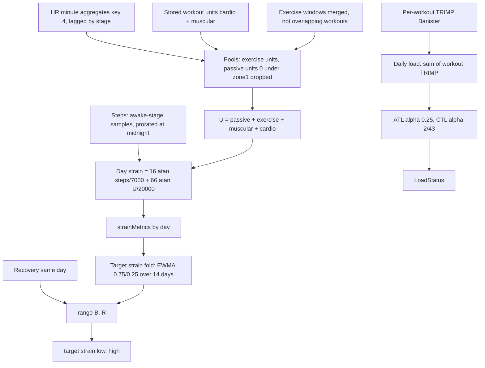
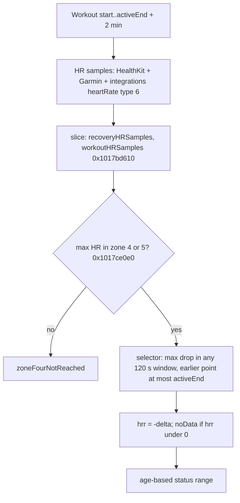

# Strain, Cardio Load, Target Strain and Heart Rate Recovery (Bevel 3.1.7)

Scope: M02 (Daily Strain), M07 (Cardio / Training Load), M17 (Target Strain), M18 (Heart Rate Recovery). Source: `evidence/E.md`, corrected by `evidence/R.md` (R3 day S, warm-up, seed lengths; R4 presentation; R5 HR streams; R10 edges) and the orchestrator assembly checks.

Assembly verified by the orchestrator ("verified in assembly"):

- Strain at 0x1015dc6b8 and 0x1015dcb50-0x1015dcc2c: `16*atan(steps/7000) + 66*atan(U/20000)`, Float32.
- EPOC `exp(4*...)`, 0.3, 0.7, 0.85 at 0x1017cc54c (see [other-calculators.md](other-calculators.md)).

Zone-weight table: the check-DEF "mismatch" on this table is a false alarm. Zone 1 is the inline constant `(2, 2)` at 1015d.c:4423 (`0x4000000040000000`), so the table `(0,1) (2,2) (3,4) (4,7) (7,12) (12,20)` below is correct.

Ghidra mislabels Swift comparisons: `_$sSL2geoi...` is `>=`, `_$sSL2leoi...` is `<=`, `_$sSL1loi...` is `<`, `_$sSL1goi...` is `>`; `Date.<` and `Date.>` stubs are `_$s10Foundation4DateV1loi...` / `1goi...`. Float gates were checked against `fcmp` plus condition code. Calendar helper stubs (`Calendar.current.date(byAdding:...)`): 0x1030cbe40 = +N days, 0x1030cbe4c = -N days, 0x1030cbe58 +N hours, 0x1030cbe64 -N hours, 0x1030cbe70 +N minutes, 0x1030cbe7c -N minutes, 0x1030cbe88 +N s, 0x1030cbe94 -N s (`b 0x1030cba00` add / `b 0x1030cbc20` subtract). `0x1030d5a84(Float) -> Int?` = `Int(x.rounded(.toNearestOrAwayFromZero))`, nil when non-finite (`frinta`). `0x1030d6870(x)` = `round_half_away(x*10)/10`.

## Contents

- [Types and enums](#types-and-enums)
- [Pipeline overview](#pipeline-overview)
- [Daily Strain](#daily-strain)
- [Workout-level units and TRIMP](#workout-level-units-and-trimp)
- [Cardio Load](#cardio-load)
- [Target Strain](#target-strain)
- [Cumulative metrics replay](#cumulative-metrics-replay)
- [Heart Rate Recovery](#heart-rate-recovery)
- [Presentation of strain](#presentation-of-strain)
- [Zone settings derivation](#zone-settings-derivation)
- [Task closure](#task-closure)
- [Corrections to earlier research](#corrections-to-earlier-research)

## Types and enums

- HealthQuantityType index: 4 heartRateMinuteAggregates, 5 heartRateSamples, 8 restingEnergyBurnedDisplay, 9 activeEnergyBurnedDisplay, 21 steps, 22 stepsDisplay.
- `SampleContextType` (the "stage" of every `HealthQuantitySampleWithStage`): 0 otherSleep, 1 remAndDeepSleep, 2 workout, 3 mindfulness, 4 awake, 5 exercise.
- `StrainZone`: 0 resting, 1 to 5 zone1 to zone5. `HeartRateZoneSettings`: `zone1..zone5` are 24-byte `HeartRateZoneSetting {zone: u8 @0, bpmLowest: f32 @4, id: String @8}` at offsets 0, 0x18, 0x30, 0x48, 0x60; `maxHR: f32` at +0x78. So `bpmLowest` of zone k is at +4, +0x1c, +0x34, +0x4c, +0x64.
- `LoadStatus`: 0 calibrating, 1 detraining, 2 maintaining, 3 peaking, 4 productive, 5 fatigued, 6 overtraining.

## Pipeline overview



## Daily Strain

Entry: `HealthDataLoader.calculateHealthMetrics` 0x1017d6700 to `calculateStrainHistory` (0x1017d43dc tracing wrapper) to 0x1017d91f8 (witness thunk; `workoutInputs.recordedWorkouts = [x3]`, `exerciseSegments = [x3+0x20]`) to `StrainCalculator.getWorkoutMetrics(metricHistories:selectedDay:workoutInputs:isToday:)` 0x1015d2f78 to 0x1015d36f4. Steps: 0x1015bcbdc (key 0x15). HR: slices of `histories[heartRateMinuteAggregates]`; clip 0x1015afa30; map 0x1015d97fc; segments 0x1015da0e0 / 0x1015dbbcc. Zones: `HeartRateZonesService.settings(for: dayEnd)` 0x10191f810 to 0x10192344c. Score: `StrainCalculator.calculateDayStrainScore(workouts:exerciseHeartRateSessions:passiveHeartRateSegments:totalSteps:zoneSettings:isToday:)` 0x1015dc638; exercise units 0x1015db128; passive units 0x1015dc480; weights 0x1015daf94; zone finder 0x1015d96f8. Source file `Superset/StrainCalculator.swift` (function names at 0x10591c880, 0x10591c9d0).

### HR source and cadence (M02.01)

The HR source for strain is ONLY `metricHistories[.heartRateMinuteAggregates]` (key 4; `FUN_101e3d520(4, histories)` at 0x1015d45c4). `heartRateSamples` (key 5) is not read by the strain path. Elements are `HealthQuantitySampleWithStage {sample, stage, source}`; `sample.doubleValue` is bpm (`countPerMinute`); the array is assumed sorted ascending by `sample.startDate` (binary search). How minute aggregates are produced and tagged: [ingestion.md](ingestion.md) and shared-machinery R5.

Day slice (twice, once for exercise, once for passive; 0x1015d4e5c, 0x1015d4f10 are `>=`):

```ts
lo = first index with sample.startDate >= day.dayStart
hi = first index with sample.startDate >= day.dayEnd
slice = samples[lo ..< hi]                                                         // dayStart <= start < dayEnd (half open)
exerciseSamples = slice.filter(s => s.stage == 2 /*workout*/ || s.stage == 5 /*exercise*/)
passiveSamples  = slice.filter(s => s.stage == 4 /*awake*/)
```

`day` is `FunctionalDayWithSleep.functionalDay {dayStart, dayEnd}`.

Cadence and segments (no resampling; start-to-start differences):

```ts
// 0x1015d97fc with empty gap list: sample -> HeartRateMeasurement{ bpm: Float(sample.doubleValue), timestamp: sample.startDate }
// with gap segments (NOT used by strain; used by workout HR for pauses): a sample overlapping a segment (end >= seg.start && start <= seg.end)
// is replaced by two nil-bpm markers (seg.start, seg.end)
function segmentsPassive(maxGap = 1800.0 /*Double 0x409c200000000000*/, m: Measurement[], zs) {   // 0x1015dbbcc
  for (i in 0 ..< n-1) { cur = m[i]; nxt = m[i+1]
    if (cur.bpm == nil) continue                    // a nil next is allowed (only cur is tested)
    dur = max(0, nxt.ts - cur.ts)                   // seconds, Double
    dur = min(maxGap, dur)                          // fcmp d8,d0; fcsel mi
    emit HeartRateSegment{ bpm: cur.bpm, durationSeconds: Float(dur), start: cur.ts, end: cur.ts + dur }
    zoneSeconds[zone(cur.bpm)] += Float(dur) } }
function segmentsExercise(m, zs) {                   // 0x1015da0e0: same but NO cap; end = nxt.ts
  dur = max(0, nxt.ts - cur.ts); segment.end = nxt.ts }
```

The last measurement of a list has no successor and contributes nothing.

Exercise windows (non-workout exercise). Producer (R2 item 8):
- `ActivityContext.exercise` is filled by the exercise fetch task 0x101559f80. It runs alongside the workouts task (0x101559da4) and a third task (0x101559cec) in the activity-context load, whose interval is `[startOfDay(now - (X+1)*365 d), now]` (0x1015592d0).
- The task reads the stored activity rows of kind 3 (`0x101654f58` → `0x101566448(3, interval)`). Kind 3 is `HKQuantityTypeIdentifierAppleExerciseTime`. These are Apple exercise-minute samples ingested by the HealthKit activity observer; its type map 0x10157951c is 0 workouts, 1 sleep, 2 mindful sessions, 3 exercise time.
- Each row becomes `ExerciseSegment{startTime, endTime, activityScore: nil}` (0x101655068, descriptor 0x105233584). Demo-mode segments are appended (0x101655208), and the list is sorted by the segment's Comparable conformance (0x10138ac98).
- Only Apple exercise time feeds this pool. There is no Garmin, Oura or Google source for it.

The `ExerciseSegment{startTime, endTime, activityScore?}` list (`exerciseSegments`) is kept when `seg.startTime >= dayStart && seg.startTime <= dayEnd` (asm 0x1015d4b78 `<=`, 0x1015d4b90 `>=`, inclusive both ends; segments are NOT clipped to the day), then merged by 0x1015db488:

```ts
// sort segs by start; run = first
for (seg of segs) {
  if (run.end < seg.start) {                        // strict gap, Date.<
    if (!overlapsWorkout(run)) emit(run); run = seg }
  else run.end = max(run.end, seg.end) }            // seg.end >= run.end takes seg.end
if (!overlapsWorkout(run)) emit(run)                // trailing run
// overlapsWorkout(r) = exists W in allWorkoutIntervals (sorted by start; BINARY SEARCH) with r.end >= W.start && r.start <= W.end   // 0x1015db24c, geoi/leoi inclusive
// binary search step: if r.end < W.start go left else go right (assumes sorted, non-overlapping workouts)
```

`allWorkoutIntervals` = `RecordedWorkoutSummary.dateInterval` of EVERY element of `workoutInputs` (not only the day's), in input order. Each emitted run `[s, e]` becomes an `exerciseSession` = `segmentsExercise(map(samples in exerciseSamples clipped to [s, e]))` (clip 0x1015afa30: unchanged if `start >= S && end <= E`; nil if `end <= S || start >= E`; else copy with `start = max(S, start)`, `end = min(E, end)`, bpm unchanged). Order = merged runs ascending by start.

Passive sessions: `segmentsPassive(1800, passiveSamples)` over the whole day slice (one list for the day); zone seconds go to the day's zone breakdown.

Zone settings: `HeartRateZonesService.shared.settings(for: selectedDay.dayEnd)` (0x10191f810; date argument `dayEnd` at 0x1015d579c). `0x10192344c(history, date)`: first entry of `history` (array order) with `date >= entry.effectiveDate` (asm 0x101923580 `>=`), else `history[0]`, else default `0x10191a390(maxHR = 195.0 (0x43430000), nil, nil, method 0)`.

### Allocation between workouts, exercise and passive (M02.02)

Three disjoint pools feed the day total U:

1. Workouts (`ScoredWorkoutSummary` of workoutInputs with `dateInterval.start >= dayStart && <= dayEnd`; asm 0x1015d6e2c `>=` / 0x1015d6e30 `<=` in 0x1015d6d38): contribute their STORED `muscularStrainUnits` and `cardioStrainUnits` (nil is 0). Their HR samples are tagged stage 2 so they are excluded from the passive pool. Workout units are NOT recomputed from HR here.
2. Exercise windows (above): units = sum over all segments of `weight(bpm) * durationSeconds`, all zones including zone 0 (resting) with weight interpolated 0 to 1.
3. Passive (stage awake): same sum but segments with `0 <= bpm < zone1.bpmLowest` are dropped (zero weight). Passive gap cap 1800 s.

Steps are a separate additive term.

### Steps term

`totalSteps` (`fVar53`) = sum of `Float` values of `0x1015bcbdc(key 0x15 = steps, histories[steps], [selectedDay], allowedStages = [4 awake] (static array 0x1060b8de8 = {04}), includePrevious = 0)`:

```ts
samples = stepsArbitrate(histories[steps], 8 /*steps list*/, DataSourceModel)    // 0x1015b48ac (R2): ONE winning source per call
// candidates = source groups minus sources DISABLED in the steps list (the saved ORDER is not used)
// rank (0x1015b64ac): 1 Apple Health source (rawIdentifier lowercased hasPrefix "com.apple.health") with productType hasPrefix "Watch";
//                     2 any other source (third-party apps, Garmin, OURA, GOOGLE_HEALTH, demo); 3 other com.apple.health (iPhone); 4 HealthKit isUserEntered
// ties: rawIdentifier lowercased ascending; result = samples of the first ranked candidate that has samples (else the input)
lo = first idx startDate >= windowStart (= first day.dayStart); hi = first idx startDate >= windowEnd (= last day.dayEnd)    // asm >=, >=
slice = samples[(includePrev ? max(lo-1, 0) : lo) ..< hi]
for ((i, s) of slice) { if (!allowedStages.includes(s.stage)) continue
  if ((i != 0 && i != last) || startOfDay(s.start) == startOfDay(s.end)) {
    if (s.start < windowStart || s.start > windowEnd) continue; value = s.doubleValue }            // Date.< / Date.>: inclusive window
  else if (i == 0) value = s.doubleValue * (s.end - (startOfDay(s.start + 1d) - 1s)) / (s.end - s.start)
  else             value = s.doubleValue * (startOfDay(s.end) - s.start) / (s.end - s.start)
  out.push(Float(value)) }
totalSteps = out.reduce(0, +)
```

Steps taken during workouts, exercise or sleep stages are excluded; midnight-straddling first and last samples are prorated to the calendar day. `stepsDisplay` (key 0x16) is the daily statistic bucket whose `startDate == startOfDay(dayEnd)`, used only for the displayed step count and `HealthMetric.steps` (0x19); same for active/resting energy keys 9 and 8.

### Zone weights and zone finder

```ts
// zone: (lowerWeight, upperWeight)   0:(0,1) 1:(2,2) 2:(3,4) 3:(4,7) 4:(7,12) 5:(12,20)
// table bytes at 0x104f94690..0x104f946b0 plus the inline constant 0x4000000040000000 (zone 1)
function weight(hr, zs) {
  z = zone(hr)                                       // [lowerHR, upperHR)
  if (lowerHR == upperHR) return (wl + wu) / 2       // fcmp s10,s11 ne
  return wl + (hr - lowerHR) / (upperHR - lowerHR) * (wu - wl)   // Float32; no clamp (> maxHR extrapolates beyond 20)
}
function zone(hr) {                                  // 0x1015d96f8 (z1..z5 = bpmLowest of zone1..5, mx = maxHR)
  if (0 <= hr && hr < z1) return 0 /* [0, z1) */
  if (z1 <= hr && hr < z2) return 1; if (z2 <= hr && hr < z3) return 2
  if (z3 <= hr && hr < z4) return 3; if (z4 <= hr && hr < z5) return 4
  return 5 /* [z5, mx]; also hr >= z5, hr < 0 and NaN */ }
// preconditions (traps, brk #1): z1 >= 0, z1 <= z2 <= z3 <= z4 <= z5; maxHR not checked
```

The zone dictionary lookup 0x1017ff614 (zone enum hash) always finds the 6 keys.

### Final formula (0x1015dc638; verified in assembly)

Constants verified: 7000.0 = 0x45dac000, 20000.0 = 0x469c4000, 66.0 = 0x42840000, 16.0; all Float32; `_atanf`.

```ts
function dayStrain(steps: Float, workouts, exerciseSessions /*[[Seg]]*/, passiveSegs, zs): Float {
  const stepsScore = 16 * atanf(steps / 7000)                                          // s11
  const exercise = sum(flatten(exerciseSessions).map(s => weight(s.bpm, zs) * s.durationSeconds))   // 0x1015db128, sequential Float adds
  const passive  = sum(passiveSegs.filter(s => !(0 <= s.bpm && s.bpm < zs.zone1.bpmLowest)).map(s => weight(s.bpm, zs) * s.durationSeconds))   // 0x1015dc480
  const muscular = sum(workouts.map(w => scores(w).muscularStrainUnits ?? 0))          // field +0x10 of WorkoutSummaryScores
  const cardio   = sum(workouts.map(w => scores(w).cardioStrainUnits  ?? 0))           // field +0x18
  const U = passive + ((exercise + muscular) + cardio)                                 // fadd order at 0x1015dcc00-0x1015dcc08
  return stepsScore + 66 * atanf(U / 20000)                                            // s13 = s11 + s15
}
```

`isToday` only gates a debug log. No clamp, no rounding, no 0-21 mapping inside the calculator. Upper bound for non-negative inputs is 82*pi/2 = 128.805 (steps alone cap at 25.13, load alone at 103.67). There is no 0-21 scale anywhere in Bevel's strain path (R4); the displayed value is this open-ended number.

Log strings: "totalSteps", "passiveCardioScore" (the step score), "exerciseCardio", "passiveHR", "muscular", "workoutCardio", "totalWork", "workoutStrainScore".

Other `metricMeasurements` written by `getWorkoutMetrics`: exerciseMinutes (19) = sum(`RecordedWorkoutSummary.metrics.exerciseDuration`)/60; cardioMinutes (20) = same sum excluding a fixed set of activity types; activeCaloriesBurned (21) and totalCalories (22) from energy keys; steps (25) = stepsDisplay; zone2Minutes (26) = zoneSeconds[2]/60; zone2and3 (27); zone4and5 (28); strengthTrainingMinutes (29); daytimeHeartRate (5). Exact forms (asm 0x1015d6990-0x1015d6aa0):
- steps (25) = `Float(totalSteps)`.
- zone2Minutes (26) = z[2]/60.
- zone2and3Minutes (27) = (z[2] + z[3])/60.
- zone4and5Minutes (28) = (z[4] + z[5])/60, where z is the day's zone-seconds dictionary (lookups 0x1015d6700-0x1015d67dc).
- strengthTrainingMinutes (29) = 0x1015dc12c(dayWorkouts, workoutIdSet) / 60. It sums `RecordedWorkoutSummary.metrics.exerciseDuration` (seconds; `WorkoutSummaryMetrics` +0x20) over the day's workouts that pass either test:
  - the `WorkoutActivityType` (descriptor 0x1052b48a4) is coreTraining (27), crossTraining (29), hiit (30), strengthTraining (66) or mixedMetabolicCardioTraining (73) (jump table 0x104f946b8);
  - or the workout's source-id key (0x103ed4424) is in the set passed as argument 5 of getWorkoutMetrics. That set is argument 6 of the strain witness 0x1017d91f8, forwarded unchanged by 0x1015d2f78. Zone seconds = stored workout `strainZones` (durationMinutes*60) plus exercise-window zones; `strainZoneMetric` percentage = zoneSeconds / total * 100 (0x1015da5e0).

## Workout-level units and TRIMP

Two writers build the same units: the legacy overlay 0x1017c3870 (`WorkoutOverlayScoresBuildDependencies`) calls 0x1017cbd18 (HR) then 0x1014f3074; the new per-sport path 0x10175f370 (`[WORKOUT SPORT]`) goes to continuation 0x100f4f5d8. The persisted `SportSummaryScores.cardioLoad` / `muscularLoad` map to units via 0x103ee9200 (strainScore @0x204, trimp @0x20c, muscularLoad @0x214, cardioLoad @0x258 to `WorkoutSummaryScores` strainScore, trimp, muscularStrainUnits, cardioStrainUnits). `.legacy(WorkoutSummaryScores)` is used as is; `.recordedOnly` converts an empty scores struct (all nil, units 0 in the day sum). 0x103ee47e4 is the switch (tag 0 calculated, 1 legacy, else recordedOnly).

### cardioStrainUnits

```ts
// 0x1015db128(workoutSegments, zoneSettings); workoutSegments from 0x1017cbd18:
samples = workoutHRSamples          // HR samples with startDate in [workout.start, workout.end)  (0x1017bd610, second slice; >=, >=)
gaps = workout pauses (BaseTimeSegment[])
measurements = 0x1015d97fc(samples, gaps)       // overlapping a pause (end >= p.start && start <= p.end) is replaced by nil markers at p.start, p.end
segments = 0x1015da0e0(measurements, zs)        // uncapped start-to-start durations
cardioUnits = sum(weight(bpm) * durationSeconds over ALL segments)   // all zones
if (segments.isEmpty) cardioUnits = 0 (flag present)
```

Effort blend ONLY in the legacy overlay for workouts WITHOUT strength sessions (0x1014f3074):

```ts
strain0 = 66 * atan(cardio / 20000)
if (workoutEffort != nil && strain0 != 0) {
  cardio = cardio * ((Float(workoutEffort * 10) * 0.3 + strain0 * 0.7) / strain0)   // 0.3 = 0x3e99999a, 0.7 = 0x3f333333 Float32; workoutEffort is Double
  strain = 66 * atan(cardio / 20000) }
// returns (strain, cardioUnits after blend, muscular = nil, ...)
```

The new per-sport path does not blend: `strain = 66 * atan((cardio + muscular) / 20000)`; effort goes to `rpe` separately.

### muscularStrainUnits (only if the workout has strength sessions, else nil), 0x1015ad2d4

```ts
for (s of strengthSessions) {
  effortS = s.estimatedEffort ?? workoutEffort            // Double?
  acc = {}                                                 // per StrengthMuscleGroup (22)
  for (set of s.sets) {
    e = setEffort(set, effortS)                            // 0x103e45650
    for ([m, w] of muscleWeights(set.exercise)) acc[m] += e * w   // 0x1015ac7f4: primary muscles 1/nPrimary each; secondary (1/nSecondary) * 0.5 each (secondary overwrites if same muscle)
  }
  out_s[m] = 100 * atan(acc[m] * K[m] / 150)               // K table 0x104f93f20
}
total[m] = sum over sessions out_s[m]
muscularStrainUnits = Float(50.0 * sum_m total[m])         // 0x4049000000000000 at 0x1015ad6d8
// K: abductors 1.8, abs 3.0, adductors 1.8, biceps 2.0, calves 1.6, chest 3.6, core 3.0, forearm 1.4, glutes 4.0, hamstrings 2.8, hipFlexors 2.2,
//    lats 3.2, lowerBack 2.4, middleBack 3.0, neck 1.0, obliques 2.6, quads 3.6, rotatorCuff 1.2, shoulder 2.4, traps 4.4, triceps 1.8, upperBack 3.4
function setEffort(set, base) {                            // base = effort ?? 5.0
  a = set.analysis?.doubleValues; if (a empty or nil) return base
  r = a["steLoss_v1"] != nil ? 3 + 10 * a["steLoss_v1"] : 3         // F.md M08.03 (asm 103e45650) resolves the ambiguity in E.md
  if (a["detectedReps_v1"] != nil) {
    if (|a["detectedReps_v1"] - Double(reps)| > 5.0) return base    // reps = set.setType == .reps(n) ? n : 0 (recorded nil = 0)
    return clamp(r, 3, 10) }
  return a["steLoss_v1"] != nil ? clamp(r, 3, 10) : base }          // detectedReps absent: steLoss present ? clamp : base
```

String keys decoded from small-string immediates at 0x103e456a8 and 0x103e45714 ("steLoss_v1" is the literal as stored). Strength day totals for Muscular Load use 0x10008b9d0 / 0x100085b1c (see [biological-age-muscular.md](biological-age-muscular.md)).

### Per-workout TRIMP (Banister), 0x1017cbd18 (`WorkoutOverlayScores.trimp` / `SportSummaryScores.trimp`)

Inputs: workout HR segments exactly as for `cardioStrainUnits` (with pause gaps), `zoneSettings.maxHR` (+0x78), `baselineRestingHR: Float?` (`WorkoutOverlayScoresBuildDependencies` field 12, from `calculateScoresForWorkout(hkm:inputs:baselineRestingHeartRate:...)` 0x100f5a644; see [TRIMP baselines](#trimp-baselines)), biological sex table `DAT_104fa1750` = {male 1.92, female 1.67, other 1.795, nil 1.795} (Float32; 1.92 = 0x3ff5c28f...).

```ts
function trimp(segs, rest: Float?, maxHR: Float, sex): Float? {
  if (rest == nil || segs.isEmpty) return nil          // flag: rest nil gives nil; empty segments gives units 0 but trimp nil
  minutesByHR: [Float: Float] = {}
  for (s of segs) { k = roundHalfAway(s.bpm) /*frinta*/; minutesByHR[k] += s.durationSeconds / 60 }   // 60.0 = 0x42700000
  b = [1.92, 1.67, 1.795, 1.795][sex]; d = maxHR - rest
  total = 0                                            // Float32, dictionary iteration order (hash order)
  for ([k, mins] of minutesByHR) {
    x = (k - rest) / d
    if (!x.isFinite) continue                          // |bits| > 0x7f7fffff adds 0
    x = (x <= 0) ? 0 : x                               // fcmp s0,#0; fcsel ls
    total += (expf(b * x) * 0.64) * (x * mins)         // 0.64 = 0x3f23d70a
  }
  return total.isFinite ? total : 0 }
```

Note: `total` is summed in Swift dictionary iteration order; the Float32 result can differ in the last bits for a different order.

### TRIMP baselines

R3: `baselineRestingHeartRate` for `calculateScoresForWorkout` (entry 0x100f59c50) arrives as `x3 = [frame+0x1330] & 0xffffffffff` (Float?) at 0x100f59048. It is set in `FUN_100f58f50` from async record `0x104f8f638` = `FUN_1014eceb8(workoutInterval.start)` called from `FUN_100f58e64`. On error `FUN_100f59074` runs, the value is nil, and TRIMP is nil. Called also from 0x100f604fc and 0x1017a1d74.

```ts
// FUN_1014eceb8 -> HealthDataBaselines.load(date, 60) (record 0x104f93330 = FUN_10158cd6c) -> FUN_1014ecff0
FUN_101586380(date, 60)                                               // ensure baselines for the date
dict = baselinesActor.baselines /* actor +0x10 */[startOfDay(workout.start)]
s = dict?.[CalculatedMetric.restingHeartRate /*3*/]                   // FUN_1017fe49c (date key), FUN_1017fe384 (key 3)
return s ? Float(s.average) : nil                                     // word2 == 1 means Optional nil
```

This is the 60-day pooled RHR baseline: a Chan merge of the per-day RHR statistics of the 60 functional days before the workout day, excluding that day (shared-machinery G05). The per-day RHR samples are `metricHistories[0]`, built (default rhrMethod = bevel) from HR minute aggregates tagged otherSleep or remAndDeepSleep inside the sleepSession window of each day (factory metric 3, `rhrContext = entireSleep`); see shared-machinery R5.

## Cardio Load

Service `CumulativeHealthMetricsService` (`Superset/CumulativeHealthMetricsService.swift`):

- `calculateAndUpsertCumulativeMetrics(strainMetrics:recoveryMetrics:workoutsByDay:calculationWindow:cumulativeMetricsLookbackDays:)` 0x1015e9840 (continuation of entry 0x1015e969c).
- `calculateCumulativeMetricsFromCheckpoint(currentDay:metricsLookbackDays:cumulativeMetricsLookbackDays:strainMetrics:recoveryMetrics:workoutsByDay:)` 0x1015ec378 to 0x1015ec8e4.
- Per-day step 0x1015efbc4 (ATL / CTL / target strain / workoutImpacts / dailyTrimp / muscular). Daily load 0x1015ef6c4 (workoutsByDay to `[Date: Float]`). Seed history 0x1015eecc0 `constructInitialStrainWindow(for:strainMetrics:)`. UI builder 0x10000ae0c (cumulative cache to `[CardioLoadDataPoint]`, used by `PhoneCardioLoadDataService`).
- Cache version is "35" (`FUN_1016c88b4(from, to, algorithmVersion "35")`, `FUN_1015931cc`; GRDB filter `version == "35" AND date >= from AND date <= to`).

Daily load (0x1015ef6c4): `dailyLoad[startOfDay-key] = sum over that day's workouts of witness+8 (trimp: Float?, nil counts as 0)`, sequential Float32 adds in array order. Days absent from `workoutsByDay` have no entry (treated as 0 later).

Recurrence (0x1015efbc4, Float32, verified from fmul/fadd with constants 0.25, 0.75, 0.046511628 = 0x3d3e82fa (2/43), 0.95348835 = 0x3f7417d0):

```ts
load = dailyLoad[day] ?? 0
ATL' = prev.ATL * 0.75 + load * 0.25            // stored as load*0.25 + prevATL*0.75
CTL' = load * 0.046511628 + prev.CTL * 0.95348835
out.dailyTrimp = load                            // present even when 0
```

A missing day is load 0 (both decay). No other gap handling. First usable day after a zero init: `ATL_1 = 0.25*L1`, `CTL_1 = 0.0465*L1`.

### Rolling support arrays and status (M07.03)

Updated BEFORE the day's recurrence call, so they include today (0x1015ec8e4 / 0x1015e9840):

- `active42`: Bool[] of `load > 5.0` for the last 42 days (0x100009ea4: `(5.0 < load)`; when length before append >= 42 drop first), `N = count(true)`. Initial content from 0x10000a384: dates in `(date-42d, date)` (0x2a = 42), loads from the dict. R3: the initial content is date-42 ... date-1 (42 values).
- `loads28`: last 28 daily loads Float32 including today (0x100009f8c; drop first when length before append >= 28).

```ts
trainingDensity = min(1.0, N / 28.0)                          // double
// recency (0x10000ad88(loads28)): n = count; if (n < 2) recency = 0 else
//   acc = 0; for (i in 0 ..< n-1) { ago = (n-2) - i; if (loads28[i] > 5.0 && ago <= 15) acc += 1 - 0.0625 * ago }   // excludes the LAST element (today)
//   recency = min(1.0, acc * 0.25)
calibrationConfidence = min(trainingDensity, recency)         // fcsel mi
ctlMaturity = min(1.0, CTL / 30.0)                            // UI only; 0 when no cumulative entry
```

Status (0x1015efbc4 per workout pre/post; same code in the UI builder 0x10000ae0c):

```ts
fallback = (recovery == nil || recovery >= 20.0) ? productive(4) : fatigued(5)      // recovery of the same day; fcmp s8,#20 mi gives 5
if (calibrationConfidence < 0.35) return calibrating(0)       // 0x3fd6666666666666; fcmp d,d15 b.pl continues (NaN continues)
ratio = ATL / CTL; if (!finite) ratio = 0
ctlTrend% = (mean(A) - mean(B)) / mean(B) * 100               // Float32; A = last 5 CTL values incl. today, B = the 5 before A; nil/missing skipped; either mean nil means no trend
gate = ratio > 1.4 ? overtraining(6) : fallback               // double compare of the Float ratio; 0x3ff6666666666666
if (trend present) {
  if (trend >  5) return ratio > 1.0 ? gate : peaking(3)
  if (trend < -5) return ratio > 1.0 ? gate : detraining(1)
  return ratio <= 1.0 ? maintaining(2) : gate }
return ratio <= 1.0 ? maintaining(2) : gate
```

CTL windows: in the writer (0x1015efbc4) A and B are date windows from `0x10000bb44(day, ctlByDate)`: A = values with `day-5d < d <= day`; B = values with `day-10d < d <= day-5d` (`LeftOpenDateInterval`, 0x1030cbe4c with 5); the CTL dict entry for `day` is first set to this day's CTL (and for per-workout status to the pre/post workout CTL). In the UI builder (0x10000ae0c) the same windows are count queues of 5 (0x10000aa78): push CTL (nil if no entry) into A; when A has 5 elements pop the oldest non-nil into B; B capped at 5.

Note on B's G07 summary: [shared-machinery.md](shared-machinery.md#g07-null-calibration-and-error-gates) gives a shorter form of this gate (`min(historyDays/28, 1)` and a density sum). E's version above was derived from the same functions with the asm re-checked and is the one to implement; see README for the discrepancy note.

### Per-workout impact

`workoutImpacts[workoutId] = CardioLoadImpact{prevAtl, postAtl, preStatus, postStatus}`; workouts sorted by startDate ascending (0x1015e8ac0 insertion/merge sort on Date witness +0x10), `cum = 0`:

```ts
for (w of sorted) { x = w.trimp ?? 0
  ATLpre  = prevATL * 0.75 + cum * 0.25;         CTLpre  = prevCTL * 0.9535 + cum * 0.0465
  ATLpost = prevATL * 0.75 + (cum + x) * 0.25;   CTLpost = prevCTL * 0.9535 + (cum + x) * 0.0465
  preStatus  = status(ATLpre / CTLpre,   CTL window with CTLpre)
  postStatus = status(ATLpost / CTLpost, CTL window with CTLpost)
  impacts[w.id] = { prevAtl: ATLpre, postAtl: ATLpost, preStatus, postStatus }; cum += x }
```

The calibration test is the same for pre and post. `fallback` is computed once per day from recovery.

### Optimal range for the UI (0x10000ae0c; constants 0x104ebd360..0x104ebd378 = 0.7, 0.8, 1.3, 1.4)

`CardioLoadData{atl, bufferRangeStart = 0.7*CTL, optimalATLRangeStart = 0.8*CTL, optimalATLRangeEnd = 1.3*CTL, bufferRangeEnd = 1.4*CTL, calibrationConfidence, ctlMaturity, trainingDensity, recency, dailyTrimp, status}` (doubles; atl/ctl Float widened). The data point is nil when there is no cumulative entry or when ATL or CTL is non-finite (0x10000b48c). The UI iterates the sorted keys of the recovery dictionary.

## Target Strain

```ts
// per computed day d (0x1015efbc4), history: [Float?] (inout) carried across days
if (history.count >= 15) history.removeFirst()             // cmp x8,#0xf; b.hs; slices from index 1 (0x101848644)
B = fold(history)                                          // 0x1016e233c
R = recoveryByDay[d]                                       // Float?; the SAME day's recovery; lookup at 0x1015efe94-0x1015eff1c
(low, high) = range(B, R)                                  // 0x1016e2394
out.targetStrain = (low, high)                             // always present for computed days
history.append(strainByDay[d])                             // Float?; nil when no strain entry (decays as 0)

function fold(h: (Float|nil)[]): Float {                   // 0x1016e233c, Float32
  if (h.length == 0) return 0
  let B = h[0] ?? 0
  for (v of h /* including h[0] again */) B = B * 0.75 + (v ?? 0) * 0.25      // fmul s0,s3; fmul s4,s2; fadd
  return B }
function range(B: Float, R: Float|nil) {                   // 0x1016e2394
  const c = R == nil ? B : B * (((R - 50) / 100) * 0.6f + 1)       // Float32: (R-50)/100, *0x3f19999a, +1, B*
  const r = Float(R ?? 50) / 100                                   // Float32 divide, then widened to Double
  let low  = c + Float(-5 - 5.0 * Double(r));  let high = c + Float(10 + 20.0 * Double(r))   // coefficient math in Double, narrowed
  low = max(20, min(120, low)); high = max(40, min(120, high))     // v0 = min(., 120) then floor (20, 40) via fcmgt; NaN passes unchanged
  return (low, high) }
```

Examples: B = 60: R = 50 gives [52.5, 80]; R = 100 gives [68, 108]; R = 0 gives [37, 52]; empty history and R nil gives [20, 40].

Seed (R3, replaces E's 14-value seed): `FUN_1015eecc0 constructInitialStrainWindow(for: S, strainMetrics)` (log tag `[TargetStrainWindow] seedWindow`): `DateInterval(startOfDay(S - 1d) - 14d, startOfDay(S) - 1s)`; `FUN_1030c7b04` includes the interval start, so the list is S-15 ... S-1 (15 values, oldest first), each `strainMetrics[startOfDay(day)]` (nil if missing). The first computed day drops one (`count >= 15 -> removeFirst`) so the fold sees S-14 ... S-1. History never contains the day being computed; it is a plain chronological array with no sorting. A second caller `FUN_1016892a4` (today/service recalculation) runs the same kernels.

Missing calendar days: a date with no strain entry contributes nil (counts as 0 in the fold, still occupies a slot). A date missing from the cache is not skipped: every midnight in the window is computed (load 0). Target Strain has no calibrating state in code.

Upstream: strain for the history and notification = `StrainMetrics.strainScore` (Float?) per day (`calculateDayStrainScore`, stored in `metricMeasurements[.strainScore]`). Recovery R = `RecoveryMetrics.recoveryScore` (Float?) of the SAME day (dictionary `[Date: Float?]`, keys startOfDay; not clipped). A revision to strain or recovery for day d is picked up only when the window containing d is recalculated; later days replay from the checkpoint. "Combined existing and recalculated strain" (0x1017d7558) belongs to the data loader (shared-machinery).

### Presentation and notification

- `roundedTargetStrainLow/High: Int?` = `0x1030d5a84(low/high)` (half away from zero; nil for non-finite) from `cumulativeMetrics[startOfDay(now)].targetStrain` (0x10196c7b4).
- Target reached (`TargetStrainNotificationScheduler.swift`, `sendCoachingTargetStrainReachedNotification`, `maybeSendStrainReachedNotificationFromMetrics(recalculatedHistory:cumulativeMetrics:targetStrainBounds:)`):

```ts
todayStrain = 0x1015dcfb0(history sorted, startOfDay(now))   // entry whose startOfDay(dayEnd) == startOfDay(now)
send iff bounds present && todayStrain != nil && roundHalfAway(todayStrain) >= bounds.lowThreshold    // frinta; fcmp; b.ge at 0x10196c0dc-0x10196c0e4
```

Then gated by the setting (`notifications.target_strain_reached`) and a once-per-day record (`hasNotificationBeenSentToday`, `recordStrainReachedNotificationSent`, key `localNotifications.targetStrainReachedKey`); it chooses a coaching-service message (payload with rounded low/high + `StrainPerformance` status) or a hardcoded message. The upper bound is not part of the trigger.
- Range status in Strain Performance (0x10083fb88): "Above range" if `value > high` (`fcmp s1,s0; b.pl`), "Below range" if `value < low`, else in range (inclusive).
- Non-finite: the kernel and fold do no sanitization (NaN/inf propagate; clamps via `fcmgt` pass NaN). `ratio = ATL/CTL` non-finite becomes 0; TRIMP already sets non-finite to 0; the CardioLoad UI data point is nil if ATL or CTL is non-finite; `0x1030d5a84` returns nil for non-finite and traps only beyond Int64; the target-reached check with NaN fails (`b.ge`).

## Cumulative metrics replay

(R3 corrects E's M07.02 and M17.01.)

`FUN_1030c7b04(interval, comps)` returns `[interval.start] + midnights in (start, end)` (see shared-machinery). Consequences:

- Window normalisation (0x1015e969c): `S = startOfDay(calculationWindow.start)`, `E = startOfDay(calculationWindow.end)`; cache fetched for `[E - cumulativeMetricsLookbackDays d, ...]`.
- Checkpoint path (cache contains `startOfDay(S-1d)`): `prev = cache[S-1d]` (64-byte CumulativeMetrics); the path builds `DateInterval(S, E + 1 d)` (`FUN_1015e9840`, decomp lines 512-525) and computes S, S+1, ..., E. The checkpoint is `cache[S-1]`, so there is no gap and no double count. Results are written to the cache dict and upserted (`batchSaveCumulativeMetrics`). Inside `calculateCumulativeMetricsFromCheckpoint` the path is the same with `A1 = startOfDay(currentDay - N days)` (N = `[x22+0x280]`), checkpoint `A0 = startOfDay(A1 - 1d)`.
- No checkpoint (`FUN_1015f0884`, via 0x1015f166c): warm-up list from `DateInterval(startOfDay(S - 60d), S)` = S-60 ... S-1 (60 days, not 59), then the window `DateInterval(S, end)` = S ... E, starting from the zero state (ATL = CTL = 0, no target strain, empty impacts); then the dictionary is filtered by `date >= lo && date <= hi` (0x1015ebd64, closure 0x1015f1b54).
- Who supplies `calculationWindow` (R3): `calculateMetricsHistory(endDate:lookbackDays:activityContext:baselines:metricHistories:timelineDays:context:trace:)` (`FUN_10168beb0`, params at frame +0x268 endDate, +0x270 lookbackDays) to the `setMetricHistoryState` closure (`FUN_10168ca5c`, record 0x104f975c0, `FUN_10169b294`, `FUN_10168d344` / `FUN_10168d3b8`) to `FUN_10168d5b4(..., currentDay = endDate, cumulativeLookback, windowDays = lookbackDays, ...)`:
  - 0x10168dde0: `D = startOfDay(currentDay)` (stored at +0xee8).
  - 0x10168de9c-0x10168df14: `start = D - lookbackDays` (`FUN_1030cbe4c`).
  - 0x10168e070: `calculationWindow = DateInterval(start, D)`.
  - Async let 0x104f97548 to `FUN_10169b0d0` to `FUN_101690768` to `FUN_1015e9400(strainMetrics, recoveryMetrics, workoutsByDay, calculationWindow, cumulativeMetricsLookbackDays)`.
  - So `S = startOfDay(endDate) - lookbackDays`, `E = startOfDay(endDate)`. On this path `cumulativeMetricsLookbackDays = (dataLoadingOption & 0xff) * 365 + 365`, from `FUN_101dce914` (`data_loading.full_metrics_recalculate_window`); unset or 5 maps to 0, so 365 (`uVar3*0x16d + 0x16d` in `FUN_10168ca5c`).
  - The other caller `loadMetricsFromCache(currentDay:maxLookbackDays:trace:)` (`FUN_1016909fc`) passes a nil recalc marker and only reads the cache over `[D - maxLookbackDays, D]` (`FUN_1015ec004`).
- The E claim that "S is never recomputed" is withdrawn: day S is computed (R3). Hence M07.02 and M17.01 are closed.

## Heart Rate Recovery



Call graph: `WorkoutScoreService.calculateScoresForWorkout` 0x100f5a644 to `WorkoutOverlayScores` build 0x1017c3870; HR fetch `WorkoutHeartRatesFetcher` (HealthKit/Garmin/Oura/demo), window `TimeWindow[start, activeEnd + 2min]` (0x1017a2324); slicing 0x1017bd610 to `WorkoutHeartRates{recoveryHRSamples, workoutHRSamples}`; `activeWorkoutEnd` 0x1017cced0; zone-4 gate 0x1017ce0e0; service 0x1017cd18c; selector 0x1017cdb20; result `HeartRateRecoveryPayload{heartRateRecovery, recoveryStartHeartRate, recoveryEndHeartRate: Double}`. UI: `HeartRateRecoveryDetailViewModel` 0x100e1df30, daily points 0x100e25788, buckets 0x100e26af8, status ranges 0x1017ce234 / 0x1017ce2b0.

### Window and order (M18.01)

`TimeWindow = [workout.start, activeWorkoutEnd + 2 minutes]` (0x1017a2324: `1030cbe70(..., 2)` = +2 min). After the fetch the samples are merged (4-way merge by startDate ascending, 0x101664460: HealthKit 0x101676ea0, Garmin 0x1017befb8, integrations type 6 0x1017bd0f0, demo).
- They are filtered by 0x1015b3954 (type 2, hr list): samples from sources DISABLED in the user's hr list are dropped; with no list nothing is dropped. There is no single-source choice and no de-duplication.
- The result is mapped to `HealthQuantitySample`. `0x1017bd610(samples, start, end, pauses)`:

```ts
activeEnd = 0x1017cced0(end, pauses)
recoveryHRSamples = samples[first start >= workout.start ..< first start >= activeEnd + 2min]    // asm >=, >= (0x1017bd7e0, 0x1017bd874)
workoutHRSamples  = samples[first start >= workout.start ..< first start >= workout.end]        // used for strain units and TRIMP
```

Binary searches assume ascending order; the selector never sorts. Multiple workouts are computed independently from their own slices.

### Selector (0x1017cdb20; window 120.0 = 0x405e000000000000; points `(sample.doubleValue, sample.startDate)` in slice order, 0x1017cd18c)

```ts
if (points.count < 2 || !(120.0 > 0)) return nil           // cmp x21,#2 b.lo; fcmp d8,#0 b.le
t[i] = timeIntervalSinceReferenceDate(points[i].date)
best = +Double.greatestFiniteMagnitude (0x7fefffffffffffff); bestJ = bestK = -1; deque = []    // indices; hr strictly decreasing from front
for (j in 0 ..< n) {
  // evict from front while the front fails: (120.0 >= t[j]-t[front] [pl: also true for NaN diff]) && (activeEnd >= t[front])
  while (!deque.isEmpty && !(120.0 >= t[j] - t[deque.front] && activeEnd >= t[deque.front])) deque.popFront()   // fcmp d8,d1; fccmp d9,d0,#8,pl; b.pl
  if (!deque.isEmpty) { k = deque.front; delta = hr[j] - hr[k]; if (delta < best) { best = delta; bestJ = j; bestK = k } }   // strict <, NaN skipped
  if (!(t[j] > activeEnd)) {                               // fcmp d12,d9; b.hi skips insertion (NaN also skips)
    while (!deque.isEmpty && hr[deque.back] <= hr[j]) deque.popBack()    // fcmp; b.ls pops ties
    deque.pushBack(j) } }
return bestK < 0 ? nil : (best, points[bestK], points[bestJ])
```

The earlier point k must satisfy `t_k <= activeEnd` (inclusive); the later point j may be anywhere within 120 s (`t_j - t_k <= 120`, inclusive), even after the workout end or inside the workout. It is a max-drop within any 120 s window anchored at or before the active end, not a fixed +2 min measurement. Ties: equal HR earlier points are popped by the later equal (the latest equal-max point is k); equal best deltas keep the first j (strict `<`). Increasing HR gives negative drops.

### activeWorkoutEnd and zone-four gate (M18.02)

- `activeWorkoutEnd` (0x1017cced0(out, workoutEnd, pauses), 1017c.c:4365): if `pauses` is non-empty and `pauses.last.endTime >= workoutEnd` (asm 0x1017ccf8c `bl 0x104e57d84` = `>=`; Ghidra prints `>`), then `pauses.last.startTime`, else `workoutEnd`. Only the LAST pause is considered.
- Gate (0x1017ce0e0): `maxHR = max over recoveryHRSamples.doubleValue` (empty gives false); `zoneIndex = 0x1015d96f8(Float(maxHR), zoneSettings)`; eligible iff `(zoneIndex & 0xfc) != 0`, i.e. zone 4 or 5 (`Float(maxHR) >= zone4.bpmLowest`, or NaN, negative or over-range which map to zone 5). The max is over ALL recovery slice samples (workout plus 2-minute tail).
- Result (0x1017c3870, 0x1017c39a0-0x1017c39f8): samples empty gives `noData`; not eligible gives `zoneFourNotReached`; service result nil or `hrr < 0` (asm `b.ge`; NaN fails) gives `noData`; else `data`. Zone settings are those in `WorkoutOverlayScoresBuildDependencies.zoneSettings` (in effect for that workout).

### Source, ties and NaN (M18.03, M18.04)

- Points are raw HealthKit/Garmin/Oura/demo HR samples (`heartRateSamples`; R5: HealthKit `FUN_101676ea0`, Garmin `FUN_1017befb8`, integrations `heartRate` type 6), unit bpm used as is, NOT minute aggregates. Cadence = the sensor's native cadence. Timestamps = `sample.startDate`. Duplicates across sources are resolved by 0x1015b3954 before slicing.
- NaN hr[j]: delta NaN is skipped; NaN is pushed to the deque (`fcmp` unordered is not `ls`, so nothing pops it) and, if at the front, makes every later delta NaN until evicted by the 120 s / activeEnd tests. NaN time: never inserted and evicts nothing incorrectly (the tests are NaN-permissive: `pl`).
- Service: after the selector, `DateInterval(start: k.date, end: j.date)` via the failable init 0x100c00624; if `j.date < k.date` it logs "Error calculating HRR Recovery Window ..." and returns nil, giving `noData`.
- `hrr = -Float(delta)` (`fcvt s0,d10; fneg`), `recoveryStartHeartRate = Float(hr_k)`, `recoveryEndHeartRate = Float(hr_j)`; `details.points` = `MetricDataPoint(timestamp: sample.startDate, value: Float(doubleValue))` for slice samples with `k.date <= date <= j.date` (inclusive), in input order. Gate: `hrr >= 0`, else `noData`; no clipping of large drops.

### Aggregation and presentation (M18.05)

Benchmark ranges depend on age (`0x1017ce234(age)`, static arrays of `HrRecoveryRange{rangeStart, rangeEnd?, status, rangeType}` at 0x1060c4818...); age = whole years between profile DOB and now (0x101f354e4; default 40 if profile or DOB is missing). Classification 0x1017ce2b0: first range with `start <= v && (end == nil || v < end)` (array order); no match (negative or NaN) gives nil.

| Age | Poor | Fair | Good | Excellent | Superior |
|---|---|---|---|---|---|
| < 30 (and negative/unknown) | [0,15) | [15,32) | [32,40) | [40,49) | [49,inf) |
| 30-39 | [0,15) | [15,31) | [31,40) | [40,48) | [48,inf) |
| 40-49 | [0,14) | [14,31) | [30.5,39) | [39,47) | [47,inf) |
| 50-59 | [0,13) | [13,29) | [29,37) | [37,45) | [45,inf) |
| 60-69 | [0,11) | [11,26) | [26,33) | [33,41) | [41,inf) |
| >= 70 | [0,8) | [8,22) | [22,30) | [30,37) | [37,inf) |

The 40-49 Good range starts at 30.5 and is shadowed by Fair on [30.5, 31) (first match wins).

- Workout detail card (0x101f2c524 / 0x101f2c848): `value = points.last.value - points.first.value` (<= 0 normally); `drop = value > 0 ? 0 : abs(value)`; status = range lookup on `drop`.
- Trend/detail charts (0x100e25788 per day bucket `[d, d+1)`): `I = [bucket.start - 6d, bucket.end)`; candidate workouts have `dateInterval.start` in `I` (`I.start <= start < I.end`) and an HRR payload; value = HRR (`Float(payload.hrr)`) of the LATEST workout (max start) in the trailing 7 days; `containsWorkouts` = any workout in the bucket day itself; status = range lookup of the value. No bucket workouts or no HRR gives value nil and status nil.
- Aggregation types `day, threeDay, sixDay, twelveDay, week, month` (0x100e26af8): value = mean (Float32 sum / count) of the non-nil day values in the bucket; status = range lookup of the mean; nil if none. `currentPeriodAverage` / `previousPeriodAverage` (0x100e272b0): mean of `payload.hrr` over ALL workouts (activity filter 0x100d88bb8: individual / aggregated(set) / all) whose start is in `[start, end)`; nil if none. Lookback periods: 7d, 14d, 30d, 3m, 6m, 1y, YTD. Labels: Poor, Fair, Good, Excellent, Superior (0x1017cca08).

## Presentation of strain

(R4; shared formatter details in [shared-machinery.md](shared-machinery.md#g09-presentation-layer).)

- `StrainMetrics.strainScore: Float?` is stored in `metricMeasurements[strainScore (23)]` unchanged. UI text says "% Strain" and target "Strain level"; there is no 0-21 conversion on the Strain path (R4: no rescaling exists anywhere).
- Main dashboard card (all metric types, strain included): `DashboardDonutChart(maxValue: 100)`; ring progress = `Double(Float(value ?? 0) / 100)`; arc angle = `progress * 360 deg`, no clamp to 1 (a strain above 100 overdraws past a full turn); label = 0 decimals, half-even, unclamped (128.8 shows "129").
- Activity strain card (`ActivityStrainGauge {score: Float}`, body `FUN_103f81580`): gauge fraction = `clamp(score/100, 0, 1)` (0x103f81a6c-0x103f81a98); label = `Int(score.rounded(.toNearestOrAwayFromZero))` (`frinta` at 0x103f81bfc), unclamped; colour band `FUN_103f80284`: `r = frinta(score)`; `r <= 20`, `<= 40`, `<= 60`, `<= 79`, else the top band (`b.ls` at 0x103f8063c).
- `HealthMetric.strainScore (23)` formats with 0 decimals, half-even. Target-strain bounds round half away from zero.

## Zone settings derivation

`0x10191a390(settings, packed(maxHR, rest), custom dict, method)`. Each lower bound = `ceil(round1(maxHR * p))` where `round1 = 0x1030d6870` and `ceil = frintp`; Float32 constants 0.5, 0.6 (0x3f19999a), 0.7 (0x3f333333), 0.8 (0x3f4ccccd), 0.9 (0x3f666666).

- method maxHR: `z1..z5 = ceil(round1(maxHR * {.5, .6, .7, .8, .9}))`.
- hrReserve (Karvonen): `ceil(round1((maxHR - rest) * p + rest))`.
- lactateThreshold: `ceil(round1(LTHR * {0.5, 0.85, 0.9, 0.95}))` and zone5 = `ceil(round1(LTHR))` (maxHR = the packed second value).
- manual: values from the custom dictionary keyed 1 to 5 with defaults 100, 120, 140, 160, 180.
- Default settings maxHR 195. Max HR default for onboarding is `220 - age` (0x101af6a10).

## Task closure

| Task | Status | Where |
|---|---|---|
| M02.01 Air source selection and HR cadence | RESOLVED (HR minute aggregates only; Google minute-aggregate semantics are server side, NOT IN IPA) | [Daily Strain](#daily-strain) |
| M02.02 workout versus passive allocation | RESOLVED | [Daily Strain](#daily-strain) |
| M02.03 muscular units and final display mapping | RESOLVED (formula, units, no 0-21 mapping; R4 closes UI clamp) | [Daily Strain](#daily-strain), [Presentation](#presentation-of-strain) |
| M07.01 TRIMP producer | RESOLVED | [Workout-level units and TRIMP](#workout-level-units-and-trimp) |
| M07.02 initialization and missing dates | RESOLVED (R3: day S computed, 60-day warm-up) | [Cardio Load](#cardio-load), [Cumulative metrics replay](#cumulative-metrics-replay) |
| M07.03 optimal-range / calibration rules | RESOLVED | [Cardio Load](#cardio-load) |
| M17.01 final source/history date ordering and generated-date inclusivity | RESOLVED (R3) | [Target Strain](#target-strain) |
| M17.02 checkpoint replay/reset and missing-calendar days | RESOLVED | [Cumulative metrics replay](#cumulative-metrics-replay) |
| M17.03 full upstream recovery and daily strain selection | RESOLVED to the data-source boundary | [Target Strain](#target-strain) |
| M17.04 presentation rounding and target reach notifications | RESOLVED | [Target Strain](#target-strain) |
| M17.05 nonfinite/overflow behaviour outside kernel | RESOLVED | [Target Strain](#target-strain) |
| M18.01 upstream sample window and chronological ordering | RESOLVED | [Heart Rate Recovery](#heart-rate-recovery) |
| M18.02 zone-four eligibility and activeWorkoutEnd derivation | RESOLVED | [Heart Rate Recovery](#heart-rate-recovery) |
| M18.03 HR point source, unit conversion and cadence | RESOLVED | [Heart Rate Recovery](#heart-rate-recovery) |
| M18.04 tie/NaN behaviour across full pipeline | RESOLVED | [Heart Rate Recovery](#heart-rate-recovery) |
| M18.05 daily/workout aggregation and presentation | RESOLVED | [Heart Rate Recovery](#heart-rate-recovery) |

## Corrections to earlier research

- "Which segments enter passive versus workout accumulation depends on filtering": exact now (stage 4 versus 2/5; workouts come from stored units; passive drops `0 <= bpm < zone1`).
- "Muscular-workout conversion not recovered": exact now.
- "ATL 7-day / CTL 42-day": the alphas are 0.25 and 2/43 (Float32 0.046511628); EWMA seeds from zero or the checkpoint.
- "Exact input-load preprocessing not resolved": it is the sum of per-workout Banister TRIMP per calendar day.
- Target-strain seed: R3 gives 15 values S-15 ... S-1 (E said 14 values S-14 ... S-1); the fold still sees 14 values after `removeFirst`. Day S is computed (E's flag withdrawn). The no-checkpoint warm-up is S-60 ... S-1 (60 days); `active42` seed is 42 values.
- Recovery role in Target Strain: `recoveryByDay[d]` (same day) at 0x1015efe94-0x1015eff1c.
- HRR: the later point is not required after the workout end and is not a fixed +2 minutes. The pair needs only `t_k <= activeEnd`.
- UI ring: value/100 with no upper clamp on the dashboard; clamp [0, 1] on the activity card (R4). E's "UI clamps not found" is closed.
