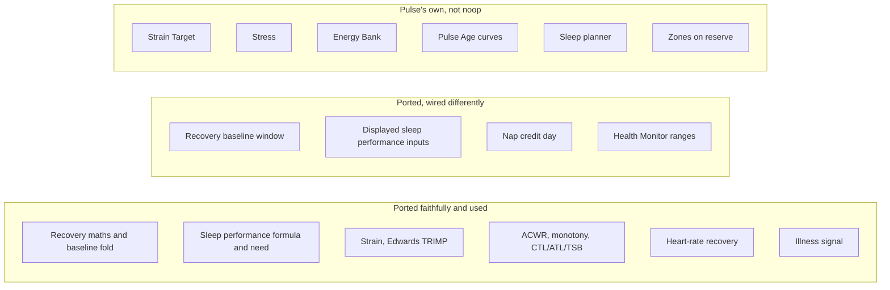

# Pulse vs noop: scoring parity audit

Read-only audit from 2026-10-06, against noop at commit `9f98f81` (2026-10-04, <https://github.com/ryanbr/noop>). The
Kotlin engine (`android/app/src/main/java/com/noop/analytics/`) was the reference; its Swift twin mirrors it. The
audit asks three things: is each score a faithful port, does Pulse actually call it, and what did Pulse leave out?

## Summary

- **The formulas are faithful.** Recovery, the baseline fold, sleep performance (Rest), sleep need, the sleep-debt
  ledger, Strain (Edwards), training load, heart-rate recovery and the illness signal all match noop constant for
  constant.
- **Where Pulse differs, it is in the wiring:** which nights feed a baseline, which need and consistency go into the
  displayed sleep score, and which day a nap counts for.
- **Several pieces are Pulse's own on purpose:** Strain Target, Stress, Energy Bank, the Pulse Age curves, the sleep
  planner, the zones on heart-rate reserve, and preferring Google's inputs.
- **Some code was ported and is never called.** Listed below.

## Sleep

| Item | Verdict | Notes |
|---|---|---|
| Rest composite (sleep performance) | MATCH | `sleep.ts:106-127` = `AnalyticsEngine.kt:1600-1636`: 50% duration vs need, 20% efficiency, 20% restorative × deep factor, 10% consistency (0.5 when missing) |
| Inputs to the displayed score | **DIFF** | noop *displays* `restFromDaily`: a flat 8 h need and a neutral 0.5 consistency (`AnalyticsEngine.kt:1729-1741`). Its personalised need and 1−CV consistency feed only the internal pass-1 Charge input. Pulse displays the personalised path (need from the last 28 nights, SRI consistency). Pulse's port `restFromTotals` has no callers |
| personalizedNeedHours | MATCH | Upper quartile of nightly hours, floored at 8 h (9 h under 18), capped at 9.5 h, 8 h under 7 nights. Pulse: trailing 28 nights excluding tonight. noop: a 21-day window including tonight |
| Strain or debt in the need | none in either | The sleep score is judged against the baseline need only, in both. Pulse adds Strain and debt only in its own sleep planner |
| Short-night guard | **none in either** | 4 h of an 8 h need with good ratios scores about 69-71 in both. noop shows confidence tiers (low restorative share, sparse motion, stage coverage) that "never change the Rest score"; Pulse ports none |
| Consistency | **DIFF** | noop: 1 − CV of nightly hours. Pulse: Sleep Regularity Index (Phillips). Pulse's 1−CV port `sleepConsistency` has no callers |
| Sleep debt ledger | MATCH (function) | 0.55 carry, 10-minute clear, 14 nights. Pulse rebuilds it daily with that day's need |
| Nap credit | **DIFF** | noop counts a nap for the same day as the main night. Pulse credits yesterday's naps to day D, so a nap shows one day late |
| Sleep planner | Pulse's own | noop has only a circadian ideal window (core body temperature minimum + 2.5 h, not ported) |
| Stage percentages | **DIFF** | noop uses largest remainder, so stages sum to 100. Pulse rounds each one, so rows can sum to 99 or 101 |

## Recovery

| Item | Verdict | Notes |
|---|---|---|
| Weights, z-scores, logistic, bands | MATCH | `recovery.ts:8-125` = `RecoveryScorer.kt:66-404` |
| Baseline fold (EWMA, winsorising, seeding, staleness) | MATCH | `baselines.ts` = `Baselines.kt`, line for line |
| **Which nights feed the baseline** | **DIFF, the largest** | noop: one fold over a **21-day window that includes tonight** (`ChargeBaselines.kt`), with recalibration epochs and device-era resets. Pulse: a causal fold over **all history that excludes tonight**, with no epochs. Pulse's z-scores run larger and adapt more slowly after a real shift (`docs/research/recovery-readiness.md:21`) |
| Score gate | DIFF (intentional) | noop needs HRV and RHR. Pulse scores without RHR (that term drops), gates every night at ≥7 nights and needs staged sleep |
| RHR source, skin-temperature baseline | DIFF (intentional) | Google's daily resting HR and Google's temperature baseline first (`google-vs-pulse-metrics.md`). Pulse doesn't round skin Δ to 2 dp as noop does (minor) |
| Readiness (ACWR, z cut-offs, monotony) | MATCH | `readiness.ts` = `ReadinessEngine.kt` |
| HRV readiness (SWC tier, overreaching watch) | **NOT PORTED** | `HRVReadiness.kt:62-159` |
| Illness signal and z adapter | MATCH | Confounders differ: Pulse reads journal tags (alcohol, sauna, travel, illness) but never sets hard/late workout, which noop does |
| Health Monitor ranges | DIFF | Pulse: Google's ranges, else personal ±2 SD once 4 nights, else no data. noop: personal ±2 SD once 14 nights, else **population ranges** (RHR 40-60, HRV 40-120, respiration 12-20, SpO2 95-100, skin ±0.6). Pulse has no population fallback |
| Session resting HR | MATCH | Plus Pulse's own ≥30 HR-minutes gate |

## Strain and the rest

| Item | Verdict | Notes |
|---|---|---|
| Strain, Edwards TRIMP, log map, gates, 0-21 | MATCH | Edwards is the only method in both pipelines by default. Banister exists in Pulse with no way to turn it on (noop has a toggle, off by default) |
| Max HR | MATCH | Settings, else Tanaka, in both. noop never uses observed peaks for scoring; it only logs them as diagnostics. `estimateHRmax` is effectively unused in both |
| Resting HR for Strain | DIFF (intentional) | Google daily RHR first |
| Display zones | DIFF (intentional) | noop: % of max HR 50-90 plus optional custom bpm bounds. Pulse (2026-10-05): % of heart-rate reserve 50-90, no custom bounds |
| Time in zone | MATCH | |
| ACWR, monotony, CTL/ATL/TSB | MATCH | |
| Heart-rate recovery | MATCH | |
| Strain Target | Pulse's own | noop: fixed bands from Recovery (14-18 / 10-14 / 4-10). Pulse: its own algorithm. Its cold start uses red 6-10, not noop's 4-10 |
| Stress | Pulse's own | noop's daytime-stress port exists (`stressBase.ts`), but only `foldDaytimeBaseline` is used; the live Stress is a per-minute logistic. The motion mask isn't ported |
| Fitness | Not ported | noop: Nes fitness age, Uth VO2max fallback. Pulse: Google's VO2max with FRIEND percentiles |
| Pulse Age | Partly ported | noop's Vitality method and constants, Pulse's own curves |
| Energy Bank | Pulse's own | No noop equivalent |

## Ported but never called

- `restFromTotals`, `sleepConsistency` (1−CV) and `debtSeries` (`sleep.ts`).
- `watchRecovery`, `rollingMeanSD`, `freshestCarried`, `recentHrvCoverage`, `nightsSinceNewestValidNight`, `strainCfg` and `daytimeRMSSDCfg` (`baselines.ts`, `recovery.ts`).
- Banister TRIMP and `estimateHRmax` (`strain.ts`).
- `analyze`, `scoringMode` and `dayDaytimeAggregate` (`stressBase.ts`).
- The Recovery Index and Activity Balance terms are dormant in both Pulse and noop.

## Doc drift found

`docs/research/strain-load.md:24` says HRmax comes from `config.ts`. It now comes from `src/server/profile.ts`. The
same finding also reasons from Banister weighting, but the pipeline uses Edwards.

## Decisions for the owner

1. **Short-night sleep score.** Neither app guards against it. Options: keep noop's behaviour, or add the duration
   gate proposed on 2026-10-06 (restorative sleep in minutes against the need; efficiency scaled by duration), which
   brings a 4.3 h night from 71 to about 55, in line with Google.
2. **Recovery baseline window.** Keep Pulse's causal all-history fold, or move to noop's 21-day window. If moving,
   decide whether tonight is included (noop includes it; causal is more defensible).
3. **Nap credit day.** Align with noop (same day) or keep the next-day credit.
4. **Health Monitor population fallback** for new users (noop shows population ranges until 14 nights).
5. **Dead code.** Delete the unused ports, or keep them as reference.
6. **HRV readiness (SWC)**: port it or leave it.
7. **Stage percentages**: switch to largest remainder so rows sum to 100.
