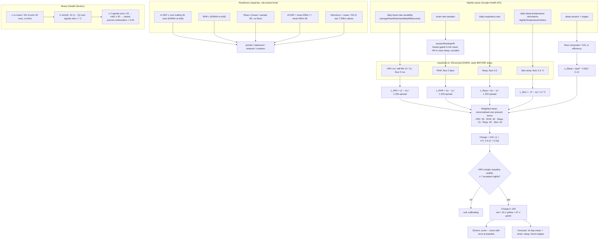

# Recovery, Readiness and illness: an evidence review

Scope: `src/core/scoring/recovery.ts`, `readiness.ts`, `baselines.ts`, `drivers.ts`, `forecast.ts`, `illness.ts`, `confidence.ts` and the ACWR and monotony half of `trainingLoad.ts`, as wired in `src/server/pipeline.ts`. This review changes no code. It records what each formula does, what the published evidence says about it, and what we should change.

The scoring code is a port of noop's Kotlin engines, and most constants were tuned by hand. Google does not expose its own Readiness, Sleep Score or Cardio Load through the Google Health API. So Pulse's scores have to stand on their own, and we will later judge them by how well they rank days and track day-to-day changes compared with Google Health's numbers.

How to read the verdicts:

- **Supported**: a peer-reviewed source or a vendor's official documentation backs the choice.
- **Plausible but arbitrary**: the direction is sound, but the exact number has no source. It should be tuned on real data.
- **Contradicted**: the evidence, or simple arithmetic on our own scales, says the choice is wrong.

Where a source could only be read through an abstract or a search excerpt, the reference list says so.

## Summary: the top five findings

1. **The training-load signals run on a log-compressed scale, so monotony fires on ordinary weeks and ACWR cannot see a spike.** Readiness computes ACWR and Foster monotony from daily Effort, and Effort is `100·ln(TRIMP+1)/ln(7201)`. A ratio of logs is not a ratio of loads. With the seed scenario's typical days (rest day Effort 25.7, about 9 TRIMP; workout day Effort 53.8, about 118 TRIMP), an ordinary 4-workout week has a monotony of **2.78 on Effort but 1.22 on TRIMP**, so the "monotony ≥ 2.0" watch flag fires on a normal week. A week in which every workout doubles in TRIMP gives an ACWR of **1.57 on TRIMP but only 1.08 on Effort**, which reads as "sweet spot". On top of this, the ACWR itself has weak evidence behind it (Impellizzeri 2020; Lolli 2019). **Proposal:** compute ACWR, monotony and CTL/ATL/TSB on linear TRIMP (invert Effort, or store TRIMP). Switch ACWR to an uncoupled EWMA. Treat it as information only, so it no longer moves the Readiness level, and drop the "ramping down" watch flag.

2. **Recovery z-scores HRV in raw milliseconds against a fixed 5 ms floor, while Readiness z-scores the same HRV in ln(ms).** RMSSD is right-skewed and its spread grows with its level, which is why the HRV-monitoring literature works in ln(RMSSD). A 5 ms floor is a σ of at least 6.3 ms. That is a 25 % coefficient of variation for someone at 25 ms, and 6 % for someone at 100 ms, so the same physiological change moves Charge very differently for different people. **Proposal:** z-score the Recovery HRV term on ln(RMSSD). The `readiness_hrv_ln` config already exists, and its 0.08 floor (σ ≈ 10 %) matches published day-to-day variability of nocturnal ln(RMSSD).

3. **A baseline can freeze for good after a real level shift.** `update()` refuses to fold any value more than 5 spreads (about 4σ) from the centre, and resets `nightsSinceUpdate` to 0 when it does. So after a step change bigger than that, such as a new watch, Google changing its HRV field, a medication or a long illness, every new night is rejected, the status never turns stale, and the baseline never moves. noop's recalibration epoch and device-era boundary, which handled this, were not ported. **Proposal:** after 3 consecutive rejections on the same side, re-seed the baseline from those nights, or fold them with the early-adapt half-life.

4. **Three modules build three different baselines for the same signal, and two of them have no spread floor.** Recovery uses the Winsorized EWMA (14-night half-life, floors). Readiness's respiratory signal and the whole illness engine use a plain mean and sample SD over 30 rows, with no floor (`sd > 0` and `1e-6`). Fitbit resting HR arrives as whole bpm and respiratory rate is a smooth nightly average. A quiet month can give an SD of 0.3 bpm or 0.2 breaths/min, after which a 1 bpm or 0.4 breaths/min rise counts as z ≥ 2: a "bad" Readiness signal and half an illness alert. On the same morning, Recovery, Readiness and Health Monitor can therefore disagree about the same vital. **Proposal:** take every z from `baselines.ts` states (one estimator, one set of floors). For skin temperature, use Google's own `relativeNightlyStddev30dCelsius` as σ.

5. **Every score reacts to a single night, but the evidence and Google both favour multi-night trends.** The HRV-guided-training studies decide on a 7-day rolling mean of ln(RMSSD) against a smallest-worthwhile-change band (baseline ± 0.5 SD). Plews 2014 needs only 3 or more valid nights a week. Oura's HRV Balance compares 14 days against 3 months. Google says its Readiness sleep component "analyzes your sleep patterns over the past week". Our illness engine fires on one night, while the published illness detectors require persistence or cumulative evidence (Mishra 2020's CuSum, Alavi 2022's multi-night alerts). Our 14-night HRV half-life also slowly absorbs a multi-week decline, which is exactly the overreaching pattern Plews 2012 describes. **Proposal:** keep the single-night z as the main term. Add an "HRV trend" term: the 7-day rolling ln(RMSSD) against a slower baseline (half-life of about 45 nights), with an SWC dead band of ±0.5 SD. Make the sleep term a weighted 7-night value, and require two consecutive nights before the illness engine raises an alert.

Smaller items (resp and RHR rewarded in both directions, the tiny skin-temperature weight, the forecast's sleep input, the readiness rule thresholds) are in the per-component table.

## Current formula

### Data flow

### Recovery ("Charge"), `recovery.ts`

- **Inputs** (from `pipeline.ts`):
  - `hrv`: Google's `averageHeartRateVariabilityMilliseconds`, which is RMSSD over the main sleep.
  - `rhr`: our `sessionRestingHR`, the lowest 5-minute mean HR inside the main sleep, rounded to whole bpm.
  - `resp`: Google's nightly breaths per minute.
  - `sleepPerf`: the Rest composite / 100, or sleep efficiency when there is no composite.
  - `skinTempDev`: the night's skin temperature minus our own EWMA skin-temperature baseline, in °C.
  - `recoveryIndexSlope` and `priorDayEffort` are supported by the function but never passed, so those terms are dormant.
- **Per-term z** (oriented so that higher is better):
  - HRV: `(x − m) / (1.253·spread)` in **raw ms**.
  - RHR and resp: `(m − x) / (1.253·spread)`, so a value **below** baseline scores positive.
  - Sleep: `(perf − 0.85) / 0.12`, a fixed population centre, not personal.
  - Skin temperature: `−|dev| / 1.0 °C`, a symmetric penalty in raw °C, not a z.
- **Composite**: weights HRV 0.55, RHR 0.20, sleep 0.15, resp 0.05, skin 0.05, recovery index 0.05, activity balance 0.05. Missing terms drop out and the remaining weights renormalise. In practice the five live terms sum to 1.0.
- **Mapping**: `Charge = 100 / (1 + exp(−1.6 · (Z + 0.2)))`, clamped to 0–100. Z = 0 maps to 57.9. The slope at the centre is about 40 points per unit of composite z.
- **Bands**: red < 34, yellow < 67, green ≥ 67 (WHOOP's published bands).
- **Gate**: tonight's HRV must exist, the HRV baseline must be usable (≥ 4 valid nights and not stale), and it must hold ≥ 7 accepted nights.
- **Parasympathetic saturation**: detected when HRV z ≤ −0.5 and RHR z ≥ +0.5 (low HRV with a low heart rate). It is reported as a driver verdict only and never changes the score.

Sensitivity of the composite, with all other terms at baseline:

| Situation | Charge |
|---|---|
| Everything at baseline | 58 |
| HRV −0.5σ | 47 |
| HRV −1σ | 36 |
| HRV +1σ | 77 |
| Sleep performance 60 % | 46 |
| Skin temperature +0.5 °C | 57 |

### Baselines, `baselines.ts`

- **Centre**: an EWMA with a 14-night half-life. Each new value is first Winsorized to centre ± 3·spread.
- **Spread**: an EWMA (21-night half-life) of the absolute deviation of the **unclamped** value, floored per metric. σ = 1.253 × spread, which is the Gaussian conversion from mean absolute deviation.
- **Young regime**: below 8 valid nights the centre uses a 3-night half-life, the Winsorizing band is 2.5 × wider, and the hard-outlier gate is off.
- **Hard outlier**: once settled, a value more than 5·spread (≈ 4σ) away is not folded, and `nightsSinceUpdate` is reset to 0.
- **Status**: calibrating < 4 valid nights, provisional < 14, trusted ≥ 14. A baseline goes stale after 14 nights without an update.
- **Floors**: HRV 5 ms; RHR 2 bpm; resp 0.5 breaths/min; skin temperature 0.3 °C; ln HRV 0.08.

### Readiness, `readiness.ts`

This is a rule-based level, not a 0–100 score.

- **HRV signal**: tonight's ln(RMSSD) against the trailing 30 rows, re-folded through the EWMA with the hard-outlier gate off.
- **RHR signal**: the same re-fold in bpm.
- **Thresholds** for both: z ≥ 0.5 good; ≥ −0.5 neutral; ≥ −1.0 watch; otherwise bad.
- **Respiratory rate**: z against a plain mean and sample SD of the trailing rows, with no floor. z ≥ 1.5 is watch and z ≥ 2.0 is bad. Only increases are flagged.
- **ACWR** = mean of the last 7 Effort values ÷ mean of the last 28, which is the coupled form. It needs ≥ 14 values.
  - < 0.8 is watch ("ramping down").
  - < 1.3 is good.
  - < 1.5 is watch.
  - ≥ 1.5 is bad.
- **Monotony** = mean ÷ SD of the last 7 Effort values (at least 4 needed). ≥ 2.0 is watch.
- **Level**:
  - **rundown**: 2 or more bad signals, or a bad vital together with a bad ACWR.
  - **strained**: any one bad signal.
  - **primed**: 2 or more good signals and no watch signals.
  - **balanced**: everything else.
- Note: "last 7 values" counts non-null rows, not calendar days, so a gap stretches the window.

### Training load, `trainingLoad.ts`

- **CTL and ATL**: Banister-style EWMAs of daily Effort with τ = 42 and 7 days, seeded with the mean of the first 7 days. TSB = CTL − ATL.
- **Window**: only the longest gap-free run ending on the target day is used.
- **Use**: display only. It does not feed the Readiness level.

### Forecast, `forecast.ts`

- **Centre**: the mean of the last 14 Charges, plus three nudges.
- **Strain nudge**: `clamp(−9 · (todayEffort − mean14) / 12, ±12)`.
- **Sleep nudge**: `14 · clamp(planned/need − 1, −1, +0.25)`.
- **Trend nudge**: `clamp(−OLS slope of the last 14 Charges, ±8)`.
- **Band**: `max(SD, 8)`, plus 6 when there are fewer than 10 nights.
- **Note**: the pipeline passes the Sleep Planner's recommended sleep as `plannedSleepHours`, not the sleep the user actually plans.

### Illness, `illness.ts`

- **Signals**: RHR, skin-temperature deviation, HRV (negated) and respiratory rate. Each is z-scored against the mean and sample SD of the prior 30 rows. It needs ≥ 14 values, and there is no SD floor.
- **Score**: each signal with z > 2 adds `min(40, 22·(z − 2))`.
- **Levels**:
  - Fewer than 2 firing signals, or a score below 25: quiet.
  - Score below 50: mild.
  - Otherwise: raised.
- **Confounders**: a journal entry for alcohol, stress, sauna, a hard or late workout, or travel multiplies the score by 0.45 and marks the result "suppressed".
- **Trust gate**: the engine stays quiet until the window holds 14 nights of RHR or HRV.
- Everything is evaluated on a single night.

### Confidence, `confidence.ts`

- **Charge**: "building" while the HRV baseline is provisional, "solid" once trusted.
- **Readiness**: "solid" only once the window holds 30 HRV nights.

## Per-component evidence review

Rows are ordered by impact. Source numbers refer to the reference list.

| Component | Ours | Evidence | Verdict | Proposal | Sources |
|---|---|---|---|---|---|
| ACWR and monotony scale | Computed on Effort, a log of TRIMP | Foster's monotony and the ACWR are defined on linear load, such as session-RPE × minutes or TRIMP. Ratios of logs compress spikes and inflate monotony (see finding 1: 2.78 vs 1.22, and 1.08 vs 1.57). | **Contradicted** (scale error) | Run ACWR, monotony and CTL/ATL on TRIMP. Keep Effort for display. | [F1], [F6] |
| ACWR thresholds and use | Coupled 7/28 rolling mean; 0.8–1.3 good, ≥ 1.5 bad; a bad ACWR plus a bad vital → "rundown" | The sweet spot comes from team-sport injury data (Gabbett 2016). Coupling creates a spurious correlation (Lolli 2019). The ratio fails to normalise, and there is "no evidence supporting the use of ACWR" (Impellizzeri 2020). A review by Gabbett's own group found heterogeneous methods (Andrade 2020). EWMA is more sensitive than rolling means (Murray 2017). Google Cardio Load does compare the last week with the last month, as an ACWR. | **Contradicted** as a readiness input; plausible as a display | Use an uncoupled EWMA ACWR (acute τ 7, chronic τ 28, today excluded from chronic). Show it beside Readiness, but drop it from `synthesize`. Remove the "ramping down = watch" rule, since a taper is not a readiness problem. | [F2]–[F5], [F7], [G4] |
| Monotony threshold | ≥ 2.0 on the last 7 non-null values, at least 4 | Foster 1998 linked illness to high load × monotony (strain), not to monotony alone. The 2.0 cut-off is folklore attached to the paper, not stated in its abstract. Rest days must count as zero-load days, and gaps should not shrink the week. | Plausible but arbitrary | Compute it on TRIMP over 7 calendar days, with missing days unknown and worn rest days counting as their (small) TRIMP. Flag only when strain (weekly load × monotony) is also above the person's 90th percentile. | [F6] |
| HRV domain in Recovery | Raw ms, floor 5 ms | ln(RMSSD) is standard practice "to reduce bias from heteroscedasticity" (the WHOOP water-polo study [H8]) and is recommended by Plews 2013 and Buchheit 2014. Readiness already uses ln. | **Contradicted** | z-score on ln(RMSSD) with the `readiness_hrv_ln` config (floor 0.08, so σ ≥ 0.10). Re-check the band split after the change. | [H2], [H3], [H8] |
| HRV σ floor | 5 ms (σ ≥ 6.3 ms) | Nightly ln(RMSSD) day-to-day CV is about 4–8 % (weekly CV 5.4 ± 0.7 % in [H8]; nocturnal 6-night CV 4.2–6.3 % in runners). A fixed ms floor is 25 % CV at 25 ms and 6 % at 100 ms. | Contradicted for low-HRV users | A ln floor of 0.05–0.08 (σ ≈ 6–10 %). Start at 0.08, then fit it on real data. | [H8], [H9] |
| Baseline hard-outlier gate | > 5·spread is never folded; the counter resets | No source. Robust baselines are standard, but a detector needs an escape for a genuine regime change. Alavi 2022 and Mishra 2020 use rolling windows that recover by design. | **Contradicted** (failure mode) | After 3 consecutive same-side rejections, re-seed with the young-regime half-life. Also exclude nights the illness engine flagged from the baseline, instead of relying on the gate. | [I2], [I1] |
| Baseline centre half-life | 14 nights for the centre, 21 for the spread | Oura compares a 14-day weighted average against 3 months for HRV, and 2 months for temperature and activity. Plews 2012 found a sustained multi-week fall in the 7-day ln(RMSSD) before non-functional overreaching. A 14-night half-life absorbs about half of such a fall within two weeks. | Plausible for the acute z; too fast for trend detection | Keep 14 for the nightly z. Add a slow baseline (half-life of about 45 nights) for the trend term in finding 5. | [V3], [V4], [H1] |
| Spread estimator | EWMA abs-dev of the unclamped value × 1.253 | 1.253 = √(π/2) converts mean absolute deviation to σ for Gaussian data, which is correct. Tracking the unclamped value lets one artefact night widen σ for weeks. | Supported (constant); plausible (unclamped) | Feed the Winsorized value into the spread too, or use an EWMA of squared deviations clipped at 3σ. | (statistical identity) |
| Spread floors and estimators across modules | EWMA with floors (Recovery); mean/SD with no floor (Readiness resp, illness) | Whole-bpm RHR and smooth nightly resp give tiny SDs, so spurious z ≥ 2. Buchheit 2014 frames meaningful change relative to a typical error, not a raw SD. | **Contradicted** (no floor) | One estimator. Floors: RHR 1.5–2 bpm σ, resp 0.4–0.5 breaths/min σ, skin temperature from Google's `relativeNightlyStddev30dCelsius`. Fit them from the first 60 real nights. | [H3], [G5] |
| HRV weight | 0.55, the largest | WHOOP says HRV "carries most of the predictive value" (undisclosed weights). Google calls HRV "a very sensitive marker of physiological recovery". Altini & Plews 2021: HRV is more sensitive but less specific than RHR. | Supported (direction); arbitrary (number) | Keep it. Tune the HRV-to-RHR split on rank agreement with Google (validation plan). | [V1], [G2], [H10] |
| RHR term | `sessionRestingHR`, the lowest 5-minute mean; weight 0.20; symmetric | Oura uses "the lowest heart rate from the previous night", which is the same construct. Google added RHR to Readiness in 2024 for "longer-term impact, for example from illness". A very low RHR with low HRV is the saturation pattern (Plews 2013), so lower is not always better. | Supported | Keep it. Consider capping the positive RHR z at +1.5, so a very low HR cannot buy points while HRV is falling. | [V3], [G2], [H2] |
| Respiratory-rate term | Weight 0.05; symmetric (lower breathing scores better) | Raised respiratory rate is an illness marker (Miller 2020; Natarajan 2020). There is no evidence that a below-baseline rate means better recovery. WHOOP: "increases may reflect stress, fatigue, or illness". | Contradicted (the positive side) | Make it one-sided: `min(0, z)`. | [I8], [I5], [V1] |
| Sleep term | `(perf − 0.85) / 0.12`; weight 0.15; tonight only | Google analyses "sleep patterns over the past week" and says "one night of poor sleep" rarely moves the score much. Oura uses both last night and a 14-day sleep balance. | Plausible but arbitrary | Use a weighted 7-night sleep performance (for example 0.4 tonight, 0.6 the prior six). Express it as a personal z, or keep the fixed centre but fit 0.85 and 0.12 on real data. | [G1], [V3] |
| Skin-temperature term | `−|dev|/1 °C`; weight 0.05 | Oura penalises deviations in both directions. Fever detection works from wearable temperature (Smarr 2020; Mason 2022). The luteal phase raises nocturnal skin temperature by 0.30 ± 0.12 °C (Maijala 2019), against a mean illness rise of about +0.63 °C (Smarr 2020), so a symmetric raw-°C penalty will dock points across half of every cycle. At this weight, +0.5 °C costs about 1 point, which is effectively inert. | Plausible (symmetric), but the scale and weight are arbitrary | z-score it with Google's 30-day SD. Penalise only z > +1 (a warming), and let the illness engine own fever detection. If cycle tracking is added, centre on the phase-specific baseline. | [V3], [I6], [I7], [I9], [G5] |
| Composite mapping | Logistic k = 1.6, Z0 = −0.2 (baseline = 58) | WHOOP's bands are 67 / 34 (official). The 58 mid-point and the steepness are hand-tuned. Averaging z's with weights summing to 1 shrinks the composite's SD below 1, which the logistic slope compensates for. | Plausible but arbitrary | Keep it until there is real data. Then fit k so Charge has roughly the spread of Google's Readiness (for example 20–35 % of days high, 10–20 % low). | [V2] |
| Gate | ≥ 7 accepted HRV nights | Google: "you must wear your device for 7 nights of sleep". Oura: "up to two weeks". | **Supported** (matches Google) | Keep it. | [G1], [V3] |
| Single-night HRV vs a trend | Nightly z only | The HRV-guided training trials (Vesterinen 2016; Javaloyes 2019) use the 7-day rolling ln(RMSSD) against a band of baseline ± 0.5 SD, and beat or matched fixed plans. Plews 2014: 3 or more valid nights a week suffice. Buchheit 2014: average 3–4 days, because noise falls as 1/√n. | Supported as the method we should add | Add a "trend" term (weight of about 0.15, taken from HRV): the 7-day rolling ln(RMSSD) against the slow baseline, with a ±0.5 SD dead band. It feeds Recovery and replaces Readiness's single-night HRV signal. | [H4]–[H6], [H3], [H7] |
| Readiness thresholds | HRV/RHR z: ±0.5 good/neutral, −1 bad | 0.5 SD is the conventional smallest worthwhile change in HRV-guided training. Buchheit notes that no fraction of the CV has been shown to be the meaningful one. | Supported (convention) | Apply the thresholds to the 7-day rolling value, not to tonight's. | [H5], [H6], [H3] |
| Readiness resp thresholds | z ≥ 1.5 watch, ≥ 2 bad, sample SD | Direction supported (illness). With no floor, false positives follow. | Plausible; the estimator is contradicted | Use the shared baseline and floor (finding 4). | [I5], [I8] |
| Readiness synthesis rules | Counts of good, watch and bad signals | No source. It is a reasonable decision table. | Plausible but arbitrary | Keep it, but remove the load signals (see the ACWR row). Log the level next to Charge, so we can check the two never contradict each other badly. | — |
| Parasympathetic saturation | Detected, never applied | Plews 2013 and Buchheit 2014 describe it in highly trained athletes and suggest ln(RMSSD):RR as the index. It is rare in recreational users. | Supported (detect-only is prudent) | Keep detect-only. Switch detection to the ln(RMSSD):RR ratio if it fires often. | [H2], [H3] |
| Drivers | Score minus the score with the term at baseline | A standard one-at-a-time sensitivity. It is non-additive away from baseline (already documented). | Supported (as an explanation) | None. Optionally show "other / interaction" so the rows sum to the gap from baseline. | — |
| Forecast | 14-day mean + strain, sleep and trend nudges | After a hard session, autonomic recovery takes 24–48 h, and at least 48 h after high intensity (Stanley 2013). So a negative strain nudge is supported in direction. No source covers the magnitudes. The sleep nudge receives the planner's recommendation, not the actual plan, so it is ≥ 0 whenever the plan exceeds need: a built-in positive bias of up to +3.5. The "trend" nudge pushes away from recent momentum, with no evidence either way. | Plausible (strain); contradicted (sleep input) | Feed the user's planned bedtime, or drop the sleep nudge until we have one. Replace the centre with an AR(1): `mean + φ·(today − mean)`, with φ fitted on real data. Keep the forecast only if it beats a "same as today" forecast and a 14-day mean on MAE. | [H7] |
| Illness: thresholds | z > 2 per signal; ≥ 2 signals; scores 25/50 | Multi-signal models do better than RHR alone. Natarajan 2020 (RR, RMSSD, RHR, entropy): AUC 0.77, with respiratory rate showing "the largest effect". Mason 2022: AUC 0.82, and temperature added 4.9 %. Quer 2021: RHR alone barely discriminates. Radin 2020 required RHR up **and** sleep down by ≥ 0.5 SD. No study compared "N of M signals" rules head to head, and single-signal RHR detectors also work (Alavi 2022: sensitivity 80 %, specificity 88 %). The per-signal cut-offs and 22/40 scaling are arbitrary. | Supported (corroboration); arbitrary (numbers) | Keep the corroboration rule, but let a single strong RHR rise (≥ +4 bpm over the median for 2 nights, as in Alavi) also raise "mild". Calibrate the cut-offs to a target false-alert rate (validation plan). | [I5], [I7], [I3], [I4], [I2] |
| Illness: persistence | Single night | Mishra 2020 confirms an alert only after the elevation has been sustained for 24 h or more (CuSum, two-tier). Alavi 2022 NightSignal goes red only after 2 consecutive nights above threshold, with a median lead of 3 days before symptoms, and still had about a 12 % false-alert rate. Miller 2020 builds features over 2-, 3- and 6-day windows. | **Contradicted** | Require 2 consecutive nights (or 2 of the last 3) to fire, or run a one-sided CuSum on the summed z. | [I1], [I2], [I8] |
| Illness: baseline | Mean/SD of the prior 30 rows, flagged nights included, no floor, raw HRV | Alavi 2022 uses a streaming median of overnight RHR. Miller 2020 uses a 14-day median lagged to days 21–7, so the incubation period does not leak into the baseline. Mishra and Radin used mean/SD. Ill nights left in the baseline inflate the SD and mask the next episode. | Contradicted (floor, robustness) | Shared robust baseline with floors; ln HRV; lag the baseline by about 3 nights or skip flagged nights when folding. | [I2], [I8], [I1], [I4] |
| Illness: confounders | Journal alcohol, stress, sauna, hard workout or travel → × 0.45 | Alcohol dose-dependently lowers sleep HRV and raises sympathetic tone (Pietilä 2018). In a lab study, 3–4 drinks raised sleeping HR by about 14 % (Sleep 2021). Altini & Plews 2021 found alcohol lowers HRV by about 12 %, close to sickness at about 10 %. Sauna changes HRV for only about 30 min, with no evidence of an overnight effect. The menstrual cycle also shifts temperature, RHR and HRV. | Supported (alcohol); unsupported (sauna) | Keep alcohol, travel and hard workouts. Keep sauna only if the session ended within a couple of hours of bedtime. Add the cycle phase as a confounder if cycle tracking arrives. | [H11], [H10], [I10], [I11], [I9] |
| Confidence tiers | Building < 14 trusted nights; Readiness solid at 30 | Consistent with Google ("wear your device consistently for a month") and Oura's two-week learning. | Supported | None. | [G1], [V3] |
| CTL/ATL/TSB | τ 42 / 7 on Effort | The Banister model fits individuals poorly and its parameters are unstable (Hellard 2006). 42/7 is a convention. | Plausible as a display; the scale is wrong | Move it to TRIMP. Keep it out of scoring. | [F8] |

## What Google does

Google does not publish its formula. Its help pages and blog posts disclose this much:

- **Inputs.** Readiness "combines insights from your heart rate variability (HRV), recent sleep, and resting heart rate (RHR)" [G1].
  - The 2021 version used activity ("fitness fatigue"), deep-sleep HRV and multi-night sleep [G3].
  - The 2024 update (Pixel Watch 3) removed the activity component and added resting HR [G1], [G2].
- **Windows.**
  - Sleep is analysed "over the past week", and a single bad night rarely moves the score much [G1].
  - The HRV and RHR windows are not stated.
  - The 2021 post says HRV is "calculated during your deep sleep" [G3]. The current API exposes both an all-sleep average and a deep-sleep RMSSD [G5].
- **Calibration.** It needs 7 nights for a first score, and Google recommends a month of consistent wear [G1].
- **Scale.** 0–100, with Low ≤ 29, Moderate 30–64 and High ≥ 65 [G1]. Ours is red < 34, yellow 34–66 and green ≥ 67.
- **Not inputs.** Google lists no respiratory rate, skin temperature or training load for Readiness. Cardio Load and Target Load are separate features. Target Load uses Readiness, and Cardio Load "compares the last week of cardio load with the last month (often called Acute to Chronic Workload Ratio)" [G4].

**Expected divergences** (not bugs):

- **Respiratory rate and skin temperature move Charge but not Google.** They are 10 % of our weight, so this is small.
- **Our sleep term reacts to one night. Google's is smoothed over a week.** On the day after one bad night, we will drop and Google mostly won't. This is the largest expected source of direction-of-change disagreement until the 7-night sleep term is added.
- **Band cut-offs differ.** Compare bands only after mapping Google's 30/65 to ours, or compare ranks only.
- **Google may use the deep-sleep RMSSD.** If rank agreement is poor, try `deepSleepRootMeanSquareOfSuccessiveDifferencesMilliseconds` as the HRV input before retuning weights.
- **Training load does not move either score.** If our Readiness level disagrees with Google's Readiness on high-load days, that is expected. Our ACWR drives the level and Google's does not.

**Suspicious divergences** (worth investigating):

- **Charge moves opposite to Google on a day when HRV and RHR both moved clearly** (|z| > 1). Both scores lean mostly on HRV and RHR, so they should agree.
- **Persistent offsets after a week of illness or travel.** Suspect our baseline: either the hard-outlier freeze (finding 3) or the 14-night half-life absorbing the shift.
- **A Charge spread much narrower than Google's**, for example never below 30. Suspect the floors binding (the data notes already see RHR and resp on their floors most days on the seed data).

## Validation plan

Once real data exists, log one row per day:

| Field | Source |
|---|---|
| Date, Charge, band, every term's z and weight, the composite Z | Pipeline (already in `RecoveryRow`) |
| Each baseline's centre, spread, nValid and status, plus a "hard outlier rejected" flag | `baselines.ts` (the flag is new) |
| Readiness level, ACWR, monotony (on Effort and on TRIMP during the transition) | Pipeline |
| Illness score, level, fired signals | Health Monitor |
| Forecast made the evening before | Pipeline |
| **Google Readiness score, and Google's band** | Typed into the journal each morning from the Google Health app, since the API does not expose it |
| Subjective morning feel (1–5) and a "felt ill" tag | Journal |

Metrics and pass thresholds. These thresholds are our own working targets, not published standards.

1. **Rank agreement with Google.** Spearman ρ between Charge and Google Readiness over at least 60 scored days. **Good enough: ρ ≥ 0.6. Investigate below 0.4.** Report it with a bootstrap 90 % CI, the same method `journalImpact` already uses.
2. **Direction-of-change agreement.** On days where both scores moved by at least 5 points from the previous day, the share where both moved the same way. **Good enough: ≥ 70 %. Chance is 50 %.** Report the count of qualifying days alongside.
3. **Band agreement.** Cohen's κ between our three bands and Google's three, after mapping both to low/mid/high. **Good enough: κ ≥ 0.4** (moderate).
4. **Ablations.** Recompute ρ and direction agreement with each proposed change on and off: ln HRV, the 7-night sleep term, the trend term, the one-sided resp term, and deep-sleep vs average RMSSD. Adopt a change only when it does not lower ρ by more than 0.05. A change backed by the evidence, such as ln HRV, can be adopted at equal agreement.
5. **Internal validity, independent of Google.** Spearman ρ between Charge and the 1–5 morning feel. Wearable HRV predicts perceived readiness only weakly (a marginal R² of about 0.03 in one Garmin study), so **ρ ≥ 0.2** is a realistic target.
6. **Illness.** Count alerts per 30 days on the user's healthy days (target ≤ 1 false alert per 60 days). Also record whether an alert came 0–3 days before or on each "felt ill" tag. One person has too few episodes for a sensitivity estimate, so treat this as a false-alarm check.
7. **Load signals.** The share of weeks in which the monotony flag fires (target: under about 20 % of weeks on a normal training pattern), and the ACWR distribution. Finding 1 predicts that monotony on Effort fires in most weeks. Run this check first to confirm it.
8. **Forecast.** MAE of the evening forecast against the next morning's Charge, compared with two naive forecasts: today's Charge, and the 14-day mean. **Keep the forecast only if it beats both by at least 10 % in MAE.**
9. **Baseline health.** The number of days any baseline sat in "rejected hard outlier" state for 3 or more nights in a row (target 0), and the share of days each floor binds (target under 30 %).

## References

Peer-reviewed sources were checked through abstracts on Europe PMC or the publisher's page. "Excerpt" marks a claim seen only through a secondary summary or search excerpt.

**HRV and readiness**

- [H1] Plews DJ, Laursen PB, Kilding AE, Buchheit M. Heart rate variability in elite triathletes, is variation in variability the key to effective training? A case comparison. *Eur J Appl Physiol* 2012;112:3729–41. https://doi.org/10.1007/s00421-012-2354-4 (n = 2 case study.)
- [H2] Plews DJ, Laursen PB, Stanley J, Kilding AE, Buchheit M. Training adaptation and heart rate variability in elite endurance athletes: opening the door to effective monitoring. *Sports Med* 2013;43:773–81. https://doi.org/10.1007/s40279-013-0071-8 (ln(RMSSD), rolling averages and saturation details from an excerpt.)
- [H3] Buchheit M. Monitoring training status with HR measures: do all roads lead to Rome? *Front Physiol* 2014;5:73. https://doi.org/10.3389/fphys.2014.00073
- [H4] Plews DJ, Laursen PB, Le Meur Y, Hausswirth C, Kilding AE, Buchheit M. Monitoring training with heart rate variability: how much compliance is needed for valid assessment? *Int J Sports Physiol Perform* 2014;9(5):783–90. https://doi.org/10.1123/ijspp.2013-0455
- [H5] Vesterinen V, Nummela A, Heikura I, et al. Individual endurance training prescription with heart rate variability. *Med Sci Sports Exerc* 2016;48(7):1347–54. https://doi.org/10.1249/MSS.0000000000000910 (The SWC formula is not in the abstract.)
- [H6] Javaloyes A, Sarabia JM, Lamberts RP, Moya-Ramón M. Training prescription guided by heart rate variability in cycling. *Int J Sports Physiol Perform* 2019;14(1):23–32. https://doi.org/10.1123/ijspp.2018-0122 (7-day ln(RMSSD) against baseline ± 0.5 SD, from an excerpt.)
- [H7] Stanley J, Peake JM, Buchheit M. Cardiac parasympathetic reactivation following exercise: implications for training prescription. *Sports Med* 2013;43:1259–77. https://doi.org/10.1007/s40279-013-0083-4
- [H8] Evaluating typical day-to-day variability of WHOOP-derived heart rate variability in Olympic water polo athletes. https://www.ncbi.nlm.nih.gov/pmc/articles/PMC9505647/ (Authors and journal not checked; see the PMC page.)
- [H9] Nocturnal vs morning ln(RMSSD) reliability in recreational runners. *Sports Med Open* 2024. https://link.springer.com/article/10.1186/s40798-024-00779-5 (Excerpt.)
- [H10] Altini M, Plews D. What is behind changes in resting heart rate and heart rate variability? A large-scale analysis of longitudinal measurements acquired in free-living. *Sensors* 2021;21(23):7932. https://doi.org/10.3390/s21237932
- [H11] Pietilä J, Helander E, Korhonen I, Myllymäki T, Kujala UM, Lindholm H. Acute effect of alcohol intake on cardiovascular autonomic regulation during the first hours of sleep in a large real-world sample of Finnish employees. *JMIR Ment Health* 2018;5(1):e23. https://mental.jmir.org/2018/1/e23/
- [H12] Kiviniemi AM, Hautala AJ, Kinnunen H, Tulppo MP. Endurance training guided individually by daily heart rate variability measurements. *Eur J Appl Physiol* 2007;101:743–51. https://doi.org/10.1007/s00421-007-0552-2 (Used HF power against a 10-day mean − 1 SD, a lower threshold only.)
- [H13] Does wearable HRV during sleep predict perceived morning fitness? (Garmin, 63 military personnel.) https://pmc.ncbi.nlm.nih.gov/articles/PMC10195711/

**Training load**

- [F1] Gabbett TJ. The training-injury prevention paradox: should athletes be training smarter and harder? *Br J Sports Med* 2016;50(5):273–80. https://doi.org/10.1136/bjsports-2015-095788
- [F2] Lolli L, Batterham AM, Hawkins R, et al. Mathematical coupling causes spurious correlation within the conventional acute-to-chronic workload ratio calculations. *Br J Sports Med* 2019;53(15):921–2. https://doi.org/10.1136/bjsports-2017-098110
- [F3] Impellizzeri FM, Tenan MS, Kempton T, Novak A, Coutts AJ. Acute:Chronic Workload Ratio: conceptual issues and fundamental pitfalls. *Int J Sports Physiol Perform* 2020;15(6):907–13. https://doi.org/10.1123/ijspp.2019-0864 — and Impellizzeri FM, McCall A, Ward P, Bornn L, Coutts AJ. Training load and its role in injury prevention, part 2. *J Athl Train* 2020;55(9):893–901. https://pmc.ncbi.nlm.nih.gov/articles/PMC7534938/
- [F4] Andrade R, Wik EH, Rebelo-Marques A, et al. Is the Acute:Chronic Workload Ratio associated with risk of time-loss injury in professional team sports? *Sports Med* 2020;50(9):1613–35. https://doi.org/10.1007/s40279-020-01308-6
- [F5] Murray NB, Gabbett TJ, Townshend AD, Blanch P. Calculating acute:chronic workload ratios using exponentially weighted moving averages provides a more sensitive indicator of injury likelihood than rolling averages. *Br J Sports Med* 2017;51(9):749–54. https://doi.org/10.1136/bjsports-2016-097152 — and Williams S, West S, Cross MJ, Stokes KA. Better way to determine the acute:chronic workload ratio? *Br J Sports Med* 2017;51(3):209–10. https://doi.org/10.1136/bjsports-2016-096589
- [F6] Foster C. Monitoring training in athletes with reference to overtraining syndrome. *Med Sci Sports Exerc* 1998;30(7):1164–8. https://doi.org/10.1097/00005768-199807000-00023 (The 2.0 cut-off and rest-days-as-zero are not in the abstract.)
- [F7] Lolli L, Batterham AM, Hawkins R, et al. The acute-to-chronic workload ratio: an inaccurate scaling index for an unnecessary normalisation process? *Br J Sports Med* 2019;53(24):1510–2. https://doi.org/10.1136/bjsports-2017-098884
- [F8] Hellard P, Avalos M, Lacoste L, et al. Assessing the limitations of the Banister model in monitoring training. *J Sports Sci* 2006;24(5):509–20. https://doi.org/10.1080/02640410500244697

**Illness**

- [I1] Mishra T, et al. Pre-symptomatic detection of COVID-19 from smartwatch data. *Nat Biomed Eng* 2020;4:1208–20. https://doi.org/10.1038/s41551-020-00640-6 (PMC: https://pmc.ncbi.nlm.nih.gov/articles/PMC9020268/.)
- [I2] Alavi A, et al. Real-time alerting system for COVID-19 and other stress events using wearable data. *Nat Med* 2022;28:175–84. https://pmc.ncbi.nlm.nih.gov/articles/PMC8799466/
- [I3] Quer G, et al. Wearable sensor data and self-reported symptoms for COVID-19 detection. *Nat Med* 2021;27:73–7. https://doi.org/10.1038/s41591-020-1123-x (Abstract-level; the RHR-alone figure comes from a secondary source.)
- [I4] Radin JM, Wineinger NE, Topol EJ, Steinhubl SR. Harnessing wearable device data to improve state-level real-time surveillance of influenza-like illness in the USA. *Lancet Digit Health* 2020;2(2):e85–93. https://doi.org/10.1016/S2589-7500(19)30222-5 (Abstract-level.)
- [I5] Natarajan A, Su HW, Heneghan C. Assessment of physiological signs associated with COVID-19 measured using wearable devices. *npj Digit Med* 2020;3:156. https://pmc.ncbi.nlm.nih.gov/articles/PMC7705652/
- [I6] Smarr BL, et al. Feasibility of continuous fever monitoring using wearable devices. *Sci Rep* 2020;10:21640. https://pmc.ncbi.nlm.nih.gov/articles/PMC7736301/
- [I7] Mason AE, et al. Detection of COVID-19 using multimodal data from a wearable device: results from the first TemPredict Study. *Sci Rep* 2022;12:3463. https://doi.org/10.1038/s41598-022-07314-0 (Abstract-level.)
- [I8] Miller DJ, et al. Analyzing changes in respiratory rate to predict the risk of COVID-19 infection. *PLoS ONE* 2020;15(12):e0243693. https://doi.org/10.1371/journal.pone.0243693
- [I9] Maijala A, et al. Nocturnal finger skin temperature in menstrual cycle tracking (Oura ring pilot study). *BMC Womens Health* 2019;19:150. https://doi.org/10.1186/s12905-019-0844-9 (Abstract-level.)
- [I10] Impact of evening alcohol consumption on nocturnal autonomic and cardiovascular function in adult men and women: a dose-response laboratory investigation. *Sleep* 2021;44(1):zsaa135. https://academic.oup.com/sleep/article/44/1/zsaa135/5871424
- [I11] Laukkanen et al. Acute cardiovascular effects of a sauna session (HR and HRV recovery within about 30 min). https://pubmed.ncbi.nlm.nih.gov/31331560/ (Abstract-level; title paraphrased.)

**Vendors**

- [V1] WHOOP. How does WHOOP Recovery work? https://www.whoop.com/us/en/thelocker/how-does-whoop-recovery-work-101/ ("HRV carries most of the predictive value" and the role of respiratory rate, from a search excerpt; the page blocks automated fetching.) The weights are undisclosed.
- [V2] WHOOP Developer docs: WHOOP 101 (green 67–100, yellow 34–66, red 0–33; inputs). https://developer.whoop.com/docs/whoop-101/ — and Recovery data model. https://developer.whoop.com/docs/developing/user-data/recovery/
- [V3] Oura. Readiness Contributors. https://support.ouraring.com/hc/en-us/articles/360057791533-Readiness-Contributors (RHR = the lowest HR of the night against the long-term average; HRV Balance = 14 days against 3 months; temperature penalised both ways; up to two weeks to learn.) The weights are undisclosed.
- [V4] Oura. What is HRV Balance. https://ouraring.com/blog/hrv-balance/
- [V5] Garmin. How Garmin's Body Battery can teach you to thrive. https://www.garmin.com/en-US/blog/fitness/body-battery-thrive/ (The algorithm is undisclosed. It is built on Firstbeat's 24-hour HRV stress and recovery method: https://www.firstbeat.com/en/science-and-physiology/white-papers-and-publications/.)

**Google**

- [G1] Google Health Help Center. Understanding your readiness score. https://support.google.com/fitbit/answer/14236710?hl=en
- [G2] Google blog. Pixel Watch 3: updated Daily Readiness, Cardio Load and Target Load. https://blog.google/products-and-platforms/devices/fitbit/pixel-watch-3-daily-readiness-update-cardio-target-load/
- [G3] Google blog. Rebuild stronger with Fitbit Premium and Daily Readiness (2021). https://blog.google/products/fitbit/premium-daily-readiness/
- [G4] Google Health Help Center. Learn about cardio load and target load. https://support.google.com/fitbit/answer/15402655?hl=en
- [G5] Google Health API reference, `users.dataTypes.dataPoints` (field definitions for `DailyHeartRateVariability` and `DailySleepTemperatureDerivations`, including the 30-day median baseline and `relativeNightlyStddev30dCelsius`). https://developers.google.com/health/reference/rest/v4/users.dataTypes.dataPoints
- [G6] Fitbit Web API, HRV summary (`dailyRmssd`, `deepRmssd`; main sleep, 5-minute windows). https://dev.fitbit.com/build/reference/web-api/heartrate-variability/get-hrv-summary-by-date/
