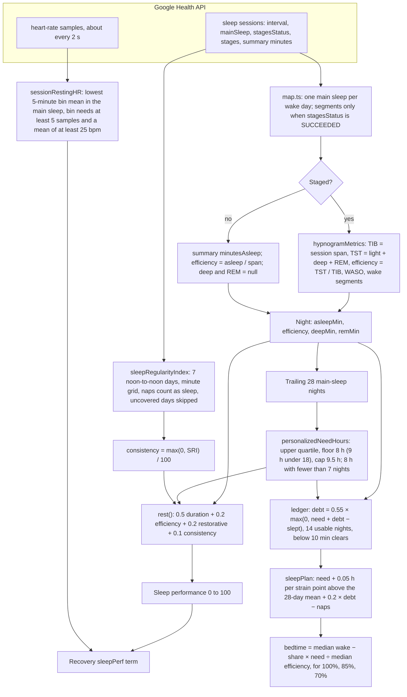
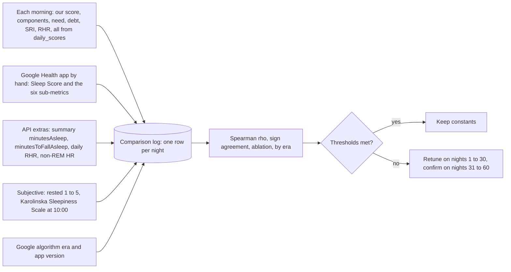

# Sleep scoring: evidence review

Scope: sleep performance (`rest()`), sleep need, sleep debt, sleep consistency and the Sleep Regularity Index, the Sleep Planner, the in-sleep resting heart rate, and the sleep parts of score confidence.

Code reviewed: `src/core/scoring/sleep.ts`, `restingHr.ts`, `confidence.ts`, `src/core/algorithms/sleepPlanner.ts`, `sleepRegularity.ts`, their tests, and how `src/server/pipeline.ts` wires them together. Docs reviewed: `docs/algorithms/sleep-planner.md`, `docs/algorithms/sleep-regularity.md`, `docs/data-notes.md`.

This is a research note. It changes no code. Each proposal below needs a `scoring_version` bump when it lands.

## Summary: the five findings that matter most

1. **Unstaged nights lose about 14 points for no physiological reason.** When Google returns a night without stages (`stagesStatus` is not `SUCCEEDED`, the "CLASSIC" type), `deepMin` and `remMin` are null. The pipeline passes them to `rest()` as 0, so the restorative term scores 0 instead of its usual value of about 70. The night's performance drops by 0.2 × 70 ≈ 14 points, and through `sleepPerf` that also lowers Recovery. A missing measurement is being scored as a terrible measurement. **Fix:** when stages are missing, drop the restorative term and renormalise the remaining weights. Do the same for a missing consistency value, instead of imputing a neutral 50.

2. **Sleep stage proportions carry too much weight for how well a wrist device measures them.** Wrist devices agree with polysomnography only moderately on four-stage scoring: kappa 0.41 to 0.42 for current Fitbits in an independent study (Schyvens 2025), and 0.63 for Google's own 2026 algorithm (Charton 2026). Deep sleep is the weakest stage, with about 50% epoch accuracy. In Google's own validation, the per-night deep sleep estimate is strongly pulled toward the population mean: the error falls by 0.82 minutes for every extra minute of true deep sleep. That means night-to-night changes in our restorative term are mostly noise. The NSF quality panel also found "less or no consensus" that sleep architecture indicates sleep quality (Ohayon 2017). Google's 2026 Sleep Score no longer has a deep-and-REM component at all. **Fix:** cut the restorative weight from 0.2 to 0.1. Score it as "inside the normal range" (NSF adult norms: REM 21 to 30%, N3 16 to 20%) instead of "more is better", and move the freed 0.1 to sleep continuity.

3. **Sleep debt forgets far too fast.** The ledger computes debt = 0.55 × max(0, need + debt − slept). That has two effects. First, 45% of a shortfall is written off the moment it happens: a night 2 h short shows only 66 min of debt the next morning. Second, the rest halves about every night, so the debt clears in 5 nights of merely on-target sleep (66 → 36 → 20 → 11 → 0). Under a chronic shortfall, debt can never exceed 1.22 × one night's shortfall. The evidence points the other way. Deficits from chronic restriction accumulate over 14 days (Van Dongen 2003). Three normal recovery nights do not restore performance (Belenky 2003). One 10 h recovery night is not enough (Banks 2010). Repaying 1 h of debt took four days of extended sleep (Kitamura 2016). **Fix:** use debt = max(0, r × debt + need − slept), with r ≈ 0.8 per night, inside the existing 14-night window. The full shortfall counts on the night it happens, and the debt has a half-life of about 3 nights. Cap the Planner's nightly repayment so it stays achievable.

4. **The efficiency term barely moves, and our continuity measures are not the ones Google and the NSF use.** Efficiency is scored linearly (0.88 → 88). Wearable efficiency almost always falls between 85 and 95%, so the term spans about 2 points of the final score. The NSF anchors are SE ≥ 85% for good and ≤ 74% for not good. They also include WASO (≤ 20 min good, ≥ 51 min not good) and the number of awakenings longer than 5 minutes (≤ 1 good, ≥ 4 not good). Google's 2026 score uses close analogues: "Interruptions" (WASO) and "Full awakenings" (wakes of 5 minutes or more). **Fix:** rescale efficiency on the NSF anchors (65% → 0, 75% → 40, 85% → 80, 95% → 100). Add a full-awakenings term (wakes ≥ 5 min inside the sleep period), which `hypnogramMetrics` can already produce.

5. **The need floor is too high for older adults, and the in-sleep resting HR uses a fragile statistic.** The adult need floor is 8.0 h for every age. The NSF range for adults 65 and over is 7 to 8 h (Hirshkowitz 2015), and older adults' measured sleep capacity is 7.4 h (Klerman & Dijk 2008). **Fix:** use a floor of 7.5 h from age 65. The resting HR is the *minimum* 5-minute bin mean of the whole night. A minimum is biased downward, and more so on longer nights because there are more bins to choose from. It is also the statistic most exposed to optical dropout artefacts, and our only artefact gate is 25 bpm. Industry methods use longer or averaged windows: Garmin takes the lowest 30-minute average, Oura reports both its lowest 10-minute segment and the night's average, and WHOOP uses an average weighted toward the last slow-wave sleep (Dial 2025). **Fix:** use the lowest rolling 30-minute mean (or the 10th percentile of 5-minute bins), with a relative plausibility gate. Recovery's 2 bpm spread floor was tuned on the current statistic, so retune it in the same change.

Some divergence from Google is expected by design: our consistency (SRI) term, our personalised need, and the stage term (until finding 2 is applied). The divergences that would point to a bug are covered in "What Google does" and in the validation plan.

## Current formula

### Data flow

### Each formula in words

**Hypnogram (`hypnogramMetrics`).** Time in bed (TIB) is the session's end minus its start. Total sleep time (TST) is the sum of the light, deep and REM segments. Sleep onset is the start of the first sleep segment, and the sleep period ends at the end of the last one. Sleep onset latency (SOL) is the onset minus the session start. WASO is the wake time between onset and the end of the sleep period, and `disturbances` counts every wake segment in that span, however short. Efficiency is TST ÷ TIB, capped at 1. Stage percentages are taken over TST.

**Performance (`rest`).** This is used only for the main sleep. Naps do not enter it.

- *Duration* = min(100, asleep hours ÷ need × 100). Weight 0.5.
- *Efficiency* = efficiency × 100. Weight 0.2.
- *Restorative* = min(100, (deep + REM) ÷ TST ÷ 0.5 × 100) × deepFactor, where deepFactor = 0.5 + 0.5 × min(1, deep share ÷ 0.13). Weight 0.2. A typical wearable night (deep 15%, REM 21%) scores 72.
- *Consistency* = max(0, SRI) ÷ 100 × 100. Weight 0.1. When it is missing, 50 is used, and the weights are not renormalised.
- The result is rounded to 2 dp. It is null only when there is no sleep time.

**Need (`personalizedNeedHours`).** This is the upper quartile (linear interpolation) of the main-sleep hours over the 28 nights before the scored night. It is floored at 8 h for adults (9 h under 18) and capped at 9.5 h. With fewer than 7 nights, it is 8 h (or the age floor). The performance score uses this need as it stands. Unlike WHOOP, it adds nothing for strain or debt.

**Debt (`ledger`).** The credited sleep for a night is the main sleep plus the previous day's naps. Nights without a usable main sleep are skipped, not counted as zero. Over the last 14 usable nights, starting from zero: debt ← 0.55 × max(0, need + debt − slept), and a result under 10 min is set to 0. Surplus sleep repays debt one-for-one before the 0.55 factor is applied. Under a constant shortfall *s*, the debt settles at 0.55·s ÷ 0.45 = 1.22·s.

**Consistency (`sleepRegularityIndex`).** This is Phillips et al.'s SRI on a 1-minute grid over 7 noon-to-noon days. Each minute is marked asleep when any session (naps included) covers it, using the session span rather than the stage-level sleep. Pairs (t, t + 24 h) are compared only when both days are "covered", which means at least 720 minutes with HR data. SRI = −100 + 200 × the share of pairs in the same state. `sleepConsistency` (1 − CV of duration) is still exported but is no longer called by the pipeline.

**Planner (`sleepPlan`).** need = baseline need + 0.05 h × max(0, today's Day Strain − 28-day mean Day Strain) + 0.2 × debt − today's nap minutes. Wake time is the median over the last 14 main sleeps of the same kind (weekday or weekend). Efficiency is the median over those nights, or 0.9 when none has one. For each share X in {1, 0.85, 0.7}: bedtime = wake − X × need ÷ efficiency.

**In-sleep resting HR (`sessionRestingHR`).** The main sleep is split into 5-minute bins. A bin counts only when it has at least 5 samples and a mean of at least 25 bpm, and the result is the lowest such bin mean. At least 30 distinct minutes with HR are required. If no bin passes the gates, the lowest bin mean of any kind is used. This value feeds Recovery's RHR term, whose 2 bpm spread floor was tuned on it.

**Confidence (`forRest`).** No session gives *calibrating*. A staged session gives *solid*, and an unstaged one *building*. A solid night drops to *building* when stage coverage is under 95%, or when efficiency is at least 0.85 while deep + REM is under 10% of sleep (a sign of misdetection).

## Per-component evidence review

Verdicts: **Supported** means the evidence backs the formula and constant. **Plausible but arbitrary** means it is reasonable but no source gives the number. **Contradicted** means the evidence points the other way.

### Sleep performance

| Component | Ours | Evidence | Verdict | Proposal | Sources |
|---|---|---|---|---|---|
| Duration term, weight 0.5 | min(100, TST ÷ need) | Duration is the best-established sleep health variable, with consensus recommendations from the AASM/SRS and the NSF. Fitbit's legacy score gave time asleep 50 of 100 points. Google says duration still makes up the majority of the 2026 score. Oura calls total sleep its most significant contributor. | Supported | Keep. A linear ratio is fine for rank agreement. | Watson 2015; Hirshkowitz 2015; Google Health Help; Fitbit legacy; Oura |
| Duration uses the main sleep only | Naps excluded | Google scores the "primary sleep window" only. Oura includes naps. | Supported for agreement with Google | Keep for performance; naps already count toward debt. | Google Health Help; Oura contributors |
| Efficiency term, weight 0.2 | SE × 100, linear | NSF: SE ≥ 85% indicates good quality at all ages, and ≤ 74% does not (≤ 64% for young adults). Healthy PSG SE falls about 2.1% per decade of age. Wearable SE barely varies (most nights 85 to 95%), and wrist devices detect wake poorly (specificity 0.48 to 0.69), so WASO is under-counted and SE inflated. A linear 0–100 map spends most of its range on values that never occur. | Plausible concept, poorly scaled | Piecewise map on the NSF anchors: 65% → 0, 75% → 40, 85% → 80, 95%+ → 100 (0.80 → 60, 0.88 → 86, 0.92 → 94). Keep weight 0.2. | Ohayon 2017; Boulos 2019; Chinoy 2021; Haghayegh 2019; Schyvens 2025 |
| Awakenings (not scored today) | `disturbances` counts every wake segment, however short; not used in the score | NSF: ≤ 1 awakening over 5 min indicates good quality, and ≥ 4 does not. Google's 2026 score has "Full awakenings" (≥ 5 min) and "Interruptions" (total wake between first sleep and final waking). | Gap | Add a full-awakenings term, weight 0.1: count wake segments ≥ 5 min inside the sleep period; 0–1 → 100, 2 → 70, 3 → 40, ≥ 4 → 0. | Ohayon 2017; Google Health Help |
| Restorative term, weight 0.2 | (deep + REM) share ÷ 0.5, times deepFactor | **Measurement.** Chinoy 2021: Fitbit deep sensitivity 0.53, REM 0.69, with "substantial individual night variability"; the authors advise against relying on stage estimates. Schyvens 2025: Fitbit Charge 5 and Sense four-stage kappa 0.41 to 0.42, deep accuracy about 51%. de Zambotti 2018: Charge 2 deep accuracy 0.49, N3 under-estimated by 24 min. Google's 2026 algorithm reaches kappa 0.63, but in its Bland–Altman analysis the deep-minutes error falls with slope −0.82 against true deep, so one night's estimate tracks the truth weakly. **Norms.** NSF: adult REM 21 to 30% is good and ≥ 41% is not good, and the panel warns against the "misperception that more REM sleep is always better"; adult N3 16 to 20% is good and ≤ 5% is not. Overall, the panel reached "less or no consensus" that architecture indicates quality. A 50% combined target sits at the top edge of the norms, and the score rises monotonically with no upper limit. | Contradicted (weight and "more is better" shape) | Weight 0.1. Band score: REM 100 inside 18 to 30%, falling linearly to 0 at 8% and at 41%; deep 100 at 13% or above, falling linearly to 0 at 5%; average the two. Drop the term and renormalise on unstaged nights. | Chinoy 2021; Schyvens 2025; de Zambotti 2018; Charton 2026; Ohayon 2017 |
| `deepShareTarget` 0.13 | deepFactor saturates at a 13% deep share | Google re-scored its training data with slow-wave power, which raised the mean deep share from 10.3% to 17.3%. Nights scored by the 2026 algorithm should fall under 13% much less often than nights scored by the pre-2025 algorithm (this is an inference; confirm it on real data). The same constant behaves differently across Google algorithm versions. Normal PSG N3 does not change significantly with age (Boulos 2019), while Ohayon 2004 found SWS declines in adults. | Plausible but version-dependent | Fold into the band score above. Record the Google algorithm era per night (see the validation plan). | Charton 2026; Boulos 2019; Ohayon 2004 |
| Consistency term, weight 0.1 | max(0, 7-day SRI) ÷ 100 | SRI is a validated metric: academic performance and circadian delay (Phillips 2017), cardiometabolic risk (Lunsford-Avery 2018), mortality, where it beat duration (Windred 2024). The NSF panel agrees that regularity matters for health. WHOOP puts a 4-day SRI-like consistency score into Sleep Performance. Fischer 2021 found SRI CIs about 39% wider at ≤ 7 days than interdaily stability, and that naps lower SRI by up to about 10% of the scale. Google's score has no regularity term. | Supported (concept); expected divergence from Google | Keep the weight. Optional: score last night's 24 h against each of the previous 4 days (WHOOP-style), so the term reacts to last night. Keep the 7-day SRI for display and Healthspan. | Phillips 2017; Lunsford-Avery 2018; Windred 2024; Sletten 2023; Fischer 2021; WHOOP consistency |
| Missing consistency → 50 | Neutral 50 at full weight, no renormalisation | No evidence basis. With typical SRI around 80 to 90, imputing 50 lowers the score by about 3 to 4 points on nights with too little coverage. | Contradicted by its own intent ("neutral") | Renormalise the remaining weights when it is missing. | n/a |
| Missing stages → 0 | Null deep and REM become 0 | Fitbit returns CLASSIC (unstaged) nights when staging fails. Treating "unknown" as "none" costs about 14 points and also reaches Recovery through `sleepPerf`. | Contradicted (bug-like) | Renormalise. Highest-impact fix. | Code: `pipeline.ts` (`rest()` call), `map.ts` |
| Latency / time to sound sleep | Computed (`solS`), not scored | NSF: SOL ≤ 30 min is good, > 60 min is poor. Google's 2026 score includes "Time to sound sleep", and Google's new algorithm estimates Time-Attempting-To-Sleep (TATS). Fitbit's older sessions start at detected sleep, so SOL was usually about 0. | Gap; depends on data | Once the first real probe shows non-zero `minutesToFallAsleep`, consider a small latency term. Until then, skip it. | Ohayon 2017; Google Health Help; Charton 2026 |

### Sleep need

| Component | Ours | Evidence | Verdict | Proposal | Sources |
|---|---|---|---|---|---|
| Adult floor 8.0 h | Every age ≥ 18 | AASM/SRS: adults need ≥ 7 h; > 9 h may suit young adults or people recovering debt. NSF: 7 to 9 h for adults 18 to 64, 7 to 8 h for 65+. Kitamura 2016: young men's optimal sleep was 8.4 h, about 1 h more than their habitual 7.4 h. Klerman & Dijk 2008: measured sleep capacity 8.9 h young vs 7.4 h older. | Supported for 18–64; contradicted for 65+ | 18–64: 8.0 h. 65+: 7.5 h. | Watson 2015; Hirshkowitz 2015; Kitamura 2016; Klerman & Dijk 2008 |
| Under-18 floor 9.0 h | | NSF teens 14 to 17: 8 to 10 h. | Supported (midpoint) | Keep. | Hirshkowitz 2015 |
| Upper quartile of 28 nights | Personal need | Habitual sleep under-states need by about 1 h, and the rebound on unconstrained nights tracks the hidden debt (Kitamura 2016). The upper quartile picks up exactly those longer, unconstrained nights. It is also self-referential: a run of long sick nights raises the need. | Plausible but arbitrary | Keep. Exclude nights flagged by the illness monitor if that is easy. | Kitamura 2016 |
| Cap 9.5 h | | AASM/SRS: the health effect of regularly sleeping > 9 h is uncertain. | Plausible | Keep. | Watson 2015 |
| No sex adjustment | | Google says its targets are tailored to age, gender and time attempting to sleep. Boulos 2019 finds sex effects mainly in REM latency and breathing indices, not TST. | Expected divergence | None. | Google Health Help; Boulos 2019 |

### Sleep debt

| Component | Ours | Evidence | Verdict | Proposal | Sources |
|---|---|---|---|---|---|
| Carry 0.55 applied to the new shortfall | debt = 0.55 × max(0, need + debt − slept) | Van Dongen 2003: 14 days at 6 h produced cumulative, near-linear deficits, equal to up to 2 nights of total deprivation, while subjective sleepiness plateaued (so people under-report debt). Belenky 2003: after 7 days at 5 to 7 h, three 8 h recovery nights gave "no evidence of recovery". Banks 2010: one 10 h night left deficits. Kitamura 2016: 1 h of debt took four days of extended sleep to repay. Depner 2019: weekend catch-up did not prevent metabolic effects. Two-process and later models give homeostatic recovery a time constant of hours, but add a slow component lasting days to weeks for chronic restriction (Borbély 2016; McCauley 2009). Our model writes off 45% at once and halves the rest every night, so a 2 h short night is gone in 5 normal nights. | Contradicted | debt = max(0, r × debt + need − slept), r = 0.8/night (half-life about 3 nights), keeping the 14-night window and the 10 min band. A 2 h short night then reads 120 → 96 → 77 → 61 min. A chronic 1 h shortfall reaches about 4.8 h in 14 nights. r itself is still arbitrary; tune it against next-day subjective sleepiness (validation plan). | Van Dongen 2003; Belenky 2003; Banks 2010; Kitamura 2016; Depner 2019; Borbély 2016; McCauley 2009 |
| Surplus repays 1:1 | | Recovery sleep raises TST and slow-wave energy, but neurobehavioural recovery is exponential in dose, and incomplete (Banks 2010). | Plausible | Keep 1:1. It is simple, and r already models extra forgetting. | Banks 2010 |
| Credit = main + previous day's naps | | WHOOP credits naps against need. | Supported | Keep. | WHOOP sleep need |
| Missing nights skipped | | A missing night is ambiguous (band off or no sleep). | Plausible | Keep, but show "debt based on N of 14 nights". | n/a |

### Sleep Planner

| Component | Ours | Evidence | Verdict | Proposal | Sources |
|---|---|---|---|---|---|
| Structure: need + strain + debt − naps | | Matches WHOOP's published structure, SleepNeed = Baseline + f1(strain) + f2(debt) − Naps. The functions are not disclosed. | Supported (structure) | Keep. | WHOOP sleep need |
| 0.05 h per strain point above mean | +18 min for +6 points | Acute exercise has only small effects on TST and SWS (Kredlow 2015 meta-analysis). There is no dose-response study of how much exercise raises sleep need. | Plausible but arbitrary (small, which is right) | Keep. | Kredlow 2015 |
| Repay 0.2 × debt tonight | | With the proposed r, debt gets bigger, so 0.2 × debt can ask for 60+ min extra. One very long night does not fully repay chronic restriction (Banks 2010), and people cannot reliably sleep far past their habitual length. | Plausible | Keep 0.2, but cap the debt add-on at 60 min per night. | Banks 2010 |
| Bedtime = wake − need ÷ efficiency | | If the session starts at detected sleep (older Fitbit sessions: SOL about 0), the efficiency leaves out time to fall asleep, so bedtimes come out about 10 to 20 min too late. NSF: SOL ≤ 15 to 30 min is normal. Google's 2026 algorithm models time attempting to sleep, so newer sessions may already include it. | Plausible; data-dependent | Subtract the median `solS` from the last 14 nights as a "lights-out buffer". It is 0 when sessions start at sleep, and the right size once TATS sessions arrive. | Ohayon 2017; Charton 2026 |
| Weekday/weekend median wake, 14 nights | | Social jet lag is real. Regularity matters (Sletten 2023). | Supported | Keep. Optional: show a hint when the weekend wake is more than 1 h later than the weekday one. | Sletten 2023 |
| Shares 100 / 85 / 70% | | WHOOP's Peak / Perform / Get By. A product choice. | n/a | Keep. | WHOOP |

### Sleep Regularity Index

| Component | Ours | Evidence | Verdict | Proposal | Sources |
|---|---|---|---|---|---|
| Formula, minute epochs | −100 + 200 × P(same state) | Exactly Phillips 2017's definition. Skipping uncovered days is a sound refinement. | Supported | Keep. | Phillips 2017 |
| 7-day window | | UK Biobank used 7-day accelerometry (Windred 2024: median SRI 81). Fischer 2021: SRI is the least dependent on study length, but has wide CIs at ≤ 7 days. | Supported | Keep. Show a "few days covered" state when fewer than 4 pairs are covered. | Windred 2024; Fischer 2021 |
| Naps count as sleep | | This is the original definition. Naps lower SRI by up to about 10% of the scale (Fischer 2021). | Supported | Keep. | Fischer 2021 |
| Asleep = session span, not stage-level sleep | | Wearable sessions are smoothed, so our SRI reads higher than accelerometer SRI (already noted in `sleep-regularity.md`). Fischer: SRI responds to WASO (up to 16% of the scale). | Plausible | Keep; the Healthspan curve is flat below 65, so the bias matters little. Or mark staged wake ≥ 5 min as awake. | Fischer 2021 |
| `sleepConsistency` (1 − CV) | Exported, unused by the pipeline | Fischer 2021: SD-type metrics miss day-to-day timing and fragmentation. | Superseded | Delete the dead export, and `restFromTotals` too. | Fischer 2021 |

### In-sleep resting heart rate

| Component | Ours | Evidence | Verdict | Proposal | Sources |
|---|---|---|---|---|---|
| Lowest 5-minute bin mean | Minimum over the night | Methods across brands differ widely: Garmin uses the lowest 30-minute average, Oura reports its lowest 10-minute segment plus the night's average, Polar uses the first 4 h, and WHOOP uses an average weighted toward the last slow-wave sleep. Dial 2025 validated nightly *averages* against ECG. Fitbit's daily RHR matched lying-down HR before waking, and within-person SD was 3 to 5 bpm under nominally similar conditions (Russell 2019). A minimum over N bins drifts lower as N grows (longer nights) and is the statistic most exposed to optical dropouts. | Plausible but statistically fragile | The lowest rolling 30-minute mean of 1-minute means (or the 10th percentile of 5-minute bins). Reject bins below 0.7 × the night's median, not just below 25 bpm. Retune Recovery's 2 bpm floor (`data-notes.md` already shows it binding on 108 of 166 seed days). | Dial 2025; Russell 2019; Oura RHR |
| ≥ 30 HR minutes, ≥ 5 samples per bin | | At about 1 sample per 2 s, a full bin holds about 150 samples, so 5 is a very weak gate. | Plausible | Require ≥ 50% of the expected samples in a bin. | `data-notes.md` cadence |
| Cross-check source | None | Google already provides daily RHR (`calculationMethod: WITH_SLEEP`) and `dailyHeartRateVariability.nonRemHeartRateBeatsPerMinute`. | Gap | Store both and log the gap to ours (validation plan). Fall back to non-REM HR before the daily RHR. | `data-notes.md` field paths |

### Confidence

| Component | Ours | Evidence | Verdict | Proposal | Sources |
|---|---|---|---|---|---|
| Staged → solid, unstaged → building | | Stage-based terms are the least reliable (above). | Supported | Keep. | Chinoy 2021 |
| Coverage < 95% → building | | Holes in the hypnogram bias TST and the stage shares. | Plausible | Keep. | n/a |
| SE ≥ 0.85 with deep + REM < 10% → building | | Catches nights where an off-wrist device was scored as light sleep. | Plausible | Keep. | n/a |
| Need still at the default | Not considered | With fewer than 7 nights, the duration term uses 8 h, not a personal need. | Gap | Also *building* while the need is the population default. | n/a |

### Proposed composite (all changes together)

performance = 0.50 · duration + 0.20 · efficiency(NSF-scaled) + 0.10 · full-awakenings + 0.10 · stage-band + 0.10 · consistency

When a term is missing, its weight is spread proportionally over the others. This keeps duration dominant, as in both Google scores. It moves weight from the least reliable measurement (stage shares) to continuity, which the NSF supports and which Google's 2026 score uses. Before anything is tuned, test the change with the ablation in the validation plan.

## What Google does

**The current score (Google Health app, 2026).** Google describes six contributors: sleep duration ("time asleep during your primary sleep window"), time to sound sleep, sound sleep (steady, undisturbed Light, Deep and REM, identified partly by a calm, steady heart rate), restlessness, full awakenings (wakes over 5 minutes) and interruptions (time fully awake between first sleep and final waking). The targets are "tailored to your age, gender, and total time you were sleeping or attempting to sleep". Duration is the majority of the score. Most users average 72 to 83. There are no published weights, and no regularity term. Google also notes that historical scores changed with the update. The redesign reached Public Preview users in April 2026, and new staging algorithms shipped in July 2025 and early 2026 (kappa 0.47 → 0.56 → 0.63).

**The legacy score (Fitbit, before 2026).** Time asleep was worth 50 points, deep and REM 25, and restoration 25. Restoration rewarded sleeping HR below the daytime resting HR and penalised restlessness. The live help page no longer shows this breakdown; the citation is the explainer below.

**Expected divergences** (by design; do not "fix" them):
- Our 10% consistency (SRI) term. Google has none.
- A personal upper-quartile need vs Google's age and sex targets, which also depend on time attempting to sleep.
- Our stage-share term. Google's 2026 score has no deep/REM term, only "sound sleep", which includes Light.
- No restlessness or "sound sleep" input on our side, because the API exposes neither.
- Our Google comparisons will shift wherever Google's algorithm era changes.

**Suspicious divergences** (investigate):
- Disagreement on nights where duration differs a lot. Both scores are dominated by duration, so this points to a TST mismatch, the wrong main session, or day assignment (data-notes Q1).
- Our TST differing from `summary.minutesAsleep` by more than about 5 minutes on staged nights. Check how `shortAwakenings[]` are treated.
- Large drops on unstaged nights (finding 1).
- A consistent offset that grows with WASO. That would point to efficiency scaling.

**Other vendors, for context.** WHOOP's Sleep Performance combines sufficiency (hours vs need, where need includes strain, debt and naps), consistency (SRI-like, over 4 days), efficiency and sleep stress. Its weights are undisclosed. Oura uses seven contributors: total sleep, efficiency (target ≥ 85%), restfulness, REM, deep (typically 15 to 20%), latency (ideal 15 to 20 min) and timing. Its weights are undisclosed.

## Validation plan

Google's scores are not available through the API, so this plan relies on a daily manual log next to our stored values.

**What to log, per night:** our performance and each component (duration, efficiency, awakenings, stage, consistency); need, debt and SRI; our in-sleep RHR; Google's Sleep Score and its sub-metrics as the app shows them; `summary.minutesAsleep`, `minutesAwake` and `minutesToFallAsleep`; Google's daily RHR and non-REM HR; a 1 to 5 "how rested" rating and a Karolinska Sleepiness Scale rating at a fixed morning time; and a flag for the algorithm era or app version. Keep the free-text notes (alcohol, illness, travel) so outliers can be explained.

**Metrics and targets.** Use at least 60 nights within one Google algorithm era. Tune on the first 30 nights and judge on the next 30, so we do not fit to noise. At n = 30, a Spearman ρ of 0.7 has a 95% CI of about ±0.2.

| Check | Metric | Good enough |
|---|---|---|
| Overall agreement with Google | Spearman ρ, our performance vs Google Sleep Score | ρ ≥ 0.70 (≥ 0.60 is acceptable, given the expected divergences) |
| Direction of change | Share of nights where sign(Δ ours) = sign(Δ Google), counting only nights where Google moved ≥ 3 points | ≥ 75% |
| The composite earns its parts | ρ of the composite vs ρ of the duration term alone | Composite ≥ duration-only. If a component lowers ρ when added (ablation), cut its weight. |
| Stage term | ρ with and without the stage term | Removing it should not lower ρ by more than 0.02; if it does not help, keep it at 0.1 or below |
| TST pipeline | abs(our TST − `minutesAsleep`) on staged nights | Median ≤ 2 min, 95th percentile ≤ 10 min |
| Debt | Spearman ρ, debt vs next-morning KSS (within person) | ρ ≥ 0.2 and positive. Choose r (0.7 to 0.9) by the best ρ on the tuning half |
| Resting HR | ρ vs Google daily RHR; sign agreement of day-to-day changes | ρ ≥ 0.8; sign agreement ≥ 70%; a stable offset (ours lower is expected) |
| Subjective validity | Spearman ρ, performance vs the 1 to 5 rating | ρ ≥ 0.3, and not lower than Google's own ρ with the same rating |
| SRI sanity | Distribution | Median roughly 80 to 92 for a regular sleeper; it falls in weeks with travel |

**Rules for comparing.** Compare only nights from the same Google algorithm era. Exclude unstaged nights from the stage-term ablation, but keep them in the overall ρ, which is where finding 1 shows up. Log, and do not tune, the expected divergences above. If ρ stays under 0.6 after the five fixes, look for a pipeline fault (main-session choice, day assignment) before you change the weights.

## References

Consensus and duration
- Watson NF et al. Recommended amount of sleep for a healthy adult (AASM/SRS). *J Clin Sleep Med* 2015. https://pmc.ncbi.nlm.nih.gov/articles/PMC4442216/
- Hirshkowitz M et al. National Sleep Foundation's sleep time duration recommendations. *Sleep Health* 2015. https://doi.org/10.1016/j.sleh.2014.12.010
- Ohayon M et al. National Sleep Foundation's sleep quality recommendations: first report. *Sleep Health* 2017. https://doi.org/10.1016/j.sleh.2016.11.006 (full text: https://fatiguemanagersnetwork.org/wp-content/uploads/Ohayon-et-al.2017_National-Sleep-Foundations-Sleep-Quality-Recommendations.pdf)
- Klerman EB, Dijk DJ. Age-related reduction in the maximal capacity for sleep. *Curr Biol* 2008. https://pmc.ncbi.nlm.nih.gov/articles/PMC2582347/

Sleep need and debt
- Van Dongen HPA et al. The cumulative cost of additional wakefulness. *Sleep* 2003. https://doi.org/10.1093/sleep/26.2.117
- Belenky G et al. Patterns of performance degradation and restoration during sleep restriction and subsequent recovery. *J Sleep Res* 2003. https://doi.org/10.1046/j.1365-2869.2003.00337.x
- Banks S et al. Neurobehavioral dynamics following chronic sleep restriction: one night for recovery. *Sleep* 2010. https://pmc.ncbi.nlm.nih.gov/articles/PMC2910531/
- Kitamura S et al. Estimating individual optimal sleep duration and potential sleep debt. *Sci Rep* 2016. https://www.nature.com/articles/srep35812
- Depner CM et al. Ad libitum weekend recovery sleep fails to prevent metabolic dysregulation. *Curr Biol* 2019. https://doi.org/10.1016/j.cub.2019.01.069
- Borbély AA et al. The two-process model of sleep regulation: a reappraisal. *J Sleep Res* 2016. https://doi.org/10.1111/jsr.12371
- McCauley P et al. A new mathematical model for the homeostatic effects of sleep loss on neurobehavioral performance. *J Theor Biol* 2009. https://labs.wsu.edu/sprc/documents/2016/11/2009jtb-mccauley-etal.pdf/
- Kredlow MA et al. The effects of physical activity on sleep: a meta-analytic review. *J Behav Med* 2015. https://doi.org/10.1007/s10865-015-9617-6

Regularity
- Phillips AJK et al. Irregular sleep/wake patterns are associated with poorer academic performance. *Sci Rep* 2017. https://www.nature.com/articles/s41598-017-03171-4
- Lunsford-Avery JR et al. Validation of the Sleep Regularity Index in older adults. *Sci Rep* 2018. https://www.nature.com/articles/s41598-018-32402-5
- Windred DP et al. Sleep regularity is a stronger predictor of mortality risk than sleep duration. *Sleep* 2024. https://pmc.ncbi.nlm.nih.gov/articles/PMC10782501/
- Fischer D, Klerman EB, Phillips AJK. Measuring sleep regularity: theoretical properties and practical usage of existing metrics. *Sleep* 2021. https://pmc.ncbi.nlm.nih.gov/articles/PMC8503839/
- Sletten TL et al. The importance of sleep regularity: NSF consensus statement. *Sleep Health* 2023. https://doi.org/10.1016/j.sleh.2023.07.016

Architecture norms
- Ohayon MM et al. Meta-analysis of quantitative sleep parameters from childhood to old age. *Sleep* 2004. https://doi.org/10.1093/sleep/27.7.1255
- Boulos MI et al. Normal polysomnography parameters in healthy adults. *Lancet Respir Med* 2019. https://doi.org/10.1016/S2213-2600(19)30057-8

Wearable validity
- de Zambotti M et al. A validation study of Fitbit Charge 2 compared with polysomnography in adults. *Chronobiol Int* 2018. https://pubmed.ncbi.nlm.nih.gov/29235907/
- Chinoy ED et al. Performance of seven consumer sleep-tracking devices compared with polysomnography. *Sleep* 2021. https://academic.oup.com/sleep/article/44/5/zsaa291/6055610
- Haghayegh S et al. Accuracy of wristband Fitbit models in assessing sleep. *J Med Internet Res* 2019. https://www.jmir.org/2019/11/e16273/
- Schyvens AM et al. Performance validation of six commercial wrist-worn sleep trackers vs polysomnography. *Sleep Adv* 2025. https://academic.oup.com/sleepadvances/article/6/2/zpaf021/8090472
- Charton A, Heneghan C et al. (Google Research). Performance analysis of updated sleep tracking algorithms across Google and Fitbit wearable devices. 2026. https://research.google/pubs/performance-analysis-of-updated-sleep-tracking-algorithms-across-google-and-fitbit-wearable-devices/

Resting heart rate
- Dial MB et al. Validation of nocturnal resting heart rate and heart rate variability in consumer wearables. *Physiol Rep* 2025. https://pmc.ncbi.nlm.nih.gov/articles/PMC12367097/
- Russell A, Heneghan C, Venkatraman S. Investigation of an estimate of daily resting heart rate using a consumer wearable device. *medRxiv* 2019. https://www.medrxiv.org/content/10.1101/19008771v1

Vendor documentation
- Google Health Help, "What's the Sleep Score in the Google Health app". https://support.google.com/googlehealth/answer/14236513?hl=en (also https://support.google.com/fitbit/answer/14236513)
- 9to5Google, Fitbit Sleep Score redesign (April 2026). https://9to5google.com/2026/04/22/fitbit-sleep-score-redesign/ and sleep tracking improvements (March 2026). https://9to5google.com/2026/03/17/fitbit-sleep-tracking-improvements/
- Legacy Fitbit score breakdown (50/25/25, secondary source; the official page has since been replaced). https://www.androidpolice.com/fitbit-sleep-score-calculation-explainer/
- WHOOP Sleep support article. https://support.whoop.com/s/article/WHOOP-Sleep (could not be fetched directly; the content comes from search-index excerpts)
- WHOOP, "How much sleep do I need" (Sleep Need formula). https://www.whoop.com/us/en/thelocker/how-much-sleep-do-i-need/ (search-index excerpt)
- WHOOP, "Sleep Consistency: why we track it". https://www.whoop.com/us/en/thelocker/new-feature-sleep-consistency-why-we-track-it/ (search-index excerpt)
- Oura, "Sleep Contributors". https://support.ouraring.com/hc/en-us/articles/360057792293-Sleep-Contributors
- Oura, "What is resting heart rate". https://ouraring.com/blog/resting-heart-rate/
