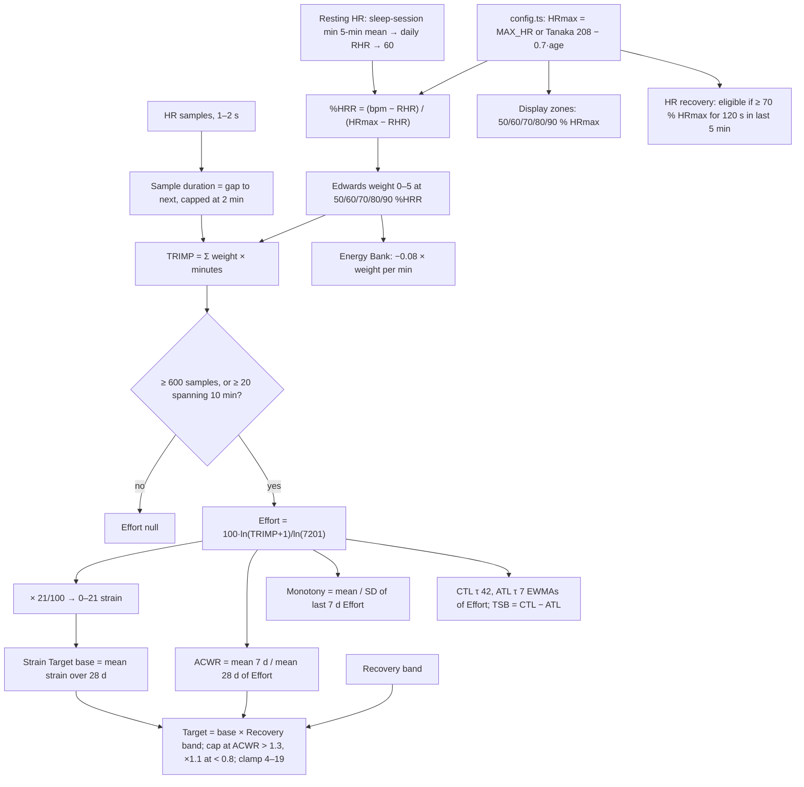

# Strain, load and HR zones: evidence review

Scope: Effort (Strain), HR zones, training load (ACWR, monotony, CTL/ATL/TSB), Strain Target, Energy Bank, heart-rate recovery and max HR estimation. This is a review only. No code was changed.

Files reviewed:

- `src/core/scoring/strain.ts`, `zones.ts`, `trainingLoad.ts`, `hrRecovery.ts`
- `src/core/scoring/readiness.ts`, for the ACWR and monotony that feed Strain Target
- `src/core/algorithms/strainTarget.ts`, `energyBank.ts`
- `src/server/pipeline.ts` (`stage1Day`), for how these functions are actually called
- `src/server/config.ts`, for the `MAX_HR` default
- `docs/algorithms/strain-target.md`, `energy-bank.md`, `docs/data-notes.md`

The numbers in the worked examples below come from a scratch script that re-implements the formulas in this repo. They use a 36-year-old male profile (the `.env.example` birth date), a Tanaka HRmax of 183 and a resting HR of 55, unless stated otherwise.

## Summary: the top 5 findings

**1. Every load ratio and average is computed on the log-scaled Effort, which mostly disables the ACWR, monotony and CTL/ATL logic.** Effort is `100 × ln(TRIMP + 1) / ln(7201)`. A log map is fine for showing one day's number. But ACWR, monotony, CTL, ATL, TSB and the Strain Target's ACWR rules all take ratios or averages of that log value, and they assume the load is linear. In log units, a week with **3–4× the usual linear load** only reaches an ACWR of 1.3. Reaching 1.5 (the "spiking" band) needs **6–11×**, so it is practically unreachable. Monotony goes the other way and is inflated. On the seed's typical week (four workout days at strain 11.3 and three rest days at 5.4), monotony on Effort is **2.78**, so it flags "watch" at the ≥ 2.0 threshold. On linear TRIMP the same week scores **1.22**. Foster's monotony and Banister's fitness–fatigue model are defined on additive load ([Foster 1998](https://pubmed.ncbi.nlm.nih.gov/9662690/); [Morton, Fitz-Clarke & Banister 1990](https://journals.physiology.org/doi/10.1152/jappl.1990.69.3.1171)). Google's Target Load also sums Cardio Load over 7 days ([Phillips et al., Google](https://arxiv.org/abs/2508.11613)).
**Proposal:** store a linear daily load (TRIMP) next to Effort. Feed ACWR, monotony, CTL/ATL/TSB and the Strain Target from it. Keep Effort for display only.

**2. The default TRIMP is not the one Google uses, so daily Effort will rank days differently from Google's Cardio Load.** Our default is Edwards-style: stepped weights 1–5 at 50/60/70/80/90 % of heart-rate reserve (%HRR). Google publishes its Cardio Load as **Banister's exponential TRIMP on %HRR** (k = 1.92 for men, 1.67 for women), computed per minute, with three changes. A minute needs at least **30 % HRR**. It needs **movement evidence** from the accelerometer. Load between **30 and 40 % HRR is down-weighted** ([Phillips et al.](https://arxiv.org/html/2508.11613v1); [Google Health Help](https://support.google.com/fitbit/answer/15402655?hl=en)). Two things follow. Our Edwards day ignores everything below 50 % HRR, which is about 119 bpm here, while Google counts from 30 % (about 93 bpm). And our "Edwards" is not Edwards: the original uses % of **HRmax**, not %HRR ([Edwards via Frontiers 2020](https://www.frontiersin.org/articles/10.3389/fphys.2020.00480/full)).
**Proposal:** make `method = "banister"` the default (the code exists already). Pass `profile.sex` from the pipeline, which today always falls back to "male". Replace the 10 % HRR sedentary floor with Google's 30 % floor, plus a 30–40 % ramp. Gate each minute on steps > 0 or being inside an exercise session. Compute on minute-mean HR.

**3. HRmax is a population formula that never learns from data.** `config.ts` sets HRmax to Tanaka (208 − 0.7 × age) unless `MAX_HR` is set. `estimateHRmax` in `strain.ts`, which would raise HRmax from observed HR, is never called. Age formulas have individual errors of about ±10 bpm (Nes 2013: SEE 10.8 bpm). Because Banister weights intensity exponentially, an HRmax that is 12 bpm too low turns 170 bpm from 82 % into 90 % HRR. WHOOP's public material says it starts from an age formula and then raises HRmax from recorded workout peaks ([WHOOP](https://www.whoop.com/us/en/thelocker/why-whoop-uses-heart-rate-reserve-not-max-heart-rate/)). Google's help page says it uses 220 − age ([Google Health Help](https://support.google.com/googlehealth/answer/14237938?hl=en)). At age 36 that is within 1 bpm of Tanaka, so the choice of formula is not what will separate us from Google.
**Proposal:** keep Tanaka as the prior. Raise HRmax only, to a robust observed peak: the highest 60-second rolling median inside exercise sessions over the last 180 days, accepted only if it is no more than 25 bpm above the formula (to reject artifacts). Record the source in `maxHrSource`.

**4. The resting HR in Karvonen is last night's minimum sleeping HR, which is noisy and couples Recovery into Strain.** `stage1Day` uses `sessionRestingHR` (the lowest 5-minute mean during the main sleep), then Google's daily resting HR, then 60. The sleeping minimum is lower than a daytime resting HR, and it moves night to night with sleep quality and alcohol. So the same workout scores a different Effort depending on how you slept. Karvonen defined resting HR as an awake, rested value ([Karvonen 1957](https://pubmed.ncbi.nlm.nih.gov/13470504/)). Google computes zones from its daily resting HR ([Google Health Help](https://support.google.com/googlehealth/answer/14237938?hl=en)).
**Proposal:** for Strain, zones, the Energy Bank and HRR eligibility, use a 7-day rolling median of Google's `daily-resting-heart-rate`. Fall back to the sleep-session value only when no daily value exists. Recovery keeps the sleep-session value.

**5. ACWR thresholds are applied as if they were established, and the Strain Target builds on them.** The 0.8 / 1.3 / 1.5 bands come from Gabbett's injury data in team sports ([Gabbett 2016](https://bjsm.bmj.com/content/50/5/273)). Later work shows the coupled rolling-average ACWR creates a spurious correlation of about 0.5 between acute and chronic load ([Lolli et al. 2019](https://bjsm.bmj.com/content/53/15/921)). It also has ratio artifacts and no causal evidence behind the thresholds ([Impellizzeri et al. 2020](https://journals.humankinetics.com/view/journals/ijspp/15/6/article-p907.xml); [Wang et al. 2020](https://link.springer.com/article/10.1007/s40279-020-01280-1)). Google uses the 7-day vs 28-day comparison only to describe status and to set a weekly target, from the larger of a rolling mean and an EWMA ([Phillips et al.](https://arxiv.org/html/2508.11613v1)). Garmin labels 0.8–1.4 as "optimal" ([Garmin manual](https://www8.garmin.com/manuals/webhelp/GUID-0221611A-992D-495E-8DED-1DD448F7A066/EN-US/GUID-200689D7-F65C-40F0-BB82-3C51236C676A.html)).
**Proposal:**
- Compute ACWR on linear load (finding 1).
- Show it as a load trend, never as injury risk.
- Rebuild the Strain Target in linear weekly load, the way Google does: weekly target = max(28-day rolling weekly mean, EWMA) × a goal factor; today's target = the weekly target minus the last 6 days' load, scaled by the Recovery band, then mapped to the 0–21 scale for display.

Smaller findings, covered in the table:

- There are three zone systems:
  - display zones on %HRmax (`zones.ts`);
  - Strain zones on %HRR;
  - Google's zones on %HRR at 40/60/85.
- Heart-rate recovery is sound as a personal trend, but clinical cut-offs do not transfer to free-living workouts.
- The Energy Bank counts sleep twice.

## Current formulas

### Effort (`strain.ts`)

- **Inputs.** A time-ordered HR series for a day (local midnight to midnight, sleep included) or for one exercise session. Also HRmax, resting HR, method (default `"edwards"`) and sex (default `"male"`; the pipeline never passes it).
- **Gate.** At least 600 samples, or at least 20 samples spanning at least 600 s. HRmax must exceed resting HR. Otherwise the result is null.
- **Sample duration.** Each sample is credited with the gap to the next one, capped at 2 minutes. The last sample reuses the previous gap.
- **Edwards weight.** Unclamped %HRR ≥ 90 → 5, ≥ 80 → 4, ≥ 70 → 3, ≥ 60 → 2, ≥ 50 → 1, otherwise 0. TRIMP = Σ weight × minutes.
- **Banister (optional).** Rate per minute = 0.64 · x · e^(b·x), where x is %HRR clamped to [0, 1], b = 1.92 for men and 1.67 for women. A sedentary floor is subtracted per minute: the rate at x = 0.1, which is about 0.078 per minute for men.
- **Log map.** Effort = 100 · ln(TRIMP + 1) / ln(D), rounded to 2 dp. D is 7201 for Edwards, the value 24 h in zone 5 gives (plus 1), so that day maps to exactly 100. For Banister, D is the equivalent 24 h ceiling minus the sedentary baseline.
- **Scale.** The 0–21 strain is Effort × 0.21.
- **HRmax helpers.** `tanakaHRmax`. `defaultMaxHR = 220 − age` (used only when HRmax is null, which the pipeline never passes). `estimateHRmax`: the 99.5th percentile of an HR history once there are at least 600 samples, used only when above Tanaka. It is unused.

Reference points for Edwards Effort:

| TRIMP | 0 | 10 | 30 | 60 | 100 | 180 | 300 | 500 |
|---|---|---|---|---|---|---|---|---|
| Effort | 0 | 27.0 | 38.7 | 46.3 | 52.0 | 58.5 | 64.3 | 70.0 |
| 0–21 | 0 | 5.7 | 8.1 | 9.7 | 10.9 | 12.3 | 13.5 | 14.7 |

60 minutes at zone 3 is TRIMP 180, which is strain 12.3.

### Display zones (`zones.ts`)

There are five zones at 50/60/70/80/90/100 % of HRmax, or five custom lower bounds in bpm. Time in zone credits each sample with the gap to the next one, capped at the median gap, which is itself taken over gaps under 300 s. The pipeline builds these zones with `hrZones(maxHr, "manual")`, so they are always %HRmax.

### Training load (`trainingLoad.ts`, `readiness.ts`)

- **Daily load.** The day's Effort. A worn day with null Effort is 0. An unworn day is null.
- **CTL, ATL and TSB.**
  - These are EWMAs with α = 1 − e^(−1/τ): τ = 42 days for CTL and 7 days for ATL.
  - They are seeded with the mean of the first 7 days, over the longest gap-free run ending on the target day.
  - At least 14 days give "building"; at least 42 give "established".
  - TSB = CTL − ATL.
- **ACWR** (readiness). The mean Effort of the last 7 days divided by the mean of the last 28, which includes those 7 (a coupled ratio). It needs at least 14 days. The bands are < 0.8 "ramping down", < 1.3 "sweet spot", < 1.5 "building fast", and otherwise "spiking". "Spiking" makes the readiness level strained or run-down.
- **Monotony.** The mean divided by the sample SD of the last 7 days' Effort, with at least 4 days. At ≥ 2.0 it flags "watch".

### Strain Target (`strainTarget.ts`)

- **Base.** The base is the mean 0–21 strain over the last 28 days. Days without Effort are skipped. With fewer than 14 days, a cold-start range is used instead: green 14–18, yellow 10–14, red 6–10.
- **Recovery band.** The range is the base times the band's multipliers: green [1.0, 1.25], yellow [0.8, 1.0], red [0.5, 0.75].
- **ACWR rules.**
  - ACWR > 1.3 caps the upper bound at the base.
  - ACWR < 0.8 multiplies both bounds by 1.1.
- **Bounds.** Clamp to [4, 19], with a width of at least 2, widened downwards.

### Energy Bank (`energyBank.ts`)

- **Start at wake.** E₀ = 0.6 × Recovery + 0.4 × sleep performance.
- **Each awake minute.** E loses 0.04, loses 0.08 × the Edwards weight of the minute's mean HR, and loses 0.08 if stress is ≥ 2. It gains 0.01 if stress is < 1.
- **Nap minutes.** E gains 0.25.
- **Clamp.** E is clamped to 0–100 each minute.

### Heart-rate recovery (`hrRecovery.ts`)

- **Eligibility.** HR held ≥ 70 % of HRmax for 120 s without a break (gaps ≤ 10 s) within the session's last 5 minutes, and the last 30 s hold at least 3 samples.
- **endHr.** The peak bpm in the last 30 s.
- **HRR at 1, 2 and 5 minutes.** endHr minus the median bpm within ±15 s of the session end + N minutes. Each reading needs at least 3 samples.

## Per-component evidence review

Verdicts: **supported** (matches a primary source or a published method), **plausible but arbitrary** (reasonable, no evidence for the exact value), **contradicted** (conflicts with the evidence or with the method's own assumptions).

| Component | Ours | Evidence | Verdict | Proposal | Sources |
|---|---|---|---|---|---|
| Ratios and EWMAs on Effort | ACWR, monotony, CTL/ATL/TSB and the Strain Target ACWR all run on log Effort | Banister's impulse–response model and Foster's load, monotony and strain are defined on additive dose. Google sums Cardio Load over 7 days. On log Effort, ACWR 1.3 needs a 2.9–4.2× linear surge and 1.5 needs 5.7–11×. A normally varied week has monotony 2.78 on Effort vs 1.22 on TRIMP. | **Contradicted** | Persist daily linear TRIMP. Run every ratio and EWMA on it. Effort stays a display transform. | [Morton 1990](https://journals.physiology.org/doi/10.1152/jappl.1990.69.3.1171), [Foster 1998](https://pubmed.ncbi.nlm.nih.gov/9662690/), [Phillips et al.](https://arxiv.org/html/2508.11613v1) |
| TRIMP method (default) | Edwards-style stepped weights on %HRR | Edwards' original zones are % of **HRmax** (50–60 % = 1 … 90–100 % = 5). 50 % HRR is about 65 % HRmax here, so our zone 1 starts at 119 bpm instead of 92. Google uses Banister on %HRR. | **Contradicted** (the name), plausible as a design | Default to Banister with Google's rules (next row). If Edwards is kept, call it "zone TRIMP on %HRR". | [Frontiers 2020](https://www.frontiersin.org/articles/10.3389/fphys.2020.00480/full), [ACSM, Garber 2011](https://pubmed.ncbi.nlm.nih.gov/21694556/) |
| Banister constants | 0.64 · x · e^(b·x), b 1.92 / 1.67, 0.64 for both sexes | Banister's original uses 0.64 e^(1.92x) for men and **0.86** e^(1.67x) for women. Google uses 0.64 for both, with k 1.92 / 1.67. For one user, the multiplier only rescales, so ranking is unchanged. | **Supported** (matches Google) | Keep 0.64 to match Google. Note the 0.86 in a comment. | [Morton 1990](https://journals.physiology.org/doi/10.1152/jappl.1990.69.3.1171), [Phillips et al.](https://arxiv.org/html/2508.11613v1), [Intervals.icu summary](https://forum.intervals.icu/t/bannisters-trimp/10200) |
| Banister sedentary floor | Subtract the rate at 10 % HRR from every sample | Google needs ≥ 30 % HRR, down-weights 30–40 %, and needs accelerometer movement for each minute. A 10 % floor credits fidgeting, stress HR and digestion. | **Plausible but arbitrary**; diverges from Google | Floor at 30 % HRR. Ramp the weight linearly from 0 at 30 % to 1 at 40 % (Google's factor is undisclosed). Credit a minute only if steps > 0 or it is inside an exercise session. | [Phillips et al.](https://arxiv.org/html/2508.11613v1) |
| Per-sample vs per-minute | TRIMP over 1–2 s samples | Google computes per minute. With an exponential weight, per-second values sum higher than minute means (Jensen's inequality). The effect is small but systematic in intervals. | Plausible | Use minute-mean HR, the same grid as the Energy Bank. | [Phillips et al.](https://arxiv.org/html/2508.11613v1) |
| Log map to 0–100 / 0–21 | 100 · ln(TRIMP + 1) / ln(7201) | WHOOP describes Strain as logarithmic, 0–21 and Borg-inspired. The formula is **undisclosed**. Anchoring 100 to "24 h in zone 5" is arbitrary but harmless, and a monotone map does not change rank correlation. | **Plausible but arbitrary** | Keep it for display. Do not average or divide it (row 1). | [WHOOP](https://www.whoop.com/us/en/thelocker/how-does-whoop-strain-work-101/) |
| Data gates and gap cap | ≥ 600 samples, or ≥ 20 spanning 10 min; gaps credited up to 2 min | No literature. With 1–2 s Pixel cadence, the 2-min cap can credit missing data. Zone bars cap at the median gap instead, so the bars and Effort can disagree. | Plausible | Use one gap rule for both, for example a 30 s cap for exercise data. Log the minutes of data per day. | — |
| HRmax default | Tanaka 208 − 0.7·age (`config.ts`) | Tanaka pooled 18,712 subjects in 351 studies. Gellish gives 207 − 0.7·age; Nes gives 211 − 0.64·age (SEE 10.8 bpm). Google uses 220 − age. WHOOP starts from Gellish and auto-adjusts. At age 36 the formulas give 181.8–188. | **Supported** as a prior; individual error is about ±10 bpm | Keep Tanaka as the prior (at 36, 220 − age differs by 1 bpm). | [Tanaka 2001](https://pubmed.ncbi.nlm.nih.gov/11153730/), [Gellish 2007](https://pubmed.ncbi.nlm.nih.gov/17468581/), [Nes 2013](https://onlinelibrary.wiley.com/doi/abs/10.1111/j.1600-0838.2012.01445.x), [Google](https://support.google.com/googlehealth/answer/14237938?hl=en) |
| HRmax from data | `estimateHRmax` (99.5th percentile of all HR) exists but is unused | A percentile over all-day data sits below true max. Exercise peaks are the right evidence, which is what WHOOP describes doing. | **Contradicted** (dead code; no learning) | Raise only, to the highest 60 s rolling median inside exercise sessions over 180 days, capped at formula + 25 bpm. Show "observed" in Settings. | [WHOOP](https://www.whoop.com/us/en/thelocker/why-whoop-uses-heart-rate-reserve-not-max-heart-rate/) |
| Resting HR for Karvonen | Last night's lowest 5-min sleeping mean → daily RHR → 60 | Karvonen used a rested, awake HR. Google uses its daily RHR. A night-to-night value makes Effort depend on sleep (a 6 bpm change moves %HRR at 140 bpm by about 1.5 points). | **Plausible but arbitrary**; adds noise | 7-day median of Google's daily RHR. | [Karvonen 1957](https://pubmed.ncbi.nlm.nih.gov/13470504/), [Google](https://support.google.com/googlehealth/answer/14237938?hl=en) |
| Display zones | 50/60/70/80/90 % HRmax | Both %HRmax and %HRR are accepted (ACSM). But Strain and the Energy Bank use %HRR, and Google's zones are %HRR at 40/60/85, so the zone bars explain neither Effort nor Google's zone minutes. | Plausible; inconsistent | Show zones on %HRR. Offer Google's 4-zone view (< 40, 40–59, 60–84, ≥ 85 % HRR) so exercises can be checked against the API's `heartRateZoneDurations`. | [ACSM, Garber 2011](https://pubmed.ncbi.nlm.nih.gov/21694556/), [Google](https://support.google.com/googlehealth/answer/14237938?hl=en) |
| ACWR window and coupling | 7 d mean / 28 d mean, coupled, rolling | Gabbett's 0.8–1.3 / ≥ 1.5 bands come from team-sport injury data. Coupling creates r ≈ 0.5. The ratio has statistical artifacts and no causal support. EWMA (Williams; Murray 2017) is more sensitive. Garmin calls 0.8–1.4 optimal. Google compares the last 7 days with 4 weeks. | **Plausible but arbitrary** as a descriptor; **contradicted** as an injury-risk signal | Compute on linear load. Use EWMA (τ 7 and 28) or an uncoupled form (7 d vs the prior 21 d). Keep the bands as descriptive "trend" labels. Do not let "spiking" alone drive a run-down readiness. | [Gabbett 2016](https://bjsm.bmj.com/content/50/5/273), [Lolli 2019](https://bjsm.bmj.com/content/53/15/921), [Impellizzeri 2020](https://journals.humankinetics.com/view/journals/ijspp/15/6/article-p907.xml), [Wang 2020](https://link.springer.com/article/10.1007/s40279-020-01280-1), [Williams 2017](https://bjsm.bmj.com/content/51/3/209), [Murray 2017](https://bjsm.bmj.com/content/51/9/749), [Garmin](https://www8.garmin.com/manuals/webhelp/GUID-0221611A-992D-495E-8DED-1DD448F7A066/EN-US/GUID-200689D7-F65C-40F0-BB82-3C51236C676A.html) |
| Monotony | Mean / SD of 7 days of Effort; watch at ≥ 2.0 | Foster's monotony uses session load, with rest days as 0. Our all-day Effort never reaches 0 and is log-compressed, so monotony is inflated (2.78 vs 1.22 on the same week). The 2.0 threshold is practitioner convention and is not in Foster's abstract. | **Contradicted** (as implemented) | Compute on linear **exercise** TRIMP, with rest days as 0. Keep 2.0 as a soft "watch". | [Foster 1998](https://pubmed.ncbi.nlm.nih.gov/9662690/), [Foster 2001](https://pubmed.ncbi.nlm.nih.gov/11708692/) |
| CTL / ATL / TSB | τ 42 / 7, α = 1 − e^(−1/τ), seeded with the 7-day mean, needs an unbroken run | The 42 / 7 time constants are the TrainingPeaks / Coggan convention, a simplified Banister model. One null day restarts the whole series. | **Supported** constants; **contradicted** input (log) | Feed linear TRIMP. Bridge gaps of 1–2 days by decaying with load 0 rather than restarting. | [TrainingPeaks](https://help.trainingpeaks.com/hc/en-us/articles/204071884-Fitness-CTL), [Morton 1990](https://journals.physiology.org/doi/10.1152/jappl.1990.69.3.1171) |
| Strain Target base and multipliers | Mean of 28 days of 0–21 strain × band [1.0, 1.25] / [0.8, 1.0] / [0.5, 0.75] | WHOOP's Strain Coach is undisclosed. Averaging log strain over rest and workout days gives a base (about 9 on the seed) below a normal workout (about 11). Google sets a **weekly** target from max(rolling mean, EWMA) of 7-day load. Google's readiness adjustment and goal factors are undisclosed. | **Plausible but arbitrary** | Weekly target in linear load = max(28 d rolling weekly mean, EWMA) × goal (1.0 maintain; 1.1 improve, tunable). Daily = (weekly target − last 6 days' load) × band factor, clamped, then mapped to 0–21 for display. | [Phillips et al.](https://arxiv.org/html/2508.11613v1), [Google Help](https://support.google.com/fitbit/answer/15402655?hl=en) |
| Strain Target ACWR rules | Cap above 1.3; ×1.1 below 0.8 | These inherit the log compression, so they almost never fire. They also inherit the ACWR caveats. | **Contradicted** (as implemented) | Superseded by the weekly-budget target above. If kept, run on linear ACWR. | as above |
| HRR eligibility | ≥ 70 % HRmax for 120 s in the last 5 min | Clinical HRR is measured after a peak or symptom-limited test. A 70 % HRmax gate is a reasonable minimum for a meaningful drop. | Plausible | Keep. Also store endHr, because HRR scales with the peak. | [Cole 1999](https://www.nejm.org/doi/full/10.1056/NEJM199910283411804) |
| HRR measurement | endHr (peak in the last 30 s) − median at +1/2/5 min ± 15 s | This matches the clinical definition (peak minus HR 1 min later). The workout end is when the user pressed stop, not when effort ceased. Pressing stop late makes HRR look worse. | **Supported** method; timing risk | Detect cessation as the last minute with HR at ≥ 90 % of the session's final-5-min peak, or the step-rate drop, within ±2 min of the recorded end. | [Cole 1999](https://www.nejm.org/doi/full/10.1056/NEJM199910283411804), [Shetler 2001](https://www.jacc.org/doi/10.1016/S0735-1097(01)01652-7) |
| HRR norms | None applied | The cut-offs depend on protocol: ≤ 12 bpm at 1 min with a walking cool-down (Cole 1999); ≤ 18 bpm lying down straight away (Watanabe 2001); < 22 bpm at 2 min with no cool-down (Shetler 2001). Free-living sessions match none of these. | n/a | Show HRR as a personal trend: a z-score against the last 20 eligible sessions, stratified by endHr. Show the clinical "≤ 12 bpm" only as a soft caption. | [Cole 1999](https://www.nejm.org/doi/full/10.1056/NEJM199910283411804), [Watanabe 2001](https://pubmed.ncbi.nlm.nih.gov/11602493/), [Shetler 2001](https://www.jacc.org/doi/10.1016/S0735-1097(01)01652-7) |
| Energy Bank model | Linear per-minute drains and recharges, k0–k4 tuned so a typical day ends at 15–40 | Body Battery (Firstbeat/Garmin) is driven by HRV-derived stress and recovery, sleep and activity. Its method is only qualitatively disclosed. No published model gives our constants. Recovery already includes sleep performance (weight 0.15), so the 0.4 × sleep term counts sleep twice. | **Plausible but arbitrary** | Keep it as a heuristic labelled "estimate". Use the same per-minute load as Strain once that moves to Banister (scaled so a zone-3 hour still costs about 14). Remove the double count of sleep: either start at E₀ = Recovery alone, or keep the 0.4 × sleep term and use a Recovery without its sleep term. | [Firstbeat white paper](https://assets.firstbeat.com/firstbeat/uploads/2015/11/Stress-and-recovery_white-paper_20145.pdf), [Garmin Body Battery](https://www8.garmin.com/manuals/webhelp/GUID-5D183A14-BB43-4A9B-B441-5F824214CE40/EN-US/GUID-87E1392B-2C55-40B7-A1FF-3AB9252DA0A0.html) |

## What Google does, and which divergences to expect

Google's method is partly public through a Google-authored paper and its help pages. The parts that matter here:

- **Cardio Load.**
  - Banister TRIMP per minute: L = 0.64 · x · e^(k·x), with x = %HRR / 100 and k = 1.92 for men, 1.67 for women.
  - It counts all-day activity, not only workouts.
  - A minute needs at least 30 % HRR and movement evidence from the inertial sensors. Load between 30 and 40 % HRR is down-weighted, by an undisclosed factor.
  - Source: [Phillips, Rogmen, Speed & Harle](https://arxiv.org/html/2508.11613v1); [Google Health Help](https://support.google.com/fitbit/answer/15402655?hl=en).
- **HRmax and resting HR.** The zone help page says HRmax is 220 − age and zones use heart-rate reserve with Google's daily resting HR ([Google Health Help](https://support.google.com/googlehealth/answer/14237938?hl=en)). The paper does not say how Cardio Load gets HRmax or resting HR, so assume the same.
- **Zones.** Light < 40 %, moderate 40–59 %, vigorous 60–84 %, peak ≥ 85 % of HRR ([Google Health Help](https://support.google.com/googlehealth/answer/14237938?hl=en)).
- **Target Load.**
  - Target Load is weekly. Chronic load is either the mean weekly load over the previous 28 days or an EWMA of the 7-day load, and the target uses whichever is larger.
  - A population-derived minimum applies.
  - The training goal (maintain or improve) and Daily Readiness adjust it, by undisclosed rules.
  - The first target appears after 7 days; it is refined after 4 weeks.
  - The status (under training / maintaining / improving) compares the last 7 days with the last 4 weeks.
  - The EWMA α, the goal multipliers and the readiness adjustment are **undisclosed**.
- **Not available.** None of these values come through the Google Health API.

Divergences to **expect** (not bugs):

- **Absolute scale.** Google shows linear Cardio Load numbers, while we show log Effort. Rank correlation is unaffected.
- **HRmax.** Tanaka vs 220 − age differs by about 1 bpm at 36 and by up to 7 bpm at 65. Once observed-peak HRmax is in, ours may be higher than Google's.
- **Movement gating.** We approximate the accelerometer with step counts and exercise sessions. Cycling or strength work outside a logged session will lose load on our side.
- **Target values.** Google's goal and readiness rules are undisclosed, so only direction and rank of the target can be compared.

Divergences that would be **suspicious** after the proposals land:

- Daily rank correlation below about 0.85 with Google's daily Cardio Load. Same formula family, so the gap should be small.
- Disagreement concentrated on days dominated by light activity. That points to the 30–40 % ramp or the movement gate.
- Our per-exercise HRR zone minutes differing from the API's `exercise.metricsSummary.heartRateZoneDurations`. That points to a different HRmax or resting HR.

## Validation plan

Google's Cardio Load and Target Load are not in the API, so the comparison needs one manual reading a day. The exercise zone durations are in the API and can be checked automatically.

**What to log, per day** (a `strain_validation` table or a CSV):

- From the Google Health app, by hand, the next morning:
  - yesterday's Cardio Load;
  - the 7-day Cardio Load;
  - the Target Load range;
  - the training status.
- Ours:
  - Edwards TRIMP, Banister TRIMP (with the Google-style floor and gate) and Effort;
  - minutes at ≥ 30 %, 30–40 % and ≥ 40 % HRR, and the minutes removed by the movement gate;
  - the HRmax and resting HR used, with their sources;
  - minutes of HR coverage;
  - linear and log ACWR, monotony, and the Strain Target range.
  - `scoring_version`, so a change of method splits the series.
- Per exercise:
  - our minutes in < 40 / 40–59 / 60–84 / ≥ 85 % HRR, next to Google's `heartRateZoneDurations` and `activeZoneMinutes` from the API;
  - endHr, HRR at 1, 2 and 5 minutes, the recorded end and the detected cessation;
  - the observed 60 s peak.
- Optionally, at 10:00, 15:00 and 21:00: a 1–5 self-rated energy score for the Energy Bank.

**Metrics and thresholds.** Use at least 56 days. With n = 28, a Spearman ρ of 0.85 has a 95 % interval of roughly ±0.15.

| Check | Metric | Good enough |
|---|---|---|
| Daily load vs Google Cardio Load | Spearman ρ | ≥ 0.85 (Banister method); also report Edwards to show the gain |
| Day-over-day direction | % agreement in sign of Δ, on days when Google moves by more than 10 % | ≥ 80 % |
| 7-day load vs Google's 7-day | Spearman ρ | ≥ 0.90 |
| Scale stability | CV of (Google / ours) on days with load > 0 | ≤ 20 % (then a single constant could rescale if wanted) |
| Exercise zone minutes vs API | Median absolute difference per zone | ≤ 10 % of session duration; a consistent bias in one direction means HRmax or resting HR is off |
| Training status | Cohen's κ between our ACWR band (< 0.8 / 0.8–1.3 / > 1.3, linear) and Google's (under / maintaining / improving) | ≥ 0.6 |
| Weekly target | Spearman ρ of the target midpoints, and the direction of week-over-week change | ρ ≥ 0.7, direction ≥ 75 % |
| HRmax | Count of sessions whose 60 s peak exceeds the HRmax in use | 0 after the auto-raise; any hit means a re-estimate |
| HRR | Test–retest ICC of HRR60 across repeats of the same workout type with similar endHr (± 5 bpm) | ICC ≥ 0.7; eligibility ≥ 60 % of hard sessions |
| Energy Bank | Spearman ρ with self-rated energy, pooled over all readings | ≥ 0.4 to keep; < 0.2 means retune or drop |

**How to read failures.**

- **Low daily ρ with good exercise zone agreement.** The issue is the all-day light-activity handling: the floor, the ramp and the movement gate. Sweep the ramp factor and the gate first.
- **Poor zone agreement.** Fit an HRmax offset and a resting-HR offset that minimise the zone-minute error. The fitted values estimate what Google is using.
- **Good daily ρ but poor status agreement.** The windows or the coupling differ. Try the EWMA variant, then the uncoupled one.

## References

Primary literature

- Banister, Fitness–fatigue / TRIMP: Morton RH, Fitz-Clarke JR, Banister EW. Modeling human performance in running. *J Appl Physiol* 1990;69:1171–1177. https://journals.physiology.org/doi/10.1152/jappl.1990.69.3.1171
- Edwards S. *The Heart Rate Monitor Book*, 1993. The zone definitions are as summarised in Frontiers in Physiology 2020. https://www.frontiersin.org/articles/10.3389/fphys.2020.00480/full
- Karvonen MJ, Kentala E, Mustala O. The effects of training on heart rate. *Ann Med Exp Biol Fenn* 1957;35:307–315. https://pubmed.ncbi.nlm.nih.gov/13470504/
- Garber CE et al. ACSM position stand: quantity and quality of exercise. *Med Sci Sports Exerc* 2011;43:1334–1359. https://pubmed.ncbi.nlm.nih.gov/21694556/
- Tanaka H, Monahan KD, Seals DR. Age-predicted maximal heart rate revisited. *J Am Coll Cardiol* 2001;37:153–156. https://pubmed.ncbi.nlm.nih.gov/11153730/
- Gellish RL et al. Longitudinal modeling of the relationship between age and maximal heart rate. *Med Sci Sports Exerc* 2007;39:822–829. https://pubmed.ncbi.nlm.nih.gov/17468581/
- Nes BM et al. Age-predicted maximal heart rate in healthy subjects: the HUNT Fitness Study. *Scand J Med Sci Sports* 2013;23:697–704. https://onlinelibrary.wiley.com/doi/abs/10.1111/j.1600-0838.2012.01445.x
- Foster C. Monitoring training in athletes with reference to overtraining syndrome. *Med Sci Sports Exerc* 1998;30:1164–1168. https://pubmed.ncbi.nlm.nih.gov/9662690/
- Foster C et al. A new approach to monitoring exercise training. *J Strength Cond Res* 2001;15:109–115. https://pubmed.ncbi.nlm.nih.gov/11708692/
- Gabbett TJ. The training–injury prevention paradox. *Br J Sports Med* 2016;50:273–280. https://bjsm.bmj.com/content/50/5/273
- Lolli L et al. Mathematical coupling causes spurious correlation within the conventional acute-to-chronic workload ratio calculations. *Br J Sports Med* 2019;53:921–922. https://bjsm.bmj.com/content/53/15/921
- Impellizzeri FM et al. Acute:chronic workload ratio: conceptual issues and fundamental pitfalls. *Int J Sports Physiol Perform* 2020;15:907–913. https://journals.humankinetics.com/view/journals/ijspp/15/6/article-p907.xml
- Impellizzeri FM et al. Training load and its role in injury prevention, part 2. *J Athl Train* 2020;55:893–901. https://pmc.ncbi.nlm.nih.gov/articles/PMC7534938/
- Wang C et al. Analyzing activity and injury: lessons learned from the acute:chronic workload ratio. *Sports Med* 2020;50:1243–1254. https://link.springer.com/article/10.1007/s40279-020-01280-1
- Williams S et al. Better way to determine the acute:chronic workload ratio? *Br J Sports Med* 2017;51:209–210. https://bjsm.bmj.com/content/51/3/209
- Murray NB et al. Calculating acute:chronic workload ratios using exponentially weighted moving averages. *Br J Sports Med* 2017;51:749–754. https://bjsm.bmj.com/content/51/9/749
- Cole CR et al. Heart-rate recovery immediately after exercise as a predictor of mortality. *N Engl J Med* 1999;341:1351–1357. https://www.nejm.org/doi/full/10.1056/NEJM199910283411804
- Watanabe J et al. Heart rate recovery immediately after treadmill exercise and left ventricular systolic dysfunction as predictors of mortality. *Circulation* 2001;104:1911–1916. https://pubmed.ncbi.nlm.nih.gov/11602493/
- Shetler K et al. Heart rate recovery: validation and methodologic issues. *J Am Coll Cardiol* 2001;38:1980–1987. https://www.jacc.org/doi/10.1016/S0735-1097(01)01652-7

Vendor documentation

- Phillips J, Rogmen D, Speed C, Harle R (Google). Adaptive Cardio Load Targets for Improving Fitness and Performance. arXiv:2508.11613, 2025. https://arxiv.org/abs/2508.11613
- Google Health Help, Learn about cardio load and target load. https://support.google.com/fitbit/answer/15402655?hl=en
- Google Health Help, Track your heart rate (zones, HRmax 220 − age, HRR). https://support.google.com/googlehealth/answer/14237938?hl=en
- WHOOP, How does WHOOP Strain work? https://www.whoop.com/us/en/thelocker/how-does-whoop-strain-work-101/ (the page blocks automated fetching; its content is cited from search excerpts)
- WHOOP, Why WHOOP uses heart rate reserve, not max heart rate. https://www.whoop.com/us/en/thelocker/why-whoop-uses-heart-rate-reserve-not-max-heart-rate/ (cited from search excerpts: Gellish-based HRmax, adjusted from workout peaks; nightly resting HR)
- Garmin Forerunner 965 manual, Load ratio. https://www8.garmin.com/manuals/webhelp/GUID-0221611A-992D-495E-8DED-1DD448F7A066/EN-US/GUID-200689D7-F65C-40F0-BB82-3C51236C676A.html
- Garmin vívoactive 5 manual, Body Battery. https://www8.garmin.com/manuals/webhelp/GUID-5D183A14-BB43-4A9B-B441-5F824214CE40/EN-US/GUID-87E1392B-2C55-40B7-A1FF-3AB9252DA0A0.html
- Firstbeat, Stress and Recovery Analysis Method Based on 24-hour Heart Rate Variability (white paper). https://assets.firstbeat.com/firstbeat/uploads/2015/11/Stress-and-recovery_white-paper_20145.pdf
- TrainingPeaks Help, Fitness (CTL). https://help.trainingpeaks.com/hc/en-us/articles/204071884-Fitness-CTL
