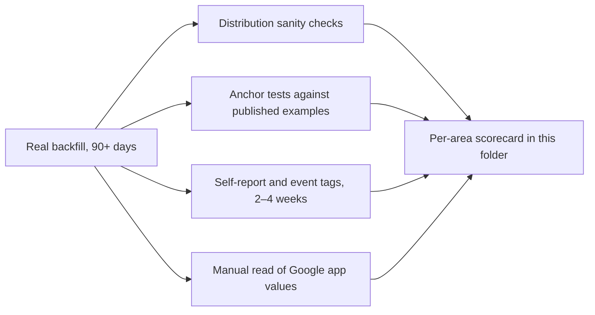

# Research review: Stress, Healthspan, Fitness level, Health Monitor, Journal impact

Status: research only. No code was changed. Reviewed on 2026-10-03 against `feat/pulse-v1`.

Scope: `src/core/scoring/stressBase.ts`, `src/core/algorithms/stress.ts`, `healthspan.ts`, `fitnessLevel.ts`, `healthMonitor.ts`, `journalImpact.ts`, their tests, and the matching docs in `docs/algorithms/` and `docs/data-notes.md`.

The Google Health API gives us raw signals only (heart rate, steps, sleep sessions, nightly vitals, VO2max, weight and body fat). Google's own stress, resilience and fitness-level outputs are not in the API, so every score here has to stand on its own. Where a vendor (WHOOP, Google, Garmin) has published its method we compare against it. Where a vendor has not, we say so.

## Summary of the top 5 findings

1. **Healthspan is about twice as harsh as WHOOP's published method, and some of its inputs move the wrong way.** WHOOP's 2025 white paper gives its targets, its HR-to-years conversion and its Pace formula. When we feed WHOOP's own example people (white paper Table 2) through our code, the "average US 30-year-old man" scores **+13.6 years** (WHOOP says about +6). The "typical WHOOP member" scores **+2.9 years** (WHOOP says −1.6). Most people would see a WHOOP Age 5–15 years above their real age. The causes:
   - Our reference profile is much stricter than WHOOP's "meets recommendations" profile. For example, zones 4–5 is 75 min/week in ours and 7–10 in WHOOP's.
   - Missing inputs are scaled up by 9/n.
   - The lean-mass term rewards weight gain, because it uses fat-free mass index (FFMI) without the fat-mass term it was adjusted for.
   - Sleeping 9 h costs 2.3 years, which WHOOP deliberately avoids.
   - Never logging strength workouts costs 1.6 years.
   - Pace of Aging uses a scale of 5 years where WHOOP's definition implies 0.5, so our Pace sits near 1.0 almost always.

   **Proposal:** adopt WHOOP's published targets as the reference, score missing inputs as 0 instead of renormalizing, add the fat-mass term, remove the long-sleep penalty, treat strength as missing when it is never logged, and set the Pace scale to 0.5 years.
2. **The Health Monitor's fixed 95 % SpO2 floor contradicts wearable data and would flag about 40 % of healthy people.** In 33,080 Apple Watch users, mean *nightly* SpO2 was 95.38 % (SD 1.47). Google's own help page says night-time SpO2 is "typically above 90%". On top of that, five vitals each checked against ±2σ means about 19 % of perfectly normal nights show at least one flag.

   **Proposal:** lower the floor to 90 %, make each vital one-sided (only the clinically meaningful direction), and require persistence before a flag (2 of the last 3 nights).
3. **Stress divides each minute's heart rate by the wrong spread, so ordinary sitting reads "high".** In baseline mode, σ is the *day-to-day* spread of the daily calm floor, held at its 3.76 bpm minimum. It is then applied to *minute-level* heart rate, which varies far more within a day. A still minute only 7.4 bpm above the calm floor already reads 2.0 ("high"). The same minute read 0.93 the day before the baseline became usable, so the scale roughly doubles on day 4. Posture (sitting to standing adds about 20 bpm), meals (+6–21 %) and post-workout recovery are not excluded.

   **Proposal:** take the reference and σ from the person's own distribution of still-minute heart rate (median and robust SD over 28 days, by time-of-day block), add a 60-minute post-workout exclusion, and widen the stillness window.
4. **Journal impact will report spurious effects.** It runs about 27 tests (9 tags × 3 metrics) at 90 % confidence, with no multiple-comparison control. It resamples days as if they were independent, although recovery is autocorrelated and behaviours cluster on weekends. A percentile bootstrap with 5 days per arm is known to give intervals that are too narrow. About 2.7 false "effects" are expected per analysis even when nothing is real. With 5 days per arm, only effects of about 24 recovery points or more can be detected reliably.

   **Proposal:** use a Welch t-interval with an autocorrelation-adjusted effective n, apply Benjamini–Hochberg FDR across tags × metrics, require 10 days per arm before labelling, and remove day-of-week means from outcomes first.
5. **Fitness level labels are one band more flattering than the standard ones, and the daily VO2max path is circular.**
   - Our "Good" (40th–59th percentile) is "Average" in the ACSM/Cooper convention, and our "Superior" (≥ 80th) is their "Excellent".
   - Fitbit's no-run VO2max is computed from resting HR, age, sex and weight. Ranking it against age and sex norms mostly re-reports resting HR and BMI.
   - The redesigned Google Health app now measures VO2max only on GPS outdoor runs, so `daily-vo2-max` may disappear.

   **Proposal:** use the six ACSM/Cooper labels, show a percentile band (run VO2max is about ±5 mL/kg/min), and mark daily-VO2max results "estimated from resting HR" with no category.

## Current formulas

```mermaid
flowchart TB
  subgraph Stress
    HR[HR samples] --> MIN[Mean HR per minute]
    ST[Steps per minute] --> STILL{0 steps within ±2 min, not in workout or sleep?}
    MIN --> STILL
    STILL -->|yes| Z["z = (minute HR − reference) / σ"]
    AGG[Daily aggregate: P10 of waking-hour still HR] --> FOLD[Winsorized EWMA fold over prior days]
    FOLD -->|usable, 4+ days| SIG1["reference = baseline centre, σ = 1.253 × spread (≥ 3.76 bpm)"]
    FOLD -->|not usable| SIG2["σ = 7.65 bpm fixed, provisional"]
    SIG1 --> Z
    SIG2 --> Z
    Z --> LOG["stress = 3 / (1 + e^(−1.5(z − 1.5)))"]
    LOG --> BANDS["low < 1 ≤ medium < 2 ≤ high"]
  end
  subgraph Healthspan
    DAYS[180 days of daily rows] --> MEANS[Window means: 180 d and 30 d]
    MEANS --> CURVE["Per input: ln HR = curve(x) − curve(reference)"]
    REF[Reference profile: FRIEND p75 VO2max, 10k steps, 150/75/40 min/wk, RHR 60, sleep 7.5 h, SRI 86.3, FFMI 18.9/15.4] --> CURVE
    CURVE --> SUM["Δage = Σ ln HR × 0.75 × 9/n ÷ (ln2 / 8)"]
    SUM --> AGE["WHOOP Age = age + clamp(Δ180, ±15)"]
    SUM --> PACE["Pace = clamp(1 + (Δ30 − Δ180)/5, −1, 3)"]
  end
  subgraph Fitness
    VO2[run VO2max in 90 d, else daily VO2max] --> PCT[Percentile within FRIEND 2015 decade row, clamped 5–95]
    PCT --> CAT["Poor < 20 ≤ Fair < 40 ≤ Good < 60 ≤ Excellent < 80 ≤ Superior"]
  end
  subgraph Monitor[Health Monitor]
    NIGHT[Prior nights per vital] --> EW[Winsorized EWMA, half-life 14 nights]
    EW --> RANGE["range = centre ± 2σ; SpO2 low = max(range low, 95), high = 100"]
    RANGE --> STAT[in_range, high, low or no_data, for 5 vitals]
  end
  subgraph Journal[Journal impact]
    TAGS[Tag yes or no on day D, last 90 days] --> PAIR[Pair with outcomes on D + 1]
    PAIR --> GATE{5+ yes and 5+ no?}
    GATE -->|yes| BOOT["Δ = mean yes − mean no; 1,000-resample percentile bootstrap, 90 % CI"]
    BOOT --> LAB[positive or negative if the CI excludes 0]
  end
```

### Stress (`stress.ts`, using helpers from `stressBase.ts`)

- **Inputs:** the day's HR samples, steps per minute, workout and sleep intervals, and a `BaselineState` folded from earlier days.
- **Minute grid:** one value per minute from local midnight, the mean of that minute's HR samples.
- **Gates:** a minute is scored only if it has HR, it and the 2 minutes either side have 0 steps (`stillWindowMin = 2`), and it does not overlap a workout or sleep session.
- **Daily aggregate:** for each waking hour (06:00–22:00) with at least 15 still minutes, take the mean HR. The aggregate is the 10th percentile of those hourly means. Aggregates fold through `foldHistory` with `daytime_hr` (half-life 14 days, floor spread 3 bpm).
- **Reference and σ:**
  - When the baseline is usable (4 or more accepted days), the reference is the baseline centre and σ = 1.253 × spread, at least 3.76 bpm.
  - Otherwise σ is a fixed 15 / 1.96 = 7.65 bpm and the day is marked provisional. The reference falls back to today's own aggregate if no day has been accepted.
- **Level:** z = (minute HR − reference) / σ, then stress = 3 / (1 + e^(−1.5(z − 1.5))). At the baseline a minute reads 0.29, and at +3σ it reads 2.71.
- **Bands:** low < 1, medium 1–2, high ≥ 2. The output also has hourly means and the day's average.
- **`stressBase.ts`** holds the older noop path, scored on hourly means with a midpoint of 1.5. The pipeline uses only its helpers: `quantile`, the waking-hour test and the P10 constant.

### Healthspan (`healthspan.ts`)

- **Inputs, as window means:** sleep hours; SRI (trailing 7 days); zones 1–3 and zones 4–5 minutes (%HRmax zones from all-day HR), × 7 for weekly; strength-workout minutes × 7, set to 0 on worn days with none; steps; VO2max (run value if any in 90 days, else the daily value at weight 0.5); Google's daily RHR; FFMI = weight × (1 − fat %) / height².
- **Curves:** piecewise-linear in ln HR, taken from Kodama 2009, Zhang 2016, Paluch 2022, Cappuccio 2010, Windred 2024, Ekelund 2019, Lee 2022, Momma 2022 and Sedlmeier 2021.
- **Reference:** FRIEND 75th-percentile VO2max for age and sex, 10k steps (8k at 60+), RHR 60, sleep 7.5 h, SRI 86.3, 150 / 75 / 40 min/week, FFMI 18.9 (men) or 15.4 (women).
- **Conversion:**
  - Δage = Σ ln HR × 0.75 × (9 / n) / (ln 2 / 8), where n is the number of inputs present (at least 5).
  - WHOOP Age = age + clamp(Δ180d, ±15).
  - Pace = clamp(1 + (Δ30d − Δ180d) / 5, −1, 3).

### Fitness level (`fitnessLevel.ts`)

- The percentile is interpolated between the FRIEND 2015 treadmill columns (5, 10, 25, 50, 75, 90, 95) in the person's decade row, and clamped to 5–95.
- The category comes from the percentile: Poor < 20, Fair 20–39, Good 40–59, Excellent 60–79, Superior ≥ 80.
- `referenceVo2max` gives Healthspan its reference: the 75th-percentile column, interpolated between decade midpoints.

### Health Monitor (`healthMonitor.ts`)

- Each vital (RHR, HRV, respiratory rate, SpO2, skin-temperature deviation) folds through a Winsorized EWMA over the prior nights.
- The range is centre ± 2σ, with σ = 1.253 × spread. Floor spreads give minimum half-widths of about ±5 bpm, ±12.5 ms, ±1.25 breaths/min and ±0.75 °C.
- SpO2 is one-sided: its low bound is max(centre − 2σ, 95) and its high bound is 100.
- A vital needs 4 accepted nights and must not be stale.
- The output is "N of 5 in range", with noop's illness signal shown alongside.

### Journal impact (`journalImpact.ts`)

- Behaviour days are the 90 days before `asOf`, and each day's tag is paired with the next day's recovery, HRV z-score and sleep performance.
- Each arm needs at least 5 days.
- The effect is Δ = mean(yes) − mean(no), with a seeded 1,000-resample i.i.d. percentile bootstrap and a 90 % CI.
- An effect is labelled positive or negative when its CI excludes 0. Tags are ranked by |Δ recovery|.

## Per-component evidence review

Verdicts: **supported** (the value or shape follows the cited evidence), **plausible but arbitrary** (defensible, but chosen rather than derived), **contradicted** (evidence points elsewhere).

### Stress

| Component | Ours | Evidence | Verdict | Proposal | Sources |
|---|---|---|---|---|---|
| HR-only signal (no HRV, no EDA) | Minute HR vs a personal reference | The API exposes no R-R intervals, and the Fitbit Air has no EDA sensor. Garmin's Firstbeat stress score, which is HRV-based, correlates with HR at r = 0.74–0.84 and with RMSSD at r = −0.41 to −0.63 in a 60-person lab study. Firstbeat's method uses HR level, HRV and HRV-derived respiration. HR alone is therefore a reasonable proxy for the vendor scores. | Supported, given the data | Keep. In the UI call it "physiological arousal", not stress. | [Garmin GSS study](https://www.biorxiv.org/content/10.1101/2025.01.06.630177v1.full), [Firstbeat white paper](https://assets.firstbeat.com/firstbeat/uploads/2015/11/Stress-and-recovery_white-paper_20145.pdf), [Fitbit Air sensors](https://www.androidcentral.com/wearables/fitbit/google-fitbit-air-launch-specs-price) |
| σ in baseline mode | 1.253 × EWMA spread of the *daily P10 aggregate* (between-day), floored at 3.76 bpm | This is the wrong dispersion. The baseline's spread measures how the calm floor moves from day to day. The quantity being scored is a single minute's HR, which varies much more within a day. With σ = 3.76, a still minute at +7.4 bpm already reads 2.0 ("high") and +10 bpm reads 2.55. A 7–10 bpm swing is ordinary within a still day: a meal alone raises HR 6–21 %. | Contradicted (statistically inconsistent) | Take σ from the person's still-minute HR distribution over the last 28 days: σ = 1.4826 × MAD. Take the reference as the median of the same distribution, within the same 2–3 hour local block (morning, midday, afternoon, evening) to absorb the circadian rise. Then calibrate z₀ so that about 10 % of still minutes are "high" on a typical day. A simpler, equivalent option is to score each minute by its percentile in that distribution (level = 3 × percentile). | [Postprandial HR review](https://www.i-jmr.org/2024/1/e52167) |
| Provisional σ | Fixed 7.65 bpm | Combined with the floored 3.76 bpm later, the same +7.4 bpm minute reads 0.93 before day 4 and 2.01 after it, so the scale jumps when the baseline becomes usable. | Contradicted (internal inconsistency) | Use the same within-day estimator from day 1: today's still-minute MAD, shrunk toward a population prior of about 6 bpm until 7 days exist. | — |
| Reference = P10 of hourly means | The calm floor | P10 sits below typical still HR by construction, so most of the day reads above the reference. This is defensible for a 0-anchored scale, but it compounds the σ problem. | Plausible but arbitrary | Use the median of still minutes. The logistic midpoint then carries the meaning of "elevated". | — |
| Stillness gate | 0 steps within ±2 min | Steps miss standing, cycling, lifting and cooking. Sitting to standing raises HR by about 20 bpm (supine 0, sitting +10, standing +30 in 351 adults). HR also takes minutes to settle after walking. Myrtek's non-metabolic HR method compares against the previous 3 minutes of activity. Google says Body Response is disabled during inferred exercise but does not publish how. | Plausible but too narrow | Widen the window to ±5 min. Treat any minute with steps > 0 in the previous 10 minutes as not resting if its HR is above that bout's mean. If Google ever exposes activity-level or posture data, use it. | [Hnatkova 2019](https://pmc.ncbi.nlm.nih.gov/articles/PMC6926477/), [non-metabolic HR (2016, on Myrtek)](https://pmc.ncbi.nlm.nih.gov/articles/PMC5054058/), [Body Response](https://blog.google/products/fitbit/how-we-trained-fitbits-body-response-feature-to-detect-stress/) |
| Workout exclusion | Only the workout interval | HR and oxygen uptake stay raised after exercise (EPOC), longer after hard or long sessions. The first post-workout hour would read as stress. | Contradicted | Exclude 60 min after any workout ends, or until minute HR is within 5 bpm of the reference, whichever comes first. | [Børsheim and Bahr 2003](https://link.springer.com/article/10.2165/00007256-200333140-00002) |
| Caffeine as a confounder | Not handled | In a meta-analysis of RCTs, habitual coffee changed resting HR by only +0.4 bpm (not significant). Caffeine matters less than posture, meals and heat. | — | No change. Do not build caffeine logic. | [Coffee and HR meta-analysis](https://pubmed.ncbi.nlm.nih.gov/37647856/) |
| Logistic k = 1.5, z₀ = 1.5 | 0.29 at baseline, 2.71 at +3σ | A WHOOP-style 0–3 scale with calm near 0. No vendor publishes its mapping. | Plausible but arbitrary | Keep the shape, but recalibrate z₀ against the new σ (see above). | WHOOP's mapping is undisclosed |
| Bands 1 and 2 | Low, medium, high | The design target only. | Plausible but arbitrary | Keep. | — |
| Waking window 06–22 | Fixed clock window | Shift workers and late sleepers are mis-windowed. Sleep sessions are already excluded. | Plausible but arbitrary | Use "outside any sleep session" as the waking definition and drop the clock window. | — |

### Healthspan

All "years" below come from running our code on WHOOP's white-paper Table 2 profiles (30-year-old man, 176 cm). The script is in this review's scratch notes, not in the repo.

| Component | Ours | Evidence | Verdict | Proposal | Sources |
|---|---|---|---|---|---|
| Overall method (HR → years via Gompertz) | Σ ln HR ÷ (ln 2 / 8) | WHOOP uses exactly this "effective age" idea, with t = ln HR / 0.1, which is 10 × ln HR, about a 7-year doubling. A doubling time of about 8 years for adult mortality is well established. Levine's PhenoAge converts mortality hazard to age the same way, through a Gompertz model. | Supported | Keep. 8 years (11.5 × ln HR) and WHOOP's 10 × ln HR differ by 15 %. Pick 10 to match WHOOP's published numbers. | [WHOOP white paper (PDF mirror)](https://bengreenfieldlife.com/wp-content/uploads/2025/09/WHOOP_2025_White_Paper_Healthspan.pdf.pdf), [WHOOP page](https://www.whoop.com/us/en/thelocker/Healthspan-Data-Meets-Longevity/), [Finch 1990](https://doi.org/10.1126/science.2392680), [PhenoAge (Liu 2018)](https://journals.plos.org/plosmedicine/article?id=10.1371%2Fjournal.pmed.1002718) |
| Reference profile | A "fit" person: VO2max p75, 10k steps, zones 1–3 at 150 and zones 4–5 at 75 min/week, RHR 60 for both sexes, SRI 86.3 | WHOOP also anchors to a health-optimized referent, not the population average, and says so. But its published targets are far lower. For a 30-year-old: VO2max 44 (men) or 38 (women), about the 55th percentile of FRIEND; steps 8,000 (5,600 when older); zones 1–3 at 70–100 and zones 4–5 at 7–10 min/week, counted only in logged activities; RHR 60 (men) or 64 (women); strength 40 min/week; sleep 7–9 h; sleep consistency ≥ 70 %; lean mass ≥ 80 % (men) or 67 % (women). Result: ours gives +13.6 years where WHOOP says about +6, and +2.9 where WHOOP says −1.6. | Contradicted relative to the product it is named after (the choice of reference itself is definitional) | Adopt WHOOP's published targets (white paper Table 1 and Figure 4) as `reference`, including sex-specific RHR. Add a unit test that WHOOP's two Table 2 profiles land within ±2 years of +6 and −1.6. | [WHOOP white paper](https://bengreenfieldlife.com/wp-content/uploads/2025/09/WHOOP_2025_White_Paper_Healthspan.pdf.pdf) |
| Overlap shrink | Flat 0.75 on the sum | The source HRs are mostly not adjusted for each other. WHOOP corrects for this with structural-equation adjustment factors fitted to member data. That is impossible for one person, but it shows the problem is real. In German cohorts, the leisure-activity benefit was largely explained by cardiorespiratory fitness. Steps and zones 1–3 measure largely the same exposure, daily ambulatory activity. | Plausible but arbitrary (too weak for the activity cluster) | Combine steps and zones 1–3 into one activity term (the larger of the two contributions, with its sign). Keep zones 4–5, since Lee's HRs are already adjusted for moderate activity. Halve the RHR term when a run VO2max is present. Then drop the global 0.75, or keep it as a final tuning knob. | [WHOOP white paper §1](https://bengreenfieldlife.com/wp-content/uploads/2025/09/WHOOP_2025_White_Paper_Healthspan.pdf.pdf), [PA vs CRF cohorts](https://pmc.ncbi.nlm.nih.gov/articles/PMC6207740/) |
| Missing inputs | Renormalized by 9 / n | WHOOP: "If lean body mass is not manually entered, there will be no effect." Renormalizing assumes the missing inputs deviate like the present ones. Without a scale the other 8 terms grow by 12.5 %, and with 5 terms by 80 %. | Contradicted by the vendor method and unjustified statistically | A missing input contributes 0. Keep `minTerms` as the gate, and show "based on n of 9". | [WHOOP white paper](https://bengreenfieldlife.com/wp-content/uploads/2025/09/WHOOP_2025_White_Paper_Healthspan.pdf.pdf) |
| VO2max curve | Log-linear, HR 0.87 per MET | Kodama 2009 (RR 0.87 per MET) is supported, and so is the absence of an upper plateau: in Mandsager 2018, elite vs low HR was 0.20; in Kokkinos 2022 (750,302 veterans), least fit vs extremely fit HR was 4.09, with no harm at the extreme. | Supported | Keep the slope. Change only the reference (see above). | [Kodama 2009](https://doi.org/10.1001/jama.2009.681), [Mandsager 2018](https://jamanetwork.com/journals/jamanetworkopen/fullarticle/2707428), [Kokkinos 2022](https://pubmed.ncbi.nlm.nih.gov/35926933/) |
| VO2max source weight | Daily at 0.5 | Fitbit's daily estimate is computed from resting HR, age, sex and weight, so RHR would count twice. The redesigned Google app now measures VO2max only on GPS outdoor runs. | Supported | Keep 0.5, and expect `daily-vo2-max` may stop arriving (data-notes Q2). | [Fitbit cardio fitness help](https://support.google.com/fitbit/answer/14237924), [Google Health app changes](https://support.google.com/googlehealth/answer/16959617) |
| RHR curve | HR 1.09 per 10 bpm, linear from 45 | Zhang 2016 is linear from 45 bpm for all-cause mortality. The cohorts used seated clinic RHR, while Google's value is sleep-based and lower, so only the reference needs care. WHOOP uses 60 for men and 64 for women, measured in sleep. | Supported (slope); reference plausible | Make the reference sex-specific: 60 for men, 64 for women. | [Zhang 2016](https://www.cmaj.ca/content/188/3/E53) |
| Steps curve | Paluch quartiles, capped at 10k (8k at 60+) | The Paluch plateau (8–10k under 60, 6–8k at 60+) is supported, and Ding 2025 finds the inflection at 5–7k. But Paluch's cohorts mostly wore hip devices, and wrist trackers over-count free-living steps by 10–25 % (Fitbit Flex vs ActiGraph: about +1,300 steps/day). | Supported (shape), biased (device scale) | Multiply Fitbit steps by about 0.85 before the curve, or raise the cap to about 11.5k / 9.2k. With WHOOP's reference of 8k / 5.6k the cap matters less. | [Paluch 2022](https://doi.org/10.1016/S2468-2667(21)00302-9), [Ding 2025](https://www.thelancet.com/journals/lanpub/article/PIIS2468-2667(25)00164-1/fulltext), [wrist vs hip, CDC PCD](https://www.cdc.gov/pcd/issues/2022/21_0343.htm), [Fitbit Flex vs ActiGraph](https://pmc.ncbi.nlm.nih.gov/articles/PMC5325470/) |
| Sleep duration curve | Self-report RRs at 5 h (1.12) and 9 h (1.30), flat at 7–8 h | Cappuccio's durations are self-reported, and self-report runs about 0.8 h above actigraphy (6.8 vs 6.0 h, Lauderdale 2008), so a wearable 6.5 h is roughly a self-reported 7.3 h. The long-sleep association is widely thought to be reverse causation. WHOOP gives a small benefit at 7–9 h and no effect above 9 h. Ours charges 9 h sleepers **+2.3 years**. | Contradicted (measurement scale and long-sleep penalty) | Knots in wearable hours: [5, 1.12], [6.5, 1], flat to the right. This removes the long-sleep penalty and shifts the short-sleep knee by the self-report offset. | [Cappuccio 2010](https://doi.org/10.1093/sleep/33.5.585), [Lauderdale 2008](https://doi.org/10.1097/EDE.0b013e318187a7b0), [WHOOP white paper p. 22](https://bengreenfieldlife.com/wp-content/uploads/2025/09/WHOOP_2025_White_Paper_Healthspan.pdf.pdf) |
| SRI curve | Windred quintile HRs, reference 86.3 (UK Biobank p75) | Windred 2024's adjusted spline gives HR 1.53 at the 5th percentile and 0.90 at the 95th, against the median (81.0). Our quintile curve is consistent with that. But Windred's SRI comes from wrist accelerometry at 30-second epochs, while ours comes from Fitbit sleep sessions, so the scales may differ. | Supported (shape); reference plausible but strict | Reference 81, the UK Biobank median, which is closer to WHOOP's "≥ 70 % consistency". Check our SRI's distribution on real data before trusting the level. | [Windred 2024](https://doi.org/10.1093/sleep/zsad253), [preprint full text](https://www.ncbi.nlm.nih.gov/pmc/articles/PMC10153326/) |
| Zones 1–3 vs Ekelund MVPA | All-day minutes at 50–80 % HRmax | ACSM defines moderate intensity as 64–76 % HRmax and vigorous as 77–95 %. Our zone 1 (50–60 %) is very light activity, so ordinary walking and even stress-raised HR count as MVPA. Ekelund's cohorts averaged 63 years, so the effect sizes are large. WHOOP counts zone minutes only inside logged activities, using %HRR. | Contradicted (exposure mismatch) | Count only non-sleep minutes at ≥ 64 % HRmax as "moderate+", and only in bouts of 2 minutes or more. Feed that into the Ekelund curve. | [Ekelund 2019](https://doi.org/10.1136/bmj.l4570), [Garber 2011 ACSM](https://doi.org/10.1249/MSS.0b013e318213fefb), [WHOOP white paper p. 23](https://bengreenfieldlife.com/wp-content/uploads/2025/09/WHOOP_2025_White_Paper_Healthspan.pdf.pdf) |
| Zones 4–5 vs Lee 2022 | ≥ 80 % HRmax, reference 75 min/week | Lee's HR of 0.81 for 75–149 min/week vigorous activity, mutually adjusted for moderate, is supported. But Lee's vigorous activity is self-reported (running and similar), and much of a run sits below 80 % HRmax. WHOOP's target is 7–10 min/week. | Supported (HRs); exposure and reference mismatched | Use the ACSM vigorous cut-off, 77 % HRmax, and the WHOOP reference of 10 min/week. If WHO-style targets are preferred, keep 75 but label it "guideline", not "on track". | [Lee 2022](https://www.ahajournals.org/doi/10.1161/CIRCULATIONAHA.121.058162) |
| Strength term | 0 on worn days with no logged strength; J-curve back to HR 1 at 140 min/week | Momma 2022's nadir at 40 min/week is supported, and the authors call the upturn uncertain. WHOOP plateaus beyond 2 h and counts yoga, pilates and HIIT. Treating "never logged" as 0 charges a non-logger **+1.6 years**. The Google exercise types for strength are unconfirmed (data-notes checklist). | Contradicted (missing ≠ zero) | If no strength-type exercise appears in the 180-day window, treat the term as missing (0 contribution). Make the curve flat from 40 min/week instead of returning to 1. Widen the type regex once the probe confirms Google's enum. | [Momma 2022](https://doi.org/10.1136/bjsports-2021-105061), [WHOOP white paper p. 24](https://bengreenfieldlife.com/wp-content/uploads/2025/09/WHOOP_2025_White_Paper_Healthspan.pdf.pdf) |
| Lean mass (FFMI only) | FFMI curve [16.1 → 1, 21.9 → 0.70] | Sedlmeier's FFMI HR is adjusted for fat mass, and the same paper gives fat mass index (FMI) a J-shape: HR 1.56 at 13.0 vs 7.3 kg/m². Using FFMI alone rewards weight gain, because fat gain brings some fat-free mass with it. WHOOP's US-average 30-year-old man (26 % fat, 90 kg) gets **−1.37 years** from this term in our code. | Contradicted (term used without its adjustment partner) | Add an FMI term from the same paper: knots [7.3, 1], [13.0, 1.56], flat below 7.3. Or switch to WHOOP's lean-mass percentage with its targets. | [Sedlmeier 2021](https://pubmed.ncbi.nlm.nih.gov/33437985/) |
| Clamp ±15 | Clamp on WHOOP Age | WHOOP does not publish one. With the fixes above, the clamp should rarely bind. | Plausible but arbitrary | Keep. | — |
| Pace of Aging | 1 + (Δ30 − Δ180) / 5, clamped to −1..3 | WHOOP: Pace is the projected WHOOP Age after 6 more months at the 30-day averages, minus the current WHOOP Age, divided by 6 months. That is 1 + (Δ30 − Δ180) / 0.5. The range −1..3 then covers a ±1-year gap. Our S = 5 is 10× less sensitive, so it almost always reads near 1. | Contradicted relative to the published definition | Set S = 0.5 years. To limit noise, require at least 21 of the last 30 days with data before showing Pace. | [WHOOP white paper p. 19](https://bengreenfieldlife.com/wp-content/uploads/2025/09/WHOOP_2025_White_Paper_Healthspan.pdf.pdf) |
| Windows 180 d and 30 d, `minDays` 20 | WHOOP: 6 months and 30 days | Matches WHOOP. | Supported | Keep. | — |

### Fitness level

| Component | Ours | Evidence | Verdict | Proposal | Sources |
|---|---|---|---|---|---|
| FRIEND 2015 table | 7,783 tests | The table values are correctly transcribed (checked against the doc). FRIEND 2022 (more labs, ages 20–89) is 1.5–4.6 mL/kg/min lower, so the 2015 table makes our percentiles conservative. | Supported, though dated | Switch to the 2022 table once its values are available from the paper or the ACSM 12th edition. Do not use blog transcriptions. | [Kaminsky 2015](https://pubmed.ncbi.nlm.nih.gov/26455884/), [Kaminsky 2022](https://www.sciencedirect.com/science/article/pii/S0025619621006455) |
| Category floors 20 / 40 / 60 / 80 | Five labels, Superior ≥ 80 | ACSM / Cooper Institute convention: Poor < 20, Fair 20–39, **Average** 40–59, Good 60–79, Excellent 80–94, Superior ≥ 95. Ours shifts each label up one band. Fitbit also uses six levels from undisclosed "published data". Mandsager's mortality-anchored groups are low < 25, below average 25–49, above average 50–74, high 75–97.6 and elite ≥ 97.7. | Contradicted (labels more flattering than convention) | Adopt the six ACSM/Cooper bands. Because of the 5–95 clamp, Superior means "at or above the 95th column". | [ACSM/Cooper bands (secondary summary)](https://welltory.com/blog/what-is-a-good-vo2-max), [Fitbit levels](https://support.google.com/fitbit/answer/14237924), [Mandsager 2018](https://jamanetwork.com/journals/jamanetworkopen/fullarticle/2707428) |
| Input accuracy | A point estimate | Fitbit's run-based VO2max had a mean absolute percentage error under 10 % in young, fit runners (bias +0.3 to +1.6 mL/kg/min). At ±5 mL/kg/min, a 35-year-old man's percentile can move from the 50th to the 75th. | Plausible, but no uncertainty is shown | Show a percentile range: the percentile at VO2max ± 3.5 (one MET). | [Klepin 2019 (Fitbit CRF validity)](https://pubmed.ncbi.nlm.nih.gov/31107835/) |
| Daily VO2max path | Treated like a measurement | Fitbit's no-run value comes from RHR, age, sex and weight. Its percentile mostly restates RHR and BMI. | Contradicted (circular) | When the source is daily: show the value labelled "estimated from resting HR", with no category. | [Fitbit cardio fitness help](https://support.google.com/fitbit/answer/14237924) |
| Under 20 and over 79 | Nearest row | FRIEND 2022 adds 80–89. | Plausible | Add the 80–89 row with the 2022 update. | [Kaminsky 2022](https://www.sciencedirect.com/science/article/pii/S0025619621006455) |

### Health Monitor

| Component | Ours | Evidence | Verdict | Proposal | Sources |
|---|---|---|---|---|---|
| SpO2 absolute floor | 95 % | 95 % is a common *awake, fingertip* norm. Wearable *nightly* means are lower: 95.38 % (SD 1.47) across 33,080 Apple Watch users, falling with age, BMI and altitude. That puts about 40 % of people below 95 on an average night. Google: night-time SpO2 is "typically above 90%". Wrist reflectance SpO2 has an RMSE of about 3 % in sleep studies, and skin pigmentation affects error. | Contradicted | Floor at 90 %. Flag "low" when the value is below 90, or when it is below the personal range on 2 of the last 3 nights. | [Apple SpO2 study](https://pmc.ncbi.nlm.nih.gov/articles/PMC10374661/), [Google Health vitals help](https://support.google.com/fitbit/answer/14236917), [wrist SpO2 in sleep](https://www.sciencedirect.com/science/article/pii/S2352721822000584) |
| ±2σ two-sided on every vital | 5 vitals, either direction | Each two-sided 2σ test fires on 4.55 % of normal nights. Four of them plus SpO2 fire together on about 19 % of normal nights (independence, Gaussian), and more with heavy tails. That is about 6 nights a month with a flag when nothing is wrong. Illness moves RHR and respiration up, HRV down and temperature up. The opposite directions carry little meaning. | Plausible threshold, too many alarms | Make each vital one-sided: RHR high, HRV low, respiratory rate high, skin temperature high, SpO2 low. Keep the ±2σ band for display, but count a vital as flagged only on 2 of 3 nights. Let the combined alert need 2 or more vitals or the illness signal. This follows how research alert systems require persistence; Alavi 2022 needs successive windows before a red alert. | [Alavi 2022](https://pmc.ncbi.nlm.nih.gov/articles/PMC8799466/), [Natarajan 2020](https://www.nature.com/articles/s41746-020-00363-7), [Mishra 2020](https://www.nature.com/articles/s41551-020-00640-6) |
| Personal baseline (EWMA, half-life 14 nights) | Winsorized EWMA with floors | Google calculates its personal range "based on up to 30 days of data", and notifies when a metric is outside it. Its band width is undisclosed. Our 14-night half-life is in the same window. RHR moves about 3 bpm a week in most people (Alavi), consistent with our 2 bpm floor spread, a σ of 2.5 and a band of ±5. | Supported | Keep. | [Google Health vitals help](https://support.google.com/fitbit/answer/14236917), [Alavi 2022](https://pmc.ncbi.nlm.nih.gov/articles/PMC8799466/) |
| Skin temperature | ±2σ, floor ±0.75 °C | Wearable skin temperature rises about 0.3 °C in the luteal phase. That stays inside the floor, but the EWMA follows the cycle, so the early luteal days can sit near the top of the band. | Plausible | When cycle data exist, compare against the same cycle phase. Otherwise leave as is. | [Maijala 2019](https://www.ncbi.nlm.nih.gov/pmc/articles/PMC6883568/) |
| Population sanity bounds | None shown | Google shows the usual population ranges next to the personal ones: respiratory rate 12–20, RHR 60–100. | Plausible | Show both, the personal range first. | [Google Health vitals help](https://support.google.com/fitbit/answer/14236917) |

### Journal impact

| Component | Ours | Evidence | Verdict | Proposal | Sources |
|---|---|---|---|---|---|
| Minimum 5 "yes" and 5 "no" in 90 days | Gate | WHOOP uses exactly 5 and 5 within 90 days. Statistically that is very small: with a recovery SD of 15, n = 5 per arm reliably detects (80 % power, α = 0.10) only effects of about 24 points. A 10-point effect needs about 28 per arm. | Matches vendor; statistically weak | Label only from 10 days per arm. For 5–9 days, show "early trend", with no positive or negative label. | [WHOOP behaviour insights](https://www.whoop.com/us/en/thelocker/a-new-way-to-see-insights-on-which-behaviors-affect-your-recovery/) |
| i.i.d. percentile bootstrap, 90 % | 1,000 resamples | Percentile bootstrap intervals are too narrow in small samples (Hesterberg), so a t-interval is more accurate below about 30. Days are also not independent: recovery and HRV are autocorrelated, and tags cluster (alcohol on Fridays). Treating dependent wearable readings as independent badly inflates false positives (a 2026 n-of-1 methods study). The moving-block bootstrap is the standard fix. | Contradicted (independence assumption) | Use a Welch t-interval, with n replaced by n_eff = n × (1 − ρ) / (1 + ρ), where ρ is the outcome's lag-1 autocorrelation over the window. If keeping a bootstrap, use the moving-block bootstrap with blocks of about 3–7 days. | [Hesterberg 2015](https://doi.org/10.1080/00031305.2015.1089789), [Künsch 1989](https://doi.org/10.1214/aos/1176347265), [n-of-1 wearable analysis](https://papers.ssrn.com/sol3/papers.cfm?abstract_id=7175996) |
| Multiple comparisons | None (the doc accepts about 1 in 10) | About 27 tag × metric tests at 90 % give about 2.7 false labels per analysis even with no real effects, more with autocorrelation. Re-running daily repeats the problem. | Contradicted | Apply Benjamini–Hochberg at q = 0.10 across all tag × metric tests, using two-sided p-values from the t-interval. Label from recovery only, and show HRV and sleep as supporting detail. | [Benjamini and Hochberg 1995](https://rss.onlinelibrary.wiley.com/doi/10.1111/j.2517-6161.1995.tb02031.x) |
| Confounding by weekday and trend | None | Behaviours such as alcohol and late nights cluster on weekends, when sleep and training also differ. A season-long trend in recovery also biases rare tags. | Contradicted (predictable bias) | Before comparing, subtract from each outcome its day-of-week mean and a 28-day rolling mean. This is a two-line change, and it removes most weekday and trend confounding. | — |
| Lag | Next day only (D → D + 1) | Correct for evening behaviours such as alcohol or late meals. It depends on data-notes Q1, which civil date Google gives a night's vitals. | Supported | Keep, and confirm Q1 before trusting the pairing. | `docs/data-notes.md` |
| Ranking by abs(Δ recovery) | Largest first | Ranking by size alone puts noisy rare tags on top. | Plausible | Rank by abs(Δ) ÷ SE (that is, by t), and show Δ. | — |

## What Google does

| Area | Google Health / Fitbit | Disclosed? | Expected divergence from Pulse |
|---|---|---|---|
| Stress | Two features. **Body Response** sends event notifications from cEDA (micro-sweat), HR, HRV and skin temperature, with a "classical machine learning algorithm", trained on lab stress tests and self-reports, disabled during inferred exercise, with a baseline learned over the first month. **Resilience** (formerly the Stress Management Score) is a daily 1–100 score, higher is better, made of Responsiveness (HRV, RHR, sleeping HR above RHR, EDA), Exertion balance and Sleep patterns. The Fitbit Air has no EDA sensor. Neither is in the API. | Inputs are disclosed; models and weights are not | Ours is minute-level, HR-only arousal, with high = worse. Google's is a daily recovery-like score, with high = better. Expect a *negative* rank correlation between our daily mean stress and Resilience, and only a moderate one. Body Response events should coincide with our high runs more often than chance, but not one to one. |
| VO2max / fitness level | "VO2 max" (formerly Cardio Fitness Score). The redesigned app measures it **only on outdoor GPS runs**, about 10 minutes, up to 3 runs in 30 days. The older estimate used RHR, age, sex and weight. There are six levels from Poor to Excellent, from "published data". | The level cut-offs and source table are undisclosed | The same VO2max value should come through the API, so the values should agree exactly. Categories will differ because of our table (FRIEND) and bands. After the band fix, expect agreement within one level. |
| Vitals | The Health Metrics view shows breathing rate, HRV, skin temperature, SpO2 and RHR, each with a "personal range" from up to 30 days, and notifies when a metric is outside it. It quotes population ranges: SpO2 typically above 90 % at night, respiratory rate 12–20, RHR 60–100. | The window is disclosed; the band width is not | Our ±2σ may be wider or narrower than Google's band. Compare flag agreement per vital, not the exact bounds. |
| Biological age | None found. Google has no WHOOP Age or Pace of Aging equivalent. | — | No comparison is possible. Use the WHOOP white-paper anchors instead. |
| Behaviour impact | The app logs mood (with "drivers"), food, water and cycle, and has a Premium AI coach that gives conversational insights. No published behaviour → outcome analysis. | Undisclosed | No direct comparison. Compare against WHOOP's 5/5 rule only conceptually. |

## Validation plan

Run once real data exists, after the first 60–90 days of backfill. Comparisons with Google use rank correlation and agreement in the direction of change, not exact values.

1. **Stress.**
   - Distribution check: on untagged weekdays, the share of scored minutes that read high should be about 5–15 %, and resting weekend afternoons should be mostly low.
   - Ecological self-report: for 2–4 weeks, rate stress from 1 to 5 at 3–5 random prompts a day. The target is a within-person Spearman ρ ≥ 0.3 between the rating and the mean stress over the previous 30 minutes.
   - Known events: tag 10 or more stressful events (presentations, deadlines) and 10 or more calm ones (reading, meditation). The target is AUC ≥ 0.7.
   - Confounder audit: tag meals and long standing periods for a week, and check that the stress they cause is smaller than the event effect.
   - Google comparison: read the daily Resilience score from the app. Target a Spearman ρ against our daily mean of ≤ −0.3, and check the direction of day-to-day changes.
2. **Healthspan.**
   - Anchor tests, added as unit tests: WHOOP Table 2. The 30-year-old US man should land at about +6 ± 2, the WHOOP-member man at about −1.6 ± 2, and the women likewise.
   - Stability: under stable habits, WHOOP Age should move by less than 0.5 years a week (week-to-week SD).
   - Pace direction: when a 30-day input clearly improves (for example RHR −3 bpm or steps +2k), Pace should fall below 1. Count how often that holds.
   - No Google counterpart exists. If the user also wears a WHOOP, compare WHOOP Age by rank across months.
3. **Fitness level.**
   - VO2max should match the value Google shows exactly, since it is the same data.
   - Category agreement with Google's level should be within one level after mapping the six labels.
   - Once, do a field test (Cooper 12-minute run) to check Fitbit's run VO2max against the ±5 mL/kg/min assumption.
4. **Health Monitor.**
   - Count flags per month on healthy stretches. The target is 2 or fewer nights with any flag, after the one-sided and persistence changes.
   - Log Google's "outside personal range" notifications, and compute Cohen's κ per vital against our flags.
   - Keep an episode log (illness, alcohol, travel, altitude) and report sensitivity per episode.
5. **Journal impact.**
   - Negative controls: add 2–3 meaningless tags, such as "odd calendar day" and a coin flip logged each evening. Over several 90-day windows they should be labelled at or below the nominal FDR rate.
   - Positive control: alcohol should be detected as negative on recovery.
   - Calibration: permute the user's real tag series in 7-day blocks 200 times. The fraction of labelled effects estimates the false-positive rate under the user's own autocorrelation, and should be ≤ 10 %.
   - Stability: the sign of each labelled effect should hold across consecutive non-overlapping windows.

## References

**Vendor methods**
- WHOOP. *The WHOOP Healthspan Feature: Advancing Personalized Longevity Insights with Wearable Data*, 2025. Page: https://www.whoop.com/us/en/thelocker/Healthspan-Data-Meets-Longevity/ ; PDF mirror used here: https://bengreenfieldlife.com/wp-content/uploads/2025/09/WHOOP_2025_White_Paper_Healthspan.pdf.pdf
- WHOOP behaviour insights, 5 yes and 5 no in 90 days: https://www.whoop.com/us/en/thelocker/a-new-way-to-see-insights-on-which-behaviors-affect-your-recovery/
- Google, "How we trained Fitbit's Body Response feature to detect stress": https://blog.google/products/fitbit/how-we-trained-fitbits-body-response-feature-to-detect-stress/
- 9to5Google on cEDA: https://9to5google.com/2023/06/02/pixel-watch-2-stress-tracking-sensor/
- Fitbit Stress Management Score components (Wareable): https://www.wareable.com/fitbit/fitbit-brings-stress-score-to-all-devices-8394
- Google Health app redesign (VO2max on GPS runs only; resilience): https://support.google.com/googlehealth/answer/16959617
- Google Health vitals and personal range: https://support.google.com/fitbit/answer/14236917
- Fitbit cardio fitness score: https://support.google.com/fitbit/answer/14237924
- Fitbit Air sensors (no EDA): https://www.androidcentral.com/wearables/fitbit/google-fitbit-air-launch-specs-price
- Firstbeat, *Stress and Recovery Analysis Method Based on 24-hour HRV*: https://assets.firstbeat.com/firstbeat/uploads/2015/11/Stress-and-recovery_white-paper_20145.pdf
- Assessing Garmin's Stress Level Score against HRV (bioRxiv 2025): https://www.biorxiv.org/content/10.1101/2025.01.06.630177v1.full

**Stress physiology**
- Prolonged non-metabolic HRV reduction as a marker of stress in daily life (on Myrtek's additional heart rate). *Ann Behav Med* 2016: https://pmc.ncbi.nlm.nih.gov/articles/PMC5054058/
- Hnatkova K et al. Sex differences in heart rate responses to postural provocations. *Int J Cardiol* 2019: https://pmc.ncbi.nlm.nih.gov/articles/PMC6926477/
- Central hemodynamic and thermoregulatory responses to food (review). *Interact J Med Res* 2024: https://www.i-jmr.org/2024/1/e52167
- Coffee and heart rate: meta-analysis of RCTs. *Nutr Rev* 2024: https://pubmed.ncbi.nlm.nih.gov/37647856/
- Børsheim E, Bahr R. Effect of exercise intensity, duration and mode on EPOC. *Sports Med* 2003: https://link.springer.com/article/10.2165/00007256-200333140-00002

**Fitness and mortality**
- Kodama S et al. *JAMA* 2009: https://doi.org/10.1001/jama.2009.681
- Mandsager K et al. *JAMA Netw Open* 2018: https://jamanetwork.com/journals/jamanetworkopen/fullarticle/2707428
- Kokkinos P et al. *JACC* 2022: https://pubmed.ncbi.nlm.nih.gov/35926933/
- Kaminsky LA et al. FRIEND reference standards. *Mayo Clin Proc* 2015: https://pubmed.ncbi.nlm.nih.gov/26455884/
- Kaminsky LA et al. Updated FRIEND standards. *Mayo Clin Proc* 2022: https://www.sciencedirect.com/science/article/pii/S0025619621006455
- Klepin K et al. Validity of cardiorespiratory fitness measured with Fitbit. *MSSE* 2019: https://pubmed.ncbi.nlm.nih.gov/31107835/
- ACSM/Cooper percentile bands (secondary summary; confirm against *ACSM's Guidelines*): https://welltory.com/blog/what-is-a-good-vo2-max
- Garber CE et al. ACSM position stand. *MSSE* 2011: https://doi.org/10.1249/MSS.0b013e318213fefb
- Physical activity vs cardiorespiratory fitness and mortality (SHIP and CARLA). *Sci Rep* 2018: https://pmc.ncbi.nlm.nih.gov/articles/PMC6207740/

**Healthspan inputs**
- Zhang D et al. Resting HR and mortality. *CMAJ* 2016: https://www.cmaj.ca/content/188/3/E53
- Paluch AE et al. *Lancet Public Health* 2022: https://doi.org/10.1016/S2468-2667(21)00302-9
- Ding D et al. Daily steps and health outcomes. *Lancet Public Health* 2025: https://www.thelancet.com/journals/lanpub/article/PIIS2468-2667(25)00164-1/fulltext
- Wrist vs hip step counts, *Prev Chronic Dis* 2022: https://www.cdc.gov/pcd/issues/2022/21_0343.htm ; Fitbit Flex vs ActiGraph, *PLoS One* 2017: https://pmc.ncbi.nlm.nih.gov/articles/PMC5325470/
- Cappuccio FP et al. *Sleep* 2010: https://doi.org/10.1093/sleep/33.5.585
- Lauderdale DS et al. Self-reported and measured sleep duration. *Epidemiology* 2008: https://doi.org/10.1097/EDE.0b013e318187a7b0
- Windred DP et al. *Sleep* 2024: https://doi.org/10.1093/sleep/zsad253 (preprint full text: https://www.ncbi.nlm.nih.gov/pmc/articles/PMC10153326/)
- Ekelund U et al. *BMJ* 2019: https://doi.org/10.1136/bmj.l4570
- Lee DH et al. *Circulation* 2022: https://www.ahajournals.org/doi/10.1161/CIRCULATIONAHA.121.058162
- Momma H et al. *Br J Sports Med* 2022: https://doi.org/10.1136/bjsports-2021-105061
- Sedlmeier AM et al. Fat mass, fat-free mass and mortality. *Am J Clin Nutr* 2021: https://pubmed.ncbi.nlm.nih.gov/33437985/

**Biological age and Gompertz**
- Finch CE, Pike MC, Witten M. *Science* 1990: https://doi.org/10.1126/science.2392680
- Liu Z, Kuo PL, Horvath S, Crimmins E, Ferrucci L, Levine M. A new aging measure (Phenotypic Age). *PLoS Med* 2018: https://journals.plos.org/plosmedicine/article?id=10.1371%2Fjournal.pmed.1002718
- Gompertz–Makeham law (overview of the about-8-year doubling): https://en.wikipedia.org/wiki/Gompertz%E2%80%93Makeham_law_of_mortality

**Vitals and anomaly detection**
- Pulse oximetry values from 33,080 participants in the Apple Heart & Movement Study. *npj Digit Med* 2023: https://pmc.ncbi.nlm.nih.gov/articles/PMC10374661/
- Performance of a wrist-worn reflectance pulse oximeter during sleep. *Sleep Health* 2022: https://www.sciencedirect.com/science/article/pii/S2352721822000584
- Natarajan A et al. COVID-19 signs from Fitbit. *npj Digit Med* 2020: https://www.nature.com/articles/s41746-020-00363-7
- Mishra T et al. Pre-symptomatic detection of COVID-19 from smartwatch data. *Nat Biomed Eng* 2020: https://www.nature.com/articles/s41551-020-00640-6
- Alavi A et al. Real-time alerting system for COVID-19 and other stress events. *Nat Med* 2022: https://pmc.ncbi.nlm.nih.gov/articles/PMC8799466/
- Maijala A et al. Nocturnal finger skin temperature across the menstrual cycle. *BMC Womens Health* 2019: https://www.ncbi.nlm.nih.gov/pmc/articles/PMC6883568/

**n-of-1 statistics**
- Hesterberg TC. What teachers should know about the bootstrap. *Am Stat* 2015: https://doi.org/10.1080/00031305.2015.1089789
- Künsch HR. The jackknife and the bootstrap for general stationary observations. *Ann Stat* 1989: https://doi.org/10.1214/aos/1176347265
- Benjamini Y, Hochberg Y. Controlling the false discovery rate. *JRSS B* 1995: https://rss.onlinelibrary.wiley.com/doi/10.1111/j.2517-6161.1995.tb02031.x
- Chen H et al. Choosing a valid analysis for high-frequency wearable data in N-of-1 trials (SSRN 2026): https://papers.ssrn.com/sol3/papers.cfm?abstract_id=7175996

**Not verified while writing:** the full FRIEND 2022 table (paywalled), and the exact ACSM/Cooper cut-offs from the primary book (a secondary summary was used). WHOOP's structural-equation adjustment factors and its exact dose-response curves are not published. Google's personal-range band width and its stress models are not published.
