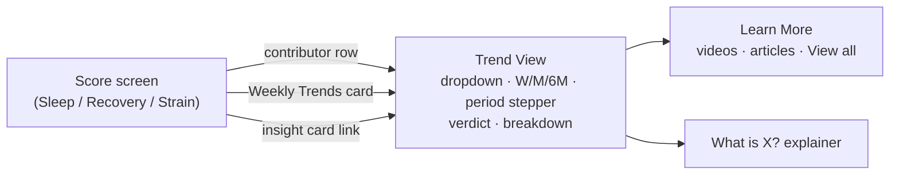

# WHOOP UI gaps

The goal is to clone the WHOOP app UI. These files list every gap between Pulse and WHOOP, area by area. Each file compares the real WHOOP screenshots in [`../whoop-walkthrough/`](../whoop-walkthrough/) with Pulse in demo mode on a 390 px phone and with the Pulse source. Every gap names the WHOOP screenshot it comes from and the Pulse file and line it maps to.

Severity: **missing-screen** (a whole screen or flow is absent), **missing-element** (the screen exists but lacks a card, control or row), **behaviour** (it exists but acts differently), **visual** (layout, colour, copy or chart style differs). Gaps that `docs/design/spec.md` or another doc records as deliberate are listed separately in each file and are not counted below. They are kept so the team can reverse them if a full clone needs it.

| Area | File | Missing screen | Missing element | Behaviour | Visual | Total |
| --- | --- | ---: | ---: | ---: | ---: | ---: |
| Home | [home.md](home.md) | 3 | 5 | 5 | 6 | 19 |
| Sleep | [sleep.md](sleep.md) | 3 | 11 | 2 | 5 | 21 |
| Recovery | [recovery.md](recovery.md) | 4 | 9 | 8 | 10 | 31 |
| Strain | [strain.md](strain.md) | 5 | 13 | 6 | 3 | 27 |
| Activities and Journal | [activity-and-journal.md](activity-and-journal.md) | 4 | 14 | 4 | 7 | 29 |
| Dashboard, Health, Community, Coach | [dashboard-health-community-coach.md](dashboard-health-community-coach.md) | 4 | 19 | 6 | 9 | 38 |
| **Total** | | **23** | **71** | **31** | **40** | **165** |

## What the files agree on

Pulse already matches WHOOP's main screens closely. The Home layout, the three dials, the Sleep page and the Strain page, the workout detail and the My Dashboard rows all follow WHOOP. Most of the work is in the screens around them. Several gaps repeat across areas, so building each one once closes many rows.

1. **The Trend View family.** WHOOP opens a "Trend View" from every contributor row and every Weekly Trends card. Each has a metric dropdown, a W / M / 6M switcher, a period stepper with arrows ("MAR 17 - APR 15, 26"), an average with a relative % change, a one-sentence verdict, a days or zones breakdown bar, a Learn More carousel and a "What is X?" explainer. Pulse has `/metric/[key]` and `/trends`, which cover part of this. Strain has no Trend View for HR zones, strength or Day Strain. Sleep has none for stress, time in bed or efficiency. See sleep.md, recovery.md and strain.md.
2. **Weekly Trends.** WHOOP ends the Sleep, Recovery and Strain screens with a stack of 7-day mini charts, each with a chevron to its Trend View. Pulse has no such section, or only part of it.
3. **6M as monthly summaries.** In WHOOP's 6M view, each month is a segment with its average and a coloured % change. Pulse draws daily points.
4. **Editorial content.** WHOOP has Learn More video and article cards, "View all" lists and multi-paragraph explainers. Pulse has none of these.
5. **Logging flows that need a data source.** The plus menu, Add Activity, Select Activity, Start Activity with a live map and heart rate, Strength Trainer and the sleep alarm all need data Pulse does not record today, because it reads from Google Health. They are marked "needs data source".
6. **Journal structure.** WHOOP's journal is a full-screen modal. It has a day strip, yes/no questions grouped into Daytime, Nighttime and Status, a follow-up slider, notes, a Saved screen and a searchable Select Behaviors catalogue. Pulse uses a bottom sheet of rows.
7. **Product decisions.** Community (teams, ranks, team chat), My Plan and WHOOP Live do not fit a self-hosted, single-user app as it stands. They are marked "needs product decision" rather than dropped.

## How this was made

On 2026-10-08, six agents each took one area. Each viewed every WHOOP screenshot for that area and the matching Pulse screens, which were captured from demo mode with charts fully drawn. Each then read the Pulse code and the design docs. When a WHOOP behaviour cannot be seen in a screenshot, the files mark it "(inferred)".
