# WHOOP UI gaps: My Dashboard, Health tab, Community, Coach

## 1. Summary

Pulse already matches WHOOP closely on the My Dashboard row style, the Health Monitor row, the Pace of Aging ruler, the Healthspan detail header and the floating coach button. The real gaps are these. My Dashboard has a much smaller metric catalogue, and Stress Monitor is not a dashboard tile. The editor is a sheet with a toast, where WHOOP uses a full screen with a Success screen. The Healthspan factor rows lack 6-month and 30-day markers, the "Outperforming" copy and View Trend. The coach is a full page, where WHOOP uses a bottom sheet over the current screen, and Pulse has no feedback buttons, voice, follow-up chips or workout toast. Community does not exist in Pulse, and its place is taken by Journal, so every Community item is marked "needs product decision" rather than dropped.

Gap count by severity (total 38): missing-screen 4, missing-element 19, behaviour 6, visual 9.

Sources: WHOOP screenshots `docs/research/whoop-walkthrough/{dashboard,health,community,coach}-*.png`, plus `activity-01` and `activity-05` for the AI toast. Pulse: `src/app/(app)/(home)/`, `health/`, `coach/`, `_lib/EditDashboard.tsx`, `src/lib/dashboard.ts`. I could not read WHOOP Info, Strain, Recovery or Sleep tabs of a team, the contents of the Discover More cards, or the Blood Pressure card, because none is fully visible in the screenshots. Items inferred rather than seen are marked **(inferred)**.

## 2. WHOOP navigation for this area

```mermaid
flowchart TD
  Tabs["Bottom tab bar: Home / Health / Community / More + round W coach button"]
  Tabs --> Home
  Tabs --> Health
  Tabs --> Community
  Tabs --> CoachBtn["W coach button (on every tab screen)"]

  Home --> MD["My Dashboard: rows with today value and 30-day value, Stress Monitor chart tile"]
  MD -- "CUSTOMIZE + pencil" --> Cust["Customize Dashboard (full screen, X + SAVE)"]
  Cust -- "= handle: drag" --> Cust
  Cust -- "+ on a row in ADD TO MY DASHBOARD" --> Cust
  Cust -- SAVE --> Succ["Success screen: 'Your preferences have been saved.'"]
  Succ --> MD
  Cust -- X --> MD
  MD -- "Stress Monitor tile chevron" --> StressDetail["Stress Monitor detail (not in screenshots)"]
  MD -- "tap a metric row" --> Tile["Metric trend (not in screenshots)"]
  MD --> Disc["Discover More cards (cut off)"]

  Health --> HStress["Stress Monitor card (today's high stress + sparkline)"]
  HStress --> StressDetail
  Health --> Upgrade["Upgrade to Access promo (X dismiss, EXPLORE UPGRADE OPTIONS)"]
  Health --> BP["Blood Pressure Insights, Beta (card top only visible)"]
  Health --> Orb["WHOOP Age orb + Pace of Aging ruler"]
  Orb -- "GO TO HEALTHSPAN" --> HS["WHOOP Age detail: collapsing mini orb, years younger, pace"]
  HS --> Fac["Per-factor accordions (Sleep, Strain, Fitness): 6-month and 30-day markers, Outperforming copy"]
  Fac -- "VIEW TREND" --> Tile
  Health --> Labs["Advanced Labs card, GET STARTED"]
  Health --> HM["Health Monitor: Resp, SpO2, RHR, HRV, Temp checks"]
  HM --> HMD["Health Monitor detail (not in screenshots)"]

  Community --> Build["Build Your Community: CREATE FAMILY PLAN, REFER A FRIEND"]
  Community --> Teams["Teams: MY TEAMS sorted by DAILY STRAIN RANK, ... menu"]
  Teams --> Team["Team screen: Info / Chat / Strain / Recovery / Sleep tabs"]
  Team --> Chat["Chat tab: composer SAY SOMETHING, stats, +, send"]
  Community --> Rec["RECOMMENDED TEAMS carousel, VIEW ALL"]
  Rec --> Team

  CoachBtn --> Sheet["Coach bottom sheet over the current score screen"]
  Sheet --> Reply["Greeting + suggestion chips + Ask WHOOP anything + mic or stop"]
  Sheet -- "clock icon" --> CoachHist["Chat history (inferred)"]
  Workout["Workout detail"] -- "pill 'Analyzing...'" --> Sheet
```

## 3. Gaps

Pulse refs were checked against the files on 2026-10-08.

| # | Gap | Severity | WHOOP ref | Pulse ref | Notes |
|---|---|---|---|---|---|
| 1 | Stress Monitor is a dashboard tile in WHOOP: a full-width chart card that sits inside the My Dashboard list, between Hours of Sleep and Resting Heart Rate. It is reorderable and removable, and has a small bar-chart glyph beside its handle in the editor. In Pulse it is a fixed card in the top grid and is not in the editor catalogue. | behaviour | dashboard-01, 02, 03, 08 | `src/app/(app)/(home)/page.tsx:159`, `src/lib/dashboard.ts:18` | Needs a catalogue entry whose row renders a card, not a KeyStatRow. |
| 2 | Content of the Stress tile: title "STRESS MONITOR" with chevron, "Last updated 14:41" on the left, level word "MEDIUM" (green) plus value "2.0" on the right, y axis 0.0 to 3.0 with gridlines, x ticks (02:47, 07:00, 11:00, 14:41), a moon icon over the shaded sleep band and a walking icon over the awake band, a line coloured blue to green to yellow by level, a dashed "now" line ending in a dot. Pulse's home Stress card is only a chip and a level word plus a time. | missing-element | dashboard-07, 08, 11, 12 | `src/app/(app)/(home)/page.tsx:454` | Pulse's `/health/stress` page (health-stress-01) already draws this chart: 0 to 3 axis, a "Sleep" band, level-coloured segments, a dashed now line with an orange dot. It lacks the moon and walking icons, the x ticks to now and the gradient line. Reuse it as the tile body. |
| 3 | Sleep Consistency (80%) and Hours of Sleep (9:06) tiles missing from the catalogue. Both are in the WHOOP default set. | missing-element | dashboard-01, 02, 03 | `src/lib/dashboard.ts:18` | Pulse has the data: Healthspan contributors `sri` and `sleepHours` in `ContributorCard.tsx:15`. |
| 4 | VO2 Max, Recovery and Day Strain tiles missing. Day Strain shows "5.0" against "10.0". VO2 Max shows a grey dot for flat. | missing-element | dashboard-03, 04, 08, 09 | `src/lib/dashboard.ts:18` | Pulse has these on Home dials and the Fitness card, not as rows. |
| 5 | HR Zones 1-3 (Weekly), HR Zones 4-5 (Weekly), HR Zones All (Weekly) and Strength Activity Time tiles missing. Values are h:mm (2:09 vs 2:22, 0:14 vs 0:05, 3:05 vs 2:40). | missing-element | dashboard-04, 05, 08, 09 | `src/lib/dashboard.ts:18` | Pulse has weekly zone and strength minutes in Healthspan (`ContributorCard.tsx:24`). The "(weekly)" label means the row compares a weekly total, **(inferred)** against the previous week. |
| 6 | Restorative Sleep (%), Restorative Sleep (hours) and Sleep Debt tiles missing. | missing-element | dashboard-04 | `src/lib/dashboard.ts:18` | Needs a decision on what "restorative" means from Fitbit stages. Deep + REM is the obvious mapping **(inferred)**. |
| 7 | Lean Body Mass tile missing. Pulse has Weight and Body fat but no lean mass row. | missing-element | dashboard-04 | `src/lib/dashboard.ts:30` | Pulse leaves lean mass out of Pulse Age when there is no weight and body fat (`health-healthspan-04`). A derived row is possible. |
| 8 | Default tile set and order. WHOOP: HRV, Sleep Performance, Sleep Consistency, Hours of Sleep, Stress Monitor, Resting Heart Rate, VO2 Max, Steps. Pulse: HRV, RHR, Respiratory rate, Sleep performance, Calories, Steps, Blood oxygen, Skin temperature. | behaviour | dashboard-03 | `src/lib/dashboard.ts:18`, `src/lib/dashboard.ts:52` | Changing the default affects installs that never saved a list (stored as no rows). Decide whether existing users should move. |
| 9 | Section header. WHOOP shows the words "CUSTOMIZE" in caps followed by a pencil, on the right of "My Dashboard". Pulse shows only the pencil, with the aside "vs. 30-day average". | visual | dashboard-01, 02 | `src/app/(app)/(home)/page.tsx:256` | `dashboard-customisation.md` recorded the pencil alone; the screenshots show both. The "vs. 30-day average" aside is a Pulse addition and WHOOP shows none. |
| 10 | Row value format. WHOOP shows the number and its trend glyph with no unit ("43", "92%", "9:06", "59", "5,185") and the 30-day value below in muted white. Pulse adds units ("42 ms", "58 bpm", "1,200 kcal"). Row label tracking and weight look the same. | visual | dashboard-01, 07, 08 | `src/app/(app)/(home)/page.tsx:266` | Optional. Units help Pulse's extra metrics, which WHOOP does not have. |
| 11 | Editor presentation. WHOOP: full screen, X top-left, centred "CUSTOMIZE DASHBOARD", "My Dashboard" subheading, rows with a two-line "=" drag handle at the right, no subtitle. Pulse: a bottom sheet titled "My Dashboard" with the subtitle "Choose the metrics on Home and their order." and up/down arrows. | visual | dashboard-03, 05 | `src/app/(app)/_lib/EditDashboard.tsx:100` | Handles and arrows are **intentional per dashboard-customisation.md G6**. The sheet versus full screen has no doc entry. |
| 12 | Save control. WHOOP: one pinned outline pill, blue text "SAVE" and blue ring, fading list behind it. Pulse: a filled green "Save dashboard" pill and an outline "Reset to default". | visual | dashboard-03, 04, 05 | `src/app/(app)/_lib/EditDashboard.tsx:109`, `:112` | Reset to default is a Pulse addition. |
| 13 | Success screen. After SAVE WHOOP shows a dedicated full-screen state (green ring with check, "SUCCESS", "Your preferences have been saved.") and then returns to Home. Pulse closes the sheet and shows the toast "Dashboard saved". | missing-screen | dashboard-06 | `src/app/(app)/_lib/EditDashboard.tsx:86` | How long the screen stays before returning to Home is not visible. |
| 14 | Discover More. WHOOP has a "Discover More" heading under My Dashboard with promo cards, mostly hidden; one reads like Advanced Labs and a second mentions "data" **(inferred)**. Pulse ends the dashboard with the Strain & recovery chart and the "Your week in review" banner. | missing-element | dashboard-09 | none | Needs product decision. The cards are marketing for WHOOP features. Pulse could use the slot for its own tips or the reports. |
| 15 | Health tab order. WHOOP: Stress Monitor first (health-01), the orb and Pace of Aging next, then Advanced Labs, then Health Monitor (health-04). Pulse: Healthspan, Health Monitor, Stress Monitor, Fitness, Heart rate. health-01 and health-02 both start under the title, so the order may vary by scroll or layout state **(inferred)**. | visual | health-01, 02, 04 | `src/app/(app)/health/page.tsx:234` | Pulse's extra Fitness and Heart rate cards have no WHOOP counterpart here. |
| 16 | Orb presentation. WHOOP's orb (about 260 px) has no card around it, no card title or chevron, and the large label "WHOOP AGE" with green "4.1 years younger" in the orb. Pulse puts a 200 px orb inside a "Healthspan" card with a chevron and an info icon. | visual | health-02 | `src/app/(app)/health/page.tsx:234`, `:48` | Orb colour, particles and the "Pulse Age" name are **intentional per orb.md and spec §11 V5**. Only the framing and size differ. |
| 17 | "GO TO HEALTHSPAN" button. Inside the Pace of Aging card WHOOP has a full-width dark button. In Pulse the whole Healthspan card is the link, and there is no labelled button. | missing-element | health-02, 04 | `src/app/(app)/health/page.tsx:234` | Pace of Aging is a card of its own in WHOOP (orb above, card below). Pulse's pace sits inside the orb card with "Updated weekly". |
| 18 | Stress Monitor card sparkline. WHOOP draws the line in a blue-to-green-to-yellow gradient with a white end dot and a dashed vertical now line, and the chip is green "vs. typical Wed" with a down triangle. Pulse's line is one blue with an orange end dot. Labels and value layout match. | visual | health-01 | `src/app/(app)/health/page.tsx:163` | Colour mapping by stress level is in `StressChart`. |
| 19 | "Upgrade to Access" promo: WHOOP LIFE hero image, copy "The most powerful WHOOP ever, medical-grade health and performance insights.", a pastel gradient button "EXPLORE UPGRADE OPTIONS", an X to dismiss. | missing-element | health-01 | none | Needs product decision. It is a commercial upsell with no Pulse equivalent. Spec §10 excludes shop and referral and says do not adopt features Pulse has no data for (`docs/design/spec.md:2717`). Recommend skipping. |
| 20 | "Blood Pressure Insights" card (Beta) just below the promo. Only the top is visible. | missing-element | health-01 | none | Needs product decision. Pulse has no blood pressure source. Contents **(inferred)**. |
| 21 | Healthspan factor rows. WHOOP rows expand in place: a caret toggles each factor (Hours of Sleep shows a "^"), and the section keeps its context. Pulse rows open a bottom sheet through `?contributor=`. | behaviour | health-03 | `src/app/(app)/health/healthspan/ContributorCard.tsx:84`, `:74` | Pulse's sheet holds value, target, years line, explanation and source. |
| 22 | Two markers on each factor bar. WHOOP marks the 6-month average above the bar (white filled triangle, value "7:21 h") and the 30-day average below it (grey triangle, "7:40 h", "78% 30 Day avg."). The Strain section header carries the key "▼ 6 Month avg." and "▲ 30 Day avg." Pulse marks the current value and a "Target" for age. | missing-element | health-03 | `src/app/(app)/health/healthspan/ContributorCard.tsx:61` | Needs product decision. The comparison basis differs: WHOOP compares to the user's own 6-month baseline, Pulse to a target. `docs/research/stress-healthspan.md` should be checked before changing the model. |
| 23 | Bar styling. WHOOP's bar is a row of about 10 segments, orange on the left to green on the right, with the 6-month segment lit grey and end labels ("40%", "100%", "5h", "8h"). Pulse draws a continuous orange-to-green gradient with ticks. The years value sits right: green "-1.1" with "years" below. Pulse shows "-0.2 years" inline. | visual | health-03 | `src/app/(app)/health/healthspan/ContributorCard.tsx:61` | |
| 24 | "Outperforming" explanation under each factor: a heading and "You're significantly boosting your long-term health with your daily Sleep Consistency. Keep it up to maintain the lasting benefits." The heading likely changes with the user's state **(inferred)**. Pulse has a generic explanation in the sheet, no per-state copy. | missing-element | health-03 | `src/app/(app)/health/healthspan/ContributorCard.tsx:99` | |
| 25 | "VIEW TREND →" blue link under each factor, going to that factor's trend. Pulse's sheet has no link to the metric trend (the row's chevron opens the sheet, not the trend). | missing-element | health-03 | `src/app/(app)/health/healthspan/ContributorCard.tsx:74` | |
| 26 | Community tab. WHOOP's third tab; Pulse puts Journal there. | missing-screen | community-01, 02 | `docs/design/spec.md:469` | Needs product decision (spec §11 V5: "Pulse has no community"). |
| 27 | Teams list: "Teams" heading with a "..." menu; "MY TEAMS" with a sort dropdown "DAILY STRAIN RANK" and rows (round avatar, name, rank "2nd of 2" with "of 2" muted). | missing-screen | community-01, 02 | none | Needs product decision. A single-user install has no peers. If one server hosts several accounts (Pulse has accounts and an admin panel), teams could be local to the server. |
| 28 | Recommended Teams carousel (photo cards with a round icon, name, member count) and "VIEW ALL →". | missing-element | community-01, 02 | none | Needs product decision. Public discovery cannot work on a self-hosted install. |
| 29 | Team screen. Back button, name, "..." menu, a photo header, tabs INFO / CHAT / STRAIN / RECOVERY / SLEEP. Chat tab: WHOOP-glyph empty state "NO MESSAGES YET. BE THE FIRST!", composer "SAY SOMETHING" with the user's avatar, and under it a bar-chart icon (share stats **(inferred)**), "+" and a send arrow. Info, Strain, Recovery and Sleep tab content is not in the screenshots. | missing-screen | community-03 | none | Needs product decision. |
| 30 | Build Your Community: "CREATE FAMILY PLAN" (iridescent card, "Save big with 2-6 members on one bill") and "REFER A FRIEND" (outline card, "Get 1 month credit for each friend you refer"). | missing-element | community-01 | none | Needs product decision, leaning skip: these are billing items. Referral is **intentional per spec §10** (`docs/design/spec.md:2717`). |
| 31 | Coach presentation. WHOOP opens it as a translucent bottom sheet over the current score screen (Sleep Performance 92% stays visible behind it) with a grabber. The coach seems aware of the screen it was opened from **(inferred)** because the greeting is about last night's sleep. Pulse's coach is a full `/coach` page. | behaviour | coach-01, 02 | `src/app/(app)/coach/page.tsx:52`, `src/components/shells/AppNav.tsx:221` | Full page is **intentional per spec §7.21** (chat-app pattern, "never a sheet"). Passing the screen as context is a separate, optional gap. |
| 32 | Sheet header: a "W" glyph in a ring, a pill "Beta v5.3", and a clock (history) icon on the right. Pulse has a title "Coach", a Chats link with a count and a New chat button. | missing-element | coach-01, 02 | `src/app/(app)/coach/Coach.tsx:253` | The pill is a version and beta tag. |
| 33 | Composer. WHOOP: a square "+" button on the left, a glass field with an indigo rim and the placeholder "Ask WHOOP anything", then a stop square while generating or a microphone when idle. Pulse: placeholder "Message Coach", a send arrow, and a stop button. No "+", no voice. | missing-element | coach-01, 02 | `src/app/(app)/coach/Coach.tsx:485` | What "+" does is not shown **(inferred: attach or new chat)**. |
| 34 | Opening message. WHOOP's coach speaks first with a personal note based on last night's sleep and an earlier conversation, ending in a question ("How are you leaning right now on the rest day vs. training decision?"). Pulse waits for the user. Its empty state is "What would you like to know?" plus chips, and the brief runs only on tap or push. | behaviour | coach-02 | `src/app/(app)/coach/Coach.tsx:399`, `src/core/algorithms/coachSuggestions.ts:15` | Pulse's Morning brief push (spec §7.21) is the nearest equivalent. |
| 35 | Reply actions: a clipboard icon, thumbs up and thumbs down under the answer. Pulse has copy only. | missing-element | coach-02 | `src/app/(app)/coach/Coach.tsx:143` | Feedback needs a storage decision. Clipboard icon here may be copy **(inferred)**. |
| 36 | Suggestion chips. WHOOP: white pills in one horizontal, scrolling row above the composer, written as the user's answers ("I plan to rest today", "I want to train lightly", "Suggest ..."). Pulse: a vertical list of icon cards phrased as questions, on the empty state only. No follow-up chips after a reply. | behaviour | coach-02 | `src/app/(app)/coach/Coach.tsx:408` | |
| 37 | AI toast on workout screens. A glass pill with the W glyph reading "Analyzing…" sits at the bottom right on the weightlifting detail; on the running detail the same pill is empty and wide **(inferred: expanding or collapsing)**. Pulse activity screens have no coach hint. | missing-element | activity-01, activity-05 | none | Nothing under `src/app/(app)/activity` uses the coach. Needs coach access, so the pill should only show then. |
| 38 | Coach sheet look. The sheet is translucent with a purple-blue gradient at the top, so the screen behind it shows through. Pulse's page is opaque, with a glass composer. | visual | coach-01 | `src/app/(app)/coach/Coach.tsx:485` | |

## 3a. Status, activities-and-journal phase (2026-10-08)

Build steps are listed in [activity-and-journal.md §3a](activity-and-journal.md). "Hidden" means the component is built but off in `src/lib/features.ts` until Pulse has a data source. "Out of scope" means the owner excluded it. Pulse is self-hosted and single-user, so every Community row is "Out of scope (no community)" and none of it is built, hidden or not. Decisions are recorded in `docs/design/spec.md` §11 from R36 onwards.

| # | Plan | Status |
|---|---|---|
| 1 | Stress Monitor as a dashboard tile | Done (R24, Home phase) |
| 2 | Step 7: tile body: moon and walking icons, ticks to now, line toned by level | Done (R41) |
| 3 | Step 7: Sleep Consistency and Hours of Sleep rows | Done (R41) |
| 4 | Step 7: VO2 Max, Recovery and Day Strain rows | Done (R41) |
| 5 | Step 7: HR Zones 1-3, 4-5 and All (weekly) and Strength Activity Time rows | Done (R41) |
| 6 | Step 7: Restorative Sleep (%), Restorative Sleep (hours) and Sleep Debt rows | Done (R41) |
| 7 | Step 7: Lean Body Mass row (weight × (1 − body fat)) | Done (R41) |
| 8 | Step 7: the reference default set and order (phone default unchanged) | Done (R41) |
| 9 | "CUSTOMIZE" with a pencil, no aside | Done (R23, Home phase) |
| 10 | Step 7: values without units (the accessible name keeps them) | Done (R41) |
| 11 | Steps 1 and 7: full-screen editor with drag handles that also move by keyboard | Done (R41) |
| 12 | Step 7: one outline SAVE; Reset to default goes | Done (R41) |
| 13 | Steps 1 and 7: SUCCESS screen (`DoneScreen`) | Done (R41) |
| 14 | Discover More promo cards | Out of scope (promotions) |
| 15 | Step 8: Stress Monitor first, then the orb, Pace of Aging and Health Monitor | Done (R42) |
| 16 | Step 8: orb without a card | Done (R42) |
| 17 | Step 8: Pace of Aging card with GO TO HEALTHSPAN | Done (R42) |
| 18 | Step 8: sparkline toned by level, white end dot | Done (R41) |
| 19 | "Upgrade to Access" promo | Out of scope (nothing to sell) |
| 20 | Step 8: Blood Pressure Insights, behind a flag (no source) | Hidden (R42, `FEATURES.bloodPressure`) |
| 21 | Step 9: factor rows expand in place | Done (R43) |
| 22 | Step 9: 6-month and 30-day markers; the age target moves into the row's text | Done (R43) |
| 23 | Step 9: segmented bar with end labels, years on the right | Done (R43) |
| 24 | Step 9: per-state copy ("Outperforming") | Done (R43) |
| 25 | Step 9: VIEW TREND to the factor's Trend View | Done (R43) |
| 26 | Community tab | Out of scope (no community) |
| 27 | Teams list | Out of scope (no community) |
| 28 | Recommended Teams | Out of scope (no community) |
| 29 | Team screen and chat | Out of scope (no community) |
| 30 | Build Your Community | Out of scope (no community) |
| 31 | Coach as a bottom sheet | No change: the owner kept the full page (R36) |
| 32 | Step 10: header with the ring glyph, version pill and history icon | Done (R44) |
| 33 | Step 10: "+" and the reference composer; the microphone behind a flag | Done (R44); the microphone is hidden (`FEATURES.coachVoice`) |
| 34 | Step 10: the coach speaks first | Done (R44) |
| 35 | Step 10: copy as a clipboard icon; thumbs up and down behind a flag | Done (R44); thumbs are hidden (`FEATURES.coachFeedback`) |
| 36 | Step 10: one scrolling row of reply chips, follow-ups after a reply | Done (R44) |
| 37 | Step 10: "Analyzing…" pill on workouts (with activity gap 12) | Done (R44) |
| 38 | Translucent sheet look | No change: the owner kept the full page (R36) |

## 4. Already matches (do not redo)

- My Dashboard row style: caps label with icon, today's value large, the 30-day value below in muted text, orange down, green up and grey dot arrows, one card per row (`KeyStatRow variant="card"`, `src/app/(app)/(home)/page.tsx:266`).
- Customize flow shape: two lists (shown, then "Add to My Dashboard" with a plus on each row), Save, adding moves a metric into the shown list at the end (`EditDashboard.tsx`).
- Health Monitor card: five columns (Resp, SpO2, RHR, HRV, Temp), icon, label and check, chevron into the detail (`health/page.tsx:97`). The "n/5 within range" strip is a Pulse extra.
- Stress Monitor card on Health: "Today's high stress", hours value, "vs. typical <weekday>" chip, sparkline (layout; see gap 18 for colour).
- Pace of Aging: -1.0x to 3.0x ruler, value above the marker, "Slow" and "Fast" ends, "Slower or Faster vs. last week" chip.
- Healthspan detail header: back, info, a collapsing mini orb flanked by "years younger or older" and "Pace of aging" (`health/healthspan/page.tsx:60`), and the Sleep, Strain and Fitness groups with the same factors (sleep hours, consistency, HR zones 1-3 and 4-5, strength, steps, VO2 max, resting HR, lean mass).
- Floating coach button: a round indigo-rimmed glass button with the monogram, bottom right beside the tab bar (`AppNav.tsx:221`).
- Coach copy-answer action, Stop while streaming, saved chat history.

### Intentional differences (per docs)

- Reorder with Move up and Move down buttons, a visible Remove button, a grouped catalogue and search in the add list, "No data yet" labels: `docs/research/dashboard-customisation.md` G4 to G7.
- Orb colours, particles, motion and the name "Pulse Age": `docs/design/orb.md`.
- No Community tab, Journal in its place, no referral, shop, Advanced Labs or band battery: `docs/design/spec.md:469`, `:2717`, §11 V5. Advanced Labs card on Health is therefore skipped on purpose.
- The coach is its own full page, opt-in with consent and the user's own provider key, hidden when not enabled; the round button opens Check in when the coach is off: spec §7.21, §11 V6, I3.
- "Your week in review" banner and the Strain & recovery chart on the dashboard are Pulse additions.
