# WHOOP vs Pulse: Home screen gap analysis

Scope: the Home tab on a phone (header and date switcher, three dials, Health/Stress monitor cards, My Day, Daily Outlook, Today's Activities, plus menu, Tonight's Sleep, My Journal, My Plan, past-day view, collapsing header, tab bar, floating coach button).

Sources: `docs/research/whoop-walkthrough/home-01..17`, `dashboard-02` and `dashboard-08` (only for what follows My Plan), Pulse demo tiles at 390 px, and `src/app/(app)/(home)/page.tsx` plus the shells it uses. Intentional differences come from `docs/design/spec.md` (§4.3, §7.1, §10, §11, §12) and `docs/research/dashboard-customisation.md`.

## 1. Summary

Pulse's Home is already a close structural clone: header, dials, monitor cards, My Day, activity rows, journal week card, Tonight's Sleep, My Dashboard rows, glass tab bar and round floating button all exist and follow the WHOOP layout. The remaining gaps are (a) everything that depends on WHOOP-only features: the plus menu, Start Activity, Strength Trainer, WHOOP Live, My Plan and the sleep alarm, (b) a few places where Pulse added cards WHOOP's current Home does not show (insight card, health alert, Energy Bank) and ordered cards differently, and (c) small visual mismatches (plus button colour, monitor card copy and title wrapping, tab icons). Many of the first group are recorded as deliberate in the spec; they are listed anyway because the goal is a full clone, and each is marked with its spec status.

Gaps by severity (19 total): missing-screen 3, missing-element 5, behaviour 5, visual 6.

## 2. WHOOP navigation for Home (from the screenshots)

Arrows marked "(inferred)" are not shown in any screenshot; the destination is a guess from the label.

```mermaid
flowchart TD
    H["Home (scrolling page)"]
    H --> HDR["Header: avatar, streak 44, date pill, band battery"]
    HDR -->|"tap ‹ / ›"| PD["Past-day Home (home-03, 04, 05, 07)"]
    HDR -->|"tap pill (inferred: calendar)"| CAL["Calendar"]
    HDR -->|"tap avatar (inferred)"| PROF["Profile / More"]
    H --> DIALS["Dials: Sleep, Recovery, Strain"]
    DIALS -->|"tap dial or label chevron"| DET["Sleep / Recovery / Strain detail"]
    H --> HM["Health Monitor card"] --> HMS["Health Monitor screen"]
    H --> SM["Stress Monitor card"] --> SMS["Stress Monitor screen"]
    H --> MD["My Day"]
    MD -->|"+ tile"| PLUS["Plus menu (home-08): + becomes X"]
    PLUS --> P1["Start Activity"]
    PLUS --> P2["Add Activity"]
    PLUS --> P3["Strength Trainer"]
    PLUS --> P4["Complete your Journal"]
    PLUS --> P5["Create WHOOP Live"]
    MD --> OUT["Your Daily Outlook banner (today only)"]
    MD --> ACT["Today's Activities card"]
    ACT -->|"expand icon"| ACTL["Activities list"]
    ACT -->|"row"| ACTD["Activity or sleep detail"]
    ACT -->|"Add Activity"| ADD["Add activity form"]
    ACT -->|"Start Activity (today only)"| START["Start activity: type picker, live map"]
    MD --> TS["Tonight's Sleep card (today only)"]
    TS -->|"chevron"| SLP["Sleep planner (inferred)"]
    TS -->|"Edit Alarm"| ALM["Alarm editor (inferred)"]
    MD --> JRN["My Journal card: 7 day check marks"]
    JRN -->|"chevron"| JS["Journal"]
    JRN -->|"Behavior Insights"| JI["Journal insights"]
    H --> PLAN["My Plan: Custom Plan, expand chevron"]
    H --> DASH["My Dashboard"]
    DASH -->|"Customize pencil"| EDIT["Dashboard editor"]
    DASH -->|"metric row"| MET["Metric detail"]
    H --> TAB["Tab bar: Home, Health, Community, More"]
    H --> COACH["Round W button"] --> CS["Coach sheet / chat"]
```

Header behaviour: scrolling down shrinks the three dials into a ring row pinned under the top row (home-04, 06, 07 show the mid-collapse frames). The avatar/pill row fades while scrolling down and returns on scroll up (home-14, 15). Past days drop the streak, the Daily Outlook, the monitor cards and Tonight's Sleep, and rename the card "Activities" (home-03).

## 3. Gaps

Pulse refs were checked against the current files. "none" means no code exists.

| # | Gap | Severity | WHOOP ref | Pulse ref | Notes |
|---|---|---|---|---|---|
| 1 | The white "+" beside "My Day" opens a five-item popover (START ACTIVITY, ADD ACTIVITY, STRENGTH TRAINER, COMPLETE YOUR JOURNAL, CREATE WHOOP LIVE), each with an outline icon and uppercase label, on a dark blue-violet rounded panel anchored under the button. The button turns into an "X" while open. Pulse's "+" goes straight to the check-in sheet. | missing-element | home-08-plus-menu.png | `src/app/(app)/(home)/page.tsx:175` | Pulse can offer Add Activity (info card), Complete your Journal (check-in sheet) and, if built, Start Activity. Spec §7.1 row 7 defines "+" as the check-in trigger, so this is a deliberate simplification. |
| 2 | "START ACTIVITY" button (stopwatch icon) sits beside "ADD ACTIVITY" in a two-column footer on Today's Activities. Pulse has only a single full-width "Add activity" button. | missing-element | home-01-today-overview.png, home-02-my-day.png, home-06-header-collapse.png | `src/app/(app)/(home)/page.tsx:209` | Spec R2 / §7.1 7b: Pulse imports workouts from Fitbit and cannot record live. Not adopted by design. |
| 3 | Start Activity flow: type picker, then a live map screen (seen in the activity walkthrough, not on Home itself). | missing-screen | home-01-today-overview.png (entry point only) | none | Same reason as #2. Detail belongs to the activities area. |
| 4 | Strength Trainer entry (weightlifting logging) in the plus menu. | missing-screen | home-08-plus-menu.png | none | The screen itself is not in the Home screenshots, so its content is unknown. No Pulse equivalent. |
| 5 | "Create WHOOP Live" (camera icon) in the plus menu. | missing-screen | home-08-plus-menu.png | none | Social/sharing feature; spec §10 excludes community-type features. Likely intentional. Destination not shown. |
| 6 | My Plan section: title "My Plan", one collapsible card "CUSTOM PLAN" with a down chevron, "5 days left" caption, and a green progress bar labelled "45% ACCOMPLISHED". Sits between My Journal and My Dashboard. | missing-element | home-11-my-plan.png, home-12-my-plan-and-dashboard.png, home-13-my-plan-and-dashboard.png, home-14-my-plan-and-dashboard.png, home-17-journal-plan-dashboard.png | none (section titles listed in spec §4.7 but not built) | Spec §11 ("Plan ... My Plan is out of scope") and `docs/research/dashboard-customisation.md` mark it intentional. What the expanded card shows is not visible in any screenshot. |
| 7 | Tonight's Sleep shows an alarm: right block reads "08:45" with a green dot and "ALARM ON / EXACT TIME", and a full-width "EDIT ALARM" button (pencil icon) closes the card. The left block is "00:34 RECOMMENDED BEDTIME" with a sunrise icon. Pulse's right block is "Typical wake" with an alarm icon and no alarm or edit button, and it adds a Peak / Perform / Get by toggle plus a "Need tonight" line that WHOOP's card lacks. | missing-element | home-09-tonights-sleep.png, home-10-journal-card.png, home-16-activities-and-tonights-sleep.png | `src/app/(app)/(home)/page.tsx:223`, `src/app/(app)/_lib/TonightPlan.tsx:32` | Pulse cannot set a Fitbit alarm (inferred; `how-it-works/content.ts` says the planner cannot see alarms). The card chevron already links to the planner. |
| 8 | Tonight's Sleep shows only on today in WHOOP; Pulse shows it on past days as well (the card is not gated on `isToday`). WHOOP's past-day screens (home-03, home-05) stop at My Journal with no Tonight's Sleep. | behaviour | home-03-past-day-activities.png, home-04-past-day-header-collapse.png, home-05-past-day-journal.png | `src/app/(app)/(home)/page.tsx:221` | Inferred from absence in the past-day captures; the capture ends at the journal card, so it could continue below. |
| 9 | "ADD ACTIVITY" appears on past days too (full-width button under the activity rows, "+ ADD ACTIVITY"). Pulse shows it for today only. | behaviour | home-03-past-day-activities.png, home-07-past-day-activities.png | `src/app/(app)/(home)/page.tsx:209` | Pulse hides it because activities cannot be added (R2). If the button is adopted, it should show on past days with the same info card. |
| 10 | Pulse adds cards that WHOOP's Home does not show between the dials and the monitor cards: the insight card ("Keep strain light" with a counter chip) and the red/amber Health Monitor alert. WHOOP goes dials, monitors, My Day. | behaviour | home-01-today-overview.png | `src/app/(app)/(home)/page.tsx:148`, `src/app/(app)/(home)/page.tsx:153` | Spec §7.1 rows 4-5 cite older captures. Not visible in any current screenshot, so WHOOP may only show them in some states (inferred). Both push My Day about 300 px lower. |
| 11 | Card order inside My Day differs. WHOOP: Daily Outlook, Today's Activities, Tonight's Sleep, My Journal. Pulse: Daily Outlook, Activities, My Journal, Energy Bank, Tonight's Sleep. | behaviour | home-09-tonights-sleep.png, home-15-tonights-sleep-and-journal.png, home-16-activities-and-tonights-sleep.png | `src/app/(app)/(home)/page.tsx:217`, `src/app/(app)/(home)/page.tsx:220` | Energy Bank is a Pulse-only card, kept on purpose (spec §7.1 7d). Swapping Journal and Tonight's Sleep is a one-line reorder. Laptop layout pairs Energy Bank with Tonight's Sleep, so reorder carefully. |
| 12 | Scroll-linked header collapse. WHOOP's three dials shrink continuously into the ring row as you scroll (home-04, 06, 07 show intermediate sizes, value digits shrinking, labels sliding beside the rings). Pulse cross-fades the dials and a separate mini-ring row over 220 ms. | behaviour | home-04-past-day-header-collapse.png, home-06-header-collapse.png, home-07-past-day-activities.png | `src/components/shells/HomeHeader.tsx:206` | Documented as a known deviation: spec §4.3 "State" bullets and `docs/design/sticky.md` A2/B5 (no per-frame scroll handler). Reported because it is the most visible motion difference. |
| 13 | Plus button colour. WHOOP's "+" is a white tile with dark glyph (white-to-light-grey fill, about 34 pt). Pulse's is the brand green gradient (`from-primary`, primary is `#00f19f`) with a dark glyph. | visual | home-01-today-overview.png, home-08-plus-menu.png | `src/app/(app)/(home)/page.tsx:179` | Spec §5 (button `default` variant, line 789) and §7.1 row 7 both say the tile is white, so the code disagrees with the spec. |
| 14 | Health Monitor card copy and size. WHOOP: "HEALTH MONITOR >" on one line, green check chip, "WITHIN RANGE" over "5/5 Metrics". Pulse: title wraps to two lines at 390 px ("HEALTH / MONITOR") and the sub-line reads "4/5 within range", so the card is taller than its Stress neighbour. | visual | home-01-today-overview.png, home-06-header-collapse.png | `src/app/(app)/(home)/page.tsx:420` | Spec F7 says the title fits one line at 116 px, but the demo tile at 390 shows it wrapping (alert state, wider chip). Check the in-range state too. Stress card copy (chip "1.8", "MEDIUM", time) matches. |
| 15 | My Dashboard header shows a text label "CUSTOMIZE" with a pencil to its right. Pulse shows an icon-only pencil, and adds an "vs. 30-day average" aside the WHOOP header does not have. | visual | home-12-my-plan-and-dashboard.png, home-13-my-plan-and-dashboard.png | `src/app/(app)/(home)/page.tsx:256`, `src/app/(app)/_lib/EditDashboard.tsx:94` | Aside is needed because Pulse rows show a 30-day average; WHOOP's rows show a smaller second value without a caption. |
| 16 | Stress Monitor appears as a large My Dashboard tile with "Last updated 14:41", "MEDIUM 2.0" and a time-of-day line chart (sleep and activity icons over shaded spans, dashed "now" line, x ticks 02:47 / 07:00 / 11:00 / 14:41). Pulse's dashboard has metric rows only; stress is only a compact card at the top. | missing-element | dashboard-02-my-dashboard.png, dashboard-08-my-dashboard-new-tiles.png | `src/app/(app)/(home)/page.tsx:256` | Overlaps the dashboard-editor area; listed here because it sits in the Home scroll. A `StressChart` already exists in `src/components/charts/`. |
| 17 | Tab bar: WHOOP tabs are Home (line-chart-in-frame icon), Health (heart with pulse), Community (three people), More (three lines). Pulse uses a house icon for Home and a notebook icon for Journal in the Community slot. | visual | home-01-today-overview.png | `src/components/shells/AppNav.tsx:18` | Community to Journal is intentional (spec V5). The Home icon is a free change to a chart-in-frame glyph. |
| 18 | Date pill text. WHOOP prints "TUE., APR. 14" (abbreviated weekday and month with periods, uppercase). Pulse prints "Mon, Sep 28" style. | visual | home-03-past-day-activities.png, home-07-past-day-activities.png | `src/components/shells/DateSwitcher.tsx:112` | Spec §4.3.1 chose `EEE, MMM d`. Casing may already be uppercased by CSS; check the rendered past-day pill. |
| 19 | Daily Outlook banner: warm tan-to-slate gradient with a sun icon and a cream/gold chevron at the right. Pulse's banner uses the outlook gradient tokens with a coach-coloured (blue) chevron, and tapping opens an info dialog. WHOOP's tap target is not shown. | visual | home-01-today-overview.png, home-02-my-day.png | `src/app/(app)/(home)/page.tsx:294`, `src/app/(app)/(home)/page.tsx:304` | Check the rendered gradient against the reference; I could not see it in the demo tile because the tab bar covered it. On past days WHOOP hides the banner (home-03), Pulse shows "Your day in review" (spec R3, intentional). |

## 3a. Status after the clone pass (2026-10-08)

Decisions are in `docs/design/spec.md` §11 R20 to R27. "Hidden" means the component is built but off in `src/lib/features.ts` until Pulse has a data source.

| # | Status |
|---|---|
| 1 | Done: "+" opens the action menu and turns into an X (R20). Add activity and Complete your journal are live. |
| 2 | Hidden: the Start activity button beside Add activity (`FEATURES.startActivity`). |
| 3 | Hidden: the Start activity flow (type picker, Track route, live heart rate, Strain Target) is built behind `FEATURES.startActivity` (spec R40); recording needs a live source. |
| 4 | Hidden: the Strength trainer entry in the menu. Its screen is not built. |
| 5 | Hidden: the Share live entry in the menu. Its screen is not built. |
| 6 | Hidden: My Plan card (`_lib/MyPlan.tsx`, R26). |
| 7 | Hidden: the alarm state of Tonight's sleep (R25). |
| 8 | Done: Tonight's sleep shows on today only (R22). |
| 9 | Done: Add activity shows on past days (R21). |
| 10 | Done: the monitor cards come right after the dials (R22). |
| 11 | Done: Tonight's sleep comes before My journal (R22). |
| 12 | Already matched: `HomeHeader` morphs the dials into the ring row with the scroll on phones. This row was wrong. |
| 13 | Done: the "+" is a white key (R20). |
| 14 | Done: "N/M Metrics" sub-line, and the title fits one line from 390 px (R27). |
| 15 | Done: "CUSTOMIZE" with a pencil, no aside (R23). |
| 16 | Done: the Stress Monitor dashboard tile (R24). |
| 17 | Done: the Home tab icon is a house framing a chart (R27). |
| 18 | Done: date pill "Mon., Sep. 28" (R27). |
| 19 | Done: the outlook chevron uses the cream accent (R27). |

## 4. Intentional differences already recorded (do not redo)

- Past-day monitor cards, kept where WHOOP hides them: spec V7.
- "Your day in review" banner on past days and after 17:00: spec R3.
- Add Activity opens an explanatory info card instead of a form: spec R2.
- Band battery percentage replaced by sync age ("12m", "Demo") and the band icon dot: spec §4.3.2 and §10.
- Community tab replaced by Journal: spec V5.
- Floating button is "P" and opens the coach, else the check-in sheet: spec V6.
- Energy Bank card: spec §7.1 row 7d.
- Strain & recovery 7-day chart under My Dashboard (Pulse-only; WHOOP's dashboard rows end in tiles such as Stress Monitor): spec §7.1 row 9, R5.
- "Behaviour insights" British spelling versus WHOOP's "BEHAVIOR INSIGHTS": project copy convention.

## 5. Already matches

- Header top row: avatar, flame streak pill, `‹ TODAY ›` pill, band slot at the right; streak hidden on past days (home-03).
- Wordmark above the three dials, in order Sleep, Recovery, Strain, each with a label chevron; ring colours (steel blue, yellow/red recovery arc, blue strain with target tick).
- Health Monitor and Stress Monitor as two side-by-side cards with chip, status word and sub-line; stress chip colour tied to level.
- "My Day" title with the "+" at the right; Today's Activities card ("Activities" on past days) with expand icon, sleep row (steel-blue tile with duration) and activity rows (blue tile with strain), stacked start and end times and a vertical bar at the right.
- My Journal card: seven weekday columns ending on the selected day, green check circles, chevron to Journal, "Behaviour insights" button with bulb icon.
- My Dashboard: one card per metric, icon, uppercase label, value, second-line average and a trend arrow; section title and pencil.
- Collapsing header: ring row appears once the dials have scrolled away, avatar row hides on scroll down and returns on scroll up.
- Glass tab bar with four tabs and a separate round glass button at its right, same position and size.
- Week-in-review banner at the foot is Pulse-only and fine.
